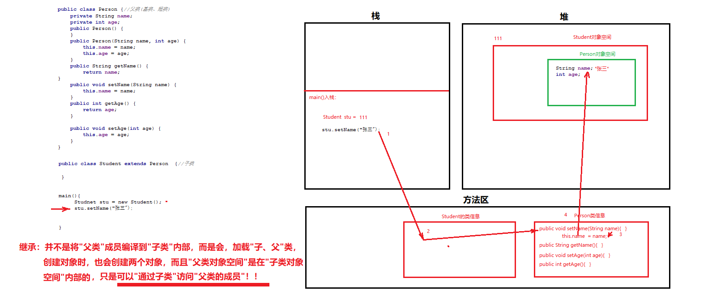
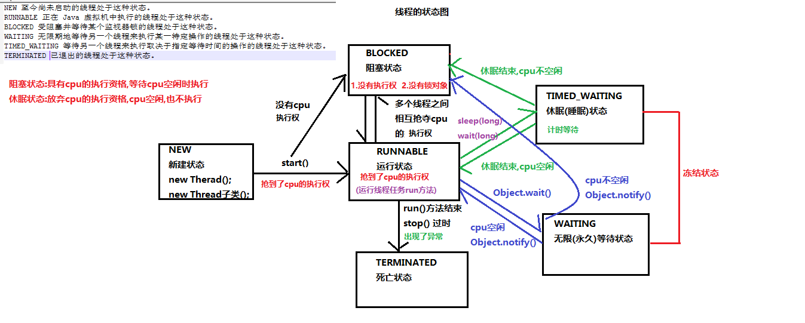
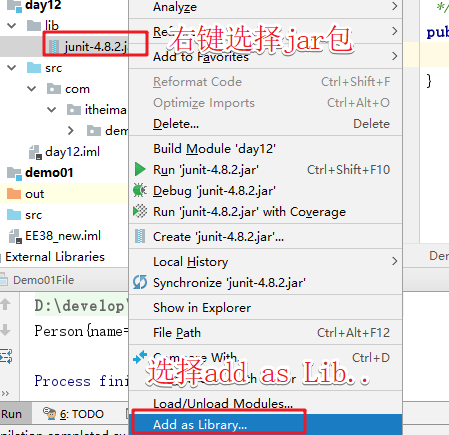
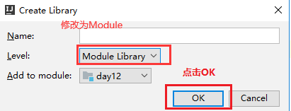

# 继承

## 子类的创建

1. 方法区：加载子类和父类信息

2. 堆：生成子类对象空间，在子类对象空间**内**生成父类对象空间，生成对象空间内存地址

3. 栈：获取子类对象的内存地址

   

## 静态代码块、代码块、构造方法、在子父类创建时的执行顺序

1. 父类静态代码块
2. 子类静态代码块
3. 父类构造代码块
4. 父类构造方法
5. 子类构造代码块
6. 子类构造方法

## 继承的特点-类

1. 单继承

2. 多级继承

3. 子类继承父类,就会自动拥有父类的成员变量和成员方法（构造方法和私有成员除外(**私有成员可以被继承，但是不能被访问**)）

4. 在子类中也可以定义子类特有的成员

## 继承的特点-成员访问

1. 子类有使用子类自己的成员

2. 子类没有使用继承自父类的成员

3. 子类父类都没有编译报错

   

## 继承的优缺点

### 继承的好处

1. 提高了代码的复用性
2. 为多态提供了前提

### 继承的弊端

1. 让子父类产生了依赖关系

## 方法重写

子类要保留父类的方法，但需要改写方法的行为，这时子类需要重写。
重写的语法：

1. 返回值类型、方法名、形参列表必须和父类相同
2. 访问权限要跟父类方法相同或更宽。

方法重写:发生在两个类之间,子类出现了和父类一模一样的方法,叫方法重写,也叫Override
方法重载:发生在一个类中,出现了方法名相同,但是参数列表不同的方法,叫方法重载,也叫Overload


## this关键字和super关键字

1. this可以解决的问题
   	1).当局部变量覆盖成员变量时，要访问成员变量，需要用"this.成员变量"访问！
      	2).在一个构造方法中调用另一个构造方法时，必须用"this([实参])"调用！
      	   **必须写在此构造方法的第一行代码！**
2. super可以解决的问题
   	1).当本类成员变量覆盖父类的成员变量，要访问父类的成员变量时，需要用"super.父类成员变量"访问！
      	2).在子类的构造方法中，调用父类构造方法，必须用"super([实参])"调用！


# 抽象

## 抽象的概念

## **abstract 不能和final、private**、static关键字一起连用

### 	抽象类

1. 根据子类共性抽取形成，可以包含**成员属性，构造方法，成员方法，抽象方法**
2. 包含了抽象方法的类必须被定义为抽象类
3. **子类继承抽象类，必须重写父类所有抽象方法，否则子类也必须是抽象类**
4. 抽象类无法直接创建对象使用
           a.抽象类一般都包含抽象方法,抽象方法没有方法体,创建对象,调用方法没有意义
           b.有些类就是不想让别人创建对象使用,也可以定义为抽象类(抽象类可以不包含抽象方法)

### 	抽象方法

​		抽取方法声明,没有方法体，添加abstract关键字修饰

## 抽象类的作用

1. 做父类，代码复用
2. 对子类形成限制，要求子类必须重写所有抽象方法

## 抽象类和抽象方法的定义

1. 抽象类：

   ```java
   public abstract class Human {
       //1.成员属性
       //2.构造方法
       //3.普通成员方法
       //4.抽象方法(没有方法体的方法)
      
   }
   ```

   **作用：不能被创建对象，只能做父类，代码复用！！**

2. 抽象方法的定义：

   ```java
   public abstract 返回值类型 | void work([形参]);//可以有参、有返回值，就是不能有“方法体”
   ```

​		 **作用：被子类继承，并且要求子类必须重写的——对子类形成限制！**

## 抽象类的特征

​	有得：抽象类得到了拥有抽象方法的能力。

​	有失：抽象类失去了创建对象的能力。

## 抽象类存在的意义

​	抽象类存在的意义是为了被子类继承，否则抽象类将毫无意义.

​	抽象方法,就是为了让子类重写,规定公司中所有的人必须的工作,必须的重写工作的方法

## 注意事项

关于抽象类的使用，以下为语法上要注意的细节，虽然条目较多，但若理解了抽象的本质，无需死记硬背。

1. 抽象类**不能创建对象**，如果创建，编译无法通过而报错。只能创建其非抽象子类的对象。

   > 理解：假设创建了抽象类的对象，调用抽象的方法，而抽象方法没有具体的方法体，没有意义。

2. 抽象类中，可以有构造方法，是供子类创建对象时，初始化父类成员使用的。

   > 理解：子类的构造方法中，有默认的super()，需要访问父类构造方法。

3. 抽象类中，不一定包含抽象方法，但是有抽象方法的类必定是抽象类。

   > 理解：未包含抽象方法的抽象类，目的就是不想让调用者创建该类对象，通常用于某些特殊的类结构设计。

   ```java
   //不包含抽象的方法的抽象类,仅仅是不想让别人创建对象使用
   public abstract class Person {
   }
   ```

4. 抽象类的子类，必须重写抽象父类中**所有的**抽象方法，否则，编译无法通过而报错。除非该子类也是抽象类。 

   > 理解：假设不重写所有抽象方法，则类中可能包含抽象方法。那么创建对象后，调用抽象的方法，没有意义。

# final关键字

类：表示此类不能被继承
方法：此方法只能被子类继承，但不能被重写
变量：表示"常量"
	基本类型：表示其"值"不能被改变
	引用类型：表示其"引用"不能被改变


# static

```java
/*
static是静态修饰符，一般修饰成员。被static修饰的成员属于类，不属于单个这个类的某个对象。 

static修饰的成员被多个对象共享。static修饰的成员属于类，但是会影响每一个对象。被static修饰的 

成员又叫类成员，不叫对象的成员。 
*/
public static void main(String[] args) {
    System.out.println(Math.PI);
    System.out.println(Math.pow(2,3));
}
```

# implements

## 接口中的成员特点

1. 变量:接口中的变量都是**常量**,有固定的修饰符 

   ```java
   public static final int AAA = 10;
   ```

2. 方法:

   1. 抽象方法(需实现类重写) 
   2. 默认方法(实现类可以选择性重写) 
   3. 静态方法(不能重写,使用接口名直接调用)
   4. 接口中没有构造方法,不能创建对象

3. 代码块

   1. 接口中，没有静态代码块

## 多实现

1. 抽象方法
   1. **多个接口中的抽象方法有重名的,不会冲突,抽象方法没有方法体**
   2. **实现类重写一次同名的抽象方法就可以了,相当于重写所有的同名抽象方法**
2. 默认方法
   1. **如果多个接口中默认方法有重复的,实现类(必须)重写这个重复的默认方法(面试)**
3. 静态方法
   1. **类和接口之间:静态方法不能继承,也不能重写**
   2. **类与类之间:静态方法可以继承,不能重写**

## 接口的多继承(重点)

## **接口和抽象类的区别是什么(必会)** 

1. 接口的方法默认是 public，所有方法在接口中不能有实现(Java 8 开始接口方法可以有默认实现），抽象类可以有非抽象的方法。 

2. 接口中的实例变量默认是 final 类型的，而抽象类中则不一定。 

3. 一个类可以实现多个接口，但最多只能实现一个抽象类。 

4. 一个类实现接口的话要实现接口的所有方法(默认方法可以选择性重写，静态方法不能重写)，而抽象类不一定。 

5. 接口不能用 new 实例化，但可以声明，但是必须引用一个实现该接口的对象 从设计层面来说，抽象是对类的抽象，是一种模板设计，接口是行为的抽象，是一种行为的规范。

   备注: 在 JDK8 中，接口也可以定义静态方法，可以直接用接口名调用。实现类和实现是不可以调用的。如果同时实现两个接口，接口中定义了一样的默认方法，必须重写，不然会报错。

6. 接口中没有构造方法，抽象类中有构造方法，但是不能创建对象，是给子类调用的

# 多态

##     概念:

1. 父类的变量指向子类的对象
2. 接口的变量执向实现类对象

##     特点:

​        1.多态调用的是子类重写的方法,如果没有方法重写,多态没有意义
​        2.多态执向哪个子类对象,就调用哪个子类对象重写后的方法

## 多态中成员的特点

​	Fu f = new Zi();
​	System.out.println(f.a);//55 **变量使用父类的**
​	f.show();//**Zi类重写父类的show方法**

## 多态的好处和弊端:

###     好处:扩展性强

​        父类的引用变量可以赋值不同的子类对象,而调用不同子类重写后的方法

###     弊端:

​        无法使用子类特有的成员

###     工作中:

​        一般都使用父类作为方法的参数和方法的返回值类型
​        调用方法,就可以传递不同的子类对象,返回不同的子类对象

## 多态的转型(向上转型和向下转型)

###     1.向上转型:多态本身就是向上转型,把子类对象赋值给父类

​        **好处**:扩展性强,赋值不同的子类对象,调用不同子类重写后的方法
​        **弊端**:无法使用子类特有的功能
​        **格式**:
​            父类类型 变量名 = new 子类对象();
​            int a = 10;
​            double d = a;

###      2.向下转型:把多态的父类变量,强制转换为子类类型

​        **好处**:把父类类型转换为子类类型,就可以使用子类特有的功能
​        **弊端**:扩展性性差
​        **格式**:
​            子类类型 变量名 = (子类类型)父类变量名;
​            double d = 10;
​            int a = (int)d;
​        **前提**:
​            向下转型的前提必须是多态,直接创建父类对象,不能转型的

# 内部类

成员内部类:把类定义在其他类的成员位置(类中方法外)
局部内部类:把类定义在其他类的方法中
匿名内部类的作用

1. 简化代码
2. 把子类继承父类,重写父类的方法,创建子类对象合成一步完成;
3. 把实现类实现接口,重写接口中的方法,创建实现类对象合成一步完成;

# 权限修饰符

```java
private://只能在本类中使用
默认(不写)://既能在本类中使用,又能在本包的其他类中使用
protected://既能在本类中使用,又能在本包的其他类中使用,还能在不同包的子类中使用
public://本项目中的任意包,任意的类中都可以使用
//需要记住(重点):
	//1.privare使用:定义成员变量,需要私有(封装)
	//2.public使用:定义成员方法,定义构造方法,定义类
```

|                        | public | protected | default（空的） | private |
| ---------------------- | ------ | --------- | --------------- | ------- |
| 同一类中               | √      | √         | √               | √       |
| 同一包中(子类与无关类) | √      | √         | √               |         |
| 不同包的子类           | √      | √         |                 |         |
| 不同包中的无关类       | √      |           |                 |         |

# 代码块

```java
/*
代码块:被{ }包裹起来的一段代码
1.局部代码块:写在方法中的代码块
		    方法执行到这行代码就会被执行，局部代码块不影响方法的执行顺序
		    作用：
		    	可以降低变量的作用域,可以提高程序的效率
             	 如果变量只想在局部使用,使用完毕想立即销毁,就可以使用局部代码块限制变量的生命周期
2.构造代码块:写在成员位置(类中方法外)的代码块
			每次创建对象时，会被自动执行一次；而且他会在构造方法之前被执行
			作用：
				1.可以给成员变量赋值
            	 2.可以把构造方法中共性的内容放在构造代码块中,提高代码的利用率(复用性)
3.静态代码块:写在成员位置(类中方法外),被static修饰的代码块(重点)
			第一次使用这个类的时候被自动执行一次，而且本程序运行过程中，只执行这一次
             作用：初始化静态成员属性
*/
```


## 代码块执行顺序

1. 静态代码块
2. 构造代码块
3. 构造方法

# 泛型

1. 能够阐述泛型通配符的作用(?  可以接收任意的数据类型)
2. 泛型的上限限定: ? extends E ==>传递的未知类型?只能是E的子类或者本身
3. 泛型的下限限定: ? super E   ==>传递的未知类型?只能是E的父类或者本身

# Object

## toString

```java
public String toString() {
            return getClass().getName() + "@" + Integer.toHexString(hashCode());
        }
```

## equals

```java
   @Override
    public boolean equals(Object o) {
        /*
            obj==this,直接返回true,没有必要在比较,,可以提高程序的效率
         */
        if (this == o) {
            return true;
        }
         /*
            obj是null,没有必须在继续执行,直接返回false,可以提高程序的效率
         */
        //getClass() != o.getClass() 使用反射技术,判断o是否为Student类型,相当于 if(obj instanceof Student)
        if (o == null || getClass() != o.getClass()) {
            return false;
        }
        //向下转型
        Student student = (Student) o;
        return Objects.equals(name, student.name) &&
                Objects.equals(sex, student.sex) &&
                Objects.equals(age, student.age);
    }
```

## native本地方法

1. native修饰的方法:说明这个方法不是java语言编写的

2. 调用的是其他语言编写的代码或者操作系统底层的代码,看不到具体的方法

3. 也就意味着Java可以和其它的编程语言进行交互。

# API

## Date

```java
    public static void main(String[] args) {
        /**
         * 无参数构造方法
         **/
        Date date = new Date();
        // 获取毫秒数
        System.out.println(date.getTime());
        System.out.println(date);

        /**
         * 有参构造方法
         **/
        Date date1 = new Date(10000);
        // 设置毫秒数
        date1.setTime(date.getTime());
        
        
        System.out.println(date1);
    }
```

## DateFormat

```java
    public static void main(String[] args) throws ParseException {
        /**
		String pattern:传递日期和时间的模式
	    在模式中写y代表年
        在模式中写M代表月
        在模式中写d代表日
        在模式中写H代表时
        在模式中写m代表分
        在模式中写s代表秒        
        **/
        SimpleDateFormat simpleDateFormat = new SimpleDateFormat("yyyy年MM月dd日 HH:mm:ss");

        // format  Date转String
        System.out.println(simpleDateFormat.format(new Date()));
        // parse   String转Date
        System.out.println(simpleDateFormat.parse("2000年12月14日 11:19:07"));
    }
```

## Calendar

```java
    public static void show(Calendar c){
        //get
        int year = c.get(Calendar.YEAR);
        int month = c.get(Calendar.MONTH) + 1;
        int day = c.get(Calendar.DAY_OF_MONTH);
        int h = c.get(Calendar.HOUR);
        int m = c.get(Calendar.MINUTE);
        int s = c.get(Calendar.SECOND);
        System.out.println(year + "年" + month + "月" + day + "日" + h + "时" + m + "分" + s + "秒");
    }
    public static void main(String[] args) {
        /**
        Calendar类中的常用成员方法(重点)
            int get(int field) 返回给定日历字段的值。
            void set(int field, int value) 将给定的日历字段设置为给定值。
            void add(int field, int amount)  把给定的日历字段,增加|减少指定的值
            Date getTime()  把日历转换为日期Date对象
        方法的参数:
            int field:传递指定的日历字段,在Calendar类中被定义为了常量
            年:public final static int YEAR = 1;
            月:public final static int MONTH = 2;
            日:public final static int DATE = 5;
            日:public final static int DAY_OF_MONTH = 5;
            时:public final static int HOUR = 10;
            分:public final static int MINUTE = 12;
            秒:public final static int SECOND = 13;
            星期:public final static int DAY_OF_WEEK = 7;
         */
        // 当前系统时间
        Calendar c = Calendar.getInstance();

        // get
        System.out.println(c.get(Calendar.YEAR));
        // set
        c.set(Calendar.YEAR, 2019);
        show(c);

        // add
        c.add(Calendar.YEAR,1);
        show(c);

        // getDate
        Date time = c.getTime();
        System.out.println();

        /**
         * 月份的显示 0-11
         **/
        c.set(2020, 12-1, 15);
        show(c);
        
        /**
         * 获取星期几
         **/
        String[] arr = {"星期日", "星期一", "星期二", "星期三", "星期四", "星期五", "星期六" };
        System.out.println(arr[c.get(Calendar.DAY_OF_WEEK) - 1]);
    }
```

## System

```java
 public static void main(String[] args) {
        /**
         java.lang.System类
         System 类包含一些有用的类字段和方法。它不能被实例化(创建对象)。
         System类私有了空参数构造方法,不让我们创建对象使用
         里边提供的方法都是静态类,通过类名.方法名()可以直接使用
         常用方法:
         static void exit(int status) 终止当前正在运行的 Java 虚拟机。
         static long currentTimeMillis() 返回以毫秒为单位的当前时间。
         static void arraycopy(Object src, int srcPos, Object dest, int destPos, int length) 数组复制
         */
        char[] chars = {'i', 't', 'c', 'a', 's', 'a'};

        /**
         *  数组复制
         **/
        // src 原数组
        // srcPos 原数组起始位置
        // dest 新数组
        // destPos 新数组其实位置
        // length 复制长度
        System.arraycopy(chars, 1, chars, 5, 1);
        System.out.println(new String(chars));

        /**
         * 获取系统时间的毫秒值
         **/
        System.out.println(System.currentTimeMillis());

        /**
         *  Process finished with exit code 500
         **/
        System.exit(500);
    }
```

## Arrays

```java
public static void main(String[] args) {
        char[] chars = {'i', 't', 'c', 'a', 's', 'a'};

        /**
         *  参数升序排序
         **/
        Arrays.sort(chars);

        /**
         *  char 数组转 string
         **/
        System.out.println(Arrays.toString(chars));

        /**
         *  char 转 string
         **/
        System.out.println(new String(chars));
    }
```

## BigDecimal

```java
   public static void main(String[] args) {
        double d1 = 0.09;
        double d2 = 0.01;
        System.out.println(d1 + d2);

        /**
         * 构造方法 new BigDecimal(String)
         **/
        BigDecimal bigDecimal1 = new BigDecimal("0.09");
        BigDecimal bigDecimal2 = new BigDecimal("0.07");

        /**
         * 加
         **/
        BigDecimal add = bigDecimal1.add(bigDecimal2);
        System.out.println(add);

        /**
         * 减
         **/
        BigDecimal subtract = bigDecimal1.subtract(bigDecimal2);
        System.out.println(subtract);

        /**
         * 乘
         **/
        BigDecimal multiply = bigDecimal1.multiply(bigDecimal2);
        System.out.println(multiply);

        /**
         * 除
         * divisor 除数
         * scale 保留的小数位数
         * RoundingMode 舍入模式
         **/
        BigDecimal divide2 = bigDecimal1.divide(bigDecimal2,2, RoundingMode.HALF_UP);
        System.out.println(divide2);


        /**
         * 四舍五入
         **/
        BigDecimal bigDecimal3 = new BigDecimal("0.26484618461");
        System.out.println(bigDecimal3.setScale(3,RoundingMode.HALF_UP).doubleValue());
    }
```

## Collections

```java
 public static void main(String[] args) {
        ArrayList<String> list = new ArrayList<>();
        list.add("3");
        list.add("1");
        list.add("4");
        list.add("2");
        System.out.println(list);

        // 升序排序
        Collections.sort(list);
        System.out.println(list);

        // 随机打乱顺序
        Collections.shuffle(list);
        System.out.println(list);

        // 降序排序
        // 排序方式一
        Collections.sort(list, (o1, o2) -> {
            return o2.compareTo(o1);
        });
        System.out.println(list);

        // 排序方式二
        Collections.sort(list, new Comparator<String>() {
            @Override
            public int compare(String o1, String o2) {
               return o2.compareTo(o1);
            }
        });
        System.out.println(list);

        // addAll
        Collections.addAll(list,"a","b","c","d","e");
        System.out.println(list);
    }
```

## iterator的遍历

```java
        int cursor;       // index of next element to return
        int lastRet = -1; // index of last element returned; -1 if no such
        int expectedModCount = modCount;

	    public boolean hasNext() {
            return cursor != size;
        }
		public E next() {
            checkForComodification();
            int i = cursor;
            if (i >= size)
                throw new NoSuchElementException();
            Object[] elementData = ArrayList.this.elementData;
            if (i >= elementData.length)
                throw new ConcurrentModificationException();
            cursor = i + 1;
            return (E) elementData[lastRet = i];
        }

        public void remove() {
            if (lastRet < 0)
                throw new IllegalStateException();
            checkForComodification();
            try {
                ArrayList.this.remove(lastRet);
                cursor = lastRet;
                lastRet = -1;
                expectedModCount = modCount;
            } catch (IndexOutOfBoundsException ex) {
                throw new ConcurrentModificationException();
            }
        }
```

## List的扩容

```java
private void grow(int minCapacity) {
    // overflow-conscious code
    int oldCapacity = elementData.length;
    int newCapacity = oldCapacity + (oldCapacity >> 1);
    if (newCapacity - minCapacity < 0)
        newCapacity = minCapacity;
    if (newCapacity - MAX_ARRAY_SIZE > 0)
        newCapacity = hugeCapacity(minCapacity);
    // minCapacity is usually close to size, so this is a win:
    elementData = Arrays.copyOf(elementData, newCapacity);
}
```

# 可变参数

```java
@SafeVarargs
@SuppressWarnings("varargs")
public static <T> List<T> asList(T... a) {
    return new ArrayList<>(a);
}
```

# HashMap

```java
    public static void main(String[] args) {
        HashMap<Integer, String> map = new HashMap<Integer, String>();
        map.put(1, "张三");
        map.put(2, "李四");
        map.put(1, "王五");
        //打印集合大小；
        System.out.println(map.size());
        //使用“键找值”的方式遍历集合，打印键和值；
        for (Integer integer : map.keySet()) {
            System.out.println(integer + " " + map.get(integer));
        }
        //使用“键值对”的方式遍历集合，打印键和值；
        for (Map.Entry<Integer, String> integerStringEntry : map.entrySet()) {
            System.out.println(integerStringEntry.getKey() + " " + integerStringEntry.getValue());
        }
        //获取键为1的值，并打印
        if (map.containsKey(1)) {
            System.out.println(map.get(1));
        }
        if (map.containsKey(1)) {
            System.out.println(map.get(1));
        }
        //删除键为1的键值对，删除完毕打印集合
        map.remove(1);
        for (Map.Entry<Integer, String> integerStringEntry : map.entrySet()) {
            System.out.println(integerStringEntry.getKey() + " " + integerStringEntry.getValue());
        }
    }
```

## hash值的计算

```java
  static final int hash(Object key) {
        int h;
        return (key == null) ? 0 : (h = key.hashCode()) ^ (h >>> 16);//hashCode与hashCode右移16位进行异或运算
    }
```

```java
 /**
     * Implements Map.put and related methods
     *
     * @param hash hash for key
     * @param key the key
     * @param value the value to put
     * @param onlyIfAbsent if true, don't change existing value
     * @param evict if false, the table is in creation mode.
     * @return previous value, or null if none
     */
    final V putVal(int hash, K key, V value, boolean onlyIfAbsent,
                   boolean evict) {
        Node<K,V>[] tab; Node<K,V> p; int n, i;
        if ((tab = table) == null || (n = tab.length) == 0)
            n = (tab = resize()).length; //hashtable当前的长度
        if ((p = tab[i = (n - 1) & hash]) == null)//角标 i = (n - 1) & hash
            tab[i] = newNode(hash, key, value, null);
        else {
            Node<K,V> e; K k;
            if (p.hash == hash &&
                ((k = p.key) == key || (key != null && key.equals(k))))// 如果哈希值一致，判断key和equals
                e = p;
            else if (p instanceof TreeNode)
                e = ((TreeNode<K,V>)p).putTreeVal(this, tab, hash, key, value);
            else {
                for (int binCount = 0; ; ++binCount) {
                    if ((e = p.next) == null) {
                        p.next = newNode(hash, key, value, null);
                        if (binCount >= TREEIFY_THRESHOLD - 1) // -1 for 1st
                            treeifyBin(tab, hash);
                        break;
                    }
                    if (e.hash == hash &&
                        ((k = e.key) == key || (key != null && key.equals(k))))
                        break;
                    p = e;
                }
            }
            if (e != null) { // existing mapping for key
                V oldValue = e.value;
                if (!onlyIfAbsent || oldValue == null)
                    e.value = value;
                afterNodeAccess(e);
                return oldValue;
            }
        }
        ++modCount;
        if (++size > threshold)
            resize();
        afterNodeInsertion(evict);
        return null;
    }
```

## HashSet

```java
// Dummy value to associate with an Object in the backing Map
    private static final Object PRESENT = new Object();
public boolean add(E e) {
        return map.put(e, PRESENT)==null;//PRESENT = 
    }
```


# list集合去重的几种方式

```java
    public static void main(String[] args) {
//        需求：ArrayList有以下元素: "a","f","b","c","a","d"利用HashSet对ArrayList集合去重(最终结果: ArrayList中没有重复元素)。
        ArrayList<String> arrayList = new ArrayList<>();
        Collections.addAll(arrayList, "a", "f", "b", "c", "a", "d");
        System.out.println(arrayList);

//        第一种 存入HashSet 集合无序
        HashSet<String> set = new HashSet<>();
        for (String s : arrayList) {
            set.add(s);
        }
        System.out.println(set);

//        第二种 转换成LinkedHashSet 集合有序
        ArrayList<String> arrayList2 = new ArrayList<>(new LinkedHashSet<>(arrayList));
        System.out.println(arrayList2);

//        第三种  流式去重
        arrayList.stream().distinct().forEach(System.out::print);

//        第四种 list中的contains
        ArrayList<String> reslut = new ArrayList<>(arrayList.size());
        for (String s : arrayList) {
            if (!reslut.contains(s)) {
                reslut.add(s);
            }
        }
        System.out.println(reslut);

//        第五种 双重for循环
        for (int i = 0; i < arrayList.size(); i++) {
            for (int j = 0; j < arrayList.size(); j++) {
                if (i != j && arrayList.get(i) == arrayList.get(j)) {
                    arrayList.remove(arrayList.get(j));
                }
            }
        }
        System.out.println(arrayList);
    }
```

# 异常

1. 错误:严重的问题,必须修改代码才能解决。
2. 异常:可以解决的问题,使用try...catch解决异常之后,程序可以继续执行。
   1. 编译期异常==>Exception:写代码的时候会报的异常（**可以捕获或者抛出**）。
   2. 运行期(时)异常==>RuntimeException:运行代码的时候报的异常。
3. 子类或者实现类中出现异常，父类没有抛出异常，子类也不能抛出，只能捕获，父类抛出异常，子类只能抛出与父级异常相同，或者父类异常的子类，或者不抛出异常。

# 进程和线程

1. 进程是内存中的程序
2. 线程是进程的一部分，c++中的程序与JVM是同一级别的，java程序只是jvm中的线程

# 并发与并行

1. 并发:交替执行
2. 并行:同时执行

# 多线程

## 多线程的运行原理：抢占式原则

## 多线程实现的三种方式：继承Thread,实现Runnable,实现Callable

## 高并发引发的问题：不可见性、无序性、原子性

## Voltile关键字：可以解决不可见性、无序性、不能解决原子性

## 两种锁：

### CAS（Compare And Swap)乐观锁：

1. ​	**AtomicInteger:只能解决一个变量的原子性**
2. ​	总是假设最好的情况，每次去拿数据的时候都认为别人不会修改，所以不会上锁，但是在更新的时候会判断一下在此期间别人有没有去更新这个数据。

### Synchonized悲观锁：

1. **synchronized:可以解决一段代码的原子性**
2. 总是假设最坏的情况，每次去拿数据的时候都认为别人会修改，所以每次在拿数据的时候都会上锁，这样别人想拿这个数据就会阻塞直到它拿到锁
3.  **ReentrantLock也是悲观锁**

```java
 			while (true) {
                    l.lock();
                    try {
                        if (ticket > 0) {
                            Thread.sleep(10);
                            System.out.println(Thread.currentThread().getName() + "窗口正在运行第" + ticket-- + "张票");
                        }else{
                            break;
                        }
                    } catch (InterruptedException e) {
                        e.printStackTrace();
                    } finally {
                        l.unlock();
                    }
                }
```


## Hashtable和ConcurrentHashMap有什么区别：

Hashtable采用的synchronized——悲观锁，效率更低。
ConcurrentHashMap：采用的CAS 机制——乐观锁，效率更高。

# 线程池

# Executor框架

线程用于执行异步任务，单个的线程既是工作单元也是执行机制，从JDK1.5开始，为了把工作单元与执行机制分离开，Executor框架诞生了，他是一个用于统一创建与运行的接口。Executor框架实现的就是线程池的功能。


## Executor框架包括三大部分：

1. 任务。也就是工作单元，包括被执行任务需要实现的接口：Runnable接口或者Callable接口；
2. 任务的执行。也就是把任务分派给多个线程的执行机制，包括Executor接口及继承自Executor接口的ExecutorService接口。
3. 异步计算的结果。包括Future接口及实现了Future接口的FutureTask类。

### 线程池的创建

当方法execute(Runnable)中提交了新任务，并且运行的corePoolSize线程少于一个，即使其他工作线程处于空闲状态，也会创建一个新的线程来处理该请求。 

如果超过corePoolSize但小于maximumPoolSize线程运行，则仅当队列已满时才会创建一个新线程。

 通过将corePoolSize和maximumPoolSize设置为相同，您将创建一个固定大小的线程池。 

通过将Integer.MAX_VALUE设置为本质上无限制的值（如Integer.MAX_VALUE ，您可以允许池容纳任意数量的并发任务。 最典型的情况是，核心和最大池大小只能在构建时进行设置，但也可以使用setCorePoolSize(int)和setMaximumPoolSize(int)动态更改池大小。

```java
/**
 * corePoolSize：线程池中所保存的核心线程数，包括空闲线程。
 *
 * maximumPoolSize：池中允许的最大线程数。
 *
 * keepAliveTime：线程池中的空闲线程所能持续的最长时间。
 *
 * unit：持续时间的单位。
 *
 * workQueue：任务执行前保存任务的队列，仅保存由execute方法提交的Runnable任务。
 **/
ThreadPoolExecutor tpe = new ThreadPoolExecutor(5, 10, 100, TimeUnit.MILLISECONDS, new LinkedBlockingQueue<>());
```


**线程池工作过程**

1. 线程池刚创建时，里面没有一个线程。任务队列是作为参数传进来的。不过， 就算队列里面有任务，线程池也不会马上执行它们。 

2. 当调用 execute() 方法添加一个任务时，线程池会做如下判断： 

   a) 如果正在运行的线程数量小于 corePoolSize，那么马上创建线程运行这个任务；

   b) 如果正在运行的线程数量大于或等于 corePoolSize，那么将这个任务放入队列； 

   c) 如果这时候队列满了，而且正在运行的线程数量小于maximumPoolSize，那么还是要创建非核心线程立刻运行这个任务； 

   d) 如果队列满了，而且正在运行的线程数量大于或等于maximumPoolSize，那么线程池会抛出异常 RejectExecutionException。 

3. 当一个线程完成任务时，它会从队列中取下一个任务来执行。 
4.  当一个线程无事可做，超过一定的时间（keepAliveTime）时，线程池会判断，如果当前运行的线程数大于 corePoolSize，那么这个线程就被停掉。所以 线程池的所有任务完成后，它最终会收缩到 corePoolSize 的大小。

### 线程的执行

#### 执行方式一

```java
executor.execute(new RunnableTask()); // 异步执行
```

#### 执行方式二

```java
Future<?> submit(Runnable task) //提交一个 Runnable 任务用于执行，并返回一个表示该任务的 Future。
<T> Future<T> submit(Callable<T> task) //提交一个返回值的任务用于执行，返回一个表示任务的未决结果的 Future。
```

### 线程池的销毁

```java
shutdown() //启动有序关闭，其中先前提交的任务将被执行，但不会接受任何新任务。 
```

## Executors类： 主要用于提供线程池相关的操作

1. **newFiexedThreadPool(int Threads)** 创建固定数目线程的线程池。

2. **newCachedThreadPool()**：创建一个可缓存的线程池，调用execute 将重用以前构造的线程（如果线程可用）。如果没有可用的线程，则创建一个新线程并添加到池中。终止并从缓存中移除那些已有 60 秒钟未被使用的线程。

3. **newSingleThreadExecutor()**：创建一个单线程化的Executor。

4. **newScheduledThreadPool(int corePoolSize)** 创建一个支持定时及周期性的任务执行的线程池，多数情况下可用来替代Timer类。

   

## Executor VS ExecutorService VS Executors的区别

1. Executor 和 ExecutorService 
   1. 这两个接口主要的区别是：ExecutorService 接口继承了 Executor 接口，是 Executor 的子接口
   2. Executor 接口定义了 `execute()`方法用来接收一个`Runnable`接口的对象，而 ExecutorService 接口中的 `submit()`方法可以接受`Runnable`和`Callable`接口的对象。
   3. Executor 中的 `execute()` 方法不返回任何结果，而 ExecutorService 中的 `submit()`方法可以通过一个 Future 对象返回运算结果。
   4. 除了允许客户端提交一个任务，ExecutorService 还提供用来控制线程池的方法。比如：调用 `shutDown()` 方法终止线程池。可以通过 [《Java Concurrency in Practice》](http://www.amazon.com/dp/0321349601/?tag=javamysqlanta-20) 一书了解更多关于关闭线程池和如何处理 pending 的任务的知识。
2. Executors 类提供工厂方法用来创建不同类型的线程池。比如: `newSingleThreadExecutor()` 创建一个只有一个线程的线程池，`newFixedThreadPool(int numOfThreads)`来创建固定线程数的线程池，`newCachedThreadPool()`可以根据需要创建新的线程，但如果已有线程是空闲的会重用已有线程。

## 比较Executor和new Thread()

### new Thread的缺点如下：

1. 每次new Thread新建对象性能差。
2. 线程缺乏统一管理，可能无限制新建线程，相互之间竞争，及可能占用过多系统资源导致死机或oom。
3. 缺乏更多功能，如定时执行、定期执行、线程中断。

### Executor的优点：

1. 重用存在的线程，减少对象创建、消亡的开销，性能佳。 
2. 可有效控制最大并发线程数，提高系统资源的使用率，同时避免过多资源竞争，避免堵塞。
3. 提供定时执行、定期执行、单线程、并发数控制等功能。

## Runnable

```java
    public static void main(String[] args) {
        /**
         * 创建线程池
         **/
        ExecutorService es = Executors.newFixedThreadPool(5);
        ThreadPoolExecutor threadPoolExecutor = new ThreadPoolExecutor(5, 5,
                0L, TimeUnit.MILLISECONDS,
                new LinkedBlockingQueue<Runnable>());
        /**
         * 创建任务
         **/
        Runnable runnable = new Runnable() {
            @Override
            public void run() {
                for (int i = 0; i < 10; i++) {
                    System.out.println(Thread.currentThread().getName() + "线程开始执行线程任务了!"+i);
                }
            }
        };
        /**
         * 提交任务并执行
         **/
        es.submit(runnable);
        es.submit(runnable);

        /**
         * 清空线程池
         **/
        es.shutdown();
    }
```

## Collable

```java
 public static void main(String[] args) throws ExecutionException, InterruptedException {
        long start = System.currentTimeMillis();
        /**
         * 创建线程池 
         **/
        ThreadPoolExecutor tpe = new ThreadPoolExecutor(5, 5,
                0L, TimeUnit.MILLISECONDS,
                new LinkedBlockingQueue<Runnable>());
        /**
         * 创建任务 
         **/
        Callable<Integer> callable = new Callable<Integer>() {
            @Override
            public Integer call() throws Exception {
                return new Random().nextInt(25 + 1);
            }
        };
        /**
         * 执行任务 
         **/
        ArrayList<Integer> arrayList = new ArrayList<>();
        for (int i = 0; i < 100; i++) {
            arrayList.add(tpe.submit(callable).get());
        }
        /**
         * 关闭线程池
         **/
        tpe.shutdown();

        long end = System.currentTimeMillis();
        System.out.println(arrayList);
        System.out.println(end - start);
    }
```

# 线程6个状态



# 定时器

```java
public static void main(String[] args) {
    new Timer().schedule(new TimerTask() {
        @Override
        public void run() {
            System.out.println("哈哈");
        }
    },0,1000*30);
}
        /**
         * 创建一个支持定时及周期性的任务执行的线程池，多数情况下可用来替代Timer类。
         */
        ScheduledExecutorService executorService3 = Executors.newScheduledThreadPool(5);
        executorService3.scheduleWithFixedDelay(new Runnable() {
            @Override
            public void run() {
                System.out.println("哈啊哈");
            }
        },10,10, TimeUnit.SECONDS);
```

# Lambda表达式

1. **Lambda表达式作用:简化匿名内部类**
2. **lambda表达式使用前提:必须有接口,接口中有且只能有一个抽象方法(函数式接口)**
3. **Lambda表达式是可推导,可省略:能推导出来,Lambda表达式重写的就是接口中唯一的抽象方法**

# 函数式接口

1. Consumer:Consumer接口的泛型使用什么类型,就可以使用accept方法消费(使用)一个什么类型 **foreach**
2. Predicate:Predicate接口的泛型使用什么类型,就可以使用test方法判断数据是否满足要求 **filter**
3. Function:Function接口根据参数类型T获取类型R类型的返回值,用于类型转换 **map**
4. Supplier:Supplier用来获取接口指定泛型类型的数据

# Stream

```java
    public static void main(String[] args) {
        List<String> list = new ArrayList<>();
        Collections.addAll(list, "张无忌", "周芷若", "赵敏", "张三丰", "张翠山", "灭绝师太", "张三");

        /**
         * filter
         **/
        list.stream().filter(o -> o.contains("张")).forEach(o -> System.out.print(o + " "));
        System.out.println();


        /**
         *  count
         **/
        long count = list.stream().count();
        System.out.println(count);

        /**
         *  limit
         **/
        list.stream().limit(3).collect(Collectors.toList()).forEach(o -> System.out.print(o + " "));
        System.out.println();

        /**
         * skip
         **/
        list.stream().skip(3).collect(Collectors.toList()).forEach(o -> System.out.print(o + " "));
        System.out.println();

        /**
         * map
         **/
        list.stream()
                .map(o -> {
                    return new Person(o);
                })
                .collect(Collectors.toList())
                .forEach(o -> System.out.println(o.toString()));
        /**
         * concat
         **/
        Stream<String> stream1 = Stream.of("美羊羊", "喜羊羊", "沸羊羊", "懒羊羊", "慢羊羊", "暖羊羊", "灰太狼", "红太狼", "小灰灰");
        Stream.concat(list.stream(),stream1).collect(Collectors.toList()).forEach(o -> System.out.print(o + " "));
    }
```

# File

```java
public static void main(String[] args) {
        /**
         * constructor 构造方式一
         **/
        File file0 = new File("D:\\itheima\\javaee148\\day10\\src\\com\\lofxve\\classtest\\file\\data\\Date.java");

        // 底层使用getpath
        System.out.println(file0);
        System.out.println("------------------------------------------");
        // 绝对路径
        System.out.println("绝对路径 "+file0.getAbsoluteFile());
        System.out.println("------------------------------------------");
        // 路径
        System.out.println(file0.getPath());
        System.out.println("------------------------------------------");
        // 返回构造方法中传递路径末尾的文件、文件夹的名称
        System.out.println("文件名 "+file0.getName());
        System.out.println("------------------------------------------");

        /**
         * 字节大小 该方法只能返回文件的大小，不能返回文件夹的大小，文件夹没有大小概念
         **/
        System.out.println("length "+file0.length());
        System.out.println("------------------------------------------");

        /**
         * constructor 构造方式二
         **/
        File file1 = new File("D:\\itheima\\javaee148\\day10\\src\\com\\lofxve","\\classtest\\file\\data\\Date.java");
        // 文件是否存在
        if (file1.exists()){
            if (file1.isFile()){
                System.out.println("是文件");
            }
            if (file1.isDirectory()){
                System.out.println("是目录");
            }
        }else{
            file1.mkdirs();
        }
        System.out.println("------------------------------------------");

        /**
         * constructor 构造方式三
         **/
        File file2 = new File("D:\\itheima\\javaee148\\day10\\src\\com\\lofxve");
        File file3 = new File(file2, "\\classtest\\file\\data\\Date.java");
        
        System.out.println("------------------------------------------");
        String[] list = file2.list();
        for (String s : list) {
            System.out.println(s);
        }
        System.out.println("------------------------------------------");
        File[] files = file2.listFiles();
        for (File file : files) {
            System.out.println(file);
        }

    }
```

```java
    private static void getAllFile(File file) {
        File[] files = file.listFiles();
        if (files != null && files.length>0) {
            for (File file1 : files) {
                if (file1.isDirectory()){
                    getAllFile(file1);
                }else if (file1.isFile()){
                    System.out.println(file1.toString().replace(file.toString()+"\\",""));
                }
            }
        }
    }
```

# 递归

**方法自己调用自己,没有结束条件,栈内存中会有无数多个方法,如果方法过多超出了栈内存是范围就会发生内存溢出**

# IO流


 **Closeable**:关闭此流并释放与之相关联的任何系统资源

​	jdk7 以后可以在try关键字后面添加小括号（）**try后边的小括号中不是所有的对象都可以放,对象所在的类必须实现AutoCloseable接口,才可以自动释放资源**

 **Flushable**:调用flush方法可以将任何缓冲输出写入底层流

**close** ：关闭流，释放系统资源。关闭前会刷新缓冲区。把内存缓冲区中的数据刷新到文件中,流关闭之后就不能在使用了 

**flush** ：刷新缓冲区，把内存缓冲区中的数据刷新到文件中,刷新完后,流对象可以继续使用。 

输入流:把硬盘上的数据读取到内存中
		字符输入流:读取字符 **Reader**、FileReader
		字节输入流:读取字节 **InputStream**、FileInputStream
输出流:把内存中的数据写入到硬盘中
		字符输出流:写入字符 **Writer**、FileWriter
		字节输出流:写入字节**OutputStream**、FileOutputStream

**字节输出流和字符输出流的区别**：

2. 字节流读写非文本文件，字节流读写文本文件

## FileInputStream、FileOutputStream

```java
 public static void main(String[] args) throws IOException {
        String path = "D:\\itheima\\javaee148\\day10\\src\\com\\lofxve\\classtest\\filestream\\data\\fileoutputstream.txt";

        File file = new File(path);
        if (!file.exists()) {
            throw new IOException("文件不存在");
        }

        // 创建新的文件路径
        String name = file.getName();
        String copy = name.substring(0, name.indexOf(".")).concat("_copy").concat(name.substring(name.indexOf(".")));
        String newpath = file.getPath().replace(file.getName(), copy);
        File file1 = new File(newpath);

        // 如果所要复制的文件已经存在，则删除他
        if (file1.exists()) {
            file1.delete();
        }

        try (
                // 创建文件输入和输出流
                FileInputStream fileInputStream = new FileInputStream(file);
                FileOutputStream fileOutputStream = new FileOutputStream(file1);
        ) {
            byte[] bytes = new byte[1024];
            int len = 0;
            while ((len = fileInputStream.read(bytes)) != -1) {
                fileOutputStream.write(bytes, 0, len);
            }
            System.out.println("复制成功！");
        } catch (IOException e) {
            e.printStackTrace();
        }
    }
```

## FileReader、FileWriter

```java
/**
         *  try后边的小括号中不是所有的对象都可以放,对象所在的类必须实现AutoCloseable接口,才可以自动释放资源 
         **/
        try (
                FileReader fileReader = new FileReader(file);
                FileWriter fileWriter = new FileWriter(file1);
        ) {
            char[] chars = new char[1024];
            int len = 0;
            while ((len = fileReader.read()) != -1) {
                fileWriter.write(chars,0,len);
            }
            System.out.println("文件复制完成");
        } catch (IOException e) {
            e.printStackTrace();
        }
```
## BufferedInputStream、BufferedOutputStream

```java
 try (
                BufferedInputStream bufferedInputStream = new BufferedInputStream(new FileInputStream(file));
                BufferedOutputStream bufferedOutputStream = new BufferedOutputStream(new FileOutputStream(file1));
        ) {
            byte[] bytes = new byte[1024];
            int len = 0;
            // 读取
            while ((len = bufferedInputStream.read(bytes)) != -1) {
                // 写入
                bufferedOutputStream.write(bytes,0,len);
            }
        } catch (Exception e) {
            e.printStackTrace();
        }
```

## BufferedReader、BufferedWriter

```java
        try (
                BufferedReader bufferedReader = new BufferedReader(new FileReader(file));
                BufferedWriter bufferedWriter = new BufferedWriter(new FileWriter(file1));
        ) {
//            char[] chars = new char[1024];
//            int len = 0;
            // 读取
//            while ((len = bufferedReader.read(chars)) != -1) {
//                // 写入
//                bufferedWriter.write(chars,0,len);
//            }
            String str = null;
            while ((str = bufferedReader.readLine())!=null){
                bufferedWriter.write(str+"\r\n");
            }
        } catch (Exception e) {
            e.printStackTrace();
        }
```


# Properties集合

extends Hashtable<K,V>集合 线程安全

```java
 public static void main(String[] args) throws IOException {
        Properties propstore = new Properties();
        // 添加键值对
        propstore.setProperty("品名","Iphone11 Pro Max");
        propstore.setProperty("颜色","暗夜绿");
        propstore.setProperty("存储容量","256G");
        propstore.setProperty("价格","10899");

        // store把集合中的数据写入到硬盘中保存(内存==>硬盘)
        propstore.store(new FileWriter("day11/1.properties"),"Properties Test");
        // load把硬盘中保存的键值对读取到集合中使用(硬盘==>内存)
        Properties propload = new Properties();

        // 从输入字节流读取属性列表（键和元素对）。
        propload.load(new FileReader("day11/1.properties"));
        Set<String> strings = propload.stringPropertyNames();
        for (String string : strings) {
            String property = propload.getProperty(string);
            System.out.println(string+" "+property);
        }
    }
```

# 转换流

**编码表:就是生活中的文字和计算机中文字的对应关系表**

**ASCII: 0:48 A:65 a:97** 

**GBK:中文码表,一个中文占用2个字节** 

**UTF-8:万国表,一个中文占用3个字节** 

```java
 public static void main(String[] args) throws IOException {
        String openpath = "day11/1.txt";
        String closenpath = "day11/2.txt";
        String openCharSet = "UTF-8";
        String closeCharSet = "GBK";

        fun(openpath, closenpath,openCharSet, closeCharSet);
        System.out.println(openCharSet+"===>"+closeCharSet+"转换完成");
    }

    private static void fun(String openpath, String closenpath, String openCharSet, String closeCharSet) {
        try (
                InputStreamReader inputStreamReader = new InputStreamReader(new FileInputStream(openpath), openCharSet);
                OutputStreamWriter outputStreamWriter = new OutputStreamWriter(new FileOutputStream(closenpath), closeCharSet);
        ) {
            char[] chars = new char[1024];
            int len = 0;
            while ((len = inputStreamReader.read(chars)) != -1) {
                outputStreamWriter.write(chars,0,len);
            }
        } catch (Exception e) {
            e.printStackTrace();
        }
    }
```

# 序列化流


## **Serializable** 

​	类通过实现 java.io.Serializable 接口以启用其序列化功能。

## transient:瞬态关键字

```java
transient:瞬态关键字 
作用:阻止成员变量序列化
    
static:静态关键字
作用:序列化的是对象,被static修饰的成员变量也不能被序列化,不属于对象,被对象所共享
```

## **serialVersionUID**

对类的定义进行修改,就会给类重新生成一个序列号,可能会导致InvalidClassException:序列号冲突异常

```java
private static final long serialVersionUID = 1L;
```

```java
public class Person implements Serializable {
    private static final long serialVersionUID = 1L;
}
```


```java
 public static void main(String[] args) throws IOException, ClassNotFoundException {
        ArrayList<Person> people = new ArrayList<>();
        people.add(new Person("张三", "10", "dsfui", "78"));
        people.add(new Person("李四", "10", "dsfui", "786"));
        people.add(new Person("张三", "10", "dsfui", "6"));
        people.add(new Person("王五", "10", "dsfui", "857"));
        
        // 序列化
        ObjectOutputStream objectOutputStream = new ObjectOutputStream(new FileOutputStream("day11/list.txt"));
        objectOutputStream.writeObject(people);
        objectOutputStream.flush();
        objectOutputStream.close();

        // 反序列化
        ObjectInputStream objectInputStream = new ObjectInputStream(new FileInputStream("day11/list.txt"));
        Object o = objectInputStream.readObject();
        ArrayList<Person> personArrayList = (ArrayList<Person>) o;
        personArrayList.forEach(System.out::println);
        objectInputStream.close();
    }
```

# Junit单元测试

## 导入包

a.在当前模块下创建lib文件夹


b.把junit的jar包,拷贝到lib的文件夹中


c.把jar包添加到图书馆中






```java
/**
 * 只有被@Test注解的方法才能被运行
 * 只有public修饰时的才能被运行
 * 不能传入参数
 * 
 * beforeClass 、afterClass 用于修饰静态方法
 */
public class JunitDome {
    /**
     * Junit单元测试,只能运行public修饰的,没有参数,没有返回值的非静态方法
     */
    @BeforeClass
    public static void beforeClass() {
        System.out.println("beforeClass方法!");
    }

    @Before
    public void Before() {
        System.out.println("Before");
    }

    @Test
    public void show01() {
        System.out.println("show01方法!");
    }

    @Test
    public void show02() {
        System.out.println("show02方法!");
    }

    @Test
    public void show03() {
        System.out.println("show03方法!");
    }

    @After
    public void After() {
        System.out.println("After");
    }

    @AfterClass
    public static void afterClass() {
        System.out.println("afterClass方法!");
    }
}
```

#  TCP通信程序

## 网络通信协议

​	协议就是规则:就是计算机通信需要遵守的

udp:面向无连接的协议,通信的双方不用建立连接,可以直接发送数据

​	好处:效率高,耗资小

​	弊端:不安全,容易丢失数据

tcp:面向连接协议,客户端和服务器端必须经过3次握手建立逻辑连接,才能通信

​	好处:安全

​	弊端:效率低

## 三次握手：

​	TCP协议中，在发送数据的准备阶段，客户端与服务器之间的三次交互，以保证连接的可靠。 

​	第一次握手，客户端向服务器端发出连接请求，等待服务器确认。服务器你死了吗？ 

​	第二次握手，服务器端向客户端回送一个响应，通知客户端收到了连接请求。我活着 啊！！ 

​	第三次握手，客户端再次向服务器端发送确认信息，确认连接。我知道了！！

# webSocket

## Socket基础

```java
public class Clicent {
    public static void main(String[] args) throws IOException {
        Socket socket = new Socket("127.0.0.1", 9527);

        // 发送数据
        OutputStream outputStream = socket.getOutputStream();
        SimpleDateFormat simpleDateFormat = new SimpleDateFormat("yyyy-MM-dd HH:mm:ss");
        outputStream.write(simpleDateFormat.format(new Date()).getBytes());
        outputStream.write("你好服务器".getBytes());
        socket.shutdownOutput();

        // 接收数据
        InputStream inputStream = socket.getInputStream();
        byte[] bytes = new byte[1024];
        int len = 0;
        while ((len = inputStream.read(bytes))!=-1){
            System.out.println("Server: " + new String(bytes,0,len));
        }
        socket.close();
    }
}
```

```java
public class Server {
    public static void main(String[] args) throws IOException {
        ServerSocket serverSocket = new ServerSocket(9527);
        Socket socket = serverSocket.accept();

        // 发送数据
        OutputStream outputStream = socket.getOutputStream();
        outputStream.write("你好客户端".getBytes());
        socket.shutdownOutput();

        // 接收数据
        InputStream inputStream = socket.getInputStream();
        byte[] bytes = new byte[1024];
        int len = 0;
        while ((len = inputStream.read(bytes))!=-1){
            System.out.println("Client: " + new String(bytes,0,len));
        }
        socket.close();
        serverSocket.close();
    }
}
```

## 文件传输

```java
public class Clicent {
    public static void main(String[] args) throws IOException {
        Socket socket = new Socket("127.0.0.1", 9527);
        byte[] bytes = new byte[1024];
        int len = 0;

        // 发送数据
        OutputStream outputStream = socket.getOutputStream();
        // 获取本地数据
        FileInputStream fileInputStream = new FileInputStream("day12/upload/person.txt");
        while ((len = fileInputStream.read(bytes))!=-1){
            outputStream.write(bytes,0,len);
        }
        socket.shutdownOutput();

        // 接收数据
        InputStream inputStream = socket.getInputStream();
        while ((len = inputStream.read(bytes))!=-1){
            System.out.println("Server: " + new String(bytes,0,len));
        }
        socket.close();
    }
}
```

```java
public class Server {
    public static void main(String[] args) throws IOException {
        ServerSocket serverSocket = new ServerSocket(9527);
        System.out.println("---------------服务器已经启动,等待客户端上传文件---------------------");
        Socket socket = serverSocket.accept();

        // 发送数据
        OutputStream outputStream = socket.getOutputStream();
        outputStream.write("你好客户端".getBytes());
        socket.shutdownOutput();

        // 接收数据
        InputStream inputStream = socket.getInputStream();
        FileOutputStream fileOutputStream = new FileOutputStream("day12/download/" + "com.lofxve" + System.currentTimeMillis() + ".txt");
        byte[] bytes = new byte[1024];
        int len = 0;
        while ((len = inputStream.read(bytes)) != -1) {
            fileOutputStream.write(bytes,0,len);
        }

        // 关闭资源
        socket.close();
        serverSocket.close();
    }
}
```

## 客户端服务器双轮询

```java
public class Server {
    public static void main(String[] args) throws IOException {
        ServerSocket serverSocket = new ServerSocket(9527);
        while (true) {
            Socket socket = serverSocket.accept();
            new Thread(new Runnable() {
                @Override
                public void run() {
                    try {
                        // 发送数据
                        OutputStream outputStream = socket.getOutputStream();
                        SimpleDateFormat simpleDateFormat = new SimpleDateFormat("yyyy-MM-dd HH:mm:ss");

                        outputStream.write(simpleDateFormat.format(new Date()).getBytes());
                        outputStream.write("你好客户端".getBytes());
                        //            socket.shutdownOutput();

                        // 接收数据
                        InputStream inputStream = socket.getInputStream();
                        byte[] bytes = new byte[1024];
                        int len = 0;
                        while ((len = inputStream.read(bytes)) != -1) {
                            System.out.println("Client: " + new String(bytes, 0, len));
                        }
                        socket.close();
                    } catch (IOException e) {
                        e.printStackTrace();
                    }
                }
            }).start();
        }
    }
}
```

```java
public class Clicent {
    public static CopyOnWriteArrayList<String> copyOnWriteArrayList = new CopyOnWriteArrayList<String>();

    public static void main(String[] args) throws IOException {
        Socket socket = new Socket("127.0.0.1", 9527);
        Scanner scanner = new Scanner(System.in);
        while (true) {
            String s = scanner.nextLine();
            Clicent.copyOnWriteArrayList.add(s);
            if (!Clicent.copyOnWriteArrayList.isEmpty()) {
                new Thread(new Runnable() {
                    @Override
                    public void run() {
                        try {
                            // 发送数据
                            OutputStream outputStream = socket.getOutputStream();
                            SimpleDateFormat simpleDateFormat = new SimpleDateFormat("yyyy-MM-dd HH:mm:ss");
                            outputStream.write(simpleDateFormat.format(new Date()).getBytes());
                            for (String s : Clicent.copyOnWriteArrayList) {
                                outputStream.write(s.getBytes());
                            }
                            Clicent.copyOnWriteArrayList.clear();
                            // 接收数据
                            InputStream inputStream = socket.getInputStream();
                            byte[] bytes = new byte[1024];
                            int len = 0;
                            while ((len = inputStream.read(bytes)) != -1) {
                                System.out.println("Server: " + new String(bytes, 0, len));
                            }
                        } catch (IOException e) {
                            e.printStackTrace();
                        }
                    }
                }).start();
            }
        }
    }
}
```

## ByteBuffer

```java
public class ByteBufferDome {
    public static void main(String[] args) {
        // 堆内存
        ByteBuffer allocate = ByteBuffer.allocate(10);

        // 系统内存
        ByteBuffer byteBuffer = ByteBuffer.allocateDirect(10);

        // byte数组构建
        ByteBuffer wrap = ByteBuffer.wrap("你好".getBytes());

        // put
        allocate.put((byte) 10);
        System.out.println(Arrays.toString(allocate.array()));

        // put(byte[] src) 不能越界
        System.out.println(Arrays.toString("北京".getBytes()));
        wrap.put("北京".getBytes());
        System.out.println(Arrays.toString(wrap.array()));

        //  put(byte[] src, int offset, int length)
        allocate.put("北京".getBytes(), 0, 3);
        System.out.println(Arrays.toString(allocate.array()));

        // put(int index, byte b)
        allocate.put(4, (byte) -28);
        allocate.put(5, (byte) -70);
        allocate.put(6, (byte) -84);
        System.out.println(Arrays.toString(allocate.array()));

        // capacity 容量 Buffer所能够包含的元素的最大数量。定义了Buffer后，容量是不可变的。
        System.out.println("capacity==>容量 " + allocate.capacity());

        // limit 限制 那么此位置后的位置将不可用 0-capacity
        allocate.limit(9);
        System.out.println("limit==>限制 " + allocate.limit());

        //position 索引 当前可写入的索引。位置不能小于0，并且不能大于"限制"。 0-limit
        System.out.println("position==>索引 " + allocate.position());

        // mark标记 reset 获取当前position的值并记录下来，更新position的值，reset将position的值重置为更新前mark记录的值
        System.out.println(byteBuffer.mark());
        byteBuffer.put((byte)10);
        System.out.println(byteBuffer.position());
        byteBuffer.reset();
        System.out.println(byteBuffer.position());

        // remaining = position-limit
        System.out.println(byteBuffer.remaining());
        // isReadOnly 是否只读
        System.out.println(byteBuffer.isReadOnly());
        // isDirect 是否是系统内存 还是堆内存
        System.out.println(byteBuffer.isDirect());

        // clear
        //- 将position设置为：0
        //- 将限制limit设置为容量capacity；
        //- 丢弃标记mark。
        byteBuffer.limit(5);
        System.out.println("position: "+byteBuffer.position()+" limit: "+byteBuffer.limit());
        byteBuffer.clear();
        System.out.println("position: "+byteBuffer.position()+" limit: "+byteBuffer.limit());

        //flip
        //- 将limit设置为当前position位置； [0, 1, 2, 0, 0, 0, 0, 0, 0, 0]  position=3 limit=10
        //- 将当前position位置设置为0；   position=0 limit=3  new String(bytes,0,len)
        //- 丢弃标记。
        System.out.println("position: "+byteBuffer.position()+" limit: "+byteBuffer.limit());
        byteBuffer.flip();
        System.out.println("position: "+byteBuffer.position()+" limit: "+byteBuffer.limit());
    }
}
```

## CopyFileChannel

```java
public class CopyFileChannel {
    /**
     * 读取、写入、映射和操作文件的通道
     *
     * @param args
     * @throws FileNotFoundException
     */
    public static void main(String[] args) throws IOException {
        // 文件输入输出流
        FileInputStream fileInputStream = new FileInputStream("D:\\itheima\\javaee148\\day13\\src\\com\\lofxve\\test\\channel\\filechannel\\data\\1.jpg");
        FileOutputStream fileOutputStream = new FileOutputStream("D:\\itheima\\javaee148\\day13\\src\\com\\lofxve\\test\\channel\\filechannel\\data\\3.jpg");

        // 获取通道
        FileChannel fileInputStreamChannel = fileInputStream.getChannel();
        FileChannel fileOutputStreamChannel = fileOutputStream.getChannel();

        // 读写克隆
        ByteBuffer byteBuffer = ByteBuffer.allocate(1024);
        int len = 0;
        while ((len = fileInputStreamChannel.read(byteBuffer)) != -1) {
            System.out.println("flip前==>position:"+byteBuffer.position()+",limit:"+byteBuffer.limit());
            byteBuffer.flip();
            System.out.println("flip后==>position:"+byteBuffer.position()+",limit:"+byteBuffer.limit());
            System.out.println("write方法写:"+byteBuffer.position()+"到"+byteBuffer.limit()+"之间的数据!");
            fileOutputStreamChannel.write(byteBuffer);
            System.out.println("clear前==>position:"+byteBuffer.position()+",limit:"+byteBuffer.limit());
            byteBuffer.clear();
            System.out.println("clear后==>position:"+byteBuffer.position()+",limit:"+byteBuffer.limit());
            System.out.println("-------------------------------------------------------------");
        }

        // 释放资源
        fileOutputStreamChannel.close();
        fileInputStreamChannel.close();
        fileInputStream.close();
        fileOutputStream.close();
    }
}
```

## ChannelServerSocket 阻塞轮询

```java
public class ChannelServerSocketDome {
    public static void main(String[] args) throws IOException, InterruptedException {
        // 获取serverSocketChannel 对象
        ServerSocketChannel serverSocketChannel = ServerSocketChannel.open();

        // 绑定端口
        serverSocketChannel.bind(new InetSocketAddress(8888));

        // 设置服务端为非阻塞
        serverSocketChannel.configureBlocking(false);
        while (true){
            System.out.println("服务器已经启动,使用accpet方法监听客户端的请求...");
            // 获取socket对象
            SocketChannel socketChannel = serverSocketChannel.accept();
            if (socketChannel!=null){
                System.out.println("有客户端请求服务器，结束轮询");
                // 接受数据
                ByteBuffer allocate = ByteBuffer.allocate(1024);
                int len = socketChannel.read(allocate);
                System.out.println("客户端向服务端发送的数据为："+new String(allocate.array(),0,len));

                // 发送数据
                socketChannel.write(ByteBuffer.wrap("好的收到,谢谢".getBytes()));

                serverSocketChannel.close();
                break;
            }
            System.out.println("没有客户端连接服务器");
            Thread.sleep(1000);
        }
    }
}
```

```java
public class ChannelSocketDome {
    public static void main(String[] args) throws IOException {
        while (true) {
            try (
                    SocketChannel socketChannel = SocketChannel.open()
            ) {
                boolean connect = socketChannel.connect(new InetSocketAddress("127.0.0.1", 8888));
                System.out.println(connect);
                if (connect) {
                    System.out.println("客户端连接服务器成功");
                    System.out.println("开始向服务器发送数据...");

                    // 发送数据
                    socketChannel.write(ByteBuffer.wrap("你好服务器".getBytes()));

                    // 接受数据
                    ByteBuffer allocate = ByteBuffer.allocate(1024);
                    int len = socketChannel.read(allocate);
                    System.out.println("服务端向客户端发送的数据为：" + new String(allocate.array(), 0, len));
                    break;
                }
            } catch (IOException e) {
                try {
                    System.out.println("连接失败，睡眠两秒钟");
                    Thread.sleep(1000);
                } catch (InterruptedException interruptedException) {
                    interruptedException.printStackTrace();
                }
            }
        }
    }
}
```

## SelectorServer 多路复用

```java
public class SelectorServerDome {
    public static void main(String[] args) throws IOException, InterruptedException {
        // 获取serverSocketChannel 对象
        System.out.println("获取serverSocketChannel 对象");
        ServerSocketChannel serverSocketChannel1 = ServerSocketChannel.open();
        ServerSocketChannel serverSocketChannel2 = ServerSocketChannel.open();
        ServerSocketChannel serverSocketChannel3 = ServerSocketChannel.open();

        // 绑定端口
        System.out.println("绑定端口");
        serverSocketChannel1.bind(new InetSocketAddress(7777));
        serverSocketChannel2.bind(new InetSocketAddress(8888));
        serverSocketChannel3.bind(new InetSocketAddress(9999));

        // 非阻塞
        System.out.println("非阻塞");
        serverSocketChannel1.configureBlocking(false);
        serverSocketChannel2.configureBlocking(false);
        serverSocketChannel3.configureBlocking(false);


        // 获取多路复用器
        System.out.println("获取多路复用器");
        Selector selector = Selector.open();

        // 将socketChannel1注册到selector
        System.out.println("将socketChannel1注册到selector");
        serverSocketChannel1.register(selector, SelectionKey.OP_ACCEPT);
        serverSocketChannel2.register(selector, SelectionKey.OP_ACCEPT);
        serverSocketChannel3.register(selector, SelectionKey.OP_ACCEPT);

        // key 获取所有连接注册的socket
        Set<SelectionKey> keys = selector.keys();

        while (true) {
            int select = selector.select();
            System.out.println("当前连接的客户端数量为："+select);
            //selectionKeys
            Set<SelectionKey> selectionKeys = selector.selectedKeys();
            Iterator<SelectionKey> iterator = selectionKeys.iterator();
            while (iterator.hasNext()){
                SelectionKey selectionKey = iterator.next();

                // 获取注册的ServerSocketChannel
                ServerSocketChannel serverSocketChannel = (ServerSocketChannel)selectionKey.channel();

                // 获取SocketChannel
                SocketChannel socketChannel = serverSocketChannel.accept();

                // 接受数据
                ByteBuffer allocate = ByteBuffer.allocate(1024);
                int len = socketChannel.read(allocate);
                System.out.println("服务端向客户端发送的数据为：" + new String(allocate.array(), 0, len));

                // 发送数据
                socketChannel.write(ByteBuffer.wrap("好的收到".getBytes()));

                iterator.remove();
            }
            System.out.println("睡眠两秒，其他事情");
            Thread.sleep(1000);
        }
    }
}
```

```java
public class SocketDome {
    public static void main(String[] args) {
        new Thread(new Runnable() {
            @Override
            public void run() {
                while (true) {
                    try (
                            SocketChannel socketChannel = SocketChannel.open()
                    ) {
                        boolean connect = socketChannel.connect(new InetSocketAddress("127.0.0.1", 7777));
                        System.out.println(connect);
                        if (connect) {
                            System.out.println("客户端连接服务器成功");
                            System.out.println("开始向服务器发送数据...");

                            // 发送数据
                            socketChannel.write(ByteBuffer.wrap("我是连接服务器7777端口号的客户端对象".getBytes()));

                            // 接受数据
                            ByteBuffer allocate = ByteBuffer.allocate(1024);
                            int len = socketChannel.read(allocate);
                            System.out.println("服务端向客户端发送的数据为：" + new String(allocate.array(), 0, len));
                            break;
                        }
                    } catch (IOException e) {
                        try {
                            System.out.println("连接失败，睡眠两秒钟");
                            Thread.sleep(1000);
                        } catch (InterruptedException interruptedException) {
                            interruptedException.printStackTrace();
                        }
                    }
                }
            }
        }).start();
    }
}
```

## AIOTCPServer 异步非阻塞

```java
public class AIOTCPServer {
    public static void main(String[] args) throws IOException, InterruptedException {
        // 获取AsynchronousServerSocketChannel
        AsynchronousServerSocketChannel asynchronousServerSocketChannel = AsynchronousServerSocketChannel.open();
        // 绑定端口
        asynchronousServerSocketChannel.bind(new InetSocketAddress(8888));

        System.out.println("开始执行accpet");
        asynchronousServerSocketChannel.accept(null, new CompletionHandler<AsynchronousSocketChannel, Object>() {
            @Override
            public void completed(AsynchronousSocketChannel result, Object attachment) {
                System.out.println("客户端连接服务器成功..");
                // 接受数据
                ByteBuffer allocate = ByteBuffer.allocate(1024);
                // 非阻塞
//                read(ByteBuffer[] dsts,
//                int offset,
//                int length,
//                long timeout,
//                TimeUnit unit,
//                A attachment,
//                CompletionHandler<Long,? super A> handler);
                result.read(allocate, 10, TimeUnit.SECONDS, null, new CompletionHandler<Integer, Object>() {
                    @Override
                    public void completed(Integer len, Object attachment) {
                        System.out.println("客户端发送数据成功");
                        System.out.println(new String(allocate.array(),0,len));
                    }

                    @Override
                    public void failed(Throwable exc, Object attachment) {
                        System.out.println("客户端发送数据超时..");
                    }
                });


                // 发送数据
                result.write(ByteBuffer.wrap("好的收到".getBytes()));
            }

            @Override
            public void failed(Throwable exc, Object attachment) {
                System.out.println("客户端连接服务器失败..");
            }
        });
        System.out.println("执行accpet结束");

        while (true){
            System.out.println("睡眠两秒，干点其他事情");
            Thread.sleep(2000);
        }

    }
}
```

```java
public class AIOTCPClinet {
    public static void main(String[] args) throws IOException, InterruptedException {
        AsynchronousSocketChannel asynchronousSocketChannel = AsynchronousSocketChannel.open();

        Future<Void> future = asynchronousSocketChannel.connect(new InetSocketAddress("127.0.0.1", 8888));
        // 让程序睡眠5秒钟,等待客户端连接服务器
        Thread.sleep(5000);
        if (future.isDone()) {
            System.out.println("连接成功");
            asynchronousSocketChannel.write(ByteBuffer.wrap("你好服务器".getBytes()));

            // 接受数据
            ByteBuffer allocate = ByteBuffer.allocate(1024);
            Future<Integer> len = asynchronousSocketChannel.read(allocate);
            try {
                Integer integer = len.get();
                System.out.println("服务端向客户端发送的数据为：" + new String(allocate.array(), 0, integer));
            } catch (ExecutionException e) {
                e.printStackTrace();
            }
        }

    }
}
```