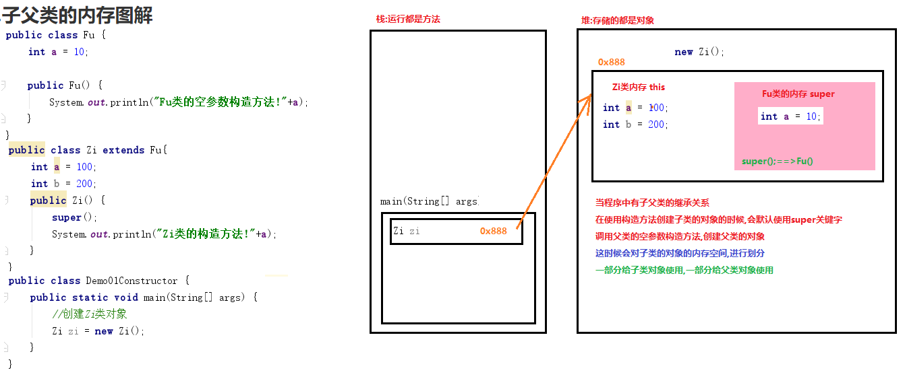

# 学习目标

```java
能够写出类的继承格式
	public class 子类 extends 父类{}
能够说出继承的特点
	子类继承父类,就可以继承父类的成员变量和成员方法
	但是只能使用父类非私有的成员,父类的私有成员不能使用
能够说出子类调用父类的成员特点
	1.子类有使用子类自己的
	2.子类没有使用,继承自父类的
	3.子类父类都没有编译报错
够说出方法重写的概念
	发生在两个类之间
	子类出现了和父类一模一样(返回值类型,方法名,参数列表,修饰符子类大于等于父类)的方法,叫方法重写(Override)
能够说出this可以解决的问题
	1.this.变量名:代表本类的成员变量
	2.this.方法名称():代表本类的成员方法
	3.this(),this(参数):代表调用本类其他的构造方法
能够说出super可以解决的问题
	1.super.变量名:代表父类的成员变量
	2.super.方法名称():代表父类的成员方法
	3.super(),super(参数):代表调用父类的构造方法
描述抽象方法的概念
	没有方法体,被abstract修饰的方法
写出抽象类的格式
	public abstract class 类名{};
写出抽象方法的格式
	权限修饰符 abstract 返回值类型 方法名(参数);
	public abstract void aaa();
	public abstract int bbb();
	public abstract int ccc(String s);
能够说出父类抽象方法的存在意义
	在抽象类中定义类抽象方法,那么子类就必须重写这个抽象方法
	公司中所有的员工都必须工作
	父类的抽象方法作为模版:让子类强制重写抽象方法,不同的子类添加不同的方法体
描述final修饰的类的特点
	最终类,不能被继承(太监类)
描述final修饰的方法的特点
	最终方法,不能被重写
描述final修饰的变量的特点
	常量:只能赋值一次
	局部变量:基本数据类型(值不能改变);引用数据类型(地址值不能改变)
	成员变量:必须在创建对象前赋值(1.直接赋值,2.使用构造方法(构造代码块)赋值)
```

# 一.面向对象回顾

## 1.面向对象的概念

```java
package com.itheima.demo01OO;

/*
    面向对象:
    基于面向过程
    面向过程:当我们遇到一件事情的时候,我们自己分析事情的完成步骤,按照步骤一步一步完成,重视的是完成事情的过程
    面向对象:当我们遇到一件事情的时候,我们不自己完成,找一个能帮我们完成事情的对象,调用对象的功能完成,重视是对象,调用对象的功能

    对象是怎么来的?根据类创建来的
    类是怎么来的?根据现实生活中的事物抽象而来

    定义类:把现实生活中的事物抽象为java中的类(类是java的基本单位)
        把事物的属性定义为类中的成员变量
        把事物的行为(功能)定义为类中成员方法

    封装:
        私有成员变量,对外提供公共的get/set方法

    构造方法:
        创建对象就是调用类中的构造方法
    构造方法定义格式的特点:
        1.构造方法没有返回值类型,也没有返回值
        2.构造方法名字必须和类名一模一样
    构造方法的特点:
        1.类中没有定构造方法:java会默认提供一个空参数构造方法 public Student(){}
        2.类中提供了构造方法:java不会在提供默认空参数构造方法了,要使用空参数构造方法,必须手动写出
        3.构造方法可以重载
 */
public class Student {
    //私有成员变量
    private String name;
    private int age;

    //添加构造方法
    public Student() {
    }

    public Student(String name, int age) {
        this.name = name;
        this.age = age;
    }

    //对外提供公共的get/set方法
    public String getName() {
        return name;
    }

    public void setName(String name) {
        this.name = name;
    }

    public int getAge() {
        return age;
    }

    public void setAge(int age) {
        this.age = age;
    }
}

```

```java
package com.itheima.demo01OO;

/*
    测试类:包含main方法的类
    main方法是程序执行入口
 */
public class Demo01Student {
    public static void main(String[] args) {
        //使用空参数构造方法创建Student对象,为Student变量赋值
        Student s1 = new Student();
        //使用set方法给成员变量赋值
        s1.setName("老王");
        s1.setAge(20);
        //使用get方法获取成员变量的值
        System.out.println(s1.getName()+"\t"+s1.getAge());

        //使用满参数构造方法创建Student对象,为Student变量赋值
        Student s2 = new Student("小王",10);
        //使用get方法获取成员变量的值
        System.out.println(s2.getName()+"\t"+s2.getAge());
        //使用set方法改变成员变量的值
        s2.setAge(18);
        //使用get方法获取成员变量的值
        System.out.println(s2.getName()+"\t"+s2.getAge());
        //使用set方法改变成员变量的值
        s2.setAge(28);
        //使用get方法获取成员变量的值
        System.out.println(s2.getName()+"\t"+s2.getAge());
    }
}
```

## 2.this关键字

```java
package com.itheima.demo02this;

/*
    this关键字
    this关键字代表本类对象的引用
    哪个对象调用的方法,方法中的this就是哪个对象

    作用:
        当我们局部变量和成员变量重名的使用,使用this关键字可以进行区分
        this.变量名代表成员变量
 */
public class Person {
    private String name;

    public Person() {
    }

    public Person(String name) {
        this.name = name;
    }

    //p这个对象调用的show方法,show方法中的this就p对象
    public void show(){
        String name = "张三";
        System.out.println("变量的就近访问原则:"+name);//张三
        System.out.println("this.name:"+this.name);//李四
    }

    public String getName() {
        return name;
    }

    public void setName(String name) {
        this.name = name;
    }
}
```

```java
package com.itheima.demo02this;

public class Demo01this {
    public static void main(String[] args) {
        //创建Person对象
        Person p = new Person("李四");
        p.show();
    }
}
```

## 3.对象的内存图


## 4.匿名对象

```java
package com.itheima.demo03;

import java.util.ArrayList;
import java.util.Scanner;

/*
    匿名对象:没有名字的对象
        在创建对象的时候,没有把对象赋值给某一个变量,只有创建对象的语句,叫匿名对象
        new Person();  new Animal();  new Random();  new Scanner(System.in);
    特点:
        匿名对象只能使用一次,使用完毕会被JVM在空闲的时候垃圾回收,可以节约内存
    作用:
        当对象只使用一次的时候,就可以使用匿名对象
        在工作中匿名对象一般做来作为方法的参数和返回值,或者往集合中直接添加匿名对象
 */
public class Demo01Animal {
    public static void main(String[] args) {
        //有名字的对象:可以通过对象名重复的使用对象
        Animal a = new Animal("熊大");
        a.eat();
        a.eat();
        //匿名对象:只能使用一次
        new Animal("熊二").eat();
        //想要再次使用匿名对象,需要重新创建
        new Animal("tom").eat();
        System.out.println("-----------------------------");
        //调用method方法,给形式参数Animal赋值
        method(a);
        //对象只作为参数使用一次,就可以使用匿名对象
        method(new Animal("jerry"));
        System.out.println("-----------------------------");
        //调用getAnimal方法
        /*
            Animal a4 = getAnimal(); = a3 = new Animal("旺财");
         */
        Animal a4 = getAnimal();
        a4.eat();
        System.out.println("-----------------------------");
        //对象Scanner只使用一次,可以使用匿名对象
        System.out.println("请输入一个字符串:");
        String s = new Scanner(System.in).nextLine();
        System.out.println(s);
        System.out.println("-----------------------------");
        //往集合中直接添加匿名对象
        ArrayList<Animal> list = new ArrayList<>();
        Animal a5 = new Animal("小强1");
        list.add(a5);
        list.add(new Animal("小强2"));
        list.add(new Animal("小强3"));
        list.add(new Animal("小强4"));
    }

    /*
        定义一个方法
            方法的返回值类型使用Animal,在方法中就需要返回一个Animal对象
            方法的返回值类型使用int,在方法中就需要返回一个整数
            方法的返回值类型使用String,在方法中就需要返回一个字符串
            方法的返回值类型使用int[],在方法中就需要返回一个int[]对象
            方法的返回值类型使用ArrayList<Stirng>,在方法中就需要返回一个ArrayList<Stirng>对象
        注意:方法有返回值类型,方法中就的返回一个对应的值
     */
    public static Animal getAnimal(){
        //Animal a3 = new Animal("旺财");
        //return a3;
        //对象作为返回值,只使用一次,就可以使用匿名对象
        return new Animal("旺财");
    }

    /*
        定义一个方法,方法参数的类型Animal
        Animal a2 = a = new Animal("熊大");
        Animal a2 = new Animal("jerry")
     */
    public static void method(Animal a2){
        a2.eat();
    }
}
```

```java
package com.itheima.demo03;

public class Animal {
    private String name;

    public Animal() {
    }

    public Animal(String name) {
        this.name = name;
    }

    public void eat(){
        System.out.println(name+"在吃饭!");
    }

    public String getName() {
        return name;
    }

    public void setName(String name) {
        this.name = name;
    }
}
```

# 二.继承

## 1.继承的概念

**子类继承父类,子类就会自动拥有父类所有有的成员变量和成员方法**


## 2.继承的定义格式

```java
package com.itheima.demo04extends;

/*
    定义父类:人类,是根据子类共性抽取形成
    共性的内容
        属性:姓名,年龄
        功能:吃饭,睡觉
 */
public class Person {
    //姓名
    String name;
    //年龄
    int age;

    //吃饭的功能
    public void eat(){
        System.out.println(name+"说:吃是人生的一大乐趣!");
    }

    //睡觉的功能
    public void sleep(){
        System.out.println(name+"说:睡是人生的另一大乐趣!");
    }
}

```

```java
package com.itheima.demo04extends;

/*
    学生是人类的一种,所以可以继承人类
    什么时候使用继承:我是你的一种的时候 is a
        学生是人类的一种,可以可以继承人类
        讲师是人类的一种,可以可以继承人类
        班主任是人类的一种,可以可以继承人类
    继承的格式:
        public class 子类 extends 父类{ }
    继承后的特点:
        子类继承父类,就会自动拥有父类的成员变量和成员方法
        子类只能使用父类非私有的成员,父类的私有成员子类不能使用
        在子类中也可以定义子类特有的成员
 */
public class Student extends Person{
    //特有的学习的方法
    public void study(){
        System.out.println(name+"键盘敲烂,月薪过万!");
    }
}
```

```java
package com.itheima.demo04extends;

/*
    定义讲师类,是人类的一种,所以可以继承人类
 */
public class Teacher extends Person{
    //定义特有的属性工资
    double moeny;

    //定义特有的功能讲课
    public void teach(){
        System.out.println(name+"讲师正在给大家讲解java!");
    }
}

```

```java
package com.itheima.demo04extends;

/*
    班主任是人类的一种,所以可以继承人类
 */
public class BanZhuRen extends Person{
    //定义特有的属性工资
    double moeny;

    //定义特有的功能管理班级
    public void manager(){
        System.out.println(name+"班主任正在管理班级!");
    }
}

```

```java
package com.itheima.demo04extends;

/*
    测试:子类继承父类,是否会继承父类的成员变量和成员方法

    继承的好处:
        1.可以提高代码的复用性(重复的使用)
        2.继承是多态的前提
 */
public class Demo01extends {
    public static void main(String[] args) {
        //定义Student学生对象
        Student s = new Student();
        //使用Student类继承自父类的属性:name,age
        s.name = "柳岩";
        s.age = 18;
        //使用Student类继承自父类的方法:eat,sleep
        s.eat();
        s.sleep();
        //使用Student类自己的成员方法:study
        s.study();

        //定义Teacher对象
        Teacher t = new Teacher();
        //使用Teacher类继承自父类的属性:name,age
        t.name = "老白";
        t.age = 18;
        //使用Teacher类自己特有的属性:money
        t.moeny = 10000;
        //使用Teacher类继承自父类的方法:eat,sleep
        t.eat();
        t.sleep();
        //使用Teacher类自己的成员方法:teach
        t.teach();
    }
}
```

## 3.继承的注意事项

 继承的注意事项
    1.父类的构造方法子类是不能继承的,构造方法是创建本类对象使用的
        父类使用父类的构造方法创建对象,子类使用自己的构造方法创建对象
    2.父类的私有成员,子类是不能直接使用的
        私有的只有本类可以使用,子类不能直接使用

```java
package com.itheima.demo05extends;

public class Fu {
    private String name;
    private int age;

    public Fu() {
    }

    public Fu(String name, int age) {
        this.name = name;
        this.age = age;
    }

    //定义一个私有的成员方法
    private void siFangQian(){
        System.out.println("父类的私房钱的方法!");
    }

    public void diTu(){
        //本类中是可以调用私有方法
        siFangQian();
    }

    public String getName() {
        return name;
    }

    public void setName(String name) {
        this.name = name;
    }

    public int getAge() {
        return age;
    }

    public void setAge(int age) {
        this.age = age;
    }
}
```

```java
package com.itheima.demo05extends;

public class Zi extends Fu {
}
```

```java
package com.itheima.demo05extends;

public class Demo01extends {
    public static void main(String[] args) {
        //创建Zi类对象:使用子类自己的构造方法
        Zi zi= new Zi();
        //父类的私有成员变量,子类不能直接使用,私有的只能在本类中使用
        //System.out.println(zi.name);//'name' has private access in 'com.itheima.demo05extends.Fu'
        //子类可以继承父类的公共的get/set方法,通过方法使用属性
        zi.setName("小王");
        zi.setAge(18);

        //父类的私有成员方法,子类不能直接使用,私有的只能在本类中使用
        //zi.siFangQian();//'siFangQian()' has private access in 'com.itheima.demo05extends.Fu'
        //子类可以继承父类的公共方法,通过公共方法,调用私有的方法
        zi.diTu();
    }
}

```

## 4.继承后的特点—成员变量

```java
package com.itheima.demo06variable;

public class Fu {
    int a = 10;
}
```

```java
package com.itheima.demo06variable;

public class Zi1 extends Fu {
    int b = 20;
}
```

```java
package com.itheima.demo06variable;

public class Zi2 extends Fu {
    int a = 100;
    int b = 200;
}
```

```java
package com.itheima.demo06variable;

/*
    继承后的特点—成员变量
    1.子类有使用子类自己的成员变量
    2.子类没有使用继承自父类的成员变量
    3.子类父类都没有编译报错
 */
public class Demo01Variable {
    public static void main(String[] args) {
        //创建Zi1对象
        Zi1 z1 = new Zi1();
        System.out.println(z1.a);//继承自父类的 10
        System.out.println(z1.b);//使用子类自己的 20

        //创建Zi2对象
        Zi2 z2 = new Zi2();
        System.out.println(z2.a);//使用子类自己的 100
        System.out.println(z2.b);//使用子类自己的 200
        //System.out.println(z2.c);//Cannot resolve symbol 'c' 子类父类都没有编译报错
    }
}
```

## 5.继承后的特点—成员方法

```java
package com.itheima.demo07method;

public class Fu {
    public void show01(){
        System.out.println("Fu类的show01方法");
    }
}
```

```java
package com.itheima.demo07method;

public class Zi1 extends Fu {
    public void show02(){
        System.out.println("Zi1类的show02方法!");
    }
}
```

```java
package com.itheima.demo07method;

public class Zi2 extends Fu {
    public void show01(){
        System.out.println("Zi2类的show01方法!");
    }

    public void show02(){
        System.out.println("Zi2类的show02方法!");
    }
}

```

```java
package com.itheima.demo07method;

/*
    继承后的特点—成员方法
    1.子类有使用子类自己的成员方法
    2.子类没有使用继承自父类的成员方法
    3.子类父类都没有,编译报错
 */
public class Demo01Method {
    public static void main(String[] args) {
        //创建Zi1类对象
        Zi1 z1 = new Zi1();
        z1.show01();//继承自父类的
        z1.show02();//子类自己的

        Zi2 z2 = new Zi2();
        z2.show01();//子类自己的
        z2.show02();//子类自己的
        //z2.show03();//Cannot resolve method 'show03()' 子类父类都没有,编译报错
    }
}
```

## 6.方法重写(Override)

```java
package com.itheima.demo08Override;

public class Fu {
    public void show01(){
        System.out.println("Fu类的show01方法!");
    }
}
```

```java
package com.itheima.demo08Override;

/*
    方法重写:发生在两个类之间,子类出现了和父类一模一样的方法,叫方法重写,也叫Override
    什么重写父类的方法:为了让子类的方法更加强大

    一模一样:
        方法名一模一样
        参数列表一模一样
        返回值类型一模一样
        修饰符子类的权限必须大于等于父类(public>protected>不写(默认)private)
    注解:
        @Override:可以检测方法是否为重写的方法
        在方法上添加@Override注解,方法报错说明不是重写的,方法没有报错说明方法是重写的
    --------------------------------------------------------------------------------
    方法重载:发生在一个类中,出现了方法名相同,但是参数列表不同的方法,叫方法重载,也叫Overload
 */
public class Zi extends Fu{
    @Override
    public void show01(){
        System.out.println("Zi类重写Fu类的show01方法!");
    }

    //@Override Method does not override method from its superclass
    public void show02(){
        System.out.println("Zi类的show02方法!");
    }

    public void show02(int a){
        System.out.println("Zi类的show02方法!");
    }
}
```

```java
package com.itheima.demo08Override;

public class Demo01Override {
    public static void main(String[] args) {
        //创建子类对象
        Zi zi = new Zi();
        zi.show01();//调用的是子类重新写后的方法
    }
}
```

## 7.方法重写的注意事项(了解)

```java
package com.itheima.demo09Override;

public class Fu {
    public void show01(){
        System.out.println("Fu类的show01方法!");
    }

    public void show02(){
        System.out.println("Fu类的show02方法!");
    }

    public void show03(){
        System.out.println("Fu类的show03方法!");
    }

    public void show04(){
        System.out.println("Fu类的show04方法!");
    }

    private void show05(){
        System.out.println("Fu类的show05方法!");
    }
}
```

```java
package com.itheima.demo09Override;

/*
    注意事项
        1. 方法重写是发生在子父类之间的关系。没有父类就没有方法重写
        2. 子类方法覆盖(重写)父类方法，必须要保证权限大于等于父类权限。
            四大权限修饰符:
                public :公共的
                protected:受保护的
                不写:默认的
                private:私有的
                public>protected>默认>私有
        3. 子类方法覆盖(重写)父类方法，返回值类型、方法名和参数列表都要一模一样。
        4. 父类的私有方法,属于父类本身,子类不能重写
        5. 构造方法也不能重写,属于类本身
 */
public class Zi extends Fu{
    //子类的权限修饰符和父类一样都是public
    public void show01(){
        System.out.println("Zi类重写Fu类的show01方法!");
    }

    //子类使用默认权限,重写不了父类的public权限
    /*void show02(){
        System.out.println("Zi类重写Fu类的show02方法!");
    }*/

    //Method does not override method from its superclass
    //@Override 子类方法的参数列表和父类方法不一样
    public void show03(int a){
        System.out.println("Fu类的show03方法!"+a);
    }

    //子类的方法的返回值类型和父类不一样
   /* public int show04(){
        System.out.println("Fu类的show04方法!");
        return 10;
    }*/

   //Method does not override method from its superclass
   //@Override 在子类中定义了和父类一模一样的私有的方法,属于子类本身和父类没有关系
   //就相当于在子类中定义了一个其他方法,恰好方法名和父类一样
    private void show05(){
        System.out.println("Fu类的show05方法!");
    }
}
```

## 8.继承后的特点—构造方法

```java
package com.itheima.demo10Constructor;

public class Fu {
    int a = 10;

    public Fu() {
        System.out.println("Fu类的空参数构造方法!"+a);
    }
}
```

```java
package com.itheima.demo10Constructor;

/*
    继承后的特点—构造方法
    在子类每个构造方法中,都有一个默认的super();不写也有
    作用:调用父类的空参数构造方法

    为什么要有super();
    子类继承父类,子类进入到内存中执行,想要使用父类的成员
    必须先把父类加载到内存中,才可以使用父类的成员
    所以我们可以在子类对象创建的时候,使用super()调用父类的构造方法,把父类加载到内存中
 */
public class Zi extends Fu{
    public Zi() {
        super();
        System.out.println("Zi类的构造方法!"+a);
    }
}
```

```java
package com.itheima.demo10Constructor;

public class Demo01Constructor {
    public static void main(String[] args) {
        //创建Zi类对象
        Zi zi = new Zi();
    }
}
```

## 9.子父类的内存图解

**父类:超类,基类**



## 10.使用this关键字和super关键字访问成员

```java
package com.itheima.demo11thisAndsuper;

public class Fu {
    int a = 10;

    public void show01(){
        System.out.println("Fu类的show01方法");
    }
}
```

```java
package com.itheima.demo11thisAndsuper;

/*
    使用this关键字和super关键字访问成员
    this:本类对象的引用(Zi类)
        this.成员变量:本类的成员变量
        this.成员方法(参数):本类的成员方法
    super:父类对象的引用(Fu类)
        super.成员变量:父类的成员变量
        super.成员方法(参数):父类的成员方法
 */
public class Zi extends Fu {
    int a = 100;

    @Override
    public void show01(){
        System.out.println("Zi类重写Fu类的show01方法");
    }

    public void show02(){
        int a = 1000;
        System.out.println("变量的就近访问原则:"+a);//1000
        System.out.println("this.a:"+this.a);//100
        System.out.println("super.a:"+super.a);//10
        show01();//Zi类重写Fu类的show01方法
        this.show01();//Zi类重写Fu类的show01方法
        super.show01();//Fu类的show01方法
    }
}
```

```java
package com.itheima.demo11thisAndsuper;

public class Demo01ThisAndSuper {
    public static void main(String[] args) {
        //创建Zi类对象
        Zi zi = new Zi();
        zi.show02();
    }
}

```


## 11.this关键字:调用本类其他的构造方法

```java
package com.itheima.demo12this;

/*
    this关键字:调用本类其他的构造方法
    格式:
        this();调用本类的空参数构造方法
        this(参数);调用本类的带参数构造方法
    注意:
        1.this();this(参数);必须写在构造方法的第一行,创建对象必须优先执行
        2.this();和this(参数);不能相互调用
 */
public class Animal {
    private String name;
    private int age;

    public Animal() {
        //调用满参数构造方法
        //this("tom",10);
        System.out.println("Animal类的空参数构造方法!");
    }

    public Animal(String name, int age) {
        //调用空参数构造方法
        this();
        this.name = name;
        this.age = age;
        System.out.println("Animal类的满参数构造方法!");
    }

    public String getName() {
        return name;
    }

    public void setName(String name) {
        this.name = name;
    }

    public int getAge() {
        return age;
    }

    public void setAge(int age) {
        this.age = age;
    }
}
```

```java
package com.itheima.demo12this;

public class Demo01this {
    public static void main(String[] args) {
        //使用Animal类的空参数构造方法创建对象
        Animal a1 = new Animal();
        System.out.println(a1.getName()+"\t"+a1.getAge());

        /*
            程序执行结果:
               Animal类的满参数构造方法!
               Animal类的空参数构造方法!
               tom  10
         */

        //使用满参数构造方法创建对象
        Animal a2 = new Animal("jerry",5);
        System.out.println(a2.getName()+"\t"+a2.getAge());

        /*
            程序执行结果:
                Animal类的空参数构造方法!
                Animal类的满参数构造方法!
                jerry   5
         */
    }
}
```


## 12.super关键字:调用父类的构造方法

```java
package com.itheima.demo13super;

public class Fu {
    public Fu(){
        System.out.println("Fu类的空参数构造方法!");
    }

    public Fu(int a){
        System.out.println("Fu类的带参数构造方法!"+a);
    }
}
```

```java
package com.itheima.demo13super;

/*
    super关键字:调用父类的构造方法
    super();调用父类的空参数构造方法
    super(参数);调用父类的带参数构造方法
    注意:
        1.子类的构造方法,没有写super,默认会有一个super(),调用父类的空参数构造方法
        2.super();super(参数);必须写在子类构造方法的第一行
        3.super()和this()不能一起使用,有冲突,都必须写在第一行
 */
public class Zi extends Fu {
    public Zi() {
        super();//调用父类的空参数构造方法
        System.out.println("Zi类的空参数构造方法!");
    }

    public Zi(int a){
        super(a);//调用父类的带参数构造方法
        System.out.println("Zi类的带参数构造方法!"+a);
    }
}
```

```java
package com.itheima.demo13super;

public class Demo01super {
    public static void main(String[] args) {
        //使用Zi类空参数构造方法,创建对象
        Zi z1 = new Zi();
        /*
            程序的执行结果:
                Fu类的空参数构造方法!
                Zi类的空参数构造方法!
         */

        //使用Zi类带参数构造方法,创建对象
        Zi z2 = new Zi(100);
        /*
            程序的执行结果:
                Fu类的带参数构造方法!100
                Zi类的带参数构造方法!100
         */
    }
}
```


## 13.**继承的特点**


# 三.抽象类

## 1.抽象类&抽象方法概述


## 2.抽象类&抽象方法使用

```java
package com.itheima.demo14abstractClass;

/*
    定义父类员工类:是根据子类共性抽取形成
    共性的成员变量:姓名,年龄
    共性的成员方法:工作的方法
        每个子类工作的内容不同,只抽取方法声明,添加abstract关键字修饰,叫抽象方法
        格式:
            权限修饰符 abstract 返回值类型 方法名(参数列表);
            public abstract void work():
            public abstract void work(int a):
            public abstract String work(int a):
        包含抽象方法类,必须是一个抽象类,也需要被abstract修饰
   ----------------------------------------------------------------------------------------
   1.抽象类无法直接创建对象使用
        a.抽象类一般都包含抽象方法,抽象方法没有方法体,创建对象,调用方法没有意义
        b.有些类就是不想让别人创建对象使用,也可以定义为抽象类(抽象类可以不包含抽象方法)
   2.需要定义子类,继承抽象父类,重写父类的抽象方法,创建子类对象使用
 */
public abstract class Employee {
    //姓名
    private String name;
    //年龄
    private int age;

    //抽象的工作方法
    public abstract void work();

    public Employee() {
    }

    public Employee(String name, int age) {
        this.name = name;
        this.age = age;
    }

    public String getName() {
        return name;
    }

    public void setName(String name) {
        this.name = name;
    }

    public int getAge() {
        return age;
    }

    public void setAge(int age) {
        this.age = age;
    }
}
```

```java
package com.itheima.demo14abstractClass;

/*
    定义讲师类,是公司员工的一种,所以继承员工类
    讲师已经能明确自己工作的任务了,重写工作方法,添加方法体
    子类继承抽象父类之后,有两种解决方式: alt+回车
        1.把子类修改为抽象类
        2.重写父类的抽象方法,添加方法体
 */
public class Teacher extends Employee{
    @Override
    public void work() {
        System.out.println(getName()+"讲师正在给大家讲解java!");
    }
}
```

```java
package com.itheima.demo14abstractClass;

/*
     定义班主任类,是公司员工的一种,所以继承员工类
     班主任已经能明确自己工作的任务了,重写工作方法,添加方法体
 */
public class BanZhuRen extends Employee{
    public BanZhuRen(){
        super();//调用父类的空参数构造方法
    }

    public BanZhuRen(String name, int age) {
        super(name, age);//调用父类的满参数构造方法
    }

    @Override
    public void work() {
        System.out.println(getName()+"正在管理班级!");
    }
}
```

```java
package com.itheima.demo14abstractClass;

/*
     定义网络工程师类,是公司员工的一种,所以继承员工类
 */
public abstract class NetWork extends Employee{
}
```

```java
package com.itheima.demo14abstractClass;

public class Demo01AbstractClass {
    public static void main(String[] args) {
        //'Employee' is abstract; cannot be instantiated 抽象类不能直接创建对象使用
        //Employee ee = new Employee();

        //创建子类Teacher对象
        Teacher t = new Teacher();
        t.setName("老白");
        t.setAge(18);
        t.work();

        //创建子类BanZhuRen对象
        BanZhuRen bzr = new BanZhuRen("越越老师",18);
        bzr.work();

        //创建子类NetWork对象,是一个抽象类,不能直接创建对象使用
        //NetWork nw = new NetWork();//'NetWork' is abstract; cannot be instantiated
    }
}
```

## 3.抽象类的特征

抽象类的特征总结起来可以说是 **有得有失**

**有得：抽象类得到了拥有抽象方法的能力。**

**有失：抽象类失去了创建对象的能力。**

其他成员（构造器(构造方法)，成方法，静态方法等）抽象类都是具备的。

## 4.注意事项

关于抽象类的使用，以下为语法上要注意的细节，虽然条目较多，但若理解了抽象的本质，无需死记硬背。

1. 抽象类**不能创建对象**，如果创建，编译无法通过而报错。只能创建其非抽象子类的对象。

   > 理解：假设创建了抽象类的对象，调用抽象的方法，而抽象方法没有具体的方法体，没有意义。

2. 抽象类中，可以有构造方法，是供子类创建对象时，初始化父类成员使用的。

   > 理解：子类的构造方法中，有默认的super()，需要访问父类构造方法。

3. 抽象类中，不一定包含抽象方法，但是有抽象方法的类必定是抽象类。

   > 理解：未包含抽象方法的抽象类，目的就是不想让调用者创建该类对象，通常用于某些特殊的类结构设计。

   ```java
   //不包含抽象的方法的抽象类,仅仅是不想让别人创建对象使用
   public abstract class Person {
   }
   ```

4. 抽象类的子类，必须重写抽象父类中**所有的**抽象方法，否则，编译无法通过而报错。除非该子类也是抽象类。 

   > 理解：假设不重写所有抽象方法，则类中可能包含抽象方法。那么创建对象后，调用抽象的方法，没有意义。

## 5. 抽象类存在的意义

抽象类存在的意义是为了被子类继承，否则抽象类将毫无意义.

**抽象方法,就是为了让子类重写,规定公司中所有的人必须的工作,必须的重写工作的方法**

# 四.final关键字

## 1.final修饰的类:是一个最终类,不能被继承

```java
package com.itheima.demo15finalClass;

public class Ye {
}
```

```java
package com.itheima.demo15finalClass;

/*
    fianl:最终的
    final修饰的类:是一个最终类,不能被继承
        其他使用方式不变:可以继承别的类,也可以创建对象使用使用
    太监类
 */
public final class Fu extends Ye{
}
```

```java
package com.itheima.demo15finalClass;

//Cannot inherit from final 'com.itheima.demo15finalClass.Fu'
//被final修饰的类不能被继承
/*public class Zi extends Fu{
}*/
```

```java
package com.itheima.demo15finalClass;

public class Demo01finalClass {
    public static void main(String[] args) {
        Fu fu = new Fu();
    }
}

```

## 2.final修饰的方法:是一个最终方法,子类可以继承使用,但是不能重写

```java
package com.itheima.demo16finalMethod;

public class Fu {
    public void show01(){
        System.out.println("Fu类没有被final修饰的show01方法!");
    }

    public final void show02(){
        System.out.println("Fu类被final修饰的show02方法!");
    }
}
```

```java
package com.itheima.demo16finalMethod;

/*
    final修饰的方法:是一个最终方法,子类可以继承使用,但是不能重写
 */
public class Zi extends Fu{
    public void show01(){
        System.out.println("Zi类重写Fu类没有被final修饰的show01方法!");
    }

    //'show02()' cannot override 'show02()' in 'com.itheima.demo16finalMethod.Fu'; overridden method is final
   /*public final void show02(){
        System.out.println("Fu类被final修饰的show02方法!");
    }*/
}
```

```java
package com.itheima.demo16finalMethod;

public class Demo01FinalMethod {
    public static void main(String[] args) {
        //创建Zi类对象
        Zi zi = new Zi();
        zi.show01();//Zi类重写的
        zi.show02();//继承自父类的
    }
}
```

## 3.final修饰的变量

### 局部变量:是一个常量,值不能改变

```java
package com.itheima.demo17finalVariable;

/*
    被final修饰的变量:是一个常量,值不能改变
    注意:
        局部变量唯一的修饰符就是final
 */
public class Demo01FinalVariable {
    public static void main(String[] args) {
        //final修饰的局部变量
        //基本数据类型:值不能改变
        final int a = 0;
        //a = 10;//Cannot assign a value to final variable 'a'

        //引用数据类型:地址值不能改变
        final Student s = new Student("胡歌",18);
        System.out.println(s);//com.itheima.demo17finalVariable.Student@4554617c
        //s = new Student("刘亦菲",18);//Cannot assign a value to final variable 's'
        System.out.println(s);//com.itheima.demo17finalVariable.Student@74a14482
        //对象中的属性可以改变
        s.setName("安以轩");
        s.setAge(30);
        System.out.println(s);
    }
}
```

```java
package com.itheima.demo17finalVariable;

public class Student {
    private String name;
    private int age;

    public Student() {
    }

    public Student(String name, int age) {
        this.name = name;
        this.age = age;
    }

    public String getName() {
        return name;
    }

    public void setName(String name) {
        this.name = name;
    }

    public int getAge() {
        return age;
    }

    public void setAge(int age) {
        this.age = age;
    }
}
```

### 成员变量:必须在创建对象前赋值,只能赋值一次

```java
package com.itheima.demo17finalVariable;

/*
    被final修饰的变量:是一个常量,值不能改变
    成员变量:必须在创建对象前赋值
    注意:
        1.被final修饰的成员变量,默认值不算变量的值,必须赋实际的值
        2.被final修饰的成员变量,必须在创建对象前赋值,有两种赋值方式
            a.直接定义变量的时候赋值
            b.使用构造方法给变量赋值,构造方法是创建对象成功前执行的
        3.无论哪种赋值方式,只能赋值一次
 */
public class Person {
    //1.被final修饰的成员变量,默认值不算变量的值,必须赋实际的值
    //Variable 'a' might not have been initialized
    //final int a;

    //a.直接定义变量的时候赋值
    final int b = 10;

    final int c;

    public Person() {
        //b.使用构造方法给变量赋值,构造方法是创建对象成功前执行的
        c = 20;
        //3.无论哪种赋值方式,只能赋值一次
        //b = 30;//Cannot assign a value to final variable 'b'
    }
}
```