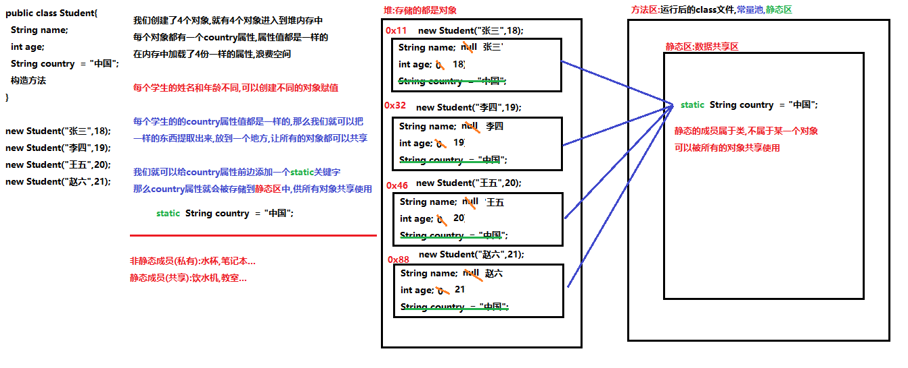
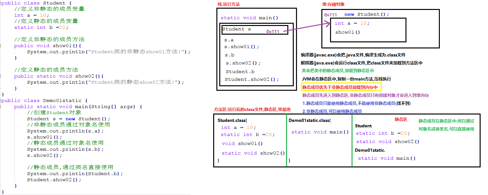
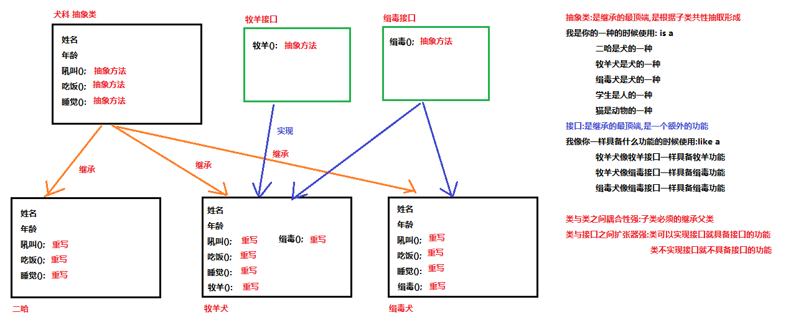
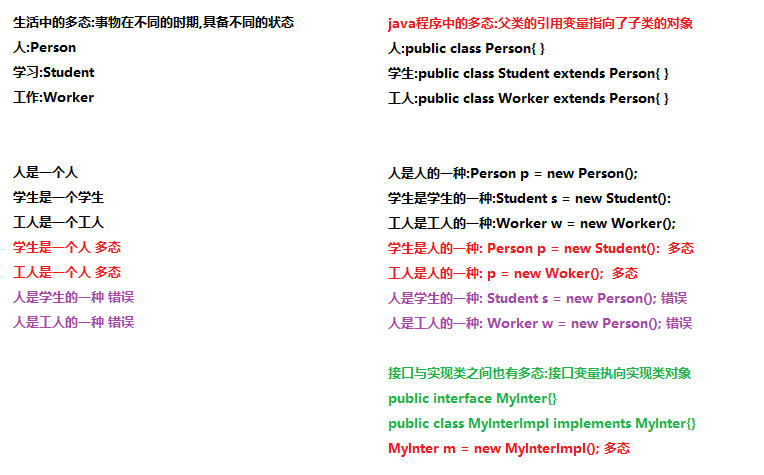
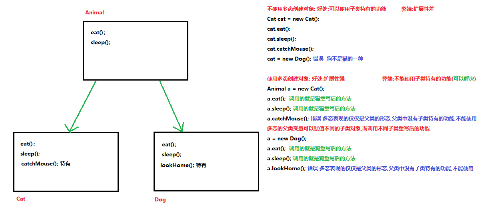
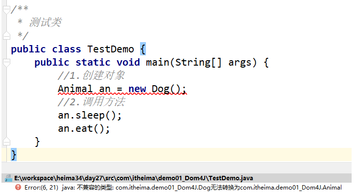
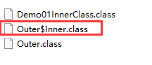

# 学习目标

```java
能够掌握static关键字修饰的变量调用方式
	类名.静态成员变量
	public class Person{
		static int a = 10;
	}
	Person.a;
能够掌握static关键字修饰的方法调用方式
	类名.静态成员方法(参数);
	public class Person{
		public static void show(int a){}
	}
	Person.show(10);
能够写出接口的定义格式
	public interface 接口名{
		抽象方法 public abstract 返回值类型 方法名(参数);
		默认方法 public default 返回值类型 方法名(参数){方法体}
		静态方法 public static 返回值类型 方法名(参数){方法体}
	}
能够写出接口的实现格式
	public class 实现类 implements 接口{}
能够说出接口中的成员特点
	变量:接口中的变量都是常量,有固定的修饰符 public static final int AAA = 10;
	方法:抽象方法(需实现类重写) 默认方法(实现类可以选择性重写) 静态方法(不能重写,使用接口名直接调用)
	接口中没有构造方法,不能创建对象
能够说出多态的前提
	//有子父类继承关系|有类和接口的实现关系(有爹)
能够写出多态的格式
	//父类的类型 变量名 = new 子类对象();
	Animal a = new Cat();
	Animal a = new Dog();
	Fu fu = new Zi();
	//接口的类型 变量名 = new 实现类对象();
	Fly f = new MaQue();
能够理解多态向上转型和向下转型
	//1.向上转型:多态本身就是向上转型
		格式:
			父类的类型 变量名 = new 子类对象();
			接口的类型 变量名 = new 实现类对象();
			Animal a = new Cat();
			a = new Dog();
		好处:
			扩展性强,可以赋值不同的子类对象,调用不同子类重写的方法
		弊端:
			无法使用子类特有的成员变量和成员方法
	//2.向下转型:前提必须是多态,可以把父类的类型强制转换为子类类型(强转)
		格式:
			子类类型 变量名 = (子类类型)父类变量名;
			Cat c = (Cat)a;
			c.catchMouse();
		好处:
			可以使用子类特有的内容
能够说出内部类概念
	//把类定义在其他类的内部
	成员内部类:类定义在其他类的成员位置
	局部内部类:类定义在其他类的方法中
	注意:局部位置唯一可以使用的修饰符就是final
能够理解匿名内部类的编写格式(new 爹(亲爹父类,干爹接口))
	作用:简化代码
		把子类继承父类,重写父类的方法,创建子类对象合成一步完成;
		把实现类实现接口,重写接口中的方法,创建实现类对象合成一步完成;
	格式:
		new 父类|接口(){
			重写父类|接口中方法;
		};
		new Animal(){
			public void eat(){}
			public void sleep(){}
		}.eat();
		new Fly(){
			public void fly(){}
		}.fly();	
```

# 一.static关键字

## 1.static关键字概述(了解)



static是静态修饰符，一般修饰成员。被static修饰的成员属于类，不属于单个这个类的某个对象。 

static修饰的成员被多个对象共享。static修饰的成员属于类，但是会影响每一个对象。被static修饰的 

成员又叫类成员，不叫对象的成员。 

## 2.static关键字的使用(使用)

```java
package com.itheima.demo01static;

/*
    定义每个学生私有的属性(非静态):姓名年龄
    定义每个学生共享的属性(静态):国家
 */
public class Student {
    //姓名
    String name;
    //年龄
    int age;
    //国家
    static String country = "中国";

    public Student() {
    }

    public Student(String name, int age) {
        this.name = name;
        this.age = age;
    }
}
```

```java
package com.itheima.demo01static;

public class Demo01Static {
    public static void main(String[] args) {
        //创建Student对象
        Student s1 = new Student("张三",18);
        System.out.println(s1.name);//张三
        System.out.println(s1.age);//18
        System.out.println(s1.country);//中国

        Student s2 = new Student("李四",19);
        System.out.println(s2.name);//李四
        System.out.println(s2.age);//19
        System.out.println(s2.country);//中国

        //给country属性重新赋值
        s2.country = "中华人民共和国";
        //静态关键字修饰的变量,被多个对象所共享,一个对象改变变量的值,其他对象使用的就是改变后的
        System.out.println(s2.country);//中华人民共和国
        System.out.println(s1.country);//中华人民共和国
    }
}
```

## 3.static修饰的静态成员的使用方式(重点)

```java
package com.itheima.demo02static;

/*
    static修饰的静态成员的使用方式(重点)
    1.非静态的成员(变量,方法):只有一种使用方式
        创建对象,通过对象名访问变量,调用方法
    2.静态成员(变量,方法):有两种使用方式
        a.创建对象,通过对象名访问变量,调用方法(不推荐,只要创建对象,就会占用内存,导致效率低下)
        b.静态的成员属于类,所以我们通过类名可以直接使用
            类名.静态成员变量
            类名.静态成员方法(参数);
 */
public class Student {
    //定义非静态的成员变量
    int a = 10;
    //定义静态的成员变量
    static int b =20;

    //定义非静态的成员方法
    public void show01(){
        System.out.println("Student类的非静态show01方法!");
    }

    //定义静态的成员方法
    public static void show02(){
        System.out.println("Student类的静态show02方法!");
    }
}
```

```java
package com.itheima.demo02static;

public class Demo01static {
    public static void main(String[] args) {
        //创建Student对象
        Student s = new Student();
        //非静态成员通过对象名使用
        System.out.println(s.a);
        s.show01();
        //静态成员通过对象名使用
        System.out.println(s.b);
        s.show02();

        //静态成员,通过类名直接使用
        System.out.println(Student.b);
        Student.show02();

        Demo01static.method();
        //同一个类中,调用静态方法,可以省略类名
        method();
    }

    public static void method(){
        System.out.println("静态method方法!");
    }
}
```

## 4.静态的内存图(了解-扩展)



# 二.接口

## 1.接口概述(了解)

```java
接口:是引用数据类型的一种,是功能的集合(接口中一般定义的都是方法)
    接口中不能定义变量,只能定义常量(很少使用)
定义接口使用也是.java文件;编译生成.class文件
定义接口使用关键字 interface
定义格式:
	修饰符 interface 接口名{
        抽象方法;(JDK7) 重点
        默认方法;(JDK8)    
        静态方法;(JDK8)
        常量(很少使用)
    }
```

## 2.定义使用含有抽象方法的接口(重点)

**定义一个实现类,实现(继承)接口,重写接口中的抽象方法,创建实现类对象使用**

```java
package com.itheima.demo03interface;

/*
    定义使用含有抽象方法的接口(重点)
    抽象方法:没有方法体,被abstract修饰的方法
    注意:
        接口中的抽象方法,修饰符固定为public abstract,可以省略不写,不写默认也是
        类中的抽象方法的修饰符不能省略
    抽象方法定义格式:
        public abstract 返回值类型 方法名(参数列表);
        abstract 返回值类型 方法名(参数列表);
        public 返回值类型 方法名(参数列表);
        返回值类型 方法名(参数列表);
        建议:都写上,增强代码的阅读性
    -----------------------------------------------------------
    1.接口中没有构造方法,也不能创建对象使用
    2.定义一个实现类,实现(继承)接口,重写接口中的抽象方法,创建实现类对象使用
 */
public interface MyInter {
    //定义抽象方法
    //public abstract void show01();
    //abstract void show01();
    //public void show01();
    void show01();

    public abstract void show02(int a);

    public abstract String show03();
}
```

```java
package com.itheima.demo03interface;

/*
    接口的实现类
        类实现接口,类似继承,类实现接口中也会继承接口所有的方法
    使用格式:
        public class 实现类 implements 接口{
            重写接口中的抽象方法
        }
 */
public class MyInterImpl implements MyInter{

    @Override
    public void show01() {
        System.out.println("实现类重写接口中的抽象show01方法");
    }

    @Override
    public void show02(int a) {
        System.out.println("实现类重写接口中的抽象show02方法==>"+a);
    }

    @Override
    public String show03() {
        System.out.println("实现类重写接口中的抽象show03方法");
        return "哈哈";
    }
}

```

```java
package com.itheima.demo03interface;

public class Demo01abstract {
    public static void main(String[] args) {
        //'MyInter' is abstract; cannot be instantiated 接口不能创建对象使用
        //MyInter my = new MyInter();

        //创建接口的实现类对象使用
        MyInterImpl my = new MyInterImpl();
        my.show01();
        my.show02(100);
        String s = my.show03();
        System.out.println(s);
    }
}

```

## 3.定义使用含有默认方法的接口(了解)

```java
package com.itheima.demo04defaultInterface;

/*
    定义使用含有默认方法的接口(了解):很少使用,一般在看java底层源码的时候会看到
    默认方法的定义格式:
        修饰符 default 返回值类型 方法名(参数列表){
            方法体;
        }
    注意:
        接口中默认方法的default关键字是不能省略的
 */
public interface MyInter {
    //定义默认方法
    public default void show01(){
        System.out.println("MyInter接口的默认show01方法");
    }

    //定义默认方法
    public default String show02(int a){
        System.out.println("MyInter接口的默认show02方法");
        return "嘿嘿";
    }
}
```

```java
package com.itheima.demo04defaultInterface;

/*
    含有默认方法的接口:定义实现类实现接口,选择性的重写默认方法
        重写了默认方法:使用实现类重写后的
        没有重写默认方法:使用继承自接口的
    注意:
        在实现类中重写默认方法,去掉default关键字
 */
public class MyInterImpl implements MyInter{
    @Override
    public void show01() {
        System.out.println("实现类重写MyInter接口的默认show01方法");
    }
}
```

```java
package com.itheima.demo04defaultInterface;

public class Demo01DefaultInteface {
    public static void main(String[] args) {
        //创建接口的实现类对象
        MyInterImpl my = new MyInterImpl();
        my.show01();//实现类重写的
        String s = my.show02(100);//继承自接口的
        System.out.println(s);
    }
}
```

## 4.定义使用含有静态方法的接口(了解)

```java
package com.itheima.demo05staticInterface;

/*
    定义使用含有静态方法的接口(了解):我们很少使用,看java底层源码的时候会看到
    静态方法的定义格式:
        修饰符 static 返回值类型 方法名(参数列表){
            方法体;
        }
    注意:
        1.接口中的静态方法static关键字不能省略
        2.静态方法属于接口本身,通过接口名可以直接使用
 */
public interface MyInter {
    //定义静态方法
    public static void show01(){
        System.out.println("MyInter接口中的静态show01方法!");
    }

    public static void show02(){
        System.out.println("MyInter接口中的静态show02方法!");
    }
}
```

```java
package com.itheima.demo05staticInterface;

/*
    注意:
        接口中的静态方法,实现类不能继承,也不能重写
 */
public class MyInterImpl implements MyInter {
    //@Override Method does not override method from its superclass
    //在实现类中定义和接口同名的静态方法,和接口没有关系,属于实现类本身
    public static void show01(){
        System.out.println("MyInter接口中的静态show01方法!");
    }
}
```

```java
package com.itheima.demo05staticInterface;


public class Demo01StaticInterfacae {
    public static void main(String[] args) {
        //通过接口名直接调用静态方法
        MyInter.show01();
        MyInter.show02();

        MyInterImpl my = new MyInterImpl();
        //my.show02(); //静态方法不能继承
        //MyInterImpl.show02();
        MyInterImpl.show01();
    }
}
```

**注意:**

​	**接口中的静态方法不能重写,也不能继承使用**

​    **类中的静态方法不能重写,可以继承使用**

## 5.接口的多实现:一个类可以同时实现多个接口

### 含有抽象方法接口的多实现(重点)

**实现类需要重写所有接口中的抽象方法**

```java
package com.itheima.demo06abstractInterface;

public interface A {
    public abstract void a();
    public abstract void show();
}
```

```java
package com.itheima.demo06abstractInterface;

public interface B {
    public abstract void b();
    public abstract void show();
}
```

```java
package com.itheima.demo06abstractInterface;

/*
    含有抽象方法接口的多实现(重点)
    格式:
        public class 实现类名 implements 接口1,接口2,...接口n{
            重写所有接口中的抽象方法
        }
    注意:
        多个接口中的抽象方法有重名的,不会冲突,抽象方法没有方法体
        实现类重写一次同名的抽象方法就可以了,相当于重写所有的同名抽象方法
 */
public class AandBImpl implements A,B{
    @Override
    public void a() {
        System.out.println("实现类重写A接口中的抽象a方法");
    }

    @Override
    public void b() {
        System.out.println("实现类重写B接口中的抽象b方法");
    }

    @Override
    public void show() {
        System.out.println("实现类重写A接口和B接口中的抽象show方法");
    }
}
```

```java
package com.itheima.demo06abstractInterface;


public class Demo01 {
    public static void main(String[] args) {
        //创建接口的实现类对象
        AandBImpl ab= new AandBImpl();
        ab.a();
        ab.b();
        ab.show();
    }
}

```

### 含有默认方法接口的多实现(了解)

**如果多个接口中默认方法有重复的,实现类(必须)重写这个重复的默认方法**(面试)

```java
package com.itheima.demo07defaultInterface;

public interface A {
    public default void a(){
        System.out.println("A接口中的默认a方法");
    }

    public default void show(){
        System.out.println("A接口中的默认show01方法");
    }
}
```

```java
package com.itheima.demo07defaultInterface;

public interface B {
    public default void b(){
        System.out.println("B接口中的默认b方法");
    }

    public default void show(){
        System.out.println("B接口中的默认show01方法");
    }
}
```

```java
package com.itheima.demo07defaultInterface;

/*
    含有默认方法接口的多实现(了解)
    格式:
        public class 实现类名 implements 接口1,接口2,...接口n{
        }
    注意:
        1.多个接口中的默认方法没有重复的,实现类可以选择性的重写
            重写:使用重写后的
            没有重写:使用继承自接口的
        2.多个接口中默认方法有重复的,实现类[必须]重写这个重复的默认方法
            有不确定性,实现不确定使用的是哪个接口中的默认方法
            重写之后使用自己的
 */
public class AandBImpl implements A,B{
    @Override
    public void show() {
        System.out.println("实现类重写A接口和B接口中的默认show方法!");
    }
}
```

```java
package com.itheima.demo07defaultInterface;

public class Demo01 {
    public static void main(String[] args) {
        //创建接口的实现类对象
        AandBImpl ab = new AandBImpl();
        ab.a();//继承自A接口的默认方法
        ab.b();//继承自B接口的默认方法
        ab.show();//实现类重写的show方法
    }
}
```

### 含有静态方法接口的多实现(了解)

 **类和接口之间:静态方法不能继承,也不能重写**
 **类与类之间:静态方法可以继承,不能重写**

```java
package com.itheima.demo08staticInterface;

public interface A {
    public static void a(){
        System.out.println("A接口中的静态a方法!");
    }

    public static void show(){
        System.out.println("A接口中的静态show方法!");
    }
}
```

```java
package com.itheima.demo08staticInterface;

public interface B {
    public static void b(){
        System.out.println("B接口中的静态b方法!");
    }

    public static void show(){
        System.out.println("B接口中的静态show方法!");
    }
}
```

```java
package com.itheima.demo08staticInterface;

/*
    含有静态方法接口的多实现(了解)
    格式:
        public class 实现类名 implements 接口1,接口2,...接口n{
        }
    注意:
        实现类实现含有静态方法的接口没有意义
        静态方法在接口中既不能继承,也不能重写
 */
public class AandBImpl implements A,B{
}
```

```java
package com.itheima.demo08staticInterface;

public class Demo01 {
    public static void main(String[] args) {
        //创建接口实现类对象
        AandBImpl ab = new AandBImpl();
        //ab.a();//Cannot resolve method 'a()'
        //ab.b();//Cannot resolve method 'b()'
        //ab.show();//Cannot resolve method 'show()'

        //静态方法可以直接使用接口的名字调用
        A.a();
        A.show();
        B.b();
        B.show();
    }
}

```

## 6.类继承类的同时实现多个接口(重点) 

```java
package com.itheima.demo09extendsAndInterface;

public abstract class QinDie {
    public abstract void kaoQingHua();

    public void work(){
        System.out.println("亲爹希望儿子找到一份好工作!");
    }
}
```

```java
package com.itheima.demo09extendsAndInterface;

public interface GanDie1 {
    public abstract void kaoQingHua();
    public abstract void findGF();
}
```

```java
package com.itheima.demo09extendsAndInterface;

public interface GanDie2 {
    public abstract void kaoBeiDa();
    public default void work(){
        System.out.println("GanDie2希望儿子找到一份好工作!");
    }
}
```

```java
package com.itheima.demo09extendsAndInterface;

/*
    类继承类的同时实现多个接口(重点) :一个人可以有一个亲爹(父类),还可以有多个干爹(接口)
    格式:
        public class 子类 extends 父类 implements 接口1,接口2,接口3...接口n{
        }
    注意:
        1.子类必须重写父类和接口中所有的抽象方法
        2.如果父类的普通方法和接口的默认方法重名,默认使用父类的
 */
public class Zi extends QinDie implements GanDie1,GanDie2{
    @Override
    public void findGF() {
        System.out.println("子类重写GanDie1接口中的findGF抽象方法!");
    }

    @Override
    public void kaoBeiDa() {
        System.out.println("子类重写GanDie2接口中的kaoBeiDa抽象方法!");
    }

    @Override
    public void kaoQingHua() {
        System.out.println("子类重写QinDie和GanDie1接口中kaoQingHua抽象方法!");
    }
}
```

```java
package com.itheima.demo09extendsAndInterface;

public class Demo01 {
    public static void main(String[] args) {
        //创建Zi类对象
        Zi zi = new Zi();
        zi.kaoQingHua();
        zi.findGF();
        zi.kaoBeiDa();
        zi.work();//亲爹希望儿子找到一份好工作!
    }
}
```

## 7.接口的多继承(重点)

**接口与接口之间:继承关系**

```java
package com.itheima.demo10interface;

public interface A {
    public abstract void a();
    public default void show(){
        System.out.println("A接口的中的默认show方法!");
    }
}
```

```java
package com.itheima.demo10interface;

public interface B {
    public abstract void b();
    public default void show(){
        System.out.println("B接口的中的默认show方法!");
    }
}
```

```java
package com.itheima.demo10interface;

/*
    接口的多继承(重点)
    1.类与类之间:单继承关系
        public class 子类 extends 父类{ }
    2.类与接口之间:实现关系
        public class 实现类 implements 接口1,接口2...接口n{ }
    3.接口与接口之间:多继承关系
        public interface 子类接口 extends 接口1,接口2...接口n{ }
    注意:
        接口继承多个接口,相当于求接口的并集,子接口包含父接口中所有的抽象和默认方法
        父接口中的默认方法有重名的,子接口必须重写,有不确定性,不确定使用哪个父接口的重复方法
        重写之后使用自己的
 */
public interface C extends A,B{
    public abstract void c();
    @Override
    public default void show() {
        System.out.println("C接口重写A接口和B接口的默认show方法!");
    }
}
```

```java
package com.itheima.demo10interface;

/*
    CImpl实现类实现C接口,就相当于同时实现了ABC三个接口
    需要重写三个接口中所有的抽象方法
 */
public class CImpl implements C{
    @Override
    public void c() {
        System.out.println("实现类重写C接口中的抽象c方法!");
    }

    @Override
    public void a() {
        System.out.println("实现类重写A接口中的抽象a方法!");
    }

    @Override
    public void b() {
        System.out.println("实现类重写B接口中的抽象b方法!");
    }
}
```

```java
package com.itheima.demo10interface;

public class Demo01 {
    public static void main(String[] args) {
        //创建接口的实现类对象
        CImpl c = new CImpl();
        c.a();
        c.b();
        c.c();
        c.show();
    }
}
```

## 8.接口中其他成员的特点(使用)

1.接口中，无法定义成员变量，但是可以定义常量，其值不可以改变，
            默认使用public static final修饰,接口中的常量修饰符可以省略不写.不写默认也是public static final
            常量的命名规则:所有的单词都要大写,多个单词之间可以使用下划线连接
            AAA_BBB_CCC
            定义一些常用的常量:
                公司的名称:"江苏省传智播客股份有限公司北京分公司"
                公司的网址: "www.itcast.cn"  "www.itheima.com"
                公司的地址: 北京市顺义区京顺路99号黑马程序员
2.接口中，没有构造方法，不能创建对象。
3.接口中，没有静态代码块(讲代码块的时候在讲)。

```java
package com.itheima.demo11interface;

/*
    接口中其他成员的特点(使用)
 */
public interface MyInter {
    //在接口中定义常量,有默认修饰符public static final
    public static final String NAME = "江苏省传智播客股份有限公司北京分公司";
    public static final String WEB = "www.itheima.com";
    public static final String ADDRESS  = "北京市顺义区京顺路99号黑马程序员";
}
```

```java
package com.itheima.demo11interface;

public class Demo01 {
    public static void main(String[] args) {
        //接口中的常量被static修饰的,通过接口可以直接使用
        System.out.println(MyInter.NAME);
        System.out.println(MyInter.WEB);
        System.out.println(MyInter.ADDRESS);

        //常量的值是不能改变的
        //Cannot assign a value to final variable 'ADDRESS'
        //MyInter.ADDRESS = "北京市顺义区京顺路88号黑马程序员";
    }
}
```

## 9.接口和抽象类的区别(重点)



```java
package com.itheima.demo12abstractClassAndInterface;

//牧羊接口
public interface MuYang {
    //牧羊功能
    public abstract void muYang();
}

```

```java
package com.itheima.demo12abstractClassAndInterface;

//缉毒接口
public interface JiDu {
    //缉毒功能
    public abstract void jiDu();
}

```

```java
package com.itheima.demo12abstractClassAndInterface;

//父类犬科类,是根据子类共性抽取形成
public abstract class Quan {
    //姓名
    private String name;
    //年龄
    private int age;

    //吼叫
    public abstract void houJiao();
    //吃饭
    public abstract void eat();
    //睡觉
    public abstract void sleep();

    public Quan() {
    }

    public Quan(String name, int age) {
        this.name = name;
        this.age = age;
    }

    public String getName() {
        return name;
    }

    public void setName(String name) {
        this.name = name;
    }

    public int getAge() {
        return age;
    }

    public void setAge(int age) {
        this.age = age;
    }
}

```

```java
package com.itheima.demo12abstractClassAndInterface;

//定义子类哈士奇,是犬科的一种,所以继承犬科类
public class HaShiQi extends Quan{
    public HaShiQi() {
    }

    public HaShiQi(String name, int age) {
        super(name, age);
    }

    @Override
    public void houJiao() {
        System.out.println("姓名叫"+getName()+"的哈士奇在叫唤!");
    }

    @Override
    public void eat() {
        System.out.println("姓名叫"+getName()+"的哈士奇在吃饭!");
    }

    @Override
    public void sleep() {
        System.out.println("姓名叫"+getName()+"的哈士奇在睡觉!");
    }
}

```

```java
package com.itheima.demo12abstractClassAndInterface;

//牧羊犬是犬科的一种,所以可以继承犬科类,具备牧羊功能,所以实现牧羊接口,具备缉毒功能,实现缉毒接口
public class MuYangQuan extends Quan implements MuYang,JiDu{
    public MuYangQuan() {
    }

    public MuYangQuan(String name, int age) {
        super(name, age);
    }

    @Override
    public void muYang() {
        System.out.println("姓名叫"+getName()+"的牧羊犬在牧羊!");
    }

    @Override
    public void houJiao() {
        System.out.println("姓名叫"+getName()+"的牧羊犬在叫唤!");
    }

    @Override
    public void eat() {
        System.out.println("姓名叫"+getName()+"的牧羊犬在吃饭!");
    }

    @Override
    public void sleep() {
        System.out.println("姓名叫"+getName()+"的牧羊犬在睡觉!");
    }

    @Override
    public void jiDu() {
        System.out.println("姓名叫"+getName()+"的牧羊犬在缉毒!");
    }
}

```

```java
package com.itheima.demo12abstractClassAndInterface;

//缉毒犬是犬科的一种,所以可以继承犬科类,具备缉毒功能,所以实现缉毒接口
//ctrl+r:查找并替换
public class JIDuQuan extends Quan implements JiDu{
    public JIDuQuan() {
    }

    public JIDuQuan(String name, int age) {
        super(name, age);
    }

    @Override
    public void houJiao() {
        System.out.println("姓名叫"+getName()+"的缉毒犬在叫唤!");
    }

    @Override
    public void eat() {
        System.out.println("姓名叫"+getName()+"的缉毒犬在吃饭!");
    }

    @Override
    public void sleep() {
        System.out.println("姓名叫"+getName()+"的缉毒犬在睡觉!");
    }

    @Override
    public void jiDu() {
        System.out.println("姓名叫"+getName()+"的缉毒犬在缉毒!");
    }
}

```

```java
package com.itheima.demo12abstractClassAndInterface;

public class Demo01 {
    public static void main(String[] args) {
        //创建哈士奇对象
        HaShiQi hsq = new HaShiQi("二狗",1);
        hsq.eat();
        hsq.sleep();
        hsq.houJiao();

        //创建缉毒犬对象
        JIDuQuan jdq = new JIDuQuan("战狼",3);
        jdq.eat();
        jdq.sleep();
        jdq.houJiao();
        jdq.jiDu();

        //创建牧羊犬对象
        MuYangQuan myq = new MuYangQuan("阿列",15);
        myq.eat();
        myq.sleep();
        myq.houJiao();
        myq.jiDu();
        myq.muYang();
    }
}

```

# 三.多态(重点)

## 1.多态概述



## 2.多态的代码实现

定义父类

```java
package com.itheima.demo13duotai;

public class Fu {
    public void show(){
        System.out.println("Fu类的show方法!");
    }
}

```

定义子类

```java
package com.itheima.demo13duotai;

public class Zi extends Fu {
    public void show(){
        System.out.println("Zi类重写Fu类的show方法!");
    }
}

```

定义抽象父类

```java
package com.itheima.demo13duotai;

public abstract class Animal {
    public abstract void eat();
    public abstract void sleep();
}

```

定义子类

```java
package com.itheima.demo13duotai;

public class Cat extends Animal{
    @Override
    public void eat() {
        System.out.println("猫吃猫粮!");
    }

    @Override
    public void sleep() {
        System.out.println("猫随心所欲的睡!");
    }
}

```

```java
package com.itheima.demo13duotai;

public class Dog extends Animal{
    @Override
    public void eat() {
        System.out.println("狗吃狗粮!");
    }

    @Override
    public void sleep() {
        System.out.println("狗趴着睡!");
    }
}
```

定义接口

```java
package com.itheima.demo13duotai;

public interface MyInter {
    public abstract void method();
}

```

定义接口的实现类

```java
package com.itheima.demo13duotai;

public class MyInterImpl implements MyInter {
    @Override
    public void method() {
        System.out.println("实现类重写接口中的抽象method方法!");
    }
}

```

定义测试类

```java
package com.itheima.demo13duotai;

/*
    多态:
    概念:
        父类的变量指向子类的对象
        接口的变量执向实现类对象
    格式:
        父类类型 变量名 = new 子类对象();
        接口类型 变量名 = new 实现类对象();
    特点:
        1.多态调用的是子类重写候的方法,如果没有方法重写,多态没有意义
        2.多态执向哪个子类对象,就调用哪个子类对象重写后的方法
 */
public class Demo01 {
    public static void main(String[] args) {
        //普通类的多态   父类:Fu    子类:Zi
        Fu fu = new Zi();
        fu.show();

        //抽象类的多态    父类:Animal  子类:Cat,Dog
        Animal a = new Cat();
        a.eat();//猫重写后的方法
        a.sleep();//猫重写后的方法
        a = new Dog();
        a.eat();//狗重写后的方法
        a.sleep();//狗重写后的方法

        //接口的多态     接口:MyInter  实现类:MyInterImpl
        MyInter m = new MyInterImpl();
        m.method();
    }
}

```

## 3.多态的好处和弊端



```java
package com.itheima.demo14duotai;

public abstract class Animal {
    public abstract void eat();
    public abstract void sleep();
}

```

```java
package com.itheima.demo14duotai;

public class Cat extends Animal {
    @Override
    public void eat() {
        System.out.println("猫吃猫粮!");
    }

    @Override
    public void sleep() {
        System.out.println("猫随心所欲的睡!");
    }

    //特有的抓老鼠的方法
    public void catchMouse(){
        System.out.println("猫和老鼠一起玩耍!");
    }
}

```

```java
package com.itheima.demo14duotai;

public class Dog extends Animal {
    @Override
    public void eat() {
        System.out.println("狗吃狗粮!");
    }

    @Override
    public void sleep() {
        System.out.println("狗趴着睡!");
    }

    //定义特有的看家的方法
    public void lookHome(){
        System.out.println("狗狗在看家!");
    }
}

```

```java
package com.itheima.demo14duotai;

/*
    多态的好处和弊端:
    好处:扩展性强
        父类的引用变量可以赋值不同的子类对象,而调用不同子类重写后的方法
    弊端:
        无法使用子类特有的成员
    工作中:
        一般都使用父类作为方法的参数和方法的返回值类型
        调用方法,就可以传递不同的子类对象,返回不同的子类对象
 */
public class Demo01 {
    public static void main(String[] args) {
        Cat cat = new Cat();
        //showCat(cat);

        Dog dog = new Dog();
        //showDog(dog);

        show(cat);
        show(dog);
        System.out.println("---------------------------");
        /*
            多态:
            Animal a = getInstance(); = new Cat();
            Animal a = getInstance(); = new Dog();
         */
        Animal a = getInstance();
        a.eat();
        a.sleep();
    }

    /*
        定义一个方法,方法的返回值类型使用Animal
        Animal是一个抽象类,无法创建对象使用
        创建Animal任意的子类对象返回
     */
    public static Animal getInstance(){
        //return new Cat();
        return new Dog();
    }

    /*
       定义一个方法,方法的参数使用Animal
       Animal是一个抽象类,无法创建对象使用
       可以传递Animal的任意的子类对象,作为方法的参数传递
       多态:
        Animal a = cat = new Cat();
        Animal a = dog = new Dog();
     */
    public static void show(Animal a){
        a.eat();
        a.sleep();
    }

    //只能传递Dog对象
    /*private static void showDog(Dog dog) {
        dog.eat();
        dog.sleep();
        dog.lookHome();
    }*/

    //只能传递Cat对象
    /*private static void showCat(Cat c) {
        c.eat();
        c.sleep();
        c.catchMouse();
    }*/
}

```

## 4.多态的转型(向上转型和向下转型)

```java
package com.itheima.demo15duotai;

public class Fu {
    public void work(){
        System.out.println("父亲在工作!");
    }
}
```

```java
package com.itheima.demo15duotai;

public class Zi extends Fu{
    @Override
    public void work() {
        System.out.println("儿子在工作!");
    }

    //子类特有的玩游戏的方法
    public void palyGame(){
        System.out.println("儿子在玩游戏!");
    }
}
```

```java
package com.itheima.demo15duotai;

/*
    多态的转型(向上转型和向下转型)
    1.向上转型:多态本身就是向上转型,把子类对象赋值给父类
        好处:扩展性强,赋值不同的子类对象,调用不同子类重写后的方法
        弊端:无法使用子类特有的功能
        格式:
            父类类型 变量名 = new 子类对象();
            int a = 10;
            double d = a;
     2.向下转型:把多态的父类变量,强制转换为子类类型
        好处:把父类类型转换为子类类型,就可以使用子类特有的功能
        弊端:扩展性性差
        格式:
            子类类型 变量名 = (子类类型)父类变量名;
            double d = 10;
            int a = (int)d;
        前提:
            向下转型的前提必须是多态,直接创建父类对象,不能转型的
 */
public class Demo01 {
    public static void main(String[] args) {
        //1.向上转型:多态本身就是向上转型,把子类对象赋值给父类
        //父亲病了,儿子化妆为父亲,替父亲工作
        Fu fu = new Zi();
        fu.work();//儿子在工作! 调用的是子类重写后的方法

        //儿子替父亲工作完了,想玩游戏,但是表现的父亲的形态,父亲是没有玩游戏的方法
        //fu.playGame();//Cannot resolve method 'playGame()'

        //2.向下转型:把多态的父类变量,强制转换为子类类型
        //儿子卸妆,变回儿子
        Zi zi = (Zi)fu;
        zi.palyGame();

        //向下转型的前提必须是多态,直接创建父类对象,不能转型的
        Fu f = new Fu();
        //Zi z = (Zi)f;//ClassCastException: com.itheima.demo15duotai.Fu cannot be cast to com.itheima.demo15duotai.Zi
        Animal a = new Cat();
        //Cat c = (Cat)a;
        //c.catchMouse();
        //类型转换异常:猫不能转换为狗
        //Dog d = (Dog)a;//ClassCastException: com.itheima.demo15duotai.Cat cannot be cast to com.itheima.demo15duotai.Dog
        //d.lookHome();
    }
}

```

## 5.instanceof关键字

```java
package com.itheima.demo16instanceof;

import java.util.Random;

/*
    问题:
    ClassCastException: com.itheima.demo15duotai.Cat cannot be cast to com.itheima.demo15duotai.Dog
    向下转型的时候,类型书写错误,容易引发类型转换异常
    instanceof关键字
    作用: 判断某个对象是否属于某种数据类型,可以在向下转型之前先判断
    格式:
        boolean b = 对象 instanceof 数据类型;
        如果对象属于对应的数据类型,返回true
        如果对象不属于对应的数据类型,返回false
    注意:
        对象是根据类创建对象,对象所属的类要要判断的数据类型之间必须有继承或者实现关系,才能判断
 */
public class Demo01instanceof {
    public static void main(String[] args) {
        Animal a= new Cat();
        boolean b1 = a instanceof Cat;
        System.out.println("b1:"+b1);//true

        boolean b2 = a instanceof Dog;
        System.out.println("b2:"+b2);//false

        if(a instanceof Cat){
            Cat cat = (Cat)a;
            cat.catchMouse();
        }

        if(a instanceof Dog){
            Dog dog = (Dog)a;
            dog.lookHome();
        }
        System.out.println("--------------------------------");
        //对象是根据类创建对象,对象所属的类要要判断的数据类型之间必须有继承或者实现关系,才能判断
        Random r = new Random();
        //Inconvertible types; cannot cast 'java.util.Random' to 'com.itheima.demo16instanceof.Cat'
        //Random类和Cat类没有关系,不能使用instanceof关键字判断
        //boolean b3 = r instanceof Cat;
    }
}

```

## 🎗经验分享

### 1.已知代码

```java
/**
 * 动物类
 */
public class Animal {
    public void sleep(){
        System.out.println("Animal....Sleep....");
    }

    public void eat(){
        System.out.println("Animal....eat....");
    }
}
/**
 * 狗类
 */
public class Dog{
    public void sleep() {
        System.out.println("Dog....Sleep....");
    }
    public void eat(){
        System.out.println("Dog....eat....");
    }
}
/**
 * 测试类
 */
public class TestDemo {
    public static void main(String[] args) {
        //1.创建对象 多态
        Animal an = new Dog();
        //2.调用方法
        an.sleep();
        an.eat();
    }
}
```

### 2.出现的问题

> 编译时报错了,错误信息如下: 



### 3.问题的分析

> 根据代码的报错位置,是多态创建时出错了!

> 我们回顾一下多态的提前:必须有继承或者实现
>
> 很明显,我们的Dog类并没有继承Animal,不是Animal的子类

### 4.问题解决办法

> 在Dog类中继承Animal即可

```java
public class Dog extends Animal{
    public void sleep() {
        System.out.println("Dog....eat....");
    }
    public void eat(){
        System.out.println("Dog....eat....");
    }
}
```

# 四.内部类

## 1.成员内部类(了解)

我们在实际工作中很少使用;但是看java底层的源码可以看到(迭代器)

```java
package com.itheima.demo17innerClass;

/*
    内部类:定义在其他类内部的类
    分类:
        成员内部类:把类定义在其他类的成员位置(类中方法外)
        局部内部类:把类定义在其他类的方法中
    成员内部类:我们很少自己定义,但是在看java底层源码时可见(迭代器)
        定义格式:
            public class 外部类名{
                public class 成员内部类名{
                    成员内部类的成员变量
                    成员内部类的成员方法
                }
            }
        使用格式: 通过外部类找到内部类使用
            外部类名.内部类名 变量名 = new 外部类().new 内部类();
    注意:
        1.在内部类中可以直接使用外部类的成员
        2.内部类只是定义在其他的类的内部,其他使用方式不变,也可以继承父类,实现接口
 */
public class Outer {
    //定义外部类的成员变量
    int a = 10;
    //定义外部类的成员方法
    public void outer(){
        System.out.println("外部类Outer的成员方法outer!");
    }

    //定义成员内部类
    public class Inner{
        //成员内部类的成员变量
        int b = 20;
        //成员内部类的成员方法
        public void inner(){
            System.out.println("内部类Inner的成员方法inner!");
            //在内部类中可以直接使用外部类的成员
            System.out.println(a);
            outer();
        }
    }
}
```

```java
package com.itheima.demo17innerClass;

/*
    使用格式: 通过外部类找到内部类使用
    外部类名.内部类名 变量名 = new 外部类().new 内部类();
    变量名.内部类的成员变量
    变量名.内部类的成员方法
 */
public class Demo01InnerClass {
    public static void main(String[] args) {
        Outer.Inner oi = new Outer().new Inner();
        System.out.println(oi.b);
        oi.inner();
    }
}
```

**注意:内部类生成的class文件含有$**



## 2.局部内部类(了解-扩展)

```java
package com.itheima.demo18innerClass;

/*
    局部内部类(了解-扩展)
    把类定义在其他类的方法中
    定义格式:
        public class 外部类名{
            修饰符 返回值类型 外部类方法名(参数){
                (final)class 局部内部类名{
                    局部内部类的成员变量
                    局部内部类的成员方法();
                }

                局部内部类名 变量名 = new 局部内部类名():
                变量名.局部内部类的成员变量
                变量名.局部内部类的成员方法();
            }
        }
    使用格式:局部内部类和局部变量一样,作用域只在方法中有效,出了方法类就消失了
        所以我们需要在方法中定义完局部内部类之后,理解创建对象使用
 */
public class Outer {
    //定义外部类的成员方法
    public void outer01(){
        //定义局部内部类
        final class Inner{
            //局部内部类的成员变量
            int a = 10;
            //局部内部类的成员方法();
            public void inner(){
                System.out.println("局部内部类的成员方法inner!");
            }
        }

        //创建局部内部类的对象
        Inner in = new Inner();
        System.out.println(in.a);
        in.inner();
    }

    //定义外部类的成员方法
    public void outer08(){
        //定义局部内部类
        final class Inner{
            //局部内部类的成员变量
            int a = 10;
            //局部内部类的成员方法();
            public void inner(){
                System.out.println("局部内部类的成员方法inner!");
            }
        }

        //创建局部内部类的对象
        Inner in = new Inner();
        System.out.println(in.a);
        in.inner();
    }
}
```

```java
package com.itheima.demo18innerClass;

public class Demo01InnerClass {
    public static void main(String[] args) {
        //创建外部类对象,调用外部类的成员方法
        new Outer().outer01();
    }
}
```

注意:局部内部类生产的class含有$(1,2,3指的是外部类中第1个,第2个...方法)


## 3.匿名内部类(重点)

### 父类的匿名内部类

```java
package com.itheima.demo19innerClass;

/*
    匿名内部类(重点)
        匿名:没有名字
        内部类:写在方法中就是局部内部类,写在成员位置就是成员内部类
    匿名内部类作用:简化代码
        把定义子类继承父类,重写父类的方法,创建子类对象合成一步完成
        把实现类实现接口,重写接口中的方法,创建实现类对象合成一步完成
    格式:new 爹
        new 父类|接口(){
            重写父类|接口中的方法
        };
    ---------------------------------------------------------------------------
    new Animal(){
        @Override
        public void eat() {
            System.out.println("动物在吃饭!");
        }

        @Override
        public void sleep() {
            System.out.println("动物在睡觉!");
        }
    };
    以上一堆代码相当于创建了一个Animal的子类对象,等价于new Cat() new Dog():
 */
public class Demo01InnerClass {
    public static void main(String[] args) {
        //new Cat().eat();
        //new Dog().sleep();
        //父类 Animal
        new Animal(){
            @Override
            public void eat() {
                System.out.println("动物在吃饭!");
            }

            @Override
            public void sleep() {
                System.out.println("动物在睡觉!");
            }
        }.eat();
        new Animal(){
            @Override
            public void eat() {
                System.out.println("动物在吃饭!");
            }

            @Override
            public void sleep() {
                System.out.println("动物在睡觉!");
            }
        }.sleep();
        System.out.println("------------------------------------------");
        //多态:父类的引用变量指向了子类对象
        //Animal a = new Cat();
        //a.eat();
        //a.sleep();
        //多态
        //父类类型 变量名 = 匿名的子类对象;
        Animal a =  new Animal(){
            @Override
            public void eat() {
                System.out.println("动物在吃饭!");
            }

            @Override
            public void sleep() {
                System.out.println("动物在睡觉!");
            }
            
            //特有的方法
            public void paly(){
                System.out.println("动物在玩耍!");
            }
        };
        a.eat();
        a.sleep();
        System.out.println("-----------------------");
        //多态的弊端,无法使用子类特有的功能
        //a.paly();
        new Animal(){
            @Override
            public void eat() {
                System.out.println("动物在吃饭!");
            }

            @Override
            public void sleep() {
                System.out.println("动物在睡觉!");
            }

            //特有的方法
            public void paly(){
                System.out.println("动物在玩耍!");
            }
        }.paly();
        
    }
}
```

```java
package com.itheima.demo19innerClass;

public abstract class Animal {
    public abstract void eat();
    public abstract void sleep();
}
```

```java
package com.itheima.demo19innerClass;

public class Cat extends Animal {
    @Override
    public void eat() {
        System.out.println("猫吃猫粮!");
    }

    @Override
    public void sleep() {
        System.out.println("猫随心所欲的睡!");
    }

    //特有的抓老鼠的方法
    public void catchMouse(){
        System.out.println("猫和老鼠一起玩耍!");
    }
}

```

```java
package com.itheima.demo19innerClass;

public class Dog extends Animal {
    @Override
    public void eat() {
        System.out.println("狗吃狗粮!");
    }

    @Override
    public void sleep() {
        System.out.println("狗趴着睡!");
    }

    //定义特有的看家的方法
    public void lookHome(){
        System.out.println("狗狗在看家!");
    }
}

```

### 接口的匿名内部类

```java
package com.itheima.demo20innerClass;

/*
    接口的匿名内部类
 */
public class Demo01InnerClass {
    public static void main(String[] args) {
        //创建接口的实现类对象
        //Niao n = new Niao();
        //n.fly();
        //匿名对象
        //new Niao().fly();

        //匿名内部类
        //直接使用对象名.方法();
        new Fly(){
            @Override
            public void fly() {
                System.out.println("没有名字的鸟在飞!");
            }
        }.fly();
    }
}
```

```java
package com.itheima.demo20innerClass;

public interface Fly {
    public abstract void fly();
}
```

```java
package com.itheima.demo20innerClass;

public class Niao implements Fly {
    @Override
    public void fly() {
        System.out.println("小麻雀在飞翔!");
    }
}
```

匿名内部类生成的class文件,包含$(1,2,3指的是第几个匿名内部类)

