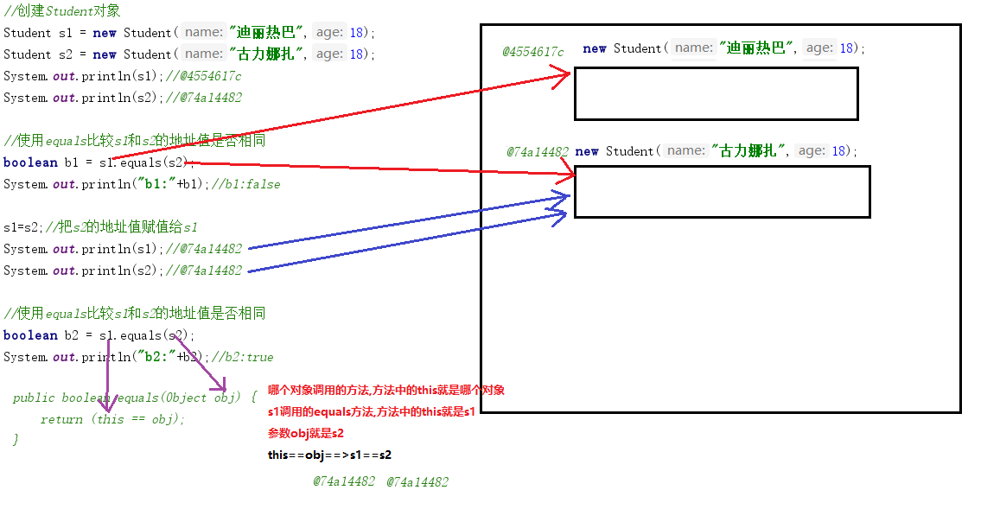
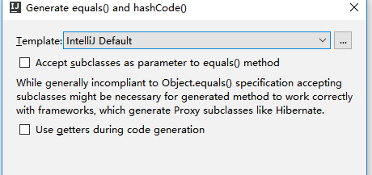
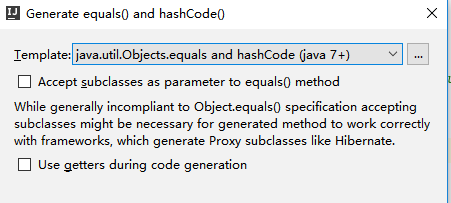
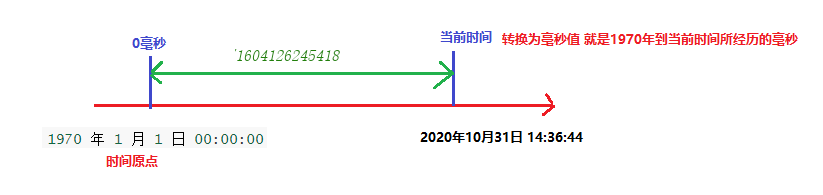
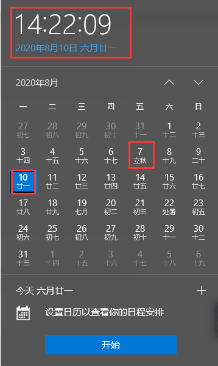
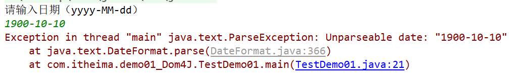

# 学习目标

```java
能够说出每种权限修饰符的作用
	private:只能在本类中使用
	默认(不写):既能在本类中使用,又能在本包的其他类中使用
	protected:既能在本类中使用,又能在本包的其他类中使用,还能在不同包的子类中使用
	public:本项目中的任意包,任意的类中都可以使用
	需要记住(重点):
		1.privare使用:定义成员变量,需要私有(封装)
		2.public使用:定义成员方法,定义构造方法,定义类
代码块:
	静态代码块:只执行一次,优先于构造代码块和构造方法执行
能够说出Object类的特点
	是所有类的祖宗类,任意的一个类都直接或者间接的继承了Object类,都可以使用Object类中的方法
	Animal extends Object:直接继承  	Animal:默认继承Object
	Cat extends Animal:间接继承
能够重写Object类的toString方法
	没有重写:默认打印对象的地址值
	重写:打印对象的属性值
	alt+insert,选择toString
能够重写Object类的equals方法
	没有重写:比较两个对象的地址值是否相等
	重写:比较两个对象的属性是否相等
	alt+insert,选择equals and hashCode
能够使用日期类输出当前日期
	import java.util.Date;
	Date date = new Date();
	sout(date);//Mon Apr 27 15:55:03 CST 2020
能够使用将日期格式化为字符串的方法:Date==>String(符合模式的)
	//1.创建SimpleDateFormat对象,构造方法中传递指定的模式   
    SimpleDateFormat sdf = new SimpleDateFormat("yyyy年MM月dd日 HH时mm分ss秒");
    //2.调用SimpleDateFormat对象中的方法format根据构造方法中传递的模式,把日期格式化为符合模式的字符串
    Date date = new Date();
    System.out.println(date);//Wed Mar 18 11:50:38 CST 2020
    String s = sdf.format(date);
    System.out.println(s);// 2020年03月18日 11时51分32秒
能够使用将字符串转换成日期的方法:String(符合模式的)==>Date
	//1.创建SimpleDateFormat对象,构造方法中传递指定的模式
    SimpleDateFormat sdf = new SimpleDateFormat("yyyy-MM-dd");
	//2.调用SimpleDateFormat对象中的方法format根据构造方法中传递的模式,把日期格式化为符合模式的字符串
	Date date =  sdf.parse("2000-12-12");
    System.out.println(date);//Tue Dec 12 00:00:00 CST 2000
能够使用Calendar类的get、set、add方法计算日期
	int get(int field) 获取给定日历字段的值。
    void set(int field, int value) 将给定的日历字段设置为给定值。
    void add(int field, int amount)  把日历字段增加|减少指定的值
能够使用System类获取当前系统毫秒值
	static long currentTimeMillis() 返回以毫秒为单位的当前时间。
能够使用Arrays类的sort方法
	//static void sort(Object[] a) 根据元素的自然顺序对指定对象数组按升序进行排序。
	// int[] arr1 = {5,1,4,2,3};
	//Arrays.sort(arr1);
	//[1, 2, 3, 4, 5]
能够使用Arrays类的toString方法
	//static String toString(Object[] a) 对数组进行遍历,把数组中的元素组合成一个字符串返回
	//String s = Arrays.toString(arr); [1, 2, 3, 4, 6, 7, 8, 9, 10]
```

# 一.权限修饰符

## 1.概述

在Java中提供了四种访问权限，使用不同的访问权限修饰符修饰时，被修饰的内容会有不同的访问权限，

- public：公共的。
- protected：受保护的
- 不写：默认的
- private：私有的

## 2.不同权限的访问能力

|                        | public | protected | default（空的） | private |
| ---------------------- | ------ | --------- | --------------- | ------- |
| 同一类中               | √      | √         | √               | √       |
| 同一包中(子类与无关类) | √      | √         | √               |         |
| 不同包的子类           | √      | √         |                 |         |
| 不同包中的无关类       | √      |           |                 |         |

可见，public具有最大权限。private则是最小权限。

编写代码时，如果没有特殊的考虑，建议这样使用权限：

- 成员变量使用`private` ，隐藏细节(封装)。
- 构造方法使用` public` ，方便创建对象。
- 成员方法使用`public` ，方便调用方法。
-  类的定义可以使用`public`,默认权限,但是建议使用public权限

```java
package com.itheima.demo01access;

/*
    java中的四大权限修饰符:
    public:公共的
    protected:受保护的
    不写:默认的
    private:私有
    public>protected>默认>private
    注意:
        1.在同一个类中,public,protected,默认的,private权限修饰的变量和方法都可以使用
        2.同一个包的无关类中,public,protected默认的权限修饰的变量和方法可以使用,private不可以使用
        3.在不同包的子类中,public,protected的权限修饰的变量和方法可以使用,private,默认的不可以使用
        4.在不同包的无关类中,public的权限修饰的变量和方法可以使用
 */
public class Person {
    public int a = 10;
    protected int b = 20;
    int c = 30;
    private int d = 40;

    public void show(){
        //1.在同一个类中,public,protected,默认的,private权限修饰的变量和方法都可以使用
        System.out.println(a);
        System.out.println(b);
        System.out.println(c);
        System.out.println(d);
    }
}
```

```java
package com.itheima.demo01access;

/*
    Person和Demo01Person同一个包中的无关类
 */
public class Demo01Person {
    public static void main(String[] args) {
        //创建Person对象
        Person p = new Person();
        //2.同一个包的无关类中,public,protected默认的权限修饰的变量和方法可以使用,private不可以使用
        System.out.println(p.a);
        System.out.println(p.b);
        System.out.println(p.c);
        //System.out.println(p.d);;//'d' has private access in 'com.itheima.demo01access.Person'
    }
}
```

```java
package com.itheima.demo02access;

import com.itheima.demo01access.Person;

/*
    Student和Person:Student是Person不同包的子类
 */
public class Student extends Person{
    public void method(){
        //3.在不同包的子类中,public,protected的权限修饰的变量和方法可以使用,private,默认的不可以使用
        System.out.println(a);
        System.out.println(b);
        //'c' is not public in 'com.itheima.demo01access.Person'. Cannot be accessed from outside package
        //System.out.println(c);
        //'d' has private access in 'com.itheima.demo01access.Person'
        //System.out.println(d);
    }
}
```

```java
package com.itheima.demo02access;

/*
    Demo01Student和Person关系:不同包的无关类
 */
public class Demo01Student {
    public static void main(String[] args) {
        //创建Student对象
        Student s = new Student();
        //4.在不同包的无关类中,public的权限修饰的变量和方法可以使用
        System.out.println(s.a);
        //System.out.println(s.b);//'b' has protected access in 'com.itheima.demo01access.Person'
        //System.out.println(s.c);//'c' is not public in 'com.itheima.demo01access.Person'. Cannot be accessed from outside package
        //System.out.println(s.d);//'d' has private access in 'com.itheima.demo01access.Person'
    }
}
```

# 二.代码块  

```java
package com.itheima.demo03Code;

/*
    代码块:被{ }包裹起来的一段代码
    1.局部代码块:写在方法中的代码块
    2.构造代码块:写在成员位置(类中方法外)的代码块
    3.静态代码块:写在成员位置(类中方法外),被static修饰的代码块(重点)
 */
public class Demo01Code {
    public static void main(String[] args) {
        /*
            1.局部代码块:写在方法中的代码块
            变量的作用域:变量的作用域在变量所在的{ }的范围内有效
            作用:
                可以降低变量的作用域,可以提高程序的效率
                如果变量只想在局部使用,使用完毕想立即销毁,就可以使用局部代码块
         */
        {
            int a = 10;
            //System.out.println(a);
        }
        //System.out.println(a);//Cannot resolve symbol 'a'
        //System.out.println(b);//Cannot resolve symbol 'b'

        //使用Person类的空参数构造方法创建对象
        Person p1 = new Person();
        System.out.println(p1.getName()+"\t"+p1.getAge());//张三	18

        Person p2 = new Person("李四",20);
        System.out.println(p2.getName()+"\t"+p2.getAge());

        //使用类名访问静态成员变量
        System.out.println(Person.a);//100
    }
}
```

```java
package com.itheima.demo03Code;

public class Person {
    private String name;
    private int age;
    public static int a;

    /*
        2.构造代码块:写在成员位置(类中方法外)的代码块
        特点:
            优先于构造方法执行,每创建一次对象,都会执行一次构造代码块中的代码
        作用:
            1.可以给成员变量赋值
            2.可以把构造方法中共性的内容放在构造代码块中,提高代码的利用率(复用性)
                需求:每使用构造方法创建对象之前都打印10次HelloWorld
     */
    {
        System.out.println("构造代码块!");
        //1.可以给成员变量赋值
        name = "张三";
        age = 18;
        //2.可以把构造方法中共性的内容放在构造代码块中,提高代码的利用率(复用性)
        /*for (int i = 1; i <= 10; i++) {
            System.out.println("HelloWorld"+i);
        }*/
    }

    /*
        3.静态代码块:写在成员位置(类中方法外),被static修饰的代码块(重点)
        特点:
            1.static修饰的成员,不属于某一个对象,被所有对象所共享,属于类
                静态代码块属于类,不属于某一个对象,无论创建多少次对象,只执行一次
            2.静态的成员优先于非静态的成员加载到内存中
                静态代码块优先执行,优选于构造代码块和构造方法
            总结:静态代码块优先执行,只执行一次
       作用:
            1.可以给静态的成员变量赋值
            2.优先执行,只执行一次,可以做一些项目的初始化{数据库==>jdbc}
     */
    static {
        System.out.println("静态代码块!");
        //1.可以给静态的成员变量赋值
        a = 100;
    }

    public Person() {
        /*for (int i = 1; i <= 10; i++) {
            System.out.println("HelloWorld"+i);
        }*/
        System.out.println("Person类空参数构造方法!");
    }

    public Person(String name, int age) {
        /*for (int i = 1; i <= 10; i++) {
            System.out.println("HelloWorld"+i);
        }*/
        this.name = name;
        this.age = age;
        System.out.println("Person类满参数构造方法!");
    }

    public String getName() {
        return name;
    }

    public void setName(String name) {
        this.name = name;
    }

    public int getAge() {
        return age;
    }

    public void setAge(int age) {
        this.age = age;
    }
}
```

**总结:静态代码块优先执行,只执行一次**

# 三.Object类

## 1.Object类介绍(了解)

- java.**lang**.Object   注意:lang包中的类无需导包可以直接使用
- 类 `Object` 是类层次结构的根类(最顶层的类 祖宗类)。
- 每个类都使用 `Object` 作为超类。任何一个类都直接或者间接的继承了Object类
- 所有对象（包括数组）都实现这个Object类的方法。**任何一个类都可以使用Object类中的方法**

## 2.Object类的toString方法(重点)

```java
package com.itheima.demo04toString;

import java.util.Random;
import java.util.Scanner;

/*
    Object类中的方法
    String toString() 返回该对象的字符串表示。
    toString方法的源码:
        public String toString() {
            return getClass().getName() + "@" + Integer.toHexString(hashCode());
        }
        1.getClass().getName():使用反射技术获取类的全类名(包名+类名)
            "com.itheima.demo04toString.Person"
        2."@":字符串,作为分隔符号使用
        3.hashCode():是Object类的方法,获取对象的哈希值,由操作系统返回一个随机的十进制的整数
            13123123  234324234  13221321
        4.Integer.toHexString(十进制的整数):把十进制的整数转换为十六进制 十六:0-9 A-F(10-15)
            13123123==>AD123123
        把以上内容合并为一起: com.itheima.demo04toString.Person@AD123123 对象的地址值
 */
public class Demo01ToString {
    public static void main(String[] args) {
        //创建Person对象
        Person p = new Person("柳岩",18);
        //Person类默认继承了Object,所以可以使用Object类中的方法
        String s = p.toString();
        System.out.println(s);//com.itheima.demo04toString.Person@4554617c 重写:Person{name=柳岩 ,age=18}

        //直接打印对象名,默认调用对象的toString方法
        //System.out.println(p.toString());//com.itheima.demo04toString.Person@4554617c 重写:Person{name=柳岩 ,age=18}
        System.out.println(p);//com.itheima.demo04toString.Person@4554617c 重写:Person{name=柳岩 ,age=18}

        /*
            以后看一个类是否重写了toString方法,打印这个类的对象名即可
                重写了:不是地址值
                没有重写:默认打印地址值
         */
        Random r = new Random();
        System.out.println(r);//java.util.Random@2db0f6b2  没有重写:默认打印地址值

        Scanner sc = new Scanner(System.in);
        System.out.println(sc);//java.util.Scanner[delimiters=\p{javaWhitespace}+][position=0 重写了:不是地址值
    }
}
```

```java
package com.itheima.demo04toString;

public class Person extends Object{
    private String name;
    private int age;

    public Person() {
    }

    public Person(String name, int age) {
        this.name = name;
        this.age = age;
    }

    /*
        Object类的toString方法,默认打印对象的地址值没有意义
        所以我们需要重写toString方法,打印对象的属性(成员变量)值
     */
    /*@Override
    public String toString() {
        return "Person{name="+name+" ,age="+age+"}";
    }*/

    //快捷键:alt+insert==>选择toString
    @Override
    public String toString() {
        return "Person{" +
                "name='" + name + '\'' +
                ", age=" + age +
                '}';
    }

    public String getName() {
        return name;
    }

    public void setName(String name) {
        this.name = name;
    }

    public int getAge() {
        return age;
    }

    public void setAge(int age) {
        this.age = age;
    }
}
```

**重点记忆**

**1.直接打印对象的名字,会默认调用对象的toString方法**

**2.Object类的toString方法,默认打印对象的地址值**

**3.重写toString方法快捷键  alt+insert==>toString方法**

## 3.Object类中的equals方法(重点)

```java
package com.itheima.demo05equals;

/*
    Object类中的equals方法(重点)
        boolean equals(Object obj) 指示其他某个对象是否与此对象“相等”。
     equals方法的底层源码:
        public boolean equals(Object obj) {
            return (this == obj);
        }
        ==号:
            基本数据类型:比较的是值是否相同   10==20
            引用数据类型(数组,类,集合,String,接口):比较两个对象的地址值是否相同  @aaa==@123
 */
public class Demo01equals {
    public static void main(String[] args) {
        //创建Student对象
        Student s1 = new Student("迪丽热巴",18);
        Student s2 = new Student("古力娜扎",18);
        System.out.println(s1);//@4554617c
        System.out.println(s2);//@74a14482

        //使用equals比较s1和s2的地址值是否相同
        boolean b1 = s1.equals(s2);
        System.out.println("b1:"+b1);//b1:false

        s1=s2;//把s2的地址值赋值给s1
        System.out.println(s1);//@74a14482
        System.out.println(s2);//@74a14482

        //使用equals比较s1和s2的地址值是否相同
        boolean b2 = s1.equals(s2);
        System.out.println("b2:"+b2);//b2:true
    }
}
```

```java
package com.itheima.demo05equals;

public class Student {
    private String name;
    private int age;

    public Student() {
    }

    public Student(String name, int age) {
        this.name = name;
        this.age = age;
    }

    public String getName() {
        return name;
    }

    public void setName(String name) {
        this.name = name;
    }

    public int getAge() {
        return age;
    }

    public void setAge(int age) {
        this.age = age;
    }
}
```



```java
package com.itheima.demo06equals;

public class Student {
    private String name;
    private int age;

    public Student() {
    }

    public Student(String name, int age) {
        this.name = name;
        this.age = age;
    }

    /*
        Object类的equals默认比较两个对象的地址值,没有意义
        重写equals方法,比较两个对象的属性值(name.age)
     */
    @Override
    public boolean equals(Object obj) {
        /*
            obj==this,直接返回true,没有必要在比较,,可以提高程序的效率
         */
        if(obj==this){
            return true;
        }

        /*
            obj是null,没有必须在继续执行,直接返回false,可以提高程序的效率
         */
        if(obj==null){
            return false;
        }

        /*
            ClassCastException: java.util.Random cannot be cast to com.itheima.demo06equals.Student
            Object obj = new Random(); 类型转换的时候抛出类类型转换异常
            解决:向下转型之前,增加一个判断,obj是Student类型,在向下转型
         */
        if(obj instanceof Student){
            /*
                比较的两个对象:
                    this(Student s1 = new Student("迪丽热巴",18);)==obj(Student s2 = new Student("古力娜扎",18);)
                多态:
                    Object obj = s2 = new Student("古力娜扎",18);
                多态的弊端:不能使用子类特有的成员(name,age)==>解决:向下转型
             */
            Student s = (Student)obj;
            //比较两个对象的属性值
            return this.name.equals(s.name) && this.age==s.age;

        }
        //obj不是Student类型,直接返回false
        return false;
    }

    //使用快捷键:alt+insert==>选择equals() and hashCode()
    /*@Override
    public boolean equals(Object o) {
        if (this == o) {
            return true;
        }
        //getClass() != o.getClass() 使用反射技术,判断o是否为Student类型,相当于 if(obj instanceof Student)
        if (o == null || getClass() != o.getClass()) {
            return false;
        }

        //向下转型
        Student student = (Student) o;

        if (this.age != student.age) {
            return false;
        }
        //使用三元运算符:防止空指针异常
        return this.name != null ? this.name.equals(student.name) : student.name == null;
    }*/

    public String getName() {
        return name;
    }

    public void setName(String name) {
        this.name = name;
    }

    public int getAge() {
        return age;
    }

    public void setAge(int age) {
        this.age = age;
    }
}
```

```java
package com.itheima.demo06equals;

import java.util.Random;

public class Demo01equals {
    public static void main(String[] args) {
        //创建Student对象
        Student s1 = new Student("迪丽热巴",18);
        Student s2 = new Student("古力娜扎",18);
        System.out.println(s1);//@4554617c
        System.out.println(s2);//@74a14482

        boolean b1 = s1.equals(s2);
        System.out.println("b1:"+b1);//b1:false

        Student s3 = new Student("那吾克热",18);
        Student s4 = new Student("那吾克热",18);
        System.out.println(s3);//@1540e19d
        System.out.println(s4);//@677327b6

        boolean b2 = s3.equals(s4);
        System.out.println("b2:"+b2);//b2:true
        System.out.println("------------------------------------");
        Random r = new Random();
        boolean b3 = s3.equals(r);
        System.out.println("b3:"+b3);
        System.out.println("------------------------------------");
        boolean b4 = s3.equals(null);
        System.out.println("b4:"+b4);
        System.out.println("------------------------------------");
        boolean b5 = s3.equals(s3);
        System.out.println("b5:"+b5);
    }
}
```

**重点记忆**

**1.没有重写Object类的equals方法,默认比较两个对象的地址值**

**2.会使用快捷键 alt+insert equals() and hashCode()重写equals方法,比较两个对象的属性**

## 4.Object类中的重点 

**会使用快捷键:alt+insert,给类添加toString和equals方法就可以了**

## 5.native本地方法

native修饰的方法:说明这个方法不是java语言编写的

调用的是其他语言编写的代码或者操作系统底层的代码,看不到具体的方法

也就意味着Java可以和其它的编程语言进行交互。

```java
Object类:
public native int hashCode();
public final native Class<?> getClass();
```

## 5.Objects对象的工具类(了解)

```java
package com.itheima.demo07Objects;

import java.util.Objects;

/*
    Objects对象的工具类(了解)
    Objects是操作对象的工具类,是JDK1.7之后出现的,里边的方法都是静态的
    Objects类中的equals方法:防止空指针异常的
    java.util.Objects类
        static boolean equals​(Object a, Object b) 比较两个对象是否相等
    Objects类中的equals方法的源码:
        public static boolean equals(Object a, Object b) {
            return (a == b) || (a != null && a.equals(b));
        }
 */
public class Demo01Objects {
    public static void main(String[] args) {
        String s1 = null;
        String s2 = "aaa";
        //boolean b1 = s1.equals(s2);//null.equals(s2)==>NullPointerException
        //System.out.println("b1:"+b1);

        //JDK1.7之前:使用三元运算符解决
        boolean b1 = s1 != null ? s1.equals(s2) : s2 == null;
        System.out.println("b1:"+b1);

        //JDK1.7之后:使用Objects的equals方法
        boolean b2 = Objects.equals(s1, s2);
        System.out.println("b2:"+b2);
    }
}
```

添加equals方法的模版:



```java
@Override
public boolean equals(Object o) {
    if (this == o) return true;
    if (o == null || getClass() != o.getClass()) return false;

    Student student = (Student) o;

    if (age != student.age) return false;
    //使用的jdk7前的方式:使用三元运算符,防止空指针异常
    return name != null ? name.equals(student.name) : student.name == null;
}
```



```java
@Override
public boolean equals(Object o) {
    if (this == o) return true;
    if (o == null || getClass() != o.getClass()) return false;
    Student student = (Student) o;
    return age == student.age &&
        	//使用Objects的equals方法,防止空指针异常(jdk7+)
            Objects.equals(name, student.name);
}
```

# 四.Date类

## 1.毫秒值的概念和作用(了解-扩展)

```java
java.util.Date: 用于描述时间和日期的类
类 Date 表示特定的瞬间，精确到毫秒。 
1秒=1000毫秒
1 天 = 24 × 60 × 60 = 86400 秒 = 86400 * 1000 = 86400000毫秒
--------------------------------------------------------------
时间原点:0毫秒的时间点
	1970 年 1 月 1 日 00:00:00 英国格林威治的时间(世界标准时间)
中国:东八区 标准时间+8个小时的时差
	1970 年 1 月 1 日 08:00:00
把当前日期和时间转换为毫秒值:就是当前时间和时间原点的一个差值    
	当前时间(2020年10月31日 14:33:33)-时间原点(1970 年 1 月 1 日 00:00:00) = 1597029762998
--------------------------------------------------------------
毫秒值的作用:在工作中可以使用毫秒值计算两个时间的差值
需求:计算两个时间之间一共经历的多少天
"2020年8月10日 11:21:33" - "2019年7月7日 12:22:22"  字符串没法计算,字符串不能相减
把时间转换为毫秒值,使用毫秒值相减,在把结果转换为天
1597029762998 - 1591313123133 = 12321毫秒==>转换为时间(12321毫秒/1000/60/60/24)天    
```



## 2.Date类的构造方法和成员方法(重点)

```java
package com.itheima.demo08Date;

import java.util.Date;

/*
    Date类的构造方法和成员方法(重点)
 */
public class Demo01Date {
    public static void main(String[] args) {
        //获取1970年1月1日 00:00:00到当前时间 所经历的毫秒值 1600053714943
        //System.out.println(System.currentTimeMillis());
        show04();
    }

    /*
        void setTime(long time) 把毫秒值转换为Date日期
          设置此 Date 对象，以表示 1970 年 1 月 1 日 00:00:00 GMT 以后 time 毫秒的时间点。
          此方法相当于Date(long date)的作用: 把毫秒值转换为Date日期
     */
    private static void show04() {
        Date d1 = new Date(1600054485375L);
        System.out.println(d1);//Mon Sep 14 11:34:45 CST 2020

        Date d2 = new Date();
        d2.setTime(1600054485375L);
        System.out.println(d2);//Mon Sep 14 11:34:45 CST 2020
    }

    /*
        long getTime() 把Date转换为毫秒(获取1970年1月1日 00:00:00到当前时间所经历的毫秒值)
          返回自 1970 年 1 月 1 日 00:00:00 GMT 以来此 Date 对象表示的毫秒数。
        等价于System.currentTimeMillis()
     */
    private static void show03() {
        Date date = new Date();
        long time = date.getTime();
        System.out.println(time);//1600054485375 毫秒
    }

    /*
        Date(long date) 把毫秒值转换为Date日期
        注意:在时间和日期相关的方法中,参数是long类型,一般都是让我们传递毫秒值
     */
    private static void show02() {
        Date d1 = new Date(0L);
        System.out.println(d1);//Thu Jan 01 08:00:00 CST 1970

        Date d2 = new Date(1231231213123L);
        System.out.println(d2);//Tue Jan 06 16:40:13 CST 2009
    }

    /*
        Date() Date类的空参数构造方法
            用于获取当前系统的时间和日期
        CST:中国标准时间
     */
    private static void show01() {
        Date date = new Date();
        System.out.println(date);//Mon Sep 14 11:28:36 CST 2020 不是地址值,重写了toString方法
    }
}
```

# 五.DateFormat类

## 1.DateFormat类介绍(了解)

```java
java.text.DateFormat类
public abstract class DateFormat extends Format
DateFormat 是日期/时间格式化子类的抽象类==>DateFormat是Format类的子类,DateFormat类本身还是一个抽象类,无法直接创建对象使用
DateFormat作用:
	它以与语言无关的方式格式化并解析日期或时间
	格式化（也就是日期 -> 文本）
	解析（文本-> 日期）
DateFormat类的成员方法:
	String format(Date date)  参数传递Date日期,把日期格式化为符合模式的字符串
	Date parse(String source) 参数传递字符串,把符合模式的字符串解析为Date日期
-----------------------------------------------------------------------------------------
DateFormat类本身还是一个抽象类,无法直接创建对象使用,需要使用DateFormat类的子类创建对象使用
java.text.SimpleDateFormat extends DateFormat类
SimpleDateFormat类的构造方法:
	SimpleDateFormat(String pattern) 
          用给定的模式和默认语言环境的日期格式符号构造 SimpleDateFormat。
    参数:
		String pattern:传递日期和时间的模式
		在模式中写y代表年
        在模式中写M代表月
        在模式中写d代表日
        在模式中写H代表时
        在模式中写m代表分
        在模式中写s代表秒
        "yyyy-MM-dd HH:mm:ss" "2020-10-31 15:03:03"
        "yyyy年MM月dd日 HH时mm分ss秒"
        "yyyy/MM/dd HH:mm:ss"    
   注意:
	1.表示模式的字母不能随便写(y代表年,M代表月...),表示年月日时分秒的连接符号可以随意写(-,/...)
    2.表示模式的字母严格区分大小写    
```

## 2.DataFormat类的常用方法(重点)

```java
package com.itheima.demo09DateFormat;

import java.text.SimpleDateFormat;
import java.util.Date;

/*
    DataFormat类的常用方法(重点)
        String format(Date date)  参数传递Date日期,把日期格式化为符合模式的字符串
    使用步骤:
        1.创建SimpleDateFormat对象,构造方法中的参数传递指定的模式
        2.使用SimpleDateFormat对象中的方法format,把日期格式化为符合模式的字符串
 */
public class Demo01format {
    public static void main(String[] args) {
        //1.创建SimpleDateFormat对象,构造方法中的参数传递指定的模式
        SimpleDateFormat sdf = new SimpleDateFormat("yyyy-MM-dd HH:mm:ss");
        //2.使用SimpleDateFormat对象中的方法format,把日期格式化为符合模式的字符串
        Date date = new Date();
        System.out.println(date);//Sat Oct 31 15:08:08 CST 2020

        String s = sdf.format(date);
        System.out.println(s);//2020-10-31 15:08:32

        SimpleDateFormat sdf2 = new SimpleDateFormat("yyyy年MM月dd日");
        String s2 = sdf2.format(date);
        System.out.println(s2);//2020年10月31日
    }
}
```

```java
package com.itheima.demo09DateFormat;

import java.text.ParseException;
import java.text.SimpleDateFormat;
import java.util.Date;

/*
    DataFormat类的常用方法(重点)
        Date parse(String source) 参数传递字符串,把符合模式的字符串解析为Date日期
    使用步骤:
        1.创建SimpleDateFormat对象,构造方法中的参数传递指定的模式
        2.使用SimpleDateFormat对象中的方法parse,把符合模式的字符串解析为Date日期
 */
public class Demo02parse {
    public static void main(String[] args) throws ParseException {
        //1.创建SimpleDateFormat对象,构造方法中的参数传递指定的模式
        SimpleDateFormat sdf = new SimpleDateFormat("yyyy-MM-dd");
        //2.使用SimpleDateFormat对象中的方法parse,把符合模式的字符串解析为Date日期
        /*
            public Date parse(String source) throws ParseException
            parse方法使用throws关键字声明抛出了ParseException:解析异常
            我们调用parse方法就必须的对这个异常进行处理,有两种处理方式
                1.可以继续使用throws关键字,声明抛出异常对象
                2.可以使用try...catch关键字,自己手动捕获处理异常
            使用快捷键: 把鼠标放在有问题的代码上,alt+回车
            -----------------------------------------------------
            传递的字符串"2020-10-31"和模式"yyyy-MM-dd"能匹配上,解析成功
            传递的字符串"202010-31"和模式"yyyy-MM-dd"匹配不上,抛出解析异常
         */
        Date date = sdf.parse("2020-10-31");
        System.out.println(date);//Sat Oct 31 00:00:00 CST 2020
    }
}
```

# 六.Calendar类



## 1.Calendar类介绍&创建对象的方式(重点)

```java
package com.itheima.demo10Calendar;

import java.util.Calendar;

/*
    java.util.Calendar:日历类
        Calendar 类是一个抽象类，它为特定瞬间与一组诸如 YEAR、MONTH、DAY_OF_MONTH、HOUR 等 日历字段之间的转换提供了一些方法，
            并为操作日历字段（例如获得下星期的日期）提供了一些方法。
    Calendar类的作用:
        我们可以使用Calendar类中的方法来操作日历上的字段
        我们可以使用Calendar类中的方法获取日历上字段(YEAR,MONTH)指定的值  2020 10
        我们可以使用Calendar类中的方法修改日历上字段(YEAR,MONTH)的值 2020修改为2015年  10月修改为12月
        我们可以使用Calendar类中的方法把日历字段增加,减少指定的值 2020+3=2023年   10月-5=5月
        我们可以使用Calendar类中的方法根据日历对象,获取到Date日期对象
    Calendar 类是一个抽象类,我们无法直接创建对象使用,可以使用getInstance方法获取Calendar类的子类对象
        static Calendar getInstance() 使用默认时区和语言环境获得一个日历。
        public Animal getAnimal(){ return new Cat();}
    注意:
        西方:0-11月
        东方:1-12月
        西方的星期:星期日-星期六
        东方的星期:星期一-星期日
 */
public class Demo01Calendar {
    public static void main(String[] args) {
        //获取Calendar对象
        /*
            多态:
            Calendar cal = null;
            cal = new GregorianCalendar(zone, aLocale);
            return cal;
         */
        Calendar c = Calendar.getInstance();
        System.out.println(c);
    }
}
```

输出结果:

```java
java.util.GregorianCalendar[time=1604130421914,areFieldsSet=true,areAllFieldsSet=true,lenient=true,zone=sun.util.calendar.ZoneInfo[id="Asia/Shanghai",offset=28800000,dstSavings=0,useDaylight=false,transitions=19,lastRule=null],firstDayOfWeek=1,minimalDaysInFirstWeek=1,ERA=1,YEAR=2020,MONTH=9,WEEK_OF_YEAR=44,WEEK_OF_MONTH=5,DAY_OF_MONTH=31,DAY_OF_YEAR=305,DAY_OF_WEEK=7,DAY_OF_WEEK_IN_MONTH=5,AM_PM=1,HOUR=3,HOUR_OF_DAY=15,MINUTE=47,SECOND=1,MILLISECOND=914,ZONE_OFFSET=28800000,DST_OFFSET=0]
```

## 2.Calendar类中的常用成员方法(重点)

```java
package com.itheima.demo10Calendar;

import java.util.Calendar;
import java.util.Date;

/*
    Calendar类中的常用成员方法(重点)
        int get(int field) 返回给定日历字段的值。
        void set(int field, int value) 将给定的日历字段设置为给定值。
        void add(int field, int amount)  把给定的日历字段,增加|减少指定的值
        Date getTime()  把日历转换为日期Date对象
    方法的参数:
        int field:传递指定的日历字段,在Calendar类中被定义为了常量
        年:public final static int YEAR = 1; 
        月:public final static int MONTH = 2;
        日:public final static int DATE = 5;
        日:public final static int DAY_OF_MONTH = 5; 
        时:public final static int HOUR = 10;
        分:public final static int MINUTE = 12;
        秒:public final static int SECOND = 13;
        星期:public final static int DAY_OF_WEEK = 7;  
 */
public class Demo02Calendar {
    public static void main(String[] args) {
        show05();
    }

    /*
        void setTime(Date date) 把Date日期转换为Calendar日历
     */
    private static void show05() {
        Date date = new Date(0L);
        //获取Calendar对象
        Calendar c = Calendar.getInstance();
        c.setTime(date);

        //获取年
        int year = c.get(Calendar.YEAR);
        System.out.println(year+"年");//1970年
        //获取月
        int month = c.get(Calendar.MONTH);
        System.out.println((month+1)+"月");//1月
        //获取日
        int d = c.get(Calendar.DAY_OF_MONTH);
        System.out.println(d+"日");//1日
    }

    /*
        Date getTime()  把日历转换为日期Date对象
     */
    private static void show04() {
        //获取Calendar对象
        Calendar c = Calendar.getInstance();
        Date date = c.getTime();
        System.out.println(date);//Sat Oct 31 16:14:49 CST 2020
    }

    /*
        void add(int field, int amount)  把给定的日历字段,增加|减少指定的值
        参数:
            int field:指定的日历字段
            int amount:传递增加|减少的值
                正数:增加
                负数:减少
     */
    private static void show03() {
        //获取Calendar对象
        Calendar c = Calendar.getInstance();
        //把年-5年:2020-5=2015
        c.add(Calendar.YEAR,-5);
        //把月份-3月
        c.add(Calendar.MONTH,-3);
        //把日+10天(值大了或者不够会进位|借位)
        c.add(Calendar.DATE,10);

        //获取年
        int year = c.get(Calendar.YEAR);
        System.out.println(year+"年");//2015年
        //获取月
        int month = c.get(Calendar.MONTH);
        System.out.println((month+1)+"月");//8月
        //获取日
        int date = c.get(Calendar.DAY_OF_MONTH);
        System.out.println(date+"日");//10日
    }

    /*
        void set(int field, int value) 将给定的日历字段设置为给定值。
        参数:
            int field:指定的日历字段
            int value:设置的值
        和set方法重载的方法:可以同时设置年月日
        void set(int year, int month, int date)
     */
    private static void show02() {
        //获取Calendar对象
        Calendar c = Calendar.getInstance();
        //把年设置为8888年
        c.set(Calendar.YEAR,8888);
        //把月设置为8月
        c.set(Calendar.MONTH,7);
        //把日设置为8日
        c.set(Calendar.DAY_OF_MONTH,8);

        //同时设置年月日
        //c.set(1999,8,9);

        //获取年
        int year = c.get(Calendar.YEAR);
        System.out.println(year+"年");//8888年
        //获取月
        int month = c.get(Calendar.MONTH);
        System.out.println((month+1)+"月");//8月
        //获取日
        int date = c.get(Calendar.DAY_OF_MONTH);
        System.out.println(date+"日");//8日
    }

    /*
        int get(int field) 返回给定日历字段的值。
        参数:
            int field:指定的日历字段,可以传递Calendar类的常量,也可以直接传递整数
     */
    private static void show01() {
        //获取Calendar对象
        Calendar c = Calendar.getInstance();
        //获取年
        //int year = c.get(1);
        int year = c.get(Calendar.YEAR);
        System.out.println(year+"年");//2020年

        //获取月
        int month = c.get(Calendar.MONTH);
        System.out.println((month+1)+"月");//10月

        //获取日
        //int date = c.get(Calendar.DATE);
        int date = c.get(Calendar.DAY_OF_MONTH);
        System.out.println(date+"日");//31日

        //获取星期
        int week = c.get(Calendar.DAY_OF_WEEK);
        System.out.println("星期"+(week-1));//星期6
    }
}
```

## 🎗经验分享

### 1.已知代码

```java
package com.itheima;

import java.text.ParseException;
import java.text.SimpleDateFormat;
import java.util.Date;
import java.util.Scanner;

public class TestDemo01 {
    public static void main(String[] args) throws ParseException {
        //需求:
        //  从控制台接收一个字符串的“日期”，格式：yyyy-MM-dd，程序将其转换为：xxxx年xx月xx日的格式
        //创建Scanner对象
        Scanner sc = new Scanner(System.in);
        //接收用户输入
        System.out.println("请输入日期（yyyy-MM-dd）");
        String dateStr = sc.nextLine();

        //将字符串日期转换成Date对象
        SimpleDateFormat sdf1 = new SimpleDateFormat("yyyy年MM月dd日");
        Date date = sdf1.parse(dateStr);

        //将Date对象转换成指定格式的字符串
        SimpleDateFormat sdf2 = new SimpleDateFormat("yyyy-MM-dd");
        String result = sdf2.format(date);

        //打印结果
        System.out.println(result);
    }
}
```

### 2.出现的问题

> 运行时出现以下异常



### 3.问题的分析

> 出了一个ParseException,解析异常,这个异常是由于我们输入的字符串格式不匹配引起的

> 第一个SimpleDateFormat是用于解析字符串的,但是格式和第二个SimpleDateFormat写反了,应该是yyyy-MM-dd

### 4.问题解决办法(不是唯一的,只要保证模式和字符串能匹配上即可)

> 将两个SimpleDateFormat的模式调换即可

```java
//将字符串日期转换成Date对象
SimpleDateFormat sdf1 = new SimpleDateFormat("yyyy-MM-dd");
Date date = sdf1.parse(dateStr);

//将Date对象转换成指定格式的字符串
SimpleDateFormat sdf2 = new SimpleDateFormat("yyyy年MM月dd日");
String result = sdf2.format(date);
```

# 七.System类(重点)

```java
package com.itheima.demo11System;

import java.util.Date;

/*
    java.lang.System类
        System 类包含一些有用的类字段和方法。它不能被实例化(创建对象)。
        System类私有了空参数构造方法,不让我们创建对象使用
        里边提供的方法都是静态类,通过类名.方法名()可以直接使用
    常用方法:
        static void exit(int status) 终止当前正在运行的 Java 虚拟机。
        static long currentTimeMillis() 返回以毫秒为单位的当前时间。
        static void arraycopy(Object src, int srcPos, Object dest, int destPos, int length) 数组复制
 */
public class Demo01System {
    public static void main(String[] args) {
        show03();
    }

    /*
        扩展_了解
        static void arraycopy(Object src, int srcPos, Object dest, int destPos, int length) 数组复制
        参数：
            src - 源数组。
            srcPos - 源数组中的起始索引。
            dest - 目标数组。
            destPos - 目标数据中的起始索引。
            length - 要复制的数组元素的数量。
        需求:
            源数组: int[] src = {1,2,3,4,5};
            目标数组: int[] dest = {6,7,8,9,10};
            把源数组src中的前3个元素(1,2,3)复制到目标数组dest的前3个位置处
            结果:int[] dest = {1,2,3,9,10};
     */
    private static void show03() {
        int[] src = {1,2,3,4,5};
        int[] dest = {6,7,8,9,10};
        System.out.println("----------------复制前遍历数组------------------");
        for (int i = 0; i < dest.length; i++) {
            System.out.println(dest[i]);
        }
        //调用System类静态的数组复制的方法
        System.arraycopy(src,0,dest,0,3);
        System.out.println("----------------复制后遍历数组------------------");
        //遍历数组
        for (int i = 0; i < dest.length; i++) {
            System.out.println(dest[i]);
        }
    }

    /*
        static long currentTimeMillis() 返回以毫秒为单位的当前时间。
            获取1970年1月1日 00:00:00秒 到当前时间(2020年10月31日 16:51:44)所经历的毫秒值
            等价于 new Date().getTime();
        作用:一般用于测试程序的效率(执行的时间)
        需求:
            在控制台输出1-100000，计算这段代码执行了多少毫秒
     */
    private static void show02() {
        long s = System.currentTimeMillis();
        for (int i = 1; i <= 100000; i++) {
            System.out.println(i);
        }
        //long e = System.currentTimeMillis();
        long e = new Date().getTime();
        System.out.println("代码执行共耗时:"+(e-s)+"毫秒!");//代码执行共耗时:923毫秒!
    }

    /*
        static void exit(int status) 终止当前正在运行的 Java 虚拟机。
        参数:
            int status:状态码
            根据惯例，非 0 的状态码表示异常终止。0:正常终止
     */
    private static void show01() {
        while (true){
            System.out.println("我想有一个漂亮的女朋友!");
            //break;//跳出单层循环
            System.exit(0);//终止JVM
        }
        //System.out.println("努力学习,还是有机会的!");
    }
}
```

# 八.Arrays类(重点)

```java
package com.itheima.demo12Arrays;

import java.util.Arrays;

/*
    java.util.Arrays类:操作数据的工具类
        此类包含用来操作数组（比如排序和搜索）的各种方法。
    常用方法:
        static String toString(Object[] a) 返回指定数组内容的字符串表示形式。
            用于遍历数组,把数组中的元素组装为一个字符串返回.格式[1,2,3,4,5,...]
        static void sort(Object[] a) 根据元素的自然顺序对指定对象数组按[升序]进行排序。
            升序:从小到大
            降序:从大到小
 */
public class Demo01Arrays {
    public static void main(String[] args) {
        int[] arr = {1,3,5,2,4};
        //使用Arrays类的toString,把数组拼接为字符串返回
        String s = Arrays.toString(arr);
        System.out.println(s);//[1, 3, 5, 2, 4]

        //使用sort方法对数组中的元素进行升序排序
        System.out.println("排序前数组中的元素:"+Arrays.toString(arr));//排序前数组中的元素:[1, 3, 5, 2, 4]
        Arrays.sort(arr);
        System.out.println("排序后数组中的元素:"+Arrays.toString(arr));//排序后数组中的元素:[1, 2, 3, 4, 5]

        String[] arr2 = {"aa","12","CC","ab","AB"};
        /*
            元素的自然顺序:编码表的顺序
            ASCII: 0:48  A:65  a:97
         */
        System.out.println("排序前数组中的元素:"+Arrays.toString(arr2));//排序前数组中的元素:[aa, 12, CC, ab, AB]
        Arrays.sort(arr2);
        System.out.println("排序后数组中的元素:"+Arrays.toString(arr2));//排序后数组中的元素:[12, AB, CC, aa, ab]
    }
}
```