学习目标

```java
能够说出自动装箱、自动拆箱的概念
	//在JDK1.5之后,装箱(int-->Integer)与拆箱(Integer-->int)可以自动转换,无需我们调用方法
能够将基本类型转换为对应的字符串
	//1+""  任意的数据类型的值+空字符串,结果都是一个字符串
能够将字符串转换为对应的基本类型
	int i = Integer.parseInt("10");
能够说出String类常用方法的功能及使用
	//String concat(String str) 将指定字符串连接到此字符串的结尾。 把两个字符串连接到一起  
    //boolean contains(String s)  判断字符串中是否包含指定的字符串;包含返回true,不包含返回false    
    //boolean endsWith(String suffix)  判断字符串是否以指定的字符串结尾;是返回true,不是返回false
    //boolean startsWith(String prefix) 判断字符串是否以指定的字符串开头;是返回true,不是返回false
    //int indexOf(String str) 从前往后在字符串中查找另外一个字符串,找到了返回字符串对应的索引,找不到返回-1
    //int lastIndexOf(int ch)  从后往前在字符串中查找另外一个字符串,找到了返回字符串对应的索引,找不到返回-1
    //String replace(String target, String replacement)  把大的字符串中所有的目标字符串,替换为新的字符串
    //String substring(int beginIndex) 从开始索引beginIndex截取字符串到字符串的末尾
    //String substring(int beginIndex, int endIndex)  从开始索引beginIndex到结束索引endIndex截取字符串;包含头,不包含尾
    //char[] toCharArray() 将此字符串转换为一个新的字符数组。
    //byte[] getBytes()  查询系统默认的编码把字符串转换为字节数组
    //String toLowerCase()  把字符串中所有的英文字符转换为小写 "ABC123你好"==>"abc123你好"
    //String toUpperCase()  把字符串中所有的英文字符转换为大写 "abc123你好"==>"ABC123你好"
    //String trim() 去掉字符串两端的空格 "      
    //String[] split(String regex)  根据自定的字符串对字符串进行切割
能够编写主菜单
能够定义子类Student类并添加特有成员
能够定义子类Teacher类并添加特有成员
能够理解继承在案例中的使用
	Person类是根据子类(Student,Teacher)共性抽取形成
	1.可以形成继承体系
	2.可以提高代码的复用性
能够理解模板模式在案例中的使用
	在父类中设计了模版,包含模版共性的内容
	//"我是一名:"+getType()+",我的工作是:"+getWork()+"!";
	public abstract String getType();
    public abstract String getWork();
	个性的内容定义为抽象方法,让不同的子类重写
	@Override
    public String getType() {
        return "学生";
    }

    @Override
    public String getWork() {
        return "学习java";
    }
	@Override
    public String getType() {
        return "教师";
    }

    @Override
    public String getWork() {
        return "讲解java";
    }
能够定义并使用打印Person的静态方法
	public static void printPerson(Person person){
        System.out.println(person.toString());//打印对象名,调用对象的toString方法
    }
	Utils.printPerson(s|t);
能够定义并使用打印ArrayList的静态方法
	public static void printArrayList(ArrayList<? extends Person> list){
        //打印表头
        System.out.println("编号\t\t姓名\t\t性别\t\t生日\t\t年龄\t\t描述");
        //遍历list集合获取每一个Person的子类对象
        for (int i = 0; i < list.size(); i++) {
            Person person = list.get(i);
            System.out.println(person);//打印对象名,调用对象的toString方法
        }
    }
	Utils.printArrayList(students|teachers);
能够理解静态成员和静态方法在案例中的使用
	静态成员:可以使用类名.成员变量|类名.成员方法(参数)直接使用==>方便	
```

# 一.包装类

## 1.包装类概念

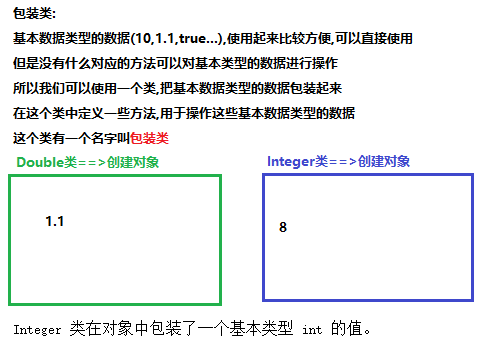

## 2.包装类中装箱和拆箱(重点)

```java
包装类:使用一个类把基本数据类型的数装起来,这个类叫包装类
基本数据类型:
	byte short int long float double char boolen
对应的包装类:java.lang
	Byte Short Integer Long Float Double Character Boolen
包装类中装箱和拆箱(重点)
1.装箱:把基本数据类型的数据转换为包装类int==>Integer
	a.可以使用Integer类的构造方法
		Integer(int value) 参数传递一个int类型的整数
		Integer(String s)  参数传递一个字符串类型的整数
	b.可以使用Integer类中的静态方法valueOf
		static Integer valueOf(int i)  参数传递一个int类型的整数
		static Integer valueOf(String s)  参数传递一个字符串类型的整数
	注意:
		以上两个参数是字符串的方法,必须传递字符串类型的整数,否则会抛出数字格式化异常
		"10" 正确    "a"错误
2.拆箱:把包装类中基本数据的数据取出来,把包装类转换为基本数据类型Integer==>int
	使用包装类中的方法:
		Integer类:int intValue() 以 int 类型返回该 Integer 的值。
		Double类:double doubleValue() 返回此 Double 对象的 double 值。
```

```java
package com.itheima.demo01Integer;

/*
    包装类中装箱和拆箱(重点)
 */
public class Demo01Integer {
    public static void main(String[] args) {
        //1.装箱:把基本数据类型的数据转换为包装类int==>Integer
        //a.可以使用Integer类的构造方法
        Integer in1 = new Integer(10);
        System.out.println(in1);//10 打印对象名不是地址值,重写Object类的toString方法

        Integer in2 = new Integer("10");
        System.out.println(in2);//10

        //b.可以使用Integer类中的静态方法valueOf
        Integer in3 = Integer.valueOf(10);
        System.out.println(in3);//10

        Integer in4 = Integer.valueOf("10");
        System.out.println(in4);//10

        Double d1 = Double.valueOf(1.1);
        System.out.println(d1);//1.1

        //以上两个参数是字符串的方法,必须传递字符串类型的整数,否则会抛出数字格式化异常
        //Integer in5 = Integer.valueOf("a");//NumberFormatException: For input string: "a"
        //System.out.println(in5);

        //2.拆箱:把包装类中基本数据的数据取出来,把包装类转换为基本数据类型Integer==>int
        int i = in1.intValue();
        System.out.println(i);//10

        double v = d1.doubleValue();
        System.out.println(v);//1.1
    }
}
```

## 3.自动装箱,自动拆箱(重点)

```java
package com.itheima.demo01Integer;

/*
    自动装箱,自动拆箱(重点)
    装箱:int==>Integer
    拆箱:Integer==>int
    在JDK1.5之后,装箱和拆箱可以自动进行,不用我们调用方法
 */
public class Demo02Integer {
    public static void main(String[] args) {
        //自动装箱:int类型的数据可以自动转换为Integer类型
        Integer in = 1;//就相当于 Integer in = new Integer(1);

        //自动拆箱:Integer类型的数据可以自动转换为int类型
        int i = in;//就相当于 int i = in.intValue();
    }
}
```

## 4.基本类型与字符串之间的转换(重点,经常使用)

```java
基本类型与字符串之间的转换(重点,经常使用)
1.基本类型数据==>字符串类型
	a.基本类型数据+"":工作中经常使用
	b.可以使用包装类中的静态方法toString
		Integer类:static String toString(int i)
		Double类:static String toString(double d)
	c.可以使用String类中的静态方法valueOf
		static String valueOf(int i) 返回 int 参数的字符串表示形式。
		static String valueOf(double d) 返回 double 参数的字符串表示形式。
2.字符串类型==>基本类型数据(特别重要)
	在每一个包装类中都定义了一个parseXXX方法,可以把字符串基本类型的数据转换为基本数据类型
		Integer类: static int parseInt(String s) 参数传递字符串类型的整数
		Double类: static double parseDouble(String s)  参数传递字符串类型的小数
		...
	注意:
		1.除了Character类,其他类都有parseXXX方法,Character没有parseXXX方法
			怎么把字符串转换为char类型的数据那: "abc".charAt(0)==> 'a'
		2.parseXXX方法,参数必须传递基本数据类型的字符串,否则会抛出数字格式化异常
```

```java
package com.itheima.demo01Integer;

/*
    基本类型与字符串之间的转换(重点,经常使用)
 */
public class Demo03Integer {
    public static void main(String[] args) {
        //1.基本类型数据==>字符串类型
        //a.基本类型数据+"":工作中经常使用
        String s1 = 10+"";//"10"
        System.out.println(s1+10);//1010

        //b.可以使用包装类中的静态方法toString
        String s2 = Integer.toString(100);//"100"
        System.out.println(s2+10);//10010

        //c.可以使用String类中的静态方法valueOf
        String s3 = String.valueOf(1000);//"1000"
        System.out.println(s3+10);//100010

        String s4 = 1.1+"";//"1.1"
        System.out.println(s4+2.2);//1.12.2

        //字符串类型==>基本类型数据(特别重要)
        int i = Integer.parseInt("10");
        System.out.println(i+10);//20

        double d = Double.parseDouble("1.1");
        System.out.println(d+2.2);//3.3000000000000003

        char c1 = "abc".charAt(0);
        System.out.println(c1);//'a'

        //int a = Integer.parseInt("a");//NumberFormatException: For input string: "a"
        //System.out.println(a);

    }
}
```

# 二.String类中常用的成员方法

## 1.方法介绍

```java
1.String concat(String str) 将指定字符串连接到此字符串的结尾。 把两个字符串连接到一起
	"aa".concat("bb")==>"aabb"   "aa"+"bb"==>"aabb"
2.boolean contains(String s)  判断字符串中是否包含指定的字符串;包含返回true,不包含返回false
	"abcabc"==>"abc" true   "abcabc"==>"aaa" false
3.boolean endsWith(String suffix)  判断字符串是否以指定的字符串结尾;是返回true,不是返回false
	"abcabc"==>"c" true   "abcabc"==>"abC" false
4.boolean startsWith(String prefix) 判断字符串是否以指定的字符串开头;是返回true,不是返回false
	"abcabc"==>"abc" true   "abcabc"==>"hello" false
5.int indexOf(String str) 从前往后在字符串中查找另外一个字符串,找到了返回字符串对应的索引,找不到返回-1
6.int lastIndexOf(String s)  从后往前在字符串中查找另外一个字符串,找到了返回字符串对应的索引,找不到返回-1
	"abc你好abc我好abc大家好":在字符串中查找"abc"
	indexOf:0   lastIndexOf:10
	"abc你好abc我好abc大家好":在字符串中查找"我好"
	indexOf:8   lastIndexOf:8
7.String replace(String target, String replacement)  把大的字符串中所有的目标字符串,替换为新的字符串
	"abc你好abc我好abc大家好":把字符串中的"abc"替换为"@_@"==>"@_@你好@_@我好@_@大家好
	目标字符串:String target==>abc
	替换的新字符串:tring replacement==>@_@
8.String substring(int beginIndex) 从开始索引beginIndex截取字符串到字符串的末尾
	"abc你好abc我好abc大家好".substring(3)==>"你好abc我好abc大家好"
9.String substring(int beginIndex, int endIndex)  从开始索引beginIndex到结束索引endIndex截取字符串;包含头,不包含尾
	"abc你好abc我好abc大家好".substring(3,5)==>"你好"
10.char[] toCharArray() 将此字符串转换为一个新的字符数组。
11.byte[] getBytes()  查询系统默认的编码把字符串转换为字节数组
12.String toLowerCase()  把字符串中所有的英文字符转换为小写 "ABC123你好"==>"abc123你好"
13.String toUpperCase()  把字符串中所有的英文字符转换为大写 "abc123你好"==>"ABC123你好"
14.String trim() 去掉字符串两端的空格 "   dsafads ff  ff   asdfda   ".trim()==>"dsafads ff  ff   asdfda"
15.String[] split(String regex)  根据自定的字符串对字符串进行切割,把一个字符串切割为几部分字符串,放在一个数组中返回
	"aa,bb,cc,dd"==>根据,切割字符串==>String[] arr = {"aa","bb","cc","dd"}
	"aa bb cc dd"==>根据空格切割字符串==>String[] arr = {"aa","bb","cc","dd"}
16.boolean equals(String str)  比较两个字符串的内容是否相同,区分大小写
	"aaa".equals("aaa")==>true   "aaa".equals("aAa")==>false
17.boolean equalsIgnoreCase(String anotherString) 比较两个字符串的内容是否相同,不区分大小写
	"aaa".equalsIgnoreCase("aaa")==>true   "aaa".equalsIgnoreCase("aAa")==>true 		"aaa".equalsIgnoreCase("baa")==>false
18. char charAt(int index)  返回字符串指定索引处的字符串
19.int length() 返回此字符串的长度。
```

## 2.方法使用

```java
package com.itheima.demo02String;

import java.util.Arrays;
import java.util.Scanner;

/*
    String类中常用的成员方法
 */
public class Demo01String {
    public static void main(String[] args) {
        show13();
    }

    /*
        18. char charAt(int index)  返回字符串指定索引处的字符串
        19.int length() 返回此字符串的长度。
     */
    private static void show13() {
        //遍历字符串
        String s = "abc";
        for (int i = 0; i < s.length(); i++) {//0,1,2
            System.out.println(s.charAt(i));
        }
        System.out.println("---------------------");
        char[] arr = s.toCharArray();
        for (int i = 0; i < arr.length; i++) {
            System.out.println(arr[i]);
        }
    }

    /*
        16.boolean equals(String str)  比较两个字符串的内容是否相同,区分大小写
            "aaa".equals("aaa")==>true   "aaa".equals("aAa")==>false
        17.boolean equalsIgnoreCase(String anotherString) 比较两个字符串的内容是否相同,不区分大小写
            "aaa".equalsIgnoreCase("aaa")==>true   "aaa".equalsIgnoreCase("aAa")==>true 		"aaa".equalsIgnoreCase("baa")==>false
     */
    private static void show12() {
        System.out.println("aaa".equals("aaa"));//true
        System.out.println("aaa".equals("aAa"));//false
        System.out.println("aaa".equalsIgnoreCase("aaa"));//true
        System.out.println("aaa".equalsIgnoreCase("aAa"));//true
        System.out.println("aaa".equalsIgnoreCase("baa"));//false
    }

    /*
        15.String[] split(String regex)  根据自定的字符串对字符串进行切割,把一个字符串切割为几部分字符串,放在一个数组中返回
        "aa,bb,cc,dd"==>根据,切割字符串==>String[] arr = {"aa","bb","cc","dd"}
        "aa bb cc dd"==>根据空格切割字符串==>String[] arr = {"aa","bb","cc","dd"}
     */
    private static void show11() {
        String[] arr1 = "aa,bb,cc,dd".split(",");
        System.out.println(Arrays.toString(arr1));//[aa, bb, cc, dd]

        String[] arr2 = "aa bb cc dd".split(" ");
        System.out.println(Arrays.toString(arr2));//[aa, bb, cc, dd]

        String[] arr3 = "username=jack,password=1234,sex=男,age=18".split(",");
        System.out.println(Arrays.toString(arr3));
    }

    /*
        注册案例:校验用户名是否已经被占用
     */
    private static void show10() {
        //使用Scanner获取用户输入用户名
        System.out.println("请输入你要注册用户名:");
        String name = new Scanner(System.in).nextLine();
        if("jack".equals(name.trim())){
            System.out.println("您输入的用户名已经被占用!");
        }else{
            System.out.println("恭喜您,该用户名可以使用!");
        }
    }

    /*
        14.String trim() 去掉字符串两端的空格 "   dsafads ff  ff   asdfda   ".trim()==>"dsafads ff  ff   asdfda"
     */
    private static void show09() {
        String s1 = "   dsafads ff  ff   asdfda   ";
        String s2 = s1.trim();
        System.out.println(s1);//"   dsafads ff  ff   asdfda   "
        System.out.println(s2);//"dsafads ff  ff   asdfda"
    }

    /*
        Lower:小写
        Upper:大写
        12.String toLowerCase()  把字符串中所有的英文字符转换为小写 "ABC123你好"==>"abc123你好"
        13.String toUpperCase()  把字符串中所有的英文字符转换为大写 "abc123你好"==>"ABC123你好"
     */
    private static void show08() {
        String s = "abcHello123CBA";
        String s1 = s.toLowerCase();
        System.out.println("s1:"+s1);//s1:abchello123cba
        //System.out.println("abcHello123CBA".toLowerCase());//abchello123cba

        String s2 = s.toUpperCase();
        System.out.println("s2:"+s2);//s2:ABCHELLO123CBA
    }

    /*
        10.char[] toCharArray() 将此字符串转换为一个新的字符数组。
        11.byte[] getBytes()  查询系统默认的编码把字符串转换为字节数组
     */
    private static void show07() {
        String s = "abc";//JDK1.9之前 new char[]{'a','b','c'}  JDK1.9之后 new byte[]{97,98,99}

        char[] chars = s.toCharArray();
        System.out.println(Arrays.toString(chars));//[a, b, c]

        byte[] bytes = s.getBytes();
        System.out.println(Arrays.toString(bytes));//[97, 98, 99]
    }

    /*
        8.String substring(int beginIndex) 从开始索引beginIndex截取字符串到字符串的末尾
            "abc你好abc我好abc大家好".substring(3)==>"你好abc我好abc大家好"
        9.String substring(int beginIndex, int endIndex)  从开始索引beginIndex到结束索引endIndex截取字符串;包含头,不包含尾
            "abc你好abc我好abc大家好".substring(3,5)==>"你好"
     */
    private static void show06() {
        String s1 = "abc你好abc我好abc大家好";
        String s2 = s1.substring(3);
        System.out.println(s1);//abc你好abc我好abc大家好
        System.out.println(s2);//"你好abc我好abc大家好"

        String s3 = s1.substring(3, 5);
        System.out.println(s3);//你好
    }

    /*
        replace:替换
        7.String replace(String target, String replacement)  把大的字符串中所有的目标字符串,替换为新的字符串
            "abc你好abc我好abc大家好":把字符串中的"abc"替换为"@_@"==>"@_@你好@_@我好@_@大家好
            目标字符串:String target==>abc
            替换的新字符串:tring replacement==>@_@
     */
    private static void show05() {
        String s1 = "abc你好abc我好abc大家好";
        String s2 = s1.replace("abc", "@_@");
        System.out.println(s2);//@_@你好@_@我好@_@大家好
    }

    /*
        5.int indexOf(String str) 从前往后在字符串中查找另外一个字符串,找到了返回字符串对应的索引,找不到返回-1
        6.int lastIndexOf(String s)  从后往前在字符串中查找另外一个字符串,找到了返回字符串对应的索引,找不到返回-1
            "abc你好abc我好abc大家好":在字符串中查找"abc"
            indexOf:0   lastIndexOf:10
            "abc你好abc我好abc大家好":在字符串中查找"我好"
            indexOf:8   lastIndexOf:8
     */
    private static void show04() {
        String s = "abc你好abc我好abc大家好";
        int index1 = s.indexOf("abc");
        System.out.println("index1:"+index1);//index1:0

        int index2 = s.lastIndexOf("abc");
        System.out.println("index2:"+index2);//index2:10

        int index3 = s.indexOf("我好");
        System.out.println("index3:"+index3);//index3:8

        int index4 = s.lastIndexOf("我好");
        System.out.println("index4:"+index4);//index4:8

        System.out.println(s.indexOf("hello"));//-1
        System.out.println(s.lastIndexOf("hello"));//-1
    }

    /*
        3.boolean endsWith(String suffix)  判断字符串是否以指定的字符串结尾;是返回true,不是返回false
            "abcabc"==>"c" true   "abcabc"==>"abC" false
        4.boolean startsWith(String prefix) 判断字符串是否以指定的字符串开头;是返回true,不是返回false
            "abcabc"==>"abc" true   "abcabc"==>"hello" false
     */
    private static void show03() {
        String s1 = "Hello.java";
        boolean b1 = s1.endsWith(".java");
        System.out.println("b1:"+b1);//b1:true

        boolean b2 = s1.endsWith(".class");
        System.out.println("b2:"+b2);//b2:false

        boolean b3 = s1.startsWith("Hello");
        System.out.println("b3:"+b3);//b3:true

        boolean b4 = s1.startsWith("hello");
        System.out.println("b4:"+b4);//b4:false
    }

    /*
        contains:包含
        2.boolean contains(String s)  判断字符串中是否包含指定的字符串;包含返回true,不包含返回false
            "abcabc"==>"abc" true   "abcabc"==>"aaa" false
     */
    private static void show02() {
        boolean b1 = "abcabc".contains("abc");
        System.out.println("b1:"+b1);//b1:true

        boolean b2 = "abcabc".contains("aaa");
        System.out.println("b2:"+b2);//b2:false

        System.out.println("你好,我好,大家好!".contains("我好"));//true
        System.out.println("你好,我好,大家好!".contains("hello"));//false
    }

    /*
        concat:连接
        1.String concat(String str) 将指定字符串连接到此字符串的结尾。 把两个字符串连接到一起
            "aa".concat("bb")==>"aabb"   "aa"+"bb"==>"aabb"
     */
    private static void show01() {
        String s = "aa".concat("bb");
        System.out.println(s);//"aabb"

        String s2 = "aa"+"bb";
        System.out.println(s2);//"aabb"
    }
}
```

# 三.引用类型使用小结(使用)

​		实际的开发中，引用(**引用的是堆内存中的地址值**)类型的使用非常重要，也是非常普遍的。我们可以在理解基本类型的使用方式基础上，进一步去掌握引用类型的使用方式。基本类型可以作为成员变量、作为方法的参数、作为方法的返回值，那么当然引用类型也是可以的。在这我们使用两个例子 , 来学习一下。

引用数据类型:

```java
1.引用数据类型定义变量使用:
int a = 10; 基本数据类型赋值
数据类型 变量名 = 创建对象;
int[] arr = new int[10]; 赋值地址值
Student s = new Student(); 赋值地址值
ArrayList<String> list = new ArrayList<String>();赋值地址值
(接口)MyInter m = new MyInterImpl();赋值地址值
(抽象类)Animal a = new Cat(); 赋值地址值

2.引用数据类型作为方法的参数:变量在定义的时候可以没有值,但是使用的时候必须有值
public static void method(int a){} 使用基本数据类型作为方法的参数  method(10)
public static void method(int[] a){}使用引用数据类型作为方法的参数 method(new int[10]);
public static void method(Student s){}使用引用数据类型作为方法的参数 method(new Student());
public static void method(ArrayList<String> list){}使用引用数据类型作为方法的参数 
method(new ArrayList<String>())
public static void method(MyInter m){}使用引用数据类型作为方法的参数
method(new MyInterImpl1())  method(new MyInterImpl2()) method(new MyInter(){重写方法})
    多态:MyInter m = new MyInterImpl1();  MyInter m = new MyInter(){重写方法}==>匿名内部类
public static void method(Animal a){}使用引用数据类型作为方法的参数
method(new Cat())  method(new Dog())
    多态: Animal a = new Cat();  Animal a = new Dog();

3.引用数据类型作为方法的返回值类型:方法中必须返回一个对应的对象
public static int show(){ return 10;}
public static int[] show(){ return new int[10];}
public static Student show(){ return new Student();}
public static ArrayList<String> show(){ return new ArrayList<String>();}
public static MyInter show(){ return new MyInterImpl1();} //返回接口的不同实现类对象
public static MyInter show(){ return new MyInterImpl2();} //返回接口的不同实现类对象
public static Animal show(){ return new Cat();} //返回抽象类的不同子类对象
public static Animal show(){ return new Dog();} //返回抽象类的不同子类对象

4.引用数据类型作为成员变量:
public class Student{
    private int a;
    private int[] arr;
    private Student stu;
    private ArrayList<String> list;
    private MyInter my;
    private Animal animal;
    
    //get和set方法,toString方法,构造方法
}
Student s = new Student();
s.setA(10);
s.setArr(new int[10]);
s.setStu(new Student());
s.setList(new ArrayList<String>());
s.setMyInter(new MyInterImpl());
s.setAnimal(new Cat());

总结:
1.基本数据类型能做什么事(定义变量,作为参数,作为返回值,定义成员变量),引用数据类型也能做
2.基本数据类型使用的值,引用数据类型使用的对象的[地址值]
```

## 1.类名作为方法参数和返回值

```java
package com.itheima.demo03test;

/*
    类名作为方法参数和返回值
        类名做为参数:调用方法就需要传递该类的对象
        类名作为返回值类型:方法中就必须返回该类的对象
 */
public class Demo01Person {
    public static void main(String[] args) {
        Person p1 = new Person("张三",18);
        System.out.println(p1);//com.itheima.demo03test.Person@4554617c
        method(p1);
        System.out.println("--------------------");
        //Person p3 = getPerson() = new Person("胡歌",30);
        Person p3 = getPerson();
        System.out.println(p3.getName()+"\t"+p3.getAge());
    }

    /*
        定义一个方法,方法的返回值类型使用Person类型
        那么方法中就必须返回一个Person类型对象的值
     */
    public static Person getPerson(){
        return new Person("胡歌",30);
    }

    /*
        定义一个方法,方法参数的数据类型使用Person类型
        调用方法,就必须创建Person对象,给Person变量赋值
        Person p2 = p1 = new Person("张三",18);
     */
    public static void method(Person p2){
        System.out.println(p2);//com.itheima.demo03test.Person@4554617c
        System.out.println(p2.getName()+"\t"+p2.getAge());
    }
}
```

```java
package com.itheima.demo03test;

public class Person {
    private String name;
    private int age;

    public Person() {
    }

    public Person(String name, int age) {
        this.name = name;
        this.age = age;
    }

    public String getName() {
        return name;
    }

    public void setName(String name) {
        this.name = name;
    }

    public int getAge() {
        return age;
    }

    public void setAge(int age) {
        this.age = age;
    }
}
```

## 2.抽象类作为方法参数和返回值

- 抽象类作为形参：表示可以接收任何此抽象类的"子类对象"作为实参；
- 抽象类作为返回值：表示"此方法可以返回此抽象类的任何子类对象"；

```java
package com.itheima.demo04Animal;

public abstract class Animal {
    //定义抽象方法
    public abstract void eat();
}
```

```java
package com.itheima.demo04Animal;

public class Cat extends Animal{
    @Override
    public void eat() {
        System.out.println("猫吃鱼!");
    }
}
```

```java
package com.itheima.demo04Animal;

public class Dog extends Animal {
    @Override
    public void eat() {
        System.out.println("狗吃肉!");
    }
}
```

```java
package com.itheima.demo04Animal;

/*
    抽象类作为方法参数和返回值
    多态:扩展性强
    方法的参数和返回值类型使用抽象类,可以传递和返回抽象类的任意子类对象
 */
public class Demo01Animal {
    public static void main(String[] args) {
        method(new Cat());
        method(new Dog());
        method(new Animal() {
            @Override
            public void eat() {
                System.out.println("匿名的动物在吃饭!");
            }
        });
        System.out.println("----------------------------------------");
        /*
            多态:
                Animal a = getInstance(0);= new Cat();
                Animal a = getInstance(1);= new Dog();
                Animal a = getInstance(2);= new Animal() {
                    @Override
                    public void eat() {
                        System.out.println("匿名的动物在吃饭!");
                    }
                };
         */
        Animal a = getInstance(0);
        a.eat();//猫吃鱼!
        a = getInstance(1);
        a.eat();//狗吃肉!
        a = getInstance(2);
        a.eat();//匿名的动物在吃饭!
    }

    /*
        定义一个方法,方法的返回值类型使用Animal类型
        方法中就的返回Animal的子类对象
     */
    public static Animal getInstance(int i){
        if(i==0){
            return new Cat();
        }else if(i==1){
            return new Dog();
        }else{
            return new Animal() {
                @Override
                public void eat() {
                    System.out.println("匿名的动物在吃饭!");
                }
            };
        }
    }

    /*
        定义一个方法,方法的参数使用Animal类型
        调用方法,就可以传递Animal的任意的子类对象,给Animal变量赋值
        多态:
            Animal a = new Cat();
            Animal a = new Dog();
            Animal a = new Animal() {
                @Override
                public void eat() {
                    System.out.println("匿名的动物在吃饭!");
                }
            };
     */
    public static void method(Animal a){
        a.eat();
    }
}
```

## 3.接口作为方法参数和返回值类型

- 接口作为方法的形参：可以传递接口的任意实现类对象
- 接口作为方法的返回值类型：可以返回接口的任意的实现类对象

```java
package com.itheima.demo05test;

/*
    接口作为方法参数和返回值
    多态:扩展性强
    接口作为方法的参数和返回值类型,就可以传递接口的任意的实现类对象,返回任意的实现类对象
 */
public class Demo01Fly {
    public static void main(String[] args) {
        method(new MaQue());
        method(new Ying());
        System.out.println("-------------------------");
        /*
            多态:
            Fly f = getInstacne() = new MaQue();
            Fly f = getInstacne() = new Ying();
         */
        Fly f = getInstacne();
        f.fly();
    }

    /*
        定义一个方法,方法的返回值类型使用Fly接口类型
        在方法中就可以返回Fly接口任意的实现类对象
     */
    public static Fly getInstacne(){
        //return new MaQue();
        return new Ying();
    }

    /*
        定义一个方法,方法的参数类型使用Fly接口
        Fly是一个接口,接口无法创建对象使用
        就可以传递Fly接口任意的实现类对象,为Fly类型的变量赋值
        多态:
            Fly f = new MaQue();
            Fly f = new Ying()
     */
    public static void method(Fly f){
        f.fly();
    }
}
```

```java
package com.itheima.demo05Test;

public interface Fly {
    //抽象飞的方法
    public abstract void fly();
}
```

```java
package com.itheima.demo05Test;

public class Niao implements Fly {
    @Override
    public void fly() {
        System.out.println("小麻雀在飞翔!");
    }
}
```

```java
package com.itheima.demo05Test;

public class Ying implements Fly {
    @Override
    public void fly() {
        System.out.println("鹰击长空!");
    }
}

```

## 4.类名作为成员变量

​	我们每个人(Person)都有一个身份证(IDCard) , 为了表示这种关系 , 就需要在Person中定义一个IDCard的成员变量。定义Person类时，代码如下：

```java
class Person {
    String name;//姓名
    int age;//年龄
    IDCard idCard;//身份证信息
}
```

​	使用`String` 类型表示姓名 , `int` 类型表示年龄。其实，`String`本身就是引用类型，我们往往忽略了它是引用类型。如果我们继续丰富这个类的定义，给`Person` 增加身份证号 , 身份证签发机关等属性，我们将如何编写呢？这时候就需要编写一个IDCard类了

定义IDCard(身份证)类，添加身份证号 , 签发地等属性：

```java
package com.itheima.demo06test;

/*
    定义身份证类
    属性:身份证号,身份证签发地
 */
public class IDCard {
    //身份证号
    private String idNum;
    //身份证签发地
    private String authority;

    public IDCard() {
    }

    public IDCard(String idNum, String authority) {
        this.idNum = idNum;
        this.authority = authority;
    }

    @Override
    public String toString() {
        return "IDCard{" +
                "idNum='" + idNum + '\'' +
                ", authority='" + authority + '\'' +
                '}';
    }

    public String getIdNum() {
        return idNum;
    }

    public void setIdNum(String idNum) {
        this.idNum = idNum;
    }

    public String getAuthority() {
        return authority;
    }

    public void setAuthority(String authority) {
        this.authority = authority;
    }
}
```

修改Person类：

```java
package com.itheima.demo06test;

public class Person {
    private String name;
    private int age;
    /*
        使用IDCard类作为成员变量:赋值,创建对象赋值
     */
    private IDCard idCard;

    public Person() {
    }

    public Person(String name, int age, IDCard idCard) {
        this.name = name;
        this.age = age;
        this.idCard = idCard;
    }

    @Override
    public String toString() {
        return "Person{" +
                "name='" + name + '\'' +
                ", age=" + age +
                ", idCard=" + idCard +
                '}';
    }

    public String getName() {
        return name;
    }

    public void setName(String name) {
        this.name = name;
    }

    public int getAge() {
        return age;
    }

    public void setAge(int age) {
        this.age = age;
    }

    public IDCard getIdCard() {
        return idCard;
    }

    public void setIdCard(IDCard idCard) {
        this.idCard = idCard;
    }
}
```

测试类：

```java
package com.itheima.demo06test;

public class Demo01Person {
    public static void main(String[] args) {
        //创建Person对象
        Person p1 = new Person();
        //使用set方法给成员变量赋值
        p1.setName("马尔扎哈");
        p1.setAge(50);
        p1.setIdCard(new IDCard("110110197007077777","北京市公安局"));
        System.out.println(p1);//Person{name='马尔扎哈', age=50, idCard=IDCard{idNum='110110197007077777', authority='北京市公安局'}}

        Person p2 = new Person("迪丽热巴",18,new IDCard("110110200202022222","北京市公安局"));
        System.out.println(p2);//Person{name='迪丽热巴', age=18, idCard=IDCard{idNum='110110200202022222', authority='北京市公安局'}}
    }
}
```

> 类作为成员变量时，对它进行赋值的操作，实际上，是赋给它该类的一个对象。同理 , 接口也是如此.

## 5.抽象类作为成员变量

- 抽象类作为成员变量——为此成员变量赋值时，可以是任何它的子类对象

```java
package com.itheima.demo07test;

public abstract class Animal {
}
```

```java
package com.itheima.demo07test;

public class Cat extends Animal {
    @Override
    public String toString() {
        return "我养了一只可爱猫!";
    }
}
```

```java
package com.itheima.demo07test;

public class Dog extends Animal {
    @Override
    public String toString() {
        return "我养了一只聪明的狗!";
    }
}
```

```java
package com.itheima.demo07test;

public class Person {
    private String name;
    private int age;
    /*
        使用抽象类Animal作为成员变量
        给Animal变量赋值,可以赋值任意的子类对象
        多态
            Animal animal = new Cat();
            Animal animal = new Dog();
     */
    private Animal animal;

    public Person() {
    }

    public Person(String name, int age, Animal animal) {
        this.name = name;
        this.age = age;
        this.animal = animal;
    }

    @Override
    public String toString() {
        return "Person{" +
                "name='" + name + '\'' +
                ", age=" + age +
                ", animal=" + animal +
                '}';
    }

    public String getName() {
        return name;
    }

    public void setName(String name) {
        this.name = name;
    }

    public int getAge() {
        return age;
    }

    public void setAge(int age) {
        this.age = age;
    }

    public Animal getAnimal() {
        return animal;
    }

    public void setAnimal(Animal animal) {
        this.animal = animal;
    }
}
```

```java
package com.itheima.demo07test;

public class Demo01Person {
    public static void main(String[] args) {
        //创建Person对象
        Person p = new Person();
        p.setName("蔡徐坤");
        p.setAge(48);
        //p.setAnimal(new Cat());
        p.setAnimal(new Dog());
        System.out.println(p);
    }
}
```

## 6.接口作为成员变量

- 接口类型作为成员变量——可以给接口变量赋值不同的实现类对象

```java
package com.itheima.demo07Test;

public interface Fly {
}
```

```java
package com.itheima.demo07Test;

public class Niao implements Fly {
    @Override
    public String toString() {
        return "我是一只可爱的小麻雀!";
    }
}
```

```java
package com.itheima.demo07Test;

public class Ying implements Fly{
    @Override
    public String toString() {
        return "我是一只雄鹰!";
    }
}
```

```java
package com.itheima.demo07Test;

public class Person {
    //姓名
    private String name;
    //年龄
    private int age;
    /*
        定义成员变量,类型使用接口Fly
        接口我们无法直接创建对象赋值,可以创建Fly接口的任意实现类对象给接口变量赋值
        多态:扩展性强
            Fly fly = new Niao();
            Fly fly = new Ying();
     */
    private Fly fly;

    public Person() {
    }

    public Person(String name, int age, Fly fly) {
        this.name = name;
        this.age = age;
        this.fly = fly;
    }

    @Override
    public String toString() {
        return "Person{" +
                "name='" + name + '\'' +
                ", age=" + age +
                ", fly=" + fly +
                '}';
    }

    public String getName() {
        return name;
    }

    public void setName(String name) {
        this.name = name;
    }

    public int getAge() {
        return age;
    }

    public void setAge(int age) {
        this.age = age;
    }

    public Fly getFly() {
        return fly;
    }

    public void setFly(Fly fly) {
        this.fly = fly;
    }
}
```

```java
package com.itheima.demo07Test;

public class Demo01 {
    public static void main(String[] args) {
        //创建Person对象
        Person p1 = new Person();
        p1.setName("古力娜扎");
        p1.setAge(18);
        p1.setFly(new Niao());
        System.out.println(p1);

        //创建Person对象
        Person p2 = new Person("佟丽娅",37,new Ying());
        System.out.println(p2);
    }
}
```

总结:

​	**抽象类|接口作为方法参数,返回值类型,成员变量==>扩展性强,可以传递任意的子类|实现类对象**

# 四.综合案例

## 一.案例演示

### 1.1 程序启动

 运行com.itheima.main.MainApp类，启动程序：

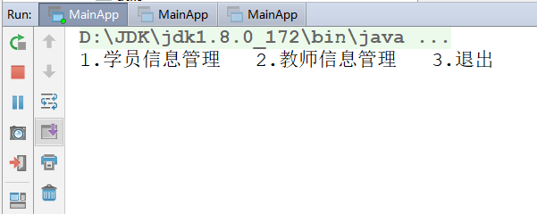


### 1.2 测试学员信息管理模块

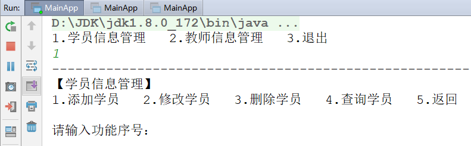


### 1.3 测试【4.查询学员】


### 1.4 测试【1.添加学员】

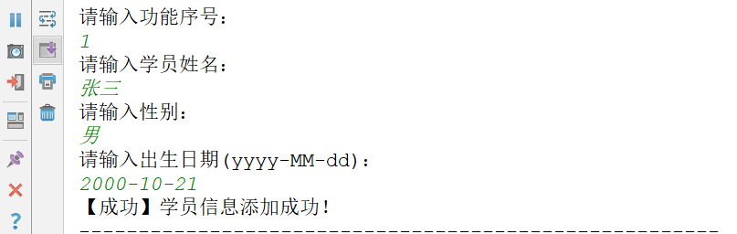


### 1.5 测试【2.修改学员】

- 输入不存在的编号：

  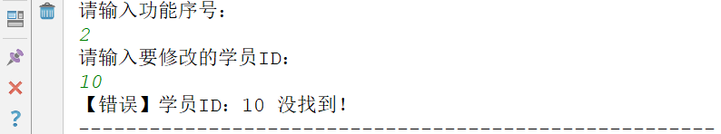

- 输入存在的编号：

  


### 1.6 测试【3.删除学员】

- 输入不存在的编号：

  

- 输入存在的编号，但取消操作：

  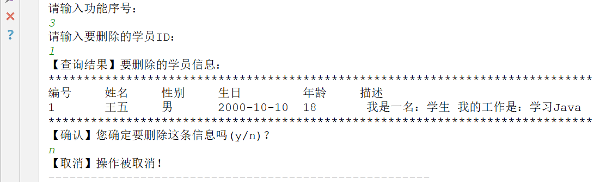

- 输入存在的编号，执行删除：

  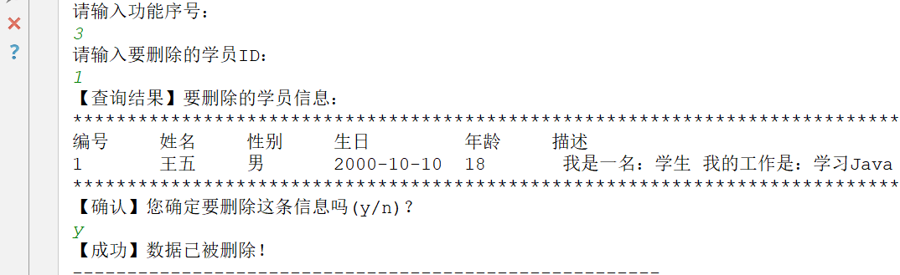

## 二.综合案例-类设计

### 2.1 父类Person(抽象)

- 成员属性：
  - id(编号)
  - name(姓名)
  - sex(性别)
  - birthday(生日)
  - age(年龄-由生日计算得出)
- 构造方法：
  - 无参构造
  - 全参构造
- 成员方法：
  - toString()
- 抽象方法：
  - getType()：由各子类实现，返回各自的"类型"字符串。
  - getWork()：由各子类实现，返回各自的"工作"字符串。


### 2.2 子类Student

- 构造方法
  - 无参构造
  - 全参构造(super调用父类全参构造)
- 重写抽象方法
  - 重写getType()
  - 重写getWork()


### 2.3 子类Teacher

- 构造方法
  - 无参构造
  - 全参构造(super调用父类全参构造)
- 重写抽象方法
  - 重写getType()
  - 重写getWork()


### 2.4 工具类Utils类

- 全局变量
  - 学员ID值(添加学员信息时，编号由此ID加1生成)
  - 教师ID值(添加教师信息时，编号由此ID加1生成)
- 全局方法
  - 根据生日计算年龄的方法
  - 打印一个Person对象的方法；
  - 打印一个ArrayList<Person>集合的方法；


### 2.5 启动类

- 定义启动类：MainApp启动程序。


## 三.类制作类的设计与实现

### 1.抽取形式Person父类

```java
package com.itheima.superclass;

import com.itheima.utils.Utils;

public abstract class Person {
    //id(编号)
    private int id;
    //name(姓名)
    private String name;
    //sex(性别)
    private String sex;
    //birthday(生日)
    private String birthday;
    //age(年龄-由生日计算得出)
    private int age;

    /*
        抽象方法：
            - getType()：由各子类实现，返回各自的"类型"字符串。
            - getWork()：由各子类实现，返回各自的"工作"字符串。
     */
    public abstract String getType();
    public abstract String getWork();

    @Override
    public String toString() {
        return id+"\t\t"+
                name+"\t\t"+
                sex+"\t\t"+
                birthday+"\t\t"+
                getAge()+"\t\t"+
                "我是一名: "+getType()+" ,我的工作是: "+getWork();
    }

    public Person() {
    }

    public Person(int id, String name, String sex, String birthday) {
        this.id = id;
        this.name = name;
        this.sex = sex;
        this.birthday = birthday;
    }

    public int getId() {
        return id;
    }

    public void setId(int id) {
        this.id = id;
    }

    public String getName() {
        return name;
    }

    public void setName(String name) {
        this.name = name;
    }

    public String getSex() {
        return sex;
    }

    public void setSex(String sex) {
        this.sex = sex;
    }

    public String getBirthday() {
        return birthday;
    }

    public void setBirthday(String birthday) {
        this.birthday = birthday;
    }

    public int getAge() {
        //调用工具类中根据生日计算年龄的方法,获取年龄
        this.age = Utils.birthdayToAge(birthday);
        return age;
    }

    public void setAge(int age) {
        this.age = age;
    }
}
```

### 2.创建Student和Teacher子类

```java
package com.itheima.student;

import com.itheima.superclass.Person;

/*
    定义子类Student类,继承Person类,重写Person类的抽象方法
 */
public class Student extends Person{
    public Student() {
        super();//调用父类的空参数构造方法
    }

    public Student(int id, String name, String sex, String birthday) {
        super(id, name, sex, birthday);//调用父类的带参数构造方法
    }

    @Override
    public String getType() {
        return "学生";
    }

    @Override
    public String getWork() {
        return "学习Java";
    }
}
```

```java
package com.itheima.teacher;

import com.itheima.superclass.Person;

/*
    定义子类Teacher类,继承Person类,重写Person类的抽象方法
 */
public class Teacher extends Person{
    public Teacher() {
        super();//调用父类的空参数构造方法
    }

    public Teacher(int id, String name, String sex, String birthday) {
        super(id, name, sex, birthday);//调用父类的带参数构造方法
    }

    @Override
    public String getType() {
        return "教师";
    }

    @Override
    public String getWork() {
        return "讲解Java";
    }
}
```

### 3.工具类创建(了解,直接复制过来使用)

```java
package com.itheima.utils;

import com.itheima.superclass.Person;

import java.text.ParseException;
import java.text.SimpleDateFormat;
import java.util.ArrayList;
import java.util.Calendar;
import java.util.Date;

/*
    工具类创建
    在工具类中定义的成员变量和成员方法一般都是静态的,方便使用
    使用类名.静态成员变量|类名.静态成员方法(参数),可以直接使用
    一般的工具类都会私有空参数构造方法
 */
public class Utils {
    //私有空参数构造方法
    private Utils(){}

    //定义静态的学生和教师编号
    public static int stuId;
    public static int tecId;

    /*
        定义一个静态的打印学生和教师对象的方法
        方法的参数使用父类Person
        多态:可以传递Person任意的子类对象
            Person p = new Student();
            Person p = new Teacher();
     */
    public static void pintPerson(Person p){
        System.out.println("************************************************************************************");
        System.out.println("编号\t\t姓名\t\t性别\t\t生日\t\t\t年龄\t\t描述");
        System.out.println(p.toString());
        System.out.println("************************************************************************************");
    }

    /*
        定义一个静态的遍历集合的方法
        方法的参数: ArrayList<? extends Person> list
        ? extends Person:泛型的上限限定==>传递的集合对象的泛型只能是Person的子类或者Person本身
        ArrayList<Student>:正确
        ArrayList<Teacher>:正确
        ArrayList<Person>:正确
        ArrayList<String>:错误
     */
    public static void printArrayList(ArrayList<? extends Person> list){
        System.out.println("************************************************************************************");
        System.out.println("编号\t\t姓名\t\t性别\t\t生日\t\t\t年龄\t\t描述");
        //遍历集合,获取每一个Student|Teacher对象
        for (int i = 0; i < list.size(); i++) {
            Person p = list.get(i);
            System.out.println(p.toString());
        }
        System.out.println("************************************************************************************");
    }

    /*
	创建一个根据生日计算年龄的方法
	方法的参数:
		String birthday;  1999-9-9
	方法的返回值:
		int:年龄
	注意:
		以后在工作中碰到异常要使用try...catch自己处理异常
 */
    public static int birthdayToAge(String birthday)  {
        //把String类型的生日转换为Date类型
        SimpleDateFormat sdf = new SimpleDateFormat("yyyy-MM-dd");
        //把Date变量定义在try的外边,提高变量的作用域,方便后边可以使用
        Date birthdayDate = null;
        try {
            birthdayDate = sdf.parse(birthday);
        } catch (ParseException e) {
            //异常的处理逻辑:出现了异常之后要做的事情
            return -1;
        }
        //获取当前的日历对象
        Calendar calendarNow = Calendar.getInstance();
        //使用Calendar对象中的方法setTime把生日转换为Calendar对象
        Calendar calendarBir = Calendar.getInstance();
        calendarBir.setTime(birthdayDate);

        /*
            boolean before(Object when) 判断此 Calendar 表示的时间是否在指定 Object 表示的时间之前，返回判断结果。
         */
        if(calendarNow.before(calendarBir)){
            //true:当前日期在出生日期之前说明人还未出生
            return -1;
        }

        //获取当前日期的年与日
        int yearNow = calendarNow.get(Calendar.YEAR);
        int monthNow = calendarNow.get(Calendar.MONTH);
        int dateNow = calendarNow.get(Calendar.DATE);
        //获取生日日期的年与日
        int yearBir = calendarBir.get(Calendar.YEAR);
        int monthBir = calendarBir.get(Calendar.MONTH);
        int dateBir = calendarBir.get(Calendar.DATE);

        //使用当前的年-生日年,粗略的计算出年龄  2020-9-15   2002-9-14|2002-9-16|2002-8-11|2002-10-11
        int age = yearNow-yearBir;//2020-2002 = 18
        //判断当前月份和出生的月份比较
        if(monthNow<=monthBir){
            //当前的月份==出生日期
            if(monthNow==monthBir){
                //对日进行判断 当前日<出生日  2020-9-15  2002-9-16
                if(dateNow<dateBir){
                    age--;
                }
            }else{
                //当前的月份<出生日期:还未过生日,年龄-1
                age--;
            }
        }
        //当前的月份>出生日期:已经过生日
        return age;
    }

    public static void main(String[] args) {
        int age = birthdayToAge("2000-11-1");
        System.out.println(age);
    }
}
```

### 4.一级菜单设计和实现

```java
package com.itheima.main;

import com.itheima.student.Student;
import com.itheima.teacher.Teacher;

import java.util.ArrayList;
import java.util.Scanner;

/*
    主程序类:添加main方法==>用于启动项目
 */
public class MainApp {
    public static void main(String[] args) {
        /*
            一级菜单开发
            1.创建Scanner对象,供所有的方法使用
            2.创建存储Student对象的ArrayList集合
            3.创建存储Teacher对象的ArrayList集合
            4.定义死循环,让功能重复执行
            5.在死循环中打印一级菜单
            6.获取用户输入的功能选项
            7.定义一个switch语句,根据用户选择的功能,调用对应的方法
         */
        //1.创建Scanner对象,供所有的方法使用
        Scanner sc = new Scanner(System.in);
        //2.创建存储Student对象的ArrayList集合
        ArrayList<Student> students = new ArrayList<>();
        //3.创建存储Teacher对象的ArrayList集合
        ArrayList<Teacher> teachers = new ArrayList<>();
        //4.定义死循环,让功能重复执行
        while (true){
            //5.在死循环中打印一级菜单
            System.out.println("---------------------------欢迎使用管理系统--------------------------------");
            System.out.println("1.学员信息管理   2.教师信息管理   3.退出");
            //6.获取用户输入的功能选项
            System.out.println("请选择您要执行的功能:");
            int choose = sc.nextInt();
            //7.定义一个switch语句,根据用户选择的功能,调用对应的方法
            switch (choose){
                case 1:
                    //1.学员信息管理==>调用学员信息管理的方法
                    studentManager(sc,students);
                    break;
                case 2:
                    //2.教师信息管理==>调用教师信息管理的方法
                    teacherManager(sc,teachers);//自动创建方法alt+回车
                    break;
                case 3:
                     //3.退出==>终止JVM
                    System.out.println("欢迎您下次继续使用,拜拜!");
                    System.exit(0);
                default:
                    //用户输入不是123,提示错误信息
                    System.out.println("您输入的功能选项:"+choose+"不存在,请重新输入!");
                    break;
            }
        }
    }

    /*
        教师信息管理的方法
        参数:
            Scanner sc:传递Scanner对象,可以继续使用,不用在重新创建
            ArrayList<Teacher> teachers:存储教师的集合,可以对集合进行增删改查
     */
    private static void teacherManager(Scanner sc, ArrayList<Teacher> teachers) {
        System.out.println("---------------------------欢迎使用教师信息管理--------------------------------");
    }

    /*
        学员信息管理的方法
        参数:
            Scanner sc:传递Scanner对象,可以继续使用,不用在重新创建
            ArrayList<Student> students:存储学生的集合,可以对集合进行增删改查
     */
    private static void studentManager(Scanner sc, ArrayList<Student> students) {
        System.out.println("---------------------------欢迎使用学员信息管理--------------------------------");
    }
}
```

### 5.二级菜单设计和实现

```java
package com.itheima.main;

import com.itheima.student.Student;
import com.itheima.teacher.Teacher;

import java.util.ArrayList;
import java.util.Scanner;

/*
    主程序类:添加main方法==>用于启动项目
 */
public class MainApp {
    public static void main(String[] args) {
        /*
            一级菜单开发
            1.创建Scanner对象,供所有的方法使用
            2.创建存储Student对象的ArrayList集合
            3.创建存储Teacher对象的ArrayList集合
            4.定义死循环,让功能重复执行
            5.在死循环中打印一级菜单
            6.获取用户输入的功能选项
            7.定义一个switch语句,根据用户选择的功能,调用对应的方法
         */
        //1.创建Scanner对象,供所有的方法使用
        Scanner sc = new Scanner(System.in);
        //2.创建存储Student对象的ArrayList集合
        ArrayList<Student> students = new ArrayList<>();
        //3.创建存储Teacher对象的ArrayList集合
        ArrayList<Teacher> teachers = new ArrayList<>();
        //4.定义死循环,让功能重复执行
        while (true){
            //5.在死循环中打印一级菜单
            System.out.println("---------------------------欢迎使用管理系统--------------------------------");
            System.out.println("1.学员信息管理   2.教师信息管理   3.退出");
            //6.获取用户输入的功能选项
            System.out.println("请选择您要执行的功能:");
            int choose = sc.nextInt();
            //7.定义一个switch语句,根据用户选择的功能,调用对应的方法
            switch (choose){
                case 1:
                    //1.学员信息管理==>调用学员信息管理的方法
                    studentManager(sc,students);
                    break;
                case 2:
                    //2.教师信息管理==>调用教师信息管理的方法
                    teacherManager(sc,teachers);//自动创建方法alt+回车
                    break;
                case 3:
                     //3.退出==>终止JVM
                    System.out.println("欢迎您下次继续使用,拜拜!");
                    System.exit(0);
                default:
                    //用户输入不是123,提示错误信息
                    System.out.println("您输入的功能选项:"+choose+"不存在,请重新输入!");
                    break;
            }
        }
    }

    /*
        教师信息管理的方法
        参数:
            Scanner sc:传递Scanner对象,可以继续使用,不用在重新创建
            ArrayList<Teacher> teachers:存储教师的集合,可以对集合进行增删改查
     */
    private static void teacherManager(Scanner sc, ArrayList<Teacher> teachers) {
        System.out.println("---------------------------欢迎使用教师信息管理--------------------------------");
    }

    /*
        学员信息管理的方法
        参数:
            Scanner sc:传递Scanner对象,可以继续使用,不用在重新创建
            ArrayList<Student> students:存储学生的集合,可以对集合进行增删改查
        二级菜单的开发:
            1.定义一个死循环让功能重复执行
            2.在死循环中打印学员信息管理的菜单
            3.获取用户输入的功能选项
            4.创建一个switch语句,根据用户输入的功能选项,选择对应的功能
     */
    private static void studentManager(Scanner sc, ArrayList<Student> students) {
        System.out.println("---------------------------欢迎使用学员信息管理--------------------------------");
        //1.定义一个死循环让功能重复执行
        while (true){
            //2.在死循环中打印学员信息管理的菜单
            System.out.println("1.添加学员  2.修改学员  3.删除学员  4.查询学员  5.返回");
            //3.获取用户输入的功能选项
            System.out.println("请输入你要选择的功能:");
            int choose = sc.nextInt();
            //4.创建一个switch语句,根据用户输入的功能选项,选择对应的功能
            switch (choose){
                case 1:
                    //1.添加学员==>调用添加学员的方法
                    addStudent(sc,students);
                    break;
                case 2:
                    //2.修改学员==>调用修改学员的方法
                    updateStudent(sc,students);
                    break;
                case 3:
                    //3.删除学员==>调用删除学员的方法
                    deleteStudent(sc,students);
                    break;
                case 4:
                    //4.查询学员==>调用查询学员的方法
                    selectStudent(students);
                    break;
                case 5:
                    //5.返回==>返回一级菜单
                    return;//结束方法
                default:
                    //用户输入不是12345,提示错误信息
                    System.out.println("您输入的功能选项:"+choose+"不存在,请重新输入!");
                    break;
            }
        }
    }

    /*
        查询学员的方法
     */
    private static void selectStudent(ArrayList<Student> students) {
        System.out.println("---------------------------欢迎使用查询学员的功能--------------------------------");

    }

    /*
        删除学员的方法
     */
    private static void deleteStudent(Scanner sc, ArrayList<Student> students) {
        System.out.println("---------------------------欢迎使用删除学员的功能--------------------------------");
    }

    /*
        修改学员的方法
     */
    private static void updateStudent(Scanner sc, ArrayList<Student> students) {
        System.out.println("---------------------------欢迎使用修改学员的功能--------------------------------");
    }

    /*
        添加学员的方法
     */
    private static void addStudent(Scanner sc, ArrayList<Student> students) {
        System.out.println("---------------------------欢迎使用添加学员的功能--------------------------------");
    }


}
```

### 6.查询学员的方法

```java
/*
    查询学员的方法
 */
private static void selectStudent(ArrayList<Student> students) {
    System.out.println("---------------------------欢迎使用查询学员的功能--------------------------------");
    //对集合的长度进行判断
    if(students.size()==0){
        //没有添加学员
        System.out.println("[查询结果]");
        System.out.println("您还没有添加学员,请添加学员后在进行查询!");
    }else {
        //有学员,调用工具类中打印集合的方法
        Utils.printArrayList(students);
    }
}
```

### 7.添加学员的方法

```java
/*
    添加学员的方法
    1.获取用户输入的学员信息(姓名,性别,出生日期)
    2.创建Student对象,封装学员信息
    3.把Student对象添加到ArrayList集合中
    4.提示用户"恭喜您,添加学员["+name+"]成功!"
 */
private static void addStudent(Scanner sc, ArrayList<Student> students) {
    System.out.println("---------------------------欢迎使用添加学员的功能--------------------------------");
    //1.获取用户输入的学员信息(姓名,性别,出生日期)
    System.out.println("请输入学员的姓名:");
    String name = sc.next();
    System.out.println("请输入学员的性别:");
    String sex = sc.next();
    System.out.println("请输入学员的出生日期(yyyy-MM-dd):");
    String birthday = sc.next();
    //2.创建Student对象,封装学员信息
    Student student = new Student(++Utils.stuId,name,sex,birthday);
    //3.把Student对象添加到ArrayList集合中
    students.add(student);
    //4.提示用户"恭喜您,添加学员["+name+"]成功!"
    System.out.println("恭喜您,添加学员["+name+"]成功!");
}
```

### 8.修改学员的方法

```java
/*
    修改学员的方法
    1.获取用户要修改的学员id
    2.遍历存储学员的ArrayList集合,获取每一个Student对象
    3.使用用户输入的学员id和遍历得到的学员id进行比较
    4.如果用户输入的学员id和遍历得到的学员id一样,进行修改
    5.先调用工具类中打印学员信息的方法,打印要修改的学员信息
    6.获取用户输入的新的学员信息(姓名,性别,出生日期)输入0保留原值
    7.判断用户输入的数据是否为0,不是0替换
    8.提示用户"恭喜您id是["+id+"]的学员信息修改成功!"
    9.修改成功,结束修改学员的方法
    10.遍历结束了,还没有找到对应的学员,提示用户"您输入的学员id=["+id+"]有误,请重新输入!"
 */
private static void updateStudent(Scanner sc, ArrayList<Student> students) {
    System.out.println("---------------------------欢迎使用修改学员的功能--------------------------------");
    //1.获取用户要修改的学员id
    System.out.println("请输入要修改的学员id:");
    int id = sc.nextInt();
    //2.遍历存储学员的ArrayList集合,获取每一个Student对象
    for (int i = 0; i < students.size(); i++) {
        Student s = students.get(i);
        //3.使用用户输入的学员id和遍历得到的学员id进行比较
        if(id==s.getId()){
            //4.如果用户输入的学员id和遍历得到的学员id一样,进行修改
            //5.先调用工具类中打印学员信息的方法,打印要修改的学员信息
            System.out.println("[查询结果]要修改的学员信息:");
            Utils.pintPerson(s);
            //6.获取用户输入的新的学员信息(姓名,性别,出生日期)输入0保留原值
            System.out.println("请输入新的学员姓名(输入0保留原值):");
            String name = sc.next();
            System.out.println("请输入新的学员性别(输入0保留原值):");
            String sex = sc.next();
            System.out.println("请输入新的学员出生日期(yyyy-MM-dd)(输入0保留原值):");
            String birthday = sc.next();
            //7.判断用户输入的数据是否为0,不是0替换
            if(!"0".equals(name)){
                s.setName(name);
            }
            if(!"0".equals(sex)){
                s.setSex(sex);
            }
            if(!"0".equals(birthday)){
                s.setBirthday(birthday);
            }
            //8.提示用户"恭喜您id是["+id+"]的学员信息修改成功!"
            System.out.println("恭喜您id是["+id+"]的学员信息修改成功!");
            //9.修改成功,结束修改学员的方法
            return;
        }
    }
    //10.遍历结束了,还没有找到对应的学员,提示用户"您输入的学员id=["+id+"]有误,请重新输入!"
    System.out.println("您输入的学员id=["+id+"]有误,请重新输入!");
}
```

### 9.删除学员的方法

```java
/*
    删除学员的方法
    1.获取用户要删除的学员id
    2.遍历存储学员的ArrayList集合,获取每一个Student对象
    3.使用用户输入的学员id和遍历得到的学员id进行比较
    4.如果用户输入的学员id和遍历得到的学员id一样,进行修改
    5.先调用工具类中打印学员信息的方法,打印要删除的学员信息
    6.获取用户是否确定删除的选项y|n
    7.根据用户输入的yesAndNo确定是否删除学员信息
        输入y|Y:删除学员
            在集合中删除学员
            提示用户"恭喜您id是["+id+"]的学员信息删除成功!"
            结束删除学员的方法
        输入n|N:取消删除
            提示用户"[删除操作已经取消!]"
            结束删除学员的方法
    8.遍历结束了,还没有找到对应id的学员,提示用户"您输入的学员id=["+id+"]有误,请重新输入!"
 */
private static void deleteStudent(Scanner sc, ArrayList<Student> students) {
    System.out.println("---------------------------欢迎使用删除学员的功能--------------------------------");
    //1.获取用户要删除的学员id
    System.out.println("请输入你要删除的学员id:");
    int id = sc.nextInt();
    //2.遍历存储学员的ArrayList集合,获取每一个Student对象
    for (int i = 0; i < students.size(); i++) {
        Student s = students.get(i);
        //3.使用用户输入的学员id和遍历得到的学员id进行比较
        if(id==s.getId()){
            //4.如果用户输入的学员id和遍历得到的学员id一样,进行修改
            //5.先调用工具类中打印学员信息的方法,打印要删除的学员信息
            System.out.println("[查询结果]要删除的学员信息:");
            Utils.pintPerson(s);
            //6.获取用户是否确定删除的选项y|n
            System.out.println("您确定要删除id是["+id+"]的学员吗?y|n");
            String yesAndNo = sc.next();
            //7.根据用户输入的yesAndNo确定是否删除学员信息
            if("y".equalsIgnoreCase(yesAndNo)){
                //输入y|Y:删除学员
                //在集合中删除学员
                students.remove(i);
                //提示用户"恭喜您id是["+id+"]的学员信息删除成功!"
                System.out.println("恭喜您id是["+id+"]的学员信息删除成功!");
                //结束删除学员的方法
                return;
            }else{
                //输入n|N:取消删除
                //提示用户"[删除操作已经取消!]"
                System.out.println("[删除操作已经取消!]");
                //结束删除学员的方法
                return;
            }
        }
    }
    //8.遍历结束了,还没有找到对应id的学员,提示用户"您输入的学员id=["+id+"]有误,请重新输入!"
    System.out.println("您输入的学员id=["+id+"]有误,请重新输入!");
}
```

### 程序测试:

```java
---------------------------欢迎使用管理系统--------------------------------
1.学员信息管理   2.教师信息管理   3.退出
请选择您要执行的功能:
1
---------------------------欢迎使用学员信息管理--------------------------------
1.添加学员  2.修改学员  3.删除学员  4.查询学员  5.返回
请输入你要选择的功能:
1
---------------------------欢迎使用添加学员的功能--------------------------------
请输入学员的姓名:
jack
请输入学员的性别:
男
请输入学员的出生日期(yyyy-MM-dd):
1998-9-9
恭喜您,添加学员[jack]成功!
---------------------------欢迎使用学员信息管理--------------------------------
1.添加学员  2.修改学员  3.删除学员  4.查询学员  5.返回
请输入你要选择的功能:
1
---------------------------欢迎使用添加学员的功能--------------------------------
请输入学员的姓名:
rose
请输入学员的性别:
女
请输入学员的出生日期(yyyy-MM-dd):
2000-2-2
恭喜您,添加学员[rose]成功!
---------------------------欢迎使用学员信息管理--------------------------------
1.添加学员  2.修改学员  3.删除学员  4.查询学员  5.返回
请输入你要选择的功能:
4
---------------------------欢迎使用查询学员的功能--------------------------------
************************************************************************************
编号	姓名		性别	生日			年龄		描述
1		jack		男		1998-9-9		22		我是一名: 学生 ,我的工作是: 学习Java
2		rose		女		2000-2-2		20		我是一名: 学生 ,我的工作是: 学习Java
************************************************************************************
---------------------------欢迎使用学员信息管理--------------------------------
1.添加学员  2.修改学员  3.删除学员  4.查询学员  5.返回
请输入你要选择的功能:
3
---------------------------欢迎使用删除学员的功能--------------------------------
请输入你要删除的学员id:
4
您输入的学员id=[4]有误,请重新输入!
---------------------------欢迎使用学员信息管理--------------------------------
1.添加学员  2.修改学员  3.删除学员  4.查询学员  5.返回
请输入你要选择的功能:
3
---------------------------欢迎使用删除学员的功能--------------------------------
请输入你要删除的学员id:
1
[查询结果]要删除的学员信息:
************************************************************************************
编号	姓名		性别	生日			年龄		描述
1		jack		男		1998-9-9		22		我是一名: 学生 ,我的工作是: 学习Java
************************************************************************************
您确定要删除id是[1]的学员吗?y|n
n
[删除操作已经取消!]
---------------------------欢迎使用学员信息管理--------------------------------
1.添加学员  2.修改学员  3.删除学员  4.查询学员  5.返回
请输入你要选择的功能:
4
---------------------------欢迎使用查询学员的功能--------------------------------
************************************************************************************
编号	姓名		性别	生日			年龄		描述
1		jack		男		1998-9-9		22		我是一名: 学生 ,我的工作是: 学习Java
2		rose		女		2000-2-2		20		我是一名: 学生 ,我的工作是: 学习Java
************************************************************************************
---------------------------欢迎使用学员信息管理--------------------------------
1.添加学员  2.修改学员  3.删除学员  4.查询学员  5.返回
请输入你要选择的功能:
3
---------------------------欢迎使用删除学员的功能--------------------------------
请输入你要删除的学员id:
1
[查询结果]要删除的学员信息:
************************************************************************************
编号	姓名		性别	生日			年龄		描述
1		jack		男		1998-9-9		22		我是一名: 学生 ,我的工作是: 学习Java
************************************************************************************
您确定要删除id是[1]的学员吗?y|n
Y
恭喜您id是[1]的学员信息删除成功!
---------------------------欢迎使用学员信息管理--------------------------------
1.添加学员  2.修改学员  3.删除学员  4.查询学员  5.返回
请输入你要选择的功能:
4
---------------------------欢迎使用查询学员的功能--------------------------------
************************************************************************************
编号	姓名		性别	生日			年龄		描述
2		rose		女		2000-2-2		20		我是一名: 学生 ,我的工作是: 学习Java
************************************************************************************
---------------------------欢迎使用学员信息管理--------------------------------
1.添加学员  2.修改学员  3.删除学员  4.查询学员  5.返回
请输入你要选择的功能:
3
---------------------------欢迎使用删除学员的功能--------------------------------
请输入你要删除的学员id:
2
[查询结果]要删除的学员信息:
************************************************************************************
编号	姓名		性别	生日			年龄		描述
2		rose		女		2000-2-2		20		我是一名: 学生 ,我的工作是: 学习Java
************************************************************************************
您确定要删除id是[2]的学员吗?y|n
y
恭喜您id是[2]的学员信息删除成功!
---------------------------欢迎使用学员信息管理--------------------------------
1.添加学员  2.修改学员  3.删除学员  4.查询学员  5.返回
请输入你要选择的功能:
4
---------------------------欢迎使用查询学员的功能--------------------------------
[查询结果]
您还没有添加学员,请添加学员后在进行查询!
---------------------------欢迎使用学员信息管理--------------------------------
1.添加学员  2.修改学员  3.删除学员  4.查询学员  5.返回
请输入你要选择的功能:
5
---------------------------欢迎使用管理系统--------------------------------
1.学员信息管理   2.教师信息管理   3.退出
请选择您要执行的功能:
3
欢迎您下次继续使用,拜拜!
```

## 🎗经验分享

### 1.已知综合案例中打印二级菜单和添加学员功能的代码

```java
private static void studentManager(ArrayList<Student> students, Scanner sc) {
	//1.定义一个死循环,让功能重复执行
	while (true){
		//2.在死循环中,打印学生管理菜单
		System.out.println("-----------------------------欢迎使用学员信息管理功能-------------------------------------");
		System.out.println("1.添加学员  2.修改学员  3.删除学员  4.查询学员  5.返回");
		//3.获取用户输入的功能选项
		System.out.println("请输入您要选择的功能:");
		int choose = sc.nextInt();
		//4.创建switch语句,根据用户输入的功能选项,选择对应的功能
		switch (choose){
			case 1:
				//1.添加学员==>调用添加学员的方法
				addStudent(students,sc);
				break;
			case 2:
				//2.修改学员==>调用修改学员的方法
				updateStudent(students,sc);
				break;
			case 3:
				//3.删除学员==>调用删除学员的方法
				deleteStudent(students,sc);
				break;
			case 4:
				//4.查询学员==>调用查询学员的方法
				selectStudent(students,sc);
				break;
			case 5:
				//5.返回==>返回到一级菜单
				return;//结束当前的方法
			default:
				//输入的不是12345
				System.out.println("你输入的功能选项:"+choose+"不存在,请重新输入!");
				break;
		}
	}
}
private static void addStudent(ArrayList<Student> students, Scanner sc) {
	System.out.println("-----------------------------欢迎使用添加学员的功能-------------------------------------");
	//1.获取用户输入的学员信息
	//a.姓名
	System.out.println("请输入学生的姓名:");
	String name = sc.nextLine();
	//b.性别
	System.out.println("请输入学生的性别:");
	String sex = sc.nextLine();
	//c.出生日期(yyyy-MM-dd)
	System.out.println("请输入学生的出生日期(yyyy-MM-dd):");
	String birthday = sc.nextLine();

	//2.创建Student学生对象,把用户输入的信息封装到对象中
	Student s = new Student(++Utils.stuId,name,sex,birthday);

	//3.把Student对象添加到存储学生的ArrayList集合中
	students.add(s);

	//4.给用户一个添加成功的提示信息
	System.out.println("恭喜您,添加学生["+name+"]成功!");
}
```

### 2.出现的问题

> 添加学生信息的时候,发现不让我们输入姓名,直接从性别开始输入

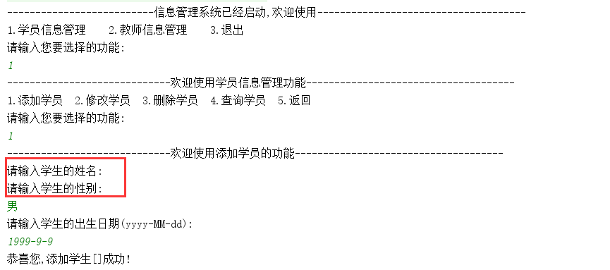

### 3.问题的分析

这是因为创建了一个Scanner对象,使用nextInt方法和nextLine方法冲突导致

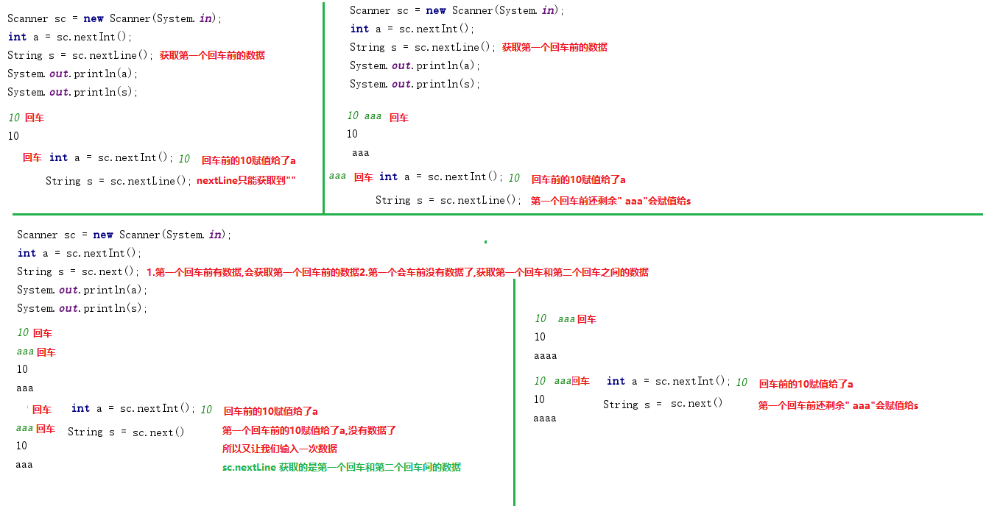

### 4.问题解决办法

> 第一种解决办法:只创建一个Scanner对象,可以使用nextInt获取整数,使用next方法获取字符串
>
> 这样的弊端就是字符串中间不能输入空格

```java
private static void studentManager(ArrayList<Student> students, Scanner sc) {
	//1.定义一个死循环,让功能重复执行
	while (true){
		//2.在死循环中,打印学生管理菜单
		System.out.println("-----------------------------欢迎使用学员信息管理功能-------------------------------------");
		System.out.println("1.添加学员  2.修改学员  3.删除学员  4.查询学员  5.返回");
		//3.获取用户输入的功能选项
		System.out.println("请输入您要选择的功能:");
		int choose = sc.nextInt();
		//4.创建switch语句,根据用户输入的功能选项,选择对应的功能
		switch (choose){
			case 1:
				//1.添加学员==>调用添加学员的方法
				addStudent(students,sc);
				break;
			case 2:
				//2.修改学员==>调用修改学员的方法
				updateStudent(students,sc);
				break;
			case 3:
				//3.删除学员==>调用删除学员的方法
				deleteStudent(students,sc);
				break;
			case 4:
				//4.查询学员==>调用查询学员的方法
				selectStudent(students,sc);
				break;
			case 5:
				//5.返回==>返回到一级菜单
				return;//结束当前的方法
			default:
				//输入的不是12345
				System.out.println("你输入的功能选项:"+choose+"不存在,请重新输入!");
				break;
		}
	}
}
private static void addStudent(ArrayList<Student> students, Scanner sc) {
	System.out.println("-----------------------------欢迎使用添加学员的功能-------------------------------------");
	//1.获取用户输入的学员信息
	//a.姓名
	System.out.println("请输入学生的姓名:");
	String name = sc.nextLine();
	//b.性别
	System.out.println("请输入学生的性别:");
	String sex = sc.nextLine();
	//c.出生日期(yyyy-MM-dd)
	System.out.println("请输入学生的出生日期(yyyy-MM-dd):");
	String birthday = sc.nextLine();

	//2.创建Student学生对象,把用户输入的信息封装到对象中
	Student s = new Student(++Utils.stuId,name,sex,birthday);

	//3.把Student对象添加到存储学生的ArrayList集合中
	students.add(s);

	//4.给用户一个添加成功的提示信息
	System.out.println("恭喜您,添加学生["+name+"]成功!");
}
```

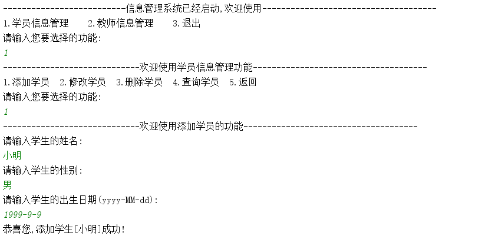

> 第二种解决办法:可以使用两个Scanner对象,一个对象使用nextInt方法获取整数,一个对象使用nextLine方法获取字符串,这样的好处是字符串可以获取一行,中间可以包含空格
>
> 例如下边的代码:
>
> 使用传递的Scanner对象调用nextInt方法获取整数
>
> 在添加学生的addStudent方法中,在创建一个Scanner对象,用于获取字符串

```java
private static void studentManager(ArrayList<Student> students, Scanner sc) {
	//1.定义一个死循环,让功能重复执行
	while (true){
		//2.在死循环中,打印学生管理菜单
		System.out.println("-----------------------------欢迎使用学员信息管理功能-------------------------------------");
		System.out.println("1.添加学员  2.修改学员  3.删除学员  4.查询学员  5.返回");
		//3.获取用户输入的功能选项
		System.out.println("请输入您要选择的功能:");
		int choose = sc.nextInt();
		//4.创建switch语句,根据用户输入的功能选项,选择对应的功能
		switch (choose){
			case 1:
				//1.添加学员==>调用添加学员的方法
				addStudent(students,sc);
				break;
			case 2:
				//2.修改学员==>调用修改学员的方法
				updateStudent(students,sc);
				break;
			case 3:
				//3.删除学员==>调用删除学员的方法
				deleteStudent(students,sc);
				break;
			case 4:
				//4.查询学员==>调用查询学员的方法
				selectStudent(students,sc);
				break;
			case 5:
				//5.返回==>返回到一级菜单
				return;//结束当前的方法
			default:
				//输入的不是12345
				System.out.println("你输入的功能选项:"+choose+"不存在,请重新输入!");
				break;
		}
	}
}
private static void addStudent(ArrayList<Student> students, Scanner sc) {
	System.out.println("-----------------------------欢迎使用添加学员的功能-------------------------------------");
    Scanner sc2 = new Scanner(System.in);
	//1.获取用户输入的学员信息
	//a.姓名
	System.out.println("请输入学生的姓名:");
	String name = sc2.nextLine();
	//b.性别
	System.out.println("请输入学生的性别:");
	String sex = sc2.nextLine();
	//c.出生日期(yyyy-MM-dd)
	System.out.println("请输入学生的出生日期(yyyy-MM-dd):");
	String birthday = sc2.nextLine();

	//2.创建Student学生对象,把用户输入的信息封装到对象中
	Student s = new Student(++Utils.stuId,name,sex,birthday);

	//3.把Student对象添加到存储学生的ArrayList集合中
	students.add(s);

	//4.给用户一个添加成功的提示信息
	System.out.println("恭喜您,添加学生["+name+"]成功!");
}
```

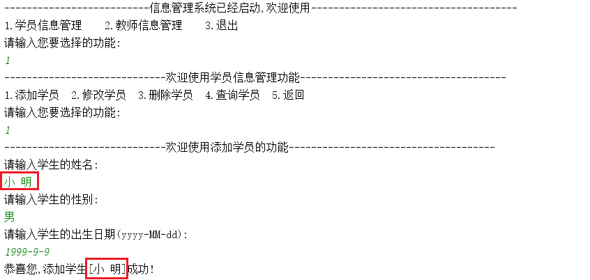