# 学习目标

```java
能够说出集合与数组的区别
	数组:
		1.是引用数据类型的一种
		2.可以存储多个元素
		3.数组的长度是固定的 int[] arr1 = new int[10];  int[] arr2 = {1,2,3};
		4.数组即可以存储基本类型的数据,又可以存储引用数据类型的数据
			int[],double[],String[],Student[]
	集合:
		1.是引用数据类型的一种
		2.可以存储多个元素
		3.集合的长度是可以变化的(可以往集合中添加元素,删除集合中的元素)
		4.只能存储引用数据类型的数据
			ArrayList<int> 错误	ArrayList<Integer>	ArrayList<Student>
能够使用Collection集合的常用功能(重点)
	public boolean add(E e) ： 把给定的对象添加到当前集合中 。
	public boolean remove(E e) : 把给定的对象在当前集合中删除。
	public boolean contains(Object obj) : 判断当前集合中是否包含给定的对象。
	public boolean isEmpty() : 判断当前集合是否为空。
	public int size() : 返回集合中元素的个数。
	public Object[] toArray() : 把集合中的元素，存储到数组中
	public void clear() :清空集合中所有的元素。
能够使用迭代器对集合进行取元素(重点)
	//1.创建集合对象,往集合中添加元素
	Collection<String> coll = new ArrayList<>();
	//Collection<String> coll = new HashSet<>();
	coll.add("詹姆斯");
	coll.add("姚明");
	coll.add("科比");
	coll.add("乔丹");
	coll.add("艾弗森");
	//2.使用Collection接口中的方法iterator,获取迭代器的实现类对象
	Iterator<String> it = coll.iterator();
	//3.使用迭代器对象Iterator中的方法hasNext和next遍历集合
	while(it.hasNext()){
		String s = it.next();
		System.out.println(s);
	}
能够使用增强for循环遍历集合和数组(重点)
	for(集合|数组中元素的数据类型 变量名: 集合|数组){
		sout(变量名);
	}
	int[] arr = {1,2,3};
	for(int i : arr){
		sout(i);
	}
	ArrayList<String> list = new ArrayList<>();
	list.add("a");
	list.add("b");
	for(String s : list){
		sout(s);
	}
能够理解泛型上下限
    泛型的上限限定: ? extends E ==>传递的未知类型?只能是E的子类或者本身
    泛型的下限限定: ? super E   ==>传递的未知类型?只能是E的父类或者本身
能够阐述泛型通配符的作用
	泛型的通配符: ?  可以接收任意的数据类型
能够说出常见的数据结构
	栈,队列,数组,链表,红黑树(看视频)
能够说出数组结构特点
	查询快,增删慢
能够说出栈结构特点
	先进后出
能够说出队列结构特点
	先进先出
能够说出单向链表结构特点
	查询慢,增删快
能够说出List集合特点
	1.有序
	2.允许存储重复的元素
	3.有带索引的方法(练习 add,remove,set,get)	
```

# 第一章 Collection集合

## 1.集合和数组的区别

**数组:**

1.是引用数据类型的一种

2.可以存储多个元素

3.数组的长度是固定的 int[] arr1 = new int[10];  int[] arr2 = {1,2,3};  

4.数组即可以存储基本数据类型的数据,又可以存储引用数据类型的数据 int[] double[] String[] Student[]

**集合:**

1.是引用数据类型的一种

2.可以存储多个元素

3.集合的长度是可以变化的(添加元素,删除集合中的元素)

4.集合只能存储引用数据类型的数据 

 `ArrayList<int> 错误  ArrayList<Integer>  ArrayList<Student> ArrayList<String>正确`

## 2.集合常用类的继承体系

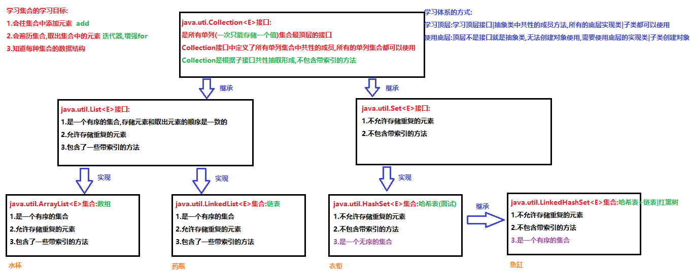

## 3.Collection常用功能(重点)

```java
package com.itheima.demo01Collection;

import java.util.ArrayList;
import java.util.Arrays;
import java.util.Collection;
import java.util.HashSet;

/*
    java.util.Collection<E>接口:是所有单列集合中最顶层的接口
        Collection中定义的方法,所有的单列集合都可以使用
    常用方法:
        public boolean add(E e) ： 往集合中添加元素
        public boolean remove(E e) : 删除集合中指定的元素
        public boolean contains(Object obj) : 判断当前集合中是否包含指定的对象。
        public boolean isEmpty() : 判断当前集合是否为空。
        public int size() : 返回集合中元素的个数。
        public Object[] toArray() : 把集合中的元素，存储到数组中
        public void clear() :清空集合中所有的元素。
 */
public class Demo01Collection {
    public static void main(String[] args) {
        //创建Collection集合对象:多态
        Collection<String> coll = new ArrayList<>();
        //coll = new HashSet<>();
        System.out.println(coll.isEmpty());//true

        /*
            public boolean add(E e) ： 往集合中添加元素
            返回值
                添加元素成功,返回true
                添加元素失败,返回false
            注意:
                ArrayList集合add方法百分之百返回true
         */
        coll.add("张三");
        coll.add("李四");
        coll.add("张三");
        coll.add("王五");
        coll.add("赵六");
        coll.add("田七");
        System.out.println(coll);//[张三, 李四, 张三, 王五, 赵六, 田七]

        /*
            public boolean remove(E e) : 删除集合中指定的元素
            返回值:boolean
                集合中有指定的元素,删除元素,返回true
                集合中没有指定的元素,删除失败,返回false
            注意:
                删除的元素有重复的,只会删除第一个
         */
        boolean b1 = coll.remove("张三");
        System.out.println("b1:"+b1);//b1:true
        System.out.println(coll);//[李四, 张三, 王五, 赵六, 田七]

        boolean b2 = coll.remove("赵四");
        System.out.println("b2:"+b2);//b2:false
        System.out.println(coll);//[李四, 张三, 王五, 赵六, 田七]

        /*
            public boolean contains(Object obj) : 判断当前集合中是否包含指定的对象。
            返回值:boolean
                包含指定的元素,返回true
                不包含指定的元素,返回false
         */
        boolean b3 = coll.contains("王五");
        System.out.println("b3:"+b3);//b3:true

        boolean b4 = coll.contains("刘亦菲");
        System.out.println("b4:"+b4);//b4:false

        /*
            public boolean isEmpty() : 判断当前集合是否为空。
            返回值:boolean
                集合是空的,没有元素,返回true
                集合不是空的,返回false
         */
        boolean b5 = coll.isEmpty();
        System.out.println("b5:"+b5);//b5:false

        //public int size() : 返回集合中元素的个数。
        System.out.println(coll.size());//5

        //public Object[] toArray() : 把集合中的元素，存储到数组中
        Object[] arr = coll.toArray();
        System.out.println(Arrays.toString(arr));//[李四, 张三, 王五, 赵六, 田七]

        /*
            public void clear() :清空集合中所有的元素。
            此方法仅仅是清空集合,集合还可以继续使用
         */
        coll.clear();
        System.out.println(coll);//[]

        coll.add("刘能");
        System.out.println(coll);//[刘能]
    }
}
```

# 第二章 Iterator迭代器

## 1.迭代器的概述

```java
迭代器:是一种通用的遍历集合,取出集合中元素的方式
迭代器由来:
	集合有很多种,每种集合的数据结构是不同的(数组,链表,哈希表...),集合取出元素的方式也不同
	我们不可能为每种集合都定义一种取出元素的方式,浪费
	所以我们就可以使用迭代器,是集合通用的取出元素的方式
迭代器取出元素的原理:
	判断集合中还有没有元素,有就取出来
	再判断集合中还有没有元素,有再取出来
	一直判断到集合中没有元素为止,这种取出元素的方式叫迭代
-----------------------------------------------------------------------------------
java.util.Iterator<E>接口:对 collection 进行迭代的迭代器。
Iterator接口中的常用方法:
	boolean hasNext() 判断集合中还有没有元素;有返回true,没有返回false
	E next()  取出集合中的元素
-----------------------------------------------------------------------------------
Iterator是一个接口无法创建对象使用,使用Iterator接口的实现类对象,Iterator接口的实现类对象是每个集合的内部类(了解)
我们可以使用Collection接口中的方法iterator获取迭代器Iterator接口的实现类对象
	Iterator<E> iterator() 返回在此 collection 的元素上进行迭代的迭代器。 
注意:
我们无需关注iterator方法返回的是Iterator接口的哪个实现类对象,我们只需要会使用Iterator接口来接收这个实现类对象即可(多态)
```

## 2.迭代器的基本使用(重点)

```java
package com.itheima.demo02Iterator;

import java.util.ArrayList;
import java.util.Collection;
import java.util.HashSet;
import java.util.Iterator;

/*
    迭代器的基本使用(重点)
    1.创建Collection集合对象,往集合中添加元素
    2.使用Collection接口中的方法iterator,获取迭代器Iterator接口的实现类对象
    3.使用迭代器Iterator中的方法hasNext和next遍历集合
 */
public class Demo01Iterator {
    public static void main(String[] args) {
        //1.创建Collection集合对象,往集合中添加元素
        Collection<String> coll = new ArrayList<>();
        coll.add("貂蝉");
        coll.add("西施");
        coll.add("王昭君");
        coll.add("杨贵妃");
        coll.add("金莲");
        //2.使用Collection接口中的方法iterator,获取迭代器Iterator接口的实现类对象
        //迭代器是有泛型的,迭代器的泛型跟着集合走,集合是什么泛型,迭代器就是什么泛型
        Iterator<String> it = coll.iterator();

        //3.使用迭代器Iterator中的方法hasNext和next遍历集合
        /*
            我们发现使用迭代器取出集合中的元素是一个重复的过程
            所以我们可以使用循环优化,不知道集合中有多少元素,所以使用while循环
            while循环结束的条件,it.hasNext方法返回false
         */
        while (it.hasNext()){//判断集合中还有没有元素
            //取出集合中的元素
            String s = it.next();
            System.out.println(s);
        }
        System.out.println("------------------------------------------");
        //1.程序抛出异常  2.没有元素打印(正确:迭代器只能使用一次,想要再次使用,必须重新获取迭代器对象) 3.正常遍历集合
        /*while (it.hasNext()){//判断集合中还有没有元素
            //取出集合中的元素
            String s = it.next();
            System.out.println(s);
        }*/
        Iterator<String> it2 = coll.iterator();
        while (it2.hasNext()){
            String s = it2.next();
            System.out.println(s);
        }
        System.out.println("------------------------------------------");
        Iterator<String> it3 = coll.iterator();
        for( ;it3.hasNext(); ){
            String s = it3.next();
            System.out.println(s);
        }
        
        /*//boolean hasNext() 判断集合中还有没有元素;有返回true,没有返回false
        boolean b = it.hasNext();
        System.out.println(b);//true
        //E next()  取出集合中的元素
        String s = it.next();
        System.out.println(s);//貂蝉

        b = it.hasNext();
        System.out.println(b);//true
        s = it.next();
        System.out.println(s);//西施

        b = it.hasNext();
        System.out.println(b);//true
        s = it.next();
        System.out.println(s);//王昭君

        b = it.hasNext();
        System.out.println(b);//true
        s = it.next();
        System.out.println(s);//杨贵妃

        b = it.hasNext();
        System.out.println(b);//true
        s = it.next();
        System.out.println(s);//金莲

        b = it.hasNext();
        System.out.println(b);//false
        //s = it.next();//NoSuchElementException:没有这个元素异常*/
    }
}
```

## 3.迭代器的执行原理

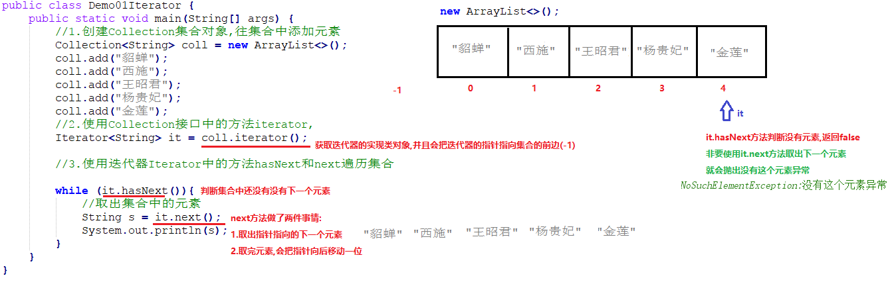

## 🎗经验分享迭代器的并发修改异常

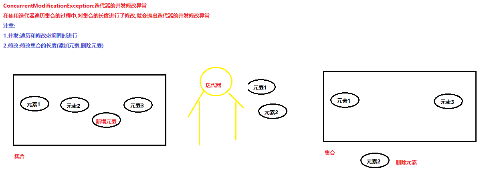

### 1.已知使用迭代器遍历集合的代码

```java
public class Demo02Iterator {
    public static void main(String[] args) {
        //创建集合对象,往集合中添加元素
        ArrayList<String> list = new ArrayList<>();
        list.add("aaa");
        list.add("bbb");
        list.add("ccc");
        list.add("ddd");
        list.add("eee");
        //使用迭代器遍历list集合
        Iterator<String> it = list.iterator();
        while (it.hasNext()){
            String s = it.next();
            System.out.println(s);
            
            /*
                需求: 增加一个判断,如果取出的元素s是"ccc"
                就给集合添加一个新的元素"itcast"
             */
            /*if("ccc".equals(s)){
                list.add("itcast");
            }*/
            
            /*
                需求: 增加一个判断,如果取出的元素s是"ccc"
                就把集合中的元素"ddd"删除
             */
            if("ccc".equals(s)){
                list.remove("ddd");
            }
        }
    }
}
```

### 2.出现的问题

> 程序抛出了迭代器的并发修改异常ConcurrentModificationException

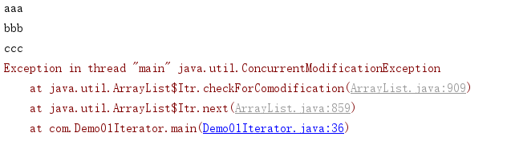

### 3.问题的分析

在使用迭代器遍历集合的过程中,对集合的长度进行了修改,迭代器就会抛出并发修改异常

- 添加元素

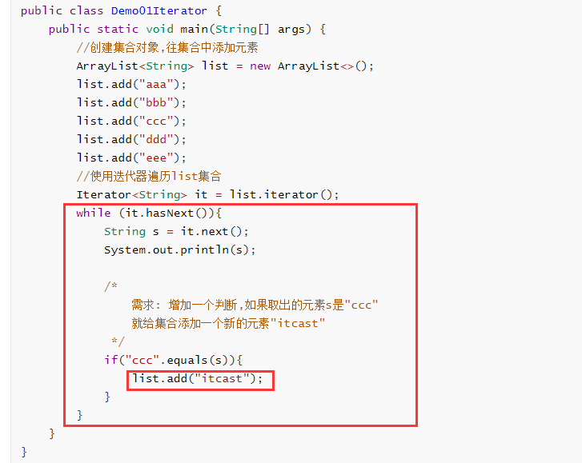

- 删除元素

  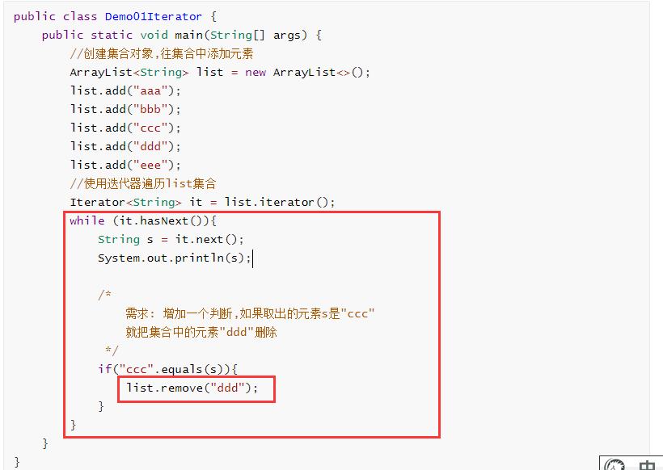

### 4.问题解决办法

> 第一种解决办法:
>
> ​	在遍历集合的同时,不修改集合长度

```java
public class Demo01Iterator {
    public static void main(String[] args) {
        //创建集合对象,往集合中添加元素
        ArrayList<String> list = new ArrayList<>();
        list.add("aaa");
        list.add("bbb");
        list.add("ccc");
        list.add("ddd");
        list.add("eee");
        //使用迭代器遍历list集合
        Iterator<String> it = list.iterator();
        while (it.hasNext()){
            String s = it.next();
            System.out.println(s);
        }
    }
}
```

程序运行结果:

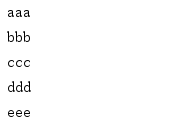

> 第二种解决办法:
>
> ​	Iterator接口中有一个方法叫remove,作用也是删除集合中的元素    
>
> ​	void remove() 删除使用next方法取出的集合中的元素

```java
public class Demo01Iterator {
    public static void main(String[] args) {
        //创建集合对象,往集合中添加元素
        ArrayList<String> list = new ArrayList<>();
        list.add("aaa");
        list.add("bbb");
        list.add("ccc");
        list.add("ddd");
        list.add("eee");
        //使用迭代器遍历list集合
        Iterator<String> it = list.iterator();
        while (it.hasNext()){
            String s = it.next();
            System.out.println(s);

            /*
                需求: 增加一个判断,如果取出的元素s是"ccc"
                就把集合中的元素"ccc"删除
             */
            if("ccc".equals(s)){
                it.remove();//使用迭代器删除集合中元素的方法,删除it.next方法取出的元素
            }
        }
        System.out.println(list);
    }
}
```

程序运行结果:

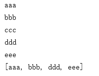

> 第三种解决办法:
>
> ​	Iterator接口有一个子接口叫ListIterator接口,在ListIterator接口中定义了往集合中添加元素的方法   
>
> ​	public interface ListIterator<E> extends Iterator<E>    
>
> ​	 void add(E e) 将指定的元素插入列表（可选操作）。 ListIterator接口特有的方法     
>
> ​	 void remove() 删除使用next方法取出的集合中的元素

```java
public class Demo01Iterator {
    public static void main(String[] args) {
        //创建集合对象,往集合中添加元素
        ArrayList<String> list = new ArrayList<>();
        list.add("aaa");
        list.add("bbb");
        list.add("ccc");
        list.add("ddd");
        list.add("eee");
        //使用List接口中的方法listIterator获取ListIterator迭代器接口的实现类对象
        ListIterator<String> lit = list.listIterator();
        //使用ListIterator迭代器中的方法hasNext判断集合中是否还有元素
        while (lit.hasNext()){
            //使用ListIterator迭代器中的方法next取出集合中的元素
            String s = lit.next();
            System.out.println(s);

            /*
                需求: 增加一个判断,如果取出的元素s是"ccc"
                就给集合添加一个新的元素"itcast"
             */
            if("ccc".equals(s)){
                lit.add("itcast");//使用迭代器中的add方法,往集合中添加元素
            }
        }

        System.out.println(list);
    }
}
```

程序运行结果:

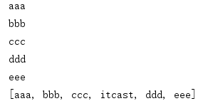

## 4.增强for循环(重点)

**注意:**

​	**增强for循环底层是一个迭代器,所以在使用增强for循环遍历的时候,不能对集合的长度进行修改,否则会抛出并发修改异常**

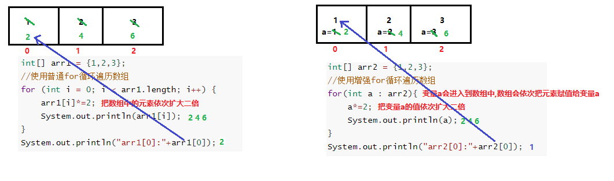

```java
package com.itheima.demo02Iterator;

import java.util.ArrayList;

/*
    增强for循环(重点中的重点)
        是JDK1.5之后出现的新特性
        使用for循环的方式对迭代器进行了封装,简化了迭代器遍历集合的代码
        java.util.Collection<E>接口 extends Iterable<E>接口
        java.util.Iterable<T>接口:实现这个接口允许对象成为 "foreach" 语句的目标。
        Collection接口继承了Iterable接口,所以所有Collection接口的实现类对象都可以使用增强for循环
    格式:
        for(集合|数组中元素的数据类型 变量名: 集合名|数组名){
            sout(变量名);
        }
 */
public class Demo05ForEach {
    public static void main(String[] args) {
        show03();
    }

    /*
        使用增强for循环遍历集合
     */
    private static void show03() {
        //定义一个存储Person对象的ArrayList集合
        ArrayList<Person> list = new ArrayList<>();
        list.add(new Person("杨幂",18));
        list.add(new Person("柳岩",18));
        list.add(new Person("东方不败",18));
        list.add(new Person("高圆圆",18));
        for(Person p : list){
            System.out.println(p.toString());
        }
    }

    /*
        使用增强for循环遍历集合
        快捷键:
            集合名|数组名.fori:普通for循环
            集合名|数组名.for:增强for循环
     */
    private static void show02() {
        //定义一个存储整数的集合,集合的泛型的使用包装类Integer
        ArrayList<Integer> list = new ArrayList<>();
        list.add(1);//自动装箱list.add(new Integer(1));
        list.add(2);
        list.add(3);
        list.add(null);
        list.add(4);
        for (Integer in : list) {
            System.out.println(in);
        }
    }

    /*
        使用增强for循环遍历数组
        好处:格式简单
        弊端:只能遍历,不能对数组|集合中的元素进行修改
     */
    private static void show01() {
        int[] arr1 = {1,2,3};
        //使用普通for循环遍历数组
        for (int i = 0; i < arr1.length; i++) {
            arr1[i]*=2;
            System.out.println(arr1[i]);
        }
        System.out.println("arr1[0]:"+arr1[0]);
        System.out.println("--------------------------");
        int[] arr2 = {1,2,3};
        //使用增强for循环遍历数组
        for(int a : arr2){
            a*=2;
            System.out.println(a);
        }
        System.out.println("arr2[0]:"+arr2[0]);
    }
}
```

# 第三章 泛型

## 1.泛型的概述

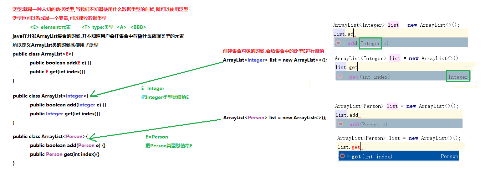

## 2.使用泛型的好处

```java
package com.itheima.demo03Generic;

import java.util.ArrayList;
import java.util.Iterator;

/*
    使用泛型的好处
    了解:
        java中的泛型被称之为伪泛型:在.java文件中有泛型,在.class文件中没有泛型概念的
 */
public class Demo01Generic {
    public static void main(String[] args) {
        show02();
    }

    /*
        创建ArrayList集合对象,使用泛型
        弊端:
            使用什么类型的泛型,就只能存储什么类型的数据
        好处:
            存储是什么类型的元素,取出的就是什么类型的元素,不用在向下转型,就可以直接使用元素的方法
            不转型也就不会引发类型转换异常
     */
    private static void show02() {
        ArrayList<String> list = new ArrayList<>();
        list.add("aa");
        //list.add(1);//'add(java.lang.String)' in 'java.util.ArrayList' cannot be applied to '(int)'
        Iterator<String> it = list.iterator();
        while (it.hasNext()){
            String s = it.next();
            System.out.println(s+"-->"+s.length());
        }
    }

    /*
        创建ArrayList集合对象,不使用泛型,集合的数据类型默认就是Object类型
        好处:
            可以存储任意数据类型的元素
        弊端:
            1.所有的元素的类型都被提升为了Object类型,不能使用子类特有的方法
                需要向下转型
            2.向下转型容易引发类型转换异常,增加判断
     */
    private static void show01() {
        ArrayList list = new ArrayList();
        list.add("aa");
        list.add(1);
        //使用迭代器遍历List集合
        Iterator it = list.iterator();
        while (it.hasNext()){
            Object obj = it.next();
            System.out.println(obj);
            if(obj instanceof String){
                //想获取字符串的长度
                String s = (String)obj;
                System.out.println(s.length());
            }
        }
    }
}
```

通过反编译软件,查看class文件中,没有泛型的概念

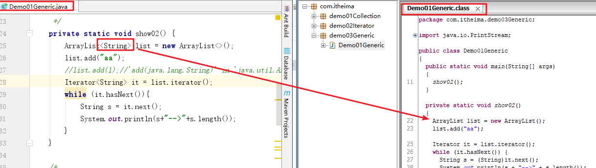

## 3.定义和使用含有泛型的类

```java
package com.itheima.demo04GenericClass;

/*
    定义和使用含有泛型的类
    和ArrayList集合一样
    什么时候使用泛型:当我们不知道要使用什么数据类型的时候,就可以使用泛型,是一种未知的数据类型
    定义格式:
        public class 类名<泛型>{
            类中所有使用数据类型的地方,都可以使用类上定义的泛型
        }
    什么时候确定泛型的数据类型:
        创建对象的时候,指定泛型是什么数据类型,类上泛型就是什么类型
 */
public class Person<C> {
    private C name;

    public C getName() {
        return name;
    }

    public void setName(C name) {
        this.name = name;
    }
}
```

```java
package com.itheima.demo04GenericClass;

public class Demo01GenericClass {
    public static void main(String[] args) {
        //创建Person对象,不写泛型,泛型默认Object类型
        Person p = new Person();
        p.setName(100);
        Object name = p.getName();
        System.out.println(name);

        //创建Person对象,指定泛型为String
        Person<String> p2 = new Person<>();
        p2.setName("hehe");
        String s = p2.getName();
        System.out.println(s);

        //创建Person对象,指定泛型为Double
        Person<Double> p3 = new Person<>();
        p3.setName(1.1);
        Double d = p3.getName();
        System.out.println(d);
    }
}
```

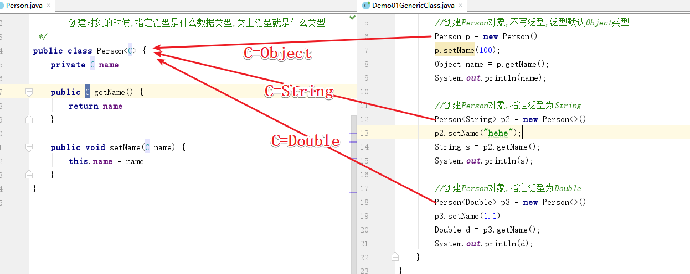

## 4.定义和使用含有泛型的方法(重点)

```java
package com.itheima.demo05GenericMethod;

/*
    定义和使用含有泛型的方法(重点)
    泛型需要定义在方法的修饰符和返回值类型之间
    格式:
        修饰符 <泛型> 返回值类型(使用泛型) 方法名(参数列表==>使用泛型){
            方法体
        }
     什么时候确定泛型的类型:
        调用方法的时候确定泛型的类型,传递什么类型的参数,方法的泛型就是什么类型
        注意传递的数据是基本数据类型泛型使用的包装类
 */
public class GenericMethod {
    //定义一个含有泛型的方法
    public <M> void show01(M m){
        System.out.println(m);
    }

    //定义一个含有泛型的静态方法
    public static <S> void show02(S s){
        System.out.println(s);
    }

    //定义一个含有泛型的含有返回值的静态方法
    public static <ABC> ABC show03(ABC abc){
        return abc;
    }
}
```

```java
package com.itheima.demo05GenericMethod;

import java.util.Arrays;

public class Demo01GenericMethod {
    public static void main(String[] args) {
        //创建GenericMethod对象
        GenericMethod gm = new GenericMethod();
        gm.show01(10);
        gm.show01(true);
        gm.show01(1.1);
        gm.show01("aaa");
        gm.show01('a');
        gm.show01(new Person());
        System.out.println("---------------------------");
        //通过类名可以直接调用静态方法
        GenericMethod.show02(10);
        GenericMethod.show02(true);
        GenericMethod.show02(1.1);
        GenericMethod.show02("aaa");
        GenericMethod.show02('a');
        GenericMethod.show02(new Person());
        System.out.println("---------------------------");
        Integer in = GenericMethod.show03(10);
        System.out.println(in);

        String abc = GenericMethod.show03("abc");
        System.out.println(abc);
    }
}
```


## 5.定义和使用含有泛型的接口

```java
package com.itheima.demo06GenericInterface;

/*
    定义含有泛型的接口
 */
public interface MyInter<I> {
    public abstract void show(I i);
}
```

```java
package com.itheima.demo06GenericInterface;

/*
    含有接口的泛型:第一种使用方式
    定义实现类,实现接口的同时,指定泛型的数据类型
    格式:
        public class MyInterImpl1 implements MyInter<String>{
            @Override
            public void show(String s) { }
        }
        public class MyInterImpl1 implements MyInter<Integer>{
            @Override
            public void show(Integer s) { }
        }
 */
public class MyInterImpl1 implements MyInter<Integer>{
    @Override
    public void show(Integer s) {
        System.out.println(s);
    }
}
```

```java
package com.itheima.demo06GenericInterface;

/*
    含有接口的泛型:第二种使用方式
    创建接口实现类的时候,接口使用什么泛型,实现类就使用什么泛型
    就想到于定义了一个含有泛型的类,创建对象时候确定泛型的数据类型
 */
public class MyInterImpl2<I> implements MyInter<I>{
    @Override
    public void show(I i) {
        System.out.println(i);
    }
}
```

```java
package com.itheima.demo06GenericInterface;

public class Demo01GenericInterface {
    public static void main(String[] args) {
        //创建MyInterImpl1对象
        MyInterImpl1 my01 = new MyInterImpl1();
        my01.show(10);

        //创建MyInterImpl2对象
        MyInterImpl2<Boolean> my02 = new MyInterImpl2<>();
        my02.show(true);

        MyInterImpl2<String> my03 = new MyInterImpl2<>();
        my03.show("aaa");
    }
}
```

## 6.泛型的通配符  

```java
package com.itheima.demo07Generic;

import java.util.ArrayList;
import java.util.Collection;
import java.util.Iterator;

/*
    泛型的通配符:
        ?:代表可以接收任意的数据类型
    使用范围:
        可以作为方法参数集合的数据类型使用,代表可以接收任意数据类型的集合
 */
public class Demo01Generic {
    public static void main(String[] args) {
        ArrayList<Integer> list01 = new ArrayList<>();
        list01.add(1);
        list01.add(2);

        ArrayList<String> list02 = new ArrayList<>();
        list02.add("abc");
        list02.add("aaa");

        method(list01);
        method(list02);
        
        //不能定义集合的时候使用?
        ArrayList<?> list03 = new ArrayList<>();
        //list03.add(1);//'add(capture<?>)' in 'java.util.ArrayList' cannot be applied to '(int)'
    }

    /*
        定义一个方法,方法的参数Collection可以接收任意数据类型的集合
        对集合进行遍历
     */
    public static void method(Collection<?> coll){
        //使用迭代器遍历集合
        Iterator<?> it = coll.iterator();
        while (it.hasNext()){
            /*
                it.next方法取出的元素是什么类型? Object
             */
            Object obj = it.next();
            System.out.println(obj);
        }
    }
}
```

```java
package com.itheima.demo07Generic;

import java.util.ArrayList;
import java.util.Collection;

/*
    通配符高级使用----受限泛型
    ? : ?代表可以接收任意的数据类型
    泛型的上限限定: ? extends E ==>传递的未知的数据类型?,只能是E的子类或者E本身
    泛型的下限限定: ? super E   ==>传递的未知的数据类型?,只能是E的父类或者E本身
 */
public class Demo02Generic {
    public static void main(String[] args) {
        Collection<Integer> list1 = new ArrayList<Integer>();
        Collection<String> list2 = new ArrayList<String>();
        Collection<Number> list3 = new ArrayList<Number>();
        Collection<Object> list4 = new ArrayList<Object>();

        /*
            Integer|Double... extends Number extends Object
            String extends Object
         */

        getElement1(list1);
        //getElement1(list2);//报错 String和Number没有关系
        getElement1(list3);
        //getElement1(list4);//报错 Object类型是Number的父类,需要Number的子类

        //getElement2(list1);//报错 Integer是Number的子类,需要Number的父类
        //getElement2(list2);//报错 String和Number没有关系
        getElement2(list3);
        getElement2(list4);
    }

    // 泛型的上限：此时的泛型?，必须是Number类型或者Number类型的子类
    public static void getElement1(Collection<? extends Number> coll){}

    // 泛型的下限：此时的泛型?，必须是Number类型或者Number类型的父类
    public static void getElement2(Collection<? super Number> coll){}
}
```

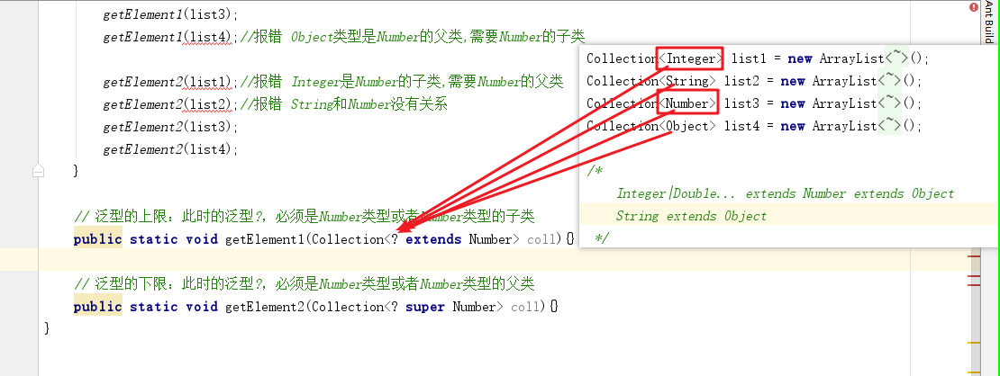

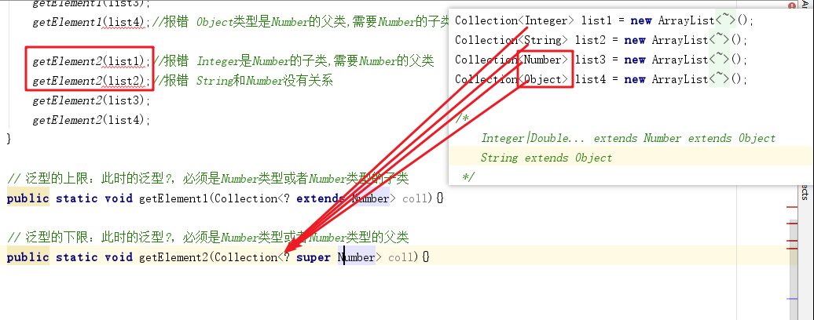

# 第四章 数据类型

## 1.数据结构_栈:先进后出

## 2.数据结构_队列:先进先出

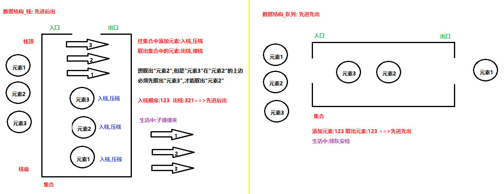

## 3.数据结构_数组:查询快,增删慢

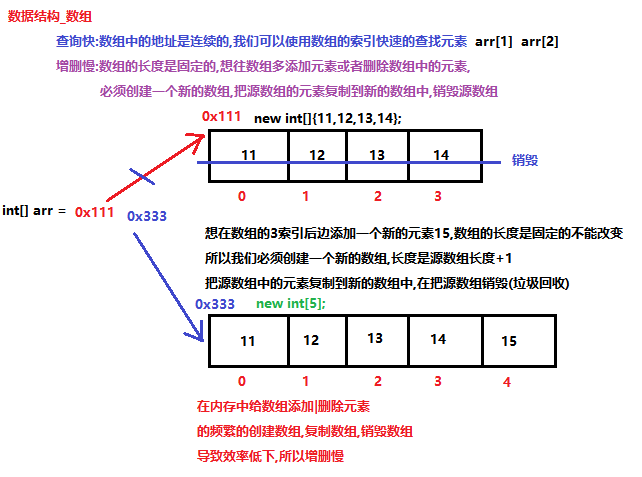

## 4.数据结构_链表:查询慢,增删快


# 第五章 List接口

## 1.List接口的概述

```java
java.util.List<E>接口 extends Collection<E>接口
List接口的特点:
1.是一个有序的集合:存储的元素和取出的元素的顺序是一致的 存储:132  取出:132
2.允许存储重复的元素  add(10)  add(10)
3.包含一些带索引的[特有]方法
List接口中特有的带索引的方法:
	void add(int index, E element)  在集合的指定索引处,添加一个新元素
	E get(int index)  获取指定索引处的元素
	E remove(int index)  移除并返回指定索引处的元素,返回的是被移除的元素
	E set(int index, E element) 替换并返回指定索引处的元素,返回的是被替换的元素
注意:
	使用带索引的方法,必须防止索引越界异常(不要超出集合索引的使用范围:[0,size()-1])
```

## 2.List接口中常用的方法(重点)

```java
package com.itheima.demo08List;

import java.util.ArrayList;
import java.util.Iterator;
import java.util.List;

/*
    List接口中特有的带索引的方法:
        void add(int index, E element)  在集合的指定索引处,添加一个新元素
        E get(int index)  获取指定索引处的元素
        E remove(int index)  移除并返回指定索引处的元素,返回的是被移除的元素
        E set(int index, E element) 替换并返回指定索引处的元素,返回的是被替换的元素
    注意:
        使用带索引的方法,必须防止索引越界异常(不要超出集合索引的使用范围:[0,size()-1])
        IndexOutOfBoundsException:索引越界异常,一般集合会报
        ArrayIndexOutOfBoundsException:数组索引越界异常
        StringIndexOutOfBoundsException:字符串索引越界异常
 */
public class Demo01List {
    public static void main(String[] args) {
        //创建List集合对象
        List<String> list = new ArrayList<>();
        //往集合中添加元素
        list.add("aaa");
        list.add("bbb");
        list.add("aaa");
        list.add("ccc");
        list.add("ddd");
        System.out.println(list);//[aaa, bbb, aaa, ccc, ddd]

        //void add(int index, E element)  在集合的指定索引处,添加一个新元素
        //集合集合的3索引处添加一个新的元素"哈哈"
        list.add(3,"哈哈");
        System.out.println(list);//[aaa, bbb, aaa, 哈哈, ccc, ddd]
        //list.add(10,"你好");//IndexOutOfBoundsException: Index: 10, Size: 6

        //E get(int index)  获取指定索引处的元素
        System.out.println(list.get(0));//aaa
        System.out.println(list.get(1));//bbb
        //System.out.println(list.get(8));//IndexOutOfBoundsException: Index: 8, Size: 6

        //E remove(int index)  移除并返回指定索引处的元素,返回的是被移除的元素
        //删除bbb和哈哈之间的aaa
        String s1 = list.remove(2);
        System.out.println("s1:"+s1);//s1:aaa
        System.out.println(list);//[aaa, bbb, 哈哈, ccc, ddd]

        //E set(int index, E element) 替换并返回指定索引处的元素,返回的是被替换的元素
        //把2索引处的"哈哈",替换为"呵呵"
        String s2 = list.set(2, "呵呵");
        System.out.println("s2:"+s2);//s2:哈哈
        System.out.println(list);//[aaa, bbb, 呵呵, ccc, ddd]
        System.out.println("------------------------------List集合使用普通for循环遍历----------------------------------");
        for (int i = 0; i < list.size(); i++) {
            System.out.println(list.get(i));
        }
        System.out.println("------------------------------List集合使用增强for循环遍历----------------------------------");
        for (String s : list) {
            System.out.println(s);
        }
        System.out.println("------------------------------List集合使用迭代器遍历----------------------------------");
        Iterator<String> it = list.iterator();
        while (it.hasNext()){
            String s = it.next();
            System.out.println(s);
        }
    }
}
```

## 3.ArrayList集合(数组)

```java
/*
	java.util.ArrayList<E>集合 implements List<E>接口
	List 接口的大小可变数组的实现。
	ArrayList集合底层采用的数据结构是数组结构:查询快,增删慢
	工作:查询多的时候使用ArrayList集合
*/
public class ArrayList<E> implements List<E>{
    //底层定义的存储数据的数组
    transient Object[] elementData;
    //添加元素的add方法 list.add("aaa");
    public boolean add(E e) {
        ensureCapacityInternal(size + 1);  // Increments modCount!!
        elementData[size++] = e;
        return true;//添加元素百分之百成功,一直返回true
    }
    ...
    //add方法的最底层:创建一个新的数组,长度是原数组长度+1,把原数组中的元素使用System类中的arraycopy复制到新的数组中
    public static <T,U> T[] copyOf(U[] original, int newLength, Class<? extends T[]> newType) {
        @SuppressWarnings("unchecked")
        T[] copy = ((Object)newType == (Object)Object[].class)
            ? (T[]) new Object[newLength]
            : (T[]) Array.newInstance(newType.getComponentType(), newLength);
        System.arraycopy(original, 0, copy, 0,
                         Math.min(original.length, newLength));
        return copy;
    }    
}
```

## 4.LinkedList集合(双向链表)

### a.LinkedList集合概述


```java
java.util.LinkedList<E>集合 implements List<E>接口
List 接口的链接列表实现。
LinkedList集合底层是一个双向链表:查询慢,增删快
双向:是一个有序的集合,存储元素和取出元素的顺序是一致的
LinkedList集合中有一些操作首尾元素的特有方法:
	public void addFirst(E e) :将指定元素插入此列表的开头。
	public void push(E e) :将元素推入此列表所表示的堆栈。
    public void addLast(E e) :将指定元素添加到此列表的结尾。
    
    public E getFirst() :返回此列表的第一个元素。
    public E getLast() :返回此列表的最后一个元素。
    
    public E removeFirst() :移除并返回此列表的第一个元素。
    public E pop() :从此列表所表示的堆栈处弹出一个元素。
    public E removeLast() :移除并返回此列表的最后一个元素。
   
    public boolean isEmpty() ：如果列表不包含元素，则返回true。
注意:
	使用LinkedList集合特有的方法,不能使用多态创建对象
	List<String> list = new LinkedList<>();//弊端:不能使用实现类特有的操作首尾元素的方法
	LinkedList<String> linked = (LinkedList<String>)list;//向下转型
```

### b.LinkedList集合特有的方法(使用)

```java
package com.itheima.demo08List;

import java.util.LinkedList;

/*
    LinkedList集合特有的方法(使用)
 */
public class Demo02LinkedList {
    public static void main(String[] args) {
        show04();
    }

    /*
        public E removeFirst() :移除并返回此列表的第一个元素。
        public E pop() :从此列表所表示的堆栈处弹出一个元素。此方法等效于 removeFirst()。
        public E removeLast() :移除并返回此列表的最后一个元素。
     */
    private static void show04() {
        //创建LinkedList集合对象
        LinkedList<String> linked = new LinkedList<>();
        //往集合中添加元素
        linked.add("aaa");
        linked.add("bbb");
        linked.add("ccc");
        linked.add("ddd");
        System.out.println(linked);//[aaa, bbb, ccc, ddd]

        //linked.clear();

        //增加一个判断,防止NoSuchElementException
        if(linked.size()!=0){
            //String first = linked.removeFirst();
            String first = linked.pop();
            System.out.println("first:"+first);//first:aaa

            String last = linked.removeLast();
            System.out.println("last:"+last);//last:ddd
        }
        System.out.println(linked);//[bbb, ccc]

    }

    /*
        public E getFirst() :返回此列表的第一个元素。
        public E getLast() :返回此列表的最后一个元素。
     */
    private static void show03() {
        //创建LinkedList集合对象
        LinkedList<String> linked = new LinkedList<>();
        //往集合中添加元素
        linked.add("aaa");
        linked.add("bbb");
        linked.add("ccc");
        linked.add("ddd");

        //linked.clear();//清空集合

        //增加一个判断,集合中有元素,在获取第一个和最后一个,防止NoSuchElementException:没有这个元素异常
        if(!linked.isEmpty()){//return size() == 0;
            String first = linked.getFirst();
            System.out.println("first:"+first);//first:aaa

            String last = linked.getLast();
            System.out.println("last:"+last);//last:ddd
        }

        if(linked.size()!=0){
            String first = linked.getFirst();
            System.out.println("first:"+first);//first:aaa

            String last = linked.getLast();
            System.out.println("last:"+last);//last:ddd
        }
    }

    private static void show02() {
        //创建LinkedList集合对象
        LinkedList<String> linked = new LinkedList<>();
        linked.addFirst("a");
        linked.addFirst("b");
        linked.addFirst("c");
        linked.addFirst("d");
        linked.addLast("1");
        linked.addLast("2");
        linked.addLast("3");
        System.out.println(linked);//[d, c, b, a, 1, 2, 3]
    }

    /*
        public void addFirst(E e) :将指定元素插入此列表的开头。
        public void push(E e) :将元素推入此列表所表示的堆栈。此方法等效于 addFirst(E)。
        public void addLast(E e) :将指定元素添加到此列表的结尾。
     */
    private static void show01() {
        //创建LinkedList集合对象
        LinkedList<String> linked = new LinkedList<>();
        //往集合中添加元素
        linked.add("aaa");
        linked.add("bbb");
        linked.add("ccc");
        linked.add("ddd");
        System.out.println(linked);//[aaa, bbb, ccc, ddd]

        //public void addFirst(E e) :将指定元素插入此列表的开头。
        //linked.addFirst("www");
        linked.push("www");
        System.out.println(linked);//[www, aaa, bbb, ccc, ddd]

        //public void addLast(E e) :将指定元素添加到此列表的结尾。此方法相当于add()
        //linked.addLast("com");
        linked.add("com");
        System.out.println(linked);//[www, aaa, bbb, ccc, ddd, com]
    }
}
```

## 5.Vector集合(面试-扩展)

```java
java.util.Vector<E>集合 implements List<E>接口(jdk1.2之后才实现的List接口)
Vector集合是JDK1.0时期存在的单列集合,最早期的集合
Collection接口下边的集合(ArrayList,LinkedList...)是JDK1.2之后出现的
Vector 类可以实现可增长的对象数组,Vector集合和ArrayList集合是一样的,也是数组结构:查询快,增删慢
与新 collection 实现不同，Vector 是同步的。 
同步技术:可以保证多线程的安全,但是会使集合存储数据的效率降低,所以Vector被效率更高的ArrayList集合取代了
--------------------------------------------------
Vector集合在1.0时期有一些特有的方法:(学习javaweb的时候会使用)
	void addElement(E obj) 往集合中添加元素
    Enumeration<E> elements() 返回此向量的组件的枚举。 
    Enumeration<E>接口:向量枚举,是jdk1.0时期的迭代器
    	boolean hasMoreElements()  判断集合中还有没有元素==>Iterator中的hasNext方法
    	E nextElement()  取出集合中的元素==>Iterator中的next方法
```

