# 学习目标

```java
能够使用集合工具类
	Collections类:
		static void sort(List<T> list) 根据元素的自然顺序 对指定列表按升序进行排序。
        static <T> void sort(List<T> list, Comparator<? super T> c) 根据指定比较器产生的顺序对指定列表进行排序。
        static void shuffle(List<?> list)  随机打乱集合中元素的顺序
能够使用Comparator比较器进行排序
	Collections.sort(list01, new Comparator<Integer>() {
		@Override
		public int compare(Integer o1, Integer o2) {
			//降序: o2-o1  升序:o1-o2
			return o2-o1;
		}
	});
能够使用可变参数
	public static void method(int...arr){}
	调用method方法,参数是一个可变参数,可以接收任意个同种数据类型的数据
	method(不传参数),method(10),method(10,20)...
能够说出Set集合的特点
	1.不允许存储重复的元素
	2.不包含带索引的方法
能够说出哈希表的特点
	JDK1.8之前:数组+单向链表
	JDK1.8之后:数组+单向链表|数组+红黑树
	查询的效率高
使用HashSet集合存储自定义元素(重点)
	想要保证存储的元素(Person对象,Student对象...)同名和同年龄的人视为同一个人
	自定义类型(Person对象,Student对象...)必须重写hashCode和equals方法(快捷键)
能够说出Map集合特点
	1.Map集合是一个双列集合,每个元素包含两个值,一个key一个value
	2.Map集合中的key是不允许重复的,value可以重复
	3.map集合中一个key只能对应一个value值
	4.Map集合中key和value数据类型是可以相同的,也可以不同
使用Map集合添加方法保存数据
	V put(K key, V value)  把指定的键与值添加到Map集合中
	返回值:V(值)
		key不重复,返回值就是null
		key重复,会使用新的value,替换之前的value,返回的就是被替换的value值
	Map<String,String> map = new HashMap<>();
	map.put("黄晓明", "杨颖"); //v=null
	map.put("黄晓明", "赵薇"); //v=杨颖
	map.put("冷锋","龙小云");
    map.put("杨过","小龙女");	
使用”键找值”的方式遍历Map集合
	1.使用Map集合中的方法keySet,把所有的key取出来,存储到一个Set集合中
    2.遍历Set集合,获取到Map集合中的每一个key
    3.使用Map集合中的方法get,根据key找到value
	Set<String> set = map.keySet();
	for (String key : set) {
		Integer value = map.get(key);
		System.out.println(key+"\t"+value);
	}
使用”键值对”的方式遍历Map集合
	1.使用Map集合中的方法entrySet,获取Map集合中的所有Entry对象,存储到一个Set集合中
	2.遍历Set集合,获取每一个Entry对象
	3.使用Entry对象中的方法getKey和getValue获取键与值
	Set<Map.Entry<String, String>> set = map.entrySet();
	for (Map.Entry<String, String> entry : set) {
		String key = entry.getKey();
		String value = entry.getValue();
		System.out.println(key+"\t"+value);
	}
能够使用HashMap存储自定义键值对的数据
	自定义类型(Person,Student)作为key:保证同名同年龄的人视为同一个人,需要重写hashCode和equals方法
	HashMap<String,Person> 不需要重写hashCode和equals方法,值是可以重复的
	HashMap<Person,String> 需要重写hashCode和equals方法,key是不允许重复的
能够完成斗地主洗牌发牌案例
	1.准备牌
	2.洗牌
	3.发牌
	4.排序
	5.看牌        
```

# 第一章 Collections类   

## 1.Collections的常用功能(重点)

```java
package com.itheima.demo01Collections;

import java.util.ArrayList;
import java.util.Collections;

/*
    java.util.Collections类;操作集合的工具类
        里边的方法都是静态的,通过类名可以直接使用
    常用方法:
        static void sort(List<T> list) 根据元素的自然顺序对指定集合按升序进行排序。
        static void shuffle(List<?> list)  随机打乱集合中元素的顺序
        static <T> void sort(List<T> list, Comparator<? super T> c)  根据指定比较器产生的顺序对指定列表进行排序。
    注意:
        以上三个方法的参数都是List集合,不能传递Set接口下的集合    
 */
public class Demo01Collections {
    public static void main(String[] args) {
        ArrayList<Integer> list01 = new ArrayList<>();
        list01.add(3);
        list01.add(1);
        list01.add(4);
        list01.add(2);
        System.out.println(list01);//[3, 1, 4, 2]

        //static void sort(List<T> list) 根据元素的自然顺序对指定集合按升序进行排序。
        Collections.sort(list01);
        System.out.println(list01);//[1, 2, 3, 4]

        //static void shuffle(List<?> list)  随机打乱(每次都有可能不一致)集合中元素的顺序
        Collections.shuffle(list01);
        System.out.println(list01);//[3, 4, 1, 2]  [4, 2, 3, 1] [4, 1, 3, 2]

        ArrayList<String> list02 = new ArrayList<>();
        list02.add("ac");
        list02.add("BB");
        list02.add("12");
        list02.add("aa");
        list02.add("bb");
        System.out.println(list02);//[ac, BB, 12, aa, bb]

        //static void sort(List<T> list) 根据元素的自然顺序(编码表顺序)对指定集合按升序进行排序。
        Collections.sort(list02);
        System.out.println(list02);//[12, BB, aa, ac, bb]
    }
}
```

## 2.Comparator比较器(重点)

```java
package com.itheima.demo01Collections;

import java.util.ArrayList;
import java.util.Collections;
import java.util.Comparator;

/*
    static <T> void sort(List<T> list, Comparator<? super T> c)  根据指定比较器产生的顺序对指定集合进行排序。
    参数:
        List<T> list:传递要排序的集合
        Comparator<? super T> c:传递比较器
    java.util.Comparator<T>接口
        强行对某个对象 collection 进行整体排序 的比较函数。
    Comparator<T>接口常用方法:
        int compare(T o1, T o2) 比较用来排序的两个参数。
        T o1, T o2:依次获取集合中相邻的元素,进行比较
        排序的规则:
            o1-o2:升序
            o2-o1:降序
            o1==o2:说明两个元素相等
 */
public class Demo02Collections {
    public static void main(String[] args) {
        ArrayList<Integer> list01 = new ArrayList<>();
        list01.add(3);
        list01.add(1);
        list01.add(4);
        list01.add(2);
        System.out.println(list01);//[3, 1, 4, 2]

        //使用Collections集合工具类中的sort方法,根据比较器产生的规则对集合中元素进行排序
        Collections.sort(list01, new Comparator<Integer>() {
            @Override
            public int compare(Integer o1, Integer o2) {
                //o1-o2:升序
                return o1-o2;
            }
        });
        System.out.println(list01);//[1, 2, 3, 4]

        Collections.sort(list01, new Comparator<Integer>() {
            @Override
            public int compare(Integer o1, Integer o2) {
                //o2-o1:降序
                return o2-o1;
            }
        });
        System.out.println(list01);//[4, 3, 2, 1]
    }
}
```

## 🎗经验分享

### 1.已知使用Collections中的sort代码

```java
public class Demo03Collections {
    public static void main(String[] args) {
        //创建AarrayList集合对象,泛型使用Person
        ArrayList<Person> list = new ArrayList<>();
        list.add(new Person("azhangsan",18));
        list.add(new Person("lisi",20));
        list.add(new Person("wangwu",19));
        list.add(new Person("zhaoliu",18));
        list.add(new Person("tianqi",21));

        Collections.sort(list);
    }
}
```

```java
public class Person {
    private String name;
    private int age;

    public Person() {
    }

    public Person(String name, int age) {
        this.name = name;
        this.age = age;
    }

    @Override
    public String toString() {
        return "Person{" +
                "name='" + name + '\'' +
                ", age=" + age +
                '}';
    }

    public String getName() {
        return name;
    }

    public void setName(String name) {
        this.name = name;
    }

    public int getAge() {
        return age;
    }

    public void setAge(int age) {
        this.age = age;
    }
}
```

### 2.出现的问题

> 集合的泛型使用Person,会报错

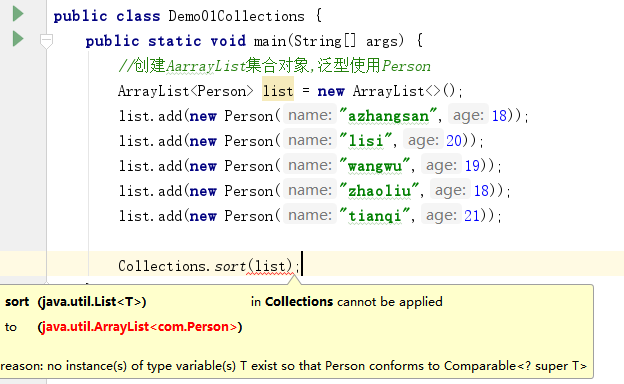

### 3.问题的分析

> 因为Person没有实现Comparable接口
>
> 我们之所以可以对Integer类型的集合,Double类型的集合,String类型的集合等,进行排序
>
> 是因为这些类Integer,Double,String等,实现了Comparable接口,重写了Comparable接口中的compareTo排序方法


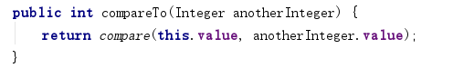

​	

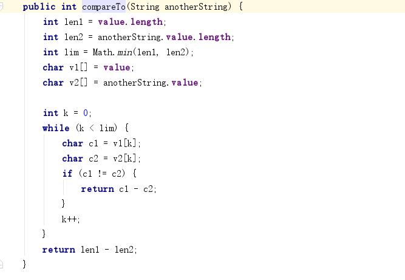

### 4.问题解决办法

> 第一种解决办法:
>
> ​	使用Person类实现Comparable接口重写compareTo排序方法

```java
package com;

public class Person implements Comparable<Person>{
    private String name;
    private int age;

    public Person() {
    }

    public Person(String name, int age) {
        this.name = name;
        this.age = age;
    }

    @Override
    public String toString() {
        return "Person{" +
                "name='" + name + '\'' +
                ", age=" + age +
                '}';
    }

    public String getName() {
        return name;
    }

    public void setName(String name) {
        this.name = name;
    }

    public int getAge() {
        return age;
    }

    public void setAge(int age) {
        this.age = age;
    }

    @Override
    public int compareTo(Person o) {
        //比较两个人的年龄一个是this,一个是参数Person o
        //return this.age - o.age;//按照年龄升序
        return o.age - this.age;//按照年龄升序
    }
}
```

```java
package com;

import java.util.ArrayList;
import java.util.Collections;
import java.util.Comparator;

public class Demo01Collections {
    public static void main(String[] args) {
        //创建AarrayList集合对象,泛型使用Person
        ArrayList<Person> list = new ArrayList<>();
        list.add(new Person("azhangsan",18));
        list.add(new Person("lisi",20));
        list.add(new Person("wangwu",19));
        list.add(new Person("zhaoliu",18));
        list.add(new Person("tianqi",21));

        Collections.sort(list);

        System.out.println(list);
    }
}
```

程序运行结果(降序排序):有了排序规则sort方法不在报错

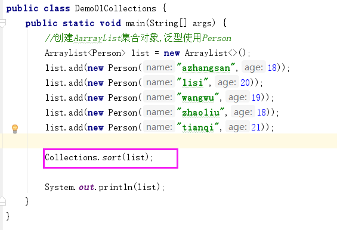

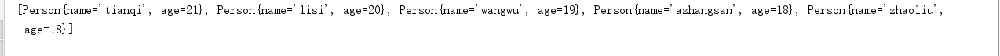

> 第二种解决办法:
>
> ​	Person不实现Comparable
>
> ​	可以使用带比较器的sort方法,自己写比较的规则
>
> ```java
> static <T> void sort(List<T> list, Comparator<? super T> c) 根据指定比较器产生的顺序对指定集合进行排序。
> 参数:
> 	List<T> list:要排序的List集合
> 	Comparator<? super T> c:对集合进行排序的比较器
> 	java.utl.Comparator<T>接口:强行对某个对象 collection 进行整体排序 的比较函数。
> 	Comparator接口中的抽象方法:
> 		int compare(T o1, T o2) 比较用来排序的两个参数。
> 		参数:
> 			T o1, T o2:内部自动获取的集合中的元素[1,2,3,4]
> 		比较的规则(重点):
> 			升序:o1-o2
> 			降序:o2-o1
> 			两个元素相等:o1==o2
> ```

```java
public class Demo01Collections {
    public static void main(String[] args) {		
		//创建AarrayList集合对象,泛型使用Person
        ArrayList<Person> list = new ArrayList<>();
        list.add(new Person("azhangsan",18));
        list.add(new Person("lisi",20));
        list.add(new Person("wangwu",19));
        list.add(new Person("zhaoliu",18));
        list.add(new Person("tianqi",21));

        //使用Collections集合工具类中的方法sort,对集合中的元素根据比较器产生的规则排序(年龄升序排序)
        Collections.sort(list, new Comparator<Person>() {
            @Override
            public int compare(Person o1, Person o2) {
                //年龄升序排序
                return o1.getAge()-o2.getAge();
            }
        });
        System.out.println(list);

        //按照两个人的年龄升序排序,如果两个人的年龄相同,按照姓名的首字母降序排序
        Collections.sort(list, new Comparator<Person>() {
            @Override
            public int compare(Person o1, Person o2) {
                //按照两个人的年龄升序排序
                int a = o1.getAge()-o2.getAge();
                //判断两个人的年龄是否相等
                if(a==0){
                    //按照姓名的首字母降序排序
                    a = o2.getName().charAt(0) - o1.getName().charAt(0);
                }
                return a;
            }
        });
        System.out.println(list);

        //按照两个人的年龄升序排序,如果两个人的年龄相同,按照姓名进行降序排序
        Collections.sort(list, new Comparator<Person>() {
            @Override
            public int compare(Person o1, Person o2) {
                //按照两个人的年龄升序排序
                int a = o1.getAge()-o2.getAge();
                //判断两个人的年龄是否相等
                if(a==0){
                    //按照姓名进行降序排序
                    /*
                        String类中的方法
                            int compareTo(String anotherString)按字典顺序(编码表的顺序)比较两个字符串。
                            会取出两个字符串中的每个字符,依次比较
                     */
                    a = o2.getName().compareTo(o1.getName());
                }
                return a;
            }
        });
        System.out.println(list);
    }
}    
```

```java
package com;

public class Person{
    private String name;
    private int age;

    public Person() {
    }

    public Person(String name, int age) {
        this.name = name;
        this.age = age;
    }

    @Override
    public String toString() {
        return "Person{" +
                "name='" + name + '\'' +
                ", age=" + age +
                '}';
    }

    public String getName() {
        return name;
    }

    public void setName(String name) {
        this.name = name;
    }

    public int getAge() {
        return age;
    }

    public void setAge(int age) {
        this.age = age;
    }

}
```

程序运行结果:

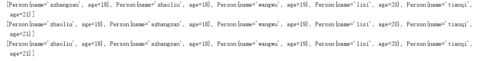

## 3.可变参数

```java
package com.itheima.demo03varArgs;

import java.util.Arrays;

/*
    可变参数
        是JDK1.5之后的新特性
    作用:
        当我们定义方法的时候,方法参数的数据类型已经确定了,但是参数的个数不确定,就可以使用可变参数
        可变参数可以接收任意个同种数据类型的数据
    格式:
        修饰符 返回值类型 方法名(数据类型...变量名){
            方法体;
        }
   数据类型...变量名:可变参数
        (int...a):可以接收任意个(不传递,1,2,3,4,5....n)int类型的整数
        (double...a):可以接收任意个(不传递,1,2,3,4,5....n)double类型的整数
        (String...a):可以接收任意个(不传递,1,2,3,4,5....n)String类型的整数
   底层的原理:
        可变参数底层原理就是一个数组,传递不同个数个数据,定义不同长度的数组来存储数据
 */
public class Demo01VarArgs {
    public static void main(String[] args) {
        //getSum();
        //getSum(10);
        //getSum(10,20);
        int s = getSum(10, 20, 30, 40, 50, 60, 70, 80, 90, 100);
        System.out.println(s);
    }

    /*
        定义一个计算n个int整数和的方法
        n个:我也不知道我要传递多少个int类型的整数
        已知:
            数据类型已经确定:int
        未知:
            不知道传递参数的个数
        就可以可变参数解决
        getSum();可变参数就会定义一个长度为0的数组,用来接收数据 int[] a = new int[]{ };
        getSum(10);可变参数就会定义一个长度为1的数组,用来接收数据 int[] a = new int[]{10};
        getSum(10,20);可变参数就会定义一个长度为2的数组,用来接收数据 int[] a = new int[]{10,20};
        ...
        getSum(10,20,30,40,50,60,70,80,90,100);可变参数就会定义一个长度为10的数组,
            用来接收数据 int[] a = new int[]{10,20,30,40,50,60,70,80,90,100};
     */
    public static int getSum(int...a){
        //System.out.println(a);//[I@4554617c
        //System.out.println(a.length);//0
        //System.out.println(Arrays.toString(a));//[]
        //对可变参数(数组)中的元素求和
        //定义一个变量,初始值为0,记录累加求和
        int sum = 0;
        //定义一个for循环,遍历数组
        for (int i : a) {
            //在循环中累加求和
            sum+=i;
        }
        //把和返回
        return sum;
    }

    /*
        定义一个计算四个int类型整数和的方法
     */
    /*public static int getSum(int a,int b,int c,int d){
        return a+b+c+d;
    }*/

    /*
        定义一个计算三个int类型整数和的方法
     */
    /*public static int getSum(int a,int b,int c){
        return a+b+c;
    }*/

    /*
        定义一个计算两个int类型整数和的方法
     */
    /*public static int getSum(int a,int b){
        return a+b;
    }*/
}
```

**重点:记住可变参数可以接收任意个同种数据类型的元素**

```java
package com.itheima.demo03varArgs;

/*
    可变参数的注意事项
 */
public class Demo02VarArgs {
    public static void main(String[] args) {
        //show01();
    }

    //1.一个参数列表中,只能写一个可变参数
    //private static void show01(int...a,String...s) { }
    //2.方法的参数列表有多个参数,可变参数必须写在末尾
    //private static void show02(int a,double d,int c,char b,String...s) { }//正确
    //Vararg parameter must be the last in the list
    //private static void show02(int a,double d,int c,String...s,char b) { }//错误
    //看底层源码的时候,会看到以下的可变参数
    public static void method(Object...obj){}

    public static <T> T[] method02(T...t){
        return t;
    }
}
```

## 4.Collections集合工具类中的方法addAll

```java
package com.itheima.demo03varArgs;

import java.util.ArrayList;
import java.util.Collections;
import java.util.LinkedList;

/*
    Collections集合工具类中的方法addAll
    static <T> boolean addAll(Collection<? super T> c, T... elements)
          将所有指定元素添加到指定 collection 中。
 */
public class Demo03Collections {
    public static void main(String[] args) {
        ArrayList<Integer> list01 = new ArrayList<>();
        //list01.add(1);
        //list01.add(2);
        //list01.add(3);
        //list01.add(4);
        //list01.add(5);
        //list01.add(6);
        //list01.add(7);
        //list01.add(8);
        //System.out.println(list01);//[1, 2, 3, 4, 5, 6, 7, 8]

        Collections.addAll(list01,1,2,3,4,5,6,7,8);
        System.out.println(list01);//[1, 2, 3, 4, 5, 6, 7, 8]

        LinkedList<String> linked = new LinkedList<>();
        Collections.addAll(linked,"a","b","c","d","e");
        System.out.println(linked);//[a, b, c, d, e]

        //可变参数的底层就是一个数组,参数传递可变参数的地方,都可以传递数组
        String[] arr = {"aa","bb","cc","dd"};
        Collections.addAll(linked,arr);
        System.out.println(linked);//[a, b, c, d, e, aa, bb, cc, dd]
    }
}
```

# 第二章 Set接口

## 1.Set接口的介绍(记住)

```java
java.util.Set<E>接口 extends Collection<E>接口
Set接口的特点:
1.不允许存储重复的元素 add(1)  add(1)==>集合中只有一个1
2.不包含带索引的方法,里边的方法和Collection接口一模一样
```

## 2.HashSet集合的介绍和基本使用(重点)

```java
package com.itheima.demo04Set;

import java.util.HashSet;
import java.util.Iterator;

/*
    java.util.HashSet<E>集合 implements Set<E>接口
        此类实现 Set 接口，由哈希表（实际上是一个 HashMap 实例）支持。
        它不保证 set 的迭代顺序；特别是它不保证该顺序恒久不变。此类允许使用 null 元素。
    HashSet集合的特点:
        1.不允许存储重复元素
        2.不包含带索引的方法
        3.是一个无序的集合:存储元素和取出元素的顺序[有可能]不一致
        4.底层是一个哈希表结构
            JDK1.8之前:数组+单向链表
            JDK1.8之后:数组+单向链表|数组+红黑树
 */
public class Demo01HashSet {
    public static void main(String[] args) {
        show02();
    }

    private static void show02() {
        //创建HashSet集合对象
        HashSet<String> set = new HashSet<>();
        /*
            HashSet集合的add方法的返回值boolean
                添加元素不重复,添加成功,返回true
                添加元素重复,添加失败,返回false
         */
        boolean b1 = set.add("aaa");
        System.out.println("b1:"+b1);//b1:true
        set.add("bbb");
        boolean b2 = set.add("aaa");
        System.out.println("b2:"+b2);//b2:false
        set.add("ccc");
        set.add("ddd");
        System.out.println(set);//[aaa, ccc, bbb, ddd]
        //使用增强for遍历Set集合
        for (String s : set) {
            System.out.println(s);
        }
    }

    private static void show01() {
        //创建HashSet集合对象
        HashSet<Integer> set = new HashSet<>();
        set.add(1);
        set.add(3);
        set.add(1);
        set.add(2);
        set.add(4);
        //使用迭代器遍历Set集合
        Iterator<Integer> it = set.iterator();
        while (it.hasNext()){
            Integer s = it.next();
            System.out.println(s);
        }
    }
}
```

## 3.哈希值(扩展知识点_了解)

```java
package com.itheima.demo04Set;

/*
    哈希值(扩展知识点_了解)
        是一个十进制的整数(0-9),由操作系统给我们随机返回的
        我们打印的对象的地址值,就是打印对象的哈希值
        对象的地址值不是对象实际在内存中的地址值,只是一个随机返回的整数(相当于对象的逻辑地址)
    获取哈希值,可以使用Object类的方法
        int hashCode() 返回该对象的哈希码值。
        底层源码:
            public native int hashCode();
            native:调用的方法不是java语言编写的,调用的是操作系统底层的方法
 */
public class Demo02HashCode {
    public static void main(String[] args) {
        //Person类默认继承了Object类,可以使用Object类中的方法
        Person p1 = new Person();
        int h1 = p1.hashCode();
        System.out.println(h1);//1163157884  重写:1

        /*
            String toString() 返回该对象的字符串表示。
            public String toString() {
                return getClass().getName() + "@" + Integer.toHexString(hashCode());
            }
            Integer.toHexString(hashCode()):把十进制的整数转换为十六进制
         */
        System.out.println(p1.toString());//com.itheima.demo04Set.Person@4554617c 重写:1

        Person p2 = new Person();
        System.out.println(p2.hashCode());//1956725890  重写:1
        System.out.println(p2.toString());//com.itheima.demo04Set.Person@74a14482  重写:1

        System.out.println(p1==p2);//false
    }
}
```

```java
package com.itheima.demo04Set;

public class Person extends Object{
    //重写hashCode方法
    @Override
    public int hashCode() {
        return 1;
    }
}
```

## 4.String类的哈希值(扩展知识点_了解)

```java
package com.itheima.demo04Set;

/*
    String类的哈希值(扩展知识点_了解)
        String类重写了Object类的hashCode方法
        规则:
            相同的字符串返回的哈希值是一样的
            不同的字符串,计算机出的哈希值也有可能是一样的
 */
public class Demo03StringHashCode {
    public static void main(String[] args) {
        String s1 = new String("abc");
        String s2 = new String("abc");
        System.out.println(s1.hashCode());//96354
        System.out.println(s2.hashCode());//96354
        System.out.println(s1==s2);//false

        System.out.println("重地".hashCode());//1179395
        System.out.println('重'+0);//37325
        System.out.println('地'+0);//22320
        System.out.println("通话".hashCode());//1179395
    }
}
```

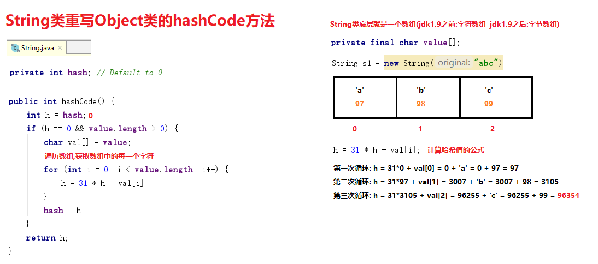

## 5.HashSet集合存储数据的结构（哈希表）

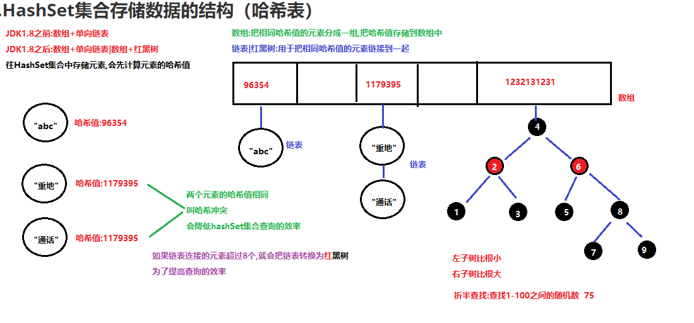

## 6.使用HashSet集合存储String不重复的原理(扩展知识点_了解)

```java
package com.itheima.demo04Set;

import java.util.HashSet;

/*
    使用HashSet集合存储String不重复的原理(扩展知识点_了解)
    String类(Integer,Double...)重写了Object类的hashCode方法和equals方法,用于判断元素是否重复
 */
public class Demo04HashSetSaveString {
    public static void main(String[] args) {
        HashSet<String> set = new HashSet<>();
        String s1 = new String("abc");
        String s2 = new String("abc");
        set.add(s1);
        set.add(s2);
        set.add("重地");
        set.add("通话");
        set.add("abc");
        System.out.println(set);
    }
}
```

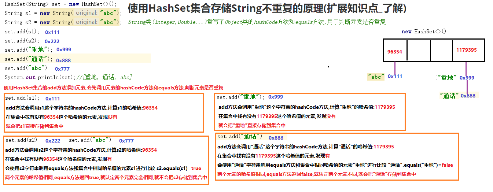

## 7.HashSet存储自定义类型元素(重点中的重点)

同名同年龄的Student对象,视为重复的元素,只能存储一个

Student类重写hashCode方法和equals方法,来保证元素不重复

快捷键:alt+insert==>选择 equals() and hashCode()

```java
package com.itheima.demo04Set;

import java.util.HashSet;

/*
    HashSet存储自定义类型元素(重点中的重点)
    需求:
        同名同年龄的Student对象,视为重复的元素,只能存储一个
    重点:
        Student类重写hashCode方法和equals方法,来保证元素不重复

 */
public class Demo05HashSetSaveStudent {
    public static void main(String[] args) {
        //创建一个存储Student对象的HashSet集合对象
        HashSet<Student> set = new HashSet<>();
        Student s1 = new Student("a",10);
        Student s2 = new Student("a",10);
        System.out.println(s1.hashCode());//1163157884
        System.out.println(s2.hashCode());//1956725890
        set.add(s1);
        set.add(s2);
        Student s3 = new Student("b",9);
        set.add(s3);
        System.out.println(set);
    }
}
```

```java
package com.itheima.demo04Set;

public class Student {
    private String name;
    private int age;

    public Student() {
    }

    public Student(String name, int age) {
        this.name = name;
        this.age = age;
    }

    @Override
    public String toString() {
        return "Student{" +
                "name='" + name + '\'' +
                ", age=" + age +
                '}';
    }

    /*
        重写Object类的hashCode方法
        重写的规则: 属性:name==>字符串直接调用字符串重写的hashCode方法 + age
        name.hashCode()+age;
        Student s1 = new Student("a",10); 哈希值: 97+10=107
        Student s2 = new Student("a",10); 哈希值: 97+10=107
        两个元素的哈希值相同,比较equals方法  s1.equals(s2)==>true
        两个元素的哈希值相同,但是equals返回true,认定两个元素完成相同,只会存储一个
        --------------------------------------------------------------------------
        name.hashCode()+age;
        Student s1 = new Student("a",10); 哈希值: 97+10=107
        Student s3 = new Student("b",9);  哈希值: 98+9=107
         两个元素的哈希值相同,比较equals方法  s1.equals(s3)==>false
         两个元素的哈希值相同,但是equals返回false,认定两个元素不同,会把s3存储到集合中
        --------------------------------------------------------------------------
        降低不同元素出现相同哈希值的概率
        name.hashCode()*2+age;
        Student s1 = new Student("a",10); 哈希值: 97*2+10= 194 +10 =204
        Student s3 = new Student("b",9);  哈希值: 98*2+9= 196 +9 =205
     */
    /*@Override
    public int hashCode() {
        return name.hashCode()*31+age;
    }*/
    //快键键:alt+insert==>equals() and hashCode()
    @Override
    public int hashCode() {
        int result = name != null ? name.hashCode() : 0;
        result = 31 * result + age;
        return result;
    }

    @Override
    public boolean equals(Object o) {
        if (this == o) return true;
        if (o == null || getClass() != o.getClass()) return false;

        Student student = (Student) o;

        if (age != student.age) return false;
        return name != null ? name.equals(student.name) : student.name == null;
    }

    public String getName() {
        return name;
    }

    public void setName(String name) {
        this.name = name;
    }

    public int getAge() {
        return age;
    }

    public void setAge(int age) {
        this.age = age;
    }
}
```

## 8.LinkedHashSet集合(了解)

```java
package com.itheima.demo04Set;

import java.util.HashSet;
import java.util.LinkedHashSet;

/*
    java.util.LinkedHashSet<E>集合 extends HashSet<E>集合
        具有可预知迭代顺序的 Set 接口的哈希表和链接列表实现。
        此实现与 HashSet 的不同之外在于，后者维护着一个运行于所有条目的双重链接列表。
    LinkedHashSet集合的特点:
        1.不允许存储重复元素
        2.不包含带索引的方法
        3.是一个有序的集合
        4.底层是哈希表+单向链表组成
            JDK1.8之前:数组+单向链表+单向链表
            JDK1.8之后:数组+单向链表+单向链表|数组+红黑树+单向链表
            底层就组成了一个双向链表,所以此集合是一个有序的集合
 */
public class Demo06LinkedHashSet {
    public static void main(String[] args) {
        HashSet<String> set = new HashSet<>();
        set.add("aaa");
        set.add("bbb");
        set.add("aaa");
        set.add("ccc");
        set.add("ddd");
        System.out.println(set);//[aaa, ccc, bbb, ddd] 不允许重复,是一个无序集合

        LinkedHashSet<String> linked = new LinkedHashSet<>();
        linked.add("aaa");
        linked.add("bbb");
        linked.add("aaa");
        linked.add("ccc");
        linked.add("ddd");
        System.out.println(linked);//[aaa, bbb, ccc, ddd] 不允许重复,是一个有序集合
    }
}
```

# 第三章 Map集合

## 1.Map集合的概述

```java
java.util.Map<k,v>接口 key:键 value:值
特点:
	1.Map集合是一个双列集合,每个元素包含两个值,一个key,一个value
	2.Map集合中key是不允许重复的,value可以重复
	3.Map集合中一个key只能对应一个value
	4.Map集合中key和value的数据类型可以是相同的,也可以是不同的
```

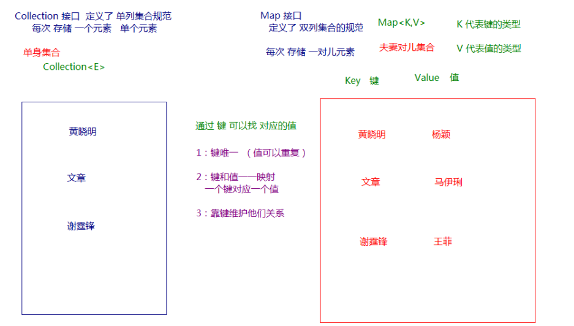

## 2.Map集合常用的实现类

```java
1.java.util.HashMap<K,V>集合 implements Map<K,V>接口
	基于哈希表的 Map 接口的实现。此类不保证映射的顺序，特别是它不保证该顺序恒久不变。 
	a.HashMap集合底层是一个哈希表结构和HashSet是一样的
	b.是一个无序的集合:存储元素和取出元素顺序有可能不一致
2.java.util.LinkedHashMap<K,V>集合 extends HashMap<K,V>集合
	Map 接口的哈希表和链接列表实现，具有可预知的迭代顺序。
	此实现与 HashMap 的不同之处在于，后者维护着一个运行于所有条目的双重链接列表。
	a.LinkedHashMap集合底层是哈希表+单向链表,数据结构和LinkedHashSet是一样的
	b.是一个有序集合
3.java.util.TreeMap<K,V>集合 implements Map<K,V>接口
	基于红黑树（Red-Black tree）的 NavigableMap 实现。该映射根据其键的自然顺序进行排序，或者根据创建映射时提供的 Comparator 进行排序，具体取决于使用的构造方法。 
	a.TreeMap集合底层是一个红黑树结构,和TreeSet集合的数据结构是一样的
	b.TreeMap集合自带了一个比较器,里边存储的key是有序的(默认升序排序,或者根据比较器自定义排序的规则)
```

## 3.Map的常用方法(重点)

```java
package com.itheima.demo05Map;

import java.util.Collection;
import java.util.HashMap;
import java.util.Map;

/*
    Map的常用方法(重点)
        V put(K key, V value) 往Map集合中添加键值对
        V get(Object key)  根据key获取vlaue
        V remove(Object key)  根据key删除Map集合中的键值对
        boolean containsKey(Object key) 判断Map集合中是否包含指定的key
 */
public class Demo01Map {
    public static void main(String[] args) {
        show05();
    }

    /*
        Collection<V> values() 取出Map集合中所有的value值,存储到Collection集合中返回
     */
    private static void show05() {
        Map<String,Integer> map = new HashMap<>();
        map.put("迪丽热巴",165);
        map.put("古力娜扎",168);
        map.put("尼格买提",180);
        map.put("冯提莫",150);

        Collection<Integer> values = map.values();
        System.out.println(values);//[165, 150, 168, 180]
    }

    /*
        boolean containsKey(Object key) 判断Map集合中是否包含指定的key
        返回值:boolean
            包含指定的key,返回true
            不包含指定的key,返回false
        boolean containsValue(Object value)判断Map集合中是否包含指定的value
        返回值:boolean
            包含指定的value,返回true
            不包含指定的false,返回false
     */
    private static void show04() {
        Map<String,Integer> map = new HashMap<>();
        map.put("迪丽热巴",165);
        map.put("古力娜扎",168);
        map.put("尼格买提",180);
        map.put("冯提莫",150);

        boolean b1 = map.containsKey("冯提莫");
        System.out.println("b1:"+b1);//b1:true

        boolean b2 = map.containsKey("高圆圆");
        System.out.println("b2:"+b2);//b2:false

        System.out.println(map.containsValue(168));//true
        System.out.println(map.containsValue(250));//false
    }

    /*
        V remove(Object key)  根据key删除Map集合中的键值对
        返回值:(V===>值)
            key存在,根据key删除键值对,返回被删除键值对的value值
            key不存在,返回null
     */
    private static void show03() {
        Map<String,Integer> map = new HashMap<>();
        map.put("迪丽热巴",165);
        map.put("古力娜扎",168);
        map.put("尼格买提",180);
        map.put("冯提莫",150);
        System.out.println(map);
        Integer v1 = map.remove("尼格买提");//{迪丽热巴=165, 冯提莫=150, 古力娜扎=168, 尼格买提=180}
        System.out.println("v1:"+v1);//v1:180
        System.out.println(map);//{迪丽热巴=165, 冯提莫=150, 古力娜扎=168}

        Integer v2 = map.remove("尼古拉斯赵四");
        System.out.println("v2:"+v2);//v2:null
        System.out.println(map);//{迪丽热巴=165, 冯提莫=150, 古力娜扎=168}


    }

    /*
        V get(Object key)  根据key获取vlaue
        返回值:(V===>值)
            key存在,根据key获取value返回
            key不存在,返回null
     */
    private static void show02() {
        Map<String,Integer> map = new HashMap<>();
        map.put("迪丽热巴",165);
        map.put("古力娜扎",168);
        map.put("尼格买提",180);
        map.put("冯提莫",150);

        Integer v1 = map.get("古力娜扎");
        System.out.println("v1:"+v1);//v1:168

        Integer v2 = map.get("马尔扎哈");
        System.out.println("v2:"+v2);//v2:null
    }

    /*
        V put(K key, V value) 往Map集合中添加键值对
        返回值:(V===>值)
            添加键值对,key不重复,V返回null
            添加键值对,key重复,会使用新的value替换之前的value,V返回被替换value
     */
    private static void show01() {
        //创建Map集合对象
        Map<String,String> map = new HashMap<>();
        String v1 = map.put("黄晓明", "赵薇");
        System.out.println("v1:"+v1);//v1:null

        String v2 = map.put("黄晓明", "杨颖");
        System.out.println("v2:"+v2);//v2:赵薇
        System.out.println(map);//{黄晓明=杨颖}

        map.put("杨过","小龙女");
        map.put("郭靖","黄蓉");
        map.put("张无忌","赵敏");
        map.put("尹志平","小龙女");
        System.out.println(map);//{杨过=小龙女, 尹志平=小龙女, 郭靖=黄蓉, 张无忌=赵敏, 黄晓明=杨颖}
    }
}
```

## 4.Map集合的遍历(重点)

### 1).键找值的方式

#### 概述

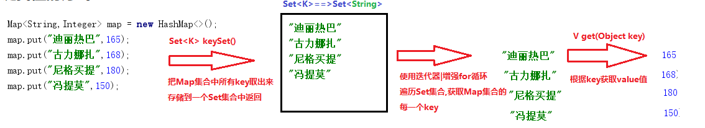

#### 代码实现

```java
package com.itheima.demo05Map;

import java.util.HashMap;
import java.util.Map;
import java.util.Set;

/*
    Map集合的遍历(重点)_键找值方式
    使用Map集合中的方法:
        Set<K> keySet()  取出Map集合中所有的key,存储Set集合中返回
        V get(Object key) 根据key获取value值
    实现步骤:
        1.使用Map集合中的keySet方法,取出Map集合中所有的key,存储Set集合中返回
        2.遍历Set集合,获取Map集合的每一个key
        3.使用Map集合中的方法get,根据key获取value值
 */
public class Demo02Map {
    public static void main(String[] args) {
        Map<String,Integer> map = new HashMap<>();
        map.put("迪丽热巴",165);
        map.put("古力娜扎",168);
        map.put("尼格买提",180);
        map.put("冯提莫",150);
        //1.使用Map集合中的keySet方法,取出Map集合中所有的key,存储Set集合中返回
        Set<String> set = map.keySet();
        //2.遍历Set集合,获取Map集合的每一个key
        for (String key : set) {
            //3.使用Map集合中的方法get,根据key获取value值
            Integer value = map.get(key);
            System.out.println(key+"\t"+value);
        }
    }
}
```

### 2).键值对方式

#### 概述

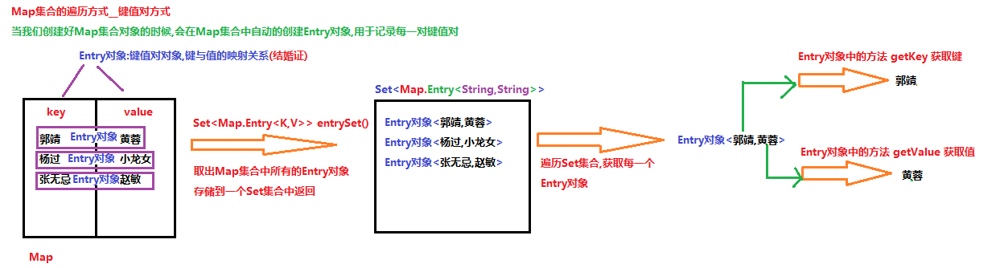

#### 代码实现

```java
package com.itheima.demo05Map;

import java.util.HashMap;
import java.util.Map;
import java.util.Set;

/*
    Map集合遍历_键值对方式
    使用Map集合中的方法
        Set<Map.Entry<K,V>> entrySet() 取出Map集合中所有的entry对象,存储到Set集合中返回
    Entry接口中的方法:
        K getKey() 获取健
        V getValue() 获取值
    实现步骤:
        1.使用Map集合中的方法entrySet,取出Map集合中所有的entry对象,存储到Set集合中返回
        2.遍历Set集合,获取每一个Entry对象
        3.使用Entry对象中的方法getKey和getValue分别获取键与值
 */
public class Demo03Map {
    public static void main(String[] args) {
        //创建Map集合对象,添加键值对
        Map<String,String> map = new HashMap<>();
        map.put("郭靖","黄蓉");
        map.put("杨过","小龙女");
        map.put("张无忌","赵敏");
        //1.使用Map集合中的方法entrySet,取出Map集合中所有的entry对象,存储到Set集合中返回
        //访问成员内部类:外部类名.内部类名
        Set<Map.Entry<String, String>> set = map.entrySet();
        //2.遍历Set集合,获取每一个Entry对象
        for (Map.Entry<String, String> entry : set) {
            //3.使用Entry对象中的方法getKey和getValue分别获取键与值
            String key = entry.getKey();
            String value = entry.getValue();
            System.out.println(key+"\t"+value);
        }
    }
}
```

## 5.HashMap存储自定义类型(重点中的重点)

```java
package com.itheima.demo05Map;

import java.util.HashMap;
import java.util.Map;
import java.util.Set;

/*
    HashMap存储自定义类型(重点中的重点)
 */
public class Demo04HashMapSavePerson {
    public static void main(String[] args) {
        show02();
    }

    /*
        HashMap存储自定义类型(重点中的重点)
        key:Person类型
            key不允许重复:Person重写hashCode和equals方法,保证key唯一
        value:String类型
            value可以重复
     */
    private static void show02() {
        //创建HashMap集合对象
        HashMap<Person,String> map = new HashMap<>();
        //往集合中添加键值对
        map.put(new Person("习大大",18),"中国");
        map.put(new Person("女王",18),"英国");
        map.put(new Person("金三胖",3),"朝鲜");
        map.put(new Person("女王",18),"毛里求斯");
        //使用entrySet+增强for循环遍历Map集合
        Set<Map.Entry<Person, String>> set = map.entrySet();
        for (Map.Entry<Person, String> entry : set) {
            Person key = entry.getKey();
            String value = entry.getValue();
            System.out.println(key+"-->"+value);
        }
    }

    /*
        HashMap存储自定义类型(重点中的重点)
        key:String类型
            key不允许重复:String类重写了hashCode和equals方法,可以保证key唯一
        value:Person类型
            value是可以重复
     */
    private static void show01() {
        //创建HashMap集合对象
        HashMap<String,Person> map = new HashMap<>();
        //往集合中添加键值对
        map.put("中国",new Person("习大大",18));
        map.put("美国",new Person("奥巴马",88));
        map.put("朝鲜",new Person("金三胖",1));
        map.put("俄罗斯",new Person("普京大帝",28));
        map.put("美国",new Person("特朗普",99));
        //使用keySet方法+增强for循环遍历Map集合
        Set<String> set = map.keySet();
        for (String key : set) {
            Person value = map.get(key);
            System.out.println(key+"-->"+value);
        }
    }
}
```

```java
package com.itheima.demo05Map;

/*
    自定义类型Person,Student...什么时候重写equals和hashCode方法
    1.使用HashSet集合|LinkedHashSet集合存储自定义类型,不允许重复,需要重写
    2.使用HashMap集合|linkedHashMap集合key使用自定义类型,key不允许重复,需要重写
 */
public class Person {
    private String name;
    private int age;

    public Person() {
    }

    public Person(String name, int age) {
        this.name = name;
        this.age = age;
    }

    @Override
    public String toString() {
        return "Person{" +
                "name='" + name + '\'' +
                ", age=" + age +
                '}';
    }

    @Override
    public boolean equals(Object o) {
        if (this == o) return true;
        if (o == null || getClass() != o.getClass()) return false;

        Person person = (Person) o;

        if (age != person.age) return false;
        return name != null ? name.equals(person.name) : person.name == null;
    }

    @Override
    public int hashCode() {
        int result = name != null ? name.hashCode() : 0;
        result = 31 * result + age;
        return result;
    }

    public String getName() {
        return name;
    }

    public void setName(String name) {
        this.name = name;
    }

    public int getAge() {
        return age;
    }

    public void setAge(int age) {
        this.age = age;
    }
}
```

## 6.LinkedHashMap集合(了解)

```java
package com.itheima.demo05Map;

import java.util.HashMap;
import java.util.LinkedHashMap;

/*
    java.uil.LinkedHashMap<K,V>集合 extends HashMap<K,V>集合
        Map 接口的哈希表和链接列表实现，具有可预知的迭代顺序。
        此实现与 HashMap 的不同之处在于，后者维护着一个运行于所有条目的双重链接列表。
    LinkedHashMap集合的特点:
        底层是哈希表+单向链表==>是一个双向链表,是一个有序的集合
 */
public class Demo05LinkedHashMap {
    public static void main(String[] args) {
        HashMap<String,String> map = new HashMap<>();
        map.put("aaa","aaa");
        map.put("bbb","bbb");
        map.put("aaa","hello");
        map.put("ccc","ccc");
        map.put("ddd","ddd");
        System.out.println(map);//{aaa=hello, ccc=ccc, bbb=bbb, ddd=ddd} key不允许重复,是一个无序集合

        LinkedHashMap<String,String> linked = new LinkedHashMap<>();
        linked.put("aaa","aaa");
        linked.put("bbb","bbb");
        linked.put("aaa","hello");
        linked.put("ccc","ccc");
        linked.put("ddd","ddd");
        System.out.println(linked);//{aaa=hello, bbb=bbb, ccc=ccc, ddd=ddd} key不允许重复,是一个有序集合
    }
}
```

## 7.Hashtable集合(了解-面试)

```java
package com.itheima.demo01Map;

import java.util.ArrayList;
import java.util.HashMap;
import java.util.Hashtable;

/*
    Hashtable集合(了解-->面试)
    java.util.Hashtable<K,V>集合 implements Map<K,V>接口(jdk1.2之后开始实现)
        此类实现一个哈希表，该哈希表将键映射到相应的值。任何非 null 对象都可以用作键或值。
    --------------------------------------------------------------------------------------
    HashMap集合的特点:
        1.HashMap集合底层是一个哈希表结构
        2.HashMap集合是jdk1.2版本之后出现的
        3.HashMap集合允许存储null键和null值
        4.HashMap集合是不同步的,效率高(多线程不安全)
    --------------------------------------------------------------------------------------
    Hashtable集合的特点:
        1.Hashtable集合底层是一个哈希表结构
        2.Hashtable集合是jdk1.0版本就存在的双列集合(最早期的双列集合)
        3.Hashtable集合不允许存储null键和null值
        4.Hashtable集合是同步的,效率低(多线程安全)
    --------------------------------------------------------------------------------------
    Hashtable集合效率没有HashMap高,所以已经被淘汰了
    但是Hashtable集合的子类Properties集合依然活跃在历史的舞台
 */
public class Demo06Hashtable {
    public static void main(String[] args) {
        HashMap<String,String> map = new HashMap<>();
        map.put("a",null);
        map.put(null,"b");
        map.put(null,null);
        System.out.println(map);//{null=null, a=null}

        Hashtable<String,String> table = new Hashtable<>();
        //table.put("a",null);//NullPointerException
        //table.put(null,"b");//NullPointerException
        //table.put(null,null);//NullPointerException

        ArrayList<Integer> list = new ArrayList<>();
        list.add(1);
        list.add(null);
        list.add(2);
        list.add(null);
        System.out.println(list);//[1, null, 2, null]
    }
}
```

## 8.Map集合的练习

### 需求：

​	输入一个字符串,统计字符串中每个字符出现次数

### 分析:

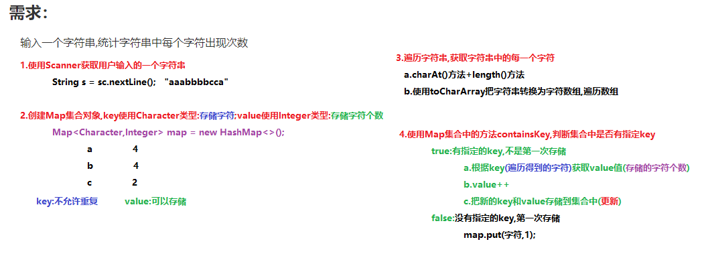

### 代码实现:

```java
package com.itheima.demo05Map;

import java.util.HashMap;
import java.util.Scanner;

/*
    Map集合的练习
    需求：
	    输入一个字符串,统计字符串中每个字符出现次数
    分析:
        1.使用Scanner获取用户输入的一个字符串
        2.创建Map集合对象,key使用Character类型:存储字符;value使用Integer类型:存储字符个数
        3.遍历字符串,获取字符串中的每一个字符
           a.charAt()方法+length()方法
           b.使用toCharArray把字符串转换为字符数组,遍历数组
        4.使用Map集合中的方法containsKey,判断集合中是否有指定key
            true:有指定的key,不是第一次存储
                a.根据key(遍历得到的字符)获取value值(存储的字符个数)
                b.value++
                c.把新的key和value存储到集合中(更新)
            false:没有指定的key,第一次存储
                map.put(字符,1);
 */
public class Demo07Test {
    public static void main(String[] args) {
        //1.使用Scanner获取用户输入的一个字符串
        System.out.println("请输入一个字符串:");
        String s = new Scanner(System.in).nextLine();
        //2.创建Map集合对象,key使用Character类型:存储字符;value使用Integer类型:存储字符个数
        HashMap<Character,Integer> map = new HashMap<>();
        //3.遍历字符串,获取字符串中的每一个字符
        //a.charAt()方法+length()方法
        /*for (int i=0; i<s.length();i++){
            System.out.println(s.charAt(i));
        }*/
        //b.使用toCharArray把字符串转换为字符数组,遍历数组
        char[] arr = s.toCharArray();
        for (char c : arr) {
            //4.使用Map集合中的方法containsKey,判断集合中是否有指定key
            if(map.containsKey(c)){
                //true:有指定的key,不是第一次存储
                //a.根据key(遍历得到的字符)获取value值(存储的字符个数)
                Integer value = map.get(c);
                //b.value++
                value++;
                //c.把新的key和value存储到集合中(更新)
                map.put(c,value);
            }else{
                //false:没有指定的key,第一次存储
                //map.put(字符,1);
                map.put(c,1);
            }
        }
        System.out.println(map);
    }
}
```

# 第四章 斗地主综合案例(重点)

## 1.需求分析:

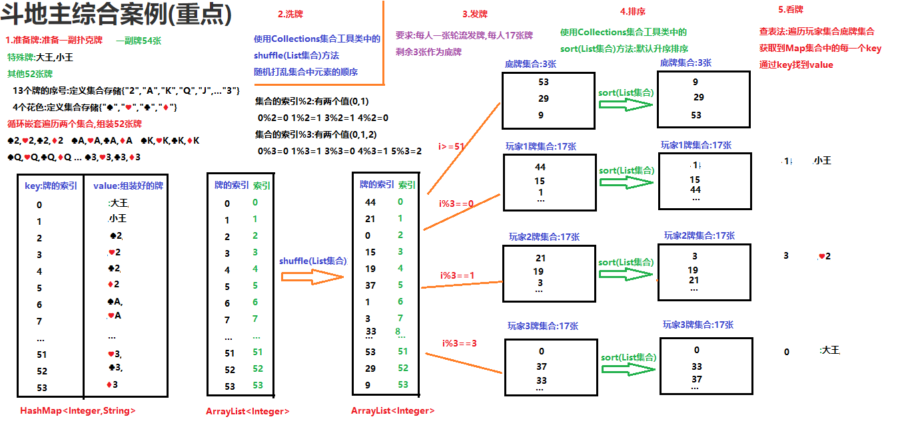

## 2.代码实现:

```java
package com.itheima.demo06Test;

import java.util.ArrayList;
import java.util.Collections;
import java.util.HashMap;

/*
    斗地主综合案例:
        1.准备牌
        2.洗牌
        3.发牌
        4.排序
        5.看牌
 */
public class DouDiZhu {
    public static void main(String[] args) {
        //1.准备牌
        //创建一个Map集合,key使用Integer类型:存储牌的索引,value使用String类型:存储组装好的牌
        HashMap<Integer,String> poker = new HashMap<>();
        //创建一个List集合,泛型使用Integer类型:存储牌的索引
        ArrayList<Integer> pokerIndex = new ArrayList<>();
        //定义一个变量,记录牌的索引
        int index = 0;
        //往集合中添加大王和小王
        poker.put(index,"大王");
        pokerIndex.add(index);
        //改变索引++
        index++;
        poker.put(index,"小王");
        pokerIndex.add(index);
        index++;
        //定义一个List集合,存储13个牌的序号
        ArrayList<String> numbers = new ArrayList<>();
        Collections.addAll(numbers,"2","A","K","Q","J","10","9","8","7","6","5","4","3");
        //定义一个List集合,存储4个花色
        ArrayList<String> colors = new ArrayList<>();
        Collections.addAll(colors,"♠","♥","♣","♦");
        //循环嵌套遍历两个List集合,组装52张牌
        for (String number : numbers) {
            for (String color : colors) {
                //System.out.println(color+number);
                //把组装好的牌添加到集合中
                poker.put(index,color+number);
                pokerIndex.add(index);
                index++;
            }
        }
        //System.out.println(poker);
        //System.out.println(pokerIndex);

        //2.洗牌 使用Collections集合工具类中的方法shuffle(List集合) 随机打乱集合中元素的顺序
        Collections.shuffle(pokerIndex);
        //System.out.println(pokerIndex);

        //3.发牌
        //定义4个List集合存储玩家的牌和底牌
        ArrayList<Integer> player01 = new ArrayList<>();
        ArrayList<Integer> player02 = new ArrayList<>();
        ArrayList<Integer> player03 = new ArrayList<>();
        ArrayList<Integer> diPai = new ArrayList<>();
        //遍历存储牌索引的List集合(pokerIndex),获取每一个牌的索引
        for (int i = 0; i < pokerIndex.size(); i++) {
            Integer pi = pokerIndex.get(i);
            //判断索引>=51给底牌发牌 索引%3给3个玩家发牌
            if(i>=51){
                //给底牌发牌
                diPai.add(pi);
            }else if(i%3==0){
                //给玩家1发牌
                player01.add(pi);
            }else if(i%3==1){
                //给玩家2发牌
                player02.add(pi);
            }else if(i%3==2){
                //给玩家3发牌
                player03.add(pi);
            }
        }
        //System.out.println(player01);
        //System.out.println(player02);
        //System.out.println(player03);
        //System.out.println(diPai);

        //4.排序 使用Collections集合工具类中的方法sort(List集合)对集合进行默认升序排序
        Collections.sort(player01);
        Collections.sort(player02);
        Collections.sort(player03);
        Collections.sort(diPai);

        //System.out.println(player01);
        //System.out.println(player02);
        //System.out.println(player03);
        //System.out.println(diPai);

        //5.看牌==>调用看牌方法
        lookPoker("周润发",poker,player01);
        lookPoker("周星驰",poker,player02);
        lookPoker("刘德华",poker,player03);
        lookPoker("底牌",poker,diPai);
    }

    /*
        定义一个看牌的方法
        参数:
            String name:玩家名称
            HashMap<Integer,String> poker:存储扑克的Map集合
            ArrayList<Integer> list:存储玩家|底牌集合
        实现:
            遍历存储玩家|底牌的List集合,获取Map集合的每一个key
            使用Map集合中的方法get,根key获取value值
     */
    public static void lookPoker(String name,HashMap<Integer,String> poker,ArrayList<Integer> list){
        //打印玩家名称,不换行
        System.out.print(name+" :");
        //遍历存储玩家|底牌的List集合,获取Map集合的每一个key
        for (Integer key : list) {
            //使用Map集合中的方法get,根key获取value值
            String value = poker.get(key);
            System.out.print(value+" ");
        }
        //打印完每个玩家|底牌换行
        System.out.println();
    }
}
```