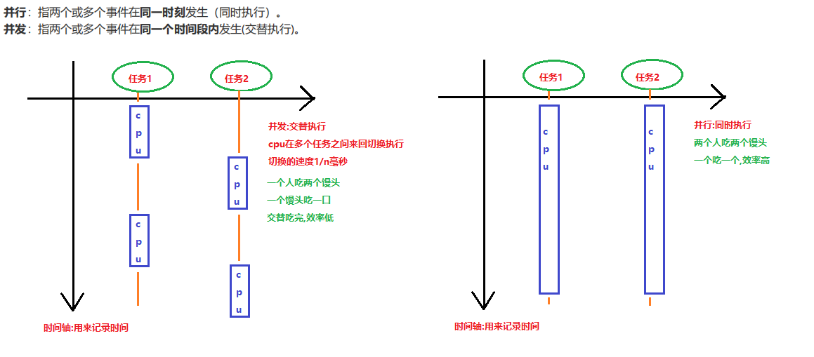
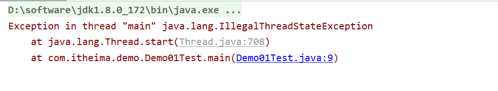

# 学习目标

```java
能够辨别程序中异常和错误的区别
	错误:严重的问题,必须修改代码才能解决
	异常:可以解决的问题,使用try...catch解决异常之后,程序可以继续执行
说出异常的分类
	编译期异常==>Exception:写代码的时候会报的异常
	运行期(时)异常==>RuntimeException:运行代码的时候报的异常
列举出常见的三个运行期异常
	NullPointerException:空指针异常,一般是使用null调用了方法,访问属性导致
	IndexOutOfBoundsException:索引越界异常(集合会报),超出了集合索引的使用范围
	StringIndexOutOfBoundsException:字符串索引越界异常,超出了字符串索引的使用范围
	ArrayIndexOutOfBoundsException:数组索引越界异常,,超出了数组索引的使用范围
	ClassCastException:类型转换异常
	ConcurrentModificationException:迭代器并发修改异常
	NoSuchElementException:没有元素异常
	NumberFormatException:数字格式化异常
	IllegalThreadStateException:非法状态异常 线程对象重复的调用start方法
能够使用try...catch关键字处理异常(重点)
	try{
		可能产生异常的代码
		throw new xxxException("异常的信息");
		...
		throw new yyyException("异常的信息");
	}catch(xxxException e){ 
		异常的处理逻辑
	}
	...
	catch(yyyException e){
		异常的处理逻辑
	}
能够使用throws关键字处理异常(重点)
	修饰符 返回值类型 方法名(参数) throws xxxException,...,yyyException{
		throw new xxxException("异常的信息");
		...
		throw new yyyException("异常的信息");
	}
能够自定义并使用异常类
	1.自定义异常的类名,一般都是以Exception结尾,说明这个类是一个异常相关的类(见名知意)
	2.自定义异常
		a.必须继承Exception:自定义的异常就是一个编译期异常
			使用:如果在方法内部抛出了编译期异常,那么我们就必须处理这个异常
				1.使用throws声明抛出异常,最终抛出给方法的调用者处理
				2.使用try...catch自己捕获处理异常
	    b.必须继承RuntimeException:自定义的异常就是一个运行期异常
			使用:如果在方法内部抛出了运行期异常,我们无需处理,默认交给JVM处理(中断处理)
说出进程和线程的概念
	//进程:进入到内存中的程序
	//线程:是进程的一部分,一个进程中至少有一个线程,叫单线程程序,一个进程中有多个线程,叫多线程程序
能够理解并发与并行的区别
	//并发:交替执行
	//并行:同时执行
能够描述Java中多线程运行原理
	程序的运行:
		调用start方法之后,结果是两个线程并发地运行；
         当前线程（主线程:执行main方法中的代码）和另一个线程（新开启的线程:执行其 run 方法中的代码）。
         两个线程main线程和新的线程一起抢夺cpu的执行权,谁抢到了谁执行,就会出现随机性的打印结果
	内存方面:
	//当我们调用start方法,会开辟一个新的栈内存,运行run方法
	//结果: main线程在一个栈内存中,新的线程Thread-x在一个栈内存中
	//cpu:喜欢那个栈内存就执行哪个栈内存中的代码
能够使用继承类的方式创建多线程(重点)
	1.创建一个类继承Thread
	2.在Thread的子类中,重写Thread类中的run方法,设置线程任务
	3.创建Thread类的子类对象
	4.调用继承自Thread类中的start方法,开启新的线程执行run方法
	public class MyThread extends Thread {
		@Override
		public void run() {
			//线程任务:开启新的线程的目的
		}
	}
	MyThread mt = new MyThread();
	mt.start();
能够使用实现接口的方式创建多线程(重点)
	1.创建一个实现类,实现Runnable接口
	2.在实现类中重写Runnable接口中的run方法,设置线程任务
	3.创建Runnable接口的实现类对象
	4.创建Thread类对象,构造方法中传递Runnable接口的实现类对象
	5.调用Thread类中的方法start,开启新的线程,执行run方法
	public class RunnableImpl implements Runnable{
		@Override
		public void run() {
			//线程任务:开启新的线程的目的
		}
	}
	RunnableImpl r = new RunnableImpl();
	new Thread(r).start();
能够说出实现接口方式的好处(面试)
	1.使用实现Runnbale接口的方式实现多线程程序,可以避免单继承的局限性
	2.使用实现Runnbale接口的方式实现多线程程序,把设置线程任务和开启线程进行了解耦(解除了耦合性,增强了扩展性)                
```

# 第一章 异常

## 1.异常的概念

**异常** ：指的是程序在执行过程中，出现的非正常的情况，最终会导致JVM的非正常停止。 

**在Java等面向对象的编程语言中，异常本身是一个类，产生异常就是创建异常对象并抛出了一个异常对** 

**象。Java处理异常的方式是中断处理(停止java虚拟机JVM)。** 

## 2.异常的体系(重点)


```java
异常的体系(重点)
    -- java.lang.Throwable类:是所有异常和错误的父类
        Throwable 类是 Java 语言中所有错误或异常的超类。
        1.异常:小问题,就想平时生病感冒,发烧了,是可以治愈的
            在java中,异常我们是可以解决的,解决了异常之后,程序可以继续往后执行
            -- java.lang.Exception extends Throwable类:编译期异常,在写代码的时候,程序报的异常
            -- java.lang.RuntimeException extends Exception:运行期(时)异常,在运行代码的时候,程序报的异常
        2.错误:严重问题,就想得了癌症,艾滋,是无法治愈的
            在java中,遇到了错误,必须的修改代码,不让错误出现
            -- java.lang.Error extends Throwable类 :错误
```

```java
package com.itheima.demo01Exception;

import java.text.ParseException;
import java.text.SimpleDateFormat;
import java.util.Date;

public class Demo01ErrorAndException {
    public static void main(String[] args) {
        /*
            -- java.lang.Exception extends Throwable类:编译期异常,在写代码的时候,程序报的异常
            ctrl+alt+T:选择对应的语句包裹代码
         */
        /*try {
            SimpleDateFormat sdf = new SimpleDateFormat("yyyy-MM-dd");
            Date date = sdf.parse("20002-2");
            System.out.println(date);
        } catch (ParseException e) {
            e.printStackTrace();
        }*/

        //-- java.lang.RuntimeException extends Exception:运行期(时)异常,在运行代码的时候,程序报的异常
        /*try {
            int[] arr = {1,2,3};
            System.out.println(arr[3]);
        } catch (Exception e) {
            e.printStackTrace();
        }*/

        //-- java.lang.Error extends Throwable类 :错误
        /*
            Exception in thread "main" java.lang.OutOfMemoryError: Java heap space
            创建的数组太大了,超出了内存的使用范围,抛出内存溢出的错误
         */
        //int[] arr = new int[1024*1000*1000];
        int[] arr = new int[1024*1000];//修改代码不让错误出现

        System.out.println("后续代码!");
    }
}
```

## 3.异常的产生过程解析(面试)

```java
package com.itheima.demo01Exception;

/*
    异常的产生过程解析(面试)
    分析一下异常是如何产生的,产生异常之后JVM是如何处理异常的
 */
public class Demo02Exception {
    public static void main(String[] args) {
        int[] arr = {1,2,3};
        int e = getElemnet(arr, 3);
        System.out.println(e);
    }

    /*
        定义一个方法,方法的参数传递数组和数组的索引
        在方法中返回指定索引处的元素
     */
    public static int getElemnet(int[] arr,int index){
        int ele = arr[index];
        return ele;
    }
}
```


## 4.throw关键字(重点)

```java
package com.itheima.demo01Exception;

/*
    throw关键字(重点)
    作用:
        让我们在[方法中]抛出指定的异常对象
    格式:
        修饰符 返回值类型 方法名(参数列表){
            throw new xxxException("异常的错误信息");
            ...
            throw new yyyException("异常的错误信息");
        }
    注意:
        1.throw关键字必须写在方法中
        2.throw关键字后边创建的对象,必须是Exception或者RuntimeException或者他们的子类
            不能是和异常无关的对象(Person,Student==>错误)
        2.throw关键字抛出的是运行时(期)异常,我们无需处理异常,默认交给JVM处理(中断)
          throw关键字抛出的是编译期异常,我们就必须的处理这个异常
 */
public class Demo03throw {
    public static void main(String[] args) {
        int[] arr = {1,2,3};
        int e = getElemnet(arr, 3);
        System.out.println(e);
    }

    /*
        定义一个方法,方法的参数传递数组和数组的索引
        在方法中返回指定索引处的元素
        注意:
            在工作中都会对传递到方法中的参数进行一些合法性的校验
            传递的参数合法,就可以使用参数
            传递的参数不合法,就可以使用抛出异常对象的方式,告之方法调用者,传递参数有误
     */
    public static int getElemnet(int[] arr,int index){
        /*
            对数组arr对象进行一个合法性校验,判断arr是否为null
            如果arr是null,抛出空指针异常对象,告之方法的调用者"您传递的参数arr是null!"
         */
        if(arr==null){
            throw new NullPointerException("您传递的参数arr是null");
        }

        /*
            对数组的索引index进行一个合法性的校验,判断index是否在数组索引的范围内
            如果index超出了数组索引的范围,抛出索引越界异常,告之方法的调用者
            "您传递的数组索引index:"+index+"超出数组索引的范围!"
         */
        if(index<0 || index>arr.length-1){
            throw new ArrayIndexOutOfBoundsException("您传递的数组索引index:"+index+"超出数组索引的范围!");
        }

        //参数都合法,使用参数
        int ele = arr[index];
        return ele;
    }
}
```

## 5.throws关键字(重点)

```java
package com.itheima.demo01Exception;

import java.io.FileNotFoundException;
import java.io.IOException;

/*
    throws关键字(重点):异常处理的第一种方式
    作用:
        throw关键字抛出的是编译期异常,我们就必须的处理这个异常
        可以使用throws关键字把异常对象抛出给方法的调用者处理,最终可以抛出给JVM处理(中断)
    格式:
        修饰符 返回值类型 方法名(参数列表) throws xxxException,...yyyException{
            throw new xxxException("异常的错误信息");
            ...
            throw new yyyException("异常的错误信息");
        }
     注意:
        1.在方法中抛出什么异常对象,就在方法上使用throws关键字声明抛出什么异常对象
            在方法中抛出多个异常对象,就需要在方法上声明多个异常对象
            在方法中抛出的多个异常对象,有子父类关系,在方法上声明父类异常对象即可
        2.调用了一个声明抛出异常对象的方法,必须的对这个异常对象进行处理
            可以使用throws关键字继续声明抛出异常对象给方法的调用者处理
            可以使用try...catch关键字自己处理异常
    弊端:
        最终会把异常对象抛出给JVM,JVM会中断我们当前正在执行的程序
        那么异常之后代码代码就不会执行了
 */
public class Demo04throws {
    public static void main(String[] args)throws FileNotFoundException,IOException {
        //readFile(null);
        //readFile("c:\\abc.java");
        readFile("d:\\abc.java");
        System.out.println("后续代码!");
        System.out.println("后续代码!");
        System.out.println("后续代码!");
        System.out.println("后续代码!");
    }

    /*
        定义一个方法,方法的参数传递一个文件的路径 d:\\abc.java
        在方法根据文件的路径读取文件,在方法中对文件的路径进行合法性的判断
     */
    public static void readFile(String path) throws FileNotFoundException,IOException{
        /*
            对文件的路径path进行合法性的判断,判断path是否为null
            是null,抛出IOException对象,告之方法的调用者,传递的文件路径是null
         */
        if(path==null){
            throw new IOException("传递的文件路径是null!");
        }

        /*
            对文件路径path进行合法性判断,判断路径是否为d:\\abc.java
            不是d:\\abc.java,抛出文件找不到异常对象,告之方法的调用者,传递的文件不存在
         */
        if(!"d:\\abc.java".equals(path)){
            throw new FileNotFoundException("传递的路径不是d:\\abc.java!");
        }

        //文件路径没有问题,根据文件路径读取文件
        System.out.println("读取到了d:\\abc.java文件!");
    }
}
```

## 6.throws抛出子父类异常的处理(重点)

**在方法内部抛出了多个异常对象,有子父类关系,在方法上声明父类异常即可**

```java
package com.itheima.demo01Exception;

import java.io.FileNotFoundException;
import java.io.IOException;

/*
    如果在方法中抛出多个异常对象,有子父类关系,使用throws关键字声明父类异常即可
    public class FileNotFoundException extends IOException extends Exception
    public static void main(String[] args)throws FileNotFoundException,IOException
    以上使用throws关键字声明抛出异常对象的代码可以简化,抛出父类即可
        public static void main(String[] args)throws IOException
        public static void main(String[] args)throws Exception
 */
public class Demo05throws {
    public static void main(String[] args)throws Exception {
        //readFile(null);
        //readFile("c:\\abc.java");
        readFile("d:\\hello.java");

        System.out.println("后续代码!");
        System.out.println("后续代码!");
        System.out.println("后续代码!");
        System.out.println("后续代码!");
    }

    /*
        定义一个方法,方法的参数传递文件的路径 "d:\\hello.java"
        对文件路径进行合法性判断
     */
    public static void readFile(String path)throws FileNotFoundException,IOException{
        /*
            判断路径path是否为null,是null,抛出IO异常对象,告之方法的调用者,传递的路径是null
         */
        if(path==null){
            throw new IOException("传递的路径是null");
        }

        /*
            判断路径path是否为"d:\\hello.java",不是抛出文件找不到异常,告之方法的调用者,传递的文件路径有误
         */
        if(!"d:\\hello.java".equals(path)){
            throw new FileNotFoundException("传递的文件路径有误不是d:\\hello.java");
        }
        //路径合法,读取文件
        System.out.println("读取到了d:\\hello.java文件!");
    }
}
```

## 7.try...catch关键字(重点)

**快捷键 选择中代码==>ctrl+alt+T==>选择try catch**

```java
package com.itheima.demo01Exception;

import java.io.FileNotFoundException;
import java.io.IOException;

/*
    try...catch关键字(重点):异常处理的第二种方式
        throw关键字抛出的是编译期异常,我们就必须的处理这个异常
        调用了一个声明抛出编译期异常的方法,我们就必须的处理这个异常
        就可以使用try catch关键字自己手动处理异常
    格式:
        try{
            //可能产生异常的代码(也可以写没有异常的代码)
        }catch(定义一个异常相关的变量){//用来接收try中产生的异常对象
            //异常的处理逻辑:可以随意编写
        }
        ...
        catch(定义一个异常相关的变量){//用来接收try中产生的异常对象
            //异常的处理逻辑:可以随意编写
        }
    好处:
        使用try catch处理异常,可以继续执行try catch后边的代码
    注意:
        1.try中产生了异常对象,那么就会执行catch中异常的处理逻辑,执行完毕会继续执行try catch之后的代码
        2.try中没有产生异常对象,那么就不会执行catch中异常的处理逻辑,执行完try中的代码,会继续执行try catch之后的代码
 */
public class Demo06TryCatch {
    public static void main(String[] args) {
        try {
            //可能产生异常的代码(也可以写没有异常的代码)
            //readFile(null);
            //readFile("c:\\abc.java");
            readFile("d:\\abc.java");
        } catch (FileNotFoundException e) {//FileNotFoundException e = new FileNotFoundException("传递的路径不是d:\\abc.java!");
            //异常的处理逻辑:可以随意编写
            System.out.println("程序产生了FileNotFoundException异常!");
        } catch (IOException e) {//IOException e = new IOException("传递的文件路径是null!");
            System.out.println("程序产生了IOException异常!");
        }
        System.out.println("后续代码!");
    }

    public static void readFile(String path) throws FileNotFoundException,IOException {
        if(path==null){
            throw new IOException("传递的文件路径是null!");
        }

        if(!"d:\\abc.java".equals(path)){
            throw new FileNotFoundException("传递的路径不是d:\\abc.java!");
        }

        //文件路径没有问题,根据文件路径读取文件
        System.out.println("读取到了d:\\abc.java文件!");
    }
}
```

## 8.Objects类中requireNonNull方法(了解)

```java
Objects类中requireNonNull方法(了解)
java.util.Objects:操作对象的工具类,是JDK1.7之后出现的
	里边的方法都是静态的
	里边的方法都容忍空指针异常的,空指针安全的
static <T> T requireNonNull​(T obj) :判断参数传递的对象是否为null
static <T> T requireNonNull​(T obj, String message) :判断参数传递的对象是否为null
	如果传递的对象是null,方法内部会抛出空指针异常对象
	如果传递的对象不是null,方法内部就返回传递的对象
requireNonNull​方法的源码:
	public static <T> T requireNonNull(T obj) {
		if (obj == null){
			throw new NullPointerException();
		}
		return obj;
	}
	public static <T> T requireNonNull(T obj, String message) {
		if (obj == null)
			throw new NullPointerException(message);
		return obj;
	}

```

```java
package com.itheima.demo01Exception;

import java.util.Objects;

public class Demo07Objects {
    public static void main(String[] args) {
        Person p1 = new Person();
        System.out.println(p1);//com.itheima.demo01Exception.Person@4554617c

        //判断传递的对象是否为null,是null抛出空指针异常,不是空返回对象
        Person p2 = Objects.requireNonNull(p1);
        System.out.println(p2);//com.itheima.demo01Exception.Person@4554617c

        Person p3 = null;
        //Person p4 = Objects.requireNonNull(p3);//NullPointerException
        Person p4 = Objects.requireNonNull(p3,"你传递的对象是null");//NullPointerException: 你传递的对象是null
        System.out.println(p4);
    }
}
```

## 9.Throwable类中定义的异常处理逻辑(了解)

```java
Throwable类中定义的异常处理逻辑(了解)
java.lang.Throwable:异常和错误的父类,里边定义的方法所有的异常类都可以使用
	String getMessage​() 返回此可抛出的简短描述。
	String toString​()  重写Object类toString方法,返回此throwable的详细消息字符串。
	void printStackTrace​() JVM在控制台打印异常信息,默认调用的方法,打印异常信息最全面的
以上3个异常的处理方法,我们可以使用,也可以自定义异常的处理逻辑
```

```java
package com.itheima.demo01Exception;

public class Demo08Throwable {
    public static void main(String[] args) /*throws Exception*/ {
        try {
            //可能产生异常的代码
            throw new Exception("异常了!");
        } catch (Exception e) {//Exception e = new Exception("异常了!");
            //异常的处理逻辑
            //String getMessage​() 返回此可抛出的简短描述。
            //String message = e.getMessage();
            //System.out.println(message);//异常了!

            //String toString​()  重写Object类toString方法,返回此throwable的详细消息字符串。
            //System.out.println(e);//java.lang.Exception: 异常了!
            //System.out.println(e.toString());//java.lang.Exception: 异常了!

            //void printStackTrace​() JVM在控制台打印异常信息,默认调用的方法,打印异常信息最全面的
            /*
                java.lang.Exception: 异常了!
                    at com.itheima.demo01Exception.Demo08Throwable.main(Demo08Throwable.java:7)
             */
            //e.printStackTrace();

            //自定义异常的处理方式:想怎么写就怎么写
            //System.out.println("程序出现了异常:"+e);//程序出现了异常:java.lang.Exception: 异常了!
            for (int i = 0; i < 10; i++) {
                System.out.println("HelloWorld"+i);
            }
        }
    }
}
```

## 10.finally关键字(重点)

**finally关键字里边定义的代码,无论程序是否有异常,都会执行**

```java
package com.itheima.demo01Exception;

import java.text.ParseException;
import java.text.SimpleDateFormat;
import java.util.Date;

/*
    finally关键字(重点)
    作用:
        无论程序是否异常,finally中定义的代码一定会执行
        一般用于释放资源(IO)
    格式:
        try{
            //可能产生异常的代码(也可以写没有异常的代码)
        }catch(定义一个异常相关的变量){//用来接收try中产生的异常对象
            //异常的处理逻辑:可以随意编写
        }
        ...
        catch(定义一个异常相关的变量){//用来接收try中产生的异常对象
            //异常的处理逻辑:可以随意编写
        }finally{
            一定会执行的代码
        }
    注意:
        1.finally关键字不能单独使用,必须和try一起使用
        2.如果try中产生了异常对象,执行catch中异常的处理逻辑,执行完catch执行finally中的代码,执行完finally中的代码
            继续执行try...catch...finally之后的代码
        3.如果try中没有产生异常对象,执行完try中代码,执行finally中的代码,执行完finally中的代码
            继续执行try...catch...finally之后的代码
 */
public class Demo09finally {
    public static void main(String[] args) throws ParseException {
        /*try {
            SimpleDateFormat sdf = new SimpleDateFormat("yyyy-MM-dd");
            Date date = sdf.parse("20002-2");
            System.out.println(date);
        } catch (ParseException e) {
            e.printStackTrace();
        } finally {
            System.out.println("无论程序是否异常,都会执行!");
        }*/

        try {
            SimpleDateFormat sdf = new SimpleDateFormat("yyyy-MM-dd");
            Date date = sdf.parse("20002-2");
            System.out.println(date);
        }  finally {
            System.out.println("无论程序是否异常,都会执行!");
        }
        System.out.println("后续代码!");
    }
}
```

## 11.异常处理的注意事项(了解)

### 1).运行时(期)异常:运行程序之后出现的异常

```java
异常处理的注意事项:
1.运行时(期)异常被抛出可以不处理。
	即不捕获(不使用try...catch来捕获处理异常)
	也不声明抛出(不使用throws声明抛出异常对象)。
运行时异常,我们无需处理,默认会交给JVM处理==>中断
运行时异常,我们处理没有意义,处理了也是为了让后续代码能继续执行
但是运行时异常本身还是存在的:使用数组索引超出了数组索引的范围,
就算我们使用try...catch处理这个异常实际上数组还是越界的,
没有从根本上解决问题这时候我们应该修改代码,不让数组越界
```

```java
package com.itheima.demo02Exception;

/*
    运行时(期)异常:运行程序之后出现的异常
 */
public class Demo01RuntimeException {
    public static void main(String[] args) /*throws ArrayIndexOutOfBoundsException*/ {
        try {
            int[] arr = {1,2,3};
            System.out.println(arr[3]);
        } catch (Exception e) {
            e.printStackTrace();
        }
        System.out.println("后续代码!");
    }
}
```

### 2).子父类异常的处理

```java
异常处理的注意事项:
2.子父类异常的处理
a.如果父类的方法抛出了多个异常,
	子类重写父类方法时,子类可以抛出和父类方法相同的异常
	子类重写父类方法时,抛出父类异常的子类
	子类重写父类方法时,可以不抛出异常
b.父类方法没有抛出异常，子类重写父类该方法时也不可抛出异常。
	此时子类方法中产生异常，只能捕获处理，不能声明抛出
注意:
子类重写父类的方法,父类方法异常什么样,子类和父类一样就可以了,无需考虑异常问题
```

```java
package com.itheima.demo02Exception;

public class Demo02Fu {
    public void show01()throws NullPointerException,ClassCastException{}

    public void show02()throws RuntimeException{}

    public void show03()throws Exception{}

    public void show04(){}

    public void show05(){}
}
```

```java
package com.itheima.demo02Exception;

public class Demo03Zi extends Demo02Fu {
    //子类重写父类方法时,子类可以抛出和父类方法相同的异常
    public void show01()throws NullPointerException,ClassCastException{}

    /*
        子类重写父类方法时,抛出父类异常的子类
        NullPointerException extends RuntimeException
        ClassCastException extends RuntimeException
     */
    //public void show02()throws NullPointerException{}
    public void show02()throws ClassCastException{}

    //子类重写父类方法时,可以不抛出异常
    public void show03(){}

    //父类方法没有抛出异常，子类重写父类该方法时也不可抛出异常
    //overridden method does not throw 'java.lang.Exception'
    //public void show04()throws Exception{}
    public void show04(){}

    //此时子类方法中产生异常，只能捕获处理，不能声明抛出
    public void show05(){
        try {
            throw new Exception("异常了!");
        } catch (Exception e) {
            e.printStackTrace();
        }
    }
}
```

### 3).多个异常使用捕获又该如何处理

```java
异常处理的注意事项:
    多个异常使用捕获又该如何处理呢？
    1. 多个异常分别处理。
    2. 多个异常一次捕获，多次处理。
    3. 多个异常一次捕获一次处理。
    一般我们是使用一次捕获多次处理方式
```

```java
package com.itheima.demo02Exception;

import java.util.ArrayList;

/*
    多个异常使用捕获又该如何处理
 */
public class Demo04Exception {
    public static void main(String[] args) {
        //1. 多个异常分别处理。
        /*try {
            int[] arr = {1,2,3};
            System.out.println(arr[3]);
        } catch (Exception e) {
            e.printStackTrace();
        }*/

        /*try {
            ArrayList<String> list = new ArrayList<>();
            list.add("a");
            System.out.println(list.get(2));
        } catch (Exception e) {
            e.printStackTrace();
        }*/

        /*
            2. 多个异常一次捕获，多次处理。
            一次捕获:写一个try
            多次处理:写多个catch,一个catch对应一个异常对象,每个catch中都可以写不同的异常处理逻辑
         */
        /*try {
            int[] arr = {1,2,3};
            System.out.println(arr[1]);

            ArrayList<String> list = new ArrayList<>();
            list.add("a");
            System.out.println(list.get(2));
        } catch (ArrayIndexOutOfBoundsException e) {
            System.out.println("访问数组不存在的索引:"+e);
        } catch (IndexOutOfBoundsException e){
            System.out.println("访问集合不存在的索引:"+e);
        }*/

        /*
            3. 多个异常一次捕获一次处理。
            弊端:无论有多少种异常对象,只有一种处理逻辑
         */
        try {
            int[] arr = {1,2,3};
            System.out.println(arr[1]);

            ArrayList<String> list = new ArrayList<>();
            list.add("a");
            System.out.println(list.get(2));
        } catch (Exception e) {
            e.printStackTrace();
        }

        System.out.println("后续代码!");
    }
}
```

###  4).catch中定义的异常变量,下边的变量不能是上边变量的子类

```java
package com.itheima.demo02Exception;

import java.util.ArrayList;

/*
    catch中定义的异常变量,下边的变量不能是上边变量的子类
    ArrayIndexOutOfBoundsException  extends IndexOutOfBoundsException
 */
public class Demo05Exception {
    public static void main(String[] args) {
        try {
            int[] arr = {1,2,3};
            System.out.println(arr[1]);

            ArrayList<String> list = new ArrayList<>();
            list.add("a");
            System.out.println(list.get(2));
        } catch (IndexOutOfBoundsException e){
            System.out.println("访问集合不存在的索引:"+e);
        } /*catch (ArrayIndexOutOfBoundsException e) {
            System.out.println("访问数组不存在的索引:"+e);
        }*/
    }
}
```


## 12.自定义异常(使用)

### 1).概述和基本定义格式

```java
自定义异常:
    java给我们提供异常类,不够我们使用,就需要自己定义一些异常相关的类
注意:
    1.自定义异常的类名,一般都是以Exception结尾,说明这个类就是一个异常相关的类(见名知意)
    2.自定义异常类
        a.可以继承Exception:自定义异常就是一个编译期异常
            使用:如果在方法中抛出了编译期异常,那么我们就必须处理这个异常,有两种处理方式
                1).使用throws关键字在方法上声明抛出这个异常对象,让方法的调用者处理,最终抛出给JVM(中断)
                2).使用try...catch自己捕获处理这个异常对象
       b.也可以继承RuntimeException:自定义异常就是一个运行期异常
            使用:如果在方法中抛出了运行期异常,我们无需处理,默认交给JVM处理(中断)
自定义异常的格式:
    public class xxxException extends Exception|RuntimeException{
        //定义一个空参数的构造方法
        public xxxException(){
            super();//调用父类的空参数构造方法
        }

        //定义一个带异常信息的构造方法
        //我们查询异常相关的源码发现,java每个异常类都会定义一个带异常信息的构造方法,把异常信息传递给父类处理
        public xxxException(String message){
            super(message);//调用父类的空参数构造方法
        }
    }

```

### 2).自定义异常的使用

#### a.自定义异常类是编译异常

```java
package com.itheima.demo03MyException;

//自定义异常类是编译异常
public class RegisterException extends Exception{
    public RegisterException() {
        super();
    }

    public RegisterException(String message) {
        super(message);
    }
}
```

```java
package com.itheima.demo03MyException;

import java.util.ArrayList;
import java.util.Collections;
import java.util.Scanner;

/*
    注册案例:
        1.定义一个ArrayList集合,存储用户已经注册过的用户名
        2.使用Scanner获取用户本次输入的用户名
        3.定义一个方法,校验用户本次输入的用户名是否已经被注册
            a.遍历ArrayList集合,获取每一个已经注册的用户名
            b.使用用户本次输入的用户名和遍历得到的已经注册的用户名比较
            c.true:说明用户已经被注册了,抛出RegisterException异常,告之用户"您输入的用户名已经被注册了!"
            d.遍历结束了,还没有找到相同的用户,进行注册
                把用户本次输入的用户名添加到集合中
                打印集合看看结果
                提示用户"恭喜您注册成功!"
 */
public class Demo01Register {
    public static void main(String[] args) {
        //1.定义一个ArrayList集合,存储用户已经注册过的用户名
        ArrayList<String> list = new ArrayList<>();
        Collections.addAll(list,"jack","rose","柳岩","唐嫣","金莲");
        //2.使用Scanner获取用户本次输入的用户名
        System.out.println("请输入您要注册的用户名:");
        String regName = new Scanner(System.in).nextLine();
        //调用校验的方法
        try {
            checkName(list,regName);
        } catch (RegisterException e) {
            e.printStackTrace();
        }
        System.out.println("后续代码!");
    }

    /*
        3.定义一个方法,校验用户本次输入的用户名是否已经被注册
     */
    public static void checkName(ArrayList<String> list,String regName) throws RegisterException {
        //a.遍历ArrayList集合,获取每一个已经注册的用户名
        for (String name : list) {
            //b.使用用户本次输入的用户名和遍历得到的已经注册的用户名比较
            if(regName.equals(name)){
                //c.true:说明用户已经被注册了,抛出RegisterException异常,告之用户"您输入的用户名已经被注册了!"		//自定义异常是一个编译期异常:抛出异常之后必须的处理异常,要么throws,要么try...catch
                throw new RegisterException("您输入的用户名已经被注册了!");
            }
        }
        //d.遍历结束了,还没有找到相同的用户,进行注册
        //把用户本次输入的用户名添加到集合中
        list.add(regName);
        //打印集合看看结果
        System.out.println(list);
        //提示用户"恭喜您注册成功!"
        System.out.println("恭喜您注册成功!");
    }
}
```

#### b.自定义异常是运行期异常

```java
package com.itheima.demo04MyException;

//自定义异常是运行期异常
public class RegisterException extends RuntimeException{
    public RegisterException() {
        super();
    }

    public RegisterException(String message) {
        super(message);
    }
}
```

```java
package com.itheima.demo04MyException;

import java.util.ArrayList;
import java.util.Collections;
import java.util.Scanner;

/*
    注册案例:
        1.定义一个ArrayList集合,存储用户已经注册过的用户名
        2.使用Scanner获取用户本次输入的用户名
        3.定义一个方法,校验用户本次输入的用户名是否已经被注册
            a.遍历ArrayList集合,获取每一个已经注册的用户名
            b.使用用户本次输入的用户名和遍历得到的已经注册的用户名比较
            c.true:说明用户已经被注册了,抛出RegisterException异常,告之用户"您输入的用户名已经被注册了!"
            d.遍历结束了,还没有找到相同的用户,进行注册
                把用户本次输入的用户名添加到集合中
                打印集合看看结果
                提示用户"恭喜您注册成功!"
 */
public class Demo01Register {
    public static void main(String[] args) {
        //1.定义一个ArrayList集合,存储用户已经注册过的用户名
        ArrayList<String> list = new ArrayList<>();
        Collections.addAll(list,"jack","rose","柳岩","唐嫣","金莲");
        //2.使用Scanner获取用户本次输入的用户名
        System.out.println("请输入您要注册的用户名:");
        String regName = new Scanner(System.in).nextLine();
        //调用校验的方法
        checkName(list,regName);
        System.out.println("后续代码!");
    }

    /*
        3.定义一个方法,校验用户本次输入的用户名是否已经被注册
     */
    public static void checkName(ArrayList<String> list,String regName) {
        //a.遍历ArrayList集合,获取每一个已经注册的用户名
        for (String name : list) {
            //b.使用用户本次输入的用户名和遍历得到的已经注册的用户名比较
            if(regName.equals(name)){
                //c.true:说明用户已经被注册了,抛出RegisterException异常,告之用户"您输入的用户名已经被注册了!"
                //自定义异常是一个运行期异常:可以无需处理异常,默认交给JVM处理(中断)
                throw new RegisterException("您输入的用户名已经被注册了!");
            }
        }
        //d.遍历结束了,还没有找到相同的用户,进行注册
        //把用户本次输入的用户名添加到集合中
        list.add(regName);
        //打印集合看看结果
        System.out.println(list);
        //提示用户"恭喜您注册成功!"
        System.out.println("恭喜您注册成功!");
    }
}
```

## 异常总结:

我们以后调用了一个抛出异常的方法:有两种处理异常的方式

1.使用throws关键字,把异常对象抛出给方法的调用者处理,最终抛出给JVM(中断)

2.使用try...catch自己手动处理异常,可以执行异常之后的代码


# 第二章 多线程

我们在之前，学习的程序在没有**跳转语句**(break,continue,return)的前提下，都是由上至下依次执行，那现在想要设计一个程序，边打游戏边听歌，怎么设计？ 

要解决上述问题,咱们得使用多进程或者多线程来解决

## 1.并发与并行



## 2.进程的概念

**进入到内存中的程序叫进程**


## 3.线程的概念

**线程**：是进程中的一个执行单元，负责当前进程中程序的执行，一个进程中至少有一个线程(**单线程程序**)。一个 

进程中是可以有多个线程的，这个应用程序也可以称之为**多线程程序**。 


## 4.线程的调度

- 分时调度

  所有的线程轮流使用cpu的使用权,平均分配每个线程占用cpu的时间

- 抢占式调度

  优先让优先级高的线程使用cpu,如果线程的优先级相同的,那么会随机选择一个线程执行(线程的随机性),**java使用的就是抢占式调度**

  

## 5.主线程(了解-扩展知识点)

**执行main(主)方法的线程,叫主线程**

```java
package com.itheima.demo05mainThread;

/*
    主线程:
        执行main(主)方法的线程,叫主线程
    main方法是程序执行的入口,程序从main方法开始执行
    从上到下逐行执行
 */
public class Demo01MainThread {
    public static void main(String[] args) {
        Person p1 = new Person("小强");
        p1.run();

        System.out.println(0/0);//Exception in thread "main" java.lang.ArithmeticException: / by zero

        Person p2 = new Person("旺财");
        p2.run();
    }
}
```

```java
package com.itheima.demo05mainThread;

public class Person {
    private String name;

    public Person(String name) {
        this.name = name;
    }

    public void run(){
        for (int i = 1; i <= 20; i++) {
            System.out.println(name+"-->"+i);
        }
    }
}
```


## 6.多线程程序创建的第一种方式:继承Thread类(重点)

```java
package com.itheima.demo06Thread;

/*
    多线程程序创建的第一种方式:继承Thread类(重点)
    java.lang.Thread:用来描述线程的类
        线程 是程序中的执行线程。Java 虚拟机允许应用程序并发地运行多个执行线程。
        每个线程都有一个优先级，高优先级线程的执行优先于低优先级线程。
        java程序属于抢占式调度,优先让优先级高的线程使用cpu,如果线程的优先级相同,那么随机使用
    实现步骤:
        1.创建一个类继承Thread类
        2.在Thread类的子类中,重写run方法,设置线程任务(开启线程要做什么:查杀病毒,清理垃圾,打印20次HelloWorld)
        3.创建Thread类的子类对象
        4.调用start方法,开启新的线程,执行run方法
    --------------------------------------------------------------
    void start() 使该线程开始执行；Java 虚拟机调用该线程的 run 方法。
    当我们调用start方法:结果是两个线程并发地运行；
    当前线程（主线程:用来执行main方法）和另一个线程（开启的新线程:执行其 run 方法）。
    两个线程一起抢夺cpu的执行权,谁抢到了谁执行,所以就有了随机性的执行结果
    多次启动一个线程是非法的。特别是当线程已经结束执行后，不能再重新启动。start方法一个线程对象只能调用一次
 */
public class Demo01Thread {
    public static void main(String[] args) {
        //3.创建Thread类的子类对象
        MyThread mt = new MyThread();
        //4.调用start方法,开启新的线程,执行run方法
        mt.start();

        //main线程在开启新的线程之后,会继续main方法中的代码
        for (int i = 1; i <= 20; i++) {
            System.out.println("main==>"+i);
        }
    }
}
```

```java
package com.itheima.demo06Thread;

//1.创建一个类继承Thread类
public class MyThread extends Thread{
    //2.在Thread类的子类中,重写run方法,设置线程任务(开启线程要做什么:查杀病毒,清理垃圾,打印20次HelloWorld)
    @Override
    public void run() {
        for (int i = 1; i <= 20; i++) {
            System.out.println("run==>"+i);
        }
    }
}
```

## 7.多线程随机性打印结果的原理(了解-扩展知识点)


## 8.获取线程的名称

```java
package com.itheima.demo07getThreadName;

/*
    获取线程的名称:
        1.可以使用Thread类中的方法getName
            String getName() 返回该线程的名称。
            此方法只能Thread类的子类对象调用|在Thread类的子类中使用
        2.可以先获取到当前正在执行的线程Thread对象,通过Thread中的方法getName获取线程名称
            static Thread currentThread() 返回对当前正在执行的线程对象的引用。
            此静态方法,在任意的地方都可以使用
 */
public class MyThread extends Thread {
    @Override
    public void run() {
        //System.out.println(0/0);//Exception in thread "Thread-0" java.lang.ArithmeticException: / by zero
        //1.可以使用Thread类中的方法getName
        //String name = getName();
        //System.out.println(name);

        //2.可以先获取到当前正在执行的线程Thread对象,通过Thread中的方法getName获取线程名称
        //Thread thread = Thread.currentThread();
        //System.out.println(thread);//Thread[Thread-0,5,main]
        //String name = thread.getName();
        //System.out.println(name);
        System.out.println(Thread.currentThread().getName());
    }
}
```

```java
package com.itheima.demo07getThreadName;

/*
    线程的名称:
        主线程:main
        其他的线程:Thread-0,Thread-1,Thread-2...Thread-10...Thread-n
 */
public class Demo01GetThreadName {
    public static void main(String[] args) {
        //System.out.println(0/0);//Exception in thread "main" java.lang.ArithmeticException: / by zero
        MyThread mt = new MyThread();
        mt.start();
        //mt.start();//IllegalThreadStateException:非法线程状态异常,一个线程对象只能调用一次start方法

        new MyThread().start();
        new MyThread().start();
        new MyThread().start();
        new MyThread().start();

        System.out.println(Thread.currentThread().getName());//main
    }
}
```

## 9.Thread类中方法sleep(重点)

```java
package com.itheima.demo08sleep;

/*
    Thread类中方法sleep(重点)
        static void sleep(long millis)
          在指定的[毫秒数]内让当前正在执行的线程休眠（暂停执行），到时间睡醒了,继续执行
 */
public class Demo01Sleep {
    public static void main(String[] args) {
        System.out.println("让程序睡眠10秒钟!");
        try {
            Thread.sleep(10000);
        } catch (InterruptedException e) {
            e.printStackTrace();
        }
        System.out.println("10秒钟之后执行此代码!");
    }
}
```

```java
package com.itheima.demo08sleep;

public class Demo02Sleep {
    public static void main(String[] args) throws InterruptedException {
        //秒表:一秒钟执行一次
        /*for (int i = 1; i <= 60; i++) {
            System.out.println(i);
            //让程序睡眠1秒钟,在继续执行
            Thread.sleep(1000);
        }*/

        //倒计时
        for (int i=60; i>=1; i--){
            System.out.println(i);
            //让程序睡眠1秒钟,在继续执行
            Thread.sleep(1000);
        }
    }
}
```

## 10.多线程程序创建的第二种方式:实现Runnable接口(重点)

```java
package com.itheima.demo09Runnable;

/*
    多线程程序创建的第二种方式:实现Runnable接口(重点)
    java.lang.Runnable接口:
        Runnable 接口应该由那些打算通过某一线程执行其实例的类来实现。类必须定义一个称为 run 的无参数方法。
    java.lang.Thread类 implements Runnable接口
    Thread类的构造方法:
        Thread(Runnable target)  参数传递Runnable接口的实现类对象
        Thread(Runnable target, String name)  参数传递Runnable接口的实现类对象和线程名称
    ----------------------------------------------------
    实现步骤:
        1.定义一个实现类,实现Runnable接口
        2.在实现类中重写Runnable接口中的run方法,设置任务
        3.创建Runnable接口的实现类对象
        4.创建Thread类对象,构造方法中传递Runnable接口的实现类对象
        5.调用Thread类中的start方法,开启新的线程,执行run方法
 */
public class Demo01Runnable {
    public static void main(String[] args) {
        //3.创建Runnable接口的实现类对象
        RunnableImpl r = new RunnableImpl();
        //4.创建Thread类对象,构造方法中传递Runnable接口的实现类对象
        //Thread t = new Thread(r);
        Thread t = new Thread(r,"隔壁老王");
        //5.调用Thread类中的start方法,开启新的线程,执行run方法
        t.start();

        //main线程在开启新的线程之后,会继续执行main方法中的代码
        for (int i = 1; i <= 20; i++) {
            //线程任务:打印20次线程名称
            System.out.println(Thread.currentThread().getName()+"-->"+i);
        }
    }
}
```

```java
package com.itheima.demo09Runnable;

//1.定义一个实现类,实现Runnable接口
public class RunnableImpl implements Runnable{
    //2.在实现类中重写Runnable接口中的run方法,设置任务
    @Override
    public void run() {
        for (int i = 1; i <= 20; i++) {
            //线程任务:打印20次线程名称
            System.out.println(Thread.currentThread().getName()+"-->"+i);
        }
    }
}
```

随机性的打印结果:两个线程一起抢夺cpu的执行权,谁抢到了谁执行

```java
main-->1
Thread-0-->1
main-->2
Thread-0-->2
main-->3
main-->4
Thread-0-->3
main-->5
Thread-0-->4
main-->6
Thread-0-->5
main-->7
Thread-0-->6
Thread-0-->7
Thread-0-->8
Thread-0-->9
main-->8
Thread-0-->10
main-->9
Thread-0-->11
main-->10
Thread-0-->12
...
-------------------------------------
main-->1
main-->2
隔壁老王-->1
main-->3
隔壁老王-->2
main-->4
隔壁老王-->3
main-->5
隔壁老王-->4
main-->6
隔壁老王-->5
main-->7   
...    
```

## 11.创建多线程程序两种方式的区别

```java
创建多线程程序两种方式的区别
1.使用实现Runnable接口的方式创建多线程程序,可以避免单继承的局限性
	a.类继承了Thread类,就不能在继承其他的类了
	b.类实现了Runnable接口,还可以在继承其他的类
2.使用实现Runnable接口的方式创建多线程程序,可以把设置线程任务和开启线程进行了解耦(解除了耦合性,增强了扩展性)
	a.类继承了Thread,在run方法中设置什么任务,创建子类对象就只能执行什么任务了(耦合性强)
	b.类实现了Runnable接口目的:重写run方法设置线程任务
	  创建Thread类对象的目的:传递不同的Runnable接口的实现类对象(传递不同的任务),执行不同的任务
```

```java
package com.itheima.demo10ThreadAndRunnable;

//a.类继承了Thread类,就不能在继承其他的类了
public class MyThread extends Thread{
    @Override
    public void run() {
        System.out.println("哈哈");
    }
}
```

```java
package com.itheima.demo10ThreadAndRunnable;

//b.类实现了Runnable接口,还可以在继承其他的类
public class RunnableImpl1 extends Object implements Runnable{
    //类实现了Runnable接口目的:重写run方法设置线程任务
    @Override
    public void run() {
        System.out.println("呵呵");
    }
}
```

```java
package com.itheima.demo10ThreadAndRunnable;

//b.类实现了Runnable接口,还可以在继承其他的类
public class RunnableImpl2 extends Object implements Runnable{
    //类实现了Runnable接口目的:重写run方法设置线程任务
    @Override
    public void run() {
        System.out.println("嘿嘿");
    }
}
```

```java
package com.itheima.demo10ThreadAndRunnable;

public class Demo01ThreadAndRunnable {
    public static void main(String[] args) {
        //a.类继承了Thread,在run方法中设置什么任务,创建子类对象就只能执行什么任务了(耦合性强)
        new MyThread().start();//只能执行打印"哈哈"的任务

        //创建Thread类对象的目的:传递不同的Runnable接口的实现类对象(传递不同的任务),执行不同的任务
        //new Thread(new RunnableImpl1()).start();//执行打印"呵呵"的任务
        new Thread(new RunnableImpl2()).start();//执行打印"嘿嘿"的任务
    }
}
```

## 12.匿名内部类的方式实现多线程程序(重点)

```java
package com.itheima.demo11Thread;

/*
    匿名内部类的方式实现多线程程序(重点)
    作用:
        简化代码
        把子类继承父类,重写父类的方法,创建子类对象合成一步完成
        把实现类实现接口,重写接口中的方法,创建实现类对象合成一步完成
    匿名内部类最终产生的:子类对象|实现类对象
    格式:
        new 爹(){//父类:亲爹  接口:干爹
            重写父类|接口中的方法
        }
 */
public class Demo01Thread {
    public static void main(String[] args) {
        //父类:Thread
        //new MyThread().start();
        new Thread(){
            @Override
            public void run() {
                System.out.println(Thread.currentThread().getName()+"线程开始执行线程任务了!");
            }
        }.start();

        //接口:Runnable
        //Runnable run = new RunnableImpl();
        //new Thread(run).start();
        Runnable run = new Runnable() {
            @Override
            public void run() {
                System.out.println(Thread.currentThread().getName()+"线程开始执行线程任务了!");
            }
        };
        new Thread(run).start();

        //new Thread(new RunnableImpl()).start();
        new Thread(new Runnable() {
            @Override
            public void run() {
                System.out.println(Thread.currentThread().getName()+"线程开始执行线程任务了!");
            }
        }).start();

        //Lambda表达式:用于简化匿名内部类
        /*new Thread(()->{
            System.out.println(Thread.currentThread().getName()+"线程开始执行线程任务了!");
        }).start();*/
    }
}
```

## 🎗经验分享

### 1. 代码

**线程类**

```java
public class MyThread extends Thread{
    @Override
    public void run() {
        for (int i = 1; i <= 10; i++) {
            System.out.println("新线程执行了：" + i);
        }
    }
}
```

**测试类**

```java
/*
	测试类
*/
public class Demo01Test {
    public static void main(String[] args) throws InterruptedException {
        //创建线程
        MyThread m = new MyThread();
        //启动三次，执行三次线程任务
        m.start();
        m.start();
        m.start();
    }
}

```

### 2.出现的问题



### 3.问题的分析

> 线程创建之后，只能启动一次。

### 4.问题解决办法

如果想要多次执行线程任务，需要创建多个线程，通过多个线程调用start方法。

```java
/*
	测试类
*/
public class Demo01Test {
    public static void main(String[] args) throws InterruptedException {
        //创建线程
        MyThread m = new MyThread();
        m.start();
        MyThread m2 = new MyThread();
        m2.start();
        MyThread m3 = new MyThread();
        m3.start();
    }
}

```

