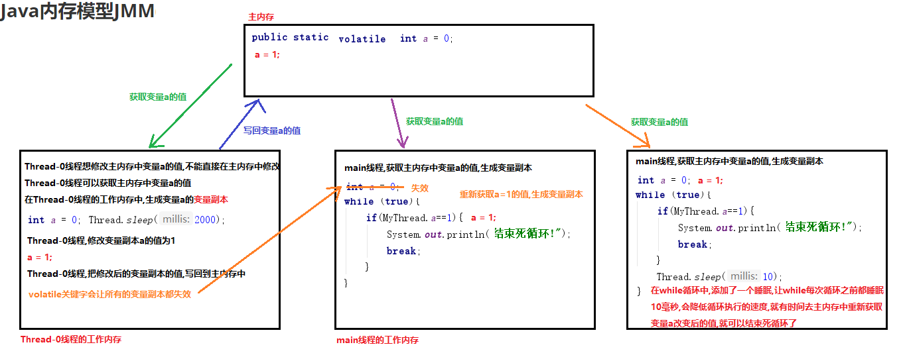

# 学习目标

```java
能够解释安全问题出现的原因
	多个线程(无序的)访问同一个共享资源,对同一个资源进行操作,可能出现错误的数据
能够说出volatile关键字的作用
	解决变量的:可见性,有序性;不能解决变量的原子性
能够掌握原子类AtomicInteger的使用(重点)
	可以解决高并发的原子性
	public static AtomicInteger money = new AtomicInteger(0);
	money.getAndIncrement();//i++
能够理解原子类的工作机制
	CAS机制:乐观锁
	比较并交换(do...while循环)反复比较,只有内存中的值和预期的值一样,才会进行修改,否则就会循环重新获取值
	进行下一次比较
能够使用同步代码块解决线程安全问题(重点)
	synchronized(锁对象){
		访问了共享数据的代码(产生了线程安全问题的代码)
	}
	注意:必须保证多个线程使用的是同一个锁对象
能够使用同步方法解决线程安全问题(重点)
	1.把访问了共享数据的代码,提取出来放到一个方法中
    2.在方法上添加一个同步关键字synchronized
	权限修饰符 synchronized 返回值类型 方法名(参数){
		访问了共享数据的代码(产生了线程安全问题的代码)
	}
	注意:同步方法使用的锁对象是this
能够说明volatile关键字和synchronized关键字的区别
	volatile关键字:只能修饰变量,可以解决变量的可见性,有序性,不能解决原子性
	synchronized关键字:不能修饰变量,可以修饰方法,代码块,使用的范围比volatile广,可以解决:可见性,有序性,原子性
能够描述ConcurrentHashMap类的作用(重点)
	多线程安全的Map集合,效率比Hashtable高
```

# 第一章 高并发及线程安全

## 1.高并发及线程安全的概念 

1.高并发：在某个时间点上，有多个线程同时访问某一个资源。例如：双十一，12306 , 秒杀 

2.线程安全性问题：当**多个线程无序的访问同一个资源**（例如：同一个变量、同一数据库、同一个文件……），而且访问同一资源的代码不具有“原子性”，这时对这一资源的方法就会产生安全性问题——导致此资源最终的结果是错误。

3.高并发所产生的安全性问题主要表现： 

1).可见性:指当多个线程访问同一个变量时，一个线程修改了这个变量的值，其他线程能够立即看得到修改的值。

2).有序性:即程序执行的顺序按照代码的先后顺序执行。

3).原子性:即一个操作或者多个操作 要么全部执行并且执行的过程不会被任何因素打断，要么就都不执行

## 2.高并发问题一_不可见性(重点)

产生的原因：定义一个变量。一个线程修改变量的值，另一个线程由于访问频率太快，导致一直使用本线程区内的**变量副本**，而没有实时的到主内存中获取变量的新值。

```java
package com.itheima.demo01visible;

public class MyThread extends Thread{
    //定义一个静态变量,供所有的线程共享使用
    public static int a = 0;

    @Override
    public void run() {
        System.out.println("Thread-0线程开始执行,睡眠2秒钟,等待main线程线程执行!");
        try {
            Thread.sleep(2000);
        } catch (InterruptedException e) {
            e.printStackTrace();
        }
        System.out.println("Thread-0线程,2秒钟之后开始执行,修改变量a的值为1!");
        a=1;
        System.out.println("Thread-0线程,执行线程任务结束了!"+a);
    }
}
```

```java
package com.itheima.demo01visible;

public class Demo01Visible {
    public static void main(String[] args) {
        //创建MyThread类对象,调用start方法,开启新的线程,执行run方法
        MyThread mt = new MyThread();
        mt.start();

        System.out.println("main线程在开启Thread-0线程之后,继续执行main方法中的代码!");
        System.out.println("main线程开始执行死循环!");
        while (true){
            if(MyThread.a==1){
                System.out.println("main线程判断变量a的值==1,结束死循环!");
                break;
            }
        }
    }
}
```

## 3.Java内存模型JMM(了解)

概述：JMM(Java Memory Model)Java内存模型,是java虚拟机规范中所定义的一种内存模型。

Java内存模型(Java Memory Model)描述了Java程序中各种变量(线程共享变量)的访问规则，以及在JVM中将变量存储到内存和从内存中读取变量这样的底层细节。

所有的共享变量都存储于主内存。这里所说的变量指的是实例变量(成员变量)和类变量(静态成员变量)。不包含局部变量，因为局部变量是线程私有的，因此不存在竞争问题。每一个线程还存在自己的**工作内存**，线程的工作内存，保留了被线程使用的**变量的工作副本**。线程对变量的所有的操作(读，取)都必须在工作内存中完成，而不能直接读写主内存中的变量，不同线程之间也不能直接访问对方工作内存中的变量，线程间变量的值的传递需要通过主内存完成。


## 4.高并发问题二_非有序性(看图)

1).有序性：多行代码的编写(.java)顺序和编译(.class)顺序。
有些时候，编译器在编译代码时，为了提高效率，会对代码“重排”：

```java
.java文件
int a = 10;		//第一行
int b = 20;		//第二行
int c = a * b;	//第三行
```

在执行第三行之前，由于第一行和第二行的先后顺序无所谓，所以编译器可能会对“第一行”和“第二行”进行代码重排：

```java
.class
int b = 20;
int a = 10;
int c = a * b;
```

2).但在多线程环境下，这种重排可能是我们不希望发生的，因为：重排，可能会影响另一个线程的结果,所以我们不需要代码进行重排


## 5.高并发问题三_非原子性(重点)

**原子:不可分割  100行代码是一个原子,线程执行100行代码不可以分开执行,要么都执行,要都不执行**

需求:
1.定义多线程共享的静态变量money
2.Thread-0线程把money的值增加10000
3.main线程把money的值增加10000
4.查看money的最终结果

```java
package com.itheima.demo02atom;

public class MyThread extends Thread{
    //1.定义多线程共享的静态变量money
    public static int money = 0;

    @Override
    public void run() {
        System.out.println("Thread-0线程开始执行,修改变量money的值!");
        //2.Thread-0线程把money的值增加10000
        for (int i = 0; i < 10000; i++) {
            money++;//0==>1==>2==>3==>...==>10000
        }
        System.out.println("Thread-0线程执行线程任务结束!");
    }
}
```

```java
package com.itheima.demo02atom;

public class Demo01Atom {
    public static void main(String[] args) throws InterruptedException {
        //创建MyThread对象
        MyThread mt = new MyThread();
        //调用start方法,开启新的线程,执行run方法
        mt.start();

        System.out.println("main线程在开启Thread-0线程之后,继续执行main方法中的代码!");
        System.out.println("main线程修改变量money的值!");
        //3.main线程把money的值增加10000
        for (int i = 0; i < 10000; i++) {
            MyThread.money++;
        }
        System.out.println("main线程修改变量money的值结束!");
        System.out.println("main线程睡眠2秒钟,等待Thread-0线程执行完毕,在统计结果!");
        Thread.sleep(2000);
        //4.查看money的最终结果
        System.out.println("money的最终的结果是:"+MyThread.money);
    }
}
```

```java
main线程在开启Thread-0线程之后,继续执行main方法中的代码!
main线程修改变量money的值!
main线程修改变量money的值结束!
main线程睡眠2秒钟,等待Thread-0线程执行完毕,在统计结果!
Thread-0线程开始执行,修改变量money的值!
Thread-0线程执行线程任务结束!
money的最终的结果是:20000

main线程在开启Thread-0线程之后,继续执行main方法中的代码!
Thread-0线程开始执行,修改变量money的值!
main线程修改变量money的值!
Thread-0线程执行线程任务结束!
main线程修改变量money的值结束!
main线程睡眠2秒钟,等待Thread-0线程执行完毕,在统计结果!
money的最终的结果是:11591
```

**原子性原理**


每个线程访问money变量，都需要三步：
	1).取money的值；
	2).将money++
	3).将money写回
这三步就不具有“原子性”——执行某一步时，很可能会被暂停(失去了cpu的执行权)，执行另外一个线程，就会导致变量的最终结果错误！！！！

# 第二章 volatile关键字(重点)  

## 1.volatile解决可见性

```java
package com.itheima.demo03volatileVisible;

/*
    volatile解决可见性
 */
public class MyThread extends Thread{
    //定义一个静态变量,供所有的线程共享使用,使用volatile关键字修饰变量
    public static volatile int a = 0;

    @Override
    public void run() {
        System.out.println("Thread-0线程开始执行,睡眠2秒钟,等待main线程线程执行!");
        try {
            Thread.sleep(2000);
        } catch (InterruptedException e) {
            e.printStackTrace();
        }
        System.out.println("Thread-0线程,2秒钟之后开始执行,修改变量a的值为1!");
        /*
            变量被volatile关键字修饰之后,只要修改变量的值,
            那么volatile关键字会让所有变量相关的变量副本都失效
            线程在使用变量的时候,必须的从新在获取变量的值,生成新的变量副本
         */
        a=1;
        System.out.println("Thread-0线程,执行线程任务结束了!"+a);
    }
}
```

```java
package com.itheima.demo03volatileVisible;

public class Demo01Visible {
    public static void main(String[] args) throws InterruptedException {
        //创建MyThread类对象,调用start方法,开启新的线程,执行run方法
        MyThread mt = new MyThread();
        mt.start();

        System.out.println("main线程在开启Thread-0线程之后,继续执行main方法中的代码!");
        System.out.println("main线程开始执行死循环!");
        while (true){
            if(MyThread.a==1){
                System.out.println("main线程判断变量a的值==1,结束死循环!");
                break;
            }
        }
    }
}
```

```java
main线程在开启Thread-0线程之后,继续执行main方法中的代码!
main线程开始执行死循环!
Thread-0线程开始执行,睡眠2秒钟,等待main线程线程执行!
Thread-0线程,2秒钟之后开始执行,修改变量a的值为1!
main线程判断变量a的值==1,结束死循环!
Thread-0线程,执行线程任务结束了!1
```



## 2.volatile解决有序性

**注意:变量添加了volatile关键字,就不会在进行重排了**


## 3.volatile不能解决原子性

```java
package com.itheima.demo04volatileAtom;

/*
    volatile不能解决原子性
 */
public class MyThread extends Thread{
    //1.定义多线程共享的静态变量money
    public static volatile int money = 0;

    @Override
    public void run() {
        System.out.println("Thread-0线程开始执行,修改变量money的值!");
        //2.Thread-0线程把money的值增加10000
        for (int i = 0; i < 10000; i++) {
            money++;//0==>1==>2==>3==>...==>10000
        }
        System.out.println("Thread-0线程执行线程任务结束!");
    }
}
```

```java
package com.itheima.demo04volatileAtom;

public class Demo01Atom {
    public static void main(String[] args) throws InterruptedException {
        //创建MyThread对象
        MyThread mt = new MyThread();
        //调用start方法,开启新的线程,执行run方法
        mt.start();

        System.out.println("main线程在开启Thread-0线程之后,继续执行main方法中的代码!");
        System.out.println("main线程修改变量money的值!");
        //3.main线程把money的值增加10000
        for (int i = 0; i < 10000; i++) {
            MyThread.money++;
        }
        System.out.println("main线程修改变量money的值结束!");
        System.out.println("main线程睡眠2秒钟,等待Thread-0线程执行完毕,在统计结果!");
        Thread.sleep(2000);
        //4.查看money的最终结果
        System.out.println("money的最终的结果是:"+ MyThread.money);
    }
}
```

程序执行额结果: volatile不能把原子性的三步变成一个原子执行

​	1).取money的值；
​	2).将money++
​	3).将money写回

这三步在执行的过程中,还是有可能把其他线程打断的

```java
main线程在开启Thread-0线程之后,继续执行main方法中的代码!
main线程修改变量money的值!
main线程修改变量money的值结束!
main线程睡眠2秒钟,等待Thread-0线程执行完毕,在统计结果!
Thread-0线程开始执行,修改变量money的值!
Thread-0线程执行线程任务结束!
money的最终的结果是:14884  [添加了volatile关键字之后,程序的执行还是有问题]
```

# 第三章 原子类

概述：所谓的原子性是指在一次操作或者多次操作中，要么所有的操作全部都得到了执行并且不会受到任何因素的干扰而中断，要么所有的操作都不执行，

多个操作是一个不可以分割的整体(原子)。

比如：从张三的账户给李四的账户转1000元，这个动作将包含两个基本的操作：从张三的账户扣除1000元，给李四的账户增加1000元。这两个操作必须符合原子性的要求，

要么都成功要么都失败。

## 1.原子类概述

概述：java从JDK1.5开始提供了**java.util.concurrent.atomic**包(简称Atomic包)，这个包中的原子操作类提供了一种用法简单，性能高效，线程安全地更新一个变量的方式。

1). java.util.concurrent.atomic.**AtomicInteger**：对int变量进行原子操作的类。

2). java.util.concurrent.atomic.**AtomicLong**：对long变量进行原子操作的类。

3). java.util.concurrent.atomic.**AtomicBoolean**：对boolean变量进行原子操作的类。

这些类可以保证对“某种类型的变量”原子操作，多线程、高并发的环境下，就可以保证对变量访问的有序性，从而保证最终的结果是正确的。

AtomicInteger原子型Integer，可以实现原子更新操作

```java
构造方法:
public AtomicInteger()：	   				初始化一个默认值为0的原子型Integer
public AtomicInteger(int initialValue)： 初始化一个指定值的原子型Integer
成员方法:
int get():   			 				 获取AtomicInteger对象中存储的int值
int getAndIncrement(): i++     			 以原子方式将当前值加1，注意，这里返回的是自增前的值。
int incrementAndGet(): ++i    		     以原子方式将当前值加1，注意，这里返回的是自增后的值。
int addAndGet(int data):				 以原子方式将输入的数值与实例中的值（AtomicInteger里的value）相加，并返回结果。
int getAndSet(int value):   			 以原子方式设置为newValue的值，并返回旧值。
```

## 2.AtomicInteger类的基本使用

```java
package com.itheima.demo05AtomicInteger;

import java.util.concurrent.atomic.AtomicInteger;

/*
    AtomicInteger类的基本使用
 */
public class Demo01AtomicInteger {
    public static void main(String[] args) {
        //public AtomicInteger()：初始化一个默认值为0的原子型Integer
        AtomicInteger ai1 = new AtomicInteger();
        //public AtomicInteger(int initialValue)： 初始化一个指定值的原子型Integer
        AtomicInteger ai2 = new AtomicInteger(10);

        //int get(): 获取AtomicInteger对象中存储的int值
        System.out.println(ai1.get());//0
        System.out.println(ai2.get());//10

        //int getAndIncrement(): i++  以原子方式将当前值加1，注意，这里返回的是自增前的值。
        int a = ai2.getAndIncrement();
        System.out.println("a:"+a);//a:10
        System.out.println(ai2.get());//11

        //int incrementAndGet(): ++i  以原子方式将当前值加1，注意，这里返回的是自增后的值。
        int b = ai2.incrementAndGet();
        System.out.println("b:"+b);//b:12
        System.out.println(ai2.get());//12

        //int addAndGet(int data):以原子方式将输入的数值与实例中的值（AtomicInteger里的value）相加，并返回结果。
        int c = ai2.addAndGet(100);
        System.out.println("c:"+c);//c:112
        System.out.println(ai2.get());//112

        //int getAndSet(int value): 以原子方式设置为newValue的值，并返回旧值。
        int d = ai2.getAndSet(88);
        System.out.println("d:"+d);//d:112
        System.out.println(ai2.get());//88
    }
}
```

## 3.AtomicInteger解决变量的原子性(可见性、有序性)(重点)

```java
package com.itheima.demo05AtomicInteger;

import java.util.concurrent.atomic.AtomicInteger;

/*
    AtomicInteger解决变量的原子性
 */
public class MyThread extends Thread{
    //1.定义多线程共享的静态变量money,使用AtomicInteger类型
    public static AtomicInteger money = new AtomicInteger(0);

    @Override
    public void run() {
        System.out.println("Thread-0线程开始执行,修改变量money的值!");
        //2.Thread-0线程把money的值增加10000
        for (int i = 0; i < 10000; i++) {
            money.getAndIncrement();//i++==>0==>1==>2==>3==>...==>10000
        }
        System.out.println("Thread-0线程执行线程任务结束!");
    }
}
```

```java
package com.itheima.demo05AtomicInteger;

public class Demo01Atom {
    public static void main(String[] args) throws InterruptedException {
        //创建MyThread对象
        MyThread mt = new MyThread();
        //调用start方法,开启新的线程,执行run方法
        mt.start();

        System.out.println("main线程在开启Thread-0线程之后,继续执行main方法中的代码!");
        System.out.println("main线程修改变量money的值!");
        //3.main线程把money的值增加10000
        for (int i = 0; i < 10000; i++) {
            MyThread.money.getAndIncrement();//i++
        }
        System.out.println("main线程修改变量money的值结束!");
        System.out.println("main线程睡眠2秒钟,等待Thread-0线程执行完毕,在统计结果!");
        Thread.sleep(2000);
        //4.查看money的最终结果
        System.out.println("money的最终的结果是:"+ MyThread.money.get());
    }
}
```

执行结果:

```java
main线程在开启Thread-0线程之后,继续执行main方法中的代码!
main线程修改变量money的值!
main线程修改变量money的值结束!
main线程睡眠2秒钟,等待Thread-0线程执行完毕,在统计结果!
Thread-0线程开始执行,修改变量money的值!
Thread-0线程执行线程任务结束!
money的最终的结果是:20000
```

## 3.AtomicInteger的原理_CAS机制（乐观锁）


## 3.AtomicIntegerArray(了解)

可以用原子方式更新其元素的 `int` 数组:可以保证数组的原子性

构造方法:

```java
AtomicIntegerArray(int length) 创建指定长度的给定长度的新 AtomicIntegerArray。
AtomicIntegerArray aia = new AtomicIntegerArray(3);//{0,0,0}
AtomicIntegerArray(int[] array) 创建与给定数组具有相同长度的新 AtomicIntegerArray，并从给定数组复制其所有元素。
int[] arr = {1,2,3};
AtomicIntegerArray aia = new AtomicIntegerArray(arr);//包含默认值{1,2,3};
```

成员方法:

```java
int[] arr = {1,2,3};  
AtomicIntegerArray aia = new AtomicIntegerArray(arr);//包含默认值{1,2,3};
addAndGet(0,1) {2,2,3}   addAndGet(1,1) {2,3,3}  addAndGet(2,1) {2,3,4} 
int addAndGet(int i, int delta) 以原子方式将给定值与索引 i 的元素相加。 
i:获取指定索引处的元素
delta:给元素增加的值

int get(int i) 获取指定索引处元素的值
int length() 返回该数组的长度。 
String toString() 返回数组当前值的字符串表示形式。AtomicIntegerArray重写了toString方法,把数组中的元素拼接为字符串返回 
```

### 没有使用AtomicIntegerArray数组存在原子性的问题

需求:

1.定义一个静态的长度为1000供所有线程共享的int类型数组

2.遍历数组,使用Thread-x线程把数组中元素的值依次++

3.创建1000个线程,每个线程都把数组中的元素的值++

```java
package com.itheima.demo06Array;

/*
    没有使用AtomicIntegerArray数组存在原子性的问题
 */
public class MyThread extends Thread{
    //1.定义一个静态的长度为1000供所有线程共享的int类型数组
    public static int[] arr = new int[1000];//{0,0,0,0...0}

    @Override
    public void run() {
        System.out.println(Thread.currentThread().getName()+"线程开始改变数组中元素的值!");
        //2.遍历数组,使用Thread-x线程把数组中元素的值依次++
        for (int i = 0; i < arr.length; i++) {
            arr[i]++;//{0,0,0,0...0}==>{1,1,1,1...1}
        }
        System.out.println(Thread.currentThread().getName()+"线程执行线程任务结束了!");
    }
}
```

```java
package com.itheima.demo06Array;

import java.util.Arrays;

public class Demo01Array {
    public static void main(String[] args) throws InterruptedException {
        //3.创建1000个线程,每个线程都把数组中的元素的值++
        for (int i = 0; i < 1000; i++) {
            new MyThread().start();//{0,0,0,0...0}==>{1,1,1,1...1}==>{2,2,2,2...2}...==>{1000,1000,1000,...1000}
        }
        System.out.println("让程序睡眠5秒钟,等待所有的线程都执行完毕,在查看结果!");
        Thread.sleep(5000);
        System.out.println("所有的线程都执行完毕,查看数组中元素的值:");
        System.out.println(Arrays.toString(MyThread.arr));
    }
}
```

执行结果:

```java
[ 1000, 999, 1000, 1000, 999, 999, 999, 999, 999, 999, 999, 999, 999, 999, 999, 999, 999, 999, 999, 999, 998, 1000, 1000, 1000, 1000, 1000, 1000, 1000, 1000, 1000, 1000, 1000, 1000, 1000, 1000, 1000, 1000, 1000, 1000, 1000, 1000, 1000, 1000, 1000, 1000, 1000, 1000, 1000, 1000, 1000, 1000, 1000, 1000, 1000, 1000, 1000, 1000, 1000, 1000, 1000, 999, 999, 999, 999, 999, 999, 999, 999, 1000, 1000, 1000, 1000, 1000, 1000, 1000, 1000, 1000, 1000, 1000, 1000, 1000, 1000, 1000, 1000, 1000, 1000, 1000, 1000, 1000, 1000, 1000, 1000, 1000, 1000, 1000, 1000, 1000, 1000, 1000, 1000, 1000, 1000, 1000, 1000, 1000, 1000, 1000, 1000, 1000, 1000, 1000, 1000, 1000, 1000, 1000, 1000, 1000, 1000, 1000, 1000, 1000, 1000, 1000, 1000, 1000, 1000, 1000, 1000, 1000, 1000, 1000, 1000, 1000, 1000, 1000, 999, 999, 999, 999, 999, 999, 1000, 1000, 1000...]
```

### 使用AtomicIntegerArray数组解决数组的原子性问题

```java
package com.itheima.demo07AtomicIntegerArray;

import java.util.concurrent.atomic.AtomicIntegerArray;

/*
    使用AtomicIntegerArray数组解决数组的原子性问题
 */
public class MyThread extends Thread{
    //1.定义一个静态的长度为1000供所有线程共享的AtomicIntegerArray类型数组
    public static AtomicIntegerArray arr = new AtomicIntegerArray(1000);//{0,0,0...0}

    @Override
    public void run() {
        System.out.println(Thread.currentThread().getName()+"线程开始改变数组中元素的值!");
        //2.遍历数组,使用Thread-x线程把数组中元素的值依次++
        for (int i = 0; i < arr.length(); i++) {
            //int addAndGet(int i, int delta) 以原子方式将给定值与索引 i 的元素相加。
            arr.addAndGet(i,1);//{0,0,0,0...0}==>{1,1,1,1...1}
        }
        System.out.println(Thread.currentThread().getName()+"线程执行线程任务结束了!");
    }
}
```

```java
package com.itheima.demo07AtomicIntegerArray;

public class Demo01Array {
    public static void main(String[] args) throws InterruptedException {
        //3.创建1000个线程,每个线程都把数组中的元素的值++
        for (int i = 0; i < 1000; i++) {
            new MyThread().start();//{0,0,0,0...0}==>{1,1,1,1...1}==>{2,2,2,2...2}...==>{1000,1000,1000,...1000}
        }
        System.out.println("让程序睡眠5秒钟,等待所有的线程都执行完毕,在查看结果!");
        Thread.sleep(5000);
        System.out.println("所有的线程都执行完毕,查看数组中元素的值:");
        System.out.println(MyThread.arr.toString());
    }
}
```

# 第四章 **synchronized关键字**

之前我们讲过的AtomicInteger可以对“int类型的变量”做原子操作。但如果需要将“很多行代码”一起作为“原子性”执行——一个线程进入后，必须将所有代码行执行完毕，其它线程才能进入，可以使用synchronized关键字——重量级的同步关键字。

**AtomicInteger:只能解决一个变量的原子性**

**synchronized:可以解决一段代码的原子性**

## 1.线程安全问题的概述(了解)


## 2.线程安全问题的代码实现(重点)

```java
package com.itheima.demo08payTicket;

/*
    卖票案例
 */
public class RunnableImpl implements Runnable{
    //定义一个多个线程共享的票源
    private int ticket = 100;

    //线程任务:卖票
    @Override
    public void run() {
        //增加一个死循环,让线程重复卖票
        while (true){
            //判断ticket是否大于0,大于0进行卖票
            if(ticket>0){
                //每卖一张票需要10毫秒,让线程睡眠10毫秒
                try {
                    Thread.sleep(10);
                } catch (InterruptedException e) {
                    e.printStackTrace();
                }
                System.out.println(Thread.currentThread().getName()+"线程正在卖第"+ticket+"张票!");
                ticket--;
            }else{
                break;
            }
        }
    }
}
```

```java
package com.itheima.demo08payTicket;

public class Demo01PayTicket {
    public static void main(String[] args) {
        //创建3个线程进行卖票
        RunnableImpl r = new RunnableImpl();
        Thread t0 = new Thread(r);
        Thread t1 = new Thread(r);
        Thread t2 = new Thread(r);
        t0.start();
        t1.start();
        t2.start();
    }
}
```

程序执行的结果:

```java
...
Thread-1线程正在卖第7张票!
Thread-0线程正在卖第6张票!
Thread-2线程正在卖第5张票!
Thread-0线程正在卖第4张票!
Thread-1线程正在卖第4张票!
Thread-2线程正在卖第2张票!
Thread-1线程正在卖第1张票!
Thread-0线程正在卖第0张票!
Thread-2线程正在卖第-1张票!
```


## 3.线程安全问题的产生原理(了解-扩展知识点)


## 4.解决线程安全问题的第一种方式:使用同步代码块(重点)

```java
package com.itheima.demo09synchronized;

/*
    卖票案例案例出现了线程安全问题:
        卖出了重复的票和不存在的票
    解决线程安全问题的第一种方式:使用同步代码块
        格式:
            synchronized(锁对象){
                出现了线程安全问题的代码(访问了共享数据的代码)
            }
        原理:
            使用一个锁对象,把代码锁住,一次只让一个线程进入到同步代码块中执行
        注意:
            1.锁对象可以是任意的对象
                Person p = new Person();
                Student s = new Student();
                Object obj = new Object();
                String s = "abc";底层字符数组 new char[]{'a','b','c'};
            2.必须保证多个线程使用的是同一个锁对象
 */
public class RunnableImpl implements Runnable{
    //定义一个多个线程共享的票源
    private int ticket = 100;
    //创建一个锁对象
    //Object obj = new Object();
    //Student s = new Student();
    String s = "abc";

    //线程任务:卖票
    @Override
    public void run() {
        //增加一个死循环,让线程重复卖票
        while (true){
            //同步代码块
            synchronized (s){
                //判断ticket是否大于0,大于0进行卖票
                if(ticket>0){
                    //每卖一张票需要10毫秒,让线程睡眠10毫秒
                    try {
                        Thread.sleep(10);
                    } catch (InterruptedException e) {
                        e.printStackTrace();
                    }
                    System.out.println(Thread.currentThread().getName()+"线程正在卖第"+ticket+"张票!");
                    ticket--;
                }else{
                    break;
                }
            }
        }
    }
}
```

```java
package com.itheima.demo09synchronized;

public class Demo01PayTicket {
    public static void main(String[] args) {
        //创建3个线程进行卖票
        RunnableImpl r = new RunnableImpl();
        Thread t0 = new Thread(r);
        Thread t1 = new Thread(r);
        Thread t2 = new Thread(r);
        t0.start();
        t1.start();
        t2.start();
    }
}
```

## 5.同步的原理(了解-扩展知识点)


## 6.解决线程安全问题的第二种方式:使用同步方法(重点)

```java
package com.itheima.demo10synchronized;

/*
    卖票案例案例出现了线程安全问题:
        卖出了重复的票和不存在的票
    解决线程安全问题的第二种方式:使用同步方法
    实现步骤:
        1.定义一个方法,把访问了共享数据的代码抽取到方法中
        2.给方法添加一个synchronized同步关键字,那么这个方法就是一个同步方法
    格式:
        修饰符 synchronized 返回值类型 方法名(参数列表){
            出现了线程安全问题的代码(访问了共享数据的代码)
        }
     原理:
        使用一个同步方法把代码锁住,只让一个线程进入到方法中执行,可以保证安全
 */
public class RunnableImpl implements Runnable{
    //定义一个多个线程共享的票源
    private static int ticket = 100;

    //线程任务:卖票
    @Override
    public void run() {
        System.out.println("this:"+this);//this:com.itheima.demo10synchronized.RunnableImpl@4554617c
        //增加一个死循环,让线程重复卖票
        while (true){
            //调用卖票方法
            //payTicket();
            payTicketStatic();

            if(ticket<=0){
                break;
            }
        }
    }

    /*
        定义一个静态的同步方法(了解)
        静态的同步方法的锁对象是this吗? 不是
        静态优先于非静态加载到内存中
        静态的同步方法锁对象是本类的class文件对象:RunnableImpl.class==>反射
     */
    public static /*synchronized*/ void payTicketStatic(){
        synchronized (RunnableImpl.class){
            //判断ticket是否大于0,大于0进行卖票
            if(ticket>0){
                //每卖一张票需要10毫秒,让线程睡眠10毫秒
                try {
                    Thread.sleep(10);
                } catch (InterruptedException e) {
                    e.printStackTrace();
                }
                System.out.println(Thread.currentThread().getName()+"线程正在卖第"+ticket+"张票!");
                ticket--;
            }
        }
    }


    /*
        定义一个同步方法
        同步方法上的锁对象是谁? 是this==>本类对象
        RunnableImpl r = new RunnableImpl();
     */
    public synchronized void payTicket(){
        //判断ticket是否大于0,大于0进行卖票
        if(ticket>0){
            //每卖一张票需要10毫秒,让线程睡眠10毫秒
            try {
                Thread.sleep(10);
            } catch (InterruptedException e) {
                e.printStackTrace();
            }
            System.out.println(Thread.currentThread().getName()+"线程正在卖第"+ticket+"张票!");
            ticket--;
        }
    }

    /*public  void payTicket(){
        synchronized (this){
            //判断ticket是否大于0,大于0进行卖票
            if(ticket>0){
                //每卖一张票需要10毫秒,让线程睡眠10毫秒
                try {
                    Thread.sleep(10);
                } catch (InterruptedException e) {
                    e.printStackTrace();
                }
                System.out.println(Thread.currentThread().getName()+"线程正在卖第"+ticket+"张票!");
                ticket--;
            }
        }
    }*/
}
```

```java
package com.itheima.demo10synchronized;

public class Demo01PayTicket {
    public static void main(String[] args) {
        //创建3个线程进行卖票
        RunnableImpl r = new RunnableImpl();
        System.out.println("r:"+r);//r:com.itheima.demo10synchronized.RunnableImpl@4554617c
        Thread t0 = new Thread(r);
        Thread t1 = new Thread(r);
        Thread t2 = new Thread(r);
        t0.start();
        t1.start();
        t2.start();
    }
}
```

## 7.解决线程安全问题的第三方式:使用Lock锁(重点)

```java
package com.itheima.demo11Lock;

import java.util.concurrent.locks.ReentrantLock;

/*
    卖票案例案例出现了线程安全问题:
        卖出了重复的票和不存在的票
    解决线程安全问题的第三种方式:使用Lock锁
    java.util.concurrent.locks.Lock接口
        Lock 实现提供了比使用 synchronized 方法和语句可获得的更广泛的锁定操作。
        Lock接口是JDK1.5之后出现的
    Lock接口中的常用方法:
        void lock()获取锁。
        void unlock() 释放锁。
    java.util.concurrent.locks.ReentrantLock类 implements Lock接口
    实现步骤:
        1.在成员位置创建ReentrantLock对象
        2.在访问了共享数据的代码前,使用lock方法获取锁对象
        3.在访问了共享数据的代码后,使用unlock方法释放锁对象
    原理:
        使用lock方法和unlock方法把一段代码锁住,只让一个线程进入执行
 */
public class RunnableImpl implements Runnable{
    //定义一个多个线程共享的票源
    private int ticket = 100;
    //1.在成员位置创建ReentrantLock对象
    private ReentrantLock l = new ReentrantLock();

    //线程任务:卖票
    @Override
    public void run() {
        //增加一个死循环,让线程重复卖票
        while (true){
            //2.在访问了共享数据的代码前,使用lock方法获取锁对象
            l.lock();
                //判断ticket是否大于0,大于0进行卖票
                if(ticket>0){
                    //每卖一张票需要10毫秒,让线程睡眠10毫秒
                    try {
                        Thread.sleep(10);
                    } catch (InterruptedException e) {
                        e.printStackTrace();
                    }
                    System.out.println(Thread.currentThread().getName()+"线程正在卖第"+ticket+"张票!");
                    ticket--;
                }else{
                    System.exit(0);//终止JVM
                }
            //3.在访问了共享数据的代码后,使用unlock方法释放锁对象
            l.unlock();
        }
    }
}
```

```java
package com.itheima.demo11Lock;

public class Demo01PayTicket {
    public static void main(String[] args) {
        //创建3个线程进行卖票
        RunnableImpl r = new RunnableImpl();
        Thread t0 = new Thread(r);
        Thread t1 = new Thread(r);
        Thread t2 = new Thread(r);
        t0.start();
        t1.start();
        t2.start();
    }
}
```

## 8.CAS与Synchronized

**AtomicInteger:只能解决一个变量的原子性**

**synchronized:可以解决一段代码的原子性**

CAS和Synchronized都可以保证多线程环境下共享数据的安全性。那么他们两者有什么区别？

Synchronized是从悲观的角度出发：

总是假设最坏的情况，每次去拿数据的时候都认为别人会修改，所以每次在拿数据的时候都会上锁，这样别人想拿这个数据就会阻塞直到它拿到锁

（**共享资源每次只给一个线程使用，其它线程阻塞，用完后再把资源转让给其它线程**）。因此Synchronized我们也将其称之为悲观锁。jdk中的ReentrantLock也是一种悲观锁。

CAS是从乐观的角度出发:

总是假设最好的情况，每次去拿数据的时候都认为别人不会修改，所以不会上锁，但是在更新的时候会判断一下在此期间别人有没有去更新这个数据。

CAS这种机制我们也可以将其称之为乐观锁。

## :reminder_ribbon:经验分享

### 1. 代码

**Runnable实现类**

```java
public class Ticket implements Runnable{
    int count = 100;
    @Override
    public void run() {
        while (true) {
            synchronized (new Object()) {
                try {
                    Thread.sleep(5);
                } catch (InterruptedException e) {
                    e.printStackTrace();
                }
                if (count > 0) {
                    System.out.println(Thread.currentThread().getName() + "正在卖票：" + count--);
                }
            }
        }
    }
}
```

**测试类**

```java
public class Demo01Test {
    public static void main(String[] args) {
        Ticket t = new Ticket();
        new Thread(t).start();
        new Thread(t).start();
        new Thread(t).start();
    }
}

```

### 2.出现的问题

使用了同步代码块，但是运行之后依旧发生了线程安全问题


### 3.问题的分析

> 如果使用同步代码块，并且要保证线程安全，那么需要使用同一个锁对象，而在现在的程序中，多个线程使用的并不是同一个锁，所以产生了线程安全问题。

### 4.问题解决办法

> 让多个线程使用同一个锁对象，比如锁对象使用this

```java
public class Ticket implements Runnable{
    int count = 100;
    @Override
    public void run() {
        while (true) {
            synchronized (this) {
                try {
                    Thread.sleep(5);
                } catch (InterruptedException e) {
                    e.printStackTrace();
                }
                if (count > 0) {
                    System.out.println(Thread.currentThread().getName() + "正在卖票：" + count--);
                }
            }
        }
    }
}
```


# 第五章 并发包 

在JDK的并发包java.util.concurrent里提供了几个非常有用的并发容器和并发工具类。供我们在多线程开发中进行使用。这些集合和工具类都可以保证高并发的线程安全问题.

## 1.并发List集合_CopyOnWriteArrayList(重点)

List集合的特点:

​	1.是一个有序的集合

​	2.允许存储重复的元素

​	3.包含一些带索引的方法

1).java.util.concurrent.CopyOnWriteArrayList(类)：它是一个“线程安全”的ArrayList，我们之前学习的java.utils.ArrayList不是线程安全的。
2).如果是多个线程，并发访问同一个ArrayList，我们要使用：CopyOnWriteArrayList

需求:

1.创建一个被多个线程共享使用静态的ArrayList集合对象

2.使用Thread-0线程往集合中添加1000个元素

3.使用main线程往集合中添加1000个元素

4.统计集合的长度

```java
package com.itheima.demo12CopyOnWriteArrayList;

import java.util.ArrayList;
import java.util.Vector;
import java.util.concurrent.CopyOnWriteArrayList;

public class MyThread extends Thread{
    //1.创建一个被多个线程共享使用静态的ArrayList集合对象:是一个线程不安全的集合
    //public static ArrayList<Integer> list = new ArrayList<>();

    /*
        java.util.Vector<E>集合:是JDK1.0时期最早期的集合
        与新 collection 实现不同，Vector 是同步的。
        Vector底层采用了synchronized同步技术,可以保证多线程的安全
        synchronized同步技术,使用悲观锁,效率低,已经被淘汰了
     */
    //public static Vector<Integer> list = new Vector<>();

    /*
        java.util.concurrent.CopyOnWriteArrayList<E>集合:是JDK1.5之后出现的线程安全的集合
        CopyOnWriteArrayList底层采用了CAS机制,可以保证多线程的安全
        CAS机制,使用乐观锁,效率比synchronized同步技术高
     */
    public static CopyOnWriteArrayList<Integer> list = new CopyOnWriteArrayList<>();

    @Override
    public void run() {
        //2.使用Thread-0线程往集合中添加1000个元素
        System.out.println("Thread-0线程开始执行线程任务了,往集合中添加1000个元素!");
        for (int i = 0; i < 1000; i++) {
            list.add(i);//0-999
            try {
                Thread.sleep(1);//让程序每次添加完元素,睡眠1毫秒,为了提高安全问题出现的几率
            } catch (InterruptedException e) {
                e.printStackTrace();
            }
        }
        System.out.println("Thread-0线程执行线程任务结束了!");
    }
}
```

```java
package com.itheima.demo12CopyOnWriteArrayList;

public class Demo01CopyOnWriteArrayList {
    public static void main(String[] args) throws InterruptedException {
        //创建MyThread对象
        MyThread mt = new MyThread();
        //调用start方法,开启新的线程执行run方法
        mt.start();

        System.out.println("main线程在开启Thread-0线程之后,会继续执行main方法中的代码!");
        //3.使用main线程往集合中添加1000个元素
        System.out.println("main线程开始往集合中添加1000个元素!");
        for (int i = 0; i < 1000; i++) {
            MyThread.list.add(i);//0-999
            Thread.sleep(1);//让程序每次添加完元素,睡眠1毫秒,为了提高安全问题出现的几率
        }
        System.out.println("main线程往集合中添加元素结束!");
        System.out.println("main线程睡眠3秒钟,等待Thread-0线程执行结束,在统计结果!");
        Thread.sleep(3000);

        //4.统计集合的长度
        System.out.println("最终集合的长度是:"+MyThread.list.size());
    }
}
```

ArrayList集合并发的问题:

1.存储的元素个数不对

2.会引发索引越界异常

```java
main线程在开启Thread-0线程之后,会继续执行main方法中的代码!
main线程开始往集合中添加1000个元素!
Thread-0线程开始执行线程任务了,往集合中添加1000个元素!
Thread-0线程执行线程任务结束了!
main线程往集合中添加元素结束!
main线程睡眠3秒钟,等待Thread-0线程执行结束,在统计结果!
最终集合的长度是:1982

main线程在开启Thread-0线程之后,会继续执行main方法中的代码!
main线程开始往集合中添加1000个元素!
Thread-0线程开始执行线程任务了,往集合中添加1000个元素!
main线程往集合中添加元素结束!
main线程睡眠3秒钟,等待Thread-0线程执行结束,在统计结果!
Thread-0线程执行线程任务结束了!
最终集合的长度是:1995    
```

## 2.并发Set集合_CopyOnWriteArraySet(重点)

Set集合的特点:

​	1.不允许存储重复元素

​	2.不包含索引的方法

需求:

1.创建一个被多个线程共享使用静态的HashSet集合对象

2.使用Thread-0线程往集合中添加1000个元素

3.使用main线程往集合中添加1000个元素

4.统计集合的长度

```java
package com.itheima.demo13CopyOnWriteArraySet;

import java.util.HashSet;
import java.util.concurrent.CopyOnWriteArraySet;

public class MyThread extends Thread{
    //1.创建一个被多个线程共享使用静态的HashSet集合对象:是一个线程不安全的集合
    //public static HashSet<Integer> set = new HashSet<>();

    /*
        java.util.concurrent.CopyOnWriteArraySet<E>集合:是JDK1.5之后出现的新集合
        CopyOnWriteArraySet:是一个多线程安全的Set集合(不允许重复)
     */
    public static CopyOnWriteArraySet<Integer> set = new CopyOnWriteArraySet<>();

    @Override
    public void run() {
        //2.使用Thread-0线程往集合中添加1000个元素
        System.out.println("Thread-0线程开始执行线程任务了,往集合中添加1000个元素!");
        for (int i = 0; i < 1000; i++) {
            set.add(i);//0-999
            try {
                Thread.sleep(1);//让程序每次添加完元素,睡眠1毫秒,为了提高安全问题出现的几率
            } catch (InterruptedException e) {
                e.printStackTrace();
            }
        }
        System.out.println("Thread-0线程执行线程任务结束了!");
    }
}
```

```java
package com.itheima.demo13CopyOnWriteArraySet;

public class Demo01CopyOnWriteArraySet {
    public static void main(String[] args) throws InterruptedException {
        //创建MyThread对象
        MyThread mt = new MyThread();
        //调用start方法,开启新的线程执行run方法
        mt.start();

        System.out.println("main线程在开启Thread-0线程之后,会继续执行main方法中的代码!");
        //3.使用main线程往集合中添加1000个元素
        System.out.println("main线程开始往集合中添加1000个元素!");
        for (int i = 1000; i < 2000; i++) {
            MyThread.set.add(i);//1000-1999
            Thread.sleep(1);//让程序每次添加完元素,睡眠1毫秒,为了提高安全问题出现的几率
        }
        System.out.println("main线程往集合中添加元素结束!");
        System.out.println("main线程睡眠3秒钟,等待Thread-0线程执行结束,在统计结果!");
        Thread.sleep(3000);

        //4.统计集合的长度
        System.out.println("最终集合的长度是:"+ MyThread.set.size());
    }
}
```

HashSet集合存在并发问题:

```java
main线程在开启Thread-0线程之后,会继续执行main方法中的代码!
main线程开始往集合中添加1000个元素!
Thread-0线程开始执行线程任务了,往集合中添加1000个元素!
Thread-0线程执行线程任务结束了!
main线程往集合中添加元素结束!
main线程睡眠3秒钟,等待Thread-0线程执行结束,在统计结果!
最终集合的长度是:1972
```

## 3.并发Map集合_ConcurrentHashMap(重点)

需求:

1.创建一个被多个线程共享使用静态的HashMap集合对象

2.使用Thread-0线程往集合中添加1000个元素

3.使用main线程往集合中添加1000个元素

4.统计集合的长度

```java
package com.itheima.demo14ConcurrentHashMap;

import java.util.HashMap;
import java.util.Hashtable;
import java.util.concurrent.ConcurrentHashMap;

public class MyThread extends Thread {
    //1.创建一个被多个线程共享使用静态的HashMap集合对象
    //HashMap集合是一个多线程不安全的集合
    //public static HashMap<Integer,Integer> map = new HashMap<>();

    /*
        java.util.Hashtable<k,v>集合:是JDK1.0时期最早期的双列集合
        不像新的 collection 实现，Hashtable 是同步的
        Hashtable底层使用同步(synchronized)技术,可以保证多线程的安全
        synchronized是悲观锁:效率低下
     */
    //public static Hashtable<Integer,Integer> map = new Hashtable<>();

    /*
        java.util.concurrent.ConcurrentHashMap<K,V>集合
        ConcurrentHashMap是JDK1.5之后出现的Map集合
        内部使用CAS机制,可以保证多线程的安全
        CAS是乐观锁:效率高
     */
    public static ConcurrentHashMap<Integer,Integer> map = new ConcurrentHashMap<>();

    @Override
    public void run() {
        //线程任务
        //2.使用Thread-0线程往集合中添加1000个元素
        System.out.println("Thread-0线程开始往集合中添加数据!");
        for (int i = 0; i < 1000; i++) {
            map.put(i,i);
            try {
                Thread.sleep(1);//睡眠1毫秒,提高安全问题出现的几率
            } catch (InterruptedException e) {
                e.printStackTrace();
            }
        }
        System.out.println("Thread-0线程执行线程任务结束了!");
    }
}
```

```java
package com.itheima.demo14ConcurrentHashMap;

public class Demo01ConcurrentHashMap {
    public static void main(String[] args) throws InterruptedException {
        //创建MyThread对象
        MyThread mt = new MyThread();
        //调用start方法开启新的线程,执行run方法
        mt.start();

        System.out.println("main线程在开启新的线程之后,会继续执行main方法中的代码!");
        //3.使用main线程往集合中添加1000个元素
        System.out.println("main线程开始往集合中添加元素!");
        for (int i = 1000; i < 2000; i++) {
            MyThread.map.put(i,i);
            Thread.sleep(1);;//睡眠1毫秒,提高安全问题出现的几率
        }
        System.out.println("main线程往集合中添加元素执行完毕!");
        System.out.println("mian执行完毕睡眠3秒钟,等待Thread-0线程执行完毕!");
        Thread.sleep(3000);
        System.out.println("最终打印集合的长度:"+ MyThread.map.size());
    }
}
```

hashMap集合存在并发问题:

```java
main线程在开启新的线程之后,会继续执行main方法中的代码!
main线程开始往集合中添加元素!
Thread-0线程开始往集合中添加数据!
Thread-0线程执行线程任务结束了!
main线程往集合中添加元素执行完毕!
mian执行完毕睡眠3秒钟,等待Thread-0线程执行完毕!
最终打印集合的长度:1985
```

## **4.比较ConcurrentHashMap和Hashtable的效率**

Java类库中，从1.0版本也提供一个线程安全的Map：Hashtable
Hashtable和ConcurrentHashMap有什么区别：
Hashtable采用的synchronized——悲观锁，效率更低。
ConcurrentHashMap：采用的CAS 机制——乐观锁，效率更高。

需求:

1.创建一个被多个线程共享使用静态的Hashtable集合(ConcurrentHashMap集合)对象

2.开启1000个线程,每个线程往集合中存储100000个数据

```java
package com.itheima.demo15ConcurrentHashMapAndHashtable;

import java.util.Hashtable;
import java.util.concurrent.ConcurrentHashMap;

/*
    比较ConcurrentHashMap和Hashtable的效率
 */
public class MyThread extends Thread{
    //1.创建一个被多个线程共享使用静态的Hashtable集合(ConcurrentHashMap集合)对象
    //Hashtable:synchronized同步技术,悲观锁,效率低下
    //public static Hashtable<Integer,Integer> map = new Hashtable<>();

    //ConcurrentHashMap:CAS机制,乐观锁,效率高
    public static ConcurrentHashMap<Integer,Integer> map = new ConcurrentHashMap<>();

    @Override
    public void run() {
        long s = System.currentTimeMillis();
        //开启1000个线程,每个线程往集合中存储100000个数据
        for (int i = 0; i < 100000; i++) {
            map.put(i,i);
        }
        long e = System.currentTimeMillis();
        System.out.println(Thread.currentThread().getName()+"线程添加10W个数据共耗时:"+(e-s)+"毫秒!");
    }
}
```

```java
package com.itheima.demo15ConcurrentHashMapAndHashtable;

public class Demo01 {
    public static void main(String[] args) {
        //开启1000个线程
        for (int i = 0; i < 1000; i++) {
            new MyThread().start();
        }
    }
}
```

Hashtable效率低下原因：

```java
public synchronized V put(K key, V value) 
public synchronized V get(Object key)
```

Hashtable容器使用synchronized来保证线程安全，但在线程竞争激烈的情况下Hashtable的效率非常低下。因为当一个线程访问Hashtable的同步方法，其他线程也访问Hashtable的同步方法时，会进入阻塞状态。如线程1使用put进行元素添加，线程2不但不能使用put方法添加元素，也不能使用get方法来获取元素，所以竞争越激烈效率越低。


