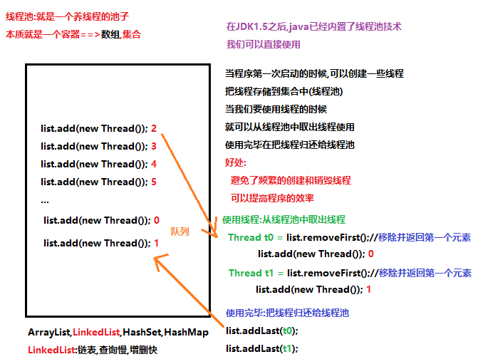
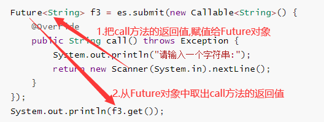
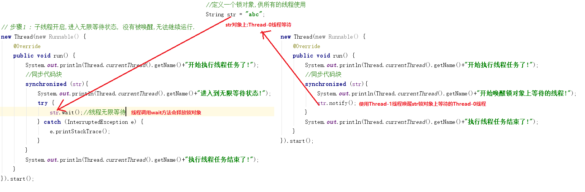
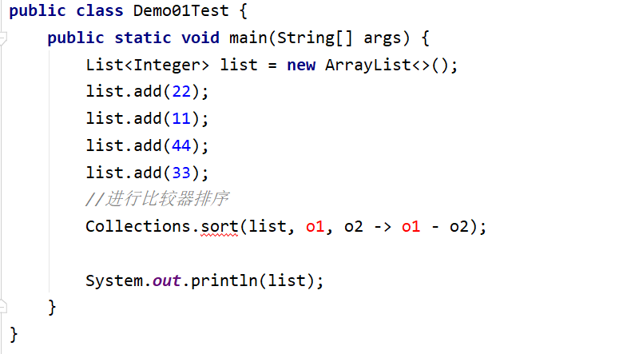
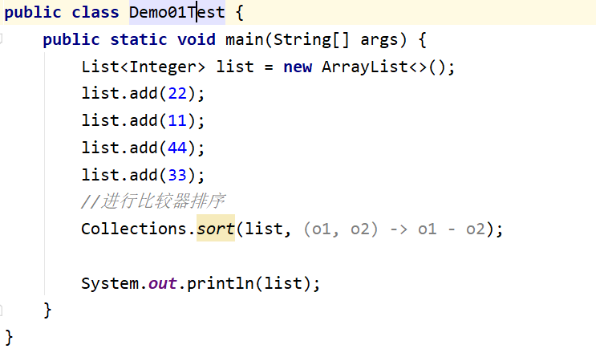
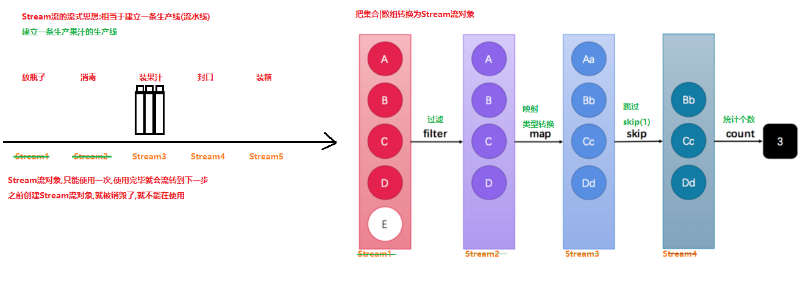

# 学习目标

```java
能够描述Java中线程池运行原理
	使用一个容器(集合)存储一些线程
	当我们要使用线程的时候,从容器中取出
	使用完毕线程,把线程在归还给线程池
	可以提高程序的效率,避免了频繁的创建线程和销毁线程
能够说出线程6个状态的名称
	新建,运行,阻塞,睡眠(计时等待),无限等待,死亡
能够使用定时器
	void schedule(TimerTask task, long delay) 在指定的毫秒值之后,只执行一次定时任务
	void schedule(TimerTask task, long delay, long period) 在指定的毫秒值之后,每隔多少毫秒反复执行定时任务
	void schedule(TimerTask task, Date time) 在指定的时间和日期之后,只执行一次定时任务
	void schedule(TimerTask task, Date firstTime, long period) 在指定的时间和日期之后,每隔多少毫秒反复执行定时任务
- 能够掌握Lambda表达式的标准格式与省略格式(重点)
	()->{}
	(参数)->{重写接口中的抽象方法的方法体}
	(int a,int b)->{}==>省略数据类型 (a,b)->{}
	(int a)->{}==>省略数据类型 a->{}
	a->{只有一行代码}==>a->代码(return ; {} 一起省略)
- 能够通过集合或数组方式获取流(重点)
	Collection集合中方法default Stream<E> stream()直接把集合转换为Stream流
		ArrayList<Integer> list = new ArrayList<>();
        Stream<Integer> stream1 = list.stream();
	Stream接口中的静态方法static <T> Stream<T> of(T... values) 把数组转换为Stream流
		Stream<Integer> stream1 = Stream.of(1, 2, 3, 4, 5, 6, 7, 8);
		String[] arr1 = {"a", "b", "c"};
        Stream<String> stream3 = Stream.of(arr1);
- 能够掌握常用的流操作(重点)
	forEach:遍历
	count:统计个数
	filter:过滤
	limit:获取前n个
	skip:跳过前n个
	map:映射,把一种数据类型转换为另外一种数据类型
	concat:组合 把两个流组合为一个流
- 能够将流中的内容收集到集合和数组中(重点)
	List<String> list = stream.collect(Collectors.toList());
	Set<String> set = stream.collect(Collectors.toSet());
	Object[] arr = stream.toArray();
```

# 第一章 线程池

## 1.线程池的思想



## 2.线程池概述

```java
java.util.concurrent.Executors:是一个生产线程池的工厂类
	工厂类中的方法都是静态的,通过类名可以直接使用
	static ExecutorService newFixedThreadPool(int nThreads) 创建一个可重用固定线程数的线程池
	参数:
	   int nThreads:传递创建线程池包含的线程数量  传递100,线程池中包含100个线程,传递10000,线程池中包含10000个线程
	返回值:
		ExecutorService:返回的就是一个线程池,ExecutorService是接口类型,返回的是ExecutorService的实现类对象
----------------------------------------------------------------------------------		
java.util.concurrent.ExecutorService接口:是一个描述线程池的接口
	常用方法:
		Future<?> submit(Runnable task) 提交一个 Runnable 任务用于执行，并返回一个表示该任务的 Future。
		<T> Future<T> submit(Callable<T> task) 提交一个返回值的任务用于执行，返回一个表示任务的未决结果的 Future。
		参数:
		  Runnable task:传递一个Runnable接口的实现类对象(线程任务)
		  Callable<T> task:传递一个Callable接口的实现类对象(线程任务)
		  submit方法会从线程池中获取一个线程,执行这个线程任务,执行完毕把线程在归还给线程池
		返回值:
		   Future<?>:用来接收Callable线程任务中执行的call方法的返回值    
```

## 3.使用线程池执行Runnable接口的线程任务(重点)

```java
package com.itheima.demo01ThreadPool;

import java.util.concurrent.ExecutorService;
import java.util.concurrent.Executors;

/*
    使用线程池执行Runnable接口的线程任务(重点)
    1.使用线程池工厂类Executors中的静态方法newFixedThreadPool生产一个包含指定线程数量的线程池ExecutorService
    2.创建Runnable接口的实现类对象(重写run方法,设置线程任务)
    3.使用线程池ExecutorService中的方法submit,传递线程任务(Runnable接口的实现类),执行线程任务
        submit方法会自动在线程池中取出线程,执行线程任务,执行完毕,会自动把线程在归还给线程池
 */
public class Demo01ThreadPool {
    public static void main(String[] args) {
        //1.使用线程池工厂类Executors中的静态方法newFixedThreadPool生产一个包含指定线程数量的线程池ExecutorService
        ExecutorService es = Executors.newFixedThreadPool(3);

        //3.使用线程池ExecutorService中的方法submit,传递线程任务(Runnable接口的实现类),执行线程任务
        //new Thread(new RunnableImpl()).start();
        es.submit(new RunnableImpl());//pool-1-thread-1线程开始执行线程任务了!
        es.submit(new RunnableImpl());//pool-1-thread-1线程开始执行线程任务了!
        es.submit(new RunnableImpl());//pool-1-thread-2线程开始执行线程任务了!
        es.submit(new RunnableImpl());//pool-1-thread-3线程开始执行线程任务了!

        //匿名内部类
        es.submit(new Runnable() {
            @Override
            public void run() {
                System.out.println(Thread.currentThread().getName()+"线程开始执行线程任务了!");
            }
        });

        /*
            void shutdown() 用于销毁线程池,销毁完之后,线程池就不能在使用了
         */
        es.shutdown();

        //es.submit(new RunnableImpl());//RejectedExecutionException:拒绝执行异常
    }
}
```

```java
package com.itheima.demo01ThreadPool;

//2.创建Runnable接口的实现类对象(重写run方法,设置线程任务)
public class RunnableImpl implements Runnable{
    @Override
    public void run() {
        System.out.println(Thread.currentThread().getName()+"线程开始执行线程任务了!");
    }
}
```

## 4.使用线程池执行Callable接口的线程任务(重点)

```java
package com.itheima.demo01ThreadPool;

import java.util.Random;
import java.util.concurrent.*;

/*
    使用线程池执行Callable接口的线程任务(重点)
    java.util.concurrent.Callable<V>接口
        Callable 接口类似于 Runnable，两者都是为了创建线程任务而存在的
        但是 Runnable 不会返回结果，Callable有返回结果
    Callable接口中的抽象类方法:
        V call() 计算结果，如果无法计算结果，则抛出一个异常。
        call方法可以返回一个结果,接口使用什么泛型,就可以返回什么类型的值
            Callable<Integer>:接口的泛型使用Integer,就可以返回一个Integer类型的值
            Callable<String>:接口的泛型使用String,就可以返回一个String类型的值
            ...
    使用步骤:
        1.使用线程池工厂类Executors中的静态方法newFixedThreadPool生产一个包含指定线程数量的线程池ExecutorService
        2.使用线程池ExecutorService中的方法submit,传递Callable接口的线程任务,执行线程任务
        Future<T> submit(Callable<T> task) 提交一个返回值的任务用于执行，返回一个表示任务的未决结果的 Future。
        注意:
            调用submit方法使用Future来接收call方法的返回值
 */
public class Demo02ThreadPool {
    public static void main(String[] args) throws ExecutionException, InterruptedException {
        //1.使用线程池工厂类Executors中的静态方法newFixedThreadPool生产一个包含指定线程数量的线程池ExecutorService
        ExecutorService es = Executors.newFixedThreadPool(100);
        //2.使用线程池ExecutorService中的方法submit,传递Callable接口的线程任务,执行线程任务
        Future<Integer> f1 = es.submit(new Callable<Integer>() {
            @Override
            public Integer call() throws Exception {
                //返回一个随机的整数[0-9]
                return new Random().nextInt(10);
            }
        });
        System.out.println(f1);//java.util.concurrent.FutureTask@14ae5a5

        /*
            java.util.concurrent.Future<V>接口:Future 表示异步计算的结果。
            V get() 如有必要，等待计算完成，然后获取其结果。
         */
        System.out.println(f1.get());
        System.out.println("------------------------------------");
        Future<Double> f2 = es.submit(new Callable<Double>() {
            @Override
            public Double call() throws Exception {
                //返回一个随机小数[0.0-1.0)
                return Math.random();
            }
        });
        System.out.println(f2.get());
    }
}
```



## 5.线程池的练习

需求: 使用线程池方式执行任务,返回1-n的和
分析: 因为需要返回求和结果,所以使用Callable方式的任务

```java
package com.itheima.demo01ThreadPool;

import java.util.Scanner;
import java.util.concurrent.*;

/*
    线程池的练习
    需求: 使用线程池方式执行任务,返回1-n的和
    分析: 因为需要返回求和结果,所以使用Callable方式的任务
    实现步骤:
        1.使用Scanner获取一个用户输入的整数
        2.使用线程池工厂类Executors中的方法newFixedThreadPool创建一个包含指定线程数量的线程池ExecutorService
        3.使用线程ExecutorService中的方法submit,提交Callable接口的线程任务,执行线程任务
 */
public class Demo03Test {
    public static void main(String[] args) throws ExecutionException, InterruptedException {
        //1.使用Scanner获取一个用户输入的整数
        System.out.println("请输入一个整数:");
        int n = new Scanner(System.in).nextInt();
        //2.使用线程池工厂类Executors中的方法newFixedThreadPool创建一个包含指定线程数量的线程池ExecutorService
        ExecutorService es = Executors.newFixedThreadPool(100);
        //3.使用线程ExecutorService中的方法submit,提交Callable接口的线程任务,执行线程任务
        Future<Integer> future = es.submit(new Callable<Integer>() {
            //线程任务:计算1-n的和
            @Override
            public Integer call() throws Exception {
                //定义一个变量,初始值为0,记录类加求和
                int sum = 0;
                //使用for循环获取1-n之间的数字
                for (int i = 1; i <= n; i++) {
                    //累加求和
                    sum += i;
                }
                //把和返回
                return sum;
            }
        });
        System.out.println("1到"+n+"之间的和为:"+future.get());
    }
}
```

# 第二章 线程状态

## 1.线程状态概述

**重点:必须记住6种线程状态的名称**


## 2.Object类中等待与唤醒的方法

```java
java.lang.Object 类:是祖宗类,里边的方法,任意的一个类都可以使用
void wait() 
    在其他线程调用此对象的 notify() 方法或 notifyAll() 方法前，导致当前线程等待。 
void notify() 
    唤醒在此对象监视器(同步锁,对象锁)上等待的单个线程。 
void notifyAll() 
    唤醒在此对象监视器(同步锁,对象锁)上等待的所有线程。 
注意:
	1.wait和notify方法一般使用在同步代码块中==>有锁对象==>对象监视器
	2.一般都使用锁对象调用wait和notify方法(多个线程使用的是同一个锁对象)
        Thread-0线程使用锁对象==>wait方法==>Thread-0线程进入到等待
        Thread-1线程使用锁对象==>notify方法==>唤醒在锁对象上等待的Thread-0线程
    3.在同步中的线程调用wait方法,进入到等待状态,会释放锁对象
      在同步中的线程调用sleep方法,进入睡眠,不会释放锁对象
```

```java
package com.itheima.demo02waitAndNotify;

/*
    Object类中等待与唤醒的方法
 */
public class Demo01WaitAndNotify {
    public static void main(String[] args) throws InterruptedException {
        //定义一个锁对象,供所有的线程使用
        String lock = "abc";

        // 步骤1 : 子线程开启,进入无限等待状态, 没有被唤醒,无法继续运行.
        new Thread(new Runnable() {
            @Override
            public void run() {
                System.out.println(Thread.currentThread().getName()+"线程开始执行线程任务了!");
                //同步代码块
                synchronized (lock){
                    System.out.println(Thread.currentThread().getName()+"线程调用wait方法,进行到无限等待状态!");
                    try {
                        lock.wait();//此方法会让Thread-0线程进入到无限等待状态:不会在继续往下执行
                    } catch (InterruptedException e) {
                        e.printStackTrace();
                    }
                }
                System.out.println(Thread.currentThread().getName()+"线程执行线程任务结束了!");
            }
        }).start();

        //步骤2: 加入如下代码后, 3秒后,会执行notify方法, 唤醒wait中线程.
        Thread.sleep(3000);

        new Thread(new Runnable() {
            @Override
            public void run() {
                System.out.println(Thread.currentThread().getName()+"线程开始执行线程任务了!");
                //同步代码块
                synchronized (lock){
                    System.out.println(Thread.currentThread().getName()+"线程开始执行notify方法,会唤醒锁对象上等待的线程!");
                    lock.notify();
                }
                System.out.println(Thread.currentThread().getName()+"线程执行线程任务结束了!");
            }
        }).start();
    }
}
```



# 第三章 定时器

## 1.定时器的概述

定时器，可以设置线程在某个时间执行某件事情，或者某个时间开始，每间隔指定的时间反复的做某件事情

```java
java.util.Timer类:是一个描述定时器的类
	一种工具，线程用其安排以后在后台线程中执行的任务。可安排任务执行一次，或者定期重复执行。
构造方法:
	Timer() 创建一个新计时器。
 成员方法:
	1.void cancel() 终止此计时器，丢弃所有当前已安排的任务。
		注意，在此计时器调用的计时器任务的 run 方法内调用此方法，就可以绝对确保正在执行的任务是此计时器所执行的最后一个任务。 
	2.void schedule(TimerTask task, long delay) 在指定的毫秒值之后,执行指定的任务,只会执行一次
		参数:
			task - 所要安排的任务。定时器到时间之后要执行的任务
			delay - 执行任务前的延迟时间，单位是毫秒。 多个毫秒之后开始执行TimerTask任务
	3.void schedule(TimerTask task, long delay, long period)
		在指定的毫秒值之后,执行指定的任务,之后每隔固定的毫秒数重复执行定时任务
		参数:
			task - 所要安排的任务。定时器到时间之后要执行的任务
			delay - 执行任务前的延迟时间，单位是毫秒。 多个毫秒之后开始执行TimerTask任务
			period - 执行各后续任务之间的时间间隔，单位是毫秒。定时器开始执行之后,每隔多少毫秒重复执行
   4.void schedule(TimerTask task, Date time) 安排在指定的时间执行指定的任务,只会执行一次
		参数:
			task - 所要安排的任务。定时器到时间之后要执行的任务
			time - 执行任务的时间。从什么日期开始执行任务  2020-09-01 15:25:13
   5.void schedule(TimerTask task, Date firstTime, long period) 安排指定的任务在指定的时间开始进行重复的固定延迟执行。
		参数:
			task - 所要安排的任务。定时器到时间之后要执行的任务
			time - 执行任务的时间。从什么日期开始执行任务  2020-09-01 15:25:13
			period - 执行各后续任务之间的时间间隔，单位是毫秒。定时器开始执行之后,每隔多少毫秒重复执行
  java.util.TimerTask类 implements Runnable接口
		由 Timer 安排为一次执行或重复执行的任务。
		TimerTask类是一个抽象类,无法直接创建
		void run() 此计时器任务要执行的操作。重写run方法,设置线程任务
```

## 2.定时器的使用(重点)

```java
package com.itheima.demo03Timer;

import java.text.ParseException;
import java.text.SimpleDateFormat;
import java.util.Date;
import java.util.Timer;
import java.util.TimerTask;

/*
    定时器的使用(重点)
 */
public class Demo01Timer {
    public static void main(String[] args) throws ParseException {
        show04();
    }

    /*
        5.void schedule(TimerTask task, Date firstTime, long period) 安排指定的任务在指定的时间开始进行重复的固定延迟执行。
		参数:
			task - 所要安排的任务。定时器到时间之后要执行的任务
			time - 执行任务的时间。从什么日期开始执行任务  2020-09-01 15:25:13
			period - 执行各后续任务之间的时间间隔，单位是毫秒。定时器开始执行之后,每隔多少毫秒重复执行
     */
    private static void show04() throws ParseException {
        //创建一个反复执行的定时器:从2020-11-08 10:31:30开始第一次执行,之后每隔1秒钟执行一次
        SimpleDateFormat sdf = new SimpleDateFormat("yyyy-MM-dd HH:mm:ss");
        Date date = sdf.parse("2020-11-08 10:32:20");
        Timer timer = new Timer();
        timer.schedule(new TimerTask() {
            @Override
            public void run() {
                System.out.println("哈哈!");
            }
        },date,1000);
    }

    /*
        4.void schedule(TimerTask task, Date time) 安排在指定的时间执行指定的任务,只会执行一次
		参数:
			task - 所要安排的任务。定时器到时间之后要执行的任务
			time - 执行任务的时间。从什么日期开始执行任务  2020-11-08 10:29:30
		注意:
		    设置的时间已经结束了,会直接执行定时任务	
     */
    private static void show03() throws ParseException {
        //创建一个执行一次的定时器:从2020-11-08 10:29:30开始执行定时任务
        SimpleDateFormat sdf = new SimpleDateFormat("yyyy-MM-dd HH:mm:ss");
        Date date = sdf.parse("2020-11-08 10:29:30");
        Timer timer = new Timer();
        timer.schedule(new TimerTask() {
            @Override
            public void run() {
                System.out.println("哈哈!");
                timer.cancel();
            }
        },date);
    }

    /*
        3.void schedule(TimerTask task, long delay, long period)
		在指定的毫秒值之后,执行指定的任务,之后每隔固定的毫秒数重复执行定时任务
		参数:
			task - 所要安排的任务。定时器到时间之后要执行的任务
			delay - 执行任务前的延迟时间，单位是毫秒。 多个毫秒之后开始执行TimerTask任务
			period - 执行各后续任务之间的时间间隔，单位是毫秒。定时器开始执行之后,每隔多少毫秒重复执行
     */
    private static void show02() {
        //创建一个反复执行的定时器:5秒钟之后开始执行,之后每隔1秒钟执行一次
        Timer timer = new Timer();
        SimpleDateFormat sdf = new SimpleDateFormat("yyyy-MM-dd HH:mm:ss");
        timer.schedule(new TimerTask() {
            @Override
            public void run() {
                System.out.println(sdf.format(new Date()));
            }
        },5000,1000);
    }

    /*
        2.void schedule(TimerTask task, long delay) 在指定的毫秒值之后,执行指定的任务,只会执行一次
		参数:
			task - 所要安排的任务。定时器到时间之后要执行的任务
			delay - 执行任务前的延迟时间，单位是毫秒。 多个毫秒之后开始执行TimerTask任务
     */
    private static void show01() {
        //创建一个执行一次的定时器:5秒钟之后开始执行定时任务
        Timer timer = new Timer();
        timer.schedule(new TimerTask() {
            @Override
            public void run() {
                System.out.println("c4爆炸了!");
                timer.cancel();//终止定时器
            }
        },5000);
    }
}
```

# 第四章 Lambda表达式(重点)

## 1.函数式编程思想概述

面向对象思想:

​	做一件事情,找一个能够解决这个事情的**对象**,调用对象的方法来完成这件事情

函数式编程思想:

​	重视的是**结果**,怎么做事情,不重视完成的过程,找谁来做

## 2.使用Lambda表达式简化匿名内部类(重点)

```java
package com.itheima.demo04Lambda;

public class Demo01Lambda {
    public static void main(String[] args) {
        //使用匿名内部类的方式,实现多线程程序
        new Thread(new Runnable() {
            @Override
            public void run() {
                System.out.println(Thread.currentThread().getName()+"线程开始执行线程任务了!");
            }
        }).start();

        //使用Lambda表达式简化匿名内部类,,实现多线程程序
        new Thread(()->{
            System.out.println(Thread.currentThread().getName()+"线程开始执行线程任务了!");
        }).start();
    }
}
```

## 3.Lambda表达式的语法(重点)

**Lambda表达式作用:简化匿名内部类**

**lambda表达式使用前提:必须有接口,接口中有且只能有一个抽象方法(函数式接口)**

Lambda表达式是可推导,可省略:能推导出来,Lambda表达式重写的就是接口中唯一的抽象方法

Lambda表达式的语法:

​	由一些参数,一个箭头,一些代码组成

格式:

​	**(参数列表)->{重写抽象方法的方法体}**  Runnable==>public abstract void run(); 唯一的抽象方法

- (参数列表):重写接口中的抽象方法的参数,有参数就写参数,多个参数使用逗号隔开,没有参数就空着
- ->:传递(固定写法):可以把参数传递到方法体{}中使用
- {}:重写抽象方法的方法体

## 4.使用Lambda表达式重写有参数有返回值的方法(重点)

需求:
        1.定义一个Person类,包含属性(姓名,年龄)
        2.定义一个长度为3的数组,存储Person对象
        3.定义三个Person对象存储数组中
        4.使用Arrays数组工具类中的方法sort,根据比较器产生的规则对Person对象进行排序

```java
package com.itheima.demo04Lambda;

import java.util.Arrays;
import java.util.Comparator;

public class Demo02Lambda {
    public static void main(String[] args) {
        //2.定义一个长度为3的数组,存储Person对象
        Person[] arr = new Person[3];
        //3.定义三个Person对象存储数组中
        arr[0] = new Person("刘备",55);
        arr[1] = new Person("张飞",18);
        arr[2] = new Person("关羽",35);
        //4.使用Arrays数组工具类中的方法sort,根据比较器产生的规则对Person对象进行排序
        Arrays.sort(arr, new Comparator<Person>() {
            @Override
            public int compare(Person o1, Person o2) {
                //o1-o2:升序  o2-o1:降序  根据年龄降序排序
                return o2.getAge()-o1.getAge();
            }
        });
        System.out.println(Arrays.toString(arr));//[Person{name='刘备', age=55}, Person{name='关羽', age=35}, Person{name='张飞', age=18}]

        //使用Lambda表达式简化匿名内部类
        Arrays.sort(arr,(Person o1, Person o2)->{
            //根据年龄升序排序
            return o1.getAge()-o2.getAge();
        });
        System.out.println(Arrays.toString(arr));
    }
}
```

```java
package com.itheima.demo04Lambda;

//1.定义一个Person类,包含属性(姓名,年龄)
public class Person {
    private String name;
    private int age;

    public Person() {
    }

    public Person(String name, int age) {
        this.name = name;
        this.age = age;
    }

    @Override
    public String toString() {
        return "Person{" +
                "name='" + name + '\'' +
                ", age=" + age +
                '}';
    }

    public String getName() {
        return name;
    }

    public void setName(String name) {
        this.name = name;
    }

    public int getAge() {
        return age;
    }

    public void setAge(int age) {
        this.age = age;
    }
}
```

## 5.Lambda表达式简化格式(重点)

```java
package com.itheima.demo04Lambda;

import java.util.Arrays;
import java.util.Comparator;

/*
    Lambda表达式简化格式(重点)
    Lambda表达式使用前提:只能简化接口的匿名内部类,而且接口中有且仅有一个抽象方法
    Lambda表达式是可以推导可以省略的
        可以推导出来重写的就是唯一的抽象方法
        可以推导出来抽象方法的参数列表和方法体,所以可以对参数列表和方法体进行进一步的简化
    格式:
        (参数列表)->{重写的抽象方法的方法体}
        1.(参数列表):参数里边中的数据类型是可以省略不写的
            (String s,int a)==>(s,a)
            (int a)==>(a)
        2.(参数列表):参数列表中只有一个参数,那么小括号也可以省略
             (int a)==>(a)==>a
             参数列表中没有参数,小括号不能省略
             ()==>()
        3.{重写的抽象方法的方法体}:方法体中只有一行代码,无论是否有返回值
            方法体的{ },一行代码结束分号;,return关键字都可以一起省略不写
            但是注意:这三个必须一起省略
 */
public class Demo03Lambda {
    public static void main(String[] args) {
        //使用Lambda表达式简化匿名内部类,,实现多线程程序
        new Thread(()->{
            System.out.println(Thread.currentThread().getName()+"线程开始执行线程任务了!");
            System.out.println(Thread.currentThread().getName()+"线程开始执行线程任务了!");
            System.out.println(Thread.currentThread().getName()+"线程开始执行线程任务了!");
        }).start();

        new Thread(()->System.out.println(Thread.currentThread().getName()+"线程开始执行线程任务了!")).start();

        //2.定义一个长度为3的数组,存储Person对象
        Person[] arr = new Person[3];
        //3.定义三个Person对象存储数组中
        arr[0] = new Person("刘备",55);
        arr[1] = new Person("张飞",18);
        arr[2] = new Person("关羽",35);
        //4.使用Arrays数组工具类中的方法sort,根据比较器产生的规则对Person对象进行排序
        //使用Lambda表达式简化匿名内部类
        Arrays.sort(arr,(Person o1, Person o2)->{
            //根据年龄升序排序
            return o1.getAge()-o2.getAge();
        });
        System.out.println(Arrays.toString(arr));

        //简化Lambda表达式
        Arrays.sort(arr,(o1,o2)->o2.getAge()-o1.getAge());
        System.out.println(Arrays.toString(arr));
    }
}
```

## :reminder_ribbon:经验分享

### 1. 代码

```java
public class Demo01Test {
    public static void main(String[] args) {
        List<Integer> list = new ArrayList<>();
        list.add(22);
        list.add(11);
        list.add(44);
        list.add(33);
        //进行比较器排序
        Collections.sort(list, o1, o2 -> o1 - o2);

        System.out.println(list);
    }
}

```

### 2.出现的问题

代码写完之后，程序报错



### 3.问题的分析

> Lambda表达式错误，如果小括号中只有一个参数，那么是可以省略小括号的，但是现在小括号中有两个参数，所以小括号不能省略。

### 4.问题解决办法

> 将参数加上小括号即可

1

# 第五章 函数式接口(了解)

## 1.函数式接口的定义

```java
package com.itheima.demo05FunctionalInterface;

/*
    函数式接口:有且仅有一个抽象方法的接口
    注意:
        1.接口中没有抽象方法不行
        2.接口中除了唯一的抽象方法,可以包含其他的方法(默认,静态)
    注解:
        @FunctionalInterface:可以检测接口是否为函数式接口    
 */
@FunctionalInterface
public interface MyFunction {
    //定义一个抽象方法
    public abstract void show(int a);
   
    //定义一个默认方法
    public default void show02(){
        System.out.println("MyFunction接口的默认方法!");
    }
    
    //定义一个静态方法
    public static void show03(){
        System.out.println("MyFunction接口的静态方法!");
    }
}
```

## 2.函数式接口的使用

**记住:方法的参数和返回值类型使用函数式接口,可以传递和返回Lambda表达式==>简化匿名内部类**

```java
package com.itheima.demo05FunctionalInterface;

/*
    函数式接口的使用
        和普通接口一样,创建接口的实现类对象,重写抽象方法使用
    在工作中:一般都使用函数式接口作为方法的参数类型和返回值类型
        好处:
            1.多态:可以接收接口的任意实现类对象,可以返回接口的任意实现类对象
            2.方法的参数和返回值类型如果是函数式接口,就可以传递和返回Lambda表达式作为接口的实现类对象
    注意:
        Lambda表达式就是匿名内部类
 */
public class Demo01MyFunction {
    public static void main(String[] args) {
        //调用method方法,方法的参数MyFunction是一个接口,可以传递接口的匿名实现类对象
        method(new MyFunction() {
            @Override
            public void show(int a) {
                System.out.println(a);
            }
        },10);

        //调用method方法,方法的参数MyFunction是一个函数式接口,可以使用Lambda表达式简化匿名内部类,作为接口的一个实现类对象
        method((int a)->{
            System.out.println(a);
        },20);

        //简化格式
        method(a-> System.out.println(a),30);
    }

    /*
        定义一个方法,方法的参数
            类型使用MyFunction函数式接口类型
            类型使用int类型
        多态:  接口    变量名 =  匿名实现类对象
            MyFunction my = new MyFunction() {
                @Override
                public void show(int a) {
                    System.out.println(a);
                }
            };
           MyFunction my =  a-> System.out.println(a); 
     */
    public static void method(MyFunction my,int i){
        my.show(i);
    }
}
```

## 3.函数式接口:Consumer

```java
java.util.function.Consumer<T>:函数式接口
    接口中唯一的抽象方法:
        void accept​(T t) :消费一个指定泛型类型的数据
    Consumer接口的泛型使用什么类型,就可以使用accept方法消费(使用)一个什么类型的数据
    至于我们怎么使用这个数据,看心情(想怎么使用就怎么使用,可以计算,可以输出...)
```

```java
package com.itheima.demo05FunctionalInterface;

import java.util.function.Consumer;

public class Demo02Consumer {
    public static void main(String[] args) {
        //调用method方法,方法的参数Consumer是一个接口,所以可以传递接口的匿名内部类,给接口变量赋值
        method(new Consumer<String>() {
            @Override
            public void accept(String s) {
                System.out.println(s);
            }
        },"小五");

        //调用method方法,方法的参数Consumer是一个函数式接口,所以可以传递Lambda表达式,给接口变量赋值
        method((String s)->{
            System.out.println(s);
        },"小三");
        
        //简化Lambda表达式
        method(s-> System.out.println(s),"戴沐白");
    }

    /*
        定义一个方法,方法的参数数据类型
            使用Consumer接口类型
            使用String类型
        在方法中使用Consumer接口中的方法accept对字符串参数进行消费(使用)
     */
    public static void method(Consumer<String> con,String s){
        con.accept(s);
    }
}
```

## 4.函数式接口:Predicate

```java
java.util.function.Predicate<T>:函数式接口
   接口中唯一的抽象方法:
       boolean test​(T t) 用于对接口指定泛型类型的数据进行判断
   Predicate接口的泛型使用什么类型,就可以使用test方法判断数据是否满足要求
       满足要求:返回true
       不满足要求:返回false
```

```java
package com.itheima.demo05FunctionalInterface;

import java.util.function.Predicate;

public class Demo03Predicate {
    public static void main(String[] args) {
        //调用method方法,方法的参数Predicate是一个接口,所以可以传递接口的匿名内部类,给接口变量赋值
        method(new Predicate<String>() {
            @Override
            public boolean test(String s) {
                //判断字符串的长度是否大于5
                return s.length()>5;
            }
        },"aaaaaa");

        //调用method方法,方法的参数Predicate是一个函数式接口,所以可以传递Lambda表达式,给接口变量赋值
        method((String s)->{
            return s.length()>5;
        },"aaaa");

        //简化Lambda表达式
        method(s->s.length()>5,"aaaaaaaaaaa");
    }

    /*
        定义一个方法,方法的参数数据类型
            使用Predicate接口,泛型使用String
            使用String类型
        在方法中使用Predicate接口中的方法test,对字符串参数进行判断
     */
    public static void method(Predicate<String> pre,String s){
        boolean b = pre.test(s);
        System.out.println(b);
    }
}
```

## 5.函数式接口:Function

```java
java.util.function.Function<T,R>:函数式接口
   接口中唯一的抽象方法:
       R apply​(T t) 根据参数类型T获取类型R类型的返回值,用于类型转换 T转换R
   例如:
       Function<String,Integer>:根据传递String类型的数据,获取Integer类型的结果  "123"==>123 = Integer.parseInt("123")
       Function<String,Person>:根据传递String类型的数据,获取Person类型的结果   "小明"==>Person p = new Person("小明")
       ...
```

```java
package com.itheima.demo05FunctionalInterface;

import java.util.function.Function;

public class Demo04Function {
    public static void main(String[] args) {
        //调用method方法,方法的参数Function是一个接口,所以可以传递接口的匿名内部类,给接口变量赋值
        method(new Function<String, Integer>() {
            @Override
            public Integer apply(String s) {
                //把字符串转换为int类型返回
                return Integer.parseInt(s);
            }
        },"123");
        //调用method方法,方法的参数Function是一个函数式接口,所以可以传递Lambda表达式,给接口变量赋值
        method((String s)->{
            return Integer.parseInt(s);
        },"100");
        //简化Lambda表达式
        method(s->Integer.parseInt(s),"200");
    }

    /*
        定义一个方法,方法的参数数据类型
            使用Function接口类型,泛型<String,Integer>
            使用String类型
        在方法中,使用Function接口中的方法apply,把字符串类型的数据,转换为Integer类型返回
     */
    public static void method(Function<String,Integer> fun,String s){
        Integer in = fun.apply(s);
        System.out.println(in+10);
    }
}
```

## 6.函数式接口:Supplier

```java
 java.util.function.Supplier<T>:函数式接口
   接口中唯一的抽象方法:
       T get​() 用来获取接口指定泛型类型的数据
   Supplier接口使用什么泛型,就可以使用get方法获取一个什么类型的数据
```

```java
package com.itheima.demo05FunctionalInterface;

import java.util.function.Supplier;

public class Demo05Supplier {
    public static void main(String[] args) {
        //调用method方法,方法的参数Supplier是一个接口,所以可以传递接口的匿名内部类,给接口变量赋值
        method(new Supplier<Integer>() {
            @Override
            public Integer get() {
                return 10;
            }
        });
        //调用method方法,方法的参数Supplier是一个函数式接口,所以可以传递Lambda表达式,给接口变量赋值
        method(()->{
            return 20;
        });
        //简化Lambda表达式
        method(()->30);
    }

    /*
        定义一个方法,方法的参数数据类型
            使用Supplier接口,泛型使用Integer
        在方法内部使用Supplier接口中的方法get,获取一个Integer类型的数据
     */
    public static void method(Supplier<Integer> sup){
        Integer in = sup.get();
        System.out.println(in);
    }
}
```

## 7.函数式接口的总结

函数式接口一般都作为方法的参数(返回值类型)

a.方法的参数是一个函数式接口,那么我们就可以传递lambda表达式作为接口的一种实现类对象

为方法的参数接口变量进行赋值

b.方法的返回值类型是一个函数式接口,方法内部就可以返回一个Lambda表达式作为接口的实现类对象

Lambda表达式=接口的实现类对象

# 第六章 Stream流

## 1.Sream流概述

**我们可以把集合|数组,转换为Stream流,使用Stream流中的方法,对集合|数组进行操作**

## 2.Stream流的基本体验

需求:

List<String> list= new ArrayList<>();

 Collections.addAll(list,"张无忌","周芷若","赵敏","张三丰","张翠山","灭绝师太","张三");

1.首先晒选出所有姓张的人,把姓张的人存储到一个新的集合中

2.筛选名字中是3个字的人,把名字是3个字的人存储到一个新的集合中

3.对最后得到的集合进行遍历

```java
package com.itheima.demo06Stream;

import java.util.ArrayList;
import java.util.Collections;
import java.util.List;

public class Demo01Stream {
    public static void main(String[] args) {
        List<String> list= new ArrayList<>();
        Collections.addAll(list,"张无忌","周芷若","赵敏","张三丰","张翠山","灭绝师太","张三");

        List<String> zhangList= new ArrayList<>();
        //1.首先晒选出所有姓张的人,把姓张的人存储到一个新的集合中
        for (String s : list) {
            if(s.startsWith("张")){
                zhangList.add(s);
            }
        }
        System.out.println(zhangList);//[张无忌, 张三丰, 张翠山, 张三]

        //2.筛选名字中是3个字的人,把名字是3个字的人存储到一个新的集合中
        List<String> threeList= new ArrayList<>();
        for (String s : zhangList) {
            if(s.length()==3){
                threeList.add(s);
            }
        }

        //3.对最后得到的集合进行遍历
        for (String s : threeList) {
            System.out.println(s);
        }
    }
}
```

```java
package com.itheima.demo06Stream;

import java.util.ArrayList;
import java.util.Collections;
import java.util.List;

/*
    使用Stream流对代码进行简化
    可以把集合|数组转换为Stream流,使用Stream流中的方法操作集合|数组中的元素
    Stream流可以使代码变的更加优雅(简化代码)
 */
public class Demo02Stream {
    public static void main(String[] args) {
        List<String> list= new ArrayList<>();
        Collections.addAll(list,"张无忌","周芷若","赵敏","张三丰","张翠山","灭绝师太","张三");
        //1.首先晒选出所有姓张的人,把姓张的人存储到一个新的集合中
        //2.筛选名字中是3个字的人,把名字是3个字的人存储到一个新的集合中
        //3.对最后得到的集合进行遍历
        //可以把集合转换为Stream流
        list.stream().
                filter(s->s.startsWith("张")).
                filter(s->s.length()==3).
                forEach(s-> System.out.println(s));
    }
}
```

## 3.流式思想概述



## 4.获取Stream流的方式(重点)

```java
package com.itheima.demo06Stream;

import java.util.*;
import java.util.stream.Stream;

/*
    获取Stream流的方式(重点)
 */
public class Demo03Stream {
    public static void main(String[] args) {
        show02();
    }

    /*
        2.把数组转换为Stream流
        java.util.stream.Stream<T>接口:是jdk1.8之后新增的接口
        成员方法:
            static <T> Stream<T> of​(T... values) 参数传递可变参数,可以把可变参数转换为Stream流
        注意:
            可变参数底层就是一个数组,传递可变参数的方法,都可以传递数组
     */
    private static void show02() {
        //使用Stream接口中的方法of,获取Stream流对象
        Stream<Integer> stream1 = Stream.of(1, 2, 3, 4, 5, 6, 7, 8, 9, 10);
        Stream<String> stream2 = Stream.of("aaa", "bbb", "ccc", "ddd");

        //可变参数底层就是一个数组,传递可变参数的方法,都可以传递数组
        String[] arr1 = {"aaa", "bbb", "ccc", "ddd"};
        Stream<String> stream3 = Stream.of(arr1);

        int[] arr2 = {1,2,3,4};
        Stream<int[]> stream4 = Stream.of(arr2);//把整个数组作为一个元素,转换为Stream流
        System.out.println(stream4.count());//统计流中元素的个数 1

        //想要把整数类型的数组转换为Stream,使用包装类
        Integer[] arr3 = {1,2,3,4};
        Stream<Integer> stream5 = Stream.of(arr3);
        System.out.println(stream5.count());//4
    }

    /*
        1.把集合转换为Stream流
        在jdk1.8之后,Collection集合最顶的接口中定义了一个方法叫stream
            default Stream<E> stream​() 把集合转换为Stream流
     */
    private static void show01() {
        ArrayList<String> list = new ArrayList<>();
        //把ArrayList集合转换为Stream流
        Stream<String> stream1 = list.stream();

        LinkedList<Integer> linkedList = new LinkedList<>();
        //把LinkedList集合转换为Stream流
        Stream<Integer> stream2 = linkedList.stream();

        HashSet<Double> set= new HashSet<>();
        //把HashSet集合转换为Stream流
        Stream<Double> stream3 = set.stream();

        HashMap<String,String> map = new HashMap<>();
        //map.stream();//Cannot resolve method 'stream()' Map集合不能转换为Stream流

        Set<String> keySet = map.keySet();
        //把Map集合中所有的key转换为Stream流
        Stream<String> stream4 = keySet.stream();

        Collection<String> values = map.values();
        //把Map集合中所有的value转换为Stream流
        Stream<String> stream5 = values.stream();

        Set<Map.Entry<String, String>> entrySet = map.entrySet();
        //把Map集合中所有的Entry对象转换为Stream流
        Stream<Map.Entry<String, String>> stream6 = entrySet.stream();
    }
}
```

## 5.Stream的常用方法(重点)

流模型的操作很丰富，这里介绍一些常用的API。这些方法可以被分成两种：

- **终结方法**：方法的返回值类型不再是`Stream`接口自身类型的方法，因此不再支持类似`StringBuilder`那样的链式调用。本小节中，终结方法包括`count`和`forEach`方法。
- **非终结方法**：返回值类型仍然是`Stream`接口自身类型的方法，因此支持链式调用。（除了终结方法外，其余方法均为非终结方法。）

### 函数拼接与终结方法

在上述介绍的各种方法中，凡是返回值仍然为`Stream`接口的为**函数拼接方法**，它们支持链式调用；而返回值不再为`Stream`接口的为**终结方法**，不再支持链式调用。如下表所示：

| 方法名  | 方法作用   | 方法种类 | 是否支持链式调用 |
| ------- | ---------- | -------- | ---------------- |
| count   | 统计个数   | 终结     | 否               |
| forEach | 逐一处理   | 终结     | 否               |
| filter  | 过滤       | 函数拼接 | 是               |
| limit   | 取用前几个 | 函数拼接 | 是               |
| skip    | 跳过前几个 | 函数拼接 | 是               |
| map     | 映射       | 函数拼接 | 是               |
| concat  | 组合       | 函数拼接 | 是               |

> 备注：本小节之外的更多方法，请自行参考API文档。

### 1).forEach方法:用于遍历

```java
package com.itheima.demo07StreamMethod;

import java.util.stream.Stream;

/*
   Stream流中的常用方法_forEach:用于遍历Stream流中的元素
       void forEach​(Consumer<? super T> action) 对此流的每个元素执行操作。
       参数:
           Consumer<? super T> action:是一个消费型的接口,参数可以传递Lambda表达式
           唯一的抽象方法:
               void accept​(T t) :消费一个指定泛型类型的数据
   注意:
       forEach方法是一个终结方法,没有返回值;也不能使用链式编程调用Stream流中的其他方法了
*/
public class Demo01forEach {
    public static void main(String[] args) {
        //获取Stream流对象
        Stream<Integer> stream = Stream.of(1, 2, 3, 4, 5, 6, 7, 8, 9, 10);
        //调用Stream对象中的forEach方法遍历Stream流
        /*stream.forEach((Integer i)->{
            System.out.println(i);
        });*/

        /*
            简化Lambda表达式
            IllegalStateException: stream has already been operated upon or closed
            Stream流对象只能使用一次,使用完毕流就流转到下一步了
            之前的Stream流对象就会被销毁了,在使用就会抛出非法状态异常
         */
        stream.forEach(i-> System.out.println(i));
    }
}
```

### 2).count方法:统计个数

```java
package com.itheima.demo07StreamMethod;

import java.util.ArrayList;
import java.util.Collections;
import java.util.List;
import java.util.stream.Stream;

/*
   Stream流中的常用方法_count方法:统计个数
       long count​() 返回此流中的元素数。相当于获取集合的长度
   注意:
       count方法是一个终结方法,返回值类型是long类型;也不能使用链式编程调用Stream流中的其他方法了
*/
public class Demo02count {
    public static void main(String[] args) {
        //获取Stream流对象
        Stream<Integer> stream1 = Stream.of(1, 2, 3, 4, 5, 6, 7, 8);
        long c1 = stream1.count();
        System.out.println(c1);//8

        List<String> list= new ArrayList<>();
        Collections.addAll(list,"张无忌","周芷若","赵敏","张三丰","张翠山","灭绝师太","张三");
        Stream<String> stream2 = list.stream();
        long c2 = stream2.count();
        System.out.println(c2);//7
    }
}
```

### 3).filter方法:过滤

```java
package com.itheima.demo07StreamMethod;

import java.util.stream.Stream;

/*
   Stream流中的常用方法_filter方法:用于过滤Stream流中的元素
       Stream<T> filter​(Predicate<? super T> predicate)
       参数:
           Predicate<? super T> predicate:函数式接口,参数传递lambda表达式
           唯一的抽象方法:
               boolean test​(T t) 用于对接口指定泛型类型的数据进行判断
   注意:
        filter方法的返回值类型还是Stream类型,是一个非终结方法,可以使用返回的Stream对象继续调用Stream流中的方法(链式编程)
*/
public class Demo03filter {
    public static void main(String[] args) {
        Stream<String> stream = Stream.of("美羊羊", "喜羊羊", "沸羊羊", "懒羊羊", "慢羊羊", "暖羊羊", "灰太狼", "红太狼", "小灰灰");
        //使用Stream流中的filter方法过滤Stream流,只要名字含有"羊羊"的元素
        /*Stream<String> stream2 = stream.filter((String s) -> {
            return s.contains("羊羊");
        });*/
        //遍历新的stream2流对象
       //stream2.forEach(s-> System.out.println(s));

        //简化Lambda表达式==>链式编程
        stream.filter(s->s.contains("羊羊")).forEach(s-> System.out.println(s));
    }
}
```

### 4).limit方法:获取前n个元素

```java
package com.itheima.demo07StreamMethod;

import java.util.stream.Stream;

/*
   Stream流中的常用方法_limit方法:获取前n个元素
       Stream<T> limit​(long maxSize) 返回由此流的元素组成的流，截短长度不能超过 maxSize 。
       例如:
           limit(4);获取流中的前4个元素,把4个元素存储到一个新的Steam流中
   注意:
   1.传递数字大于流的长度,返回流中所有的元素
   2.limit方法的返回值类型还是Stream类型,是一个非终结方法,可以使用返回的Stream对象继续调用Stream流中的方法(链式编程)
*/
public class Demo04limit {
    public static void main(String[] args) {
        Stream<String> stream = Stream.of("美羊羊", "喜羊羊", "沸羊羊", "懒羊羊", "慢羊羊", "暖羊羊", "灰太狼", "红太狼", "小灰灰");
        //获取Stream流中的前3个元素,存储到一个新的Stream流中返回
        //Stream<String> stream2 = stream.limit(3);
        //遍历stream2流对象
        //stream2.forEach(s-> System.out.println(s));

        //链式编程
        //stream.limit(3).forEach(s -> System.out.println(s));
        stream.limit(100).forEach(s -> System.out.println(s));
    }
}
```

### 5).skip:跳过前n个元素

```java
package com.itheima.demo07StreamMethod;

import java.util.stream.Stream;

/*
   Stream流中的常用方法_skip方法:跳过前n个元素
       Stream<T> skip​(long n)
   注意:
       1.skip跳过的元素数量大于流中的个数,返回一个没有元素的空流
       2.skip方法的返回值类型还是Stream类型,是一个非终结方法,可以使用返回的Stream对象继续调用Stream流中的方法(链式编程)
*/
public class Demo05skip {
    public static void main(String[] args) {
        Stream<String> stream1 = Stream.of("美羊羊", "喜羊羊", "慢羊羊", "懒羊羊", "沸羊羊", "暖羊羊", "灰太狼", "红太狼", "小灰灰");
        //使用skip方法跳过流中的前6个元素,把剩余的元素存储到一个新的Stream流中返回
        //Stream<String> stream2 = stream1.skip(6);
        //遍历stream2流对象
        //stream2.forEach(s-> System.out.println(s));

        //链式编程
        //stream1.skip(6).forEach(s-> System.out.println(s));
        System.out.println(stream1.skip(100).count());//0
    }
}
```

### 6).map方法:映射,类型转换

```java
package com.itheima.demo07StreamMethod;

import java.util.ArrayList;
import java.util.Collections;
import java.util.List;
import java.util.stream.Stream;

/*
   Stream流中的常用方法_map方法:映射,类型转换
       <R> Stream<R> map​(Function<T,R> mapper)
       参数:
           Function<T,R> mapper:函数式接口,可以传递Lambda表达式
           接口中唯一的抽象方法:
               R apply​(T t) 根据参数类型T获取类型R类型的返回值,用于类型转换 T转换R
   注意:
       map方法的返回值类型还是Stream类型,是一个非终结方法,可以使用返回的Stream对象继续调用Stream流中的方法(链式编程)
*/
public class Demo06map {
    public static void main(String[] args) {
        //创建一个String类型的Stream流
        Stream<String> stream1 = Stream.of("11", "12", "13", "14", "15");
        //使用Stream中的方法map,把String类型的Stream转换为Integer类型的Stream流返回
        /*Stream<Integer> stream2 = stream1.map((String s) -> {
            return Integer.parseInt(s);
        });*/
        //遍历stream2流对象
        //stream2.forEach(s-> System.out.println(s+10));

        //简化Lambda表达式==>链式遍历
        stream1.map(s->Integer.parseInt(s)).forEach(s-> System.out.println(s+20));

        //创建一个String类型的Stream流
        List<String> list= new ArrayList<>();
        Collections.addAll(list,"张无忌","周芷若","赵敏","张三丰","张翠山","灭绝师太","张三");
        Stream<String> stream3 = list.stream();
        //使用Stream中的方法map,把String类型的Stream转换为Person类型的Stream流返回
        /*Stream<Person> stream4 = stream3.map((String s) -> {
            return new Person(s);
        });*/
        //遍历stream4流对象
        //stream4.forEach(p-> System.out.println(p.toString()));

        //链式编程
        stream3.map(s->new Person(s)).forEach(p-> System.out.println(p));
    }
}
```

### 7).concat方法:组合

```java
package com.itheima.demo07StreamMethod;

import java.util.stream.Stream;

/*
   Stream流中的常用方法_concat方法:组合,把两个Stream流,组合为一个新的Stream流
       static <T> Stream<T> concat​(Stream<? extends T> a, Stream<? extends T> b)
   注意:
       concat方法的返回值类型还是Stream类型,是一个非终结方法,可以使用返回的Stream对象继续调用Stream流中的方法(链式编程)
*/
public class Demo07concat {
    public static void main(String[] args) {
        Stream<String> stream1 = Stream.of("美羊羊", "喜羊羊", "沸羊羊", "懒羊羊", "慢羊羊", "暖羊羊", "灰太狼", "红太狼", "小灰灰");
        Stream<String> stream2 = Stream.of("张无忌","周芷若","赵敏","张三丰","张翠山","灭绝师太","张三");
        //使用Stream类中的静态方法concat把两个流,组合为一个新的Stream流返回
        //Stream<String> stream3 = Stream.concat(stream1, stream2);
        //遍历stream3这个Stream流对象
        //stream3.forEach(s-> System.out.println(s));
        Stream.concat(stream1,stream2).forEach(s-> System.out.println(s));
    }
}

```

## 6.综合案例(练习)

### 1).不使用Stream流的方式

```java
package com.itheima.demo08StreamTest;

import java.util.ArrayList;
import java.util.List;

/*
    Stream综合案例:不使用Stream流的方式
    现在有两个 ArrayList 集合存储队伍当中的多个成员姓名，要求使用传统的for循环（或增强for循环）
    依次进行以下若干操作步骤：
    1. 第一个队伍只要名字为3个字的成员姓名,把3个字成员的姓名存储到一个新的集合中
    2. 第一个队伍筛选之后只要前3个人,把前3个人存储到一个新的集合中
    3. 第二个队伍只要姓张的成员姓名,把姓张的成员姓名存储到一个新的集合中
    4. 第二个队伍筛选之后不要前2个人,跳过前2个人,把其余的人存储到一个新的集合中
    5. 将两个队伍合并为一个队伍,把两个过滤之后集合组合为一个新的集合
    6. 根据姓名创建 Person 对象,把Person对象存储到一个新的集合
    7. 打印整个队伍的Person对象信息。
 */
public class Demo01StreamTest {
    public static void main(String[] args) {
        List<String> one = new ArrayList<>();
        one.add("迪丽热巴");
        one.add("宋远桥");
        one.add("苏星河");
        one.add("老子");
        one.add("庄子");
        one.add("孙子");
        one.add("洪七公");
        one.add("张无忌");
        one.add("周伯通");

        //1. 第一个队伍只要名字为3个字的成员姓名,把3个字成员的姓名存储到一个新的集合中
        List<String> one1 = new ArrayList<>();
        for (String s : one) {
            if(s.length()==3){
                one1.add(s);
            }
        }
        System.out.println(one1);//[宋远桥, 苏星河, 洪七公, 张无忌, 周伯通]

        //2. 第一个队伍筛选之后只要前3个人,把前3个人存储到一个新的集合中
        List<String> one2 = new ArrayList<>();
        for (int i = 0; i < 3; i++) {//i=0,1,2
            one2.add(one1.get(i));
        }
        System.out.println(one2);

        List<String> two = new ArrayList<>();
        two.add("古力娜扎");
        two.add("张无忌");
        two.add("张三丰");
        two.add("赵丽颖");
        two.add("张二狗");
        two.add("张天爱");
        two.add("张三");

        //3. 第二个队伍只要姓张的成员姓名,把姓张的成员姓名存储到一个新的集合中
        List<String> two1 = new ArrayList<>();
        for (String s : two) {
            if(s.startsWith("张")){
                two1.add(s);
            }
        }
        System.out.println(two1);//[张无忌, 张三丰, 张二狗, 张天爱, 张三]

        //4. 第二个队伍筛选之后不要前2个人,跳过前2个人,把其余的人存储到一个新的集合中
        List<String> two2 = new ArrayList<>();
        for (int i = 2; i <two1.size() ; i++) {
            two2.add(two1.get(i));
        }
        System.out.println(two2);//[张二狗, 张天爱, 张三]

        //5. 将两个队伍合并为一个队伍,把两个过滤之后集合组合为一个新的集合
        List<String> all = new ArrayList<>();
        /*
            java.util.Collection<E>接口中的方法
                boolean addAll​(Collection<? extends E> c) 把参数集合中所有的元素,添加到当前的集合中
         */
        all.addAll(one2);
        all.addAll(two2);
        System.out.println(all);

        //6. 根据姓名创建 Person 对象,把Person对象存储到一个新的集合
        List<Person> list = new ArrayList<>();
        for (String s : all) {
            list.add(new Person(s));
        }

        //7. 打印整个队伍的Person对象信息。
        for (Person p : list) {
            System.out.println(p);
        }
    }
}
```

### 2).使用Stream流的方式

```java
package com.itheima.demo08StreamTest;

import java.util.ArrayList;
import java.util.List;
import java.util.stream.Stream;

/*
    Stream综合案例:使用Stream流的方式
    现在有两个 ArrayList 集合存储队伍当中的多个成员姓名，要求使用传统的for循环（或增强for循环）
    依次进行以下若干操作步骤：
    1. 第一个队伍只要名字为3个字的成员姓名,把3个字成员的姓名存储到一个新的集合中
    2. 第一个队伍筛选之后只要前3个人,把前3个人存储到一个新的集合中
    3. 第二个队伍只要姓张的成员姓名,把姓张的成员姓名存储到一个新的集合中
    4. 第二个队伍筛选之后不要前2个人,跳过前2个人,把其余的人存储到一个新的集合中
    5. 将两个队伍合并为一个队伍,把两个过滤之后集合组合为一个新的集合
    6. 根据姓名创建 Person 对象,把Person对象存储到一个新的集合
    7. 打印整个队伍的Person对象信息。
 */
public class Demo02StreamTest {
    public static void main(String[] args) {
        List<String> one = new ArrayList<>();
        one.add("迪丽热巴");
        one.add("宋远桥");
        one.add("苏星河");
        one.add("老子");
        one.add("庄子");
        one.add("孙子");
        one.add("洪七公");
        one.add("张无忌");
        one.add("周伯通");

        //1. 第一个队伍只要名字为3个字的成员姓名,把3个字成员的姓名存储到一个新的集合中
        //2. 第一个队伍筛选之后只要前3个人,把前3个人存储到一个新的集合中
        //把集合转换为Stream流
        Stream<String> oneStream = one.stream().filter(s -> s.length() == 3).limit(3);

        List<String> two = new ArrayList<>();
        two.add("古力娜扎");
        two.add("张无忌");
        two.add("张三丰");
        two.add("赵丽颖");
        two.add("张二狗");
        two.add("张天爱");
        two.add("张三");

        //3. 第二个队伍只要姓张的成员姓名,把姓张的成员姓名存储到一个新的集合中
        //4. 第二个队伍筛选之后不要前2个人,跳过前2个人,把其余的人存储到一个新的集合中
        //把集合转换为Stream流
        Stream<String> twoStream = two.stream().filter(s -> s.startsWith("张")).skip(2);


        //5. 将两个队伍合并为一个队伍,把两个过滤之后集合组合为一个新的集合
        //6. 根据姓名创建 Person 对象,把Person对象存储到一个新的集合
        //7. 打印整个队伍的Person对象信息。
        Stream.concat(oneStream,twoStream).map(s->new Person(s)).forEach(p-> System.out.println(p));
    }
}
```

## 7.收集Stream结果(重点)

**把Stream流转换为集合或者把Stream流转换为数组**

### 1).把Stream流转换为集合:收集到集合中

```java
package com.itheima.demo09Stream;

import java.util.List;
import java.util.Set;
import java.util.stream.Collectors;
import java.util.stream.Stream;

/*
    把Stream流转换为集合:收集到集合中
    java.util.stream.Stream<E>接口中的方法
        R collect​(Collector<?> collector) 把Stream流转换为集合
        方法的参数:
            Collector<?> collector:是一个接口,需要传递Collector接口的实现类对象
    java.util.stream.Collectors工具类:用于获取Collector接口的实现类对象
        static <T> Collector<T,?,List<T>> toList​() 可以把Stream流转换为List集合
        static <T> Collector<T,?,Set<T>> toSet​()   可以把Stream流转换为Set集合
 */
public class Demo01StreamToCollection {
    public static void main(String[] args) {
        Stream<String> stream = Stream.of("美羊羊", "喜羊羊", "沸羊羊", "懒羊羊", "慢羊羊", "暖羊羊", "灰太狼", "红太狼", "小灰灰","美羊羊");
        //把Stream流转换为List集合:有序,允许重复,含有带索引的方法
        //List<String> list = stream.collect(Collectors.toList());
        //System.out.println(list);
        
        //把Stream流转换为Set集合:不允许重复,不包含带索引的方法
        Set<String> set = stream.collect(Collectors.toSet());
        System.out.println(set);
    }
}
```

### 2).把Stream流转换为数组:收集到数组中

```java
package com.itheima.demo09Stream;

import java.util.stream.Stream;

/*
    把Stream流转换为数组:收集到数组中
    java.util.stream.Stream<E>接口中的方法
        Object[] toArray​() 把Stream流转换为数组
 */
public class Demo02StreamToArray {
    public static void main(String[] args) {
        Stream<String> stream = Stream.of("美羊羊", "喜羊羊", "沸羊羊", "懒羊羊", "慢羊羊", "暖羊羊", "灰太狼", "红太狼", "小灰灰","美羊羊");
        //把Stream流转换为数组
        Object[] arr = stream.toArray();
        for (Object o : arr) {
            System.out.println(o);
        }
    }
}
```