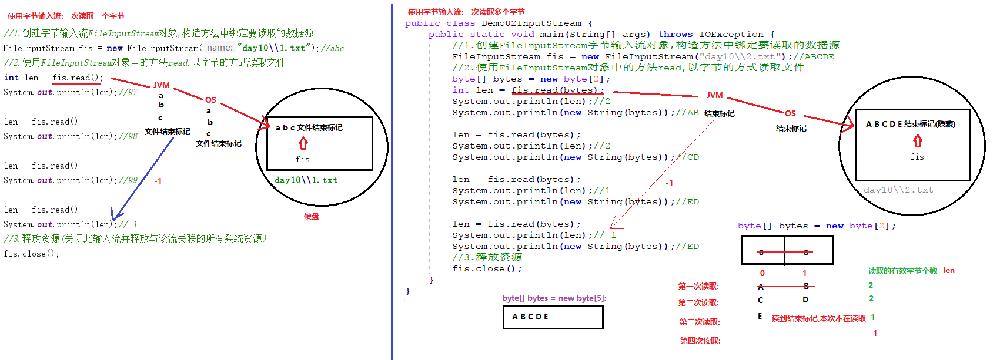

# 学习目标

```java
- 能够说出File对象的创建方式(必须会)
	使用构造方法
	public File(String pathname) ：通过将给定的路径名字符串转换为抽象路径名来创建新的 File实例。  
	public File(String parent, String child) ：从父路径名字符串和子路径名字符串创建新的 File实例。
	public File(File parent, String child) ：从父抽象路径名和子路径名字符串创建新的 File实例。  
- 能够使用File类常用方法(必须会)
	public String getName()  ：获取构造方法中路径的名称(末尾部分)
	public String getAbsolutePath() : 获取构造方法中路径的绝对路径
	public long length()  ：获取文件的大小,单位是字节
	public boolean isDirectory() ：是否为目录(文件夹)。
	public boolean exists() ：判断构造方法中传递的路径是否存在
	public boolean createNewFile() ：当且仅当具有该名称的文件尚不存在时，创建一个新的空文件。
	public boolean mkdir() ：创建单级文件夹
	public boolean mkdirs() ：即可以创建单级文件夹,又可以创建多级文件夹
	public boolean delete() ：删除文件和文件夹,不走回收站
- 能够辨别相对路径和绝对路径(必须会)
	绝对:以盘符开始
	相对:相对当前项目的根目录而言;使用项目的跟目录可以省略书写(不是盘符开始)
	绝对:D:\\Work_idea\\EE132\\day15\\a.txt
	相对:day15\\a.txt
	项目的根目录 D:\\Work_idea\\EE132
	注意:如果绝对路径和项目根目录没有关系,是不能省略使用相对路径书写
		c:\\aafaf\\a.txt  
- 能够遍历文件夹(必须会)
	public String[] list() ：
        遍历构造方法传递的文件夹,获取文件夹中每一个文件|子文件夹的名称,把多个名称存储到一个String类型的数组中返回
    public File[] listFiles() ：返回一个File数组，表示该File目录中的所有的子文件或目录。
        遍历构造方法传递的文件夹,获取文件夹中每一个文件|子文件夹,把文件|子文件夹封装为File对象,多个File对象存储到一个File类型的数组中返回
- 能够解释递归的含义
	方法自己调用自己
- 能够使用递归的方式计算5的阶乘(必须会)
	public static int jc(int n) {//方法的主体不变,每次调用自己参数在发生变化5,4,3,2,1
		//递归结束的条件:获取到1的时候结束
		if(n==1){
			return 1;
		}
		//递归的目的:获取下一个被乘的数字n-1
		return n * jc(n-1);
	}
- 能够说出使用递归会内存溢出隐患的原因
	方法自己调用自己,没有结束条件,栈内存中会有无数多个方法,如果方法过多超出了栈内存是范围就会发生内存溢出
- 能够说出IO流的分类和功能
	输入流:把硬盘上的数据读取到内存中
		字符输入流:读取字符
		字节输入流:读取字节
	输出流:把内存中的数据写入到硬盘中
		字符输出流:写入字符
		字节输出流:写入字节
- 能够使用字节输出流写出数据到文件(必须会)
	1.创建FileOutputStream对象,构造方法中传递写入数据的目的地
  	2.调用FileOutputStream对象中的方法write,把数据写入到文件中
  	3.释放资源
- 能够使用字节输入流读取数据到程序
	1.创建FileInputStream对象,构造方法中绑定要读取的数据源
	FileInputStream fis = new FileInputStream("day15\\a.txt");
	2.FileInputStream对象中的方法read,以字节的方式读取文件
	int len = 0;
	while ((len = fis.read())!=-1){
		System.out.print((char)len);
	}
	3.释放资源
	fis.close();
- 能够理解读取数据read(byte[])方法的原理
	1.read方法的参数byte[]字节数组的作用?
		起到缓冲作用,把读取到的字节依次存储到数组中
		把数组一次性的由操作系统返回给JVM,由JVM返回给java程序,效率高
		数组的长度一般都使用:1024或者1024的整数倍
	2.read方法的返回值int是什么?
		每次读取到的有效字节个数
	FileInputStream fis = new FileInputStream("day15\\a.txt");
	byte[] bytes = new byte[1024];
	int len = 0;
	while ((len = fis.read(bytes))!=-1){
		System.out.print(new String(bytes,0,len));
	}
	fis.close();	
- 能够使用字节流完成文件的复制(一读一写)
	1.创建FileInputStream对象,构造方法中绑定要读取的数据源
	2.创建FileOutputStream对象,构造方法中绑定要写的目的地
	3.使用FileInputStream对象中的方法read,以字节的方式读取文件
	4.使用FileOutputStream对象中的方法write,把读取到的字节写入到文件中
	5.释放资源  	
```

# 第一章 File类

## 1.File类的介绍

```java
java.io.File类
	文件和目录路径名的抽象表示形式。 
	把计算机中的文件和文件夹(目录)封装为了File对象,就可以使用File对象来操作这些文件和文件夹
	我们可以使用File对象创建文件和文件夹
	我们可以使用File对象删除文件和文件夹
	我们可以使用File对象获取文件和文件夹的路径
	我们可以使用File对象获取文件的大小(单位是字节)
    我们可以使用File对象遍历文件夹
记住3个相关的单词:
1.file:文件
2.directory:文件夹(目录)
3.path:路径
```

## 2.路径

```java
路径:表示存储文件和文件夹的路径(位置)
分类:
1.绝对路径:以盘符开始的路径(c:,d:,e:)
    c:\\1.jpg	d:\\aaa\\a.txt	D:\\Work_idea\\EE141\\day10
2.相对路径:相对于当前项目的根目录而言,我们使用路径,可以省略项目的根目录
	项目的根目录:D:\\Work_idea\\EE144
	注意:大家的项目根目录都不同
	a.绝对路径[必须包含项目的根目录]才可以省略
		D:\\Work_idea\\EE144\\day09 可以省略为 day09
		D:\\Work_idea\\EE144\\day10\\a.txt  	可以省略为 day10\\a.txt
		c:\\1.jpg 不能省略   
		1.jpg==> D:\Work_idea\EE144\\1.jpg
		abc\\bbc\\ccc\\abc.java==>D:\\Work_idea\\EE144\\abc\\bbc\\ccc\\abc.java
    b.当我们省略书写项目的根目录,java会在相对路径前默认给添加上	
注意:
	1.路径是不区分大小写的  c:\\1.jpg 等价  C:\\1.jpg
	2.路径中目录的分割的符号\必须的写两个\\,\本身是一个转义字符,必须的写两个代表一个\
	3.路径中目录的分割的符号也可以使用一个正斜杠/  c:\\a.txt 等价  c:/a.txt
```

## 3.File的构造方法(重点)

```java
package com.itheima.demo01FileConstructor;

import java.io.File;

/*
    File的构造方法(重点)
 */
public class Demo01File {
    public static void main(String[] args) {
        //show02("c:\\","aaa\\1.jpg");//c:\aaa\1.jpg
        //show02("d:\\","aaa\\1.jpg");//d:\aaa\1.jpg
        //show02("d:\\","www\\fsadf\\asdfdsaf\\sadfsaf");//d:\www\fsadf\asdfdsaf\sadfsaf
        show03();
    }

    /*
        File(File parent, String child) 根据 parent 抽象路径名和 child 路径名字符串创建一个新 File 实例。
        参数:把路径分成了两部分
            File parent:父路径
           String child:子路径
     */
    private static void show03() {
        File parent = new File("c:\\");
        File file = new File(parent,"a.txt");
        System.out.println(file);//c:\a.txt
    }

    /*
        File(String parent, String child) 根据 parent 路径名字符串和 child 路径名字符串创建一个新 File 实例。
        参数:把路径分成了两部分
           String parent:父路径
           String child:子路径
        好处:
            把路径分成了两部分,使用的时候,父路径和子路径可以分别传递不同的路径
     */
    private static void show02(String parent, String child) {
        File file = new File(parent,child);
        System.out.println(file);
    }

    /*
        File(String pathname) 通过参数传递的路径,创建File对象
        参数:
            String pathname:路径的名称
        注意:
            1.传递的路径可以是相对路径,也可以是绝对路径
            2.传递的路径可以是以文件结尾的,也可以是以文件夹结尾
            3.传递的路径可以是真实存在的,也可以是不存在的(假的)
                构造方法,仅仅是把字符串路径转换为File对象,不考虑路径是真实情况
     */
    private static void show01() {
        File f1 = new File("c:\\aaa\\1.jpg");
        System.out.println(f1);//c:\aaa\1.jpg 不是地址值重写Object类的toString方法

        File f2 = new File("d:\\aaa");
        System.out.println(f2);//d:\aaa

        //D:\Work_idea\EE144\day10\a.txt 等价 day10\a.txt
        File f3 = new File("day10\\a.txt");
        System.out.println(f3);//day10\a.txt
    }
}
```

## 4.File类的成员方法_获取功能的方法(重点)

```java
public String getAbsolutePath() ：返回此File的绝对路径名字符串。
public String getPath() ：将此File转换为路径名字符串。
public String getName() ：返回由此File表示的文件或目录的名称。
public long length() ：返回由此File表示的文件的长度。 不能获取目录的长度
```

```java
package com.itheima.demo02FileMethod;

import java.io.File;

/*
    File类的成员方法_获取功能的方法(重点)
 */
public class Demo01FileMethod {
    public static void main(String[] args) {
        show04();
    }

    /*
        public long length() ：返回由此File表示的文件的长度。 不能获取目录的长度
        返回值:
            可以获取构造方法中传递的文件的大小,单位是字节
        注意:
            1.此方法只能获取文件的大小,不能获取文件夹的大小(文件夹没有大小概念的)
            2.构造方法中传递文件路径不存在,此方法返回0
     */
    private static void show04() {
        File f1 = new File("c:\\1.jpg");
        System.out.println(f1.length());//161,548 字节

        File f2 = new File("day10\\全球通史.txt");
        System.out.println(f2.length());//(5,155,785 字节

        File f3 = new File("day10\\a.txt");
        System.out.println(f3.length());//0 没有a.txt文件

        File f4 = new File("day10");
        System.out.println(f4.length());//0 文件夹是没有大小的
    }

    /*
        public String getName() ：返回由此File表示的文件或目录的名称。
        返回值:
            返回构造方法中传递路径的末尾部分的名字(文件名,文件夹名称)
     */
    private static void show03() {
        File f1 = new File("c:\\aaa\\a.txt");
        System.out.println(f1.getName());//a.txt

        File f2 = new File("D:\\Work_idea\\EE144");
        System.out.println(f2.getName());//EE144

        File f3 = new File("day10\\aaa\\bbb\\ccc");
        System.out.println(f3.getName());//ccc
    }

    /*
        public String getPath() ：将此File转换为路径名字符串。
        返回值:
            获取构造方法中传递的路径
            传递的路径是绝对的,就返回绝对的
            传递的路径是想对的,就返回相对的
        File类重写了Object类的toString方法
        重写的源码:
            public String toString() {
                return getPath();
            }
     */
    private static void show02() {
        File f1 = new File("c:\\aaa\\a.txt");
        System.out.println(f1.getPath());//c:\aaa\a.txt

        File f2 = new File("day10\\a.txt");
        System.out.println(f2.getPath());//day10\a.txt

        System.out.println(f2.toString());//day10\a.txt
        System.out.println(f2);//day10\a.txt
    }

    /*
        Absolute:绝对的
        public String getAbsolutePath() ：返回此File的绝对路径名字符串。
        返回值:
            构造方法中传递的是绝对路径,返回的就是构造方法中传递的绝对路径
            构造方法中传递的是相对路径,会在相对路径前边给我们添加上项目的根目录,把相对路径转换为绝对路径返回
     */
    private static void show01() {
        File f1 = new File("c:\\aaa\\a.txt");
        System.out.println(f1.getAbsolutePath());//c:\aaa\a.txt

        File f2 = new File("day10\\a.txt");
        System.out.println(f2.getAbsolutePath());//D:\Work_idea\EE144\day10\a.txt
    }
}
```

## 5.File类的成员方法_判断功能的方法(重点)

```java
public boolean exists() ：此File表示的文件或目录是否实际存在。
public boolean isDirectory() ：此File表示的是否为目录。
public boolean isFile() ：此File表示的是否为文件。
```

```java
package com.itheima.demo02FileMethod;

import java.io.File;

/*
    File类的成员方法_判断功能的方法(重点)
 */
public class Demo02FileMethod {
    public static void main(String[] args) {
        show02();
    }

    /*
        public boolean isDirectory() 判断构造方法中传递的路径是否以[文件夹]结尾
        返回值:boolean
            是以文件夹结尾,返回true
            不是以文件夹结尾,返回false
        public boolean isFile() 判断构造方法中传递的路径是否以[文件]结尾
        返回值:boolean
            是以文件结尾,返回true
            不是以文件结尾,返回false
        注意:
            1.以上两个方法的使用前提必须是路径是存在的,否则两个方法都返回false
            2.计算机中除了文件就是文件夹,所以两个方法互斥
     */
    private static void show02() {
        File f1 = new File("c:\\dsafasdf.txt");//不存在的路径
        System.out.println(f1.isDirectory());//false
        System.out.println(f1.isFile());//false
        System.out.println("----------------c:\\1.jpg--------------------");
        File f2 = new File("c:\\1.jpg");
        if(f2.exists()){
            System.out.println(f2.isDirectory());//false
            System.out.println(f2.isFile());//true
        }
        System.out.println("----------------day10--------------------");
        File f3 = new File("day10");
        if(f3.exists()){
            System.out.println(f3.isDirectory());//true
            System.out.println(f3.isFile());//false
        }
    }

    /*
        public boolean exists() : 判断构造方法中传递的路径是否存在
        返回值:boolean
            路径存在,返回true
            路径不存在,返回false
     */
    private static void show01() {
        File f1 = new File("c:\\1.jpg");
        System.out.println(f1.exists());//true

        File f2 = new File("c:\\dsafasdf.txt");
        System.out.println(f2.exists());//false

        File f3 = new File("day10\\全球通史.txt");
        System.out.println(f3.exists());//true

        File f4 = new File("day10\\a.txt");
        System.out.println(f4.exists());//false
    }
}
```

## 6.File类的成员方法_创建删除功能的方法(重点)

```java
public boolean createNewFile() ：当且仅当具有该名称的文件尚不存在时，创建一个新的空文件。
public boolean mkdir() ：创建由此File表示的目录。
public boolean mkdirs() ：创建由此File表示的目录，包括任何必需但不存在的父目录。
public boolean delete() ：删除由此File表示的文件或目录。
```

```java
package com.itheima.demo02FileMethod;

import java.io.File;
import java.io.IOException;

/*
    File类的成员方法_创建删除功能的方法(重点)
 */
public class Demo03FileMethod {
    public static void main(String[] args) throws IOException {
        show03();
    }

    /*
        public boolean delete() : 删除构造方法中指定文件夹|文件
        返回值:boolean
            文件|文件夹存在,删除成功,返回true
            文件|文件夹不存在,删除失败,返回false;文件夹不是空的,删除失败,返回false
        注意:
            此删除方法,不走回收站,直接在硬盘删除,删除需要谨慎
     */
    private static void show03() {
        File f1 = new File("d:\\a.txt");
        boolean b1 = f1.delete();
        System.out.println("b1:"+b1);

        File f2 = new File("day10\\aaa");
        boolean b2 = f2.delete();
        System.out.println("b2:"+b2);

        File f3 = new File("day10\\111");
        boolean b3 = f3.delete();
        System.out.println("b3:"+b3);
    }

    /*
        mk: make创建,创造  dir:directory文件夹
        public boolean mkdir() : 此方法用于创建单级文件夹
        public boolean mkdirs() : 此方法既能创建单级文件夹,又能创建多级文件夹
        返回值:boolean
            文件夹不存在,创建文件夹成功,返回true
            文件夹存在,不会创建(覆盖),返回false;构造方法中传递文件夹路径不存在,返回false
        注意:
            1.创建文件夹的路径和名称在构造方法的参数中给出
            2.此方法只能创建文件夹,不能创建文件
     */
    private static void show02() {
        File f1 = new File("day10\\aaa");
        boolean b1 = f1.mkdir();
        System.out.println("b1:"+b1);

        File f2 = new File("day10\\111\\222\\333\\444\\555\\666");
        boolean b2 = f2.mkdirs();
        System.out.println("b2:"+b2);

        File f3 = new File("e:\\abc");
        boolean b3 = f3.mkdir();
        System.out.println("b3:"+b3);//b3:false 路径不存在

        File f4 = new File("day10\\a.txt");
        boolean b4 = f4.mkdir();//1.此方法报错吗? 不会  2.此方法执行结果是什么: 创建一个文件夹名称叫"a.txt"
        System.out.println("b4:"+b4);
    }

    /*
        public boolean createNewFile() 创建一个新的空文件。
        返回值:boolean
            文件不存在,创建文件成功,返回true
            文件存在,不会创建(覆盖),返回false
        注意:
            1.创建文件的路径和名称在构造方法的参数中给出
            2.创建文件的路径不存在,此方法会抛出异常
            3.此方法只能创建文件,不能创建文件夹
            4.有一些操作系统的c盘的根目录是没有权限创建文件的,会抛出拒绝访问异常
     */
    private static void show01() throws IOException {
        File f1 = new File("d:\\a.txt");
        boolean b1 = f1.createNewFile();
        System.out.println("b1:"+b1);

        File f2 = new File("day10\\1.txt");
        boolean b2 = f2.createNewFile();
        System.out.println("b2:"+b2);

        File f3 = new File("e:\\a.txt");
        //boolean b3 = f3.createNewFile();//IOException: 系统找不到指定的路径。

        File f4 = new File("d:\\adsfdsafs\\a.txt");
        //boolean b4 = f4.createNewFile();//IOException: 系统找不到指定的路径。 adsfdsafs文件夹不存在

        File f5 = new File("day10\\新建文件夹");
        boolean b5 = f5.createNewFile();//1.此方法运行会抛出异常吗? 不会 2.程序的执行结果是什么? 创建一个文件名字叫'新建文件夹'
        System.out.println("b5:"+b5);
    }
}
```


## 7.File类的成员方法_目录遍历的方法(重点)

```java
package com.itheima.demo02FileMethod;

import java.io.File;

/*
    File类的成员方法_目录遍历的方法(重点)
    String[] list()
        用于遍历构造方法中传递的目录(文件夹),获取目录中所有文件和文件夹的名称,把多个名称存储到一个String类型的数组中返回
    File[] listFiles()
        用于遍历构造方法中传递的目录(文件夹),获取目录中所有文件和文件夹,
        把文件和文件夹封装为File对象,多个File对象存储到一个File类型的数组中返回
    注意:
        1.以上两个方法只能遍历文件夹,不能遍历文件,会抛出空指针异常
        2.以上两个方法传递的文件夹的路径不存在,也会抛出空指针异常
 */
public class Demo04FileMethod {
    public static void main(String[] args) {
        show02();
    }

    /*
        File[] listFiles()
        用于遍历构造方法中传递的目录(文件夹),获取目录中所有文件和文件夹,
        把文件和文件夹封装为File对象,多个File对象存储到一个File类型的数组中返回
     */
    private static void show02() {
        File file = new File("D:\\base\\20201027EE144\\day10-File类、递归、字节流");
        //File file = new File("D:\\base\\20201027EE144");
        File[] files = file.listFiles();
        if(files!=null && files.length>0){
            for (File f : files) {
                System.out.println(f);
            }
        }
    }

    /*
        String[] list()
            用于遍历构造方法中传递的目录(文件夹),获取目录中所有文件和文件夹的名称,把多个名称存储到一个String类型的数组中返回
     */
    private static void show01() {
        //File file = new File("D:\\afadsfasf");//NullPointerException
        //File file = new File("c:\\a.txt");//NullPointerException
        File file = new File("D:\\base\\20201027EE144\\day10-File类、递归、字节流");
        String[] arr = file.list();
        //在工作中:遍历集合和数组之前,增加判断,防止空指针异常
        if(arr!=null && arr.length>0){
            for (String fileName : arr) {
                System.out.println(fileName);
            }
        }
    }
}
```

# 第二章 递归

## 1.递归的概述

```java
递归:方法自己调用自己
分类:
	1.直接递归
		public void a(){
			a();
		}
	2.间接递归
		public void a(){
			b();
		}
		public void b(){
			a();
		}
 注意事项:
	1.递归必须有结束的条件,保证方法自己调用自己能停止下来,否则会抛出栈内存溢出的错误
	2.递归有结束的条件,但是递归的次数也不能太多了,否则会抛出栈内存溢出的错误
	3.构造方法禁止递归
 什么时候使用递归:
	当我们频繁的调用一个方法,方法的主体不变,方法的参数每次发生变化,就可以使用递归
```

```java
package com.itheima.demo03Recursion;

/*
    递归:方法自己调用自己
 */
public class Demo01Recursion {
    public static void main(String[] args) {
        //a();
        //b(1);
    }

    /*
        3.构造方法禁止递归
     */

    public Demo01Recursion() {
        //Demo01Recursion();
    }

    /*
            11422 | 11402  内存使用率随时在变化
                Exception in thread "main" java.lang.StackOverflowError
         */
    private static void b(int i) {
        System.out.println(i);
        if(i==15000){
            return;//结束方法,不在递归调用
        }
        b(++i);
    }

    /*
        Exception in thread "main" java.lang.StackOverflowError
        栈内存溢出的错误
     */
    private static void a() {
        System.out.println("a方法!");
        a();
    }
}
```


## 2.练习:使用递归计算1-n的和

```java
package com.itheima.demo03Recursion;

/*
    练习:使用递归计算1-n的和
    递归:就是方法自己调用自己,定义一个求和的方法,让方法自己调用自己
 */
public class Demo02Test {
    public static void main(String[] args) {
        int sum = getSum(6);
        System.out.println("sum:"+sum);
    }

    /*
        定义一个求和的方法
        需求:
            计算1-n的和,就是计算n-1的和
        计算公式:
            n+(n-1)+(n-2)+(n-3)+...+1
        已知:
            n:传递的参数 10,100,1000
            1:加到1的时候结束
        未知:
            n-1
        递归的目的:获取下一个被加的数字n-1
        递归的结束条件:获取到1的时候结束
     */
    public static int getSum(int n){
        //递归的结束条件:获取到1的时候结束
        if(n==1){
            return 1;
        }
        //递归的目的:获取下一个被加的数字n-1
        return n+getSum(n-1);
    }
}
```


## 3.练习:递归求阶乘(重点)

```java
package com.itheima.demo02Recursion;

/*
    练习:递归求阶乘(重点)
    n!=n*(n-1)*(n-2)*(n-3)*...1;
    5!=5*4*3*2*1
 */
public class Demo03Test {
    public static void main(String[] args) {
        int jc = jieCheng(5);
        System.out.println(jc);//120
    }

    /*
        递归求阶乘
        公式:
            n!=n*(n-1)*(n-2)*(n-3)*...1;
        已知:
            int n:传递过来的参数  10,100,1000
            1:乘到1结束
        未知:
            n-1
        递归的结束条件:获取到1的时候结束
        递归的目的:获取n-1
        什么时候使用递归:方法调用自己,每次方法的参数改变,方法的主体不变
     */
    private static int jieCheng(int n) {//5,4,3,2,1
        //递归的结束条件:获取到1的时候结束
        if(n==1){
            return 1;
        }
        //递归的目的:获取n-1
        return n * jieCheng(n-1);
    }
}
```

## 4.练习:使用递归遍历文件夹和文件夹中的子文件夹

```java
package com.itheima.demo03Recursion;

import java.io.File;

/*
    练习:使用递归遍历文件夹和文件夹中的子文件夹
    需求:遍历d:\\aaa文件夹及里边的子文件夹
    d:\\aaa
    d:\\aaa\\aaa.java
    d:\\aaa\\aaa.txt
    d:\\aaa\\a
    d:\\aaa\\a\\a.java
    d:\\aaa\\a\\a.jpg
    d:\\aaa\\b
    d:\\aaa\\b\\b.avi
    d:\\aaa\\b\\B.JAVA
 */
public class Demo03Test {
    public static void main(String[] args) {
        File file = new File("d:\\aaa");
        getAllFile(file);
    }

    /*
        定义一个遍历文件夹的方法,参数传递要遍历的文件的File对象
     */
    public static void getAllFile(File dir){
        System.out.println(dir);//打印要遍历的文件夹
        File[] files = dir.listFiles();
        //为了防止空指针异常,增加一个非空判断
        if(files!=null && files.length>0){
            for (File f : files) {
                /*
                    对遍历得到的File对象f进行判断
                    判断f是否为一个文件夹
                 */
                if(f.isDirectory()){
                    //f是一个文件夹,继续遍历文件夹
                    //而getAllFile就是传递文件夹,遍历文件夹的方法
                    //调用getAllFile方法即可,方法自己调用自己==>递归
                    getAllFile(f);
                }else{
                    //f是一个文件,打印文件
                    System.out.println(f);
                }
            }
        }
    }
}
```

## 5.练习:文件搜索

```java
package com.itheima.demo03Recursion;

import java.io.File;

/*
    练习:使用递归遍历文件夹和文件夹中的子文件夹
    需求:遍历d:\\aaa文件夹及里边的子文件夹
    需求:要求最终只打印以.java|.JAVA结尾的文件
    d:\\aaa
    d:\\aaa\\aaa.java
    d:\\aaa\\aaa.txt
    d:\\aaa\\a
    d:\\aaa\\a\\a.java
    d:\\aaa\\a\\a.jpg
    d:\\aaa\\b
    d:\\aaa\\b\\b.avi
    d:\\aaa\\b\\B.JAVA
 */
public class Demo04Test {
    public static void main(String[] args) {
        File file = new File("d:\\aaa");
        getAllFile(file);
    }

    /*
        定义一个遍历文件夹的方法,参数传递要遍历的文件的File对象
     */
    public static void getAllFile(File dir){
        File[] files = dir.listFiles();
        //为了防止空指针异常,增加一个非空判断
        if(files!=null && files.length>0){
            for (File f : files) {
                /*
                    对遍历得到的File对象f进行判断
                    判断f是否为一个文件夹
                 */
                if(f.isDirectory()){
                    //f是一个文件夹,继续遍历文件夹
                    //而getAllFile就是传递文件夹,遍历文件夹的方法
                    //调用getAllFile方法即可,方法自己调用自己==>递归
                    getAllFile(f);
                }else{
                    //f是一个文件,打印文件
                    /*
                        需求:要求最终只打印以.java|.JAVA结尾的文件
                        1.把f这个File对象转换为String
                            a.f.toString();  "d:\\aaa\\aaa.java"  "d:\\aaa\\b\\B.JAVA"
                            b.f.getPath();   "d:\\aaa\\aaa.java"
                            c.f.getName();    "aaa.java"
                        2.把字符串转换为小写字符串
                            "d:\\aaa\\b\\B.JAVA"==>"d:\\aaa\\b\\b.java"
                        3.判断字符串是否以.java结尾
                     */
                    if(f.getName().toLowerCase().endsWith(".java")){
                        System.out.println(f);
                    }
                }
            }
        }
    }
}
```

# 第三章 IO概述

## 1.IO流的概述和分类


## 2.一切皆为字节

**硬盘中的一切文件数据(文本、图片、视频等)在存储时**，都是以二进制数字的形式保存(计算机只能识别0和1)，都一个一个的**字节**(1个字节=8比特位)，那么传输时一样如此。所以，字节流可以传输任意文件数据。在操作流的时候，我们要时刻明确，无论使用什么样的流对象，底层传输的始终为二进制数据(1,0)。

0,1比特位:计算机的最小单位

为了方便把8个0,1组成一个字节:计算机的基本单位

# 第四章 字节流

## 1.字节输出流的介绍(了解)

```java
java.io.OutputStream类:字节输出流
	此抽象类是表示输出字节流的所有类的超类。
	OutputStream类是所有字节输出流的父类,里边定义了所有字节输出流共性成员方法,任意的子类都可以使用
OutputStream类中定义的共性成员方法:
	public void close() ：关闭此输出流并释放与此流相关联的任何系统资源。
    public void flush() ：刷新此输出流并强制任何缓冲的输出字节被写出。
    public void write(byte[] b) ：将 b.length字节从指定的字节数组写入此输出流。
    public void write(byte[] b, int off, int len) ：从指定的字节数组写入 len字节，
        	从偏移量 off开始输出到此输出流。
    public abstract void write(int b) ：将指定的字节输出流
-------------------------------------------------------------------------------------    
java.io.FileOutputStream:文件字节输出流 extends OutputStream:字节输出流
   作用:把内存中数据以字节的方式写入到文件中
   构造方法:
   		FileOutputStream(File file) 创建FileOutputStream对象
   		FileOutputStream(String name) 创建FileOutputStream对象
   		参数:传递写入数据的目的地 d:\\1.txt
   			File file:目的地就是一个文件
   			String name:目的地就是一个文件的路径  
   		构造方法的作用:
        	1.创建FileOutputStream对象
        	2.会根据传递写入数据的目的地,创建一个相关的文件
        	3.会把FileOutputStream对象指向创建好的文件
-------------------------------------------------------------------------------------     
java程序把数据由内存中写入到硬盘中底层步骤:
  	java程序==>JVM==>操作系统==>调用操作系统中写数据的方法==>把数据写入到文件中
```

## 2.字节输出流的基本使用(重点)

```java
package com.itheima.demo04OutputStream;

import java.io.FileNotFoundException;
import java.io.FileOutputStream;
import java.io.IOException;

/*
    字节输出流的基本使用(重点)
    1.创建字节输出流FileOutputStream对象,构造方法中绑定输出的目的地
    2.使用FileOutputStream对象中的方法write,把数据以字节的方式写入到文件中
    3.释放资源(关闭此输出流并释放与此流相关联的任何系统资源)
 */
public class Demo01OutputStream {
    public static void main(String[] args) throws IOException {
        //1.创建字节输出流FileOutputStream对象,构造方法中绑定输出的目的地
        //FileOutputStream fos = new FileOutputStream("e:\\day10\\a.txt");//FileNotFoundException: e:\day10\a.txt (系统找不到指定的路径。)
        FileOutputStream fos = new FileOutputStream("day10\\a.txt");

        //2.使用FileOutputStream对象中的方法write,把数据以字节的方式写入到文件中
        //public abstract void write(int b) 一次写一个字节
        fos.write(97);

        //3.释放资源(关闭此输出流并释放与此流相关联的任何系统资源)
        fos.close();
    }
}
```


## 2.使用记事本打开文件会查询编码表(扩展-面试)


## 3.字节输出流中写多个字节的方法(重点)

```java
package com.itheima.demo04OutputStream;

import java.io.File;
import java.io.FileNotFoundException;
import java.io.FileOutputStream;
import java.io.IOException;
import java.util.Arrays;

/*
    字节输出流中写多个字节的方法(重点)
    public abstract void write(int b) 一次写一个字节
    public void write(byte[] b) 一次写数组中的所有字节
    public void write(byte[] b, int off, int len) 一次写数组中的一部分字节 off:数组的开始索引 len:写的个数
 */
public class Demo02OutputStream {
    public static void main(String[] args) throws IOException {
        //1.创建FileOutputStream对象,构造方法中绑定要写入的目的地
        FileOutputStream fos = new FileOutputStream(new File("day10\\b.txt"));
        //2.使用FileOutputStream对象中的方法write,把数据以字节的方式写入到文件中
        //练习题:想在文件中显示100,一次写一个字节,应该怎么写?
        //fos.write(49);//1
        //fos.write(48);//0
        //fos.write(48);//0
        fos.write('1');
        fos.write('0');
        fos.write('0');

        //public void write(byte[] b) 一次写数组中的所有字节
        byte[] bytes = {65,66,67,68,69,70};
        fos.write(bytes);//ABCDEF

        //public void write(byte[] b, int off, int len) 一次写数组中的一部分字节 off:数组的开始索引 len:写的个数
        //在文件中写数组中的BCD
        fos.write(bytes,1,3);//BCD

        byte[] bytes2 = "你好".getBytes();
        System.out.println(Arrays.toString(bytes2));//[-28, -67, -96, -27, -91, -67] UTF-8编码一个中文字符占用3个字节
        fos.write("你好".getBytes());

        //3.释放资源
        fos.close();
    }
}
```

## 4.字节输出流的续写和换行(重点)

```java
package com.itheima.demo04OutputStream;

import java.io.FileOutputStream;
import java.io.IOException;

/*
    字节输出流的续写和换行(重点)
    1.续写(追加写):使用两个参数的构造方法
        FileOutputStream(File file, boolean append)
        FileOutputStream(String name, boolean append)
        参数:
           File file,String name:传递要写的目的地
           boolean append:续写开关
                true:可以续写,使用构造方法创建对象,如果传递文件名称是一样的,不会创建新的文件覆盖之前的文件,会继续在原文件的末尾写数据
                false:不可以续写,使用构造方法创建对象,如果传递文件名称是一样的,会创建一个新的空白文件覆盖之前的文件,在新的文件中写数据
           使用一个参数的构造方法,默认就是false,不可以续写
    2.换行:可以使用换行符号
        Windows系统里，每行结尾是 回车+换行 ，即 \r\n
        Unix|Linux系统里，每行结尾只有 换行 ，即 \n
        Mac系统里，每行结尾是 回车 ，即 \r 。从 Mac OS X开始与Linux统一。
 */
public class Demo03OutputStream {
    public static void main(String[] args) throws IOException {
        //1.创建FileOutputStream对象,构造方法中绑定要输出的目的地和续写开关
        FileOutputStream fos = new FileOutputStream("day10\\c.txt",true);
        //2.使用FileOutputStream对象中的方法write,把数据以字节的方式写到文件中
        for (int i = 1; i <= 10; i++) {
            fos.write(("你好"+i+"\r\n").getBytes());
        }
        //3.释放资源
        fos.close();
    }
}
```

## 5.字节输入流的介绍(了解)

```java
java.io.InputStream:字节输入流
	此抽象类是表示字节输入流的所有类的超类。
	InputStream是所有字节输入流的父类,里边定义所有字节输入流中共性的成员方法,任意的字节输入流都可以使用
共性的成员方法:
	int read()  一次读文件中的一个字节并返回
	int read(byte[] b)  一次读取文件中的多个字节存储到数组中
	void close() 关闭此输入流并释放与该流关联的所有系统资源。 
java.io.FileInputStream:文件字节输入流 extends InputStream:字节输入流
作用:可以把文件中的数据,以字节的方式读取到内存中
构造方法:
	FileInputStream(File file) 创建FileInputStream对象
    FileInputStream(String name) 创建FileInputStream对象
    参数:传递要读取的数据源
		File file:数据源就是一个文件
		String name:数据源是一个文件路径
	构造方法的作用:
		1.创建FileInputStream对象
		2.会把创建FileInputStream对象指向要读取文件的第一个字节
	注意:如果传递的文件|文件路径不存在,那么创建流对象会抛出文件找不到异常
使用java程序读取文件的底层过程:
	java程序==>JVM==>操作系统==>调用操作系统读取文件的方法==>把数据读取到内存中
```

## 6.字节输入流的基本使用:一次读取一个字节(重点)

```java
package com.itheima.demo05InputStream;

import java.io.FileInputStream;
import java.io.IOException;

/*
    字节输入流的基本使用:一次读取一个字节(重点)
    int read()  一次读文件中的一个字节并返回
    实现步骤:
        1.创建字节输入流FileInputStream对象,构造方法中绑定要读取的数据源
        2.使用FileInputStream对象中的方法read,以字节的方式读取文件
        3.释放资源(关闭此输入流并释放与该流关联的所有系统资源)
 */
public class Demo01InputStream {
    public static void main(String[] args) throws IOException {
        //1.创建字节输入流FileInputStream对象,构造方法中绑定要读取的数据源
        FileInputStream fis = new FileInputStream("day10\\1.txt");//abc
        //2.使用FileInputStream对象中的方法read,以字节的方式读取文件
        /*
            我们发现使用read方法读取文件,是一个重复的过程
            可以使用循环优化,我们不知道文件中有多少数据
            使用while循环,循环结束的条件read方法返回-1
            循环中的布尔表达式:((len=fis.read())!=-1)
            1.fis.read():读取一个字节
            2.len=fis.read():把读取到的字节赋值给变量len
            3.(len=fis.read())!=-1:判断变量len是否为-1
                不是-1:打印len(读取到的字节)
                是-1:结束循环
         */
        int len = 0;
        while ((len=fis.read())!=-1){
            System.out.print((char)len);
        }

        //3.释放资源(关闭此输入流并释放与该流关联的所有系统资源)
        fis.close();

        /*
            int len = fis.read();
            System.out.println(len);//97

            len = fis.read();
            System.out.println(len);//98

            len = fis.read();
            System.out.println(len);//99

            len = fis.read();
            System.out.println(len);//-1
         */
    }
}
```

```java
public class Demo01InputStream {
    public static void main(String[] args) throws IOException {
        //1.创建字节输入流FileInputStream对象,构造方法中绑定要读取的数据源
        FileInputStream fis = new FileInputStream("day10\\1.txt");//abc
        //2.使用FileInputStream对象中的方法read,以字节的方式读取文件
        int len = 0;
        while ((len=fis.read())!=-1){
            System.out.print((char)len);
        }

        //3.释放资源(关闭此输入流并释放与该流关联的所有系统资源)
        fis.close();
    }
}
```

## 7.使用字节输入流一次读取多个字节(重点)

```java
package com.itheima.demo05InputStream;

import java.io.FileInputStream;
import java.io.FileNotFoundException;
import java.io.IOException;
import java.util.Arrays;

/*
    使用字节输入流一次读取多个字节(重点)
    int read(byte[] b)  一次读取文件中的多个字节存储到数组中
    明确两件事情:
        1.read方法的参数byte[]数组是干什么用的?
            存储每次读取多个字节,一般定义数组长度为1024,或者1024的整数倍
        2.read方法的返回值int是什么?
            每次读取的有效字节个数
    ----------------------------------------------------
    String类的构造方法:
        String(byte[] bytes) 查询编码表把字节数组转换为字符串
        String(byte[] bytes, int offset, int length) 查询编码表把字节数组的一部分转换为字符串
            参数:
                int offset:开始转换的索引
                int length:转换的字节个数
 */
public class Demo02InputStream {
    public static void main(String[] args) throws IOException {
        //1.创建FileInputStream字节输入流对象,构造方法中绑定要读取的数据源
        FileInputStream fis = new FileInputStream("day10\\2.txt");//ABCDE
        //2.使用FileInputStream对象中的方法read,以字节的方式读取文件
        //int read(byte[] b)  一次读取文件中的多个字节存储到数组中
        /*
            我们发现使用read(bytes)读取数据是一个重复的过程
            所以我们可以使用循环优化,不知道文件有多少字节,使用while循环
            while循环结束的条件read方法返回-1
         */
        byte[] bytes = new byte[1024];
        int len= 0;
        while ((len=fis.read(bytes))!=-1){
            //System.out.println(Arrays.toString(bytes));
            System.out.println(new String(bytes,0,len));
        }
        //3.释放资源
        fis.close();

        /*
            byte[] bytes = new byte[2];
            int len = fis.read(bytes);
            System.out.println(len);//2
            //System.out.println(Arrays.toString(bytes));//[65, 66]
            System.out.println(new String(bytes));//AB

            len = fis.read(bytes);
            System.out.println(len);//2
            System.out.println(new String(bytes));//CD

            len = fis.read(bytes);
            System.out.println(len);//1
            System.out.println(new String(bytes));//ED

            len = fis.read(bytes);
            System.out.println(len);//-1
            System.out.println(new String(bytes));//ED
         */
    }
}
```

```java
public class Demo02InputStream {
    public static void main(String[] args) throws IOException {
        //1.创建FileInputStream字节输入流对象,构造方法中绑定要读取的数据源
        FileInputStream fis = new FileInputStream("day10\\2.txt");//ABCDE
        //2.使用FileInputStream对象中的方法read,以字节的方式读取文件
        byte[] bytes = new byte[1024];
        int len= 0;
        while ((len=fis.read(bytes))!=-1){
            System.out.println(new String(bytes,0,len));
        }
        //3.释放资源
        fis.close();
    }
}
```

**文件读取的原理:**



**注意:new String的时候不要导包,默认的第一个不是lang包中的String**


## 8.文件复制(重点)

### 原理:


### 代码实现:

```java
package com.itheima.demo06copyFile;

import java.io.FileInputStream;
import java.io.FileOutputStream;
import java.io.IOException;

/*
    文件复制(重点)
    明确:
        数据源: c:\\1.jpg
        目的地: d:\\1.jpg
    文件复制的步骤:
        1.创建字节输入流FileInputStream对象,构造方法中绑定要读取的数据源
        2.创建字节输出流FileOutputStream对象,构造方法中绑定要写入的目的地
        3.使用FileInputStream对象中的方法read,以字节的方式读取文件
        4.使用FileOutputStream对象中的方法write,把读取到的字节写入到文件中
        5.释放资源(先开后关)
 */
public class Demo01CopyFile {
    public static void main(String[] args) throws IOException {
        long s = System.currentTimeMillis();
        //copyFile01();
        copyFile02();
        long e = System.currentTimeMillis();
        System.out.println("复制文件共耗时:"+(e-s)+"毫秒");
    }

    /*
        需求:使用字节输入流一次读取多个字节,使用字节输出流一次写多个字节赋值文件
        要复制的文件:
            c:\\1.jpg==>161,548 字节==>复制文件共耗时:8毫秒
            c:\\全球通史.txt==>5,155,785 字节==>复制文件共耗时:136毫秒
            c:\\748m.rar==>785,042,177 字节
     */
    private static void copyFile02() throws IOException {
        //1.创建字节输入流FileInputStream对象,构造方法中绑定要读取的数据源
        FileInputStream fis = new FileInputStream("c:\\748m.rar");
        //2.创建字节输出流FileOutputStream对象,构造方法中绑定要写入的目的地
        FileOutputStream fos = new FileOutputStream("d:\\748m.rar");
        //3.使用FileInputStream对象中的方法read,以字节的方式读取文件
        byte[] bytes = new byte[1024*200];
        int len = 0;
        while ((len=fis.read(bytes))!=-1){
            //4.使用FileOutputStream对象中的方法write,把读取到的字节写入到文件中
            fos.write(bytes,0,len);//写每次读取的有效字节个数,最后一次读取的字节不一定是1024个
        }
        //5.释放资源(先开后关)
        fos.close();
        fis.close();
    }

    /*
        需求:
            使用字节输入流一次读取一个字节,使用字节输出流一次写一个字节复制文件
        要复制的文件:
            c:\\1.jpg==>161,548 字节==>复制文件共耗时:1894毫秒
            c:\\全球通史.txt==>5,155,785 字节==>复制文件共耗时:37537毫秒
     */
    private static void copyFil01() throws IOException {
        //1.创建字节输入流FileInputStream对象,构造方法中绑定要读取的数据源
        FileInputStream fis = new FileInputStream("c:\\全球通史.txt");
        //2.创建字节输出流FileOutputStream对象,构造方法中绑定要写入的目的地
        FileOutputStream fos = new FileOutputStream("d:\\全球通史.txt");
        //一读一写复制文件
        //3.使用FileInputStream对象中的方法read,以字节的方式读取文件
        int len = 0;
        while ((len=fis.read())!=-1){
            //4.使用FileOutputStream对象中的方法write,把读取到的字节写入到文件中
            fos.write(len);
        }
        //5.释放资源(先开后关)
        fos.close();
        fis.close();
    }
}
```

注意:流对象的参数只能是文件,不能是文件夹


## 经验值分享

### 1.已知的文件复制代码

```java
import java.io.FileInputStream;
import java.io.FileNotFoundException;
import java.io.FileOutputStream;
import java.io.IOException;

public class Test_文件复制 {
    public static void main(String[] args) throws IOException {
        //创建输入流
        FileInputStream fis = new FileInputStream("day13\\123.jpg");
        //创建输出流
        FileOutputStream fos = new FileOutputStream("day13\\复制.jpg");

        //一次读取多个字节
        byte[] bytes = new byte[1024];
        int len;
        while((len=fis.read(bytes)) != -1){
            //一次写出多个字节
            fos.write(len);
        }

        //关流
        fos.close();
        fis.close();
    }
}
```

### 2.出现的问题

源文件“123.jpg”的大小：

​	                             

目标文件“复制.jpg”的大小：


### 3.问题的分析

​	read()方法每次读取1024个字节存放在数组中，返回的是实际读取到的字节个数len(一个整数)。

​	在write()输出方法中，写的是len，也就是说每次输出的是一个整数。

​	源文件共13465字节，需要循环读取14次，所以如上代码写出到文件中的是14个字节。并没有输出实际读取

到的数组内容，所以文件复制错误。


### 4.问题的解决办法

​	在输出数据时应该写的是:

```java
fos.write(bytes,0,len);
```

​	bytes中存放的是读取到的字节内容， 0 代表从数组的0索引开始输出，len代表本次输出的字节个数。

​	总结：

​	数组是文件复制时字节的容器，读取时把字节读取到数组中，并记录读取到的字节个数，输出时把数组中指定个数的字节输出，最终完成文件的复制。

