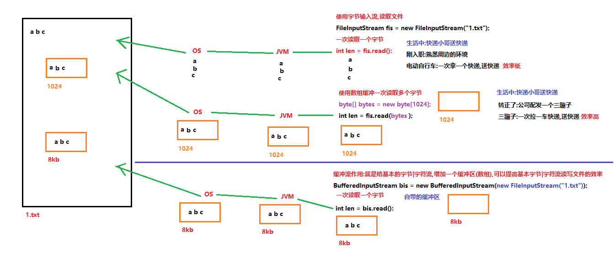
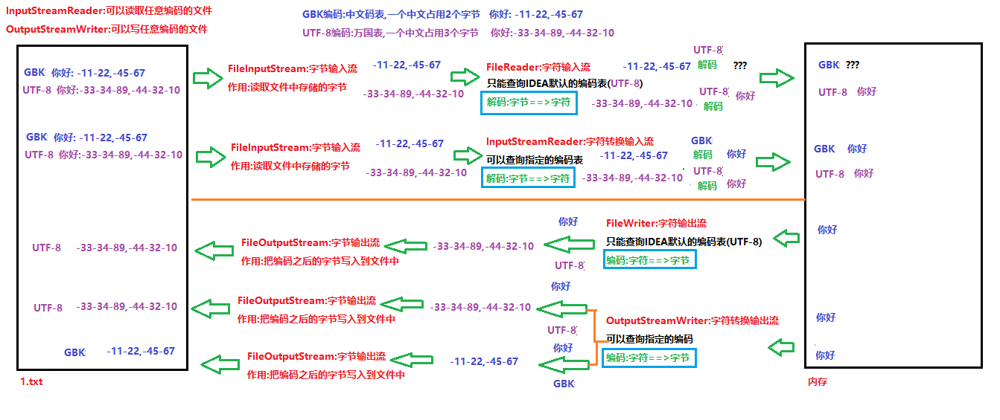
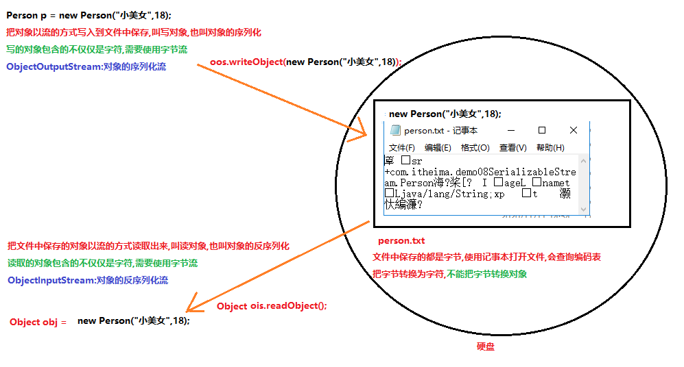
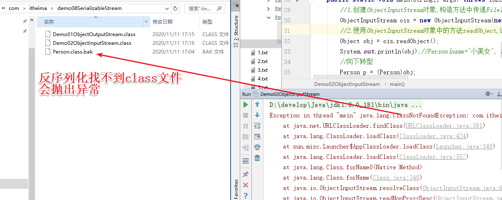
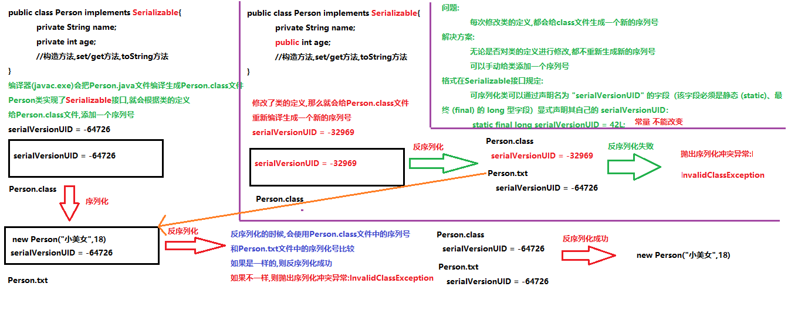

# 学习目标

```java
- 能够使用FileWriter写数据的5个方法
	- public void write(int c) ：写出一个字符。
	- public void write(char[] cbuf) 写字符数组中的多个字符
	- public abstract void write(char[] b, int off, int len) 写字符数组的一部分
	- public void write(String str) ：写出一个字符串。
	- void write(String str, int off, int len) 写入字符串的某一部分。
- 能够说出FileWriter中关闭和刷新方法的区别
	- flush ：刷新缓冲区，把内存缓冲区中的数据刷新到文件中,刷新完后,流对象可以继续使用。
	- close ：关闭流，释放系统资源。关闭前会刷新缓冲区。把内存缓冲区中的数据刷新到文件中,流关闭之后就不能在使用了
- 能够使用FileWriter写数据实现换行和追加写
	1.续写(追加写):使用两个参数的构造方法
		FileWriter(File file, boolean append)
		FileWriter(String fileName, boolean append)
	2.换行:使用换行符号
		windows:\r\n
		linux: \n
		mac: \r  从Mac OS X开始与linux统一		
- 能够使用FileReader读数据一次一个字符
	//1.创建FileReader对象,构造方法中绑定要读取的数据源
	FileReader fr = new FileReader("day15\\c.txt");
	//2.使用FileReader对象中的方法read,以字符的方式读取文件
	//public int read() 一次读取一个字符并返回
	int len = 0;
	while ((len = fr.read())!=-1){
		System.out.print((char)len);
	}
	//3.释放资源
	fr.close();
- 能够使用FileReader读数据一次一个字符数组
	//1.创建FileReader对象,构造方法中绑定要读取的数据源
	FileReader fr = new FileReader("day15\\c.txt");
	//2.使用FileReader对象中的方法read,以字符的方式读取文件
	//public int read() 一次读取一个字符并返回
	char[] chars = new char[1024];
	int len = 0;
	while ((len =fr.read(chars))!=-1){
		System.out.println(new String(chars,0,len));
	}
	//3.释放资源
	fr.close();
- 能够使用Properties的load方法加载文件中配置信息(必须会)
	//1.创建Properties集合对象
	Properties prop = new Properties();
	//2.使用Properties集合对象中的方法load,把硬盘中保存键值对的文件,读取到内存中使用
	//prop.load(new FileInputStream("day21\\prop.properties"));
	prop.load(new FileReader("day21\\prop.properties"));
	//3.遍历Properties集合
	Set<String> set = prop.stringPropertyNames();
	for (String key : set) {
		String value = prop.getProperty(key);
		System.out.println(key+"\t"+value);
	}
- 能够使用字节缓冲流读取数据到程序(必须会)
	1.创建BufferedInputStream对象,构造方法中传递FileInputStream对象
	2.使用BufferedInputStream对象中的方法read,以字节的方式读取文件
	3.释放资源
- 能够使用字节缓冲流写出数据到文件(必须会)
	1.创建BufferedOutputStream对象,构造方法中传递FileOutputStream对象
	2.使用BufferedOutputStream对象中的方法write,把数据以字节的方式写入到内存缓冲区中
	3.使用BufferedOutputStream对象中的方法flush,把内存缓冲区中的数据刷新到文件中
	4.释放资源
- 能够明确字符缓冲流的作用和基本用法(必须会)
	1.创建BufferedReader对象,构造方法中传递FileReader对象
	2.使用BufferedReader对象中的方法read|readLine,以字符的方式读取文件
	3.释放资源
	
	1.创建BufferedWriter对象,构造方法中传递FileWriter对象
	2.使用BufferedWriter对象中的方法write,把数据写到内存缓冲区中
	3.使用BufferedWriter对象中的方法flush,把内存缓冲区中的数据刷新到文件中
	4.释放资源(会先调用flush方法刷新数据)
- 能够使用缓冲流的特殊功能(必须会)
	BufferedReader:String readLine() 读取一个文本行。
	BufferedWriter:void newLine() 写入一个行分隔符。写换行,会根据系统的不同写不同的换行符号
- 能够阐述编码表的意义(记住)
	//编码表就是一个生活中文字和计算机存储字节的一个对应关系表
	ASCII: 0:48  A:65 a:97
	GBK:中文码表,一个中文占用2个字节
	UTF-8:万国表,一个中文占用3个字节
	编码:字符转换为字节(生活中的文字==>计算机存储的)
	解码:字节转换为字符(计算机存储==>生活中的)
- 能够使用转换流读取指定编码的文本文件(必须会)
	1.创建InputStreamReader对象,构造方法中传递FileInputStream对象和指定的编码表名称
	2.使用InputStreamReader对象中的方法read,以字符的形式读取文件
	3.释放资源
- 能够使用转换流写入指定编码的文本文件(必须会)
	1.创建OutputStreamWriter对象,构造方法中传递FileOutputStream对象和指定的编码表名称
	2.使用OutputStreamWriter对象中方法write,把数据写入到内存缓冲区中
	3.使用OutputStreamWriter对象中方法flush,把内存缓冲区中的数据刷新到文件中
	4.释放资源(会先调用flush方法刷新数据)
- 能够使用序列化流写出对象到文件(必须会)
	1.创建ObjectOutputStream对象,构造方法中传递FileOutputStream对象
	2.使用ObjectOutputStream对象中的方法writeObject,把对象写入到文件中保存
	3.释放资源
- 能够使用反序列化流读取文件到程序中(必须会)
	1.创建ObjectInputStream对象,构造方法中传递FileInputStream对象
	2.使用ObjectInputStream对象中方法readObject,读取文件中保存的对象
	3.释放资源
```

# 第一章 字符流

## 1.使用字节输入流读取含有中文的文件

```java
package com.itheima.demo01Reader;

import java.io.FileInputStream;
import java.io.FileNotFoundException;
import java.io.IOException;

/*
    使用字节输入流读取含有中文的文件
    文件的编码UTF-8:一个中文占用3个字节
    文件的编码GBK:一个中文占用2个字节
 */
public class Demo01FileInputStream {
    public static void main(String[] args) throws IOException {
        FileInputStream fis = new FileInputStream("day11\\1.txt");
        int len = 0;
        while ((len = fis.read())!=-1){
            System.out.print((char)len);//你好a1 一次读取1个字节,把中文的1/3转换为字符,在编码表查询不到,出现异常
        }
        fis.close();
    }
}
```

## 2.字符输入流介绍

```java
java.io.Reader:字符输入流
	用于读取字符流的抽象类。
	是所有字符输入流最顶层的父类,里边定义了所有字符输入流共性的成员方法,所有的字符输入流都可以使用
共性的成员方法:
	int read() 读取单个字符。
	int read(char[] cbuf) 将字符读入数组。
	void close() 关闭该流并释放与之关联的所有资源。
java.io.FileReader:文件字符输入流 extends InputStreamReader(转换流) extends Reader
作用:
	把文件中的数据以字符的方式读取到内存中
构造方法:
	FileReader(String fileName)
	FileReader(File file) 
	参数:传递要读取的数据源
	   String fileName:数据源就是一个文件路径
	   File file:数据源就是一个文件 
```

## 3.使用字符输入流读取文件的步骤(重点)

```java
package com.itheima.demo01Reader;

import java.io.FileReader;
import java.io.IOException;

/*
    使用字符输入流读取文件的步骤(重点)
    1.创建文件字符输入流FileReader对象,构造方法中绑定要读取的数据源
    2.使用FileReader对象中的方法read,以字符的方式读取文件
    3.释放资源
    ---------------------------------------------
    String类的构造方法:
        String(char[] value) 把字符数组转换为字符串
        String(char[] value, int offset, int count) 把字符数组的一部分转换为字符串
 */
public class Demo02Reader {
    public static void main(String[] args) throws IOException {
        //1.创建文件字符输入流FileReader对象,构造方法中绑定要读取的数据源
        FileReader fr = new FileReader("day11\\1.txt");
        //2.使用FileReader对象中的方法read,以字符的方式读取文件
        //int read() 读取单个字符。
        /*int len = 0;
        while ((len=fr.read())!=-1){
            System.out.print((char)len);//你好a1
        }*/

        //int read(char[] cbuf) 将字符读入数组。
        char[] chars = new char[1024];
        int len = 0;
        while ((len = fr.read(chars))!=-1){
            System.out.println(new String(chars,0,len));//你好a1
        }

        //3.释放资源
        fr.close();
    }
}
```

## 4.字符输出流介绍

```java
java.io.Writer:字符输出流
	写入字符流的抽象类。
	是所有字符输出流最顶层的父类,里边定义了所有字符输出流中共性的成员方法,所有字符输出流都可以使用
共性的成员方法:
	public abstract void close() ：关闭此输出流并释放与此流相关联的任何系统资源。
	public abstract void flush() ：刷新此输出流并强制任何缓冲的输出字符被写出。
	public void write(int c) ：写出一个字符。
	public void write(char[] cbuf) ：将 b.length字符从指定的字符数组写出此输出流。
	public abstract void write(char[] b, int off, int len) ：从指定的字符数组写出 len字符，从偏移量 off开始输出到此输出流。
	public void write(String str) ：写出一个字符串
	public void write(String str, int off, int len) 写入字符串的某一部分。
java.io.FileWriter:文件字符输出流 extends OutputStreamWriter(转换流)  extends Writer
作用:
	把内存中的数据,以字符的方式写入到文件中
构造方法:
	FileWriter(File file)
	FileWriter(String fileName)
	参数:传递写入的目的地
		 String fileName:目的地是一个文件的路径
		 File file:目的地是一个文件
	一个参数构造方法的作用:
		1.会创建FileWriter对象
		2.会根据构造方法中传递的文件|文件的路径,创建一个新的空白的文件
		3.会把FileWriter对象,执向空白的文件
```

## 5.使用字符输出流基本步骤(重点)

```java
package com.itheima.demo02Writer;

import java.io.FileWriter;
import java.io.IOException;

/*
    使用字符输出流基本步骤(重点)
    1.创建字符输出流FileWriter对象,构造方法中绑定要输出目的地
    2.使用FileWriter对象中的方法write,把数据以字符的方式写入到内存缓冲区中
    3.使用FileWriter对象中的方法flush,把内存缓冲区中的数据刷新到文件中
    4.释放资源(在释放资源之前,先调用flush方法,把内存缓冲区中的数据刷新到文件中)
 */
public class Demo01FileWriter {
    public static void main(String[] args) throws IOException {
        //1.创建字符输出流FileWriter对象,构造方法中绑定要输出目的地
        FileWriter fw = new FileWriter("day11\\2.txt");
        //2.使用FileWriter对象中的方法write,把数据以字符的方式写入到内存缓冲区中
        fw.write(97);
        //3.使用FileWriter对象中的方法flush,把内存缓冲区中的数据刷新到文件中
        //fw.flush();
        //4.释放资源(在释放资源之前,先调用flush方法,把内存缓冲区中的数据刷新到文件中)
        fw.close();
    }
}
```

## 6.关闭和刷新的区别(面试)

- flush:把内存缓冲区中的数据刷新到文件中,刷新完之后,流对象可以继续使用
- close:释放资源(释放流相关的所有的系统资源和流对象),在释放资源之前,把内存缓冲区中的数据刷新到文件中
          刷新完之后,流对象就已经关闭了,就不能在使用了

```java
package com.itheima.demo02Writer;

import java.io.FileWriter;
import java.io.IOException;

/*
    关闭和刷新的区别(面试)
    1.程序的运行有异常吗? 有
    2.3.txt文件中有没有数据? 中国
 */
public class Demo02FileWriter {
    public static void main(String[] args) throws IOException {
        FileWriter fw = new FileWriter("day11\\3.txt");
        fw.write("中");
        fw.flush();//把内存缓冲区中的数据刷新到文件中,刷新完之后流可以继续使用
        fw.write("国");
        fw.close();//在释放资源之前,先把内存缓冲区中的数据刷新到文件中,刷新完之后会释放资源,释放资源之后流就关闭了,就不能在使用了
        fw.write("人");//IOException: Stream closed
    }
}
```

## 7.字符输出流写数据的其他方法(重点)

```java
package com.itheima.demo02FileWriter;

import java.io.FileWriter;
import java.io.IOException;

/*
    字符输出流写数据的其他方法(重点)
    public void write(int c) ：写出一个字符。
	public void write(char[] cbuf) ：写字符数组中的所有字符
	public abstract void write(char[] b, int off, int len) ：写字符数组中的一部分,off:数组的开始索引,len:写的字符个数
	public void write(String str) ：写出一个字符串
	public void write(String str, int off, int len) 写入字符串的某一部分。off:字符串的开始索引,len:写的字符个数
 */
public class Demo03FileWriter {
    public static void main(String[] args) throws IOException {
        FileWriter fw = new FileWriter("day14\\4.txt");

        //public void write(int c) ：写出一个字符。
        fw.write('a');//a

        //public void write(char[] cbuf) ：写字符数组中的所有字符
        char[] chars = {'A','B','C','1','2','3','你','好','$','@'};
        fw.write(chars);//ABC123你好$@

        //public abstract void write(char[] b, int off, int len) ：写字符数组中的一部分,off:数组的开始索引,len:写的字符个数
        fw.write(chars,3,3);//123

        //public void write(String str) ：写出一个字符串
        fw.write("你若安好,便是晴天!");//你若安好,便是晴天!

        //public void write(String str, int off, int len) 写入字符串的某一部分。off:字符串的开始索引,len:写的字符个数
        fw.write("你若安好,便是晴天!",0,4);//你若安好

        fw.close();

    }
}
```

## 8.字符输出流的续写和换行(重点)

```java
字符输出流的续写和换行(重点):和字节流一样
1.续写(追加写):使用两个参数的构造方法
	FileWriter(String fileName, boolean append)
	FileWriter(File file, boolean append)
	参数:
		File file|String fileName:写入数据的目的地
		boolean append:续写的开关
			true:可以续写,使用构造方法创建对象,文件名相同,不会创建新的文件覆盖之前同名的文件,会继续往文件的末尾写数据
			false:不可以续写,使用构造方法创建对象,文件名相同,会创建一个新的空白文件覆盖之前同名的文件,在新的文件中写数据
2.换行:使用换行符号
	Windows系统里，每行结尾是 回车+换行 ，即 \r\n
	linux,Unix系统里，每行结尾只有 换行 ，即 \n
	Mac系统里，每行结尾是 回车 ，即 \r 。从 Mac OS X开始与Linux统一。
```

```java
package com.itheima.demo02Writer;

import java.io.FileWriter;
import java.io.IOException;

/*
    字符输出流的续写和换行(重点)
 */
public class Demo04FileWriter {
    public static void main(String[] args) throws IOException {
        //创建FileWriter对象,构造方法中绑定要输出的目的地和续写开关
        FileWriter fw = new FileWriter("day11\\4.txt",true);
        //使用FileWriter对象中的方法write,把数据写入到内存缓冲区中
        for (int i = 1; i <= 20; i++) {
            fw.write("hello"+i+"\r\n");
        }
        //释放资源(会先调用flush方法刷新数据)
        fw.close();
    }
}
```

## 字符流和字节流的区别

1.**字节流**读取的和写入都是**字节**;**字符流**读取的和写入的都是**字符**

2.所有的数据(文本,音乐,视频,图片...),都是以字节的方式存储的,**使用字节流可以读写任意的文件**

3.使用字节流读取的文件中包含中文,如果一次读取一个字节(1/2GBK,1/3UTF-8个中文),使用起来不方便,可能会出现乱码

4.**使用字符流读取含有中文文本文件**,一次读取一个字符(中文,英文,数字,符号...),使用起来很方便

什么时候使用字符流:读写**文本文件**(使用记事本打开能看懂)

什么时候使用字节流:读写**非文本文件**(图片,视频,音频...)

# 第二章 IO资源的处理(重点)

## 1.JDK7前异常处理

```java
package com.itheima.demo03tryCatch;

import java.io.FileWriter;
import java.io.IOException;

/*
    JDK7前异常处理:使用try...catch...finally
    格式:
        try{
            //可能产生异常的代码(没有异常的代码)
        }catch(异常相关的变量){
            //异常的处理逻辑(随便写)
        }
        ...
        catch(异常相关的变量){
            //异常的处理逻辑(随便写)
        }finally{
            //一定会执行的代码(资源释放)
        }
 */
public class Demo01JDK17Before {
    public static void main(String[] args) {
        /*
            1.把fw.close();放在finally中,报以下错误
                Cannot resolve symbol 'fw'
              变量的作用域在变量所在的{}范围内有效,fw只在try中有效
              提高变量的作用域,把fw变量定义在try的外边
           2.Variable 'fw' might not have been initialized  变量没有一个初始化的值
               fw = new FileWriter("day14\\5.txt",true); 创建对象如果抛出异常
               变量fw没有值的,就不能使用fw调用方法
               给fw赋一个默认值
         */
        FileWriter fw = null;
        try {
            //可能产生异常的代码(没有异常的代码)
            fw = new FileWriter("e:\\day14\\5.txt",true);
            for (int i = 1; i <= 10; i++) {
                fw.write("你好"+i+"\r\n");
            }

        } catch (IOException e) {
            //异常的处理逻辑(随便写)
            e.printStackTrace();
        } finally {
            //一定会执行的代码(资源释放)
            //增加一个判断,fw不是null在释放资源
            if(fw!=null){
                //3.close方法本身有异常,需要放在try中
                try {
                    fw.close();
                } catch (IOException e) {
                    e.printStackTrace();
                }
            }
        }

        System.out.println("后续代码!");
    }
}
```

## 2.JDK7后异常处理

```java
package com.itheima.demo03tryCatch;

import java.io.FileInputStream;
import java.io.FileOutputStream;
import java.io.FileWriter;
import java.io.IOException;
import java.util.ArrayList;

/*
    JDK7后异常处理
    在JDK7以后,可以在try关键字的后边添加上一个小括号()
    在小括号中()可以定义流对象,这样流对象的作用域就在try中有效
    使用完流对象,会帮助我们自动的释放资源,就可以省略finally关键字
    格式:
        try(
            //定义流对象
            AAA aaa = new AAA();
            BBB bbb = new BBB();
        ){
            aaa.read();
            bbb.write();
        }catch(异常相关的变量){
            //异常的处理逻辑(随便写)
        }
        ...
        catch(异常相关的变量){
            //异常的处理逻辑(随便写)
        }
   注意:
    try后边的小括号中不是所有的对象都可以放,对象所在的类必须实现AutoCloseable接口,才可以自动释放资源
 */
public class Demo02JDK7After {
    public static void main(String[] args) {
        try(
            FileWriter fw = new FileWriter("day11\\5.txt",true);
        ) {
            for (int i = 1; i <= 20; i++) {
                fw.write("hello"+i+"\r\n");
            }
        } catch (IOException e) {
            e.printStackTrace();
        }

        try(FileInputStream fis = new FileInputStream("c:\\1.jpg");
            FileOutputStream fos = new FileOutputStream("d:\\1.jpg");
        ) {
            byte[] bytes = new byte[1024];
            int len = 0;
            while ((len = fis.read(bytes))!=-1){
                fos.write(bytes,0,len);
            }
        } catch (IOException e) {
            e.printStackTrace();
        }
    }
}
```

# 第三章 Properties集合

## 1.Properties集合的基本使用

```java
package com.itheima.demo04Properties;

import java.util.Properties;
import java.util.Set;

/*
    java.util.Properties集合 extends Hashtable<K,V>集合
    1.Properties 类表示了一个持久的属性集。Properties 可保存在流中或从流中加载。
       Properties集合是一个和IO流想结合的集合
       我们使用Properties集合中的方法store,把集合中的数据写入到硬盘中保存(内存==>硬盘)
       我们使用Properties集合中的方法load,把硬盘中保存的键值对读取到集合中使用(硬盘==>内存)
    2.属性列表中每个键及其对应值都是一个字符串。
       Properties集合是一个双列集合,键与值默认都是String类型,不需要写泛型
    Properties集合的基本使用:会使用集合存储数据,会遍历集合获取集合中元素
       Properties集合键与值默认都String类型,有一些操作String特有的方法
       Object setProperty(String key, String value) 往Properties集合中添加键值对,相当于Map集合中的put方法
       String getProperty(String key) 根据key获取value,相当于Map集合中的get方法
       Set<String> stringPropertyNames() 返回此属性列表中的键集,相当于Map集合中的keySet方法
 */
public class Demo01Properties {
    public static void main(String[] args) {
        //创建Properties集合对象
        Properties prop = new Properties();
        //使用Properties集合中的方法setProperty往集合中添加键值对
        prop.setProperty("胡歌","38");
        prop.setProperty("霍建华","40");
        prop.setProperty("靳东","41");
        prop.setProperty("沈腾","45");
        //使用Properties集合中的方法stringPropertyNames,取出所有键存储到Set集合中返回
        Set<String> set = prop.stringPropertyNames();
        //遍历Set集合,获取Properties集合中的每一个键(key)
        for (String key : set) {
            //使用Properties集合中的方法getProperty,根据key获取value
            String value = prop.getProperty(key);
            System.out.println(key+"\t"+value);
        }
    }
}
```

## 2.Properties集合中的方法store(了解-扩展)

```java
package com.itheima.demo04Properties;

import java.io.FileNotFoundException;
import java.io.FileOutputStream;
import java.io.FileWriter;
import java.io.IOException;
import java.util.Properties;

/*
    Properties集合中的方法store(了解-扩展)
    我们使用Properties集合中的方法store,把集合中的键值对,使用IO流写到硬盘中保存(内存==>硬盘)
    void store(OutputStream out, String comments)
    void store(Writer writer, String comments)
    参数:
       OutputStream out:传递字节输出流,不能写中文,会出现乱码
       Writer writer:传递字符输出流,可以写中文
       String comments:注释,解释说明保存的文件是做什么用的,不能写中文,默认使用Unicode编码,会出现乱码,一般写""
    使用步骤:
        1.创建Properties集合对象,存储一些键值对
        2.使用Properties集合中的方法store,把集合中的键值对,使用IO流写到硬盘中保存
 */
public class Demo02store {
    public static void main(String[] args) throws IOException {
        //1.创建Properties集合对象,存储一些键值对
        Properties prop = new Properties();
        prop.setProperty("迪丽热巴","165");
        prop.setProperty("古力娜扎","168");
        prop.setProperty("冯提莫","150");
        prop.setProperty("刘雯","182");
        //2.使用Properties集合中的方法store,把集合中的键值对,使用IO流写到硬盘中保存
        //FileOutputStream fos = new FileOutputStream("day14\\prop1.txt");
        //prop.store(fos,"");
        //fos.close();

        //对象只使用一次,可以使用匿名对象,匿名对象使用完毕会自动释放资源
        prop.store(new FileOutputStream("day14\\prop1.txt"),"save data");
        prop.store(new FileWriter("day14\\prop2.txt"),"save data");
        //在工作中,一般存储键值对的文件都是以.properties结尾,叫配置文件,说明这个文件是一个保存键值对的文件
        prop.store(new FileWriter("day14\\prop.properties"),"save data");
    }
}

```

## 3.Properties集合中的方法load(重点)

```java
package com.itheima.demo04Properties;

import java.io.FileInputStream;
import java.io.FileNotFoundException;
import java.io.FileReader;
import java.io.IOException;
import java.util.Properties;

/*
    Properties集合中的方法load(重点)
    我们使用Properties集合中的方法load,把硬盘中保存的键值对读取到集合中使用(硬盘==>内存)
    void load(InputStream inStream) 参数传递字节输入流,不能读取含有中文的文件
    void load(Reader reader) 参数传递字符输入流,可以读取含有中文的文件
    使用步骤:
        1.创建Properties集合对象
        2.使用Properties集合中的方法load,把硬盘中保存的键值对读取到集合中使用
        3.打印集合
    注意:
        1.在Properties集合的配置文件中,可以使用#作为注释,被注释的键值对不会被读取
        2.在Properties集合的配置文件中,键与值之间的连接符号,可以使用=,空格等
        3.在Properties集合的配置文件中,键与值默认都是字符串,不需要添加引号,会画蛇添足
 */
public class Demo03load {
    public static void main(String[] args) throws IOException {
        //1.创建Properties集合对象
        Properties prop = new Properties();
        //2.使用Properties集合中的方法load,把硬盘中保存的键值对读取到集合中使用
        //prop.load(new FileInputStream("day11\\prop.properties"));
        prop.load(new FileReader("day11\\prop.properties"));
        //3.打印集合
        System.out.println(prop);
    }
}
```

prop.properties

```properties
#save data
#Wed Nov 11 10:54:49 CST 2020
#刘雯=182
古力娜扎=168
"冯提莫"=150
迪丽热巴=165
胡歌 40
```

# 第四章 缓冲流

## 1.概述



## 2.BufferedInputStream:字节缓冲输入流(重点)

```java
package com.itheima.demo05BufferedStream;

import java.io.BufferedInputStream;
import java.io.FileInputStream;
import java.io.IOException;

/*
    java.io.BufferedInputStream:字节缓冲输入流 extends java.io.InputStream:字节输入流
    有继承自父类共性的成员方法:
        int read()  一次读文件中的一个字节并返回
        int read(byte[] b)  一次读取文件中的多个字节存储到数组中
        void close() 关闭此输入流并释放与该流关联的所有系统资源。
    构造方法:
        BufferedInputStream(InputStream in) 创建具有默认缓冲区大小的BufferedInputStream对象
        BufferedInputStream(InputStream in, int size) 创建具有指定缓冲区大小的BufferedInputStream对象
        参数:
             InputStream in:传递字节输入流,可以传递InputStream的任意的子类对象
                可以传递FileInputStream,缓冲流就会给FileInputStream增加一个缓冲区(字节数组),提高FileInputStream读取文件的效率
             int size:指定的缓冲的大小,数组的长度;不写默认是8kb
                private static int DEFAULT_BUFFER_SIZE = 8192;
   使用步骤:
    1.创建BufferedInputStream对象,构造方法中传递FileInputStream对象
    2.使用BufferedInputStream对象中的方法read,以字节的方式读取文件
    3.释放资源
 */
public class Demo01BufferedInputStream {
    public static void main(String[] args) throws IOException {
        //1.创建BufferedInputStream对象,构造方法中传递FileInputStream对象
        BufferedInputStream bis = new BufferedInputStream(new FileInputStream("day11\\1.txt"));
        //2.使用BufferedInputStream对象中的方法read,以字节的方式读取文件
        //int read()  一次读文件中的一个字节并返回
        /*int len = 0;
        while ((len = bis.read())!=-1){
            System.out.println((char)len);
        }*/

        //int read(byte[] b)  一次读取文件中的多个字节存储到数组中
        byte[] bytes = new byte[1024];
        int len = 0;
        while ((len= bis.read(bytes))!=-1){
            System.out.println(new String(bytes,0,len));
        }

        //3.释放资源
        bis.close();
    }
}
```

## 3.BufferedOutputStream:字节缓冲输出流(重点)

```java
package com.itheima.demo05BufferedStream;

import java.io.BufferedOutputStream;
import java.io.FileNotFoundException;
import java.io.FileOutputStream;
import java.io.IOException;

/*
    java.io.BufferedOutputStream:字节缓冲输出流 extends java.io.OutputStream:字节输出流
    有继承自父类共性的成员方法:
        public void close() ：关闭此输出流并释放与此流相关联的任何系统资源。
        public void flush() ：刷新此输出流并强制任何缓冲的输出字节被写出。
        public abstract void write(int b) 一次写一个字节
        public void write(byte[] b) 一次写数组中的所有字节
        public void write(byte[] b, int off, int len) 一次写数组中的一部分字节 off:数组的开始索引 len:写的个数
    构造方法:
        BufferedOutputStream(OutputStream out) 创建具有默认缓冲区大小的BufferedOutputStream对象
        BufferedOutputStream(OutputStream out, int size) 创建具有指定缓冲区大小的BufferedOutputStream对象
        参数:
             OutputStream out:传递字节输出流,可以传递OutputStream的任意的子类对象
                可以传递FileOutputStream,缓冲流就会给FileOutputStream增加一个缓冲区(字节数组),提高FileOutputStream写入文件的效率
             int size:指定的缓冲的大小,数组的长度;不写默认是8kb
   使用步骤:
    1.创建BufferedOutputStream对象,构造方法中传递FileOutputStream对象
    2.使用BufferedOutputStream对象中的方法write,把数据写入到内存缓冲区中
    3.使用BufferedOutputStream对象中方法flush,把内存缓冲区中的数据刷新到文件中
    4.释放资源(在释放资源前,也会调用flush方法刷新数据)
 */
public class Demo02BufferedOutputStream {
    public static void main(String[] args) throws IOException {
        //1.创建BufferedOutputStream对象,构造方法中传递FileOutputStream对象
        BufferedOutputStream bos = new BufferedOutputStream(new FileOutputStream("day11\\6.txt"));
        //2.使用BufferedOutputStream对象中的方法write,把数据写入到内存缓冲区中
        bos.write("你好".getBytes());
        //3.使用BufferedOutputStream对象中方法flush,把内存缓冲区中的数据刷新到文件中
        bos.flush();
        //4.释放资源(在释放资源前,也会调用flush方法刷新数据)
        bos.close();
    }
}
```

## 4.复制文件测试缓冲流的效率

```java
package com.itheima.demo06copyFile;

import java.io.*;

/*
    复制文件测试缓冲流的效率
 */
public class Demo01CopyFile {
    public static void main(String[] args) {
        long s = System.currentTimeMillis();
        //show01();
        show02();
        long e = System.currentTimeMillis();
        System.out.println("复制文件共耗时:"+(e-s)+"毫秒!");
    }

    /*
        使用字节缓冲流:一次读取一个字节复制文件
        复制文件共耗时:287毫秒!
     */
    private static void show02() {
        try (BufferedInputStream bis = new BufferedInputStream(new FileInputStream("c:\\全球通史.txt"));
             BufferedOutputStream bos = new BufferedOutputStream(new FileOutputStream("d:\\全球通史.txt"));
         ) {
            int len = 0;
            while ((len = bis.read())!=-1){
                bos.write(len);
            }
        } catch (IOException e) {
            e.printStackTrace();
        }
    }

    /*
        使用基本的字节输入流和输出流:一次读取一个字节复制文件
        全球通史.txt==>5,155,785 字节
        复制文件共耗时:35908毫秒!
     */
    private static void show01() {
        try (FileInputStream fis = new FileInputStream("c:\\全球通史.txt");
             FileOutputStream fos = new FileOutputStream("d:\\全球通史.txt");
         ){
            int len = 0;
            while ((len = fis.read())!=-1){
                fos.write(len);
            }
        } catch (IOException e) {
            e.printStackTrace();
        }
    }
}
```

## 5.BufferedReader:字符缓冲输入流(重点)

```java
package com.itheima.demo05BufferedStream;

import java.io.BufferedReader;
import java.io.FileNotFoundException;
import java.io.FileReader;
import java.io.IOException;

/*
    java.io.BufferedReader:字符缓冲输入流 extends java.io.Reader:字符输入流
    有继承自父类共性的成员方法:
        int read() 读取单个字符。
        int read(char[] cbuf) 将字符读入数组。
        void close() 关闭该流并释放与之关联的所有资源。
    构造方法:
        BufferedReader(Reader in) 创建一个使用默认大小输入缓冲区的缓冲字符输入流。
        BufferedReader(Reader in, int sz) 创建一个使用指定大小输入缓冲区的缓冲字符输入流。
        参数:
           Reader in:传递字符输入流,可以传递Reader的任意子类对象
                传递FileReader,缓冲流就会给FileReader增加一个缓冲区,提高FileReader读取文件的效率
           int sz:指定的缓冲的大小,数组的长度;不写默认是8kb
    特有的成员方法:(重点)
        String readLine() 读取一行文本
            通过下列字符之一即可认为某行已终止：换行 ('\n')、回车 ('\r') 或回车后直接跟着换行(\r\n)。
        返回：
            包含该行内容的字符串，不包含任何行终止符，如果已到达流末尾，则返回 null
    使用步骤:
        1.创建BufferedReader对象,构造方法中传递FileReader对象
        2.使用BufferedReader对象中方法read|readLine,以字符的方式读取文件
        3.释放资源
 */
public class Demo03BufferedReader {
    public static void main(String[] args) throws IOException {
        //1.创建BufferedReader对象,构造方法中传递FileReader对象
        BufferedReader br = new BufferedReader(new FileReader("day11\\4.txt"));
        //2.使用BufferedReader对象中方法read|readLine,以字符的方式读取文件
        //int read() 读取单个字符。会读取每行结尾的回车换行符号
        /*int len = 0;
        while ((len = br.read())!=-1){
            System.out.print((char)len);
        }*/

        //String readLine() 读取一行文本 不会读取每行结尾的回车换行符号(回车换行作为每行结束的判断条件)
        /*
            我们发现使用readLine方法读取数据是一个重复的过程
            所以可以使用循环优化,不知道有多少行数据,所以使用while循环
            循环结束的条件,readLine方法返回null
            注意:
                文件中有null,是字符串"null",不是默认值null,可以读取到
         */
        String line;
        while ((line=br.readLine())!=null){
            System.out.println(line);
        }

        //3.释放资源
        br.close();


        /*String line = br.readLine();
        System.out.println(line);

        line = br.readLine();
        System.out.println(line);

        line = br.readLine();
        System.out.println(line);*/
    }
}
```

## 6.BufferedWriter:字符缓冲输出流(重点)

```java
package com.itheima.demo05BufferedStream;

import java.io.BufferedWriter;
import java.io.FileWriter;
import java.io.IOException;

/*
    java.io.BufferedWriter:字符缓冲输出流 extends java.io.Writer:字符输出流
    有继承自父类共性的成员方法:
        public abstract void close() ：关闭此输出流并释放与此流相关联的任何系统资源。
	    public abstract void flush() ：刷新此输出流并强制任何缓冲的输出字符被写出。
        public void write(int c) ：写出一个字符。
        public void write(char[] cbuf) ：写字符数组中的所有字符
        public abstract void write(char[] b, int off, int len) ：写字符数组中的一部分,off:数组的开始索引,len:写的字符个数
        public void write(String str) ：写出一个字符串
        public void write(String str, int off, int len) 写入字符串的某一部分。off:字符串的开始索引,len:写的字符个数
    构造方法:
        BufferedWriter(Writer out) 创建一个使用默认大小输出缓冲区的缓冲字符输出流。
        BufferedWriter(Writer out, int sz) 创建一个使用给定大小输出缓冲区的新缓冲字符输出流。
        参数:
            Writer out:传递字符输出流,可以传递Writer的任意子类对象
                传递FileWriter,缓冲流就会给FileWriter增加一个缓冲区,提高FileWriter写入数据的效率
            int sz:指定的缓冲的大小,数组的长度;不写默认是8kb
    特有的成员方法:(重点)
        void newLine() 写入一个行分隔符。写一个换行符号,会根据系统不同,而写不同的换行符号
            Windows系统里，每行结尾是 回车+换行 ，即 \r\n
            linux,Unix系统里，每行结尾只有 换行 ，即 \n
            Mac系统里，每行结尾是 回车 ，即 \r 。从 Mac OS X开始与Linux统一。
    使用步骤:
        1.创建BufferedWriter对象,构造方法中传递FileWriter对象
        2.使用BufferedWriter对象中的方法write,把数据写入到内存缓冲区中
        3.使用BufferedWriter对象中的方法flush,把内存缓冲区中的数据刷新到文件中
        4.释放资源(会先调用flush方法,把数据刷新到文件中)
 */
public class Demo04BufferedWriter {
    public static void main(String[] args) throws IOException {
        //1.创建BufferedWriter对象,构造方法中传递FileWriter对象
        BufferedWriter bw = new BufferedWriter(new FileWriter("day11\\7.txt",true));
        //2.使用BufferedWriter对象中的方法write,把数据写入到内存缓冲区中
        for (int i = 1; i <= 10; i++) {
            //bw.write("你好"+i+"\r\n");
            bw.write("你好"+i);
            bw.newLine();//写换行
        }
        //3.使用BufferedWriter对象中的方法flush,把内存缓冲区中的数据刷新到文件中
        bw.flush();
        //4.释放资源(会先调用flush方法,把数据刷新到文件中)
        bw.close();
    }
}
```

## 7.练习:文本排序

```java
package com.itheima.demo05BufferedStream;

import java.io.*;
import java.util.ArrayList;
import java.util.Collections;
import java.util.Comparator;

/*
    练习:文本排序
    分析:
        1.创建一个ArrayList集合对象,泛型使用String
        2.创建字符缓冲输人流BufferedReader对象,构造方法中传递FileReader对象
        3.创建字符缓冲输出流BufferedWriter对象,构造方法中传递FileWriter对象
        4.使用BufferedReader对象中的方法readLine,以行的方式读取文件
        5.把读取的每行文本存储到ArrayList集合中
        6.使用Collections集合工具类中的方法sort,根据比较器产生的规则对集合中的元素进行排序
        7.遍历ArrayList集合,获取每一行文本
        8.使用BufferedWriter对象中的方法write,把每一行文本写入到内存缓冲区中
        9.使用BufferedWriter对象中的方法newLine,没写一行文本之后,写一个换行
        10.释放资源
 */
public class Demo05Test {
    public static void main(String[] args) throws IOException {
        //1.创建一个ArrayList集合对象,泛型使用String
        ArrayList<String> list = new ArrayList<>();
        //2.创建字符缓冲输人流BufferedReader对象,构造方法中传递FileReader对象
        BufferedReader br = new BufferedReader(new FileReader("day11\\csblx.txt"));
        //3.创建字符缓冲输出流BufferedWriter对象,构造方法中传递FileWriter对象
        BufferedWriter bw = new BufferedWriter(new FileWriter("day11\\csbzx.txt"));
        //4.使用BufferedReader对象中的方法readLine,以行的方式读取文件
        String line;
        while ((line=br.readLine())!=null){
            //5.把读取的每行文本存储到ArrayList集合中
            list.add(line);
        }
        //6.使用Collections集合工具类中的方法sort,根据比较器产生的规则对集合中的元素进行排序
        Collections.sort(list, new Comparator<String>() {
            @Override
            public int compare(String o1, String o2) {
                //return o1.charAt(0)-o2.charAt(0);
                return Integer.parseInt(o1.split("\\.")[0])-Integer.parseInt(o2.split("\\.")[0]);
            }
        });
        //7.遍历ArrayList集合,获取每一行文本
        for (String s : list) {
            //8.使用BufferedWriter对象中的方法write,把每一行文本写入到内存缓冲区中
            bw.write(s);
            //9.使用BufferedWriter对象中的方法newLine,没写一行文本之后,写一个换行
            bw.newLine();
        }
        //10.释放资源
        bw.close();
        br.close();
    }
}
```

要排序的文本:

```
3.侍中、侍郎郭攸之、费祎、董允等，此皆良实，志虑忠纯，是以先帝简拔以遗陛下。愚以为宫中之事，事无 大小，悉以咨之，然后施行，必得裨补阙漏，有所广益。
8.愿陛下托臣以讨贼兴复之效，不效，则治臣之罪，以告先帝之灵。若无兴德之言，则责攸之、祎、允等之 慢，以彰其咎；陛下亦宜自谋，以咨诹善道，察纳雅言，深追先帝遗诏，臣不胜受恩感激。
4.将军向宠，性行淑均，晓畅军事，试用之于昔日，先帝称之曰能，是以众议举宠为督。愚以为营中之事，悉 以咨之，必能使行阵和睦，优劣得所。
2.宫中府中，俱为一体，陟罚臧否，不宜异同。若有作奸犯科及为忠善者，宜付有司论其刑赏，以昭陛下平明 之理，不宜偏私，使内外异法也。
1.先帝创业未半而中道崩殂，今天下三分，益州疲弊，此诚危急存亡之秋也。然侍卫之臣不懈于内，忠志之士 忘身于外者，盖追先帝之殊遇，欲报之于陛下也。诚宜开张圣听，以光先帝遗德，恢弘志士之气，不宜妄自菲 薄，引喻失义，以塞忠谏之路也。
9.今当远离，临表涕零，不知所言。
6.臣本布衣，躬耕于南阳，苟全性命于乱世，不求闻达于诸侯。先帝不以臣卑鄙，猥自枉屈，三顾臣于草庐之 中，咨臣以当世之事，由是感激，遂许先帝以驱驰。后值倾覆，受任于败军之际，奉命于危难之间，尔来二十 有一年矣。
7.先帝知臣谨慎，故临崩寄臣以大事也。受命以来，夙夜忧叹，恐付托不效，以伤先帝之明，故五月渡泸，深 入不毛。今南方已定，兵甲已足，当奖率三军，北定中原，庶竭驽钝，攘除奸凶，兴复汉室，还于旧都。此臣 所以报先帝而忠陛下之职分也。至于斟酌损益，进尽忠言，则攸之、祎、允之任也。
5.亲贤臣，远小人，此先汉所以兴隆也；亲小人，远贤臣，此后汉所以倾颓也。先帝在时，每与臣论此事，未 尝不叹息痛恨于桓、灵也。侍中、尚书、长史、参军，此悉贞良死节之臣，愿陛下亲之信之，则汉室之隆，可 计日而待也。
```

# 第五章 转换流

## 1.编码表

**就是生活中的文字和计算机中文字的对应关系表**

a-->97-->01100001==>存储到计算机中

中-->20013-->‭0010000000001011‬==>存储到计算机中

**编码:把能看懂的文字,转换为看不懂的文字(字符==>字节)**

**解码:把看不懂的文字,转换为能看懂的文字(字节==>字符)**

常用的编码表:

**ASCII字符集** (美国信息交换标准代码)：英文,数字,标点符号和计算机中文字的对应关系

​	0-->48	A-->65	a-->97

基本的ASCII字符集，使用7位（bits）表示一个字符，共128字符。ASCII的扩展字符集使用8 

位（bits）表示一个字符，共256字符，方便支持欧洲常用字符。 

**ISO-8859-1字符集**：拉丁码表

- 拉丁码表，别名Latin-1，用于显示欧洲使用的语言，包括荷兰、丹麦、德语、意大利语、西班牙语等。
- ISO-8859-1使用单字节编码，兼容ASCII编码。**不支持中文**

**GBxxx字符集**：国标

- GB就是国标的意思，是为了显示中文而设计的一套字符集。兼容ASCII表
- GB2312：简体中文码表。 7000多个简体汉字 
- **GBK**:**目前操作系统默认中文码表(简体,繁体),存储一个中文使用2个字节**,21003个汉字 
- GB18030：最新的中文码表。包含的文字最全(简体,繁体,少数民族,日韩文字)

**Unicode字符集** ：万国码

- **UTF-8**:最常用的万国表,兼容所有国家的文字

- 编码规则:
  - 128个US-ASCII字符，只需一个字节编码。
  - 拉丁文等字符，需要二个字节编码。 
  - **大部分常用字（含中文），使用三个字节编码。**
  - 其他极少使用的Unicode辅助字符，使用四字节编码。

## 2. 编码引出的问题

**使用FileReader读取GBK编码的文件:会出现乱码**,**编码和解码不一致导致**

```java
package com.itheima.demo07reverseStream;

import java.io.FileReader;
import java.io.IOException;

/*
    使用FileReader读取GBK编码的文件:会出现乱码,编码和解码不一致导致
    GBK编码:一个中文占用2个字节
    UTF-8编码:一个中文占用3个字节
    FileReader只能读取IDEA默认编码表(UTF-8)编码的文件
 */
public class Demo01FileReader {
    public static void main(String[] args) throws IOException {
        FileReader fr = new FileReader("day11\\我是GBK编码的文件.txt");//你好
        int len = 0;
        while ((len=fr.read())!=-1){
            System.out.print((char)len);//���
        }
        fr.close();
    }
}
```

## 3.转换流的原理(面试-扩展)



## 4.InputStreamReader:字符转换输入流(重点)

```java
package com.itheima.demo07reverseStream;

import java.io.*;

/*
    java.io.InputStreamReader:字符转换输入流 extends java.io.Reader:字符输入流
    作用:
        InputStreamReader 是字节流通向字符流的桥梁：它使用指定的 charset 读取字节并将其解码为字符。
        解码:字节==>字符
    构造方法:
        InputStreamReader(InputStream in)创建一个使用默认字符集的 InputStreamReader。
        InputStreamReader(InputStream in, String charsetName) 创建使用指定字符集的 InputStreamReader。
        参数:
            InputStream in:传递字节输入流,可以传递InputStream的任意子类对象(FileInputStream,BufferedInputStream...)
            String charsetName:传递编码表名称,不区分大小写,可以传递GBK|gbk,UTF-8|utf-8...
    使用步骤:
        1.创建InputStreamReader对象,构造方法中传递FileInputStream对象和指定的编码表名称
        2.使用InputStreamReader对象中的方法read,以字符的方式读取文件
        3.释放资源
    注意:
        构造方法中指定的编码表必须和文件的编码是一致的,否则会出现乱码
 */
public class Demo02InputStreamReader {
    public static void main(String[] args) throws IOException {
        //read_utf_8();
        read_gbk();
    }

    /*
        使用InputStreamReader读取GBK编码的文件
     */
    private static void read_gbk() throws IOException {
        //1.创建InputStreamReader对象,构造方法中传递FileInputStream对象和指定的编码表名称
        //InputStreamReader isr = new InputStreamReader(new FileInputStream("day11\\我是GBK编码的文件.txt"),"UTF-8");//��� 乱码
        InputStreamReader isr = new InputStreamReader(new FileInputStream("day11\\我是GBK编码的文件.txt"),"GBK");//你好
        //2.使用InputStreamReader对象中的方法read,以字符的方式读取文件
        char[] chars = new char[1024];
        int len = 0;
        while ((len = isr.read(chars))!=-1){
            System.out.print(new String(chars,0,len));
        }
        //3.释放资源
        isr.close();
    }

    /*
        使用InputStreamReader读取UTF-8编码的文件
     */
    private static void read_utf_8() throws IOException {
        //1.创建InputStreamReader对象,构造方法中传递FileInputStream对象和指定的编码表名称
        InputStreamReader isr = new InputStreamReader(new FileInputStream("day11\\我是UTF-8编码的文件.txt"),"UTF-8");
        //2.使用InputStreamReader对象中的方法read,以字符的方式读取文件
        int len = 0;
        while ((len = isr.read())!=-1){
            System.out.println((char)len);
        }
        //3.释放资源
        isr.close();
    }
}
```

## 5.OutputStreamWriter:字符转换输出流(重点)

```java
package com.itheima.demo07reverseStream;

import java.io.*;

/*
    java.io.OutputStreamWriter:字符转换输出流 extends java.io.Writer:字符输出流
    作用:
        OutputStreamWriter 是字符流通向字节流的桥梁：可使用指定的 charset 将要写入流中的字符编码成字节。
        编码:字符==>字节
    构造方法:
        OutputStreamWriter(OutputStream out)创建使用默认字符编码的 OutputStreamWriter。
        OutputStreamWriter(OutputStream out, String charsetName) 创建使用指定字符集的 OutputStreamWriter。
        参数:
           OutputStream out:传递字节输出流,可以传递OutputStream任意的子类对象(FileOutputStream,BufferedOutputStream....)
            String charsetName:传递编码表名称,不区分大小写,可以传递GBK|gbk,UTF-8|utf-8...,不写默认UTF-8
    使用步骤:
        1.创建OutputStreamWriter对象,构造方法中传递FileInputStream对象和指定的编码表名称
        2.使用OutputStreamWriter对象中的方法write,把数据写入到内存缓冲区中(编码:字符==>字节)
        3.使用OutputStreamWriter对象中的方法flush,把内存缓冲区中的数据刷新到文件中(使用字节输出流把字节写入到文件中)
        3.释放资源(会先调用flush方法刷新数据)
 */
public class Demo03OutputStreamWriter {
    public static void main(String[] args) throws IOException {
        write_utf_8();
        //write_gbk();
    }

    /*
        使用OutputStreamWriter写GBK编码的文件
     */
    private static void write_gbk() throws IOException {
        //1.创建OutputStreamWriter对象,构造方法中传递FileInputStream对象和指定的编码表名称
        OutputStreamWriter osw = new OutputStreamWriter(new FileOutputStream("day11\\gbk.txt"),"gbk");
        //2.使用OutputStreamWriter对象中的方法write,把数据写入到内存缓冲区中(编码:字符==>字节)
        osw.write("你好");
        //3.使用OutputStreamWriter对象中的方法flush,把内存缓冲区中的数据刷新到文件中(使用字节输出流把字节写入到文件中)
        osw.flush();
        //3.释放资源(会先调用flush方法刷新数据)
        osw.close();
    }

    /*
        使用OutputStreamWriter写UTF-8编码的文件
     */
    private static void write_utf_8() throws IOException {
        //1.创建OutputStreamWriter对象,构造方法中传递FileInputStream对象和指定的编码表名称
        //OutputStreamWriter osw = new OutputStreamWriter(new FileOutputStream("day11\\utf-8.txt"),"utf-8");
        OutputStreamWriter osw = new OutputStreamWriter(new FileOutputStream("day11\\utf-8.txt"));//不写编码表,默认使用IDEA编码
        //2.使用OutputStreamWriter对象中的方法write,把数据写入到内存缓冲区中(编码:字符==>字节)
        osw.write("你好");
        //3.使用OutputStreamWriter对象中的方法flush,把内存缓冲区中的数据刷新到文件中(使用字节输出流把字节写入到文件中)
        osw.flush();
        //3.释放资源(会先调用flush方法刷新数据)
        osw.close();
    }
}
```

## 6.练习：转换文件编码

将GBK编码的文本文件，转换为UTF-8编码的文本文件。

```java
package com.itheima.demo06reverseStream;

import java.io.*;

/*
    练习：转换文件编码
        将GBK编码的文本文件，转换为UTF-8编码的文本文件
    分析:
        1.创建InputStreamReader对象,构造方法中传递FileInputStream对象和GBK编码表名称
        2.创建OutputStreamWriter对象,构造方法中传递FileOutputStream对象和UTF-8编码表名称
        3.使用InputStreamReader对象中的方法read,以GBK编码读取文件
        4.使用OutputStreamWriter对象中的方法write,把读取到字符以UTF-8编码写入到内存缓冲区中
        5.释放资源(会先调用flush方法刷新内存缓冲区中的数据到文件中)
 */
public class Demo04Test {
    public static void main(String[] args) throws IOException {
        //1.创建InputStreamReader对象,构造方法中传递FileInputStream对象和GBK编码表名称
        InputStreamReader isr = new InputStreamReader(new FileInputStream("day14\\gbk.txt"),"GBK");
        //2.创建OutputStreamWriter对象,构造方法中传递FileOutputStream对象和UTF-8编码表名称
        //OutputStreamWriter osw = new OutputStreamWriter(new FileOutputStream("day14\\utf-82.txt"),"UTF-8");
        //OutputStreamWriter osw = new OutputStreamWriter(new FileOutputStream("day14\\utf-82.txt"));//不写默认UTF-8编码
        FileWriter osw = new FileWriter("day14\\utf-83.txt");
        //3.使用InputStreamReader对象中的方法read,以GBK编码读取文件
        int len = 0;
        while ((len = isr.read())!=-1){
            //4.使用OutputStreamWriter对象中的方法write,把读取到字符以UTF-8编码写入到内存缓冲区中
            osw.write(len);
        }
        //5.释放资源(会先调用flush方法刷新内存缓冲区中的数据到文件中)
        osw.close();
        isr.close();
    }
}
```

## 总结:

​        **什么时候使用FileReader和FileWriter(读写字符的便捷类):读写的文件都是IDEA默认编码utf-8的文件**
​        **什么时候使用InputStreamReader和OutputStreamWriter:读写的文件不是IDEA默认编码utf-8的文件**

# 第六章 序列化流

## 1.序列化流和反序列流的概述



## 2.ObjectOutputStream:对象的序列化流(重点)

```java
package com.itheima.demo08SerializableStream;

import java.io.FileOutputStream;
import java.io.IOException;
import java.io.ObjectOutputStream;

/*
    java.io.ObjectOutputStream:对象的序列化流 extends OutputStream:字节输出流
    作用:写对象
        把对象以流的方式,写入到文件中保存;把对象写的客户端|服务器端
    构造方法:
        ObjectOutputStream(OutputStream out) 创建写入指定 OutputStream 的 ObjectOutputStream。
        参数:
            OutputStream out:传递字节输出流,可以传递OutputStream的任意的子类对象
    特有的成员方法:
        void writeObject(Object obj) 将指定的对象写入 ObjectOutputStream。
    使用步骤:
        1.创建ObjectOutputStream对象,构造方法中传递FileOutputStream对象
        2.使用ObjectOutputStream对象中的方法writeObject,把对象写入到文件中
        3.释放资源
 */
public class Demo01ObjectOutputStream {
    public static void main(String[] args) throws IOException {
        //1.创建ObjectOutputStream对象,构造方法中传递FileOutputStream对象
        ObjectOutputStream oos = new ObjectOutputStream(new FileOutputStream("day11\\person.txt"));
        //2.使用ObjectOutputStream对象中的方法writeObject,把对象写入到文件中
        oos.writeObject(new Person("小美女",18));
        //3.释放资源
        oos.close();
    }
}
```

```java
package com.itheima.demo08SerializableStream;

import java.io.Serializable;

/*
    在进行序列化的时候会抛出NotSerializableException:没有序列化异常
    类通过实现 java.io.Serializable 接口以启用其序列化功能。未实现此接口的类将无法使其任何状态序列化或反序列化。
    Serializable被称之为序列化接口,也叫标记型接口
        类实现了Serializable接口,Serializable接口就会给类添加一个标记(序列号)
        当我们进行序列化和反序列化的时候,就会检查类上是否有标记
            有标记:序列化|反序列化成功
            没有标记:抛出NotSerializableException异常
 */
public class Person implements Serializable{
    private String name;
    private int age;

    public Person() {
    }

    public Person(String name, int age) {
        this.name = name;
        this.age = age;
    }

    @Override
    public String toString() {
        return "Person{" +
                "name='" + name + '\'' +
                ", age=" + age +
                '}';
    }

    public String getName() {
        return name;
    }

    public void setName(String name) {
        this.name = name;
    }

    public int getAge() {
        return age;
    }

    public void setAge(int age) {
        this.age = age;
    }
}
```


## 3.ObjectInputStream:对象的反序列化流(重点)

```java
package com.itheima.demo08SerializableStream;

import java.io.FileInputStream;
import java.io.IOException;
import java.io.ObjectInputStream;

/*
    java.io.ObjectInputStream:对象的反序列化流 extends InputStream:字节输入流
    作用:读对象
        把文件中保存的对象,读取出来使用;读取客户端|服务器之间传递的对象
    构造方法:
        ObjectInputStream(InputStream in) 创建从指定 InputStream 读取的 ObjectInputStream。
        参数:
            InputStream in:传递字节输入流,可以传递InputStream的任意的子类对象
    特有的成员方法:
        Object readObject() 从 ObjectInputStream 读取对象。
    使用步骤:
        1.创建ObjectInputStream对象,构造方法中传递FileInputStream对象
        2.使用ObjectInputStream对象中的方法readObject,读取文件中保存的对象
        3.释放资源
    -------------------------------------------------------------------------------------
    public final Object readObject()throws IOException, ClassNotFoundException
    readObject方法声明抛出了两个异常对象
    ClassNotFoundException:class文件找不到异常
    反序列化有两个前提: 1.反序列化的类必须实现Serializable接口 2.反序列化的类必须有class文件(Person.class)
 */
public class Demo02ObjectInputStream {
    public static void main(String[] args) throws IOException, ClassNotFoundException {
        //1.创建ObjectInputStream对象,构造方法中传递FileInputStream对象
        ObjectInputStream ois = new ObjectInputStream(new FileInputStream("day11\\person.txt"));
        //2.使用ObjectInputStream对象中的方法readObject,读取文件中保存的对象
        Object obj = ois.readObject();
        System.out.println(obj);//Person{name='小美女', age=18}
        //向下转型
        Person p = (Person)obj;
        System.out.println(p.getName()+"\t"+p.getAge());
        //3.释放资源
        ois.close();
    }
}
```



## 4.transient:瞬态关键字

```java
transient:瞬态关键字
作用:阻止成员变量序列化
private transient int age;
oos.writeObject(new Person("小美女",18));
Object obj = ois.readObject();Person{name='小美女', age=0}

static:静态关键字
作用:序列化的是对象,被static修饰的成员变量也不能被序列化,不属于对象,被对象所共享
private static int age;
oos.writeObject(new Person("小美女",18));
Object obj = ois.readObject();Person{name='小美女', age=0}
```

## 5.序列号冲突异常(面试-扩展)



```java
public class Person implements Serializable{
    /*
        问题:对类的定义进行修改,就会给类重新生成一个序列号,可能会导致InvalidClassException:序列号冲突异常
        解决:Serializable接口中
            可序列化类可以通过声明名为 "serialVersionUID" 的字段
            （该字段必须是静态 (static)、最终 (final) 的 long 型字段）显式声明其自己的 serialVersionUID
            static final long serialVersionUID = 42L;
        被final修饰的变量的值不能改变
     */
    private static final long serialVersionUID = 1L;
    private String name;
    public int age;
}    
```

## 6. 练习:序列化集合

```java
package com.itheima.demo07SerializableStream;

import java.io.*;
import java.util.ArrayList;

/*
    练习:序列化集合
 */
public class Demo03Test {
    public static void main(String[] args) throws IOException, ClassNotFoundException {
        show02();
    }

    /*
        要序列化多个对象,把多个对象存储到一个集合中
        对集合进行序列化和反序列化
        集合就是一个对象
     */
    private static void show02() throws IOException, ClassNotFoundException {
        ArrayList<Person> list = new ArrayList<>();
        list.add(new Person("张三",18));
        list.add(new Person("李四",18));
        list.add(new Person("王五",18));
        list.add(new Person("赵六",18));
        list.add(new Person("田七",18));
        ObjectOutputStream oos = new ObjectOutputStream(new FileOutputStream("day14\\list02.txt"));
        //序列化集合对象
        oos.writeObject(list);
        oos.close();

        ObjectInputStream ois = new ObjectInputStream(new FileInputStream("day14\\list02.txt"));
        //反序列化集合对象
        Object obj = ois.readObject();
        //遍历集合需要向下转型
        ArrayList<Person> list2 = (ArrayList<Person>)obj;
        for (Person p : list2) {
            System.out.println(p);
        }
        ois.close();
    }

    /*
        使用序列化流往文件中存储多个对象
        使用反序列化流读取文件中保存的多个对象
     */
    private static void show01() throws IOException, ClassNotFoundException {
        //使用序列化流往文件中存储多个对象
        ObjectOutputStream oos = new ObjectOutputStream(new FileOutputStream("day14\\list01.txt"));
        oos.writeObject(new Person("张三",18));
        oos.writeObject(new Person("李四",18));
        oos.writeObject(new Person("王五",18));
        oos.writeObject(new Person("赵六",18));
        oos.writeObject(new Person("田七",18));
        oos.close();

        //使用反序列化流读取文件中保存的多个对象
        ObjectInputStream ois = new ObjectInputStream(new FileInputStream("day14\\list01.txt"));
        System.out.println(ois.readObject());//Person{name='张三', age=18}
        System.out.println(ois.readObject());//Person{name='李四', age=18}
        System.out.println(ois.readObject());//Person{name='王五', age=18}
        System.out.println(ois.readObject());//Person{name='赵六', age=18}
        System.out.println(ois.readObject());//Person{name='田七', age=18}
        System.out.println(ois.readObject());//EOFException:当输入过程中意外到达文件或流的末尾时，抛出此异常。
        ois.close();
    }
}
```

# 总结:

- 什么时候使用字符流:读写文本文件,以字符方式读取写入,方便
- 什么使用字节流:读写文件,是非文本文件(图片,视频...)
- 什么时候使用缓冲流:为了提高读写的效率
- 什么时候使用转换流:读写非UTF-8编码的文件
- 什么时候使用序列化流:读写对象