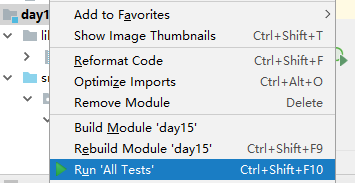
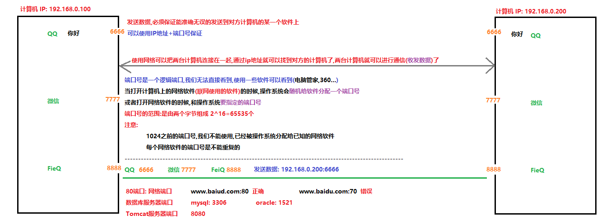

# 学习目标

```java
- 能够使用Junit进行单元测试
	1.在当前模块下新建lib文件夹,拷贝junit的jar包,把jar包添加到图书馆中
	2.在要执行的方法上添加一个@Test注解
	3.点击方法左边的绿色三角或者右键选择方法,选择run 方法名称运行方法
- 能够辨别UDP和TCP协议特点
	udp:面向无连接的协议,通信双方不用连接连接,可以直接发送数据(视频聊天,视频会议...)
		好处:效率高,耗资小
		弊端:容易丢失数据
	tcp:面向连接的协议,客户端和服务器必须经过3次握手建立逻辑连接,才能通信(文件的上传和下载,发送文件...)
		好处:安全
		弊端:效率低
- 能够说出TCP协议下两个常用类名称
	客户端:Socket
	服务器:ServerSocket
- 能够编写TCP协议下字符串数据传输程序
	笔记中:TCP通信程序(重点)
- 能够理解TCP协议下文件上传案例(重点)
	客户端:读取客户端硬盘上的文件,把文件上传到服务器,读取服务器回写的"上传成功!"
	服务器:读取客户端上传的文件,把文件保存到服务器的硬盘上,给客户端回写"上传成功!"
- 能够理解TCP协议下BS案例(看图)
	使用浏览器作为客户端访问服务器的某一个资源(index.html)
	http://localhost:8080/day12/web/index.html
	在服务器中获取客户端请求的资源路径(web/index.html)
	服务器使用本地字节输入流,根据路径读取index.html文件
	服务器在使用网络字节输出流,把读取到的index.html文件,写到客户端浏览器中显示
```

# 第一章 Junit单元测试

## 1.Junit介绍  

Junit是一个Java语言的单元测试框架，简单理解为可以用于取代java的(**部分**)main方法。Junit属于第三方工具，需要导入jar包后使用。

## 2.Junit的基本使用(重点)

a.在当前模块下创建lib文件夹


b.把junit的jar包,拷贝到lib的文件夹中


c.把jar包添加到图书馆中


```java
package com.itheima.demo01Junit;

import org.junit.Test;

/*
    Junit的作用:可以单独的执行某一个方法
    使用步骤:
        1.导入Junit第三方jar包到模块中
        2.在要运行的方法上边,添加一个@Test注解(需要导包)
        3.点击方法左侧的绿色三角或者右键选择方法名称,选择Run '方法名'运行方法
          点击类左边的绿色三角或者右键选择类名,选择Run '类名',可以运行类中所有被@Test修饰的方法
          右键选择模块名称,选择Run 'All Tests',可以运行模块中所有的类中添加了@Test注解的方法
 */
public class Demo01Junit {
    @Test
    public void show01(){
        System.out.println("show01方法!");
    }

    @Test
    public void show02(){
        System.out.println("show02方法!");
    }

    @Test
    public void show03(){
        System.out.println("show03方法!");
    }
}
```




## 3.Junit的注意事项

```java
package com.itheima.demo01Junit;

import org.junit.Test;

/*
    Junit的注意事项
    1.没有添加@Test注解的方法,不能使用Junit运行
    2.Junit单元测试,只能运行public修饰的,没有参数,没有返回值的非静态方法
 */
public class Demo02Junit {
    //1.没有添加@Test注解的方法,不能使用Junit运行
    public void show01(){
        System.out.println("Demo02Junit...show01方法!");
    }

    //@Test//Method show02() should be public:方法show02应该是public修饰
    void show02(){
        System.out.println("Demo02Junit...show02方法!");
    }

    //@Test//Method show03 should have no parameters:方法show03应该是没有参数的
    public void show03(int a){
        System.out.println("Demo02Junit...show03方法!"+a);
    }

    //@Test //Method show04() should be void:方法show04应该没有返回值
    public String show04(){
        System.out.println("Demo02Junit...show04方法!");
        return "你好";
    }

    //@Test //Method show05() should not be static:方法show05应该不是static修饰的方法
    public static void show05(){
        System.out.println("Demo02Junit...show05方法!");
    }

    //定义一个可以使用Junit运行的方法
    @Test
    public void method(){
        //调用那么不能运行的方法
        show01();
        show02();
        show03(10);
        String s = show04();
        System.out.println(s);
        show05();
    }
}
```

## 4.Junit相关注解

```java
package com.itheima.demo01Junit;

import org.junit.*;

/*
    Junit相关注解
    @Test:可以单独的运行某一个方法
    @Before：用来修饰方法，该方法会在每一个测试方法执行之前自动执行一次。
    @After：用来修饰方法，该方法会在每一个测试方法执行之后自动执行一次。
    @BeforeClass：用来静态修饰方法，该方法会在所有测试方法之前自动执行一次，而且只执行一次。
    @AfterClass：用来静态修饰方法，该方法会在所有测试方法之后自动执行一次，而且只执行一次。
    注意:
        @Before,@After,@BeforeClass,@AfterClass:这四个注解修饰的方法不能单独运行
        @Before,@After:修饰的的方法会自动在每一个@Test修饰的方法前后运行
        @BeforeClass,@AfterClass:用于修饰静态方法,会在所有@Test修饰的方法前后,自动执行一次
 */
public class Demo03Junit {
    @Test
    public void show01(){
        System.out.println("show01方法");
    }

    @Test
    public void show02(){
        System.out.println("show02方法");
    }

    @Test
    public void show03(){
        System.out.println("show03方法");
    }

    @Before
    public void before(){
        System.out.println("before方法!");
    }

    @After
    public void after(){
        System.out.println("after方法!");
    }

    @BeforeClass
    public static void beforeClass(){
        System.out.println("beforeClass方法!");
    }

    @AfterClass
    public static void afterClass(){
        System.out.println("afterClass方法!");
    }
}
```

备注:

```java
Junit常用注解(Junit5.x版本)
* @BeforeEach：用来修饰方法，该方法会在每一个测试方法执行之前执行一次。
* @AfterEach：用来修饰方法，该方法会在每一个测试方法执行之后执行一次。
* @BeforeAll：用来静态修饰方法，该方法会在所有测试方法执行之前执行一次。
* @AfterAll：用来静态修饰方法，该方法会在所有测试方法执行之后执行一次
```

# 第二章 网络编程入门

## 1.软件结构

**C/S结构** ：全称为Client/Server结构，是指客户端和服务器结构。常见程序有ＱＱ、迅雷等软件。
**B/S结构** ：全称为Browser/Server结构，是指浏览器和服务器结构。常见浏览器有谷歌、火狐等。

两种架构各有优势，但是无论哪种架构，都离不开网络的支持。**网络编程**，就是在一定的协议下，实现两台计算机的通信的程序。

## 2.网络通信协议

协议就是规则:就是计算机通信需要遵守的

udp:面向无连接的协议,通信的双方不用建立连接,可以直接发送数据

​	好处:效率高,耗资小

​	弊端:不安全,容易丢失数据

tcp:面向连接协议,客户端和服务器端必须经过3次握手建立逻辑连接,才能通信

​	好处:安全

​	弊端:效率低

三次握手：TCP协议中，在发送数据的准备阶段，客户端与服务器之间的三次交互，以保证连接的可靠。 

​	第一次握手，客户端向服务器端发出连接请求，等待服务器确认。服务器你死了吗？ 

​	第二次握手，服务器端向客户端回送一个响应，通知客户端收到了连接请求。我活着 啊！！ 

​	第三次握手，客户端再次向服务器端发送确认信息，确认连接。我知道了！！ 	

## 3.IP地址

**IP地址:就相当于计算机的身份号(唯一)**

```java
ip地址的作用:具有唯一性,在网络中可以通过ip地址找到另外一台计算机
ip地址分类
1.ipv4:ip地址由4个字节组成,一个字节8位(比特位1,0)
    二进制:11001101.11001100.11000001.11001111
    为了表示方便使用十进制:192.168.0.106
    每个字节的范围:0-255(2^8),ip地址第一位不能为0   
    ip地址的数量:42亿
    	2^32=4294967296个
    问题:随着计算机的增多,ip地址面临枯竭(全球IPv4地址在2011年2月分配完毕)不够用,就出了ipv6地址	
2.ipv6:ip地址由16个字节组成,一个字节8位(比特位1,0)
    ip地址的数量:
		2^128=3.4028236692093846346337460743177e+38
        3400000000000000000000000000000000000000000000000000000000000000    
    号称可以为地球上每一粒沙子编写一个ip地址
    为了表示方便使用十六进制:fe80::a8a6:b83c:8b8b:2685%17
常用一些dos命令:dos窗口  win+r==>cmd==>dos窗口     
1.ipconfig	Windows IP 配置
   连接特定的 DNS 后缀 . . . . . . . :
   本地链接 IPv6 地址. . . . . . . . : fe80::a8a6:b83c:8b8b:2685%17
   IPv4 地址 . . . . . . . . . . . . : 192.168.0.106
   子网掩码  . . . . . . . . . . . . : 255.255.255.0
   默认网关. . . . . . . . . . . . . : 192.168.0.1
2.ping ip地址:测试你的电脑和指定ip地址的电脑是否可以连通
	ping空格ip地址
	C:\Users\Administrator>ping 192.168.0.222  没有ping通
    正在 Ping 192.168.0.222 具有 32 字节的数据:
    来自 192.168.0.106 的回复: 无法访问目标主机。
    来自 192.168.0.106 的回复: 无法访问目标主机。
    来自 192.168.0.106 的回复: 无法访问目标主机。
    来自 192.168.0.106 的回复: 无法访问目标主机。
    C:\Users\Administrator>ping 192.168.0.107  ping通
    正在 Ping 192.168.0.107 具有 32 字节的数据:
    来自 192.168.0.107 的回复: 字节=32 时间=3ms TTL=64
    来自 192.168.0.107 的回复: 字节=32 时间=3ms TTL=64
    来自 192.168.0.107 的回复: 字节=32 时间=5ms TTL=64
    来自 192.168.0.107 的回复: 字节=32 时间=3ms TTL=64
    C:\Users\Administrator>ping www.baidu.com
    正在 Ping www.a.shifen.com [61.135.169.121] 具有 32 字节的数据:
    来自 61.135.169.121 的回复: 字节=32 时间=6ms TTL=56
    来自 61.135.169.121 的回复: 字节=32 时间=4ms TTL=56
    来自 61.135.169.121 的回复: 字节=32 时间=4ms TTL=56
    来自 61.135.169.121 的回复: 字节=32 时间=4ms TTL=56 
    ping 127.0.0.1    ping localhost ping本机的ip地址(你自己电脑的ip地址) 
```

## 4.端口号

**注意:每个网络软件都会分配一个端口号,通过这个端口号就可以找到这个软件**



## 5.InetAddress类

```java
package com.itheima.demo02InetAddress;

import java.net.InetAddress;
import java.net.UnknownHostException;

/*
    java.net.InetAddress类:
        此类表示互联网协议 (IP) 地址。
    获取对象的方式:使用静态方法
        static InetAddress getLocalHost() 返回本地主机。
        static InetAddress getByName(String host) 在给定主机名的情况下确定主机的 IP 地址。
    非静态成员方法:
        String getHostAddress() 返回 IP 地址字符串（以文本表现形式）。
        String getHostName() 获取此 IP 地址的主机名。
 */
public class Demo01InetAddress {
    public static void main(String[] args) throws UnknownHostException {
        show02();
    }

    /*
        static InetAddress getByName(String host) 在给定主机名的情况下确定主机的 IP 地址。
        参数:
            String host:主机名称,IP地址,域名(网址)
     */
    private static void show02() throws UnknownHostException {
        //InetAddress inet = InetAddress.getByName("SD-20201001RYBX");//SD-20201001RYBX/192.168.134.102
        //InetAddress inet = InetAddress.getByName("192.168.134.102");//SD-20201001RYBX/192.168.134.102
        InetAddress inet = InetAddress.getByName("www.itheima.com");//www.itheima.com/124.200.113.113
        System.out.println(inet.getHostAddress());
        System.out.println(inet.getHostName());
        System.out.println(inet);
    }

    /*
        static InetAddress getLocalHost() 返回本地主机。你自己电脑的IP地址对象
        UnknownHostException:未知主机异常
     */
    private static void show01() throws UnknownHostException {
        InetAddress inet = InetAddress.getLocalHost();
        System.out.println(inet);//daofeng/192.168.134.108 打印对象名不是地址值重写了toString方法

        //String getHostAddress() 返回 IP 地址字符串
        String ip = inet.getHostAddress();
        System.out.println(ip);//192.168.134.108

        //String getHostName() 获取此 IP 地址的主机名。
        String name = inet.getHostName();
        System.out.println(name);//daofeng
    }
}
```

# 第三章 TCP通信程序

## 1.TCP通信的概述


## 2.TCP通信的客户端(重点)

```java
package com.itheima.demo03TCP;

import java.io.IOException;
import java.io.InputStream;
import java.io.OutputStream;
import java.net.Socket;

/*
    TCP通信的客户端(重点)
    作用:和服务器经过3次握手,建立连接通路;给服务器发送数据,读取服务器回写的数据
    表示客户端的类:
        java.net.Socket:此类实现客户端套接字
        套接字:封装了IP地址和端口号的网络对象
    构造方法:
        Socket(InetAddress address, int port) 创建一个流套接字并将其连接到指定 IP 地址的指定端口号。
        Socket(String host, int port) 创建一个流套接字并将其连接到指定主机上的指定端口号。
        参数:
            InetAddress address,String host:服务器的ip地址
            int port:服务器的端口号
    成员方法:
        OutputStream getOutputStream() 返回此套接字的输出流。
        InputStream getInputStream() 返回此套接字的输入流。
    -------------------------------------------------------------------------------------
    注意:
        1.使用Socket的构造方法根据服务器的ip地址和端口号创建对象的时候
          客户端就会找服务器通过3次握手建立连接通路
          a.服务区没有启动,ip地址和端口号书写错误,连接失败,会抛出异常 ConnectException: Connection refused: connect
          b.服务器启动,ip地址和端口号书写正确,3我握手成功,建立连接通路
        2.客户端和服务器进行读写操作,必须使用Socket对象中提供的网络流对象,不能使用自己创建IO流对象
    -------------------------------------------------------------------------------------
    实现步骤(重点):
    1.创建客户端Socket对象,构造方法封装服务器的ip地址和端口号
    2.使用客户端Socket对象中的方法getOutputStream,获取网络字节输出流OutputStream对象
    3.使用网络字节输出流OutputStream对象中的方法write,给服务器发送数据
    4.使用客户端Socket对象中的方法getInputStream,获取网络字节输入流InputStream对象
    5.使用网络字节输入流InputStream对象中的方法read,读取服务器回写的数据
    6.释放资源(Socket)
 */
public class TCPClient {
    public static void main(String[] args) throws IOException {
        //1.创建客户端Socket对象,构造方法封装服务器的ip地址和端口号
        Socket socket = new Socket("127.0.0.1",8888);
        //2.使用客户端Socket对象中的方法getOutputStream,获取网络字节输出流OutputStream对象
        OutputStream os = socket.getOutputStream();
        //3.使用网络字节输出流OutputStream对象中的方法write,给服务器发送数据
        os.write("你好服务器!".getBytes());
        //4.使用客户端Socket对象中的方法getInputStream,获取网络字节输入流InputStream对象
        InputStream is = socket.getInputStream();
        //5.使用网络字节输入流InputStream对象中的方法read,读取服务器回写的数据
        byte[] bytes = new byte[1024];
        int len = is.read(bytes);
        System.out.println("客户端读取服务器发送的数据:"+new String(bytes,0,len));
        //6.释放资源(Socket)
        socket.close();
    }
}
```

## 3.TCP通信服务器端(重点)

```java
package com.itheima.demo03TCP;

import java.io.IOException;
import java.io.InputStream;
import java.io.OutputStream;
import java.net.ServerSocket;
import java.net.Socket;

/*
    TCP通信服务器端(重点)
    作用:接收客户端的请求,可以客户端经过3次握手建立连接通路;读取客户端发送的数据,给客户端回写数据
    表示服务器的类:
        java.net.ServerSocket:此类实现服务器套接字。
    构造方法:
        ServerSocket(int port) 创建绑定到特定端口的服务器套接字。
    成员方法:
        Socket accept() 侦听并接受到此套接字的连接。
        服务器调用accpet方法,accpet方法会处于阻塞状态,会一直等待客户端连接服务区
        当有客户端连接服务器,accpet方法就会获取到连接的服务器Socket对象
    ----------------------------------------------------------------------------------
    实现步骤:(重点)
    1.创建服务器ServerSocket对象,和系统要指定的端口号
    2.使用服务器ServerSocket对象中的方法accept,监听并获取客户端Socket对象
    3.使用客户端Socket对象中的方法getInputStream,获取网络字节输入流InputStream对象
    4.使用网络字节输入流InputStream对象中的方法read,读取客户端发送数据
    5.使用客户端Socket对象中的方法getOutputStream,获取网络字节输出流OutputStream对象
    6.使用网络字节输出流OutputStream对象中的方法write,给客户端回写(发送)数据
    7.释放资源(Socket,ServerSocket)
 */
public class TCPServer {
    public static void main(String[] args) throws IOException {
        //1.创建服务器ServerSocket对象,和系统要指定的端口号
        ServerSocket server = new ServerSocket(8888);
        System.out.println("----------服务器已经启动,等待客户端连接-----------");
        //2.使用服务器ServerSocket对象中的方法accept,监听并获取客户端Socket对象
        Socket socket = server.accept();
        //3.使用客户端Socket对象中的方法getInputStream,获取网络字节输入流InputStream对象
        InputStream is = socket.getInputStream();
        //4.使用网络字节输入流InputStream对象中的方法read,读取客户端发送数据
        byte[] bytes = new byte[1024];
        int len = is.read(bytes);
        System.out.println("服务器读取客户端发送的数据:"+new String(bytes,0,len));
        //5.使用客户端Socket对象中的方法getOutputStream,获取网络字节输出流OutputStream对象
        OutputStream os = socket.getOutputStream();
        //6.使用网络字节输出流OutputStream对象中的方法write,给客户端回写(发送)数据
        os.write("收到,谢谢".getBytes());
        //7.释放资源(Socket,ServerSocket)
        socket.close();
        server.close();
    }
}
```

**服务器启动之后,服务器的accpet方法一直处于监听状态,等待客户端连接**


## 4.TCP通信的流程


# 第四章 综合案例

## 1.文件上传案例需求分析


## 2.文件上传的客户端(重点)

```java
package com.itheima.demo04fileUpload;

import java.io.FileInputStream;
import java.io.IOException;
import java.io.InputStream;
import java.io.OutputStream;
import java.net.Socket;

/*
    文件上传的客户端(重点)
    作用:
        读取本地的文件,上传到服务器,读取服务器回写的上传成功
    文件上传就是文件的复制:
        数据源: c:\\1.jpg
        目的地: 服务器
    实现步骤:
        1.创建FileInputStream对象,构造方法中绑定要读取的数据源
        2.创建客户端Socket对象,构造方法封装服务器的ip地址和端口号
        3.使用Socket对象中的方法getOutputStream,获取网络字节输出流OutputStream对象
        4.使用FileInputStream对象中的方法read,读取要上传的文件
        5.使用OutputStream对象中的方法write,把读取到的文件上传到服务器
        6.使用Socket对象中的方法getInputStream,获取网络字节输入流InputStream对象
        7.使用InputStream对象中的方法read,读取服务器回写的"上传成功!"
        8.释放资源(fis,Socket)
 */
public class TCPClient {
    public static void main(String[] args) throws IOException {
        //1.创建FileInputStream对象,构造方法中绑定要读取的数据源
        FileInputStream fis = new FileInputStream("c:\\1.jpg");
        //2.创建客户端Socket对象,构造方法封装服务器的ip地址和端口号
        Socket socket = new Socket("localhost",9999);
        //3.使用Socket对象中的方法getOutputStream,获取网络字节输出流OutputStream对象
        OutputStream os = socket.getOutputStream();
        //4.使用FileInputStream对象中的方法read,读取要上传的文件
        byte[] bytes = new byte[1024];
        int len = 0;
        while ((len = fis.read(bytes))!=-1){
            //5.使用OutputStream对象中的方法write,把读取到的文件上传到服务器
            os.write(bytes,0,len);
        }
        //6.使用Socket对象中的方法getInputStream,获取网络字节输入流InputStream对象
        InputStream is = socket.getInputStream();
        //7.使用InputStream对象中的方法read,读取服务器回写的"上传成功!"
        while ((len=is.read(bytes))!=-1){
            System.out.println(new String(bytes,0,len));
        }
        //8.释放资源(fis,Socket)
        fis.close();
        socket.close();
    }
}
```

## 3.文件上传的服务器端(重点)

```java
package com.itheima.demo04fileUpload;

import java.io.File;
import java.io.FileOutputStream;
import java.io.IOException;
import java.io.InputStream;
import java.net.ServerSocket;
import java.net.Socket;

/*
    文件上传的服务器端(重点)
    作用:
        读取客户端上传的文件,把文件保存到服务器的硬盘上,给客户端回写"上传成功!"
    文件上传就是文件的复制:
     数据源:客户端上传的图片
     目的地:服务器的硬盘 d:\\upload\\1.jpg
    实现步骤:
        1.判断d盘是否有upload文件夹,没有则创建
        2.创建服务器ServerSocket对象,和系统要指定的端口号
        3.使用ServerSocket对象中的方法accept,监听并获取客户端Socket对象
        4.使用Socket对象中的方法getInputStream,获取网络字节输入流InputStream对象
        5.创建FileOutputStream对象,构造方法中绑定要写的目的地
        6.使用InputStream对象中的方法read,读取客户端上传的文件
        7.使用FileOutputStream对象中的方法write,把读取到的文件写到服务器的硬盘上
        8.使用Socket对象中的方法getOutputStream,获取网络字节输出流OutputStream对象
        9.使用OutputStream对象中的方法write,给客户端回写"上传成功!"
        10.释放资源(fos,Socket,ServerSocket)
 */
public class TCPServer {
    public static void main(String[] args) throws IOException {
        //1.判断d盘是否有upload文件夹,没有则创建
        File file = new File("d:\\upload");
        if(!file.exists()){
            file.mkdir();
        }
        //2.创建服务器ServerSocket对象,和系统要指定的端口号
        ServerSocket server = new ServerSocket(9999);
        System.out.println("-------服务器已经启动,等待客户端上传文件---------");
        //3.使用ServerSocket对象中的方法accept,监听并获取客户端Socket对象
        Socket socket = server.accept();
        //4.使用Socket对象中的方法getInputStream,获取网络字节输入流InputStream对象
        InputStream is = socket.getInputStream();
        //5.创建FileOutputStream对象,构造方法中绑定要写的目的地
        FileOutputStream fos = new FileOutputStream("d:\\upload\\1.jpg");
        //6.使用InputStream对象中的方法read,读取客户端上传的文件
        byte[] bytes = new byte[1024];
        int len = 0;
        while ((len=is.read(bytes))!=-1){
            //7.使用FileOutputStream对象中的方法write,把读取到的文件写到服务器的硬盘上
            fos.write(bytes,0,len);
        }
        //8.使用Socket对象中的方法getOutputStream,获取网络字节输出流OutputStream对象
        //9.使用OutputStream对象中的方法write,给客户端回写"上传成功!"
        socket.getOutputStream().write("上传成功!".getBytes());
        //10.释放资源(fos,Socket,ServerSocket)
        fos.close();
        socket.close();
        server.close();
    }
}
```

**问题:客户端没有读取到服务器回写的"上传成功",服务器和客户端都没有执行结束**


## 4.文件上传的阻塞问题(重点)


```java
 /*
	解决:客户端上传完图片之后,给服务器写一个结束标记
	void shutdownOutput() 禁用此套接字的输出流。
	对于 TCP 套接字，任何以前写入的数据都将被发送，并且后跟 TCP 的正常连接终止序列。
 */
socket.shutdownOutput();
```

```java
package com.itheima.demo04fileUpload;

import java.io.FileInputStream;
import java.io.IOException;
import java.io.InputStream;
import java.io.OutputStream;
import java.net.Socket;

/*
    文件上传的客户端(重点)
    作用:
        读取本地的文件,上传到服务器,读取服务器回写的上传成功
    文件上传就是文件的复制:
        数据源: c:\\1.jpg
        目的地: 服务器
    实现步骤:
        1.创建FileInputStream对象,构造方法中绑定要读取的数据源
        2.创建客户端Socket对象,构造方法封装服务器的ip地址和端口号
        3.使用Socket对象中的方法getOutputStream,获取网络字节输出流OutputStream对象
        4.使用FileInputStream对象中的方法read,读取要上传的文件
        5.使用OutputStream对象中的方法write,把读取到的文件上传到服务器
        6.使用Socket对象中的方法getInputStream,获取网络字节输入流InputStream对象
        7.使用InputStream对象中的方法read,读取服务器回写的"上传成功!"
        8.释放资源(fis,Socket)
 */
public class TCPClient {
    public static void main(String[] args) throws IOException {
        //1.创建FileInputStream对象,构造方法中绑定要读取的数据源
        FileInputStream fis = new FileInputStream("c:\\1.jpg");
        //2.创建客户端Socket对象,构造方法封装服务器的ip地址和端口号
        Socket socket = new Socket("localhost",9999);
        //3.使用Socket对象中的方法getOutputStream,获取网络字节输出流OutputStream对象
        OutputStream os = socket.getOutputStream();
        //4.使用FileInputStream对象中的方法read,读取要上传的文件
        byte[] bytes = new byte[1024];
        int len = 0;
        while ((len = fis.read(bytes))!=-1){
            //5.使用OutputStream对象中的方法write,把读取到的文件上传到服务器
            os.write(bytes,0,len);
        }

        /*
            解决:客户端上传完图片之后,给服务器写一个结束标记
            void shutdownOutput() 禁用此套接字的输出流。
            对于 TCP 套接字，任何以前写入的数据都将被发送，并且后跟 TCP 的正常连接终止序列。
         */
        socket.shutdownOutput();
        
        //6.使用Socket对象中的方法getInputStream,获取网络字节输入流InputStream对象
        InputStream is = socket.getInputStream();
        //7.使用InputStream对象中的方法read,读取服务器回写的"上传成功!"
        System.out.println("33333333333333333333333333333333");
        while ((len=is.read(bytes))!=-1){
            System.out.println(new String(bytes,0,len));
        }
        System.out.println("44444444444444444444444444444444");
        //8.释放资源(fis,Socket)
        fis.close();
        socket.close();
    }
}
```

## 5.文件上传自定义文件名称命名规则(了解-扩展)

```java
package com.itheima.demo04fileUpload;

import java.io.File;
import java.io.FileOutputStream;
import java.io.IOException;
import java.io.InputStream;
import java.net.ServerSocket;
import java.net.Socket;
import java.util.Random;

/*
    文件上传的服务器端(重点)
    作用:
        读取客户端上传的文件,把文件保存到服务器的硬盘上,给客户端回写"上传成功!"
    文件上传就是文件的复制:
     数据源:客户端上传的图片
     目的地:服务器的硬盘 d:\\upload\\1.jpg
    实现步骤:
        1.判断d盘是否有upload文件夹,没有则创建
        2.创建服务器ServerSocket对象,和系统要指定的端口号
        3.使用ServerSocket对象中的方法accept,监听并获取客户端Socket对象
        4.使用Socket对象中的方法getInputStream,获取网络字节输入流InputStream对象
        5.创建FileOutputStream对象,构造方法中绑定要写的目的地
        6.使用InputStream对象中的方法read,读取客户端上传的文件
        7.使用FileOutputStream对象中的方法write,把读取到的文件写到服务器的硬盘上
        8.使用Socket对象中的方法getOutputStream,获取网络字节输出流OutputStream对象
        9.使用OutputStream对象中的方法write,给客户端回写"上传成功!"
        10.释放资源(fos,Socket,ServerSocket)
 */
public class TCPServer {
    public static void main(String[] args) throws IOException {
        //1.判断d盘是否有upload文件夹,没有则创建
        File file = new File("d:\\upload");
        if(!file.exists()){
            file.mkdir();
        }
        //2.创建服务器ServerSocket对象,和系统要指定的端口号
        ServerSocket server = new ServerSocket(9999);
        System.out.println("-------服务器已经启动,等待客户端上传文件---------");
        //3.使用ServerSocket对象中的方法accept,监听并获取客户端Socket对象
        Socket socket = server.accept();
        //4.使用Socket对象中的方法getInputStream,获取网络字节输入流InputStream对象
        InputStream is = socket.getInputStream();

        /*
            自定义一个文件的名称
            规则:防止文件名相同,覆盖之前的文件
                域名+毫秒值+随机数
         */
        String fileName = "itheima"+System.currentTimeMillis()+new Random().nextInt(99999999)+".jpg";
        System.out.println("保存的文件名称为:"+fileName);

        //5.创建FileOutputStream对象,构造方法中绑定要写的目的地
        FileOutputStream fos = new FileOutputStream("d:\\upload\\"+fileName);
        //6.使用InputStream对象中的方法read,读取客户端上传的文件
        byte[] bytes = new byte[1024];
        int len = 0;
        System.out.println("11111111111111111111111111111111111");
        while ((len=is.read(bytes))!=-1){
            //7.使用FileOutputStream对象中的方法write,把读取到的文件写到服务器的硬盘上
            fos.write(bytes,0,len);
        }
        System.out.println("222222222222222222222222222222222222");
        //8.使用Socket对象中的方法getOutputStream,获取网络字节输出流OutputStream对象
        //9.使用OutputStream对象中的方法write,给客户端回写"上传成功!"
        socket.getOutputStream().write("上传成功!".getBytes());
        //10.释放资源(fos,Socket,ServerSocket)
        fos.close();
        socket.close();
        server.close();
    }
}
```

## 6.多线程版本服务器(了解-扩展)

```java
package com.itheima.demo04fileUploadThread;

import java.io.File;
import java.io.FileOutputStream;
import java.io.IOException;
import java.io.InputStream;
import java.net.ServerSocket;
import java.net.Socket;
import java.util.Random;

/*
    多线程版本服务器(了解-扩展)
    1.创建一个死循环,轮询监听客户端的请求
    2.有客户端请求accpet方法,获取客户端Socket对象
    3.开启一个线程,完成当前客户端的文件上传
 */
public class TCPServer {
    public static void main(String[] args) throws IOException {
        File file = new File("d:\\upload");
        if(!file.exists()){
            file.mkdir();
        }
        ServerSocket server = new ServerSocket(9999);
        System.out.println("-------服务器已经启动,等待客户端上传文件---------");

        //1.创建一个死循环,轮询监听客户端的请求
        while (true){
            //2.有客户端请求accpet方法,获取客户端Socket对象
            Socket socket = server.accept();
            /*
                Socket类中的方法
                InetAddress getInetAddress() 返回套接字连接的地址。
             */
            System.out.println("上传图片客户端的ip地址:"+socket.getInetAddress().getHostAddress());
            //3.开启一个线程,完成当前客户端的文件上传
            new Thread(()->{
                try {
                    InputStream is = socket.getInputStream();
                    String fileName = "itheima"+System.currentTimeMillis()+new Random().nextInt(99999999)+".jpg";
                    System.out.println("保存的文件名称为:"+fileName);
                    System.out.println("--------------------------------------------------------");

                    FileOutputStream fos = new FileOutputStream("d:\\upload\\"+fileName);
                    byte[] bytes = new byte[1024];
                    int len = 0;
                    while ((len=is.read(bytes))!=-1){
                        fos.write(bytes,0,len);
                    }
                    socket.getOutputStream().write("上传成功!".getBytes());
                    fos.close();
                    socket.close();
                } catch (IOException e) {
                    e.printStackTrace();
                }
            }).start();
        }
        //server.close();//服务器一直启动,不需要关闭
    }
}
```

## 7.模拟BS服务器(了解)

模拟网站服务器，使用浏览器访问自己编写的服务端程序，查看网页效果。

### 案例分析

1. 准备页面数据，web文件夹。

    ```html
    <!DOCTYPE html>
    <html lang="en">
    <head>
        <meta charset="UTF-8">
        <title>我的商城</title>
    </head>
    <body>
        <h1>欢迎光临</h1>
    </body>
    </html>
    ```


2. 我们模拟服务器端，ServerSocket类监听端口，使用浏览器访问，查看网页效果

```java
package com.itheima.demo06BSTCP;

import java.io.IOException;
import java.io.InputStream;
import java.net.ServerSocket;
import java.net.Socket;

/*
    创建BS版本的服务器
    B/S结构:全称为Browser/Server结构，是指浏览器和服务器结构。
    使用浏览器作为客户端,访问服务器
 */
public class BSTCPServer {
    public static void main(String[] args) throws IOException {
        //创建ServerSocket服务器,和系统要指定的端口号
        ServerSocket server = new ServerSocket(8080);
        //使用ServerSocket对象中的方法accpet,监听并获取到客户端Socket对象
        Socket socket = server.accept();
        //使用Socket对象中的方法getInputStream,获取网络字节输入流InputStream对象
        InputStream is = socket.getInputStream();
        //使用InputStream对象中的方法read,读取客户端(浏览器)的请求信息
        byte[] bytes = new byte[1024];
        int len = is.read(bytes);
        System.out.println(new String(bytes,0,len));
        socket.close();
        server.close();
    }
}
```

http://localhost:8080/day12/web/index.html


### 代码实现

#### BS服务器

```java
package com.itheima.demo06BSTCP;

import java.io.*;
import java.net.ServerSocket;
import java.net.Socket;

/*
    创建BS版本的服务器
    B/S结构:全称为Browser/Server结构，是指浏览器和服务器结构。
    使用浏览器作为客户端,访问服务器
 */
public class BSTCPServer2 {
    public static void main(String[] args) throws IOException {
        //创建ServerSocket服务器,和系统要指定的端口号
        ServerSocket server = new ServerSocket(8080);
        //使用ServerSocket对象中的方法accpet,监听并获取到客户端Socket对象
        Socket socket = server.accept();
        //使用Socket对象中的方法getInputStream,获取网络字节输入流InputStream对象
        InputStream is = socket.getInputStream();
        /*
            服务器要完成的事情:把客户端发送的地址截取出来,根据地址读取文件,把文件写到客户端浏览器显示
            1.把InputStream网络字节输入流,转换为BufferedReader字符缓冲输入流
            BufferedReader br =  new BufferedReader(new InputStreamReader(is));
            2.读取客户端发送的第一行的数据  "GET /day12/web/index.html HTTP/1.1"
            3.使用String类的方法split,根据空格切割字符串,只要中间部分 "/day12/web/index.html"
            4.使用String类的方法subString(1),从1截取到字符串末尾  "day12/web/index.html"
            5.创建字节输入流,根据文件的路径(day12/web/index.html),读取文件
            6.使用Socket中提供的网络字节输出流,把读取到的文件(day12/web/index.html),写到客户端页面中显示
         */
        //1.把InputStream网络字节输入流,转换为BufferedReader字符缓冲输入流
        BufferedReader br = new BufferedReader(new InputStreamReader(is));
        //2.读取客户端发送的第一行的数据  "GET /day12/web/index.html HTTP/1.1"
        String line = br.readLine();
        //3.使用String类的方法split,根据空格切割字符串,只要中间部分 "/day12/web/index.html"
        String[] arr = line.split(" ");
        //4.使用String类的方法subString(1),从1截取到字符串末尾  "day12/web/index.html"
        String path = arr[1].substring(1);
        System.out.println("客户端想要获取文件的路径为:" + path);
        //5.创建字节输入流,根据文件的路径(day12/web/index.html),读取文件
        FileInputStream fis = new FileInputStream(path);
        //6.使用Socket中提供的网络字节输出流,把读取到的文件(day12/web/index.html),写到客户端页面中显示
        OutputStream os = socket.getOutputStream();

        //添加以下三行代码的目的:告之客户端浏览器,写回的文件是一个html文件,让浏览器以html文件解析
        os.write("HTTP/1.1 200 OK\r\n".getBytes());
        os.write("Content-Type:text/html\r\n".getBytes());
        os.write("\r\n".getBytes());

        //一读一写复制文件:读取服务器的index.html文件,写到客户端浏览器上
        byte[] bytes = new byte[1024];
        int len = 0;
        while ((len = fis.read(bytes)) != -1) {
            os.write(bytes, 0, len);
        }
        socket.close();
        server.close();
    }
}
```


#### c.index.html页面添加多个图片,多次请求服务器


```java
package com.itheima.demo06BSTCP;

import java.io.*;
import java.net.ServerSocket;
import java.net.Socket;

/*
    创建BS版本的服务器
    B/S结构:全称为Browser/Server结构，是指浏览器和服务器结构。
    使用浏览器作为客户端,访问服务器
 */
public class BSTCPServer3 {
    public static void main(String[] args) throws IOException {
        //创建ServerSocket服务器,和系统要指定的端口号
        ServerSocket server = new ServerSocket(8080);

        /*
            问题:服务器给客户端回写的html页面,页面中如果有图片,显示不出来图片(客户端上没有图片显示)
            当服务器给浏览器写回html页面中如果有图片的路径,浏览器会根据图片的路径再次访问服务器
            告之服务器,想要这个路径的图片,服务器根据图片的路径,把图片读取出来,写回到客户端浏览器
         */
        //1/定义一个死循环,轮询监听客户端的请求
        while (true){
            //2.使用ServerSocket对象中的方法accpet,监听并获取到客户端Socket对象
            Socket socket = server.accept();

            //3.有客户端请求服务器,开启一个线程,根据客户端传递的路径读取文件,写回到客户端
            new Thread(()->{
                try {
                    //使用Socket对象中的方法getInputStream,获取网络字节输入流InputStream对象
                    InputStream is = socket.getInputStream();
                    //1.把InputStream网络字节输入流,转换为BufferedReader字符缓冲输入流
                    BufferedReader br = new BufferedReader(new InputStreamReader(is));
                    //2.读取客户端发送的第一行的数据  "GET /day12/web/index.html HTTP/1.1"
                    String line = br.readLine();
                    //3.使用String类的方法split,根据空格切割字符串,只要中间部分 "/day12/web/index.html"
                    String[] arr = line.split(" ");
                    //4.使用String类的方法subString(1),从1截取到字符串末尾  "day12/web/index.html"
                    String path = arr[1].substring(1);
                    System.out.println("客户端想要获取文件的路径为:" + path);
                    //5.创建字节输入流,根据文件的路径(day12/web/index.html),读取文件
                    FileInputStream fis = new FileInputStream(path);
                    //6.使用Socket中提供的网络字节输出流,把读取到的文件(day12/web/index.html),写到客户端页面中显示
                    OutputStream os = socket.getOutputStream();

                    //添加以下三行代码的目的:告之客户端浏览器,写回的文件是一个html文件,让浏览器以html文件解析
                    os.write("HTTP/1.1 200 OK\r\n".getBytes());
                    os.write("Content-Type:text/html\r\n".getBytes());
                    os.write("\r\n".getBytes());

                    //一读一写复制文件:读取服务器的index.html文件,写到客户端浏览器上
                    byte[] bytes = new byte[1024];
                    int len = 0;
                    while ((len = fis.read(bytes)) != -1) {
                        os.write(bytes, 0, len);
                    }
                    socket.close();
                } catch (IOException e) {
                    e.printStackTrace();
                }
            }).start();
        }
    }
}
```

