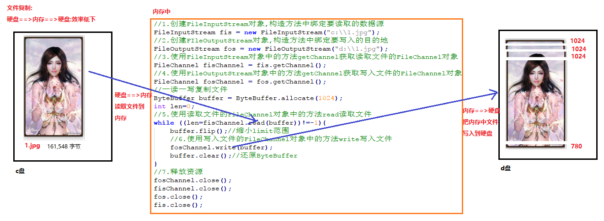
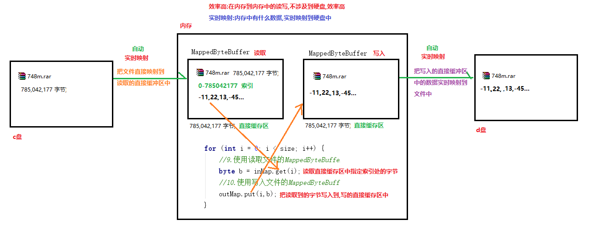
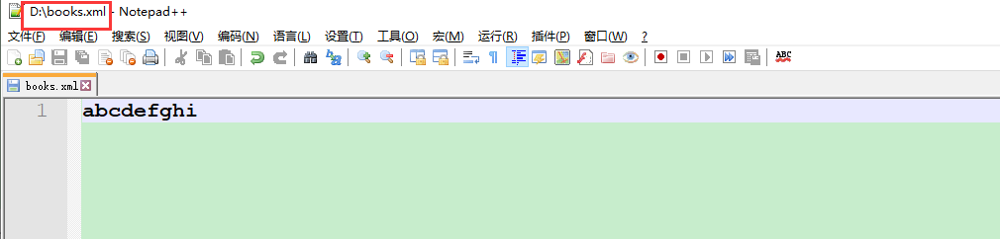
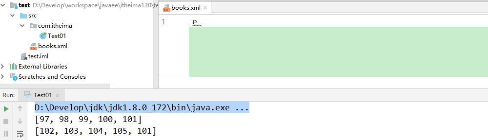
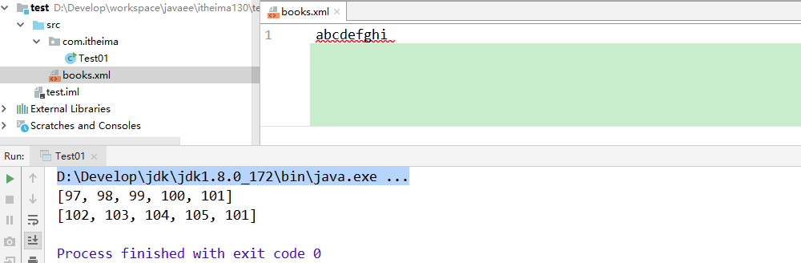
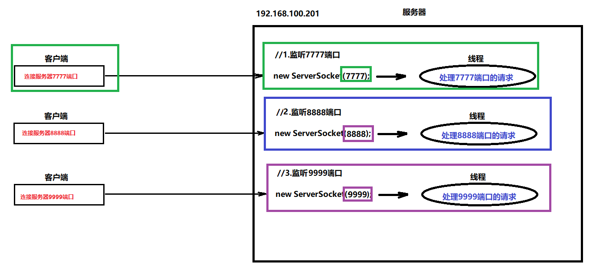
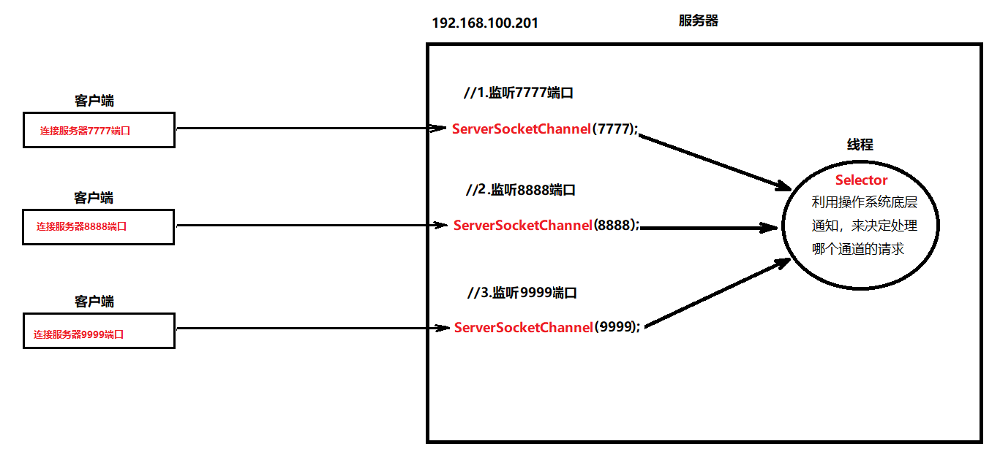
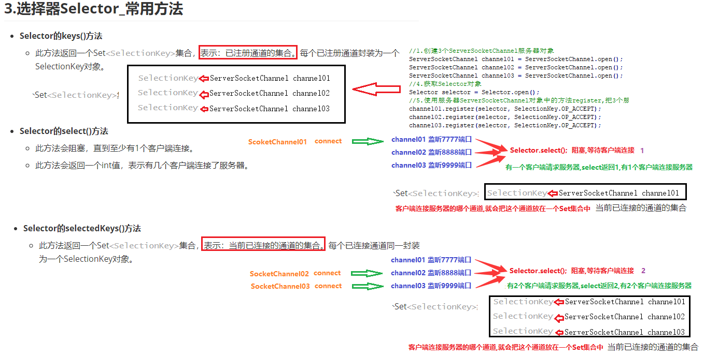

# 学习目标

```java
- 能够说出阻塞和非阻塞的概念
	阻塞:等待结果,什么事也不能做
	非阻塞:可以做别的事情
- 能够说出同步和异步的概念
	同步:主动获取结果
	异步:等待对方通知结果(回调函数)
- 能够创建和使用ByteBuffer
	获取对象的方式:
		- public static ByteBuffer allocate(int  capacity)：使用一个“容量”来创建一个“间接字节缓存区”——程序的“堆”空间中创建。
        - public static ByteBuffer allocateDirect(int capacity)：使用一个“容量”来创建一个“直接字节缓存区”——系统内存。
        - public static ByteBuffer wrap(byte[] byteArray)：使用一个“byte[]数组”创建一个“间接字节缓存区”。
	成员方法:
		向ByteBuffer添加数据
        - public ByteBuffer put(byte b)：向当前可用位置添加数据。
        - public ByteBuffer put(byte[] byteArray)：向当前可用位置添加一个byte[]数组
        - public ByteBuffer put(byte[] byteArray,int offset,int len)：添加一个byte[]数组的一部分
	
		- byte[] array()  获取缓冲区中包含的字节数组
		
		- int capacity() 返回此缓冲区的容量。
		
		- public int limit()：获取此缓冲区的限制。
        - public Buffer limit(int newLimit)：设置此缓冲区的限制。
		
		- public int position()：获取当前可写入位置索引。
		- public Buffer position(int p)：更改当前可写入位置索引。
		
		- public Buffer mark()：设置此缓冲区的标记为当前的position位置。
		
		- public Buffer clear()：还原缓冲区的状态。
          - 将position设置为：0
          - 将限制limit设置为容量capacity；
          - 丢弃标记mark。
        - public Buffer flip()：缩小limit的范围。 获取读取的有效数据0到position之间的数据
          - 将limit设置为当前position位置；
          - 将当前position位置设置为0；
          - 丢弃标记。
- 能够使用MappedByteBuffer实现高效读写(掌握复制2g以下文件)
		1.创建读取文件的RandomAccessFile对象,构造方法中封装要读取的数据源和只读模式
        2.创建写入文件的RandomAccessFile对象,构造方法中封装要写入的目的地和读写模式
        3.使用读取文件的RandomAccessFile对象中的方法getChannel,获取读取文件的FileChannel
        4.使用写入文件的RandomAccessFile对象中的方法getChannel,获取写入文件的FileChannel
        5.使用读取文件的FileChannel中的方法size,获取要读取文件的大小(字节)
        6.使用读取文件的FileChannel中的方法map,创建读取文件的直接缓冲区MappedByteBuffer
        7.使用写入文件的FileChannel中的方法map,创建写入文件的直接缓冲区MappedByteBuffer
        8.创建for循环,循环size次
        9.使用读取文件的直接缓冲区MappedByteBuffer中的方法get,读取指定索引处的字节
        10.使用写入文件的直接缓冲区MappedByteBuffer中的方法put,把读取到的字节写入到指定索引处
        11.释放资源
- 能够使用ServerSocketChannel和SocketChannel实现连接并收发信息
	同步非阻塞连接(NIO)
	ServlerSocketChannel和SocketChannel收发信息
- 能够说出Selector选择器的作用
	使用了多路复用，只需要一个线程就可以处理多个通道，
	降低内存占用率，减少CPU切换时间，在高并发、高频段业务环境下有非常重要的优势
- 能够使用Selector选择器
	选择器Selector_多路信息接收
- 能够说出AIO的特点
	异步非阻塞IO
	非阻塞:
		服务器(accept)不用等待客户端请求,可以继续做其他的事情
		客户端connect不会等待连接服务器成功,可以继续做其他的事情
	异步:
		不用轮询获取监听客户端,有客户端请求服务器,会触发回调函数(CompletionHandler),来处理这个请求   
```

# 第一章 BIO、NIO、AIO概述

## 1.BIO、NIO与AIO概述

1).BIO：Block(阻塞的) IO——我们之前学的。			【同步、阻塞】
2).NIO：Non-Block(非阻塞的(同步)IO——JDK1.4开始的。	【同步、非阻塞】
3).AIO：Asynchronous(异步-非阻塞)IO——JDK1.7开始	【异步、非阻塞】

## 2.阻塞和非阻塞,同步和异步的概念(记住)

举个例子，比如我们去照相馆拍照，拍完照片之后，商家说需要30分钟左右才能洗出来照片

- 同步+阻塞

  这个时候如果我们一直在店里面**啥都不干**，一直等待商家把它洗完照片，这个过程就叫同步阻塞。

- 同步+非阻塞

  当然大部分人很少这么干，更多的是大家拿起手机开始看电视，看一会就会问老板洗完没，老板说没洗完，然后我们接着看，再过一会接着问(**轮询**)，直到照片洗完，这个过程就叫同步非阻塞。

- 异步+阻塞

  因为店里生意太好了，越来越多的人过来拍，店里面快没地方坐了，老板说你把你手机号留下，我一会洗好了就打电话告诉你过来取，然后你去外面找了一个长凳开始躺着睡觉等待老板打电话，啥不都干，这个过程就叫异步阻塞。

- 异步+非阻塞

  当然实际情况是，大家可能会直接先去逛街或者吃饭做其他的活动，同时等待老板打电话,这样以来两不耽误，这个过程就叫异步非阻塞。

总结

从上面的描述中我们其实能够看到阻塞和非阻塞通常是指客户端在发出请求后，在服务端处理这个请求的过程中，客户端本身是否直接挂起等待结果(**阻塞**)，还是继续做其他的任务(**非阻塞**)。
而异步和同步，则是对于请求结果的获取是客户端主动等待获取(**同步**)，还是由服务端来通知消息结果(**异步**)。
从这一点来看同步和阻塞其实描述的两个不同角度的事情，阻塞和非阻塞指的一个是客户端等待消息处理时的本身的状态，是挂起还是继续干别的。同步和异步指的对于消息结果的获取是客户端主动获取，还是由服务端间接推送。

**阻塞:等待结果,什么事都不能做**

**非阻塞:可以做别的事情**

**同步:主动获取结果**

**异步:等待通知结果**

NIO之所以是同步，是因为它的accept/read/write方法的内核I/O操作都会阻塞当前线程
首先，我们要先了解一下NIO的三个主要组成部分：Buffer（缓冲区）、Channel（通道）、Selector（选择器）

# 第二章 Buffer类（缓冲区）(重点)

## 1.Buffer概述

- java.nio.Buffer(抽象类)：用于特定原始类型(基本类型)的数据的容器。后期在会用Channel进行通信时，底层全部使用Buffer。

- 它的几个子类：
  1.ByteBuffer：**里面可以封装一个byte[]数组。**【重点掌握】
  2.ShortBuffer：里面可以封装一个short[]数组。
  3.CharBuffer：里面可以封装一个char[]数组
  4.IntBuffer：里面可以封装一个int[]数组。
  5.LongBuffer：里面可以封装一个long[]数组。
  6.FloatBuffer：里面可以封装一个float[]数组。
  7.DoubleBuffer：里面可以封装一个double[]数组。
  
  没有boolean类型对应的Buffer

## 2.创建ByteBuffer

- 没有构造方法可以创建ByteBuffer，可以通过它的一些“静态方法”获取ByteBuffer对象。
- 常用三个静态方法：   new byte[10];  默认值 0,0,0...0
  - public static ByteBuffer allocate(int  capacity)：使用一个“容量”来创建一个“间接字节缓存区”——程序的“堆”空间中创建。
  - public static ByteBuffer allocateDirect(int capacity)：使用一个“容量”来创建一个“直接字节缓存区”——系统内存。   {1,2,3,4,5}
  - public static ByteBuffer wrap(byte[] byteArray)：使用一个“byte[]数组”创建一个“间接字节缓存区”。
- 代码演示

```java
package com.itheima.demo01Buffer;

import java.nio.ByteBuffer;
import java.util.Arrays;

/*
    java.nio.ByteBuffer:字节缓冲区,内部包含了一个byte类型的数组
    ByteBuffer:是一个抽象类,无法直接创建对象
    可以使用ByteBuffer中的静态方法获取ByteBuffer的子类对象
 */
public class Demo01Buffer {
    public static void main(String[] args) {
        //public static ByteBuffer allocate(int  capacity):获取ByteBuffer的子类对象,在堆内存中==>间接字节缓冲区
        ByteBuffer buffer1 = ByteBuffer.allocate(10);//包含一个指定长度的数组 new byte[10]==>{0,0,0,0,...0}

        //public static ByteBuffer allocateDirect(int capacity):获取ByteBuffer的子类对象,在系统内存中==>直接字节缓冲区(效率高)
        ByteBuffer buffer2 = ByteBuffer.allocateDirect(10);//包含一个指定长度的数组 new byte[10]==>{0,0,0,0,...0}

        //public static ByteBuffer wrap(byte[] byteArray):获取ByteBuffer的子类对象,在堆内存中==>间接字节缓冲区
        byte[] bytes = "你好".getBytes();
        System.out.println(Arrays.toString(bytes));//[-28, -67, -96, -27, -91, -67]
        ByteBuffer buffer3 = ByteBuffer.wrap(bytes);//包含了一个指定元素的数组 [-28, -67, -96, -27, -91, -67]
    }
}
```

## 3.向ByteBuffer添加数据

- public ByteBuffer put(byte b)：向当前可用位置添加数据。
- public ByteBuffer put(byte[] byteArray)：向当前可用位置添加一个byte[]数组
- public ByteBuffer put(byte[] byteArray,int offset,int len)：添加一个byte[]数组的一部分
- byte[] array()获取此缓冲区的 byte 数组 

```java
package com.itheima.demo01ByteBuffer;

import java.nio.ByteBuffer;
import java.util.Arrays;

/*
    向ByteBuffer添加数据
    - public ByteBuffer put(byte b)：向当前可用位置添加数据。
    - public ByteBuffer put(byte[] byteArray)：向当前可用位置添加一个byte[]数组
    - public ByteBuffer put(byte[] byteArray,int offset,int len)：添加一个byte[]数组的一部分
    - byte[] array()获取此缓冲区的 byte 数组
 */
public class Demo02ByteBuffer {
    public static void main(String[] args) {
        //创建一个长度为10包含默认值的ByteBuffer
        ByteBuffer buffer = ByteBuffer.allocate(10);
        System.out.println(buffer);//java.nio.HeapByteBuffer[pos=0 lim=10 cap=10]

        //使用array方法把ByteBuffer转换为byte[],遍历数组
        System.out.println(Arrays.toString(buffer.array()));//[0, 0, 0, 0, 0, 0, 0, 0, 0, 0]

        //- public ByteBuffer put(byte b)：向当前可用位置(索引)添加数据。
        //buffer.put(10)//Cannot resolve method 'put(int)' 直接使用整数默认是int类型,方法需要byte类型
        buffer.put((byte)10);
        byte b1 = 20;
        buffer.put(b1);
        System.out.println(Arrays.toString(buffer.array()));//[10, 20, 0, 0, 0, 0, 0, 0, 0, 0]

        //- public ByteBuffer put(byte[] byteArray)：向当前可用位置添加一个byte[]数组
        byte[] bytes = {1,2,3,4,5};
        buffer.put(bytes);
        System.out.println(Arrays.toString(buffer.array()));//[10, 20, 1, 2, 3, 4, 5, 0, 0, 0]

        /*
            - public ByteBuffer put(byte[] byteArray,int offset,int len)：添加一个byte[]数组的一部分
            int offset:数组的开始索引
            int len:添加个数
         */
        buffer.put(bytes,3,2);
        System.out.println(Arrays.toString(buffer.array()));//[10, 20, 1, 2, 3, 4, 5, 4, 5, 0]

        //ByteBuffer put(int index, byte b)  往指定索引处添加元素(替换原有的元素)
        buffer.put(1,(byte)88);
        System.out.println(Arrays.toString(buffer.array()));//[10, 88, 1, 2, 3, 4, 5, 4, 5, 0]
    }
}
```

## 4.容量-capacity

- Buffer的容量(capacity)是指：Buffer所能够包含的元素的最大数量。定义了Buffer后，容量是不可变的。
- 示例代码：

```java
package com.itheima.demo01Buffer;

import java.nio.ByteBuffer;

/*
    容量-capacity
    - Buffer的容量(capacity)是指：Buffer所能够包含的元素的最大数量。
      定义了Buffer后，容量是不可变的。底层封装的就是一个数组,数组的长度不能改变
    int capacity() 返回此缓冲区的容量。
 */
public class Demo03capacity {
    public static void main(String[] args) {
        //创建一个长度为10,包含默认值的ByteBuffer对象
        ByteBuffer buffer1 = ByteBuffer.allocate(10);
        System.out.println("容量:"+buffer1.capacity());//容量:10

        //创建一个包含指定元素的ByteBuffer对象
        ByteBuffer buffer2 = ByteBuffer.wrap("你好".getBytes());
        System.out.println("容量:"+buffer2.capacity());//容量:6
    }
}
```

## 5.限制-limit

- 限制：limit：表示如果设置“限制为某一个位置，那么此位置后的位置将不可用”。
- 有两个相关方法：
  - public int limit()：获取此缓冲区的限制。
  - public Buffer limit(int newLimit)：设置此缓冲区的限制。
- 示例代码：

```java
package com.itheima.demo01Buffer;

import java.nio.ByteBuffer;
import java.util.Arrays;

/*
    限制-limit
    - 限制：limit：表示如果设置“限制为某一个位置，那么此位置后的位置将不可用”。
    - 有两个相关方法：
      - public int limit()：获取此缓冲区的限制。
      - public Buffer limit(int newLimit)：设置此缓冲区的限制。
 */
public class Demo04limit {
    public static void main(String[] args) {
        ByteBuffer buffer1 = ByteBuffer.allocate(10);
        System.out.println("容量:"+buffer1.capacity()+",限制:"+buffer1.limit());//容量:10,限制:10

        //修改缓冲区的限制为3索引:3索引(包含3索引)之后的位置不能再在使用
        buffer1.limit(3);
        //往ByteBuffer中添加元素
        buffer1.put((byte)10);
        buffer1.put((byte)11);
        buffer1.put((byte)12);
        System.out.println("容量:"+buffer1.capacity()+",限制:"+buffer1.limit());//容量:10,限制:3
        System.out.println(Arrays.toString(buffer1.array()));//[10, 11, 12, 0, 0, 0, 0, 0, 0, 0]
        //buffer1.put((byte)13);//BufferOverflowException:缓冲区溢出异常
    }
}
```

## 6.位置-position

- 位置position是指：当前可写入的索引。位置不能小于0，并且不能大于"限制"。
- 有两个相关方法：
  - public int position()：获取当前可写入位置索引。
  - public Buffer position(int p)：更改当前可写入位置索引。
- 示例代码：

```java
package com.itheima.demo01Buffer;

import java.nio.ByteBuffer;
import java.util.Arrays;

/*
    位置-position
    - 位置position是指：当前可写入的索引。位置不能小于0，并且不能大于"限制"。
    - 有两个相关方法：
      - public int position()：获取当前可写入位置索引。
      - public Buffer position(int p)：更改当前可写入位置索引。
 */
public class Demo05position {
    public static void main(String[] args) {
        //创建一个长度为10包含默认值的ByteBuffer对象
        ByteBuffer buffer = ByteBuffer.allocate(10);
        System.out.println("容量:"+buffer.capacity()+",限制:"+buffer.limit()+",位置(索引):"+buffer.position());//容量:10,限制:10,位置(索引):0

        buffer.put((byte)10);//往0索引处添加元素
        buffer.put((byte)11);//往1索引处添加元素
        buffer.put((byte)12);//往2索引处添加元素
        System.out.println(Arrays.toString(buffer.array()));//[10, 11, 12, 0, 0, 0, 0, 0, 0, 0]
        System.out.println("容量:"+buffer.capacity()+",限制:"+buffer.limit()+",位置(索引):"+buffer.position());//容量:10,限制:10,位置(索引):3

        //public Buffer position(int p)：更改当前可写入位置索引。
        //修改当前索引的位置为1
        buffer.position(1);
        buffer.put((byte)20);//往1索引处添加元素
        System.out.println(Arrays.toString(buffer.array()));//[10, 20, 12, 0, 0, 0, 0, 0, 0, 0]
    }
}
```

## 7.标记-mark

- 标记mark是指：当调用缓冲区的reset()方法时，会将缓冲区的position位置重置为该mark设置的索引。不能小于0，不能大于position。
- 相关方法：
  - public Buffer mark()：设置此缓冲区的标记为当前的position位置。
  - Buffer reset() 将此缓冲区的位置重置为以前标记的位置。 
- 示例代码：

```java
package com.itheima.demo01Buffer;

import java.nio.ByteBuffer;

/*
    标记-mark
    - public Buffer mark()：设置此缓冲区的标记为当前的position位置。
    - Buffer reset() 将此缓冲区的位置重置为以前标记的位置。
 */
public class Demo06mark {
    public static void main(String[] args) {
        //创建一个长度为10包含默认值的ByteBuffer
        ByteBuffer buffer = ByteBuffer.allocate(10);
        buffer.put((byte)1);
        buffer.put((byte)2);
        buffer.put((byte)3);
        buffer.put((byte)4);
        buffer.put((byte)5);
        System.out.println("索引:"+buffer.position());//索引:5

        //使用mark方法在当前索引处(5索引)添加一个标记
        buffer.mark();
        buffer.put((byte)6);
        buffer.put((byte)7);
        buffer.put((byte)8);
        System.out.println("索引:"+buffer.position());//索引:8
        
        //使用reset方法,把当前索引重置为添加标记(5索引)的位置
        buffer.reset();
        System.out.println("索引:"+buffer.position());//索引:5
    }
}
```

## 2.8 其它方法

- public int remaining()：获取position与limit之间的元素数量。
- public boolean isReadOnly()：获取当前缓冲区是否只读。
- public boolean isDirect()：获取当前缓冲区是否为直接缓冲区。
- public Buffer **clear()**：还原缓冲区的状态。
  - 将position设置为：0
  - 将限制limit设置为容量capacity；
  - 丢弃标记mark。
- public Buffer **flip()**：缩小limit的范围。 **获取读取的有效数据0到position之间的数据**
  - 将limit设置为当前position位置； [0, 1, 2, 0, 0, 0, 0, 0, 0, 0]  position=3 limit=10
  - 将当前position位置设置为0；   position=0 limit=3  new String(bytes,0,len)
  - 丢弃标记。

```java
package com.itheima.demo01Buffer;

import java.nio.ByteBuffer;
import java.util.Arrays;

/*
    ByteBuffer其它方法
 */
public class Demo07other {
    public static void main(String[] args) {
        //创建一个长度为10包含默认值的ByteBuffer
        ByteBuffer buffer = ByteBuffer.allocate(10);
        System.out.println("位置:"+buffer.position()+",限制:"+buffer.limit());//位置:0,限制:10
        //public int remaining()：获取position与limit之间的元素数量。
        System.out.println(buffer.remaining());//10 可用的索引的数量[0-9]

        buffer.put((byte)1);
        buffer.put((byte)2);
        buffer.put((byte)3);
        System.out.println(Arrays.toString(buffer.array()));//[1, 2, 3, 0, 0, 0, 0, 0, 0, 0]
        System.out.println(buffer.remaining());//7 可用的索引的数量[3-9]

        //public boolean isReadOnly()：获取当前缓冲区是否只读。 是只读:返回true  不是只读:返回false
        System.out.println(buffer.isReadOnly());//false

        //public boolean isDirect()：获取当前缓冲区是否为直接缓冲区。
        System.out.println(buffer.isDirect());//false 间接字节缓冲区(堆)
        System.out.println(ByteBuffer.allocateDirect(10).isDirect());//true 直接字节缓冲区(系统)

        /*
            public Buffer flip()：缩小limit的范围。 获取读取的有效数据0到position之间的数据
            - 将limit设置为当前position位置； [0, 1, 2, 0, 0, 0, 0, 0, 0, 0]  position=3 limit=10
            - 将当前position位置设置为0；   position=0 limit=3  new String(bytes,0,len)
            - 丢弃标记。
         */
        System.out.println(Arrays.toString(buffer.array()));//[1, 2, 3, 0, 0, 0, 0, 0, 0, 0]
        //System.out.println("flip前:position:"+buffer.position()+",limit:"+buffer.limit());//flip前:position:3,limit:10
        //buffer.flip();
        //System.out.println("flip后:position:"+buffer.position()+",limit:"+buffer.limit());//flip后:position:0,limit:3

        /*
            public Buffer clear()：还原缓冲区的状态。
            - 将position设置为：0
            - 将限制limit设置为容量capacity；
            - 丢弃标记mark。
         */
        buffer.limit(3);
        System.out.println("clear前:position:"+buffer.position()+",limit:"+buffer.limit());//clear前:position:3,limit:3
        buffer.clear();
        System.out.println("clear前:position:"+buffer.position()+",limit:"+buffer.limit());//clear前:position:0,limit:10
    }
}
```


# 第三章 Channel（通道）

## 1.Channel概述

1).java.nio.channels.Channel(接口)：用于 I/O 操作的连接。 

- 表示：通道。
- 可以是“文件通道-FileChannel”、“网络通道-SocketChannel和ServerSockecChannel”。
- 它类似于IO流，但比IO流更强大。read(byte[])  write(byte[])
- IO流是“单向”的，Channel是“双向的”。

2).Channel全部使用Buffer实现读、写。read(ByteBuffer)  write(ByteBuffer)

## 2.FileChannel类的基本使用(重点)

- java.nio.channels.FileChannel (抽象类)：用于读、写文件的通道。
- FileChannel是抽象类，我们可以通过FileInputStream和FileOutputStream的getChannel()方法方便的获取一个它的子类对象。

```java
package com.itheima.demo02FileChannel;

import java.io.FileInputStream;
import java.io.FileNotFoundException;
import java.io.FileOutputStream;
import java.io.IOException;
import java.nio.ByteBuffer;
import java.nio.channels.FileChannel;

/*
    java.nio.channels.FileChannel:用于读取、写入、映射和操作文件的通道。
        可以使用FileChannel读取文件,写入文件和复制文件
    FileChannel是一个抽象类,不能直接创建对象使用
    创建对象的方式:可以使用FileInputStream和FileOUtputStream流中的方法获取
        java.io.FileInputStream:字节输入流
            FileChannel getChannel() 获取读取文件的FileChannel对象
        java.io.FileOutputStream:字节输出流
            FileChannel getChannel() 获取写入文件的FileChannel对象
    FileChannel的成员方法:
        int read(ByteBuffer dst) 将字节序列从此通道读入给定的缓冲区。
        int write(ByteBuffer src) 将字节序列从给定的缓冲区写入此通道。
    FileChannel的使用步骤(重点):
        1.创建FileInputStream对象,构造方法中绑定要读取的数据源
        2.创建FIleOutputStream对象,构造方法中绑定要写入的目的地
        3.使用FileInputStream对象中的方法getChannel获取读取文件的FileChannel对象
        4.使用FileOutputStream对象中的方法getChannel获取写入文件的FileChannel对象
        5.使用读取文件的FileChannel对象中的方法read读取文件
        6.使用写入文件的FileChannel对象中的方法write写入文件
        7.释放资源
 */
public class Demo01FileChannel {
    public static void main(String[] args) throws IOException {
        //1.创建FileInputStream对象,构造方法中绑定要读取的数据源
        FileInputStream fis = new FileInputStream("c:\\1.jpg");
        //2.创建FIleOutputStream对象,构造方法中绑定要写入的目的地
        FileOutputStream fos = new FileOutputStream("d:\\1.jpg");
        //3.使用FileInputStream对象中的方法getChannel获取读取文件的FileChannel对象
        FileChannel fisChannel = fis.getChannel();
        //4.使用FileOutputStream对象中的方法getChannel获取写入文件的FileChannel对象
        FileChannel fosChannel = fos.getChannel();
        //一读一写复制文件
        ByteBuffer buffer = ByteBuffer.allocate(1024);
        int len=0;
        //5.使用读取文件的FileChannel对象中的方法read读取文件
        while ((len=fisChannel.read(buffer))!=-1){
            buffer.flip();//缩小limit范围
            //6.使用写入文件的FileChannel对象中的方法write写入文件
            fosChannel.write(buffer);
            buffer.clear();//还原ByteBuffer
        }
        //7.释放资源
        fosChannel.close();
        fisChannel.close();
        fos.close();
        fis.close();
    }
}
```

**FileChannel复制文件的原理:**

```java
package com.itheima.demo02FileChannel;

import java.io.FileInputStream;
import java.io.FileNotFoundException;
import java.io.FileOutputStream;
import java.io.IOException;
import java.nio.ByteBuffer;
import java.nio.channels.FileChannel;

/*
    java.nio.channels.FileChannel:用于读取、写入、映射和操作文件的通道。
        可以使用FileChannel读取文件,写入文件和复制文件
    FileChannel是一个抽象类,不能直接创建对象使用
    创建对象的方式:可以使用FileInputStream和FileOUtputStream流中的方法获取
        java.io.FileInputStream:字节输入流
            FileChannel getChannel() 获取读取文件的FileChannel对象
        java.io.FileOutputStream:字节输出流
            FileChannel getChannel() 获取写入文件的FileChannel对象
    FileChannel的成员方法:
        int read(ByteBuffer dst) 将字节序列从此通道读入给定的缓冲区。
        int write(ByteBuffer src) 将字节序列从给定的缓冲区写入此通道。
    FileChannel的使用步骤(重点):
        1.创建FileInputStream对象,构造方法中绑定要读取的数据源
        2.创建FIleOutputStream对象,构造方法中绑定要写入的目的地
        3.使用FileInputStream对象中的方法getChannel获取读取文件的FileChannel对象
        4.使用FileOutputStream对象中的方法getChannel获取写入文件的FileChannel对象
        5.使用读取文件的FileChannel对象中的方法read读取文件
        6.使用写入文件的FileChannel对象中的方法write写入文件
        7.释放资源
 */
public class Demo01FileChannel {
    public static void main(String[] args) throws IOException {
        //1.创建FileInputStream对象,构造方法中绑定要读取的数据源
        FileInputStream fis = new FileInputStream("c:\\1.jpg");
        //2.创建FIleOutputStream对象,构造方法中绑定要写入的目的地
        FileOutputStream fos = new FileOutputStream("d:\\1.jpg");
        //3.使用FileInputStream对象中的方法getChannel获取读取文件的FileChannel对象
        FileChannel fisChannel = fis.getChannel();
        //4.使用FileOutputStream对象中的方法getChannel获取写入文件的FileChannel对象
        FileChannel fosChannel = fos.getChannel();
        //一读一写复制文件
        ByteBuffer buffer = ByteBuffer.allocate(1024);
        int len=0;
        //5.使用读取文件的FileChannel对象中的方法read读取文件
        while ((len=fisChannel.read(buffer))!=-1){
            System.out.println("flip前==>position:"+buffer.position()+",limit:"+buffer.limit());
            buffer.flip();//缩小limit范围:最后一次读取不一定是1024个字节
            System.out.println("flip后==>position:"+buffer.position()+",limit:"+buffer.limit());
            //6.使用写入文件的FileChannel对象中的方法write写入文件
            //write写数据:写position到limit之间的数据,写完数据position也会改变
            System.out.println("write方法写:"+buffer.position()+"到"+buffer.limit()+"之间的数据!");
            fosChannel.write(buffer);
            System.out.println("clear前==>position:"+buffer.position()+",limit:"+buffer.limit());
            buffer.clear();//还原ByteBuffer:方便下次在往ByteBuffer中读取数据
            System.out.println("clear后==>position:"+buffer.position()+",limit:"+buffer.limit());
            System.out.println("-------------------------------------------------------------");
        }
        //7.释放资源
        fosChannel.close();
        fisChannel.close();
        fos.close();
        fis.close();
    }
}
```

```java
...
-------------------------------------------------------------
flip前==>position:1024,limit:1024
flip后==>position:0,limit:1024
write方法写:0到1024之间的数据!
clear前==>position:1024,limit:1024
clear后==>position:0,limit:1024
-------------------------------------------------------------
flip前==>position:1024,limit:1024
flip后==>position:0,limit:1024
write方法写:0到1024之间的数据!
clear前==>position:1024,limit:1024
clear后==>position:0,limit:1024
-------------------------------------------------------------
flip前==>position:780,limit:1024
flip后==>position:0,limit:780
write方法写:0到780之间的数据!
clear前==>position:780,limit:780
clear后==>position:0,limit:1024
-------------------------------------------------------------
```



## 3.FileChannel结合MappedByteBuffer实现高效读写(重点)

- java.io.RandomAccessFile类

```java
获取FileChannel需要使用RandomAccessFile类,可以创建流对象的同时设置读写模式
java.io.RandomAccessFile类，可以设置读、写模式的IO流类
构造方法:
	RandomAccessFile(String name, String mode)
	参数:
		String name:要读取的数据源,或者写入的目的地
		String mode:设置流的读写模式
			"r":只读,必须是小写
			"rw":读写,必须是小写
成员方法:
	FileChannel getChannel() 返回与此文件关联的唯一 FileChannel 对象。
```

- 使用FileChannel类中的方法map获取MappedByteBuffer

```java
- MappedByteBuffer map(FileChannel.MapMode mode, long position, long size)  将此通道的文件区域直接映射到内存中。
	参数:
		FileChannel.MapMode mode:设置读写的模式
			READ_ONLY:只读映射模式。
			READ_WRITE:读取/写入映射模式。
	   long position:文件中的位置，映射区域从此位置开始,一般都是从0开始
	   size - 要映射的区域大小,就是要复制文件的大小,单位字节
```

- java.nio.MappedByteBuffer类

```java
java.nio.MappedByteBuffer:它可以创建“直接缓存区”，将文件的磁盘数据映射到内存。
注意：它最大可以映射：Integer.MAX_VALUE个字节(2G)左右。
eg:磁盘和内存实时映射 硬盘(abc) 内存(abc)  内存修改为(ab) 磁盘也跟着修改(ab)
MappedByteBuffer中的方法:
	byte get(int index)  获取缓冲区中指定索引处的字节
	ByteBuffer put(int index, byte b)  把字节写入到指定的索引处
```

- 代码实现:复制2g以下的文件

```java
package com.itheima.demo02FileChannel;

import java.io.FileNotFoundException;
import java.io.IOException;
import java.io.RandomAccessFile;
import java.nio.MappedByteBuffer;
import java.nio.channels.FileChannel;

/*
    FileChannel结合MappedByteBuffer实现高效读写
    java.nio.MappedByteBuffer:它可以创建“直接缓存区”，将文件的磁盘数据映射到内存。
    注意：它最大可以映射：Integer.MAX_VALUE个字节(2G)左右。
    需求:
        复制2g以下的文件
    实现步骤:
        1.创建RandomAccessFile对象,构造方法中绑定要读取的数据源和设置只读模式("r")
        2.创建RandomAccessFile对象,构造方法中绑定要写入的目的地和设置读写默认("rw")
        3.使用读取文件的RandomAccessFile对象中的方法getChannel,获取读取文件的FileChannel对象
        4.使用写入文件的RandomAccessFile对象中的方法getChannel,获取写入文件的FileChannel对象
        5.使用读取文件的FileChannel对象中的方法size,获取要读取的文件的大小(字节)
        6.使用读取文件的FileChannel对象中的方法map,获取读取文件的MappedByteBuffer直接缓冲区
        7.使用写入文件的FileChannel对象中的方法map,获取写入文件的MappedByteBuffer直接缓冲区
        8.创建一个for循环,循环size次
        9.使用读取文件的MappedByteBuffer直接缓冲区中的方法get,获取指定索引处的字节
        10.使用写入文件的MappedByteBuffer直接缓冲区中的方法put,把读取到的字节,写入到指定索引处
        11.释放资源
 */
public class Demo03FileChannel {
    public static void main(String[] args) throws IOException {
        long s = System.currentTimeMillis();
        //1.创建RandomAccessFile对象,构造方法中绑定要读取的数据源和设置只读模式("r")
        RandomAccessFile inRAF = new RandomAccessFile("c:\\748m.rar","r");
        //2.创建RandomAccessFile对象,构造方法中绑定要写入的目的地和设置读写默认("rw")
        RandomAccessFile outRAF = new RandomAccessFile("d:\\748m.rar", "rw");
        //3.使用读取文件的RandomAccessFile对象中的方法getChannel,获取读取文件的FileChannel对象
        FileChannel inRAFChannel = inRAF.getChannel();
        //4.使用写入文件的RandomAccessFile对象中的方法getChannel,获取写入文件的FileChannel对象
        FileChannel outRAFChannel = outRAF.getChannel();
        //5.使用读取文件的FileChannel对象中的方法size,获取要读取的文件的大小(字节)
        long size = inRAFChannel.size();
        System.out.println("要复制的文件大小:"+size+"字节");//要复制的文件大小:785042177字节
        //6.使用读取文件的FileChannel对象中的方法map,获取读取文件的MappedByteBuffer直接缓冲区
        MappedByteBuffer inMap = inRAFChannel.map(FileChannel.MapMode.READ_ONLY, 0, size);
        //7.使用写入文件的FileChannel对象中的方法map,获取写入文件的MappedByteBuffer直接缓冲区
        MappedByteBuffer outMap = outRAFChannel.map(FileChannel.MapMode.READ_WRITE, 0, size);
        //8.创建一个for循环,循环size次
        for (int i = 0; i < size; i++) {
            //9.使用读取文件的MappedByteBuffer直接缓冲区中的方法get,获取指定索引处的字节
            byte b = inMap.get(i);
            //10.使用写入文件的MappedByteBuffer直接缓冲区中的方法put,把读取到的字节,写入到指定索引处
            outMap.put(i,b);
        }
        //11.释放资源
        outRAFChannel.close();
        inRAFChannel.close();
        outRAF.close();
        inRAF.close();
        long e = System.currentTimeMillis();
        System.out.println("复制文件共耗时:"+(e-s)+"毫秒!");//复制文件共耗时:2324毫秒!
    }
}
```



## 🎗经验分享：NIO复制文件

### 1.已知代码：

```java
public class Test01 {
    //FileChannel做文件复制
    public static void main(String[] args) throws IOException {
        
        //创建输入流
        FileInputStream fis = new FileInputStream("d:/books.xml");
        //创建输出流
        FileOutputStream fos = new FileOutputStream("test/src/books.xml");

        //流里面有getChannel这个方法可以获取通道
        FileChannel c1 = fis.getChannel();
        FileChannel c2 = fos.getChannel();

        //读写数组
        ByteBuffer buffer = ByteBuffer.allocate(5);
        //读取
        while((c1.read(buffer)) != -1){
            System.out.println(Arrays.toString(buffer.array()));
            //写出
            c2.write(buffer);
            //还原
            buffer.clear();
        }

        //关流
        c1.close();
        c2.close();
        fis.close();
        fos.close();
    }
}
```

> **D盘根目录下的books.xml文件数据**



### 2.出现的问题:

> 执行上面的代码，控制台以及复制之后的文件数据内容如下：



### 3.问题的分析：

> 我们发现复制之后的books.xml文件里面没有出现我们预期的数据，但是在控制台我们并没有发现异常信息。
>
> 第一次读取数据是abcde，position指针的位置是5，写出数据时无法完成(只写出指针后面的数据)，紧接着clear还原position的位置为0，继续读取数据剩余的4个字符fghi替换了abcd的位置，position指针的位置是4，一共是5个字符，当前指向的位置是4，所以只会写出后面的数据e。继续clear还原position的位置为0，没有读到数据，循环结束。
>
> 那么我们可以在写出数据之前，先将position通过flip还原一下指针(我们称之为读写切换)即可。

### 4.问题的解决办法：

> 在写出数据之前，先进行一下读写的切换即可。

```java
public class Test01 {
    //FileChannel做文件复制
    public static void main(String[] args) throws IOException {
        //创建输入流
        FileInputStream fis = new FileInputStream("d:/books.xml");
        //创建输出流
        FileOutputStream fos = new FileOutputStream("test/src/books.xml");

        //流里面有getChannel这个方法可以获取通道
        FileChannel c1 = fis.getChannel();
        FileChannel c2 = fos.getChannel();

        //读写数组
        ByteBuffer buffer = ByteBuffer.allocate(5);
        //读取
        while((c1.read(buffer)) != -1){
            System.out.println(Arrays.toString(buffer.array()));
            //切换
            buffer.flip();
            //写出
            c2.write(buffer);
            //还原
            buffer.clear();
        }

        //关流
        c1.close();
        c2.close();
        fis.close();
        fos.close();
    }
}
```



## 4.ServerSocketChannel和SocketChannel创建连接

**同步阻塞实现**

```java
1.实现同步阻塞的服务器
相关的类:
	java.nio.channels.ServerSocketChannel:用于面向流的侦听套接字的可选通道。
获取对象的方式:使用静态方法open
	static ServerSocketChannel open​() 打开服务器插槽通道。
成员方法:
	ServerSocketChannel bind​(SocketAddress local) 给服务器绑定指定的端口号,直接new
	SocketChannel accept​() 监听客户端的请求
	SelectableChannel configureBlocking​(boolean block) 设置服务器的阻塞模式 true:阻塞  false:非阻塞,不写默认是阻塞的
2.实现同步阻塞的客户端
    相关的类:
        java.nio.channels.SocketChannel:用于面向流的连接插座的可选通道。
    获取对象的方法:使用静态方法open
        static SocketChannel open​() 打开套接字通道。
    成员方法:
        boolean connect​(SocketAddress remote) 根据服务器的ip地址和端口号连接服务器
            参数:
                SocketAddress remote:封装服务器的ip地址和端口号,用的时候直接new
            返回值:boolean
                连接服务器成功:true
                连接服务器失败:抛出异常
        SelectableChannel configureBlocking​(boolean block) 设置客户端的阻塞模式
            true:阻塞(不写默认) false:非阻塞	
```

```java
package com.itheima.demo03TCPNIO;

import java.io.IOException;
import java.net.InetSocketAddress;
import java.nio.channels.ServerSocketChannel;
import java.nio.channels.SocketChannel;

/*
    创建同步阻塞的服务器
    实现步骤:
        1.使用ServerSocketChannel类中的方法open获取服务器ServerSocketChannel对象
        2.使用ServerSocketChannel对象中的方法bind绑定指定的端口号
        3.使用ServerSocketChannel对象中的方法accept,监听并获取客户端SocketChannel对象
        4.释放资源
 */
public class TCPServer {
    public static void main(String[] args) throws IOException {
        //1.使用ServerSocketChannel类中的方法open获取服务器ServerSocketChannel对象
        ServerSocketChannel server = ServerSocketChannel.open();
        //2.使用ServerSocketChannel对象中的方法bind绑定指定的端口号
        server.bind(new InetSocketAddress(8888));
        //3.使用ServerSocketChannel对象中的方法accept,监听并获取客户端SocketChannel对象
        System.out.println("服务器已经启动,使用accpet方法监听客户端的请求...");
        SocketChannel socket = server.accept();
        System.out.println("有客户端请求服务器...");
        //4.释放资源
        socket.close();
        server.close();
    }
}
```

```java
package com.itheima.demo03TCPNIO;

import java.io.IOException;
import java.net.InetSocketAddress;
import java.nio.channels.SocketChannel;

/*
    同步阻塞的客户端
    实现步骤:
        1.使用SocketChannel类中的方法open获取客户端SocketChannel对象
        2.使用SocketChannel对象中的方法connect,根据服务器的ip地址和端口号连接服务器
        3.释放资源
 */
public class TCPClient {
    public static void main(String[] args) throws IOException {
        //1.使用SocketChannel类中的方法open获取客户端SocketChannel对象
        SocketChannel socket = SocketChannel.open();
        //2.使用SocketChannel对象中的方法connect,根据服务器的ip地址和端口号连接服务器
        boolean b = socket.connect(new InetSocketAddress("127.0.0.1", 8888));
        System.out.println(b);
        //3.释放资源
        socket.close();
    }
}
```

**服务器同步非阻塞实现**

```java
package com.itheima.demo04TCPNIO;

import java.io.IOException;
import java.net.InetSocketAddress;
import java.nio.channels.ServerSocketChannel;
import java.nio.channels.SocketChannel;

/*
    创建同步非阻塞的服务器
    实现步骤:
        1.使用ServerSocketChannel类中的方法open获取服务器ServerSocketChannel对象
        2.使用ServerSocketChannel对象中的方法bind绑定指定的端口号
        3.使用ServerSocketChannel对象中的方法accept,监听并获取客户端SocketChannel对象
        4.释放资源
    成员方法:
        SelectableChannel configureBlocking​(boolean block) 设置服务器的阻塞模式
            true:阻塞(不写默认是阻塞的)  false:非阻塞
 */
public class TCPServer {
    public static void main(String[] args) throws IOException {
        //1.使用ServerSocketChannel类中的方法open获取服务器ServerSocketChannel对象
        ServerSocketChannel server = ServerSocketChannel.open();
        //2.使用ServerSocketChannel对象中的方法bind绑定指定的端口号
        server.bind(new InetSocketAddress(8888));

        //server.configureBlocking(true);//阻塞模式
        server.configureBlocking(false);//非阻塞模式

        //3.使用ServerSocketChannel对象中的方法accept,监听并获取客户端SocketChannel对象
        System.out.println("服务器已经启动,使用accpet方法监听客户端的请求...");
        SocketChannel socket = server.accept();
        System.out.println("有客户端请求服务器...");
        //4.释放资源
        //socket.close();
        server.close();
    }
}
```

**服务器轮询监听客户端**

```java
package com.itheima.demo04TCPNIO;

import java.io.IOException;
import java.net.InetSocketAddress;
import java.nio.channels.ServerSocketChannel;
import java.nio.channels.SocketChannel;

/*
    创建同步非阻塞的服务器
    实现步骤:
        1.使用ServerSocketChannel类中的方法open获取服务器ServerSocketChannel对象
        2.使用ServerSocketChannel对象中的方法bind绑定指定的端口号
        3.使用ServerSocketChannel对象中的方法accept,监听并获取客户端SocketChannel对象
        4.释放资源
    成员方法:
        SelectableChannel configureBlocking​(boolean block) 设置服务器的阻塞模式
            true:阻塞(不写默认是阻塞的)  false:非阻塞
 */
public class TCPServer {
    public static void main(String[] args) throws IOException, InterruptedException {
        //1.使用ServerSocketChannel类中的方法open获取服务器ServerSocketChannel对象
        ServerSocketChannel server = ServerSocketChannel.open();
        //2.使用ServerSocketChannel对象中的方法bind绑定指定的端口号
        server.bind(new InetSocketAddress(8888));

        //server.configureBlocking(true);//阻塞模式
        server.configureBlocking(false);//非阻塞模式

        //服务器轮询监听客户端,一直循环accpet方法
        while (true){
            //3.使用ServerSocketChannel对象中的方法accept,监听并获取客户端SocketChannel对象
            System.out.println("服务器已经启动,使用accpet方法监听客户端的请求...");
            SocketChannel socket = server.accept();
            //判断SocketChannel对象是否为null
            if(socket!=null){
                System.out.println("有客户端请求服务器,结束轮询...");
                //4.释放资源
                socket.close();
                break;//结束轮询
            }

            System.out.println("没有客户端连接服务器,休息2秒钟(干点其他事情),再次轮询监听客户端的请求...");
            Thread.sleep(2000);
        }
        server.close();
    }
}
```

**执行结果:**

```java
服务器已经启动,使用accpet方法监听客户端的请求...
没有客户端连接服务器,休息2秒钟(干点其他事情),再次轮询监听客户端的请求...
服务器已经启动,使用accpet方法监听客户端的请求...
没有客户端连接服务器,休息2秒钟(干点其他事情),再次轮询监听客户端的请求...
服务器已经启动,使用accpet方法监听客户端的请求...
有客户端请求服务器,结束轮询...
```

**客户端轮询连接服务器:**

```java
package com.itheima.demo04TCPNIO;

import java.io.IOException;
import java.net.InetSocketAddress;
import java.nio.channels.SocketChannel;

/*
    同步阻塞的客户端
    实现步骤:
        1.使用SocketChannel类中的方法open获取客户端SocketChannel对象
        2.使用SocketChannel对象中的方法connect,根据服务器的ip地址和端口号连接服务器
        3.释放资源
    SelectableChannel configureBlocking​(boolean block) 设置客户端的阻塞模式
         true:阻塞(不写默认) false:非阻塞
    boolean connect​(SocketAddress remote) 根据服务器的ip地址和端口号连接服务器
        参数:
            SocketAddress remote:封装服务器的ip地址和端口号,用的时候直接new
        返回值:设置阻塞模式
            连接服务器成功:true
            连接服务器失败:抛出异常
        返回值:设置非阻塞模式,没有意义,轮询连接服务器,没有结束条件
            连接服务器成功:false
            连接服务器失败:false
 */
public class TCPClient {
    public static void main(String[] args) {
        //客户端轮询连接服务器
        while (true){
            try {
                //1.使用SocketChannel类中的方法open获取客户端SocketChannel对象
                SocketChannel socket = SocketChannel.open();
                //socket.configureBlocking(true);//设置阻塞模式
                //socket.configureBlocking(false);//设置非阻塞模式

                //2.使用SocketChannel对象中的方法connect,根据服务器的ip地址和端口号连接服务器
                boolean b = socket.connect(new InetSocketAddress("127.0.0.1", 8888));
                System.out.println(b);
                System.out.println("客户端连接服务器成功,结束轮询...");
                //3.释放资源
                socket.close();
                break;
            } catch (IOException e) {
                System.out.println("客户端连接服务器失败,休息2秒钟(干点其他事情),再次轮询连接服务器...");
                try {
                    Thread.sleep(2000);
                } catch (InterruptedException e1) {
                    e1.printStackTrace();
                }
            }
        }
    }
}
```

执行结果:

```java
客户端连接服务器失败,休息2秒钟(干点其他事情),再次轮询连接服务器...
客户端连接服务器失败,休息2秒钟(干点其他事情),再次轮询连接服务器...
客户端连接服务器失败,休息2秒钟(干点其他事情),再次轮询连接服务器...
客户端连接服务器失败,休息2秒钟(干点其他事情),再次轮询连接服务器...
true
客户端连接服务器成功,结束轮询...
```

## 5.ServlerSocketChannel和SocketChannel收发信息(重点)

```java
package com.itheima.demo05TCPNIO;

import java.io.IOException;
import java.net.InetSocketAddress;
import java.nio.ByteBuffer;
import java.nio.channels.SocketChannel;

/*
    同步阻塞的客户端
    客户端给服务器发送数据,读取服务器发送的数据
    SocketChannel中的成员方法:
    int write(ByteBuffer src) 给服务器发送数据
    int read(ByteBuffer dst)  读取服务器发送的数据
 */
public class TCPClient {
    public static void main(String[] args) {
        //客户端轮询连接服务器
        while (true){
            try {
                //1.使用SocketChannel类中的方法open获取客户端SocketChannel对象
                SocketChannel socket = SocketChannel.open();

                //2.使用SocketChannel对象中的方法connect,根据服务器的ip地址和端口号连接服务器
                boolean b = socket.connect(new InetSocketAddress("127.0.0.1", 8888));
                System.out.println(b);
                System.out.println("客户端连接服务器成功,给服务器发送数据...");
                //int write(ByteBuffer src) 给服务器发送数据
                socket.write(ByteBuffer.wrap("你好服务器!".getBytes()));

                //int read(ByteBuffer dst)  读取服务器发送的数据
                ByteBuffer buffer = ByteBuffer.allocate(1024);
                int len = socket.read(buffer);
                System.out.println("客户端读取服务器发送的数据为:"+new String(buffer.array(),0,len));
                //3.释放资源
                socket.close();
                System.out.println("客户端读取数据完毕,结束轮询...");
                break;
            } catch (IOException e) {
                System.out.println("客户端连接服务器失败,休息2秒钟(干点其他事情),再次轮询连接服务器...");
                try {
                    Thread.sleep(2000);
                } catch (InterruptedException e1) {
                    e1.printStackTrace();
                }
            }
        }
    }
}
```

```java
package com.itheima.demo05TCPNIO;

import java.io.IOException;
import java.net.InetSocketAddress;
import java.nio.ByteBuffer;
import java.nio.channels.ServerSocketChannel;
import java.nio.channels.SocketChannel;

/*
    创建同步非阻塞的服务器
    读取客户端发送的数据,给客户端发送数据
    SocketChannel中的成员方法:
    int read(ByteBuffer dst)  读取客户端发送的数据
    int write(ByteBuffer src) 给客户端发送数据
 */
public class TCPServer {
    public static void main(String[] args) throws IOException, InterruptedException {
        //1.使用ServerSocketChannel类中的方法open获取服务器ServerSocketChannel对象
        ServerSocketChannel server = ServerSocketChannel.open();
        //2.使用ServerSocketChannel对象中的方法bind绑定指定的端口号
        server.bind(new InetSocketAddress(8888));

        server.configureBlocking(false);//非阻塞模式

        //服务器轮询监听客户端,一直循环accpet方法
        while (true){
            //3.使用ServerSocketChannel对象中的方法accept,监听并获取客户端SocketChannel对象
            System.out.println("服务器已经启动,使用accpet方法监听客户端的请求...");
            SocketChannel socket = server.accept();
            //判断SocketChannel对象是否为null
            if(socket!=null){
                System.out.println("有客户端请求服务器,读取客户端发送的数据...");
                //int read(ByteBuffer dst)  读取客户端发送的数据
                ByteBuffer buffer = ByteBuffer.allocate(1024);
                int len = socket.read(buffer);
                System.out.println("服务器读取客户端发送的数据为:"+new String(buffer.array(),0,len));

                //int write(ByteBuffer src) 给客户端发送数据
                socket.write(ByteBuffer.wrap("收到,谢谢!".getBytes()));
                //4.释放资源
                socket.close();
                System.out.println("服务器给客户端发送数据完毕,结束轮询...");
                break;//结束轮询
            }

            System.out.println("没有客户端连接服务器,休息2秒钟(干点其他事情),再次轮询监听客户端的请求...");
            Thread.sleep(2000);
        }
        server.close();
    }
}
```

# 第四章 Selector(选择器)

## 1.多路复用的概念

选择器Selector是NIO中的重要技术之一。它与SelectableChannel联合使用实现了非阻塞的多路复用。使用它可以节省CPU资源，提高程序的运行效率。

**"多路"是指：服务器端同时监听多个“端口”的情况。每个端口都要监听多个客户端的连接。**

- 服务器端的非多路复用效果

  

  **如果不使用“多路复用”，服务器端需要开很多线程处理每个端口的请求。如果在高并发环境下，造成系统性能下降。**

- 服务器端的多路复用效果

  

  **使用了多路复用，只需要一个线程就可以处理多个通道，降低内存占用率，减少CPU切换时间，在高并发、高频段业务环境下有非常重要的优势**

## 2.选择器Selector_服务器端实现多路注册

```java
package com.itheima.demo06Selector;

import java.io.IOException;
import java.net.InetSocketAddress;
import java.nio.channels.SelectionKey;
import java.nio.channels.Selector;
import java.nio.channels.ServerSocketChannel;

/*
    选择器Selector_服务器端实现多路注册
    java.nio.channels.Selector:SelectableChannel 对象的多路复用器。
    获取对象的方式:
        static Selector open() 打开一个选择器。
    使用服务器ServerSocketChannel类中的方法register,把服务器注册到选择器上
        SelectionKey register(Selector sel, int ops) 向给定的选择器注册此通道，返回一个选择键。
        参数:
           Selector sel:传递选择器Selector对象
           int ops:要注册的事件
                SelectionKey.OP_ACCEPT:服务器监听客户端请求的事件(固定写法)
    --------------------------------------------------------------------------
    实现步骤(重点):
        1.创建3个ServerSocketChannel对象
        2.给3个ServerSocketChannel对象,绑定不同的端口号
        3.设置3个ServerSocketChannel对象为非阻塞模式(想要注册到选择器上,必须为非阻塞的)
        4.创建Selector选择器对象
        5.使用服务器ServerSocketChannel对象中的方法register,把3个服务器注册到选择器上
 */
public class TCPServer {
    public static void main(String[] args) throws IOException {
        //1.创建3个ServerSocketChannel对象
        ServerSocketChannel channel01 = ServerSocketChannel.open();
        ServerSocketChannel channel02 = ServerSocketChannel.open();
        ServerSocketChannel channel03 = ServerSocketChannel.open();
        //2.给3个ServerSocketChannel对象,绑定不同的端口号
        channel01.bind(new InetSocketAddress(7777));
        channel02.bind(new InetSocketAddress(8888));
        channel03.bind(new InetSocketAddress(9999));
        //3.设置3个ServerSocketChannel对象为非阻塞模式(想要注册到选择器上,必须为非阻塞的)
        channel01.configureBlocking(false);
        channel02.configureBlocking(false);
        channel03.configureBlocking(false);
        //4.创建Selector选择器对象
        Selector selector = Selector.open();
        //5.使用服务器ServerSocketChannel对象中的方法register,把3个服务器注册到选择器上
        channel01.register(selector, SelectionKey.OP_ACCEPT);
        channel02.register(selector, SelectionKey.OP_ACCEPT);
        channel03.register(selector, SelectionKey.OP_ACCEPT);
    }
}
```

## 3.选择器Selector_常用方法

- **Selector的keys()方法**
  - 此方法返回一个Set<SelectionKey>集合，表示：已注册通道的集合。每个已注册通道封装为一个SelectionKey对象。
- **Selector的selectedKeys()方法**
  - 此方法返回一个Set<SelectionKey>集合，表示：当前已连接的通道的集合。每个已连接通道同一封装为一个SelectionKey对象。
- **Selector的select()方法**
  - 此方法会阻塞，直到至少有1个客户端连接。
  - 此方法会返回一个int值，表示有几个客户端连接了服务器。



```java
package com.itheima.demo07Selector;

import java.io.IOException;
import java.net.InetSocketAddress;
import java.nio.channels.SelectionKey;
import java.nio.channels.Selector;
import java.nio.channels.ServerSocketChannel;
import java.util.Set;

/*
    选择器Selector_常用方法
 */
public class TCPServer {
    public static void main(String[] args) throws IOException, InterruptedException {
        //1.创建3个ServerSocketChannel对象
        ServerSocketChannel channel01 = ServerSocketChannel.open();
        ServerSocketChannel channel02 = ServerSocketChannel.open();
        ServerSocketChannel channel03 = ServerSocketChannel.open();
        //2.给3个ServerSocketChannel对象,绑定不同的端口号
        channel01.bind(new InetSocketAddress(7777));
        channel02.bind(new InetSocketAddress(8888));
        channel03.bind(new InetSocketAddress(9999));
        //3.设置3个ServerSocketChannel对象为非阻塞模式(想要注册到选择器上,必须为非阻塞的)
        channel01.configureBlocking(false);
        channel02.configureBlocking(false);
        channel03.configureBlocking(false);
        //4.创建Selector选择器对象
        Selector selector = Selector.open();
        //5.使用服务器ServerSocketChannel对象中的方法register,把3个服务器注册到选择器上
        channel01.register(selector, SelectionKey.OP_ACCEPT);
        channel02.register(selector, SelectionKey.OP_ACCEPT);
        channel03.register(selector, SelectionKey.OP_ACCEPT);

        //Selector的keys()方法:表示已经注册到选择器上的服务器通道
        Set<SelectionKey> keys = selector.keys();
        System.out.println("已经注册到选择器上的服务器通道数量为:"+keys.size());

        //服务器轮询,监听客户端的请求
        while (true){
            //Selector的select()方法:获取本次连接服务器的客户端数量,没有客户端请求服务器,此方法将阻塞
            System.out.println("服务器的select等待客户端的请求...");
            int select = selector.select();
            System.out.println("本次连接服务器的客户端数量为:"+select);

            //Selector的selectedKeys()方法:表示客户端已经连接服务器的通道
            Set<SelectionKey> selectionKeys = selector.selectedKeys();
            System.out.println("客户端已经连接服务器的通道为:"+selectionKeys.size());

            System.out.println("睡眠2秒钟(干点其他事情),再次轮询获取客户端的请求...");
            Thread.sleep(2000);
        }
    }
}
```

```java
package com.itheima.demo07Selector;

import java.io.IOException;
import java.net.InetSocketAddress;
import java.nio.channels.SocketChannel;

//创建3个线程,分别代表3个客户端
public class TCPClient {
    public static void main(String[] args) {
        new Thread(()->{
            //客户端轮询连接服务器
            while (true){
                //获取客户端SocketChannel对象
                try(SocketChannel socketChannel = SocketChannel.open();) {
                    //使用SocketChannel对象中的方法connect,根据服务器的ip地址和端口号连接服务器
                    boolean b = socketChannel.connect(new InetSocketAddress("127.0.0.1", 7777));
                    System.out.println("客户端连接服务器7777端口成功,结束轮询...");
                    break;
                } catch (IOException e) {
                    System.out.println("客户端连接服务器7777端口失败,休息2秒钟(干点其他事情),再次轮询连接服务器...");
                    try {
                        Thread.sleep(2000);
                    } catch (InterruptedException e1) {
                        e1.printStackTrace();
                    }
                }

            }
        }).start();

        new Thread(()->{
            //客户端轮询连接服务器
            while (true){
                //获取客户端SocketChannel对象
                try(SocketChannel socketChannel = SocketChannel.open();) {
                    //使用SocketChannel对象中的方法connect,根据服务器的ip地址和端口号连接服务器
                    boolean b = socketChannel.connect(new InetSocketAddress("127.0.0.1", 8888));
                    System.out.println("客户端连接服务器8888端口成功,结束轮询...");
                    break;
                } catch (IOException e) {
                    System.out.println("客户端连接服务器8888端口失败,休息2秒钟(干点其他事情),再次轮询连接服务器...");
                    try {
                        Thread.sleep(2000);
                    } catch (InterruptedException e1) {
                        e1.printStackTrace();
                    }
                }

            }
        }).start();

        new Thread(()->{
            //客户端轮询连接服务器
            while (true){
                //获取客户端SocketChannel对象
                try(SocketChannel socketChannel = SocketChannel.open();) {
                    //使用SocketChannel对象中的方法connect,根据服务器的ip地址和端口号连接服务器
                    boolean b = socketChannel.connect(new InetSocketAddress("127.0.0.1", 9999));
                    System.out.println("客户端连接服务器9999端口成功,结束轮询...");
                    break;
                } catch (IOException e) {
                    System.out.println("客户端连接服务器9999端口失败,休息2秒钟(干点其他事情),再次轮询连接服务器...");
                    try {
                        Thread.sleep(2000);
                    } catch (InterruptedException e1) {
                        e1.printStackTrace();
                    }
                }

            }
        }).start();
    }
}
```

程序执行结果:

```java
已经注册到选择器上的服务器通道数量为:3
服务器的select等待客户端的请求...
本次连接服务器的客户端数量为:1
客户端已经连接服务器的通道为:1
睡眠2秒钟(干点其他事情),再次轮询获取客户端的请求...
服务器的select等待客户端的请求...
本次连接服务器的客户端数量为:2
客户端已经连接服务器的通道为:3
睡眠2秒钟(干点其他事情),再次轮询获取客户端的请求...
服务器的select等待客户端的请求...
本次连接服务器的客户端数量为:0
客户端已经连接服务器的通道为:3
睡眠2秒钟(干点其他事情),再次轮询获取客户端的请求...
```

## 4.选择器Selector_多路信息接收(重点)

```java
package com.itheima.demo08Selector;

import java.io.IOException;
import java.net.InetSocketAddress;
import java.nio.ByteBuffer;
import java.nio.channels.SocketChannel;

//创建3个线程,分别代表3个客户端
public class TCPClient {
    public static void main(String[] args) {
        new Thread(()->{
            //客户端轮询连接服务器
            while (true){
                //获取客户端SocketChannel对象
                try(SocketChannel socketChannel = SocketChannel.open();) {
                    //使用SocketChannel对象中的方法connect,根据服务器的ip地址和端口号连接服务器
                    boolean b = socketChannel.connect(new InetSocketAddress("127.0.0.1", 7777));
                    System.out.println("客户端连接服务器7777端口成功,给服务器发送数据...");
                    socketChannel.write(ByteBuffer.wrap("我是连接服务器7777端口号的客户端对象!".getBytes()));
                    System.out.println("客户端给服务器7777端口号发送数据完毕,结束轮询...");
                    break;
                } catch (IOException e) {
                    System.out.println("客户端连接服务器7777端口失败,休息2秒钟(干点其他事情),再次轮询连接服务器...");
                    try {
                        Thread.sleep(2000);
                    } catch (InterruptedException e1) {
                        e1.printStackTrace();
                    }
                }

            }
        }).start();

        new Thread(()->{
            //客户端轮询连接服务器
            while (true){
                //获取客户端SocketChannel对象
                try(SocketChannel socketChannel = SocketChannel.open();) {
                    //使用SocketChannel对象中的方法connect,根据服务器的ip地址和端口号连接服务器
                    boolean b = socketChannel.connect(new InetSocketAddress("127.0.0.1", 8888));
                    System.out.println("客户端连接服务器8888端口成功,给服务器发送数据...");
                    socketChannel.write(ByteBuffer.wrap("我是连接服务器8888端口号的客户端对象!".getBytes()));
                    System.out.println("客户端给服务器8888端口号发送数据完毕,结束轮询...");
                    break;
                } catch (IOException e) {
                    System.out.println("客户端连接服务器8888端口失败,休息2秒钟(干点其他事情),再次轮询连接服务器...");
                    try {
                        Thread.sleep(2000);
                    } catch (InterruptedException e1) {
                        e1.printStackTrace();
                    }
                }

            }
        }).start();

        new Thread(()->{
            //客户端轮询连接服务器
            while (true){
                try{
                    //获取客户端SocketChannel对象
                    SocketChannel socketChannel = SocketChannel.open();
                    //使用SocketChannel对象中的方法connect,根据服务器的ip地址和端口号连接服务器
                    boolean b = socketChannel.connect(new InetSocketAddress("127.0.0.1", 9999));
                    System.out.println("客户端连接服务器9999端口成功,给服务器发送数据...");
                    socketChannel.write(ByteBuffer.wrap("我是连接服务器9999端口号的客户端对象!".getBytes()));
                    System.out.println("客户端给服务器9999端口号发送数据完毕,结束轮询...");
                    //释放资源
                    socketChannel.close();
                    break;
                } catch (IOException e) {
                    System.out.println("客户端连接服务器9999端口失败,休息2秒钟(干点其他事情),再次轮询连接服务器...");
                    try {
                        Thread.sleep(2000);
                    } catch (InterruptedException e1) {
                        e1.printStackTrace();
                    }
                }

            }
        }).start();
    }
}
```

```java
package com.itheima.demo08Selector;

import java.io.IOException;
import java.net.InetSocketAddress;
import java.nio.ByteBuffer;
import java.nio.channels.SelectionKey;
import java.nio.channels.Selector;
import java.nio.channels.ServerSocketChannel;
import java.nio.channels.SocketChannel;
import java.util.Iterator;
import java.util.Set;

/*
    选择器Selector_多路信息接收(重点)
    使用选择器同时接收多个客户端发送的数据
 */
public class TCPServer {
    public static void main(String[] args) throws IOException, InterruptedException {
        //1.创建3个ServerSocketChannel对象
        ServerSocketChannel channel01 = ServerSocketChannel.open();
        ServerSocketChannel channel02 = ServerSocketChannel.open();
        ServerSocketChannel channel03 = ServerSocketChannel.open();
        //2.给3个ServerSocketChannel对象,绑定不同的端口号
        channel01.bind(new InetSocketAddress(7777));
        channel02.bind(new InetSocketAddress(8888));
        channel03.bind(new InetSocketAddress(9999));
        //3.设置3个ServerSocketChannel对象为非阻塞模式(想要注册到选择器上,必须为非阻塞的)
        channel01.configureBlocking(false);
        channel02.configureBlocking(false);
        channel03.configureBlocking(false);
        //4.创建Selector选择器对象
        Selector selector = Selector.open();
        //5.使用服务器ServerSocketChannel对象中的方法register,把3个服务器注册到选择器上
        channel01.register(selector, SelectionKey.OP_ACCEPT);
        channel02.register(selector, SelectionKey.OP_ACCEPT);
        channel03.register(selector, SelectionKey.OP_ACCEPT);

        //Selector的keys()方法:表示已经注册到选择器上的服务器通道
        Set<SelectionKey> keys = selector.keys();
        System.out.println("已经注册到选择器上的服务器通道数量为:"+keys.size());

        //服务器轮询,监听客户端的请求
        while (true){
            //Selector的select()方法:获取本次连接服务器的客户端数量,没有客户端请求服务器,此方法将阻塞
            System.out.println("服务器的select等待客户端的请求...");
            int select = selector.select();
            System.out.println("本次连接服务器的客户端数量为:"+select);

            //Selector的selectedKeys()方法:表示客户端已经连接服务器的通道
            Set<SelectionKey> selectionKeys = selector.selectedKeys();
            System.out.println("客户端已经连接服务器的通道为:"+selectionKeys.size());

            //遍历selectionKeys集合,获取每一个SelectionKey对象
            Iterator<SelectionKey> it = selectionKeys.iterator();
            while (it.hasNext()){
                SelectionKey selectionKey = it.next();

                //取出SelectionKey对象中封装的服务器通道ServerSocketChannel对象
                ServerSocketChannel channel = (ServerSocketChannel)selectionKey.channel();

                //使用ServerSocketChannel服务器对象中的方法accept,处理监听到客户端的OP_ACCEPT事件
                SocketChannel socket = channel.accept();

                //读取客户端发送的数据
                ByteBuffer buffer = ByteBuffer.allocate(1024);
                int len = socket.read(buffer);
                System.out.println("服务器读取客户端发送的数据为:"+new String(buffer.array(),0,len));

                //处理完了当前SelectionKey的事件,把SelectionKey在Set集合中移除
                it.remove();//移除的是it.next();取出的对象
            }

            System.out.println("睡眠2秒钟(干点其他事情),再次轮询获取客户端的请求...");
            Thread.sleep(2000);
        }
    }
}
```

# 第五章 NIO2-AIO(异步、非阻塞)

## 1.AIO概述

​	JDK7新增的：AsynchronousIO：异步、非阻塞IO

## 2.AIO异步非阻塞连接

```java
创建AIO的服务器端:
    相关的类:
        java.nio.channels.AsynchronousServerSocketChannel:用于面向流的侦听套接字的异步通道。
    获取对的方法:
        static AsynchronousServerSocketChannel open​() 打开异步服务器套接字通道。
    成员方法:
        AsynchronousServerSocketChannel bind​(SocketAddress local) 给服务器绑定指定的端口号
        void accept​(A attachment, CompletionHandler<?> handler) 监听客户端的请求,默认就是非阻塞的
        参数:
            A attachment:附件,可以传递null
            CompletionHandler<?> handler:事件处理的接口,用于处理accept方法监听到的事件
            CompletionHandler:也叫回调函数,客户端请求服务器之后,会自动执行CompletionHandler接口中的方法
     java.nio.channels.CompletionHandler<V,A>接口:用于消除异步I / O操作结果的处理程序。
     接口中的方法:
        void completed​(V result, A attachment) 客户端连接服务器成功执行的方法
        void failed​(Throwable exc, A attachment) 客户端连接服务器失败执行的方法
```

```java
package com.itheima.demo09AIO;

import java.io.IOException;
import java.net.InetSocketAddress;
import java.nio.channels.AsynchronousServerSocketChannel;
import java.nio.channels.AsynchronousSocketChannel;
import java.nio.channels.CompletionHandler;

/*
    创建AIO的服务器端:
    实现步骤:
        1.使用AsynchronousServerSocketChannel类中的方法open获取服务器对象
        2.使用AsynchronousServerSocketChannel对象中的方法bind,给服务器绑定端口号
        3.使用AsynchronousServerSocketChannel对象中的方法accept,监听客户端的请求
 */
public class TCPServer {
    public static void main(String[] args) throws IOException, InterruptedException {
        //1.使用AsynchronousServerSocketChannel类中的方法open获取服务器对象
        AsynchronousServerSocketChannel server = AsynchronousServerSocketChannel.open();
        //2.使用AsynchronousServerSocketChannel对象中的方法bind,给服务器绑定端口号
        server.bind(new InetSocketAddress(8888));
        //3.使用AsynchronousServerSocketChannel对象中的方法accept,监听客户端的请求
        System.out.println("accept方法开始执行了...");
        server.accept(null, new CompletionHandler<AsynchronousSocketChannel, Object>() {
            @Override
            public void completed(AsynchronousSocketChannel result, Object attachment) {
                System.out.println("客户端请求服务器成功,执行completed方法...");
            }

            @Override
            public void failed(Throwable exc, Object attachment) {
                System.out.println("客户端请求服务器失败,执行failed方法...");
            }
        });
        System.out.println("accept方法执行结束了...");
        //AIO中的accept默认就是非阻塞的,不会等待客户端连接,直接会往后执行
        //添加一个死循环:目的是让服务器一直在运行,不要停止,以后在工作中可以写一些其他的需求
        while (true){
            System.out.println("睡眠2秒钟,干点其他事情...");
            Thread.sleep(2000);
        }
    }
}
```

```java
创建AIO的客户端:
    相关的类:
        java.nio.channels.AsynchronousSocketChannel:用于面向流的连接插座的异步通道。
    获取对象的方法:
        static AsynchronousSocketChannel open​() 打开异步套接字通道。
    成员方法:
        Future<Void> connect​(SocketAddress remote) 连接服务器的方法,参数传递服务器的ip地址和端口号
```

```java
package com.itheima.demo09AIO;

import java.io.IOException;
import java.net.InetSocketAddress;
import java.nio.channels.AsynchronousSocketChannel;

/*
    创建AIO的客户端
    实现步骤:
        1.使用AsynchronousSocketChannel类中的方法open获取客户端对象
        2.使用AsynchronousSocketChannel对象中的方法connect,根据服务器的ip地址和端口号连接服务器
 */
public class TCPClient {
    public static void main(String[] args) throws IOException {
        //1.使用AsynchronousSocketChannel类中的方法open获取客户端对象
        AsynchronousSocketChannel socket = AsynchronousSocketChannel.open();
        //2.使用AsynchronousSocketChannel对象中的方法connect,根据服务器的ip地址和端口号连接服务器
        socket.connect(new InetSocketAddress("127.0.0.1",8888));
    }
}
```

**有客户端请求服务器,回调函数会自动执行**

```java
accept方法开始执行了...
accept方法执行结束了...
睡眠2秒钟,干点其他事情...
睡眠2秒钟,干点其他事情...
睡眠2秒钟,干点其他事情...
睡眠2秒钟,干点其他事情...
睡眠2秒钟,干点其他事情...
睡眠2秒钟,干点其他事情...
睡眠2秒钟,干点其他事情...
客户端请求服务器成功,执行completed方法...
睡眠2秒钟,干点其他事情...
睡眠2秒钟,干点其他事情...
...    
```

## 3. AIO异步连接:异步阻塞读写

```java
 AIO异步连接:异步阻塞读写
    AsynchronousSocketChannel成员方法:
        Future<Integer> write​(ByteBuffer src) 给服务器发送数据
        Future<Integer> read​(ByteBuffer dst) 读取服务器发送的数据
        Future<Void> connect​(SocketAddress remote) 连接服务器的方法,参数传递服务器的ip地址和端口号
        java.util.concurrent.Future<V>接口
            接口中的方法:
            boolean isDone​() 如果此任务完成，则返回 true 。
                返回true:连接服务器成功
                返回false:还没有连接上服务器(客户端连接服务器是需要时间的)
        注意:
            connect​是一个非阻塞的方法,不会等待方法运行完毕,连接服务器成功在执行下边的代码
            客户端连接服务器需要时间的,如果没有连接成功,就给服务器使用write方法发送数据,会抛出异常
```

服务器读取客户端read方法:阻塞的会一直等待客户端发送数据

```java
package com.itheima.demo10AIO;

import java.io.IOException;
import java.net.InetSocketAddress;
import java.nio.ByteBuffer;
import java.nio.channels.AsynchronousSocketChannel;
import java.util.concurrent.Future;

/*
    创建AIO的客户端:给服务器发送数据
 */
public class TCPClient {
    public static void main(String[] args) throws IOException, InterruptedException {
        //1.使用AsynchronousSocketChannel类中的方法open获取客户端对象
        AsynchronousSocketChannel socket = AsynchronousSocketChannel.open();
        //2.使用AsynchronousSocketChannel对象中的方法connect,根据服务器的ip地址和端口号连接服务器
        Future<Void> future = socket.connect(new InetSocketAddress("127.0.0.1", 8888));
        System.out.println(future.isDone());

        //让程序睡眠5秒钟,等待客户端连接服务器
        Thread.sleep(5000);
        System.out.println(future.isDone());
        if(future.isDone()){
            //客户端连接服务器成功,给服务器发送数据
            socket.write(ByteBuffer.wrap("你好服务器!".getBytes()));
        }
        socket.close();
    }
}
```

```java
package com.itheima.demo10AIO;

import java.io.IOException;
import java.net.InetSocketAddress;
import java.nio.ByteBuffer;
import java.nio.channels.AsynchronousServerSocketChannel;
import java.nio.channels.AsynchronousSocketChannel;
import java.nio.channels.CompletionHandler;
import java.util.concurrent.ExecutionException;
import java.util.concurrent.Future;

/*
    创建AIO的服务器端:
    实现步骤:
        1.使用AsynchronousServerSocketChannel类中的方法open获取服务器对象
        2.使用AsynchronousServerSocketChannel对象中的方法bind,给服务器绑定端口号
        3.使用AsynchronousServerSocketChannel对象中的方法accept,监听客户端的请求
 */
public class TCPServer {
    public static void main(String[] args) throws IOException, InterruptedException {
        //1.使用AsynchronousServerSocketChannel类中的方法open获取服务器对象
        AsynchronousServerSocketChannel server = AsynchronousServerSocketChannel.open();
        //2.使用AsynchronousServerSocketChannel对象中的方法bind,给服务器绑定端口号
        server.bind(new InetSocketAddress(8888));
        //3.使用AsynchronousServerSocketChannel对象中的方法accept,监听客户端的请求
        System.out.println("accept方法开始执行了...");
        server.accept(null, new CompletionHandler<AsynchronousSocketChannel, Object>() {
            @Override
            public void completed(AsynchronousSocketChannel result, Object attachment) {
                System.out.println("客户端请求服务器成功,执行completed方法...");
                System.out.println("服务器读取客户端发送的数据...");
                //Future<Integer> read​(ByteBuffer dst) 读取客户端发送的数据,read方法是一个阻塞的方法,如果客户端没有发送的数据,会一直等待
                ByteBuffer buffer = ByteBuffer.allocate(1024);
                Future<Integer> future = result.read(buffer);
                /*
                    Future类中的方法get,取出客户端发送的信息
                    此方法必须的执行,否则获取不到客户端发送的数据
                 */
                try {
                    Integer len = future.get();
                    System.out.println("服务器读取客户端发送的数据为:"+new String(buffer.array(),0,len));
                } catch (InterruptedException e) {
                    e.printStackTrace();
                } catch (ExecutionException e) {
                    e.printStackTrace();
                }
            }

            @Override
            public void failed(Throwable exc, Object attachment) {
                System.out.println("客户端请求服务器失败,执行failed方法...");
            }
        });
        System.out.println("accept方法执行结束了...");
        //AIO中的accept默认就是非阻塞的,不会等待客户端连接,直接会往后执行
        //添加一个死循环:目的是让服务器一直在运行,不要停止,以后在工作中可以写一些其他的需求
        while (true){
            System.out.println("睡眠2秒钟,干点其他事情...");
            Thread.sleep(2000);
        }
    }
}
```

## 4.AIO异步连接:异步非阻塞读写

服务器读取客户端read方法:可以设置等待客户端发送数据的时间,到时间之后,无论客户端是否发送数据,都会执行对应的方法,不在一直等待客户端了

```java
package com.itheima.demo11AIO;

import java.io.IOException;
import java.net.InetSocketAddress;
import java.nio.ByteBuffer;
import java.nio.channels.AsynchronousSocketChannel;
import java.util.concurrent.Future;

/*
    创建AIO的客户端:给服务器发送数据
 */
public class TCPClient {
    public static void main(String[] args) throws IOException, InterruptedException {
        //1.使用AsynchronousSocketChannel类中的方法open获取客户端对象
        AsynchronousSocketChannel socket = AsynchronousSocketChannel.open();
        //2.使用AsynchronousSocketChannel对象中的方法connect,根据服务器的ip地址和端口号连接服务器
        Future<Void> future = socket.connect(new InetSocketAddress("127.0.0.1", 8888));
        System.out.println(future.isDone());

        //让程序睡眠5秒钟,等待客户端连接服务器
        Thread.sleep(5000);
        System.out.println(future.isDone());
        if(future.isDone()){
            //客户端连接服务器成功,给服务器发送数据
            socket.write(ByteBuffer.wrap("你好服务器!".getBytes()));
        }
        socket.close();
    }
}
```

```java
package com.itheima.demo11AIO;

import java.io.IOException;
import java.net.InetSocketAddress;
import java.nio.ByteBuffer;
import java.nio.channels.AsynchronousServerSocketChannel;
import java.nio.channels.AsynchronousSocketChannel;
import java.nio.channels.CompletionHandler;
import java.util.concurrent.ExecutionException;
import java.util.concurrent.Future;
import java.util.concurrent.TimeUnit;

/*
    创建AIO的服务器端:
    实现步骤:
        1.使用AsynchronousServerSocketChannel类中的方法open获取服务器对象
        2.使用AsynchronousServerSocketChannel对象中的方法bind,给服务器绑定端口号
        3.使用AsynchronousServerSocketChannel对象中的方法accept,监听客户端的请求
 */
public class TCPServer {
    public static void main(String[] args) throws IOException, InterruptedException {
        //1.使用AsynchronousServerSocketChannel类中的方法open获取服务器对象
        AsynchronousServerSocketChannel server = AsynchronousServerSocketChannel.open();
        //2.使用AsynchronousServerSocketChannel对象中的方法bind,给服务器绑定端口号
        server.bind(new InetSocketAddress(8888));
        //3.使用AsynchronousServerSocketChannel对象中的方法accept,监听客户端的请求
        System.out.println("accept方法开始执行了...");
        server.accept(null, new CompletionHandler<AsynchronousSocketChannel, Object>() {
            @Override
            public void completed(AsynchronousSocketChannel result, Object attachment) {
                System.out.println("客户端请求服务器成功,执行completed方法...");
                System.out.println("服务器读取客户端发送的数据...");
                /*
                    read​:是一个非阻塞的方法,在有限的时间内等待客户端发送数据
                    abstract <A> void read​(ByteBuffer dst, long timeout, TimeUnit unit, A attachment, CompletionHandler<Integer,? super A> handler)
                    参数:
                        ByteBuffer dst - 要传输字节的缓冲区,用来存储读取到数据
                        long timeout - 传递一个等待的时间
                        TimeUnit unit - timeout 参数的时间单位  TimeUnit.SECONDS:时间单位为秒
                        A attachment - 要附加到I / O操作的对象; 可以是null
                        CompletionHandler handler - 回调函数
                            void completed​(V result, A attachment) 在等待的时间范围内,有客户端发送数据执行completed​方法
                            void failed​(Throwable exc, A attachment) 等待客户端发送数据的时间结束了,执行failed​方法
                 */
                ByteBuffer buffer = ByteBuffer.allocate(1024);
                result.read(buffer, 10, TimeUnit.SECONDS, null, new CompletionHandler<Integer, Object>() {
                    @Override
                    public void completed(Integer len, Object attachment) {
                        System.out.println("在10秒钟内有客户端发送数据,执行completed方法,读取数据...");
                        System.out.println("服务器读取客户端发送的数据为:"+new String(buffer.array(),0,len));
                    }

                    @Override
                    public void failed(Throwable exc, Object attachment) {
                        System.out.println("在10秒钟内没有客户端发送数据,执行failed方法...");
                    }
                });
            }

            @Override
            public void failed(Throwable exc, Object attachment) {
                System.out.println("客户端请求服务器失败,执行failed方法...");
            }
        });
        System.out.println("accept方法执行结束了...");
        //AIO中的accept默认就是非阻塞的,不会等待客户端连接,直接会往后执行
        //添加一个死循环:目的是让服务器一直在运行,不要停止,以后在工作中可以写一些其他的需求
        while (true){
            System.out.println("睡眠2秒钟,干点其他事情...");
            Thread.sleep(2000);
        }
    }
}
```

读取数据失败执行结果:10秒钟没有发数据,执行failed方法

```java
accept方法开始执行了...
accept方法执行结束了...
睡眠2秒钟,干点其他事情...
睡眠2秒钟,干点其他事情...
睡眠2秒钟,干点其他事情...
睡眠2秒钟,干点其他事情...
睡眠2秒钟,干点其他事情...
睡眠2秒钟,干点其他事情...
客户端请求服务器成功,执行completed方法...
服务器读取客户端发送的数据...
睡眠2秒钟,干点其他事情...
睡眠2秒钟,干点其他事情...
睡眠2秒钟,干点其他事情...
睡眠2秒钟,干点其他事情...
睡眠2秒钟,干点其他事情...
在10秒钟内没有客户端发送数据,执行failed方法...
睡眠2秒钟,干点其他事情...
睡眠2秒钟,干点其他事情...
```

读取数据成功执行结果:10秒钟发送了数据,执行completed方法,读取数据

```
accept方法开始执行了...
accept方法执行结束了...
睡眠2秒钟,干点其他事情...
睡眠2秒钟,干点其他事情...
睡眠2秒钟,干点其他事情...
客户端请求服务器成功,执行completed方法...
服务器读取客户端发送的数据...
睡眠2秒钟,干点其他事情...
睡眠2秒钟,干点其他事情...
睡眠2秒钟,干点其他事情...
在10秒钟内有客户端发送数据,执行completed方法,读取数据...
服务器读取客户端发送的数据为:你好服务器!
睡眠2秒钟,干点其他事情...
睡眠2秒钟,干点其他事情...
睡眠2秒钟,干点其他事情...
睡眠2秒钟,干点其他事情...
睡眠2秒钟,干点其他事情...
```