# 学习目标

```java
- 能够通过反射技术获取Class字节码对象(重点)
	class文件对象的三种获取方式:
        1.可以使用Object类中的方法getClass()来获取
            Class<?> getClass() 返回此 Object 的运行时类。
        2.可以使用类名.class属性的方式获取
            java为每种数据类型(基本数据类型4类8种,引用数据类型(数组,类,接口))都赋予了一个class属性
            int.class,String.class,Person.class,ArrayList<Integer>.class
        3.可以使用Class类中的静态方法forName()来获取
            static Class<?> forName(String className) 返回与带有给定字符串名的类或接口相关联的 Class 对象。
                参数:
                    tring className:全类名(包名+类名)
- 能够通过反射技术获取构造方法对象，并创建对象。
	1.获取对应类的class文件对象
	2.使用class文件对象中的方法getConstructor("参数")/getConstructors()获取构造方法Constructor
	3.使用构造方法Constructor中的方法newInstance实例化对象
	
	简化格式:(重点)
	1.获取类的class文件对象
    2.使用class文件对象中的方法newInstance实例化对象		
- 能够通过反射获取成员方法对象，并且调用方法。(重点)
	1.获取类对应的class文件对象
	2.通过class文件对象中的方法getMethod(参数)/getMethods()获取类中的成员方法Method
	3.使用Method类中的方法invoke执行获取到的成员方法
- 能够说出注解的作用 
	1.使用javadoc.exe生成帮助文档：里边可以包含注解@author和@version
	2.编译检查：@Override @FunctionalInterface
- 能够自定义注解和使用注解(重点)
	定义格式:
		public @interface 注解名称{
			修饰符 返回值类型/数据类型 属性名();
			修饰符 返回值类型/数据类型 属性名() default 属性值;
		}
	使用格式:
		没有属性:@注解名
		有属性:@注解名(属性名=属性值,属性名=属性值...)
- 能够说出常用的元注解及其作用(重点)
	java.lang.annotation.Retention:用来声明自定义注解的生命周期(.java文件,.class文件,内存中)
	java.lang.annotation.Target:用来声明自定义注解可以使用的位置
- 能够解析注解并获取注解中的数据(使用)
	就是获取注解的属性值==>使用反射技术
	isAnnotationPresent 判断(类上,方法上...)是否有指定的注解
	getAnnotation 获取(类上,方法上...)的注解
- 能够完成注解的MyTest案例(重点)
	模拟Junit
        方法上如果使用了自定义注解@MyTest,就让这个方法执行
        方法上如果没有使用自定义注解@MyTest,就不让这个方法执行
- 能够说出动态代理模式的作用
	对对象进行代理,调用对象的功能
		让一部分功能允许执行
		让一部分功能不允许执行
		可以自己定义一些代理的规则(对拦截的方法进行增强)
- 能够使用Proxy的方法生成代理对象
	使用匿名内部类创建InvocationHandler接口的实现类对象
```

# 第一章 反射

## 1.类加载器


## 2.类的初始化

1. 创建类的实例
2. 类的静态变量，或者为静态变量赋值
3. 类的静态方法
4. 使用反射方式来强制创建某个类或接口对应的java.lang.Class对象
5. 初始化某个类的子类
6. 直接使用java.exe命令来运行某个主类

```java
package com.itheima.demo01init;

/*
    类的初始化:类什么时候进入到内存中
    类进入到内存中:就有class文件对象了,就可以使用反射技术了
 */
public class Demo01Init {
    public static void main(String[] args) {
        //1.使用java.exe命令运行某一个类的时候
        //2.创建某一个类对象的时候
        new Person();
        //3.使用类中的静态成员变量的时候
        System.out.println(Person.a);
        //4.使用类中的静态成员方法的时候
        Person.show();
        //5.创建类的子类对象的时候
        new Student();
        //6.使用反射方式来强制创建某个类或接口对应的java.lang.Class对象
    }
}
```

```java
package com.itheima.demo01init;

public class Person {
    public Person() {
        System.out.println("Person类的空参数构造方法!");
    }

    public static int a = 10;

    public static void show(){
        System.out.println("Person类的静态成员方法!");
    }
}
```

```java
package com.itheima.demo01init;

public class Student extends Person{
    public Student() {
        super();//调用父类的空参数构造方法
    }
}
```

## 3.类加载器概念

类加载器：类加载器是负责加载类的对象。将class文件（硬盘）加载到内存生成Class对象。

## 4.类加载器的组成

- BootstrapClassLoader 根类加载器

  ​	也被称为引导类加载器，负责Java核心类的加载

  ​	比如System,String等。

- ExtClassLoader 扩展类加载器

  ​	负责JRE的扩展目录中jar包的加载。

  ​	在JDK中JRE的lib目录下ext目录

- AppClassLoader 系统类加载器

  ​	负责在JVM启动时加载来自java命令的class文件，以及classpath环境变量所指定的jar包和类路径。

## 5.类加载器的继承关系

- 所有的类加载器都是  java.lang.ClassLoader 的子类

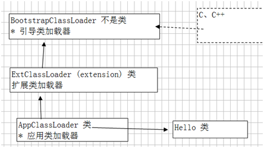

- 使用	类.class.getClassLoader() 获得加载自己的类加载器

- 类加载器加载机制：全盘负责委托机制

  ​	全盘负责：A类如果要使用B类（在内存中不存在），A类加载器必须负责加载B类。

  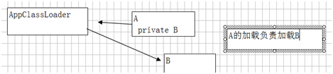

  ​	委托机制：A类加载器如果要加载资源B，必须询问父类加载是否加载。
  ​		如果加载，将直接使用。
  ​		如果没有加载，自己再加载。

- **采用全盘负责委托机制保证一个class文件只会被加载一次，形成一个Class对象。** 

类加载器的获取

```java
package com.itheima.demo06ClassLoader;

import sun.security.ec.SunEC;

/*
    类加载器的获取
    java.lang.Class<T>类中的方法获取类加载器
        ClassLoader getClassLoader() 返回该类的类加载器。
    java.lang.ClassLoader:类加载器是负责加载类的对象。
        ClassLoader getParent() 返回委托的父类加载器。
    类加载器的继承关系:
        AppClassLoader 系统类加载器 extends ExtClassLoader 扩展类加载器 extends BootstrapClassLoader 根类加载器
 */
public class Demo01ClassLoader {
    public static void main(String[] args) {
        show03();
    }

    private static void show03() {
        //直接获取加载核心类的根类加载器
        Class clazz = String.class;
        ClassLoader c = clazz.getClassLoader();
        System.out.println(c);//null  根类加载器不是java语言编写的(c语言),没有对应的类
    }

    private static void show02() {
        //直接获取加载扩展类的类加载器
        Class clazz = SunEC.class;
        ClassLoader c = clazz.getClassLoader();
        System.out.println(c);//sun.misc.Launcher$ExtClassLoader@7ea987ac
    }

    private static void show01() {
        //获取加载当前类Demo01ClassLoader的类加载器
       Class clazz =  Demo01ClassLoader.class;
        ClassLoader c1 = clazz.getClassLoader();
        System.out.println(c1);//sun.misc.Launcher$AppClassLoader@18b4aac2

        ClassLoader c2 = c1.getParent();
        System.out.println(c2);//sun.misc.Launcher$ExtClassLoader@4554617c

        ClassLoader c3 = c2.getParent();
        System.out.println(c3);//null 根类加载器不是java语言编写的(c语言),没有对应的类
    }
}
```

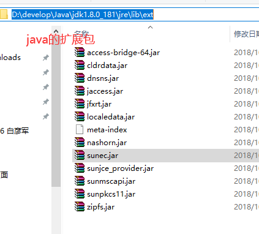

## 6.获取class文件对象的方式(重点)

```java
package com.itheima.demo02class;

import java.util.ArrayList;

/*
    获取class文件对象的方式(重点)
    class文件对象是由类加载器创建的,我们可以获取class文件对象使用
    一共有三种获取方式,获取的class文件对象都是同一个
    1.可以使用Object类中的方法getClass
        Class<?> getClass() 返回此 Object 的运行时类。
    2.java会为每种数据类型都赋予一个class属性,这个属性返回的就是class文件对象
        基本数据类型(4类8种):int.class,double.class,char.class,boolean.class...
        引用数据类型:String.class,Student.class,int[].class,ArrayList<String>.class
    3.可以使用Class类中的静态方法forName获取
        static Class<?> forName(String className) 返回与带有给定字符串名的类或接口相关联的 Class 对象。
        参数:
            String className:全类名(包名+类名)可以确定类的唯一性
            com.itheima.demo01init.Person
            com.itheima.demo02class.Person
 */
public class Demo01Class {
    public static void main(String[] args) throws ClassNotFoundException {
        //1.可以使用Object类中的方法getClass
        Person p = new Person();
        //Person类默认类继承了Object类,所以可以使用Object类中的getClass方法
        Class c1 = p.getClass();
        System.out.println(c1);//class com.itheima.demo02class.Person

        //2.java会为每种数据类型都赋予一个class属性,这个属性返回的就是class文件对象
        System.out.println(int.class);
        System.out.println(double.class);
        System.out.println(String.class);
        System.out.println(ArrayList.class);
        Class c2 = Person.class;
        System.out.println(c2);//class com.itheima.demo02class.Person

        //3.可以使用Class类中的静态方法forName获取
        Class c3 = Class.forName("com.itheima.demo02class.Person");
        System.out.println(c3);//class com.itheima.demo02class.Person

        //三种获取方式,获取的class文件对象都是同一个
        System.out.println(c1==c2);//true 引用数据类型==号比较的是对象的地址值
        System.out.println(c1==c3);//true
        System.out.println(c2==c3);//true
    }
}
```

```java
package com.itheima.demo02class;

public class Person {
}
```

## 7.Class类常用方法(了解)


```java
package com.itheima.demo02class;

/*
    Class类常用方法(了解)
    java.lang.Class<T>:Class 类的实例表示正在运行的 Java 应用程序中的类和接口。
    String getSimpleName() 获取类名
    String getName() 获取全类名(包名+类名)
    ClassLoader getClassLoader() 返回该类的类加载器。
    -------------------------------------
    使用Class类中的forName获取class文件对象,会运行类中的静态代码块(数据库)
 */
public class Demo02Class {
    public static void main(String[] args) throws ClassNotFoundException {
        Class clazz = Class.forName("com.itheima.demo02class.Person");

        String simpleName = clazz.getSimpleName();
        System.out.println(simpleName);//Person

        String name = clazz.getName();
        System.out.println(name);//com.itheima.demo02class.Person

        ClassLoader classLoader = clazz.getClassLoader();
        System.out.println(classLoader);//sun.misc.Launcher$AppClassLoader@18b4aac2
    }
}
```

```java
package com.itheima.demo02class;

public class Person {
    static {
        System.out.println("Person类的静态代码块!");
    }
}
```

## 8.反射概述

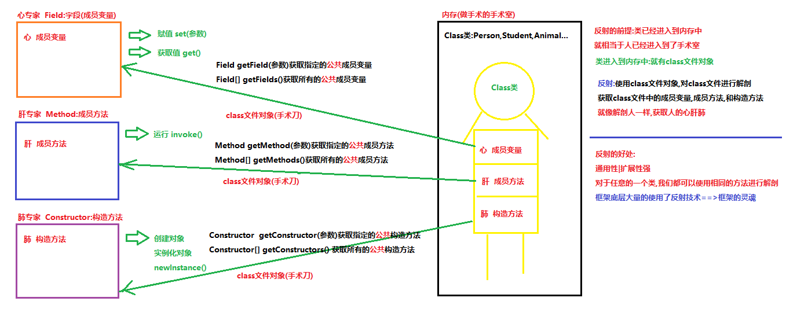

## 9.反射的准备工作

```java
package com.itheima.demo03Reflect;

public class Person {
    private String name;
    private int age;
    private String sex;

    public Person() {
        System.out.println("Person类的空参数构造方法!");
    }

    public Person(String name, int age, String sex) {
        this.name = name;
        this.age = age;
        this.sex = sex;
        System.out.println("Person类的满参数构造方法!");
    }

    private Person(String name, int age) {
        this.name = name;
        this.age = age;
        System.out.println("Person类的私有构造方法!");
    }
    
    private void show(){
        System.out.println("Person类的私有show方法!");
    }

    @Override
    public String toString() {
        return "Person{" +
                "name='" + name + '\'' +
                ", age=" + age +
                ", sex='" + sex + '\'' +
                '}';
    }

    public String getName() {
        return name;
    }

    public void setName(String name) {
        this.name = name;
    }

    public int getAge() {
        return age;
    }

    public void setAge(int age) {
        this.age = age;
    }

    public String getSex() {
        return sex;
    }

    public void setSex(String sex) {
        this.sex = sex;
    }
}
```

## 10.使用反射技术获取类中的构造方法,并使用获取到的构造方法实例化对象

```java
package com.itheima.demo03Reflect;

import java.lang.reflect.Constructor;
import java.lang.reflect.InvocationTargetException;

/*
    使用反射技术获取类中的构造方法,并使用获取到的构造方法实例化对象
    1.获取Person类的class文件对象
    2.使用class文件对象中的方法getConstructor|getConstructors获取类中的(公共)构造方法
    3.使用构造方法Constructor类中的方法newInstance创建对象(实例化对象)
 */
public class Demo01ReflectConstructor {
    public static void main(String[] args) throws ClassNotFoundException, NoSuchMethodException, IllegalAccessException, InvocationTargetException, InstantiationException {
        //1.获取Person类的class文件对象
        Class clazz = Class.forName("com.itheima.demo03Reflect.Person");
        //2.使用class文件对象中的方法getConstructor|getConstructors获取类中的(公共)构造方法
        /*
            java.lang.Class类:获取多个构造方法
                Constructor<?>[] getConstructors() 获取类的所有公共构造方法
                Constructor<?>[] getDeclaredConstructors() 获取类声明的所有构造方法(包括公共、保护、默认（包）访问和私有)
         */
        Constructor[] cons = clazz.getConstructors();
        for (Constructor con : cons) {
            System.out.println(con);
        }
        System.out.println("----------------------------------");
        Constructor[] declaredCons = clazz.getDeclaredConstructors();
        for (Constructor con : declaredCons) {
            System.out.println(con);
        }
        System.out.println("----------------------------------");
        /*
            java.lang.Class类:获取指定的构造方法
                Constructor<T> getConstructor(Class<?>... parameterTypes) 获取指定公共构造方法
                Constructor<T> getDeclaredConstructor(Class<?>... parameterTypes) 获取指定构造方法(包括公共、保护、默认（包）访问和私有)
                参数:
                   ...:可变参数,方法的参数是可变参数,调用方法,参数可以传递任意个(不传递,1,2,3,4...1000...)
                   Class<?>... parameterTypes:传递参数列表的class文件对象
                   public Person() ==>()不传递参数
                   public Person(String name, int age, String sex)==>(String.class,int.class,String.class)
                   private Person(String name, int age) ==>(String.class,int.class)
               注意:
                    类中没有指定的构造方法,会抛出NoSuchMethodException:没有这个方法异常
         */
        //public Person()
        Constructor con1 = clazz.getConstructor();
        System.out.println(con1);//public com.itheima.demo03Reflect.Person()

        //public Person(String name, int age, String sex)
        Constructor con2 = clazz.getConstructor(String.class,int.class,String.class);
        System.out.println(con2);//public com.itheima.demo03Reflect.Person(java.lang.String,int,java.lang.String)

        //private Person(String name, int age)
        Constructor con3 = clazz.getDeclaredConstructor(String.class, int.class);
        System.out.println(con3);//private com.itheima.demo03Reflect.Person(java.lang.String,int)

        //3.使用构造方法Constructor类中的方法newInstance创建对象(实例化对象)
        /*
            java.lang.reflect.Constructor<T>类
                T newInstance(Object... initargs) 创建对象(实例化对象)
                参数:
                    Object... initargs:创建对象使用的实际参数  new Person("柳岩",18,"女");
                返回值:
                    T:创建好的对象,使用Object类型接收
                    多态 Object obj = new Person("柳岩",18,"女");
         */
        //public Person() 使用获取到的空参数构造方法创建对象
        Object obj1 = con1.newInstance();//相当于 new Person();
        System.out.println(obj1);//Person{name='null', age=0, sex='null'}

        //public Person(String name, int age, String sex)使用获取到的满参数构造方法创建对象
        Object obj2 = con2.newInstance("柳岩", 18, "女");//相当于 new Person("柳岩", 18, "女");
        System.out.println(obj2);

        /*
            private Person(String name, int age) 使用获取到的私有构造方法创建对象
            私有构造方法我们没有权限使用,会抛出IllegalAccessException:非法访问异常
            解决办法:
                可以使用Constructor父类AccessibleObject中的方法解决
                    void setAccessible(boolean flag) 将此对象的 accessible 标志设置为指示的布尔值。
                    值为 true 则指示反射的对象在使用时应该取消 Java 语言访问检查。
                    值为 false 则指示反射的对象应该实施 Java 语言访问检查。
            注意:
                私有构造方法不建议使用,破坏了类的封装性        
         */
        con3.setAccessible(true);//取消 Java 语言访问检查==>暴力反射
        Object obj3 = con3.newInstance("刘亦菲", 18);//相当于 new Person("刘亦菲", 18);
        System.out.println(obj3);//Person{name='刘亦菲', age=18, sex='null'}
    }
}
```

## 11.使用反射技术获取构造方法并实例化对象的简化方式(重点)

```java
package com.itheima.demo03Reflect;

/*
    使用反射技术获取构造方法并实例化对象的简化方式(重点)
    java.lang.Class类中的方法:
        T newInstance() 创建此 Class 对象所表示的类的一个新实例。
        可以直接使用class文件对象中的方法newInstance实例化对象,默认使用空参数构造方法创建对象
    注意:
        1.类中必须有空参数构造方法
        2.空参数构造方法的修饰符建议使用public
    使用步骤:
        1.获取Person的class文件对象
        2.使用class文件对象中的方法newInstance实例化对象
 */
public class Demo02ReflectConstructor {
    public static void main(String[] args) throws Exception {
        //1.获取Person的class文件对象
        Class clazz = Class.forName("com.itheima.demo03Reflect.Person");
        //2.使用class文件对象中的方法newInstance实例化对象
        //Object obj = clazz.getConstructor().newInstance();
        Object obj = clazz.newInstance();
        System.out.println(obj);//Person{name='null', age=0, sex='null'}

        //想要使用Person类特有的方法,需要向下转型
        Person p = (Person)obj;
        p.setName("老王");
        p.setAge(20);
        p.setSex("女");
        System.out.println(p);//Person{name='老王', age=20, sex='女'}
    }
}
```

## 12.使用反射技术获取类中的成员方法,并运行获取到成员方法(重点)

```java
package com.itheima.demo03Reflect;

import java.lang.reflect.InvocationTargetException;
import java.lang.reflect.Method;

/*
    使用反射技术获取类中的成员方法,并运行获取到成员方法(重点)
    1.获取Person类class文件对象
    2.使用class文件对象中的方法getMethod|getMethods获取类中的(公共)成员方法
    3.使用成员方法Method类中的方法invoke运行获取到方法
 */
public class Demo03ReflectMethod {
    public static void main(String[] args) throws ClassNotFoundException, NoSuchMethodException, IllegalAccessException, InstantiationException, InvocationTargetException {
        //1.获取Person类class文件对象
        Class clazz = Class.forName("com.itheima.demo03Reflect.Person");
        //2.使用class文件对象中的方法getMethod|getMethods获取类中的(公共)成员方法
        /*
            java.lang.Class类:获取多个成员方法
                Method[] getMethods() 获取本类中|父类中|接口中继承过来的所有公共成员方法
                Method[] getDeclaredMethods()  获取类或接口声明的所有方法，包括公共、保护、默认（包）访问和私有方法，但不包括继承的方法。
            Method类中有一个方法叫getName,可以获取到方法的名称
         */
        Method[] methods = clazz.getMethods();
        for (Method m : methods) {
            System.out.println(m.getName());
        }
        System.out.println("---------------------------------------");
        Method[] declaredMethods = clazz.getDeclaredMethods();
        for (Method method : declaredMethods) {
            System.out.println(method);
        }
        System.out.println("---------------------------------------");
        /*
            java.lang.Class类:获取指定的成员方法
                Method getMethod(String name, Class<?>... parameterTypes)  获取指定公共成员方法,包含继承的
                Method getDeclaredMethod(String name, Class<?>... parameterTypes)  获取指定已声明方法(包括公共、保护、默认（包）访问和私有方法，但不包括继承的方法)
                参数:
                    String name:传递要获取的方法名称
                    Class<?>... parameterTypes:方法参数列表的class文件对象
            注意:
                如果没有指定的成员方法,会抛出NoSuchMethodException
         */
        //public String getName()
        Method getNameMethod = clazz.getMethod("getName");
        System.out.println(getNameMethod);//public java.lang.String com.itheima.demo03Reflect.Person.getName()

        //public void setName(String name)
        Method setNameMethod = clazz.getMethod("setName", String.class);
        System.out.println(setNameMethod);//public void com.itheima.demo03Reflect.Person.setName(java.lang.String)

        //private void show()
        Method showMethod = clazz.getDeclaredMethod("show");
        System.out.println(showMethod);//private void com.itheima.demo03Reflect.Person.show()

        //3.使用成员方法Method类中的方法invoke运行获取到方法
        /*
            java.lang.reflect.Method类
                Object invoke(Object obj, Object... args) 运行获取到方法
                参数:
                    Object obj:运行方法需要对象的支持,运行哪个类中的方法,就需要传递哪个类对应的对象
                        运行Person类的成员方法,需要传递Person对象(可以使用反射快速方式获取)
                    Object... args:运行方法传递的实际参数
                返回值:
                    Object:方法的返回值
                        如果方法没有返回值,Object就是null
         */
        Object obj = clazz.newInstance();
        System.out.println(obj);//Person{name='null', age=0, sex='null'}
        //public String getName() 运行获取到的getName方法,获取成员变量name的值
        Object v1 = getNameMethod.invoke(obj);
        System.out.println("v1:"+v1);//v1:null name的默认值

        //public void setName(String name)运行获取到的setName方法,给成员变量name赋值
        Object v2 = setNameMethod.invoke(obj, "鬼僧");
        System.out.println("v2:"+v2);//v2:null 方法没有返回值

        //public String getName() 运行获取到的getName方法,获取成员变量name的值
        v1 = getNameMethod.invoke(obj);
        System.out.println("v1:"+v1);//v1:鬼僧

        /*
            private void show()运行获取到的私有show方法
            私有方法没有权限运行,会抛出IllegalAccessException:非法访问异常
            可以使用暴力反射解决
         */
        showMethod.setAccessible(true);//取消java语言权限访问检查==>暴力反射
        showMethod.invoke(obj);//Person类的私有show方法!
    }
}
```

## 13.使用反射技术获取实现类所实现的所有接口(了解_扩展)

```java
package com.itheima.demo04Reflect;

/*
    使用反射技术获取实现类所实现的所有接口(了解_扩展)
    java.lang.Class类
        Class<?>[] getInterfaces() 确定此对象所表示的类或接口实现的接口。
 */
public class Demo01ReflectInterface {
    public static void main(String[] args) throws ClassNotFoundException {
        //获取接口实现类AandBImpl的class文件对象
        Class clazz = Class.forName("com.itheima.demo04Reflect.AandBImpl");
        //实现类所实现的所有接口的class文件对象
        Class[] interfaces = clazz.getInterfaces();
        for (Class in : interfaces) {
            /*
                interface com.itheima.demo04Reflect.A
                interface com.itheima.demo04Reflect.B
             */
            System.out.println(in);
        }
        System.out.println("--------------------------");
        Class clazz2 = Class.forName("java.util.ArrayList");
        Class[] interfaces2 = clazz2.getInterfaces();
        for (Class in : interfaces2) {
            /*  
                interface java.util.List
                interface java.util.RandomAccess
                interface java.lang.Cloneable
                interface java.io.Serializable
             */
            System.out.println(in);
        }
    }
}
```

```java
package com.itheima.demo04Reflect;

public interface A {
}
```

```java
package com.itheima.demo04Reflect;

public interface B {
}
```

```java
package com.itheima.demo04Reflect;

public class AandBImpl implements A,B {
}
```

## 🎗 经验值分享：利用反射机制在这个泛型为Integer的ArrayList中存放一个String类型的对象

### 1.已知代码：

```java
/**
	现有集合：ArrayList<Integer>list = new ArrayList();
	利用反射机制在这个泛型为Integer的ArrayList中存放一个String类型的对象。
*/
public class Test01 {

    public static void main(String[] args) throws NoSuchMethodException, InvocationTargetException, IllegalAccessException {

        // 创建集合对象
        ArrayList<Integer> list = new ArrayList();
        list.add(100);
        list.add(200);
        list.add(300);

        // 获得字节码对象
        Class aClass = list.getClass();

        // 获得add方法对象
        Method method = aClass.getMethod("add", Integer.class);

        // 反射执行方法
        method.invoke(list,"么么哒");

        // 打印集合对象(元素数据)
        System.out.println(list);

    }

}
```

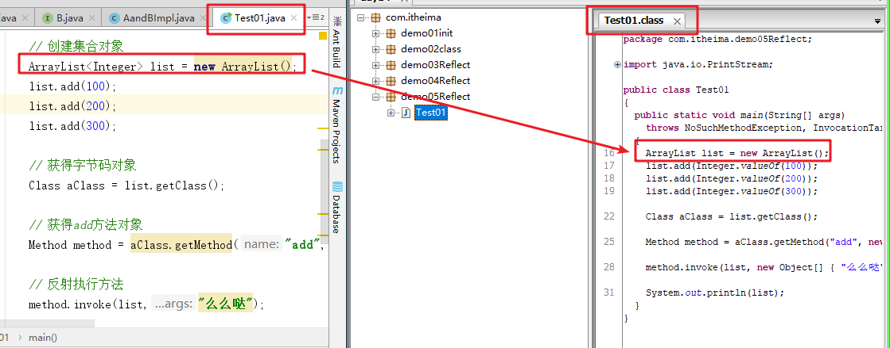

### 2.出现的问题:

> 执行上面的代码，控制台出现如下错误：

 

### 3.问题的分析：

> **NoSuchMethodException：不存在这样的方法异常！**
>
> 结合控制台提示，给出的详细提示为：在java.util包中的ArrayList类中不存在add(Integer i)方法。
>
> 在创建集合对象的时候，明确指定集合的泛型类型为Integer，很容易给人一种误导，添加到集合中的数据只能是Integer类型的数据(编译阶段语法检查)，**故而认为list的添加方法此时给定的参数类型必定是Integer**，从而将获得方法对象使用的getMethod方法的第二个参数认定为Integer类型。
>
> 这里需要跳出误区，泛型仅仅只是在编译阶段做的一个语法检查，运行阶段会被擦除；ArrayList本身是可以添加任意类型的数据的！【方法定义：add(E e)，这的E其实就是Object类型】

### 4.问题的解决办法：

> 将获得方法对象使用的getMethod方法的第二个参数指定为Object类型即可

```java
/**
	现有集合：ArrayList<Integer>list = new ArrayList();
	利用反射机制在这个泛型为Integer的ArrayList中存放一个String类型的对象。
*/
public class Test01 {

    public static void main(String[] args) throws NoSuchMethodException, InvocationTargetException, IllegalAccessException {

        // 创建集合对象
        ArrayList<Integer> list = new ArrayList();
        list.add(100);
        list.add(200);
        list.add(300);

        // 获得字节码对象
        Class aClass = list.getClass();

        // 获得add方法对象
        Method method = aClass.getMethod("add", Object.class);

        // 反射执行方法
        method.invoke(list,"么么哒");

        // 打印集合对象(元素数据)
        System.out.println(list);

    }

}
```

 

# 第二章 注解

## 1.注解概述

- 注解是JDK1.5的新特性。
- 标记(注解)可以加在包，类，字段，方法，方法参数以及局部变量上。
- 注解是给编译器或JVM看的，编译器或JVM可以根据注解来完成对应的功能。

注解的作用:

​	1.**使用javadoc生成帮助文档**：里边可以包含注解**@author和@version**

​	2.**编译检查**：**@Override** **@FunctionalInterface**

​	3.**框架的配置(框架=代码+配置)**:框架的时候讲

## 2.自定义注解(重点)

### a.定义没有属性的注解

```java
package com.itheima.demo06Annotation;

/*
    定义没有属性的注解
    注意:
        注解和类和接口和枚举都是同一个层次数据类型
        注解使用的也是.java文件,编译生成的也是.class文件
        定义注解使用关键字@interface
    定义格式:
        public @interface 注解名{ }
 */
public @interface MyAnnotation01 {
}
```

### b.定义有属性的注解

```java
package com.itheima.demo06Annotation;

/*
    定义有属性的注解
    注意:
        注解中是没有变量和方法的
        注解中有属性,属性可以看成是抽象方法的格式,但是包含默认值
    定义格式:
        public @interface 注解名{
            修饰符 数据类型 属性名();
            修饰符 数据类型 属性名() default 默认值;
        }
        1.修饰符:固定使用public abstract,可以省略不写,也可以写一部分,不写默认也是
            建议写出,增强阅读性
        2.数据类型
            a.基本数据类型(4类8种):byte,short,int,long,float,double,boolean,char
            b.引用数据类型:String类型,Class类型,注解类型,枚举类型
            c.以及以上所有类型的一维数组
 */
public @interface MyAnnotation02 {
    //定义一个int类型的属性
    //public abstract int a();
    //abstract int a();
    //public int a();
    int a();

    //定义一个double类型的属性,包含默认值8.8
    public abstract double d() default 8.8;

    //定义一个String类型数组的属性
    public abstract String[] arr();

    //定义一个Class类型的属性
    //public abstract Class clazz();
    //注解类型
    //public abstract MyAnnotation01 my01();
    //枚举类型
    //public abstract Color c();
}
```

### c.定义枚举(了解)

```java
package com.itheima.demo06Annotation;

/*
    枚举中的属性都是常量
 */
public enum Color {
    /*
        public static fianl Color GREEN = new Color();
        public static fianl Color RED = new Color();
     */
    GREEN,RED
}
```

### d.定义包含特殊属性value的注解

```java
package com.itheima.demo06Annotation;

/*
    注解中只有一个属性,并且属性名叫value,或者有其他的属性但是必须有默认值
 */
public @interface MyAnnotation03 {
    public abstract String value();

    public abstract int age() default 18;
}
```

## 3.使用自定义注解(重点)

@注解名(属性名=属性值,属性名=属性值,属性名=属性值,...属性名=属性值)

```java
package com.itheima.demo07Annotation;

/*
    使用自定义注解:
    注解可以使用的位置:
        包上,类上|接口上,构造方法上,成员变量上,成员方法上,局部变量上,方法的参数上...
    注意:
        1.同一个位置,同名的注解只能使用一次
        2.不同的位置,同名的注解可以多次使用
    使用格式:
        1.没有属性的注解,通过@注解名可以直接使用
            @MyAnnotation01        
        2.有属性的注解,必须使用健值对的方式,给注解的所有属性都赋值之后才可以使用
            @注解名(属性名=属性值,属性名=属性值,属性名=属性值...属性名=属性值)
            a.有默认值的属性,可以不用赋值,使用默认值
            b.多个属性之间赋值使用逗号分隔开   
            c.属性的数据类型如果是一个数组,数组的值需要使用大括号{ }包裹起来,说明这是一个属性的值
                如果数组属性的值只有一个,可以省略{ } 
                arr = {"aa","bb",'cc"}   arr={"aa"}==>arr="aa"
            d.如果注解只有一个属性,并且属性名叫value;或者有其他属性,但是必须有默认值
                给主键的value属性赋值的时候,可以省略属性名,直接写属性值,默认就是value赋值
                (value = 10)  ==> (10)  
 */
@MyAnnotation01
@MyAnnotation02(a = 100,arr={"aa","bb","cc"})
public class UseMyAnnotation {
    @MyAnnotation01
    private String name;
    @MyAnnotation02(a=88,d=1.1,arr="aa")
    private int age;

    @MyAnnotation01
    @MyAnnotation03(value="hello",a=10)
    public UseMyAnnotation() {
    }

    @MyAnnotation03("hello")
    public UseMyAnnotation(String name, int age) {
        this.name = name;
        this.age = age;
    }

    @MyAnnotation01
    public String getName() {
        return name;
    }

    public void setName(String name) {
        this.name = name;
    }

    public int getAge() {
        return age;
    }

    public void setAge(int age) {
        this.age = age;
    }
}
```

## 4.注解练习_定义和使用Book注解

```java
package com.itheima.demo07Annotation;

/*
    定义一个注解：Book
        包含属性：String value() 书名
        包含属性：double price() 价格，默认值为 100
        包含属性：String[] authors() 多位作者
 */
public @interface Book {
    //书名
    public abstract String value();
    //价格，默认值为 100
    public abstract double price() default 100;
    //多位作者
    public abstract String[] authors();
}
```

```java
package com.itheima.demo07Annotation;

/*
    使用Book注解
 */
@Book(value = "斗破苍穹",price = 39.9,authors = "天蚕土豆")
public class UseBook {
    @Book(value = "斗罗大陆",authors = {"唐家三少","唐家二少","唐家大少"})
    private String name;

    public UseBook(String name) {
        this.name = name;
    }

    public String getName() {
        return name;
    }

    public void setName(String name) {
        this.name = name;
    }
}
```

## 5.元注解(重点)

```java
元注解:java已经定义好的注解,可以使用元注解修饰自定义的注解
    1.java.lang.annotation.Target
        作用:用来标识注解使用的位置，如果没有使用该注解标识，则自定义的注解可以使用在任意位置。
        属性:
            ElementType[] value :只有一个属性,属性名叫value;使用的时候,就可以省略属性名,直接写属性值
            java.lang.annotation.ElementType:是一个枚举,枚举中的变量都是常量,可以通过枚举名.变量名直接使用
            ElementType枚举中的常量:
                TYPE，类，接口
                FIELD, 成员变量
                METHOD, 成员方法
                PARAMETER, 方法参数
                CONSTRUCTOR, 构造方法
                LOCAL_VARIABLE, 局部变量
   2.java.lang.annotation:Retention
        作用:用来标识注解的生命周期(有效范围),不写默认值是CLASS
        属性:
            RetentionPolicy value: 只有一个属性,属性名叫value;使用的时候,就可以省略属性名,直接写属性值
            java.lang.annotation.RetentionPolicy:是一个枚举,枚举中的变量都是常量,可以通过枚举名.变量名直接使用
            RetentionPolicy枚举中的常量:
                SOURCE：注解只作用在源码(.java)阶段，生成的字节码文件(.class)中不存在
                CLASS：注解作用在源码阶段，字节码文件阶段，运行阶段(内存中)不存在，默认值
                RUNTIME：注解作用在源码阶段，字节码文件阶段，运行(内存中)阶段
```

```java
package com.itheima.demo08Annotation;

import java.lang.annotation.ElementType;
import java.lang.annotation.Retention;
import java.lang.annotation.RetentionPolicy;
import java.lang.annotation.Target;

//@Target元注解可以限制自定义注解可以使用的位置,不写@Target注解自定义注解可以使用在任意的位置
//{ElementType.CONSTRUCTOR,ElementType.FIELD,ElementType.TYPE}:自定义注解可以使用在构造方法上,成员变量上,类上|接口上
@Target(value={ElementType.CONSTRUCTOR,ElementType.FIELD,ElementType.TYPE})
//@Retention元注解可以声明自定义注解的生命周期,不写默认(ClASS在.java文件和.class文件有效,运行的内存中无效)
//RetentionPolicy.RUNTIME:(.java文件和.class文件和运行的内存中都有效)
@Retention(RetentionPolicy.RUNTIME)
public @interface Book {
    //书名
    public abstract String value();
    //价格，默认值为 100
    public abstract double price() default 100;
    //多位作者
    public abstract String[] authors();
}
```

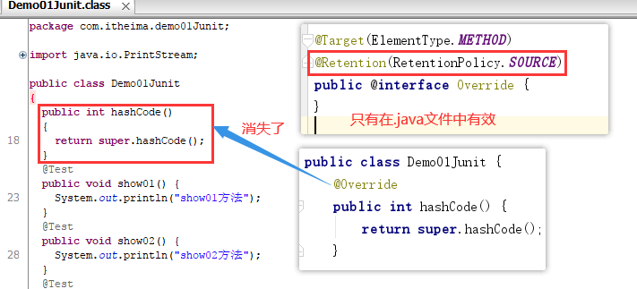

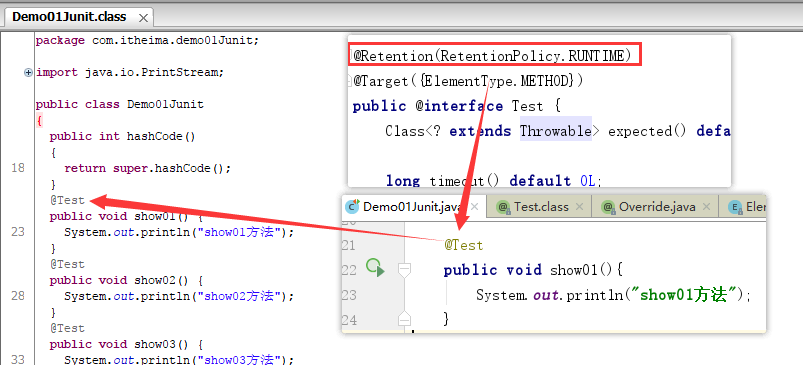

## 6.注解解析(使用)

```java
注解解析
	获取注解的属性值
注解的解析底层使用的反射技术
java.lang.reflect.AnnotatedElement接口:在接口中定义了注解解析的方法
AnnotatedElement接口的实现类:实现类都重写了接口中的方法,都可以使用这些方法
	AccessibleObject, Class, Constructor, Field, Method, Package
AnnotatedElement接口中的常用方法:
	1.boolean isAnnotationPresent(Class<?> annotationClass)
		判断指定的对象(Class,Method...)上,是否包含指定的注解
		参数:
		   Class<?> annotationClass:判断哪个注解,就传递哪个注解的class文件对象
			判断类上,方法上有没有Book注解,就需要传递Book.class
		返回值:boolean
		   有指定的注解,返回true
		   没有指定的注解,返回false
	2.T getAnnotation(Class<T> annotationClass)
		获取对象(Class,Method...)上,指定的注解
		参数:
			Class<T> annotationClass:获取哪个注解,就传递哪个注解的class文件对象
			获取类上,方法上的Book注解,就需要传递Book.class
		返回值:
			T:返回获取到的注解,获取的注解不存在,返回null
	了解:
	 3.Annotation[] getAnnotations() 获得当前对象上使用的所有注解，返回注解数组，包含父类继承的
	 4.Annotation[] getDeclaredAnnotations() 获得当前对象上使用的所有注解，返回注解数组,只包含本类的
```

```java
package com.itheima.demo09parseAnnotation;

import java.lang.annotation.ElementType;
import java.lang.annotation.Retention;
import java.lang.annotation.RetentionPolicy;
import java.lang.annotation.Target;

@Retention(RetentionPolicy.RUNTIME)
@Target({ElementType.TYPE,ElementType.METHOD})
public @interface Book {
    //书名
    public abstract String value();
    //价格，默认值为 100
    public abstract double price() default 100;
    //多位作者
    public abstract String[] authors();
}
```

```java
package com.itheima.demo09parseAnnotation;

import org.junit.Test;

import java.lang.annotation.Annotation;
import java.lang.reflect.Method;
import java.util.Arrays;

@Book(value = "西游记",price = 88.8,authors = {"吴承恩"})
public class Demo01ParseAnnotation {
    @Book(value = "水浒传",authors = {"施耐庵","宋江","鲁智深","林冲"})
    public void show(){}

    /*
        解析方法上的注解:获取方法上Book注解的属性值
        1.获取Demo01ParseAnnotation类的class文件对象
        2.使用class文件对象中的方法getMethods,获取类中所有的公共方法,返回一个Method类型的数组
        3.遍历数组,获取每一个Method对象
        4.使用Method对象中的方法isAnnotationPresent判断方法上是否有Book注解
        5.如果方法上有Book注解,使用Method对象中的方法getAnnotation获取Book注解
        6.使用注解名.属性名(),获取注解的属性值
     */
    @Test
    public void method02(){
        //1.获取Demo01ParseAnnotation类的class文件对象
        Class clazz = Demo01ParseAnnotation.class;
        //2.使用class文件对象中的方法getMethods,获取类中所有的公共方法,返回一个Method类型的数组
        Method[] methods = clazz.getDeclaredMethods();
        //3.遍历数组,获取每一个Method对象
        for (Method method : methods) {
            //System.out.println(method.getName()+"==>"+method.isAnnotationPresent(Book.class));
            //4.使用Method对象中的方法isAnnotationPresent判断方法上是否有Book注解
            if(method.isAnnotationPresent(Book.class)){
                //5.如果方法上有Book注解,使用Method对象中的方法getAnnotation获取Book注解
                Book book = method.getAnnotation(Book.class);
                //6.使用注解名.属性名(),获取注解的属性值
                System.out.println(book.value());
                System.out.println(book.price());
                System.out.println(Arrays.toString(book.authors()));
            }
        }
    }

    /*
        解析类上的注解:获取类上Book注解的属性值
        1.获取Demo01ParseAnnotation类的class文件对象
        2.使用class文件对象中的方法isAnnotationPresent判断类上是否有Book注解
        3.如果类上有Book注解,使用class文件对象中的方法getAnnotation获取Book注解
        4.使用注解名.属性名(),获取注解的属性值
     */
    @Test
    public void method01() throws ClassNotFoundException {
        //1.获取Demo01ParseAnnotation类的class文件对象
        Class clazz = Class.forName("com.itheima.demo09parseAnnotation.Demo01ParseAnnotation");
        //2.使用class文件对象中的方法isAnnotationPresent判断类上是否有Book注解
        boolean b = clazz.isAnnotationPresent(Book.class);
        System.out.println(b);
        //3.如果类上有Book注解,使用class文件对象中的方法getAnnotation获取Book注解
        if(b){
            Book book = (Book)clazz.getAnnotation(Book.class);
            //4.使用注解名.属性名(),获取注解的属性值
            String value = book.value();
            System.out.println(value);
            double price = book.price();
            System.out.println(price);
            String[] authors = book.authors();
            System.out.println(Arrays.toString(authors));
        }
    }
}
```

## 7.注解和反射的综合案例(重点)

```java
package com.itheima.demo10Test;

import java.lang.reflect.Method;

/*
    注解和反射的综合案例(重点)
    需求:
        模拟Junit单元测试的@Test注解:可以单独的执行某一个方法
        方法上添加了@Test注解,方法可以运行
        方法上没有添加@Test注解,方法不可以运行
    实现步骤:
        1.定义一个注解,名字叫MyTest,使用元注解修饰(a.只能使用在方法上b.运行时有效)
        2.定义一个测试类,在类中定义多个方法,部分方法使用MyTest注解修饰
        3.获取测试类的class文件对象
        4.使用class文件对象中的方法newInstance实例化对象(运行方法)
        5.使用class文件对象中的方法getMethods获取测试类中所有的方法,存储到一个Method数组中返回
        6.遍历Method数组,获取每一个Method方法
        7.使用Method类中的方法isAnnotationPresent判断方法上是否有MyTest注解
        8.如果方法上有MyTest注解,使用Method类中的方法invoke运行方法
 */
public class Demo01Test {
    public static void main(String[] args) throws Exception {
        //3.获取测试类的class文件对象
        Class clazz = Class.forName("com.itheima.demo10Test.DemoMyTest");
        //4.使用class文件对象中的方法newInstance实例化对象(运行方法)
        Object obj = clazz.newInstance();
        //5.使用class文件对象中的方法getMethods获取测试类中所有的方法,存储到一个Method数组中返回
        Method[] methods = clazz.getDeclaredMethods();
        //6.遍历Method数组,获取每一个Method方法
        for (Method method : methods) {
            //7.使用Method类中的方法isAnnotationPresent判断方法上是否有MyTest注解
            if(method.isAnnotationPresent(MyTest.class)){
                //8.如果方法上有MyTest注解,使用Method类中的方法invoke运行方法
                method.invoke(obj);
            }
        }
    }
}
```

```java
package com.itheima.demo10Test;

import java.lang.annotation.ElementType;
import java.lang.annotation.Retention;
import java.lang.annotation.RetentionPolicy;
import java.lang.annotation.Target;

//1.定义一个注解,名字叫MyTest,使用元注解修饰(a.只能使用在方法上b.运行时有效)
@Target(ElementType.METHOD)
@Retention(RetentionPolicy.RUNTIME)
public @interface MyTest {
}
```

```java
package com.itheima.demo10Test;

//2.定义一个测试类,在类中定义多个方法,部分方法使用MyTest注解修饰
public class DemoMyTest {
    public void show01(){
        System.out.println("show01方法");
    }

    @MyTest
    public void show02(){
        System.out.println("show02方法");
    }

    public void show03(){
        System.out.println("show03方法");
    }

    @MyTest
    public void show04(){
        System.out.println("show04方法");
    }

    @MyTest
    public void show05(){
        System.out.println("show05方法");
    }
}
```

# 第三章 动态代理 

## 1.动态代理概述

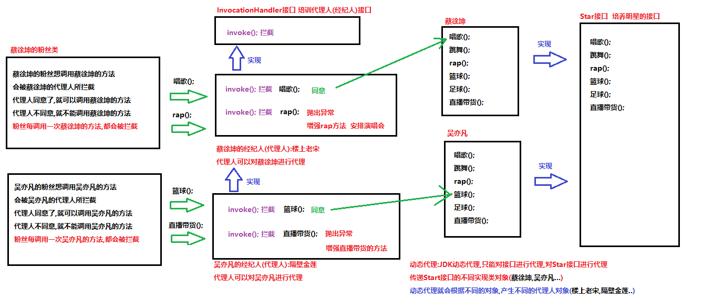

## 2.动态代理代码实现

Star接口

```java
package com.itheima.demo11Proxy;

//培养明星的接口
public interface Star {
    //定义唱歌方法
    public abstract void changGe();
    //定义跳舞方法
    public abstract void tiaoWu();
    //定义rap方法
    public abstract void rap();
    //定义篮球方法
    public abstract void lanQiu();
    //定义足球方法
    public abstract void zuQiu();
    //定义直播带货方法
    public abstract String zhiBoDaiHuo(double money);
}
```

CaiXuKun类

```java
package com.itheima.demo11Proxy;

public class CaiXuKun implements Star{
    @Override
    public void changGe() {
        System.out.println("蔡徐坤在唱歌!");
    }

    @Override
    public void tiaoWu() {
        System.out.println("蔡徐坤在跳舞!");
    }

    @Override
    public void rap() {
        System.out.println("蔡徐坤在rap!");
    }

    @Override
    public void lanQiu() {
        System.out.println("蔡徐坤在打篮球!");
    }

    @Override
    public void zuQiu() {
        System.out.println("蔡徐坤在踢足球!");
    }

    @Override
    public String zhiBoDaiHuo(double money) {
        System.out.println("蔡徐坤在直播带货,挣了"+money+"钱!");
        return "辣条";
    }
}
```

WuYiFan类

```java
package com.itheima.demo11Proxy;

/*
    ctrl+r:查找并替换
 */
public class WuYiFan implements Star{
    @Override
    public void changGe() {
        System.out.println("吴亦凡在唱歌!");
    }

    @Override
    public void tiaoWu() {
        System.out.println("吴亦凡在跳舞!");
    }

    @Override
    public void rap() {
        System.out.println("吴亦凡在rap!");
    }

    @Override
    public void lanQiu() {
        System.out.println("吴亦凡在打篮球!");
    }

    @Override
    public void zuQiu() {
        System.out.println("吴亦凡在踢足球!");
    }

    @Override
    public String zhiBoDaiHuo(double money) {
        System.out.println("吴亦凡在直播带货,挣了"+money+"钱!");
        return "辣条";
    }
}
```

测试类:

```java
package com.itheima.demo11Proxy;

import java.lang.reflect.InvocationHandler;
import java.lang.reflect.Method;
import java.lang.reflect.Proxy;

/*
    java.lang.reflect.Proxy类
        Proxy 提供用于创建动态代理类和实例的静态方法
    Proxy类中的静态方法:用于生产代理人对象
        static Object newProxyInstance(ClassLoader loader, Class<?>[] interfaces, InvocationHandler h)
        参数:
            ClassLoader loader:传递加载类的类加载器对象
            Class<?>[] interfaces:被代理人(蔡徐坤,吴亦凡)实现的所有接口的class文件对象
            InvocationHandler h:用于生产代理人的接口,传递InvocationHandler接口的实现类对象(匿名内部类)
        返回值:
            Object:生产的代理人对象
    ---------------------------------------------------------------------------
    java.lang.reflect.InvocationHandler接口
        InvocationHandler 是代理实例的调用处理程序 实现的接口。
    接口中的方法:
        Object invoke(Object proxy, Method method, Object[] args)  用于拦截的方法
        参数:
            Object proxy:内部产生的代理人对象,不用管
            Method method:内部使用反射技术,拦截被代理人的方法,赋值给method变量
                invoke对被代理人的方法(唱歌,跳舞,rap...)进行拦截,赋值给method变量
            Object[] args:拦截到的方法(唱歌,跳舞,rap...)的参数列表
        返回值:
            Object:拦截到的方法的返回值
 */
public class Demo01Proxy {
    public static void main(String[] args) {
        //创建蔡徐坤对象
        CaiXuKun cxk = new CaiXuKun();
        //cxk.changGe();
        //cxk.tiaoWu();
        //cxk.rap();
        //生产蔡徐坤的代理人
        Star cxkProxy = (Star)Proxy.newProxyInstance(cxk.getClass().getClassLoader(), cxk.getClass().getInterfaces(), new InvocationHandler() {
            @Override
            public Object invoke(Object proxy, Method method, Object[] args) throws Throwable {
                //获取到拦截到的方法名称
                String name = method.getName();
                //对获取到的方法名称进行判断
                //是rap对rap方法进行增强
                if("rap".equals(name)){
                    System.out.println("蔡徐坤在鸟巢的舞台上rap一天一夜!");
                    return null;
                }
                //是打篮球抛出异常
                if ("lanQiu".equals(name)){
                    throw new RuntimeException("不给你打篮球看!");
                }
                //是唱歌,跳舞,踢足球,直播带货,让方法运行
                Object v = method.invoke(cxk, args);
                return v;
            }
        });
        //cxkProxy.changGe();
        //String s = cxkProxy.zhiBoDaiHuo(10000);
        //System.out.println(s);
        //cxkProxy.rap();
        //cxkProxy.lanQiu();

        //生产吴亦凡的代理人
        WuYiFan wyf = new WuYiFan();
        Star wyfProxy = (Star)Proxy.newProxyInstance(wyf.getClass().getClassLoader(), wyf.getClass().getInterfaces(), new InvocationHandler() {
            @Override
            public Object invoke(Object proxy, Method method, Object[] args) throws Throwable {
                //获取到拦截到的方法名称
                String name = method.getName();
                //对拦截到的方法进行判断
                if("zhiBoDaiHuo".equals(name)){
                    throw new RuntimeException("不直播带货!");
                }
                //其他方法,放行,让方法运行
                return method.invoke(wyf,args);
            }
        });
        wyfProxy.zuQiu();
        wyfProxy.zhiBoDaiHuo(10000);
    }
}
```

## 3.**演示Java中Collections的unmodifiableList方法**

```java
演示Java中Collections的unmodifiableList方法
java.util.Collections:操作集合的工具类
	static <T> List<T> unmodifiableList(List<? extends T> list) 返回指定列表的不可修改视图。
	此方法允许模块为用户提供对内部列表的“只读”访问。
	在返回的列表上执行的查询操作将“读完”指定的列表。
	试图修改返回的列表（不管是直接修改还是通过其迭代器进行修改）
	将导致抛出 UnsupportedOperationException(运行时异常:不支持操作异常)。
传递List接口的实现类对象到unmodifiableList方法中,给我们返回一个不可以被修改的List对象(相当于给我们返回一个代理人对象)
	使用返回的List对象调用方法
		如果使用size,get方法,没有对集合进行修改,就可以运行方法
		如果使用add,remove,set方法,对集合进行了修改,就会抛出异常
```

```java
package com.itheima.demo11Proxy;

import java.util.ArrayList;
import java.util.Collections;
import java.util.List;

/*
    演示Java中Collections的unmodifiableList方法
 */
public class Demo02Collections {
    public static void main(String[] args) {
        //创建ArrayList集合对象,添加元素
        ArrayList<String> list = new ArrayList<>();
        list.add("aaa");
        list.add("bbb");
        list.add("ccc");
        list.add("ddd");
        //调用Collections的unmodifiableList方法,传递List集合,返回一个不可修改的List集合
        List<String> proxyList = Collections.unmodifiableList(list);
        //如果使用size,get方法,没有对集合进行修改,就可以运行方法
        System.out.println(proxyList.size());//4
        System.out.println(proxyList.get(2));//ccc
        //如果使用add,remove,set方法,对集合进行了修改,就会抛出异常
        //proxyList.add("eee");//UnsupportedOperationException:不支持操作异常
        //proxyList.remove(1);//UnsupportedOperationException:不支持操作异常
        //proxyList.set(1,"hello");//UnsupportedOperationException:不支持操作异常
    }
}
```

## 4.动态代理综合案例

**需求:**
	使用动态代理模拟unmodifiableList方法,对List接口进行代理
		调用List接口的方法会被拦截
		如果使用的size,get方法,没有对集合进行修改,则允许执行
		如果使用的add,remove,set方法,对集合进行了修改,则抛出运行时异常

**分析:**
	1.定义一个代理方法proxyList
		参数:传递List集合
		返回值:被代理之后的List集合
	2.方法内部可以使用Proxy类中的方法实现动态代理

**代码实现:**

```java
package com.itheima.demo11Proxy;

import java.lang.reflect.InvocationHandler;
import java.lang.reflect.Method;
import java.lang.reflect.Proxy;
import java.util.ArrayList;
import java.util.List;

/*
    动态代理综合案例
    需求:
        使用动态代理模拟unmodifiableList方法,对List接口进行代理
            调用List接口的方法会被拦截
            如果使用的size,get方法,没有对集合进行修改,则允许执行
            如果使用的add,remove,set方法,对集合进行了修改,则抛出运行时异常

    分析:
        1.定义一个代理方法proxyList
            参数:传递List集合
            返回值:被代理之后的List集合
        2.方法内部可以使用Proxy类中的方法实现动态代理
 */
//抑制警告:不让类中出现警告
@SuppressWarnings("all")
public class Demo03ProxyTest {
    public static void main(String[] args) {
        //创建ArrayList集合对象,添加元素
        List<String> list = new ArrayList<>();
        list.add("aaa");
        list.add("bbb");
        list.add("ccc");
        list.add("ddd");
        //调用proxyList获取被代理之后的集合
        List<String> pList = proxyList(list);
        //如果使用的size,get方法,没有对集合进行修改,则允许执行
        System.out.println(pList.size());//4
        System.out.println(pList.get(1));//bbb
        //如果使用的add,remove,set方法,对集合进行了修改,则抛出运行时异常
        //pList.add("eee");//UnsupportedOperationException: add no run!
        //pList.remove(1);//UnsupportedOperationException: remove no run!
        //pList.set(1,"hello");//UnsupportedOperationException: set no run!
    }

    /*
        定义一个代理方法proxyList
     */
    public static List<String> proxyList(List<String> list){
        //方法内部可以使用Proxy类中的方法实现动态代理
        List<String> pList = (List<String>)Proxy.newProxyInstance(list.getClass().getClassLoader(), list.getClass().getInterfaces(), new InvocationHandler() {
            @Override
            public Object invoke(Object proxy, Method method, Object[] args) throws Throwable {
                //获取拦截到的方法名称
                String name = method.getName();
                //对拦截到的方法进行判断
                //如果使用的add,remove,set方法,对集合进行了修改,则抛出运行时异常
                if("add".equals(name)){
                    throw new UnsupportedOperationException("add no run!");
                }
                if("remove".equals(name)){
                    throw new UnsupportedOperationException("remove no run!");
                }
                if("set".equals(name)){
                    throw new UnsupportedOperationException("set no run!");
                }
                //如果使用的size,get方法,没有对集合进行修改,则允许执行
                return method.invoke(list,args);
            }
        });
        return pList;
    }
}
```

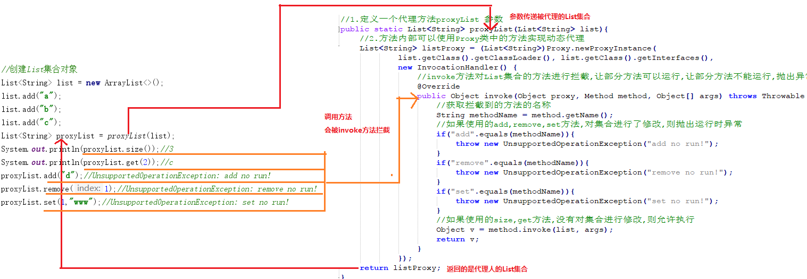

**动态代理案例流程图**

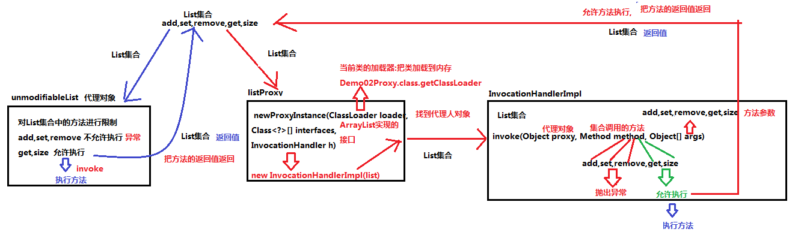

## 5.总结

动态代理非常的灵活，可以为任意的接口实现类对象做代理

动态代理可以为被代理对象的所有接口的所有方法做代理，动态代理可以在不改变方法源码的情况下，实现对方法功能的增强，

动态代理类的字节码在程序运行时由Java反射机制动态生成，无需程序员手工编写它的源代码。 
动态代理类不仅简化了编程工作，而且提高了软件系统的可扩展性，因为Java 反射机制可以生成任意类型的动态代理类。

动态代理同时也提高了开发效率。

缺点：只能针对接口的实现类做代理对象，普通类是不能做代理对象的。

# 第四章 lombok(了解)

## 1.lombok介绍

Lombok通过增加一些“处理程序”，可以让java变得简洁、快速。
Lombok能以注解形式来简化java代码，提高开发效率。

开发中经常需要写的javabean(和数据库表对应的类)，都需要花时间
去添加相应的getter/setter，也许还要去写构造方法、equals等方法，而且需要维护。
Lombok能通过注解的方式，在编译时自动为属性生成构造方法、getter/setter、equals、hashcode、
toString方法。出现的神奇就是在源码中没有getter和setter方法，但是在编译生成的字节码文件中有
getter和setter方法。这样就省去了手动重建这些代码的麻烦，使代码看起来更简洁些 。

## 2.添加lombok的jar包


## 3.添加Lombok插件

1.第一步

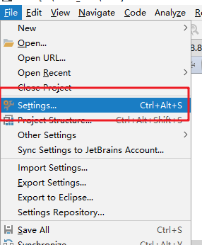

2.第二步

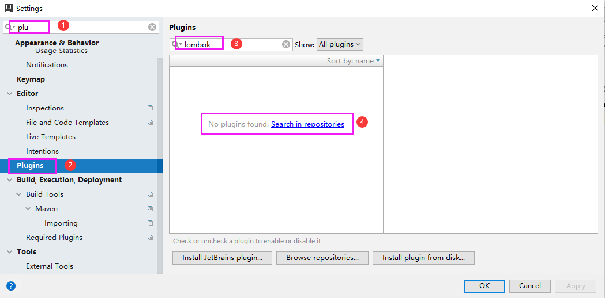

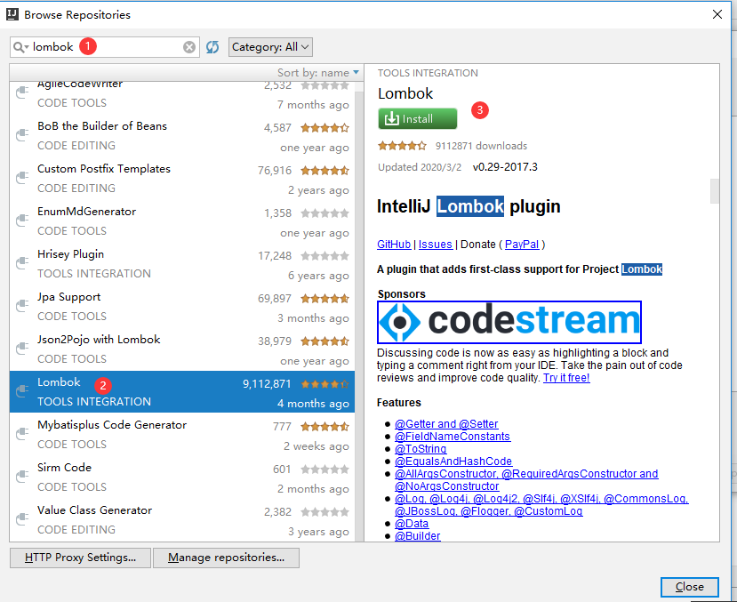


3.第三步

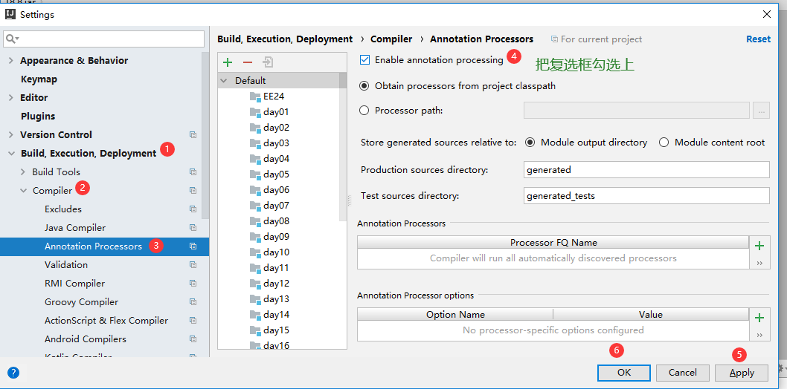

4.第四步

**第一次添加完Lombok插件,需要重启IDEA**

## 4.使用lombok

```java
@Getter和@Setter
    作用：生成成员变量的get和set方法。
    写在成员变量上，指对当前成员变量有效。
    写在类上，对所有成员变量有效。
    注意：静态成员变量无效。
@ToString：
    作用：生成toString()方法。
    该注解只能写在类上。
@NoArgsConstructor和@AllArgsConstructor
	@NoArgsConstructor：无参数构造方法。
	@AllArgsConstructor：满参数构造方法。
	注解只能写在类上。
@EqualsAndHashCode
	作用：生成hashCode()和equals()方法。
	注解只能写在类上。
@Data
作用： 生成setter/getter、equals、canEqual、hashCode、toString方法，
	如为final属性，则不会为该属性生成setter方法。
	注解只能写在类上。
	注意:@Data不会给类添加构造方法(只有默认空参数构造方法)
```

```java
package com.itheima.demo04lombok;

import lombok.AllArgsConstructor;
import lombok.Data;
import lombok.NoArgsConstructor;

@Data
@NoArgsConstructor
@AllArgsConstructor
public class Person {
    private String name;
    private int age;
    private String sex;
}
```

```java
package com.itheima.demo04lombok;

public class Demo01Lombok {
    public static void main(String[] args) {
        Person p1 = new Person();
        p1.setName("柳岩");
        p1.setAge(18);
        p1.setSex("女");
        System.out.println(p1);//Person(name=柳岩, age=18, sex=女)

        Person p2 = new Person("迪丽热巴",18,"女");
        System.out.println(p2);//Person(name=迪丽热巴, age=18, sex=女)
    }
}

```

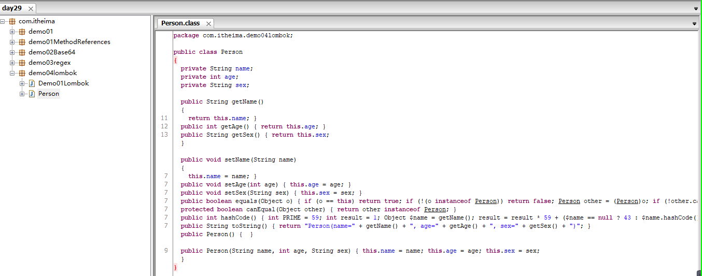