# 学习目标

```java
- 能够说出XML的作用
	//存储数据(解析读取使用)
	//配置文件(c3p0连接池,框架)==>存储一些数据
- 了解XML的组成元素(重点)
	文档声明 <?xml version="1.0" encoding="UTF-8"?>
	元素<beans>元素体</beans> <b><a>你好</a></b>   <a/>  <a></a>
	属性<bean id=’aa011’ className=”zhangsan”  ></bean>
	注释:解释说明xml文档,给程序员看的,不会被解析器解析(读取) <!-- -->
	转义字符:xml文档中已经占用了一些字符(<,>,",',&),这些字符都有特殊的含义
			 而我们要使用这些字符,就可以使用转义字符代表这些字符
			<   &lt;
			>   &gt;
			"   &quot;
			'   &apos;
			&   &amp; 
	CDATA区域:里边写的所有的内容,都作为普通的文本
		<![CDATA[
			...
		]]>
- 能够说出有哪些XML约束技术(重点)
	dtd约束
	schema约束
	会使用<根据提示写出元素和属性
- 能够说出解析XML文档DOM方式原理
	 使用SAXReader对象中的方法read,加载xml到内存中,生成Document对象(dom树)
	 使用Document对象获取根元素
	 使用根元素获取子元素,一层一层获取
	 使用元素Element的方法获取属性和文本
- 能够使用dom4j解析XML文档(重点)
	见案例
- 能够使用xpath解析XML文档(重点)
	使用前提:基于dom4j
        先获取SAXReader对象
        使用SAXReader对象中的方法read,加载xml到内存中,生成Document对象
    Document对象中方法:xpath解析
        List<Element> selectNodes("xpath表达式")，用来获取多个节点
        Node selectSingleNode("xpath表达式")，用来获取一个节点
- 能够使用四种方法的引用
	对象名引用成员方法: 对象名::成员方法(通过对象名调用成员方法)
		System.out::println
		"aaa"::toUpperCase
	类名引用静态成员方法: 类名::静态成员方法(通过类名调用静态方法)
		Math::random
	类的构造方法引用: Person::new (根据构造方法创建对象)
	数组的构造器引用: int[]::new (根据new创建数组对象)        
```

# 一.XML

## 1.XML介绍

### 1.1什么是XML

- XML 指可扩展标记语言（**EXtensible Markup Language**）

  - 标记:也叫标签,有**固定**的使用格式
    - `<开始标签>标签体</结束标签>`
  - 可扩展:标签的名称自己定义,随意
    - `<person>aaa</person>`
    - `<sdafdsafdsa>wwww</sdafdsafdsa>`
    - <你好>hello</你好>
  
- XML 是 **W3C (万维网联盟)的推荐标准**

  W3C在1988年2月发布1.0版本，2004年2月又发布1.1版本，因为1.1版本不能向下兼容1.0版本，所以1.1没有人用。同时，在2004年2月W3C又发布了1.0版本的第三版。我们要学习的还是1.0版本。

### 1.2 XML 与 HTML 的主要差异

- XML:
  - 作用:存储数据,会获取出xml中存储的数据使用
  - 可扩展的,标签的名称可以自定义
- HTML:
  - 作用:展示数据,给别人看的(页面)
  - 标签的名称都是固定的

## 2.XML的组成元素

XML文件中常见的组成元素有:文档声明、元素、属性、注释、转义字符、字符区。

**Xml文件扩展名必须为.xml**   

## 3.XML语法(重点)

### 1).文档声明

```xml
<?xml version="1.0"  encoding="UTF-8" ?>
```

1. 使用IDE创建xml文件时就带有文档声明.
2. 文档声明必须为<?xml开头，以？>结束
3. 文档声明必须从文档的0行0列位置开始
4. 文档声明中常见的两个属性：
   - version：指定XML文档版本。必须属性，这里一般选择1.0；
   - enconding：指定当前文档的编码，可选属性，默认值是utf-8；

### 2.元素element

**注意:元素就是标签**

```xml
格式1:<Person>aaaa</Person>
格式2:<person/>  空元素 自闭和标签
```

1. 元素是XML文档中**最重要**的组成部分；
2. 普通元素的结构由开始标签、元素体、结束标签组成。
3. 元素体：元素体可以是元素，也可以是文本，例如：``<person><name>张三</name></person>``
4. 空元素：空元素只有开始标签，而没有结束标签，但元素必须自己闭合，例如：``<sex/>``
5. 元素命名
   - 区分大小写
   - 不能使用空格，不能使用冒号
   - 不建议以XML、xml、Xml开头
   - 不能以数字开头
6. 格式化良好的XML文档，有且仅有一个根元素。

练习:

demo01.xml

```xml
<?xml version="1.0" encoding="UTF-8" ?>
<人>男人,女人,人妖</人>
<!--<猫></猫> 报错:格式化良好的xml有且仅有一个根元素(写在最外层的元素)-->
```

demo02.xml

```xml
<?xml version="1.0" encoding="UTF-8" ?>
<人>
    <男人>做男人真难</男人>
    <女人>做女人更难</女人>
    <人妖/>
</人>
```

demo03.xml

```xml
<?xml version="1.0" encoding="UTF-8" ?>
<beans>
    <bean>
        <property>张三</property>
        <property>李四</property>
    </bean>
    <bean>
        <property>王五</property>
        <property>赵六</property>
    </bean>
</beans>
```

### 3).属性attribute

```xml
<person></person>
<person name="aaa" id="110" age='18'></person>
<person id="110"></person>
```

1. 属性是元素的一部分，**它必须出现在元素的开始标签中**
2. 属性的定义格式：属性名=“属性值”，其中属性值必须使用单引或双引号括起来
3. 一个元素可以有0~N个属性，但一个元素中不能出现同名属性
4. 属性名不能使用空格 , 不要使用冒号等特殊字符，且必须以字母开头
5. 属性不区分先后顺序,写在前边和写在后边的作用是一样的

练习:

```xml
<?xml version="1.0" encoding="UTF-8" ?>
<beans>
    <bean className="com.itheima.demo01.User">
        <property name="jack" age='18' sex="男">张三</property>
        <property sex="女" age="20">李四</property>
    </bean>
    <bean className="com.itheima.demo01.Person">
        <property>王五</property>
        <property>赵六</property>
    </bean>
</beans>
```

### 4).注释

```xml
<?xml version="1.0" encoding="UTF-8" ?>
<!--
    xml中的注释:解释说明xml文档中的内容
    注释是给程序员自己看的,不会被xml解析器解析(不会被读取出来)
    添加|删除注释的快捷键:ctrl+shift+/
-->
<!--beans是根元素,只能有一个-->
<beans>
    <!--<bean className="com.itheima.demo01.User">
        <property name="jack" age='18' sex="男">张三</property>
        <property sex="女" age="20">李四</property>
    </bean>-->
    <bean className="com.itheima.demo01.Person">
        <property>王五</property>
        <property>赵六</property>
    </bean>
</beans>
```

### 5).转义字符

#### a.java中的转义字符(了解)

```java
package com.itheima.demo01;

import java.io.FileInputStream;
import java.io.FileNotFoundException;

/*
    java中的转义字符(了解)
    \:转义字符
    可以使用转义字符把一部分普通的字符转换为有特殊含义的字符
    可以使用转义字符把有特殊含义的字符转换为普通的字符
 */
public class Demo01 {
    public static void main(String[] args) throws FileNotFoundException {
        System.out.println("你好t我好t大家好!");
        //可以使用转义字符,把普通的t,转换为有特殊含义的制表符(tab)
        System.out.println("你好\t我\t大家好!");
        System.out.println("你好\t我\t大家好!");
        System.out.println("你好\t我\t大家好!");
        //可以使用转义字符,把有特殊含义的单引号,转换为普通的单引号使用
        char c1 = '\'';
        System.out.println(c1);//'
        //可以使用转义字符,把有特殊含义的\,转换为普通的\
        FileInputStream fis = new FileInputStream("c:\\abc\\def\\1.txt");
    }
}
```

#### b.xml文件中的转义字符

​	XML中的转义字符与HTML一样。因为很多符号已经被文档结构所使用，所以在元素体或属性值中想使用这些符号就必须使用转义字符（也叫实体字符），例如：">"、"<"、"'"、"""、"&"。

| 字符 | 预定义的转义字符 |  说明  |
| :--: | :--------------: | :----: |
|  <   |     ``&lt;``     |  小于  |
|  >   |    `` &gt;``     |  大于  |
|  "   |   `` &quot;``    | 双引号 |
|  '   |   `` &apos;``    | 单引号 |
|  &   |    `` &amp;``    |  和号  |

```xml
<?xml version="1.0" encoding="UTF-8" ?>
<!--
    xml文件中的转义字符
    在xml中有一些特殊字符,具有特殊的含义,我们不能直接使用
    可以使用转义字符代替这些有特殊含义的字符
    需求:
        在标签体中显示  3<5 && 7>10
    常用的转义字符:
        <   &lt;
        >   &gt;
        "   &quot;
        '   &apos;
        &   &amp;
-->
<beans>
    <bean>3&lt;5 &amp;&amp; 7&gt;10</bean>
    <bean>&quot;    &apos;</bean>
</beans>
```

注意:xml文件可以使用浏览器打开

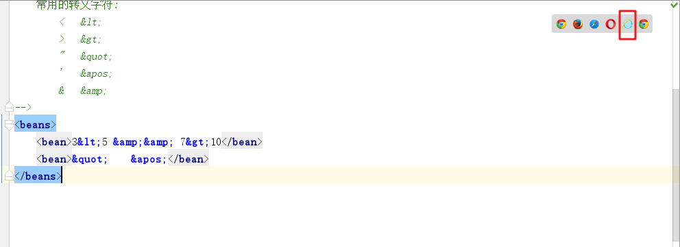

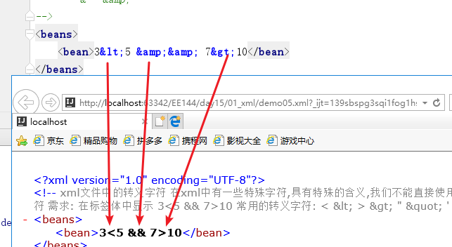

### 6).CDATA字符区(了解)

```xml
<?xml version="1.0" encoding="UTF-8" ?>

<!--
    需求:把以下标签的内容以文本的形式展示出来,不是标签
    <bean className="com.itheima.demo01.Student">
        <property name="jack" age="18">张三</property>
        <property age='18' name="rose">李四</property>
    </bean>
    解决方式:可以使用转义字符,把有特殊含义的字符变成普通的字符
        大量的使用转义字符,麻烦
    解决方式:使用CDATA区域
        格式:
            <![CDATA[
                任意的内容,都是文本
            ]]>
-->
<beans>
    &lt;bean className=&quot;com.itheima.demo01.Student&quot;&gt;
        &lt;property name=&quot;jack&quot; age=&quot;18&quot;&gt;张三&lt;/property&gt;
        &lt;property age=&apos;18&apos; name=&quot;rose&quot;&gt;李四&lt;/property&gt;
    &lt;/bean&gt;
    <![CDATA[
        <bean className="com.itheima.demo01.Student">
        <property name="jack" age="18">张三</property>
        <property age='18' name="rose">李四</property>
        </bean>
    ]]>
</beans>
```

## 4.XML文件的约束

在XML技术里，可以编写一个文档来约束一个XML文档的书写规范，这称之为XML约束。

常见的xml约束：DTD、Schema

**学习约束文档的目的:根据约束文档写出xml文档**  

### 1).dtd约束文档

#### a.概述

DTD是文档类型定义（Document Type Definition）。

DTD约束的作用:约束xml文档中元素属性如何编写

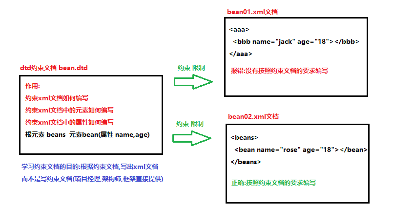

#### b.基本使用(重点)

bean.dtd

```dtd
<?xml version="1.0" encoding="UTF-8"?>
<!--
	传智播客DTD教学实例文档。
	模拟spring规范，如果开发人员需要在xml使用当前DTD约束，必须包括DOCTYPE。
	格式如下：
	<!DOCTYPE beans SYSTEM "bean.dtd">
-->
<!ELEMENT beans (bean*,import*) >
<!ELEMENT bean (property*)>
<!ELEMENT property (#PCDATA)>

<!ELEMENT import (#PCDATA)>

<!ATTLIST bean id CDATA #REQUIRED
			   className CDATA #REQUIRED
>

<!ATTLIST property name CDATA #REQUIRED
			   	   value CDATA #REQUIRED
>

<!ATTLIST import resource CDATA #REQUIRED>
```

复制dtd约束文档到模块中,一般都和xml文档放在同一个文件夹下

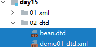

demo01-dtd.xml

```xml
<?xml version="1.0" encoding="UTF-8" ?>
<!--
    dtd约束文档的使用步骤:
    1.把dtd约束文档复制到idea中,一般都和xml文档在同一个文件夹下
    2.在每个dtd约束文档中都有一个以<!DOCTYPE开头的一行代码,复制到xml文档中
        <!DOCTYPE beans SYSTEM "bean.dtd">
        a.<!DOCTYPE:dtd约束文档的固定声明格式
        b.beans:dtd约束文档约束根元素必须的叫beans
        c.SYSTEM:系统的意思,dtd约束文档来源于本地的操作系统
            D:\Work_idea\EE144\day15\02_dtd\bean.dtd
        d."bean.dtd":dtd文档的路径,和xml文档在同一个文件夹下,使用相对路径
    3.根据dtd约束文档的要求,写出根元素
    4.在根元素中,写<出现提示,根据提示写出其他的元素和属性
        在元素中写<没有提示了,说明只能写文本了
-->
<!DOCTYPE beans SYSTEM "bean.dtd">
<beans>
    <bean id="" className="">
        <property name="" value="">
            只能写文本
        </property>
    </bean>
    <bean id="" className="">
        <property name="" value=""></property>
        <property name="" value=""></property>
        <property name="" value=""></property>
        <property name="" value=""></property>
    </bean>
    <bean id="" className=""></bean>
    <bean id="" className=""></bean>
    <import resource="">111</import>
    <import resource="">111</import>
    <import resource="">111</import>
    <import resource="">111</import>
</beans>
```

#### c.dtd约束文档的语法(了解)

##### 1.文档声明

作用:声明dtd约束文档如何编写 **一共有3种书写dtd文档的方式**

- 内部DTD，在XML文档内部嵌入DTD，只对当前XML有效。

```xml
<?xml version="1.0" encoding="utf-8" ?>
<!DOCTYPE beans [

	... //具体的语法

]>
<beans>
</beans>
```

- 外部DTD—本地DTD，DTD文档在本地系统上，公司内部自己项目使用。

```xml
<?xml version="1.0" encoding="utf-8" ?>
<!DOCTYPE beans SYSTEM "bean.dtd">
	包含了4部分内容
	a.!DOCTYPE:是dtd约束文档的固定格式
	b.beans:约束xml文档中的根元素想要使用dtd约束就必须叫beans
	c.SYSTEM:系统,当前使用的dtd约束文档来源于本地的操作系统
	d."bean.dtd":dtd约束文档所在的位置,和xml在同一个文件夹下可以直接使用名字
<beans>
</beans>
```

- 外部DTD—公共DTD，DTD文档在网络上，一般都由框架提供。

```xml
<?xml version="1.0" encoding="UTF-8"?>

<!DOCTYPE beans PUBLIC "-//SPRING//DTD BEAN 2.0//EN"
"http://www.springframework.org/dtd/spring-beans-2.0.dtd">

一共包含了5部分内容:
a. !DOCTYPE:dtd约束文档声明的固定格式
b. Beans:根源元素的名称
c. PUBLIC:公共,dtd约束文档来源于互联网
d. "-//SPRING//DTD BEAN 2.0//EN":dtd约束文档的名称,一般由框架提供
e. "http://www.springframework.org/dtd/spring-beans-2.0.dtd">:dtd约束文档在互联网上的位置

<beans>
</beans>
```

##### 2.元素声明

**作用:约束xml文档中的元素如何编写**

```xml
定义元素语法：<!ELEMENT 元素名 元素描述>
	!ELEMENT:固定格式
	元素名：自定义
	元素描述包括：符号和数据类型
		常见符号：
            ?:代表元素只能出现0次或者1次 
            +:代表元素至少出现1次  1次或者多次
            *(?和+):  代表元素可以出现任意次  0次,1次,多次
            ():一组元素  (a,b)* aaabbb (a|b)* ababba
             |:选择关系 在多个中选择一个  张三|李四   
             ,:顺序关系  a,b,c 元素书写顺序只能先写a,在写b,最后写c
		常见类型：#PCDATA 表示内容是文本，不能是子标签
```

```dtd
<!ELEMENT beans (bean*,import*) >
<!ELEMENT bean (property*)>
<!ELEMENT property (#PCDATA)>
<!ELEMENT import (#PCDATA)>
```

##### 3.属性声明

**作用:在约束文档中规定xml文档中的属性如何编写**

```xml
属性的语法：（attribute）
	<!ATTLIST 元素名
		属性名 属性类型 约束 
		属性名 属性类型 约束
		...
	>
	!ATTLIST:属性声明的固定写法
	元素名：属性必须是给元素添加，所有必须先确定元素名
	属性名：自定义
	属性类型：ID、CDATA…
		ID : ID类型的属性用来标识元素的唯一性(不能重复,必须有,只能以字母开头)
		CDATA：文本类型,字符串
	约束：
		#REQUIRED：说明属性是必须的；required
		#IMPLIED：说明属性是可选的；implied
        #FIXED:代表属性为固定值，实现方式：book_info CDATA #FIXED "固定值"
		出版社 (清华|北大|传智播客) 
```

```dtd
<?xml version="1.0" encoding="UTF-8"?>
<!--
    传智播客DTD教学实例文档。
    模拟spring规范，如果开发人员需要在xml使用当前DTD约束，必须包括DOCTYPE。
    格式如下：
    <!DOCTYPE beans SYSTEM "bean.dtd">
-->
<!ELEMENT beans (bean*,import*)>
<!ELEMENT bean (property*)>
<!ELEMENT property (#PCDATA)>

<!ELEMENT import (#PCDATA)>

<!--
    ID : ID类型的属性用来标识元素的唯一性
    (属性值不能重复,必须有属性值,属性值只能以字母开头)
-->
<!ATTLIST bean id ID #REQUIRED
        className CDATA #REQUIRED>

<!ATTLIST property name CDATA #REQUIRED
        value CDATA #REQUIRED
        age CDATA #IMPLIED
        country CDATA #FIXED "中国"
        sex(男|女)>

<!ATTLIST import resource CDATA #REQUIRED>
```

```xml
<?xml version="1.0" encoding="UTF-8" ?>
<!DOCTYPE beans SYSTEM "bean.dtd">
<beans>
    <bean id="b001" className="">
        <property name="" value="" age="12" country="中国" sex="男">111</property>
        <property name="" value="" sex="女"></property>
        <property name="" value=""></property>
        <property name="" value=""></property>
    </bean>
    <bean id="b002" className=""></bean>
    <bean id="b003" className=""></bean>
    <import resource="">111</import>
</beans>
```

### 2).schema约束

#### a.概述

Schema 语言也可作为 XSD（XML Schema Definition）。

Schema 比DTD强大，是DTD代替者。

Schema 本身也是XML文档，但是Schema文档扩展名为xsd，而不是xml。

Schema 功能更强大，数据类型约束更完善。

**Schema 支持命名空间**

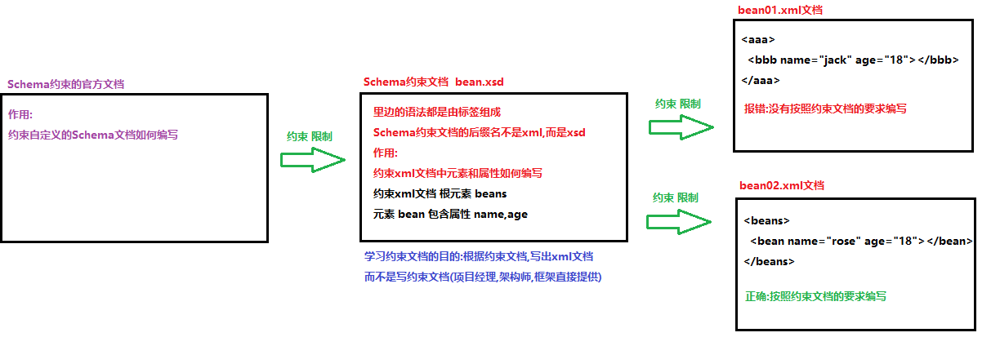

#### b.基本使用(重点)

bean-schema.xsd

```xml
<?xml version="1.0" encoding="UTF-8"?>
<!-- 
	传智播客Schema教学实例文档。
	模拟spring规范，如果开发人员需要在xml使用当前Schema约束，必须包括指定命名空间。
	格式如下：
	<beans xmlns="http://www.itcast.cn/bean"
	   xmlns:xsi="http://www.w3.org/2001/XMLSchema-instance"
	   xsi:schemaLocation="http://www.itcast.cn/bean bean-schema.xsd"
	>
-->
<schema xmlns="http://www.w3.org/2001/XMLSchema" 
		targetNamespace="http://www.itcast.cn/bean"
		xmlns:xsd="http://www.w3.org/2001/XMLSchema"
		xmlns:tns="http://www.itcast.cn/bean" 
		elementFormDefault="qualified">
	<element name="beans">
		<complexType>
			<choice minOccurs="0" maxOccurs="3">
				<element name="bean">
					<complexType>
						<sequence minOccurs="0" maxOccurs="unbounded">
							<element name="property">
								<complexType>
									<attribute name="name" use="optional"></attribute>
									<attribute name="value" use="required"></attribute>
								</complexType>
							</element>
						</sequence>
						<attribute name="id" use="required"></attribute>
						<attribute name="className" use="required"></attribute>
					</complexType>
				</element>
				<element name="import">
					<complexType>
						<attribute name="resource" use="required"></attribute>
					</complexType>
				</element>
			</choice>
		</complexType>
	</element>
</schema>
```

demo01-schema.xml

```xml
<?xml version="1.0" encoding="UTF-8" ?>
<!--
    schema约束文档的使用步骤:
    1.把schema约束文档复制到idea中,和xml文档放在同一个文件夹下
    2.在每个schema约束文档中都有一个根元素的开始标签,复制到xml文件中,添加上结束标签
    3.在根元素,写<会出现提示,根据提示写出其他的元素和属性
        在标签中写任意的内容都报错,说明这个标签是一个自闭和标签,没有标签体
-->
<beans xmlns="http://www.itcast.cn/bean"
       xmlns:xsi="http://www.w3.org/2001/XMLSchema-instance"
       xsi:schemaLocation="http://www.itcast.cn/bean bean-schema.xsd"
>
    <bean id="" className="">
        <property value="" name=""/>
        <property value=""/>
        <property value=""></property>
    </bean>
    <import resource=""/>
    <bean id="" className=""></bean>
    <import resource=""/>
    <import resource=""/>
    <import resource=""/>
</beans>    
```

#### c.schema约束的练习

bookshelf.xsd

```xml
<?xml version="1.0" encoding="UTF-8" ?>
<!--
	传智播客DTD教学实例文档.将注释中的以下内容复制到要编写的xml的声明下面
	复制内容如下:
	<书架 xmlns="http://www.itcast.cn"
		  xmlns:xsi="http://www.w3.org/2001/XMLSchema-instance"
		  xsi:schemaLocation="http://www.itcast.cn bookshelf.xsd"
    >
 -->
<xs:schema xmlns:xs="http://www.w3.org/2001/XMLSchema"
           targetNamespace="http://www.itcast.cn"
           elementFormDefault="qualified">
    <xs:element name='书架' >
        <xs:complexType>
            <xs:sequence maxOccurs='unbounded' >
                <xs:element name='书' >
                    <xs:complexType>
                        <xs:sequence>
                            <xs:element name='书名' type='xs:string' />
                            <xs:element name='作者' type='xs:string' />
                            <xs:element name='售价' type='xs:double' />
                        </xs:sequence>
                    </xs:complexType>
                </xs:element>
            </xs:sequence>
        </xs:complexType>
    </xs:element>
</xs:schema>
```

demo02_schema.xml

```xml
<?xml version="1.0" encoding="UTF-8" ?>
<书架 xmlns="http://www.itcast.cn"
    xmlns:xsi="http://www.w3.org/2001/XMLSchema-instance"
    xsi:schemaLocation="http://www.itcast.cn bookshelf.xsd"
>
    <书>
        <书名>水浒传</书名>
        <作者>施耐庵</作者>
        <售价>108</售价>
    </书>
    <书>
        <书名>红楼梦</书名>
        <作者>曹雪芹</作者>
        <售价>106</售价>
    </书>
</书架>    
```

#### d.命名空间(了解-扩展)

1.概述

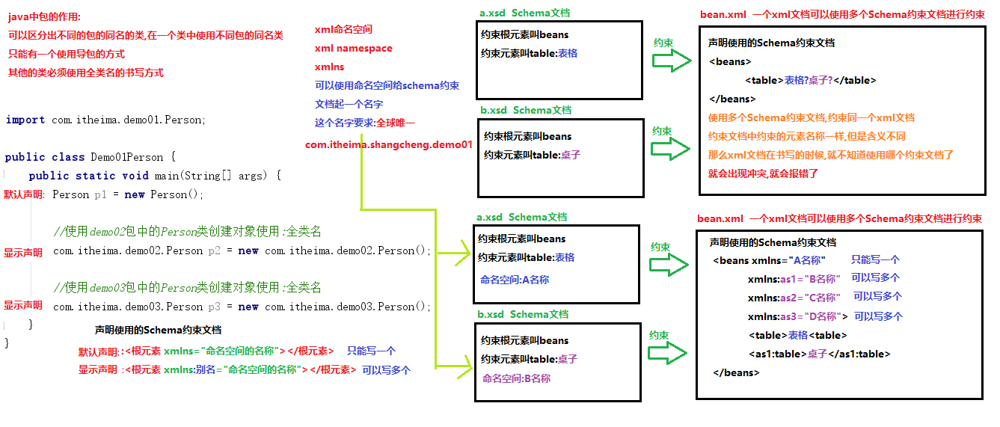

```xml
<?xml version="1.0" encoding="UTF-8" ?>
<!--
	Schema约束文档:
		1.每个Schema约束文档,都必须有一个名字,这个名字就是命名空间(名称空间)
			要求:全球唯一,一般使用公司的域名+项目名称+...
			targetNamespace="http://www.itcast.cn/bean/demo01/...."
		2.在xml文档中想要使用Scheme约束文档,必须声明使用的是哪个Schema约束文档
			a.默认声明:只能有一个
					xmlns="default namespace"
					xmlns="http://www.itcast.cn/bean"
			b.显示声明:可以有多个
					xmlns:别名1=”http://www.itcast.cn/bean”
                    xmlns:别名2="http://www.itcast.cn/bean"
        3.想要使用Schema约束文档,必须确定约束文档的位置
            a.先确定官方文档的位置
                    xmlns:xsi="http://www.w3.org/2001/XMLSchema-instance"
            b.通过官方文档确定我们自己的Schema约束文档的位置
                    xsi:schemaLocation="{namespace} {location}"
                                         命名空间	 具体位置
        4.使用
            使用默认声明,直接写元素名称<bean></bean>
            使用显示声明:格式
                别名:元素名称
                <别名1:bean></别名1:bean>
 -->
```

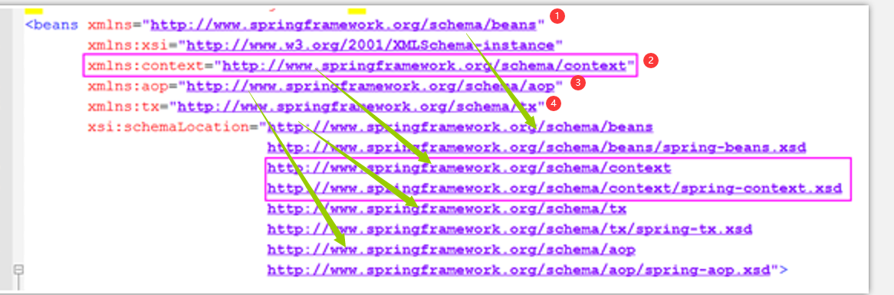

#### e.schema约束的语法(了解-扩展)

```xml
<?xml version="1.0" encoding="UTF-8"?>
<!-- 
	传智播客Schema教学实例文档。
	模拟spring规范，如果开发人员需要在xml使用当前Schema约束，必须包括指定命名空间。
	格式如下：
	<beans xmlns="http://www.itcast.cn/bean"
	   xmlns:xsi="http://www.w3.org/2001/XMLSchema-instance"
	   xsi:schemaLocation="http://www.itcast.cn/bean bean-schema.xsd"
	>
-->

<!--
	schema约束文档的语法
	1. <element>声明元素(标签)
	2.每个元素都必须确定类型
		complexType:复杂类型
		simpleType:简单类型,一般不用,大部分都是复杂类型
	3.需要明确子标签的出场顺序
		<choice>选择 |
		<sequence>顺序 ,
		<all>任意
			minOccurs:最少出现次数
			maxOccurs:最大出现次数,unbounded:不限制(没有边)
	4.<attribute>用于给元素声明属性
		use:设置属性使用 optional:可选 required:必须
-->
<schema xmlns="http://www.w3.org/2001/XMLSchema" 
		targetNamespace="http://www.itcast.cn/bean"
		xmlns:xsd="http://www.w3.org/2001/XMLSchema"
		xmlns:tns="http://www.itcast.cn/bean" 
		elementFormDefault="qualified">
	<element name="beans">
		<complexType>
			<choice minOccurs="0" maxOccurs="unbounded">
				<element name="bean">
					<complexType>
						<sequence minOccurs="0" maxOccurs="unbounded">
							<element name="property">
								<complexType>
									<attribute name="name" use="optional"></attribute>
									<attribute name="value" use="required"></attribute>
								</complexType>
							</element>
						</sequence>
						<attribute name="id" use="required"></attribute>
						<attribute name="className" use="required"></attribute>
					</complexType>
				</element>
				<element name="import">
					<complexType>
						<attribute name="resource" use="required"></attribute>
					</complexType>
				</element>
			</choice>
		</complexType>
	</element>
</schema>
```

# 二.XML解析

## 1.解析概述

​	当将数据存储在XML后，我们就希望通过程序获取XML的内容。如果我们使用Java基础所学的IO知识是可以完成的，不过你学要非常繁琐的操作才可以完成，且开发中会遇到不同问题（只读、读写）**。人们为不同问题提供不同的解析方式，使用不同的解析器进行解析，方便开发人员操作XML**。

## 2.解析方式和解析器

- 开发中比较常见的解析方式有三种，如下：

  1. DOM：要求解析器把整个XML文档装载到内存，并解析成一个Document对象

     a）优点：元素与元素之间保留结构关系，故可以进行增删改查操作。

     b）缺点：XML文档过大，可能出现内存溢出

  2. SAX：是一种速度更快，更有效的方法。她逐行扫描文档，一边扫描一边解析。并以事件驱动的方式进行具体解析，每执行一行，都触发对应的事件。（了解）

     a）优点：处理速度快，可以处理大文件

     b）缺点：只能读，逐行后将释放资源，解析操作繁琐。

  3. PULL：Android内置的XML解析方式，类似SAX。（了解）

- 解析器，就是根据不同的解析方式提供具体实现。有的解析器操作过于繁琐，为了方便开发人员，又提供易于操作的解析开发包

  

- 常见的解析开发包

  - JAXP：sun公司提供支持DOM和SAX开发包
  - **Dom4j：比较简单的的解析开发包(常用)**
  - JDom：与Dom4j类似
  - Jsoup：功能强大DOM方式的XML解析开发包，尤其对HTML解析更加方便(项目中讲解)

## 3.DOM解析原理及结构模型

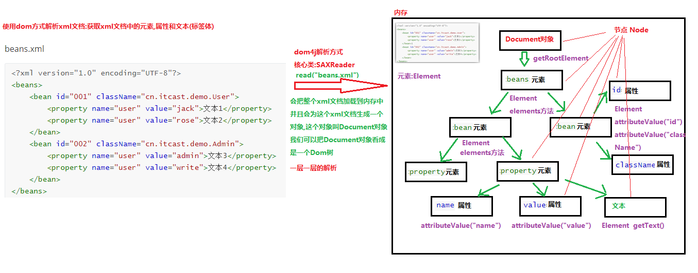

## 4.使用dom4j解析xml文件(重点)

beans.xml

```xml
<?xml version="1.0" encoding="UTF-8"?>
<beans>
	<bean id="001" className="cn.itcast.demo.User">
		<property name="user" value="jack">文本1</property>
		<property name="user" value="rose">文本2</property>
	</bean>1
	<bean id="002" className="cn.itcast.demo.Admin">
		<property name="user" value="admin">文本3</property>
		<property name="user" value="write">文本4</property>
	</bean>
</beans>
```

```java
package com.itheima.demo02parseXml;

import org.dom4j.Document;
import org.dom4j.DocumentException;
import org.dom4j.Element;
import org.dom4j.io.SAXReader;

import java.util.List;

/*
    使用dom4j解析xml文件(重点)
    使用步骤:
        1.导入dom4j的jar包到idea中
        2.创建dom4j核心类SAXReader对象
        3.使用SAXReader对象中的方法read,把整个xml文档读取到内存中,生成Document对象
        4.使用Doucment对象中的方法getRootElement,获取根元素beans
        5.使用根元素Element对象中的方法elements,获取根元素中的所有bean元素,多个bean元素,存储到List集合中返回
        6.遍历List集合,获取每一个bean元素
        7.使用bean元素Element对象中的方法attributeValue,根据属性名获取属性值(id,className)
        8.使用bean元素Element对象中的方法elments,获取bean元素中所有property元素,多个property元素,存储到List集合中返回
        9.遍历List集合,获取每一个property元素
        10.使用property元素Element对象中的方法attributeValue,根据属性名获取属性值(name,value)
        11.使用property元素Element对象中的方法getText,获取property元素上的文本
 */
public class Demo01UseDom4jParseXml {
    public static void main(String[] args) throws DocumentException {
        //2.创建dom4j核心类SAXReader对象
        SAXReader sax = new SAXReader();
        //3.使用SAXReader对象中的方法read,把整个xml文档读取到内存中,生成Document对象
        Document document = sax.read("day15\\beans.xml");//读取文件的相对路径
        //4.使用Doucment对象中的方法getRootElement,获取根元素beans
        Element rootElement = document.getRootElement();
        System.out.println(rootElement.getName());
        //5.使用根元素Element对象中的方法elements,获取根元素中的所有bean元素,多个bean元素,存储到List集合中返回
        List<Element> beanElementList = rootElement.elements();
        //6.遍历List集合,获取每一个bean元素
        for (Element beanElement : beanElementList) {
            System.out.println("\t"+beanElement.getName());
            //7.使用bean元素Element对象中的方法attributeValue,根据属性名获取属性值(id,className)
            String id = beanElement.attributeValue("id");
            String className = beanElement.attributeValue("className");
            System.out.println("\t\tbean元素上属性id的值为:"+id);
            System.out.println("\t\tbean元素上属性className的值为:"+className);
            //8.使用bean元素Element对象中的方法elments,获取bean元素中所有property元素,多个property元素,存储到List集合中返回
            List<Element> propertyElementList = beanElement.elements();
            //9.遍历List集合,获取每一个property元素
            for (Element propertyElement : propertyElementList) {
                System.out.println("\t\t\t"+propertyElement.getName());
                //10.使用property元素Element对象中的方法attributeValue,根据属性名获取属性值(name,value)
                String name = propertyElement.attributeValue("name");
                String value = propertyElement.attributeValue("value");
                System.out.println("\t\t\t\tproperty元素上属性name的值为:"+name);
                System.out.println("\t\t\t\tproperty元素上属性value的值为:"+value);
                //11.使用property元素Element对象中的方法getText,获取property元素上的文本
                String text = propertyElement.getText();
                System.out.println("\t\t\t\tproperty元素上文本的值为:"+text);
            }
        }
    }
}
```

程序执行的结果:

```java
beans
	bean
		bean元素上属性id的值为:001
		bean元素上属性className的值为:cn.itcast.demo.User
			property
				property元素上属性name的值为:user
				property元素上属性value的值为:jack
				property元素上文本的值为:文本1
			property
				property元素上属性name的值为:user
				property元素上属性value的值为:rose
				property元素上文本的值为:文本2
	bean
		bean元素上属性id的值为:002
		bean元素上属性className的值为:cn.itcast.demo.Admin
			property
				property元素上属性name的值为:user
				property元素上属性value的值为:admin
				property元素上文本的值为:文本3
			property
				property元素上属性name的值为:user
				property元素上属性value的值为:write
				property元素上文本的值为:文本4
```

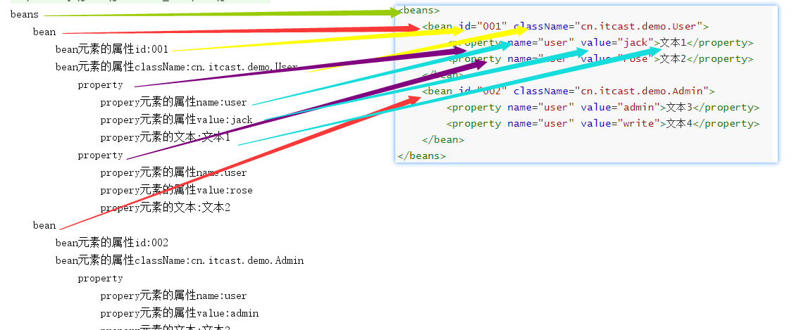

## 🎗 经验分享：读取xml指定标签的文本数据

### 1.已知的模块结构和代码：


> **books.xml 代码：**

```xml
<?xml version="1.0" encoding="UTF-8"?>
<books>
    <book id="01" 出版社="传智出版社">
        <name>Java编程思想</name>
        <author>James</author>
        <price>98.00</price>
        <body>库存：30</body>
    </book>
    <book id="02" 出版社="传智出版社">
        <name>JavaEE从入门到精通</name>
        <author>传智播客</author>
        <price>40.00</price>
        <body>库存：20</body>
    </book>
    <book id="03" 出版社="传智出版社">
        <name>Java开发手册</name>
        <author>阿里巴巴</author>
        <price>15.00</price>
        <body>库存：300</body>
    </book>
</books>
```

> **Java代码：**

```java
/*
    获得作者：传智播客
 */
public class Test01 {
    public static void main(String[] args) throws DocumentException {
        // 获得核心解析器对象
        SAXReader reader = new SAXReader();
        // 加载xml文件到内存生成一个document文档对象
        Document document = reader.read("books.xml");
        // 获得根元素节点
        Element rootElement = document.getRootElement();
        /// 获得所有的子元素节点
        List<Element> elements = rootElement.elements();
        // 遍历
        for (Element element : elements) {
            // 判断
            if("02".equals(element.attributeValue("id"))){
                // 获得该节点(book)的所有子节点
                List<Element> eles = element.elements();
                // 遍历
                for (Element ele : eles) {
                    // 判断
                    if("author".equals(ele.getName())){
                        System.out.println(ele.getText());
                    }
                }
            }
        }
    }
}
```

### 2.出现的问题:

> 执行上面的代码，控制台出现如下错误：

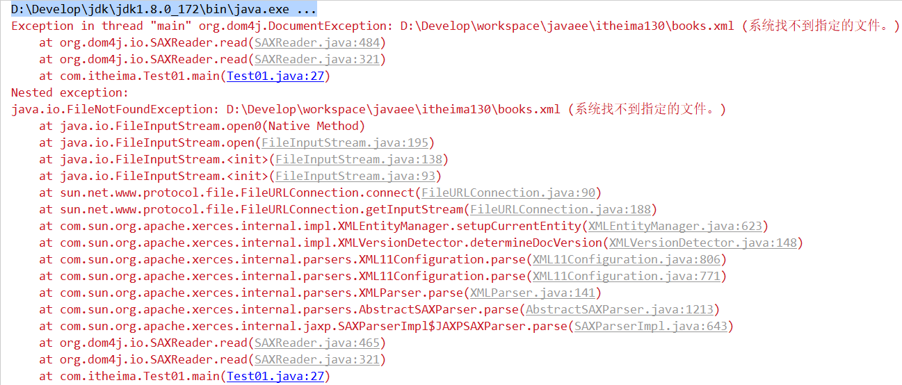

### 3.问题的分析：

> 控制台出现异常，从下面向上找。
>
> **FileNotFoundException：文件未找到异常！**
>
> 课上演示的时候我们是将books.xml文件与java文件放在同一个目录(包)下，这么写是没有问题的，但是开发中经常是将配置文件放在src目录(类的根路径)下，此时目录还这么写就会出现文件未找到异常(配置文件路径书写错误)。

### 4.问题的解决办法：

> 修改读取配置文件文档对象时给定的路径即可

```java
/*
    获得作者：传智播客
 */
public class Test01 {
    public static void main(String[] args) throws DocumentException {
        // 获得核心解析器对象
        SAXReader reader = new SAXReader();
        // 加载xml文件到内存生成一个document文档对象
        Document document = reader.read("test/src/books.xml");
        // 获得根元素节点【后续代码省略，可参考上面给定的代码】
        ......
    }
}
```

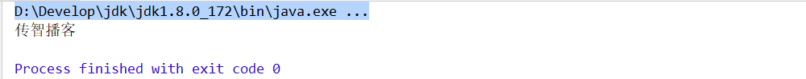

> **注意：如果创建的是项目，那么路径的写法应该是 src/books.xml**

## 5.使用xpath和dom4j快速定位解析xml文件(重点)

xpath表达式常用查询形式

- **第一种查询形式**

  ```
  //*: 所有元素
  ```

- 第二种查询形式

  ```
  //BBB： 表示和这个名称相同，表示只要名称是BBB 都得到
  //bean 获取所有的bean元素
  ```

- 第三种查询形式

  ```
  /AAA/DDD/BBB： 表示一层一层的，AAA下面 DDD下面的BBB
  /beans/bean/propery
  ```

- 第四种查询形式

  ```
  //BBB[1]：表示第一个BBB元素
  //BBB[last()]：表示最后一个BBB元素
  ```

- 第五种查询形式

  ```
  //BBB[@id]： 表示只要BBB元素上面有id属性 都得到
  ```

- 第六种查询形式

  ```
  //BBB[@id='003'] 表示元素名称是BBB,在BBB上面有id属性，并且id的属性值是b1
  ```

beans.xml

```xml
<?xml version="1.0" encoding="UTF-8"?>
<beans>
    <bean id="001" className="cn.itcast.demo.User">
        <property name="user" value="jack">文本1</property>
        <property name="user" value="rose">文本2</property>
        <bean id="005" className="cn.itcast.demo.Animal">
            <property name="user" value="小猫">文本9</property>
            <property name="user" value="小狗">文本10</property>
        </bean>
    </bean>
    <bean id="002" className="cn.itcast.demo.Admin">
        <property name="user" value="admin">文本3</property>
        <property name="user" value="write">文本4</property>
    </bean>
    <bean id="003" >
        <property name="user" value="张三">文本5</property>
        <property name="user" value="李四">文本6</property>
    </bean>
    <bean id="004" className="cn.itcast.demo.Student">
        <property name="user" value="王五">文本7</property>
        <property name="user" value="赵六">文本8</property>
    </bean>
</beans>
```

```java
package com.itheima.demo02parseXml;

import org.dom4j.Document;
import org.dom4j.DocumentException;
import org.dom4j.Element;
import org.dom4j.Node;
import org.dom4j.io.SAXReader;

import java.util.List;

/*
    使用xpath和dom4j快速定位解析xml文件(重点)
    注意:
        xpath是基于dom4j开发的
        导入jar包的时候,不仅要导入xpath的jar,还的导入dom4j的jar包
    实现步骤:
        1.导入xpath和dom4j的jar包
        2.创建dom4j核心类SAXReader对象
        3.使用SAXReader对象中的方法read,读取整个xml文档到内存中,生成Document对象
        4.使用Document对象中的方法selectNodes|selectSingleNode解析xml文档
            List<Element> selectNodes("xpath表达式") 获取符合表达式的元素集合
            Element selectSingleNode("xpath表达式") 获取符合表达式的唯一元素
   xpath表达式常用查询形式
    - 第一种查询形式
      //*: 所有元素
    - 第二种查询形式
          //BBB： 表示和这个名称相同，表示只要名称是BBB 都得到
          //bean 获取所有的bean元素
    - 第三种查询形式
          /AAA/DDD/BBB： 表示一层一层的，AAA下面 DDD下面的BBB
          /beans/bean/propery
    - 第四种查询形式
          //BBB[1]：表示第一个BBB元素
          //BBB[last()]：表示最后一个BBB元素
    - 第五种查询形式
          //BBB[@id]： 表示只要BBB元素上面有id属性 都得到
    - 第六种查询形式
          //BBB[@id='003'] 表示元素名称是BBB,在BBB上面有id属性，并且id的属性值是b1
 */
public class Demo02UseXpathAndDom4jParseXml {
    public static void main(String[] args) throws DocumentException {
        //1.导入xpath和dom4j的jar包
        //2.创建dom4j核心类SAXReader对象
        SAXReader sax = new SAXReader();
        //3.使用SAXReader对象中的方法read,读取整个xml文档到内存中,生成Document对象
        Document document = sax.read("day15\\beans2.xml");
        //4.使用Document对象中的方法selectNodes|selectSingleNode解析xml文档
        // //*: 所有元素
        List<Element> list01 = document.selectNodes("//*");
        for (Element e : list01) {
            System.out.println(e.getName());
        }
        System.out.println("------------------------------------------");
        // //bean 获取所有的bean元素(包含儿子和孙子)
        List<Element> list02 = document.selectNodes("//bean");
        for (Element e : list02) {
            System.out.println(e.getName()+"\t"+e.attributeValue("id"));
        }
        System.out.println("------------------------------------------");
        // //property 获取所有的property元素(包含儿子和孙子)
        List<Element> list03 = document.selectNodes("//property");
        for (Element e : list03) {
            System.out.println(e.getName()+"\t"+e.attributeValue("value"));
        }
        System.out.println("------------------------------------------");
        // /beans/bean  获取beans中bean(只有儿子,没有孙子)
        List<Element> list04 = document.selectNodes("/beans/bean");
        for (Element e : list04) {
            System.out.println(e.getName()+"\t"+e.attributeValue("id"));
        }
        System.out.println("------------------------------------------");
        // /beans/bean/propery 获取beans中bean中property
        List<Element> list05 = document.selectNodes("/beans/bean/property");
        for (Element e : list05) {
            System.out.println(e.getName()+"\t"+e.attributeValue("value"));
        }
        System.out.println("------------------------------------------");
        // //bean[1]：表示所有bean元素中的第一个bean元素
        Element oneBeanElement = (Element) document.selectSingleNode("//bean[1]");
        System.out.println(oneBeanElement.getName()+"\t"+oneBeanElement.attributeValue("id"));
        // //bean[2]：表示所有bean元素中的第二个bean元素
        Element twoBeanElement = (Element) document.selectSingleNode("//bean[2]");
        System.out.println(twoBeanElement.getName()+"\t"+twoBeanElement.attributeValue("id"));
        // //bean[last()]：表示所有bean元素中最后一个bean元素
        Element lastBeanElement = (Element) document.selectSingleNode("//bean[last()]");
        System.out.println(lastBeanElement.getName()+"\t"+lastBeanElement.attributeValue("id"));
        System.out.println("------------------------------------------");
        // //property[1]：表示第一个bean中所有property元素中的第一个property元素
        Element onePropertyElement = (Element) document.selectSingleNode("//property[1]");
        System.out.println(onePropertyElement.getName()+"\t"+onePropertyElement.attributeValue("value"));
        // //property[2]：表示第一个bean中所有property元素中的第二个property元素
        Element twoPropertyElement = (Element) document.selectSingleNode("//property[2]");
        System.out.println(twoPropertyElement.getName()+"\t"+twoPropertyElement.attributeValue("value"));
        // //property[3]：表示第一个bean中所有property元素中的第三个property元素
        //Element threePropertyElement = (Element) document.selectSingleNode("//property[3]");
        //System.out.println(threePropertyElement.getName()+"\t"+threePropertyElement.attributeValue("value"));
        System.out.println("------------------------------------------");
        // //bean[@className]： 表示只要bean元素上面有className属性都得到
        List<Element> list06 = document.selectNodes("//bean[@className]");
        for (Element e : list06) {
            System.out.println(e.getName()+"\t"+e.attributeValue("id"));
        }
        System.out.println("------------------------------------------");
        // //bean[@className='cn.itcast.demo.Student'] 表示元素名称是bean,在bean上面有className属性，并且className的属性值是'cn.itcast.demo.Student'
        Element studentElement = (Element)document.selectSingleNode("//bean[@className='cn.itcast.demo.Student']");
        System.out.println(studentElement.getName()+"\t"+studentElement.attributeValue("className"));
    }
}
```

# 三.JDK8的新特性

## 1.方法引用(了解)

### 1).方法引入的概述

```java
package com.itheima.demo03;

import java.util.function.Consumer;

/*
    方法引用:
        是JDK1.8之后的新特性,可以用于简化lambda表达式
        当一些内容已经存在,就可以直接引用来使用
    java.util.function.Consumer<T>:函数式接口
    接口中唯一的抽象方法:
        void accept​(T t) :消费一个指定泛型类型的数据
    Consumer接口的泛型使用什么类型,就可以使用accept方法消费(使用)一个什么类型的数据
    至于我们怎么使用这个数据,看心情(想怎么使用就怎么使用,可以计算,可以输出...)
 */
public class Demo01 {
    public static void main(String[] args) {
        //调用method方法,方法的参数Consumer是一个接口,可以传递接口的匿名内部类对象,给接口变量赋值
        method(new Consumer<String>() {
            @Override
            public void accept(String s) {
                System.out.println(s);
            }
        },"小明");

        //调用method方法,方法的参数Consumer是一个函数式接口,可以传递Lambda表达式,作为接口的实现类对象,给接口变量赋值
        method((String s)->{
            System.out.println(s);
        },"小花");

        //简化Lambda表达式
        method(s-> System.out.println(s),"小王");

        /*
            Lambda表达式的目的:传递一个字符串,打印字符串
            打印字符串的对象:System.out(PrintStream打印流对象)是已经存在的
            PrintStream打印流中的方法println是已经存在的
            就可以使用对象名引用成员方法,直接输出数据
            格式:
                对象名::成员方法
         */
        method(System.out::println,"小李");
    }

    /*
        定义一个方法,方法的参数数据类型
            使用Consumer接口,接口的泛型使用String
            使用String
        在方法中使用Consumer接口中的方法accpet对参数传递的字符串进行消费
     */
    public static void method(Consumer<String> con,String s){
        con.accept(s);
    }
}
```


### 2).对象名--引用成员方法

```java
package com.itheima.demo03;

import java.util.function.Supplier;

/*
    对象名--引用成员方法
    格式:
        ::方法引用的运算符
        对象名::成员方法
     java.util.function.Supplier<T>:函数式接口
       接口中唯一的抽象方法:
           T get​() 用来获取接口指定泛型类型的数据
       Supplier接口使用什么泛型,就可以使用get方法获取一个什么类型的数据
 */
public class Demo02 {
    public static void main(String[] args) {
        //调用method方法,方法的参数Supplier是一个函数式接口,可以传递Lambda表达式,作为接口的实现类对象,给接口变量赋值
        method(()->{
            String s = new String("abc");
            return s.toUpperCase();
        });

        //简化Lambda表达式
        method(()->new String("abc").toUpperCase());

        /*
            对象new String("abc")是已经存在的
            String类中的方法toUpperCase是已经存在的
            就可以直接使用对象引用成员方法

         */
        method(new String("abc")::toUpperCase);
        method("abc"::toUpperCase);
        //method("abc"::hello);//Cannot resolve method 'hello'  字符串类中没有hello方法,不能直接引用
    }

    /*
        定义一个方法,方法的参数使用Supplier接口,接口的泛型使用String
        在方法中使用Supplier接口中的方法get获取一个字符串返回
     */
    public static void method(Supplier<String> supp){
        String s = supp.get();
        System.out.println(s);
    }
}
```

### 3).类名--引用静态方法

```java
package com.itheima.demo03;

import java.util.function.Supplier;

/*
    类名--引用静态方法
    格式:
        类名::静态成员方法
 */
public class Demo03 {
    public static void main(String[] args) {
        //调用method方法,方法的参数Supplier是一个函数式接口,可以传递Lambda表达式,作为接口的实现类对象,给接口变量赋值
        method(()->{
            //返回一个随机的小数
            return Math.random();
        });

        //简化Lambda表达式
        method(()->Math.random());

        /*
            数学工具类Math是已经存在
            Math类中的静态方法random是已经存在的
            就是可以直接使用Math类名引用静态成员方法random获取随机小数返回
         */
        method(Math::random);
    }

    /*
        定义一个方法,方法的参数使用Supplier接口,接口的泛型使用Double
        在方法中使用Supplier接口中的方法get,获取一个Double类型的小数
     */
    public static void method(Supplier<Double> supp){
        Double d = supp.get();
        System.out.println(d);
    }
}
```

### 4).类--构造引用

```java
package com.itheima.demo03;

import java.util.function.Function;

/*
    类--构造(方法)引用
    格式:
        构造方法名::new
        Person::new 根据Person类的构造方法创建Person对象
    java.util.function.Function<T,R>:函数式接口
       接口中唯一的抽象方法:
           R apply​(T t) 根据参数类型T获取类型R类型的返回值,用于类型转换 T转换R
       例如:
           Function<String,Integer>:根据传递String类型的数据,获取Integer类型的结果  "123"==>123 = Integer.parseInt("123")
           Function<String,Person>:根据传递String类型的数据,获取Person类型的结果   "小明"==>Person p = new Person("小明")
       ...
 */
public class Demo04 {
    public static void main(String[] args) {
        //调用method方法,方法的参数Function是一个函数式接口,可以传递Lambda表达式,作为接口的实现类对象,给接口变量赋值
        method((String s)->{
            return new Person(s);
        },"小王");

        //简化Lambda表达式
        method(s->new Person(s),"小张");

        /*
            创建对象的构造方法是已经存在的public Person(String name)
            所以就可以直接使用构造方法名引用new关键字,根据姓名创建对象
            Person::new
         */
        method(Person::new,"小赵");
    }

    /*
        定义一个方法,方法的参数
            使用Function接口类型,泛型使用<String,Person>
            传递一个String
        在方法中使用Function接口中的方法apply,把字符串转换为Person对象返回
     */
    public static void method(Function<String,Person> fun,String s){
        Person p = fun.apply(s);
        System.out.println(p);
    }
}
```

```java
package com.itheima.demo03;

public class Person {
    private String name;

    public Person() {
    }

    public Person(String name) {
        this.name = name;
    }

    @Override
    public String toString() {
        return "Person{" +
                "name='" + name + '\'' +
                '}';
    }

    public String getName() {
        return name;
    }

    public void setName(String name) {
        this.name = name;
    }
}
```

### 5).数组--构造引用

```java
package com.itheima.demo03;

import java.util.Arrays;
import java.util.function.Function;

/*
    数组--构造引用
    格式:
        数组的数据类型[]::new
        int[]::new 根据数组的长度,创建一个int类型的数组
        double[]::new 根据数组的长度,创建一个double类型的数组
 */
public class Demo05 {
    public static void main(String[] args) {
        //调用method方法,方法的参数Function是一个函数式接口,可以传递Lambda表达式,作为接口的实现类对象,给接口变量赋值
        method((Integer i)->{
            //创建一个指定长度的数组返回
            return new int[i];
        },10);

        //简化Lambda表达式
        method(i->new int[i],10);

        /*
            创建数组的数据类型已经存在int
            创建数组的长度已经存在了10
            就可以使用int[]::new,根据数组长度,创建指定长度的数组
         */
        method(int[]::new,10);
    }

    /*
        定义一个方法,方法的参数
            使用Function接口类型,泛型使用<Integer,int[]>
            传递一个int类型数组的长度
        在方法中使用Function接口中的方法apply,根据传递的数组长度,创建一个指定长度的数组返回
     */
    public static void method(Function<Integer,int[]> fun,int len){
        int[] arr = fun.apply(len);
        System.out.println(Arrays.toString(arr));
    }
}
```

### 6).方法引用在Stream流中的使用(重点)

```java
package com.itheima.demo03;

import java.util.stream.Stream;

/*
    方法引用在Stream流中的使用(重点)
 */
public class Demo06Stream {
    public static void main(String[] args) {
        //获取Stream流对象
        Stream<Integer> stream = Stream.of(1, 2, 3, 4, 5, 6, 7, 8, 9);
        //遍历Stream流
        //stream.forEach(s-> System.out.println(s));
        //使用方法引用遍历Stream流
        stream.forEach(System.out::println);
    }
}
```