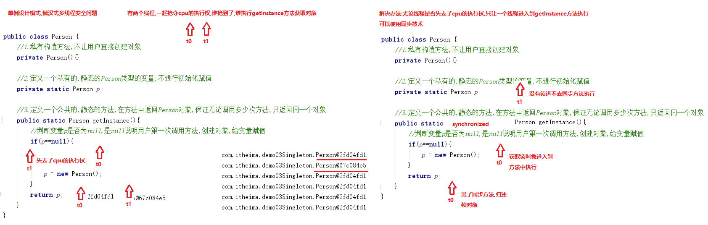
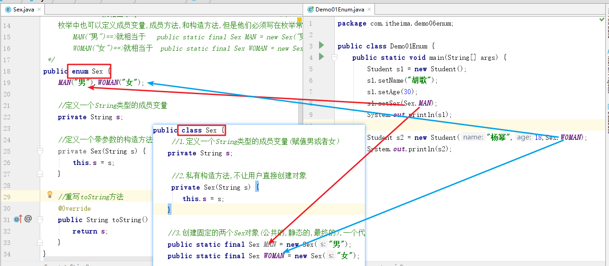

# 学习目标

```java
能够说出单例设计模式的好处
	//无论获取多少次对象,只产生一个对象
能够说出多例模式的好处
	//可以产生固定的多个对象
	扑克牌程序，一个“扑克类”会创建固定的54个对象，不能多、也不能少。
	麻将程序，一个“骰子类”会创建固定的2个对象，不能多、也不能少。
	程序中需要用到“颜色的表示”，只能有三种颜色“红、绿、蓝”，一个“颜色类(Color)”应该只创建三个对象，来代	表这三个颜色。

	//多例模式的作用：使某个类，在程序运行期间，只能产生固定的几个对象，不能多、也不能少。
能够使用工厂模式编写java程序
	public class AnimalFactory {
		//定义一个生产动物的方法,参数传递动物的名称,根据名称创建指定的动物
		public static Animal getInstance(String name){
			if("cat".equals(name)){
				return new Cat();
			}else if("dog".equals(name)){
				return new Dog();
			}else {
				//不是动物,返回null
				return null;
			}
		}
	}
- 能够定义枚举
	MAN ==> public static final Sex MAN = new Sex();
	WOMAN ==> public static final Sex WOMAN = new Sex();
	
	MAN("男")==>public static final Sex MAN = new Sex("男");
	WOMAN("女")==>public static final Sex WOMAN = new Sex("女");
- 能够理解正则表达式的作用
	//正则表达式本质就是一个包含某种规则的字符串,用于对其他的字符串进行校验
- 能够使用正则表达式的字符类
	1. [abc]：代表a或者b，或者c字符中的一个。
	2. [^abc]：代表除a,b,c以外的任何字符。
	3. [a-z]：代表a-z的所有小写字符中的一个。
	4. [A-Z]：代表A-Z的所有大写字符中的一个。
	5. [0-9]：代表0-9之间的某一个数字字符。
	6. [a-zA-Z0-9]：代表a-z或者A-Z或者0-9之间的任意一个字符。
	7. [a-dm-p]：a 到 d 或 m 到 p之间的任意一个字符。
- 能够使用正则表达式的逻辑运算符
	1. &&：并且
	2. || ：或者
- 能够使用正则表达式的预定义字符类
	1. "." ： 匹配任何字符。(重点)
	2. "\\d"：任何数字[0-9]的简写；(重点)
	3. "\\w"：单词字符：[a-zA-Z_0-9]的简写 (重点)
- 能够使用正则表达式限定符的
	1. X? : 0次或1次
	2. X* : 0次到多次  任意次
	3. X+ : 1次或多次
	4. X{n} : 恰好n次 X=n次
	5. X{n,} : 至少n次  X>=n次
	6. X{n,m}: n到m次(n和m都是包含的)    n =< X <= m
- 能够使用正则表达式的分组
	分组括号( )
	校验字符串"abc"可以出现任意次
	String regex = "(abc)*";
- 能够在String的split方法中使用正则表达式
	String[] split(String regex) 根据给定正则表达式的匹配拆分此字符串。
```

# 一.单例设计模式

**单例设计模式宗旨:保证一个类只产生一个对象**

## 1.饿汉式

```java
package com.itheima.demo01Singleton;

/*
    单例:保证一个类只产生一个对象
    饿汉式:
        形容人非常饥饿,无论我们是否使用对象,都先把对象创建好了
    实现步骤:
        1.私有构造方法,不让用户直接创建对象
        2.定义一个私有的,静态的,Person类型的变量,并进行初始化赋值(创建对象赋值)
        3.定义一个公共的,静态的,成员方法,把定义好的对象给用户返回
 */
public class Person {
    //1.私有构造方法,不让用户直接创建对象
    private Person(){}

    //2.定义一个私有的,静态的,Person类型的变量,并进行初始化赋值(创建对象赋值)
    private static Person p = new Person();

    //3.定义一个公共的,静态的,成员方法,把定义好的对象给用户返回
    public static Person getInstance(){
        return p;
    }
}
```

```java
package com.itheima.demo01Singleton;

public class Demo01Singleton {
    public static void main(String[] args) {
        //正常情况下,Person对象可以创建多个
        //Person p1 = new Person();
        //System.out.println(p1);//com.itheima.demo01Singleton.Person@4554617c
        //Person p2 = new Person();
        //System.out.println(p2);//com.itheima.demo01Singleton.Person@74a14482
        //Person p3 = new Person();
        //System.out.println(p3);//com.itheima.demo01Singleton.Person@1540e19d

        //测试单例设计模式,无论调用多少次方法,只产生一个对象
        for (int i = 0; i < 20; i++) {
            Person p = Person.getInstance();
            System.out.println(p);
        }
    }
}
```

执行结果:

```java
com.itheima.demo01Singleton.Person@4554617c
com.itheima.demo01Singleton.Person@4554617c
com.itheima.demo01Singleton.Person@4554617c
com.itheima.demo01Singleton.Person@4554617c
com.itheima.demo01Singleton.Person@4554617c
com.itheima.demo01Singleton.Person@4554617c
com.itheima.demo01Singleton.Person@4554617c
com.itheima.demo01Singleton.Person@4554617c
com.itheima.demo01Singleton.Person@4554617c
com.itheima.demo01Singleton.Person@4554617c
com.itheima.demo01Singleton.Person@4554617c
com.itheima.demo01Singleton.Person@4554617c
com.itheima.demo01Singleton.Person@4554617c
com.itheima.demo01Singleton.Person@4554617c
com.itheima.demo01Singleton.Person@4554617c
com.itheima.demo01Singleton.Person@4554617c
com.itheima.demo01Singleton.Person@4554617c
com.itheima.demo01Singleton.Person@4554617c
com.itheima.demo01Singleton.Person@4554617c
com.itheima.demo01Singleton.Person@4554617c
```

## 2.懒汉式

```java
package com.itheima.demo02Singleton;

/*
    单例设计模式_懒汉式
        形容人非常懒,抽一鞭子动一下
        当我们使用对象的时候,在创建对象,如果一直不使用对象,则一直不创建
    实现步骤:
        1.私有构造方法,不让用户直接创建对象
        2.定义一个私有的,静态的Person类型的变量,不进行初始化赋值
        3.定义一个公共的,静态的方法,在方法中返回Person对象,保证无论调用多少次方法,只返回同一个对象
 */
public class Person {
    //1.私有构造方法,不让用户直接创建对象
    private Person(){}

    //2.定义一个私有的,静态的Person类型的变量,不进行初始化赋值
    private static Person p;

    //3.定义一个公共的,静态的方法,在方法中返回Person对象,保证无论调用多少次方法,只返回同一个对象
    public static Person getInstance(){
        //判断变量p是否为null,是null说明用户第一次调用方法,创建对象,给变量赋值
        if(p==null){
            p = new Person();
        }
        return p;
    }
}
```

```java
package com.itheima.demo02Singleton;

public class Demo01Singleton {
    public static void main(String[] args) {
        //测试单例设计模式,无论调用多少次方法,只产生一个对象
        for (int i = 0; i < 20; i++) {
            Person p = Person.getInstance();
            System.out.println(p);
        }
    }
}
```

执行结果:

```java
com.itheima.demo02Singleton.Person@64b8f8f4
com.itheima.demo02Singleton.Person@64b8f8f4
com.itheima.demo02Singleton.Person@64b8f8f4
com.itheima.demo02Singleton.Person@64b8f8f4
com.itheima.demo02Singleton.Person@64b8f8f4
com.itheima.demo02Singleton.Person@64b8f8f4
com.itheima.demo02Singleton.Person@64b8f8f4
com.itheima.demo02Singleton.Person@64b8f8f4
com.itheima.demo02Singleton.Person@64b8f8f4
com.itheima.demo02Singleton.Person@64b8f8f4
com.itheima.demo02Singleton.Person@64b8f8f4
com.itheima.demo02Singleton.Person@64b8f8f4
com.itheima.demo02Singleton.Person@64b8f8f4
com.itheima.demo02Singleton.Person@64b8f8f4
com.itheima.demo02Singleton.Person@64b8f8f4
com.itheima.demo02Singleton.Person@64b8f8f4
com.itheima.demo02Singleton.Person@64b8f8f4
com.itheima.demo02Singleton.Person@64b8f8f4
com.itheima.demo02Singleton.Person@64b8f8f4
com.itheima.demo02Singleton.Person@64b8f8f4
```

## 3.懒汉式解决多线程安全问题



```java
package com.itheima.demo03Singleton;

public class Demo01Singleton {
    public static void main(String[] args) {
        //创建两个线程,每个线程分别调用10次获取对象的方法
        new Thread(()->{
            //测试单例设计模式,无论调用多少次方法,只产生一个对象
            for (int i = 0; i < 10; i++) {
                Person p = Person.getInstance();
                System.out.println(p);
            }
        }).start();

        new Thread(()->{
            //测试单例设计模式,无论调用多少次方法,只产生一个对象
            for (int i = 0; i < 10; i++) {
                Person p = Person.getInstance();
                System.out.println(p);
            }
        }).start();
    }
}
```

执行结果:

```java
com.itheima.demo03Singleton.Person@67c084e5
com.itheima.demo03Singleton.Person@47e3e4b5
com.itheima.demo03Singleton.Person@67c084e5
com.itheima.demo03Singleton.Person@67c084e5
com.itheima.demo03Singleton.Person@67c084e5
com.itheima.demo03Singleton.Person@67c084e5
com.itheima.demo03Singleton.Person@67c084e5
com.itheima.demo03Singleton.Person@67c084e5
com.itheima.demo03Singleton.Person@67c084e5
com.itheima.demo03Singleton.Person@67c084e5
com.itheima.demo03Singleton.Person@67c084e5
com.itheima.demo03Singleton.Person@67c084e5
com.itheima.demo03Singleton.Person@67c084e5
com.itheima.demo03Singleton.Person@67c084e5
com.itheima.demo03Singleton.Person@67c084e5
com.itheima.demo03Singleton.Person@67c084e5
com.itheima.demo03Singleton.Person@67c084e5
com.itheima.demo03Singleton.Person@67c084e5
com.itheima.demo03Singleton.Person@67c084e5
com.itheima.demo03Singleton.Person@67c084e5
```

解决办法:使用同步方法

```java
package com.itheima.demo03Singleton;

/*
    单例设计模式_懒汉式
        形容人非常懒,抽一鞭子动一下
        当我们使用对象的时候,在创建对象,如果一直不使用对象,则一直不创建
    实现步骤:
        1.私有构造方法,不让用户直接创建对象
        2.定义一个私有的,静态的Person类型的变量,不进行初始化赋值
        3.定义一个公共的,静态的方法,在方法中返回Person对象,保证无论调用多少次方法,只返回同一个对象
 */
public class Person {
    //1.私有构造方法,不让用户直接创建对象
    private Person(){}

    //2.定义一个私有的,静态的Person类型的变量,不进行初始化赋值
    private static Person p;

    //3.定义一个公共的,静态的方法,在方法中返回Person对象,保证无论调用多少次方法,只返回同一个对象
    public static synchronized Person getInstance(){
        //判断变量p是否为null,是null说明用户第一次调用方法,创建对象,给变量赋值
        if(p==null){
            p = new Person();
        }
        return p;
    }
}
```

## 小结

单例模式可以保证系统中一个类只有一个对象实例。

实现单例模式的步骤：

1. 将构造方法私有化，使其不能在类的外部通过new关键字实例化该类对象。
2. 在该类内部产生一个唯一的实例化对象，并且将其封装为private static类型的成员变量。
3. 定义一个静态方法返回这个唯一对象。

# 二.多例设计模式

## 1.多例设计模式概述

多例模式，是一种常用的软件设计模式。通过多例模式可以保证系统中，应用该模式的类有**固定数量**的实例。多例类要自我创建并管理自己的实例，还要向外界提供获取本类实例的方法。

例如：

​	扑克牌程序，一个“扑克类”会创建固定的54个对象，不能多、也不能少。

​    麻将程序，一个“骰子类”会创建固定的2个对象，不能多、也不能少。

​	程序中需要用到“颜色的表示”，只能有三种颜色“红、绿、蓝”，一个“颜色类(Color)”应该只创建三个对象，来代	表这三个颜色。

多例模式的作用：使某个类，在程序运行期间，只能产生固定的几个对象，不能多、也不能少。

## 2.获取多个通用的对象

```java
package com.itheima.demo04Multiton;

import java.util.ArrayList;
import java.util.Random;

/*
    多例设计模式_获取多个通用的对象
    通用:都是一样的的对象
    需求:
        无论调用多少次方法,只产生固定的3个Person对象
    实现步骤:
        1.私有构造方法,不让用户直接创建对象
        2.定义一个私有的,静态的,最终的变量,值赋要创建对象的个数
        3.定义一个私有的,静态的ArrayList集合对象
        4.定义一个静态代码块(优先执行,只执行一次),创建指定个数个对象,存储到集合中
        5.定义一个公共的,静态方法,在集合的索引范围内随机返回一个对象
 */
public class Person {
    //1.私有构造方法,不让用户直接创建对象
    private Person(){}

    //2.定义一个私有的,静态的,最终的变量,值赋要创建对象的个数
    private static final int SIZE = 3;

    //3.定义一个私有的,静态的ArrayList集合对象
    private static ArrayList<Person> list = new ArrayList<>();

    //4.定义一个静态代码块(优先执行,只执行一次),创建指定个数个对象,存储到集合中
    static {
            for (int i = 0; i < SIZE; i++) {
                list.add(new Person());
            }
    }

    //5.定义一个公共的,静态方法,在集合的索引范围内随机返回一个对象
    public static Person getInstance(){
        //定义Random对象
        Random r = new Random();
        //使用Random对象中的方法nextInt,在在集合的索引范围内随机获取一个整数索引
        int index = r.nextInt(list.size());//0,1,2
        //根据索引在集合中获取一个Person对象返回
        return list.get(index);
    }
}
```

```java
package com.itheima.demo04Multiton;

public class Demo01Multiton {
    public static void main(String[] args) {
        //测试多例设计模式,无论调用多少次方法,只产生固定3个对象
        for (int i = 0; i < 20; i++) {
            Person p = Person.getInstance();
            System.out.println(p);
        }
    }
}
```

执行结果:

```java
com.itheima.demo04Multiton.Person@74a14482
com.itheima.demo04Multiton.Person@1540e19d
com.itheima.demo04Multiton.Person@74a14482
com.itheima.demo04Multiton.Person@677327b6
com.itheima.demo04Multiton.Person@1540e19d
com.itheima.demo04Multiton.Person@677327b6
com.itheima.demo04Multiton.Person@74a14482
com.itheima.demo04Multiton.Person@74a14482
com.itheima.demo04Multiton.Person@74a14482
com.itheima.demo04Multiton.Person@677327b6
com.itheima.demo04Multiton.Person@677327b6
com.itheima.demo04Multiton.Person@74a14482
com.itheima.demo04Multiton.Person@1540e19d
com.itheima.demo04Multiton.Person@74a14482
com.itheima.demo04Multiton.Person@1540e19d
com.itheima.demo04Multiton.Person@677327b6
com.itheima.demo04Multiton.Person@1540e19d
com.itheima.demo04Multiton.Person@74a14482
com.itheima.demo04Multiton.Person@74a14482
com.itheima.demo04Multiton.Person@677327b6
```

## 3.获取多个特定的对象

```java
package com.itheima.demo05Multiton;

public class Student {
    private String name;
    private int age;
    private String sex;

    public Student() {
    }

    public Student(String name, int age, String sex) {
        this.name = name;
        this.age = age;
        this.sex = sex;
    }

    @Override
    public String toString() {
        return "Student{" +
                "name='" + name + '\'' +
                ", age=" + age +
                ", sex='" + sex + '\'' +
                '}';
    }

    public String getName() {
        return name;
    }

    public void setName(String name) {
        this.name = name;
    }

    public int getAge() {
        return age;
    }

    public void setAge(int age) {
        this.age = age;
    }

    public String getSex() {
        return sex;
    }

    public void setSex(String sex) {
        this.sex = sex;
    }
}
```

```java
package com.itheima.demo05Multiton;

public class Demo01Multiton {
    public static void main(String[] args) {
        Student s = new Student();
        s.setName("小强");
        s.setAge(18);
        //s.setSex("男");
        s.setSex("abc");
        System.out.println(s);
    }
}
```

**优化代码:解决用户随意填写性别问题**

```java
package com.itheima.demo05Multiton;

/*
    多例设计模式_获取多个特定的对象
    需求:
        只产生两个Sex对象,一个代表男,一个代表女
    实现步骤:
        1.定义一个String类型的成员变量(赋值男或者女)
        2.私有构造方法,不让用户直接创建对象
        3.创建固定的两个Sex对象(公共的,静态的,最终的),一个代表男,一个代表女
        4.重写toString方法,返回成员变量的值
 */
public class Sex {
     //1.定义一个String类型的成员变量(赋值男或者女)
    private String s;

     //2.私有构造方法,不让用户直接创建对象
     private Sex(String s) {
        this.s = s;
    }

    //3.创建固定的两个Sex对象(公共的,静态的,最终的),一个代表男,一个代表女
    public static final Sex MAN = new Sex("男");
    public static final Sex WOMAN = new Sex("女");

     //4.重写toString方法,返回成员变量的值
    @Override
    public String toString() {
        return s;
    }
}
```

```java
package com.itheima.demo05Multiton;

public class Student {
    private String name;
    private int age;
    //定义性别使用Sex类型
    private Sex sex;

    public Student() {
    }

    public Student(String name, int age, Sex sex) {
        this.name = name;
        this.age = age;
        this.sex = sex;
    }

    @Override
    public String toString() {
        return "Student{" +
                "name='" + name + '\'' +
                ", age=" + age +
                ", sex=" + sex +
                '}';
    }

    public String getName() {
        return name;
    }

    public void setName(String name) {
        this.name = name;
    }

    public int getAge() {
        return age;
    }

    public void setAge(int age) {
        this.age = age;
    }

    public Sex getSex() {
        return sex;
    }

    public void setSex(Sex sex) {
        this.sex = sex;
    }
}
```

```java
package com.itheima.demo05Multiton;

public class Demo01Multiton {
    public static void main(String[] args) {
        Student s = new Student();
        s.setName("小强");
        s.setAge(18);
        //s.setSex("男");
        //s.setSex("abc");//报错了,Sex变量的值需要Sex对象
        //s.setSex(Sex.MAN);
        s.setSex(Sex.WOMAN);
        System.out.println(s);
    }
}
```

## 小结

多例模式可以保证系统中一个类有固定个数的实例, 在实现需求的基础上, 能够提高实例的复用性.

实现多例模式的步骤：

1. 创建一个类,  将构造方法私有化，使其不能在类的外部通过new关键字实例化该类对象。
2. 在类中定义该类被创建的总数量
3. 在类中定义存放类实例的list集合
4. 在类中提供静态代码块,在静态代码块中创建类的实例
5. 提供获取类实例的静态方法

# 三.枚举

## 1.枚举的定义

```java
package com.itheima.demo06enum;

/*
    枚举:
        枚举就是"多例设计模式_获取多个特定的对象"的一种简化格式
    需求:
        只产生两个Sex对象,一个代表男,一个代表女
    多例:
        public static final Sex MAN = new Sex("男");
        public static final Sex WOMAN = new Sex("女");
    枚举:
        MAN==>就相当于 public static final Sex MAN = new Sex();
        WOMAN==>就相当于 public static final Sex WOMAN = new Sex();
    枚举中也可以定义成员变量,成员方法,和构造方法,但是他们必须写在枚举常量的下边
        MAN("男")==>就相当于   public static final Sex MAN = new Sex("男");
        WOMAN("女")==>就相当于  public static final Sex WOMAN = new Sex("女");
 */
public enum Sex {
    MAN("男"),WOMAN("女");

    //定义一个String类型的成员变量
    private String s;

    //定义一个带参数的构造方法(必须私有)
    private Sex(String s) {
        this.s = s;
    }

    //重写toString方法
    @Override
    public String toString() {
        return s;
    }
}
```

## 2.枚举的使用

```java
package com.itheima.demo06enum;

public class Student {
    private String name;
    private int age;
    //Sex使用枚举类型
    private Sex sex;

    public Student() {
    }

    public Student(String name, int age, Sex sex) {
        this.name = name;
        this.age = age;
        this.sex = sex;
    }

    @Override
    public String toString() {
        return "Student{" +
                "name='" + name + '\'' +
                ", age=" + age +
                ", sex=" + sex +
                '}';
    }

    public String getName() {
        return name;
    }

    public void setName(String name) {
        this.name = name;
    }

    public int getAge() {
        return age;
    }

    public void setAge(int age) {
        this.age = age;
    }

    public Sex getSex() {
        return sex;
    }

    public void setSex(Sex sex) {
        this.sex = sex;
    }
}
```

```java
package com.itheima.demo06enum;

public class Demo01Enum {
    public static void main(String[] args) {
        Student s1 = new Student();
        s1.setName("胡歌");
        s1.setAge(30);
        s1.setSex(Sex.MAN);
        System.out.println(s1);

        Student s2 = new Student("杨幂",18,Sex.WOMAN);
        System.out.println(s2);
    }
}
```



## 3.枚举的应用

**枚举的作用：枚举通常可以用于做信息的分类，如性别，方向，季度等。**

枚举表示性别：

```java
public enum Sex {
    MALE, FEMALE;
}
```

枚举表示方向：

```java
public enum Orientation {
    UP, RIGHT, DOWN, LEFT;
}
```

枚举表示季度

```java
public enum Season {
    SPRING, SUMMER, AUTUMN, WINTER;
}
```

## 小结

- 枚举类在第一行罗列若干个枚举对象。（多例）
- 第一行都是常量，存储的是枚举类的对象。
- 枚举是不能在外部创建对象的，枚举的构造器(方法)默认是私有的。
- 枚举通常用于做信息的标志和分类。

# 四.工厂设计模式

## 1.简单工厂设计模式

```java
package com.itheima.demo07SimpleFactory;

/*
    定义生产动物的工厂类
    工厂类只生产动物,不生产其他的对象
    传递不是动物的名称,返回null
 */
public class AnimalFactory {
    //定义一个生产动物的静态方法,传递动物名称,返回不同的动物
    public static Animal getInstance(String name){
        if("cat".equals(name)){
            return new Cat();
        }else if("dog".equals(name)){
            return new Dog();
        }else{
            //不是动物,返回null
            return null;
        }
    }
}
```

```java
package com.itheima.demo07SimpleFactory;

/*
    简单工厂设计模式:
    作用:
        创建一个生产动物的工厂类,在工厂类中定义一个生产动物的方法
        方法的参数传递动物名称,根据动物名称生产不同的动物
        以后获取动物对象,不在自己创建了,通过工厂中的方法获取
    好处:
        提高了程序的扩展性
        传递什么动物名称,就返回什么动物
    弊端:
        胡乱指定一个动物名称,返回null,容易引发空指针异常
 */
public class Demo01SimpleFactory {
    public static void main(String[] args) {
        //使用工厂类,获取猫
        Animal cat = AnimalFactory.getInstance("cat");
        cat.eat();
        AnimalFactory.getInstance("cat").eat();
        AnimalFactory.getInstance("cat").eat();
        AnimalFactory.getInstance("cat").eat();
        AnimalFactory.getInstance("cat").eat();

        //使用工厂类,获取狗
        Animal dog = AnimalFactory.getInstance("dog");
        dog.eat();

        //胡乱指定一个不存在的名称,会返回null
        Animal car = AnimalFactory.getInstance("car");
        car.eat();//null.eat();  NullPointerException
    }
}
```

```java
package com.itheima.demo07SimpleFactory;

public abstract class Animal {
    public abstract void eat();
}
```

```java
package com.itheima.demo07SimpleFactory;

public class Cat extends Animal {
    @Override
    public void eat() {
        System.out.println("猫吃鱼!");
    }
}
```

```java
package com.itheima.demo07SimpleFactory;

public class Dog extends Animal{
    @Override
    public void eat() {
        System.out.println("狗吃肉!");
    }
}
```


## 2.工厂方法设计模式(扩展-了解)

```java
package com.itheima.demo08FactoryMethod;

/*
    工厂方法设计模式(扩展-了解)
    作用:
        创建不同的工厂
        猫工厂只生产猫,狗工厂只生产狗
    好处:
        解决简单工厂设计模式的弊端,不让用户指定动物名称了
        什么工厂就什么什么动物
    弊端:
        动物太多了,生产动物的工厂也会随之增加
 */
public class Demo01FactoryMethod {
    public static void main(String[] args) {
        //创建生产猫的工厂
        CatFactory catFactory = new CatFactory();
        Animal cat = catFactory.getInstacne();
        cat.eat();
        //可以生产多个Cat对象
        catFactory.getInstacne().eat();
        catFactory.getInstacne().eat();
        catFactory.getInstacne().eat();
        catFactory.getInstacne().eat();

        //创建生产狗的工厂
        DogFactory dogFactory = new DogFactory();
        Animal dog = dogFactory.getInstacne();
        dog.eat();
        //可以生产多个Dog对象
        dogFactory.getInstacne().eat();
        dogFactory.getInstacne().eat();
        dogFactory.getInstacne().eat();
        dogFactory.getInstacne().eat();
    }
}
```

```java
package com.itheima.demo08FactoryMethod;

//创建一个工厂接口,供所有的工厂类实现
public interface Factory {
    //定义一个抽象生产动物的方法
    public abstract Animal getInstacne();
}
```

```java
package com.itheima.demo08FactoryMethod;

/*
    生产猫的工厂
    实现工厂接口,重写生产动物的方法,只生产猫
 */
public class CatFactory implements Factory{
    @Override
    public Animal getInstacne() {
        return new Cat();
    }
}
```

```java
package com.itheima.demo08FactoryMethod;

/*
    生产狗的工厂
    实现工厂接口,重写生产动物的方法,只生产狗
 */
public class DogFactory implements Factory{
    @Override
    public Animal getInstacne() {
        return new Dog();
    }
}
```

```java
package com.itheima.demo08FactoryMethod;

public abstract class Animal {
    public abstract void eat();
}
```

```java
package com.itheima.demo08FactoryMethod;

public class Cat extends Animal {
    @Override
    public void eat() {
        System.out.println("猫吃鱼!");
    }
}
```

```java
package com.itheima.demo08FactoryMethod;

public class Dog extends Animal {
    @Override
    public void eat() {
        System.out.println("狗吃肉!");
    }
}
```

# 五.正则表达式

## 1.正则表达式的概念及演示

```java
package com.itheima.demo09Regex;

import java.util.Scanner;

/*
    正则表达式的概念及演示
    正则表达式就是一个包含了某些规则的字符串,用于对其他的字符串进行校验
    需求:对QQ号进行校验
    要求: "123456"  "012312312"  "123a123"
        1.全是数字
        2.5-15位之间
        3.第一位不能是0
 */
public class Demo01Regex {
    public static void main(String[] args) {
        System.out.println("请输入您的QQ号:");
        String qq = new Scanner(System.in).nextLine();
        boolean b = show01(qq);
        System.out.println(b);
        boolean b2 = checkQQ(qq);
        System.out.println(b2);
    }

    /*
        使用正则表达式校验QQ号
        定义一个校验QQ号的正则表达式: "[1-9][0-9]{4,14}"
        String类的方法:
            boolean matches(String regex)
                判断此字符串是否匹配给定的正则表达式。
                满足返回true,不满足返回false
     */
    public static boolean checkQQ(String qq){
        return qq.matches("[1-9][0-9]{4,14}");
    }

    /*
        不使用正则表达式校验QQ号
     */
    private static boolean show01(String qq) {
        //1.全是数字
        char[] chars = qq.toCharArray();
        for (char c : chars) {
            //判断字符是否在'0'到'9'之间
            if(c<'0' || c>'9'){
                return false;
            }
        }
        //2.5-15位之间
        if(qq.length()<5 || qq.length()>15){
            return false;
        }
        //3.第一位不能是0
        //if('0'==qq.charAt(0))){
        if("0".equals(qq.charAt(0)+"")){
            return false;
        }
        //都满足规则,返回true
        return true;
    }
}
```

## 2.正则表达式-字符类

```java
package com.itheima.demo09Regex;

/*
    java.util.regex.Pattern类:定义了正则表达式的规则
    正则表达式-字符类
    语法示例：[]代表范围,范围可以自定义
    1. [abc]：代表a或者b，或者c字符中的一个。
    2. [^abc]：代表除a,b,c以外的任何字符。
    3. [a-z]：代表a-z的所有小写字符中的一个。
    4. [A-Z]：代表A-Z的所有大写字符中的一个。
    5. [0-9]：代表0-9之间的某一个数字字符。[2-5]  [1-9]
    6. [a-zA-Z0-9]：代表a-z或者A-Z或者0-9之间的任意一个字符。
    7. [a-dm-p]：a 到 d 或 m 到 p之间的任意一个字符。
 */
public class Demo02Regex {
    public static void main(String[] args) {
        String str = "ead"; //b1:false
        str = "hid";//b1:true
        str = "hUd";//b1:false

        //1.验证str是否以h开头，以d结尾，中间是a,e,i,o,u中某个字符
        String regex = "h[aeiou]d";
        boolean b1 = str.matches(regex);
        System.out.println("b1:"+b1);

        str = "hbd";//b2:true
        str = "abd";//b2:false
        str = "hed";//b2:false
        str = "h%d";//b2:true
        //2.验证str是否以h开头，以d结尾，中间不是a,e,i,o,u中的某个字符
        regex = "h[^aeiou]d";
        boolean b2 = str.matches(regex);
        System.out.println("b2:"+b2);

        str = "wad";//b3:true
        str = "Aad";//b3:false
        str = "aaa";//b3:false
        //3.验证str是否a-z的任何一个小写字符开头，后跟ad
        regex = "[a-z]ad";
        boolean b3 = str.matches(regex);
        System.out.println("b3:"+b3);

        str = "mad";//b4:true
        str = "ead";//b4:false
        //4.验证str是否以a-d或者m-p之间某个字符开头，后跟ad
        regex = "[a-dm-p]ad";
        boolean b4 = str.matches(regex);
        System.out.println("b4:"+b4);
    }
}
```

## 3.正则表达式-逻辑运算符

```java
package com.itheima.demo09Regex;

/*
    正则表达式-逻辑运算符
    语法示例：
    1. &&：并且
    2. || ：或者
 */
public class Demo03Regex {
    public static void main(String[] args) {
        String str = "had";//b1:true
        str = "@ad";//b1:false
        str = "Had";//b1:false

        /*
            1.要求字符串是否是除a、e、i、o、u外的其它小写字符开头，后跟ad
            a.除a、e、i、o、u外[^aeiou]
            b.小写字符[a-z]
            以上两个条件必须同时满足,可以使用&&
         */
        String regex = "[[^aeiou]&&[a-z]]ad";
        boolean b1 = str.matches(regex);
        System.out.println("b1:"+b1);

        str = "aad";//b2:true
        str = "bad";//b2:false
        str = "iaa";//b2:false
        /*
            2.要求字符串是aeiou中的某个字符开头，后跟ad
            [a||e||i||o||u] 或运算符可以省略 [aeiou]
         */
        //regex = "[a||e||i||o||u]ad";
        regex = "[aeiou]ad";
        boolean b2 = str.matches(regex);
        System.out.println("b2:"+b2);
    }
}
```

## 4.正则表达式-预定义字符

```java
package com.itheima.demo09Regex;

/*
    正则表达式-预定义字符
    语法示例：
    1. "." ： 匹配任何字符。(重点)
    2. "\\d"：任何数字[0-9]的简写；(重点)
    3. "\\D"：任何非数字[^0-9]的简写；
    4. "\\s"： 空白字符：[ \t\n\x0B\f\r] 的简写
    5. "\\S"： 非空白字符：[^\s] 的简写
    6. "\\w"：单词字符：[a-zA-Z_0-9]的简写(重点)
    7. "\\W"：非单词字符：[^\w]
    注意:在正则表达式中反斜杠必须写两个,一个代表转义字符
 */
public class Demo04Regex {
    public static void main(String[] args) {
        String str = "258";//b1:true
        str = "25a";//b1:false

        //1.验证str是否3位数字
        //String regex = "[0-9][0-9][0-9]";
        String regex = "\\d\\d\\d";
        boolean b1 = str.matches(regex);
        System.out.println("b1:"+b1);

        str = "13888888888";//b2:true
        str = "138888888881";//b2:false
        str = "11888888888";//b2:false
        str = "23888888888";//b2:false
        str = "13888o88888";//b2:false
        //2.验证手机号：1开头，第二位：3/5/8，剩下9位都是0-9的数字
        //regex = "1[358][0-9][0-9][0-9][0-9][0-9][0-9][0-9][0-9][0-9]";
        regex = "1[358]\\d\\d\\d\\d\\d\\d\\d\\d\\d";
        boolean b2 = str.matches(regex);
        System.out.println("b2:"+b2);

        str = "hhd";//b3:true
        str = "h d";//b3:true
        str = "h中d";//b3:true
        str = "h@d";//b3:true
        str = "hd";//b3:false
        str = "Had";//b3:false
        //3.验证字符串是否以h开头，以d结尾，中间是任何字符
        regex = "h.d";
        boolean b3 = str.matches(regex);
        System.out.println("b3:"+b3);

        /*
            4.验证str是否是：had.
            注意:以上的.是一个普通的.不是任意字符
            可以使用转义字符,把有特殊含义的.转换为普通的.
         */
        str = "hada";//b4:false
        str = "had.";//b4:true
        regex = "had\\.";
        boolean b4 = str.matches(regex);
        System.out.println("b4:"+b4);
    }
}
```

## 5. 正则表达式-数量词

```java
package com.itheima.demo09Regex;

/*
    正则表达式-数量词
    语法示例：
    1. X? : 0次或1次   a?  "" "a"  true   "aaa" false
    2. X+ : 1次或多次 X>=1次 a+ "" false  "a" "aaaaaaa" true
    3. X* : 0次到多次 任意次  a*  ""  "a" "aaa" true  "b"
    4. X{n} : 恰好n次 X==n   a{3}  "aaa" true   "a" "aaaa" false
    5. X{n,} : 至少n次 X>=n  a{3,} ""  "a"  "aa" false  "aaa"  "aaaaaaaa" true
    6. X{n,m}: n到m次(n和m都是包含的)  n=<X<=m
 */
public class Demo05Regex {
    public static void main(String[] args) {
        String str = ""; //b1:false
        str = "250";//b1:true
        str = "1111";//b1:false

        //1.验证str是否是三位数字
        String regex = "\\d{3}";
        boolean b1 = str.matches(regex);
        System.out.println("b1:"+b1);

        str = "131323123";//b2:true
        str = "";//b2:false
        str = "1232a1";//b2:false
        str = "1";//b2:true
        //2.验证str是否是多位(1次以上)数字
        regex = "\\d+";
        boolean b2 = str.matches(regex);
        System.out.println("b2:"+b2);

        str = "13888o88888";//b2:false
        str = "13888188888";//b3:true
        //3.验证str是否是手机号：1开头，第二位：3/5/8，剩下9位都是0-9的数字
        regex = "1[358]\\d{9}";
        boolean b3= str.matches(regex);
        System.out.println("b3:"+b3);

        //4.验证小数:必须出现小数点，但是只能出现1次
        //double d = 1.1;
        //d = 1.;//1.0
        //d = .1;//0.1
        //System.out.println(d);

        str = "1.1";//b4:true
        str = "1.";//b4:true
        str = ".1";//b4:true
        str = "111.12312311";//b4:true
        regex = "\\d*\\.\\d*";
        boolean b4 = str.matches(regex);
        System.out.println("b4:"+b4);

        str = "111";//b5:true
        str = "1.1";//b5:true
        str = "1..1";//b5:false
        //5.验证小数：小数点可以不出现，也可以出现1次
        regex = "\\d*\\.?\\d*";
        boolean b5 = str.matches(regex);
        System.out.println("b5:"+b5);

        //6.验证小数：要求匹配：3、3.、3.14、+3.14、-3.
        str = "3";//b6:true
        str = "3.";//b6:true
        str = "3.14";//b6:true
        str = "+3.14";//b6:true
        str = "-3.";//b6:true
        str = ".";//b6:false
        str = "11..1";//b6:false
        regex = "[+-]?\\d+\\.?\\d*";
        boolean b6 = str.matches(regex);
        System.out.println("b6:"+b6);

        str = "1111";//b7:false
        str = "11112";//b7:true
        str = "011112";//b7:false
        str = "111a2";//b7:false
        //7.验证qq号码：1).5--15位；2).全部是数字;3).第一位不是0
        //regex = "[1-9][0-9]{4,14}";
        regex = "[1-9]\\d{4,14}";
        boolean b7 = str.matches(regex);
        System.out.println("b7:"+b7);
    }
}
```

## 6.正则表达式-分组括号( )

```java
package com.itheima.demo09Regex;

/*
    正则表达式-分组括号( )
 */
public class Demo06Regex {
    public static void main(String[] args) {
        String str = "abc";//b1:true
        str = "abcabcabcabcabcabcabcabcabcabcabc";//b1:true
        str = "";//b1:true
        str = "aabbcc";//b1:false

        //"abc"作为一组元素,可以出现任意次
        String regex = "(abc)*";
        boolean b1 = str.matches(regex);
        System.out.println("b1:"+b1);

        str = "DG8FV-B9TKY-FRT9J-99899-XPQ4G";//b2:true
        str = "DG8FV-B9TKY-FRT9J-99899XPQ4G";//b2:false
        //验证这个序列号：分为5组，每组之间使用-隔开，每组由5位A-Z或者0-9的字符组成
        regex = "([A-Z0-9]{5}-){4}[A-Z0-9]{5}";
        boolean b2 = str.matches(regex);
        System.out.println("b2:"+b2);
    }
}
```

## 7.String类中和正则表达式相关的方法

```java
package com.itheima.demo09Regex;

import java.util.Arrays;

/*
    String类中和正则表达式相关的方法
    boolean matches(String regex) 判断此字符串是否匹配给定的正则表达式。
    String[] split(String regex) 根据给定正则表达式的匹配拆分此字符串。
    String replaceAll(String regex, String replacement) 使用给定的 replacement 替换此字符串所有匹配给定的正则表达式的子字符串。 
 */
public class Demo06StringMethod {
    public static void main(String[] args) {
        show02();
    }

    /*
        String replaceAll(String regex, String replacement) 使用给定的 replacement 替换此字符串所有匹配给定的正则表达式的子字符串。
        此方法可以用于过滤关键字
     */
    private static void show02() {
        String s1 = "fjl1dsa333jfl4ds5aj6fl777adl99fjda10f";
        //需求:把字符串中的每一个数字,都替换为一个@_@
        String s2 = s1.replaceAll("\\d", "@_@");
        System.out.println(s2);

        //需求:把字符串中数字或者连续的数字,替换为一个@_@
        String s3 = s1.replaceAll("\\d+", "@_@");
        System.out.println(s3);
    }

    /*
        String[] split(String regex) 根据给定正则表达式的匹配拆分此字符串。
     */
    private static void show01() {
        String s1 = "aa-bb-cc-dd";
        String[] arr1 = s1.split("-");
        System.out.println(Arrays.toString(arr1));

        String s2 = "192.168.1.100";
        String[] arr2 = s2.split("\\.");// .在正则表达式中代表任意字符,使用转义字符转换为普通的.在切割
        System.out.println(arr2.length);//4
        System.out.println(Arrays.toString(arr2));//[192, 168, 1, 100]

        String s3 = "11 22 33 44";
        String[] arr3 = s3.split(" ");
        System.out.println(Arrays.toString(arr3));//[11, 22, 33, 44]

        String s4 = "aa       33         11        44";
        String[] arr4 = s4.split(" +");//根1个或者多个空格切割字符串
        System.out.println(arr4.length);//4
        System.out.println(Arrays.toString(arr4));//[aa, 33, 11, 44]
    }
}
```

## 🎗经验分享

### 1. 代码

**测试类**

```java
/*
	测试类
	在main()中实现了将一个字符串中所有的"小写字符"替换为"*"符号。
	多个连续的"小写字符"替换为一个"*"。
*/
public class Demo {
    public static void main(String[] args)  {
        //现有一个字符串对象，存储了一个IP地址：
        String str = "jfke324jfei4jkf342kj52kjk52l32432jfslds";
        //将所有的小写字符替换为*符号
        str = str.replaceAll("[a-z]*","*");
        //打印结果
        System.out.println(str);
    }
}

```

### 2.出现的问题

运行之后可以看到以下结果：


这个程序的执行结果有两个问题使人迷惑：

1. 为什么3前面有两个\*符号，而不是四个\*符号?
2. 数字324中间为什么也有\*符号？

### 3.问题的分析

> 首先大家知道，*符号在正则表达式中表示：0次到多次，所以正则表达式"[a-z]\*"就表示匹配：0个或多个小写英文字符。所以对于字符串"jfke"会匹配两次，j前面的空字符串会匹配一次，后面的"jfke"会匹配一次，所以会出现两个\*符号。而数字324中间一样会包含空字符串""，所以每个数字之间又匹配一次，这样就变成了上面的结果。

### 4.问题解决办法

> 将正则表达式中的*符号改为+符号即可，+符号表示1次或多次：

```java
public class Demo01Test {
    public static void main(String[] args) {
        //现有一个字符串对象，存储了一个IP地址：
        String str = "jfke324jfei4jkf342kj52kjk52l32432jfslds";
        //将所有的小写字符替换为*符号
        str = str.replaceAll("[a-z]+","*");
        //打印结果
        System.out.println(str);
    }
}

```

再次运行，查看结果：


