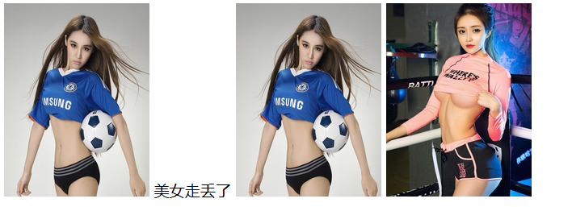
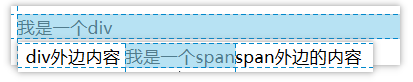

# 学习目标

```java
- 会使用页面中的文字,超链接,图片,列表,特殊符号	
	标题标签:h1-h6
		<h1>传智播客</h1>
		<h3>黑马程序员</h3>
		<h6>大数据学科</h6>		
	字体标签:font(了解)
		<font size="7">我是最大的字体</font>
		<font color="blue">我是蓝色的字体</font>
		<font face="楷体">我是楷体</font>
	格式化标签:
		加粗:b标签  
			格式:<b>文字</b>
		斜体:i标签
			格式:<i>文字</i>	
	超链接标签:a
		<!--文字超链接-->
		<a href="07_html标签_段落标签.html">07_html标签_段落标签.html</a>
		<a href="http://www.baidu.com" target="_blank">点我到百度</a>
		
		<!--图片超链接-->
		<a href="http://www.itcast.cn" target="_blank">
			
		</a>
	图片标签:img
		
	特殊符号:转义字符
			英文空格&nbsp;
			中文空格&emsp;
			小于号&lt;
			大于号&gt;
			&符号&amp;
			×叉号&times;
			￥人民币符号&yen;
			美元符号$
- 能够使用表格完成页面布局	
	<!--使用table标签创建一个表格-->
	<table border="1px" width="500px" cellpadding="0px" cellspacing="0px">
		<!--使用3个tr标签,创建3行-->
		<tr bgcolor="pink">
			<!--使用3个th设置3个表头:加粗居中-->
			<th>1-1</th>
			<th>1-2</th>
			<th>1-3</th>
		</tr>
		<tr align="right">
			<!--使用3个td设置3列-->
			<td>2-1</td>
			<td>2-2</td>
			<td>2-3</td>
		</tr>
		<tr align="center">
			<!--使用3个td设置3列-->
			<td>3-1</td>
			<td>3-2</td>
			<td>3-3</td>
		</tr>
	</table>
- 会使用HTML表单控件(重点掌握)
		input标签type的属性值:
			- text:普通文本
			- password:密码输入框,里边的密码以黑色的小圆点显示
			- data:日期框						
			- radio:单选框
			- checkbox:多选框
			- file:上传文件
			- image:上传图片使用
			- hidden:隐藏域,存储数据使用,不会在浏览器页面显示
			- button:普通按钮,配合js使用
			- reset:重置按钮,把表单的恢复到默认状态(清空表单)
			- submit:提交按钮,把表单的数据,提交到服务器。
		select:下拉选标签
		textarea:多行文本域
```

# 第一章 HTML 简述

## 1.什么是HTML

HTML：超文本标记语言（HyperText Markup Language）

- “超文本”就是指页面内可以包含图片、链接等非文字内容。
- “标记”就是使用标签的方法将需要的内容包括起来。例如：`<a herf="sfdsfsd">www.itcast.cn</a> `

## 2.HTML能干什么

HTML用于**编写网页**。平时上网通过浏览器我们看到的大部分页面都是由html编写的。在浏览器访问网页时，可以通过“右键/查看网页源代码”看到具体的html代码。

网页内容包含：HTML代码、CSS代码、JavaScript代码等内容。

- HTML代码：用于展示需要显示的数据。
- CSS代码：使显示的数据更佳好看。
- JavaScript代码：使整个页面显示的数据具有动画效果。

## 3.HTML语言特点

- HTML文件不需要编译，直接使用浏览器阅读即可
- HTML文件的扩展名是*.html 或 *.htm
- HTML结构都是由标签组成
  - 标签名预先定义好的，我们只需要了解其功能即可。
  - 标签名不区分大小写   `<A name="属性值" age="18" >标签体</a>`
  - 通常情况下标签由开始标签和结束标签组成。例如：`<a 属性名="属性值" href="01_html">标签体</a>`
  - 如果没有结束标签，建议以/结尾。例如：``
- HTML结构包括两部分：头head和体body
- html和xml的区别
  - html:
    - 给用户展示数据(显示文字,显示图片...)
    - 标签都是预定义好的,都是固定的  a,img,hr...
    - 使用浏览器打开html文档,会自动解析
  - xml:
    - 用来存储数据
    - 标签可以随意编写起名
    - 使用dom4j解析xml文档的内容

# 第二章 HTML基础

## 1.HTML入门代码

1. 创建“文本文档”，重命名“xxx.html”。文件名自定义，扩展名为html。
2. 右键/打开方式/记事本，开发html文件，并编写如下内容

```html
<html>
	<head>
		<title>这是标题</title>
	</head>
	<body>
		这里是正文
	</body>
</html>
```

以上使用的标签组成了HTML页面的基本结构，现将所有标签进行陈述：

- `<html>` 整个页面的根标签，理论上一个页面只需要一个，由头和体组成。
- `<head>`头标签，用于引入脚本、导入样式、提供元信息等。一般情况下头标签的内容在浏览器端都不显示。
- `<body>`体标签，是整个网页的主体，我们编写的html代码基本都在此标签体内。

使用浏览器打开


## 2.环境搭建

使用“记事本”开发效率低，可以使用IDEA提供模板代码直接开发hmtl


```html
<!DOCTYPE html>
<html lang="en">
<head>
    <meta charset="UTF-8">
    <title>我是页面的标题</title>
</head>
<body>
    我是页面的正文
</body>
</html>
```

在模板代码中，我们使用到了HTML注释

- 格式：<!--注释内容 -->
- 注释特点：
  - 浏览器查看时，不显示。右键查看源码可以看到。
  - 注释标签不能嵌套。
  - 注释特殊用法，为不同的浏览器提供不同的解决方案 （了解）

## 3.浏览器内核

```html
<!DOCTYPE html>
<html lang="en">
<head>
    <meta charset="UTF-8">
    <title>浏览器内核</title>
    <!--
        添加删除注释:ctrl+shift+/  和xml注释是一样的
        浏览器内核:浏览器的解析引擎
            当我们使用浏览器打开html文件的时候,浏览器会使用内置的解析引擎(内核),对html页面中的标签进行解析
            把html页面中的标签解析为我们能看懂的内容
        分类:
            IE内核的浏览器(壳子浏览器(QQ,360,遨游,世纪之窗...)):不建议使用,IE9及以下版本不支持html5
            火狐内核的浏览器:建议使用
            谷歌(苹果)内核浏览器:建议使用
    -->
</head>
<body>

</body>
</html>
```

# 第三章 HTML常用标签

## 1.标题标签

```html
<!DOCTYPE html>
<html lang="zh">
<head>
    <meta charset="UTF-8">
    <title>标题标签</title>
</head>
<body>
    <!--
        标题标签
        作用:在页面中展示一个标题,标题中的文字会自动的加粗
        h1-h6
        <h1>标题文字</h1>  最大
        <h2>标题文字</h2>
        <h3>标题文字</h3>
        <h4>标题文字</h4>
        <h5>标题文字</h5>
        <h6>标题文字</h6>  最小
        特点:
            行间元素:会独自占用html中的一行
    -->
    我是正常的文字
    <h1>传智播客</h1>
    <h3>黑马程序员</h3>
    <h6>JavaEE学科</h6>
</body>
</html>
```


## 2.水平线标签

```html
<!DOCTYPE html>
<html lang="zh">
<head>
    <meta charset="UTF-8">
    <title>水平线标签</title>
</head>
<body>
    <!--
        水平线标签
        作用:在页面中绘制一条横线,可以把页面分成上下两部分
        使用标签:
            <hr/>:自闭和标签
        属性:
            size属性:设置水平线的高度,单位是像素(px)
            noshade属性:没有阴影,表示纯色,取值:noshade
            color属性:用于设置颜色
                属性值:
                1.可以颜色的英文单词
                    红色:red 绿色:green 蓝色:blue
                2.使用三原色(红绿蓝),取值"#00"-"#FF"(16进制)
                    红色:"#FF0000" 简化:"#F00"
                    绿色:"#00FF00"
                    蓝色:"#0000FF"
                    白色:"#FFFFFF"
                    黑色:"#000000"
                    自定义:"#123456"
    -->
    你好
    <hr/>
    我好
    <hr size="10px"/>
    大家好
    <hr size="10px" noshade="noshade"/>
    才是真的好
    <hr color="red"/>
    hello
    <hr color="#00FF00"/>
    <hr color="#123456"/>
    <hr color="blue" width="80%"/>
    <hr color="blue" width="80%" align="left"/>
</body>
</html>
```


## 3.字体标签

```html
<!DOCTYPE html>
<html lang="zh">
<head>
    <meta charset="UTF-8">
    <title>字体标签</title>
</head>
<body>
    <!--
        字体标签
        作用:用来设置文字的大小,颜色和字体
        使用标签:
            <font>要设置的字体</font>
        属性:
            size:设置字体的大小,范围1(小)--7(大),不写默认3号字体
            color:设置字体的颜色,不写默认黑色
            face:设置字体 火狐:默认微软雅黑 IE:默认宋体
    -->
    我是普通的字体
    <font size="100">我是最大的字体</font>
    <font color="#ffd700">我是金色字体</font>
    <font face="楷体" size="6" color="red">我是楷体字体</font>
</body>
</html>
```


## 4.格式化标签

```html
<!DOCTYPE html>
<html lang="zh">
<head>
    <meta charset="UTF-8">
    <title>格式化标签</title>
</head>
<body>
    <!--
        格式化标签
        作用:用于对文字进行格式化
        加粗: b标签
            格式:<b>文字</b>
        斜体: i标签
            格式:<i>文字</i>
        添加下划线: u标签
            格式:<u>文字</u>
        注意:
            在html中同级的标签是可以相互嵌套使用的
            <b><i><font></font></i></b>
    -->
    我是普通文字
    <b>我是加粗文字</b>
    <i>我是斜体文字</i>
    <u>我是有下划线的文字</u>
    <font color="red"><b><i>我是加粗斜体红色的文字</i></b></font>
</body>
</html>
```


## 6.段落标签

```html
<!DOCTYPE html>
<html lang="zh">
<head>
    <meta charset="UTF-8">
    <title>段落标签</title>
</head>
<body>
    <!--
        段落标签:可以把文字分段显示,会在每段文字的前后添加一些空白
        使用标签:
            <p>一段文字</p>
        换行标签:
            <br/> 自闭和标签
    -->
    <p>
    “中关村黑马程序员训练营” 是由 传智播客联 合中关村软件园、CSDN， 并委托传智播客进行教学实施的软件开发高端培训机构，致力于服务各大软件企业，解决 当前软件开发技术飞速发展， 而企业招不到优秀人才的困扰。<br/>
    目前，“中关村黑马程序员训练营”已成长为行业“学员质量好、课程内容深、企业满意”的移动开发高端训练基地， 并被评为 中关村软件园重点扶持人才企业。
    </p>

    <p>
    黑马程序员的学员多为大学毕业后，有理想、有梦想，想从事IT行业，而没有环境和机遇改变自己命运的年轻人。 黑马程 序员的学员筛选制度，远比现在90%以上的企业招聘流程更为严格。任何一名学员想成功入学“黑马程序员”， 必须经历长达2 个月的面试流程，这些流程中不仅包括严格的技术测试、自学能力测试，还包括性格测试、压力测试、 品德测试等等测试。毫 不夸张地说，黑马程序员训练营所有学员都是精挑细选出来的。百里挑一的残酷筛选制度确 保学员质量，并降低企业的用人风 险。
    </p>

    <p>
    中关村黑马程序员训练营不仅着重培养学员的基础理论知识，更注重培养项目实施管理能力，并密切关注技术革新， 不 断引入先进的技术，研发更新技术课程，确保学员进入企业后不仅能独立从事开发工作，更能给企业带来新的技术体系和理 念。
    </p>

    <p>
    一直以来，黑马程序员以技术视角关注IT产业发展，以深度分享推进产业技术成长，致力于弘扬技术创新，倡导分享、 开 放和协作，努力打造高质量的IT人才服务平台。
    </p>
</body>
</html>
```


## 7.图片标签

```html
<!DOCTYPE html>
<html lang="zh">
<head>
    <meta charset="UTF-8">
    <title>图片标签</title>
</head>
<body>
    <!--
        图片标签:用于在页面中显示一个图片
        使用标签:
             自闭和标签
        属性:
            src:设置图片的路径(建议使用相对路径)
            title:设置图片的标题,鼠标移动到图片上,会显示标题
            alt:图片丢失,显示文字
            height:设置图片的高度,单位是像素px
            width:设置图片的宽度,单位是像素px
    -->
    
    

    <!--
        了解:绝对路径的写法
    -->
    

    <!--
        可以使用互联网上图片的http地址
    -->
    
</body>
</html>
```



**备:绝对路径的图片页面的右键使用浏览器打开**


## 8.列表标签

```html
<!DOCTYPE html>
<html lang="zh">
<head>
    <meta charset="UTF-8">
    <title>列表标签</title>
</head>
<body>
    <!--
        列表标签:用于在页面中显示一个列表
        1.有序列表:使用ol标签
            格式:
                <ol>
                    <li>列表项</li>
                    <li>列表项</li>
                    <li>列表项</li>
                    ...
                    <li>列表项</li>
                </ol>
            属性:
                type:用于设置列表显示的文字(1,I,A,a...),不写默认是阿拉伯数字
        2.无序列表:使用ul标签
            格式:
                <ul>
                    <li>列表项</li>
                    <li>列表项</li>
                    <li>列表项</li>
                    ...
                    <li>列表项</li>
                </ul>
            属性:
                type:用于设置列表显示的形状
                属性值: disc实心圆(不写默认)  square方块    circle空心圆
        3.列表标签中的列表项:使用li标签
        注意:
            单独书写ol和ul标签没有意义,必须和列表项li标签一起使用
            每个li标签都会占用html中的一行(行级元素)
    -->
    <!--
        1.有序列表:使用ol标签
    -->
    <ol>
        <li>北京</li>
        <li>上海</li>
        <li>广州</li>
        <li>深圳</li>
        <li>杭州</li>
    </ol>
    <ol type="a">
        <li>北京</li>
        <li>上海</li>
        <li>广州</li>
        <li>深圳</li>
        <li>杭州</li>
    </ol>
    <ol type="I">
        <li>北京</li>
        <li>上海</li>
        <li>广州</li>
        <li>深圳</li>
        <li>杭州</li>
    </ol>
    <!--
        了解:如果标签使用阿拉伯数字
        可以使用start属性设置开始数字
    -->
    <ol start="100">
        <li>北京</li>
        <li>上海</li>
        <li>广州</li>
        <li>深圳</li>
        <li>杭州</li>
    </ol>
    <!--
        2.无序列表:使用ul标签
    -->
    <ul>
        <li>北京</li>
        <li>上海</li>
        <li>广州</li>
        <li>深圳</li>
        <li>杭州</li>
    </ul>

    <ul type="square">
        <li>北京</li>
        <li>上海</li>
        <li>广州</li>
        <li>深圳</li>
        <li>杭州</li>
    </ul>

    <ul type="circle">
        <li>北京</li>
        <li>上海</li>
        <li>广州</li>
        <li>深圳</li>
        <li>杭州</li>
    </ul>
</body>
</html>
```


## 9.超链接标签

```html
<!DOCTYPE html>
<html lang="zh">
<head>
    <meta charset="UTF-8">
    <title>超链接标签</title>
</head>
<body>
    <!--
        超链接标签:用于页面的跳转,可以让我们由一个页面跳转到另外一个页面
        使用标签:
            <a>文字|图片</a>
        属性:
            href:设置跳转的路径
                属性值:
                1.可以是其他的页面(.html,.jsp)
                2.可以是页面的url地址(http://www.itcast.cn)
            target:设置跳转的方式
                属性值:
                _self:默认属性,在当前页面打开新的链接
                _blank:在新的页面打开新的链接
    -->
    <!--文字超链接-->
    <a href="06_html标签_段落标签.html">06_html标签_段落标签.html</a><br/>
    <a href="http://www.itcast.cn" target="_blank">点我到传智</a><br/>

    <!--图片超连接-->
    <a href="http://www.itheima.com" target="_blank">
        
    </a>
</body>
</html>
```


## 10.表格标签

HTML表格由<table>标签以及一个或多个<tr>、<th>或<td>标签组成。

- `<table>` 是父标签，相当于整个表格的容器。
  
  - border  表格边框的宽度。单位像素px
  - width 表格的宽度。单位像素px
  - cellpadding 单元边沿与其内容之间的空白。单位像素px
  - cellspacing 单元格之间的空白。 单位像素px
  - bgcolor 表格的背景颜色。
  - align 单元格内容的水平对齐方式, 取值：left 左 、right 右、center 居中。
  
- `<tr>`标签用于定义行

- `<td>`标签用于定义表格的单元格（一个列）
  
  - colspan 单元格可横跨的列数。
  - rowspan  单元格可横跨的行数。 
  - nowrap 单元格中的内容是否折行。
  
- `<th>`标签用于定义表头。单元格内的内容默认居中、加粗。

  

练习1：编写3*3表格，使用<th>修饰表头


```html
<!DOCTYPE html>
<html lang="zh">
<head>
    <meta charset="UTF-8">
    <title>表格标签</title>
</head>
<body>
    <!--
        表格标签:在页面中绘制一个表格,用于页面的排版布局,可以让页面中的内容对齐
        table标签:用于创建一个表格,单独书写没有意义,必须的和子标签一起使用
            格式:
                <table></table>
        table标签的子标签tr:行标签,可以在表格中创建一行
            格式:
                <tr></tr>
        tr标签的子标签th:表头标签(列标签),可以在行中创建列,表头中的文字会自动的加粗居中
            格式:
                <th></th>
        tr标签的子标签td:列标签,可以在行中创建列
            格式:
                <td></td>
    -->
    <!--
        练习1：编写3(行)*3(列)表格，使用<th>修饰表头
    -->
    <table border="1px" width="500px" bgcolor="#7fffd4" cellpadding="10px" cellspacing="0px">
        <!--使用tr创建3行-->
        <tr>
            <!--使用th创建3列-->
            <th>1-1</th>
            <th>1-2</th>
            <th>1-3</th>
        </tr>
        <tr>
            <td>2-1</td>
            <td>2-2</td>
            <td>2-3</td>
        </tr>
        <tr align="right">
            <td>3-1</td>
            <td>3-2</td>
            <td>3-3</td>
        </tr>
    </table>
</body>
</html>
```


**实例2：编写3*3表格，将第一行3列全部合并为1列**


```html
<!--
	实例2：编写3*3表格，将第一行3列全部合并为1列
-->
<table border="1px" width="500px" cellspacing="0px" cellpadding="0px">
	<tr bgcolor="#a9a9a9">
		<!--
			将第一行3列全部合并为1列
			可以使用td的属性colspan列合并
			合并几列colspan属性值就写几,合并3列就写3
			把3列合并为1列,1-1占用了3列的位置,删除多余的1-2,1-3
		-->
		<td colspan="3">1-1</td>
	</tr>
	<tr>
		<td>2-1</td>
		<td>2-2</td>
		<td>2-3</td>
	</tr>
	<tr>
		<td>3-1</td>
		<td>3-2</td>
		<td>3-3</td>
	</tr>
</table>
```

**实例3：编写3*3表格,将第一列3行全部合并1行**


```html
<!--
    实例3：编写3*3表格,将第一列3行全部合并1行
    可以使用td的属性rowspan行合并
    合并集合rowspan的属性值就写几,合并3行就写3
    把1-1,2-1,3-1三行合并为1行,删除多余的2-1和3-1
-->
<table border="1px" width="500px" cellspacing="0px" cellpadding="0px">
    <tr>
        <td rowspan="3" bgcolor="#a9a9a9">1-1</td>
        <td>1-2</td>
        <td>1-3</td>
    </tr>
    <tr>
        <td>2-2</td>
        <td>2-3</td>
    </tr>
    <tr>
        <td>3-2</td>
        <td>3-3</td>
    </tr>
</table>
```

**nowrap属性**

```html
<!--
    nowrap 单元格中的内容是否折行
    不换行
-->
<table border="1px" width="500px" cellspacing="0px" cellpadding="0px">
    <tr>
        <td>1111111       22222222222222   aaaaaaaaaaaaa      dddddddddddddd          eeeeeeeeeeeee</td>
        <td nowrap="nowrap">1111111       22222222222222   aaaaaaaaaaaaa      dddddddddddddd          eeeeeeeeeeeee</td>
    </tr>
</table>
```


## 11.实体字符(转义字符)

```html
<!DOCTYPE html>
<html lang="zh">
<head>
    <meta charset="UTF-8">
    <title>实体字符(转义字符)</title>
</head>
<body>
    <!--
        实体字符(转义字符)
        半个英语字母英文空格&nbsp;
        一个汉字中文空格&emsp;
        小于号&lt;
        大于号&gt;
        &符号&amp;
        ×叉号&times;
        ￥人民币符号&yen;
         $美元符号
    -->
    &lt; &gt; &amp; &times;  &yen; ¥  ￥ $
    <p>
        &nbsp;&nbsp;&nbsp;&nbsp;&nbsp;&nbsp;“中关村黑马程序员训练营” 是由 传智播客联 合中关村软件园、CSDN， 并委托传智播客进行教学实施的软件开发高端培训机构，致力于服务各大软件企业，解决 当前软件开发技术飞速发展， 而企业招不到优秀人才的困扰。<br/>
        目前，“中关村黑马程序员训练营”已成长为行业“学员质量好、课程内容深、企业满意”的移动开发高端训练基地， 并被评为 中关村软件园重点扶持人才企业。
    </p>

    <p>
        &emsp;&emsp;黑马程序员的学员多为大学毕业后，有理想、有梦想，想从事IT行业，而没有环境和机遇改变自己命运的年轻人。 黑马程 序员的学员筛选制度，远比现在90%以上的企业招聘流程更为严格。任何一名学员想成功入学“黑马程序员”， 必须经历长达2 个月的面试流程，这些流程中不仅包括严格的技术测试、自学能力测试，还包括性格测试、压力测试、 品德测试等等测试。毫 不夸张地说，黑马程序员训练营所有学员都是精挑细选出来的。百里挑一的残酷筛选制度确 保学员质量，并降低企业的用人风 险。
    </p>

    <p>
        中关村黑马程序员训练营不仅着重培养学员的基础理论知识，更注重培养项目实施管理能力，并密切关注技术革新， 不 断引入先进的技术，研发更新技术课程，确保学员进入企业后不仅能独立从事开发工作，更能给企业带来新的技术体系和理 念。
    </p>

    <p>
        一直以来，黑马程序员以技术视角关注IT产业发展，以深度分享推进产业技术成长，致力于弘扬技术创新，倡导分享、 开 放和协作，努力打造高质量的IT人才服务平台。
    </p>
</body>
</html>
```

## 12.div标签和span标签

```html
<!DOCTYPE html>
<html lang="zh">
<head>
    <meta charset="UTF-8">
    <title>div标签和span标签</title>
</head>
<body>
    <!--
        div标签和span标签
        现在页面流行的布局方式:不使用表格布局,使用div|span+css
        div|span单独使用没有意义,必须和css一起使用
        div标签:块标签,会霸占html中的一行(行级标签,行间标签)
        span标签:块标签,只会占用html中一行中的一部分(行内标签)
    -->
    <div>我是一个div</div>div外边内容
    <span>我是一个span</span>span外边的内容
</body>
</html>
```



# 第四章 表单相关标签(重点)

## 1.表单标签(重点)

### input标签

`<input>` 标签用于获得用户输入信息，type属性值不同，搜集方式不同。最常用的标签。

- type属性
  
  - text:普通文本
  
  - password:密码输入框,里边的密码以黑色的小圆点显示
  
  - radio:单选框
  
  - label:配合单选和复选框使用,可以和单选复选框关联在一起,点击对应的文本也可以选择\
  
    属性:for 指向input标签的id属性
  
  - checkbox:多选框,复选框
  
  - file:上传文件
  
  - date 日期选择框 特点:弹出日期选择控件
  
  - image:上传图片使用
  
  - hidden:隐藏域,存储数据使用,不会在浏览器页面显示
  
  - botton:普通按钮,配合js使用
  
  - reset:重置按钮,把表单的恢复到默认状态(清空表单)
  
  - submit:提交按钮,把表单的数据,提交到服务器。
  
  

```html
<!DOCTYPE html>
<html lang="zh">
<head>
    <meta charset="UTF-8">
    <title>表单标签</title>
</head>
<body>
    <!--
        表单标签
        作用:让用户可以在表单中输入一些数据,我们就可以获取用户输入的数据
            把数据最终保存到数据库中
        <form></form>标签:在页面中创建一个表单,单独书写没有意义和子标签一起使用
        form标签的属性:
            action:设置表单提交的路径,属性值设置服务器中的某一个java类(Servelt,jsp),没有服务器,写#
            method:设置表单提交的方式,get和post,不写method属性默认是get
        form标签的子标签input:
            <input/>:是一个自闭和标签,用于让用户输入数据
            input标签的属性type:
                - text:普通文本
                - password:密码输入框,里边的密码以黑色的小圆点显示
                - radio:单选框
                - label:配合单选和复选框使用,可以和单选复选框关联在一起,点击对应的文本也可以选择
                    属性:for 指向input标签的id属性
                - checkbox:多选框,复选框
                - file:上传文件
                - date 日期选择框 特点:弹出日期选择控件
                - image:上传图片使用
                - hidden:隐藏域,存储数据使用,不会在浏览器页面显示
                - botton:普通按钮,配合js使用
                - reset:重置按钮,把表单的恢复到默认状态(清空表单)
                - submit:提交按钮,把表单的数据,提交到服务器。
        form标签的子标签select:
            <select></select>:下拉选标签,可以让我们在多个选项中选择一个
        form标签的子标签textarea:
             <textarea></textarea>:多行文本域,可以让用户输入多行文本
    -->
    <form action="#" method="get">
        <!--<input/>:是一个自闭和标签,用于让用户输入数据-->
        <!--- text:普通文本-->
        请输入用户名:<input type="text"/><br/>
        <!--- password:密码输入框,里边的密码以黑色的小圆点显示-->
        请输入密码:<input type="password"/><br/>
        <!--
            - radio:单选框
            表单标签有一个属性叫name
                同name属性值的radio互斥,只能选择一个
            表单标签的属性checked,可以设置单选框和复选框默认选中的值
                属性值就是checked
        -->
        请选择您的性别:
            <label for="male">男</label><input type="radio" name="sex" id="male" checked="checked"/>
            <label for="female">女</label><input type="radio" id="female" name="sex"/>
        <br/>
        <!--- checkbox:多选框,复选框-->
        请选择您的爱好:
            抽烟<input type="checkbox">
            喝酒<input type="checkbox">
            烫头<input type="checkbox" checked="checked">
        <br/>
        <!--- file:上传文件-->
        <input type="file"/>
        <br/>
        <!--- date 日期选择框 特点:弹出日期选择控件:火狐浏览器不支持-->
        请选择您的生日:
            <input type="date"/>
        <br/>
        <!--
            - image:上传图片使用
            属性:
                src:设置图片的路径
                height:设置图片的高度,单位像素px
                width:设置图片的宽度,单位px
        -->
        <input type="image" src="img/mm.jpg" height="200px" width="250px"/>
        <br/>
        <!--
            - hidden:隐藏域,存储数据使用,不会在浏览器页面显示
            表单标签的属性value:可以给表单设置默认值
            不会占用html页面中的空间
        -->
        <input type="hidden" value="18"/>
        <!--
            - botton:普通按钮,配合js使用
            表单标签的属性value
                botton按钮标签,reset重置标签,submit提交按钮:value用于设置标签上显示的文本
                其他标签:用于设置默认值
        -->
        <input type="button" value="没事别点我"/>
        <!--
            - reset:重置按钮,把表单的恢复到默认状态(清空表单)
        -->
        <input type="reset"/>
        <!--
            - submit:提交按钮,把表单的数据,提交到服务器。
            会根据form表单的属性action写的路径进行提交,把表单的数据提交到服务器中的某一个java类中
        -->
        <input type="submit" value="注册"/>
    </form>
</body>
</html>
```


### select标签

```html
<!DOCTYPE html>
<html lang="zh">
<head>
    <meta charset="UTF-8">
    <title>select标签</title>
</head>
<body>
    <!--
        form标签的子标签select:
            <select></select>:下拉选标签,可以让我们在多个选项中选择一个
        注意:
            配合子标签option一起使用
            <option>下拉选的列表项</option>
    -->
    <form action="#" method="get">
        <select>
            <option>貂蝉</option>
            <option>西施</option>
            <option>杨贵妃</option>
            <option>王昭君</option>
        </select>
    </form>
</body>
</html>
```


### textarea标签

```html
<!DOCTYPE html>
<html lang="zh">
<head>
    <meta charset="UTF-8">
    <title>textarea标签</title>
</head>
<body>
    <!--
        form标签的子标签textarea:
             <textarea></textarea>:多行文本域,可以让用户输入多行文本
        属性:
            cols:设置文本域默认显示的列数
            rows:设置文本域默认显示的行数
    -->
    <form action="#">
        个人简介
        <textarea cols="20" rows="10">请输入您的个人简介...</textarea>
    </form>
</body>
</html>
```


## 2.form表单标签的属性(重点)

标签的通用属性:

- name：元素名，如果需要表单数据提交到服务器，**必须**提供name属性值，服务器通过属性值获得提交的数据。

- value属性：设置input标签的默认值。submit和reset为按钮显示数据

  注意:除了文本输入域(text,password,textarea)其他标签需要设置value属性值

- checked属性：单选框或复选框被选中。

- readonly：是否只读

- disabled：是否可用

select标签的属性:

- name属性：发送给服务器的名称
- multiple属性：不写默认单选，取值为“multiple”表示多选。
- size属性：多选时，可见选项的数目。
- `<option>` 子标签：下拉列表中的一个选项（一个条目）。
  - selected ：勾选当前列表项
  - value ：发送给服务器的选项值。

```html
<!DOCTYPE html>
<html lang="zh">
<head>
    <meta charset="UTF-8">
    <title>form表单标签的属性</title>
</head>
<body>
    <!--
        标签的通用属性:
        - name：元素名，如果需要表单数据提交到服务器，必须提供name属性值，服务器通过属性值获得提交的数据。
        - value属性：设置input标签的默认值。submit和reset为按钮显示数据
          注意:除了文本输入域(text,password,textarea)其他标签需要设置value属性值
        - checked属性：单选框或复选框被选中。
        - readonly：是否只读
        - disabled：是否可用
        - placeholder:html5新属性,可以给标签设置默认值,输入数据隐藏默认值,删除数据显示默认值
    -->
    <form action="#" method="get">
        请输入用户名:<input type="text" name="username" value="张三" readonly="readonly"/><br/>
        请输入用户名:<input type="text" name="username" value="张三" disabled="disabled"/><br/>
        <hr/>
        请输入用户名:<input type="text" name="username" value="张三"/><br/>
        请输入用户名:<input type="text" name="username" placeholder="请输入用户名"/><br/>
        请输入密码:<input type="password" name="password" placeholder="请输入密码"/><br/>
        请选择您的性别:
        <label for="male">男</label><input type="radio" name="sex" id="male" checked="checked"/>
        <label for="female">女</label><input type="radio" id="female" name="sex"/>
        <br/>
        请选择您的爱好:
        抽烟<input type="checkbox" name="hobby">
        喝酒<input type="checkbox" name="hobby">
        烫头<input type="checkbox" name="hobby" checked="checked">
        <br/>
        <!--
            select标签的属性:
            - name属性：发送给服务器的名称
            - multiple属性：不写默认单选，取值为“multiple”表示多选。
            - size属性：多选时，可见选项的数目。
            - <option> 子标签：下拉列表中的一个选项（一个条目）。
              - selected ：勾选当前列表项
              - value ：发送给服务器的选项值。不写默认发送option中的文本
        -->
        <select name="girl">
            <option>貂蝉</option>
            <option>西施</option>
            <option>杨贵妃</option>
            <option>王昭君</option>
        </select>
        <select name="girl">
            <option value="dc">貂蝉</option>
            <option selected="selected">西施</option>
            <option>杨贵妃</option>
            <option>王昭君</option>
        </select>
        <select name="girl" multiple="multiple">
            <option>貂蝉</option>
            <option>西施</option>
            <option>杨贵妃</option>
            <option>王昭君</option>
        </select>
        <select name="girl" multiple="multiple" size="2">
            <option>貂蝉</option>
            <option>西施</option>
            <option>杨贵妃</option>
            <option>王昭君</option>
        </select>
        <br/>
        个人简介
        <textarea cols="20" rows="10" name="jianjie">请输入您的个人简介...</textarea>
   </form>     
</body>
</html>
```


## 3.form表单的提交方式(重点)

```html
<!DOCTYPE html>
<html lang="zh">
<head>
    <meta charset="UTF-8">
    <title>form表单的提交方式(重点)</title>
</head>
<body>
    <!--
        form表单的提交方式(重点)
        form标签的属性method设置提交的方式
        1.get:(不写method属性默认值)
            当我们点击提交按钮的时候,会把表单中的数据追加到浏览器的地址值中提交到服务器
            格式:
                xxx.html?k=v&k=v&k=v&k=v&k=v&k=v&k=v&...
                k:表单标签的name属性值
                v:表单标签的value属性值,标签是文本输入框(text,password,textarer)就是文本框输入的内容
            xx.html?username=jack&password=1234&sex=on&hobby=on&hobby=on&hobby=on&girl=西施#
                on:没有给标签添加value属性
            xx.html?username=rose&password=4321&sex=female&hobby=喝酒&hobby=烫头&girl=dc#
            xx.html?username=老王&password=1234&sex=male&hobby=喝酒&hobby=烫头&girl=杨贵妃#
                <input type="checkbox"  value="抽烟"> 没有name属性,不会发送到服务器的
           弊端:
                a.不安全,容易暴漏敏感信息(密码)
                b.浏览器的地址栏的容量是有限的,只有几kb,不能提交过多的数据
        2.post:会把提交的数据隐藏在[请求体]中发送到服务器
            好处:
                a.安全,无法直接看到用户提交的数据
                b.可以提交大的文件
    -->
    <form action="#" method="post">
        请输入用户名:<input type="text" name="username" placeholder="请输入用户名"/><br/>
        请输入密码:<input type="password" name="password" placeholder="请输入密码"/><br/>
        请选择您的性别:
        <label for="male">男</label><input type="radio" name="sex"  value="male" id="male" checked="checked"/>
        <label for="female">女</label><input type="radio" value="female" id="female" name="sex"/>
        <br/>
        请选择您的爱好:
        抽烟<input type="checkbox"  value="抽烟">
        喝酒<input type="checkbox" name="hobby" value="喝酒">
        烫头<input type="checkbox" name="hobby" value="烫头" checked="checked">
        <br/>
        <select name="girl">
            <option value="dc">貂蝉</option>
            <option selected="selected">西施</option>
            <option>杨贵妃</option>
            <option>王昭君</option>
        </select>
        <br/>
        <input type="submit">
    </form>
</body>
</html>
```

# 第五章 案例-黑马旅游网注册页面

需求：根据提供的页面素材，创建注册页面的表单


```html
<!--注册表单-->
<form action="#" method="get">
	<!--创建一个9*2的表格-->
	<table cellpadding="0px" cellspacing="0px">
		<tr>
			<td>姓名</td>
			<td>
				<input type="text" placeholder="请输入姓名" name="username"/>
			</td>
		</tr>
		<tr>
			<td>密码</td>
			<td>
				<input type="password" name="password"/>
			</td>
		</tr>
		<tr>
			<td>生日</td>
			<td>
				<input type="date" name="birthday"/>
			</td>
		</tr>
		<tr>
			<td>性别</td>
			<td>
				<input type="radio" name="sex" value="male" id="male" checked="checked"/>
				<label for="male">男</label>
				<input type="radio" name="sex" value="female" id="female"/>
				<label for="female">女</label>
			</td>
		</tr>
		<tr>
			<td>爱好</td>
			<td>
				<input type="checkbox" name="hobby" value="抽烟"/>抽烟
				<input type="checkbox" name="hobby" value="喝酒"/>喝酒
				<input type="checkbox" name="hobby" value="烫头"/>烫头
			</td>
		</tr>
		<tr>
			<td>头像</td>
			<td>
				<input type="file"/>
			</td>
		</tr>
		<tr>
			<td>省份</td>
			<td>
				<select name="province">
					<option value="1">河北省</option>
					<option value="2" selected="selected">江苏省</option>
					<option value="3">河南省</option>
				</select>
			</td>
		</tr>
		<tr>
			<td>建议</td>
			<td>
				<textarea cols="50" rows="5">默认值</textarea>
			</td>
		</tr>
		<tr>
			<td></td>
			<td>
				<input type="submit" value="注册"/>
			</td>
		</tr>
	</table>
</form>
```

