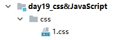
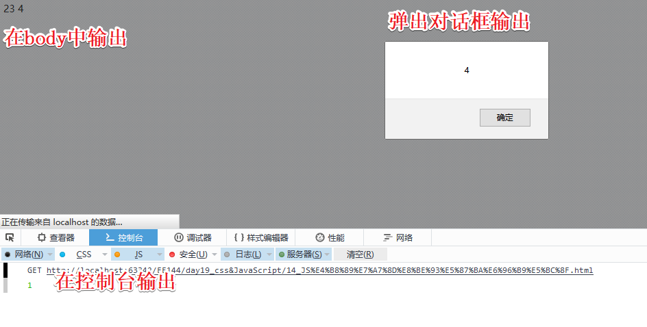
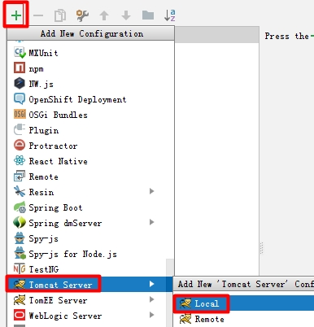

# 学习目标

```java
- 理解CSS的基础语法(重点)	
	引入css样式的方式:1.行内样式 2.内部样式 3.外部样式==>CSS样式规则  选择器{属性名:属性值;...}
- 会使用CSS基本选择器(重点)	
	1.元素|标签|标记选择器:根据元素名称选择元素
	2.id选择器:根据id的属性值选择元素
	3.class选择器:根据class属性值选择元素
- 会使用常见的CSS样式
		边框:
			border:可以同时设置4个边框(上下左右)
			border-top:上
			border-right:右
			border-left:左
			border-bottom:下
			属性值:同时设置边框的颜色,尺寸(像素),格式
				格式:solid 实线，none 无边，double 双线 等
		尺寸:
			width:设置元素的宽度,单位是像素px
			height:设置元素的高度,单位像素px 
		转换:display
			inline：此元素将显示为行内元素（行内元素默认的display属性值）
			block：此元素将显为块元素（块元素默认的display属性值）
			none：此元素将被隐藏，不显示，也不占用页面空间。
		设置字体属性:
			color：颜色，字体颜色
			font-size:字体的大小,像素px
			font-weight: bold;设置粗体
			font-style: italic;设置斜体
			font-family:字体,幼圆,宋体,楷体...
			text-decoration: none 取消文字上的下划线	
		背景色&背景图片
			background-color:设置背景色
			background-image:url(背景图片的连接)
			background-repeat: no-repeat;背景图片不平铺
			background-position: top 0px right 0px;背景图片位置 右上角	
		CSS样式的属性_浮动
			float属性:
				div元素默认会占用一行,可以使用浮动属性让div漂浮起来,不在占用一行
				float属性值:
					left:左浮动 right:右浮动 none:不浮动
			clear属性:
				取消之前设置的浮动属性
				clear属性值:
					left:取消左浮动 right:取消右浮动 both:同时取消左右浮动	
		CSS的盒子模型:可以把html中的任意元素都可以看成被一个盒子包裹起来
			外边距:我们可以设置这个盒子到其他盒子之间的距离,或者盒子到body的距离
			内边距:我们可以设置盒子的边框到盒子中内容的距离
			使用css的属性:margin,设置外边距
				- margin:同时设置4个外边距
				- margin-top:上外边距
				- margin-bottom:下外边距
				- margin-left:左外边距
				- margin-rigt:右外边距
			使用css的属性:padding,设置内边距
				- padding:同时设置4个内边距
				- padding-top:上内边距
				- padding-bottom:下内边距
				- padding-left:左内边距
				- padding-rigt:右内边距		
- 能够完成注册表单案例(黑马旅游)
- 掌握JavaScript的基础语法	
	//变量的定义:
		var|let 变量名; 没有赋值,有默认值undefined
		var|let a;
	//变量的赋值:
		var|let 变量名 = 值;
		var|let a = 10;
	//掌握for循环和if语句的基本使用
		var a = 11;
		if(a>10){
			console.log("a大于10");
		}else if(a<10){
			console.log("a小于10");
		}else{
			console.log("a等于10");
		}
	
		//定义一个数组
		var arr = [1,2,3,"a","b","c",true,false,5.5];
		//使用普通for循环遍历数组
		for(var i=0; i<arr.length; i++){
			//alert(arr[i]);
		}
		//使用增强for循环遍历数组
		for(var s of arr){
			console.log(s);
		}		
- 会使用JavaScript常见数据类型
	//JS中基本语法_基本数据类型
		undefined类型:值就是undefined,变量定义未赋值,值就是undefined
		null类型:值就是null
		number类型:整数和小数都是number类型
		boolean类型:布尔类型,只有两个值true,false
		string类型:任何被单引或者双引包裹起来的都是字符串
	//JS中基本语法_引用数据类型	
		造一个对象：var obj = new Object();
		造一个字符串对象：var str = new String();
		造一个日期对象：var date = new Date();	
		所有的对象都是object类型
	使用typeof关键字可以查看变量的数据类型	
- 掌握JS常用事件的使用(重点)	
	onload 		某个页面或图像被完成加载
	onsubmit	当表单提交时触发该事件---注意事件源是表单form
	onclick 	鼠标点击某个对象
	onblur 		元素失去焦点
	onfocus 	元素获得焦点
	onchange 	用户改变域的内容
	onmouseover 鼠标被移到某元素之上
	onmouseout 	鼠标从某元素移开
	//直接在元素上添加对应事件的属性;定义一个事件的响应函数
	<input type="text" onblur="textOnblur()"/>
	function textOnblur(){
		//处理事件
	}
- 掌握JavaScript函数的语法(重点)	
	//定义一个计算两个整数和的函数
	function sum(a,b){
		return a+b;//30
	}
	//调用函数
	var s = sum(10,20);
	//定义一个计算两个整数和的匿名函数,把匿名函数赋值给一个变量
	var add = function(a,b){
		return a+b;
	}
	alert(add(10,20));
	
	//匿名函数作为方法的参数
	arr2.sort(function(a,b){return b-a;});
- 能够查询手册使用常用JS内置对象(重点)
	会创建对象,会使用常用的方法(根据api查询使用)
	String字符串对象
	Array数组对象
	Date时间和日期对象
	Math数学工具类对象
	RegExp正则表达式对象    
```

# 第一章 CSS基础概述

## 1.CSS介绍

CSS 通常称为CSS样式或**层叠样式表**，主要用于设置HTML页面中的文本内容（字体、大小、对其方式等）、图片的外形（高宽、边框样式、边距等）以及版面的布局等外观显示样式。

CSS可以使HTML页面更好看，CSS色系的搭配可以让用户更舒服，CSS+DIV布局更佳灵活，更容易绘制出用户需要的结构。

> CSS (Cascading Style Sheets) ：指层叠样式表
>
> - 样式：给HTML标签添加需要显示的效果。
> - 层叠：使用不同的添加方式，给同一个HTML标签添加样式，最后所有的样式都叠加到一起，共同作用于该标签。

## 2.CSS样式规则(重点)

```css
CSS样式规则:在html页面中如何使用css
格式:
	选择器{
		属性名:属性值;
		属性名:属性值;
		属性名:属性值;
		属性名:属性值;
		...
		属性名:属性值;
	}
	选择器:选择要添加html标签的方式,可以根据标签的名称,标签的id属性值,标签的class属性值来选择要添加样式的标签
	属性:给标签添加的显示效果(大小,颜色...)
CSS样式规则需要写在一个style(样式)标签中
格式:
<style type="text/css">
	选择器{
		属性名:属性值;
		属性名:属性值;
		属性名:属性值;
		属性名:属性值;
		...
		属性名:属性值;
	}
</style>
```

```html
<!DOCTYPE html>
<html lang="zh">
<head>
    <meta charset="UTF-8">
    <title>CSS样式规则(重点)</title>
    <!--添加一个style标签-->
    <style type="text/css">
        /*样式规则*/
        /*根据标签的名称选择到对应的标签*/
        h1{
            /*给h1标签添加字体颜色*/
            color: red;
        }
        div,a{
            /*给div标签添加字体颜色*/
            color: #00FF00;
            font-size: 50px;
        }
    </style>
</head>
<body>
    <h1>我是h1标题标签</h1>
    <h1>我是h1标题标签</h1>
    <div>我是一个div</div>
    <a href="#">我是一个超链接</a>
</body>
</html>
```


## 3.引入css样式的方式(重点)

```html
引入css样式的方式
1.行内样式:在标签上直接写style属性,属性值就是要设置的样式
	格式:
		<标签 style="属性名:属性值;属性名:属性值;属性名:属性值;..属性名:属性值;"></标签>
	作用域:
		只针对当前的标签有效
2.内部(内嵌)样式:在页面中创建一个style标签,在标签中写css的样式规则
	格式:
	   <style type="text/css">
			选择器{
				属性名:属性值;
				属性名:属性值;
				属性名:属性值;
				属性名:属性值;
				...
				属性名:属性值;
			}
	   </style>
	作用域:
		在当前页面中,针对选择器选择到的所有标签都有效
3.外部(外联)样式:把css的样式规则,写在一个以.css结尾的文件中
	需要在html中使用link标签引入外部的css文件使用
	格式:
		<link href="外部css文件的路径" type="text/css" rel="stylesheet" />
		href="外部css文件的路径" css文件一般都放在当前项目的css文件夹中,所以使用相对路径
		type="text/css" 说明引入的文件是文本类型的css文件(固定写法)
		rel="stylesheet"  stylesheet:样式表,说明引入的css文件是html文件的一个样式表(固定写法)
	作用域:
		css文件可以被多个页面同时引用,哪个页面引用的,对哪个页面中的标签有效
样式的优先级:
	行内样式>内部样式|外部样式(内部和外部谁写在后边,后边的样式会覆盖前边的样式)
```

```html
<!DOCTYPE html>
<html lang="zh">
<head>
    <meta charset="UTF-8">
    <title>引入css样式的方式(重点)</title>
    <!--2.内部(内嵌)样式:在页面中创建一个style标签,在标签中写css的样式规则-->
    <style>
        h2,h3{
            color: gold;
            font-family: 楷体;
        }
    </style>
    <!--3.外部(外联)样式:使用link标签引入css文件-->
    <link href="css/1.css" type="text/css" rel="stylesheet" />
</head>
<body>
    <!--1.行内样式:在标签上直接写style属性,属性值就是要设置的样式-->
    <div style="color: red">我是一个div</div>
    <h1 style="color: blue;font-size: 50px">我是h1标题标签</h1>
    <!--2.内部(内嵌)样式-->
    <h2 style="color: green">我是h2标题标签</h2>
    <h2>我是h2标题标签</h2>
    <h3>我是h3标题标签</h3>
    <h3>我是h3标题标签</h3>
    <!--3.外部(外联)样式-->
    <h4>我是h4标题标签</h4>
    <h4>我是h4标题标签</h4>
</body>
</html>
```



1.css文件

```css
h1{
    color: blue;
    font-size: 50px;
}
```


## 4.CSS的选择器

### 1.基本选择器(重点)

```html
CSS的选择器:使用何种方式选择要添加样式的html标签
常用:
1.元素(标签,标记)选择器:根据元素(标签,标记)的名称,选择对应的元素
	<h1></h1>   选择器: h1{属性名:属性值;...}
	<div></div>   选择器: div{属性名:属性值;...}
	...
2.id选择器:需要给元素添加一个id属性,通过id的属性值选择到元素
	<h1 id="d001"></h1>
	<div id="d001"></div>
	选择器:
		#元素id的属性值{属性名:属性值;...}
		#d001{属性名:属性值;...}
	注意:
		如果给多个html元素,添加相同的id属性值
		id在页面中具有唯一性,之后使用JavaScript通过元素的id属性值,获取到元素
		如果多个元素的id属性值是相同的,只能获取到第一个
3.class(类)选择器:需要给元素添加一个class属性,通过class的属性值选择到元素
	<h1 class="c001"></h1>
	<div class="c001"></div>
	选择器:
		.元素的class属性值{属性名:属性值;...}
		.c001{属性名:属性值;...}
```

```html
<!DOCTYPE html>
<html lang="zh">
<head>
    <meta charset="UTF-8">
    <title>CSS的选择器</title>
    <style>
        /*1.元素(标签,标记)选择器*/
        h1{
            color: red;
        }
        /*2.id选择器*/
        #d001{
            color: green;
        }
        /*3.class(类)选择器*/
        .c001{
            color: blue;
        }
    </style>
</head>
<body>
    <!--1.元素(标签,标记)选择器-->
    <h1>我是h1标题标签</h1>
    <h1>我是h1标题标签</h1>
    <h1>我是h1标题标签</h1>
    <!--2.id选择器-->
    <h2 id="d001">我是h2标题标签</h2>
    <div id="d001">我是一个div</div>
    <!--3.class(类)选择器-->
    <h2 class="c001">我是h2标题标签</h2>
    <div class="c001">我是一个div</div>
</body>
</html>
```


### 2.扩展选择器

```css
CSS的扩展选择器
1.属性选择器:对元素选择器进行扩展,在继续通过标签的属性选择到对应的标签
格式:
	标签名[属性名='属性值']{属性名:属性值;...}
2.包含选择器(子父类选择器):对元素选择器进行扩展,通过后代选择对应的标签
格式:
	父标签 子标签{属性名:属性值;...}
3.伪类选择器:专用于超链接标签
格式:必须是lvha顺序
	 a:link {color: #FF0000}	/* 未访问的链接 */
	 a:visited {color: #00FF00}	/* 已访问的链接 */
	 a:hover {color: #FF00FF}	/* 鼠标移动到链接上 */
	 a:active {color: #0000FF}	/* 选定的链接 */
```

```html
<!DOCTYPE html>
<html lang="zh">
<head>
    <meta charset="UTF-8">
    <title>扩展选择器(了解)</title>
    <!--内部样式-->
    <style>
        /*标签选择器*/
        /*input{
            background-color: greenyellow;
        }*/
        /*1.属性选择器*/
        input[type='text']{
            background-color: greenyellow;
        }
        input[type='password']{
            background-color: pink;
        }
        /*2.包含选择器(子父类选择器)*/
        /*选择div中的div标签*/
        div div{
            color: blue;
        }
        /*选择div中的h2标签*/
        /*div h2{
            color: #00FF00;
        }*/
        #d002 h2{
            color: #00FF00;
        }
        /*
            3.伪类选择器:专用于超链接标签
            格式:必须是lvha顺序
        */
        a:link {color: #FF0000}	/* 未访问的链接 */
        a:visited {color: #00FF00}	/* 已访问的链接 */
        a:hover {color: #FF00FF}	/* 鼠标移动到链接上 */
        a:active {color: #0000FF}	/* 选定的链接 */
    </style>
</head>
<body>
    <!--1.属性选择器-->
    <input type="text" name="username"/>
    <input type="password" name="password"/>
    <!--2.包含选择器(子父类选择器)-->
    <div>我是一个div</div>
    <div id="d002">
        <div>我是div中的div</div>
        <h2>我是div中的h2</h2>
    </div>
    <!--3.伪类选择器:专用于超链接标签-->
    <a href="http://www.itheima.com" target="_blank">点我到黑马</a>
</body>
</html>
```


**清除浏览器的缓存:ctrl+shift+delete**


# 第二章 CSS常用样式(重点)

## 1.边框和尺寸

```css
边框:给元素添加边框
	border:可以同时给元素设置4个边框(上下左右)
	border-top:上边框
	border-right:右边框
	border-bottom:下边框
	border-left:左边框
	属性值:同时设置边框的颜色,尺寸(像素),格式(不区分先后顺序)
	格式: solid实线 double双线 none无边 
尺寸:设置元素的高度和宽度
	width:设置元素的宽度,单位像素
	height:设置元素的高度,单位像素
```

```html
<!DOCTYPE html>
<html lang="zh">
<head>
    <meta charset="UTF-8">
    <title>边框和尺寸</title>
    <style>
        div{
            /*给div设置边框*/
            border: red 1px solid;
            border-bottom: 10px blue double;
            /*给div设置尺寸*/
            height: 200px;
            width: 300px;
        }
    </style>
</head>
<body>
    <div>我是一个div</div>
</body>
</html>
```


## 2.转换属性

```css
转换属性
display:可以把行间元素和行内元素相互转换,还可以隐藏元素
行间元素:占用html中的一行
	h1-h6,ul,ol,div...
行内元素:占用一行中的一部分
	span,img,a...
display的属性值:
	inline:设置元素为行内元素(行内元素默认display的属性值)
	block:设置元素为行间元素(行间元素默认display的属性值)
	none:设置隐藏元素(不在html页面中显示,也不会占用空间)
```

```html
<!DOCTYPE html>
<html lang="zh">
<head>
    <meta charset="UTF-8">
    <title>转换属性</title>
    <style>
        div{
            /*给div添加边框*/
            border: 1px red solid;
        }
        span{
            /*给span添加边框*/
            border: 1px green solid;
        }
    </style>
</head>
<body>
    <!--div默认是行间元素-->
    <div>我是一个div,我会占用html中的一行</div>
    <!--使用display属性把div转换为行内元素-->
    <div style="display: inline">我是一个div,我只会占用一行中的一部分</div>
    <!--span默认是行内元素-->
    <span>我是一个span,我只会占用一行中的一部分</span>
    <!--使用display属性把span转换为行间元素-->
    <span style="display: block">我是一个span,我会占用html中的一行</span>
    <!--使用display属性隐藏标签-->
    <div style="display: none">我是一个隐藏的div,你看不到我</div>
    <a  style="display: none" href="#">超链接</a>
    <div>我是一个div,我会占用html中的一行</div>
</body>
</html>
```


## 3.字体属性

```css
字体属性:
color:设置字体颜色
font-size:设置字体大小,单位像素px
font-weight:bold 设置字体加粗
font-style:italic 设置斜体
font-family:字体(幼圆,宋体,楷体)
text-decoreation:none 取消文字上的下划线
```

```html
<!DOCTYPE html>
<html lang="zh">
<head>
    <meta charset="UTF-8">
    <title>字体属性</title>
</head>
<body>
    <a href="#" style="color: red">红色字体的超链接</a><br/>
    <a href="#" style="font-size: 50px">50px大小的超链接</a><br/>
    <a href="#" style="font-weight: bold">粗体的超链接</a><br/>
    <a href="#" style="font-style: italic">斜体的超链接</a><br/>
    <a href="#" style="color: green;font-size: 30px;font-weight: bold;font-style: italic;font-family: 楷体">绿色30px粗体和斜体和楷体的超链接</a><br/>
    <a href="http://www.baidu.com" target="_blank" style="text-decoration: none">没有下划线的超链接</a><br/>
</body>
</html>
```


## 4.背景色和背景图片

```css
背景色和背景图片
background-color:设置背景色
background-image:url(图片的地址)设置背景图片
background-repeat: no-repeat;背景图片不平铺
background-position: top 0px right 0px;背景图片位置 右上角
```

```html
<!DOCTYPE html>
<html lang="zh">
<head>
    <meta charset="UTF-8">
    <title>背景色和背景图片</title>
</head>
<!--给整个body添加背景图片-->
<!--<body style="background-image: url('img/bg.jpg');background-repeat: no-repeat;background-position: top 50px right 100px">-->
<body style="background-image: url('img/bg.jpg');">
    <!--给div添加背景色-->
    <div style="border: 1px red solid;background-color: #50ff14;height: 200px;width: 300px">我是一个div</div>
    <!--给提交按钮设置背景色-->
    <input type="submit" value="提交" style="background-color: #0000FF;color: gold"/>
</body>
</html>
```


## 5.浮动属性


```css
CSS样式的属性_浮动
float属性:
	div元素默认会占用一行,可以使用浮动属性让div漂浮起来,不在占用一行
	float属性值:
		left:左浮动 right:右浮动 none:不浮动
clear属性:
	取消之前设置的浮动属性
	clear属性值:
		left:取消左浮动 right:取消右浮动 both:同时取消左右浮动
```

```html
<!DOCTYPE html>
<html lang="zh">
<head>
    <meta charset="UTF-8">
    <title>浮动属性</title>
    <style>
        div{
            /*给div添加边框*/
            border: 1px red solid;
            /*设置div的尺寸*/
            width: 200px;
            height: 80px;
        }
    </style>
</head>
<body>
    <!--div默认布局方式是上下布局,每个div会占用1行-->
    <div>1-1</div>
    <div>2-1</div>
    <!--使用浮动属性float让div浮动起来不在占用1行-->
    <div style="float: left">3-1</div>
    <div style="float: right">3-2</div>
    <div style="float: left">3-3</div>
    <!--使用clear取消之前的浮动,在从下一行重新开始浮动-->
    <div style="clear:both;float: left">4-1</div>
    <div style="float: left">4-2</div>
</body>
</html>
```


## 6.CSS的盒子模型

```css
CSS的盒子模型:可以把html中的任意元素,都可以看成是被一个盒子包裹起来
盒子的外边距:设置这个盒子到其他盒子之间的距离,或者设置盒子到body框的距离
盒子的内边距:设置盒子边框到盒子中内容的距离
使用css的属性:margin,设置外边距
	margin:同时设置4个外边距
	margin-top:上外边距
	margin-right:右外边距
	margin-bottom:下外边距
	margin-left:左外边距
使用css的属性:padding,设置内边距
	padding:同时设置4个内边距
	padding-top:上内边距
	padding-right:右内边距
	padding-bottom:下内边距
	padding-left:左内边距
```


```html
<!DOCTYPE html>
<html lang="zh">
<head>
    <meta charset="UTF-8">
    <title>CSS的盒子模型</title>
    <style>
        div{
            /*设置div的边框*/
            border: 1px red solid;
            /*设置div的尺寸*/
            width: 300px;
            height: 200px;
            /*设置div的外边距*/
            margin: 50px;/*同时设置4个外边距为50px*/
            margin-left: 100px;/*设置左外边距为100px*/
            margin: 50px 100px;/*上下50px 左右100px*/
            margin: 50px 100px 150px;/*顺时针 上50px 右100px 下150 左100px*/
            margin: 50px 100px 150px 200px;/*顺时针 上50px 右100px 下150 左200px*/
            margin: 50px auto;/*上下50px 左右:auto会自动居中*/
            /*设置div的内边距*/
            padding: 20px;/*同时设置4个内边距为20px*/
        }
    </style>
</head>
<body>
    <div>我是一个div</div>
</body>
</html>
```


## 7.案例-公司简介

案例效果展示


案例需求分析


案例代码实现

```html
<!DOCTYPE html>
<html lang="zh">
<head>
    <meta charset="UTF-8">
    <title>案例-公司简介</title>
    <style>
        h1{
            /*设置h1居中显示*/
            text-align: center;
        }
        hr{
            /*设置水平线颜色*/
            color: orange;
        }
        #s001{
            /*设置span的字体颜色*/
            color: red;
        }
        .c001{
            /*设置span的粗体和斜体*/
            font-weight: bold;
            font-style: italic;
        }
    </style>
</head>
<body>
    <!--<h1 align="center">公司简介</h1>-->
    <h1>公司简介</h1>
    <hr/>
    <p>
    &emsp;&emsp;<span id="s001">“中关村黑马程序员训练营”</span> 是由 <span class="c001">传智播客</span> 联合中关村软件园、CSDN， 并委托传智播客进行教学实施的软件开发高端培训机构，致力于服务各大软件企业，解决 当前软件开发技术飞速发展， 而企业招不到优秀人才的困扰。
    目前，“中关村黑马程序员训练营”已成长为行业“学员质量好、课程内容深、企业满意”的移动开发高端训练基地， 并被评为 中关村软件园重点扶持人才企业。
    </p>
    <p>
    &emsp;&emsp;黑马程序员的学员多为大学毕业后，有理想、有梦想，想从事IT行业，而没有环境和机遇改变自己命运的年轻人。 黑马程 序员的学员筛选制度，远比现在90%以上的企业招聘流程更为严格。任何一名学员想成功入学“黑马程序员”， 必须经历长达2 个月的面试流程，这些流程中不仅包括严格的技术测试、自学能力测试，还包括性格测试、压力测试、 品德测试等等测试。毫 不夸张地说，黑马程序员训练营所有学员都是精挑细选出来的。百里挑一的残酷筛选制度确 保学员质量，并降低企业的用人风 险。
    </p>
    <p>
    &emsp;&emsp;中关村黑马程序员训练营不仅着重培养学员的基础理论知识，更注重培养项目实施管理能力，并密切关注技术革新， 不 断引入先进的技术，研发更新技术课程，确保学员进入企业后不仅能独立从事开发工作，更能给企业带来新的技术体系和理 念。
    </p>
    <p>
    &emsp;&emsp;一直以来，黑马程序员以技术视角关注IT产业发展，以深度分享推进产业技术成长，致力于弘扬技术创新，倡导分享、 开 放和协作，努力打造高质量的IT人才服务平台。
    </p>
    <hr/>
    <p style="text-align: center;color: gray;font-size: 12px">
    江苏传智播客教育科技股份有限公司<br/>
    版权所有Copyright © 2006-2018, All Rights Reserved 苏ICP备16007882
    </p>
</body>
</html>
```

# 第三章 注册页面案例

## 1.需求描述

根据提供的css和html素材
编写table和表单标签完成注册表单案例

## 2.页面原型


## 3.案例实现

```html
<!--创建一个form表单-->
<form action="#" method="post">
    <!--创建一个5*2的表格-->
    <table>
        <tr>
            <td class="td_left">用户名</td>
            <td class="td_right">
                <input type="text" name="username" placeholder="请输入账号"/>
            </td>
        </tr>
        <tr>
            <td class="td_left">手机号</td>
            <td class="td_right">
                <input type="text" name="phone" placeholder="请输入您的手机号"/>
            </td>
        </tr>
        <tr>
            <td class="td_left">密码</td>
            <td class="td_right">
                <input type="password" name="password" placeholder="请输入密码"/>
            </td>
        </tr>
        <tr>
            <td class="td_left">验证码</td>
            <td class="td_right">
                <input type="text" name="smsCode" placeholder="请输入验证码"/>&emsp;
                <a href="#">发送手机验证码</a>
            </td>
        </tr>
        <tr>
            <td align="center" colspan="2">
                <input type="submit" value="注册"/>
            </td>
        </tr>
    </table>
</form>
```

# 第四章 JavaScript基础语法

## 1.JavaScript的引入方式(重点)

```html
JS两种引入方式:在html中如何使用js
1.内嵌式(内部脚本):在html中创建一个script标签,在标签中写js代码
	格式:
		<script type="text/javascript">
			js代码;
		</script>
2.外联式(外部脚本):新建一个以.js结尾的文件,在文件中写js代码
	在html页面中使用script标签引入外部的js文件
	一个js文件可以被多个html页面同时引入
	格式:
		<script type="text/javascript" src="外部js文件的路径">
			js代码失去作用了	
		</script>
注意:
	1.如果script标签引入了外部js文件,那么标签中就不能写js代码了,会失去作用
		如果想要再写js代码,需要重新创建一个script
	2.理论上script标签可以写在html页面中的任意位置,在不影响功能的前提下,尽量把script标签
		写在页面的下边,让浏览器先解析出页面,给用户展示,在执行js的代码(页面显示速度快)
```

```html
<!DOCTYPE html>
<html lang="zh">
<head>
    <meta charset="UTF-8">
    <title>JavaScript的引入方式(重点)</title>
    <!--
        1.内嵌式(内部脚本):在html中创建一个script标签,在标签中写js代码
    -->
    <script type="text/javascript">
        //全局函数:alert(数据);可以在浏览器页面中弹出一个对话框,输出数据
        alert(1);
        alert("hello");
    </script>
    <!--
        2.外联式(外部脚本):使用script标签引入外部.js文件
    -->
    <script type="text/javascript" src="js/1.js">
        alert("小明");//引入了外部js文件,在写js代码失去作用
    </script>
</head>
<body>

</body>
</html>
```


1.js文件

```javascript
alert("你好");
```


## 2.JS三种输出方式(理解)

```javascript
//JS三种输出方式
//1.把数据输出到浏览器的控制台
console.log();
//2.输出到html页面的body中
document.writeln();
//3.浏览器弹出对话框输出
alert();
```

```html
<!DOCTYPE html>
<html lang="zh">
<head>
    <meta charset="UTF-8">
    <title>JS三种输出方式</title>
    <script>
        //JS三种输出方式
        //1.把数据输出到浏览器的控制台
        console.log(1);
        //2.输出到html页面的body中
        document.write(2);
        document.writeln(3);
        document.writeln(4);
        //3.浏览器弹出对话框输出
        alert(4);
    </script>
</head>
<body>

</body>
</html>
```



## 3.js的基本语法_变量(重点)

```javascript
js的基本语法_变量
java语言:强类类型的语言,在使用每种数据类型之前,必须先明确变量的数据类型
	int a = 10;
	double d =1.1;
js语言:弱类型语言,在使用每种数据的时候,都可以使用var(es5)|let(es6)关键字来接收数据
	给变量赋什么类型的值,那么这个变量就是什么类型
定义变量
	var 变量名; 变量没有赋值,有默认值undefined
	let 变量名; 变量没有赋值,有默认值undefined
定义变量的同时,给变量进行初始化赋值:
	var 变量名 = 数据值;
	let 变量名 = 数据值;
在js中还可以定义常量:常量的值是不能改变的
	const 常量名 = 数据值;

var和let的区别(了解)
var:作用域在这个script标签中都有效(作用域大)
var:可以先使用变量,在定义变量

let:只在局部的位置有效(局部变量)
let:必须先定义后使用
```

```html
<!DOCTYPE html>
<html lang="zh">
<head>
    <meta charset="UTF-8">
    <title>js的基本语法_变量(重点)</title>
    <script>
        //定义变量
        var a;
        //alert(a);//有默认值undefined

        var b = 1;
        //alert(b);//1

        var c = 1.1;
        //alert(c);//1.1

        var d = "你好";
        //alert(d);//你好

        var e = true;
        //alert(e);//true

        var f = 'abcde'; //在js中没有字符的,单引号包裹的也是字符串
        //alert(f);//abcde

        //var:作用域在这个script标签中都有效(作用域大)
        for(var i=0; i<5; i++){
            console.log(i);
        }
        console.log("i:"+i);

        //let:只在局部的位置有效(局部变量)
        for(let j=0; j<5; j++){
            console.log(j);
        }
        //console.log("j:"+j);//ReferenceError: j is not defined

        //var:可以先使用变量,在定义变量
        alert(aa);//undefined
        var aa = 10;

        //let:必须先定义后使用
        alert(bb); //ReferenceError: can't access lexical declaration `bb' before initialization
        let bb = 20;
    </script>
</head>
<body>

</body>
</html>
```

## 4.JS数据类型简介(掌握) 

### 基本数据类型

```javascript
JS基本数据类型
undefined 类型:只有一个值undefined,变量定义未赋值默认值
null 类型:只有一个值null,undefined类型就是使用null演化而来
number 类型:所有的整数和小数
string 类型:所有被单引号和双引号包裹的字符串
boolean 类型:只有两个值true和false

关键字 typeof:可以查看变量的数据类型
```

```html
<!DOCTYPE html>
<html lang="zh">
<head>
    <meta charset="UTF-8">
    <title>JS基本数据类型</title>
    <script>
        //undefined 类型:只有一个值undefined,变量定义未赋值默认值
        var a;
        //alert(a);//undefined
        //alert(typeof  a);//类型 undefined

        //null 类型:只有一个值null,undefined类型就是使用null演化而来
        //alert(undefined==null);//true

        //number 类型:所有的整数和小数
        var b =10;
        //alert(b);//10
        //alert(typeof b);//类型number

        var c = 1.1;
        //alert(c);//1.1
        //alert(typeof c);//类型number

        //string 类型:所有被单引号和双引号包裹的字符串
        //var d = "abc";
        var d = 'abc';
        //alert(d);//abc
        //alert(typeof d);//类型string

        //boolean 类型:只有两个值true和false
        var e = false;
        alert(e);//false
        alert(typeof e);//类型boolean
    </script>
</head>
<body>

</body>
</html>
```

### 引用数据类型

```javascript
JS引用数据类型
java语言:面向对象的编程语言,先定义类,根据类创建对象,调用对象的方法
js语言:基于对象的编程语言,在js中没有类,里边使用的对象都是使用函数模拟出来的,包含了一些内置对象
	var obj = new Object();
	var str = new String("字符串");
	var date = new Date();
	注意:所有的对象都是object类型
```

```html
<!DOCTYPE html>
<html lang="zh">
<head>
    <meta charset="UTF-8">
    <title>JS引用数据类型</title>
    <script>
        var obj = new Object();
        //console.log(obj);//Object {  }
        //alert(obj);//[object Object]
        //alert(typeof obj);//类型object
        //Object对象,可以直接给属性赋值
        obj.name = "张三";
        obj.age = 18;
        obj.sex = "男";
        console.log(obj);//Object { name: "张三", age: 18, sex: "男" }
        //通过属性名获取属性值
        console.log(obj.name);//张三

        var str1 = new String();
        console.log(str1);//""

        var str2 = new String("abc");
        console.log(str2);//abc
        console.log(typeof str1);//类型object
        console.log(typeof str2);//类型object

        var date = new Date();
        console.log(date);//Date 2020-11-23T07:21:23.704Z
        alert(date);//Mon Nov 23 2020 15:21:48 GMT+0800
        alert(typeof date);//类型object

    </script>
</head>
<body>

</body>
</html>
```

## 5.js的基本语法_运算符

 **注意:除了以下运算符,其他运算符和java中一致**

```html
<!DOCTYPE html>
<html lang="zh">
<head>
    <meta charset="UTF-8">
    <title>js的基本语法_运算符</title>
    <script>
        /*
            算术运算符
         */
        console.log(5/2);//2.5
        console.log("5"+5);//"55" 字符串连接
        //js中会把字符串的整数,转换为整数参与计算
        console.log("5"-5);//0
        console.log("5"*5);//25
        console.log("5"/5);//1
        console.log("5"%5);//0
        console.log("a"%5);//NaN not number 无效数字
        console.log("------------------------------------");

        /*
            比较运算符
            ==:比较的是值是否相等
            ===:比较的是值与数据类型是否相等
         */
        console.log("5"==5);//true
        console.log("5"===5);//false
    </script>
</head>
<body>

</body>
</html>
```

## 6.js的基本语法_js的布尔运算规则(了解)

```javascript
js的基本语法_js的布尔运算规则
可以使用一些非布尔类型的值,作为布尔值来使用
boolean 类型: true:真  false:假
undefined 类型: 作为false
null 类型:作为false
string 类型: ""空字符串作为false,非空的字符串作为true
number 类型: 0|0.0作为false使用,非0的数字作为true
object 类型: 所有的对象都可以作为true
```

```html
<!DOCTYPE html>
<html lang="zh">
<head>
    <meta charset="UTF-8">
    <title>js的基本语法_js的布尔运算规则</title>
    <script>
        var a = new Object();
        if(a){
            alert("你猜猜我能出现吗?");
        }
    </script>
</head>
<body>

</body>
</html>
```

## 7.js的基本语法_JS中的语句(使用)

```html
<!DOCTYPE html>
<html lang="zh">
<head>
    <meta charset="UTF-8">
    <title>js的基本语法_JS中的语句(使用)</title>
    <script>
        //JS中的语句大部分和java都是一样的
        //if语句
        let a = 5;
        if(a>5){
            console.log("a大于5");
        }else if(a<5){
            console.log("a小于5");
        }else{
            console.log("a等于5");
        }
        //switch语句
        let b = 8;
        switch (b){
            case 1:
                console.log("星期一");
                break;
            case 2:
                console.log("星期二");
                break;
            case 3:
                console.log("星期三");
                break;
            case 4:
                console.log("星期四");
                break;
            case 5:
                console.log("星期五");
                break;
            case 6:
                console.log("星期六");
                break;
            case 7:
                console.log("星期日");
                break;
            default:
                console.log("你输入的有误!");
                break;
        }
        //while循环:条件成立执行
        let i = 1;
        while(i<=5){
            console.log(i);
            i++;
        }
        console.log("-----------------------");
        //do while循环:至少执行一次
        let i2 = 5;
        do{
            console.log(i2);
        }while (i2<5);
        console.log("-----------------------");
        //普通for循环
        for(let i3=0; i3<=5; i3++){
            console.log(i3);
        }
        console.log("-----------------------");
        /*
            增强for循环
            java中:用于遍历数组和集合
                格式:
                    for(数据类型 变量名 : 数组|集合){
                        System.out.println(变量名);
                    }
             js中:用于遍历数组,js中没有集合
                格式:forin==>获取的是数组的索引
                for(var|let 索引 in 数组){
                    console.log(数组[索引]);
                }
                格式:forof==>获取的是数组中的元素
                for(var|let 变量 of 数组){
                    console.log(变量);
                }
         */
        //定义一个数组
        var arr = [1,2,3,true,false,"aa","bb","cc",1.1,2.2,3.3];
        //使用普通for循环遍历数组
        for(let j=0; j<arr.length; j++){
            console.log(arr[j]);
        }
        console.log("-----------------------");
        //使用forin增强for循环
        for(let index in arr){
            //console.log(index);//0,1,2,3,4,5...
            console.log(arr[index]);
        }
        console.log("-----------------------");
        //使用forof增强for循环
        for(let s of arr){
            console.log(s);
        }
    </script>
</head>
<body>

</body>
</html>
```

## 8.函数(重点) 

```html
<!DOCTYPE html>
<html lang="zh">
<head>
    <meta charset="UTF-8">
    <title>函数(重点) </title>
    <!--
        函数(重点):相当于java中的方法
        分类:
        1.普通函数
        定义格式:使用关键字function
            function 函数名(参数列表){
                函数体;
                return 返回值;
            }
            注意:
                a.函数是没有返回值类型的,写return就有返回值,不写return就没有返回值
                b.单独写一个return,不写值,作用是结束函数
                c.(参数列表):不需要写数据类型,直接写变量名即可
                    (var a,var b)错误  (a,b)正确
        使用格式:和java中一样,通过函数名调用函数
            有返回值的函数
                var|let 变量 = 函数名(参数);
            没有返回值的函数
                 函数名(参数);
    -->
    <script>
        //定义一个计算两个整数和的方法
        /*function sum(a, b) {
            console.log(a+b);
        }
        sum(10,20);*/

       /* function sum(a,b) {
            return a+b;
            //return true;
        }
        let s = sum(100,200);
        console.log(s);//300*/

        //函数的参数列表可以使用可变参数:可以接收任意个数据,底层就是一个数组
        /*function getSum(...arr) {
            let ss = 0;
            for(let a of arr){
                ss+=a;
            }
            return ss;
        }
        let ww = getSum(10,20,30,40,50);
        console.log(ww);*/
    </script>

    <!--
        2.匿名函数:定义函数省略函数名
        定义格式:
           function(参数列表){
                函数体;
                return 返回值;
           }
        使用格式:
            a.可以把匿名函数赋值给一个变量,变量名就相当于函数的名,通过变量名就可以使用函数了
            b.有一些函数的参数需要传递其他函数,就可以传递匿名函数(定时器)
    -->
    <script>
        //定义匿名函数
        let s = function (a,b) {
            return a+b;
        }
        //调用匿名函数
        var s2 = s(10,20);
        console.log(s2);//30
    </script>
</head>
<body>

</body>
</html>
```

## 9.js中的事件(非常重要)

### a.事件概述

js的事件是js不可或缺的组成部分，要学习js的事件，必须要理解如下几个概念：

1. 事件源：被监听的html元素
2. 事件：某类动作，例如点击事件，移入移出事件，敲击键盘事件等
3. 事件与事件源的绑定：在事件源上注册上某事件
4. 事件触发后的响应行为：事件触发后需要执行的代码，一般使用函数进行封装 

### b.常用的事件

| **事件名**      | **描述**                                      |
| --------------- | --------------------------------------------- |
| **onload**      | 某个页面或图像被完成加载                      |
| **onsubmit**    | 当表单提交时触发该事件---注意事件源是表单form |
| **onclick**     | 鼠标点击某个对象                              |
| ondblclick      | 鼠标双击某个对象                              |
| **onblur**      | 元素失去焦点                                  |
| **onfocus**     | 元素获得焦点                                  |
| **onchange**    | 用户改变域的内容                              |
| onkeydown       | 某个键盘的键被按下                            |
| onkeypress      | 某个键盘的键被按下或按住                      |
| onkeyup         | 某个键盘的键被松开                            |
| onmousedown     | 某个鼠标按键被按下                            |
| onmouseup       | 某个鼠标按键被松开                            |
| **onmouseover** | 鼠标被移到某元素之上                          |
| **onmouseout**  | 鼠标从某元素移开                              |
| onmousemove     | 鼠标被移动                                    |

### c.事件的基本使用

```html
<!DOCTYPE html>
<html lang="zh">
<head>
    <meta charset="UTF-8">
    <title>js中的事件(非常重要)</title>
    <script>
        /*
            js中的事件(非常重要)
            js的事件是js不可或缺的组成部分，要学习js的事件，必须要理解如下几个概念：
            1. 事件源：被监听的html元素
                就是发生事件的地点
                生活中:天津港口,小胡同
                js中:html中的元素(img,input,a,div,span...)
            2. 事件：某类动作，例如点击事件，移入移出事件，敲击键盘事件等
                生活中:爆炸事件,抢劫事件
                js中:鼠标单击事件,鼠标移入事件,鼠标移出事件,获取焦点事件,失去焦点事件...
            3. 事件与事件源的绑定：在事件源上注册上某事件
                生活中:
                    天津港口发生了爆炸事件
                    小胡同发生抢劫事件
                js中:在元素上,添加一个事件相关的属性,就可以把事件绑定到元素上
                    文本框发生了鼠标点击事件   <input tyte="text"  onclick="函数()"/>
                    图片发生了鼠标移入事件     
            4. 事件触发后的响应行为：事件触发后需要执行的代码，一般使用函数进行封装
                生活中:
                    天津港口发生了爆炸事件
                响应:处理
                    救人,灭火,重建...
                js中:
                    文本框发生了鼠标点击事件   <input tyte="text"  onclick="函数()"/>
                    定义一个函数,来处理事件,这个函数就叫事件的响应函数
                    function 函数名(){
                        处理事件
                    }
         */
        //定义文本框发生了鼠标点击事件的响应函数
        function textOnclick() {
            alert("就点你咋的!")
        }

        //定义按钮发生了鼠标点击事件的响应函数
        function butOnclick() {
            alert("呵呵");
        }

        //定义图片发生了鼠标移入事件的响应函数
        function imgOnmouseover() {
            alert("鬼子又来抢劫花姑娘了!");
        }

        //文本框发生了获取焦点事件
        function textOnfocus() {
            alert("我获取到的焦点!");
        }
    </script>
</head>
<body>
    <!--
         文本框发生了鼠标点击事件
         事件源: 文本框上  <input type="text" />
         事件: onclick
         把事件绑定到事件源上: 在input标签上添加一个onclick属性,属性值调用一个函数
         事件触发之后的响应行为:定义一个函数来处理文本框的鼠标点击事件
    -->
    <input type="text" onclick="textOnclick()" value="没事别点我"/>

    <!--
         按钮发生了鼠标点击事件
         事件源: 文本框上  <input type="button" />
         事件: onclick
         把事件绑定到事件源上: 在input标签上添加一个onclick属性,属性值调用一个函数
         事件触发之后的响应行为:定义一个函数来处理文本框的鼠标点击事件
        -->
    <input type="button" onclick="butOnclick()" value="嘿嘿"/>

    <!--
        图片发生了鼠标移入事件
        事件源: 图片上  
         事件: onmouseover
         把事件绑定到事件源上: 在img标签上添加一个onmouseover属性,属性值调用一个函数
         事件触发之后的响应行为:定义一个函数来处理文本框的鼠标点击事件
    -->
    

    <!--
         文本框发生了获取焦点事件
         事件源: 文本框上  <input type="text" />
         事件: onfocus
         把事件绑定到事件源上: 在input标签上添加一个onfocus属性,属性值调用一个函数
         事件触发之后的响应行为:定义一个函数来处理文本框的鼠标点击事件
    -->
    <input type="text" onfocus="textOnfocus()"/>
</body>
</html>
```

### d.页面加载事件

```html
<!DOCTYPE html>
<html lang="zh">
<head>
    <meta charset="UTF-8">
    <title>页面加载事件</title>
    <!--
        页面加载事件
        onload 某个页面或图像被完成加载触发该事件
        作用:可以让页面中的内容先加载出来,在执行事件的响应函数,可以提高页面的加载速度
    -->
    <script>
        //alert(1);

        //定义body的页面加载事件的响应函数
        /*function bodyOnload() {
            alert(1);
        }*/

        //页面加载事件的简化写法
        window.onload = function () {
            alert(1);
        }
    </script>
</head>
<!--给body添加页面加载事件-->
<!--<body onload="bodyOnload()">-->
<body>
    <p>
        “中关村黑马程序员训练营” 是由 传智播客联 合中关村软件园、CSDN， 并委托传智播客进行教学实施的软件开发高端培训机构，致力于服务各大软件企业，解决 当前软件开发技术飞速发展， 而企业招不到优秀人才的困扰。<br/>
        目前，“中关村黑马程序员训练营”已成长为行业“学员质量好、课程内容深、企业满意”的移动开发高端训练基地， 并被评为 中关村软件园重点扶持人才企业。
    </p>

    <p>
        黑马程序员的学员多为大学毕业后，有理想、有梦想，想从事IT行业，而没有环境和机遇改变自己命运的年轻人。 黑马程 序员的学员筛选制度，远比现在90%以上的企业招聘流程更为严格。任何一名学员想成功入学“黑马程序员”， 必须经历长达2 个月的面试流程，这些流程中不仅包括严格的技术测试、自学能力测试，还包括性格测试、压力测试、 品德测试等等测试。毫 不夸张地说，黑马程序员训练营所有学员都是精挑细选出来的。百里挑一的残酷筛选制度确 保学员质量，并降低企业的用人风 险。
    </p>

    <p>
        中关村黑马程序员训练营不仅着重培养学员的基础理论知识，更注重培养项目实施管理能力，并密切关注技术革新， 不 断引入先进的技术，研发更新技术课程，确保学员进入企业后不仅能独立从事开发工作，更能给企业带来新的技术体系和理 念。
    </p>

    <p>
        一直以来，黑马程序员以技术视角关注IT产业发展，以深度分享推进产业技术成长，致力于弘扬技术创新，倡导分享、 开 放和协作，努力打造高质量的IT人才服务平台。
    </p>
</body>
</html>
```

# 第五章 JS常用内置对象(重点)


## 1.字符串String

```javascript
字符串String
String 对象用于处理文本（字符串）。
String对象中定义了一些处理字符串的函数
创建对象的方式:
1. var str = new String("字符串");
2. var str = "字符串";
3. var str = '字符串';
4. var str = `字符串`;使用反向单引号创建字符串,可以使用${}引用其他字符串对象
```

```html
<!DOCTYPE html>
<html lang="zh">
<head>
    <meta charset="UTF-8">
    <title>字符串String</title>
    <script>
        //1. var str = new String("字符串");
        var str1 = new String("abc");
        console.log(str1);//"abc"

        //2. var str = "字符串";
        var str2 = "a-b-c";
        console.log(str2);//a-b-c

        //3. var str = '字符串';

        //4. var str = `字符串`;使用反向单引号创建字符串,可以使用${}引用其他字符串对象
        var str3 = `hello${str1}`;
        console.log(str3);//helloabc

        //属性 length 字符串的长度
        console.log(str2.length);//5

        //方法 charAt() 返回指定索引处的字符
        console.log(str2.charAt(0));//a
        console.log(str2.charAt(1));//-
        console.log(str2.charAt(2));//b
        console.log("-----------------------------");
        //遍历字符串
        for(var i=0; i<str2.length; i++){
            console.log(str2.charAt(i));
        }

        //方法 concat() 连接字符串。
        console.log("abc".concat("bbc"));//abcbbc

        /*
            方法 indexOf() 在字符串从前往后查找另外一个字符串
                返回值:
                    找到了,返回字符串对应的索引
                    找不到,返回-1
            方法 lastIndexOf() 在字符串从后往前查找另外一个字符串
                返回值:
                    找到了,返回字符串对应的索引
                    找不到,返回-1
         */
        console.log("a-b-c".indexOf("-"));//1
        console.log("a-b-c".lastIndexOf("-"));//3

        // 方法 split() 把字符串分割为字符串数组。
        var arr = "a-b-c".split("-");
        console.log(arr);//Array [ "a", "b", "c" ]

        //方法 substring(开始索引,结束索引):截取两个索引之间的字符串,包含头,不包含尾
        //获取-b-
        console.log("a-b-c".substring(1,4));//-b-

        /*
            substr(开始索引):从开始索引截取字符串,到字符串末尾
            substr(开始索引,字符个数):从开始索引开始截取指定字符个数的字符串
         */
        //获取-b-c
        console.log("a-b-c".substr(1));//-b-c
        //获取-b-
        console.log("a-b-c".substr(1,3));//-b-
    </script>
</head>
<body>

</body>
</html>
```

## 2.数组Array

### 数组的基本创建

```javascript
Array 对象
	Array 对象用于在单个的变量中存储多个值。
	在js中是没有集合的,可以使用数组作为集合使用,Array数组长度是可以变化的,可以存储任意数据类型的数据
	相当于java中的集合,泛型是Object  ArrayList<Object>
创建 Array 对象的语法：
1.var arr = new Array(); 创建一个长度为0的数组
2.var arr = new Array(size); 创建指定长度的数组,数组中的元素有默认值undefined
3.var arr = new Array(element0, element0, ..., elementn); 创建包含指定元素的数组
4.var arr = [element0, element0, ..., elementn]; 创建包含指定元素的数组
```

```html
<!DOCTYPE html>
<html lang="zh">
<head>
    <meta charset="UTF-8">
    <title>数组Array</title>
    <script>
        //数组的基本创建
        //1.var arr = new Array(); 创建一个长度为0的数组
        var arr1 = new Array();
        console.log(arr1.length);//0
        //往数组中添加元素
        arr1[0] = 1;
        arr1[2] = true;
        arr1[5] = "aa";
        console.log(arr1.length);//6
        console.log(arr1);//Array [ 1, undefined, true, undefined,undefined, "aa" ]
        console.log(arr1[1]);//undefined
        //alert(arr1);//1,,true,,,aa

        //2.var arr = new Array(size); 创建指定长度的数组,数组中的元素有默认值undefined
        var arr2 = new Array(10);
        //alert(arr2.length);//10
        //alert(arr2);//,,,,,,,,,
        //arr2[5] = 88;
        //alert(arr2);//,,,,,88,,,,

        //3.var arr = new Array(element0, element0, ..., elementn); 创建包含指定元素的数组
        var arr3 = new Array(1,2,3,true,false,1.1,2.2,3.3,"aa","bb","cc");
        //alert(arr3);//1,2,3,true,false,1.1,2.2,3.3,aa,bb,cc

        //4.var arr = [element0, element0, ..., elementn]; 创建包含指定元素的数组
        var arr4 = [1,2,3,true,false,1.1,2.2,3.3,"aa","bb","cc"];
        //alert(arr4);//1,2,3,true,false,1.1,2.2,3.3,aa,bb,cc

        /*
            二维数组:数组中的元素仍是一个数组
         */
        var arrArr = [
            [1,2,3],
            ["a","b","c"],
            [true,false]
        ];
        //alert(arrArr.length);//3
        //alert(arrArr[1]);//["a","b","c"]
        //alert(arrArr[1][2]);//c

        //遍历二维数组:循环嵌套
        for(var arr of arrArr){
            for(var s of arr){
                alert(s);
            }
        }
    </script>
</head>
<body>

</body>
</html>
```

### 数组中的常用方法

```javascript
要求能够查询w3c手册完成如下功能
1. 创建数组 []
2. 数组合并 concat(数组)
3. 添加元素
	数组头添加 unshift
	数组尾添加 push
4. 删除元素
	数组头删除 shift
	数组尾删除 pop
5. 数组元素拼接为字符串 join(分隔符)
6. 排序数组元素 sort() 对数组的元素进行排序,默认是升序排序
```

```html
<script>
    //数组中的常用方法
   //要求能够查询w3c手册完成如下功能
   //1. 创建数组 []
    var arr1 = ["a","b","c"];
    var arr2 = [1,2,3];

   //2. 数组合并 concat(数组)
    console.log(arr1.concat(arr2))//Array [ "a", "b", "c", 1, 2, 3 ]

   //3. 添加元素
   //数组头添加 unshift
    arr1.unshift("头部");
   //数组尾添加 push
    arr1.push("尾部");
    console.log(arr1);Array [ "头部", "a", "b", "c", "尾部" ]

   //4. 删除元素
   //数组头删除 shift
    arr2.shift();
   //数组尾删除 pop
    arr2.pop();
    console.log(arr2);//Array [ 2 ]

   //5. 数组元素拼接为字符串 join(分隔符)
    console.log(arr1.join("-"));//"头部-a-b-c-尾部"
    console.log(arr1.join(","));//"头部,a,b,c,尾部"

   //6. 排序数组元素 sort() 对数组的元素进行排序,默认是升序排序
    var arr3 = [1,3,2,5,4];
    console.log(arr3);//Array [ 1, 3, 2, 5, 4 ]
    console.log(arr3.sort());//Array [ 1, 2, 3, 4, 5 ]

    //sort(函数):根据函数定义的规则排序
    console.log(arr3.sort(function (a, b) {
        return a-b;//升序排序
    }));//Array [ 1, 2, 3, 4, 5 ]
    console.log(arr3.sort(function (a, b) {
        return b-a;//降序排序
    }));//Array [ 5, 4, 3, 2, 1 ]
</script>
```

## 3.日期Date

```javascript
日期Date
	Date 对象用于处理日期和时间。
创建 Date 对象的语法：
	var myDate=new Date();
常用的方法:
	getFullYear() 从 Date 对象以四位数字返回年份。
	getMonth() 从 Date 对象返回月份 (0 ~ 11)。
	getDate() 从 Date 对象返回一个月中的某一天 (1 ~ 31)。
	getHours() 返回 Date 对象的小时 (0 ~ 23)。 1 3
	getMinutes() 返回 Date 对象的分钟 (0 ~ 59)。 1 3
	getSeconds() 返回 Date 对象的秒数 (0 ~ 59)。 1 3
	getMilliseconds() 返回 Date 对象的毫秒(0 ~ 999)。 1 4
	getTime() 返回 1970 年 1 月 1 日至今的毫秒数。
	toLocaleString() 根据本地时间格式，把 Date 对象转换为字符串。
```

```html
<!DOCTYPE html>
<html lang="zh">
<head>
    <meta charset="UTF-8">
    <title>日期Date</title>
    <script>
        //创建Date对象
        var date = new Date();
        alert(date);//Mon Nov 23 2020 18:03:28 GMT+0800
        //getFullYear() 从 Date 对象以四位数字返回年份。
        //getMonth() 从 Date 对象返回月份 (0 ~ 11)。
        //getDate() 从 Date 对象返回一个月中的某一天 (1 ~ 31)。
        //alert(date.getFullYear()+"年"+(date.getMonth()+1)+"月"+date.getDate()+"日");//2020年11月23日
        //getHours() 返回 Date 对象的小时 (0 ~ 23)。 1 3
        //getMinutes() 返回 Date 对象的分钟 (0 ~ 59)。 1 3
        //getSeconds() 返回 Date 对象的秒数 (0 ~ 59)。 1 3
        //getMilliseconds() 返回 Date 对象的毫秒(0 ~ 999)。 1 4
        //alert(date.getHours()+"时"+date.getMinutes()+"分"+date.getSeconds()+"秒"+date.getMilliseconds()+"毫秒")//18时5分59秒785毫秒
        //getTime() 返回 1970 年 1 月 1 日至今的毫秒数。
        //alert(date.getTime());//1606125959785
        //toLocaleString() 根据本地时间格式，把 Date 对象转换为字符串。
        alert(date.toLocaleString());//2020/11/23 下午6:06:52
    </script>
</head>
<body>

</body>
</html>
```

## 4.数学运算Math 

```JavaScript
数学运算Math
Math 对象用于执行数学任务。
Math类中的属性和方法可以直接通过Math.属性|Math.方法名(参数)直接使用==>java中静态的成员
属性:
	PI 返回圆周率（约等于3.14159）。
方法:
	ceil(x) 向上取整
	floor(x) 向下取整
	round(x) 四舍五入
	pow(x,y) 返回 x 的 y 次幂
	random() 返回 0 ~ 1 之间的随机数。
```

```html
<!DOCTYPE html>
<html lang="zh">
<head>
    <meta charset="UTF-8">
    <title>数学运算Math</title>
    <script>
        //属性:PI 返回圆周率（约等于3.14159）。
        console.log(Math.PI);//3.141592653589793
        //方法:
        //ceil(x) 向上取整
        console.log(Math.ceil(5.99999));//6
        console.log(Math.ceil(5.000001));//6
        //floor(x) 向下取整
        console.log(Math.floor(5.99999));//5
        console.log(Math.floor(5.000001));//5
        //round(x) 四舍五入
        console.log(Math.round(5.49999));//5
        console.log(Math.round(5.5));//6
        //pow(x,y) 返回 x 的 y 次幂
        console.log(Math.pow(2,3));//8
        //random() 返回 0 ~ 1 之间的随机数。
        for(var i=0; i<10; i++){
            console.log(Math.random());
        }
        /*
            使用random方法,获取1-10之间的随机数
            Math.random()==>[0,1)
            Math.random()*10==>[0,10)
            Math.random()*10+1==>[1,10]
            floor(Math.random()*10+1)==>[1,10]
         */
        for(var i=0; i<10; i++){
            console.log(Math.floor(Math.random()*10+1));
        }
    </script>
</head>
<body>

</body>
</html>
```

## 5.RegExp(正则表达式)

```javascript
RegExp(正则表达式)
RegExp 对象表示正则表达式，它是对字符串执行模式匹配的强大工具
正则表达式本质就是一个包含了某些规则的字符串,用于对其他的字符串进行校验
需求:校验手机号
规则:  "1[345789][0-9]{9}"
	1.11位数字
	2.第一位是1
	3.第二位在345789中选择一个
创建 RegExp 对象的语法：
	var reg = new RegExp("^正则表达式的规则$");
	var reg = /^正则表达式的规则$/;
RegExp对象常用方法:
	test("要校验的字符串") 判断字符串是否满足正则表达式的规则
		满足:返回true
		不满足:返回false
```

```html
<!DOCTYPE html>
<html lang="zh">
<head>
    <meta charset="UTF-8">
    <title>RegExp(正则表达式)</title>
    <script>
        //创建正则表达式对象
        var reg = /^1[34578][0-9]{9}$/;
        //使用test方法判断字符串是否满足规则
        console.log(reg.test("13888888888"));//true
        console.log(reg.test("138888888881"));//false
        console.log(reg.test("138888888a8"));//false
        console.log(reg.test("11888888888"));//false
    </script>
</head>
<body>

</body>
</html>
```

## 6.全局函数

```javascript
全局函数:在script标签中可以直接使用的函数,不用创建对象,直接写函数名就可以使用
1. 字符串转为数字
	parseInt();//字符转为整数数字,从左到右遇到非数字停止
	parseFloat();//字符转为小数数字,从左到右遇到非数字停止
2. 对数据进行加密
	encodeURI() 把字符串编码为 URI。
3. 对加密数据进行解密
	decodeURI() 解码某个编码的 URI。
4. 把字符串当做js表达式来执行
	eval() 计算 JavaScript 字符串，并把它作为脚本代码来执行
5.isNaN();//判断非数字,非数字返回true,是数字返回false    
```

```html
<!DOCTYPE html>
<html lang="zh">
<head>
    <meta charset="UTF-8">
    <title>全局函数</title>
    <script>
    //全局函数:在script标签中可以直接使用的函数,不用创建对象,直接写函数名就可以使用
    //1. 字符串转为数字
    //parseInt();//字符串转为整数数字,从左到右遇到非数字停止
    var a = parseInt("11aa22bb33");
    //alert(a+1);//12
    //parseFloat();//字符串转为小数数字,从左到右遇到非数字停止
    var b = parseFloat("1.1afdsaf2.2");
    //alert(b+10);//11.1
    //2. 对数据进行加密
    //encodeURI() 把字符串编码为 URI。
    var str = "今天晚上7点去偷地瓜!";
    console.log("原字符串:"+str);//原字符串:今天晚上7点去偷地瓜!
    var enStr = encodeURI(str);
    console.log("加密后字符串:"+enStr);//加密后字符串:%E4%BB%8A%E5%A4%A9%E6%99%9A%E4%B8%8A7%E7%82%B9%E5%8E%BB%E5%81%B7%E5%9C%B0%E7%93%9C!
    //3. 对加密数据进行解密
    //decodeURI() 解码某个编码的 URI。
    var deStr = decodeURI(enStr);
    console.log("解密后字符串:"+deStr);//解密后字符串:今天晚上7点去偷地瓜!

    //4. 把字符串当做js表达式来执行
    //eval() 计算 JavaScript 字符串，并把它作为脚本代码来执行
    var s = "1+2*10-5";
    console.log(s);//"1+2*10-5"
    console.log(eval(s));//16

    //5.isNaN();//判断字符串是否为非数字,非数字返回true,是数字返回false
    console.log(isNaN("aa"));//true
    console.log(isNaN("11"));//false
    </script>
</head>
<body>

</body>
</html>
```