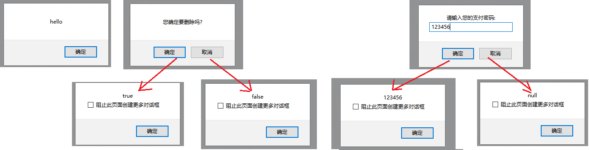
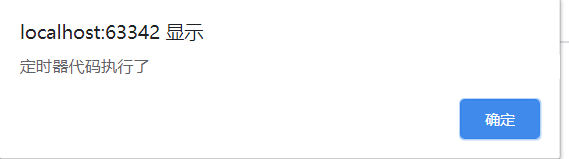
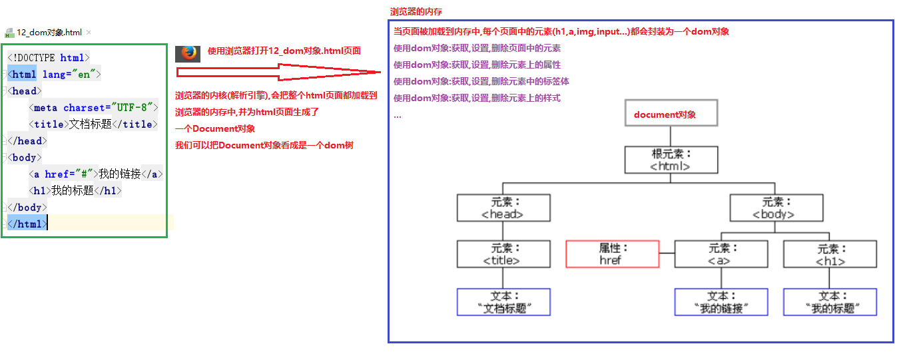
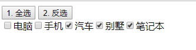
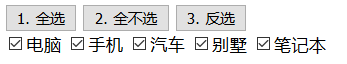
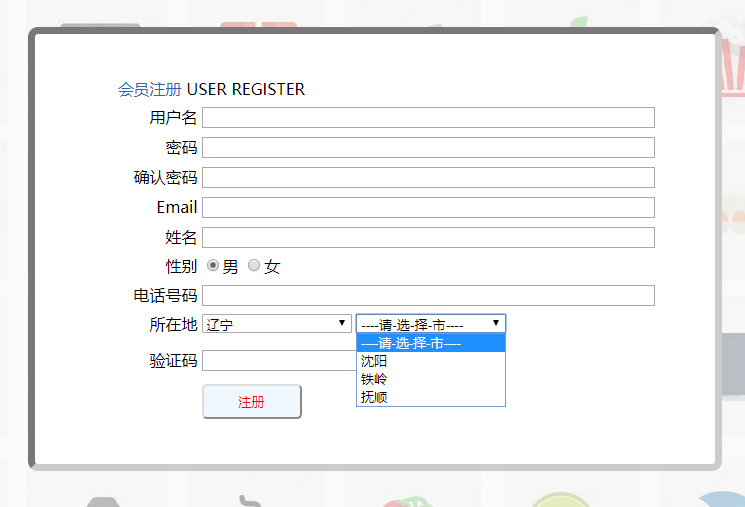

# 学习目标

```java
- 掌握JS的定时器对象的使用	
	1. 返回值 setTimeout(函数,毫秒值); 执行一次的定时器
	2. 返回值 setInterval(函数,毫秒值); 反复执行的定时器
	3. clearTimeout(定时器的id值);取消执行一次的定时器
	4. clearInterval(定时器的id值);取消反复执行的定时器
- 会使用dom对象获取元素对象	
	- document.querySelector(CSS选择器) 根据css选择器获取一个元素
	- document.querySelectorAll(CSS选择器) 根据css选择器获取元素对象数组集合
- 会使用dom对象操作元素内容	
	1. document.write(html内容) 向body中追加html内容
	2. element.innerText; 获取或者修改元素的文本
	3. element.innerHTML; 获取或者修改元素的标签体
	4. element.outerHTML; 获取或者修改整个标签
	总结:
		innerText:只能操作获取|设置标签中的文本
		innerHTML:可以获取|设置标签体
		outerHTML:可以获取|设置整个标签
- 会使用dom对象操作元素属性
	1. 给元素设置自定义属性
	语法: element.setAttribute(属性名,属性值) 给元素设置一个属性值,可以设置原生和自定义
	2. 获取元素的自定义属性值
	语法: element.getAttribute(属性名) 获取元素的一个属性值,可以获取原生和自定义
	3. 移除元素的自定义属性
	语法: element.removeAttribute(属性名) 	
	4.使用对象名.属性名称获取属性,设置属性的值
		对象名.value:获取value的值,文本输入框可以获取用户输入的数据
		对象名.value= "新值"; 给value属性重新赋值
- 会使用dom对象操作css样式	
	1. 设置一个css样式
	语法: element.style.驼峰格式样式属性名   获取或者修改一个css样式
	2. 批量设置css样式
	语法: element.style.cssText 获取后者修改 标签的style属性的文本值
	3. 通过class设置样式
	语法: element.className 获取或者修改标签的class属性的文本值
	4. 切换class样式
	语法: element.classList es6特别提供的操作元素class的接口
		element.classList常用方法有四个:
		add("class样式名称")  添加一个class样式
		remove("class样式名称") 移除一个class样式
		contains("class样式名称") 判断是否包含某一个样式,包含返回true,不包含返回false
		toggle("class样式名称") 切换一个class样式 有则删除,无则添加
- 能够完成JS综合案例
```

# 第一章 BOM对象(掌握)

## 1.BOM简介(了解)

- BOM(browser Object Model)浏览器对象模型
- JS把浏览器抽象成为一些对象,运行我们使用js来模拟浏览器的行为.

## 2.Window 对象

### 弹框的方法（重点）

1. 提示框：alert(提示信息);
2. 确认框：confirm(提示信息);
3. 输入框：prompt(提示信息);

```html
<!DOCTYPE html>
<html lang="zh">
<head>
    <meta charset="UTF-8">
    <title>window对象</title>
    <script>
        /*
            window 对象
            window 对象表示浏览器中打开的窗口。
            window对象中的属性和方法,可以省略对象名直接调用
            window.属性   window.方法(参数);
            1. 提示框：alert(提示信息);
            2. 确认框：confirm(提示信息);
            3. 输入框：prompt(提示信息);
         */
        /*
            1. 提示框：alert(提示信息);
            作用:
                在浏览器页面中弹出一个对话框,用于输出数据
         */
        //window.alert("hello");
        //alert("hello");

        /*
            2. 确认框：confirm(提示信息);
            作用:
                在浏览器页面中弹出一个确认框,让用户选择
            返回值:
                点击确定,返回true
                点击取消,返回false
         */
        //var con = confirm("您确定要删除吗?");
        //alert(con);

        /*
            3. 输入框：prompt(提示信息);
            作用:
                在浏览器页面中弹出一个输入框,让用户输入数据
                比如:可以输入二次密码(登录,支付)
            返回值:
                点击确定,返回输入的内容
                点击取消,返回null
         */
        var pro = prompt("请输入您的支付密码:");
        alert(pro);
    </script>
</head>
<body>

</body>
</html>
```



### 定时器（重点）

```java
1. 返回值 setTimeout(函数,毫秒值); 执行一次的定时器
2. 返回值 setInterval(函数,毫秒值); 反复执行的定时器
参数:
	函数:定义一个有名函数,传递函数名字;或者使用匿名函数
    毫秒值:设置定时器的时间,在指定的时间结束之后,会执行传递的函数
返回值:
	返回的是定时器的id值,可以用于取消定时器使用
3. clearTimeout(定时器的id值);取消执行一次的定时器
4. clearInterval(定时器的id值);取消反复执行的定时器
```

执行一次的定时器

```html
<!DOCTYPE html>
<html lang="zh">
<head>
    <meta charset="UTF-8">
    <title>执行一次的定时器</title>
    <script>
        /*
            1. 返回值 setTimeout(函数,毫秒值); 执行一次的定时器
            3. clearTimeout(定时器的id值);取消执行一次的定时器
         */
        //定义一个函数
        /*function c4() {
            alert("炸弹爆炸了!");
        }*/
        //定义一个执行一次的定时器,5秒钟之后执行
        //setTimeout(c4,5000);

        //可以直接使用匿名函数作为参数
        var timeId = setTimeout(function () {
            alert("炸弹爆炸了!");
        },5000);
        //alert(timeId);

        //定义按钮鼠标点击事件的响应函数
        function butOnclick() {
            //取消执行一次的定时器
            clearTimeout(timeId);
        }
    </script>
</head>
<body>
    <input type="button" value="警察拆除了炸弹" onclick="butOnclick()"/>
</body>
</html>
```

反复执行的定时器

```html
<!DOCTYPE html>
<html lang="zh">
<head>
    <meta charset="UTF-8">
    <title>反复执行的定时器</title>
    <script>
        /*
            2. 返回值 setInterval(函数,毫秒值); 反复执行的定时器
            4. clearInterval(定时器的id值);取消反复执行的定时器
         */
        //创建一个反复执行的定时器,每隔2秒钟执行一次
        var interId = setInterval(function () {
            alert("哈哈,恭喜您,中奖了!");
        },2000);

        //定义一个按钮鼠标点击事件的响应函数
        function butOnclick() {
            //取消反复执行的定时器
            clearInterval(interId);
        }
    </script>
</head>
<body>
    <input type="button" value="使用杀毒软件,查杀了病毒" onclick="butOnclick()"/>
</body>
</html>
```

### 🎗**经验分享**

#### 已知代码

html代码

```html
<!DOCTYPE html>
<html lang="en">
<head>
    <meta charset="UTF-8">
    <title>Title</title>
    <script>
        //定义定时器的方法
        function my(){
            alert("定时器代码执行了")
        }
        //定义定时器
        window.setInterval( my() , 1000);
    </script>
</head>
<body>

</body>
</html>
```

#### 出现问题

页面弹出框只打印一次



#### 问题分析

> 定时器设置的语法为  window.setInterval( 函数名称 , 毫秒值 );   或者 window.setInterval("函数名称()" , 毫秒值);
>
> 而代码中设置的window.setInterval( my() , 1000);  表示为my()  , 此代码的含义是调用my方法 , 并不会跟定时器进行绑定,
>
> 所以,页面弹出一次就不再执行

#### 解决方案

> 将代码 window.setInterval( my() , 1000);  修改成 window.setInterval( "my()" , 1000); 或者window.setInterval( my , 1000); 即可解决问题


## 3.location对象（重点）

```javascript
1. 获取当前浏览器地址
location.href
2. 刷新当前页面
location.reload();
3. 跳转页面:相当于在页面输入地址并敲击回车
location.href = "地址" ;
```

```html
<!DOCTYPE html>
<html lang="zh">
<head>
    <meta charset="UTF-8">
    <title>location对象</title>
    <script>
        /*
            location 对象
            location 对象包含有关当前 URL 的信息。
            location 对象是 Window 对象的一个部分，可通过 window.location 属性来访问。
            属性:
                location.href:获取浏览器的URL地址
                location.href="新的地址"; 在浏览器的地址栏输入新的地址,并点击回车(跳转设置地址的页面)
            函数(方法):
                reload() 重新加载当前文档。 刷新页面
         */
        //定义按钮鼠标点击事件的响应函数
        function getURL() {
            alert(location.href);
        }

        function setURL() {
            //location.href = "02_window对象-执行一次的定时器.html";
            location.href = "http://www.itheima.com";
        }

        function myReload() {
            location.reload();
        }
    </script>
</head>
<body>
    <input type="button" value="获取URL地址" onclick="getURL()"/>
    <input type="button" value="跳转指定URL" onclick="setURL()"/>
    <input type="button" value="刷新页面" onclick="myReload()"/>
</body>
</html>
```

# 第二章 DOM对象(重点)

## 1.dom简介(了解)



## 2.dom获取元素

- dom获取元素

- 第一种(掌握):es6提供了强大的根据CSS选择器获取元素的接口

  - document.querySelector(CSS选择器) 根据css选择器获取一个元素
  - document.querySelectorAll(CSS选择器) 根据css选择器获取元素对象数组集合

- 根据第一种语法,完成如下功能:

  - 根据Id选择器获取一个元素
  - 根据类选择器获取一个(多个)元素
  - 根据标签选择器获取一个(多个)元素
  - 根据name属性选择器获取一个(多个)元素
  - 根据关系选择器获取一个(多个)元素

- 第二种(了解):es5之前也有获取元素的接口

  - 根据id获取一个元素 document.getElementById(ID) === querySelector(#ID)

  - 根据class获取多个元素 document.getElementsByClassName(class) === querySelectorAll(.class)

  - 根据标签名称获取多个元素 document.getElementsByTagName(标签名称) === querySelectorAll(标签)

  - 根据name属性获取多个元素 

    document.getElementsByName('name值') === querySelectorAll(元素名称[name=name值])

- 小总结

  - es6接口获取元素功能非常强大,而且接口非常易用.
  - es5接口功能非常局限,而且接口使用复杂.

```html
<!DOCTYPE html>
<html lang="zh">
<head>
    <meta charset="UTF-8">
    <title>10-dom获取元素</title>
</head>
<body>

<form action="#" method="get">
    姓名 <input type="text" name="userName" id="userName" value="邱少云"/> <br/>
    密码 <input type="password" name="userPass"> <br/>
    生日 <input type="date" name="userBirth"><br/>
    性别 <input type="radio" name="gender" value="male" class="radio">男&emsp;
         <input type="radio" name="gender" value="female" class="radio"/>女<br/>
    爱好 <input type="checkbox" name="hobby" value="smoke">抽烟
        <input type="checkbox" name="hobby" value="drink">喝酒
        <input type="checkbox" name="hobby" value="perm">烫头<br/>
    头像 <input type="file" name="userPic"><br/>
    学历
    <select name="userEdu" >
        <option value="0">请选择</option>
        <option value="1">入门</option>
        <option value="2">精通</option>
        <option value="3">放弃</option>

    </select><br/>
    简介
    <textarea name="userIntro"  cols="30" rows="10">默认值</textarea><br/>
    <input type="reset" value="清空按钮"/>
    <input type="submit" value="提交按钮"/><br/>
    <input type="button" value="普通按钮">
    <button>专业按钮</button><button>&times;</button>

</form>
头像 <input type="file" name="userPic"><br/>
<script >
    // 1.根据Id选择器获取一个元素,获取id=userName的标签对象
    //<input type="text" name="userName" id="userName" value="邱少云"/>
    var userNameEle = document.querySelector("#userName");
    console.log(userNameEle);//<input type="text" value="邱少云" id="userName" name="userName">

    // 2.根据类(class)选择器获取一个(多个)元素,获取class=radio的标签对象数组
    var radioEleArr = document.querySelectorAll(".radio");
    //获取数组的长度
    console.log(radioEleArr.length);//2
    //遍历数组,获取数组中的每一个元素(普通for循环)
    for(var i=0; i<radioEleArr.length; i++){
        console.log(radioEleArr[i]);
        /*
            <input type="radio" class="radio" value="male" name="gender">
            <input type="radio" class="radio" value="female" name="gender">
         */
    }
    console.log("--------------------------------");
    //遍历数组,获取数组中的每一个元素(增强for循环)
    for(var radioEle of radioEleArr){
        console.log(radioEle);
    }

    // 3.根据标签选择器获取一个(多个)元素,获取所有的option标签对象数组
    var optionEleArr = document.querySelectorAll("option");
    //遍历数组,获取数组中的每一个元素
    for(var optionEle of optionEleArr){
        console.log(optionEle);
        /*
            <option value="0">
            <option value="1">
            <option value="2">
            <option value="3">
         */
    }

    // 4.根据name属性选择器获取一个(多个)元素,获取name=hobby的input标签对象数组
    var hobbyEleArr = document.querySelectorAll("input[name='hobby']");
    //遍历数组,获取数组中的每一个元素
    for(var hobbyEle of hobbyEleArr){
        console.log(hobbyEle);
        /*
            <input type="checkbox" value="smoke" name="hobby">
            <input type="checkbox" value="drink" name="hobby">
            <input type="checkbox" value="perm" name="hobby">
         */
    }

    // 5.根据关系(后代)选择器获取一个(多个)元素,获取文件选择框
    //<input type="file" name="userPic">
    //var userPicEle = document.querySelectorAll("form input[name='userPic']");
    //console.log(userPicEle.length);
    //console.log(userPicEle[0]);//<input type="file" name="userPic">
    var userPicEle = document.querySelector("form input[name='userPic']");
    console.log(userPicEle);//<input type="file" name="userPic">
    console.log("--------------------------------------");

    //------------ 华丽丽的分割线 --------
	//第二种(了解):es5之前也有获取元素的接口
    // 1. 根据id获取一个元素,获取id=userName的标签对象
    var userNameEle5 = document.getElementById("userName");
    console.log(userNameEle5);//<input type="text" value="邱少云" id="userName" name="userName">

    // 2. 根据class获取多个元素
    var radioArr = document.getElementsByClassName("radio");
    for(var r of radioArr){
        console.log(r);
    }

    // 3. 根据标签名称获取多个元素
    var optEleArr = document.getElementsByTagName("option");
    for(var optEle of optEleArr){
        console.log(optEle);
    }

    // 4. 根据name属性获取多个元素
    var hobbyArr = document.getElementsByName("hobby");
    for(var h of hobbyArr){
        console.log(h);
    }
</script>
</body>
</html>
```

## 3.dom操作内容

- dom操作内容

  ```html
  1. document.write(html内容) 向body中追加html内容
  2. element.innerText; 获取或者修改元素的纯文本内容
  3. element.innerHTML; 获取或者修改元素的html内容
  4. element.outerHTML; 获取或者修改包含自身的html内容
  
  ```

- 总结:

  ```html
  - innerText 获取的是纯文本  innerHTML获取的是所有html内容
  - innerText 设置到页面中的是纯文本   innerHTML设置到页面中的html会展示出外观效果
  - innerHTML不包含自身 outerHTML包含自身的html内容
  ```

```html
<!DOCTYPE html>
<html lang="zh">
<head>
    <meta charset="UTF-8">
    <title>dom操作内容</title>
</head>
<body>

<div id="d1">我是d1<br/></div>
<div id="d2">我是d2</div>
<div id="d3">我是d3</div>

<script>
    // 1. 向body中追加html内容
    document.write("hello");
    document.write("<h1>我是h1标题标签</h1>");

    /*
        dom对象.innerText:获取设置标签中的文本
        dom对象.innerHTML:获取设置标签体
        dom对象.outerHTML:获取设置整个标签
     */
    // 2. 获取元素的纯文本,html内容对比
    //<div id="d1">我是d1<br/></div>
    //获取id为d1的div对象
    var d1Ele = document.querySelector("#d1");
    console.log(d1Ele.innerText);//我是d1==>标签中的文本
    console.log(d1Ele.innerHTML);//我是d1<br>==>标签体
    console.log(d1Ele.outerHTML);//<div id="d1">我是d1<br></div>==>整个标签

    // 3. 修改元素的纯文本,html内容对比
    //d1Ele.innerText = "<h2>我是h2标题标签</h2>";//设置的是纯文本
    d1Ele.innerHTML = "<h2>我是h2标题标签</h2>";//设置标签体,可以是其他的标签

    // 4. 获取或修改包含元素自身的html内容(了解)
    console.log(d1Ele.outerHTML);//<div id="d1"><h2>我是h2标题标签</h2></div>==>整个标签
    //获取id为d2的div对象
    var d2Ele = document.querySelector("#d2");
    console.log(d2Ele.outerHTML);//<div id="d2">我是d2</div>
    d2Ele.outerHTML = "<h3>我是h3标题标签</h3>";//把整个d2的div标签替换为h3标题标签
    
</script>

</body>
</html>
```


## 4.dom操作属性

- dom操作属性

  ```html
  1. 给元素设置自定义属性
  语法: element.setAttribute(属性名,属性值) 给元素设置一个属性值,可以设置原生和自定义
  2. 获取元素的自定义属性值
  语法: element.getAttribute(属性名) 获取元素的一个属性值,可以获取原生和自定义
  3. 移除元素的自定义属性
  语法: element.removeAttribute(属性名) 
  
  ```

```html
<!DOCTYPE html>
<html lang="zh">
<head>
    <meta charset="UTF-8">
    <title>12-dom操作属性</title>
</head>
<body>
	
<form action="#" method="get">
    姓名 <input type="text" name="userName" value="张三"  /> <br/>
    密码 <input type="password" name="userPass" > <br/>
    生日 <input type="date" name="userBirth"><br/>
    性别 <input type="radio" name="gender" value="男" checked="checked">男&emsp;
    <input type="radio" name="gender" value="女"/>女<br/>
    爱好 <input type="checkbox" name="hobby" value="smoke"  checked="checked"/>抽烟
    <input type="checkbox" name="hobby" value="drink" checked="checked"/>喝酒
    <input type="checkbox" name="hobby" value="perm"/>烫头<br/>
    头像 <input type="file" name="userPic"><br/>
    学历
    <select name="userEdu" >
        <option value="0">请选择</option>
        <option value="1">入门</option>
        <option value="2">精通</option>
        <option value="3">放弃</option>

    </select><br/>
    简介
    <textarea name="userIntro"  cols="30" rows="10">默认值</textarea><br/>
    <input type="reset" value="清空按钮"/>
    <input type="submit" value="提交按钮"/><br/>
    <input type="button" value="普通按钮">
    <button>专业按钮</button><button>&times;</button>


</form>
</body>
<script >
    // 1. 获取文本框的值
    //<input type="text" name="userName" value="张三"  />
    //获取name是userName的标签对象
    var userNameEle = document.querySelector("input[name='userName']");
    /*
        1.对象名.属性名:可以获取属性的值
            对象名.value:还可以获取文本框中输入的内容
        2.对象名.getAttribute("属性名"):可以获取属性的值,获取不到文本框中输入的内容
     */
    console.log(userNameEle.value);//张三  李四(页面中输入的内容)
    console.log(userNameEle.getAttribute("value"));//张三 张三(获取属性固定的值)
    console.log(userNameEle.type);//text
    console.log(userNameEle.name);//userName

    //修改标签对象的value值
    //userNameEle.value = "老王";
    //userNameEle.setAttribute("value","隔壁老王");

    //单选框或复选框的选中状态
    //获取name属性值为hobby的所有复选框,返回一个数组
    var hobbyEleArr = document.querySelectorAll("input[name='hobby']");
    //遍历数组,获取每一个复选框
    for(var hobbyEle of hobbyEleArr){
        //对象名.checked属性,可以获取复选框选中的状态: 选中:true 未选中:false
        //alert(hobbyEle.checked);
        //hobbyEle.checked = true;//选择复选框
        //hobbyEle.checked = false;//取消选择复选框

        /*
            对象名.getAttribute("checked");根据属性名,获取属性值
                选中:返回checked的属性值checked
                未选中:返回null,没有属性属性
         */
        //alert(hobbyEle.getAttribute("checked"));
    }

    // 2. 给元素设置自定义属性
    //<input type="password" name="userPass" >
    //给name="userPass"密码框添加自定义的属性
    var userPassEle = document.querySelector("input[name=userPass]");
    //alert(userPassEle.getAttribute("haha"));//null
    userPassEle.setAttribute("haha","哈哈");

    // 3. 获取元素的自定义属性值
    alert(userPassEle.getAttribute("haha"));//哈哈

    // 4. 移除元素的自定义属性
    userPassEle.removeAttribute("haha");
    alert(userPassEle.getAttribute("haha"));//null

</script>
</html>
```


## 5.dom操作样式

dom操作样式

```java
1. 设置一个css样式
语法: element.style.样式名  获取或者修改一个css样式
2. 批量设置css样式
语法: element.style.cssText 获取后者修改 标签的style属性的文本值
3. 通过class设置样式
语法: element.className 获取或者修改标签的class属性的文本值
4. 切换class样式
语法: element.classList es6特别提供的操作元素class的接口
    element.classList常用方法有四个:
    add("class样式名称")  添加一个class样式
    remove("class样式名称") 移除一个class样式
    contains("class样式名称") 判断是否包含某一个样式,包含返回true,不包含返回false
    toggle("class样式名称") 切换一个class样式 有则删除,无则添加
```

```html
<!DOCTYPE html>
<html lang="zh">
<head>
    <meta charset="UTF-8">
    <title>13-dom操作样式</title>
    <style>
        #p1{ background-color: red;}
        .mp{color:green}
        .mpp{background-color: lightgray;}
    </style>
</head>
<body>

    <p id="p1">1. 设置一个css样式</p>
    <p id="p2">2. 批量设置css样式</p>
    <p id="p3" class="mpp">3. 通过class设置样式</p>
    <p id="p4">4. 切换class样式</p>
    <input type="button" value="切换样式" id="b1" />

<script >
    let p1 = document.querySelector("#p1");//获取段落标签
    let p2 = document.querySelector("#p2");//获取段落标签
    let p3 = document.querySelector("#p3");//获取段落标签
    let p4 = document.querySelector("#p4");//获取段落标签

    // 1. 给p1设置css样式
    //白色字体
    p1.style.color = "white";
    //黑色背景
    p1.style.backgroundColor = "#000";
    //获取一个样式名
    //alert(p1.style.color);//white
    //alert(p1.style.backgroundColor);//rgb(0, 0, 0)

    //隐藏不显示
    //p1.style.display = "none";

    //显示
    //p1.style.display = "block";

    // 2. 给p2批量设置css样式
    //style="color: red;background-color: green;border: 1px solid yellow"
    p2.style.cssText = "color: red;background-color: green;border: 1px solid yellow";

    // 3. 给p3通过class设置样式
    //a.给元素添加class属性的方式添加样式
    //p3.setAttribute("class","mpp mp");
    //b.使用className属性给元素添加class样式
    p3.className = "mpp mp";

    // 4. 切换class样式
    //获取p4的class样式集合
    var p4List = p4.classList;

    //添加一个class样式
    p4List.add("mp");

    //判断某一个样式是否存在
    //alert(p4List.contains("mp"));//true
    //alert(p4List.contains("mpp"));//false

    //添加一个class样式
    //p4List.add("mpp");

    //移除一个class样式
    //p4List.remove("mpp");

	//切换,无则添加,有则删除	
	//获取id是b1的按钮对象
    var b1Ele = document.querySelector("#b1");
    //给b1Ele对象添加一个鼠标点击事件
    b1Ele.onclick = function () {
        //鼠标点击事件的响应函数
        p4List.toggle("mpp");
    }
</script>
</body>
</html>
```

## 6.dom操作元素

- dom操作元素

```html
1. 后面添加(掌握)
innerHTML 获取或者设置标签的html内容
2. 后面添加(了解)
document.createElement("标签名称") 创建一个标签对象 <div></div>
parentNode.appendChild(newNode) 给父标签添加一个子标签
3. 移除元素(了解)
element.outerHTML=""
```

```html
<!DOCTYPE html>
<html lang="zh">
<head>
    <meta charset="UTF-8">
    <title>14-dom操作元素</title>
</head>
<body>
<div id="container">
    <input id="smoke" type="checkbox" name="hobby" value="抽烟">
    <label for="smoke">抽烟&emsp;</label>

<!--    <input id="drink" type="checkbox" name="hobby" value="喝酒">-->
<!--    <label for="drink">喝酒&emsp;</label>-->

<!--    <input id="perm" type="checkbox" name="hobby" value="烫头">-->
<!--    <label for="perm">烫头&emsp;</label>-->

</div>
</body>
</html>


<script >
    //获取div标签对象
    var divEle = document.querySelector("#container");

    //1. 后面添加喝酒(掌握) innerHTML
    //alert(divEle.innerHTML);
    divEle.innerHTML += "<input id='drink' type='checkbox' name='hobby' value='喝酒'>"
        +"<label for='drink'>喝酒&emsp;</label>";

    //2. 后面添加烫头(了解)
    //<input id="perm" type="checkbox" name="hobby" value="烫头">
    //使用document对象中的方法createElement创建input标签
    var inputEle = document.createElement("input");
    //alert(inputEle);//[object HTMLInputElement]
    console.log(inputEle);//<input>
    console.log(inputEle);//<input>
    //给inputEle添加属性
    inputEle.setAttribute("id","perm");
    inputEle.setAttribute("type","checkbox");
    inputEle.setAttribute("name","hobby");
    inputEle.setAttribute("value","烫头");
    console.log(inputEle);//<input type="checkbox" id="perm" name="hobby" value="烫头">

    //使用document对象中的方法createElement创建lable标签
    //<label for="perm">烫头&emsp;</label>
    var lableEle = document.createElement("lable");
    console.log(lableEle);//<lable>
    //给lableEle添加属性
    lableEle.setAttribute("for","perm");
    //给lableEle添加标签体
    lableEle.innerHTML = "烫头&emsp;";
    console.log(lableEle);//<label for="perm">烫头&emsp;</label>

    //使用父标签调用appendChild(子标签对象)把子标签追加到父标签的末尾
    divEle.appendChild(inputEle);
    divEle.appendChild(lableEle);

    //3.移除元素(了解) outerHTML
    //删除整个div
    divEle.outerHTML = "";

</script>

```

# 第三章 正则表达式（重点）

## 1.会使用如下正则表达式匹配字符串

```java
验证邮编
/\d{6}/
校验是否全由8位数字组成
/^[0-9]{8}$/
中文名称
/^[\u4E00-\u9FA5]{2,4}$/
是否带有小数
/^\d+\.\d+$/
验证身份证号
/\d{17}[\d|X]|\d{15}/
校验电话码格式
/^((0\d{2,3}-\d{7,8})|(1[3584]\d{9}))$/
验证网址
/http(s)?:[//]{2}([\w-]+\.)+[\w-]+([/]{1}[\w- ./?%&=]*)?/
验证EMail
/\w+([-+.']\w+)*@\w+([-.]\w+)*\.\w+([-.]\w+)*/

```

## 2.正则表达式练习

```html
<!DOCTYPE html>
<html lang="zh">
<head>
    <meta charset="UTF-8">
    <title>正则表达式练习</title>
    <script>
        //创建一个正则表达式对象(校验邮箱号)
        var reg = /\w+([-+.']\w+)*@\w+([-.]\w+)*\.\w+([-.]\w+)*/;
        //使用正则表达式中的方法test判断字符串邮箱是否满足正则表达式的规则
        console.log(reg.test("123456@qq.com"));//true
        console.log(reg.test("123456qq.com"));//false
        console.log(reg.test("123456@qqcom"));//false
        console.log(reg.test("zhangsan@sina.com.cn"));//true
        console.log(reg.test("zhangsan@163.com"));//true
    </script>
</head>
<body>

</body>
</html>
```

# 第四章 JSON数据(重点)

## 1.什么是json

JSON(JavaScript Object Notation, JS 对象标记) 是一种轻量级的**数据交换**格式。它基于ECMAScript的一个子集，采用**完全独立于编程语言**的文本格式来存储和表示数据。就是说不同的编程语言JSON数据是一致的。JS原生支持JSON.简洁和清晰的层次结构使得 JSON 成为理想的数据交换语言。 易于人阅读和编写，同时也易于机器解析和生成，并有效地提升网络传输效率。

## 2.json的语法格式

json对象有三种数据格式，分别如下：

| 类型          | 语法                                        | 解释                                   |
| ------------- | ------------------------------------------- | -------------------------------------- |
| 对象类型      | {"key1":value,"key2":value,"key3":value...} | 其中key是字符串类型，而value是任意类型 |
| 数组/集合类型 | [value,value,value...]                      | 其中value是任意类型                    |
| 混合类型      | [{},{}... ...] 或 {"key":[]... ...}         | 对象格式和数组格式可以互相嵌套         |

[{"key1":value,"key2":value,"key3":value...},{"key1":value,"key2":value,"key3":value...}]

{"key1":value,"key2":[value,value,value...],"key3":value...}

{"key1":value,"key2":[{"key1":value,"key2":value,"key3":value...},value,value...],"key3":value...}

## 3.json格式练习

### 练习1:对象练习

```java
案例一
{key:value,key:value}
 
class Person{
   String firstname = "张";
   String lastname = "三丰";
   Integer age = 100;
}

Person p = new Person();
System.out.println(p.firstname);//张
```

```html
<!DOCTYPE html>
<html lang="zh">
<head>
    <meta charset="UTF-8">
    <title>练习1:对象练习</title>
    <script>
        /*
            案例一
            {key:value,key:value}

            class Person{
               String firstname = "张";
               String lastname = "三丰";
               Integer age = 100;
            }

            Person p = new Person();
            System.out.println(p.firstname);//张

           分析:
            json本质就是一个对象,对象中包含了3个键值对
         */
        var str = "firstname=张&lastname=三丰&age=100"
        var json = {"firstname":"张","lastname":"三丰","age":100};
        //alert(json);//[object Object]

        //可以使用json对象.属性名,获取属性值
        alert(json.firstname);//张
        alert(json.lastname);//三丰
        alert(json.age);//100
    </script>
</head>
<body>

</body>
</html>
```

### 练习2:数组练习

```
案例2:[value,value,value...]
```

```html
<!DOCTYPE html>
<html lang="zh">
<head>
    <meta charset="UTF-8">
    <title>练习2_数组练习</title>
    <script>
        /*
            案例2:[value,value,value...]
            json本质就是一个数组,数组中的元素可以是任意的类型
         */
        var json = [1,2,3,true,false,1.1,2.2,3.3,"a","b","c"];
        //遍历数组,获取数组中的每一个元素
        for(var s of json){
            console.log(s);
        }
    </script>
</head>
<body>

</body>
</html>
```

### 练习3:对象和数组混合练习

```json
案例3:[{key:value,key:value},{key:value,key:value}]
```

```html
<!DOCTYPE html>
<html lang="zh">
<head>
    <meta charset="UTF-8">
    <title>练习3:对象和数组混合练习</title>
    <script>
        /*
            案例3:[{key:value,key:value},{key:value,key:value}]
            json本质是一个数组
            数组中的元素是对象
            对象中包含了键值对
         */
        var json = [
            {"name":"柳岩","age":18},
            {"name":"唐嫣","age":19}
        ];
        //遍历数组,获取每一个元素(对象)
        for(var obj of json){
            //通过对象名.属性名,获取属性值
            alert(obj.name+"\t"+obj.age);
        }
    </script>
</head>
<body>

</body>
</html>
```

## 4.JSON格式转换

- JSON对象与字符串转换的相关函数

```
-  JSON.stringify(object) 把json对象转为字符串
-  JSON.parse(string) 把字符串转为json对象
```

```html
<!DOCTYPE html>
<html lang="zh">
<head>
    <meta charset="UTF-8">
    <title>JSON格式转换</title>
    <script>
        var json = {"name":"柳岩","age":18};
        //alert(typeof json);//object

        //-  JSON.stringify(object) 把json对象转为字符串
        var str = JSON.stringify(json);
        //alert(str);//"{'name':'柳岩','age':18}"
        //alert(typeof str);//string
        //alert(str.name);//undefined

        //-  JSON.parse(string) 把字符串转为json对象
        var obj = JSON.parse(str);
        alert(obj.name);//柳岩
        alert(obj.age);//18

    </script>
</head>
<body>

</body>
</html>
```


# 第五章 综合案例(掌握)

## 1.案例-轮播图

```html
<!DOCTYPE html>
<html lang="zh">
<head>
    <meta charset="UTF-8">
    <title>轮播图案例</title>
    <script>
        //定义一个页面加载事件,让页面先加载完毕,在执行事件响应函数中的代码
        window.onload = function () {
            /*
                分析:
                   1.定义一个变量i,记录图片的整数值
                   2.定义一个反复执行的定时器,每隔3秒钟执行一次
                   3.在定时器的函数中,使用document对象,获取id是adImg的图片对象
                   4.对变量i进行判断 i<3 i++  否则: i=1
                   5.使用功能图片对象src属性,修改属性的值
             */
            //1.定义一个变量i,记录图片的整数值
            var i = 1;
            //2.定义一个反复执行的定时器,每隔3秒钟执行一次
            setInterval(function () {
                //3.在定时器的函数中,使用document对象,获取id是adImg的图片对象
                var adImgEle = document.querySelector("#adImg");
                //4.对变量i进行判断 i<3 i++  否则: i=1
                if(i<3){
                    i++;
                }else{
                    i=1;
                }
                //5.使用图片对象src属性,修改属性的值
                adImgEle.src = "../img/ad"+i+".jpg";
            },3000)
        }
    </script>
</head>
<body>
    <div style="margin: 50px auto;width: 500px;height: 300px">
        
    </div>
</body>
</html>
```

## 2.案例-表单校验

```html
form表单的 onsubmit 事件 表单提交之前触发
onsubmit的事件源是form表单

用法实例:
onsubmit="return 函数()"  函数返回true则表单正常提交,函数返回false则阻止表单提交
```

```html
<html lang="en">
<head>
    <meta charset="UTF-8">
    <title>案例三_表单校验</title>
</head>
<body>
<form action="#" method="post" onsubmit="return checkForm()">
    用户名：<input id="txtUserName" type="text"/><span id="txtUserNameMsg"></span>
    <br/>
    密码：<input id="txtUserPwd" type="text"/><span id = "txtUserPwdMsg"></span>
    <br/>
    确认密码：<input id="txtUserPwd2" type="text"/><span id="txtUserPwdMsg2"></span>
    <br/>
    <input type="submit" value="提交"/>
</form>
</body>
<script>
		//验证用户名
        //1.不能为空，必须是字母(大小写、数字)、8--16位
        //获取id是txtUserPwd的文本框
        var txtUserNameEle = document.querySelector("#txtUserName");
        //获取id是txtUserNameMsg的错误信息提示框
        var txtUserNameMsgEle = document.querySelector("#txtUserNameMsg");
        //定义一个布尔值,记录判断的结果
        var b1 = false;
        //定义一个校验用户名的正则表达式
        var reg = /^[a-zA-Z0-9]{8,16}$/;
        //给txtUserNameEle对象添加一个失去焦点事件
        txtUserNameEle.onblur = function () {
            //alert(1);
            //判断用户名是否为null
            if(txtUserNameEle.value==""){
                //显示错误信息
                txtUserNameMsgEle.innerHTML = "<font color='red'>用户名不能为空</font>";
                b1 = false;
            }
            //判断用户名必须是字母(大小写、数字)、8--16位
            else if(!reg.test(txtUserNameEle.value)){
                //显示错误信息
                txtUserNameMsgEle.innerHTML = "<font color='red'>用户名必须是字母(大小写、数字)、8--16位</font>";
                b1 = false;
            }else{
                //满足条件,隐藏错误信息
                //txtUserNameMsgEle.innerHTML = "";
                txtUserNameMsgEle.innerHTML = "<font color='green'>用户名正确</font>";
                b1 = true;
            }
        };

     	//2.密码不能为空，必须是：8--16位数字
        //获取id是txtUserPwd的文本框
        var txtUserPwdEle = document.querySelector("#txtUserPwd");
        //获取id是txtUserPwdMsg的错误信息提示框
        var txtUserPwdMsgEle = document.querySelector("#txtUserPwdMsg");
        //定义一个布尔值,记录判断的结果
        var b2 = false;
        //定义一个校验用户名的正则表达式
        var reg2 = /^[0-9]{8,16}$/;
        //给txtUserPwdEle对象添加一个失去焦点事件
        txtUserPwdEle.onblur = function () {
            //alert(1);
            //判断密码是否为null
            if(txtUserPwdEle.value==""){
                //显示错误信息
                txtUserPwdMsgEle.innerHTML = "<font color='red'>密码不能为空</font>";
                b2 = false;
            }
            //判断密码必须是：8--16位数字
            else if(!reg2.test(txtUserPwdEle.value)){
                //显示错误信息
                txtUserPwdMsgEle.innerHTML = "<font color='red'>密码必须是：8--16位数字</font>";
                b2 = false;
            }else{
                //满足条件,隐藏错误信息
                //txtUserPwdMsgEle.innerHTML = "";
                txtUserPwdMsgEle.innerHTML = "<font color='green'>密码正确</font>";
                b2 = true;
            }
        };

        //3.确认密码：必须与密码相同
        //获取id是txtUserPwd2文本框对象
        var txtUserPwd2Ele = document.querySelector("#txtUserPwd2");
        //获取id是txtUserPwdMsg2错误信息提示对象
        var txtUserPwdMsg2Ele = document.querySelector("#txtUserPwdMsg2");
        //定义一个布尔值,记录判断的结果
        var b3 = false;
        //给txtUserPwd2Ele对象添加一个失去焦点事件
        txtUserPwd2Ele.onblur = function () {
            //确认密码：必须与密码相同
            if(txtUserPwdEle.value!=txtUserPwd2Ele.value){
                //显示错误信息
                txtUserPwdMsg2Ele.innerHTML = "<font color='red'>确认密码：必须与密码相同</font>";
                b3 = false;
            }else{
                //满足条件,隐藏错误信息
                txtUserPwdMsg2Ele.innerHTML = "<font color='green'>确认密码正确</font>";
                b3 = true;
            }
        }

        //表单提交事件的响应函数
        function checkForm(){
            //alert("b1:"+b1);
            //alert("b2:"+b2);
            //alert("b3:"+b3);
            var flag = b1 && b2 && b3;
            alert("flag:"+flag);
            return flag;
        }
    </script>
</html>
```


## 3-案例-商品全选





```html
<!DOCTYPE html>
<html lang="zh">
<head>
    <meta charset="UTF-8">
    <title>案例-商品全选</title>
</head>
<body>
<button id="btn1">1. 全选</button>
<button id="btn2">2. 全不选</button>
<button id="btn3">3. 反选</button>
<br/>
<input type="checkbox">电脑
<input type="checkbox">手机
<input type="checkbox">汽车
<input type="checkbox">别墅
<input type="checkbox" checked="checked">笔记本
<script >
	/*
	 	商品全选
	    1. 全选 点击全选按钮,所有复选框都被选中
	    a.获取id是btn1的按钮对象
	    b.给id是btn1的按钮对象添加一个鼠标点击事件
	    c.在事件的响应函数中,获取所有的checkbox复选框对象,返回一个数组
	    d.遍历数组,获取每一个checkbox对象
	    e.设置checkbox对象的checked属性为true
	 */
    //a.获取id是btn1的按钮对象
    var btn1Ele = document.querySelector("#btn1");
    //b.给id是btn1的按钮对象添加一个鼠标点击事件
    btn1Ele.onclick =  function () {
        //c.在事件的响应函数中,获取所有的checkbox复选框对象,返回一个数组
        var cbEleArr = document.querySelectorAll("input[type='checkbox']");
        //d.遍历数组,获取每一个checkbox对象
        for(var cbEle of cbEleArr){
            //e.设置checkbox对象的checked属性为true
            cbEle.checked =  true;
        }
    }

	/*
	    2. 全不选 点击全不选按钮,取消所有被选中的复选框
        a.获取id是btn2的按钮对象
	    b.给id是btn2的按钮对象添加一个鼠标点击事件
	    c.在事件的响应函数中,获取所有的checkbox复选框对象,返回一个数组
	    d.遍历数组,获取每一个checkbox对象
	    e.设置checkbox对象的checked属性为false
	 */
    //a.获取id是btn2的按钮对象
    var btn2Ele = document.querySelector("#btn2");
    //b.给id是btn2的按钮对象添加一个鼠标点击事件
    btn2Ele.onclick =  function () {
        //c.在事件的响应函数中,获取所有的checkbox复选框对象,返回一个数组
        var cbEleArr = document.querySelectorAll("input[type='checkbox']");
        //d.遍历数组,获取每一个checkbox对象
        for(var cbEle of cbEleArr){
            //e.设置checkbox对象的checked属性为true
            cbEle.checked =  false;
        }
    }

	/*
	    3. 反选 点击反选按钮,所有复选框状态取反
	    a.获取id是btn3的按钮对象
	    b.给id是btn3的按钮对象添加一个鼠标点击事件
	    c.在事件的响应函数中,获取所有的checkbox复选框对象,返回一个数组
	    d.遍历数组,获取每一个checkbox对象
	    e.设置checkbox对象的checked属性为!checked
	 */
    //a.获取id是btn3的按钮对象
    var btn3Ele = document.querySelector("#btn3");
    //b.给id是btn3的按钮对象添加一个鼠标点击事件
    btn3Ele.onclick =  function () {
        //c.在事件的响应函数中,获取所有的checkbox复选框对象,返回一个数组
        var cbEleArr = document.querySelectorAll("input[type='checkbox']");
        //d.遍历数组,获取每一个checkbox对象
        for(var cbEle of cbEleArr){
            //e.设置checkbox对象的checked属性为true
            cbEle.checked = !cbEle.checked;
        }
    }
  
</script>
</body>
</html>
```


## 4-案例-省市级联



```html
<!DOCTYPE html>
<html>
	<head>
		<meta charset="utf-8" />
		<title>案例-省市级联</title>
		<style type="text/css">
					.regist_bg {
						width: 100%;
						height: 600px;
						padding-top: 40px;
						background-image: url(../img/bg.jpg);
					}
					.regist {
						border: 7px inset #ccc;
						width: 600px;
						padding: 40px 0;
						padding-left: 80px;
						background-color: #fff;
						margin-left: 25%;
						border-radius: 10px;
					}
					input[type="submit"] {
						background-color: aliceblue;
						width: 100px;
						height: 35px;
						color: red;
						cursor: pointer;
						border-radius: 5px;
					}
		</style>

	</head>
	<body>
		<div class="regist_bg">
			<div class="regist">
				<form action="#">
					<table width="600" height="350px">
						<tr>
							<td colspan="3">
								<font color="#3164af">会员注册</font> USER REGISTER
							</td>
						</tr>
						<tr>
							<td align="right">用户名</td>
							<td colspan="2"><input id="loginnameId" type="text" name="loginname" size="60" /> </td>
						</tr>
						<tr>
							<td align="right">密码</td>
							<td colspan="2"><input id="loginpwdId" type="password" name="loginpwd" size="60" /> </td>
						</tr>
						<tr>
							<td align="right">确认密码</td>
							<td colspan="2"><input id="reloginpwdId" type="password" name="reloginpwd" size="60" /> </td>
						</tr>
						<tr>
							<td align="right">Email</td>
							<td colspan="2"><input id="emailId" type="text" name="email" size="60" /> </td>
						</tr>
						<tr>
							<td align="right">姓名</td>
							<td colspan="2"><input name="text" name="username" size="60" /> </td>
						</tr>
						<tr>
							<td align="right">性别</td>
							<td colspan="2">
								<input type="radio" name="gender" value="男" checked="checked" />男
								<input type="radio" name="gender" value="女" />女
							</td>
						</tr>
						<tr>
							<td align="right">电话号码</td>
							<td colspan="2"><input type="text" name="phone" size="60" /> </td>
						</tr>
						<tr>
							<td align="right">所在地</td>
							<td colspan="3">								
								<select id="provinceId" style="width:150px">
									<option value="">----请-选-择-省----</option>


								</select>
								<select id="cityId" style="width:150px">
									<option value="">----请-选-择-市----</option>
								</select>
							</td>
						</tr>
						<tr>
							<td width="80" align="right">验证码</td>
							<td width="100"><input type="text" name="verifyCode" /> </td>
							<td> </td>
						</tr>
						<tr>
							<td></td>
							<td colspan="2">
								<input type="submit" value="注册" />
							</td>
						</tr>
					</table>
				</form>
			</div>
		</div>
		<!--
		省市级联
			1. 页面加载完成后自动装载省数据
			2. 当选中省时,装载该省的市数据
		-->
		<script type="text/javascript">
			//准备省市数据
			let provinceData = ["北京","河北","辽宁"];
			//准备省对应的市数据 json数据
			let cityData = {
				"北京":["顺义区","昌平区","朝阳区"],
				"河北":["保定","石家庄","廊坊"],
				"辽宁":["沈阳","铁岭","抚顺"]
			};

			//获取省份下拉选provinceId对象
			var proEle = document.querySelector("#provinceId");
            //获取城市下拉选cityId对象
			var cityEle = document.querySelector("#cityId");

			//页面加载完成时填充省选项
			//遍历省份数组,获取每一个省份名称
			for(var proName of provinceData){
			    //给省份下拉选proEle对象,追加标签体
				proEle.innerHTML += "<option value='"+proName+"'>"+proName+"</option>";
			}
			
			//当省选项值改变时改变对应的市
			//给省份proEle对象,添加一个内容改变事件onchange
			proEle.onchange = function () {
				//alert(proEle.value);
				//alert(this);//[object HTMLSelectElement] 当前对象:proEle调用函数,函数中的this就是proEle对象
				//alert(this.value);
				var cityArr = cityData[this.value];
				//alert(cityArr);
                //清空cityEle的标签体
                cityEle.innerHTML = "<option value=''>----请-选-择-市----</option>";
                //遍历数组,获取每一个城市名称

                for(var cityName of cityArr){
				    //给城市下拉选cityEle对象,追加标签体
                    cityEle.innerHTML += "<option value='"+cityName+"'>"+cityName+"</option>";
				}
            }

		</script>

	</body>
</html>

```

## 5-案例-隔行变色

```html
<!DOCTYPE html>
<html>
	<head>
		<meta charset="UTF-8">
		<title>表格隔行变色</title>
	</head>
	<body>
		<table id="tab1" border="1" width="800" align="center" >
			<tr>
				<td colspan="5"><input type="button" value="删除"></td>
			</tr>
			<tr style="background-color: #999999;">
				<th><input type="checkbox"></th>
				<th>分类ID</th>
				<th>分类名称</th>
				<th>分类描述</th>
				<th>操作</th>
			</tr>
			<tr >
				<td><input type="checkbox"></td>
				<td>1</td>
				<td>手机数码</td>
				<td>手机数码类商品</td>
				<td><a href="">修改</a>|<a href="">删除</a></td>
			</tr>
			<tr>
				<td><input type="checkbox"></td>
				<td>2</td>
				<td>电脑办公</td>
				<td>电脑办公类商品</td>
				<td><a href="">修改</a>|<a href="">删除</a></td>
			</tr>
			<tr>
				<td><input type="checkbox"></td>
				<td>3</td>
				<td>鞋靴箱包</td>
				<td>鞋靴箱包类商品</td>
				<td><a href="">修改</a>|<a href="">删除</a></td>
			</tr>
			<tr>
				<td><input type="checkbox"></td>
				<td>4</td>
				<td>家居饰品</td>
				<td>家居饰品类商品</td>
				<td><a href="">修改</a>|<a href="">删除</a></td>
			</tr>
			<tr>
				<td><input type="checkbox"></td>
				<td>5</td>
				<td>牛奶制品</td>
				<td>牛奶制品类商品</td>
				<td><a href="">修改</a>|<a href="">删除</a></td>
			</tr><tr>
				<td><input type="checkbox"></td>
				<td>6</td>
				<td>大豆制品</td>
				<td>大豆制品类商品</td>
				<td><a href="">修改</a>|<a href="">删除</a></td>
			</tr>
			<tr>
				<td><input type="checkbox"></td>
				<td>7</td>
				<td>海参制品</td>
				<td>海参制品类商品</td>
				<td><a href="">修改</a>|<a href="">删除</a></td>
			</tr>
			<tr>
				<td><input type="checkbox"></td>
				<td>8</td>
				<td>羊绒制品</td>
				<td>羊绒制品类商品</td>
				<td><a href="">修改</a>|<a href="">删除</a></td>
			</tr>
			<tr>
				<td><input type="checkbox"></td>
				<td>9</td>
				<td>海洋产品</td>
				<td>海洋产品类商品</td>
				<td><a href="">修改</a>|<a href="">删除</a></td>
			</tr>
			<tr>
				<td><input type="checkbox"></td>
				<td>10</td>
				<td>奢侈用品</td>
				<td>奢侈用品类商品</td>
				<td><a href="">修改</a>|<a href="">删除</a></td>
			</tr>
		</table>
	</body>
</html>
<script type="text/javascript">
	/*
		1.获取所有tr对象,返回一个数组
		2.遍历数组,获取每一个tr对象
		3.判断获取到的tr对象奇偶性
			是奇数行: 设置tr的背景色为xxx色
			是偶数行: 设置tr的背景色为yyy色
	 */
    //1.获取所有tr对象,返回一个数组
	var trEleArr = document.querySelectorAll("tr");
    //2.遍历数组,获取每一个tr对象
	for(var i=2; i<trEleArr.length; i++){
        //3.判断获取到的tr对象奇偶性
		if(i%2!=0){
            //是奇数行: 设置tr的背景色为xxx色
            trEleArr[i].bgColor = "pink";
        }else{
            //是偶数行: 设置tr的背景色为yyy色
            trEleArr[i].bgColor = "greenyellow";
        }

        /*
        	扩展:了解
        	给当前行添加鼠标移入和鼠标移出事件
        		鼠标移入:修改当前行的背景色为zzz色
        		鼠标移出:还原背景色
         */
        //定义一个变量,记录当前行的背景色
		var bg;
        trEleArr[i].onmouseover = function () {
			//鼠标移入:修改当前行的背景色为zzz色
			bg = this.bgColor;
			this.bgColor = "yellow";
        }
        trEleArr[i].onmouseout = function () {
			//鼠标移出:还原背景色
			this.bgColor = bg;
        }
    }
</script>
```

