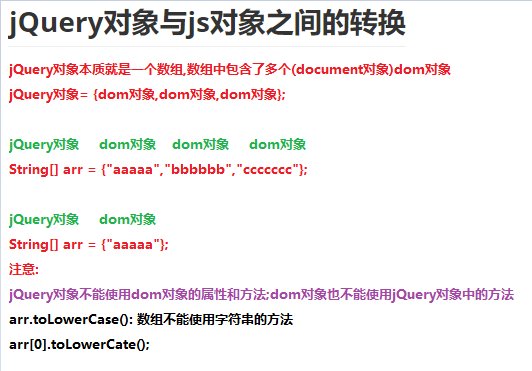
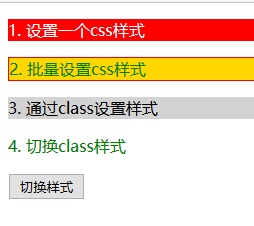
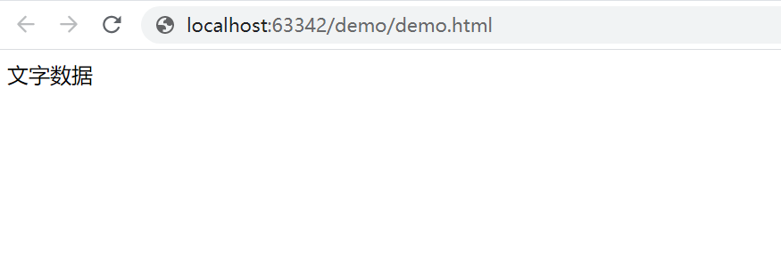
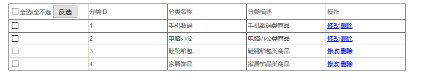
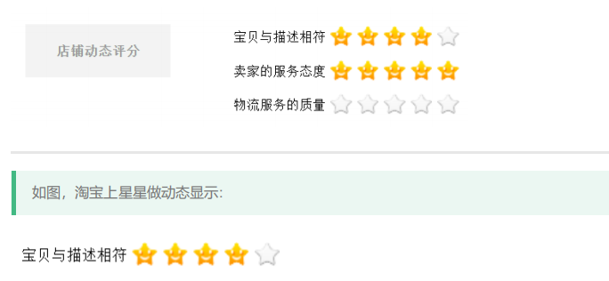

# 学习目标

```java
- 掌握JSON对象的使用
	1.会定义json对象
	var json = {"firstname":"张","lastname":"三丰","age":100};
	2.可以使用对象名.key,可以获取到value值
    alert(json.firstname);
    alert(json.lastname);
    alert(json.age);
	3.会定义json数组
	var json  = [1,2,3,true,false,"a","b","c",1.1,2.2,3.3];
    4.会遍历数组,获取数组中的每一个元素
        for(var s of json){
            alert(s);
        }
- 能够使用jQuery基本选择器	
	标签/元素选择器 $("html标签名")获得所有匹配标签名称的于元素
	id选择器$("#id的属性值")获得与指定id属性值匹配的元素
	类选择器$(".class的属性值")获得与指定的class属性值匹配的元素
- 能够使用jQuery对象完成dom操作	
   1. text() 获取或修改文本内容 类似于 dom.innerText
   2. html() 获取或修改html内容 类似 dom.innerHTML
   3. val() 获取或修改表单控件的value值 等于dom.value
   4. prop("checked",true) 获取或修改原生属性值(checked，selected)
   5. attr() 获取或修改自定义属性值 等于 dom.setAttribute() dom.getAttribute() 
   6. css() 获取或者修改CSS样式 用法
		css(样式名) 获取一个样式 等于 dom.style.驼峰样式名
		css(样式名,样式值) 设置一个样式 dom.style.驼峰样式名=样式值
		css({样式名:样式值,样式名:样式值}) 批量设置样式 dom.style.cssText = 样式名:样式值;样式名:样式值;
	7. $(标签) 创建一个标签,同时可以给对象添加属性和标签体  $("<div id="d001">我是一个div</div>")
	8. $.prepend(元素)  添加成第一个子元素，两者之间是父子关系
	9. $.append(元素) 添加成最后一个子元素，两者之间是父子关系
	10. $.empty() 清空指定元素的所有子元素
	11. $.remove() 删除指定元素 
- 掌握jQuery事件绑定
	$("#btn").click(function(){
		alert("绑定点击事件成功");
	});
	
	$("#btn").on("click",function(){
		alert("绑定点击事件成功");
	});	
```

# 第1章 jQuery概述

## 1.jQuery介绍(了解)

jQuery是一个快速、简洁的JavaScript框架。jQuery设计的宗旨是“write Less，Do More”，即倡导写更少的代码，做更多的事情。jQuery封装了JavaScript常用的功能代码，提供了一套易于使用的API，可以跨多种浏览器工作，使HTML文档的遍历和操作、事件处理、动画设计和Ajax交互等操作变得更加简单。

## 2.jQuery版本(了解)

- jQuery的官方下载地址：http://www.jQuery.com
- 1.x：兼容IE678，使用最为广泛的，官方只做BUG维护，功能不再新增。因此一般项目来说，使用1.x版本就可以了，最终版本：1.12.4 (2016年5月20日)
- 2.x：不兼容IE678，很少有人使用，官方只做BUG维护，功能不再新增。如果不考虑兼容低版本的浏览器可以使用2.x，最终版本：2.2.4 (2016年5月20日)
- 3.x：不兼容IE678，只支持最新的浏览器。除非特殊要求，一般不会使用3.x版本的，很多老的jQuery插件不支持这个版本。目前该版本是官方主要更新维护的版本
- 开发版本与生产版本，命名为jQuery-x.x.x.js为开发版本，命名为jQuery-x.x.x.min.js为生产版本，开发版本源码格式良好，有代码缩进和代码注释，方便开发人员查看源码，但体积稍大。而生产版本没有代码缩进和注释，且去掉了换行和空行，不方便发人员查看源码，但体积很小。

# 第2章jQuery基本语法

## 1.jQuery环境引入(掌握)

```html
<!DOCTYPE html>
<html lang="zh">
<head>
    <meta charset="UTF-8">
    <title>jQuery环境引入</title>
    <!--
        jQuery环境引入
        1.把jQuery文件复制到当前模块的js文件夹下
        2.jQuery就是一个.js结尾的文件,在html中使用script标签导入jQuery的js文件
    -->
    <script src="js/jquery-1.11.0.js"></script>
    <script>
        /*
            在jQuery中有一个核心函数叫jQuery,可以被简化为$
            调用jQuery函数,参数需要传递一个匿名函数
            当页面加载完毕,就会执行这个匿名函数
            就相当于js中的页面加载事件 window.onload = function(){ 页面加载事件的响应函数}
            格式:
                jQuery(function(){页面加载事件的响应函数});
                $(function(){页面加载事件的响应函数});
         */
        /*jQuery(function () {
            alert(1);
        });*/
        $(function () {
            alert(1);
        });
    </script>
</head>
<body>
    <div>我是一个div</div>
</body>
</html>
```

## 2.jQuery的页面加载事件和Dom对象中的页面加载事件的区别 

```html
<!DOCTYPE html>
<html lang="zh">
<head>
    <meta charset="UTF-8">
    <title>jQuery的页面加载事件和Dom对象中的页面加载事件的区别 </title>
    <!--引入jQuery文件-->
    <script src="js/jquery-1.11.0.js"></script>
    <script>
        /*
            js的页面加载事件:
                只能写一个
                写多个,后边的会覆盖前边的
         */
        window.onload = function () {
            alert(1);
        }
        window.onload = function () {
            alert(2);
        }

        /*
            jQuery的页面加载事件
                可以写多个,后边的不会覆盖前边的
                在老版本的jQuery页面加载事件的执行速度优先于js的页面加载事件
         */
        $(function () {
            alert(3);
        });
        $(function () {
            alert(4);
        });
    </script>
</head>
<body>
<div>我是一个div</div>
</body>
</html>
```

## 3.jQuery对象与js对象之间的转换

 

```html
<!DOCTYPE html>
<html lang="zh">
<head>
    <meta charset="UTF-8">
    <title>jQuery对象与js对象之间的转换</title>
    <!--引入jQuery文件-->
    <script src="js/jquery-1.11.0.js"></script>
</head>
<body>
    <div id="myDiv">我是一个div</div>
</body>
</html>

<script>
    /*
        jQuery对象与js对象之间的转换
        jQuery对象本质就是一个数组,数组中包含了多个dom对象
        1.dom对象-->jQuery对象:穿马甲
            格式:
                dom对象==>$(dom对象);
        2.jQuery对象-->dom对象:脱马甲
         jQuery对象本质就是一个数组,取出数组中的元素,就是取出dom对象
         格式:
            a.jQuery对象中包含多个dom对象==>遍历
            b.jQuery对象中只包含一个dom对象
                jQuery对象==>jQuery对象[index]==>jQuery对象[0]
                jQuery对象==>jQuery对象.get(index)==>jQuery对象.get(0)
     */
    //使用js获取myDiv对象
    var myDivEle = document.querySelector("#myDiv");
    /*
        dom对象操作标签体
            dom对象获取标签体: dom对象.innerHTML
            dom对象设置标签体: dom对象.innerHTML = "新的标签体";
     */
    //alert(myDivEle.innerHTML);

    //使用jQuery获取myDiv对象
    var $myDivEle = $("#myDiv");
    /*
        jQuery操作标签体
        jQuery中把操作标签体封装为了函数
            jQuery对象获取标签体: jQuery对象.html();
            jQuery对象设置标签体: jQuery对象.html("新的标签体");
     */
    //alert($myDivEle.html());

    //1.dom对象-->jQuery对象:穿马甲
    var $mm = $(myDivEle);
    //alert($mm.html());
    $mm.html("你是一个div");
    //$mm.innerHTML = "它是一个div";//jQuery对象不能使用dom对象的属性和方法

    //2.jQuery对象-->dom对象:脱马甲
    //alert($myDivEle[0].innerHTML);
    //alert($myDivEle.get(0).innerHTML);
    //alert($myDivEle.get(0).html());//dom对象不能使用jQuery对象的方法
    //TypeError: $myDivEle.get(...).html is not a function
</script>
```

**注意:jQuery变量名前加$只是程序员的默认协定,用于区分变量名是dom对象还是jQuery对象,并无特殊含义**


# 第3章 jQuery选择器(类似js获取元素)

## 1.基本选择器(重点)

```
jQuery中的基本的选择器
	标签/元素选择器 $("html标签名")获得所有匹配标签名称的于元素
	id选择器$("#id的属性值")获得与指定id属性值匹配的元素
	类选择器$(".class的属性值")获得与指定的class属性值匹配的元素
```

```html
<!DOCTYPE html>
<html>

	<head>
		<title>基本选择器</title>
		<meta charset="utf-8" />
		<style type="text/css">
			div,
			span {
				width: 180px;
				height: 180px;
				margin: 20px;
				background: #9999CC;
				border: #000 1px solid;
				float: left;
				font-size: 17px;
				font-family: Roman;
			}
			
			div .mini {
				width: 50px;
				height: 50px;
				background: #CC66FF;
				border: #000 1px solid;
				font-size: 12px;
				font-family: Roman;
			}
			
			div .mini01 {
				width: 50px;
				height: 50px;
				background: #CC66FF;
				border: #000 1px solid;
				font-size: 12px;
				font-family: Roman;
			}
		</style>
		
	</head>

	<body>

		<input type="button" value="保存" class="mini" name="ok" />
		<input type="button" value="改变 id 为 one 的元素的背景色为 红色" id="b1" />
		<input type="button" value=" 改变元素名为 <div> 的所有元素的背景色为 红色" id="b2" />
		<input type="button" value=" 改变 class 为 mini 的所有元素的背景色为 红色" id="b3" />
		<input type="button" value=" 改变所有的<span>元素和 id 为 two 的元素的背景色为红色" id="b4" />

		<h1>有一种奇迹叫坚持</h1>
		<h2>自信源于努力</h2>

		<div id="one">
			id为one
		</div>

		<div id="two" class="mini">
			id为two class是 mini
			<div class="mini">class是 mini</div>
		</div>

		<div class="one">
			class是 one
			<div class="mini">class是 mini</div>
			<div class="mini">class是 mini</div>
		</div>
		<div class="one">
			class是 one
			<div class="mini01">class是 mini01</div>
			<div class="mini">class是 mini</div>
		</div>

		<div id="mover">
			div 动画
		</div>

		<span class="spanone">class为spanone的span元素</span>
		<span class="mini">class为mini的span元素</span>

	</body>
	<script type="text/javascript" src="../js/jquery-1.8.3.js" ></script>
	<script type="text/javascript">
	//<input type="button" value="点击b1按钮,改变 id 为 one 的元素的背景色为 红色"  id="b1"/>
	//使用js完成
	//获取到id为b1的按钮,给按钮对象添加鼠标点击事件
	/*document.querySelector("#b1").onclick = function () {
		//改变 id 为 one 的元素的背景色为 红色
		document.querySelector("#one").style.backgroundColor = "red";
    }*/

    //使用jQuery完成
	//获取到id为b1的按钮
	var $b1 = $("#b1");
	/*
		jQuery中把事件都封装为了函数
		事件的名称去掉on
		鼠标点击事件 jQuery对象.click(function(){ 事件的响应函数 });
	 */
	//给按钮对象添加鼠标点击事件
	$b1.click(function () {
		/*
			改变 id 为 one 的元素的背景色为 红色
			jQuery中把设置样式和获取样式封装为了函数
			获取css样式: jQuery对象.css("属性名称");
			设置css样式: jQuery对象.css("属性名称","属性值");
		 */
		$("#one").css("backgroundColor","red");
    });

	// <input type="button" value=" 点击b2按钮,改变元素名为 <div> 的所有元素的背景色为 红色"  id="b2"/>
	//获取id为b2的按钮,给按钮添加鼠标点击事件
	$("#b2").click(function () {
		//改变元素名为 <div> 的所有元素的背景色为 红色
		$("div").css("backgroundColor","red");
    });

	//<input type="button" value=" 点击b3按钮,改变 class 为 mini 的所有元素的背景色为 红色"  id="b3"/>
	$("#b3").click(function () {
		//改变 class 为 mini 的所有元素的背景色为 红色
		$(".mini").css("backgroundColor","red");
    });

	// <input type="button" value=" 点击b4按钮,改变所有的<span>元素和 id 为 two 的元素的背景色为红色"  id="b4"/>
	$("#b4").click(function () {
		//改变所有的<span>元素和 id 为 two 的元素的背景色为红色
		//$("span").css("backgroundColor","red");
		//$("#two").css("backgroundColor","red");
        $("span,#two").css("backgroundColor","red");
    });

	</script>

</html>
```

## 2.层级选择器

```
层次选择器
	重点:
	- 获得A元素内部的所有的B元素：$("A  B ")   --- 后代选择器(包含子孙)
	- 获得A元素下面的所有B子元素：$("A > B") 只有儿子,没有孙子
	
	了解:
	- 获得A元素同级下一个B元素：$("A + B")  下一个兄弟
	- 获得A元素同级所有后面B元素：$("A ~ B") 后边的所有兄弟
	- 获取A元素的同级B元素: $("A").siblings("B") 获取所有的兄弟
```

```html
<!DOCTYPE html>
<html>
  <head>
    <title>层次选择器</title>
    <meta charset="UTF-8">
	
	<style type="text/css">
		 	div,span{
			    width: 180px;
			    height: 180px;
			    margin: 20px;
			    background: #9999CC;
			    border: #000 1px solid;
				float:left;
			    font-size: 17px;
			    font-family:Roman;
			}
			
			div .mini{
			    width: 50px;
			    height: 50px;
			    background: #CC66FF;
			    border: #000 1px solid;
			    font-size: 12px;
			    font-family:Roman;
			}
			
			div .mini01{
			    width: 50px;
			    height: 50px;
			    background: #CC66FF;
			    border: #000 1px solid;
			    font-size: 12px;
			    font-family:Roman;
			}
			
	 </style>
    
	</head>
	 
	<body>
				
		 <input type="button" value="保存"  class="mini" name="ok"  class="mini" />
		 <input type="button" value=" 改变 <body> 内所有 <div> 的背景色为红色"  id="b1"/>
		 <input type="button" value=" 改变 <body> 内子 <div> 的背景色为 红色"  id="b2"/>
		 <input type="button" value=" 改变 id 为 one 的下一个 <div> 的背景色为 红色"  id="b3"/>
		 <input type="button" value=" 改变 id 为 two 的元素后面的所有兄弟<div>的元素的背景色为 红色"  id="b4"/>
		 <input type="button" value=" 改变 id 为 two 的元素所有 <div> 兄弟元素的背景色为红色"  id="b5"/>
		
 
		 <h1>有一种奇迹叫坚持</h1>
		 <h2>自信源于努力</h2>
		 
	     <div id="one">
	    	 id为one  
		     
		 </div>
		
		 <div id="two" class="mini" >
	    	   id为two   class是 mini 
		       <div  class="mini" >class是 mini</div>
		</div>
		
		 <div class="one" >
		 	    class是 one 
		       <div  class="mini" >class是 mini</div>
			   <div  class="mini" >class是 mini</div>
		 </div>
		 <div class="one">
		 	  class是 one 
		       <div  class="mini01" >class是 mini01</div>
			   <div  class="mini" >class是 mini</div>
		</div>
		
		<div id="mover" >
		 	  动画
		</div>

		<span class="spanone">    span
		</span>
		
	</body>
	<script type="text/javascript" src="../js/jquery-1.8.3.js" ></script>
	<script type="text/javascript">
	   //<input type="button" value=" 点击b1按钮,改变 <body> 内所有 <div> 的背景色为红色"  id="b1"/>
	   $("#b1").click(function () {
		   //改变 <body> 内所有 <div> 的背景色为红色  "body div"==>包含儿子和孙子
		   $("body div").css("backgroundColor","red");
       });
	   
	   //<input type="button" value=" 点击b2按钮,改变 <body> 内子 <div> 的背景色为 红色"  id="b2"/>
       $("#b2").click(function () {
           //改变 <body> 内子 <div> 的背景色为 红色  "body > div"==>只有儿子没有孙子
           $("body > div").css("backgroundColor","red");
       });
	   
	   //<input type="button" value=" 点击b3按钮,改变 id 为 one 的下一个 <div> 的背景色为 红色"  id="b3"/>
       $("#b3").click(function () {
           //改变 id 为 one 的下一个 <div> 的背景色为 红色  "#one+div":下一个兄弟
           $("#one+div").css("backgroundColor","red");
       });
		 
	   //<input type="button" value=" 点击b4按钮,改变 id 为 two 的元素后面的所有兄弟<div>的元素的背景色为 红色"  id="b4"/>
       $("#b4").click(function () {
           //改变 id 为 two 的元素后面的所有兄弟<div>的元素的背景色为 红色 "#two~div":后边所有的兄弟
           $("#two~div").css("backgroundColor","red");
       });
		 
		 //<input type="button" value=" 点击b5按钮,改变 id 为 two 的元素所有 <div> 兄弟元素的背景色为红色"  id="b5"/>
        $("#b5").click(function () {
           //改变 id 为 two 的元素所有 <div> 兄弟元素的背景色为红色 $("#two").siblings("div"):所有兄弟
           $("#two").siblings("div").css("backgroundColor","red");
       });
	</script>
   
</html>
```

## 3.属性选择器

```
属性选择器
	重点:
	- 获得有属性名的元素：$("A[属性名]")
	- 获得属性名 等于 值 元素：$("A[属性名=值]") 
	- 复合属性选择器，多个属性同时过滤：$("A[属性名!=值]...[属性名!=值]")
	
	了解:
	
	- 获得属性名 不等于 值 元素：$("A[属性名!=值]")
	- 获得属性名 以 值  开头 元素：$("A[属性名^=值]")
	- 获得属性名 以 值  结尾 元素：("A[属性名$=值]")
	- 获得属性名 含有 值 元素：$("A[属性名*=值]")	
```


```html
<!DOCTYPE html>
<html>
  <head>
    <title>属性选择器</title>
    <meta charset="UTF-8">

	<style type="text/css">
		 	div,span{
			    width: 180px;
			    height: 180px;
			    margin: 20px;
			    background: #9999CC;
			    border: #000 1px solid;
				float:left;
			    font-size: 17px;
			    font-family:Roman;
			}
			
			div .mini{
			    width: 50px;
			    height: 50px;
			    background: #CC66FF;
			    border: #000 1px solid;
			    font-size: 12px;
			    font-family:Roman;
			}
			
			div .mini01{
			    width: 50px;
			    height: 50px;
			    background: #CC66FF;
			    border: #000 1px solid;
			    font-size: 12px;
			    font-family:Roman;
			}
			
			
			div.visible{
				display:none;
			}
	 </style>
	</head>
	 
	<body>
				
		 <input type="button" value="保存"  class="mini" name="ok"  class="mini" />
		 <input type="button" value=" 含有属性title 的div元素背景色为红色"  id="b1"/>
		 <input type="button" value=" 属性title值等于test的div元素背景色为红色"  id="b2"/>
		 <input type="button" value=" 属性title值不等于test的div元素(没有属性title的也将被选中)背景色为红色"  id="b3"/>
		 <input type="button" value=" 属性title值 以te开始 的div元素背景色为红色"  id="b4"/>
		 <input type="button" value=" 属性title值 以est结束 的div元素背景色为红色"  id="b5"/>
		 <input type="button" value="属性title值 含有es的div元素背景色为红色"  id="b6"/>
		 <input type="button" value="选取有属性id的div元素，然后在结果中选取属性title值含有“es”的 div 元素背景色为红色"  id="b7"/>
		 
		 
	   <div id="one">
	    	 id为one   div  
		 </div>
		
		 <div id="two" class="mini"  title="test">
	    	   id为two   class是 mini  div  title="test"
		       <div  class="mini" >class是 mini</div>
		</div>
		
		 <div class="visible" >
		 	    class是 one 
		       <div  class="mini" >class是 mini</div>
			   <div  class="mini" >class是 mini</div>
		 </div>
		 <div class="one" title="test02">
		 	  class是 one    title="test02"
		       <div  class="mini01" >class是 mini01</div>
			   <div  class="mini" style="margin-top:0px;">class是 mini</div>
		</div>
		
		
		<div class="visible" >
		 	  这是隐藏的
		</div>
		
		<div class="one">
			
		</div>
		
		<div id="mover" >
		 	  动画
		</div>

	</body>
	<script type="text/javascript" src="../js/jquery-1.8.3.js" ></script>
	<script type="text/javascript">
		//<input type="button" value=" 点击b1按钮,含有属性title 的div元素背景色为红色"  id="b1"/>
		$("#b1").click(function () {
			//含有属性title 的div元素背景色为红色
			$("div[title]").css("backgroundColor","red");
        });

		// <input type="button" value=" 点击b2按钮,属性title值等于test的div元素背景色为红色"  id="b2"/>
        $("#b2").click(function () {
            //属性title值等于test的div元素背景色为红色
            $("div[title='test']").css("backgroundColor","red");
        });

		// <input type="button" value=" 点击b3按钮,属性title值不等于test的div元素(没有属性title的也将被选中)背景色为红色"  id="b3"/>
        $("#b3").click(function () {
            //属性title值不等于test的div元素(没有属性title的也将被选中)背景色为红色
            $("div[title!='test']").css("backgroundColor","red");
        });

		// <input type="button" value=" 点击b4按钮,属性title值 以te开始 的div元素背景色为红色"  id="b4"/>
        $("#b4").click(function () {
            //属性title值 以te开始 的div元素背景色为红色
            $("div[title^='te']").css("backgroundColor","red");
        });

		// <input type="button" value=" 点击b5按钮,属性title值 以est结束 的div元素背景色为红色"  id="b5"/>
        $("#b5").click(function () {
            //属性title值 以est结束 的div元素背景色为红色
            $("div[title$='est']").css("backgroundColor","red");
        });

    	// <input type="button" value="点击b6按钮,属性title值 含有es的div元素背景色为红色"  id="b6"/>
        $("#b6").click(function () {
            //属性title值 含有es的div元素背景色为红色
            $("div[title*='es']").css("backgroundColor","red");
        });

		// <input type="button" value="点击b7按钮,选取有属性id的div元素，然后在结果中选取属性title值含有“es”的 div 元素背景色为红色"  id="b7"/>
        $("#b7").click(function () {
            //选取有属性id的div元素，然后在结果中选取属性title值含有“es”的 div 元素背景色为红色
            $("div[id][title*='es']").css("backgroundColor","red");
        });
	</script>
   
</html>
```

## 4.基本过滤选择器(扩展-了解)

```java
基本过滤选择器
	语法:
	- 获得选择的元素中的第一个元素：  :first
	- 获得选择的元素中的最后一个元素：  :last
	- 不包括指定内容的元素例如： :not(selecter) 
	- 偶数，从 0 开始计数：  :even
	- 奇数，从 0 开始技术：  :odd
	- 指定索引(index)元素：  :eq(index) 
	- 大于指定索引(index)元素：  :gt(index)
	- 小于指定索引(index)元素：  :lt(index) 
	- 获得标题,固定写法 （<h1> /<h2> ....） :header  
```

```html
<!DOCTYPE html>
<html>
  <head>
    <title>过滤选择器</title>
    <meta charset="UTF-8">
 
	<style type="text/css">
		 	div,span{
			    width: 180px;
			    height: 180px;
			    margin: 20px;
			    background: #9999CC;
			    border: #000 1px solid;
				float:left;
			    font-size: 17px;
			    font-family:Roman;
			}
			
			div .mini{
			    width: 50px;
			    height: 50px;
			    background: #CC66FF;
			    border: #000 1px solid;
			    font-size: 12px;
			    font-family:Roman;
			}
			
			div .mini01{
			    width: 50px;
			    height: 50px;
			    background: #CC66FF;
			    border: #000 1px solid;
			    font-size: 12px;
			    font-family:Roman;
			}
	 </style>
    
	</head>
	 
	<body>
				
		 <input type="button" value="保存"  class="mini" name="ok"  class="mini" />
		 <input type="button" value=" 改变第一个 div 元素的背景色为 红色"  id="b1"/>
		 <input type="button" value=" 改变最后一个 div 元素的背景色为 红色"  id="b2"/>
		 <input type="button" value=" 改变class不为 one 的所有 div 元素的背景色为 红色"  id="b3"/>
		 <input type="button" value=" 改变索引值为偶数的 div 元素的背景色为 红色"  id="b4"/>
		 <input type="button" value=" 改变索引值为奇数的 div 元素的背景色为 红色"  id="b5"/>
		 <input type="button" value=" 改变索引值为大于 3 的 div 元素的背景色为 红色"  id="b6"/>
		 <input type="button" value=" 改变索引值为等于 3 的 div 元素的背景色为 红色"  id="b7"/>
		 <input type="button" value=" 改变索引值为小于 3 的 div 元素的背景色为 红色"  id="b8"/>
		 <input type="button" value=" 改变所有的标题元素的背景色为 红色"  id="b9"/>
		
		 <h1>有一种奇迹叫坚持</h1>
		 <h2>自信源于努力</h2>
		 
	     <div id="one">
	    	 id为one  
		     
		 </div>
		
		 <div id="two" class="mini" >
	    	   id为two   class是 mini 
		       <div  class="mini" >class是 mini</div>
		</div>
		
		 <div class="one" >
		 	    class是 one 
		       <div  class="mini" >class是 mini</div>
			   <div  class="mini" >class是 mini</div>
		 </div>
		 <div class="one" >
		 	  class是 one 
		       <div  class="mini01" >class是 mini01</div>
			   <div  class="mini" >class是 mini</div>
		</div>
		

		
		
	</body>
	<script type="text/javascript" src="../js/jquery-1.8.3.js" ></script>
	<script type="text/javascript">
		
	// <input type="button" value=" 点击b1按钮,改变第一个 div 元素的背景色为 红色"  id="b1"/>
	$("#b1").click(function () {
		//改变第一个 div 元素的背景色为 红色
		$("div:first").css("backgroundColor","red");
    });
	  
	// <input type="button" value=" 点击b2按钮,改变最后一个 div 元素的背景色为 红色"  id="b2"/>
    $("#b2").click(function () {
        //改变最后一个 div 元素的背景色为 红色
        $("div:last").css("backgroundColor","red");
    });

	// <input type="button" value=" 点击b3按钮,改变class不为 one 的所有 div 元素的背景色为 红色"  id="b3"/>
    $("#b3").click(function () {
        //改变class不为 one 的所有 div 元素的背景色为 红色
        $("div:not(.one)").css("backgroundColor","red");
    });

	// <input type="button" value=" 点击b4按钮,改变索引值为偶数的 div 元素的背景色为 红色"  id="b4"/>
    $("#b4").click(function () {
        //改变索引值为偶数的 div 元素的背景色为 红色
        $("div:even").css("backgroundColor","red");
    });
	  
	// <input type="button" value=" 点击b5按钮,改变索引值为奇数的 div 元素的背景色为 红色"  id="b5"/>
    $("#b5").click(function () {
        //改变索引值为奇数的 div 元素的背景色为 红色
        $("div:odd").css("backgroundColor","red");
    });

	// <input type="button" value=" 点击b6按钮,改变索引值为大于 3 的 div 元素的背景色为 红色"  id="b6"/>
    $("#b6").click(function () {
        //改变索引值为大于 3 的 div 元素的背景色为 红色
        $("div:gt(3)").css("backgroundColor","red");
    });
	  
	// <input type="button" value=" 点击b7按钮,改变索引值为等于 3 的 div 元素的背景色为 红色"  id="b7"/>
    $("#b7").click(function () {
        //改变索引值为等于 3 的 div 元素的背景色为 红色
        $("div:eq(3)").css("backgroundColor","red");
    });
	  
	// <input type="button" value=" 点击b8按钮,改变索引值为小于 3 的 div 元素的背景色为 红色"  id="b8"/>
    $("#b8").click(function () {
        //改变索引值为小于 3 的 div 元素的背景色为 红色
        $("div:lt(3)").css("backgroundColor","red");
    });

	// <input type="button" value=" 点击b9按钮,改变所有的标题元素的背景色为 红色"  id="b9"/>
    $("#b9").click(function () {
        //改变所有的标题元素的背景色为 红色
        $(":header").css("backgroundColor","red");
    });
	
	</script>
   
</html>
```

## 5.表单属性选择器(扩展-了解)

```html
表单属性选择器
	语法:
	- 获得可用元素：  :enabled
	- 获得不可用元素：  :disabled		
	- 获得单选/复选框选中的元素（单选radio ，多选checkbox）：  :checked
	- 获得下拉框选中的元素（下列列表select）：  :selected
```

```html
<!DOCTYPE html>
<html>
  <head>
    <title>表单属性过滤选择器</title>
    <meta charset="UTF-8">

	<style type="text/css">
		 	div,span{
			    width: 180px;
			    height: 180px;
			    margin: 20px;
			    background: #9999CC;
			    border: #000 1px solid;
				float:left;
			    font-size: 17px;
			    font-family:Roman;
			}
			
			div .mini{
			    width: 50px;
			    height: 50px;
			    background: #CC66FF;
			    border: #000 1px solid;
			    font-size: 12px;
			    font-family:Roman;
			}
			
			div .mini01{
			    width: 50px;
			    height: 50px;
			    background: #CC66FF;
			    border: #000 1px solid;
			    font-size: 12px;
			    font-family:Roman;
			}
			#job{
				margin: 20px;
			}
			#edu{
				margin-top:-70px;
			}
			
	 </style>
    
	</head>
	 
	<body>
				
		 <input type="button" value="保存"  class="mini" name="ok"  class="mini" />
		 <input type="button" value=" 利用 jQuery 对象的 val() 方法改变表单内可用 <input> 元素的值"  id="b1"/>
		 <input type="button" value=" 利用 jQuery 对象的 val() 方法改变表单内不可用 <input> 元素的值"  id="b2"/>
		 <input type="button" value=" 利用 jQuery 对象的 length 属性获取多选框选中的个数"  id="b3"/>
		 <input type="button" value=" 利用 jQuery 对象的 text() 方法获取下拉框选中的内容"  id="b4"/>
 
 		<br><br>
 		
     	<input type="text" value="不可用值1" disabled="disabled">
		 <input type="text" value="可用值1" >
		 <input type="text" value="不可用值2" disabled="disabled">
		 <input type="text" value="可用值2" >
		 
		 <br><br>
		 <input type="checkbox" name="items" value="美容" >美容
		 <input type="checkbox" name="items" value="IT" >IT
		 <input type="checkbox" name="items" value="金融" >金融
		 <input type="checkbox" name="items" value="管理" >管理
		 
		 <br><br>
		 
		  <input type="radio" name="sex" value="男" >男
		  <input type="radio" name="sex" value="女" >女
		  
         <br><br>
		 
		  <select name="job" id="job" multiple="multiple" size=4>
          	<option>程序员</option>
			<option>中级程序员</option>
			<option>高级程序员</option>
			<option>系统分析师</option>
          </select>
		    
          <select name="edu" id="edu">
          	<option>本科</option>
			<option>博士</option>
			<option>硕士</option>
			<option>大专</option>
          </select>
	  		
	  	<br/>
	  		
		 <div id="two" class="mini" >
	    	   id为two   class是 mini  div
		       <div  class="mini" >class是 mini</div>
		</div>
		
		 <div class="one" >
		 	    class是 one 
		       <div  class="mini" >class是 mini</div>
			   <div  class="mini" >class是 mini</div>
		 </div>
		 <div class="one" >
		 	  class是 one 
		       <div  class="mini01" >class是 mini01</div>
			   <div  class="mini" >class是 mini</div>
		</div>
		
	</body>
	<script type="text/javascript" src="../js/jquery-1.8.3.js" ></script>
	<script type="text/javascript">
	// <input type="button" value=" 点击b1按钮,利用 jQuery 对象的 val() 方法改变表单内可用 <input> 元素的值"  id="b1"/>
	$("#b1").click(function () {
		/*
			在jQuery中把表单的value属性值封装为了val函数
				jQuyery对象.val();可以获取value的属性值(文本输入框,可以获取用户输入的数据)
				jQuyery对象.val("新值");可以修改value的属性值
		 */
		//$("input[type='text']:enabled").val("哈哈");
		$(":text:enabled").val("哈哈");
    });
	  
	// <input type="button" value=" 点击b2按钮,利用 jQuery 对象的 val() 方法改变表单内不可用 <input> 元素的值"  id="b2"/>
    $("#b2").click(function () {
        //$("input[type='text']:disabled").val("呵呵");
        $(":text:disabled").val("呵呵");
    });

	// <input type="button" value=" 点击b3按钮,利用 jQuery 对象的 length 属性获取多选框选中的个数"  id="b3"/>
    $("#b3").click(function () {
        //获取到所有被选中的复选框
        //var $cbs = $("input[type='checkbox']:checked");
        //alert($cbs.length);
		alert($(":checkbox:checked").length);
    });
	
	// <input type="button" value=" 点击b4按钮,利用 jQuery 对象的 text() 方法获取下拉框选中的内容"  id="b4"/>
    $("#b4").click(function () {
        //获取所有被选中的option
        var $ops = $("option:selected");
        /*
        	在jQuery中获取标签中的文本被封装为了函数 dom对象.innerText
        		获取文本: jQuery对象.text();
        		设置文本: jQuery对象.text(新的文本);
         */
        alert($ops.text());
    });
	</script>
   
</html>
```

# 第4章 jQuery的dom操作(类似js的dom操作)

## 1.jQuery操作内容(掌握)

jQuery操作内容
    1. text() 获取或修改文本内容 类似于 dom.innerText
    2. html() 获取或修改html内容 类似 dom.innerHTML

注意:
    1. text() 是获取设置所有
    2. html() 是获取第一个,设置所有

```html
<!DOCTYPE html>
<html lang="zh">
<head>
  <meta charset="UTF-8">
  <title>13-jquery操作内容</title>
  <!--引入Jquery库文件-->
  <script type="text/javascript" src="../js/jquery-1.8.3.js" ></script>
</head>
<body>
<span>span1</span>
<span>span2</span>
<span>span3</span>
<div>div1<br/></div>
<div>div2<br/></div>
<div>div3<br/></div>

<script>
	//获取所有span
    var $span = $("span");
    //获取所有div
    var $div = $("div");

  // 1.获取纯文本内容
  console.log($span.text());//span1span2span3  获取所有
  console.log($div.text());//div1div2div3 获取所有

  // 2.获取html内容(标签体)
  console.log($span.html());//span1 获取第一个
  console.log($div.html());//div1<br> 获取第一个

  // 3.设置纯文本内容
    //$span.text("<h1>我是h1标题标签</h1>");//标签设置的也是纯文本  设置所有
    //$div.text("<h1>我是h1标题标签</h1>");//标签设置的也是纯文本   设置所有

  // 4.设置html内容
   $span.html("<h1>我是h1标题标签</h1>"); //设置所有
   $div.html("<h1>我是h1标题标签</h1>");  //设置所有
</script>

</body>
</html>
```

## 2.jQuery操作属性(掌握)

jQuery操作属性

1. val() 获取或修改表单控件的value值 等于dom.value
2. prop() 获取或修改原生属性值(checked，selected)
3. attr() 获取或修改自定义属性值 等于 dom.setAttribute() dom.getAttribute() 

```html
<!DOCTYPE html>
<html>
	<head>
		<meta charset="UTF-8">
    <title>获取属性</title> 
	</head>
	 
	<body>
		 <input id="myinput" type="text" name="username" value="张三" /><br />		
		 <ul>
		 	 <li id="bj" name="beijing" xxx="yyy">北京</li>
			 <li id="tj" name="tianjin">天津</li>
		 </ul>
		 <input type="checkbox" id="hobby"  checked="checked"/>


	</body>
	<script type="text/javascript" src="../js/jquery-1.8.3.js" ></script>
	<script type="text/javascript">
		//获取张三
		//获取id为myinput标签对象
		var $myinput = $("#myinput");
		/*
			jQuery对象.val(); 获取标签的value属性值
			jQuery对象.val("新值"); 设置标签的value属性值
		 */
		//alert($myinput.val());

		//把张三修改为李四
		$myinput.val("李四");

		//获取北京节点的name属性值
		/*
			jQuery对象.attr("属性名");根据属性名获取属性值
			jQuery对象.attr("属性名","属性值");修改属性值,(没有这个属性,就是添加属性)
		 */
		//<li id="bj" name="beijing" xxx="yyy">北京</li>
		var $bj = $("#bj");
		//alert($bj.attr("name"));//beijing

		//设置北京节点的name属性的值为dabeijing
		$bj.attr("name","dabeijing");
        //alert($bj.attr("name"));//dabeijing

		//新增北京节点的discription属性 属性值是didu
		//alert($bj.attr("discription"));//undefined
        $bj.attr("discription","didu");
        //alert($bj.attr("discription"));//didu

		//删除北京节点的name属性并检验name属性是否存在
		/*
			jQuery对象.removeAttr("属性名"):可以根据属性名删除属性
		 */
		$bj.removeAttr("name");
        //alert($bj.attr("name"));//undefined

		//获得hobby的的选中状态
		/*
			jQuery对象.prop("checked"):可以获取单选框|复选框选中的状态
				选中:返回true
				未选中:返回false
			jQuery对象.prop("selected"):可以获取下拉选选中的状态
				选中:返回true
				未选中:返回false
		 */
		//<input type="checkbox" id="hobby"  checked="checked"/>
		alert($("#hobby").prop("checked"));
	</script>
</html>
```

## 3.jQuery操作样式(掌握)

jQuery操作样式
    1. css() 获取或者修改CSS样式 用法
            css(样式名) 获取一个样式 等于 dom.style.驼峰样式名
            css(样式名,样式值) 设置一个样式 dom.style.驼峰样式名=样式值
            css({样式名:样式值,样式名:样式值}) 批量设置样式 dom.style.cssText = 样式名:样式值;样式名:样式值;
    2. addClass() 添加一个样式 等于 dom.classList.add()
    3. removeClass() 移除一个样式 dom.classList.remove()
    4. toggleClass() 切换一个样式dom.classList.toggle() 

```html
<!DOCTYPE html>
<html lang="zh">
<head>
  <meta charset="UTF-8">
  <title>15-jquery操作样式</title>
  <!--引入Jquery库文件-->
  <script src="../js/jquery-1.8.3.js"></script>
</head>
<body>

<style>
  #p1{ background-color: red;}
  .mp{color:green}
  .mpp{background-color: lightgray;}
</style>
<p id="p1">1. 设置一个css样式</p>
<p id="p2" >2. 批量设置css样式</p>
<p id="p3" class="mpp">3. 通过class设置样式</p>
<p id="p4">4. 切换class样式</p>
<input type="button" value="切换样式" id="but" />
<script>
  //分别获取p1,p2,p3,p4对象
  var $p1 = $("#p1");
  var $p2 = $("#p2");
  var $p3 = $("#p3");
  var $p4 = $("#p4");

  // 1. css() 获取或设置css样式
  //设置一个样式
  $p1.css("color","green");
  $p1.css("font-size","50px");

  //批量设置样式
  $p2.css({"color":"green","font-size":"20px","border":"10px yellow solid"});

  //获取一个样式
  //alert($p2.css("color"));//rgb(0, 128, 0)
  //alert($p2.css("font-size"));//20px

  // 2. addClass() 添加一个class样式
  $p3.addClass("mp");

  // 3. removeClass() 移除一个class
  $p3.removeClass("mpp");

  // 4. toggleClass() 切换一个class 有则删除,无则添加
  //获取id是but的按钮,给按钮添加鼠标点击事件
  $("#but").click(function () {
      $p4.toggleClass("mpp");
  });
</script>
</body>
</html>
```



## 4.jQuery操作元素(掌握)

```html
jQuery操作元素
    1. $(标签) 创建一个标签,同时可以给对象添加属性和标签体  $("<div id="d001">我是一个div</div>")
    2. $.prepend(元素)  添加成第一个子元素，两者之间是父子关系
    3. $.append(元素) 添加成最后一个子元素，两者之间是父子关系
    4. $.empty() 清空指定元素的所有子元素
    5. $.remove() 删除指定元素 
```

```html
<!DOCTYPE html>
<html lang="zh">
<head>
  <meta charset="UTF-8">
  <title>16-jquery操作元素</title>
  <!--引入Jquery库文件-->
  <script src="../js/jquery-1.8.3.js"></script>
</head>
<body>
<form action="#" method="get">
  学历
  <select name="userEdu" id="userEdu">
    <option value="1">小学</option>
    <option value="2">初中</option>
    <option value="3">高中</option>
  </select>
  <input type="button" value="哈哈" id="but"/>
</form>
<script>
	//获取下拉列表对象
    var $userEdu = $("#userEdu");
    // 1.小学前面添加幼稚园选项
    //创建option标签
    var $opt = $("<option value='0'>幼稚园</option>");
    $userEdu.prepend($opt);//父子关系

  // 2.后面添加大学选项
    $userEdu.append($("<option value='4'>大学</option>"));//父子关系

    //了解:在初中的前边添加一个option(兄弟关系)
    $("option[value=2]").before("<option value='2.1'>小升初</option>");
    //了解:在初中的后边添加一个option(兄弟关系)
    $("option[value=2]").after("<option value='2.2'>初升高</option>");

  // 3.移出所有option选项
    $userEdu.empty();

  // 4.删除下拉列表
  $userEdu.remove();//自杀
  $("#but").remove();//自杀
  
</script>
</body>
</html>
```

# 第5章 jQuery遍历

```html
<!DOCTYPE html>
<html>
	<head>
		<meta charset="UTF-8">
		<title>Jquery遍历</title>
		<script type="text/javascript" src="js/jquery-3.4.1.js" ></script>
		<script type="text/javascript">
			//script标签在body的上边,添加一个页面加载事件,让页面先加载完毕,在执行事件的响应函数
			$(function(){
			    /*
			    	jQuery本质就是一个数组,数组中包含了多个dom对象
			    	可以jQuery数组,获取每一个dom对象
			     */
			    //获取所有的li标签
				var $lis = $("li");

			    //1.使用普通for循环遍历
				for(var i=0; i<$lis.length; i++){
				    //alert($lis[i].innerHTML);//dom对象获取标签体
					//alert($($lis[i]).html());//jQuery对象获取标签体
				}

				/*
					2.使用jQuery对象,调用each函数
					格式:
						jQuery对象.each(function(index,element){
							alert(element);
						});
					index:数组的索引
					element:数组中的元素(dom对象)
				 */
				$lis.each(function (index, element) {
					//alert(index);//0,1,2,3
					//alert(element.innerHTML);//北京,上海,天津,重庆
					//alert($(element).html());//北京,上海,天津,重庆
                });

				/*
					3.使用jQuery全局对象,调用each函数
					格式:
						jQuery.each(jQuery对象,function(index,element){
							alert(element);
						})
						$.each(jQuery对象,function(index,element){
							alert(element);
						})
						index:数组的索引
						element:数组中的元素(dom对象)
				 */
				$.each($lis,function (index,element) {
					//alert(element.innerHTML);
                });

				/*
					4.在jQuery3.0以上版本,可以使用增强for循环
					格式:
						for(var e of jQuery对象){
							alert(e);
						}
				 */
				for(var e of $lis){
				    //alert(e.innerHTML);
					alert($(e).html());
				}
			});
		</script>
		
	</head>
	<body>	
		<ul id="city" >
			<li>北京</li>
			<li>上海</li>
			<li>天津</li>
			<li>重庆</li>	
		</ul>
	</body>
</html>
```

# 第6章 jQuery的事件

## 常用事件

jQuery中把事件封装为了函数

jQuery绑定事件,事件名字没有on

| 事件名称  | 事件说明                                             |
| --------- | ---------------------------------------------------- |
| blur      | 事件源失去焦点                                       |
| click     | 单击事件源                                           |
| change    | 内容改变                                             |
| keydown   | 接受键盘上的所有键(键盘按下)                         |
| keypress  | 接受键盘上的部分键（ctrl,alt,shift等无效）(键盘按下) |
| keyup     | 键盘抬起                                             |
| mouseover | 鼠标悬停(鼠标移入)                                   |
| mouseout  | 鼠标离开                                             |

## 1.jQuery的事件绑定

```html
<!DOCTYPE html>
<html>
	<head>
		<meta charset="UTF-8">
		<title>jQuery的事件绑定</title>
		<script src="js/jquery-3.3.1.js" type="text/javascript" charset="utf-8"></script>
		<script type="text/javascript">
			$(function(){
				/*
					jQuery的事件绑定
					格式一:
						jQuery对象.事件方法(function(){
							事件的响应函数
						});
					格式二:
						jQuery.on("事件名称",function(){
							事件的响应函数
						});
				 */
				//给id是btn的按钮绑定鼠标点击事件
				/*$("#btn").click(function () {
					alert("hello");
                });*/

				$("#btn").on("click",function () {
                    alert("hello");
                });
			});
		</script>
	</head>
	<body>
		<input id="btn" type="button" value="使用on绑定点击事件">
	</body>
</html>
```

## 2.jQuery事件绑定和解绑

```
jQuery元素对象.off(事件名称);

其中：参数事件名称如果省略不写，可以解绑该jQuery对象上的所有事件
```

```html
<!DOCTYPE html>
<html>
	<head>
		<meta charset="UTF-8">
		<title>Jquery事件绑定和解绑</title>
		<script type="text/javascript" src="js/jquery-1.8.3.js" ></script>
		<script type="text/javascript">
			$(function(){
				/*
					事件的解绑:删除元素上的事件
					jQuery对象.off("事件名称");可以删除jQuery对象上指定的事件
					jQuery对象.off();可以删除jQuery对象上所有的事件
				 */
				//给id是btn的按钮绑定鼠标移入和鼠标移出事件
				$("#btn").mouseover(function () {
                    $("#btn").css("backgroundColor","yellow");
                });
                $("#btn").mouseout(function () {
                    $("#btn").css("backgroundColor","red");
                });

                //给id是btn2的按钮绑定鼠标点击事件
				$("#btn2").click(function () {
					//删除btn按钮上的鼠标移入事件
					//$("#btn").off("mouseover");
					//删除btn按钮上的所有事件
                    $("#btn").off();
                });
			});
			
		</script>
	</head>
	<body>
		
		<input id="btn" type="button" value="测试事件的绑定" />	
		<input id="btn2" type="button" value="测试事件的解绑" />
		
	</body>
</html>
```

## 3.jQuery事件切换

```
hover([over,]out)
	其中：
	over代表鼠标移入事件触发的函数；
	out代表鼠标移出事件触发的函数。

```

```html
<!DOCTYPE html>
<html>
	<head>
		<meta charset="UTF-8">
		<title></title>
		<script src="js/jquery-3.3.1.js" type="text/javascript" charset="utf-8"></script>
		<script type="text/javascript">
			$(function(){
				/*
					jQuery事件切换:给一个标签添加多个事件,可以在多个事件中来回切换
				 */
				//1.分别给标签添加不同的事件
                /*$("#myDiv").mouseover(function () {
                    $("#myDiv").css("backgroundColor","green");
                });
                $("#myDiv").mouseout(function () {
                    $("#myDiv").css("backgroundColor","red");
                });*/

                /*
                	2.可以使用链式编程
                	格式:
                	jQuery对象.事件方法(function(){}).事件方法(function(){}).事件方法(function(){})...
                 */
                /*$("#myDiv").mouseover(function () {
                    $("#myDiv").css("backgroundColor","green");
                }).mouseout(function () {
                    $("#myDiv").css("backgroundColor","red");
                });*/

                /*
                	3.使用hover([over,]out)
					其中：
					over代表鼠标移入事件触发的函数；
					out代表鼠标移出事件触发的函数。
					格式:
					jQuery对象.hover(function(){鼠标移入事件},function(){鼠标移出事件});
                 */
                $("#myDiv").hover(function () {
                    $("#myDiv").css("backgroundColor","green");
                },function () {
                    $("#myDiv").css("backgroundColor","red");
                });
			});
		</script>
	</head>
	<body>
		<div id="myDiv" style="width:300px;height:300px;border: 1px solid black;">鼠标移入变成绿色，移出回复红色</div>
	</body>
</html>
```

## 🎗 经验分享：

### 1.已知的html代码:

```html
<html lang="en">
<head>
    <meta charset="UTF-8">
    <title>jquery经验值--获取标签写入内容</title>
    <script src="js/jquery-3.3.1.js"></script>
    <script>
        $("#d1").text("文本数据");
    </script>
</head>
<body>
    <div id="d1"></div>
</body>
</html>
```

### 2.出现的问题：

浏览器访问一片空白：


### 3.问题的分析： 

```
jquery并没有获取到标签，也就没办法往标签中写入内容
页面的加载顺序是从上往下加载，加载到jquery代码的时候，此时div标签还没构造出来，所以在jquery中获取id为d1的div标签是获取不到的
```

### 4.问题解决办法:

方式一：将jquery代码放在div标签代码后面 让div标签先构造

```html
<html lang="en">
<head>
    <meta charset="UTF-8">
    <title>jquery经验值--获取标签写入内容</title>
    <script src="js/jquery-3.3.1.js"></script>

</head>
<body>
    <div id="d1"></div>
</body>

<script>
    $("#d1").text("文本数据");
</script>
</html>
```

方式二：将jquery代码放在页面加载事件中 

```html
<html lang="en">
<head>
    <meta charset="UTF-8">
    <title>jquery经验值--获取标签写入内容</title>
    <script src="js/jquery-3.3.1.js"></script>
    <script>
        $(function(){
            $("#d1").text("文本数据");
        })
    </script>
</head>
<body>
    <div id="d1"></div>
</body>
</html>
```

最终效果如下：



# 第7章 综合练习

## 1.**表单校验**


```html
<!DOCTYPE html>
<html>
	<head>
		<meta charset="UTF-8">
		<title></title>
		<link href="../css/main.css" rel="stylesheet" type="text/css" />
		<link href="../css/style2.css"  rel="stylesheet" type="text/css" />
		<style>
			.content{
				border:1px solid blue;
				height: 600px;
				background: url(../img/regist_bg.jpg);
				margin: 10px 0px;
			}
		</style>
		<script type="text/javascript" src="../js/jquery-1.8.3.js" ></script>
	</head>
	<body>
		<!-- 创建一个整体的DIV -->
		<div>
			<div>
				<div class="top">
					
				</div>
				<div class="top">
					
				</div>
				<div class="top" style="padding-top: 10px;height: 40px;">
					<a href="#">登录</a>
					<a href="#">注册</a>
					<a href="#">购物车</a>
				</div>
			</div>
			<!--清除浮动-->
			<div class="clear"></div>
			<!-- 菜单部分的DIV-->
			<div class="menu">
				<ul>
					<li style="display: inline;">首页</li>
					<li style="display: inline;">电脑办公</li>
					<li style="display: inline;">手机数码</li>
					<li style="display: inline;">鞋靴箱包</li>
				</ul>
			</div>
			
			<div class="content">
				<div style="position: absolute;left:400px;top:150px;background-color: white;border:5px solid gray;width: 700px;height: 500px;">
					<h3>用户注册</h3>
					<form action="#" method="post" onsubmit="return checkForm();">
						<table width="100%" height="100%" border="0" align="center" cellspacing="10">
							<tr>
								<td>用户名</td>
								<td>
									<input type="text" id="username" name="username" placeholder="请输入用户名" class="required"/>
									<span id="usernamespan"></span>
								</td>
							</tr>
							<tr>
								<td>密码</td>
								<td><input type="password" id="password" name="password" class="required"/></td>
							</tr>
							<tr>
								<td>确认密码</td>
								<td>
									<input type="password" id="repassword" name="repassword" class="required"/>
									<span style="display:none;color: red" id="repasswordspan">两次密码不一致</span>
								</td>
							</tr>
							<tr>
								<td>性别</td>
								<td><input type="radio" name="sex" value="男" checked="checked"/>男<input type="radio" name="sex" value="女"/>女</td>
							</tr>
							<tr>
								<td>Email</td>
								<td>
									<input type="text" id="email" name="email" class="required"/>
									<span style="display:none;color: red" id="emailspan">邮箱格式不正确</span>
								</td>
							</tr>
							<tr>
								<td>姓名</td>
								<td><input type="text" name="name"/></td>
							</tr>
							<tr>
								<td>生日</td>
								<td><input type="text" name="birthday"/></td>
							</tr>
							<tr>
								<td>籍贯</td>
								<td>
									<select id="province">
										<option value="">-请选择-</option>
										<option value="0">吉林省</option>
										<option value="1">山东省</option>
										<option value="2">河北省</option>
										<option value="3">江苏省</option>
									</select>
									
									<select id="city">
										
									</select>
								</td>
							</tr>
							<tr>
								<td>验证码</td>
								<td><input type="text" name="checkcode" size="10"/></td>
							</tr>
							<tr>
								<td colspan="2"><input type="submit" value="注册" style="background: url(../img/btn.jpg);"/></td>
							</tr>
						</table>
					</form>
				</div>
			</div >
			
			<div>
				
			</div>
			<div align="center">
				<a href="../案例一：网站信息页面显示/网站信息页面显示.html">关于我们</a>
				    <a href="">联系我们</a>
				    <a href="">招贤纳士</a>
				    <a href="">法律声明</a>
				    <a href="link.html">友情链接</a>
				    <a href="">支付方式</a>
				    <a href="">配送方式</a>
				    <a href="">服务声明</a>
				    <a href="">广告声明</a>
					<br/>
					Copyright © 2005-2016 传智商城 版权所有 
			</div>
		</div>
	</body>
</html>
<script>
    /*1.用户名:当用户名输入框失去焦点时,判断*/
    var b1 =false;
    //获取用户名,给用户名添加失去焦点事件
	$("#username").blur(function () {
		//用户名不能为空
		if($(this).val()==""){
		    $("#usernamespan").html("用户名不能为空").css("color","red");
            b1 =false;
		}
		//用户名必须是字母和数字(8-16)位
		else if(!/^[a-zA-Z0-9]{8,16}$/.test($(this).val())){
            $("#usernamespan").html("用户名必须是字母和数字(8-16)位").css("color","red");
            b1 =false;
		}else{
		    //用户名校验无误
            $("#usernamespan").html("用户名输入正确").css("color","green");
            b1 =true;
		}
    });

    /*2.密码:当前确认密码输入完毕后,检查两次密码是否一致*/
    var b2 = false;
    //获取确认密码对象,添加失去焦点事件
	$("#repassword").blur(function () {
		//检查两次密码是否一致
		if($(this).val()!=$("#password").val()){
		    //显示错误信息
			$("#repasswordspan").css("display","inline");
            b2 = false;
		}else{
		    //隐藏错误信息
            $("#repasswordspan").css("display","none");
            b2 = true;
		}
    });

    /*3.邮箱,判断格式*/
    var reg = /\w+([-+.']\w+)*@\w+([-.]\w+)*\.\w+([-.]\w+)*/;
    var b3 = false;
    //获取邮箱email对象,添加失去焦点事件
	$("#email").blur(function () {
		//校验邮箱是否符合邮箱的格式
		if(!reg.test($(this).val())){
            //显示错误信息
            $("#emailspan").css("display","inline");
            b3 = false;
		}else{
            //隐藏错误信息
            $("#emailspan").css("display","none");
            b3 = true;
		}
    });

	//定义表单提交事件的响应函数
	function checkForm() {
		return b1&&b2&&b3;
    }

</script>
```

## 2.全选/全不选



```html
<!DOCTYPE html>
<html>
	<head>
		<meta charset="UTF-8">
		<title></title>
		<link rel="stylesheet" href="../css/style.css" />
		<script type="text/javascript" src="../js/jquery-1.8.3.js" ></script>
		<script>
			//script标签写在页面上边,使用页面加载事件,让页面加载完毕,在执行响应函数
			$(function () {
				//获取id是selectAll的全选复选框,给复选框添加鼠标点击事件
				$("#selectAll").click(function () {
					//获取除了全选之外的其他复选框 <td><input type="checkbox" name="ids"/></td>
					//使用prop函数设置复选框选中的状态
					$("input[name='ids']").prop("checked",this.checked);
                });
				
				//获取id是reverse的反选复选框,给复选框添加鼠标点击事件
				$("#reverse").click(function () {
                    //获取其他复选框 <td><input type="checkbox" name="ids"/></td>
					$("input[name='ids']").each(function (index, element) {
                        element.checked = !element.checked;
                    });
                });
            });
		</script>
	</head>
	<body>
		<table id="tab1" border="1" width="800" align="center">

				<tr>
					<td>
						<input type="checkbox" id="selectAll"/>全选/全不选
						<input type="button" value="反选" id="reverse"/>
					</td>
					<td>分类ID</td>
					<td>分类名称</td>
					<td>分类描述</td>
					<td>操作</td>
				</tr>

				<tr>
					<td><input type="checkbox" name="ids"/></td>
					<td>1</td>
					<td>手机数码</td>
					<td>手机数码类商品</td>
					<td><a href="">修改</a>|<a href="">删除</a></td>
				</tr>
				<tr>
					<td><input type="checkbox"  name="ids"/></td>
					<td>2</td>
					<td>电脑办公</td>
					<td>电脑办公类商品</td>
					<td><a href="">修改</a>|<a href="">删除</a></td>
				</tr>
				<tr>
					<td><input type="checkbox"  name="ids"/></td>
					<td>3</td>
					<td>鞋靴箱包</td>
					<td>鞋靴箱包类商品</td>
					<td><a href="">修改</a>|<a href="">删除</a></td>
				</tr>
				<tr>
					<td><input type="checkbox"  name="ids"/></td>
					<td>4</td>
					<td>家居饰品</td>
					<td>家居饰品类商品</td>
					<td><a href="">修改</a>|<a href="">删除</a></td>
				</tr>
			
		</table>
	</body>
</html>
```

## 3.淘宝动态星星评价



```html
<html>
	<head>
		<meta charset="utf-8">
		<title>Html示例</title>
		<script type="text/javascript" src="../js/jquery-1.11.3.min.js"></script>
		<style>
			img {
				vertical-align: bottom;
			}
			label {
				font-size: 12px;
			}
		</style>
		<script type="text/javascript">
			//页面加载事件
			$(function () {
				//获取所有img图片,给图片添加鼠标移入事件
				$("img").mouseover(function () {
					//获取鼠标移入星在数组中的索引
					//alert($(this).index());
					var i = $(this).index();
					//遍历图片数组,获取每一个图片
                    /*$("img").each(function (index,element) {
                        //判断图片的索引,是否小于等于移入星的图片索引
                        if(index<=i){
                            //把图片改成黄色的图片
                            $(element).attr("src","../img/2.png");
                        }else{
                            //图片的索引,是否大于移入星的图片索引
                            //把图片改成灰色的图片
                            $(element).attr("src","../img/1.png");
                        }
					});*/
                    //所有图片小于指定索引的,设置为黄色
                    $("img:lt("+(i+1)+")").attr("src","../img/2.png");
                    //所有图片大于指定索引的,设置为灰色
                    $("img:gt("+i+")").attr("src","../img/1.png");
                });
            });
		</script>
	</head>

	<body>
		<div>
			<label>宝贝与描述相符</label>
			<span class="ks-simplestar">
				
				
				
				
				
			</span>
		</div>
	</body>

</html>
```

