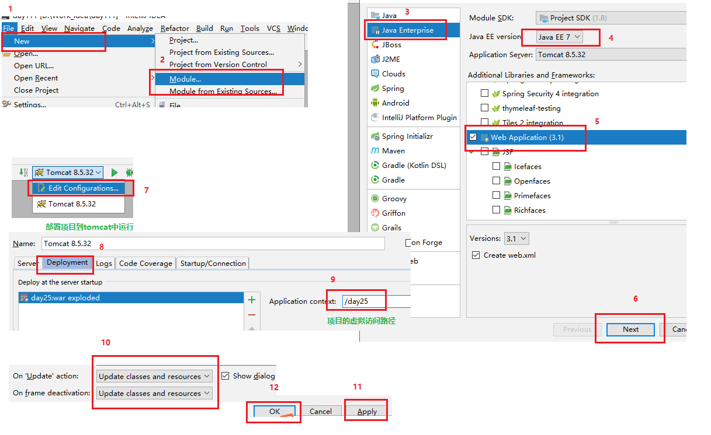

# 学习目标 

```java
1. 能够理解软件的架构
	C/S架构：Client/Server 客户端/服务器。要求客户端电脑安装一个客户端程序。
		常见应用：QQ，迅雷，360，旺旺 等
	BS架构:使用浏览器作为客户端,访问服务器
		常见应用：网银系统，淘宝，京东 12306 等
2. 能够理解WEB资源概念
	  WEB应用服务器中,放进去的任何内容,都成为WEB资源,包含html,css,js,图片,视频...
3. 能够理解WEB服务器
	- 硬件：其实就是一台电脑（这台电脑配置要求很高）。
	- 软件：需要在这台电脑上安装web服务器的软件。
4. 能够运用Tomcat服务器部署WEB项目
	把web项目部署到tomcat下边的webapps文件夹下
	D:\develop\apache-tomcat-8.5.31\webapps\day22\1.txt
	就可以使用URL访问项目
	http://localhost:8080/day22/1.txt
5. 能够使用idea配置tomcat方式发布项目
	IDEA开发工具绑定Tomcat
	IDEA创建JavaWeb项目部署Tomcat
	修改web项目发布的路径为tomcat下边的webapps目录
6. 能够使用浏览器开发工具查看HTTP协议请求和响应内容
	谷歌,火狐==>f12
7. 能够理解HTTP协议请求内容
	客户端浏览器发送给服务器的内容
	请求行(get:表单提交的数据),请求头,请求体(get:无 post:表单提交的数据)
8. 能够理解响应行的内容
	服务器发送给客户端浏览器的内容
	响应行(协议版本,状态码),响应头,响应体
```

# 第1章 tomcat服务器

## 1.软件架构

- CS结构的软件
  - C/S架构：Client/Server 客户端/服务器。要求客户端电脑安装一个客户端程序。
  - 常见应用：QQ，迅雷，360，旺旺 等
    - 优点：
      - 用户体验好，效果炫
      - 对信息安全的控制较强
      - 应用服务器运行数据负荷较轻，部分计算功能在客户端完成。
    - 缺点：
      - 占用硬盘空间
      - 维护麻烦
      - 安装使用依赖其他条件
- **BS结构的软件**
  - 使用浏览器作为客户端,访问服务器
  - 常见应用：网银系统，淘宝，京东 12306 等
    - 优点：
      - 维护和升级简单，无缝升级。
      - 不用必须安装程序，操作系统内置了浏览器。
    - 缺点：
      - 动画效果受浏览器限制
      - 对信息安装控制较差。例如：网银就需要使用U盾，在浏览器端加密。
      - 应用服务器运行数据负荷较重。大部分计算都在服务器端，增加服务器压力。使用Ajax可以改善部分用户体验。

## 2.web资源的类别

- 静态资源：指web页面中供人们浏览的数据始终是不变。比如：HTML、CSS、JS、图片、多媒体。

  

- 动态资源：指web页面中供人们浏览的数据是由程序产生的，不同时间点访问web页面看到的内容各不相同。比如：JSP/Servlet、ASP、PHP

  

  

- 总结：

  - 静态资源的数据都是写死在页面上的固定不变。 
  - 动态资源浏览器访问的结果是变化的（动态web资源你的数据都是程序读取数据库、xml等文件生成的数据）

## 3.URL 请求路径

URL （Uniform Resource Locator） ，**统一资源定位符**是对互联网上资源位置的一种表示，互联网上的每个文件都有一个唯一的URL。

- 完整格式如下

```http
协议://域名:端口号/资源位置?参数=值

* 协议，http、https、ftp等
* 域名，域名或IP地址，都可以访问WEB资源
* 端口号，程序必须使用端口号，才可以让另一个计算机访问。http协议的默认端：80
* 资源位置，用于描述WEB资源再服务器上的位置。
* 参数=值，浏览器和服务器交互传递的数据
```

- 例如：

```http
常见路径
http://www.itcast.cn:80/subject/javaeezly/index.html
http://localhost:8080/day02/index.html
https://news.163.com/20/1125/07/FS8U27PF0001899O.html?clickfrom=w_yw
百度搜索“传智播客”
https://www.baidu.com/s?cl=3&wd=%B4%AB%D6%C7%B2%A5%BF%CD
```

## 4.WEB通信

WEB采用B/S通信模式，通过超文本传送协议(HTTP, Hypertext transport protocol)进行通信。通过浏览器地址栏编写URL，向服务器发送一个请求，服务器端根据请求进行相应的处理，处理完成之后，会向浏览器作出一个响应，及将服务器端资源发送给浏览器。


## 5.WEB服务器

- 服务器：

  - 硬件：其实就是一台电脑（这台电脑配置要求很高）。
  - 软件：需要在这台电脑上安装web服务器的软件。

- **常见的服务器软件介绍** 

  J2EE 企业级开发Java规范(13个)。标准规范包括：servlet、jsp、jdbc、xml、jta、javamail等。在java中规范就是接口。J2EE又称为JavaEE。
  WEB服务器对JavaEE规范部分或全部支持（实现），也就是WEB服务器实现部分或全部接口。

  1.**WebLogic** 

  Oracle公司的产品，是目前应用最广泛的Web服务器，支持J2EE所有规范。WebLogic是用于 

  开发、集成、部署和管理大型分布式Web应用、网络应用和数据库应用的Java应用服务器。 

  2.**WebSphere** 

   IBM公司的WebSphere，支持JavaEE所有规范。WebSphere 是随需应变的电子商务时代 

  的最主要的软件平台，可用于企业开发、部署和整合新一代的电子商务应用。 

  3.**Glass Fish** 

   最早是Sun公司的产品，后来被Oracle收购，开源，中型服务器。 

  4.**JBoss** 

   JBoss公司产品，开源，支持JavaEE规范，占用内存、硬盘小，安全性和性能高。 

  5.**Tomcat** 

   中小型的应用系统，**免费**开源，支持JSP和Servlet。 

  注意：今天我们学习和使用的是tomcat服务器


## 6.Tomcat软件

### 1.1 Tomcat基本概述： 

Tomcat服务器是一个免费的开放源代码的Web应用服务器。Tomcat是Apache软件基金会（Apache 

Software Foundation）的Jakarta项目中的一个核心项目，由Apache、Sun和其他一些公司及个人共同 

开发而成。由于有了Sun的参与和支持，最新的Servlet 和JSP规范总是能在Tomcat中得到体现。 

因为Tomcat技术先进、性能稳定，而且免费，因而深受Java爱好者的喜爱并得到了部分软件开发商 

的认可，是目前比较流行的Web应用服务器。 

### 1.2 Tomcat服务器软件下载

1. 先去官网下载：http://tomcat.apache.org/，选择tomcat8版本（红框所示）：

   

    tar.gz 文件 是linux操作系统下的安装版本 

    exe文件是window操作系统下的安装版本 

    zip文件是window操作系统下压缩版本（我们选择zip文件） 

2. 选择要下载的文件（红框所示）：

   

3. 下载完成：

   

### 1.3 Tomcat软件的安装(必须会)

  Tomcat软件完全由Java语言编写的,运行需要环境,配置环境变量JAVA＿HOME


  Tomcat软件解压缩,可以是任意目录(**不能包含中文,空格,特殊符号**)

###   1.4 **Tomcat软件的目录结构**


### 1.5 Tomcat软件启动和访问

- 开启Tomcat
  - 解压缩目录bin,命令startup.bat
  - 访问Tomcat,访问地址 URL  协议名称://服务器IP地址:端口号
  - http://localhost:8080  可以看到一只猫,Tomcat是正常使用
  - 看到页面在那里 Tomcat目录下/webapps/ROOT/index.jsp
- 停止Tomcat
  - 解压缩目录bin,命令shutdown.bat
- Tomcat启动失败
  - JAVA_HOME环境变量问题,闪退
  - 端口被占用,Tomcat默认端口是8080
  - conf/server.xml可以修改Tomcat端口号

### 1.6 tomcat服务器部署应用的3种方式

**1.在webapps文件夹下面直接发布**

在webapps 下创建自己的目录(以后的访问路径) , 目录下可以放置自己的内容. 以后的访问路径就为

http://localhost:8080/目录/文件的名称.后缀

404 : 表示找不到资源 . 写错路径 .

访问: webapps/http/form.html页面,地址怎么写  http://localhost:8080/http/form.html

**2.使用虚拟路径的方式发布项目（两种方式）**

发布tomcat以外的路径 . 目录不一定非要放在webapps下

**方式1:**  在conf中找到server.xml 文件 加入如下这句话即可

<Context path="发布路径, 别名" docBase="文件访问路径"/> 


注：这一种方式有一个缺点，就是server.xml是tomcat核心文件一旦出错，导致整个tomcat无法启动。

**方式2:**  解决问题  在conf中配置内容  , 进入conf 进入Catalina 目录 进入到最后一层子集目录 创建一个xml文件  配置路径即可


<Context docBase="文件访问路径"/>

没有别名的方式 , 以xml文件的名称作为了别名 访问路径


虚拟路径发布2 好处在于: 如果有一个配置错误 不影响 其他项目的运行

### 1.7 IDEA开发工具绑定Tomcat(非常重要)


### 1.8 IDEA创建JavaWeb项目部署Tomcat(非常重要)




### 1.9 修改web项目发布的路径(非常重要)

**存在的问题,在webapps中并没有我们部署的项目**


 Artifacts，它的作用是整合编译后的 java 文件，资源文件等，有不同的整合方式，比如war、jar、war exploded 等，对于 Module 而言，有了 Artifact 就可以部署到 web 容器中了。


### 2.0 java中创建web项目部署到tomcat服务器中目录结构的区别


### 2.1 WEB资源

  WEB应用服务器中,放进去的任何内容,都成为WEB资源,包含html,css,js,图片,视频...


# 第2章 HTTP协议

## 1.HTTP协议介绍

  网络程序开发,客户端和服务器实现数据交换,通信双方必须遵守通信协议.

  HTTP协议,超文本传输协议,互联网程序开发基础,使用的版本1.1

- HTTP/1.0，发送请求，创建一次连接，获得一个web资源，连接断开。

- HTTP/1.1，发送请求，创建一次连接，获得多个web资源，连接断开。

  HTTP协议内容规定了通信双方需要遵守的内容

  HTTP的请求: 客户端主动向服务器发送数据的请求

  HTTP响应:服务器将数据发回到客户端

## 2.准备好一个表单,部署到tomcat的webapps中


```html
<!DOCTYPE html>
<html>
	<head>
		<meta charset="UTF-8">
		<title>form表单</title>
	</head>
	<body>
		<h1>get请求方式</h1>
		<form action="#" method="get">
			用户名:<input type="text" name="username" placeholder="请输入用户名"/><br />
			密码:<input type="password" name="password" placeholder="请输入密码" /><br />
			<input type="submit" value="提交" />
		</form>
		<h1>post请求方式</h1>
		<form action="#" method="post">
			用户名:<input type="text" name="username" placeholder="请输入用户名"/><br />
			密码:<input type="password" name="password" placeholder="请输入密码" /><br />
			<input type="submit" value="提交" />
		</form>
	</body>
</html>
```


## 2.HTTP请求内容(GET)重要

- 请求行
  - 提交方式
  - 请求服务器的地址和参数
  - 协议版本
- 请求头
  - 键值对数据,客户端指导服务器信息
- 无请求体

## 3.HTTP请求内容(POST)重要

- 请求行
  - 提交方式
  - 服务器地址
  - 协议版本
- 请求头
  - 键值对数据,客户端指导服务器信息
- 请求体
  - POST请求,提交的参数放在请求体中
  - 请求头和请求体之间有空行分割


## 4.HTTP响应内容 重要

- 响应行
  - 协议版本
  - 状态码
    - 200 请求成功(找到了服务器上的资源)
    - 302 请求重定向
    - 304 请求资源没有改变,访问本地缓存文件,不在访问tomcat中的文件,访问的效率高
    - 404 请求的资源不存在,通常是用户路径编写错误，也可能是服务器资源已删除。 
    - 500 服务器内部错误,通常程序抛异常 
- 响应头
  - 指导性信息,服务器指导浏览器,数据格式k:v
- 响应体
  - 页面正文部分,浏览器要显示内容,和响应头有空行分割


注意:

**在浏览器页面中:ctrl+shift+delete==>清除历史记录和缓存文件**

# 第3章 Servlet对象

## 1.Servlet技术概述

  JavaEE技术有13规范,其中之一就是Servlet规范,本质就是接口

  Servlet是JavaEE技术平台的规范,Servlet 运行在服务端的Java小程序只能运行在WEB服务器(Tomcat).

 Servlet是JavaWeb三大组件之一（Servlet、Filter、Listener），且最重要。

  **作用: 接收请求,进行响应**

  广义的Servlet: Servlet接口所有实现类

  狭隘的Servlet: 专门指的是Servlet接口

## 2.Servlet程序快速入门(重点)

  实现Servlet程序入门,Servlet成为Java服务器端程序,由客户端浏览器访问的.

- 实现步骤:
  - 定义类实现接口Servlet
  - 重写接口中的全部抽象方法
  - 在web.xml中配置Servlet

```java
package com.itheima.demo02Servlet;

import javax.servlet.*;
import java.io.IOException;
import java.io.PrintWriter;

/*
    Servlet规范,本质就是接口,由JavaEE提供
    Tomcat服务器实现Servlet接口
    使用步骤:
        1.定义一个实现类,实现Servlet接口
        2.重写Servlet接口中5个抽象方法
        3.在当前项目(day22)的web.xml文件中对Servlet进行配置
 */
public class Demo01Servlet implements Servlet{
    @Override
    public void init(ServletConfig servletConfig) throws ServletException {

    }

    @Override
    public ServletConfig getServletConfig() {
        return null;
    }

    @Override
    public void service(ServletRequest servletRequest, ServletResponse servletResponse) throws ServletException, IOException {
        //接收客户端的请求servletRequest:获取客户端发送的数据(请求行,请求头,请求体)
        //http://localhost:8080/day22/demo01?username=jack&password=1234
        System.out.println("客户端访问了Demo01Servlet!");
        String username = servletRequest.getParameter("username");
        String password = servletRequest.getParameter("password");
        System.out.println(username+password);

        //给客户端回复响应servletResponse:给客户端发送的数据(响应行,响应头,响应头)
        PrintWriter pw = servletResponse.getWriter();
        pw.write("haha");
    }

    @Override
    public String getServletInfo() {
        return null;
    }

    @Override
    public void destroy() {

    }
}
```

web.xml

```xml
<?xml version="1.0" encoding="UTF-8"?>
<web-app xmlns="http://xmlns.jcp.org/xml/ns/javaee"
         xmlns:xsi="http://www.w3.org/2001/XMLSchema-instance"
         xsi:schemaLocation="http://xmlns.jcp.org/xml/ns/javaee http://xmlns.jcp.org/xml/ns/javaee/web-app_3_1.xsd"
         version="3.1">
    <!--
        对Demo01Servlet进行配置
    -->
    <servlet>
        <!--
            servlet-name:给Demo01Servlet类起一个名字
        -->
        <servlet-name>demo01</servlet-name>
        <!--
            servlet-class:Demo01Servlet的全类名(包名+类名)
        -->
        <servlet-class>com.itheima.demo02Servlet.Demo01Servlet</servlet-class>
    </servlet>
    
    <servlet-mapping>
        <!--
            servlet-name:给Demo01Servlet类起一个名字
            此名字必须和上边servlet里边的写的名字是一致的
        -->
        <servlet-name>demo01</servlet-name>
        <!--
            url-pattern:配置Demo01Servlet的虚拟访问路径 /demo01 路径前必须写/
        -->
        <url-pattern>/demo01</url-pattern>
    </servlet-mapping>
</web-app>
```

