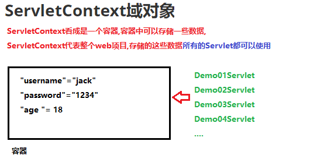

# 学习目标

```java
1. 能够使用idea编写servlet
	1.创建实现类实现Servlet接口(Tomcat提供)
    2.在实现类中重写Servlet接口中的5个抽象方法
    3.在当前项目下边的web.xml文件中对Servlet进行配置
2. 能够使用注解开发servlet(省略xml文件配置)
	@WebServlet(urlPatterns="/Servlet虚拟访问路径")
3. 能够说出servlet生命周期方法执行流程
	init方法:Servlet对象的初始化方法,Servlet对象被创建的时候调用,只执行一次
		Servlet对象什么时候被创建
		- Servlet默认第一次访问的时候,对象被创建
		- Tomcat服务器启动的时候创建对象,需要修改web.xml (一般不配置)
		  <load-on-startup>5</load-on-startup>
	service方法:客户端访问一次,执行一次	
	destory方法:Servlet对象销毁之前调用	
		Servlet对象什么时候销毁
		- 停止Tomcat服务器
		- 重新部署web项目,会先销毁所有的Servlet对象
		- WEB项目从服务器移除
4. 能够说出servlet运行原理(看图)
5. 能够使用servletcontext域对象
	获取:
	ServletContext context = getServletContext();
	方法:
	1.使用ServletContext对象,获取web.xml配置文件中的初始化参数(了解)
		String value = context.getInitParameter("heima");//根据key获取value
	2.使用ServletContext对象,获取WEB应用程序下任意资源的绝对路径(重点)
		//获取web文件夹下的a.txt的绝对路径
		String aPath = context.getRealPath("a.txt");//Tomcat的webapps中
		D:\develop\apache-tomcat-8.5.31\webapps\day23\a.txt
	3.作为域对象使用:作用域在整个模块中(项目中)(重点)
		- 向域对象存储数据: setAttribute(String key, Object value)
		- 取出域对象数据: Object getAttribute(String key)
		- 移除域对象数据: removeAttribute(String key)
6.能够完成案例统计访问次数
	//重写父类的init方法(只在用户第一次访问Servlet的时候执行)
        @Override
        public void init() throws ServletException {
            //在init方法中,在ServletContext对象存储一个变量count,记录用户的访问次数
            ServletContext context = getServletContext();
            context.setAttribute("count",1);
        }

        protected void doPost(HttpServletRequest request, HttpServletResponse response) throws ServletException, IOException {
            //当用户访问的时候,会执行doGet方法,取出count变量,给用户响应回去
            ServletContext context = getServletContext();
            int count = (int)context.getAttribute("count");
            response.getWriter().write("welcome\t"+count);
            //在把count变量++
            count++;
            //把增加完之后的count在存储到ServletContext对象中(更新count)
            context.setAttribute("count",count);
        }
```

# 第1章 **Servlet入门**

## 1.Servlet技术概述

  JavaEE技术有13规范,其中之一就是Servlet规范,本质就是接口

  Servlet是JavaEE技术平台的规范,Servlet 运行在服务端的Java小程序只能运行在WEB服务器(Tomcat).

 Servlet是JavaWeb三大组件之一（Servlet、Filter、Listener），且最重要。

  **作用: 接收请求,进行响应**

  广义的Servlet: Servlet接口所有实现类

  狭隘的Servlet: 专门指的是Servlet接口

## 2.Servlet程序快速入门(重点)

  实现Servlet程序入门,Servlet成为Java服务器端程序,由客户端浏览器访问的.

- 实现步骤:
  - 定义类实现接口Servlet
  - 重写接口中的全部抽象方法
  - 在web.xml中配置Servlet

```java
package com.itheima.demo01Servlet;

import javax.servlet.*;
import java.io.IOException;
import java.io.PrintWriter;

/*
    Servlet是JavaEE的13个规范之一
    Tomcat服务器支持Servlet
    实现的步骤:
        1.创建实现类,实现Servlet接口
        2.在实现类中,重写Servlet接口中所有的抽象方法(5个)
        3.在当前项目的web.xml文件中对Servlet进行配置
 */
public class Demo01Servlet implements Servlet{
    @Override
    public void init(ServletConfig servletConfig) throws ServletException {

    }

    @Override
    public ServletConfig getServletConfig() {
        return null;
    }

    @Override
    public void service(ServletRequest servletRequest, ServletResponse servletResponse) throws ServletException, IOException {
        //servletRequest对象:接收客户端的请求(请求行,请求头,请求体)
        System.out.println("访问了Demo01Servlet");
        //servletResponse对象:给客户端进行响应(响应行,响应头,响应体)
        PrintWriter pw = servletResponse.getWriter();
        pw.write("hello");
    }

    @Override
    public String getServletInfo() {
        return null;
    }

    @Override
    public void destroy() {

    }
}
```

web.xml

```xml
<?xml version="1.0" encoding="UTF-8"?>
<web-app xmlns="http://xmlns.jcp.org/xml/ns/javaee"
         xmlns:xsi="http://www.w3.org/2001/XMLSchema-instance"
         xsi:schemaLocation="http://xmlns.jcp.org/xml/ns/javaee http://xmlns.jcp.org/xml/ns/javaee/web-app_3_1.xsd"
         version="3.1">
    <!--
        对Demo01Servlet进行配置
    -->
    <servlet>
        <servlet-name>demo01</servlet-name>
        <servlet-class>com.itheima.demo01Servlet.Demo01Servlet</servlet-class>
    </servlet>
    <servlet-mapping>
        <servlet-name>demo01</servlet-name>
        <!--
            url-pattern:给Demo01Servlet配置的虚拟访问路径,这个路径在tomcat中是没有
        -->
        <url-pattern>/demo01</url-pattern>
    </servlet-mapping>
</web-app>
```

## 3.Servlet程序执行原理(扩展-了解)


# 第2章 Servlet生命周期

```java
init:初始化的方法,创建Servlet对象的时候会被调用,只执行一次
	1.Servlet第一次被访问的时候会执行
	2.在web.xml中配置tomcat启动的时候自动的创建Servlet对象
	<load-on-startup>5</load-on-startup>
service:访问一次Servlet,调用一次service方法
destroy:销毁的方法,只执行一次
	1.停止tomcat服务器会销毁所有Servlet对象
	2.重新部署web项目,会先把之前创建Servlet全部销毁,在访问Servlet会创建新的Servlet对象
```

```java
package com.itheima.demo01Servlet;

import javax.servlet.*;
import java.io.IOException;

/*
    Servlet生命周期
 */
public class Demo02LifeServlet implements Servlet{
    @Override
    public void init(ServletConfig servletConfig) throws ServletException {
        /*
            有两种情况
            1.使用URL访问Servlet
            2.在web.xml文件中配置Tomcat启动自动创建Servlet对象
         */
        System.out.println("创建Demo02LifeServlet对象,调用init方法,只执行一次!");
    }

    @Override
    public ServletConfig getServletConfig() {
        return null;
    }

    @Override
    public void service(ServletRequest servletRequest, ServletResponse servletResponse) throws ServletException, IOException {
        System.out.println("访问一次Demo02LifeServlet,就会执行一次service方法!");
    }

    @Override
    public String getServletInfo() {
        return null;
    }

    @Override
    public void destroy() {
        /*
            有两种情况会销毁Servlet
            1.停止Tomcat服务器
            2.重新部署项目
         */
        System.out.println("销毁Servlet,执行destroy方法,只执行一次!");
    }
}
```

web.xml

```xml
<!--
    对Demo02LifeServlet进行配置
-->
<servlet>
    <servlet-name>demo02</servlet-name>
    <servlet-class>com.itheima.demo01Servlet.Demo02LifeServlet</servlet-class>
    <!--
        load-on-startup:配置Servlet在启动Tomcat服务器的创建Demo02LifeServlet对象
        就会执行init方法的方法
        值就是一个整数,值越小优先级越高
    -->
    <!--<load-on-startup>5</load-on-startup>-->
</servlet>
<servlet-mapping>
    <servlet-name>demo02</servlet-name>
    <!--
        url-pattern:给Demo02LifeServlet配置的虚拟访问路径,这个路径在tomcat中是没有
    -->
    <url-pattern>/demo02</url-pattern>
</servlet-mapping>
```

# 第3章 Servlet的配置

## 1.Servlet的配置

```java
1.完全匹配: /demo03
2.目录名匹配: /aaa/bbb/*
3.后缀名匹配:  *.abc
4.缺省匹配  以上三种路径都没有匹配成功的时候 默认执行缺省匹配  语法: /  (我们不写)
   tomcat默认自带缺省匹配
注意:
	目录名匹配和后缀名匹配不能一起使用,会有冲突
    /aaa/bbb/*.abc	   
```

```java
package com.itheima.demo01Servlet;

import javax.servlet.*;
import java.io.IOException;

/*
    Servlet的配置
 */
public class Demo03ConfigServlet implements Servlet{
    @Override
    public void init(ServletConfig servletConfig) throws ServletException {

    }

    @Override
    public ServletConfig getServletConfig() {
        return null;
    }

    @Override
    public void service(ServletRequest servletRequest, ServletResponse servletResponse) throws ServletException, IOException {
        System.out.println("访问了Demo03ConfigServlet!");
    }

    @Override
    public String getServletInfo() {
        return null;
    }

    @Override
    public void destroy() {

    }
}
```

```xml
<!--
    对Demo03ConfigServlet进行配置
-->
<servlet>
    <!--
        servlet-name:给Demo03ConfigServlet起一个名字,可以是任意的名字
    -->
    <servlet-name>demo03</servlet-name>
    <!--
        servlet-class:全类名(包名+类名)
        作用:tomcat使用全类名通过反射技术创建Demo03ConfigServlet对象
    -->
    <servlet-class>com.itheima.demo01Servlet.Demo03ConfigServlet</servlet-class>
</servlet>
<servlet-mapping>
    <!--
        servlet-name:给Demo03ConfigServlet起一个名字,必须和servlet里边servlet-name名字一致
    -->
    <servlet-name>demo03</servlet-name>
    <!--
        url-pattern:给Demo03ConfigServlet配置的虚拟访问路径,这个路径在tomcat中是没有
        1.完全匹配(重点): /demo03  URL路径中写的Servlet虚拟路径必须和url-pattern配置的是一样的
            URL: http://localhost:8080/day23/demo03 正确
            URL: http://localhost:8080/day23/dem03 错误
        2.目录名匹配: /目录名(任意)/* /aaa/bbb/*
            URL: http://localhost:8080/day23/aaa/bbb/任意
            URL: http://localhost:8080/day23/aaa/bbb/abc  正确
            URL: http://localhost:8080/day23/aaa/bbb/demo03  正确
            URL: http://localhost:8080/day23/aaa/bbb/www    正确
            URL: http://localhost:8080/day23/aaa/bb/www    错误
            URL: http://localhost:8080/day23/bbb/www    错误
        3.后缀名匹配: *.后缀名 *.abc
            URL: http://localhost:8080/day23/任意.abc
            URL: http://localhost:8080/day23/afdsafafd.abc  正确
            URL: http://localhost:8080/day23/adsfasdfas.abc  正确
            URL: http://localhost:8080/day23/asdfadsfasdfasdfadsf.abc  正确
            URL: http://localhost:8080/day23/aaa.ab  错误
        4.缺省匹配  以上三种路径都没有匹配成功的时候 默认执行缺省匹配  语法: /  (我们不写)
           tomcat默认自带缺省匹配
        注意:
            目录名匹配和后缀名匹配不能一起使用,会有冲突
            /aaa/bbb/*.abc
    -->
    <url-pattern>/demo03</url-pattern>
    <!--<url-pattern>/aaa/bbb/*</url-pattern>-->
    <!--<url-pattern>*.abc</url-pattern>-->
</servlet-mapping>
```

**apache-tomcat-8.5.31\conf\web.xml文件中**


## 2.tomcat中全局的web.xml文件(扩展-了解)

```xml
<!-- 
	DefaultServlet:缺省的Servlet
	接盘侠:当我们访问Servlet的时候,Servlet的路径书写错误
	就会访问DefaultServlet,在DefaultServlet中给我们返回错误信息 404 500...
 -->
<servlet>
	<servlet-name>default</servlet-name>
	<servlet-class>org.apache.catalina.servlets.DefaultServlet</servlet-class>
	<init-param>
		<param-name>debug</param-name>
		<param-value>0</param-value>
	</init-param>
	<init-param>
		<param-name>listings</param-name>
		<param-value>false</param-value>
	</init-param>
	<load-on-startup>1</load-on-startup>
</servlet>

<!-- The mapping for the default servlet -->
<servlet-mapping>
	<servlet-name>default</servlet-name>
	<url-pattern>/</url-pattern>
</servlet-mapping>

<!-- 
	Tomcat支持JavaEE的13个规范中的两个:Servlet,jsp
	jsp的本质就是一个Servlet
 -->
<servlet>
	<servlet-name>jsp</servlet-name>
	<servlet-class>org.apache.jasper.servlet.JspServlet</servlet-class>
	<init-param>
		<param-name>fork</param-name>
		<param-value>false</param-value>
	</init-param>
	<init-param>
		<param-name>xpoweredBy</param-name>
		<param-value>false</param-value>
	</init-param>
	<load-on-startup>3</load-on-startup>
</servlet>

<!-- The mappings for the JSP servlet -->
<servlet-mapping>
	<servlet-name>jsp</servlet-name>
	<url-pattern>*.jsp</url-pattern>
	<url-pattern>*.jspx</url-pattern>
</servlet-mapping>

<!-- 
	session-config:配置session对象的默认存储时间,时间单位是分钟
	登录的时候:输入用户名和密码,会把用户的用户名和密码存储到session对象中
	如果我们不使用页面,默认存储用户名和密码的时间就是30分钟
 -->
<session-config>
	<session-timeout>30</session-timeout>
</session-config>

<!-- 
	mime-mapping:配置文件的mime类型
	<extension>avi</extension>:写的文件的后缀名  我的祖国.avi 
		文件的后缀名浏览器是不认识的
	<mime-type>video/x-msvideo</mime-type>:写的文件的类型,是给浏览器看的
		当浏览器看到类型是video的时候,就会以视频的方式播放文件
 -->
<mime-mapping>
	<extension>avi</extension>
	<mime-type>video/x-msvideo</mime-type>
</mime-mapping>

<mime-mapping>
	<extension>txt</extension>
	<mime-type>text/plain</mime-type>
</mime-mapping>

<mime-mapping>
	<extension>jpg</extension>
	<mime-type>image/jpeg</mime-type>
</mime-mapping>

<!-- 
	welcome-file-list:欢迎页面列表
	http://localhost:8080/day23 当我们访问当前项目的时候,默认会从上到下依次打开欢迎页面
 -->
<welcome-file-list>
	<welcome-file>index.html</welcome-file>
	<welcome-file>index.htm</welcome-file>
	<welcome-file>index.jsp</welcome-file>
</welcome-file-list>
```

自己项目的web.xml文件

```xml
<?xml version="1.0" encoding="UTF-8"?>
<web-app xmlns="http://xmlns.jcp.org/xml/ns/javaee"
         xmlns:xsi="http://www.w3.org/2001/XMLSchema-instance"
         xsi:schemaLocation="http://xmlns.jcp.org/xml/ns/javaee http://xmlns.jcp.org/xml/ns/javaee/web-app_3_1.xsd"
         version="3.1">

    <!--
      配置的session的超时访问时间,默认是30分钟
      当我们项目自己的web.xml文件和tomcat中全局的web.xml文件配置的内容是一致的
      优先使用自己的
   -->
    <session-config>
        <session-timeout>1</session-timeout>
    </session-config>
</web-app>
```

# 第4章 Servlet的体系结构

## 1.IDEA创建Servlet(重要)

.bmp)

```java
package com.itheima.demo01Servlet;

import javax.servlet.ServletException;
import javax.servlet.http.HttpServlet;
import javax.servlet.http.HttpServletRequest;
import javax.servlet.http.HttpServletResponse;
import java.io.IOException;

public class Demo04Servlet extends HttpServlet {
    /*
        doPost方法对应浏览器的post请求方式
        <form  action="请求路径"  method="post">
        问题:以后在开发代码的时候,我们知道用户是使用get还是post请求方式吗?
        解决:可以在doPost方法中调用doGet方法|或者在doGet方法中调用doPost方法
        保证:无论用户使用get请求方式还是post请求方式,都可以执行到doPost方法
     */
    protected void doPost(HttpServletRequest request, HttpServletResponse response) throws ServletException, IOException {
        System.out.println("访问了Demo04Servlet的doPost方法!");
    }

    /*
        doPost方法对应浏览器的get请求方式
        如果没有明确的在form标签中写post请求方式,默认全是get请求方式
     */
    protected void doGet(HttpServletRequest request, HttpServletResponse response) throws ServletException, IOException {
        System.out.println("访问了Demo04Servlet的doGet方法!");
        doPost(request,response);
    }
}
```

## 2.继承HttpServlet原理


## 3.修改Servlet模版(了解)

.bmp)

## 4.ServletConfig接口(扩展-了解)

```java
ServletConfig接口:代表Servlet配置对象(web.xml中配置servlet)
    有一个Servlet就有一个ServletConfig对象
ServletConfig接口的实现类对象由tomcat引擎创建,我们可以直接使用
获取ServletConfig对象:
	使用ServletConfig getServletConfig()方法
ServletConfig对象作用:
	1.获取web.xml中配置的Servlet名称  <servlet-name>demo05</servlet-name>
		String getServletName()
	2.获取Servlet的初始化参数,String getInitParameter("键名")
	3.获取Servlet的所有初始化参数的name名称
		Enumeration<String> getInitParameterNames();
		Enumeration:向量枚举,是最早期的迭代器(jdk1.0)
			boolean hasMoreElements()  判断有没有下一个元素
			E nextElement()  取出下一个元素
	4.获取ServletContext域对象
		ServletContext getServletContext()
```

```java
package com.itheima.demo01Servlet;

import javax.servlet.ServletConfig;
import javax.servlet.ServletContext;
import javax.servlet.ServletException;
import javax.servlet.http.HttpServlet;
import javax.servlet.http.HttpServletRequest;
import javax.servlet.http.HttpServletResponse;
import java.io.IOException;
import java.util.Enumeration;

public class Demo05Servlet extends HttpServlet {
    protected void doPost(HttpServletRequest request, HttpServletResponse response) throws ServletException, IOException {
        /*
            获取ServletConfig对象:使用ServletConfig getServletConfig()方法
         */
        ServletConfig config = getServletConfig();
        System.out.println(config);//org.apache.catalina.core.StandardWrapperFacade@7d5ab0cb

        //1.获取web.xml中配置的Servlet名称  <servlet-name>demo05</servlet-name>
        String servletName = config.getServletName();
        System.out.println(servletName);//demo05

        //2.获取Servlet的初始化参数,String getInitParameter("键名")
        String h1 = config.getInitParameter("h1");
        System.out.println(h1);//haha
        String h2 = config.getInitParameter("h2");
        System.out.println(h2);//hehe
        System.out.println("-----------------------------------");
        //3.获取Servlet的所有初始化参数的name名称
        Enumeration<String> en = config.getInitParameterNames();
        while (en.hasMoreElements()){
            String name = en.nextElement();
            String value = config.getInitParameter(name);
            System.out.println(name+"\t"+value);
        }
        //4.获取ServletContext域对象
        ServletContext context = config.getServletContext();
        System.out.println(context);//org.apache.catalina.core.ApplicationContextFacade@6728151c
    }

    protected void doGet(HttpServletRequest request, HttpServletResponse response) throws ServletException, IOException {
        doPost(request, response);
    }
}
```

```xml
<servlet>
    <servlet-name>demo05</servlet-name>
    <servlet-class>com.itheima.demo01Servlet.Demo05Servlet</servlet-class>
    <init-param>
        <param-name>h1</param-name>
        <param-value>haha</param-value>
    </init-param>
    <init-param>
        <param-name>h2</param-name>
        <param-value>hehe</param-value>
    </init-param>
    <init-param>
        <param-name>h3</param-name>
        <param-value>heihei</param-value>
    </init-param>
</servlet>
```

# 第5章 Servlet的路径

我们在开发中，经常在页面上通过表单或超连接向服务器发送请求，如果我们访问的是一个servlet，那 

么这时访问servlet的路径应该如何书写？接下来我们就介绍一下，关于在客户端访问servlet的路径问题. 

在介绍之前，我们先看一下，现阶段我们有多少种方式可以访问服务器端的一个资源 

```java
1 在地址栏上直接输入url 
2 超连接的方式 
3 通过表单方式 
4 通过js的location.href方式
```

对于以上方式，只有表单提交的方式才可能有POST请求，其它的都是GET请求

```java
package com.itheima.demo01Servlet;

import javax.servlet.ServletException;
import javax.servlet.http.HttpServlet;
import javax.servlet.http.HttpServletRequest;
import javax.servlet.http.HttpServletResponse;
import java.io.IOException;

public class Demo06Servlet extends HttpServlet {
    protected void doPost(HttpServletRequest request, HttpServletResponse response) throws ServletException, IOException {
        System.out.println("访问了Demo06Servlet!");
        String username = request.getParameter("username");
        String password = request.getParameter("password");
        System.out.println(username+"\t"+password);
    }

    protected void doGet(HttpServletRequest request, HttpServletResponse response) throws ServletException, IOException {
        doPost(request, response);
    }
}
```

web.xml

```xml
<servlet>
    <servlet-name>demo06</servlet-name>
    <servlet-class>com.itheima.demo01Servlet.Demo06Servlet</servlet-class>
</servlet>
<servlet-mapping>
    <servlet-name>demo06</servlet-name>
    <url-pattern>/demo06</url-pattern>
</servlet-mapping>
```

demo.html

```html
<!DOCTYPE html>
<html lang="zh">
<head>
    <meta charset="UTF-8">
    <title>Servlet路径</title>
</head>
<body>
    <h1>绝对路径访问</h1>
    <h2>带协议的绝对路径访问</h2>
    <a href="http://localhost:8080/day23/demo06">Demo06Servlet</a>
    <h2>不带协议的绝对路径访问</h2>
    <a href="/day23/demo06">Demo06Servlet</a>
    <hr/>
    <h1>相对路径访问</h1>
    <a href="demo06">Demo06Servlet</a>
</body>
</html>
```

创建一个目录main,将demo.html文件复制到hello目录下，再次访问


这时我们在访问时，绝对路径是不会出现问题的，但是当访问相对路径时，页面上报出了404,代表找不 

到资源。 

http://localhost:8080/day23/hello/demo06 超链接打开的Demo01Servlet的路径,多了一个hello

修改为以下路径再次尝试

```html
<!--
    http://localhost:8080/day23/hello/demo06 默认打开的URL路径,多了一个文件名称(hello)
    http://localhost:8080/day23/demo06  Demo06Servlet路径
-->
<a href="../demo06">Demo06Servlet</a>
```

这时，再次访问，会发现访问成功。 

**结论**

 对于我们后续的学习与开发中，我们使用绝对路径会比较多一些，而在使用绝对路径时，我们主要使 

用的是不带协议的绝对路径，而带协议的绝对路径只有在访问站外资源时才会使用。对于相对路径，我 

们需要分析它们的相对关系，所以不建议大家使用。 

# 第6章 ServletContext对象

## 1.ServletContext对象的介绍和获取


```java
ServletContext接口:代表当前的项目
接口的实现类对象由tomcat引擎创建,我们可以直接使用
获取方式:
	1.先获取ServletConfig对象,使用ServletConfig对象中的方法getServletContext获取
		ServletConfig getServletConfig()
		getServletConfig().getServletContext();
	2.在父类GenericServlet直接封装好了一个方法叫getServletContext可以获取
		ServletContext getServletContext()
```

```java
package com.itheima.demo02ServletContext;

import javax.servlet.ServletContext;
import javax.servlet.ServletException;
import javax.servlet.http.HttpServlet;
import javax.servlet.http.HttpServletRequest;
import javax.servlet.http.HttpServletResponse;
import java.io.IOException;

public class Demo01ContextServlet extends HttpServlet {
    protected void doPost(HttpServletRequest request, HttpServletResponse response) throws ServletException, IOException {
        /*
            ServletContext接口:代表当前的项目
         */
        //1.先获取ServletConfig对象,使用ServletConfig对象中的方法getServletContext获取
        ServletContext context01 = getServletConfig().getServletContext();
        System.out.println(context01);//org.apache.catalina.core.ApplicationContextFacade@1fbf0363

        //2.在父类GenericServlet直接封装好了一个方法叫getServletContext可以获取
        ServletContext context02 = getServletContext();
        System.out.println(context02);//org.apache.catalina.core.ApplicationContextFacade@1fbf0363
    }

    protected void doGet(HttpServletRequest request, HttpServletResponse response) throws ServletException, IOException {
        doPost(request, response);
    }
}
```

web.xml

```xml
<servlet>
    <servlet-name>context01</servlet-name>
    <servlet-class>com.itheima.demo02ServletContext.Demo01ContextServlet</servlet-class>
</servlet>
<servlet-mapping>
    <servlet-name>context01</servlet-name>
    <url-pattern>/context01</url-pattern>
</servlet-mapping>
```

## 2.ServletContext对象的中的常用方法

```java
String getMimeType(String file) 获取文件的MIME类型
String getContextPath() 获取web项目请求工程名(项目的虚拟路径)
String getInitParameter(String name) 获取web项目的初始化参数
Enumeration<E> getInitParameterNames() 获取web项目的所有初始化参数的name名称
String getRealPath("资源相对路径")  获取WEB应用程序下任意资源的绝对路径
InputStream getResourceAsStream(String path) 根据WEB项目的文件获取流
```

```xml
<context-param>
    <param-name>name</param-name>
    <param-value>zhangsan</param-value>
</context-param>
```

```java
package com.itheima.demo02ServletContext;

import javax.servlet.ServletContext;
import javax.servlet.ServletException;
import javax.servlet.http.HttpServlet;
import javax.servlet.http.HttpServletRequest;
import javax.servlet.http.HttpServletResponse;
import java.io.IOException;
import java.io.InputStream;
import java.util.Enumeration;

public class Demo02ContextServlet extends HttpServlet {
    protected void doPost(HttpServletRequest request, HttpServletResponse response) throws ServletException, IOException {
        /*
            ServletContext对象的中的常用方法
         */
        //获取ServletContext对象
        ServletContext context = getServletContext();

        //String getMimeType(String file) 获取文件的MIME类型
        String aMineType = context.getMimeType("a.txt");
        System.out.println(aMineType);//text/plain

        String hMimeType = context.getMimeType("demo.html");
        System.out.println(hMimeType);//text/html

        //String getContextPath() 获取web项目请求工程名(项目的虚拟路径)
        String contextPath = context.getContextPath();
        System.out.println(contextPath);//项目的虚拟访问路径/day23

        //String getInitParameter(String name) 获取web项目的初始化参数
        String hm1 = context.getInitParameter("hm1");
        System.out.println(hm1);//nihao
        System.out.println("-----------------");

        //Enumeration<E> getInitParameterNames() 获取web项目的所有初始化参数的name名称
        Enumeration<String> en = context.getInitParameterNames();
        while (en.hasMoreElements()){
            String name = en.nextElement();
            String value = context.getInitParameter(name);
            System.out.println(name+"\t"+value);
        }

        //String getRealPath("资源相对路径")  获取WEB应用程序下任意资源的绝对路径
        //获取web下边a.txt文件的绝对路径
        String aRealPath = context.getRealPath("a.txt");
        System.out.println(aRealPath);//D:\develop\apache-tomcat-8.5.31\webapps\day23\a.txt

        //获取web下边WEB-INF中b.txt的绝对路径
        String bRealPath = context.getRealPath("WEB-INF/b.txt");
        System.out.println(bRealPath);//D:\develop\apache-tomcat-8.5.31\webapps\day23\WEB-INF\b.txt

        //获取src下边c.txt的绝对路径
        String cRealPath = context.getRealPath("WEB-INF/classes/c.txt");
        System.out.println(cRealPath);//D:\develop\apache-tomcat-8.5.31\webapps\day23\WEB-INF\classes\c.txt

        //获取day23下边d.txt的绝对路径:获取不到的,模块下边的内容不会发布到tomcat中的

        //getResourceAsStream(String path) 根据WEB项目的文件获取流
        InputStream is = context.getResourceAsStream("a.txt");
        System.out.println(is);//java.io.ByteArrayInputStream@606e7fc4
    }

    protected void doGet(HttpServletRequest request, HttpServletResponse response) throws ServletException, IOException {
        doPost(request, response);
    }
}
```

web.xml

```xml
<?xml version="1.0" encoding="UTF-8"?>
<web-app xmlns="http://xmlns.jcp.org/xml/ns/javaee"
         xmlns:xsi="http://www.w3.org/2001/XMLSchema-instance"
         xsi:schemaLocation="http://xmlns.jcp.org/xml/ns/javaee http://xmlns.jcp.org/xml/ns/javaee/web-app_3_1.xsd"
         version="3.1">
   <context-param>
        <param-name>hm1</param-name>
        <param-value>nihao</param-value>
    </context-param>
    <context-param>
        <param-name>hm2</param-name>
        <param-value>wohao</param-value>
    </context-param>
    <context-param>
        <param-name>hm3</param-name>
        <param-value>dajiahao</param-value>
    </context-param>

    <servlet>
        <servlet-name>context02</servlet-name>
        <servlet-class>com.itheima.demo02ServletContext.Demo02ContextServlet</servlet-class>
    </servlet>
    <servlet-mapping>
        <servlet-name>context02</servlet-name>
        <url-pattern>/context02</url-pattern>
    </servlet-mapping>
</web-app>
```


## 3.ServletContext域对象

```java
ServletContext对象是一个容器,可以存储数据.
对象有个作用域问题,ServletContext作用域是整个WEB应用程序
- 向域对象存储数据: void setAttribute(String key, Object value)
- 取出域对象数据: Object getAttribute(String key)
- 移除域对象数据:  void removeAttribute(String key)
```



```java
package com.itheima.demo02ServletContext;

import javax.servlet.ServletContext;
import javax.servlet.ServletException;
import javax.servlet.http.HttpServlet;
import javax.servlet.http.HttpServletRequest;
import javax.servlet.http.HttpServletResponse;
import java.io.IOException;

public class Demo03ContextServlet extends HttpServlet {
    protected void doPost(HttpServletRequest request, HttpServletResponse response) throws ServletException, IOException {
        //获取ServletContext域对象
        ServletContext context = getServletContext();

        //向域对象存储数据: void setAttribute(String key, Object value)
        context.setAttribute("username","jack");
        context.setAttribute("password","1234");
        context.setAttribute("age",18);

        //取出域对象数据: Object getAttribute(String key)
        Object username = context.getAttribute("username");
        System.out.println(username);//jack

        int age = (int)context.getAttribute("age");
        System.out.println(age);//18
    }

    protected void doGet(HttpServletRequest request, HttpServletResponse response) throws ServletException, IOException {
        doPost(request, response);
    }
}
```

```java
package com.itheima.demo02ServletContext;

import javax.servlet.ServletContext;
import javax.servlet.ServletException;
import javax.servlet.http.HttpServlet;
import javax.servlet.http.HttpServletRequest;
import javax.servlet.http.HttpServletResponse;
import java.io.IOException;

public class Demo04ContextServlet extends HttpServlet {
    protected void doPost(HttpServletRequest request, HttpServletResponse response) throws ServletException, IOException {
        //获取ServletContext域对象中存储的数据
        ServletContext context = getServletContext();

        Object username = context.getAttribute("username");
        System.out.println(username);//jack

        //移除域对象数据:  void removeAttribute(String key)
        context.removeAttribute("username");

        username = context.getAttribute("username");
        System.out.println(username);//null
    }

    protected void doGet(HttpServletRequest request, HttpServletResponse response) throws ServletException, IOException {
        doPost(request, response);
    }
}
```

web.xml

```xml
<servlet>
    <servlet-name>context03</servlet-name>
    <servlet-class>com.itheima.demo02ServletContext.Demo03ContextServlet</servlet-class>
</servlet>
<servlet-mapping>
    <servlet-name>context03</servlet-name>
    <url-pattern>/context03</url-pattern>
</servlet-mapping>

<servlet>
    <servlet-name>context04</servlet-name>
    <servlet-class>com.itheima.demo02ServletContext.Demo04ContextServlet</servlet-class>
</servlet>
<servlet-mapping>
    <servlet-name>context04</servlet-name>
    <url-pattern>/context04</url-pattern>
</servlet-mapping>
```

## 4.注解开发取代web.xml

**java EE 5(web2.5)版本没有注解开发 6(web3.0)以上的版本支持**

使用@WebServlet注解添加到自己定义的Servlet中的类声明上即可

注解的属性 urlPatterns,属性值就是浏览器的访问地址

```java
@WebServlet(urlPatterns="/Servlet虚拟访问路径")
@WebServlet(urlPatterns="/context5")
```

```java
package com.itheima.demo02ServletContext;

import javax.servlet.ServletException;
import javax.servlet.annotation.WebServlet;
import javax.servlet.http.HttpServlet;
import javax.servlet.http.HttpServletRequest;
import javax.servlet.http.HttpServletResponse;
import java.io.IOException;

@WebServlet(urlPatterns = "/context05")
public class Demo05ContextServlet extends HttpServlet {
    protected void doPost(HttpServletRequest request, HttpServletResponse response) throws ServletException, IOException {
        System.out.println("Demo05ContextServlet执行了!");
    }

    protected void doGet(HttpServletRequest request, HttpServletResponse response) throws ServletException, IOException {
        doPost(request, response);
    }
}
```


## 5.ServletContext对象的空指针异常


```java
package com.itheima.demo02ServletContext;

import javax.servlet.ServletConfig;
import javax.servlet.ServletContext;
import javax.servlet.ServletException;
import javax.servlet.annotation.WebServlet;
import javax.servlet.http.HttpServlet;
import javax.servlet.http.HttpServletRequest;
import javax.servlet.http.HttpServletResponse;
import java.io.IOException;

@WebServlet(urlPatterns = "/context06")
public class Demo06ContextServlet extends HttpServlet {
    //重写GenericServlet类中init方法
    /*@Override
    public void init(ServletConfig config) throws ServletException {
        //什么都不写,不会使用参数config给成员变量config赋值
    }*/
    @Override
    public void init() throws ServletException {
        System.out.println("此代码,无论访问多少次Servlet,只执行一次!");
    }

    protected void doPost(HttpServletRequest request, HttpServletResponse response) throws ServletException, IOException {
        //获取ServletContext对象
        ServletContext context = getServletContext();
        System.out.println(context);
        System.out.println("Demo06ContextServlet执行了!");
    }

    protected void doGet(HttpServletRequest request, HttpServletResponse response) throws ServletException, IOException {
        doPost(request, response);
    }
}
```

## 6.扩展--案例:统计用户访问的次数

```java
package com.itheima.demo02ServletContext;

import javax.servlet.ServletContext;
import javax.servlet.ServletException;
import javax.servlet.annotation.WebServlet;
import javax.servlet.http.HttpServlet;
import javax.servlet.http.HttpServletRequest;
import javax.servlet.http.HttpServletResponse;
import java.io.IOException;

/*
    扩展--案例:统计用户访问的次数
    分析:
        1.在Servlet中重写父类的init方法
        2.在重写的init方法中获取ServletContext域对象
        3.往ServletContext域对象中存储一个统计变量,记录用户的访问次数("count",1)
        4.在doPost方法中获取ServletContext域对象中存储的统计变量
        5.使用response获取写IO流,把统计变量的值写回到浏览器显示(回复响应)
        6.把统计变量++
        7.把增加后的统计变量,在重新存储到ServletContext域对象中(更新)("count",2)("count",3)("count",4)...
 */

@WebServlet(urlPatterns = "/count")
public class Demo07CountServlet extends HttpServlet {
    //1.在Servlet中重写父类的init方法(里边代码只执行一次)
    @Override
    public void init() throws ServletException {
        System.out.println("访问了Demo07CountServlet中的init方法!");
        //2.在重写的init方法中获取ServletContext域对象
        ServletContext context = getServletContext();
        //3.往ServletContext域对象中存储一个统计变量,记录用户的访问次数("count",1)
        context.setAttribute("count",1);
    }

    protected void doPost(HttpServletRequest request, HttpServletResponse response) throws ServletException, IOException {
        System.out.println("访问了Demo07CountServlet中的doPost方法!");
        //4.在doPost方法中获取ServletContext域对象中存储的统计变量
        ServletContext context = getServletContext();
        int count = (int)context.getAttribute("count");
        //5.使用response获取写IO流,把统计变量的值写回到浏览器显示(回复响应)
        response.getWriter().write("welcome\t"+count);//不能直接写整数,需要写字符串
        //6.把统计变量++
        count++;
        //7.把增加后的统计变量,在重新存储到ServletContext域对象中(更新)("count",2)("count",3)("count",4)...
        context.setAttribute("count",count);
    }

    protected void doGet(HttpServletRequest request, HttpServletResponse response) throws ServletException, IOException {
        doPost(request, response);
    }
}
```

