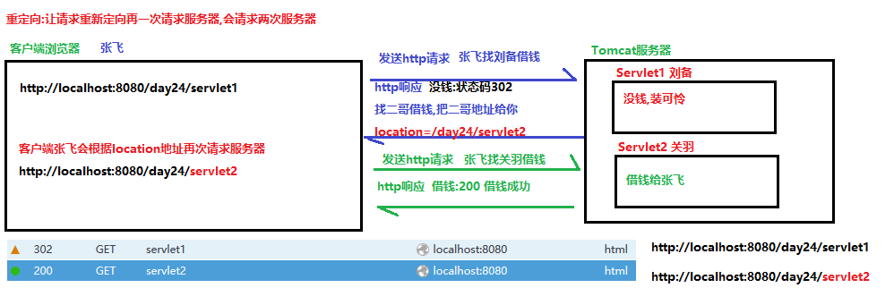
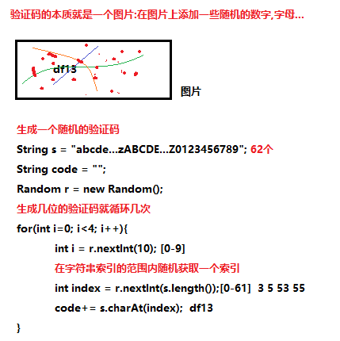
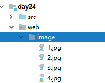
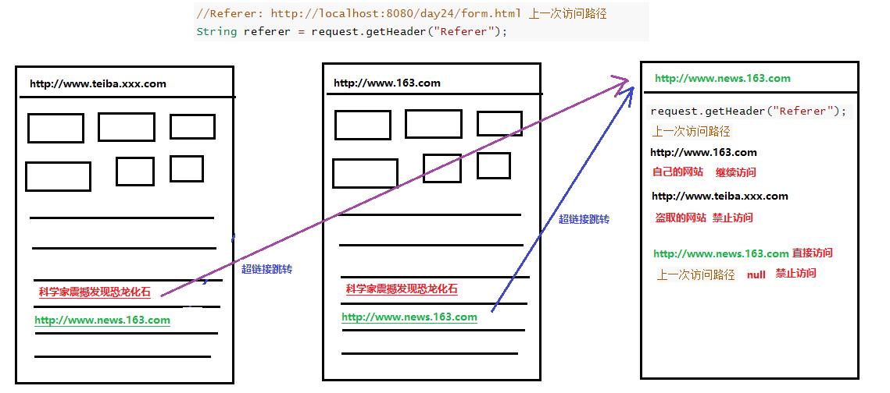
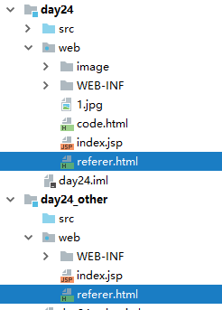
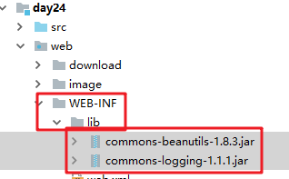
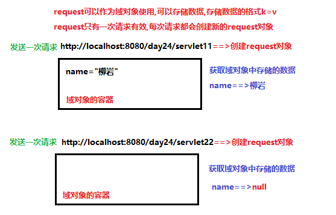
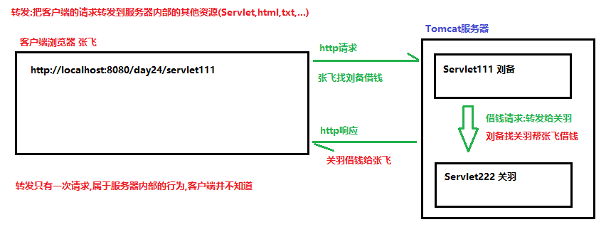
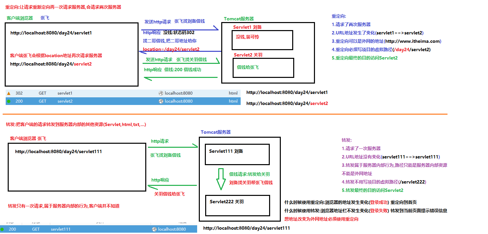

# 学习目标

```java
1. 能够使用Response对象操作HTTP响应内容
	a.设置响应行中的状态码  设置状态码: setStatus(int 状态码)
    b.设置响应头 setHeader(String key,String value)
    c.设置响应体  1.可以使用字符流(文本)  2.可以使用字节流(任意:图片,视频...)    
2. 能够处理响应乱码
	设置response缓冲区字符集为utf-8,通知浏览器以utf-8字符集解码数据
	response.setContentType("text/html;charset=utf-8");
3. 能够完成文件下载案例
	//1.服务器指导客户端,把写回的文件以附件的形式下载,而不是直接打开
    //                    文件内容                 附件             文件名称
    response.setHeader("Content-Disposition","attachment;filename=aaa.jpg");
4. 能够使用Request对象获取HTTP协议请求内容
	a.获取请求行中内容
		String getMethod() 获取客户端的请求方式 (GET,POST)
    	String getContextPath() 获取WEB应用名称(项目虚拟访问路径)
    b.获取请求头中的内容
    	- String getHeader(String key) 根据key获取value值
		- Enumeration getHeaderNames()  获取所有的请求头的键
	c.获取请求参数(最重要)
    	- String getParameter("表单中的name值")获取指定的请求参数
        - String[] getParameterValues("表单中的name值")获取参数中的一键多值
        - Map<String,String[]> getParameterMap()获取提交的所有参数
5. 能够处理HTTP请求参数的乱码问题
	request.setCharacterEncoding("utf-8");
6. 能够使用Request域对象
	- 向域对象存储数据: void setAttribute(String key, Object value)
    - 取出域对象数据: Object getAttribute(String key)
    - 移除域对象数据:  void removeAttribute(String key)
7. 能够使用Request对象做请求转发
	request.getRequestDispatcher("download.html").forward(request,response);
	request.getRequestDispatcher("/servlet222").forward(request,response);
8.能够使用response对象实现重定向
	response.sendRedirect("/day24/download.html");
	response.sendRedirect("/day24/servlet2");
```

# 第1章 response对象操作响应信息

## 1.1 Response对象概述

  负责对浏览器进行响应的对象

  ServletResponse接口,HttpServletResponse接口继承自ServletResponse

 使用的是子接口HttpServletResponse,此接口对象由Tomcat引擎提供

 可以实现对客户端的响应, 响应行,响应头,响应体

## 1.2 Response设置响应行

- 设置状态码: setStatus(int 状态码)
- 状态码
  - 200 请求成功(找到了服务器上的资源)
  - 302 请求重定向
  - 304 请求资源没有改变,访问本地缓存文件,不在访问tomcat中的文件,访问的效率高
  - 404 请求的资源不存在,通常是用户路径编写错误，也可能是服务器资源已删除。 
  - 500 服务器内部错误,通常程序抛异常 
- 注意:状态码不用我们手动设置,tomcat引擎会根据程序执行的结果,自动设置状态码

```java
package com.itheima.demo01Response;

import javax.servlet.ServletException;
import javax.servlet.annotation.WebServlet;
import javax.servlet.http.HttpServlet;
import javax.servlet.http.HttpServletRequest;
import javax.servlet.http.HttpServletResponse;
import java.io.IOException;

@WebServlet(urlPatterns = "/resLine")
public class Demo01LineServlet extends HttpServlet {
    protected void doPost(HttpServletRequest request, HttpServletResponse response) throws ServletException, IOException {
        /*
            Response设置响应行
            - 设置状态码: setStatus(int 状态码)
            - 注意:状态码不用我们手动设置,tomcat引擎会根据程序执行的结果,自动设置状态码
         */
        System.out.println("访问了Demo01LineServlet!");
        System.out.println(response);//org.apache.catalina.connector.ResponseFacade@bbc398d
        //response.setStatus(404);
        //response.setStatus(500);
        //System.out.println(0/0);//ArithmeticException: / by zero Tomcat自动给客户端设置状态码为500
    }

    protected void doGet(HttpServletRequest request, HttpServletResponse response) throws ServletException, IOException {
        doPost(request, response);
    }
}
```

## 1.3 Response设置响应头

### **1.常见的响应头介绍**

```java
1. location ： 重定向操作：通常告知浏览器马上向该地址发送请求，通常和响应码302 一起使用 
2. refresh : 定时刷新操作 , 指定时间后跳转到指定页面 
3. content-encoding ： 设置当前数据的压缩格式，告知浏览器以何种压缩格式解压数据 
4. content-disposition ： 通知浏览器以何种方式获取数据（直接解析数据（网页，图片文本），或者以附件方式（下载文件）） 
5. content-type ： 实体头部用于指示资源的MIME类型
	（MIME类型：用于提示当前文件的媒体类型，例如图片为 : image/png 、 音频为:audio/ogg）。
	它的作用与传统上Windows上的文件扩展名相同。该名称源于最初用于电子邮件的MIME标 准
```

### 2.使用setHeader方法设置响应头

- setHeader(String key,String value)

```java
package com.itheima.demo01Response;

import javax.servlet.ServletException;
import javax.servlet.annotation.WebServlet;
import javax.servlet.http.HttpServlet;
import javax.servlet.http.HttpServletRequest;
import javax.servlet.http.HttpServletResponse;
import java.io.IOException;

@WebServlet(urlPatterns = "/resHeader")
public class Demo02HeaderServlet extends HttpServlet {
    protected void doPost(HttpServletRequest request, HttpServletResponse response) throws ServletException, IOException {
        /*
            使用setHeader方法设置响应头
            - setHeader(String key,String value)
         */
        response.setHeader("h1","hello");
        response.setHeader("h2","world");
        response.setHeader("h3","dajiahao");
    }

    protected void doGet(HttpServletRequest request, HttpServletResponse response) throws ServletException, IOException {
        doPost(request, response);
    }
}
```

### 3.案例1:3秒钟之后跳转到其他页面 案例需求

在当前页面停留3秒钟之后跳转到京东首页
案例分析 

​	1. 创建Servlet

​	2. 调用setHeader，设置消息头（"Refresh"," 3;url= http://www.jd.com "）

```java
package com.itheima.demo01Response;

import javax.servlet.ServletException;
import javax.servlet.annotation.WebServlet;
import javax.servlet.http.HttpServlet;
import javax.servlet.http.HttpServletRequest;
import javax.servlet.http.HttpServletResponse;
import java.io.IOException;

@WebServlet(urlPatterns = "/refresh")
public class Demo03RefreshServlet extends HttpServlet {
    protected void doPost(HttpServletRequest request, HttpServletResponse response) throws ServletException, IOException {
        /*
            案例1:3秒钟之后跳转到其他页面 案例需求
         */
        response.setHeader("Refresh","3;url=http://www.jd.com");
    }

    protected void doGet(HttpServletRequest request, HttpServletResponse response) throws ServletException, IOException {
        doPost(request, response);
    }
}
```

## 1.4 Response设置响应体

- HTTP的响应体,就是页面的正文部分(body)
- 设置响应体需要使用输出流对象,而且流必须是response对象中提供的网络流,不能是自己创建的流
- 分类:
  - 字符输出流:只能写文本数据(使用记事本打开能看懂的)
  - 字节输出流:可以写任意数据

### 1.字符输出流

PrintWriter getWriter() 获取字符输出流 

```java
package com.itheima.demo01Response;

import javax.servlet.ServletException;
import javax.servlet.annotation.WebServlet;
import javax.servlet.http.HttpServlet;
import javax.servlet.http.HttpServletRequest;
import javax.servlet.http.HttpServletResponse;
import java.io.IOException;
import java.io.PrintWriter;

@WebServlet(urlPatterns = "/resBody1")
public class Demo04BodyWriterServlet extends HttpServlet {
    protected void doPost(HttpServletRequest request, HttpServletResponse response) throws ServletException, IOException {
        /*
            使用字符输出流:给浏览器设置响应体,显示在浏览器的body中
            java.io.PrintWriter:打印流 extends Writer 字符输出流
            继承自Writer中的write方法:写数据会查询编码表 97==>a
            自己特有的成员方法:
                print("任意内容不换行"):写数据原样输出 97==>97
                println("任意内容换行"):写数据原样输出 97==>97
         */
        PrintWriter pw = response.getWriter();
        pw.write(97);
        pw.println(97);
        pw.println('a');
        pw.println("aaaa");
        pw.println(1.1);
        pw.println(true);
    }

    protected void doGet(HttpServletRequest request, HttpServletResponse response) throws ServletException, IOException {
        doPost(request, response);
    }
}
```

### 2.响应中的中文乱码问题

response.setContentType("text/html;charset=utf-8");

```java
package com.itheima.demo01Response;

import javax.servlet.ServletException;
import javax.servlet.annotation.WebServlet;
import javax.servlet.http.HttpServlet;
import javax.servlet.http.HttpServletRequest;
import javax.servlet.http.HttpServletResponse;
import java.io.IOException;
import java.io.PrintWriter;

@WebServlet(urlPatterns = "/china")
public class Demo05ChinaServlet extends HttpServlet {
    protected void doPost(HttpServletRequest request, HttpServletResponse response) throws ServletException, IOException {
        //response.setCharacterEncoding("utf-8");
        //设置response对象缓冲区的字符集为utf-8,通知浏览器以utf-8解析数据
        response.setContentType("text/html;charset=utf-8");
        //获取字符输出流
        PrintWriter pw = response.getWriter();
        //设置响应体为中文
        /*
            写中文会出现乱码??
            问题的原因:编码和解码不一致导致
            给客户端写响应体,写在response对象的缓冲区中,而response对象的缓冲区使用的编码为ISO8859-1,拉丁文,不支持中文
            解决:
                1.设置response对象缓冲区的字符集为utf-8
                    response.setCharacterEncoding("utf-8");
                    (response对象缓冲区)你好==(浏览器)>浣犲ソ
                2.通知浏览器以utf-8字符集解析数据
                    <meta charset="UTF-8">
             sun公司很善良,把以上两个步骤合二为一
                response.setContentType("text/html;charset=utf-8");
         */
        //pw.write("<meta charset='UTF-8'>");
        pw.write("你好");
    }

    protected void doGet(HttpServletRequest request, HttpServletResponse response) throws ServletException, IOException {
        doPost(request, response);
    }
}
```

### 3.字节输出流

ServletOutputStream getOutputStream() 获取字节输出流 

```java
package com.itheima.demo01Response;

import javax.servlet.ServletException;
import javax.servlet.ServletOutputStream;
import javax.servlet.annotation.WebServlet;
import javax.servlet.http.HttpServlet;
import javax.servlet.http.HttpServletRequest;
import javax.servlet.http.HttpServletResponse;
import java.io.IOException;
import java.io.InputStream;

@WebServlet(urlPatterns = "/resBody2")
public class Demo06OutputStreamServlet extends HttpServlet {
    protected void doPost(HttpServletRequest request, HttpServletResponse response) throws ServletException, IOException {
        /*
            使用字节输出流设置响应体
         */
        ServletOutputStream os = response.getOutputStream();
        //获取读取文件的字节输入流
        InputStream is = getServletContext().getResourceAsStream("mm.jpg");
        //一读一写复制文件:读取本地文件,写到浏览器的body中显示
        byte[] bytes = new byte[1024];
        int len = 0;
        while ((len=is.read(bytes))!=-1){
            os.write(bytes,0,len);
        }
        os.close();
        is.close();
    }

    protected void doGet(HttpServletRequest request, HttpServletResponse response) throws ServletException, IOException {
        doPost(request, response);
    }
}
```

## 1.5 重定向

就是通过各种方法将各种网络请求重新定个方向转到其它位置 

response.sendRedirect("/路径");



```java
package com.itheima.demo02Redirect;

import javax.servlet.ServletException;
import javax.servlet.annotation.WebServlet;
import javax.servlet.http.HttpServlet;
import javax.servlet.http.HttpServletRequest;
import javax.servlet.http.HttpServletResponse;
import java.io.IOException;

@WebServlet(urlPatterns = "/servlet1")
public class Servlet1 extends HttpServlet {
    protected void doPost(HttpServletRequest request, HttpServletResponse response) throws ServletException, IOException {
        System.out.println("客户端张飞,找刘备借钱,刘备没钱,让张飞找二哥借钱");
        /*
            重定向:让客户端再次根据地址访问服务器
            步骤:
                1.设置状态码:302
                2.告之浏览器重定向的路径,服务器指导客户端的指导性信息,设置响应头
                    setHeader("location","/day24/servlet2");
            sun公司很善良,把以上两步合成一步
                   response.sendRedirect("/day24/servlet2");
         */
        //response.setStatus(302);
        //response.setHeader("location","/day24/servlet2");
        //response.sendRedirect("/day24/servlet2");
        //项目的虚拟访问路径写死了不好,可以动态获取
        //System.out.println(getServletContext().getContextPath());
        //response.sendRedirect(getServletContext().getContextPath()+"/servlet2");
        //重定向的地址可以是外网的地址
        response.sendRedirect("http://www.baidu.com");
    }

    protected void doGet(HttpServletRequest request, HttpServletResponse response) throws ServletException, IOException {
        doPost(request, response);
    }
}
```

```java
package com.itheima.demo02Redirect;

import javax.servlet.ServletException;
import javax.servlet.annotation.WebServlet;
import javax.servlet.http.HttpServlet;
import javax.servlet.http.HttpServletRequest;
import javax.servlet.http.HttpServletResponse;
import java.io.IOException;

@WebServlet(urlPatterns = "/servlet2")
public class Servlet2 extends HttpServlet {
    protected void doPost(HttpServletRequest request, HttpServletResponse response) throws ServletException, IOException {
        System.out.println("客户端张飞找关羽借钱");
        response.setContentType("text/html;charset=utf-8");
        response.getWriter().write("关羽借钱给张飞!");
    }

    protected void doGet(HttpServletRequest request, HttpServletResponse response) throws ServletException, IOException {
        doPost(request, response);
    }
}
```

## 1.6 Response的注意事项

1.重定向之后不要在写代码,没有意义,浏览器读取不到(回写数据是写回第一个页面中)

2.只能重定向一次

3.getWriter()字符流和getOutputStream()字节流,互斥,只能选择一个使用

```java
package com.itheima.demo02Redirect;

import javax.servlet.ServletException;
import javax.servlet.annotation.WebServlet;
import javax.servlet.http.HttpServlet;
import javax.servlet.http.HttpServletRequest;
import javax.servlet.http.HttpServletResponse;
import java.io.IOException;

@WebServlet(urlPatterns = "/servlet3")
public class Servlet3 extends HttpServlet {
    protected void doPost(HttpServletRequest request, HttpServletResponse response) throws ServletException, IOException {
        //Response的注意事项
        //1.重定向之后不要在写代码,没有意义,浏览器读取不到(回写数据是写回第一个页面中)
        //response.sendRedirect("http://www.itheima.com");
        //response.getWriter().write("hello");

        /*
            2.只能重定向一次
            IllegalStateException: Cannot call sendRedirect() after the response has been committed
            重定向之后不能再次提交重定向
         */
        //response.sendRedirect("http://www.itheima.com");
        //response.sendRedirect("http://www.baidu.com");

        /*
            3.getWriter()字符流和getOutputStream()字节流,互斥,只能选择一个使用
            IllegalStateException: getWriter() has already been called for this response
            IllegalStateException: getOutputStream() has already been called for this response
            写数据写到response缓冲区中,缓冲区中不能既有字符,又有字节
         */
        response.getOutputStream();
        response.getWriter();

    }

    protected void doGet(HttpServletRequest request, HttpServletResponse response) throws ServletException, IOException {
        doPost(request, response);
    }
}
```

## 1.7 文件下载案例

 客户端浏览器从服务器下载文件

  超链接,连接的地址是服务器端文件的路径

  文件: 浏览器识别文件,不是下载,直接打开运行

​           浏览器不识别文件,直接下载

编写服务器端代码,告诉浏览器下载,不要打开

设置响应头:服务器指导浏览器,把文件以附件的形式下载
                                    			内容描述            附件
 response.setHeader("Content-Disposition","attachment;filename=文件名");

```html
<!DOCTYPE html>
<html lang="zh">
<head>
    <meta charset="UTF-8">
    <title>文件下载案例</title>
</head>
<body>
    <!--
        文件下载实现
        使用超链接a标签,属性href链接的地址,写要下载文件的地址
    -->
    <a href="download/a.flv">a.flv</a><br/>
    <a href="download/a.jpg">a.jpg</a><br/>
    <a href="download/a.mp3">a.mp3</a><br/>
    <a href="download/a.mp4">a.mp4</a><br/>
    <a href="download/a.pdf">a.pdf</a><br/>
    <a href="download/a.txt">a.txt</a><br/>
    <a href="download/a.zip">a.zip</a><br/>
    <!--
        问题:
            浏览器下载文件,有一些可以下载,有一些直接打开
        解决:
            修改超链接a标签的href属性为某一个Servlet
            在Servlet中读取文件,写回到浏览器,并且让浏览器以附件的形式下载文件
    -->
    <hr />
    <a href="/day24/download01?path=a.jpg">a.jpg</a><br/>
    <a href="/day24/download01?path=a.mp3">a.mp3</a><br/>
</body>
</html>
```

```java
package com.itheima.demo03download;

import javax.servlet.ServletException;
import javax.servlet.ServletOutputStream;
import javax.servlet.annotation.WebServlet;
import javax.servlet.http.HttpServlet;
import javax.servlet.http.HttpServletRequest;
import javax.servlet.http.HttpServletResponse;
import java.io.IOException;
import java.io.InputStream;

@WebServlet(urlPatterns = "/download01")
public class Demo01DownloadServlet extends HttpServlet {
    protected void doPost(HttpServletRequest request, HttpServletResponse response) throws ServletException, IOException {
        //1.服务器指导客户端,把写回的文件以附件的形式下载,而不是直接打开
        //                          文件内容                 附件             文件名称
        response.setHeader("Content-Disposition","attachment;filename=aaa.jpg");
        //2.使用字节输入流读取用户要下载的文件
        InputStream is = getServletContext().getResourceAsStream("download/a.jpg");
        //3.使用字节输出流,把读取到的文件写回到客户端浏览器
        ServletOutputStream os = response.getOutputStream();
        //一读一写复制文件
        byte[] bytes = new byte[1024];
        int len = 0;
        while ((len = is.read(bytes))!=-1){
            os.write(bytes,0,len);
        }
        os.close();
        is.close();
    }

    protected void doGet(HttpServletRequest request, HttpServletResponse response) throws ServletException, IOException {
        doPost(request, response);
    }
}
```

```java
package com.itheima.demo04download;

import sun.misc.BASE64Encoder;

import javax.servlet.ServletException;
import javax.servlet.ServletOutputStream;
import javax.servlet.annotation.WebServlet;
import javax.servlet.http.HttpServlet;
import javax.servlet.http.HttpServletRequest;
import javax.servlet.http.HttpServletResponse;
import java.io.FileInputStream;
import java.io.IOException;
import java.net.URLEncoder;

@WebServlet(urlPatterns = "/download2")
public class Demo02DownloadServlet extends HttpServlet {
    protected void doGet(HttpServletRequest request, HttpServletResponse response) throws ServletException, IOException {
        String agent = request.getHeader("User-Agent");
        String filename="美女.jpg";
        if (agent.contains("MSIE")) {
            // IE浏览器
            filename = URLEncoder.encode(filename, "utf-8");
            filename = filename.replace("+", " ");
        } else if (agent.contains("Firefox")) {
            // 火狐浏览器
            BASE64Encoder base64Encoder = new BASE64Encoder();
            filename = "=?utf-8?B?" + base64Encoder.encode(filename.getBytes("utf-8")) + "?=";
        } else {
            // 其它浏览器
            filename = URLEncoder.encode(filename, "utf-8");
        }
        System.out.println(filename);
        //Content-Disposition 内容描述 attachment 附件
        response.setHeader("Content-Disposition","attachment;filename="+filename);
        //获取用户要下载资源的绝对路径
        String realPath = getServletContext().getRealPath("download/a.jpg");
        //创建本地字节输入流读取文件
        FileInputStream fis = new FileInputStream(realPath);
        //创建网络字节输出流,把读取到的文件输出到客户端浏览器
        ServletOutputStream os = response.getOutputStream();
        //一读一写复制文件
        byte[] bytes = new byte[1024];
        int len = 0;
        while ((len = fis.read(bytes))!=-1){
            os.write(bytes,0,len);
        }
        fis.close();
    }

    protected void doPost(HttpServletRequest request, HttpServletResponse response) throws ServletException, IOException {
        doGet(request, response);
    }
}
```

## 1.8 验证码案例

### 1.验证码生成的原理



### 2.验证码生成的代码实现

#### 后台代码:

```java
package com.itheima.demo03Code;

import javax.imageio.ImageIO;
import javax.servlet.ServletException;
import javax.servlet.annotation.WebServlet;
import javax.servlet.http.HttpServlet;
import javax.servlet.http.HttpServletRequest;
import javax.servlet.http.HttpServletResponse;
import java.awt.*;
import java.awt.image.BufferedImage;
import java.io.IOException;
import java.util.Random;

@WebServlet(urlPatterns = "/createCode")
public class Demo01CodeServlet extends HttpServlet {
    private static final long serialVersionUID = 1L;

    protected void doGet(HttpServletRequest request, HttpServletResponse response) throws ServletException, IOException {
        //  创建画布
        int width = 120;
        int height = 40;
        //BufferedImage就是将一副图片加载到内存中
        BufferedImage bufferedImage = new BufferedImage(width, height, BufferedImage.TYPE_INT_RGB);
        //  获得画笔
        Graphics g = bufferedImage.getGraphics();
        //  填充背景颜色
        g.setColor(Color.white);
        g.fillRect(0, 0, width, height);
        //  绘制边框
        g.setColor(Color.red);
        g.drawRect(0, 0, width - 1, height - 1);
        //  生成随机字符
        //  准备数据
        String data = "ABCDEFGHIJKLMNOPQRSTUVWXYZabcdefghijklmnopqrstuvwxyz1234567890";
        //  准备随机对象
        Random r = new Random();
        //  声明一个变量 保存验证码
        String code = "";
        //  书写4个随机字符
        for (int i = 0; i < 4; i++) {
            //  设置字体
            g.setFont(new Font("宋体", Font.BOLD, 28));
            //  设置随机颜色
            g.setColor(new Color(r.nextInt(255), r.nextInt(255), r.nextInt(255)));

            String str = data.charAt(r.nextInt(data.length())) + "";
            g.drawString(str, 10 + i * 28, 30);

            //  将新的字符 保存到验证码中
            code = code + str;
        }
        //  绘制干扰线
        for (int i = 0; i < 6; i++) {
            //  设置随机颜色
            g.setColor(new Color(r.nextInt(255), r.nextInt(255), r.nextInt(255)));

            g.drawLine(r.nextInt(width), r.nextInt(height), r.nextInt(width), r.nextInt(height));
        }

        //  将验证码 打印到控制台
        System.out.println(code);

        //  将验证码放到session中
        //request.getSession().setAttribute("code_session", code);

        //  将画布显示在浏览器中
        ImageIO.write(bufferedImage, "jpg", response.getOutputStream());
    }

    protected void doPost(HttpServletRequest request, HttpServletResponse response) throws ServletException, IOException {
        doGet(request, response);
    }
}
```

#### 前台页面:code.html

```jsp
<!DOCTYPE html>
<html lang="zh">
<head>
    <meta charset="UTF-8">
    <title>验证码生成</title>
</head>
<body>
<form action="#" method="get">
    <font color="red">*</font>&nbsp;验证码
    <input type="text" name="checkCode"/>
    
    <span onclick="codeOnclick()">换一张</span>

</form>

<script>
    //定义鼠标点击事件的响应函数
    function codeOnclick() {
        //根据图片的id获取图片对象
        var codeIdEle = document.querySelector("#codeId");
        //修改图片的src属性值,再次请求生成图片的Serlvet生成一个图片
        /*
            问题:点击图片没有变化
            当我们打开code.html页面的时候,根据图片的src属性值(/day24/createCode)请求Servlet获取一个图片
            当我们点击图片,触发点击事件的响应函数,根据设置的图片的src属性值(/day24/createCode)请求Servlet获取一个图片
            两次的请求路径没有变化,会读取浏览器本地的缓存文件,读取还是第一次生成图片(打开页面生成的)
            解决:
                让每次请求服务器的路径不同
         */
        var date = new Date();
        var time = date.getTime();
        codeIdEle.src = "/day24/createCode?time="+time;
    }
</script>
</body>
</html>
```

### 3.生成中文验证码(了解)



```java
package com.itheima.demo04checkcode;

import javax.imageio.ImageIO;
import javax.servlet.ServletException;
import javax.servlet.annotation.WebServlet;
import javax.servlet.http.HttpServlet;
import javax.servlet.http.HttpServletRequest;
import javax.servlet.http.HttpServletResponse;
import java.awt.*;
import java.awt.image.BufferedImage;
import java.io.File;
import java.io.IOException;
import java.io.UnsupportedEncodingException;
import java.util.Random;

@WebServlet(urlPatterns = "/captcha")
public class JcaptchaServlet extends HttpServlet {
    Random random = new Random();
    public void doGet(HttpServletRequest request, HttpServletResponse response)
            throws ServletException, IOException {
        int height = 220;  //图片高
        int width = 220;  //图片宽
        BufferedImage image = new BufferedImage(width,height,BufferedImage.TYPE_INT_RGB);
        Graphics2D g =  (Graphics2D) image.getGraphics();
        String s = "/image/"+(random.nextInt(4)+1)+".jpg";
        //获取图片的真实路径
        String picPath = getServletContext().getResource(s).getPath();
        g.drawImage(ImageIO.read(new File(picPath)), 0, 25, width, height, null); //将背景图片从高度25开始

        g.setColor(Color.WHITE);  //设置颜色
        g.drawRect(0, 0, width-1, height-1); //画边框

        g.setFont(new Font("宋体",Font.BOLD,20)); //设置字体
        Integer x=null,y=null;  //用于记录坐标
        String target=null; // 用于记录文字
        for(int i=0;i<4;i++){  //随机产生4个文字，坐标，颜色都不同
            g.setColor(new Color(random.nextInt(255), random.nextInt(255), random.nextInt(255)));
            String str=getRandomChineseChar();
            System.out.print(str);
            int a=random.nextInt(width-100)+50;
            int b=random.nextInt(height-70)+55;
            if(x==null){
                x=a; //记录第一个x坐标
            }
            if(y==null){
                y=b;//记录第一个y坐标
            }
            if(target==null){
                target=str; //记录第一个文字
            }
            g.drawString(str, a, b);//向图片中绘制指定坐标的汉字
        }
        System.out.println();
        g.setColor(Color.white);
        g.drawString("请点击："+target, 0,20);//写入验证码第一行文字  “点击..”

        //5.释放资源
        g.dispose();
        //6.利用ImageIO进行输出
        ImageIO.write(image, "jpg", response.getOutputStream()); //将图片输出

    }

    /**
     * 随机生成汉字
     * @return
     */
    public  String getRandomChineseChar()
    {
        String str = null;
        int hs, ls;
        Random random = new Random();
        hs = (176 + Math.abs(random.nextInt(39)));
        ls = (161 + Math.abs(random.nextInt(93)));
        byte[] b = new byte[2];
        b[0] = (new Integer(hs).byteValue());
        b[1] = (new Integer(ls).byteValue());
        try
        {
            str = new String(b, "GBk"); //转成中文
        }
        catch (UnsupportedEncodingException ex)
        {
            ex.printStackTrace();
        }
        return str;
    }
    public void doPost(HttpServletRequest request, HttpServletResponse response)
            throws ServletException, IOException {
        doGet(request, response);
    }
}
```

code2.html

```html
<!DOCTYPE html>
<html lang="zh">
<head>
    <meta charset="UTF-8">
    <title>验证码生成</title>
</head>
<body>
<form action="#" method="get">
    <font color="red">*</font>&nbsp;验证码
    <input type="text" name="checkCode"/>
    
    <span onclick="codeOnclick()">换一张</span>

</form>

<script>
    //定义鼠标点击事件的响应函数
    function codeOnclick() {
        //根据图片的id获取图片对象
        var codeIdEle = document.querySelector("#codeId");
        //修改图片的src属性值,再次请求生成图片的Serlvet生成一个图片
        /*
            问题:点击图片没有变化
            当我们打开code.html页面的时候,根据图片的src属性值(/day24/createCode)请求Servlet获取一个图片
            当我们点击图片,触发点击事件的响应函数,根据设置的图片的src属性值(/day24/createCode)请求Servlet获取一个图片
            两次的请求路径没有变化,会读取浏览器本地的缓存文件,读取还是第一次生成图片(打开页面生成的)
            解决:
                让每次请求服务器的路径不同
         */
        var date = new Date();
        var time = date.getTime();
        codeIdEle.src = "/day24/captcha?time="+time;
    }
</script>
</body>
</html>
```


# 第2章 request对象获取请求信息

## 1.1 Request对象概述

  Request对象获取客户端的请求数据, 接口ServletRequest,子接口HttpServletRequest继承ServletRequest.

  HttpServletRequest接口的实现类是Tomcat引擎提供.

## 1.2 Request对象获取请求行

- **String getMethod() 获取客户端的请求方式 (GET,POST)**
- String getRequestURI() 获取请求的参数,请求服务器路径
- StringBuffer getRequestURL() 获取请求的参数,请求服务器路径
- String getQueryString()获取请求行 问号后面的参数 (GET)
- **String getContextPath() 获取WEB应用名称**

```html
<!DOCTYPE html>
<html lang="en">
<head>
    <meta charset="UTF-8">
    <title>form表单</title>
</head>
<body>
    <h1>get请求方式</h1>
    <form action="/day24/line2" method="get">
        用户名:<input type="text" name="username" placeholder="请输入用户名"/><br/>
        密码:<input type="password" name="password" placeholder="请输入密码"/><br/>
        请选择您的爱好:<br/>
        吃饭<input type="checkbox" name="hobbies" value="eat"/>
        睡觉<input type="checkbox" name="hobbies" value="sleep"/>
        打豆豆<input type="checkbox" name="hobbies" value="hitbeanbean"/><br/>
        <input type="submit" value="提交"/>
    </form>
    <h1>post请求方式</h1>
    <form action="/day24/line2" method="post">
        用户名:<input type="text" name="username" placeholder="请输入用户名"/><br/>
        密码:<input type="password" name="password" placeholder="请输入密码"/><br/>
        请选择您的爱好:<br/>
        吃饭<input type="checkbox" name="hobbies" value="eat"/>
        睡觉<input type="checkbox" name="hobbies" value="sleep"/>
        打豆豆<input type="checkbox" name="hobbies" value="hitbeanbean"/><br/>
        <input type="submit" value="提交"/>
    </form>
</body>
</html>
```

```java
package com.itheima.demo05Request;

import javax.servlet.ServletException;
import javax.servlet.annotation.WebServlet;
import javax.servlet.http.HttpServlet;
import javax.servlet.http.HttpServletRequest;
import javax.servlet.http.HttpServletResponse;
import java.io.IOException;

@WebServlet(urlPatterns = "/reqLine")
public class Demo01LineServlet extends HttpServlet {
    protected void doPost(HttpServletRequest request, HttpServletResponse response) throws ServletException, IOException {
        //获取请求行中的信息
        //String getMethod() 获取客户端的请求方式 (GET,POST)
        String method = request.getMethod();
        System.out.println(method);

        //String getRequestURI() 获取请求的参数,请求服务器路径
        String requestURI = request.getRequestURI();
        System.out.println(requestURI);// /day24/reqLine(省略协议的绝对路径)

        //StringBuffer getRequestURL() 获取请求的参数,请求服务器路径
        StringBuffer requestURL = request.getRequestURL();
        System.out.println(requestURL);//http://localhost:8080/day24/reqLine

        //String getQueryString()获取请求行 问号后面的参数 (GET)
        String queryString = request.getQueryString();
        System.out.println(queryString);//username=jack&password=1234&hobbies=eat

        //String getContextPath() 获取WEB应用名称
        String contextPath = getServletContext().getContextPath();
        System.out.println(contextPath);// /day24
        String contextPath1 = request.getContextPath();
        System.out.println(contextPath1);// /day24

        //重定向的地址就可以使用request.getContextPath();获取
        response.sendRedirect(request.getContextPath()+"/servlet2");
    }

    protected void doGet(HttpServletRequest request, HttpServletResponse response) throws ServletException, IOException {
        doPost(request, response);
    }
}
```

URL和URI的区别:

```
URI:统一资源标识符
	互联网中唯一性资源: 一些软件使用的地址和网址(包含URL)
		电驴: ed2k://xxxx
		迅雷: thrunder://xxx
		邮件: mailTo://xxx@.com
		网址 http://www.xxx.com
		不带协议的绝对路径:/day24/line2
URL:统一资源定位符
	互联网中唯一性资源: 网址 http://www.xxx.com
	带协议的绝对路径: http://localhost:8080/day24/line2
```

## 1.3 Request对象获取请求头

​    请求头数据格式键值对, k:v

​     指导性信息,指导服务器

- String getHeader(String key) 根据key获取value值
- Enumeration getHeaderNames()  获取所有的请求头的键

```java
package com.itheima.demo05Request;

import javax.servlet.ServletException;
import javax.servlet.annotation.WebServlet;
import javax.servlet.http.HttpServlet;
import javax.servlet.http.HttpServletRequest;
import javax.servlet.http.HttpServletResponse;
import java.io.IOException;
import java.util.Enumeration;

@WebServlet(urlPatterns = "/reqHeader")
public class Demo02HeaderServlet extends HttpServlet {
    protected void doPost(HttpServletRequest request, HttpServletResponse response) throws ServletException, IOException {
        //Request对象获取请求头
        //String getHeader(String key) 根据key获取value值
        String host = request.getHeader("Host");
        System.out.println(host);//localhost:8080

        String agent = request.getHeader("User-Agent");
        System.out.println(agent);//Mozilla/5.0 (Windows NT 10.0; WOW64; rv:47.0) Gecko/20100101 Firefox/47.0

        //Referer: http://localhost:8080/day24/form.html 上一次访问路径
        String referer = request.getHeader("Referer");
        System.out.println(referer);//http://localhost:8080/day24/form.html

        System.out.println("-----------------------------------------");
        //获取所有请求头中的key
        Enumeration<String> en = request.getHeaderNames();
        while (en.hasMoreElements()){
            String key = en.nextElement();
            String value = request.getHeader(key);
            System.out.println(key+":"+value);
        }
    }

    protected void doGet(HttpServletRequest request, HttpServletResponse response) throws ServletException, IOException {
        doPost(request, response);
    }
}
```

## 1.4 防盗链



```java
package com.itheima.demo05Request;

import javax.servlet.ServletException;
import javax.servlet.annotation.WebServlet;
import javax.servlet.http.HttpServlet;
import javax.servlet.http.HttpServletRequest;
import javax.servlet.http.HttpServletResponse;
import java.io.IOException;

@WebServlet(urlPatterns = "/referer")
public class Demo03RefererServlet extends HttpServlet {
    protected void doPost(HttpServletRequest request, HttpServletResponse response) throws ServletException, IOException {
        //获取上一次请求路径
        String referer = request.getHeader("Referer");
        System.out.println(referer);
        //对上一次的请求路径进行判断
        if("http://localhost:8080/day24/referer.html".equals(referer)){
            //上一次请求路径,自己网站,可以继续访问
            response.sendRedirect("http://www.itheima.com");
        }else{
            //上一次请求路径,来源于其他的网站,禁止访问
            response.setContentType("text/html;charset=utf-8");
            response.getWriter().write("你是个流氓,你还想干什么!");
        }
    }

    protected void doGet(HttpServletRequest request, HttpServletResponse response) throws ServletException, IOException {
        doPost(request, response);
    }
}
```



day24中的html

```html
<!DOCTYPE html>
<html lang="zh">
<head>
    <meta charset="UTF-8">
    <title>Title</title>
</head>
<body>
    <a href="/day24/referer">访问放在后台</a>
</body>
</html>
```

day24_other中的html

```html
<!DOCTYPE html>
<html lang="zh">
<head>
    <meta charset="UTF-8">
    <title>Title</title>
</head>
<body>
    <a href="http://localhost:8080/day24/referer">访问放在后台</a>
</body>
</html>
```

## 1.4 Request获取请求参数(非常重要)

- **String getParameter("表单中的name值")获取指定的请求参数**
- **String[] getParameterValues("表单中的name值")获取参数中的一键多值**
- **Map<String,String[]> getParameterMap()获取提交的所有参数**

```java
package com.itheima.demo05Request;

import javax.servlet.ServletException;
import javax.servlet.annotation.WebServlet;
import javax.servlet.http.HttpServlet;
import javax.servlet.http.HttpServletRequest;
import javax.servlet.http.HttpServletResponse;
import java.io.IOException;
import java.util.Arrays;
import java.util.Map;
import java.util.Set;

@WebServlet(urlPatterns = "/param")
public class Demo04ParamServlet extends HttpServlet {
    protected void doPost(HttpServletRequest request, HttpServletResponse response) throws ServletException, IOException {
        //Request获取请求参数(非常重要)
        //- String getParameter("表单中的name值")获取指定的请求参数
        String username = request.getParameter("username");
        System.out.println(username);//jack
        String password = request.getParameter("password");
        System.out.println(password);//1234
        String hobbies = request.getParameter("hobbies");
        System.out.println(hobbies);
        //- String[] getParameterValues("表单中的name值")获取参数中的一键多值
        String[] arr = request.getParameterValues("hobbies");
        System.out.println(Arrays.toString(arr));
        System.out.println("-------------------------------------------");
        //- Map<String,String[]> getParameterMap()获取提交的所有参数
        Map<String, String[]> map = request.getParameterMap();
        //Set<String> set = map.keySet();
        for (String key : map.keySet()) {
            String[] value = map.get(key);
            System.out.println(Arrays.toString(value));
        }
        System.out.println("-------------------------------------------");
        //把表单中获取到的数据封装到一个User对象中,为了以后方便传递参数
        User u1 = new User();
        System.out.println(u1);//User{username='null', password='null', hobbies=null}
        u1.setUsername(username);
        u1.setPassword(password);
        u1.setHobbies(arr);
        System.out.println(u1);
    }

    protected void doGet(HttpServletRequest request, HttpServletResponse response) throws ServletException, IOException {
        doPost(request, response);
    }
}
```

## 1.6 案例：使用BeanUtils封装表单提交的数据到javaBean对象中 

- 案例需求
  现在我们已经可以使用request对象来获取请求参数，但是，如果参数过多，我们就需要将数据封装
  到对象。
  以前封装数据的时候，实体类有多少个字段，我们就需要手动编码调用多少次setXXX方法，因此，
  我们需要BeanUtils来解决这个问题。
- 案例效果
  使用BeanUtils，完成数据的封装到实体类。
- 案例分析 
  1. 设置一个登录页面准备提交表单数据
  2. 导入BeanUtils相关jar包 
  
  ​    
  
  1. 创建Servlet获取请求参数
  2. 调用BeanUtils.populate方法封装数据

```html
<!DOCTYPE html>
<html lang="en">
<head>
    <meta charset="UTF-8">
    <title>form表单</title>
</head>
<body>
<h1>get请求方式</h1>
<form action="/day24/param2" method="get">
    用户名:<input type="text" name="username" placeholder="请输入用户名"/><br/>
    密码:<input type="password" name="password" placeholder="请输入密码"/><br/>
    请选择您的爱好:<br/>
    吃饭<input type="checkbox" name="hobbies" value="eat"/>
    睡觉<input type="checkbox" name="hobbies" value="sleep"/>
    打豆豆<input type="checkbox" name="hobbies" value="hitbeanbean"/><br/>
    <input type="submit" value="提交"/>
</form>
<h1>post请求方式</h1>
<form action="/day24/param2" method="post">
    用户名:<input type="text" name="username" placeholder="请输入用户名"/><br/>
    密码:<input type="password" name="password" placeholder="请输入密码"/><br/>
    请选择您的爱好:<br/>
    吃饭<input type="checkbox" name="hobbies" value="eat"/>
    睡觉<input type="checkbox" name="hobbies" value="sleep"/>
    打豆豆<input type="checkbox" name="hobbies" value="hitbeanbean"/><br/>
    <input type="submit" value="提交"/>
</form>
</body>
</html>
```

```java
package com.itheima.demo05Request;

import org.apache.commons.beanutils.BeanUtils;

import javax.servlet.ServletException;
import javax.servlet.annotation.WebServlet;
import javax.servlet.http.HttpServlet;
import javax.servlet.http.HttpServletRequest;
import javax.servlet.http.HttpServletResponse;
import java.io.IOException;
import java.lang.reflect.InvocationTargetException;
import java.util.Arrays;
import java.util.Map;

@WebServlet(urlPatterns = "/param2")
public class Demo05ParamServlet extends HttpServlet {
    protected void doPost(HttpServletRequest request, HttpServletResponse response) throws ServletException, IOException {
        /*
            BeanUtils:封装数据的工具类
            静态方法:populate
            public static void populate(Object bean, Map properties) 把Map集合中的所有数据封装到对象中
            使用要求:
                <input type="text" name="username" placeholder="请输入用户名"/>
                private String username;==> public void setUsername(String username)
                Map<username,jack>
                根据Map集合的key(name的属性值username)拼接出对应的setXXX方法,给成员变量赋值
                name="username" ==>username==>setUsername(value)
           建议:
                成员变量和表单name的属性值书写为一样的==>使用工具生成的set方法固定的
         */
        try {
            //1.获取到所有的请求参数
            Map<String, String[]> map = request.getParameterMap();
            //2.创建User对象
            User u = new User();
            System.out.println(u);//User{username='null', password='null', hobbies=null}
            //3.使用BeanUtils工具类中的方法populate把Map集合中的所有数据封装到对象中
            BeanUtils.populate(u,map);
            System.out.println(u);
        } catch (Exception e) {
            e.printStackTrace();
        }
    }

    protected void doGet(HttpServletRequest request, HttpServletResponse response) throws ServletException, IOException {
        doPost(request, response);
    }
}
```

## 1.7 请求的数据中包含中文乱码问题

设置request对象的字符集为utf-8

request.setCharacterEncoding("utf-8");

```java
package com.itheima.demo05Request;

import javax.servlet.ServletException;
import javax.servlet.annotation.WebServlet;
import javax.servlet.http.HttpServlet;
import javax.servlet.http.HttpServletRequest;
import javax.servlet.http.HttpServletResponse;
import java.io.IOException;

@WebServlet(urlPatterns = "/china2")
public class Demo06ChinaServlet extends HttpServlet {
    protected void doPost(HttpServletRequest request, HttpServletResponse response) throws ServletException, IOException {
        //获取用户输入的用户名
        /*
            html页面使用字符集:utf-8
            提交数据==>username=%E6%9D%B0%E5%85%8B 会进行utf-8编码
            1.get请求方式: 杰克==>杰克
                request对象默认使用utf-8字符集来读取数据
                发送的数据是utf-8字符集的,解析使用utf-8字符集,没有问题
            2.post请求方式:杰克==>??°???
                request对象使用ISO8859-1字符集来读取数据
                发送的数据是utf-8字符集的,解析使用ISO8859-1,编码和解码不一致出现乱码
            解决:设置request对象的字符集为utf-8
                request.setCharacterEncoding("utf-8");
         */
        request.setCharacterEncoding("utf-8");
        String username = request.getParameter("username");
        System.out.println(username);
    }

    protected void doGet(HttpServletRequest request, HttpServletResponse response) throws ServletException, IOException {
        doPost(request, response);
    }
}
```

## 1.8 Request域对象



- 向域对象存储数据: void setAttribute(String key, Object value)
- 取出域对象数据: Object getAttribute(String key)
- 移除域对象数据:  void removeAttribute(String key)

```java
package com.itheima.demo06Request;

import javax.servlet.ServletException;
import javax.servlet.annotation.WebServlet;
import javax.servlet.http.HttpServlet;
import javax.servlet.http.HttpServletRequest;
import javax.servlet.http.HttpServletResponse;
import java.io.IOException;

@WebServlet(urlPatterns = "/servlet11")
public class Servlet11 extends HttpServlet {
    protected void doPost(HttpServletRequest request, HttpServletResponse response) throws ServletException, IOException {
        //使用request域对象存储数据
        request.setAttribute("name","柳岩");
        //使用request域对象通过key获取vlaue值
        Object name = request.getAttribute("name");
        System.out.println(name);
    }

    protected void doGet(HttpServletRequest request, HttpServletResponse response) throws ServletException, IOException {
        doPost(request, response);
    }
}
```

```java
package com.itheima.demo06Request;

import javax.servlet.ServletException;
import javax.servlet.annotation.WebServlet;
import javax.servlet.http.HttpServlet;
import javax.servlet.http.HttpServletRequest;
import javax.servlet.http.HttpServletResponse;
import java.io.IOException;

@WebServlet(urlPatterns = "/servlet22")
public class Servlet22 extends HttpServlet {
    protected void doPost(HttpServletRequest request, HttpServletResponse response) throws ServletException, IOException {
        //使用request域对象通过key获取vlaue值
        Object name = request.getAttribute("name");
        System.out.println(name);//null
    }

    protected void doGet(HttpServletRequest request, HttpServletResponse response) throws ServletException, IOException {
        doPost(request, response);
    }
}
```

## 1.9 转发



转发:把请求转发到服务器内部的其他资源 
- request对象方法获取转发器 RequestDispatcher getRequestDispatcher("转发地址")返回值就是转发器 
- 使用转发器RequestDispatcher对象的方法 forward(request,response)

```java
package com.itheima.demo07Dispatcher;

import javax.servlet.RequestDispatcher;
import javax.servlet.ServletException;
import javax.servlet.annotation.WebServlet;
import javax.servlet.http.HttpServlet;
import javax.servlet.http.HttpServletRequest;
import javax.servlet.http.HttpServletResponse;
import java.io.IOException;

@WebServlet(urlPatterns = "/servlet111")
public class Servlet111 extends HttpServlet {
    protected void doPost(HttpServletRequest request, HttpServletResponse response) throws ServletException, IOException {
        System.out.println("客户端浏览器(张飞)找刘备(Servlet111)借钱");
        System.out.println("刘备把借钱的请求转发给关羽(Servlet222)");
        //1.获取转发器
        RequestDispatcher dispatcher = request.getRequestDispatcher("/servlet222");
        //2.使用转发器RequestDispatcher对象中的方法forward实现转发
        dispatcher.forward(request,response);
    }

    protected void doGet(HttpServletRequest request, HttpServletResponse response) throws ServletException, IOException {
        doPost(request, response);
    }
}
```

```java
package com.itheima.demo07Dispatcher;

import javax.servlet.ServletException;
import javax.servlet.annotation.WebServlet;
import javax.servlet.http.HttpServlet;
import javax.servlet.http.HttpServletRequest;
import javax.servlet.http.HttpServletResponse;
import java.io.IOException;

@WebServlet(urlPatterns = "/servlet222")
public class Servlet222 extends HttpServlet {
    protected void doPost(HttpServletRequest request, HttpServletResponse response) throws ServletException, IOException {
        System.out.println("刘备(Servlet111)找到关羽(Servlet222),帮张飞借钱");
        response.setContentType("text/html;charset=utf-8");
        response.getWriter().write("关羽把钱借给了张飞!");
    }

    protected void doGet(HttpServletRequest request, HttpServletResponse response) throws ServletException, IOException {
        doPost(request, response);
    }
}
```

## 2.0 转发和重定向区别

