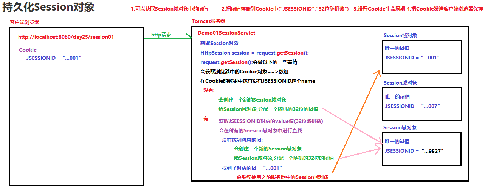

# 学习目标

```java
1. 能够说出会话技术的作用
	web中,打开浏览器访问不同的网站,只要浏览器不关闭,那么就是一次会话
2. 能够说出cookie的概念
	在客户端保存的数据,数据产生是在服务器
	在浏览器中Cookie是以文本的形式保存数据(name,value)
3. 能够创建、发送、接收、删除cookie
	创建:Cookie cookie = new Cookie("heima","java");
	发送:response.addCookie(cookie); 响应头
	接收:Cookie[] cookies =  request.getCookies(); 浏览器再次访问服务器会携带Cookie(请求头)
	删除:覆盖的方式:键相同(heima),携带路径相同,后边Cookie声明周期0秒
		Cookie cookie1 = new Cookie("heima","java");
        cookie1.setPath(request.getContextPath());
        cookie1.setMaxAge(60*10);
        response.addCookie(cookie1);

        Cookie cookie2 = new Cookie("heima","java");
        cookie2.setPath(request.getContextPath());
        cookie2.setMaxAge(0);
        response.addCookie(cookie2);
4. 能够说出cookie执行原理
	往浏览器的Cookie存储一些健值对的数据
	当浏览器再次访问服务器,就会携带Cookie数据
	在服务器中就可以获取到Cookie数据
5. 能够说出session的概念
	服务器用来存储数据的域对象
	做为域对象使用:使用该对象保存数据，一次会话（多次请求）内数据有效。
6. 能够获取session对象、添加、移除、获取session中的数据
	HttpSession session = request.getSession();
    - 域对象存储数据: setAttribute(String key,String value)
	- 取出域对象数据: Object getAttribute(String key)
	- 移除域对象数据: removeAttribute(String key)
7. 能够完成登录验证码案例
8. 能够完成购物车案例
```

# 第1章 会话的基本概念

## 1.什么是会话

在日常生活中，从拨通电话到挂断电话之间的一连串的你问我答的过程就是一个会话。只要电话不挂断,就是一次通话.

web中,打开浏览器访问不同的网站,只要浏览器不关闭,那么就是一次会话


## 2.购物车案例引出会话对象


# 第2章 cookie

  在客户端浏览器中保存的数据,数据产生是在服务器

  在浏览器中Cookie是以文本的形式保存数据(String key,String value)

## 1.服务器向浏览器发送Cookie

- Cookie对象,直接new Cookie(String key,String value)
- 将Cookie数据保存到客户端 response对象方法 addCookie(Cookie对象)

```java
package com.itheima.demo01Cookie;

import javax.servlet.ServletException;
import javax.servlet.annotation.WebServlet;
import javax.servlet.http.Cookie;
import javax.servlet.http.HttpServlet;
import javax.servlet.http.HttpServletRequest;
import javax.servlet.http.HttpServletResponse;
import java.io.IOException;

@WebServlet(urlPatterns = "/send")
public class Demo01SendCookieServlet extends HttpServlet {
    protected void doPost(HttpServletRequest request, HttpServletResponse response) throws ServletException, IOException {
        //服务器向浏览器发送Cookie
        //1.创建Cookie对象
        Cookie c1 = new Cookie("aa","11");
        //2.使用response对象中的方法addCookie,把Cookie对象发送到客户端浏览器中保存
        response.addCookie(c1);//Set-Cookie:"aa=11"

        Cookie c2 = new Cookie("bb","22");
        response.addCookie(c2);//Set-Cookie:"aa=11bb=22"

    }

    protected void doGet(HttpServletRequest request, HttpServletResponse response) throws ServletException, IOException {
        doPost(request, response);
    }
}
```

## 2.服务器中获取浏览器携带的Cookie

  当我们把Cookie数据,保存在客户端浏览器中

   浏览器再次请求服务器的时候,会携带Cookie数据

  会把Cookie的数据放在请求头中,所以我们就可以获取Cookie数据

- request对象方法  Cookie[] getCookies() 获取多个Cookie,返回的是Cookie对象数组
- Cookie对象方法 getName()获取Cookie的键,  getValue()获取Cookie中的值

```java
package com.itheima.demo01Cookie;

import javax.servlet.ServletException;
import javax.servlet.annotation.WebServlet;
import javax.servlet.http.Cookie;
import javax.servlet.http.HttpServlet;
import javax.servlet.http.HttpServletRequest;
import javax.servlet.http.HttpServletResponse;
import java.io.IOException;

@WebServlet(urlPatterns = "/get")
public class Demo02GetCookieServlet extends HttpServlet {
    protected void doPost(HttpServletRequest request, HttpServletResponse response) throws ServletException, IOException {
        //服务器中获取浏览器携带的Cookie
        //1.使用request对象中的方法getCookies获取,请求头中携带的所有Cookie对象
        Cookie[] cookies = request.getCookies();
        System.out.println(cookies);//null
        //为了防止空指针异常,增加一个非空判断
        if(cookies!=null){
            //2.遍历数组获取每一个Cookie对象
            for (Cookie c : cookies) {
                //3.使用Cookie对象中的方法getName和getValue分别获取键与值
                String name = c.getName();
                String value = c.getValue();
                System.out.println(name+"="+value);
            }
        }else{
            System.out.println("Cookie对象中没有存储数据");
        }

    }

    protected void doGet(HttpServletRequest request, HttpServletResponse response) throws ServletException, IOException {
        doPost(request, response);
    }
}
```

## 3.Cookie的携带路径

  浏览器访问服务器,每次都会携带Cookie进行访问吗

  Cookie数据放在请求头,每次浏览器请求服务器,都会携带吗

- 结论: 浏览器携带Cookie,在Cookie产生的路径下
  - Cookie的产生路径: /abc目录下产生的
  - 浏览器访问/abc目录下的任意资源,携带Cookie
  - 访问不是/abc目录下的资源,不会携带Cookie
- 需求: 只要访问WEB应用下的任意资源都携带Cookie
  - Cookie对象方法　setPath("路径")设置携带路径
- 注意:
  - 以后没有特殊的需求,Cookie携带的路径都会设置为项目的根目录,目的是为了项目下所有的资源都可以携带Cookie

```java
package com.itheima.demo01Cookie;

import javax.servlet.ServletException;
import javax.servlet.annotation.WebServlet;
import javax.servlet.http.Cookie;
import javax.servlet.http.HttpServlet;
import javax.servlet.http.HttpServletRequest;
import javax.servlet.http.HttpServletResponse;
import java.io.IOException;

@WebServlet(urlPatterns = "/abc/path")
public class Demo03PathServlet extends HttpServlet {
    protected void doPost(HttpServletRequest request, HttpServletResponse response) throws ServletException, IOException {
        //创建Cookie对象
        Cookie c = new Cookie("haha","haha");

        //Cookie对象方法　setPath("路径")设置携带路径
        //c.setPath("/day25");
        c.setPath(request.getContextPath());//获取项目的虚拟访问路径 /day25

        //把Cookie对象发送到客户端浏览器保存
        response.addCookie(c);//Set-Cookie:"haha=haha; Path=/day25"
    }

    protected void doGet(HttpServletRequest request, HttpServletResponse response) throws ServletException, IOException {
        doPost(request, response);
    }
}
```

```java
package com.itheima.demo01Cookie;

import javax.servlet.ServletException;
import javax.servlet.annotation.WebServlet;
import javax.servlet.http.Cookie;
import javax.servlet.http.HttpServlet;
import javax.servlet.http.HttpServletRequest;
import javax.servlet.http.HttpServletResponse;
import java.io.IOException;

@WebServlet(urlPatterns = "/get2")
public class Demo04PathServlet extends HttpServlet {
    protected void doPost(HttpServletRequest request, HttpServletResponse response) throws ServletException, IOException {
        //获取客户端浏览器携带的Cookie
        Cookie[] cookies = request.getCookies();
        if(cookies!=null){
            for (Cookie c : cookies) {
                System.out.println(c.getName()+"\t"+c.getValue());
            }
        }else{
            System.out.println("Cookie中没有数据!");
        }
    }

    protected void doGet(HttpServletRequest request, HttpServletResponse response) throws ServletException, IOException {
        doPost(request, response);
    }
}
```

web下创建a.html测试

web/abc下创建b.html测试

## 4.Cookie的生存时间

  浏览器中Cookie是有生存时间,默认是当前会话.浏览器关闭,会话结束

  在火狐-->选项-->隐私安全-->移除特定网站的 Cookie-->可以查看Cookie信息

  设置生存时间,Cookie对象方法 setMaxAge(int 秒)

注意:在浏览器中使用ctrl+shift+delete,可以清除Cookie数据

```java
package com.itheima.demo01Cookie;

import javax.servlet.ServletException;
import javax.servlet.annotation.WebServlet;
import javax.servlet.http.Cookie;
import javax.servlet.http.HttpServlet;
import javax.servlet.http.HttpServletRequest;
import javax.servlet.http.HttpServletResponse;
import java.io.IOException;

@WebServlet(urlPatterns = "/life")
public class Demo05LifeCookieServlet extends HttpServlet {
    protected void doPost(HttpServletRequest request, HttpServletResponse response) throws ServletException, IOException {
        //创建Cookie对象
        Cookie c = new Cookie("hehe","hehe");
        //设置Cookie的携带路径为当前项目根目录
        c.setPath(request.getContextPath());
        //设置Cookie的生存时间:Cookie对象方法 setMaxAge(int 秒)
        c.setMaxAge(10*60);//设置10分钟
        //c.setMaxAge(365*24*60*60);//设置一年
        //把Cookie对象发送到客户端浏览器保存
        response.addCookie(c);
    }

    protected void doGet(HttpServletRequest request, HttpServletResponse response) throws ServletException, IOException {
        doPost(request, response);
    }
}
```

查看Cookie


## 5.服务器端如何清空Cookie

使用覆盖的方式:使用另外一个Cookie对象覆盖之前的Cookie对象
 保证:
1.两个Cookie对象的键是相同的
2.两个Cookie对象的携带路径是一致的
3.设置后边的Cookie对象的生存时间为0             

```java
package com.itheima.demo01Cookie;

import javax.servlet.ServletException;
import javax.servlet.annotation.WebServlet;
import javax.servlet.http.Cookie;
import javax.servlet.http.HttpServlet;
import javax.servlet.http.HttpServletRequest;
import javax.servlet.http.HttpServletResponse;
import java.io.IOException;

@WebServlet(urlPatterns = "/clear")
public class Demo06ClearCookieServlet extends HttpServlet {
    protected void doPost(HttpServletRequest request, HttpServletResponse response) throws ServletException, IOException {
        //服务器端如何清空Cookie
        Cookie c1 = new Cookie("heihei","heihei1");
        c1.setPath(request.getContextPath());
        c1.setMaxAge(10*60);
        response.addCookie(c1);

        //1.两个Cookie对象的键是相同的
        Cookie c2 = new Cookie("heihei","heihei2");
        //2.两个Cookie对象的携带路径是一致的
        c2.setPath(request.getContextPath());
        //3.设置后边的Cookie对象的生存时间为0
        c2.setMaxAge(0);
        response.addCookie(c2);
    }

    protected void doGet(HttpServletRequest request, HttpServletResponse response) throws ServletException, IOException {
        doPost(request, response);
    }
}
```

## 6.记录上一次的访问时间案例

### 需求分析:


### 代码实现:

```java
设置response对象的字符集
1.获取客户端浏览器携带的所有Cookie对象,返回一个数组 
	Cookie[] cookies = request.getCookies();
2.判断数组是否为null
  是null:没有访问过LastTimeServlet
	a.给客户端浏览器响应"欢迎访问JavaEE144网站"
	b.获取当前系统的时间,并进行格式化"2020-12-2/10:14:33"
	b.把时间存储到Cookie对象中("time","2020-12-2/10:14:33")
	d.设置Cooke对象的携带路径和生存时间
	e.把Cookie对象发送到客户端浏览器保存
  不是null:有可能访问过LastTimeServlet
	a.遍历Cookie数组,获取每一个Cookie对象
	b.判断获取到的Cookie对象的键是否为time
	c.如果Cookie对象的键是time,获取Cookie对象的值(上一次访问的事件"2020-12-2/10:14:33")
	d.给客户端浏览器响应"您上一次访问的时间是:"+"2020-12-2/10:14:33"
	e.获取当前系统时间,格式化后存储到Cookie对象中(更新时间)
	f.遍历数组结束了,还没有找到time,说明没有访问过LastTimeSevlet
	g.给客户端浏览器响应"欢迎访问JavaEE144网站"
	h.获取当前系统时间,格式化后存储到Cookie对象中,发送到客户端浏览器中	
```

```java
package com.itheima.demo01Cookie;

import javax.servlet.ServletException;
import javax.servlet.annotation.WebServlet;
import javax.servlet.http.Cookie;
import javax.servlet.http.HttpServlet;
import javax.servlet.http.HttpServletRequest;
import javax.servlet.http.HttpServletResponse;
import java.io.IOException;
import java.text.SimpleDateFormat;
import java.util.Date;

@WebServlet(urlPatterns = "/last")
public class Demo07LastTimeServlet extends HttpServlet {
    protected void doPost(HttpServletRequest request, HttpServletResponse response) throws ServletException, IOException {
        //设置response对象的字符集
        response.setContentType("text/html;charset=utf-8");
        //1.获取客户端浏览器携带的所有Cookie对象,返回一个数组
        Cookie[] cookies = request.getCookies();
        //2.判断数组是否为null
        if(cookies==null){
            //是null:没有访问过LastTimeServlet
            //a.给客户端浏览器响应"欢迎访问JavaEE144网站"
            response.getWriter().write("<h1>欢迎访问JavaEE144网站</h1>");
            //b.获取当前系统的时间,并进行格式化"2020-12-2/10:14:33"
            SimpleDateFormat sdf = new SimpleDateFormat("yyyy-MM-dd/HH:mm:ss");
            //b.把时间存储到Cookie对象中("time","2020-12-2/10:14:33")
            Cookie c = new Cookie("time",sdf.format(new Date()));
            //d.设置Cooke对象的携带路径和生存时间
            c.setPath(request.getContextPath());
            c.setMaxAge(10*60);
            //e.把Cookie对象发送到客户端浏览器保存
            response.addCookie(c);
        }else{
            //不是null:有可能访问过LastTimeServlet
            //a.遍历Cookie数组,获取每一个Cookie对象
            for (Cookie cookie : cookies) {
                //b.判断获取到的Cookie对象的键是否为time
                if("time".equals(cookie.getName())){
                    //c.如果Cookie对象的键是time,获取Cookie对象的值(上一次访问的时间是:"2020-12-2/10:14:33")
                    String value = cookie.getValue();
                    //d.给客户端浏览器响应"您上一次访问的时间是:"+"2020-12-2/10:14:33"
                    response.getWriter().write("上一次访问的时间是:"+value);
                    //e.获取当前系统时间,格式化后存储到Cookie对象中(更新时间)
                    SimpleDateFormat sdf = new SimpleDateFormat("yyyy-MM-dd/HH:mm:ss");
                    Cookie c = new Cookie("time",sdf.format(new Date()));
                    c.setPath(request.getContextPath());
                    c.setMaxAge(10*60);
                    response.addCookie(c);
                    return;//结束方法
                }
            }
            //f.遍历数组结束了,还没有找到time,说明没有访问过LastTimeSevlet
            //g.给客户端浏览器响应"欢迎访问JavaEE144网站"
            response.getWriter().write("<h1>欢迎访问JavaEE144网站</h1>");
            //h.获取当前系统时间,格式化后存储到Cookie对象中,发送到客户端浏览器中
            SimpleDateFormat sdf = new SimpleDateFormat("yyyy-MM-dd/HH:mm:ss");
            Cookie c = new Cookie("time",sdf.format(new Date()));
            c.setPath(request.getContextPath());
            c.setMaxAge(10*60);
            response.addCookie(c);
        }
    }

    protected void doGet(HttpServletRequest request, HttpServletResponse response) throws ServletException, IOException {
        doPost(request, response);
    }
}
```

抽取获取Cookie对象的方法

```java
package com.itheima.demo01Cookie;

import javax.servlet.ServletException;
import javax.servlet.annotation.WebServlet;
import javax.servlet.http.Cookie;
import javax.servlet.http.HttpServlet;
import javax.servlet.http.HttpServletRequest;
import javax.servlet.http.HttpServletResponse;
import java.io.IOException;
import java.text.SimpleDateFormat;
import java.util.Date;

@WebServlet(urlPatterns = "/last")
public class Demo07LastTimeServlet extends HttpServlet {
    protected void doPost(HttpServletRequest request, HttpServletResponse response) throws ServletException, IOException {
        //设置response对象的字符集
        response.setContentType("text/html;charset=utf-8");
        //1.获取客户端浏览器携带的所有Cookie对象,返回一个数组
        Cookie[] cookies = request.getCookies();
        //2.判断数组是否为null
        if(cookies==null){
            //是null:没有访问过LastTimeServlet
            //a.给客户端浏览器响应"欢迎访问JavaEE144网站"
            response.getWriter().write("<h1>欢迎访问JavaEE144网站</h1>");
            //调用获取Cookeie对象的方法
            Cookie c = getCookie(request);
            //e.把Cookie对象发送到客户端浏览器保存
            response.addCookie(c);
        }else{
            //不是null:有可能访问过LastTimeServlet
            //a.遍历Cookie数组,获取每一个Cookie对象
            for (Cookie cookie : cookies) {
                //b.判断获取到的Cookie对象的键是否为time
                if("time".equals(cookie.getName())){
                    //c.如果Cookie对象的键是time,获取Cookie对象的值(上一次访问的时间是:"2020-12-2/10:14:33")
                    String value = cookie.getValue();
                    //d.给客户端浏览器响应"您上一次访问的时间是:"+"2020-12-2/10:14:33"
                    response.getWriter().write("上一次访问的时间是:"+value);
                    //e.获取当前系统时间,格式化后存储到Cookie对象中(更新时间)
                    //调用获取Cookeie对象的方法
                    Cookie c = getCookie(request);
                    response.addCookie(c);
                    return;//结束方法
                }
            }
            //f.遍历数组结束了,还没有找到time,说明没有访问过LastTimeSevlet
            //g.给客户端浏览器响应"欢迎访问JavaEE144网站"
            response.getWriter().write("<h1>欢迎访问JavaEE144网站</h1>");
            //h.获取当前系统时间,格式化后存储到Cookie对象中,发送到客户端浏览器中
            //调用获取Cookeie对象的方法
            Cookie c = getCookie(request);
            response.addCookie(c);
        }
    }

    /*
        创建一个获取Cookie对象的方法
        参数: HttpServletRequest request
        返回值:Cookie对象
     */
    public Cookie getCookie(HttpServletRequest request){
        //b.获取当前系统的时间,并进行格式化"2020-12-2/10:14:33"
        SimpleDateFormat sdf = new SimpleDateFormat("yyyy-MM-dd/HH:mm:ss");
        //b.把时间存储到Cookie对象中("time","2020-12-2/10:14:33")
        Cookie c = new Cookie("time",sdf.format(new Date()));
        //d.设置Cooke对象的携带路径和生存时间
        c.setPath(request.getContextPath());
        c.setMaxAge(10*60);
        return c;
    }

    protected void doGet(HttpServletRequest request, HttpServletResponse response) throws ServletException, IOException {
        doPost(request, response);
    }
}
```

### 注意事项:

- 格式化时间数据(注意：在cookie值中不能使用分号（;）、逗号（,）、等号（=）以及空格，否则会出现异常

```java
java.lang.IllegalArgumentException: 
	An invalid character [32] was present in the Cookie value
```

- 那么如果我们一定要保存非法数据在cookie中，该如何操作呢？
  答：cookie对于基本符号、数字、和字母是可以存储的，因此，我们只需要将非法数据转换成符
  号、数字、和字母形式存储，要使用的时候再转换成正常的数据（解码）即可。
  那么，最后的问题就是，我们如何对这些数据进行编码和解码呢？我们需要来学习一些新的对象和方法。 

- API介绍 

  ```java
  URLEncoder类：
  static String encode(String s, String enc) 将指定的字符串，按指定的编码表编码
  URLDecoder类：
  static String decode(String s, String enc) 将指定的字符串，按指定的编码表解码
  ```

- 代码实现

```java
package com.itheima.demo01Cookie;

import java.io.UnsupportedEncodingException;
import java.net.URLDecoder;
import java.net.URLEncoder;

public class Demo09 {
    public static void main(String[] args) throws UnsupportedEncodingException {
        //URLEncoder类：static String encode(String s, String enc) 将指定的字符串，按指定的编码表编码
        String s = "哈 哈";
        String encode = URLEncoder.encode(s, "utf-8");
        System.out.println(encode);//%E5%93%88%E5%93%88
        //URLDecoder类：static String decode(String s, String enc) 将指定的字符串，按指定的编码表解码
        String decode = URLDecoder.decode(encode, "utf-8");
        System.out.println(decode);//哈 哈
    }
}

```

```java
package com.itheima.demo01Cookie;

import javax.servlet.ServletException;
import javax.servlet.annotation.WebServlet;
import javax.servlet.http.Cookie;
import javax.servlet.http.HttpServlet;
import javax.servlet.http.HttpServletRequest;
import javax.servlet.http.HttpServletResponse;
import java.io.IOException;
import java.io.UnsupportedEncodingException;
import java.net.URLDecoder;
import java.net.URLEncoder;
import java.text.SimpleDateFormat;
import java.util.Date;

@WebServlet(urlPatterns = "/last2")
public class Demo08LastTimeServlet extends HttpServlet {
    protected void doPost(HttpServletRequest request, HttpServletResponse response) throws ServletException, IOException {
        //设置response对象的字符集
        response.setContentType("text/html;charset=utf-8");
        //1.获取客户端浏览器携带的所有Cookie对象,返回一个数组
        Cookie[] cookies = request.getCookies();
        //2.判断数组是否为null
        if(cookies==null){
            //是null:没有访问过LastTimeServlet
            //a.给客户端浏览器响应"欢迎访问JavaEE144网站"
            response.getWriter().write("<h1>欢迎访问JavaEE144网站</h1>");
            //调用获取Cookeie对象的方法
            Cookie c = getCookie(request);
            //e.把Cookie对象发送到客户端浏览器保存
            response.addCookie(c);
        }else{
            //不是null:有可能访问过LastTimeServlet
            //a.遍历Cookie数组,获取每一个Cookie对象
            for (Cookie cookie : cookies) {
                //b.判断获取到的Cookie对象的键是否为time
                if("time".equals(cookie.getName())){
                    //c.如果Cookie对象的键是time,获取Cookie对象的值(上一次访问的时间是:"2020-12-2/10:14:33")
                    String value = cookie.getValue();
                    //d.给客户端浏览器响应"您上一次访问的时间是:"+"2020-12-2/10:14:33"
                    System.out.println("解码前的字符串:"+value);
                    String decode = URLDecoder.decode(value, "utf-8");
                    System.out.println("解码后的字符串:"+decode);
                    response.getWriter().write("上一次访问的时间是:"+decode);
                    //e.获取当前系统时间,格式化后存储到Cookie对象中(更新时间)
                    //调用获取Cookeie对象的方法
                    Cookie c = getCookie(request);
                    response.addCookie(c);
                    return;//结束方法
                }
            }
            //f.遍历数组结束了,还没有找到time,说明没有访问过LastTimeSevlet
            //g.给客户端浏览器响应"欢迎访问JavaEE144网站"
            response.getWriter().write("<h1>欢迎访问JavaEE144网站</h1>");
            //h.获取当前系统时间,格式化后存储到Cookie对象中,发送到客户端浏览器中
            //调用获取Cookeie对象的方法
            Cookie c = getCookie(request);
            response.addCookie(c);
        }
    }

    /*
        创建一个获取Cookie对象的方法
        参数: HttpServletRequest request
        返回值:Cookie对象
     */
    public Cookie getCookie(HttpServletRequest request) throws UnsupportedEncodingException {
        //b.获取当前系统的时间,并进行格式化"2020-12-2/10:14:33"
        SimpleDateFormat sdf = new SimpleDateFormat("yyyy-MM-dd HH:mm:ss");
        String value = URLEncoder.encode(sdf.format(new Date()), "utf-8");
        //b.把时间存储到Cookie对象中("time","2020-12-2/10:14:33")
        Cookie c = new Cookie("time",value);
        //d.设置Cooke对象的携带路径和生存时间
        c.setPath(request.getContextPath());
        c.setMaxAge(10*60);
        return c;
    }

    protected void doGet(HttpServletRequest request, HttpServletResponse response) throws ServletException, IOException {
        doPost(request, response);
    }
}
```

## 7.Cookie对象存储中文(扩展-了解)

```java
package com.itheima.demo01Cookie;

import javax.servlet.ServletException;
import javax.servlet.annotation.WebServlet;
import javax.servlet.http.Cookie;
import javax.servlet.http.HttpServlet;
import javax.servlet.http.HttpServletRequest;
import javax.servlet.http.HttpServletResponse;
import java.io.IOException;
import java.net.URLDecoder;
import java.net.URLEncoder;

@WebServlet(urlPatterns = "/china")
public class Demo10ChinaServlet extends HttpServlet {
    protected void doPost(HttpServletRequest request, HttpServletResponse response) throws ServletException, IOException {
        /*
            往Cookie中存储中文测试
            Tomcat8以上的版本:Cookie对象支持存储中文
            Tomcat8以下的版本:Cookie对象不支持存储中文,认为中文是非法字符
         */
        Cookie c = new Cookie("haha", URLEncoder.encode("哈哈","utf-8"));
        c.setPath(request.getContextPath());
        c.setMaxAge(10*60);
        response.addCookie(c);

        Cookie[] cookies = request.getCookies();
        if(cookies!=null){
            for (Cookie cookie : cookies) {
                System.out.println(cookie.getName()+"\t"+cookie.getValue());
                System.out.println(cookie.getName()+"\t"+ URLDecoder.decode(cookie.getValue(),"utf-8"));
            }
        }
    }

    protected void doGet(HttpServletRequest request, HttpServletResponse response) throws ServletException, IOException {
        doPost(request, response);
    }
}
```


# 第3章 session

HttpSession接口,session对象是接口的实现类,实现类对象tomcat引擎创建

1.作用:

​	服务器端用来存储数据的域对象

​	使用该对象保存数据，一次会话（多次请求）内数据有效。

​	一次会话:浏览器不关闭

2.获取Session域对象的方式
	HttpSession session = request.getSession();

3.Session域对象中常用的方法

- 域对象存储数据: void setAttribute(String key,Object value)
- 取出域对象数据: Object getAttribute(String key)
- 移除域对象数据: void removeAttribute(String key)

## 1.Session域对象基本使用

```java
package com.itheima.demo02Session;

import javax.servlet.ServletException;
import javax.servlet.annotation.WebServlet;
import javax.servlet.http.HttpServlet;
import javax.servlet.http.HttpServletRequest;
import javax.servlet.http.HttpServletResponse;
import javax.servlet.http.HttpSession;
import java.io.IOException;

@WebServlet(urlPatterns = "/session01")
public class Demo01SessionServlet extends HttpServlet {
    protected void doPost(HttpServletRequest request, HttpServletResponse response) throws ServletException, IOException {
        //获取Session域对象
        HttpSession session = request.getSession();
        //往Session域对象中存储键值对
        session.setAttribute("heima","javaEE144");
        //取出Session域对象中存储的数据
        Object value = session.getAttribute("heima");
        System.out.println("Demo01SessionServlet\t"+value);
    }

    protected void doGet(HttpServletRequest request, HttpServletResponse response) throws ServletException, IOException {
        doPost(request, response);
    }
}
```

```java
package com.itheima.demo02Session;

import javax.servlet.ServletException;
import javax.servlet.annotation.WebServlet;
import javax.servlet.http.HttpServlet;
import javax.servlet.http.HttpServletRequest;
import javax.servlet.http.HttpServletResponse;
import javax.servlet.http.HttpSession;
import java.io.IOException;

@WebServlet(urlPatterns = "/session02")
public class Demo02SessionServlet extends HttpServlet {
    protected void doPost(HttpServletRequest request, HttpServletResponse response) throws ServletException, IOException {
        //获取Session域对象
        HttpSession session = request.getSession();
        //取出Session域对象中存储的数据
        Object value = session.getAttribute("heima");
        System.out.println("Demo02SessionServlet\t"+value);
    }

    protected void doGet(HttpServletRequest request, HttpServletResponse response) throws ServletException, IOException {
        doPost(request, response);
    }
}
```

## 2.持久化Session对象

1.获取Session对象中的JSESSIONID

​	使用Session对象中的方法session.getId();获取JSESSIONID

2.把JSESSIONID保存到Cookie对象中
3.设置Cookie对象的生命周期

### 原理:



### 代码实现:

```java
package com.itheima.demo02Session;

import javax.servlet.ServletException;
import javax.servlet.annotation.WebServlet;
import javax.servlet.http.*;
import java.io.IOException;

@WebServlet(urlPatterns = "/sessionLife")
public class Demo03SessionServlet extends HttpServlet {
    protected void doPost(HttpServletRequest request, HttpServletResponse response) throws ServletException, IOException {
        HttpSession session = request.getSession();
        session.setAttribute("heima","10m");

        //1.可以获取Session域对象中的id值
        String id = session.getId();
        System.out.println(id);
        // 2.把id值存储到Cookie中("JSESSIONID","32位随机数")
        Cookie cookie = new Cookie("JSESSIONID",id);
        // 3.设置Cookie生命周期
        cookie.setPath(request.getContextPath());
        cookie.setMaxAge(10*60);
        // 4.把Cookie发送到客户端浏览器
        response.addCookie(cookie);
    }

    protected void doGet(HttpServletRequest request, HttpServletResponse response) throws ServletException, IOException {
        doPost(request, response);
    }
}
```

## 3.session生命周期

  session域对象生命时候生,什么时候销毁

- session对象什么时候创建
  - request.getSession()方法,Cookie中id和服务器的id匹配不上(没有id,id值不同)就创建
- session对什么时候销毁
  - 默认30分钟销毁(一次会话),  tomcat全局配置文件web.xml
  - 调用方法session.invalidate();
  - 关闭 (非正常关闭) 服务器
    - 钝化: 正常关闭服务器的时候,会使用序列化流把Session对象,存储到服务器的硬盘上
    - 活化:开启服务器的时候,会使用反序列化流把服务器上存储的Session,读取到内存中

## 4.URL重写(了解)

其实作用就是在访问地址后面自己拼接一个jsessionid而已

简单说就是浏览器cookie被禁用了,jsessionid就不能携带，那么每次请求，都是一个新的session对象。
如果想要使用同一个session对象，可以使用url重写. 

HttpServletResponse接口中提供了重写的方法,这时候JSESSIONID就编写了url的一部分

例如:`/day25/session2;jsessionid=02B0C7BD37C1A2DE9A6BDC291D08A336`

```java
response. encodeRedirectURL(String url)用于对sendRedirect方法后的url地址进行重写。
response. encodeURL(String url)用于对表单action和超链接的url地址进行重写 
```

```java
package com.itheima.demo02Session;

import javax.servlet.ServletException;
import javax.servlet.annotation.WebServlet;
import javax.servlet.http.HttpServlet;
import javax.servlet.http.HttpServletRequest;
import javax.servlet.http.HttpServletResponse;
import javax.servlet.http.HttpSession;
import java.io.IOException;

@WebServlet(urlPatterns = "/url")
public class URLServlet extends HttpServlet {
    protected void doPost(HttpServletRequest request, HttpServletResponse response) throws ServletException, IOException {
        //获取session
        HttpSession session = request.getSession();

        session.setAttribute("heima","url重写");
        System.out.println(session.getId());

        //String url=request.getContextPath()+"/session02";
        //System.out.println(response.encodeRedirectURL(url));//==>/day25/session02;jsessionid=6D0EEB1D5E37BAECF5CC19C4AEB2D636

        //response.sendRedirect(url);

        String url2 = request.getContextPath()+"/session02";
        url2=response.encodeURL(url2);
        System.out.println(url2);//==>/day25/session02;jsessionid=6D0EEB1D5E37BAECF5CC19C4AEB2D636
        response.setContentType("text/html;charset=utf-8");
        response.getWriter().print("<a href='"+url2+"'>获取数据</a>");
    }

    protected void doGet(HttpServletRequest request, HttpServletResponse response) throws ServletException, IOException {
        doPost(request, response);
    }
}
```

## 综合案例环境搭建

复制资料中web文件夹下所有的内容到当前项目的web下

把生成验证码的Servlet复制到项目中


## 5.用户登录和验证码校验案例


### 前台页面:

index.jsp

```jsp
<%@ page contentType="text/html;charset=UTF-8" language="java" %>
<html>
  <head>
    <title>$Title$</title>
  </head>
  <body>
    <h1>欢迎你：${user.username}</h1>
  </body>
</html>
```

login.jsp

```jsp
<%@ page contentType="text/html;charset=UTF-8" language="java" %>
<!DOCTYPE html>
<html>
<head>
    <meta http-equiv="Content-Type" content="text/html; charset=utf-8"/>
    <meta http-equiv="X-UA-Compatible" content="IE=edge">
    <meta name="viewport" content="width=device-width, initial-scale=1.0, maximum-scale=1.0, user-scalable=no"/>
    <meta name="renderer" content="webkit">
    <title>登录</title>
    <link rel="stylesheet" href="css/pintuer.css">
    <link rel="stylesheet" href="css/admin.css">
    <script src="js/jquery.js"></script>
    <script src="js/pintuer.js"></script>
</head>
<body>
<div class="bg"></div>
<div class="container">
    <div class="line bouncein">
        <div class="xs6 xm4 xs3-move xm4-move">
            <div style="height:150px;"></div>
            <div class="media media-y margin-big-bottom">
            </div>
            <form action="${pageContext.request.contextPath}/login" method="post">
                <div class="panel loginbox">
                    <div class="text-center margin-big padding-big-top"><h1>后台管理中心</h1></div>
                    <div class="panel-body" style="padding:30px; padding-bottom:10px; padding-top:10px;">
                        <div class="form-group">
                            <div class="field field-icon-right">
                                <input type="text" class="input input-big" name="username" placeholder="登录账号"
                                       data-validate="required:请填写账号"/>
                                <span class="icon icon-user margin-small"></span>
                            </div>
                        </div>
                        <div class="form-group">
                            <div class="field field-icon-right">
                                <input type="password" class="input input-big" name="password" placeholder="登录密码"
                                       data-validate="required:请填写密码"/>
                                <span class="icon icon-key margin-small"></span>
                            </div>
                        </div>
                        <div class="form-group">
                            <div class="field">
                                <input type="text" class="input input-big" name="code" placeholder="填写右侧的验证码"
                                       data-validate="required:请填写右侧的验证码"/>
                                <!-- onclick: 看不清，换一张 -->
                                <!-- 用于展示提示信息 -->
                                <div class="input-help">
                                    <ul>
                                        <li style="color:red">${msg}</li>
                                    </ul>
                                </div>
                            </div>
                        </div>
                    </div>
                    <div style="padding:30px;"><input type="submit"
                                                      class="button button-block bg-main text-big input-big" value="登录">
                    </div>
                </div>
            </form>
        </div>
    </div>
</div>

</body>
</html>
```

### 后台代码:

生成验证码Servlet

```java
package com.itheima.demo03test;

import cn.dsna.util.images.ValidateCode;

import javax.servlet.ServletException;
import javax.servlet.annotation.WebServlet;
import javax.servlet.http.HttpServlet;
import javax.servlet.http.HttpServletRequest;
import javax.servlet.http.HttpServletResponse;
import java.io.IOException;

@WebServlet("/captcha")
public class CaptchaServlet extends HttpServlet {
    protected void doPost(HttpServletRequest request, HttpServletResponse response) throws ServletException, IOException {
        //产生验证码图片
        //参数1：图片宽度 参数2：高度  参数3：验证码字符个数    参数4：干扰线的条数
        //参数说明：width 图片宽度, height 图片高度, codeCount 字符个数, lineCount 干扰线条数
        ValidateCode vc = new ValidateCode(100, 32, 4, 9);
        //得到字符
        String code = vc.getCode();
        //保存验证码字符到session域对象中
        request.getSession().setAttribute("session_code",code);
        //响应图片
        vc.write(response.getOutputStream());
    }

    protected void doGet(HttpServletRequest request, HttpServletResponse response) throws ServletException, IOException {
        doPost(request, response);
    }
}
```

登录Servlet

```java
package com.itheima.demo03test;

import org.apache.commons.beanutils.BeanUtils;

import javax.servlet.ServletException;
import javax.servlet.annotation.WebServlet;
import javax.servlet.http.HttpServlet;
import javax.servlet.http.HttpServletRequest;
import javax.servlet.http.HttpServletResponse;
import javax.servlet.http.HttpSession;
import java.io.IOException;
import java.lang.reflect.InvocationTargetException;

@WebServlet(urlPatterns = "/login")
public class LoginServlet extends HttpServlet {
    protected void doPost(HttpServletRequest request, HttpServletResponse response) throws ServletException, IOException {
        try {
            //设置request对象和response对象的字符集,防止中文乱码
            request.setCharacterEncoding("utf-8");
            response.setContentType("text/html;charset=utf-8");
            //1.获取用户请求参数中的验证码code的值
            String code = request.getParameter("code");
            //2.获取Session域对象中存储的验证码的值
            HttpSession session = request.getSession();
            String session_code = (String)session.getAttribute("session_code");
            //3.判断用户输入的验证码和Session存储的验证码是否一致
            if(!code.equalsIgnoreCase(session_code)){
                //4.验证码不一致,往域对象中存储一个错误信息("msg","验证码错误!")
                request.setAttribute("msg","验证码错误!");
                //5.转发回login.jsp页面,给用户显示错误信息
                request.getRequestDispatcher("/login.jsp").forward(request,response);
            }
            //6.验证码一致,继续获取请求参数中的用户名和密码,封装到User对象中
            User u = new User();
            BeanUtils.populate(u,request.getParameterMap());
            //7.判断用户输入的用户名和密码和已经存在的用户名和密码是否一致
            if("tom".equals(u.getUsername())&&"123".equals(u.getPassword())){
                //true:登录成功,把User对象存储到域对象中,重定向到index.jsp首页
                session.setAttribute("user",u);
                response.sendRedirect(request.getContextPath()+"/index.jsp");
            }else{
                //false:登录失败,往域对象中存储一个错误信息("msg","验证码错误!")
                request.setAttribute("msg","用户名或密码有误!");
                //5.转发回login.jsp页面,给用户显示错误信息
                request.getRequestDispatcher("/login.jsp").forward(request,response);
            }
        } catch (Exception e) {
            e.printStackTrace();
        }
    }

    protected void doGet(HttpServletRequest request, HttpServletResponse response) throws ServletException, IOException {
        doPost(request, response);
    }
}
```

User类

```java
package com.itheima.demo03test;

public class User {
    private String username;
    private String password;

    public User() {
    }

    public User(String username, String password) {
        this.username = username;
        this.password = password;
    }

    @Override
    public String toString() {
        return "User{" +
                "username='" + username + '\'' +
                ", password='" + password + '\'' +
                '}';
    }

    public String getUsername() {
        return username;
    }

    public void setUsername(String username) {
        this.username = username;
    }

    public String getPassword() {
        return password;
    }

    public void setPassword(String password) {
        this.password = password;
    }
}
```

## 5.模拟简易session购物车案例

### 需求分析:


### 代码实现:

#### product.jsp

```jsp
<%@ page contentType="text/html;charset=UTF-8" language="java" %>
<html>
<head>
    <title>Title</title>
</head>
<body>
    <a href="/day25/addCart?name=红楼梦">红楼梦</a><br/>
    <a href="/day25/addCart?name=水浒传">水浒传</a><br/>
    <a href="/day25/addCart?name=西游记">西游记</a><br/>
    <a href="/day25/addCart?name=三国演义">三国演义</a><br/><br/>
    <a href="/day25/cart.jsp">查看购物车</a><br/>
</body>
</html>

```

#### success.jsp

```jsp
<%@ page contentType="text/html;charset=UTF-8" language="java" %>
<html>
<head>
    <title>添加成功页面</title>
</head>
<body>
    <h1>添加商品成功</h1>
    <a href=/day25/product.jsp>继续浏览</a><br/>
    <a href=/day25/cart.jsp>查看购物车</a><br/>
</body>
</html>

```

#### cart.jsp

```jsp
<%@ page import="java.util.Map" %>
<%@ page contentType="text/html;charset=UTF-8" language="java" %>
<html>
<head>
    <title>Title</title>
</head>
<body>
    <%
        //获取session中的购物车(map)
        Map<String,Integer> cart = (Map<String,Integer>)session.getAttribute("cart");
        //判断购物车是否为null
        if (cart == null) {
            //若为null,展示”暂无商品”
            out.print("<h2>暂无商品</h2>");
        }else{
            //若不为null,遍历map,用表格呈现效果
    %>
    <table border="1" align="center" width="30%">
        <tr>
            <th>商品名称</th>
            <th>购买数量</th>
        </tr>
        <%
            for (String name : cart.keySet()) {
                out.print("<tr>");
                out.print("<td>"+name+"</td>");
                out.print("<td>"+cart.get(name)+"</td>");
                out.print("</tr>");
            }
        %>
        <tr>
            <td colspan="2"><a href=/day25/product.jsp>继续浏览</a></td>
        </tr>
    </table>
    <%
        }
    %>
</body>
</html>
```

#### AddProductToCartServlet

```java
package com.itheima.demo04test;

import javax.servlet.ServletException;
import javax.servlet.annotation.WebServlet;
import javax.servlet.http.HttpServlet;
import javax.servlet.http.HttpServletRequest;
import javax.servlet.http.HttpServletResponse;
import javax.servlet.http.HttpSession;
import java.io.IOException;
import java.util.HashMap;
import java.util.Map;

@WebServlet(urlPatterns = "/addCart")
public class AddProductToCartServlet extends HttpServlet {
    protected void doPost(HttpServletRequest request, HttpServletResponse response) throws ServletException, IOException {
        //1.设置request对象和response对象字符串
        request.setCharacterEncoding("utf-8");
        response.setContentType("text/html;charset=utf-8");
        //2.获取用户请求参数中购买的书的名称
        String name = request.getParameter("name");
        //3.获取Session域对象
        HttpSession session = request.getSession();
        //4.获取Session域对象中存储的购物车Map集合
        Map<String,Integer> cart = (Map<String,Integer>)session.getAttribute("cart");
        //5.判断Map集合是否为null
        if(cart==null){
            //6.是null,没有添加过商品,创建一个Map集合对象,给购物车集合赋值
            cart = new HashMap<>();
            //把商品添加到购物车
            cart.put(name,1);
        }else{
            //7.不是null,已经添加过商品
            //a.判断Map集合中是否有这次添加的商品名称(书名)
            if(cart.containsKey(name)){
                //b.有商品,取出对应的value值(购买数量),value++,存储到Map集合中(更新商品的数量)
                Integer value = cart.get(name);
                value++;
                cart.put(name,value);
            }else{
                //c.没有商品,商品第一次添加,往Map集合中添加("商品名称",1);
                cart.put(name,1);
            }
        }
        //8.把Map集合(购物车)在存储到Session域对象中(更新购物车的数据)
        session.setAttribute("cart",cart);
        //9.添加商品成功,重定向到success.jsp页面
        response.sendRedirect(request.getContextPath()+"/success.jsp");
    }

    protected void doGet(HttpServletRequest request, HttpServletResponse response) throws ServletException, IOException {
        doPost(request, response);
    }
}
```

# 第4章 三个域对象总结

1.ServletContext:针对一个WEB应用。一个WEB应用只有一个ServletContext对象，使用该对象保存的数据在整个WEB应用中都有效。

- 创建:服务器启动的时候.
- 销毁:服务器关闭的时候或者项目移除的时候.

2.HttpSession:针对一次会话(浏览器不关闭)。使用该对象保存数据，一次会话（多次请求）内数据有效。

- 创建:服务器第一次调用getSession()的时候.服务器创建session的对象(没有找到对应的JSESSION才创建).
- 销毁:
  1. 非正常关闭服务器(正常关闭：Session被序列化)
  2. Session过期了,默认时间是30分钟.
  3. 手动调用session的invalidate的方法.

3.httpServletRequest	:针对一次请求。使用该对象保存数据，一次请求（一个页面，如果是请求转发多个页面）内数据有效.

- 创建:客户端向服务器发送一次请求
- 销毁:服务器为这次请求作出响应之后,销毁request.

4.三个作用域对象操作的API相同

- 存放数据：setAttribute(name,value)
- 获得数据：Object getAttribute(name)
- 删除数据：removeAttribute(name)