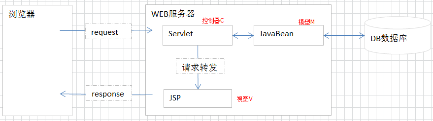
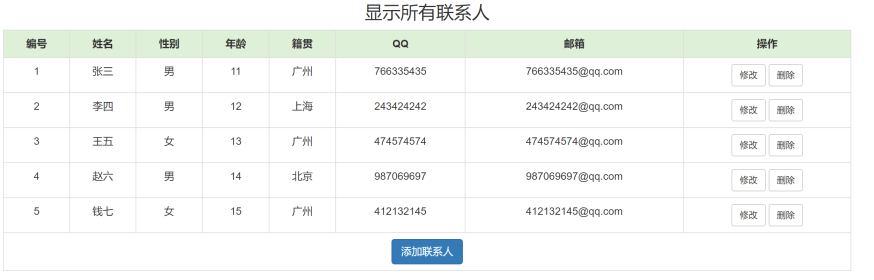

# 学习目标

```java
1.能够理解jsp的底层原理
	底层就是一个Servlet:接收请求,回复响应
2.能够说出el表达式的作用
	简化jsp的代码
	取出域对象中存储的数据
	格式:${key}
3.能够使用el表达式获取javabean的属性
	session.setAttribute("user",user);
	格式:${user}  ${user.name}
4.能够使用jstl标签库的if标签
	<c:if test="${num>5}">
        <div style="color: red">我是红色的div</div>
    </c:if>
5.能够使用jstl标签库的foreach标签
	<c:forEach begin="1" end="5">
        HelloWorld<br>
    </c:forEach>
    <c:forEach items="${list01}" var="s">
        ${s}<br>
    </c:forEach>
6.能够说出开发模式的作用
	解除耦合性,增强扩展性,可维护性强
7.能够使用三层架构模式完成显示用户案例
```

# 一.JSP技术

## 1.jsp概述

  JSP称为Java的动态服务器端网页技术,(Java Server Page). 

  Java程序直接嵌入到了HTML中,页面称为jsp页面(脚本语言)

  Java嵌入HTML方式  

​	<% java代码 %> :在方法中写代码(局部位置)

 	<%! java代码 %>:在成员位置写代码(成员位置)

 	<%= java代码 %> :向页面中输出数据(IO流技术) System.out.println("在控制台输出")

## 2.jsp的基本使用(重点)

a.jsp

```jsp
<%@ page contentType="text/html;charset=UTF-8" language="java" %>
<html>
<head>
    <title>Title</title>
</head>
<body>
    <!-- < % java代码 %> :在方法中写代码(局部位置) -->
    <%
        //局部变量
        int a = 10;
        String s = "abc";
    %>

    <!-- < %! java代码 %>:在成员位置写代码(成员位置) -->
    <%!
        /*成员变量*/
        double d = 8.8;
    %>

    <!-- < %= java代码 %> :向页面中输出数据(IO流技术) -->
    <%=a%>
    <%=s%>
    <%=d%>
</body>
</html>
```

## 3.JSP页面的执行原理

 jsp页面,执行的时候被转成.java文件,编译为.class

  转换后目录:

C:\Users\Administrator\.IntelliJIdea2017.3\system\tomcat\Tomcat_8_5_31_EE144_6\work\Catalina\localhost\day26\org\apache\jsp\_01_005fjsp

**JSP本质就是Servlet,使用service方法获取请求,回复响应**


## 4.JSP中的注释

- <!-- HTML中的注释 -->  JSP中存在,翻译后的.java存在,浏览器中存在
- <%  //   /* */   Java自己注释%> JSP中存在,翻译后的.java存在,浏览器没有
- <%--   JSP特有注释 --%> 只在JSP源代码中出现 ctrl+shift+/

```jsp
<%@ page contentType="text/html;charset=UTF-8" language="java" %>
<html>
<head>
    <title>Title</title>
</head>
<body>
    <!-- < % java代码 %> :在方法中写代码(局部位置) -->
    <%
        //局部变量
        int a = 10;
        String s = "abc";
    %>

    <!-- < %! java代码 %>:在成员位置写代码(成员位置) -->
    <%!
        /*成员变量*/
        double d = 8.8;
    %>

    <!-- < %= java代码 %> :向页面中输出数据(IO流技术) -->
    <%=a%>
    <%=s%>
    <%=d%>
    <%--jsp页面特有的注释,只有在jsp页面中可见--%> 
</body>
</html>

```

## 5.JSP指令

- 作用:声明jsp的一些属性或者行为 , jsp转换成servlet需要有一定的依据
- 格式:
  - `<%@指令名称 属性1="值1" 属性2="值2"%>`
  - 例如:`<%@ page contentType="text/html;charset=UTF-8" language="java" %>`
- 三大指令
  1. page:声明页面的一些属性或者导入依赖的java文件
  2. include:将其他页面中的内容复制到当前页面上 (指令包含、静态包含)
  3. taglib:导入其他的标签库的

### page指令:

重点属性 :

```java
contentType="text/html;charset=utf-8" 处理响应编码
language="java"  jsp所支持的语言
import="java.util.*"  导入jar包
```

了解的:

```java
contentType:相当于java中的response.setContentType("text/html;charset=UTF-8")
language:声明 脚本的语言,目前只有java值
isELIgnored:是否忽略EL(el是否不可用),默认值是false
session:用来声明当前页面是否可用使用session这个对象 默认值是true
errorPage:当此页面出现错误的时候,转发到哪个页面上
isErrorPage:声明当前页面是一个错误页面,一旦此值为true的时候,就可用execption对象
```

```jsp
<%--把jsp转换为java代码,就是导包--%>
<%@ page import="java.util.ArrayList" %>
<%@ page import="java.util.Random" %>
<%--
    contentType="text/html;charset=UTF-8"
    转换为java代码
    response.setContentType("text/html;charset=UTF-8");
    
    language="java" 当前jsp页面选择的语言是java
--%>
<%@ page contentType="text/html;charset=UTF-8" language="java" %>
<%--禁止使用session域对象--%>
<%@ page session="false" %>
<html>
<head>
    <title>page指令</title>
</head>
<body>
    <%
        //创建ArrayList集合对象
        ArrayList<String> list = new ArrayList<>();
        Random r = new Random();
    %>
</body>
</html>
```

### include指令:

用来包含其他的页面,一般开发中会把相同的代码抽取成公共的页面,通过include指令就可以把公共的页面包含进来

**include指令格式:**
<%@ include file=“filename” %>

header.jsp

```jsp
<%@ page contentType="text/html;charset=UTF-8" language="java" %>
<html>
<head>
    <title>Title</title>
</head>
<body>
    <h1>这里是页面的首部</h1>
    <hr>
</body>
</html>

```

footer.jsp

```jsp
<%@ page contentType="text/html;charset=UTF-8" language="java" %>
<html>
<head>
    <title>Title</title>
</head>
<body>
    <hr>
    <h1>这里是页面的尾部</h1>
</body>
</html>

```

include1.jsp

```jsp
<%@ page contentType="text/html;charset=UTF-8" language="java" %>
<html>
<head>
    <title>Title</title>
</head>
<body>
    <%--使用include引入其他的页面--%>
    <%@include file="header.jsp"%>
    <h1>include1.jsp页面的正文部分</h1>
    <%@include file="footer.jsp"%>
</body>
</html>

```

include2.jsp

```jsp
<%@ page contentType="text/html;charset=UTF-8" language="java" %>
<html>
<head>
    <title>Title</title>
</head>
<body>
    <%--使用include引入其他的页面--%>
    <%@include file="header.jsp"%>
    <h1>include2.jsp页面的正文部分</h1>
    <%@include file="footer.jsp"%>
</body>
</html>
```

### taglib指令:

- taglib指令作用:是用于导入标签库.
- taglib指令格式:<%@taglib prefix="" uri="" %>
  - uri 标签文件的URI地址
  - prefix 标签组的命名空间前缀(给引入的标签起个别名)	

## 6.JSP九大内置对象

内置对象:就是jsp页面中已经创建好的对象,我们可以直接使用

jsp本质就是一个Servlet


- **request**
- **response**
- **ServletContext对象,在JSP写对象,只能写 application**
- ServletConfig对象,在JSP写对象,只能写config
- **HttpSession session**:域对象存储数据,作用域一次会话,只要浏览器不关闭,数据就一直有效(默认值30分钟)
- **JspWriter out:字符输出流 ,可以在jsp页面中输出数据**
- Object page:当前对象,就是当前的Servlet,就是this
- **pageContext** 最小域对象,作用范围是当前页面(打开jsp页面有对象,关闭页面对象就消失)
- exception异常:在页面中输出异常信息

```java
<%@ page contentType="text/html;charset=UTF-8" language="java" %>
<html>
<head>
    <title>Title</title>
</head>
<body>
    <%
        application.setAttribute("h0","hehe");
        session.setAttribute("h1","hehe");
        request.setAttribute("h2","哈哈");
        pageContext.setAttribute("h3","嘿嘿");
        //response.sendRedirect("/day26/01_jsp/include1.jsp");
        response.getWriter().print("a");
        out.print(1);
    %>
</body>
</html>
```

# 二.EL表达式(重点)

## 1.EL表达式介绍

  EL表达式语言,直接出现JSP页面中

  EL表达式可以减少jsp中java代码(＜％　％＞)的书写

  EL作用: 从域对象取出数据

  语法${el表达式的代码}   

## 2.EL取出域对象数据

- (ServletContext)application.setAttribute(String key,Object value)
  - EL取出 ${applicationScope.key}
- session.setAttribute(String key,Object value)
  - EL取出 ${sessionScope.key}
- request.setAttribute(String key,Object value)
  - EL取出 ${requestScope.key}
- pageContext.setAttribute(String key,Object value)
  - EL取出 ${pageScope.key}
- 简化写法 ${key} : EL自动从最小域开始找,一旦找到就不找
- 根据key找不到数据返回""空字符串

### 1).EL取出域对象数据(String对象)

```jsp
<%@ page contentType="text/html;charset=UTF-8" language="java" %>
<html>
<head>
    <title>EL取出域对象数据(String对象)</title>
</head>
<body>
    <%
        //往四大域对象中存储String
        application.setAttribute("a",10);
        session.setAttribute("b","hehe");
        request.setAttribute("c",1.1);
        pageContext.setAttribute("d",true);
        request.setAttribute("heima","1");
        pageContext.setAttribute("heima","2");
    %>
    <%--使用Objec value getAttribute(key)根据key获取value--%>
    <%=application.getAttribute("a")%>
    <%=session.getAttribute("b")%>
    <%=request.getAttribute("c")%>
    <%=pageContext.getAttribute("d")%>
    <hr/>
    <%--使用el表达式取出域对象中的数据--%>
    ${applicationScope.a}
    ${sessionScope.b}
    ${requestScope.c}
    ${pageScope.d}
    ${requestScope.heima}
    ${pageScope.heima}
    <hr/>
    <%--使用简化的el表达式${key}--%>
    ${a}
    ${b}
    ${c}
    ${d}
    <%--使用简化格式域对象存储的键值对key相同,从最小域对象开始找,找到就取出对应的value--%>
    ${heima}
    <%--指定的key不存在,返回一个空字符串""--%>
    ${hello}
</body>
</html>
```

### 2).EL取出域对象数据(自定义对象)

格式:

```java
使用EL表达式取出域对象中存储对象
EL表达式,根据key取出的对象,不需要强转,就是对象本身
EL表达式,获取对象的属性,不需要调用get方法,直接写对象名.属性名即可(底层默认会调用get方法)
格式:
	${key}  ${user}
	${key.属性名} ${s1.name}
```

```jsp
<%@ page import="com.itheima.pojo.Student" %>
<%@ page contentType="text/html;charset=UTF-8" language="java" %>
<html>
<head>
    <title>EL取出域对象数据(自定义对象)</title>
</head>
<body>
    <%
        //创建Student对象
        Student s1 = new Student("张三",18);
        Student s2 = new Student("李四",19);
        //把Student对象存储到域对象中(key:字符串,Object:value)
        pageContext.setAttribute("s1",s1);
        pageContext.setAttribute("s2",s2);
    %>
    <%--取出域对象中存储的Student对象--%>
    <%=pageContext.getAttribute("s1")%><br/>
    <%=((Student)pageContext.getAttribute("s1")).getName()%><br/>
    <%=((Student)pageContext.getAttribute("s1")).getAge()%><br/>
    <%=pageContext.getAttribute("s2")%><br/>
    <%=((Student)pageContext.getAttribute("s2")).getName()%><br/>
    <%=((Student)pageContext.getAttribute("s2")).getAge()%><br/>
    <%--
        使用el表达式取出域对象中存储的Student对象
        格式:
            ${key}
        注意:
            el表达式中取出的对象就是Student类型
            根据对象获取属性,直接使用对象名.属性名就可以了,会根据属性名自己去调用get方法获取属性值
    --%>
    <hr/>
    ${s1}<br/>
    ${s1.name}<br/>
    ${s1.age}<br/>
    ${s2}<br/>
    ${s2.name}<br/>
    ${s2.age}<br/>
</body>
</html>
```

### 3).EL取出域对象数据(List)

格式：

```jsp
${List集合对象[索引]}
```

代码演示:

```jsp
<%@ page import="java.util.ArrayList" %>
<%@ page import="com.itheima.pojo.Student" %>
<%@ page contentType="text/html;charset=UTF-8" language="java" %>
<html>
<head>
    <title>EL取出域对象数据(List)</title>
</head>
<body>
    <%
        //创建一个存储String的ArrayList集合
        ArrayList<String> list01 = new ArrayList<>();
        list01.add("柳岩");
        list01.add("刘亦菲");
        list01.add("范冰冰");
        list01.add("贾玲");
        //把list01集合存储到域对象中
        session.setAttribute("list01",list01);
    %>
    <%--取出域对象中存储的list01集合--%>
    <%=session.getAttribute("list01")%><br>
    <%=((ArrayList<String>)session.getAttribute("list01")).get(0)%><br>
    <%=((ArrayList<String>)session.getAttribute("list01")).get(1)%><br>
    <%=((ArrayList<String>)session.getAttribute("list01")).get(2)%><br>
    <%=((ArrayList<String>)session.getAttribute("list01")).get(3)%><br>
    <%--<%=((ArrayList<String>)session.getAttribute("list01")).get(4)%>--%><%--IndexOutOfBoundsException: Index: 4, Size: 4--%>

    <%--
        使用el表达式取出域对象中存储的list01集合
        格式:
            ${key}
            取出集合中的元素: ${key[索引]}
        注意:
            el表达式中取出的集合就是ArrayList类型,不需要强转
    --%>
    <hr/>
    ${list01}<br>
    ${list01[0]}<br>
    ${list01[1]}<br>
    ${list01[2]}<br>
    ${list01[3]}<br>
    <hr>
    <%
        //创建一个存储Student对象的ArrayList集合
        ArrayList<Student> list02 = new ArrayList<>();
        list02.add(new Student("柳岩",18));
        list02.add(new Student("杨幂",38));
        //把list02集合存储到域对象中
        application.setAttribute("list02",list02);
    %>
    <%--取出域对象中存储的list02集合--%>
    <%=application.getAttribute("list02")%><br>
    <%=((ArrayList<Student>)application.getAttribute("list02")).get(0)%><br>
    <%=((ArrayList<Student>)application.getAttribute("list02")).get(0).getName()%><br>
    <%=((ArrayList<Student>)application.getAttribute("list02")).get(0).getAge()%><br>
    <%=((ArrayList<Student>)application.getAttribute("list02")).get(1)%><br>
    <%=((ArrayList<Student>)application.getAttribute("list02")).get(1).getName()%><br>
    <%=((ArrayList<Student>)application.getAttribute("list02")).get(1).getAge()%><br>
    <hr/>
    <%--使用EL表达式取出域对象中存储的list02集合--%>
    ${list02}<br>
    ${list02[0]}<br>
    ${list02[0].name}<br>
    ${list02[0].age}<br>
    ${list02[1]}<br>
    ${list02[1].name}<br>
    ${list02[1].age}<br>
</body>
</html>
```

### 4).EL取出域对象数据(Map)

```java
使用EL表达式取出域对象中存储map1集合
	不需要强转 ${key} ${map1}
根据key取出value值
	${map1.key}
	${map1["key"]}
```

```jsp
<%@ page import="java.util.HashMap" %>
<%@ page import="com.itheima.pojo.Student" %>
<%@ page contentType="text/html;charset=UTF-8" language="java" %>
<html>
<head>
    <title>EL取出域对象数据(Map)</title>
</head>
<body>
    <%
        //创建一个存储字符串的Map集合
        HashMap<String,String> map1 = new HashMap<>();
        map1.put("乔丹","198");
        map1.put("詹姆斯","203");
        map1.put("姚明","226");
        map1.put("科 比","196");
        map1.put("艾弗森","183");
        //把map1集合存储到域对象中
        request.setAttribute("map1",map1);
    %>
    <%--取出域对象中存储的map1集合--%>
    <%=request.getAttribute("map1")%><br>
    <%=((HashMap<String,String>)request.getAttribute("map1")).get("乔丹")%><br>
    <%=((HashMap<String,String>)request.getAttribute("map1")).get("科 比")%><br>
    <%--
        使用El表达式取出域对象中存储的map1集合
        格式:
            ${key}
        根据key获取value
            ${集合名.key}
            ${集合名["key"]}
    --%>
    <hr>
    ${map1}<br>
    ${map1.乔丹}<br>
    ${map1["科 比"]}<br>
    <hr>

    <%
        //创建一个存储Student类型的Map集合
        HashMap<String,Student> map2 = new HashMap<>();
        map2.put("中国",new Student("成龙",65));
        map2.put("美国",new Student("强森",40));
        //把map2集合存储到域对象中
        pageContext.setAttribute("map2",map2);
    %>
    <%--取出域对象中存储的map2集合--%>
    <%=pageContext.getAttribute("map2")%><br>
    <%=((HashMap<String,Student>)pageContext.getAttribute("map2")).get("中国")%><br>
    <%=((HashMap<String,Student>)pageContext.getAttribute("map2")).get("中国").getName()%><br>
    <%=((HashMap<String,Student>)pageContext.getAttribute("map2")).get("中国").getAge()%><br>
    <%--使用el表达式取出域对象中存储的map2集合--%>
    ${map2}<br>
    ${map2.美国}<br>
    ${map2.美国.name}<br>
    ${map2.美国.age}<br>
</body>
</html>
```

## 3.EL表达式的内置对象

```java
EL表达式的内置对象:
	pageContext:获取JSP中的9大内置对象
		pageContext.request:获取jsp中的request对象
		...
	cookie内置对象,获取浏览器中的Cookie数据
		cookie.cookie的键名.value
JSP的内置对象:
	pageContext:最小的域对象
以上两个pageContext对象就相当于java中,同名但是不同包类
```

```jsp
<%@ page contentType="text/html;charset=UTF-8" language="java" %>
<html>
<head>
    <title>EL表达式的内置对象</title>
</head>
<body>
    <form action="/day26/test" method="get">
        用户名:<input type="text" name="username"><br>
        密码:<input type="password" name="password"><br>
        <input type="submit" value="登录"/>
    </form>
    <hr>
    ${pageContext.request.contextPath}
    <form action="${pageContext.request.contextPath}/test" method="get">
        用户名:<input type="text" name="username"><br>
        密码:<input type="password" name="password"><br>
        <input type="submit" value="登录"/>
    </form>
    <hr>
    <%--取出Cookie中JSESSIONID的32位的value值--%>
    ${cookie.JSESSIONID.value}
</body>
</html>
```

```java
package com.itheima.web;

import javax.servlet.ServletException;
import javax.servlet.annotation.WebServlet;
import javax.servlet.http.HttpServlet;
import javax.servlet.http.HttpServletRequest;
import javax.servlet.http.HttpServletResponse;
import java.io.IOException;

@WebServlet(urlPatterns = "/test")
public class TestServlet extends HttpServlet {
    protected void doPost(HttpServletRequest request, HttpServletResponse response) throws ServletException, IOException {
        //设置request对象字符集
        request.setCharacterEncoding("utf-8");
        //获取用户提交的用户名和密码
        String username = request.getParameter("username");
        String password = request.getParameter("password");
        System.out.println(username+"\t"+password);
    }

    protected void doGet(HttpServletRequest request, HttpServletResponse response) throws ServletException, IOException {
        doPost(request, response);
    }
}
```

## 4.EL运算符

1. 算数运算符 +  -  * /  %
2. 逻辑运算符 &&  ||  ！
3. 比较运算符 >  <  >= <= ==
4. Null运算符 empty 判断某一个变量的值是否为null
5. 三元运算符  布尔表达式?表达式1:表达式2;

```jsp
<%@ page import="java.util.ArrayList" %>
<%@ page contentType="text/html;charset=UTF-8" language="java" %>
<html>
<head>
    <title>EL运算符</title>
</head>
<body>
    <%--1.算数运算符 +  -  * /  %--%>
    ${5+2}<br><%--7--%>
    ${5-2}<br><%--3--%>
    ${5*2}<br><%--10--%>
    ${5/2}<br><%--2.5--%>
    ${5%2}<br><%--1--%>
    <hr>
    <%--2.逻辑运算符 &&  ||  ！--%>
    ${2>5 && 3<6}<br><%--false--%>
    ${2<5 && 3<6}<br><%--true--%>
    ${2>5 || 3<6}<br><%--true--%>
    ${2<5 || 3<6}<br><%--true--%>
    ${!(2<5)}<br><%--false--%>
    ${!(2>5)}<br><%--true--%>
    <hr>
    <%--3.比较运算符 >  <  >= <= ==--%>
    ${2>5}<br><%--false--%>
    ${2<5}<br><%--true--%>
    ${2>=2}<br><%--true--%>
    ${2<=5}<br><%--true--%>
    ${2==5}<br><%--false--%>
    <hr>
    <%--
        Null运算符 empty 判断某一个变量的值是否为null
        如果变量的值是null,则返回true
        如果变量的值不是null,则返回false
        对数组(String,包装类)|集合进行判断,认为长度>0,就不是null
    --%>
    <%
        String s = null;//true
        s = "abc";//false
        //把变量s存储到域对象中
        request.setAttribute("s",s);
    %>
    ${empty s}
    <hr>
    <%
        String[] arr = null;//true
        arr = new String[10];//false
        arr = new String[0];//true
        arr = new String[]{"aa","bb"};//false
        arr = new String[]{};//true
        //把数组存储到域对象中
        request.setAttribute("arr",arr);
    %>
    ${empty arr}
    <hr>
    <%
        ArrayList<Integer> list = new ArrayList<>();//长度为0 true
        list.add(1);//false
        //把集合存储到域对象中
        request.setAttribute("list",list);
    %>
    ${empty list}<br>

    <%--5.三元运算符  布尔表达式?表达式1:表达式2;--%>
    <%
        int num = 10;
        //把num存储到域对象中
        request.setAttribute("num",num);
    %>
    ${num>5?"num大于5":"num小于等于5"}
</body>
</html>
```
# 三.JSTL标签库(重点)

## 1.引出JSTL

   定义两个div
            一个文本显示红色
            一个文本显示蓝色
    定义变量
            判断变量的值>5,显示红色的div
            判断变量的值<=5,显示蓝色的div

```jsp
<%@ page contentType="text/html;charset=UTF-8" language="java" %>
<html>
<head>
    <title>Title</title>
</head>
<body>
    <%--
           定义两个div
                一个文本显示红色
                一个文本显示蓝色
            定义变量
                判断变量的值>5,显示红色的div
                判断变量的值<=5,显示蓝色的div
    --%>
    <%
        int num = 10;
        if(num>5){
    %>
            <div style="color: red">我是红色的div</div>
    <%
        }else{
    %>
            <div style="color: blue">我是蓝色的div</div>
    <%
        }
    %>
</body>
</html>
```

## 2.jstl标签的基本概述

JSTL（JSP Standard Tag Library)，JSP标准标签库，可以嵌入在jsp页面中使用标签的形式完成业务逻辑等功能。jstl出现的目的同el一样也是要替换jsp页面中的脚本代码。JSTL标准标准标签库有5个子库，但随着发展，目前常使用的是他的核心库

  本质上是标签,HTML也是标签

  JSTL标签出现目的,减少<%%>

 jsp页面中 < c:if > 就是jstl的核心库的标签名称  < if > html标签

| **标签库** | **标签库的URI**                        | **前缀** |
| ---------- | -------------------------------------- | -------- |
| Core       | http://java.sun.com/jsp/jstl/core      | c        |
| I18N       | http://java.sun.com/jsp/jstl/fmt       | fmt      |
| SQL        | http://java.sun.com/jsp/jstl/sql       | sql      |
| XML        | http://java.sun.com/jsp/jstl/xml       | x        |
| Functions  | http://java.sun.com/jsp/jstl/functions | fn       |

## 3.jstl标签的使用

导入jar包

```java
javax.servlet.jsp.jstl.jar
jstl-impl.jar
```

使用taglib指令在jsp页面导入要使用的jstl标签库

```jsp
<%@ taglib prefix="c" uri="http://java.sun.com/jsp/jstl/core" %>
```

## 4.JSTL中的if标签

作用:用于判断使用,只有if语句,没有else
属性:test
	属性值:true,执行if标签体中的内容
	属性值:false,不执行if标签体中的内容

属性var：用来保存test属性的结果（使用var属性给他取个名字），这个结果可以保存到指定的容器中。 

```jsp
<%@ taglib prefix="c" uri="http://java.sun.com/jsp/jstl/core" %>
<%@ page contentType="text/html;charset=UTF-8" language="java" %>
<html>
<head>
    <title>Title</title>
</head>
<body>
    <%--
        使用步骤:
            1.导入jstl的jar包(2个)
                javax.servlet.jsp.jstl.jar
                jstl-impl.jar
            2.在要使用jsp页面中引入jstl标签库
                <%@ taglib prefix="c" uri="http://java.sun.com/jsp/jstl/core" %>
            3.写标签的时候,写前缀(别名),选择具体的标签
                <c:if></c:if>
    --%>
    <%--
        c:if标签
            用于判断,条件成立执行标签体,条件不成立不执行标签体
    --%>
    <%
        int num=10;
        //把num存储到域对象中
        pageContext.setAttribute("num",num);
    %>
    <c:if test="${num>5}">
        <div style="color: red">我是红色的div</div>
    </c:if>
    <c:if test="${num<=5}">
        <div style="color: blue">我是蓝色的div</div>
    </c:if>
    <c:if test="${5==5}" var="b" scope="request">
    </c:if>
    ${b}
</body>
</html>
```

## 5.JSTL中的forEach标签

**作用:用于遍历**

### 作为普通for循环使用

```java
作为普通for循环使用
	for(int i=1; i<=5; i++){sout("HelloWorld")}
属性:
	begin:开始循环的值 i=1
	end:结束循环的值   i<=5
	var:用于记录每次循环变量的值,会自动的存储到pageContext域对象中,使用EL表达式取出使用
	step:步长 step=2 i=i+2,不写默认是i++
```

```jsp
<%@ taglib prefix="c" uri="http://java.sun.com/jsp/jstl/core" %>
<%@ page contentType="text/html;charset=UTF-8" language="java" %>
<html>
<head>
    <title>作为普通for循环使用</title>
</head>
<body>
    <%--需求:打印5次HelloWorld--%>
    <c:forEach begin="1" end="5">
        HelloWorld<br>
    </c:forEach>
    <%--需求:打印1-5之间的数字--%>
    <c:forEach begin="1" end="5" var="i">
        ${i}
    </c:forEach>
    <hr>
    <%--需求:打印1-10之间的奇数--%>
    <c:forEach begin="1" end="10" var="i" step="2">
        ${i}
    </c:forEach>
</body>
</html>
```

### 作为增强for循环使用

```java
forEach标签作为增强for循环使用
作用:遍历数组和集合
	for(数据类型 变量名: 数组名/集合名){sout(变量名)}
属性:
	items=${数组名/集合名} 取出域对象中存储的数组或者集合
	var:会自动记录数组/集合中每一个元素,会自动保存在pageContext域对象中,使用EL表达式取出
	varStatus:属性中count属性,用于记录循环的次数,会自动保存在pageContext域对象中,使用EL表达式取出
```

```jsp
<%@ page import="java.util.ArrayList" %>
<%@ page import="com.itheima.pojo.Student" %>
<%@ taglib prefix="c" uri="http://java.sun.com/jsp/jstl/core" %>
<%@ page contentType="text/html;charset=UTF-8" language="java" %>
<html>
<head>
    <title>作为增强for循环使用</title>
</head>
<body>
    <%--
        作为增强for循环使用:遍历数组和集合
    --%>
    <%
        int[] arr = {1,2,3,4,5,11,22,33,44,55};
        //把数组存储到域对象中
        session.setAttribute("arr",arr);
    %>
    <%--使用jstl中的foreach标签遍历域对象中存储的数组--%>
    <c:forEach items="${arr}" var="s">
        ${s}<br>
    </c:forEach>
    <hr>
    <%
        ArrayList<String> list01 = new ArrayList<>();
        list01.add("北京");
        list01.add("上海");
        list01.add("广州");
        list01.add("深圳");
        list01.add("杭州");
        //把list01集合存储到域对象中
        request.setAttribute("list01",list01);
    %>
    <%--使用jstl中forEach标签遍历域中存储的list01集合--%>
    <c:forEach items="${list01}" var="s">
        ${s}<br>
    </c:forEach>
    <hr>

    <%
        ArrayList<Student> list02 = new ArrayList<>();
        list02.add(new Student("张三",18));
        list02.add(new Student("李四",19));
        list02.add(new Student("王五",20));
        list02.add(new Student("赵六",21));
        list02.add(new Student("田七",22));
        //把list02集合存储到域对象中
        pageContext.setAttribute("list02",list02);
    %>
    <%--使用jstl中forEach标签遍历域中存储的list02集合--%>
    <c:forEach items="${list02}" var="s">
        <%--${s}<br>--%>
        ${s.name}<br>
    </c:forEach>
    <hr>
    <c:forEach items="${list02}" var="s" varStatus="i">
        ${i.count}<br> <%--1,2,3,4,5--%>
    </c:forEach>
</body>
</html>
```

# 四.MVC设计模式

## 1.MVC设计模式

MVC设计模式： Model-View-Controller简写。
MVC是软件工程中的一种软件架构模式，它是一种分离业务逻辑与显示界面的设计方法。它把软件系
统分为三个基本部分：**模型（Model）、视图（View）和控制器（Controller）**。
**控制器Controller：对请求进行处理，负责流程控制；**
**视图View：界面设计人员进行图形界面设计；**
**模型Model：编写程序应用的功能（实现算法等等）、数据库管理；**
MVC可对程序的后期维护和扩展提供了方便，并且使程序某些部分的重用提供了方便。而且MVC也使程序简化，更加直观。
注意，MVC不是Java的特有的，几乎现在所有B/S结构的软件都采用了MVC设计模式。

## 2.JSP开发模式

当SUN公司推出JSP后，同时也提供相应的开发模式，JavaWeb经历了JSP Model1 第一代，JSPModel1第二代，JSP Model 2 三个时期。

### JSP Model1 第一代

JSP Model1是JavaWeb早期的模型，它适合小型Web项目，开发成本低！Model1第一代时期，服务器端只有JSP页面，所有的操作都在JSP页面中，连访问数据库的API也在JSP页面中完成。也就是说，所有的东西都在一起，对后期的维护和扩展极为不利。


### JSP Model1 第二代

JSP Model1第二代有所改进，把业务逻辑的内容放到了JavaBean中，而JSP页面负责显示以及请求调度的工作。虽然第二代比第一代好了些，但还让JSP做了过多的工作，JSP中把视图工作和请求调度（控制器）的工作耦合在一起了。


### JSP Model 2 

Model2使用到的技术有：Servlet、JSP、JavaBean。Model2 是MVC设计模式在Java语言的具体体现。

- JSP：视图层，用来与用户打交道。负责接收用来的数据，以及显示数据给用户；

- Servlet：控制层，负责找到合适的模型对象来处理业务逻辑，转发到合适的视图；
- JavaBean：模型层，完成具体的业务工作，例如：转账等。




## 3.JavaEE经典三层结构


在我们开发的时候一般是通过包结果来体现三层架构的,三层架构包命名一般如下： 

每一个项目 第一层基础包 公司域名倒(反)写  com.itheima  cn.itcast

域名例如: itcast.cn  itheima.com

包名: cn.itcast  com.itheima  com.baidu

简单版

```java
com.itheima 公司域名倒写
com.itheima.web       web层的内容
com.itheima.service	  service层代码(业务逻辑层)
com.itheima.dao       数据库访问层
com.itheima.domain|pojo 存放实体类 User Product...
com.itheima.utils 	  存放工具类: 不需要new 也能使用的类 存放一些静态方法
```

完整版

```java
com.itheima 公司域名倒写
com.itheima.项目名称   公司域名倒写
com.itheima.项目名称.web       web层的内容
com.itheima.项目名称.web.servlet        web层的内容
com.itheima.项目名称.web.filter         web层的内容
com.itheima.项目名称.web.listener       web层的内容
    
com.itheima.项目名称.service	      service的接口层
com.itheima.项目名称.service.impl	  service的实现类层
com.itheima.项目名称.dao            数据库访问层 , 接口层
com.itheima.项目名称.dao.impl       数据库访问层 , 实现类层
com.itheima.项目名称.domain|pojo 	  存放实体类
com.itheima.项目名称.exception    异常处理
com.itheima.项目名称.constant     常量池
com.itheima.项目名称.utils 	  存放工具类: 不需要new 也能使用的类 存放一些静态方法
```

# 五.商品展示案例

## 1.需求

使用三层架构和MVC模式开发代码，完成用户显示列表功能。 

点击首页上的超链接"显示所有",查询出所有用户,展示在list.jsp




## 2.步骤分析

环境搭建:

我们既作为开发程序员 也作为客户

1. 创建工程
2. 引入页面
3. 看页面实现功能

## 3.代码实现

### User

```java
public class User {
    private String id;
    private String name;
    private String sex;
    private int age;
    private String address;
    private String qq;
    private String email;

    public User() {
    }

    public User(String id, String name, String sex, int age, String address, String qq, String email) {
        this.id = id;
        this.name = name;
        this.sex = sex;
        this.age = age;
        this.address = address;
        this.qq = qq;
        this.email = email;
    }
    //getter和setter方法 自己补全
}
```

### index.jsp

```jsp
<%@ page contentType="text/html;charset=UTF-8" language="java" %>
<html>
  <head>
    <title>$Title$</title>
  </head>
  <body>
    <a href="${pageContext.request.contextPath}/findAll">查询所有</a>
  </body>
</html>
```

### FindAllUserServlet

```java
package com.itheima.web;

import com.itheima.pojo.User;
import com.itheima.service.UserService;

import javax.servlet.ServletException;
import javax.servlet.annotation.WebServlet;
import javax.servlet.http.HttpServlet;
import javax.servlet.http.HttpServletRequest;
import javax.servlet.http.HttpServletResponse;
import javax.servlet.http.HttpSession;
import java.io.IOException;
import java.util.List;

@WebServlet(urlPatterns = "/findAll")
public class FindAllUserServlet extends HttpServlet {
    protected void doPost(HttpServletRequest request, HttpServletResponse response) throws ServletException, IOException {
        /*
            1.设置request对象和response对象字符集
            2.创建UserService对象
            3.调用UserService对象中的findAll方法,获取查询的结果List<User>
            4.获取Session域对象
            5.把List集合存储到Session域对象中
            6.重定向到list.jsp页面
         */
        //1.设置request对象和response对象字符集
        request.setCharacterEncoding("utf-8");
        response.setContentType("text/html;charset=utf-8");
        //2.创建UserService对象
        UserService service = new UserService();
        //3.调用UserService对象中的findAll方法,获取查询的结果List<User>
        List<User> list = service.findAll();
        //4.获取Session域对象
        HttpSession session = request.getSession();
        //5.把List集合存储到Session域对象中
        session.setAttribute("userList",list);
        //6.重定向到list.jsp页面
        response.sendRedirect(request.getContextPath()+"/list.jsp");
    }

    protected void doGet(HttpServletRequest request, HttpServletResponse response) throws ServletException, IOException {
        doPost(request, response);
    }
}

```

### UserService

```java
package com.itheima.service;

import com.itheima.dao.UserDao;
import com.itheima.pojo.User;

import java.util.List;

/*
    service层:承上启下
        获取web的参数
        调用dao层的功能,获取结果
        把结果在返回给web层
 */
public class UserService {
    /*
        定义一个查询所有数据的方法
        创建UserDao对象
        调用UserDao对象中的方法findAll方法,获取List集合
        把集合在返回给web层
     */
    public List<User> findAll(){
        UserDao dao = new UserDao();
        List<User> list = dao.findAll();
        return list;
    }
}

```

### UserDao

```java
package com.itheima.dao;

import com.itheima.pojo.User;

import java.util.ArrayList;
import java.util.List;

/*
    dao层:对数据库表进行增删改查
 */
public class UserDao {
    //创建List集合,泛型使用User
    static List<User> list;
    //定义一个静态代码块,给List集合进行初始化赋值(优先执行,只执行一次)
    static {
        list = new ArrayList<>();
        list.add(new User("1","张三","男",11,"广州","766335435","766335435@qq.com"));
        list.add(new User("2","李四","男",12,"上海","243434342","243434342@qq.com"));
        list.add(new User("3","王五","女",13,"广州","47454574","47454574@qq.com"));
        list.add(new User("4","赵六","男",14,"北京","987069697","987069697@qq.com"));
        list.add(new User("5","钱七","女",15,"广州","412132145","412132145@qq.com"));
    }

    /*
        定义一个查询所有数据的方法
        在方法中返回List集合
     */
    public List<User> findAll(){
        return list;
    }
}

```

### list.jsp

别忘记导入标签库

```jsp
<%@ taglib prefix="c" uri="http://java.sun.com/jsp/jstl/core" %>
<%@ page contentType="text/html;charset=UTF-8" language="java" %>
<!DOCTYPE html>
<!-- 网页使用的语言 -->
<html lang="zh-CN">
<head>
    <!-- 指定字符集 -->
    <meta charset="utf-8">
    <!-- 使用Edge最新的浏览器的渲染方式 -->
    <meta http-equiv="X-UA-Compatible" content="IE=edge">
    <!-- viewport视口：网页可以根据设置的宽度自动进行适配，在浏览器的内部虚拟一个容器，容器的宽度与设备的宽度相同。
    width: 默认宽度与设备的宽度相同
    initial-scale: 初始的缩放比，为1:1 -->
    <meta name="viewport" content="width=device-width, initial-scale=1">
    <!-- 上述3个meta标签*必须*放在最前面，任何其他内容都*必须*跟随其后！ -->
    <title>用户信息管理系统</title>

    <!-- 1. 导入CSS的全局样式 -->
    <link href="css/bootstrap.min.css" rel="stylesheet">
    <!-- 2. jQuery导入，建议使用1.9以上的版本 -->
    <script src="js/jquery-2.1.0.min.js"></script>
    <!-- 3. 导入bootstrap的js文件 -->
    <script src="js/bootstrap.min.js"></script>
    <style type="text/css">
        td, th {
            text-align: center;
        }
    </style>
</head>
<body>
<div class="container">
    <h3 style="text-align: center">用户信息列表</h3>
    <table border="1" class="table table-bordered table-hover">
        <tr class="success">
            <th>编号</th>
            <th>姓名</th>
            <th>性别</th>
            <th>年龄</th>
            <th>籍贯</th>
            <th>QQ</th>
            <th>邮箱</th>
            <th>操作</th>
        </tr>
        <%--取出session域对象中的userList集合,遍历集合,获取每一个User对象,获取对象的属性,给用户展示--%>
        <c:forEach items="${userList}" var="user">
            <tr>
                <td>${user.id}</td>
                <td>${user.name}</td>
                <td>${user.sex}</td>
                <td>${user.age}</td>
                <td>${user.address}</td>
                <td>${user.qq}</td>
                <td>${user.email}</td>
                <td><a class="btn btn-default btn-sm" href="update.html">修改</a>&nbsp;
                     <a class="btn btn-default btn-sm" href="">删除</a>
                </td>
            </tr>
        </c:forEach>
    </table>
</div>
</body>
</html>

```
