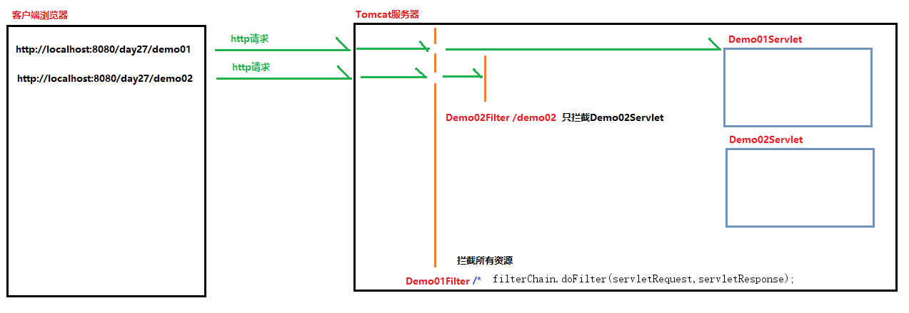
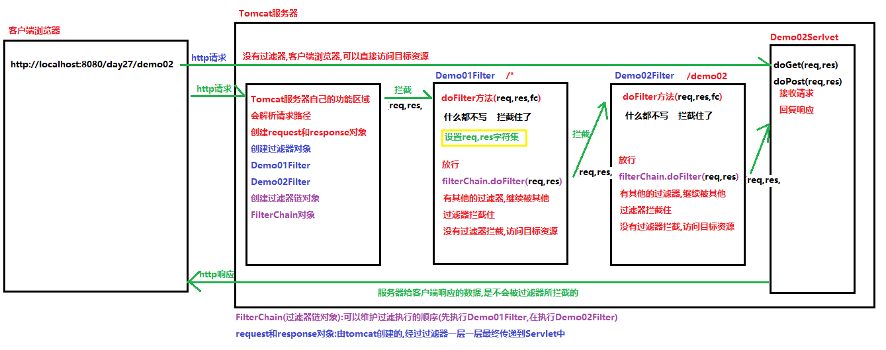
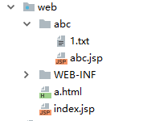
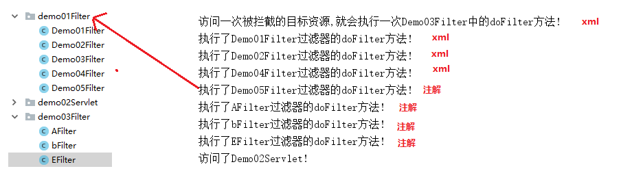
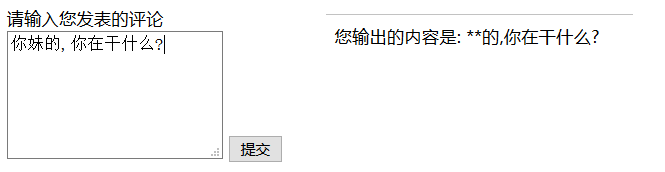
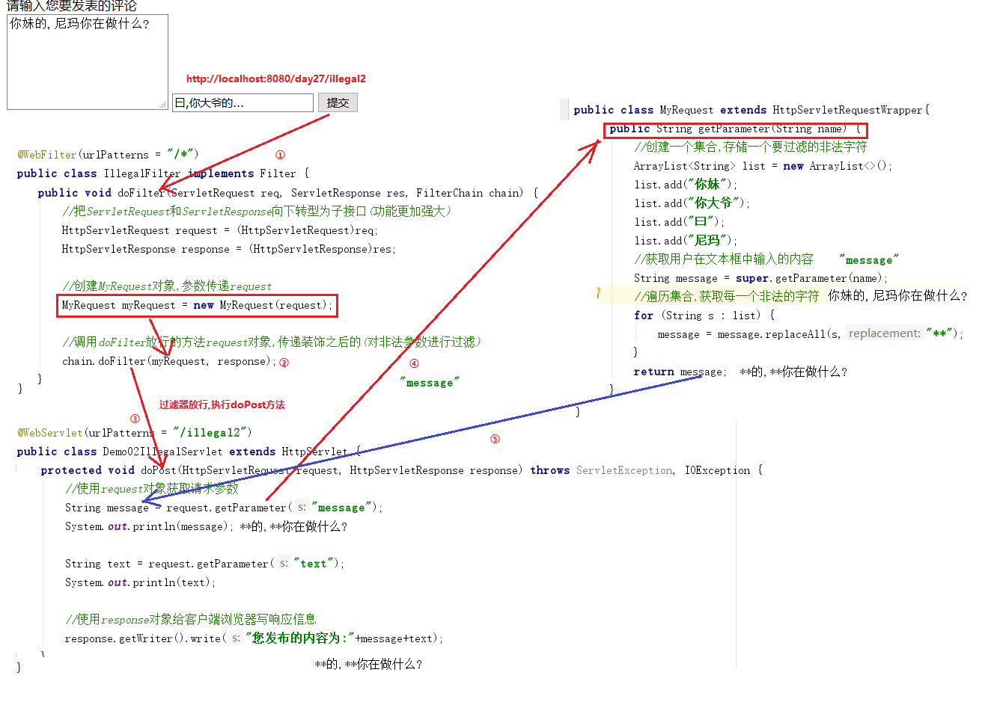
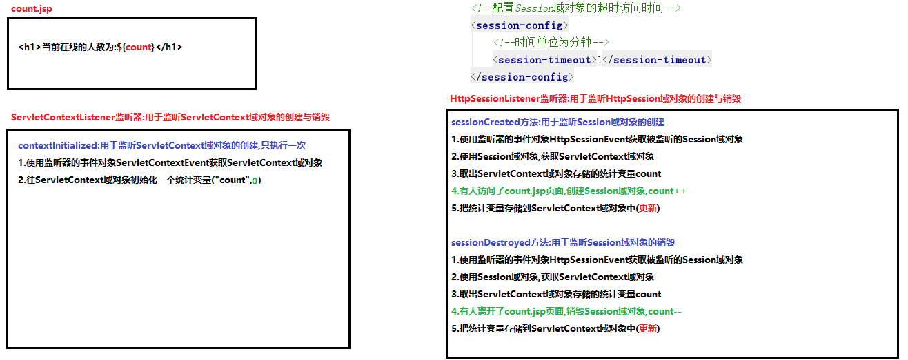
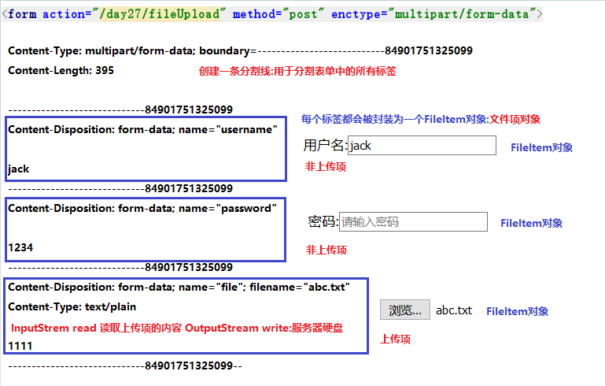

# 学习目标

```java
1. 能够说出过滤器的作用
	//过滤客户端访问的资源,起到拦截的作用
	//满足条件-->放行,继续访问
	//不满足条件-->拦截
2. 能够说出过滤器生命周期相关方法
	- init:初始化的方法,启动Tomcat服务器,就会创建Filter对象,执行init的方法
	- doFilter:过滤的方法,访问一次拦截的目标资源,就会执行一次
	- destroy:销毁的方法,关闭Tomcat服务器,就会销毁Filter对象,执行ddestroy的方法
3. 能够根据过滤路径判断指定的过滤器是否起作用
	全部匹配: /* 拦截所有资源   
	完全匹配: /demo  只拦截demo这个(Servlet)
	目录匹配: /abc/* 拦截abc目录下的所有资源
	后缀名匹配: *.jsp 拦截所有的jsp页面
4. 能够说出什么是过滤器链
	fitelrChain对象:由Tomcat引擎创建,可以维护过滤器的调用顺序(xml配置文件,Servlet名称顺序)
5. 能够编写过滤器解决全局乱码
	在过滤器中/* 过滤所有的资源
	在doFilter方法中,设置request对象和response对象的字符集
		req.setCharacterEncoding("utf-8");
		resp.setContentType("text/html;charset=utf-8");
	设置完成后放行,继续访问目标资源
    	chain.doFilter(req, resp);	
6. 能够理解并配置ServletContextListener
	用于监听ServletContext域对象的创建与销毁的监听器
	1.创建一个类实现ServletContextListener接口
    2.在实现类中重写ServletContextListener接口中的所有抽象方法(2个)
    3.在web.xml文件中或者使用注解对监听器进行配置
7. 能名使用fileupload实现文件上传
```

# 一.过滤器

## 1.过滤器概念

  过滤器: 过筛子,符合条件的过去,不符合条件不能过去.

  比喻: 安检,检查安全的人物通过

  程序: 客户端需要访问的目标资源,在客户端和资源之间设置过滤器,

  符合要求放行

## 2.实现过滤器程序(重点)

### 实现步骤

- 创建一个类实现Filter接口
- 在实现类中重写Filter接口中的所有抽象方法(3个)
- 在web.xml文件中/使用注解配置过滤器

```java
package com.itheima.demo01Filter;

import javax.servlet.*;
import java.io.IOException;

/*
    过滤器实现步骤:
        1.创建一个类实现Filter接口
        2.在实现类中重写Filter接口中的3个抽象方法
        3.在web.xml文件中|使用注解对过滤器进行配置
 */
public class Demo01Filter implements Filter{
    @Override
    public void init(FilterConfig filterConfig) throws ServletException {

    }

    @Override
    public void doFilter(ServletRequest servletRequest, ServletResponse servletResponse, FilterChain filterChain) throws IOException, ServletException {
        /*
            doFilter方法:起到过滤的作用
            每访问一次目标资源,都会被过滤器所拦截住,执行doFilter方法
            在doFilter方法中放行了,就可以继续执行目标资源
         */
        System.out.println("执行了Demo01Filter过滤器的doFilter方法!");
        //filterChain.doFilter:放行,可以继续访问目标资源
        filterChain.doFilter(servletRequest,servletResponse);
    }

    @Override
    public void destroy() {

    }
}
```

```xml
<?xml version="1.0" encoding="UTF-8"?>
<web-app xmlns="http://xmlns.jcp.org/xml/ns/javaee"
         xmlns:xsi="http://www.w3.org/2001/XMLSchema-instance"
         xsi:schemaLocation="http://xmlns.jcp.org/xml/ns/javaee http://xmlns.jcp.org/xml/ns/javaee/web-app_3_1.xsd"
         version="3.1">
    <!--
        对Demo01Filter过滤器进行配置:配置的方式大体和Servlet一样
    -->
    <filter>
        <filter-name>filter01</filter-name>
        <filter-class>com.itheima.demo01Filter.Demo01Filter</filter-class>
    </filter>
    <filter-mapping>
        <filter-name>filter01</filter-name>
        <!--
            url-pattern:配置拦截的资源
            /*:拦截web项目中所有的资源(Servlet,jsp,html,图片,文本...)
        -->
        <url-pattern>/*</url-pattern>
    </filter-mapping>
</web-app>
```

```java
package com.itheima.demo02Servlet;

import javax.servlet.ServletException;
import javax.servlet.annotation.WebServlet;
import javax.servlet.http.HttpServlet;
import javax.servlet.http.HttpServletRequest;
import javax.servlet.http.HttpServletResponse;
import java.io.IOException;

@WebServlet(urlPatterns = "/demo01")
public class Demo01Servlet extends HttpServlet {
    protected void doPost(HttpServletRequest request, HttpServletResponse response) throws ServletException, IOException {
        System.out.println("访问了Demo01Servlet!");
    }

    protected void doGet(HttpServletRequest request, HttpServletResponse response) throws ServletException, IOException {
        doPost(request, response);
    }
}
```

## 3.设置多重过滤器(重点)



```java
package com.itheima.demo01Filter;

import javax.servlet.*;
import java.io.IOException;

public class Demo02Filter implements Filter{
    @Override
    public void init(FilterConfig filterConfig) throws ServletException {

    }

    @Override
    public void doFilter(ServletRequest servletRequest, ServletResponse servletResponse, FilterChain filterChain) throws IOException, ServletException {
        System.out.println("执行了Demo02Filter过滤器的doFilter方法!");
        //放行
        filterChain.doFilter(servletRequest,servletResponse);
    }

    @Override
    public void destroy() {

    }
}
```

```java
package com.itheima.demo02Servlet;

import javax.servlet.ServletException;
import javax.servlet.annotation.WebServlet;
import javax.servlet.http.HttpServlet;
import javax.servlet.http.HttpServletRequest;
import javax.servlet.http.HttpServletResponse;
import java.io.IOException;

@WebServlet(urlPatterns = "/demo02")
public class Demo02Servlet extends HttpServlet {
    protected void doPost(HttpServletRequest request, HttpServletResponse response) throws ServletException, IOException {
        System.out.println("访问了Demo02Servlet!");
    }

    protected void doGet(HttpServletRequest request, HttpServletResponse response) throws ServletException, IOException {
        doPost(request, response);
    }
}

```

```xml
<filter>
    <filter-name>filter02</filter-name>
    <filter-class>com.itheima.demo01Filter.Demo02Filter</filter-class>
</filter>
<filter-mapping>
    <filter-name>filter02</filter-name>
    <!--
        url-pattern:配置拦截的资源
        /demo02:只拦截demo02这个Servlet
    -->
    <url-pattern>/demo02</url-pattern>
</filter-mapping>
```

## 4.过滤器的执行过程(面试)



## 5.过滤器的生命周期

- init:初始化的方法,启动Tomcat服务器,就会创建Filter对象,执行init的方法
- doFilter:过滤的方法,访问一次拦截的目标资源,就会执行一次
- destroy:销毁的方法,关闭Tomcat服务器,就会销毁Filter对象,执行destroy的方法
  - 重新部署项目,会先销毁之前所有的过滤器,在创建新的过滤器

```java
package com.itheima.demo01Filter;

import javax.servlet.*;
import java.io.IOException;

public class Demo03Filter implements Filter {
    public void init(FilterConfig config) throws ServletException {
        System.out.println("启动Tomcat服务器,创建Demo03Filter对象,执行init方法!");
    }

    public void doFilter(ServletRequest req, ServletResponse resp, FilterChain chain) throws ServletException, IOException {
        System.out.println("访问一次被拦截的目标资源,就会执行一次Demo03Filter中的doFilter方法!");
        chain.doFilter(req, resp);
    }

    public void destroy() {
        System.out.println("关闭Tomcat服务器,销毁Demo03Filter对象,执行destroy方法!");
    }
}
```

## 6.过滤器拦截资源的配置

```java
url-pattern:配置拦截的资源
1.全部匹配   /* 过滤web项目下的所有资源
2.完全匹配   /servlet2  只过滤servlet2
3.目录匹配(重点)  /abc/* 过滤abc目录下的所有资源
4.后缀名匹配    *.jsp 过滤所有以.jsp结尾的文件  *.txt 过滤所有以.txt结尾的文件
```

```xml
<filter>
    <filter-name>filter04</filter-name>
    <filter-class>com.itheima.demo01Filter.Demo04Filter</filter-class>
</filter>
<filter-mapping>
    <filter-name>filter04</filter-name>
    <!--
    url-pattern:配置拦截的资源
    1.全部匹配   /* 过滤web项目下的所有资源
    2.完全匹配   /servlet2  只过滤servlet2
    3.目录匹配(重点)  /abc/* 过滤abc目录下的所有资源
    4.后缀名匹配    *.jsp 过滤所有以.jsp结尾的文件  *.txt 过滤所有以.txt结尾的文件
    -->
    <!--<url-pattern>/*</url-pattern>-->
    <!--<url-pattern>/demo02</url-pattern>-->
    <!--<url-pattern>/abc/*</url-pattern>-->
    <url-pattern>*.jsp</url-pattern>
</filter-mapping>
```

```java
package com.itheima.demo01Filter;

import javax.servlet.*;
import java.io.IOException;

public class Demo04Filter implements Filter {
    public void destroy() {
    }

    public void doFilter(ServletRequest req, ServletResponse resp, FilterChain chain) throws ServletException, IOException {
        System.out.println("执行了Demo04Filter过滤器的doFilter方法!");
        chain.doFilter(req, resp);
    }

    public void init(FilterConfig config) throws ServletException {

    }
}
```



## 7.注解配置过滤器

```java
package com.itheima.demo01Filter;

import javax.servlet.*;
import javax.servlet.annotation.WebFilter;
import java.io.IOException;

/*
    注解的方式配置过滤器
    @WebFilter(urlPatterns = "拦截的资源")
 */
@WebFilter(urlPatterns = "/*")
public class Demo05Filter implements Filter{
    @Override
    public void init(FilterConfig filterConfig) throws ServletException {

    }

    @Override
    public void doFilter(ServletRequest servletRequest, ServletResponse servletResponse, FilterChain filterChain) throws IOException, ServletException {
        System.out.println("执行了Demo05Filter过滤器的doFilter方法!");
        filterChain.doFilter(servletRequest,servletResponse);
    }

    @Override
    public void destroy() {

    }
}
```

## 8.过滤器的执行顺序

### web.xml配置

  和配置文件的编写顺序决定运行的顺序,准确的说法是,根据mapping的顺序决定

  哪个过滤器的mapping写在了上边,就先执行哪个过滤器

### 注解开发

  注解开发没有配置文件的

  按照类名的自然顺序决定: A-B(b)-C;多个包中都有注解的方式,先按照包的顺序决定

  如果存在配置文件,配置文件优先



## 9.拦截方式(了解)

有了上面学习的映射路径，我们可以控制过滤器过滤指定的内容，但是我们在访问资源的时候，并不是每次都是之 间访问，有时是以转发的方式访问的，这就需要我们要让过滤器可以区分不同的访问资源的方式，有不同的拦截方 式。

```xml
<filter>
    <filter-name>filter06</filter-name>
    <filter-class>com.itheima.demo01Filter.Demo06Filter</filter-class>
</filter>
<filter-mapping>
    <filter-name>filter06</filter-name>
    <url-pattern>/*</url-pattern>
    <!--
       配置过滤器的拦截方式:
           dispatcher:
               REQUEST:默认配置,过滤访问的所有资源
               FORWARD:只过滤含有转发的资源
               INCLUDE:过滤页面中包含其他页面的资源
                   <jsp:include page="/footer.jsp"></jsp:include>
                   <%@include file="header.jsp"%>
   -->
    <dispatcher>FORWARD</dispatcher>
</filter-mapping>
```

```java
@WebFilter(urlPatterns = "/*",dispatcherTypes ={DispatcherType.FORWARD,DispatcherType.REQUEST} )
public class Demo06Filter implements Filter{
    @Override
    public void init(FilterConfig filterConfig) throws ServletException {

    }

    @Override
    public void doFilter(ServletRequest servletRequest, ServletResponse servletResponse, FilterChain filterChain) throws IOException, ServletException {
        System.out.println("执行了Demo06Filter过滤器的doFilter方法!");
        filterChain.doFilter(servletRequest,servletResponse);
    }

    @Override
    public void destroy() {

    }

```

```java
package com.itheima.demo02Servlet;

import javax.servlet.ServletException;
import javax.servlet.annotation.WebServlet;
import javax.servlet.http.HttpServlet;
import javax.servlet.http.HttpServletRequest;
import javax.servlet.http.HttpServletResponse;
import java.io.IOException;

@WebServlet(urlPatterns = "/demo04")
public class Demo04Servlet extends HttpServlet {
    protected void doPost(HttpServletRequest request, HttpServletResponse response) throws ServletException, IOException {
        System.out.println("访问了Demo04Servlet!");
        //实现转发
        request.getRequestDispatcher("/demo01").forward(request,response);
    }

    protected void doGet(HttpServletRequest request, HttpServletResponse response) throws ServletException, IOException {
        doPost(request, response);
    }
}
```

## 10.过滤器处理中文乱码

```jsp
<%@ page contentType="text/html;charset=UTF-8" language="java" %>
<html>
<head>
    <title>form表单</title>
</head>
<body>
    <form action="${pageContext.request.contextPath}/demo05" method="post">
        用户名<input type="text" name="username" placeholder="请输入用户名"/><br/>
        密码<input type="password" name="password" placeholder="请输入密码"/><br/>
        <input type="submit" value="登录"/>
    </form>
</body>
</html>
```

```java
package com.itheima.demo01Filter;

import javax.servlet.*;
import javax.servlet.annotation.WebFilter;
import java.io.IOException;

@WebFilter(urlPatterns = "/*")
public class Demo07CharacterFilter implements Filter{
    @Override
    public void init(FilterConfig filterConfig) throws ServletException {

    }

    @Override
    public void doFilter(ServletRequest servletRequest, ServletResponse servletResponse, FilterChain filterChain) throws IOException, ServletException {
        System.out.println("Demo07CharacterFilter过滤器的doFilter方法执行了,设置request和response对象的字符集!");
        //设置request和response对象的字符集==>拦截到的所有的资源,使用request和response对象都是设置后的
        servletRequest.setCharacterEncoding("utf-8");
        servletResponse.setContentType("text/html;charset=utf-8");
        //放行
        filterChain.doFilter(servletRequest,servletResponse);
    }

    @Override
    public void destroy() {

    }
}
```

```java
package com.itheima.demo02Servlet;

import javax.servlet.ServletException;
import javax.servlet.annotation.WebServlet;
import javax.servlet.http.HttpServlet;
import javax.servlet.http.HttpServletRequest;
import javax.servlet.http.HttpServletResponse;
import java.io.IOException;

@WebServlet(urlPatterns = "/demo05")
public class Demo05Servlet extends HttpServlet {
    protected void doPost(HttpServletRequest request, HttpServletResponse response) throws ServletException, IOException {
        //获取表单提交的数据
        String username = request.getParameter("username");
        String password = request.getParameter("password");
        System.out.println(username+"\t"+password);//杰克	1234
        //给客户端浏览器写响应信息
        response.getWriter().write("登陆成功!");
    }

    protected void doGet(HttpServletRequest request, HttpServletResponse response) throws ServletException, IOException {
        doPost(request, response);
    }
}
```

## 11.案例：非法字符普通版本

### 案例需求

当用户发出非法言论的时候，提示用户言论非法,或者替换为* 

### 案例效果 



### 代码实现

```jsp
<%@ page contentType="text/html;charset=UTF-8" language="java" %>
<html>
<head>
    <title>非法字符</title>
</head>
<body>
    <form action="${pageContext.request.contextPath}/illegal" method="post">
        请输入您发表的评论<br>
        <textarea cols="20" rows="5" name="message"></textarea>
        <input type="submit" value="提交">
    </form>
</body>
</html>

```

```java
package com.itheima.demo04illegal;

import javax.servlet.ServletException;
import javax.servlet.annotation.WebServlet;
import javax.servlet.http.HttpServlet;
import javax.servlet.http.HttpServletRequest;
import javax.servlet.http.HttpServletResponse;
import java.io.IOException;
import java.util.ArrayList;

@WebServlet(urlPatterns = "/illegal")
public class Demo01IllegalServlet extends HttpServlet {
    protected void doPost(HttpServletRequest request, HttpServletResponse response) throws ServletException, IOException {
        //创建一个集合,存储一个要过滤的非法字符
        ArrayList<String> list = new ArrayList<>();
        list.add("你妹");
        list.add("你大爷");
        list.add("曰");
        list.add("尼玛");

        //获取用户在文本框中输入的内容
        String message = request.getParameter("message");

        //遍历集合,获取每一个非法的字符
        for (String s : list) {
            message = message.replaceAll(s,"**");
        }

        //使用response对象给客户端浏览器写响应信息
        response.getWriter().write("您发布的内容为:"+message);
    }

    protected void doGet(HttpServletRequest request, HttpServletResponse response) throws ServletException, IOException {
        doPost(request, response);
    }
}
```

## 12.装饰设计模式

**装饰模式指的是在不改变原类, 不使用继承的基础上，动态地扩展一个对象的功能。**

### 1.代码实现

```java
package com.itheima.demo05Wapper;

import java.io.*;

/*
    装饰设计模式(重点)
    设置一个手机类
        打电话功能
        发短信的功能
    需求变更:
        对打电话的功能进行增强,在打电话之前听彩铃
        但是有人喜欢彩铃,有的人不喜欢彩铃
        不能在打电话原有的功能上进行修改,一旦修改所有的手机都必须的听彩铃
    所以我们就可以使用装饰设计模式
        对手机进行装饰,让喜欢听彩铃的人打电话之前听彩铃
        使用装饰者类装饰手机对象==>手机打电话之前听彩铃
        没有使用装饰者装饰手机对象==>打电话的功能不变
 */
public class Demo01Wapper {
    public static void main(String[] args) throws IOException {
        FirstPhone p1 = new FirstPhone();
        p1.call();
        p1.sendMessage();
        System.out.println("--------------------------------");
        //创建手机的装饰者对象,参数传递FirstPhone对象,对FirstPhone对象进行装饰
        PhoneWapper pw1 = new PhoneWapper(p1);
        pw1.call();//装饰后的方法
        pw1.sendMessage();
        System.out.println("--------------------------------");
        //创建手机的装饰者对象,参数传递SecondPhone对象,对FirstPhone对象进行装饰
        PhoneWapper pw2 = new PhoneWapper(new SecondPhone());
        pw2.call();
        pw2.sendMessage();
        System.out.println("--------------------------------");
        //java中有很多地方都使用了装饰者设计模式
        FileReader fr = new FileReader("day22\\1.txt");
        int len = fr.read();//一次读取一个字符效率低下

        //BufferedReader就是一个装饰者类,给FileReader增加一个缓冲区,提高FileReader读取文件的效率
        BufferedReader bw = new BufferedReader(fr);
        int len2 = bw.read();//把读取到的字符存储到内部的缓冲区中,一次性返回,提高效率
    }
}
```

```java
package com.itheima.demo05Wapper;

public abstract class Phone {
    public abstract void call();
    public abstract void sendMessage();
}
```

```java
package com.itheima.demo05Wapper;

public class FirstPhone extends Phone {
    @Override
    public void call() {
        System.out.println("使用手机打电话");
    }

    @Override
    public void sendMessage() {
        System.out.println("使用手机发短信");
    }
}
```

```java
package com.itheima.demo05Wapper;

public class SecondPhone extends Phone {
    @Override
    public void call() {
        System.out.println("使用手机打电话");
    }

    @Override
    public void sendMessage() {
        System.out.println("使用手机发短信");
    }
}

```

```java
package com.itheima.demo05Wapper;

/*
    创建手机类的装饰者类:用于对象手机对象进行装饰(增强手机的功能)
    要求:
        1.装饰者类必须和被装饰的类,继承相同的父类或者实现相同的接口
        2.把要装饰的手机对象,传递到装饰者类中,进行装饰
 */
public class PhoneWapper extends Phone{
    //定义一个Phone类型的成员变量
    private Phone phone;

    //创建PhoneWapper对象,就需要传递一个要装饰手机对象
    public PhoneWapper(Phone phone) {
        this.phone = phone;
    }

    @Override
    public void call() {
        //增强打电话的功能,打电话之前先听彩铃
        System.out.println("电话接通之前,请欣赏彩铃!");
        phone.call();//听完彩铃之后,继续调用对象打电话的方法
    }

    @Override
    public void sendMessage() {
        //发短信不增强,直接调用对象的发短信的方法
        phone.sendMessage();
    }
}
```

### **2.装饰模式小结**

装饰模式可以在不改变原类的基础上对类中的方法进行扩展增强,实现原则为:

1. 装饰类和被装饰类必须实现相同的接口,继承相同的父类
2. 在装饰类中必须传入被装饰类的引用(对象),使用构造方法传递
3. 在装饰类中对需要扩展的方法进行扩展
4. 在装饰类中对不需要扩展的方法调用被装饰类中的同名方法

## 11.案例：非法字符PLUS版本

### 案例需求

当用户发出非法言论的时候，提示用户言论非法,或者替换为* 

### 案例效果 


### 代码实现

```jsp
<%@ page contentType="text/html;charset=UTF-8" language="java" %>
<html>
<head>
    <title>论坛提交页面</title>
</head>
<body>
    <form action="${pageContext.request.contextPath}/illegal2" method="post">
        请输入您要发表的评论<br>
        <textarea cols="20" rows="5" name="message"></textarea>
        <input type="text" placeholder="请输入你想输入的内容" name="text"/>
        <input type="submit" value="提交"/>
    </form>
</body>
</html>
```

增强的类MyRequest

```java
package com.itheima.demo04illegal;

import javax.servlet.http.HttpServletRequest;
import javax.servlet.http.HttpServletRequestWrapper;
import java.util.ArrayList;

/*
    对HttpServletRequest进行装饰
    增强request对象中的getParameter方法
 */
public class MyRequest extends HttpServletRequestWrapper{

    //把要装饰的request对象传递到HttpServletRequestWrapper类中
    public MyRequest(HttpServletRequest request) {
        super(request);
    }

    //重写getParameter方法
    @Override
    public String getParameter(String name) {
        //创建一个集合,存储一个要过滤的非法字符
        ArrayList<String> list = new ArrayList<>();
        list.add("你妹");
        list.add("你大爷");
        list.add("曰");
        list.add("尼玛");
        //获取用户在文本框中输入的内容
        String message = super.getParameter(name);
        //遍历集合,获取每一个非法的字符
        for (String s : list) {
            message = message.replaceAll(s,"**");
        }
        return message;
    }
}
```

过滤器

```java
package com.itheima.demo04illegal;

import javax.servlet.*;
import javax.servlet.annotation.WebFilter;
import javax.servlet.http.HttpServletRequest;
import javax.servlet.http.HttpServletResponse;
import java.io.IOException;

@WebFilter(urlPatterns = "/*")
public class IllegalFilter implements Filter {
    public void destroy() {
    }

    public void doFilter(ServletRequest req, ServletResponse res, FilterChain chain) throws ServletException, IOException {
        //把ServletRequest和ServletResponse向下转型为子接口(功能更加强大)
        HttpServletRequest request = (HttpServletRequest)req;
        HttpServletResponse response = (HttpServletResponse)res;

        //创建MyRequest对象,参数传递request
        MyRequest myRequest = new MyRequest(request);

        //调用doFilter放行的方法request对象,传递装饰之后的(对非法参数进行过滤)
        chain.doFilter(myRequest, response);
    }

    public void init(FilterConfig config) throws ServletException {

    }

}
```

Servlet

```java
package com.itheima.demo04illegal;

import javax.servlet.ServletException;
import javax.servlet.annotation.WebServlet;
import javax.servlet.http.HttpServlet;
import javax.servlet.http.HttpServletRequest;
import javax.servlet.http.HttpServletResponse;
import java.io.IOException;

@WebServlet(urlPatterns = "/illegal2")
public class Demo02IllegalServlet extends HttpServlet {
    protected void doPost(HttpServletRequest request, HttpServletResponse response) throws ServletException, IOException {
        //使用request对象获取请求参数
        String message = request.getParameter("message");
        System.out.println(message);

        String text = request.getParameter("text");
        System.out.println(text);

        //使用response对象给客户端浏览器写响应信息
        response.getWriter().write("您发布的内容为:"+message+text);
    }

    protected void doGet(HttpServletRequest request, HttpServletResponse response) throws ServletException, IOException {
        doPost(request, response);
    }
}
```



# 二.监听器

## 1.监听器概述

监听器就是一个实现了特定接口的Java类，这个Java类用于监听另一个Java类的方法调用或者属性的改变。当被监听对象发生上述事件后，监听器某个方法将会立即被执行。 

 监听器监听某个组件变化的对象. 事件源是固定的,主要是request,session,servletcontext域对象

  监听的是域对象变化, 对象的创建和销毁, 域对象中存储的数据变化

- **一类：监听三个域对象的创建和销毁的监听器（三个）**
- 二类：监听三个域对象的属性变更（属性添加、移除、替换）的监听器（三个）
- 三类：监听HttpSession中JavaBean的状态改变（钝化、活化、绑定、解除绑定）的监听（两个）

## 2.ServletContext监听器入门

**ServletContextListener监听器作用：**

- 用于监听ServletContext域对象的创建与销毁的监听器

**ServletContext域的生命周期：**

- 何时创建：在服务器启动的时候，Tomcat为每个web应用创建单独的ServletContext对象。
- 何时销毁：在服务器关闭的时候，或者项目从web服务器中移除的时候。
- 作用范围：整个web应用

**ServletContextListener监听器的API：**

| 方法               | 返回值 | 描述                           |
| ------------------ | ------ | ------------------------------ |
| contextInitialized | void   | 监听ServletContext对象的创建   |
| contextDestroyed   | void   | 监听contextDestroyed对象的销毁 |

### 实现步骤

- 创建类实现监听器接口 ServletContextListener
- 重写抽象方法
- web.xml配置(注解)

```java
package com.itheima.demo06Listener;

import javax.servlet.ServletContextEvent;
import javax.servlet.ServletContextListener;

/*
    ServletContextListener监听器的使用步骤;
        1.创建实现类,实现ServletContextListener接口
        2.在实现类中重写ServletContextListener接口中抽象方法(2个)
        3.在web.xml文件中|使用注解对监听器进行配置
 */
public class Demo01ServletContextListener implements ServletContextListener{
    @Override
    public void contextInitialized(ServletContextEvent servletContextEvent) {
        System.out.println("tomcat启动了,创建了ServletContext对象!");
    }

    @Override
    public void contextDestroyed(ServletContextEvent servletContextEvent) {
        System.out.println("tomcat关闭了,销毁了ServletContext对象!");
    }
}
```

```xml
<listener>
    <listener-class>com.itheima.demo06Listener.Demo01ServletContextListener</listener-class>
</listener>
```

## 3.监听器事件对象

```java
package com.itheima.demo06Listener;

import javax.servlet.ServletContext;
import javax.servlet.ServletContextEvent;
import javax.servlet.ServletContextListener;
import javax.servlet.annotation.WebListener;

@WebListener
public class Demo02ServletContextListener implements ServletContextListener{
    /*
        contextInitialized:用于监听ServletContext域对象的创建
        参数:
            ServletContextEvent servletContextEvent:监听器的事件对象
        作用:
            用于获取被监听的对象ServletContext
            getServletContext:只有在ServletContextListener监听器中可以使用
                ServletContext context1 = servletContextEvent.getServletContext();
            getSource:在所有的监听器中都可以使用,在哪个监听器中使用,就获取哪个监听器监听的对象
            Object context2 = servletContextEvent.getSource();
     */
    @Override
    public void contextInitialized(ServletContextEvent servletContextEvent) {
        ServletContext context1 = servletContextEvent.getServletContext();
        System.out.println(context1);//org.apache.catalina.core.ApplicationContextFacade@1fa54d11
        //可以往ServletContext域对象中存储数据(只执行一次,初始化一些数据)
        context1.setAttribute("heima","javaEE");

        Object context2 = servletContextEvent.getSource();
        System.out.println(context2);//org.apache.catalina.core.ApplicationContextFacade@1fa54d11

    }

    @Override
    public void contextDestroyed(ServletContextEvent servletContextEvent) {

    }
}
```

## 4.Session监听器入门

**HttpSessionListener监听器作用：**

- 用来监听HttpSession域对象的创建和销毁。

**HttpSessionListener域的生命周期：**

- 何时创建：
  - 服务器端第一次调用getSession()方法时候。
  - 访问jsp页面
- 何时销毁：
  - 非正常关闭服务器（正常关闭服务器session会被序列化）。
  - Session过期（默认过期时间30分钟）。
  - 手动调用session.invalidate()方法。

> 思考：
>
> - 访问HTML是否创建Session：不会
> - 访问JSP是否创建Session：会
> - 访问Servlet是否创建Session：不会（默认没有调用getSession方法）

**HttpSessionListener监听器的API：**

| 方法                                  | 返回值 | 描述                      |
| ------------------------------------- | ------ | ------------------------- |
| sessionCreated(HttpSessionEvent se)   | void   | 监听HttpSession对象的创建 |
| sessionDestoryed(HttpSessionEvent se) | void   | 监听HttpSession对象的销毁 |

**代码演示：**

### HttpSessionListener监听器创建

```java
package com.itheima.demo06Listener;

import javax.servlet.annotation.WebListener;
import javax.servlet.http.HttpSessionEvent;
import javax.servlet.http.HttpSessionListener;

/*
    HttpSessionListener监听器:用于监听Session域对象的创建与销毁
    使用步骤:
        1.创建实现类,实现HttpSessionListener接口
        2.在实现类中,重写HttpSessionListener接口中的抽象方法
        3.在web.xml文件中|使用注解配置监听器
 */
@WebListener
public class Demo03HttpSessionListener implements HttpSessionListener{
    /*
        sessionCreated方法:用于监听HttpSession域对象的创建
     */
    @Override
    public void sessionCreated(HttpSessionEvent httpSessionEvent) {
        System.out.println("session域对象创建了!");
    }

    /*
        sessionDestroyed方法:用于监听HttpSession域对象的销毁
     */
    @Override
    public void sessionDestroyed(HttpSessionEvent httpSessionEvent) {
        System.out.println("session域对象销毁了!");
    }
}
```

### 使用getSession方法获取HttpSession域对象

```java
package com.itheima.demo06Listener;

import javax.servlet.ServletException;
import javax.servlet.annotation.WebServlet;
import javax.servlet.http.HttpServlet;
import javax.servlet.http.HttpServletRequest;
import javax.servlet.http.HttpServletResponse;
import javax.servlet.http.HttpSession;
import java.io.IOException;

@WebServlet(urlPatterns = "/servlet04")
public class Demo04Servlet extends HttpServlet {
    protected void doPost(HttpServletRequest request, HttpServletResponse response) throws ServletException, IOException {
        //获取Session域对象
        HttpSession session = request.getSession();
        System.out.println(session);

        //睡眠5秒钟之后在销毁获取到Session对象
        try {
            Thread.sleep(5000);
        } catch (InterruptedException e) {
            e.printStackTrace();
        }

        //用于销毁Session对象
        session.invalidate();
    }

    protected void doGet(HttpServletRequest request, HttpServletResponse response) throws ServletException, IOException {
        doPost(request, response);
    }
}
```

### 修改Session的超时访问时间

```xml
<!--配置Session域对象的超时访问时间-->
<session-config>
    <!--时间单位为分钟-->
    <session-timeout>1</session-timeout>
</session-config>
```

### 测试Session的超时访问时间

```java
package com.itheima.demo06Listener;

import javax.servlet.ServletException;
import javax.servlet.annotation.WebServlet;
import javax.servlet.http.HttpServlet;
import javax.servlet.http.HttpServletRequest;
import javax.servlet.http.HttpServletResponse;
import javax.servlet.http.HttpSession;
import java.io.IOException;

@WebServlet(urlPatterns = "/servlet05")
public class Demo05Servlet extends HttpServlet {
    protected void doPost(HttpServletRequest request, HttpServletResponse response) throws ServletException, IOException {
        //获取Session域对象
        HttpSession session = request.getSession();
        System.out.println(session);

        for (int i = 0; i < 1000; i++) {
            System.out.println(i);
            //睡眠1秒钟
            try {
                Thread.sleep(1000);
            } catch (InterruptedException e) {
                e.printStackTrace();
            }
        }
    }

    protected void doGet(HttpServletRequest request, HttpServletResponse response) throws ServletException, IOException {
        doPost(request, response);
    }
}
```

注意:

​	访问jsp页面会创建Session对象,销毁的时间看web.xml文件中如何配置

# 三.统计在线人数案例

## 1.需求分析:



## 2.代码实现:

### count.jsp

```jsp
<%@ page contentType="text/html;charset=UTF-8" language="java" %>
<html>
<head>
    <title>统计在线人数案例</title>
</head>
<body>
    <h1>当前的在线人数为:${count}</h1>
    <a href="${pageContext.request.contextPath}/servlet04" target="_blank">退出</a>
</body>
</html>
```

### 创建ServletContextListener监听器

```java
package com.itheima.demo07count;

import javax.servlet.ServletContext;
import javax.servlet.ServletContextEvent;
import javax.servlet.ServletContextListener;
import javax.servlet.annotation.WebListener;

//ServletContextListener:用于监听ServletContext域对象的创建与销毁
@WebListener
public class Demo01ServletContextListener implements ServletContextListener{
    //contextInitialized方法:用于监听ServletContext域对象的创建
    @Override
    public void contextInitialized(ServletContextEvent servletContextEvent) {
        //1.使用监听器的事件对象ServletContextEvent获取被监听的ServletContext域对象
        ServletContext context = servletContextEvent.getServletContext();
        //2.往ServletContext域对象,初始化存储一个统计变量
        context.setAttribute("count",0);
    }

    @Override
    public void contextDestroyed(ServletContextEvent servletContextEvent) {

    }
}
```

### 创建HttpSessionListener监听器

```java
package com.itheima.demo07count;

import javax.servlet.ServletContext;
import javax.servlet.annotation.WebListener;
import javax.servlet.http.HttpSession;
import javax.servlet.http.HttpSessionEvent;
import javax.servlet.http.HttpSessionListener;

//HttpSessionListener监听器:用于监听Session域对象的创建与销毁
@WebListener
public class Demo02HttpSessionListener implements HttpSessionListener{
    @Override
    public void sessionCreated(HttpSessionEvent httpSessionEvent) {
        //sessionCreated方法:用于监听Session域对象的创建
        //1.使用监听器的事件对象HttpSessionEvent获取被监听的Session域对象
        HttpSession session = httpSessionEvent.getSession();
        //2.使用Session域对象,获取ServletContext域对象
        ServletContext context = session.getServletContext();
        //3.取出ServletContext域对象存储的统计变量count
        int count = (int)context.getAttribute("count");
        //4.有人访问了count.jsp页面,创建Session域对象,count++
        count++;
        //5.把统计变量存储到ServletContext域对象中(更新)
        context.setAttribute("count",count);
        System.out.println("有人访问了count.jsp页面,创建Session域对象,count++==>"+count);
    }

    @Override
    public void sessionDestroyed(HttpSessionEvent httpSessionEvent) {
        //sessionDestroyed方法:用于监听Session域对象的销毁
        HttpSession session = httpSessionEvent.getSession();
        //2.使用Session域对象,获取ServletContext域对象
        ServletContext context = session.getServletContext();
        //3.取出ServletContext域对象存储的统计变量count
        int count = (int)context.getAttribute("count");
        //4.有人离开了count.jsp页面,销毁Session域对象,count--
        count--;
        //5.把统计变量存储到ServletContext域对象中(更新)
        context.setAttribute("count",count);
        System.out.println("有人离开了count.jsp页面,销毁Session域对象,count--==>"+count);
    }
}
```

### web.xml

```xml
<!--配置Session域对象的超时访问时间-->
<session-config>
    <!--时间单位为分钟-->
    <session-timeout>1</session-timeout>
</session-config>
```

# 四.文件上传 

## 1.上传文件的概述

文件上传：将本地的文件通过流写入到服务器的过程。 

## 2.上传文件的使用场景

实际开发中有很多应用：

- QQ空间上传图片
- 招聘网站上传简历

## 3.上传文件的技术

- JSPSmartUpload：应用在JSP上的文件上传和下载的组件。
- **FileUpload：应用在Java环境上的文件上传的功能。**
- Servlet3.0：提供文件上传的功能
- Struts2：提供文件上传的功能
- SpringMVC: 支持上传

## 4.上传文件的注意事项

上传文件的三个要素

- 表单的提交的方式需要是POST
- 表单中需要有<input type="file">元素，需要有name属性和值。
- 表单enctype=”multipart/form-data”  
  - multipart:多部件

## 5.上传文件的原理分析 

fileUpload.html

```html
<!DOCTYPE html>
<html lang="zh">
<head>
    <meta charset="UTF-8">
    <title>文件上传</title>
</head>
<body>
    <h1>支持文件上传的表单</h1>
    <form action="/day27/fileUpload" method="post" enctype="multipart/form-data">
        用户名:<input type="text" name="username" placeholder="请输入用户名"/><br>
        密码:<input type="password" name="password" placeholder="请输入密码"/><br>
        请选择您要上传的文件<br>
        <input type="file" name="file"/><br>
        <input type="submit" value="提交">
    </form>
</body>
</html>
```



## 6.文件上传的api

1. 导入2个jar

   ```java
   commons-fileupload-1.2.1.jar
   commons-io-1.4.jar
   ```

2. 常用的类

   ```java
   DiskFileItemFactory：磁盘文件项工厂
   	构造方法:
   		DiskFileItemFactory()
   ServletFileUpload：核心解析类,构造方法参数需要传递DiskFileItemFactory对象
   	构造方法:
   		ServletFileUpload(FileItemFactory fileItemFactory)
   	成员方法:
   		List<Fileitem> parseRequest(request) 解析request对象
   ```

3. FileItem: 文件项(非上传项,上传项)

   ```java
   成员方法:
   		isFormField() 判断是否为非上传项,true:非上传项,false:上传项
   		getFieldName() 获取非上传文件的name属性值
   		getString(java.lang.String encoding) 获取非上传文件的value值,里面可以设置编码
           getName() 获取上传文件的文件名称
   		getInputStream() 获取输入流–是上传的文件类型
   ```

## 7.文件上传的代码实现

```java
package com.itheima.demo08fileUpload;

import org.apache.commons.fileupload.FileItem;
import org.apache.commons.fileupload.FileUploadException;
import org.apache.commons.fileupload.disk.DiskFileItemFactory;
import org.apache.commons.fileupload.servlet.ServletFileUpload;

import javax.servlet.ServletException;
import javax.servlet.annotation.WebServlet;
import javax.servlet.http.HttpServlet;
import javax.servlet.http.HttpServletRequest;
import javax.servlet.http.HttpServletResponse;
import java.io.FileOutputStream;
import java.io.IOException;
import java.io.InputStream;
import java.util.List;

@WebServlet(urlPatterns = "/fileUpload")
public class FileUploadServlet extends HttpServlet {
    protected void doPost(HttpServletRequest request, HttpServletResponse response) throws ServletException, IOException {
        /*
            文件上传的实现步骤:
                1.创建磁盘文件工厂类DiskFileItemFactory对象
                2.创建文件上传的核心类ServletFileUpload对象,构造方法中传递DiskFileItemFactory对象
                3.使用ServletFileUpload对象中的方法parseRequest,解析request对象,获取所有的FileItem对象,存储到一个List集合中返回
                4.遍历集合,获取每一个FileItem文件项对象
                5.使用FileItem文件对象中的方法isFormField,判断文件项是非上传项,还是上传项
                    true:非上传项
                        使用FileItem对象中的方法getFieldName,获取input标签的name的属性值
                        使用FileItem对象中的方法getString("utf-8")获取input标签的value的属性值(页面中输入的内容)
                    false:上传项
                        使用FileItem对象中的方法getName,获取上传的文件名称
                        使用FileItem对象中的方法getInputStream获取网络字节输入流
                        创建FileOutputStream对象,构造方法中绑定要写入目的地(服务器的硬盘) "d:\\upload\\"+fileName
                        一读一写复制文件
                        释放资源
         */
        try {
            //1.创建磁盘文件工厂类DiskFileItemFactory对象
            DiskFileItemFactory factory = new DiskFileItemFactory();
            //2.创建文件上传的核心类ServletFileUpload对象,构造方法中传递DiskFileItemFactory对象
            ServletFileUpload fileUpload = new ServletFileUpload(factory);

            //ServletFileUpload中的方法:解决中文文件名上传的乱码
            fileUpload.setHeaderEncoding("utf-8");

            //3.使用ServletFileUpload对象中的方法parseRequest,解析request对象,获取所有的FileItem对象,存储到一个List集合中返回
            List<FileItem> fileItemList = fileUpload.parseRequest(request);
            //4.遍历集合,获取每一个FileItem文件项对象
            for (FileItem fileItem : fileItemList) {
                //5.使用FileItem文件对象中的方法isFormField,判断文件项是非上传项,还是上传项
                if(fileItem.isFormField()){
                    //true:非上传项
                    //使用FileItem对象中的方法getFieldName,获取input标签的name的属性值
                    String fieldName = fileItem.getFieldName();
                    //使用FileItem对象中的方法getString("utf-8")获取input标签的value的属性值(页面中输入的内容)
                    String value = fileItem.getString("utf-8");
                    System.out.println(fieldName+"="+value);
                }else{
                    //false:上传项
                    //使用FileItem对象中的方法getName,获取上传的文件名称
                    String fileName = fileItem.getName();
                    //使用FileItem对象中的方法getInputStream获取网络字节输入流
                    InputStream is = fileItem.getInputStream();
                    //创建FileOutputStream对象,构造方法中绑定要写入目的地(服务器的硬盘) "d:\\upload\\"+fileName
                    FileOutputStream fos = new FileOutputStream("d:\\upload\\"+fileName);
                    //一读一写复制文件
                    byte[] bytes = new byte[1024];
                    int len = 0;
                    while ((len=is.read(bytes))!=-1){
                        fos.write(bytes,0,len);
                    }
                    //释放资源
                    fos.close();
                    is.close();
                }
            }
        } catch (Exception e) {

        }
    }

    protected void doGet(HttpServletRequest request, HttpServletResponse response) throws ServletException, IOException {
        doPost(request, response);
    }
}

/*
    //获取用户表单提交的数据(用户名,密码,上传的文件)
        String username = request.getParameter("username");
        String password = request.getParameter("password");
        System.out.println(username+"\t"+password);
        String file = request.getParameter("file");
        System.out.println(file);//abc.txt 文件的名称
 */
```

注意:

ServletFileUpload中的方法:解决中文文件名上传的乱码

```java
setHeaderEncoding(java.lang.String encoding) 
fileUpload.setHeaderEncoding("utf-8");
```

FileItem文件项:解决非上传项,乱码问题

```java
getString(java.lang.String encoding) 获取非上传文件的value值,里面可以设置编码
String value = fileItem.getString("utf-8"); //支持非上传文件书写中文
```

