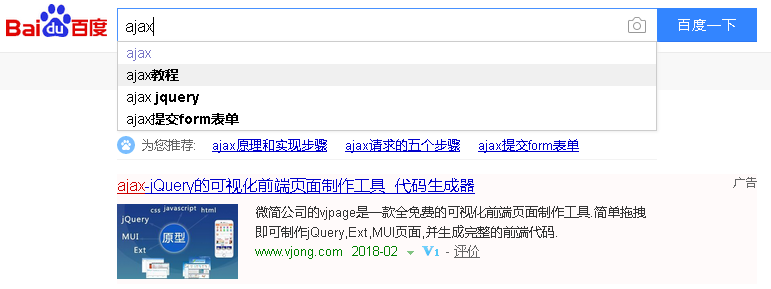

# 学习目标

```java
1. 能够使用mvc及三层实现用户的列表查询操作
2. 能够使用mvc及三层实现用户的新增操作
3. 能够使用mvc及三层实现用户的修改操作
4. 能够使用mvc及三层实现用户的删除操作
5. 能够使用ajax实现验证用户名是否存在
```

# 第1章 用户管理CRUD操作

## 1. 项目概述 

```
黑马旅游本着以“让旅游更简单”为使命，为消费者提供由各大城市出发的旅游产品预订服务，产品全面，价格透明，全年365天24小时400电话预订，并提供丰富的后续服务和保障。
其中用户信息管理针对用户的大量业务处理工作而开发的管理软件，主要用于本网站注册用户的信息管理，总体任务是实现用户信息的系统化、科学化、规范化和自动化，其主要任务是用计算机对用户各种信息进行日常管理，如查询、修改、增加、删除等功能。
```

## 2. 项目案例需求 

我们本次课程的目标就是完成对用户信息的管理，实现用户信息的增、删、改、查操作。 

## 3. 查询所有用户信息

### 1).需求

点击首页上的超链接"显示所有",查询出所有用户,展示在list.jsp


### 2).需求分析


### 3).代码实现

#### 添加jar包,js,css和页面


#### User

```java
package com.itheima.pojo;

public class User {
    private String id;
    private String name;
    private String sex;
    private int age;
    private String address;
    private String qq;
    private String email;

    public User() {
    }

    public User(String id, String name, String sex, int age, String address, String qq, String email) {
        this.id = id;
        this.name = name;
        this.sex = sex;
        this.age = age;
        this.address = address;
        this.qq = qq;
        this.email = email;
    }

    public String getId() {
        return id;
    }

    public void setId(String id) {
        this.id = id;
    }

    public String getName() {
        return name;
    }

    public void setName(String name) {
        this.name = name;
    }

    public String getSex() {
        return sex;
    }

    public void setSex(String sex) {
        this.sex = sex;
    }

    public int getAge() {
        return age;
    }

    public void setAge(int age) {
        this.age = age;
    }

    public String getAddress() {
        return address;
    }

    public void setAddress(String address) {
        this.address = address;
    }

    public String getQq() {
        return qq;
    }

    public void setQq(String qq) {
        this.qq = qq;
    }

    public String getEmail() {
        return email;
    }

    public void setEmail(String email) {
        this.email = email;
    }
}
```

#### index.jsp

```jsp
<%@ page contentType="text/html;charset=UTF-8" language="java" %>
<html>
  <head>
    <title>$Title$</title>
  </head>
  <body>
    <a href="${pageContext.request.contextPath}/findAll">查询所有</a>
  </body>
</html>
```

#### FindAllUserServlet

```java
package com.itheima.web;

import com.itheima.pojo.User;
import com.itheima.service.UserService;

import javax.servlet.ServletException;
import javax.servlet.annotation.WebServlet;
import javax.servlet.http.HttpServlet;
import javax.servlet.http.HttpServletRequest;
import javax.servlet.http.HttpServletResponse;
import javax.servlet.http.HttpSession;
import java.io.IOException;
import java.util.List;

@WebServlet(urlPatterns = "/findAll")
public class FindAllUserServlet extends HttpServlet {
    protected void doPost(HttpServletRequest request, HttpServletResponse response) throws ServletException, IOException {
        /*
            1.设置request对象和response对象字符集(过滤器中设置)
            2.创建UserService对象
            3.调用UserService对象中的findAll方法,获取查询的结果List<User>
            4.获取Session域对象
            5.把List集合存储到Session域对象中
            6.重定向到list.jsp页面
         */
        //2.创建UserService对象
        UserService service = new UserService();
        //3.调用UserService对象中的findAll方法,获取查询的结果List<User>
        List<User> list = service.findAll();
        //4.获取Session域对象
        HttpSession session = request.getSession();
        //5.把List集合存储到Session域对象中
        session.setAttribute("userList",list);
        //6.重定向到list.jsp页面
        response.sendRedirect(request.getContextPath()+"/list.jsp");
    }

    protected void doGet(HttpServletRequest request, HttpServletResponse response) throws ServletException, IOException {
        doPost(request, response);
    }
}
```

#### UserService

```java
package com.itheima.service;

import com.itheima.dao.UserDao;
import com.itheima.pojo.User;

import java.util.List;

/*
    service层:承上启下
        获取web的参数
        调用dao层的功能,获取结果
        把结果在返回给web层
 */
public class UserService {
    /*
        定义一个查询所有数据的方法
        创建UserDao对象
        调用UserDao对象中的方法findAll方法,获取List集合
        把集合在返回给web层
     */
    public List<User> findAll(){
        UserDao dao = new UserDao();
        List<User> list = dao.findAll();
        return list;
    }
}

```

#### UserDao

```java
package com.itheima.dao;

import com.itheima.pojo.User;

import java.util.ArrayList;
import java.util.List;

/*
    dao层:对数据库表进行增删改查
 */
public class UserDao {
    //创建List集合,泛型使用User
    static List<User> list;
    //定义一个静态代码块,给List集合进行初始化赋值(优先执行,只执行一次)
    static {
        list = new ArrayList<>();
        list.add(new User("1","张三","男",11,"广州","766335435","766335435@qq.com"));
        list.add(new User("2","李四","男",12,"上海","243434342","243434342@qq.com"));
        list.add(new User("3","王五","女",13,"广州","47454574","47454574@qq.com"));
        list.add(new User("4","赵六","男",14,"北京","987069697","987069697@qq.com"));
        list.add(new User("5","钱七","女",15,"广州","412132145","412132145@qq.com"));
    }

    /*
        定义一个查询所有数据的方法
        在方法中返回List集合
     */
    public List<User> findAll(){
        return list;
    }
}

```

#### list.jsp

别忘记导入标签库

```jsp
<%@ taglib prefix="c" uri="http://java.sun.com/jsp/jstl/core" %>
<%@ page contentType="text/html;charset=UTF-8" language="java" %>
<!DOCTYPE html>
<!-- 网页使用的语言 -->
<html lang="zh-CN">
<head>
    <!-- 指定字符集 -->
    <meta charset="utf-8">
    <!-- 使用Edge最新的浏览器的渲染方式 -->
    <meta http-equiv="X-UA-Compatible" content="IE=edge">
    <!-- viewport视口：网页可以根据设置的宽度自动进行适配，在浏览器的内部虚拟一个容器，容器的宽度与设备的宽度相同。
    width: 默认宽度与设备的宽度相同
    initial-scale: 初始的缩放比，为1:1 -->
    <meta name="viewport" content="width=device-width, initial-scale=1">
    <!-- 上述3个meta标签*必须*放在最前面，任何其他内容都*必须*跟随其后！ -->
    <title>用户信息管理系统</title>

    <!-- 1. 导入CSS的全局样式 -->
    <link href="css/bootstrap.min.css" rel="stylesheet">
    <!-- 2. jQuery导入，建议使用1.9以上的版本 -->
    <script src="js/jquery-2.1.0.min.js"></script>
    <!-- 3. 导入bootstrap的js文件 -->
    <script src="js/bootstrap.min.js"></script>
    <style type="text/css">
        td, th {
            text-align: center;
        }
    </style>
</head>
<body>
<div class="container">
    <h3 style="text-align: center">用户信息列表</h3>
    <table border="1" class="table table-bordered table-hover">
        <tr class="success">
            <th>编号</th>
            <th>姓名</th>
            <th>性别</th>
            <th>年龄</th>
            <th>籍贯</th>
            <th>QQ</th>
            <th>邮箱</th>
            <th>操作</th>
        </tr>
        <%--取出session域对象中的userList集合,遍历集合,获取每一个User对象,获取对象的属性,给用户展示--%>
        <c:forEach items="${userList}" var="user">
            <tr>
                <td>${user.id}</td>
                <td>${user.name}</td>
                <td>${user.sex}</td>
                <td>${user.age}</td>
                <td>${user.address}</td>
                <td>${user.qq}</td>
                <td>${user.email}</td>
                <td><a class="btn btn-default btn-sm" href="update.html">修改</a>&nbsp;
                     <a class="btn btn-default btn-sm" href="">删除</a>
                </td>
            </tr>
        </c:forEach>
    </table>
</div>
</body>
</html>

```

## 4.添加用户

### 1).需求

当用户点击“添加联系人”按钮，跳转到新增页面，用户输入信息后，点击“提交”按钮，保存数据到List集合中，
然后再跳转到list.jsp页面，展示用户列表信息。 

### 2).需求分析


### 3).代码实现

把add.jsp页面添加到web中


AddUserServlet

```java
package com.itheima.web;

import com.itheima.pojo.User;
import com.itheima.service.UserService;
import com.itheima.utils.UUIDUtils;
import org.apache.commons.beanutils.BeanUtils;

import javax.servlet.ServletException;
import javax.servlet.annotation.WebServlet;
import javax.servlet.http.HttpServlet;
import javax.servlet.http.HttpServletRequest;
import javax.servlet.http.HttpServletResponse;
import java.io.IOException;
import java.lang.reflect.InvocationTargetException;
import java.util.List;
import java.util.Map;

@WebServlet(urlPatterns = "/add")
public class AddUserServlet extends HttpServlet {
    protected void doPost(HttpServletRequest request, HttpServletResponse response) throws ServletException, IOException {
        /*
            1.获取用户表单提交的所有数据 map
            2.创建User对象
            3.把map集合中数据封装到User对象中
            4.调用service层的添加用户的方法
            5.添加成功,重定向到查询所有的Servlet
            问题:没有给用户设置id
                1).获取所有用户,获取最后一个用户的id,把id+1,作为新的用户的id
                2).可以使用java提供的UUID类获取一个36位的随机数,作为id
         */
        try {
            //1.获取用户表单提交的所有数据 map
            Map<String, String[]> map = request.getParameterMap();
            //2.创建User对象
            User user = new User();
            //3.把map集合中数据封装到User对象中
            BeanUtils.populate(user,map);
            //4.调用service层的添加用户的方法
            UserService service = new UserService();

            //1).获取所有用户,获取最后一个用户的id,把id+1,作为新的用户的id
            List<User> list = service.findAll();
            String id = Integer.parseInt(list.get(list.size()-1).getId())+1+"";

            //2).可以使用java提供的UUID类获取一个36位的随机数,作为id
            //String id = UUIDUtils.getId();

            user.setId(id);
            service.addUser(user);
            //5.添加成功,重定向到查询所有的Servlet
            response.sendRedirect(request.getContextPath()+"/findAll");
        } catch (Exception e) {
            e.printStackTrace();
        }
    }

    protected void doGet(HttpServletRequest request, HttpServletResponse response) throws ServletException, IOException {
        doPost(request, response);
    }
}
```

UUIDUtils

```java
package com.itheima.utils;

import java.util.UUID;

public class UUIDUtils {

    public static String getId(){
        return UUID.randomUUID().toString().replaceAll("-","");
    }

    public static void main(String[] args) {
        for (int i = 0; i < 100; i++) {
            String s = UUID.randomUUID().toString().replaceAll("-","");
            System.out.println(s);
        }
    }
}
```

UserService

```java
package com.itheima.service;

import com.itheima.dao.UserDao;
import com.itheima.pojo.User;

import java.util.List;

/*
    service层:承上启下
        获取web的参数
        调用dao层的功能,获取结果
        把结果在返回给web层
 */
public class UserService {
    /*
        1.创建一个添加用户的方法,参数接收User对象
     */
    public void addUser(User user) {
        //2.调用dao中添加用户的方法
        UserDao dao = new UserDao();
        dao.addUser(user);
    }
}

```

UserDao

```java
package com.itheima.dao;

import com.itheima.pojo.User;

import java.util.ArrayList;
import java.util.List;

/*
    dao层:对数据库表进行增删改查
 */
public class UserDao {
    /*
        1.创建一个添加用户的方法,参数接收User对象
     */
    public void addUser(User user) {
        //2.把User对象保存到list集合中
        list.add(user);
    }
}
```


## 5.解决全站乱码

```java
package com.itheima.web;

import javax.servlet.*;
import javax.servlet.annotation.WebFilter;
import java.io.IOException;

@WebFilter(urlPatterns = "/*")
public class CharacterFilter implements Filter {
    public void destroy() {
    }

    public void doFilter(ServletRequest req, ServletResponse resp, FilterChain chain) throws ServletException, IOException {
        //设置request和response对象的字符集
        req.setCharacterEncoding("utf-8");
        resp.setContentType("text/html;charset=utf-8");
        chain.doFilter(req, resp);
    }

    public void init(FilterConfig config) throws ServletException {

    }
}
```

## 6.修改用户

### 1).需求

在用户列表页面中,点击某一个用户后后的"修改"操作,可以在一个表单页面展示出当前用户信息,修改用户信息后,点击"保存",就将修改后用户保存到list中,然后再次查询所有用户

修改操作应该先查询(根据用户的id进行查询),再修改

### 2).需求分析


### 3).代码实现

#### 根据id查询User,并且在页面回显

把update.jsp页面添加到web下


list.jsp

```jsp
<a class="btn btn-default btn-sm" 
   href="${pageContext.request.contextPath}/findUserById?id=${user.id}">修改</a>&nbsp;
```

FindUserByIdServlet

```java
package com.itheima.web;

import com.itheima.pojo.User;
import com.itheima.service.UserService;

import javax.servlet.ServletException;
import javax.servlet.annotation.WebServlet;
import javax.servlet.http.HttpServlet;
import javax.servlet.http.HttpServletRequest;
import javax.servlet.http.HttpServletResponse;
import java.io.IOException;

@WebServlet(urlPatterns = "/findUserById")
public class FindUserByIdServlet extends HttpServlet {
    protected void doPost(HttpServletRequest request, HttpServletResponse response) throws ServletException, IOException {
        //1.获取用户提交的id
        String id = request.getParameter("id");
        //2.调用service中根据id查询User的方法, 接收方法的返回值User对象
        UserService service = new UserService();
        User user = service.findUserById(id);
        //3.把User对象存储到域对象中
        request.getSession().setAttribute("user",user);
        //4.重定向到update.jsp页面
        response.sendRedirect(request.getContextPath()+"/update.jsp");
    }

    protected void doGet(HttpServletRequest request, HttpServletResponse response) throws ServletException, IOException {
        doPost(request, response);
    }
}
```

UserService

```java
package com.itheima.service;

import com.itheima.dao.UserDao;
import com.itheima.pojo.User;

import java.util.List;

/*
    service层:承上启下
        获取web的参数
        调用dao层的功能,获取结果
        把结果在返回给web层
 */
public class UserService {
    /*
        1.定义一个根据id查询User的方法,方法的参数接收id
        2.调用dao中根据id查询User的方法,接收方法的返回值User对象
        3.把User对象返回给web层
     */
    public User findUserById(String id) {
        UserDao dao = new UserDao();
        User user = dao.findUserById(id);
        return user;
    }
}
```

UserDao

```java
package com.itheima.dao;

import com.itheima.pojo.User;

import java.util.ArrayList;
import java.util.List;

/*
    dao层:对数据库表进行增删改查
 */
public class UserDao {
    /*
        1.定义一个根据id查询User的方法,参数接收id
        2.遍历集合,获取每一个User对象
        3.判断参数传递id和遍历得到的id是否一致
        4.一致,则返回User对象
        5.遍历结束了,还没有找打,返回null
     */
    public User findUserById(String id) {
        for (User u : list) {
            if(id.equals(u.getId())){
                return u;
            }
        }
        return null;
    }
}
```

update.jsp

```jsp
<%@ taglib prefix="c" uri="http://java.sun.com/jsp/jstl/core" %>
<%@ page contentType="text/html;charset=UTF-8" language="java" %>
<!DOCTYPE html>
<!-- 网页使用的语言 -->
<html lang="zh-CN">
<head>

    <!-- 指定字符集 -->
    <meta charset="utf-8">
    <meta http-equiv="X-UA-Compatible" content="IE=edge">
    <meta name="viewport" content="width=device-width, initial-scale=1">
    <title>修改用户</title>

    <link href="css/bootstrap.min.css" rel="stylesheet">
    <script src="js/jquery-2.1.0.min.js"></script>
    <script src="js/bootstrap.min.js"></script>

</head>
<body>
<div class="container" style="width: 400px;">
    <h3 style="text-align: center;">修改联系人</h3>
    <form action="${pageContext.request.contextPath}/update" method="post">

        <div class="form-group">
            <label for="name">姓名：</label>
            <input type="text" class="form-control" id="name" name="name"  placeholder="请输入姓名" value="${user.name}" />
        </div>

        <div class="form-group">
            <label>性别：</label>
            <%--<c:if test="${user.sex=='男'}">
                <input type="radio" name="sex" value="男" checked />男
                <input type="radio" name="sex" value="女" />女
            </c:if>
            <c:if test="${user.sex=='女'}">
                <input type="radio" name="sex" value="男" />男
                <input type="radio" name="sex" value="女" checked/>女
            </c:if>--%>
            <input type="radio" name="sex" value="男" ${user.sex=='男'? 'checked': ''} />男
            <input type="radio" name="sex" value="女" ${user.sex=='女'? 'checked': ''}/>女
        </div>

        <div class="form-group">
            <label for="age">年龄：</label>
            <input type="text" class="form-control" id="age"  name="age" placeholder="请输入年龄" value="${user.age}" />
        </div>

        <div class="form-group">
            <label for="address">籍贯：</label>
            <select id="address" name="address" class="form-control" >
                <%--下拉框的默认选中是 取决于 selected属性--%>
                <option value="">请选择</option>
                <%--<option value="广东" ${user.address=='广东'?'selected':''}>广东</option>
                <option value="广西" ${user.address=='广西'?'selected':''}>广西</option>
                <option value="湖南" ${user.address=='湖南'?'selected':''}>湖南</option>--%>
                <option value="广东">广东</option>
                <option value="广西">广西</option>
                <option value="湖南">湖南</option>
            </select>
        </div>
        <script>
            $("option[value='${user.address}']").prop("selected",true);
        </script>

        <div class="form-group">
            <label for="qq">QQ：</label>
            <input id="qq" type="text" class="form-control" name="qq" placeholder="请输入QQ号码" value="${user.qq}" />
        </div>

        <div class="form-group">
            <label for="email">Email：</label>
            <input id="email" type="text" class="form-control" name="email" placeholder="请输入邮箱地址" value="${user.email}"/>
        </div>

        <div class="form-group" style="text-align: center">
            <input class="btn btn-primary" type="submit" value="提交" />
            <input class="btn btn-default" type="reset" value="重置" />
            <input class="btn btn-default" type="button" value="返回"/>
        </div>
    </form>
</div>
</body>
</html>
```

回显的重点

```jsp
<div class="form-group">
	<label>性别：</label>
	<%--单选框默认选中使用checked--%>
	<%--<c:if test="${user.sex=='男'}">
		<input type="radio" name="sex" value="男" checked  />男
		<input type="radio" name="sex" value="女"   />女
	</c:if>
	<c:if test="${user.sex=='女'}">
		<input type="radio" name="sex" value="男"   />男
		<input type="radio" name="sex" value="女" checked  />女
	</c:if>--%>
	<input type="radio" name="sex" value="男" ${user.sex=='男'? 'checked':''}  />男
	<input type="radio" name="sex" value="女" ${user.sex=='女'? 'checked':''} />女
</div>
<select id="address" name="address" class="form-control" >
	<%--下拉框的默认选中是 取决于 selected属性--%>
	<option value="">请选择</option>
	<%--<option value="广东" ${user.address=='广东'?'selected':''}>广东</option>
	<option value="广西" ${user.address=='广西'?'selected':''}>广西</option>
	<option value="湖南" ${user.address=='湖南'?'selected':''}>湖南</option>--%>
	<option value="广东" >广东</option>
	<option value="广西" >广西</option>
	<option value="湖南" >湖南</option>
</select>
<script>
	//根据已知地址信息 获得某一个option对象 并且添加上 selected属性
	$("option[value='${user.address}']").prop("selected",true);
</script>
```

#### 修改用户

update.jsp

```jsp
<%--隐藏域:页面上不展示该标签 但是可以提交数据使用--%>
<input type="hidden" name="id" value="${user.id}">
```

UpdateUserServlet

```java
package com.itheima.web;

import com.itheima.pojo.User;
import com.itheima.service.UserService;
import org.apache.commons.beanutils.BeanUtils;

import javax.servlet.ServletException;
import javax.servlet.annotation.WebServlet;
import javax.servlet.http.HttpServlet;
import javax.servlet.http.HttpServletRequest;
import javax.servlet.http.HttpServletResponse;
import java.io.IOException;
import java.lang.reflect.InvocationTargetException;
import java.util.Map;

@WebServlet(urlPatterns = "/update")
public class UpdateUserServlet extends HttpServlet {
    protected void doPost(HttpServletRequest request, HttpServletResponse response) throws ServletException, IOException {
        try {
            //1.获取用户表单提交的所有数据 map
            Map<String, String[]> map = request.getParameterMap();
            //2.创建User对象
            User user = new User();
            //3.把map集合中的数据封装到User对象中
            BeanUtils.populate(user,map);
            //4.调用service中修改用户的方法
            UserService service = new UserService();
            service.updateUser(user);
            //5.修改成功,重定向到查询所有的Servlet
            response.sendRedirect(request.getContextPath()+"/findAll");
        } catch (Exception e) {
            e.printStackTrace();
        }
    }

    protected void doGet(HttpServletRequest request, HttpServletResponse response) throws ServletException, IOException {
        doPost(request, response);
    }
}
```

UserService

```java
package com.itheima.service;

import com.itheima.dao.UserDao;
import com.itheima.pojo.User;

import java.util.List;

/*
    service层:承上启下
        获取web的参数
        调用dao层的功能,获取结果
        把结果在返回给web层
 */
public class UserService {
    /*
        1.定义一个修改用户的方法,参数接收User对象
        2.调用dao中修改用户的方法
     */
    public void updateUser(User user) {
        UserDao dao = new UserDao();
        dao.updateUser(user);
    }
}
```

UserDao

```java
package com.itheima.dao;

import com.itheima.pojo.User;

import java.util.ArrayList;
import java.util.List;

/*
    dao层:对数据库表进行增删改查
 */
public class UserDao {
    /*
        1.定义一个修改用户的方法,参数接收User对象
        2.遍历list集合,获取每一个User对象
        3.判断参数传递User对象中的id和遍历得到的User对象中的id是否一致
        4.是一致,则替换User对象
     */
    public void updateUser(User user) {
        for (int i = 0; i < list.size(); i++) {
            User u = list.get(i);
            if(user.getId().equals(u.getId())){
                list.set(i,user);
            }
        }
    }
}
```

## 7.删除用户

### 1).需求

在用户列表页面中,点击某一个用户后的"删除"操作,弹出提示框:确定要删除用户吗? 

点击确定就可以删除当前用户;点击取消,啥也不做

### 2).需求分析


### 3).代码实现

list.jsp

```jsp
<a class="btn btn-default btn-sm" 	href="${pageContext.request.contextPath}/deleteUserById?id=${user.id}">删除</a>
```

DeleteUserByIdServlet

```java
package com.itheima.web;

import com.itheima.service.UserService;

import javax.servlet.ServletException;
import javax.servlet.annotation.WebServlet;
import javax.servlet.http.HttpServlet;
import javax.servlet.http.HttpServletRequest;
import javax.servlet.http.HttpServletResponse;
import java.io.IOException;

@WebServlet(urlPatterns = "/deleteUserById")
public class DeleteUserByIdServlet extends HttpServlet {
    protected void doPost(HttpServletRequest request, HttpServletResponse response) throws ServletException, IOException {
        /*
            1.获取用户提交的id属性值
            2.调用service中根据id删除用户的方法
            3.删除成功,重定向到查询所有的Servlet
         */
        //1.获取用户提交的id属性值
        String id = request.getParameter("id");
        //2.调用service中根据id删除用户的方法
        UserService service = new UserService();
        service.deleteUserById(id);
        //3.删除成功,重定向到查询所有的Servlet
        response.sendRedirect(request.getContextPath()+"/findAll");
    }

    protected void doGet(HttpServletRequest request, HttpServletResponse response) throws ServletException, IOException {
        doPost(request, response);
    }
}
```

UserService

```java
package com.itheima.service;

import com.itheima.dao.UserDao;
import com.itheima.pojo.User;

import java.util.List;

/*
    service层:承上启下
        获取web的参数
        调用dao层的功能,获取结果
        把结果在返回给web层
 */
public class UserService {
    /*
        1.定义一个根据id删除用户的方法,参数接收id
        2.调用dao中根据id删除用户的方法
     */
    public void deleteUserById(String id) {
        UserDao dao = new UserDao();
        dao.deleteUserById(id);
    }
}
```

UserDao

```java
package com.itheima.dao;

import com.itheima.pojo.User;

import java.util.ArrayList;
import java.util.List;

/*
    dao层:对数据库表进行增删改查
 */
public class UserDao {
    /*
        1.定义一个根据id删除用户的方法,参数接收id
        2.遍历存储用户的list集合,获取每一个User对象
        3.判断参数传递id和遍历得到的id是否一致
        4.是,则删除对应id的用户
     */
    public void deleteUserById(String id) {
        for (int i = 0; i < list.size(); i++) {
            User user = list.get(i);
            if(id.equals(user.getId())){
                list.remove(i);
            }
        }
    }
}
```

### 4).问题

点击删除会发生误删的问题 , 需要提示 , confirm 

```jsp
在超链接中:onclick属性 执行后  href属性也是必然执行的=>不管选的是true  还是flase href属性依然删除数据
正常情况下 href属性和 onclick属性只有一个生效
href="javascript:" href属性需要执行javascript代码 , 不再跳转页面了
href="javascript:void(0);" 执行javascript 但没有任何代码需要被执行 等效 javascript:;
```

list.jsp

```jsp
<td>
	 <a class="btn btn-default btn-sm" href="${pageContext.request.contextPath}/findUserById?id=${user.id}">修改</a>&nbsp;
	 <%--<a class="btn btn-default btn-sm" href="${pageContext.request.contextPath}/deleteUserById?id=${user.id}"
		onclick="deleteUser()">删除</a>--%>
	<%--
		问题:
			触发完鼠标点击事件之后,会在继续根据href属性再次进行请求
		工作中:
			一般都是要执行点击事件,要么执行href属性
			href="javascript:js代码"  会执行JavaScript的js代码
			href="javascript:void(0)"  不会执行任何的JavaScript代码 相当于 href="javascript:;"
	--%>
	<a class="btn btn-default btn-sm" href="javascript:void(0)" onclick="deleteUser(${user.id})">删除</a>
</td>

<script>
    function deleteUser(id) {
        var b = confirm("您确定要删除吗?");
        if(b){
            //返回true,在删除用户
            location.href = "${pageContext.request.contextPath}/deleteUserById?id="+id;
        }
    }
</script>
```


# 第2章 ajax介绍

## 1.什么是ajax

Ajax 即"Asynchronous Javascript And XML"（异步 JavaScript 和 XML），是指一种创建交互式网页应用的网页开发技术。Ajax = 异步 JavaScript 和 XML（标准通用标记语言的子集）。通过在后台与服务器进行少量数据交换，Ajax 可以使网页实现**异步**更新。这意味着可以在不重新加载整个网页的情况下，对网页的某部分进行更新。传统的网页（不使用 Ajax）如果需要更新内容，必须重载整个网页页面。

## 2.ajax的应用场景

ajax的应用场景很多，常见的应用场景如下：

### 检查用户名是否已经被注册

很多站点的注册页面都具备自动检测用户名是否存在的友好提示，该功能整体页面并没有刷新，但仍然可以异步与服务器端进行数据交换，查询用户的输入的用户名是否在数据库中已经存在。


### 省市二联下拉框联动

很多站点都存在输入用户地址的操作，在完成地址输入时，用户所在的省份是下拉框，当选择不同的省份时会出现不同的市区的选择，这就是最常见的省市联动效果。


### 内容自动补全

不管是专注于搜索的百度，还是站点内商品搜索的京东，都有搜索功能，在i搜索框输入查询关键字时，整个页面没有刷新，但会根据关键字显示相关查询字条，这个过程是异步的。

**百度的搜索补全功能：**




**京东的搜索补全功能：**


## 3.同步方式与异步方式的区别

### 同步方式发送请求

发送一个请求，需要等待响应返回，然后才能够发送下一个请求，如果该请求没有响应，不能发送下一个请求，客户端会处于一直等待过程中。(卡死)

### 异步方式发送请求

发送一个请求，不需要等待响应返回，随时可以再发送下一个请求，即不需要等待。


# 第3章 js原生的ajax(了解)

## 1.js原生的ajax的开发步骤

1）创建Ajax引擎对象

2）为Ajax引擎对象绑定监听服务器变化的事件

​	设置回调函数(自定义函数,服务器响应成功后,AJAX自动调用函数)

3）绑定提交地址

4）发送请求

5）接受响应数据

## 2.js原生的ajax的代码实现

01_js_ajax.html

```html
<!DOCTYPE html>
<html lang="zh">
<head>
    <meta charset="UTF-8">
    <title>js原生的ajax</title>
</head>
<script>
    /*
        js原生的ajax实现步骤:
            1.创建(获取)ajax引擎对象XMLHttpRequest
            2.给XMLHttpRequest对象,绑定一个监听服务器状态变化的事件,并给事件设置一个响应函数
                这个函数也叫回调函数(服务器给客户端响应成功之后,ajax会自动的调用这个回调函数执行)
            3.给XMLHttpRequest对象设置请求方式,绑定请求路径,设置同步|异步默认
            4.发送ajax请求,请求服务器
            5.接收服务器的响应数据
     */
    //鼠标点击事件的响应函数
    function butOnclick() {
        //1.创建(获取)ajax引擎对象XMLHttpRequest
        var xmlhttp = new XMLHttpRequest();
        //2.给XMLHttpRequest对象,绑定一个监听服务器状态变化的事件,并给事件设置一个响应函数
        /*
            onreadystatechange 存储函数（或函数名），每当 readyState 属性改变时，就会调用该函数。
                readyState 存有 XMLHttpRequest 的状态。从 0 到 4 发生变化。
                0: 请求未初始化
                1: 服务器连接已建立
                2: 请求已接收
                3: 请求处理中
                4: 请求已完成，且响应已就绪
                status 200: "OK"
                404: 未找到页面
         */
        xmlhttp.onreadystatechange=function()
        {
            if (xmlhttp.readyState==4 && xmlhttp.status==200)
            {
                /*
                    5.接收服务器的响应数据
                    responseText 获得字符串形式的响应数据。
                    responseXML 获得 XML 形式的响应数据。
                 */
                document.getElementById("myDiv").innerHTML=xmlhttp.responseText;
            }
        }

        //3.给XMLHttpRequest对象设置请求方式,绑定请求路径,设置同步|异步默认
        /*
            xmlhttp.open("GET","test1.txt",true);
            open(method,url,async) 规定请求的类型、URL 以及是否异步处理请求。
            method：请求的类型；GET 或 POST
            url：文件在服务器上的位置,请求服务器某一个资源的路径 /day28/js_ajax
            async：true（异步）或 false（同步）
         */
        xmlhttp.open("GET","/day28/js_ajax",true);

        //4.发送ajax请求,请求服务器
        //send(string)将请求发送到服务器。string：仅用于 POST 请求
        xmlhttp.send();
    }
</script>
<body>
    <input type="button" value="发送ajax异步请求" onclick="butOnclick()"/>
    <div id="myDiv"></div>
</body>
</html>
```

Demo01JSAjaxServlet

```java
package com.itheima.ajax;

import javax.servlet.ServletException;
import javax.servlet.annotation.WebServlet;
import javax.servlet.http.HttpServlet;
import javax.servlet.http.HttpServletRequest;
import javax.servlet.http.HttpServletResponse;
import java.io.IOException;

@WebServlet(urlPatterns = "/js_ajax")
public class Demo02JSAJAXServlet extends HttpServlet {
    protected void doPost(HttpServletRequest request, HttpServletResponse response) throws ServletException, IOException {
        System.out.println("服务器接收了客户端的ajax请求");

        try {
            Thread.sleep(20000);
        } catch (InterruptedException e) {
            e.printStackTrace();
        }

        //给客户端写响应数据
        response.getWriter().write("hello");
    }

    protected void doGet(HttpServletRequest request, HttpServletResponse response) throws ServletException, IOException {
        doPost(request, response);
    }
}
```

# 第4章 jQuery框架的ajax(重点)

## 1.jQuery框架的ajax简介

jquery是一个优秀的js框架，自然对js原生的ajax进行了封装，封装后的ajax的操作方法更简洁，功能更强大，与ajax操作相关的jquery方法有如下几种，但开发中	经常使用的有三种：

| 请求方式 | 语法                                          |
| -------- | --------------------------------------------- |
| GET请求  | $.get(url, *[data]*, *[callback]*, *[type]*)  |
| POST请求 | $.post(url, *[data]*, *[callback]*, *[type]*) |
| AJAX请求 | $.ajax([settings])                            |

## 2.GET请求方式

### 概述

通过远程 HTTP GET 请求载入信息。这是一个简单的 GET 请求功能，如需复杂的ajax参数设置请使用$.ajax。

### 语法

jQuery.get(url, [data], [callback], [type])

其中，参数说明如下：

| 参数名称 | 解释                                                         |
| -------- | ------------------------------------------------------------ |
| url      | 请求的服务器端url地址                                        |
| data     | 发送给服务器端的请求参数，格式可以是key=value                |
| callback | 回调函数,服务器响应成功后,AJAX自动调用函数                   |
| type     | 预期的返回数据的类型，取值可以是 xml, html, script, json, text, _default等 |

### 代码实现

```html
<!DOCTYPE html>
<html lang="zh">
<head>
    <meta charset="UTF-8">
    <title>jQuery的ajax的GET请求方式</title>
</head>
<script src="../js/jquery-2.1.0.min.js"></script>
<script>
    /*
        jQuery的ajax的GET请求方式
        jQuery.get(url, [data], [callback], [type]);
        参数:
            url:请服务器的地址
            data:发送的请求参数,格式k=v&k=v...
            callback:回调函数,服务器响应成功之后,会自动执行回调函数中的内容
            type:预设服务器返回的数据类型(text(默认),json)
        注意:
            必须引入jQuery文件
     */
    function butOnclick() {
        //发送get的ajax请求
        /*$.get(
            //url:请服务器的地址
            "/day28/jQuery_get",
            //data:发送的请求参数,格式k=v&k=v...
            "username=jack&password=1234",
            //callback:回调函数,服务器响应成功之后,会自动执行回调函数中的内容
            function (data) {
                alert(data);
            },
           //type:预设服务器返回的数据类型(text(默认),json)
           "text"
        );*/
        $.get("/day28/jQuery_get","username=jack&password=1234",function (data) {
            //alert(data);
            $("#myDiv").html(data);
        },"text");
    }
</script>
<body>
    <input type="button" value="发送ajax异步请求" onclick="butOnclick()"/>
    <div id="myDiv"></div>
</body>
</html>
```

```java
package com.itheima.ajax;

import javax.servlet.ServletException;
import javax.servlet.annotation.WebServlet;
import javax.servlet.http.HttpServlet;
import javax.servlet.http.HttpServletRequest;
import javax.servlet.http.HttpServletResponse;
import java.io.IOException;

@WebServlet(urlPatterns = "/jQuery_get")
public class Demo03jQueryGetServlet extends HttpServlet {
    protected void doPost(HttpServletRequest request, HttpServletResponse response) throws ServletException, IOException {
        //获取ajax的请求参数
        String username = request.getParameter("username");
        String password = request.getParameter("password");
        System.out.println(username+"\t"+password);
        //给服务器写响应数据
        response.getWriter().write("hello");
    }

    protected void doGet(HttpServletRequest request, HttpServletResponse response) throws ServletException, IOException {
        doPost(request, response);
    }
}
```

## 3.POST请求方式

### 概述

通过远程 HTTP POST 请求载入信息。这是一个简单的 POST 请求功能，如需复杂的ajax参数设置请使用$.ajax。

### 语法

jQuery.post(url, [data], [callback], [type])

其中，参数说明如下：

| 参数名称 | 解释                                                         |
| -------- | ------------------------------------------------------------ |
| url      | 请求的服务器端url地址                                        |
| data     | 发送给服务器端的请求参数，格式可以是key=value                |
| callback | 回调函数,服务器响应成功后,AJAX自动调用函数                   |
| type     | 预期的返回数据的类型，取值可以是 xml, html, script, json, text, _defaul等 |

### 代码实现

```html
<!DOCTYPE html>
<html lang="zh">
<head>
    <meta charset="UTF-8">
    <title>jQuery的ajax的POST请求方式</title>
</head>
<!--引入jQuery文件-->
<script src="../js/jquery-2.1.0.min.js"></script>
<script>
    /*
        jQuery的ajax的POST请求方式
        jQuery.post(url, [data], [callback], [type])
        url:请服务器的地址
            data:发送的请求参数,格式k=v&k=v...
            callback:回调函数,服务器响应成功之后,会自动执行回调函数中的内容
            type:预设服务器返回的数据类型(text(默认),json)
        注意:
            必须引入jQuery文件
     */
    function butOnclick() {
        //发送ajax的post请求方式
        $.post(
            //设置请求路径
            "/day28/jQuery_post",
            //设置发送的参数
            "username=jack&password=1234",
            //设置回调函数 data=接收服务器响应数据 hello
            function (data) {
                $("#myDiv").html(data);
            },
            //预设服务器返回的数据类型
            "text"
        );
    }
</script>
<body>
    <input type="button" value="发送ajax异步请求" onclick="butOnclick()"/>
    <div id="myDiv"></div>
</body>
</html>
```

```java
package com.itheima.ajax;

import javax.servlet.ServletException;
import javax.servlet.annotation.WebServlet;
import javax.servlet.http.HttpServlet;
import javax.servlet.http.HttpServletRequest;
import javax.servlet.http.HttpServletResponse;
import java.io.IOException;

@WebServlet(urlPatterns = "/jQuery_post")
public class Demo04jQueryPOSTServlet extends HttpServlet {
    protected void doPost(HttpServletRequest request, HttpServletResponse response) throws ServletException, IOException {
        //获取ajax的请求参数
        String username = request.getParameter("username");
        String password = request.getParameter("password");
        System.out.println(username+"\t"+password);
        //给服务器写响应数据
        response.getWriter().write("hello");
    }

    protected void doGet(HttpServletRequest request, HttpServletResponse response) throws ServletException, IOException {
        doPost(request, response);
    }
}
```

## 4.AJAX请求方式

### 概述

通过 HTTP 请求加载远程数据。jQuery 底层 AJAX 实现。简单易用的高层实现见get和post方法。$.ajax()方法可以更加详细的设置底层的参数。

### 语法

jQuery.ajax([settings])

其中，settings是一个js字面量形式的对象，格式是{name:value,name:value... ...}，常用的name属性名如下：

| 属性名称 | 解释                                                         |
| -------- | ------------------------------------------------------------ |
| url      | 请求的服务器端url地址                                        |
| async    | (默认: true) 默认设置下，所有请求均为异步请求。如果需要发送同步请求，请将此选项设置为 false |
| data     | 发送到服务器的数据，可以是键值对形式 k=v&k=v                 |
| type     | (默认: "GET") 请求方式 ("POST" 或 "GET")， 默认为 "GET"      |
| dataType | 预期服务器的返回数据的类型，取值可以是 xml, html, script, **json, text**, _defaul等 |
| success  | 请求成功后的回调函数                                         |
| error    | 请求失败时调用此函数                                         |

### 代码实现

```html
<!DOCTYPE html>
<html lang="zh">
<head>
    <meta charset="UTF-8">
    <title>jQuery的ajax请求方式</title>
</head>
<!--引入jQuery文件-->
<script src="../js/jquery-2.1.0.min.js"></script>
<script>
    /*
        jQuery的ajax请求方式:可以设置更加详细的请求参数
        jQuery.ajax(url,[settings])
        格式:
            $.ajax({
                url:设置请求路径,
                async:设置异步请求方式: true:异步(不写默认),false:同步
                data:设置发送到服务器的数据 格式: k=v&k=v...
                type:设置请求方式  GET:不写默认 POST
                dataType:预设服务器返回的数据类型(text:不写默认,json...)
                success:请求成功的回调函数,服务器响应数据成功,会自动调用
                error:请求失败的回调函数,请求服务器失败,会自动调用
                ...
            });
     */
    function butOnclick() {
        //发送ajax请求方式
        $.ajax({
            //url:设置请求路径
            url:"/day28/jQuery_ajax",
            //async:设置异步请求方式: true:异步(不写默认),false:同步
            async:true,
            //data:设置发送到服务器的数据 格式: k=v&k=v...
            data:"username=rose&password=1234",
            //type:设置请求方式  GET:不写默认 POST
            type:"POST",
            //dataType:预设服务器返回的数据类型(text:不写默认,json...)
            dataType:"text",
            //success:请求成功的回调函数,服务器响应数据成功,会自动调用 data:接收服务器响应的数据
            success:function (data) {
                //alert(data);
                $("#myDiv").html(data);
            },
            //error:请求失败的回调函数,请求服务器失败,会自动调用
            error:function () {
                //alert("请求服务器失败!");
                $("#myDiv").html("请求服务器失败!");
            }
        });
    }
</script>
<body>
    <input type="button" value="发送ajax异步请求" onclick="butOnclick()"/>
    <div id="myDiv"></div>
</body>
</html>
```

```java
package com.itheima.ajax;

import javax.servlet.ServletException;
import javax.servlet.annotation.WebServlet;
import javax.servlet.http.HttpServlet;
import javax.servlet.http.HttpServletRequest;
import javax.servlet.http.HttpServletResponse;
import java.io.IOException;

@WebServlet(urlPatterns = "/jQuery_ajax")
public class Demo05jQueryAJAXServlet extends HttpServlet {
    protected void doPost(HttpServletRequest request, HttpServletResponse response) throws ServletException, IOException {
        //获取ajax的请求参数
        String username = request.getParameter("username");
        String password = request.getParameter("password");
        System.out.println(username+"\t"+password);

        //System.out.println(0/0);

        //给服务器写响应数据
        response.getWriter().write("hello");
    }

    protected void doGet(HttpServletRequest request, HttpServletResponse response) throws ServletException, IOException {
        doPost(request, response);
    }
}
```

# 第3章 综合案例 ：检测用户名是否已经被注册

## 1.需求分析:


## 2.代码实现

### 1.add.jsp

添加span错误信息提示标签

```jsp
<div class="form-group">
	<label for="name">姓名：</label>
	<input type="text" class="form-control" id="name" name="name" placeholder="请输入姓名">
	<span id="nameErrorMessage"></span>
</div>
```

给用户名标签添加失去焦点事件

```jsp
<script>
   /*
        1.获取id是name的标签,给标签添加一个失去焦点事件
        2.在事件的响应函数中,获取用户在页面输入的用户名
        3.对用户名进行一个非空判断,用户填写的是空,则结束函数(提高效率)
        4.发送ajax请求,携带请求参数用户名
        5.在ajax的回调函数中,对服务器返回的值进行判断
            "true":用户名可以使用
                提示信息:"恭喜您用户名"+name+"可以使用"
             "false":用户名已经被占用
                提示信息:"用户名"+name+"已经被占用了,请求尝试"+name+"_123"
    */
   //1.获取id是name的标签,给标签添加一个失去焦点事件
   $("#name").blur(function () {
       //2.在事件的响应函数中,获取用户在页面输入的用户名
       var name = $("#name").val();
       //3.对用户名进行一个非空判断,用户填写的是空,则结束函数(提高效率)
       if(name.trim()==""){
           return;//结束方法
       }
       //4.发送ajax请求,携带请求参数用户名
       $.post("${pageContext.request.contextPath}/check","name="+name,function (data) {
           //5.在ajax的回调函数中,对服务器返回的值进行判断
           //alert(data);
           if(data=="true"){
               //"true":用户名可以使用
               //提示信息:"恭喜您用户名"+name+"可以使用"
               $("#nameErrorMessage").html("恭喜您用户名"+name+"可以使用").css("color","green");
           }else{
               //"false":用户名已经被占用
               //提示信息:"用户名"+name+"已经被占用了,请求尝试"+name+"_123"
               $("#nameErrorMessage").html("用户名"+name+"已经被占用了,请求尝试"+name+"_123").css("color","red");
           }
       },"text");
   });

</script>
```

### 2.CheckNameServlet

```java
package com.itheima.ajax;

import com.itheima.pojo.User;
import com.itheima.service.UserService;

import javax.servlet.ServletException;
import javax.servlet.annotation.WebServlet;
import javax.servlet.http.HttpServlet;
import javax.servlet.http.HttpServletRequest;
import javax.servlet.http.HttpServletResponse;
import java.io.IOException;

@WebServlet(urlPatterns = "/check")
public class CheckNameServlet extends HttpServlet {
    protected void doPost(HttpServletRequest request, HttpServletResponse response) throws ServletException, IOException {
        /*
            1.获取用户请求中请求参数name
            2.调用service中的根据姓名查询User方法 方法的返回值接收User对象
            3.判断User对象是否为null
            null:没有被注册 给客户端响应"true"
            不是null:已经被注册了 给客户端响应"false"
         */
        //1.获取用户请求中请求参数name
        String name = request.getParameter("name");
        //2.调用service中的根据姓名查询User方法 方法的返回值接收User对象
        UserService service = new UserService();
        User user = service.findUserByName(name);
        //3.判断User对象是否为null
        if(user==null){
            //null:没有被注册 给客户端响应"true"
            response.getWriter().write("true");
        }else{
            //不是null:已经被注册了 给客户端响应"false"
            response.getWriter().write("false");
        }
    }

    protected void doGet(HttpServletRequest request, HttpServletResponse response) throws ServletException, IOException {
        doPost(request, response);
    }
}
```

### 3.UserService

```java
package com.itheima.service;

import com.itheima.dao.UserDao;
import com.itheima.pojo.User;

import java.util.List;

/*
    service层:承上启下
        获取web的参数
        调用dao层的功能,获取结果
        把结果在返回给web层
 */
public class UserService {
    /*
        定义一个查询所有数据的方法
        创建UserDao对象
        调用UserDao对象中的方法findAll方法,获取List集合
        把集合在返回给web层
     */
    public List<User> findAll(){
        UserDao dao = new UserDao();
        List<User> list = dao.findAll();
        return list;
    }

    /*
        1.创建一个添加用户的方法,参数接收User对象
     */
    public void addUser(User user) {
        //2.调用dao中添加用户的方法
        UserDao dao = new UserDao();
        dao.addUser(user);
    }

    /*
        1.定义一个根据id查询User的方法,方法的参数接收id
        2.调用dao中根据id查询User的方法,接收方法的返回值User对象
        3.把User对象返回给web层
     */
    public User findUserById(String id) {
        UserDao dao = new UserDao();
        User user = dao.findUserById(id);
        return user;
    }

    /*
        1.定义一个修改用户的方法,参数接收User对象
        2.调用dao中修改用户的方法
     */
    public void updateUser(User user) {
        UserDao dao = new UserDao();
        dao.updateUser(user);
    }

    /*
        1.定义一个根据id删除用户的方法,参数接收id
        2.调用dao中根据id删除用户的方法
     */
    public void deleteUserById(String id) {
        UserDao dao = new UserDao();
        dao.deleteUserById(id);
    }

    /*
        1.定义根据姓名查询User的方法
        2.在方法中调用dao中根据姓名查询User的方法,方法的返回值接收User对象
     */
    public User findUserByName(String name) {
        UserDao dao = new UserDao();
        User user = dao.findUserByName(name);
        return user;
    }
}
```

### 4.UserDao

```java
package com.itheima.dao;

import com.itheima.pojo.User;
import com.itheima.utils.DataUtil;

import java.util.ArrayList;
import java.util.List;

/*
    dao层:对数据库表进行增删改查
 */
public class UserDao {
    //创建List集合,泛型使用User
    static List<User> list;
    //定义一个静态代码块,给List集合进行初始化赋值(优先执行,只执行一次)
    static {
        list = new ArrayList<>();
        list.add(new User("1","张三","男",11,"广东","766335435","766335435@qq.com"));
        list.add(new User("2","李四","男",12,"湖南","243434342","243434342@qq.com"));
        list.add(new User("3","王五","女",13,"广东","47454574","47454574@qq.com"));
        list.add(new User("4","赵六","男",14,"广西","987069697","987069697@qq.com"));
        list.add(new User("5","钱七","女",15,"湖南","412132145","412132145@qq.com"));
    }

    /*
        定义一个查询所有数据的方法
        在方法中返回List集合
     */
    public List<User> findAll(){
        return list;
        //return DataUtil.readAll();
    }

    /*
        1.创建一个添加用户的方法,参数接收User对象
     */
    public void addUser(User user) {
        //2.把User对象保存到list集合中
        list.add(user);
    }

    /*
        1.定义一个根据id查询User的方法,参数接收id
        2.遍历集合,获取每一个User对象
        3.判断参数传递id和遍历得到的id是否一致
        4.一致,则返回User对象
        5.遍历结束了,还没有找打,返回null
     */
    public User findUserById(String id) {
        for (User u : list) {
            if(id.equals(u.getId())){
                return u;
            }
        }
        return null;
    }

    /*
        1.定义一个修改用户的方法,参数接收User对象
        2.遍历list集合,获取每一个User对象
        3.判断参数传递User对象中的id和遍历得到的User对象中的id是否一致
        4.是一致,则替换User对象
     */
    public void updateUser(User user) {
        for (int i = 0; i < list.size(); i++) {
            User u = list.get(i);
            if(user.getId().equals(u.getId())){
                list.set(i,user);
            }
        }
    }

    /*
        1.定义一个根据id删除用户的方法,参数接收id
        2.遍历存储用户的list集合,获取每一个User对象
        3.判断参数传递id和遍历得到的id是否一致
        4.是,则删除对应id的用户
     */
    public void deleteUserById(String id) {
        for (int i = 0; i < list.size(); i++) {
            User user = list.get(i);
            if(id.equals(user.getId())){
                list.remove(i);
            }
        }
    }

    /*
        1.定义根据姓名查询User的方法
        2.遍历list集合,获取每一个User对象
        3.使用参数传递name和遍历得到name进行比较
        4.如果两个name一致,说明用户已经存在返回User对象
        5.遍历结束了,还没有找到,说明用户不存在,返回null
     */
    public User findUserByName(String name) {
        //2.遍历list集合,获取每一个User对象
        for (User user : list) {
            //3.使用参数传递name和遍历得到name进行比较
            if(name.equals(user.getName())){
                //4.如果两个name一致,说明用户已经存在返回User对象
                return user;
            }
        }
        //5.遍历结束了,还没有找到,说明用户不存在,返回null
        return null;
    }
}
```

