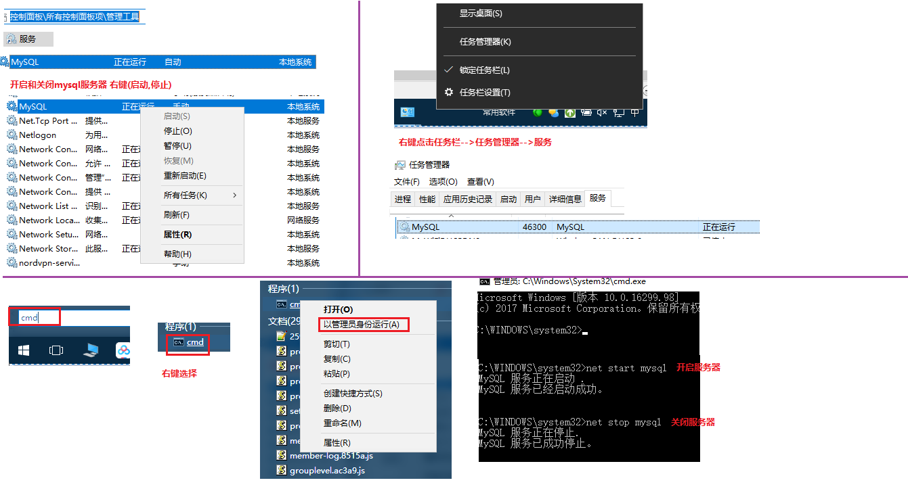

# 学习目标

```java
1.能够使用SQL语句操作数据库
	创建:
		create database 数据库名称;
	删除:
		drop database 数据库名称;
	使用/切换数据库
		use 数据库名;
2.能够使用SQL语句操作表结构
	创建表:
	create table 表名(
		字段1 数据类型[长度] [约束],
		...
		字段n 数据类型[长度] [约束]
	);
	删除表:drop table 表名;	
	(了解)alter table 表名 add 新字段名 数据类型 约束;
	(了解)alter table 表名 modify 字段名 数据类型 约束;
	(了解)alter table 表名 change 旧字段名 新字段名 数据类型 约束;
	(了解)alter table 表名 drop 列名;
3.能够使用SQL语句进行数据的添加修改和删除的操作
	insert into 表名(字段...) values(字段值...);
	insert into 表名 values(值全部给出,包括主键);
	update 表名 set 字段=字段值,...  [where 字段=字段值]
	delete from 表名[where 字段=字段值]
	truncate table 表名;
4.能够使用SQL语句简单查询数据
	select *|[distinct]字段名 from 表名
5.能够使用SQL语句进行排序
	order by 被排序的字段 [asc升序] [desc降序] 
	需要写在sql末尾
6.能够使用聚合函数
	对某一列进行查询,返回的是一个单一的值,会忽略null值
	sum(求和),count(统计),max(最大值),min(最小值),avg(平均值)
7.能够使用SQL语句进行分组查询
	group by 被分组的字段 [having 分组数据条件过滤];
	被分组的字段,一般都写在select后边作为条件
8.能够完成数据的备份和恢复
	SQLyog工具,备份和恢复
9.能够使用SQL语句添加主键、唯一、非空约束,默认约束
	主键约束 primary key:不能为空,不能重复
	唯一约束 unique:不能重复
	非空约束 not null:不能为空
	CREATE TABLE persons01(
		-- 主键
		pid INT PRIMARY KEY,
		-- 名
		lastname VARCHAR(20) not null,
		-- 姓
		firstname VARCHAR(20)not null,
		-- 地址
		address VARCHAR(50) unique,
		-- 居住城市
		city VARCHAR(10) default 默认值
	);
```

# 第1章 数据库介绍

## 1.mysql数据库的概述


## 2.开启和关闭mysql服务器



## 3.使用客户端登录mysql服务器


# 第2章 SQL语句(重点)

## 1.创建&查询&删除&使用数据库的sql语句

```sql
/*
	(重点)创建数据库:使用关键字create(新建) database(数据库)
		create database 数据库名; 使用默认字符集utf-8
		create database IF NOT EXISTS 数据库名; 判断是否存在并创建数据库(了解)
		create database 数据库名 character set 字符集; 创建指定字符集的数据库(了解)
*/
-- 创建一个使用默认字符集(utf8)的数据库
CREATE DATABASE day01;

-- 判断day001数据库是否存在,不存在则创建
CREATE DATABASE IF NOT EXISTS day001;

-- 创建一个使用gbk字符集的数据库
CREATE DATABASE day002 CHARACTER SET 'gbk';

/*
	查看数据库MySQL服务器中的所有的数据库
	格式:
		show databases;
*/
SHOW DATABASES;

/*
	查看某个数据库的定义的信息
	格式:
		show create database 数据库名称;
*/
SHOW CREATE DATABASE day01;-- CREATE DATABASE `day01` /*!40100 DEFAULT CHARACTER SET utf8 */
SHOW CREATE DATABASE day002;-- CREATE DATABASE `day002` /*!40100 DEFAULT CHARACTER SET gbk */

/*
	(重点)删除数据库:使用关键字drop(删除,移除)
	格式:
		drop database 数据库名称;
*/
-- 删除数据库day002
DROP DATABASE day002;
DROP DATABASE day001;
DROP DATABASE day003;

/*
	查看正在使用的数据库
	格式:
		select database();
*/
SELECT DATABASE();

/*
	(重点)使用|切换数据库
	格式:
		use 数据库名称;
*/
USE day01;
USE mysql;
```

## 2.创建&查询&删除表的sql语句

```sql
/*
	(重点)在数据库中创建表:使用关键字create(创建,新建) table(表格)
	格式:
		create table 表名(
			字段名(列名) 数据类型(长度) [约束],	
			字段名(列名) 数据类型(长度) [约束],
			...
			字段名(列名) 数据类型(长度) [约束]	
		);
	字段名(列名):给表中的列起一个名字 name,age,id
	数据类型(长度): 
		整数:int
		小数据:double
		日期:date
		字符串:varchar(长度)
	[约束]:限制一列的数据,不能为空,不能重复
		[]:[]在数据库中是可以省略不写的
		主键约束:约束一列的数据,即不能为空,又不能重复
		非空约束:约束一列的数据,不能为空
		唯一约束:约束一列的数据,不能重复
		默认约束:给一列数据添加一个默认值		
*/
-- 创建一个商品分类名category,字段:分类主键,分类名称
CREATE TABLE category(
	-- 分类主键
	cid INT,
	-- 分类名称
	cname VARCHAR(20)
);

-- 创建一个学生表student,字段:学生主键,学生姓名,学生年龄,学生性别
CREATE TABLE student(
	sid INT,
	NAME VARCHAR(10),
	age INT,
	sex VARCHAR(2)
);

/*
	查看数据库中的所有表
	格式:
		show tables;
*/
SHOW TABLES;

/*
	查看表结构
	格式:
		desc 表名;
*/
DESC category;

/*
	(重点)删除表
	格式:
		drop table 表名; 
*/
DROP TABLE student;
```

## 3.修改表结构(了解)

```sql
/*
	(了解)修改表结构:表在创建好之后,对表的结构进行修改
	格式:
		alter table 表名 add,modify,change,drop ...
*/

/*
	修改表结构:增加列,使用关键字add(增加)
	格式:
		alter table 表名 add 字段名 数据类型(长度) [约束];
*/
-- 给`category`表增加一个列description(描述),类型使用varchar(50) 添加非空约束
ALTER TABLE category ADD description VARCHAR(50) NOT NULL;

/*
	修改表结构:修改列的类型长度及约束,使用关键字modify(改变)
	格式:
		alter table 表名 modify 字段名 新数据类型(新长度) [新约束|删除约束];
*/
-- 修改category表中的description字段,类型修改为int,去掉非空约束
ALTER TABLE category MODIFY description INT;

/*
	修改表结构:修改列名,使用关键字change(改变)
	注意:
		可以一起把数据类型,长度和约束改变
	格式:
		alter table 表名 change 旧列名 新列名 数据类型(长度) [约束];
*/
-- 修改category表中的description字段,名字修改为descr,类型修为为varchar,长度20,添加非空约束
ALTER TABLE category CHANGE description descr VARCHAR(20) NOT NULL;

/*
	修改表结构:删除列,使用关键字drop(删除)
	格式:
		alter table 表名 drop 列名;
*/
-- 删除category表中的descr字段
ALTER TABLE category DROP descr;

/*
	修改表结构:修改表的字符集,使用关键字:character set
	格式:
		alter table 表名 character set 字符集;
	注意:	
			表中如果有数据,修改字符集可能会产生乱码
*/
ALTER TABLE category CHARACTER SET 'gbk';

/*
	修改表名:
	格式:
		rename table 表名 to 新表名
*/
-- 把category表名修改为fenlei
RENAME TABLE category TO fenlei;
```


## 4.表中添加数据的sql语句(重点)

```sql
/*
	表中添加数据的sql语句(重点)
	使用关键字:insert(插入,添加) into(到...里) values(值)
*/
/*
	创建商品分类表:category
	字段:
		分类主键:主键约束(不能为空,不能重复),主键自增(自动维护主键)
		分类名称:
		分类描述:
*/
CREATE TABLE category(
	-- 分类主键:主键约束,主键自增
	cid INT PRIMARY KEY AUTO_INCREMENT,
	-- 分类名称
	cname VARCHAR(20),
	-- 分类描述
	descr VARCHAR(50)
);

/*
	添加数据:格式一
		insert into 表名(字段1,字段2...) values(值1,值2,...);
  注意:
		字段和值要一一对应:个数,类型
		值的书写:除了数值类型(int,double),其他类型的值必须使用引号包裹,可以是单引(重点),也可以使用双引
*/
INSERT INTO category(cid,cname,descr) VALUES(1,'服装',"穿上不怕冷");

/*
	添加数据:格式二
	表中的主键有自动增长,可以省略书写主键字段
		insert into 表名(非主键字段) values(非主键字段值);
*/
INSERT INTO category(cname,descr) VALUES('家电','家庭用品');
INSERT INTO category(cname) VALUES('化妆品');

/*
	添加数据:格式三
	省略字段的书写,但是值必须全部写出,包括主键
	不知道主键使用哪个值了,可以使用null代替(主键自增,会自动维护)
		insert into 表名 values(所有字段的值);
*/
INSERT INTO category VALUES(4,'零食','好吃又好玩');
INSERT INTO category VALUES(NULL,'厨具','好玩又好吃');

/*
	添加数据:格式四,批量添加
		insert into 表名(字段1,字段2...) values(值1,值2,...),...(值1,值2,...);
		insert into 表名(非主键字段) values(非主键字段值),...,(非主键字段值);
		insert into 表名 values(所有字段的值),(所有字段的值)...(所有字段的值);
*/
INSERT INTO category VALUES(NULL,'啤酒','好喝又好玩'),(NULL,'香烟','好抽又好玩');
```

## 5.修改(更新)表中数据(重点)

```sql
/*
	修改(更新)表中数据(重点):使用关键字update(更新,修改) set(设置)
	格式:
		修改符合条件的数据
			update 表名 set 字段1=新值,字段2=新值...[where 条件]
		修改列中所有的数据(谨慎)
			update 表名 set 字段1=新值,字段2=新值...
*/
-- 修改cid=3的数据,cname修改为香水,descr修改为:香奈儿
UPDATE category SET cname='香水',descr='香奈儿' WHERE cid=3;

-- 修改descr字段所有的值为哈哈
UPDATE category SET descr='哈哈';
```

## 6.删除表中数据(重点)

```sql
/*
	删除表中数据(重点),使用关键字delete(删除) from(来自)
	格式一:删除符合条件的数据
		delete from 表名 [where 条件];
	格式二:删除表中所有数据,底层是逐行删除,不会删除主键自增;添加新的数据,会继续使用之前的主键
		delete from 表名;
	格式三:删除表中所有数据,底层是把整个表删除,在创建新表,主键自增清空,添加新的数据,主键从1开始
		truncate table 表名:
*/
-- 删除cname为啤酒的数据
DELETE FROM category WHERE cname='啤酒';

-- 删除表中所有数据,底层是逐行删除,不会删除主键自增;
DELETE FROM category;

-- 添加新的数据,会继续使用之前的主键
INSERT INTO category VALUES(NULL,'服装','穿上不冷');

-- 删除表中所有数据,底层是把整个表删除,在创建新表,主键自增清空
TRUNCATE TABLE category;
-- 添加新的数据,主键从1开始
INSERT INTO category VALUES(NULL,'服装','穿上不冷');
```

# 第3章 SQL约束

## 1.主键约束

```sql
/*
	SQL约束:和java中集合的泛型的作用差不多
	集合的泛型:限制集合中数据的类型
	ArrayList<String> list = new ArrayList<>();
	list.add("a"); 正确
	list.add(1); 错误
	SQL约束:限制一列数据,不能为空,不能重复,给列中的数据添加默认值
*/
/*
	主键约束:
	作用:约束一列数据,即不能为空,又不能重复
	使用关键字: primary(主要的) key(关键的)
	注意:
		1.每张表都应该有一个主键字段,而且只能有一个主键,方便我们使用主键进行增删改查
		2.主键一般都是新增一个字段为主键,不建议使用表中的业务数据(name,age)
*/

/*
	(重点)方式一：创建表时，在字段描述处，声明指定字段为主键
	格式:
		字段 数据类型(长度) primary key;
*/
-- 创建表persons01,字段:主键,姓,名,地址,城市
CREATE TABLE persons01(
	-- 主键
	pid INT PRIMARY KEY,
	-- 姓
	lastname VARCHAR(20),
	-- 名
	firstname VARCHAR(20),
	-- 地址
	address VARCHAR(50),
	-- 城市
	city VARCHAR(10)
);
-- 给persons01表添加数据
INSERT INTO persons01(pid,lastname) VALUES(1,'张');
-- Duplicate entry '1' for key 'PRIMARY' 重复输入1作为主键
INSERT INTO persons01(pid,lastname) VALUES(1,'王');
-- Column 'pid' cannot be null 字段pid不能为空
INSERT INTO persons01(pid,lastname) VALUES(NULL,'王');

/*
	方式二：创建表之后，通过修改表结构，声明指定字段为主键
	格式:
		alter table 表名 add primary key(主键字段);
*/
-- 创建表persons02,字段:pid,姓,名,地址,城市
CREATE TABLE persons02(
	-- 主键
	pid INT,
	-- 姓
	lastname VARCHAR(20),
	-- 名
	firstname VARCHAR(20),
	-- 地址
	address VARCHAR(50),
	-- 城市
	city VARCHAR(10)
);
-- 修改persons02表中的pid为主键
ALTER TABLE persons02 ADD PRIMARY KEY(pid);

/*
	格式三:联合主键(使用多个字段作为一个主键,多个字段都同时重复,才视为主键重复)
	格式:
			alter table 表名 add primary key(主键字段,主键字段);
*/
-- 创建表persons03,字段:pid,姓,名,地址,城市
CREATE TABLE persons03(
	-- 主键
	pid INT,
	-- 姓
	lastname VARCHAR(20),
	-- 名
	firstname VARCHAR(20),
	-- 地址
	address VARCHAR(50),
	-- 城市
	city VARCHAR(10)
);
ALTER TABLE persons03 ADD PRIMARY KEY(lastname,firstname);
-- 给表添加数据
INSERT INTO persons03(lastname,firstname) VALUES('a','b');
INSERT INTO persons03(lastname,firstname) VALUES('a','a');
INSERT INTO persons03(lastname,firstname) VALUES('b','a');
INSERT INTO persons03(lastname,firstname) VALUES('b','b');
INSERT INTO persons03(lastname,firstname) VALUES('a','b');-- Duplicate entry 'a-b' for key 'PRIMARY'

/*
	(重点)删除主键约束:使用修改表结构,删除字段
	格式:
		alter table 表名 drop primary key;
	注意:
			只能把主键约束中的唯一约束删除,不能删除非空约束
*/	
-- 删除persons01表中的主键
ALTER TABLE persons01 DROP PRIMARY KEY;
INSERT INTO persons01(pid,lastname) VALUES(1,'王');
INSERT INTO persons01(pid,lastname) VALUES(NULL,'李');-- Column 'pid' cannot be null
```

主键自增

```sql
/*
	主键自增:当字段是主键的时候,而且数据类型是int类型,就可以设置主键自动增长
*/
CREATE TABLE persons04(
	-- 主键
	pid INT PRIMARY KEY AUTO_INCREMENT,
	-- 姓
	lastname VARCHAR(20),
	-- 名
	firstname VARCHAR(20),
	-- 地址
	address VARCHAR(50),
	-- 城市
	city VARCHAR(10)
);

INSERT INTO persons04(lastname) VALUES('赵');-- 主键1

-- 修改主键自增开始的值
ALTER TABLE persons04 AUTO_INCREMENT = 100;
INSERT INTO persons04(lastname) VALUES('李');-- 主键100
```


## 2.非空约束

```sql
/*
	非空约束
	作用:约束列中的数据不能为null
	使用关键字:not null
	注意:
		多个字段都可以设置为非空
*/

/*
	(重点)方式一：创建表时，在字段描述处，声明指定字段为非空
	 格式:
		字段 数据类型 not null
*/
CREATE TABLE persons05(
	-- 主键
	pid INT PRIMARY KEY AUTO_INCREMENT,
	-- 姓
	lastname VARCHAR(20),
	-- 名
	firstname VARCHAR(20),
	-- 地址
	address VARCHAR(50) NOT NULL,
	-- 城市
	city VARCHAR(10)
);
INSERT INTO persons05(lastname,address) VALUES('王','北京市昌平区');
INSERT INTO persons05(lastname,address) VALUES('李',NULL);-- Column 'address' cannot be null
INSERT INTO persons05(lastname) VALUES('李');-- 可以 address默认添加''空字符串

/*
	方式二:使用修改表结构,添加约束
		alter table 表名 modify 字段名 数据类型(长度) not null;
*/
-- 给persons05表中的lastname,firstname,city添加非空约束
ALTER TABLE persons05 MODIFY lastname VARCHAR(20) NOT NULL;
ALTER TABLE persons05 MODIFY firstname VARCHAR(20) NOT NULL;
ALTER TABLE persons05 MODIFY city VARCHAR(20) NOT NULL;

/*
	删除非空约束:使用修改表结构,删除约束
		alter table 表名 modify 字段名 数据类型(长度);
*/
ALTER TABLE persons05 MODIFY lastname VARCHAR(20);
```

## 3.唯一约束

```sql
/*
	唯一约束:约束列中的数据不能重复
	使用关键字:unique
	注意:
		如果字段的值是null,就失去了唯一约束的意义
		唯一约束也可以给多个字段添加
*/
/*
	(重点)方式一：创建表时，在字段描述处，声明指定字段是唯一的
	 格式:
		字段 数据类型 unique
*/
CREATE TABLE persons06(
	-- 主键
	pid INT PRIMARY KEY AUTO_INCREMENT,
	-- 姓
	lastname VARCHAR(20),
	-- 名
	firstname VARCHAR(20),
	-- 地址
	address VARCHAR(50),
	-- 城市
	city VARCHAR(10) UNIQUE
);
INSERT INTO persons06(lastname,city) VALUES('刘','上海');
INSERT INTO persons06(lastname,city) VALUES('马','上海');-- Duplicate entry '上海' for key 'city'
INSERT INTO persons06(lastname,city) VALUES('马',NULL);
INSERT INTO persons06(lastname,city) VALUES('牛',NULL);

CREATE TABLE persons07(
	-- 主键
	pid INT PRIMARY KEY AUTO_INCREMENT,
	-- 姓
	lastname VARCHAR(20),
	-- 名
	firstname VARCHAR(20),
	-- 地址
	address VARCHAR(50),
	-- 城市
	city VARCHAR(10) UNIQUE NOT NULL
);
INSERT INTO persons07(lastname,city) VALUES('刘','上海');
INSERT INTO persons07(lastname,city) VALUES('马','上海');-- Duplicate entry '上海' for key 'city'
INSERT INTO persons07(lastname,city) VALUES('马',NULL);-- Column 'city' cannot be null

/*
	方式二：创建表之后，通过修改表结构，声明指定字段是唯一的
	格式:
		alter table 表名 add unique(字段名);
*/
CREATE TABLE persons08(
	-- 主键
	pid INT PRIMARY KEY AUTO_INCREMENT,
	-- 姓
	lastname VARCHAR(20),
	-- 名
	firstname VARCHAR(20),
	-- 地址
	address VARCHAR(50),
	-- 城市
	city VARCHAR(10)
);
ALTER TABLE persons08 ADD UNIQUE(address);
ALTER TABLE persons08 ADD UNIQUE(city);
INSERT INTO persons08(lastname,address,city) VALUES('刘','上海市浦东区','上海');
INSERT INTO persons08(lastname,address,city) VALUES('刘','上海市浦东区','北京');-- Duplicate entry '上海市浦东区' for key 'address'

/*
	删除唯一约束:修改表结构
		ALTER TABLE persons DROP INDEX 字段名
*/
-- 删除persons08表中address字段的唯一约束
ALTER TABLE persons08 DROP INDEX address;
INSERT INTO persons08(lastname,address,city) VALUES('刘','上海市浦东区','北京');
```

## 4.默认约束

```sql
/*
	默认约束:
	作用:给字段添加默认值
	添加数据的时候,没有给字段赋值,使用默认值
	添加数据的时候,给字段赋值,使用赋的新值
*/
/*
	(重点)方式一：创建表时，在字段描述处，给指定的字段添加默认值
	 格式:
		字段 数据类型 default 默认值
*/
CREATE TABLE persons09(
	-- 主键
	pid INT PRIMARY KEY AUTO_INCREMENT,
	-- 姓
	lastname VARCHAR(20),
	-- 名
	firstname VARCHAR(20),
	-- 地址
	address VARCHAR(50),
	-- 城市
	city VARCHAR(10) DEFAULT '北京'
);
INSERT INTO persons09(lastname) VALUES('钱');
INSERT INTO persons09(lastname,city) VALUES('孙','花果山');

/*
	方式二:使用修改表结构,添加默认值
		alter table 表名 modify 字段名 数据类型(长度) default '默认值';
*/
CREATE TABLE persons10(
	-- 主键
	pid INT PRIMARY KEY AUTO_INCREMENT,
	-- 姓
	lastname VARCHAR(20),
	-- 名
	firstname VARCHAR(20),
	-- 地址
	address VARCHAR(50),
	-- 城市
	city VARCHAR(10)
);
ALTER TABLE persons10 MODIFY address VARCHAR(50) DEFAULT '北京市顺义区';
ALTER TABLE persons10 MODIFY city VARCHAR(10) DEFAULT '北京市';
INSERT INTO persons10(lastname) VALUES('钱');
INSERT INTO persons10(lastname,address,city) VALUES('朱','高老庄','猪圈');

/*
	删除默认约束:修改表结构,删除约束
		alter table 表名 modify 字段名 数据类型(长度); 
*/
ALTER TABLE persons10 MODIFY city VARCHAR(10);
INSERT INTO persons10(lastname) VALUES('沙');
```

# 第4章 SQL语句增强

## 查询的数据准备

```sql
#创建商品表：
CREATE TABLE product(
    -- 商品主键
	pid INT PRIMARY KEY,
    -- 商品名称
	pname VARCHAR(20),
    -- 商品价格
	price DOUBLE,
    -- 商品分类
	category_cid VARCHAR(32)
);
INSERT INTO product(pid,pname,price,category_cid) VALUES(1,'联想',5000,'c001');
INSERT INTO product(pid,pname,price,category_cid) VALUES(2,'海尔',3000,'c001');
INSERT INTO product(pid,pname,price,category_cid) VALUES(3,'雷神',5000,'c001');
INSERT INTO product(pid,pname,price,category_cid) VALUES(4,'JACK JONES',800,'c002');
INSERT INTO product(pid,pname,price,category_cid) VALUES(5,'真维斯',200,'c002');
INSERT INTO product(pid,pname,price,category_cid) VALUES(6,'花花公子',440,'c002');
INSERT INTO product(pid,pname,price,category_cid) VALUES(7,'劲霸',2000,'c002');
INSERT INTO product(pid,pname,price,category_cid) VALUES(8,'香奈儿',800,'c003');
INSERT INTO product(pid,pname,price,category_cid) VALUES(9,'相宜本草',200,'c003');
INSERT INTO product(pid,pname,price,category_cid) VALUES(10,'面霸',5,'c003');
INSERT INTO product(pid,pname,price,category_cid) VALUES(11,'好想你枣',56,'c004');
INSERT INTO product(pid,pname,price,category_cid) VALUES(12,'香飘飘奶茶',1,'c005');
INSERT INTO product(pid,pname,price,category_cid) VALUES(13,'果9',1,NULL);
```

## 1.简单查询语句(非常重要)

```sql
/*
	简单查询:不写where添加的查询语句
*/
/*
	格式一:查询指定的字段
		select 字段1,字段2... from 表名;
*/
-- 查询pname和price的数据
SELECT pname,price FROM product;

/*
	格式二:查询表中所有的字段
		select 列出所有的字段 from 表名;
		select * from 表名;
*/
SELECT pid,pname,price,category_cid FROM product;
SELECT * FROM product;

/*
	格式三:去掉重复的数据
		select distinct 字段 from 表名;
		select distinct 字段1,字段2... from 表名;
  注意:
				distinct关键字后边只写一个字段,那么就是去除这个字段中重复的数据
				distinct关键字后边写了多个字段,那么只能去除多个字段同时重复的数据
*/
-- 只查询price字段的数据
SELECT price FROM product;

-- 只查询price字段的数据,去掉重复的数据
SELECT DISTINCT price FROM product;

-- 查询pname字段和price字段,去掉两个字段都重复的数据
SELECT DISTINCT pname,price FROM product;

/*
	格式四:别名查询
	1.给表起别名,多表查询的时候使用,可以简化查询语句
		格式:
			select 字段|* from 表名 [as] 别名;
	2.给表中的字段起别名
		格式:
			select 字段 [as] 别名,字段 [as] 别名,... from 表名;
  注意:
		a.别名只是在查询的时候,临时给表|字段起一个名字,不会改变表|字段原有的名字
		b.如果别名中有特殊的字符或者空格,别名就需要使用引号包裹起来
*/
-- 1.给表起别名,多表查询的时候使用,可以简化查询语句
SELECT * FROM product AS 商品表;
SELECT * FROM product p;
SELECT p.pname,p.price FROM product p;

-- 2.给表中的字段起别名
SELECT pid 商品主键,pname 商品名称,price 商品价格,category_cid 商品分类 FROM product;
SELECT pid 商品主键,pname 商品名称,price '商品 价格',category_cid 商品分类 FROM product;

/*
	在查询语句中,可以直接写公式
*/
SELECT 3*5;-- 15
-- 把查询出的商品价格+10000
SELECT p.pname,p.price+10000 FROM product p;
```

## 2.条件查询语句(非常重要)

```sql
/*
	条件查询:只查询出符合条件的数据
	格式:
		select *|字段 from 表名 [where 条件];
	条件
			1.比较运算符
				a.普通的比较运算符:<  <=  =  > >=  <>(!=) 大于、小于、小于等于、等于、大于、大于等于、不等于
				b.between...and...显示在某一区间的值(含头含尾) 相当于 >= 值 && <=值
				c.IN(set):查询多个条件  相当于 条件1 or 条件2 or 条件3
				d.like:模糊查询
					_:匹配一个任意字符
					%:匹配多个任意字符
				e.IS NULL 判断是否为空
			2.逻辑运算符
				与: and &&
				或: or  || 
				非: not !
*/
#查询商品名称为“花花公子”的商品所有信息
SELECT * FROM product WHERE pname='花花公子';

#查询价格为800商品
SELECT * FROM product WHERE price=800;

#查询价格不是800的所有商品
SELECT * FROM product WHERE price!=800;
SELECT * FROM product WHERE price <>800;
SELECT * FROM product WHERE NOT(price=800);
SELECT * FROM product WHERE !(price=800);

#查询商品价格大于60元的所有商品信息
SELECT * FROM product WHERE price>60;

#查询商品价格在200到1000之间所有商品
SELECT * FROM product WHERE price >=200 AND price<=1000;
SELECT * FROM product WHERE price >=200 && price<=1000;
/*
	使用between...and查询某一个区间
		可以查询时间的区间
			'1999-9-9' '2020-12-9'
		必须把小的值写在前边	
*/
SELECT * FROM product WHERE price BETWEEN 200 AND 1000;

#查询商品价格是200或800的所有商品
SELECT * FROM product WHERE price=200 OR price=800;
/*
	使用in(....) 表示或者关系
*/
SELECT * FROM product WHERE price IN(200,800);
SELECT * FROM product WHERE price IN(200,800,1000,2000,5000);

/*
	d.like:模糊查询
		_:匹配一个任意字符
		%:匹配多个任意字符
*/
#查询商品名称以'想'结尾的数据
SELECT * FROM product WHERE pname LIKE '%想';

#查询商品名称以'香'开头的数据
SELECT * FROM product WHERE pname LIKE '香%';

#查询含有'霸'字的所有商品
SELECT * FROM product WHERE pname LIKE '%霸%';

#查询第二个字为'想'的所有商品
SELECT * FROM product WHERE pname LIKE '_想%';

#查询商品名字是5个字的商品
SELECT * FROM product WHERE pname LIKE '_____';

#商品没有分类的商品
SELECT * FROM product WHERE category_cid IS NULL;

#查询有分类的商品
SELECT * FROM product WHERE category_cid IS NOT NULL;-- 是不空
SELECT * FROM product WHERE NOT(category_cid IS NULL);
```

## 3.排序查询语句

```sql
/*
	排序查询语句:
	作用:对查询出来的结果在进行排序
	格式:
		select *|字段... from 表名 [where 条件] order by 被排序的字段 ASC|DESC,被排序的字段 ASC|DESC...
		ASC:升序(默认不写)
		DESC:降序
	注意:
			1.无论sql语句有多么复杂,排序的语句必须写在末尾
			2.order by后边有多个排序的条件,先从第一个条件开始排序,第一个条件相同,在按照第二个条件排序...
*/
-- 查询所有的商品数据,查询的结果按照价格升序排序
SELECT * FROM product ORDER BY price ASC;
SELECT * FROM product ORDER BY price;

-- 查询所有的商品数据,查询的结果按照价格降序排序
SELECT * FROM product ORDER BY price DESC; 

-- 查询所有的商品数据,查询的结果按照价格降序排序,如果价格相同,按照pid降序排序
SELECT * FROM product ORDER BY price DESC,pid DESC;

#在价格排序(降序)的基础上，以分类排序(降序)
SELECT * FROM product ORDER BY price DESC,category_cid DESC;

#显示商品的价格(去重复)，并排序(降序)
SELECT DISTINCT price FROM product ORDER BY price DESC;

#查询价格在1000-5000之间的商品,查询结果按照商品价格升序排序
SELECT * FROM product WHERE price BETWEEN 1000 AND 5000 ORDER BY price ASC;
```

## 4.聚合查询语句

```sql
/*
	聚合查询语句:对列中的数据进行查询,结果返回一个唯一的值,会忽略null值
	- count：统计指定列不为NULL的记录行数；
	- sum：计算指定列的数值和，如果指定列类型不是数值类型，那么计算结果为0；
	- avg：计算指定列的平均值，如果指定列类型不是数值类型，那么计算结果为0；
	- max：计算指定列的最大值，如果指定列是字符串类型，那么使用字符串排序运算；
	- min：计算指定列的最小值，如果指定列是字符串类型，那么使用字符串排序运算；
	格式:
		select count(*|字段),sum(字段),avg(字段),max(字段),min(字段) from 表名 [where 条件];
*/
#查询商品的总条数
SELECT COUNT(*) FROM product;-- 13
SELECT COUNT(pname) FROM product;-- 13
SELECT COUNT(category_cid) FROM product;-- 12

#查询价格大于200商品的总条数
SELECT COUNT(*) FROM product WHERE price>200;

#查询所有商品价格的总和
SELECT SUM(price) FROM product;-- 17503

#查询分类为'c001'的所有商品的总和
SELECT SUM(price) FROM product WHERE category_cid='c001';-- 13000

#查询所有商品价格的平均值
SELECT AVG(price) FROM product;-- 1346.3846153846155

#查询分类为'c002'所有商品的平均价格
SELECT AVG(price) FROM product WHERE category_cid = 'c002'; -- 860

#查询商品的最大价格和最小价格
SELECT MAX(price),MIN(price) FROM product;
SELECT MAX(price) 最大值,MIN(price) 最小值 FROM product;

-- sum,avg如果指定列类型不是数值类型，那么计算结果为0；
SELECT SUM(pname),AVG(pname) FROM product;-- 0 0

-- max,min 如果指定列是字符串类型，那么使用字符串排序运算
SELECT MAX(pname),MIN(pname) FROM product;
```

## 5.分组查询语句


```sql
/*
	分组查询语句:根据条件对数据进行分组,在对每组数据进行查询
	格式:
		select 被分组的字段,聚合查询语句 from 表名 [where 条件] group by 被分组的字段 [having 条件];
	注意:一般都会把被分组的字段写在select后边作为查询条件,方便我们查看结果
*/
#统计各个分类商品的个数
SELECT category_cid,COUNT(*) FROM product GROUP BY category_cid;

#统计各个分类商品的价格的总和
SELECT category_cid,SUM(price) FROM product GROUP BY category_cid;

#统计各个分类商品的价格的最大值
SELECT category_cid,MAX(price) FROM product GROUP BY category_cid;

/*
	统计各个分类商品的个数,且只显示个数大于1的信息
	where:用于在分组前,进行条件过滤
	having:用于在分组后,对分组的数据进行条件过滤
*/
SELECT category_cid,COUNT(*) FROM product GROUP BY category_cid HAVING COUNT(*)>1;
SELECT category_cid,COUNT(*) c FROM product GROUP BY category_cid HAVING c>1;

/*
	统计各个分类商品价格大于100的个数
*/
SELECT category_cid,COUNT(*) FROM product WHERE price>100 GROUP BY category_cid;

/*
	统计各个分类商品价格大于100的个数,且只显示个数大于2的信息
*/
SELECT category_cid,COUNT(*) FROM product WHERE price>100 GROUP BY category_cid HAVING COUNT(*)>2;

/*
	统计各个分类商品价格大于100的个数,且只显示个数大于2的信息,查询结果按照category_cid降序排序
	sql语句执行的顺序:
		1.先where条件过滤
		2.在group分组
		3.在统计个数
		4.having过滤条件
		5.order by 排序
*/
SELECT category_cid,COUNT(*) FROM product 
WHERE price>100 
GROUP BY category_cid 
HAVING COUNT(*)>2
ORDER BY category_cid DESC;
```

## 6.分页查询

```sql
/*
	分页查询:查询的出数量过多,不会一次性全部查询出来,可以先把第一页(100条数据)数据查询出来,
		       当用户点击2的时候,在查询第二页的数据
	使用关键字:limit
	格式:
		  - 1.只查询前x条数据
				select * from product limit x;
			- 2.分页查询
			select * from product limit m,n;
					m:每页开始的行的索引(变化的)
					n:每页显示的数量(固定不变的)
			- 注意:
					数据库行的索引是从0开始
					数据库列的索引是从1开始

*/
-- 只要前8条数据
SELECT * FROM product LIMIT 8;

-- 每页5条数据,查询出第1页的数据
SELECT * FROM product LIMIT 0,5;

-- 每页5条数据,查询出第2页的数据
SELECT * FROM product LIMIT 5,5;

-- 每页5条数据,查询出第3页的数据
SELECT * FROM product LIMIT 10,5;
```


# 第5章 SQL备份、恢复

## 1.SQL备份

数据库的备份是指将数据库转换成对应的sql文件

### MySQL命令备份

数据库导出sql脚本的格式：

```mysql
mysqldump  -u用户名 -p密码 数据库名>生成的脚本文件路径
```

例如:

```mysql
mysqldump  -uroot  -proot day02>d:\day02.sql
```

以上备份数据库的命令中需要用户名和密码，即表明该命令要在用户没有登录的情况下使用

### 可视化工具备份

选中数据库，右键 ”备份/导出” ， 指定导出路径，保存成.sql文件即可。


## 2.SQL恢复

数据库的恢复指的是使用备份产生的sql文件恢复数据库，即将sql文件中的sql语句执行就可以恢复数据库内容。

### MySQL命令恢复

使用数据库命令备份的时候只是备份了数据库内容，产生的sql文件中没有创建数据库的sql语句，在恢复数据库之前需要自己动手创建数据库。

- 在数据库外恢复                       
  - **格式:**`mysql  -uroot  -p密码 数据库名 < 文件路径`
  - 例如:`mysql  -uroot  -proot day02<d:\day02.sql`       
- 在数据库内恢复                       
  - **格式:**`source SQL脚本路径`
  - 例如:`source d:\day02.sql`
  - 注意:使用这种方式恢复数据，首先要登录数据库.

### 可视化工具恢复

数据库列表区域右键“从SQL转储文件导入数据库”， 指定要执行的SQL文件，执行即可。


