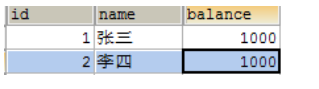
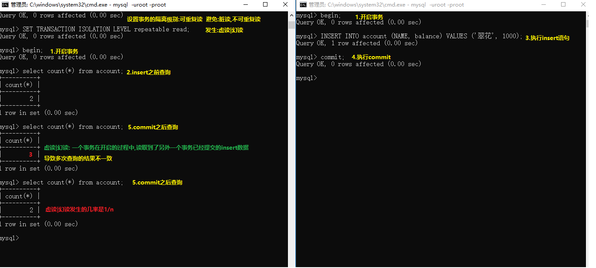

# 学习目标

```sql
1.能够使用内连接进行多表查询
	SELECT * FROM category c,products p WHERE c.cid = p.category_cid;
	SELECT * FROM category c INNER JOIN products p ON c.cid = p.category_cid;
2.能够使用左外连接和右外连接进行多表查询
	SELECT * FROM category c left outer JOIN products p ON c.cid = p.category_cid;
	SELECT * FROM category c right outer JOIN products p ON c.cid = p.category_cid;
3.能够理解多表查询的规律
	a.内连接查询的是两个表数据的交集
	b.左外连接,查询的数据以左边的表为主,左边有的数据,右边没有,使用null代替,左边没有的数据,右边也不能出现	c.右外连接,查询的数据以右边的表为主,右边有的数据,左边没有,使用null代替,右边没有的数据,左边也不能出现	d.sql语句的嵌套(1.作为查询条件2.作为一张表)
4.能够使用子查询
	1.作为查询条件
	SELECT * FROM products WHERE category_cid = (
		SELECT cid FROM category WHERE cname = '化妆品'); 
	2.作为一张表	(先过滤数据,在内连接查询)
	SELECT * FROM (SELECT * FROM category WHERE cname = '化妆品') c,products p 
	WHERE c.cid=p.category_cid;
5.能够理解事务的概念
	保证在一个事务中多次SQL操作要么全都成功,要么全都失败.
6.能够说出事务的原理
	看图
7.能够在MySQL中使用事务
	begin;开启事务
	commit;提交事务
	rollback;回滚事务
8.能够理解脏读,不可重复读,幻读的概念及解决办法
	脏读:一个事务读取到另外一个事务还为提交的数据
	不可重复读:一个事务读取到另外一个事务已经提交的update数据
	幻读|虚读:一个事务读取到另外一个事务已经提交的insert数据
```

# 第1章 表关系 

实际开发中，一个项目通常需要很多张表才能完成。例如：一个商城项目就需要分类表(category)、商品表(products)、订单表(orders)等多张表。且这些表的数据之间存在一定的关系，接下来我们将在单表的基础上，一起学习多表方面的知识。


## 1.1对多关系

一对多关系：

- 常见实例：客户和订单，分类和商品，部门和员工.
- 一对多建表原则：在从表(多方)创建一个字段，字段作为外键指向主表(一方)的主键.


外键约束:

```sql
添加外键格式:修改表结构,添加字段
alter table 从表名 add [constraint 外键名称] foreign key(从表的外键字段) 
references 主表名(主键字段);
删除外键:修改表结构,删除字段
ALTER TABLE 从表 drop FOREIGN KEY 外键名称;
```

```sql
-- 创建数据库day02
CREATE DATABASE day02;

-- 使用数据库day02
USE day02;

/*
	1对多关系
	建表原则:从表中的字段使用主表中的主键作为外键
	主表:分类表category
	从表:商品表products
*/
-- 创建主表:分类表category,字段:分类主键,分类名称
CREATE TABLE category(
	-- 分类主键
	cid INT PRIMARY KEY AUTO_INCREMENT,
	-- 分类名称
	cname VARCHAR(20)
);

-- 给分类表添加数据
INSERT INTO category(cname) VALUES('服装'),('家电'),('化妆品');

-- 创建从表:商品表products,字段:商品主键,商品名称,商品价格,所属分类
CREATE TABLE products(
	-- 商品主键
	pid INT PRIMARY KEY AUTO_INCREMENT,
	-- 商品名称
	pname VARCHAR(20),
	-- 商品价格
	price DOUBLE,
	-- 所属分类
	category_cid INT
);

-- 商品表添加数据
INSERT INTO products VALUES(NULL,'羽绒服',200,1),(NULL,'军大衣',100,1);
INSERT INTO products VALUES(NULL,'空调',1999,2),(NULL,'手电筒',10,2);
INSERT INTO products VALUES(NULL,'香水',888,3),(NULL,'大宝',10,3);

-- 商品表添加分类表不存在的数据
INSERT INTO products VALUES(NULL,'辣条',0.5,4);

/*
	添加外键格式:修改表结构,添加字段
	alter table 从表名 add [constraint 外键名称] foreign key(从表的外键字段) 
	references 主表名(主键字段);
	外键约束的作用:保证数据的准确性和完整性
		主表中有的数据,从表中可以有,可以没有
		主表中没有的数据,从表中也不能出现
		删除主表中的数据,必须保证从表没有使用
*/
-- 给products表中category_cid字段添加外键约束,引用主表category中的cid字段
ALTER TABLE products ADD CONSTRAINT products_fk FOREIGN KEY(category_cid) REFERENCES category(cid);

-- 商品表添加分类表不存在的数据
-- Cannot add or update a child(从表) row: a foreign key constraint fails (失败)
INSERT INTO products VALUES(NULL,'辣条',0.5,4);

-- 删除主表category中cid为3的数据,从表正在使用,不能删除
-- Cannot delete or update a parent(主表) row: a foreign key constraint fails(失败)
DELETE FROM category WHERE cid=3;

-- 先删除从表products中使用cid为3的数据
DELETE FROM products WHERE category_cid=3;

-- 在删除主表category中cid为3的数据,从表没有使用,可以删除
DELETE FROM category WHERE cid=3;

/*
	删除外键约束:使用修改表结构,删除字段
	格式:
		alter table 表名 drop foreign key 外键名称;
*/
ALTER TABLE products DROP FOREIGN KEY products_fk;
```

## 2.多对多关系

多对多关系：

- 常见实例：学生和课程、用户和角色
- 多对多关系建表原则：需要创建第三张表,中间表中至少两个字段，这两个字段分别作为外键指向各自一方的主键.

```sql
/*
	多对多关系
	建表原则:创建一张中间表,使用两个主表中的主键作为外键
	主表:products商品表,orders订单表
	中间表:products_orders
*/
-- 创建主表orders订单表,字段:订单主键,订单总金额
CREATE TABLE orders(
	-- 订单主键
	oid INT PRIMARY KEY AUTO_INCREMENT,
	-- 订单总金额
	totalPrice DOUBLE
);

-- 订单表添加数据
INSERT INTO orders VALUES(NULL,3087),(NULL,110),(NULL,220);

-- 创建中间表:products_orders
CREATE TABLE products_orders(
	-- 商品主键
	products_pid INT,
	-- 订单主键
	orders_oid INT,
	-- 给products_pid字段添加外键约束,引用products表中的pid字段
	FOREIGN KEY(products_pid) REFERENCES products(pid),
	-- 给orders_oid字段添加外键约束,引用orders表中的oid字段
	FOREIGN KEY(orders_oid) REFERENCES orders(oid)
);

-- 订单表添加两个主表都有的数据
INSERT INTO products_orders VALUES(1,1),(3,1),(5,1);
INSERT INTO products_orders VALUES(2,2),(4,2);
INSERT INTO products_orders VALUES(1,3),(4,3),(6,3);


-- 订单表添加主表product不存在的数据
-- Cannot add or update a child(中间表) row: a foreign key constraint fails 
INSERT INTO products_orders VALUES(7,1);

-- 订单表添加主表oders不存在的数据
-- Cannot add or update a child row: a foreign key constraint fails
INSERT INTO products_orders VALUES(1,4);

-- 删除主表订单表中oid为3的数据,中间表在使用,不能删除
-- Cannot delete or update a parent row: a foreign key constraint fails
DELETE FROM orders WHERE oid=3;

-- 先删除中间表中使用oid为3的数据
DELETE FROM products_orders WHERE orders_oid = 3;

-- 在删除主表订单表中oid为3的数据,中间表没有使用,能删除
DELETE FROM orders WHERE oid=3;
```

## 3.1对1关系

一对一关系：(了解)

- 在实际的开发中应用不多.因为一对一可以创建成一张表.
- 两种建表原则：
  - 外键唯一：主表的主键和从表的外键（唯一），形成主外键关系，外键唯一unique。
  - 外键是主键：主表的主键和从表的主键，形成主外键关系。


## 4.省份和城市1对多关系


```sql
/*
	省份和城市1对多关系
	建表原则:从表中的字段使用主表中的主键作为外键
	主表:province省份表
	从表:citys城市表
*/
-- 创建主表:province省份表,字段:省份主键,省份名称,省份描述
CREATE TABLE province(
	-- 省份主键
	pid INT PRIMARY KEY AUTO_INCREMENT,
	-- 省份名称
	pname VARCHAR(20),
	-- 省份描述
	description VARCHAR(50)
);
-- 省份表添加数据
INSERT INTO province VALUES(NULL,'河北','雾霾'),(NULL,'广东','经济特区'),(NULL,'内蒙古','草原');

-- 创建从表:citys城市表,字段:城市主键,城市名称,城市描述,所属省份
CREATE TABLE citys(
	-- 城市主键
	cid INT PRIMARY KEY AUTO_INCREMENT,
	-- 城市名称
	cname VARCHAR(20),
	-- 城市描述
	description VARCHAR(50),
	-- 所属省份
	province_pid INT

);

-- 给citys表中province_pid字段添加外键约束,引用province表中pid字段
ALTER TABLE citys ADD FOREIGN KEY(province_pid) REFERENCES province(pid);

-- 城市表添加省份表存在的数据
INSERT INTO citys VALUES(NULL,'石家庄','雾霾之最',1),(NULL,'承德','避暑山庄',1);
INSERT INTO citys VALUES(NULL,'深圳','经济特区',2),(NULL,'东莞','服务行业',2);
INSERT INTO citys VALUES(NULL,'包头','草原钢城',3),(NULL,'赤峰','红山文化',3);

-- 城市表添加省份表不存在的数据
-- Cannot add or update a child row: a foreign key constraint fails 
INSERT INTO citys VALUES(NULL,'香港','旅游购物',4);

-- 删除主表中pid=1的数据,从表正在使用,不能删除
-- Cannot delete or update a parent row: a foreign key constraint fails
DELETE FROM province WHERE pid = 1;
```

## 5.自关联1对多关系(了解)


```sql
/*
	自关联1对多:本表中的字段使用本表的主键作为外键
*/
-- 创建area地区表,字段:地区主键,地区名称,地区描述,地区所属
CREATE TABLE AREA(
	-- 地区主键
	aid INT PRIMARY KEY AUTO_INCREMENT,
	-- 地区名称
	aname VARCHAR(20),
	-- 地区描述
	description VARCHAR(50),
	-- 地区所属
	area_aid INT
);
-- 给area_aid添加外键约束,使用area表中的aid字段
ALTER TABLE AREA ADD FOREIGN KEY(area_aid) REFERENCES AREA(aid);

-- 给area表添加数据
INSERT INTO AREA VALUES(NULL,'河北','雾霾',NULL),(NULL,'广东','经济特区',NULL),(NULL,'内蒙古','草原',NULL);
INSERT INTO AREA VALUES(NULL,'石家庄','雾霾之最',1),(NULL,'承德','避暑山庄',1);
INSERT INTO AREA VALUES(NULL,'深圳','经济特区',2),(NULL,'东莞','服务行业',2);
INSERT INTO AREA VALUES(NULL,'包头','草原钢城',3),(NULL,'赤峰','红山文化',3);

-- 添加省份不存在的数据,如果有对应的主键,不会报错
INSERT INTO AREA VALUES(NULL,'澳门','赌博娱乐',4);
```


## 6.用户和角色多对多关系


```sql
/*
	用户和角色多对多关系
	主表:用户表users,角色表roles
	中间表:users_roles
*/
-- 创建主表:用户表users,字段:用户主键,用户名,密码
CREATE TABLE users(
	-- 用户主键
	uid INT PRIMARY KEY AUTO_INCREMENT,
	-- 用户名
	username VARCHAR(20),
	-- 密码
	PASSWORD VARCHAR(20)
);
-- 用户表添加数据
INSERT INTO users VALUES(NULL,'群演1','1234'),(NULL,'群演2','4321');

-- 创建主表角色表roles,字段:角色主键,角色名称
CREATE TABLE roles(
	-- 角色主键
	rid INT PRIMARY KEY AUTO_INCREMENT,
	-- 角色名称
	rname VARCHAR(20)
);
-- 角色表添加数据
INSERT INTO roles(rname) VALUES('皇上'),('皇后'),('太监'),('宫女');

-- 创建中间表:users_roles
CREATE TABLE users_roles(
	-- 用户主键
	users_uid INT,
	-- 角色主键
	roles_rid INT,
	-- 添加外键约束
	FOREIGN KEY(users_uid) REFERENCES users(uid),
	FOREIGN KEY(roles_rid) REFERENCES roles(rid)
);

-- 中间表添加数据
INSERT INTO users_roles VALUES(1,1),(1,2),(1,3),(1,4),(2,2),(2,3),(2,4);
```

# 第2章 多表查询 

## 数据准备

```sql
# 分类表
CREATE TABLE category (
  cid VARCHAR(32) PRIMARY KEY ,
  cname VARCHAR(50)
);

#商品表
CREATE TABLE products(
  pid VARCHAR(32) PRIMARY KEY ,
  pname VARCHAR(50),
  price INT,
  flag VARCHAR(2), #是否上架标记为：1表示上架、0表示下架
  category_cid VARCHAR(32),
  CONSTRAINT products_fk FOREIGN KEY (category_cid) REFERENCES category (cid)
);
```

```sql
#分类
INSERT INTO category(cid,cname) VALUES('c001','家电');
INSERT INTO category(cid,cname) VALUES('c002','服饰');
INSERT INTO category(cid,cname) VALUES('c003','化妆品');
#商品
INSERT INTO products(pid, pname,price,flag,category_cid) VALUES('p001','联想',5000,'1','c001');
INSERT INTO products(pid, pname,price,flag,category_cid) VALUES('p002','海尔',3000,'1','c001');
INSERT INTO products(pid, pname,price,flag,category_cid) VALUES('p003','雷神',5000,'1','c001');

INSERT INTO products (pid, pname,price,flag,category_cid) VALUES('p004','JACK JONES',800,'1','c002');
INSERT INTO products (pid, pname,price,flag,category_cid) VALUES('p005','真维斯',200,'1','c002');
INSERT INTO products (pid, pname,price,flag,category_cid) VALUES('p006','花花公子',440,'1','c002');
INSERT INTO products (pid, pname,price,flag,category_cid) VALUES('p007','劲霸',2000,'1','c002');

INSERT INTO products (pid, pname,price,flag,category_cid) VALUES('p008','香奈儿',800,'1','c003');
INSERT INTO products (pid, pname,price,flag,category_cid) VALUES('p009','相宜本草',200,'1','c003');
```

## 1.多表查询_交叉连接查询

交叉连接查询(基本不会使用-得到的是两个表的乘积) [了解]

- 语法：`select * from A,B;`


```sql
/*
	多表查询:一次性至少查询两张以上的表
	1.交叉连接查询:有错误数据,很少使用
	格式:
		select *|字段 from 表A,表B,...;
*/
-- 一次性的查询出分类表和商品表中所有的数据
SELECT * FROM category,products
```

## 2.多表查询_内连接查询


内连接查询(使用的关键字 inner join  -- inner可以省略)

- 隐式内连接：`select * from A,B where 条件;`
- 显示内连接：`select * from A inner join B on 条件;`

```sql
/*
	多表查询_内连接查询:在交叉连接查询的基础上,使用外键约束作为查询条件
	1.隐式内连接查询:不使用关键字 [inner] join on
		格式:
			select * from 表A,表B where 表A.主键 = 表B.外键;
	2.显示内连接查询:使用关键字 [inner] join on
		格式:
			select * from 表A [inner] join 表B on 表A.主键 = 表B.外键;
	inner:内部的
	join:连接		
*/
-- 1.隐式内连接查询:不使用关键字 [inner] join on
SELECT * FROM category,products WHERE category.cid = products.category_cid;

-- 使用给表起别名,简化sql语句的书写
SELECT * FROM category c,products p WHERE c.cid = p.category_cid;

-- 2.显示内连接查询:使用关键字 [inner] join on
SELECT * FROM category c INNER JOIN products p ON c.cid = p.category_cid;

-- 1.查询哪些分类的商品已经上架,隐式内连接查询,使用逻辑运算符把多个条件连接在一起
SELECT * FROM category c,products p WHERE c.cid = p.category_cid AND p.flag='1';

-- 1.查询哪些分类的商品已经上架,显示内连接查询,使用逻辑运算符把多个条件连接在一起
SELECT * FROM category c INNER JOIN products p ON c.cid = p.category_cid AND p.flag='1';

-- 1.查询哪些分类的商品已经上架,显示内连接查询,在on的后边可以继续使用where,在where后边在写其他的查询条件
SELECT * FROM category c INNER JOIN products p ON c.cid = p.category_cid WHERE p.flag = '1';
```

## 3.多表查询_外连接查询

外连接查询(使用的关键字 outer join -- outer可以省略)

- 左外连接：left outer join
  - `select * from A left outer join B on 条件;`
- 右外连接：right outer join
  - `select * from A right outer join B on 条件;`


```sql
/*
	多表查询_外连接查询:在交叉连接查询的基础上,使用外键约束作为查询条件
	1.左外连接查询: 使用关键字 left [outer] join on
		格式:
			select * from 表A left [outer] join 表B on 表A.主键=表B.外键;
		注意:
			左外连接查询以左边的表为主
			左边有的数据,右边没有,使用null代替
			左边没有的数据,右边也不能出现	
	2.右外连接查询: 使用关键字 right [outer] join on
		格式:
			select * from 表A right [outer] join 表B on 表A.主键=表B.外键;
		注意:
			右外连接查询以右边的表为主
			右边有的数据,左边没有,使用null代替
			右边没有的数据,左边也不能出现	
*/
-- 1.左外连接查询: 使用关键字 left [outer] join on
SELECT * FROM category c LEFT OUTER JOIN products p ON c.cid= p.category_cid;

-- 2.右外连接查询: 使用关键字 right [outer] join on
SELECT * FROM category c RIGHT OUTER JOIN products p ON c.cid = p.category_cid;

-- 问题:内连接查询,有零食的数据吗? 没有 内连接查询的是两个表数据的交集
SELECT * FROM category c INNER JOIN  products p ON c.cid = p.category_cid;

-- 使用左外连接查询,交互两个表的位置,就相当于右外连接查询
SELECT * FROM products p LEFT OUTER JOIN category c ON c.cid= p.category_cid;

-- 2.查询每个分类所有商品的个数
SELECT c.cid,COUNT(*) FROM category c LEFT OUTER JOIN products p 
ON c.cid= p.category_cid
GROUP BY c.cid;

SELECT c.cid,COUNT(c.cid) FROM category c LEFT OUTER JOIN products p 
ON c.cid= p.category_cid
GROUP BY c.cid;

SELECT c.cid,COUNT(p.pid) FROM category c LEFT OUTER JOIN products p 
ON c.cid= p.category_cid
GROUP BY c.cid;

-- 省略关键字 inner  outer
SELECT * FROM category c LEFT JOIN products p ON c.cid= p.category_cid;-- 左外连接
SELECT * FROM category c RIGHT JOIN products p ON c.cid= p.category_cid;-- 右外连接
SELECT * FROM category c JOIN products p ON c.cid= p.category_cid;-- 内连接
```


## 4.多表查询_子查询


-- 只查询products表中的化妆品的数据

```sql
/*
	多表查询_子查询:sql语句的嵌套使用
	格式:
		1.一条sql语句的查询结果,作为另外一条sql语句的查询条件
			select * from 表B where 字段 = (select 字段 from 表A [where 条件]);
		2.一条sql语句的查询结果,作为另外一条sql语句的另一张表使用
			select * from (select * from 表A [where 条件]),表B where 表A.主键 = 表B.外键; 
*/
-- 只查询products表中的化妆品的数据
SELECT * FROM products WHERE category_cid = 'c003';

/*
	问题:
		我们并不能确定c003一定是化妆品的数据
	解决:
		可以使用一条sql语句把不确定的值查询出来
		select cid from category where cname = '化妆品'; -- c003
		把两条sql语句合并在一起,就是一个子查询
*/
SELECT * FROM products WHERE category_cid = (
	SELECT cid FROM category WHERE cname = '化妆品'); 
	
-- 2.一条sql语句的查询结果,作为另外一条sql语句的另一张表使用(隐式内连接查询)
SELECT * FROM (SELECT * FROM category WHERE cname = '化妆品') c,products p WHERE c.cid=p.category_cid;
```

-- 查询“化妆品”和“家电”两个分类上架商品详情


```sql
-- 查询“化妆品”和“家电”两个分类上架商品详情,作为另外一条sql语句的另一张表使用
SELECT * FROM(SELECT * FROM category WHERE cname IN('化妆品','家电')) c,products p
WHERE c.cid = p.category_cid;

-- 查询“化妆品”和“家电”两个分类上架商品详情,作为另外一条sql语句的查询条件
SELECT * FROM products WHERE category_cid IN (
	SELECT cid FROM category WHERE cname = '化妆品' OR cname = '家电'); 
```

# 第3章 多表查询案例 

## 1.数据准备

```sql
-- 部门表
CREATE TABLE dept (
  id INT PRIMARY KEY auto_increment, -- 部门id
  dname VARCHAR(50), -- 部门名称
  loc VARCHAR(50) -- 部门位置
);

-- 添加4个部门
INSERT INTO dept(id,dname,loc) VALUES 
(10,'教研部','北京'),
(20,'学工部','上海'),
(30,'销售部','广州'),
(40,'财务部','深圳');

-- 职务表
CREATE TABLE job (
  id INT PRIMARY KEY,
  jname VARCHAR(20), -- 职务名称
  description VARCHAR(50) -- 职务描述
);

-- 添加4个职务
INSERT INTO job (id, jname, description) VALUES
(1, '董事长', '管理整个公司，接单'),
(2, '经理', '管理部门员工'),
(3, '销售员', '向客人推销产品'),
(4, '文员', '使用办公软件');

-- 员工表
CREATE TABLE emp (
  id INT PRIMARY KEY, -- 员工id
  ename VARCHAR(50), -- 员工姓名
  job_id INT, -- 职务id  外键
  mgr INT , -- 上级领导
  joindate DATE, -- 入职日期
  salary DECIMAL(7,2), -- 工资 99999.99
  bonus DECIMAL(7,2), -- 奖金 99999.99
  dept_id INT, -- 所在部门编号  外键
  CONSTRAINT emp_jobid_ref_job_id_fk FOREIGN KEY (job_id) REFERENCES job (id),
  CONSTRAINT emp_deptid_ref_dept_id_fk FOREIGN KEY (dept_id) REFERENCES dept (id)
);

-- 添加员工
INSERT INTO emp(id,ename,job_id,mgr,joindate,salary,bonus,dept_id) VALUES 
(1001,'孙悟空',4,1004,'2000-12-17','8000.00',NULL,20),
(1002,'卢俊义',3,1006,'2001-02-20','16000.00','3000.00',30),
(1003,'林冲',3,1006,'2001-02-22','12500.00','5000.00',30),
(1004,'唐僧',2,1009,'2001-04-02','29750.00',NULL,20),
(1005,'李逵',4,1006,'2001-09-28','12500.00','14000.00',30),
(1006,'宋江',2,1009,'2001-05-01','28500.00',NULL,30),
(1007,'刘备',2,1009,'2001-09-01','24500.00',NULL,10),
(1008,'猪八戒',4,1004,'2007-04-19','30000.00',NULL,20),
(1009,'罗贯中',1,NULL,'2001-11-17','50000.00',NULL,10),
(1010,'吴用',3,1006,'2001-09-08','15000.00','0.00',30),
(1011,'沙僧',4,1004,'2007-05-23','11000.00',NULL,20),
(1012,'李逵',4,1006,'2001-12-03','9500.00',NULL,30),
(1013,'小白龙',4,1004,'2001-12-03','30000.00',NULL,20),
(1014,'关羽',4,1007,'2002-01-23','13000.00',NULL,10);

-- 工资等级表
CREATE TABLE salarygrade (
  grade INT PRIMARY KEY,  -- 等级
  losalary INT, -- 最低工资
  hisalary INT -- 最高工资
);

-- 添加5个工资等级
INSERT INTO salarygrade(grade,losalary,hisalary) VALUES 
(1,7000,12000),
(2,12010,14000),
(3,14010,20000),
(4,20010,30000),
(5,30010,99990);
```


## 2.练习

```sql
-- 1 查询所有员工信息。显示员工编号，员工姓名，工资，职务名称，职务描述
-- 2 查询所有员工信息。显示员工编号，员工姓名，工资，职务名称，职务描述，部门名称，部门位置
-- 3 查询所有员工信息。显示员工姓名，工资，职务名称，职务描述，部门名称，部门位置，工资等级
-- 4 查询经理的信息。显示员工姓名，工资，职务名称，职务描述，部门名称，部门位置，工资等级
-- 5 查询出部门编号、部门名称、部门位置、部门人数
```

```sql
-- 1 查询所有员工信息。显示员工编号，员工姓名，工资，职务名称，职务描述
SELECT e.id,e.ename,e.salary,j.jname,j.description FROM emp e
INNER JOIN job j ON e.job_id = j.id;

-- 2 查询所有员工信息。显示员工编号，员工姓名，工资，职务名称，职务描述，部门名称，部门位置
SELECT e.id,e.ename,e.salary,j.jname,j.description,d.dname,d.loc FROM emp e
INNER JOIN job j ON e.job_id = j.id
INNER JOIN dept d ON e.dept_id = d.id;

-- 3 查询所有员工信息。显示员工姓名，工资，职务名称，职务描述，部门名称，部门位置，工资等级
SELECT e.ename,e.salary,j.jname,j.description,d.dname,d.loc,s.grade FROM emp e
INNER JOIN job j ON e.job_id = j.id
INNER JOIN dept d ON e.dept_id = d.id
INNER JOIN salarygrade s ON e.salary BETWEEN s.losalary AND s.hisalary;

-- 4 查询经理的信息。显示员工姓名，工资，职务名称，职务描述，部门名称，部门位置，工资等级
SELECT e.ename,e.salary,j.jname,j.description,d.dname,d.loc,s.grade FROM emp e
INNER JOIN job j ON e.job_id = j.id
INNER JOIN dept d ON e.dept_id = d.id
INNER JOIN salarygrade s ON e.salary BETWEEN s.losalary AND s.hisalary
WHERE j.jname = '经理';

-- 5 查询出部门编号、部门名称、部门位置、部门人数(内连接:查询的是两个表数据的交集)
SELECT d.id,d.dname,d.loc,COUNT(d.id) FROM dept d
INNER JOIN emp e ON d.id = e.dept_id
GROUP BY d.id;    

-- 左外连接:左边有的数据,右边没有使用null代替
SELECT d.id,d.dname,d.loc,COUNT(e.dept_id) FROM dept d
LEFT OUTER JOIN emp e ON d.id = e.dept_id
GROUP BY d.id;    

-- 子查询
SELECT * FROM dept d,
(SELECT dept_id,COUNT(dept_id)FROM emp GROUP BY dept_id)e
WHERE e.dept_id = d.id;
```

# 第4章 事务安全

## 1.目标

完成转账案例 

## 2.事务的应用场景说明

在实际的业务开发中，有些业务操作要多次访问数据库。一个业务要发送多条SQL语句给数据库执行。

需要将多次访问数据库的操作视为一个整体来执行，要么都执行成功 , 要么都执行失败。

如果其中有一条SQL语句失败，就进行事务的回滚，所有的SQL语句全部执行失败。
例如: 张三给李四转账，张三账号减钱，李四账号加钱 

**事务作用：保证在一个事务中多次SQL操作要么全都成功,要么全都失败.**

```sql
-- 创建数据表
CREATE TABLE account (
id INT PRIMARY KEY AUTO_INCREMENT,
NAME VARCHAR(10),
balance DOUBLE
);
-- 添加数据
INSERT INTO account (NAME, balance) VALUES ('张三', 1000), ('李四', 1000);
```

模拟张三给李四转500元钱，一个转账的业务操作最少要执行下面的2条语句：
1. 张三账号-500
2. 李四账号+500 

```sql
-- 1. 张三账号-500
UPDATE account SET balance = balance - 500 WHERE id=1;
-- 2. 李四账号+500
UPDATE account SET balance = balance + 500 WHERE id=2;
```

假设当张三账号上-500元,服务器崩溃了。李四的账号并没有+500元，数据就出现问题了。

我们需要保证其中一条SQL语句出现问题，整个转账就算失败。

只有两条SQL都成功了转账才算成功。这个时候就需要用到**事务** 。

## 3.操作事务 

MySQL默认开启**自动提交**事务,意思是MySQL的每一条DML(增删改)语句都是一个单独的事务，每条
语句都会自动开启一个事务，执行完毕自动提交事务。 


将金额重置为1000


执行以下SQL语句


使用SQLYog查看数据库：发现数据已经改变


MYSQL中可以通过以下两种方式进行控制事务的操作：
**1.手动提交事务**
**2.自动提交事务** 

### 手动提交事务 

事务操作的SQL语句 

| sql语句                  | 描述     |
| ------------------------ | -------- |
| start transaction\|begin | 开启事务 |
| commit                   | 提交事务 |
| rollback                 | 回滚事务 |

手动提交事务使用步骤：
第1种情况：开启事务 -> 执行SQL语句 -> 成功 -> 提交事务
第2种情况：开启事务 -> 执行SQL语句 -> 失败 -> 回滚事务 


**案例演示1：模拟张三给李四转500元钱（成功）** 


1.使用DOS控制台进入MySQL

2.执行以下SQL语句： 1.开启事务 ， 2.张三账号 -500 ， 3.李四账号 +500

```sql
begin;
UPDATE account SET balance = balance - 500 WHERE id=1;
UPDATE account SET balance = balance + 500 WHERE id=2; 
```

3.使用SQLYog查看数据库：发现数据并没有改变



4.在控制台执行 commit 提交任务：


5.使用SQLYog查看数据库：发现数据改变


**案例演示2：模拟张三给李四转500元钱（失败）**
目前数据库数据如下：


1.在控制台执行以下SQL语句： 1.开启事务 ， 2.张三账号 -500

```sql
begin;
UPDATE account SET balance = balance - 500 WHERE id=1;
```

2.使用SQLYog查看数据库：发现数据并没有改变


3.在控制台执行 **rollback** 回滚事务：


4.使用SQLYog查看数据库：发现数据没有改变


**总结:**
如果事务中SQL语句没有问题，commit提交事务，会对数据库数据的数据进行改变。
如果事务中SQL语句有问题，rollback回滚事务，会回退到开启事务时的状态。 

### 自动提交事务

1.查看MySQL是否开启自动提交事务,每执行一行代码都会先开启事务,执行成功会自动提交事务,执行失败会自动回滚事务==>一行一事务

```sql
show variables like '%commit%';
OFF（关闭自动提交）
ON（开启自动提交）
```


2.取消自动提交事务，设置自动提交的参数为OFF，执行SQL语句： set autocommit = 0; 

```sql
* 设置自动提交的参数为OFF:
set autocommit = 0;  -- 0:OFF  1:ON
```


3.在控制台执行以下SQL语句：张三-500

```sql
UPDATE account SET balance = balance - 500 WHERE id=1; 
commit;-- 把sql提交,会减500

UPDATE account SET balance = balance - 500 WHERE id=1; 
ROLLBACK;-- 把sql语句回滚,钱不会改变
```

6.使用SQLYog查看数据库，发现数据改变


## 4.事务原理


## 5.回滚点

在某些操作成功之后，后续的操作有可能成功有可能失败，但是不管成功还是失败，前面操作都已经成
功，可以在当前成功的位置设置一个回滚点。可以供后续失败操作返回到该位置，而不是返回所有操
作，这个点称之为回滚点。
**设置回滚点语法： savepoint 回滚点名字 ;**
**回到回滚点语法: rollback to 回滚点名字 ;**

具体操作：
1.将数据重置为1000 


2.开启事务


让张三账号减3次钱

```sql
UPDATE account SET balance = balance - 10 WHERE id=1;
UPDATE account SET balance = balance - 10 WHERE id=1;
UPDATE account SET balance = balance - 10 WHERE id=1;
```

设置回滚点： savepoint abc; 


让张三账号减4次钱

```sql
UPDATE account SET balance = balance - 10 WHERE id=1;
UPDATE account SET balance = balance - 10 WHERE id=1;
UPDATE account SET balance = balance - 10 WHERE id=1;
UPDATE account SET balance = balance - 10 WHERE id=1;
```

回到回滚点：rollback to abc; 


分析过程


总结：

​	设置回滚点可以让我们在失败的时候回到回滚点，而不是回到事务开启的时候。 

## 5.事务特性

### 1.事务特性：ACID

- 原子性（Atomicity）原子性是指事务是一个不可分割的工作单位，事务中的操作要么都发生，要么都不发生。 (多条语句要么都成功，要么都失败。)
- 一致性（Consistency）事务前后数据的完整性必须保持一致。转账(减钱,加钱) 
- 隔离性（Isolation）事务的隔离性是指多个用户并发访问数据库时，一个用户的事务不能被其它用户的事务所干扰，多个并发事务之间数据要相互隔离。
- 持久性（Durability）持久性是指一个事务结束(一旦被提交或者回滚)，它对数据库中数据的改变就是永久性的，接下来即使数据库发生故障也不应该对其有任何影响。

### 2.并发访问问题

如果不考虑隔离性，事务存在3中并发访问问题。

1. 脏读：一个事务读到了另一个事务未提交的数据.
2. 不可重复读：一个事务读到了另一个事务已经提交(update)的数据。引发另一个事务，在事务中的多次查询结果不一致。
3. 虚读 /幻读：一个事务读到了另一个事务已经提交(insert)的数据。导致另一个事务，在事务中多次查询的结果不一致。

### 3.隔离级别：解决问题

- 数据库规范规定了4种隔离级别，分别用于描述两个事务并发的所有情况。

1. **read uncommitted** 读未提交，一个事务读到另一个事务没有提交的数据。

   a)存在：3个问题（脏读、不可重复读、虚读）。

   b)解决：0个问题

2. **read committed** 读已提交，一个事务读到另一个事务已经提交的数据。

   a)存在：2个问题（不可重复读、虚读）。

   b)解决：1个问题（脏读）

3. **repeatable read**:可重复读，在一个事务中读到的数据始终保持一致，无论另一个事务是否提交。

   a)存在：1个问题（虚读）。

   b)解决：2个问题（脏读、不可重复读）

4. **serializable 串行化**，同时只能执行一个事务，相当于事务中的单线程。

   a)存在：0个问题。

   b)解决：3个问题（脏读、不可重复读、虚读）

- 安全和性能对比
  - 安全性：`serializable(8) > repeatable read(4) > read committed(2) > read uncommitted(1)`
  - 性能 ： `serializable < repeatable read < read committed < read uncommitted`
  - 级别超高，越安全，效率越低。
- 常见数据库的默认隔离级别：
  - MySql：`repeatable read`
  - Oracle：`read committed`

### 4.演示演示

- 隔离级别演示参考：资料/隔离级别操作过程.doc【增强内容,了解】
- 查询数据库的隔离级别

```mysql
show variables like '%isolation%';
或
select @@tx_isolation;
```


- 设置数据库的隔离级别
  - `SET TRANSACTION ISOLATION LEVEL` 级别字符串
  - 级别字符串：`read uncommitted`、`read committed`、`repeatable read`、`serializable`
  - 例如：`SET TRANSACTION ISOLATION LEVEL repeatable read;`
  
  #### 模拟脏读(了解)
  
  
  
  #### 模拟不可重复读(了解)
  
  
  
  #### 模拟虚读幻读(了解)
  
  
  
  