# 学习目标

```mysql
1. 了解MySQL查询优化
	给字段添加索引,提高查询的效率
	mysql索引的数据结构:B+Tree
2. 理解索引的作用及使用策略
	作用:提高查询的效率
	策略:
		1.经常查询使用的字段和外键字段,添加索引可以提高查询的效率
		2.添加索引之后,对数据进行增删改,会降低增删改的效率,在增删该的同时维护索引
3. 了解索引失效的问题
	6种情况
4. mysql常见函数使用
	日期函数,数学函数,字符串函数,高级函数(case,if)
5. 能够完成mysql综合练习
	函数的综合练习
6. 会使用自关联查询表数据
	本表的外键使用本表的主键作为外键(自己关联自己),在工作中很少使用
```

# 第1章 DCL(了解)

不要背

作用:创建或者销毁用户,给用户授权或者撤销权限

## 1.创建用户:

- create user '用户名'@'域名或者ip' identified by '密码';

  ```sql
CREATE USER 'tom'@'localhost' IDENTIFIED BY '1234';-- 在本机上 使用tom配合1234登录
  CREATE USER 'tom'@'%' IDENTIFIED BY '1234';-- 在任意电脑上使用tom配合1234登录
  ```

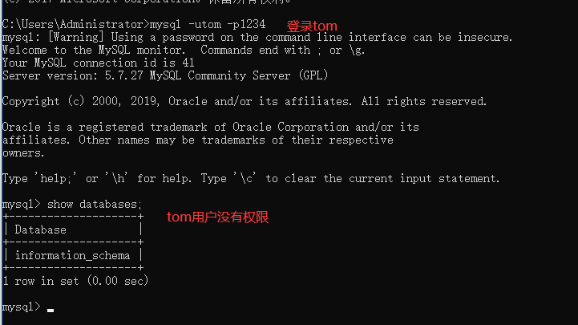

## 2.授权:

- grant 权限列表(使用','隔开)或者all on 哪个数据库.哪个表 to '用户名'@'主机名'
- 例如: GRANT ALL ON dayxx.* TO 'tom'@'localhost';

```sql
-- 给tom分配所有的权限,所有的数据库,所有的表
GRANT ALL ON *.* TO 'tom'@'localhost';
-- 权限列表 CREATE,DROP,DELETE,SELECT,INSERT,UPDATE...
-- 给tom分配所有的权限,day01数据库的所有的表
GRANT ALL ON day01.* TO 'tom'@'localhost';
```

查看用户哪些权限

- SHOW GRANTS FOR 'tom'@'localhost';

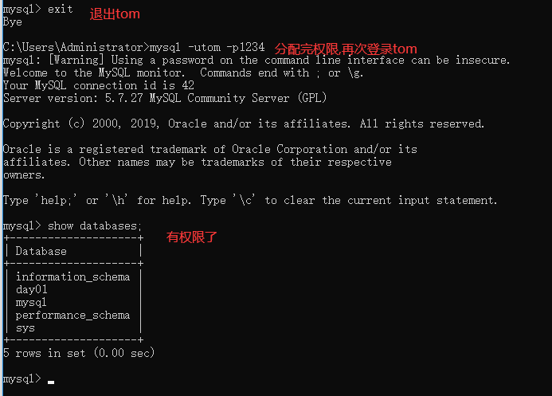


## 3.撤销权限:

- revoke 权限列表(使用','隔开)或者all on 哪个数据库.哪个表 from '用户名'@'主机名'
- 例如: REVOKE DELETE  ON dayxx.* FROM 'tom'@'localhost';

```sql
-- 撤销tom所有的权限
REVOKE ALL ON *.* FROM 'tom'@'localhost';
```

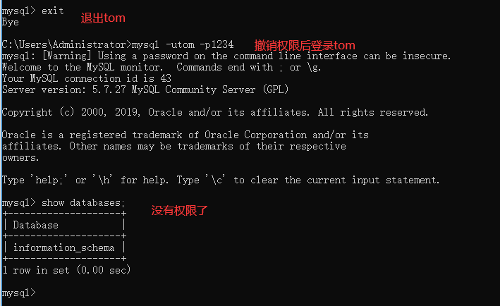

## 4.修改用户密码:

- 不登陆修改root密码

  ```sql
  -- 不用登录mysql,直接在cmd中输入 
  mysqladmin -uroot -p password
  -- 根据提示输入原始密码即可
  ```

  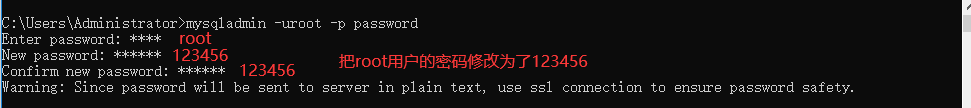

  

- 登陆修改用户密码

  ```sql
  -- 使用root用户登录mysql
  mysql -uroot -proot
  -- 在通过root用户修改其他用户密码
  set password for '用户'@'域名或者ip' = '新密码';
  -- 修改tom的密码为123456
  set password for 'tom'@'localhost' = '123456';
  ```

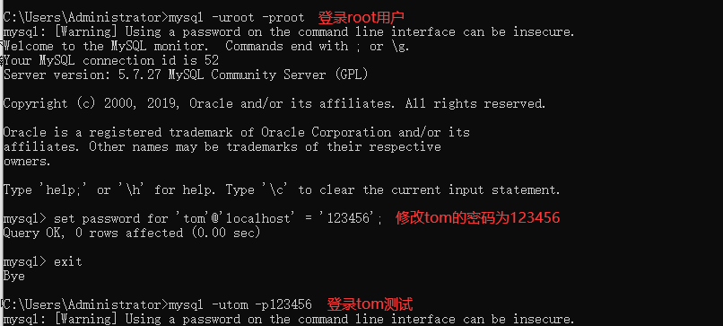

## 5.删除用户:

- drop user  '用户名'@'域名或者ip'
- 例如: DROP USER 'tom'@'localhost';

```sql
-- 使用root用户登录mysql
mysql -uroot -proot
-- 在通过root用户删除其他的用户
-- 删除用户tom
DROP USER 'tom'@'localhost';
```

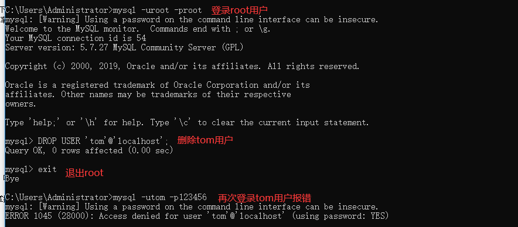

# 第2章 MySQL函数(重点)

https://www.runoob.com/mysql/mysql-functions.html 

- 为了简化操作，**mysql提供**了大量的函数给程序员使用（比如你想输入当前时间，可以调用now()函数）
- 函数可以出现的位置：插入语句的values()中，更新语句中，删除语句中，查询语句及其子句中。
- 所谓的函数其实就是方法 某些特殊的函数具有某些特殊的功能

## 1 日期函数

```markdown
1.  函数：NOW() | CURDATE() | CURTIME()
	描述：获取系统当前日期时间、日期、时间
	实例：SELECT NOW();
	
2.  函数：YEAR(DATE) | MONTH(DATE) | DAY(DATE)
	描述：从日期中选择出年、月、日
	实例：SELECT YEAR(NOW()); 
	
3.  函数：LAST_DAY(DATE)
	描述：返回月份的最后一天
	实例：SELECT LAST_DAY(NOW());
	
4.  函数：ADDDATE(DATE,n) | SUBDATE(DATE,n)
	描述：计算起始日期 DATE 加（减） n 天的日期
	实例：SELECT ADDDATE(NOW(),10);
	
5.  函数：QUARTER(DATE)
	描述：返回日期 DATE 是第几季节，返回 1 到 4
	实例：SELECT QUARTER(NOW());
	
6.  函数：DATEDIFF(d1,d2)
	描述：计算日期 d1->d2 之间相隔的天数
	实例：SELECT DATEDIFF('2019-08-01','2019-07-01');
	
7.  函数：DATE_FORMAT(d,f)
	描述：按表达式 f的要求显示日期 d
	实例：SELECT DATE_FORMAT(NOW(),'%Y-%m-%d');
```

```sql
/*
	1.  函数：NOW() | CURDATE() | CURTIME()
	描述：获取系统当前日期时间、日期、时间
	实例：SELECT NOW();
*/
SELECT NOW();-- 2020-12-11 09:00:00
SELECT CURDATE();-- 2020-12-11
SELECT CURTIME();-- 09:00:38

/*
	2.  函数：YEAR(DATE) | MONTH(DATE) | DAY(DATE)
	描述：从日期中选择出年、月、日
	实例：SELECT YEAR(NOW()); 
*/
SELECT YEAR(NOW());-- 2020
SELECT YEAR('1999-9-9');-- 1999
SELECT MONTH(NOW());-- 12
SELECT DAY(NOW());-- 11

/*
	3.  函数：LAST_DAY(DATE)
	描述：返回月份的最后一天
	实例：SELECT LAST_DAY(NOW());
*/
SELECT LAST_DAY(NOW());-- 2020-12-31
SELECT LAST_DAY('1999-9-9');-- 1999-09-30
SELECT LAST_DAY('2020-2-1');-- 2020-02-29

/*
	4.  函数：ADDDATE(DATE,n) | SUBDATE(DATE,n)
	描述：计算起始日期 DATE 加（减） n 天的日期
	实例：SELECT ADDDATE(NOW(),10);
*/
SELECT ADDDATE(NOW(),10);-- 2020-12-21 09:05:35
SELECT SUBDATE(NOW(),10);-- 2020-12-01 09:05:56

/*
	5.  函数：QUARTER(DATE) 1/4 把12个月份分成4个季度
	描述：返回日期 DATE 是第几季节，返回 1 到 4
	实例：SELECT QUARTER(NOW());
*/
SELECT QUARTER(NOW());-- 4 12月份是第4个季度

/*
	6.  函数：DATEDIFF(d1,d2)
	描述：计算日期 d1->d2 之间相隔的天数
	实例：SELECT DATEDIFF('2019-08-01','2019-07-01');
*/
SELECT DATEDIFF(NOW(),'1998-8-10');-- 8159天
SELECT DATEDIFF(NOW(),'1998-8-10')/365;-- 22.3534年

/*
	7.  函数：DATE_FORMAT(d,f)
	描述：按表达式 f的要求显示日期 d
	实例：SELECT DATE_FORMAT(NOW(),'%Y-%m-%d');
*/
SELECT DATE_FORMAT(NOW(),'%Y/%m/%d');-- 2020/12/11
SELECT DATE_FORMAT(NOW(),'%Y');-- 2020
```

练习

```sql
-- 1.统计每个员工入职的天数
-- 2.统计每个员工的工龄
-- 3.查询2007年入职的员工
-- 4.统计入职10年以上的员工信息
```

```sql
-- 1.统计每个员工入职的天数
SELECT ename,joindate,DATEDIFF(NOW(),joindate) FROM emp;
SELECT ename,joindate,DATEDIFF(NOW(),joindate)AS 入职天数 FROM emp;

-- 2.统计每个员工的工龄
SELECT ename,joindate,DATEDIFF(NOW(),joindate)/365 AS 工龄 FROM emp;

-- 3.查询2007年入职的员工
SELECT ename,joindate FROM emp WHERE YEAR(joindate)='2007';
SELECT ename,joindate FROM emp WHERE DATE_FORMAT(joindate,'%Y')='2007';
SELECT ename,joindate FROM emp WHERE joindate LIKE '2007%';

-- 4.统计入职10年以上的员工信息
SELECT ename,joindate,DATEDIFF(NOW(),joindate)/365 AS 工龄 FROM emp
WHERE DATEDIFF(NOW(),joindate)/365>10;
```


## 2 数学函数

```markdown
1.  函数：ABS(x)
	描述：返回 x 的绝对值　　
	实例：SELECT ABS(-1);
	
2.  函数：CEIL(x) | FLOOR(x)
	描述：向上（下）取整
	实例：SELECT CEIL(1.5);
	
3.  函数：MOD(x,y)
	描述：返回x mod y的结果，取余
	实例：SELECT MOD(5,4);
	
4.  函数：RAND()
	描述：返回 0 到 1 的随机数
	实例：SELECT RAND();
	
5.  函数：ROUND(x)  round(x,y)  保留x的y位小数且四舍五入
	描述：四舍五入
	实例：SELECT ROUND(1.23456);
	
6.  函数：TRUNCATE(x,y) 舍尾法
	描述：返回数值 x 保留到小数点后 y 位的值
	实例：SELECT TRUNCATE(1.23456,3);

```

```sql
/*
	1.  函数：ABS(x)
	描述：返回 x 的绝对值　　
	实例：SELECT ABS(-1);
*/
SELECT ABS(-10);-- 10

/*
	2.  函数：CEIL(x) | FLOOR(x)
	描述：向上（下）取整
	实例：SELECT CEIL(1.5);
*/
SELECT CEIL(5.1); -- 6
SELECT FLOOR(5.9);-- 5

/*
	3.  函数：MOD(x,y)
	描述：返回x mod y的结果，取余
	实例：SELECT MOD(5,4);  5%4=1
*/
SELECT MOD(5,4); -- 1
SELECT MOD(5,3); -- 2

/*
	4.  函数：RAND()
	描述：返回 0 到 1 的随机小数
	实例：SELECT RAND();
*/
SELECT RAND();

/*
	5.  函数：ROUND(x)  round(x,y)  保留x的y位小数且四舍五入
	描述：四舍五入
	实例：SELECT ROUND(1.23456);
*/
SELECT ROUND(5.4);-- 5
SELECT ROUND(5.5);-- 6
SELECT ROUND(5.49999999,2);-- 5.50

/*
	6.  函数：TRUNCATE(x,y) 舍尾法
	描述：返回数值 x 保留到小数点后 y 位的值
	实例：SELECT TRUNCATE(1.23456,3);
*/
SELECT TRUNCATE(5.49999999,2);-- 5.49 不会四舍五入
```

练习

```sql
-- 1.统计每个员工的工龄，超过半年的算一年
-- 2.统计每个部门的平均薪资,保留2位小数
-- 3.统计每个部门的平均薪资,小数向上取整
-- 4.统计每个部门的平均薪资,小数向下取整
```

```sql
-- 1.统计每个员工的工龄，超过半年的算一年
SELECT ename,joindate,DATEDIFF(NOW(),joindate)/365 AS 工龄 FROM emp;
SELECT ename,joindate,DATEDIFF(NOW(),joindate)/365,
	ROUND(DATEDIFF(NOW(),joindate)/365) AS 工龄 FROM emp;
	
-- 2.统计每个部门的平均薪资,保留2位小数
SELECT dept_id,AVG(salary),TRUNCATE(AVG(salary),2) FROM emp GROUP BY dept_id;

-- 3.统计每个部门的平均薪资,小数向上取整
SELECT dept_id,AVG(salary),CEIL(AVG(salary)) FROM emp GROUP BY dept_id;

-- 4.统计每个部门的平均薪资,小数向下取整
SELECT dept_id,AVG(salary),FLOOR(AVG(salary)) FROM emp GROUP BY dept_id;
```


## 3 字符串函数

```markdown
1.  函数：CONCAT(s1,s2...sn)
	描述：字符串 s1,s2 等多个字符串合并为一个字符串
	实例：SELECT CONCAT("传", "智", "播", "客");
	
2.  函数：CHAR_LENGTH(str)
	描述：返回字符串 str 的字符数
	实例：SELECT CHAR_LENGTH("传智播客");
	
3.  函数：LENGTH(str)
	描述：返回字符串 s 的字节数,中文在utf8占3个字节,在gbk下占2个字节
	实例：SELECT LENGTH("传智播客") ;
	
4.  函数：UCASE(s) | UPPER(s)
	描述：将字符串转换为大写
	实例：SELECT UCASE("itcast");
	
5.  函数：LCASE(s) | LOWER(s)
	描述：将字符串转换为小写
	实例：SELECT LCASE("ITCAST");
	
6.  函数：LOCATE(s1,s)
	描述：从字符串 s 中获取 s1 的开始位置(从1开始)
	实例：SELECT LOCATE('he','itheima');
	
7.  函数：TRIM(str) | LTRIM(str) | RTRIM(str)
	描述：字符串去空格
	实例：SELECT TRIM("  传智人");
	
8.  函数：REPLACE(s,s1,s2)
	描述：将字符串 s2 替代字符串 s 中的字符串 s1
	实例：SELECT REPLACE('abc','a','x');
	
9.  函数：SUBSTR(s, start, length)
	描述：从字符串 s 的 start 位置截取长度为 length 的子字符串
	实例：SELECT SUBSTR("itcast", 2, 3);
	
10. 函数：STRCMP(str1,str2)
	描述：比较字符串大小,左大于右时返回1，左等于右时返回0，，左小于于右时返回-1，
	实例：SELECT STRCMP("a","b");

```

```sql
/*
	1.  函数：CONCAT(s1,s2...sn)
	描述：字符串 s1,s2 等多个字符串合并为一个字符串
	实例：SELECT CONCAT("传", "智", "播", "客");
*/
SELECT CONCAT("aaa","bbb","ccc");-- aaabbbccc
SELECT ename,salary,CONCAT(ename,salary) FROM emp; -- 孙悟空8000.00

/*
	2.  函数：CHAR_LENGTH(str)
	描述：返回字符串 str 的字符数
	实例：SELECT CHAR_LENGTH("传智播客");
*/
SELECT CHAR_LENGTH('传智播客');-- 4

/*
	3.  函数：LENGTH(str)
	描述：返回字符串 s 的字节数,中文在utf8占3个字节,在gbk下占2个字节
	实例：SELECT LENGTH("传智播客") ;
*/
SELECT LENGTH('传智播客a1');-- 14

/*
	String类: toUpperCase
	4.  函数：UCASE(s) | UPPER(s)
	描述：将字符串转换为大写
	实例：SELECT UCASE("itcast");
*/
SELECT UCASE('aaa');-- AAA
SELECT UPPER('aaa');-- AAA

/*
	String类: toLowerCase
	5.  函数：LCASE(s) | LOWER(s)
	描述：将字符串转换为小写
	实例：SELECT LCASE("ITCAST");
*/
SELECT LCASE("AAA");-- aaa
SELECT LOWER("AAA");-- aaa

/*
	6.  函数：LOCATE(s1,s)
	描述：从字符串 s 中获取 s1 的开始位置(从1开始)
	实例：SELECT LOCATE('he','itheima');
*/
SELECT LOCATE('c','abcde');-- 3
SELECT LOCATE('he','itheima');-- 3

/*
	7.  函数：TRIM(str) | LTRIM(str) | RTRIM(str)
	描述：字符串去空格
	实例：SELECT TRIM("  传智人");
*/
SELECT CHAR_LENGTH('传智人');-- 3
SELECT CHAR_LENGTH(TRIM('   传智人   '));-- 3

/*
	8.  函数：REPLACE(s,s1,s2)
	描述：将字符串 s2 替代字符串 s 中的字符串 s1
	实例：SELECT REPLACE('abc','a','x');
*/
SELECT REPLACE('abc','a','x');-- xbc

/*
	9.  函数：SUBSTR(s, start, length)
	描述：从字符串 s 的 start 位置截取长度为 length 的子字符串
	实例：SELECT SUBSTR("itcast", 2(位置), 3(个数));
*/
SELECT SUBSTR("itcast",2,3);-- tca

/*
	10. 函数：STRCMP(str1,str2)
	描述：比较字符串大小,左大于右时返回1，左等于右时返回0，，左小于于右时返回-1，
	实例：SELECT STRCMP("a","b");
*/
SELECT STRCMP('a','b');-- -1
SELECT STRCMP('a','a');-- 0
SELECT STRCMP('b','a');-- 1
SELECT STRCMP('c','a');-- 1
```

练习

```sql
-- 1.将所有员工的昵称改为大写
-- 2.显示所有员工的姓氏，截取
-- 3.显示所有员工姓名字符长度
-- 4.显示所有员工姓名字节长度
-- 5.将所有姓李的员工，姓氏替换为li
-- 6.将所有员工的姓名和昵称拼接在一起

```

```sql
-- 1.将所有员工的昵称改为大写
SELECT ename,nickname,UPPER(nickname) FROM emp;

-- 2.显示所有员工的姓氏，截取
SELECT ename,SUBSTR(ename,1,1) FROM emp;

-- 3.显示所有员工姓名字符长度
SELECT ename,CHAR_LENGTH(ename) FROM emp;

-- 4.显示所有员工姓名字节长度
SELECT ename,LENGTH(ename) FROM emp;

-- 5.将所有姓李的员工，姓氏替换为li
SELECT ename,REPLACE(ename,'李','li') FROM emp;

-- 6.将所有员工的姓名和昵称拼接在一起
SELECT ename,nickname,CONCAT(ename,nickname) FROM emp;-- 孙悟空wukong
```

## 4.MySQL高级函数

### 1.case表达式

在查询代码的过程中，可能我们需要对查询的结果进行判断。

```sql
-- 语法 
	SELECT 
		CASE [字段,值] 
			WHEN 判断条件1 
				THEN 希望的到的值1
			WHEN 判断条件2 
				THEN 希望的到的值2
			ELSE 前面条件都没有满足情况下得到的值 
		END
	FROM
		table_name;
/*
select case 字段  
	when  值  then 进入的结果
	when  值  then 进入的结果
	when  值  then 进入的结果
	else
		以上都没有进入的情况
	end 
*/		

```

练习

```sql
-- 查询每个员工的工资等级并排序
-- 工资等级在1显示为 '努力赚钱'
-- 工资等级在2显示为 '小康生活'
-- 工资等级在3显示为 '可以娶媳妇'
-- 工资等级在4显示为 '可以买车'
-- 工资等级在5显示为 '可以买房'
-- 工资等级不在以上列表中显示为  '土豪'

```

```sql
/*
	-- 查询每个员工的工资等级并排序
	-- 工资等级在1显示为 '努力赚钱'
	-- 工资等级在2显示为 '小康生活'
	-- 工资等级在3显示为 '可以娶媳妇'
	-- 工资等级在4显示为 '可以买车'
	-- 工资等级在5显示为 '可以买房'
	-- 工资等级不在以上列表中显示为  '土豪'
	
	select case 字段  
		when  值  then 进入的结果
		when  值  then 进入的结果
		when  值  then 进入的结果
		else 以上都没有进入的情况
	end 
*/
SELECT e.ename,e.salary,s.grade FROM emp e
INNER JOIN salarygrade s ON e.salary BETWEEN s.losalary AND s.hisalary
ORDER BY s.grade DESC;

SELECT e.ename,e.salary,s.grade,
	CASE s.grade
		WHEN 1 THEN '努力赚钱'
		WHEN 2 THEN '小康生活'
		WHEN 3 THEN '可以娶媳妇'
		WHEN 4 THEN '可以买车'
		WHEN 5 THEN '可以买房'
		ELSE '土豪'
	END	AS '生活状态'
FROM emp e
INNER JOIN salarygrade s ON e.salary BETWEEN s.losalary AND s.hisalary
ORDER BY s.grade DESC;


SELECT e.ename,e.salary,s.grade,
	CASE s.grade
		WHEN 1 THEN '努力赚钱'
		WHEN 2 THEN '小康生活'
		WHEN 3 THEN '可以娶媳妇'
		WHEN 4 THEN '可以买车'
		WHEN 5 THEN '可以买房'
		ELSE '土豪'
	END	AS '生活状态'
FROM emp e
LEFT OUTER JOIN salarygrade s ON e.salary BETWEEN s.losalary AND s.hisalary
ORDER BY s.grade DESC;
```


### 2.if表达式

相当于java中的三元运算符 条件表达式?表达式1:表达式2

```sql
-- 语法
#if(参数1:条件表达式 , 条件成立的值, 条件失败的值)
SELECT IF(1>0 , 'aaaaaaa' , 'bbbbbbbbbbbbbb');-- aaaaaaa
SELECT IF(1<0 , 'aaaaaaa' , 'bbbbbbbbbbbbbb');-- bbbbbbbbbbbbbb

```

练习

```sql
IFNULL(bonus , 0) 可以把null替换为0
-- 工资+奖金大于20000的员工 显示家有娇妻，否则显示单身狗
```

```sql
#if(参数1:条件表达式 , 条件成立的值, 条件失败的值)
SELECT IF(1>0 , 'aaaaaaa' , 'bbbbbbbbbbbbbb');-- aaaaaaa
SELECT IF(1<0 , 'aaaaaaa' , 'bbbbbbbbbbbbbb');-- bbbbbbbbbbbbbb

-- IFNULL(bonus , 0) 可以把null替换为0
-- 工资+奖金大于20000的员工 显示家有娇妻，否则显示单身狗

SELECT ename,salary,bonus,salary+IFNULL(bonus,0) FROM emp;
SELECT ename,salary,bonus,IF(salary+IFNULL(bonus,0)>20000,'家有娇妻','单身汪') AS 婚姻状态 FROM emp;
```

# 四 MySQL综合练习

```sql
-- 1.计算员工的日薪(按30天)，保留二位小数
-- 2.计算出员工的年薪，并且以年薪排序 降序
-- 3.找出奖金少于5000或者没有获得奖金的员工的信息
-- 4.返回员工职务名称及其从事此职务的最低工资
-- 5.返回工龄超过10年，且2月份入职的员工信息
-- 6.返回与 林冲 同一年入职的员工
-- 7.返回工资为二等级（工资等级表）的职员名字（员工表）、部门名称（部门表）
-- 8.发工资,在原有的基础上增加：董事长2000 经理1500 其他800
```

```sql
-- 1.计算员工的日薪(按30天)，保留二位小数
SELECT ename,salary,salary/30 AS 日薪 FROM emp;
SELECT ename,salary,TRUNCATE(salary/30,2) AS 日薪 FROM emp;

-- 2.计算出员工的年薪，并且以年薪排序 降序
SELECT ename,salary,salary*12 年薪 FROM emp;
SELECT ename,salary,salary*12 年薪 FROM emp ORDER BY salary*12 DESC;
SELECT ename,salary,salary*12 年薪 FROM emp ORDER BY 年薪 DESC;

-- 3.找出奖金少于5000或者没有获得奖金的员工的信息
SELECT ename,bonus FROM emp WHERE bonus<5000 OR bonus IS NULL;
SELECT ename,bonus FROM emp WHERE IFNULL(bonus,0)<5000;

-- 4.返回员工职务名称及其从事此职务的最低工资
SELECT j.jname,MIN(e.salary) FROM emp e
INNER JOIN job j ON e.job_id = j.id
GROUP BY j.jname;


-- 5.返回工龄超过10年，且2月份入职的员工信息
SELECT ename,joindate FROM emp
WHERE  DATEDIFF(NOW(),joindate)/365>10 AND MONTH(joindate)='2';


-- 6.返回与 林冲 同一年入职的员工
-- 获取林冲的入职年份
SELECT YEAR(joindate) FROM emp WHERE ename='林冲';
-- 查询员工入职日期和林冲同一年的
SELECT ename,joindate FROM emp WHERE YEAR(joindate) = (
	SELECT YEAR(joindate) FROM emp WHERE ename='林冲'
);

-- 7.返回工资为二等级（工资等级表）的职员名字（员工表）、部门名称（部门表）
SELECT e.ename,d.dname,s.grade FROM emp e
INNER JOIN salarygrade s ON e.salary BETWEEN s.losalary AND s.hisalary
INNER JOIN dept d ON e.dept_id = d.id
WHERE s.grade = 2; 


-- 8.发工资,在原有的基础上增加：董事长2000 经理1500 其他800
SELECT * FROM emp e
INNER JOIN job j ON e.job_id = j.id;


SELECT e.ename,j.jname,e.salary FROM emp e
INNER JOIN job j ON e.job_id = j.id;


SELECT e.ename,j.jname,e.salary, 
CASE j.jname
  WHEN '董事长' THEN e.salary+2000
  WHEN '经理' THEN e.salary+1500
  ELSE  e.salary+800
END AS '涨后薪资'  
FROM emp e
INNER JOIN job j ON e.job_id = j.id;
```


# 五 MySQL性能【了解】

安全 性能 成本

优化: 造场景 , 数据量需要到达一定的程度

## 1 分析-数据库查询效率低下

​	我们企业开发往往关注的的业务需求和功能的实现，但是系统上线时间越来越长，数据随着也就增加了，会影响数据库的整体性能

硬件优化:硬盘,内存

软件优化:先考虑

- 读写分离
- 非关系性数据库 redis
- 文件库(solr或者es)

上面这些操作都是离不开索引的.

## 2 查看-sql语句的执行效率

 **备:存储过程就相当于java中的方法,现在很少使用,我们就是为了造数据使用**

**我们先插入千万数据**

```sql
 -- 0.创建数据库
create database day03;
use  day03;

-- 1. 准备表
CREATE TABLE `user`(
	id INT,
	username VARCHAR(32),
	`password` VARCHAR(32),
	sex VARCHAR(6),
	email VARCHAR(50)
);

-- 2. 创建存储过程，实现批量插入记录
DELIMITER $$ -- 声明存储过程的结束符号为$$
CREATE PROCEDURE auto_insert()
BEGIN
    DECLARE i INT DEFAULT 1;
	START TRANSACTION; -- 开启事务
    WHILE(i<=10000000)DO
        INSERT INTO `user` VALUES(i,CONCAT('jack',i),MD5(i),'male',CONCAT('jack',i,'@itcast.cn'));
        SET i=i+1;
    END WHILE;
	COMMIT; -- 提交
END$$ -- 声明结束
DELIMITER ; -- 重新声明分号为结束符号

-- 3. 查看存储过程
-- SHOW CREATE PROCEDURE auto_insert;

-- 4. 调用存储过程
CALL auto_insert();

```

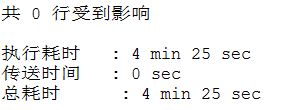

使用以下sql查看查询的效率,分析那条sql语句查询最慢,不清楚,可以通过慢日志记录的时间查看

```sql
SELECT * FROM USER WHERE id = 1; -- 00:00:07:359

SELECT * FROM USER WHERE id = 1000;-- 00:00:07:406

SELECT * FROM USER WHERE id = 10000;-- 00:00:07:407

SELECT * FROM USER WHERE id = 100000;-- 00:00:07:437

SELECT * FROM USER WHERE id = 1000000;-- 00:00:07:422

SELECT * FROM USER WHERE id = 5000000;-- 00:00:07:422

SELECT * FROM USER WHERE id = 8000000;-- 00:00:07:375

```

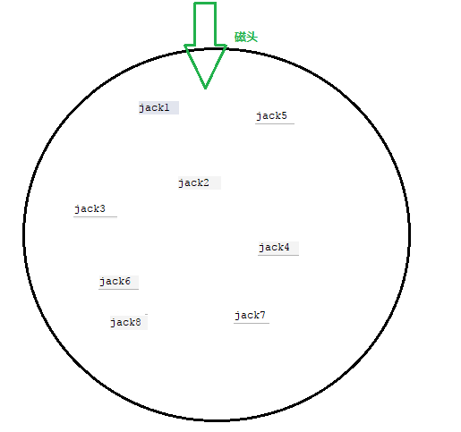

**慢查询日志**

```sql
-- 查看慢查询相关配置
show variables like '%query%'

```

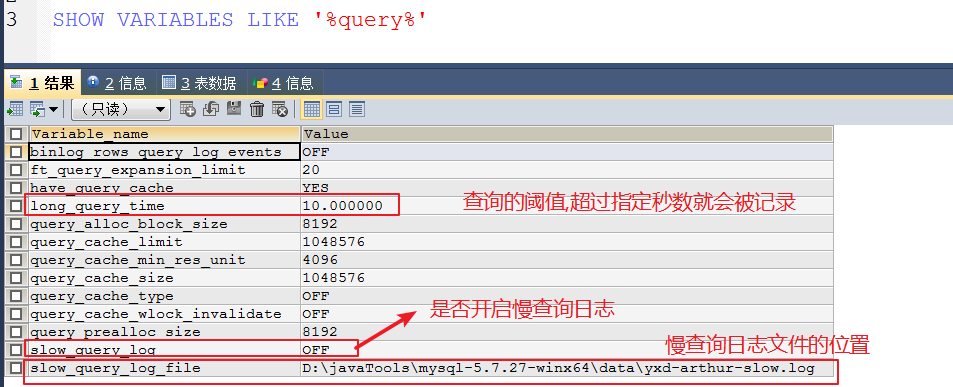

**开启慢查询日志**

```sql
set global  slow_query_log = on;

```


**设置慢查询日志时间节点（阈值）**

```sql
-- 全局设置
set global long_query_time=3;

-- 会话设置
set long_query_time=3;

```


**慢查询日志文件分析**

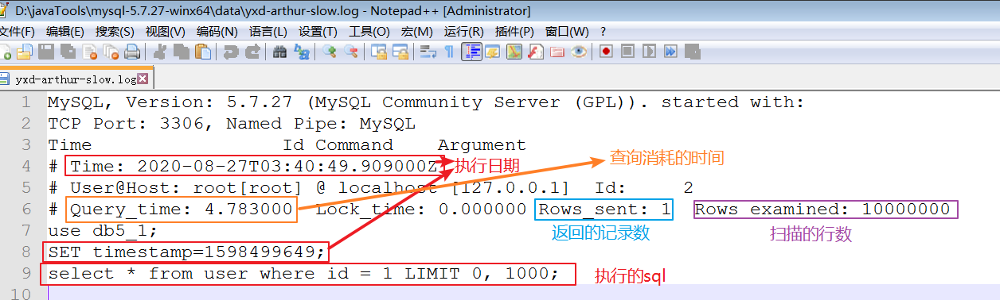

**慢日志作用:**

定位问题 : 慢查询日志 快速定位到具体的某一条sql语句问题

# 六 MySQL索引

## 1 什么是索引

在现实生活中，我们经常去图书馆查阅图书。

现在我们将所有图书杂乱无章的摆放在一起，那么找一本书就像大海捞针一样效率非常低。

如果我们按分类整理排序后，根据类别去找对应的图书那么效率就很高了。其实这个整理排序的过程就是**索引**。


MySQL索引的建立对于MySQL的高效运行是很重要的，索引可以大大提高MySQL的检索速度。

如果合理的设计且使用索引的MySQL是一辆兰博基尼的话，那么没有设计和使用索引的MySQL就是一个人力三轮车。


## 2 索引的优势与劣势

### 优势

- 类似大学图书馆建书目索引，提高数据检索的效率，降低数据库的IO成本。
- 通过索引列对数据进行排序，降低数据排序的成本，降低CPU的消耗。

### 劣势

- 实际上索引也是一张表，该表保存了主键与索引字段，并指向实体表的记录，所以索引列也是要占用空间的
- 虽然索引大大提高了查询速度，同时却会降低更新表的速度，如对表进行INSERT、UPDATE和DELETE。因为更新表时，MySQL不仅要保存数据，还要保存一下索引文件每次更新添加了索引列的字段，都会调整因为更新所带来的键值变化后的索引信息。

​       **备:比如新华字段添加在中间添加一页,后边所有的都要改变**

## 3 索引分类和语法

单列索引（给一列字段增加索引）  id

组合索引（给多列字段增加索引）  id +name


### 分类

- 普通索引：仅加速查询 index
- 唯一索引：加速查询 + 列值唯一（可以有null） unique (既是约束也是索引)
- 主键索引：加速查询 + 列值唯一（不可以有null）+ 表中只有一个  primary key (既是约束也是索引)
- 组合（联合）索引：多列值组成一个索引


### 创建索引(不需要背 )

索引在数据库当中一般就创建一次, 一般情况下是表刚开始创建的时候
当程序运行几年后 才考虑这个问题

#### 直接创建(普通或唯一 理解)

```sql
-- 创建普通索引
create index 索引名 on 表名(列名);

-- 创建唯一索引
create unique index  索引名 on 表名(列名);

-- 创建普通组合索引
create index 索引号 on 表名(列名1,列名2);

-- 创建唯一组合索引
create unique index  索引号 on 表名(列名1,列名2);


```

```sql
create table i1(
	id int,
    name varchar(8),
    email varchar(8)
);

-- 给name添加普通索引
create index nameindex on i1(name);

-- 给email添加唯一索引
create unique index  emailindex on i1(email);

```

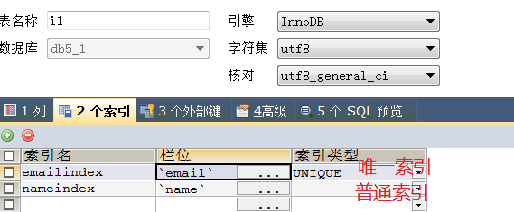

#### 修改表时指定(推荐)

```sql
-- 添加一个主键，这意味着索引值必须是唯一的，且不能为NULL
alter table 表名 add primary key(列名1,列名2)


-- 添加唯一索引（除了NULL外，NULL可能会出现多次）
alter table 表名 add unique(列名1,列名2)

-- 添加普通索引，索引值可以出现多次。
alter table 表名 add index(列名1,列名2)

```

```sql
create table i2(
	id int,
    name varchar(8),
    email varchar(8)
);

-- 给id添加主键索引
alter table i2 add primary key(id);
-- 给name添加普通索引
alter table i2 add index(name);
-- 给email添加唯一索引
alter table i2 add unique(email);

```

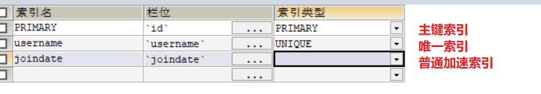

#### 创建表时指定(学习推荐)

```sql
CREATE TABLE i3(
	id INT,
	username VARCHAR(20),
	email VARCHAR(20),
	
	PRIMARY KEY(id),
	UNIQUE(email),
	INDEX(username)
);

```


### 删除索引-了解

一般不删除索引

```sql
-- 直接删除
drop index 索引名 on 表名;

-- 修改表时删除 【掌握】
alter table 表名 drop index 索引名字;

-- 删除主键
alter table 表名 drop primary key;

```


### 索引创建原则(重点)

1. 字段内数据的辨识度不能低于70%   例如:性别,就男和女两个选项就没有必要添加索引了
2. 在经常需要 搜索 的列上建索引，这样会大大加快查找速度  例如:主键,用户名,密码,手机号经常查询使用
3. 在经常需要 连接 的列上建索引(外键字段)，可以加快连接的速度。 多表查询:笛卡尔积加索引,提高效率
4. 在经常需要 排序 的列上建索引，因为索引已经是排过序的，这样一来可以利用索引的排序，加快排序查询速度。 例如:日期,就查询某一段时间的日期
5. 注意:
   - 那是不是在数据库表字段中尽量多建索引呢?肯定不是的。因为索引的建立和维护都是需要耗时的
   - 创建表时需要通过数据库去维护索引，添加记录、更新、删除时，也需要更新索引，会间接影响数据库的效率

重点:

​	1.经常查询使用的字段和外键字段,添加索引可以提高查询的效率

​	2.添加索引之后,对数据进行增删改,会降低增删改的效率,在增删该的同时维护索引

## 4 效果演示

### 没有索引的查询

```sql
-- 根据id 
select * from user where id = 1234567;
-- 根据用户名
select * from user where username = 'jack1234567';
-- 根据邮箱模糊查询
select * from user where email like 'jack12345%';

```

以上查询在我的电脑上几乎都需要5秒左右.

### 创建索引重新查询

```sql
-- id设置为主键
alter table user add primary key(id);

-- 邮箱设置为唯一
alter table user add unique(email);

-- username设置为普通
alter table user add index(username);


```

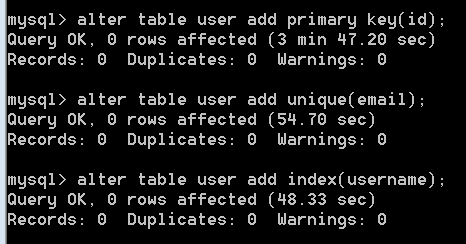

再次查询的时候都是毫秒级别的了

```sql
-- 根据id 
SELECT * FROM USER WHERE id = 1234567;-- 00:00:08:094
-- 根据用户名
SELECT * FROM USER WHERE username = 'jack1234567';-- 00:00:09:000
-- 根据邮箱模糊查询
SELECT * FROM USER WHERE email LIKE 'jack12345%';-- 00:00:09:016

-- id设置为主键
ALTER TABLE USER ADD PRIMARY KEY(id);-- 00:01:34:359

-- 邮箱设置为唯一
ALTER TABLE USER ADD UNIQUE(email);-- 00:00:52:031

-- username设置为普通
ALTER TABLE USER ADD INDEX(username);-- 00:00:46:468

-- 根据id 
SELECT * FROM USER WHERE id = 1234567;-- 00:00:00:000
SELECT * FROM USER WHERE id = 8000000;-- 00:00:00:016
-- 根据用户名
SELECT * FROM USER WHERE username = 'jack1234567';-- 00:00:00:000
-- 根据邮箱模糊查询
SELECT * FROM USER WHERE email LIKE 'jack12345%';-- 00:00:00:016
```

## 5 常见索引失效情况

- 模糊查询的时候,若在索引列上的左边加上了"%" ,索引失效    
  - where username like 'jack123%' -- 索引有效
  - where username like '%jack123%' -- 索引失效  %代表任意字符,1000万条数据查询了一遍
- 使用or查询,其中一个条件上没有索引 也会降低查询效率
  - select * from user where id = 123456 or sex = 'female';
  - sex没有添加所有,1000万条数据查询了一遍
  - 所以有or,相关的字段都要添加上索引
- 在索引列上进行计算的,索引失效
  - select * from user where id + 1 = 1234567;
  - 1000万条数据所有的id都会加1然后和1234567
  - 可以把添加的值写在后边 select * from user where id = 1234567-1;
- 使用 !=、 <> 、is not null、not 等也会失效  尽量不要出现null
  - select * from user where username is not null;
- 组合索引要注意最左匹配原则(必须按照顺序出现),否则也会失效
  - 例如: 给user表添加了组合索引 (id,name,email).就相当于添加了三个索引
    - id
    - id,name
    - id,name,email
  - 若我们查询的时候
    - select * from user where id = 1;-- 有效
    - select * from user where id = 1 and name like 'jack%';-- 有效
    - select * from user where id = 1 and name like 'jack%' and email like '%jack';-- 有效
    - select * from user where  name like 'jack%';-- 无效,没有先写id
    - select * from user where id = 1 and email like 'jack%';-- 无效,email前没有写name
    - select * from user where name like 'jack%' and email like 'jack%';-- 无效,没有先写id
- 类型的自动提升导致索引失效  :  尽量保证类型一致
  - select * from user where username = 1; -- 失效 把整数提升为字符串
  - select * from user where username = '1';-- 有效

## 6 索引数据结构

### 介绍

我们知道**索引**是帮助MySQL高效获取数据**排好序**的**数据结构**。

**索引= 排序后的数据结构**

为什么使用索引后查询效率提高很多呢？接下来我们来了解下。

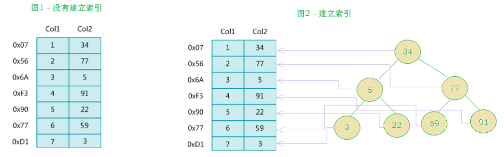


在没有索引的情况下我们执行一条sql语句，那么是表进行全局遍历，磁盘寻址（注意逻辑上相邻的记录在磁盘上也并不是一定物理相邻的）。


为了加快的查找效率，可以维护一个右边所示的二叉查找树，每个节点分别包含索引键值和一个指向对应数据记录物理地址的指针，这样就可以运用二叉查找快速获取到相应数据。


### 索引数据结构

https://www.cs.usfca.edu/~galles/visualization/Algorithms.html

1. 二叉树 

   - 一个节点最多有两个子节点,若使用满二叉树存储1kw数据的话,这棵树需要有24层
   - 左节点的数据<根节点 <右节点的数据
   - 二叉树有可能会变成一个链表

2. 红黑树（平衡二叉树）  : 树的高度无法控制

   - 可以通过左旋和右旋达到一个自平衡,不会形成一个链表
   - 依然解决不了存储大量数据的问题
   - jdk1.8 的哈希表结构  < 8 的时候 使用链表  >8使用的是红黑树

3. Hash

   - 存取数据的时候,需要先对数据进行哈希运算,得出一个值,此值就是对应的hash桶
   - hash桶中的数据结构为链表或者红黑树
     - jdk8中hashmap桶中的数据结构:当桶中的数据超过8的时候就由链表-->红黑树;当数据小于6的时候就会由红黑树-->链表
   - 若使用hash做索引的话,查询的速度是比较快,尤其是查询单值查询.但是若是范围查询的话速度就慢了

4. B-Tree (多路搜索树)  

   - 一个节点上可以存放更多的数据,一个节点可以拥有更多的子节点
- 每个节点上保存的数据既有数据内容,还有索引值和指针值
   - mysql中每个索引节点大小默认值为16k,例如:索引值大小固定(6Byte),指针值大小固定(8Byte),数据内容的大小为(1010B),一个数据加起来正好1kb,一个节点上最多可以存储16个数据,一个节点上可以有17个子点点,只需要6层,就可以将1kw数据存储起来.
   - 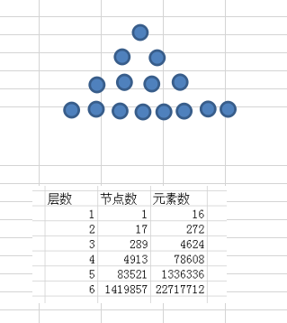
   - 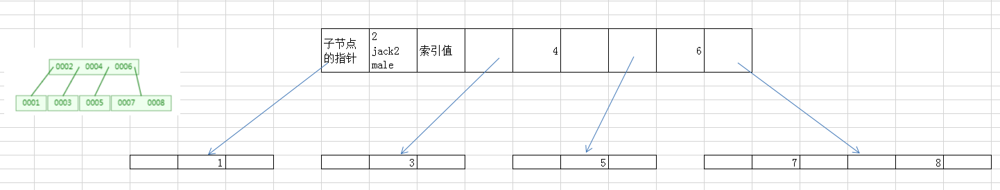
   
5. B+Tree【MySQL使用】

   - 对B Tree的改进版,
  - 每个非叶子节点上只保存索引值和指针值,只有叶子节点才保存数据
     - 所有的叶子节点使用链表串起来
   - mysql中每个索引节点大小默认值为16kb,一个节点上可以存放1170个元素,只需要3层就可以将1kw数据存储起来.并且做范围查询的时候,只需在叶子节点上直接通过链表的形式就可以获取.
   - mysql为了更快的查询,还会将根节点的索引值预先加载到内存中.假如原先是3层的话,现在只需要2次io就可以找到指定的数据了.
   - 特点:高度可控制,查询速度快

https://www.cs.usfca.edu/~galles/visualization/BTree.html

### MySQL中的B+Tree


```sql
-- 查看mysql索引节点大小 数据库默认读取本地磁盘数据16kb==>4页数据(1页4kb)
show global status like 'innodb_page_size';
```


MySQL中的 B+Tree 索引结构示意图：

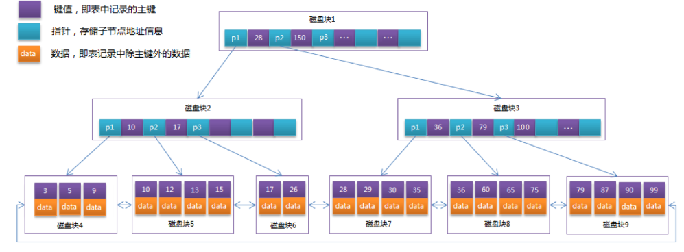

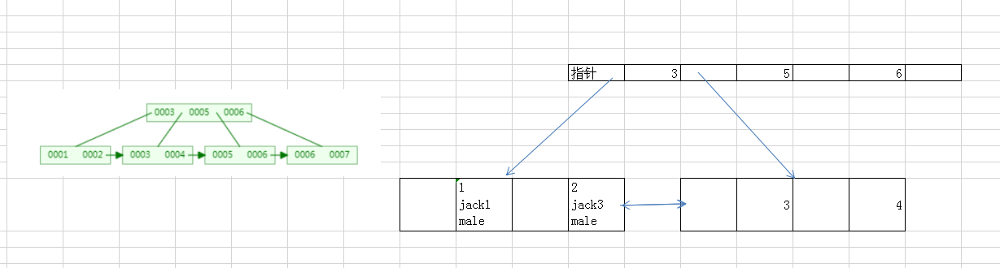

## 7 数据库存储引擎

MySQL存储引擎的不同，那么索引文件保存的方式也有所不同，常见的有二种存储引擎**MyISAM**和**InnoDB**。

myisam:msyql5.5版本之前的使用,不支持事务.

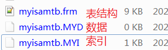

innodb:mysql5.5(含)之后的默认使用,支持事务.

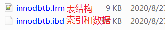

```sql
SHOW CREATE TABLE user1;

CREATE TABLE `user1` (
  `id` INT(11) DEFAULT NULL,
  `username` VARCHAR(32) DEFAULT NULL,
  `password` VARCHAR(32) DEFAULT NULL,
  `sex` VARCHAR(6) DEFAULT NULL,
  `email` VARCHAR(50) DEFAULT NULL
) ENGINE=INNODB DEFAULT CHARSET=utf8

CREATE TABLE `user2` (
  `id` INT(11) DEFAULT NULL,
  `username` VARCHAR(32) DEFAULT NULL,
  `password` VARCHAR(32) DEFAULT NULL,
  `sex` VARCHAR(6) DEFAULT NULL,
  `email` VARCHAR(50) DEFAULT NULL
) ENGINE=MYISAM DEFAULT CHARSET=utf8

```

------

- 聚集索引

  - innodb中使用的索引
  - 一张表中只能有一个聚集索引
    - 百科上说法:逻辑地址和物理地址是一致的.
    - b+tree中叶子节点存放的索引和数据
    - 聚集索引一般是主键索引;若没有主键,就找表中的第一个唯一索引;若也没有唯一索引,mysql会默认添加一列,我们看不到.
    - 聚集索引一般都是主键索引,主键索引的叶子节点存放了数据.表中其他索引就不再存储数据了,其他索引的叶子节点中存放的主键.若搜索的是其他索引,先找到主键,在通过主键索引找具体的值.

  

  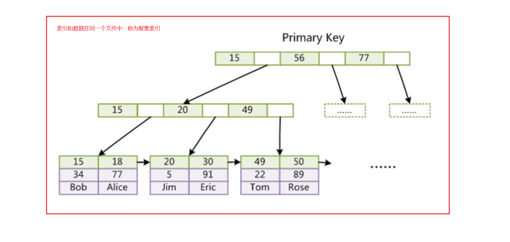

  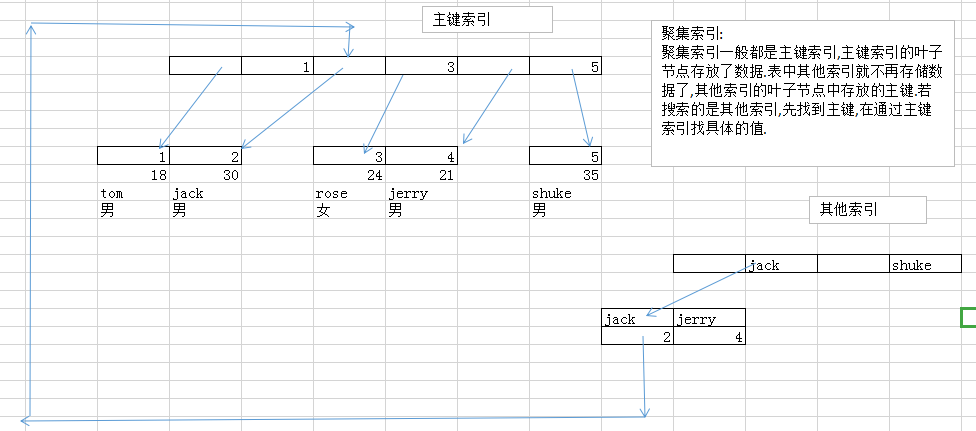

  

- 非聚集索引

  - myisam中使用的索引
  - 索引文件和数据文件是分开的.
  - 所有的索引都是非聚集索引,且每个索引中存放的都是数据的地址.查询的时候,先找到的数据的地址,然后通过地址定位到每条数据上.

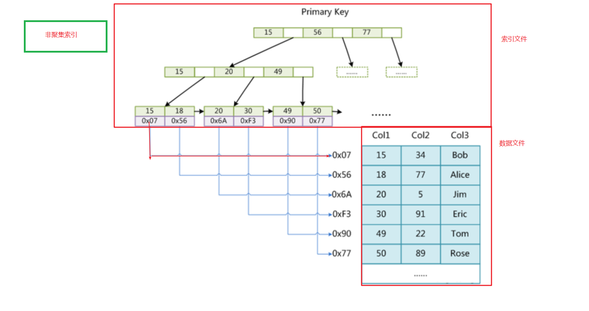

