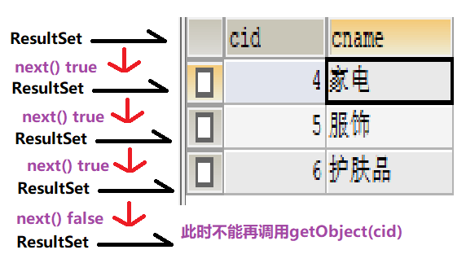
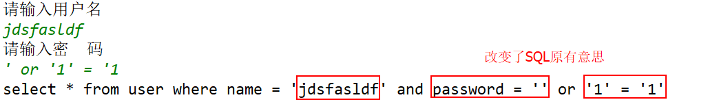
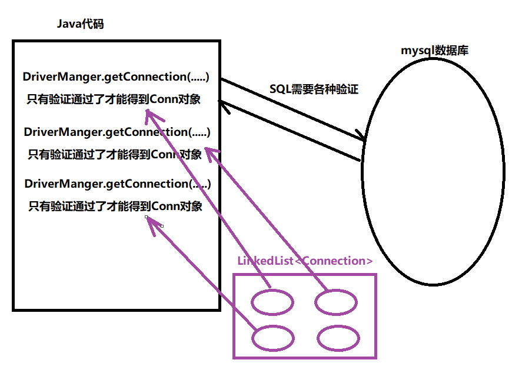

# day33_JDBC&连接池

### 总结

```java
1. 能够理解JDBC的概念
    JDBC是一种规范(接口),所有的数据库厂商必须按照规范提供驱动
2. 能够使用Connection接口
    Statement st = conn.createStatement();
	PreparedStatement pst = conn.prepareStatement(sql,不带参数,所有参数使用?占位符);
3. 能够使用Statement接口
    普通的Statement: executeUpdate(sql),executeQuery(sql)
     PreparedStatement:
			pst.setObject(?的索引,具体的参数);
			pst.executeUpdate(),pst.executeQuery();
4. 能够使用ResultSet接口
     rs.next(); 判断是否有下一条记录
     rs.getObject(字段的索引号|字段的名字)
5. 能够使用JDBC实现对单表数据增、删、改、查
6. 能够使用JDBC操作事务
    命令行:
		begin transaction;
		commit;
		rollback;
	Java代码:
		conn.setAotuCommit(false);
		conn.commit();
		conn.rollback();
7. 能够编写JDBC工具类
    public class JDBCUtils{
        //获取连接
        public static Connection getConnection(){
            
        }
        //释放资源
        public static void closeAll(Connection conn,Statement st,ResultSet rs){
            
        }
    }
8. 能够完成JDBC实现登录案例
10. 能够完成PreparedStatement改造登录案例    
     主要就是演示SQL注入,以及使用PreparedStatement之后解决SQL注入问题!
9. 能够通过PreparedStatement完成增、删、改、查

11. 能够使用Druid连接池
     a.通过Properties对象加载配置文件
     b.通过DruidDataSourceFactory的createDataSource方法获取连接池
     c.通过连接池的getConnection方法获取连接
     d.通过连接的close方法归还连接
```


### 第1章 JDBC的概念

##### 1.1 操作mysql的三种方式

```java
a.通过DOS命令(mysql的客户端)
b.通过第三方工具(SQLyog)  
c.通过代码去操作mysql(Java代码)    
```

##### 1.2 jdbc的介绍

```java
JDBC(Java DataBase Connectivity) Java的数据库连接技术!
```

### 第2章 JDBC的由来

##### 2.1 jdbc和驱动的含义

```java
JDBC: Java定义一套用于操作数据库的接口
驱动: 各大数据库厂商提供的该接口的实现类    
```

##### 2.2 jdbc的好处

```java
提高Java程序的扩展性,使用相同的API可以操作不同的数据库(数据库要提供它的驱动)
```

##### 2.3 jdbc会使用到的包

```java
a.java.sql包(基础包)
b.javax.sql包(扩展包)
c.驱动的jar包(导入jar包)    
```

##### 2.4 jdbc的四个核心对象

```java
a.DriverManger 驱动管理器(注册驱动)
b.Connection 数据库连接
c.Statement sql语句执行对象
d.ResultSet 结果集对象    
```

### ==第3章 JDBC的快速入门==

##### 3.1 导入mysql驱动jar包


##### 3.2 JDBC操作步骤

```java
a.注册驱动
b.获取数据库连接
c.获取SQL语句的执行对象
d.执行sql
e.获取结果集
f.释放资源  
    
public class JDBCHelloWorld {
    public static void main(String[] args) throws SQLException {
        //a.注册驱动
        DriverManager.registerDriver(new Driver());
        //b.获取数据库连接
        Connection conn = DriverManager.getConnection("jdbc:mysql://localhost:3306/hm144","root","1234");
        //c.获取SQL语句的执行对象
        Statement st = conn.createStatement();
        //d.执行sql
        int rows = st.executeUpdate("delete from category");
        //e.获取结果集
        System.out.println("成功删除"+rows+"行");
        //f.释放资源
        st.close();
        conn.close();
    }
}    
```

### 第4章 JDBC的API介绍

```java
a.注册驱动:
	DriverManager.registerDriver(new Driver());
	这种注册方式,会导致驱动注册两次,我们注册一次,Driver类中静态代码块也会注册一次!
    源码如下:
		public class Driver{
            //驱动的静态代码,
            static {
                try {
                    //他也注册了一次
                    DriverManager.registerDriver(new Driver());
                } catch (SQLException var1) {
                    throw new RuntimeException("Can't register driver!");
                }
            }
        }
	我们要想办法,只让驱动注册一次: 强制加载某个类
        Class.forName("类的全限定类名")
    所以完美写法应该是:
		Class.forName("com.mysql.jdbc.Driver");
	
b.数据库连接的4大要素
    驱动名: "com.mysql.jdbc.Driver"
    数据库连接串: jdbc:mysql://数据库的ip地址:数据库的端口号/要连接的数据库名
	数据库用户名: root
	数据库密码: 自定义
        
c.SQL语句的执行对象Statement  
     其中有两类方法:
		int rows = executeUpdate("增删改sql语句");
		ResultSet rs = executeQuery("查询的sql语句");

d.释放资源
    Connection对象需要close
    Statement对象需要close
    ResultSet对象需要close
```

### 第5章 JDBC实现对单表数据增、删、改、查

##### 5.1 准备数据

```java
资料中的jdbc案例.sql中有
```

##### 5.2 增删改

```java
public class CRUDDemo {
    @Test
    public void testInsert() throws Exception {
        //1.注册驱动
        Class.forName("com.mysql.jdbc.Driver");
        //2.获取连接
        Connection conn = DriverManager.getConnection("jdbc:mysql://localhost:3306/hm144", "root", "1234");
        //3.获取SQL 执行对象
        Statement st = conn.createStatement();
        //4.执行sql
        int rows = st.executeUpdate("insert into category (cname) values ('假发')");
        //5.处理
        System.out.println("成功插入" + rows + "行");
        //6.释放资源
        st.close();
        conn.close();
    }

    @Test
    public void testDelete() throws Exception {
        //1.注册驱动
        Class.forName("com.mysql.jdbc.Driver");
        //2.获取连接
        Connection conn = DriverManager.getConnection("jdbc:mysql://localhost:3306/hm144", "root", "1234");
        //3.获取SQL 执行对象
        Statement st = conn.createStatement();
        //4.执行sql
        int rows = st.executeUpdate("delete from category where cname = '假发'");
        //5.处理
        System.out.println("成功删除" + rows + "行");
        //6.释放资源
        st.close();
        conn.close();
    }

    @Test
    public void testUpdate() throws Exception {
        //1.注册驱动
        Class.forName("com.mysql.jdbc.Driver");
        //2.获取连接
        Connection conn = DriverManager.getConnection("jdbc:mysql://localhost:3306/hm144", "root", "1234");
        //3.获取SQL 执行对象
        Statement st = conn.createStatement();
        //4.执行sql
        int rows = st.executeUpdate("update category set cname = '护肤品' where cid = 6");
        //5.处理
        System.out.println("成功修改" + rows + "行");
        //6.释放资源
        st.close();
        conn.close();
    }
}
```

##### 5.3 查询

```java
@Test
public void testSelect() throws Exception {
    //1.注册驱动
    Class.forName("com.mysql.jdbc.Driver");
    //2.获取连接
    Connection conn = DriverManager.getConnection("jdbc:mysql://localhost:3306/hm144", "root", "1234");
    //3.获取SQL 执行对象
    Statement st = conn.createStatement();
    //4.执行查询
    ResultSet rs = st.executeQuery("select * from category");
    //5.处理
    while (rs.next()){
        Object cid = rs.getObject("cid");
        Object cname = rs.getObject("cname");
        System.out.println(cid + "\t" + cname);
    }
    //6.释放资源
    rs.close();
    st.close();
    conn.close();
}
```

##### 5.4 ResultSet的API和原理

```java
ResultSet的API:
	boolean b = rs.next() 该方法会判断是否还有下一条记录
    rs.getInt/getDouble/getString()等方法,如果我们不关心其具体的类型,我们建议使用getObject()
    rs.getXxx(int 字段的序号<从1开始>| String 字段的名字),同样我们建议使用字段的名字来获取字段的值
ResultSet的原理:
	ResultSet我们可以把它看做一张临时的表
```



### ==第6章 JDBC事务==

##### 6.1 准备数据

```java
资料中的jdbc案例.sql中有
```

##### 6.2 API介绍

```java
conn.setAutoCommit(false);//开启事务!(设置为手动提交)
...
conn.commit();//提交事务 
conn.rollback();//回滚事务
```

##### 6.3 事务操作步骤

```java
a.事务是什么呢??
    保证这一组SQL操作,要么全部成功,要么全部失败,不会出现一部分成功一部分失败这种情况!
b.事务操作一般步骤:(伪代码)
	try{
		开启事务
        	执行一堆的sql语句
        提交事务     
    }catch(XxxException e){
        e.printStackTrace()
        回滚事务;  
    }
    
```

##### 6.4 案例实现

```java
/**
 * 事务操作:
 *	命令行: begin transaction; commit; rollback;
 *  Java代码: conn.setAutoCommit(false); conn.commit();conn.rollback(); 
 */

public class TransactionDemo {
    public static void main(String[] args) throws ClassNotFoundException, SQLException {
        //使用事务模拟转账功能
        //1.注册驱动
        Class.forName("com.mysql.jdbc.Driver");
        //2.获取连接
        Connection conn = DriverManager.getConnection("jdbc:mysql:///hm144", "root", "1234");
        Statement st = null;
        try {
            //开启事务
            conn.setAutoCommit(false);
            //3.获取sql执行对象
            st = conn.createStatement();
            //4.执行sql
            //jack - 500
            int rows1 = st.executeUpdate("update account set balance = balance - 500 where name = 'jack'");
            //模拟一下服务器出现异常
            System.out.println(1 / 0);
            //rose + 500
            int rows2 = st.executeUpdate("update account set balance = balance + 500 where name = 'rose'");
            if (rows1 == 1 && rows2 == 1) {
                //提交事务
                conn.commit();
                System.out.println("转账OK...");
            }
        }catch (Exception e){
            //有异常
            System.out.println("转换no...");
            //回滚事务
            conn.rollback();
        }
        //5.释放资源
        st.close();
        conn.close();
    }
}
```

### ==第7章 JDBC获取连接与关闭连接工具类实现==

##### 7.1 JDBC工具类的编写

```java
/**
 * JDBC工具类,抽取两个功能
 * a.获取连接
 * b.关闭所有资源
 */
public class JDBCUtils {
    /**
     * 数据库的四大要素
     */
    public static String driverName = "com.mysql.jdbc.Driver";
    public static String url = "jdbc:mysql://localhost:3306/hm144";
    public static String username = "root";
    public static String password = "1234";
    //配置文件(今天不考虑配置文件,课下我们可以自己尝试!)

    /**
     * 为了保证驱动只注册一次,我们建议使用静态代码块来注册驱动
     */
    static {
        //1.注册驱动
        try {
            Class.forName(driverName);
        } catch (ClassNotFoundException e) {
            e.printStackTrace();
            System.out.println("注册驱动失败...");
        }
    }

    /**
     * 获取连接
     */
    public static Connection getConnection(){
        //2.获取连接
        Connection conn = null;
        try {
            conn = DriverManager.getConnection(url,username,password);
        } catch (SQLException e) {
            e.printStackTrace();
        }
        //3.返回连接
        return conn;
    }

    /**
     * 关闭各种资源
     */
    public static void closeAll(Connection conn, Statement st, ResultSet rs) {
        try {
            if (conn != null) {
                conn.close();
            }
        } catch (SQLException e) {
            e.printStackTrace();
        }
        try {
            if (st != null) {
                st.close();
            }
        } catch (SQLException e) {
            e.printStackTrace();
        }
        try {
            if (rs != null) {
                rs.close();
            }
        } catch (SQLException e) {
            e.printStackTrace();
        }
    }
}
```

##### 7.2 JDBC工具类的使用

```java
public class JDBCUtilsCRUD {
    @Test
    public void testInsert() throws SQLException {
        //1.获取连接
        Connection conn = JDBCUtils.getConnection();
        //2.获取执行对象
        Statement st = conn.createStatement();
        //3.执行
        int rows = st.executeUpdate("insert into category (cname) values ('假发'),('高跟鞋'),('雕皮大衣')");
        //4.处理
        System.out.println("成功插入" + rows + "行");
        //5.释放资源
        JDBCUtils.closeAll(conn, st, null);
    }

    @Test
    public void testDelete() throws SQLException {
        //1.获取连接
        Connection conn = JDBCUtils.getConnection();
        //2.获取执行对象
        Statement st = conn.createStatement();
        //3.执行
        int rows = st.executeUpdate("delete from category where cid in (5,8,10)");
        //4.处理
        System.out.println("成功删除" + rows + "行");
        //5.释放资源
        JDBCUtils.closeAll(conn, st, null);
    }

    @Test
    public void testUpdate() throws SQLException {
        //1.获取连接
        Connection conn = JDBCUtils.getConnection();
        //2.获取执行对象
        Statement st = conn.createStatement();
        //3.执行
        int rows = st.executeUpdate("update category set cname = '家用电器' where cid = 4");
        //4.处理
        System.out.println("成功修改" + rows + "行");
        //5.释放资源
        JDBCUtils.closeAll(conn, st, null);
    }

    @Test
    public void testSelect() throws SQLException {
        //1.获取连接
        Connection conn = JDBCUtils.getConnection();
        //2.获取执行对象
        Statement st = conn.createStatement();
        //3.执行
        ResultSet rs = st.executeQuery("select * from category");
        //4.处理
        while (rs.next()) {
            int cid = rs.getInt("cid");
            String cname = rs.getString("cname");
            System.out.println(cid + "\t" + cname);
        }
        //5.释放资源
        JDBCUtils.closeAll(conn, st, rs);
    }
}
```

### 第8章 JDBC实现登录案例

##### 8.1 案例介绍

```java
控制台输入用户名和密码,实现用户的登陆功能!
```

##### 8.2 实现步骤

```java
a.输入用户名和密码
b.获取数据库连接
c.获取sql执行对象
d.执行查询语句executeQuery
e.判断rs.next是否为true 
f.释放资源    
```

##### 8.3 代码实现

```java
public class JDBCTestDemo {
    public static void main(String[] args) throws SQLException {
        //a.输入用户名和密码
        Scanner sc = new Scanner(System.in);
        System.out.println("请输入用户名");
        String name = sc.nextLine();
        System.out.println("请输入密  码");
        String password = sc.nextLine();

        //b.获取数据库连接
        Connection conn = JDBCUtils.getConnection();
        //c.获取sql执行对象
        Statement st = conn.createStatement();
        //d.执行查询语句executeQuery
        String sql = "select * from user where name = '"+name+"' and password = '"+password+"'";
        System.out.println(sql);
        ResultSet rs = st.executeQuery(sql);
        //e.判断rs.next是否为true
        if (rs.next()){
            System.out.println("登陆成功...");
        }else{
            System.out.println("用户名或者密码错误!");
        }
        //f.释放资源
        JDBCUtils.closeAll(conn,st,rs);
    }
}
```

### 第9章 PreparedSatement预编译对象

##### 9.1 SQL注入

```java
60年代黑客技术!
SQL注入: 在SQL的参数中写一些非法字符,从而到达改变原有SQL的本意! 
    
比如: 
```



##### 9.2 PreparedSatement的介绍

- PreparedStatement的好处

  ```java
  PreparedStatement 是继承了Statement,并且可以防止SQL注入!
  PreparedStatement 中的SQL语句只需要编译一次,不同参数不需要再次编译!    
  ```

- PreparedStatement的API介绍

  ```java
  Statement: 
  	创建: conn.createStatement();
  	使用: st.executeUpdate("sql+参数");
  PreparedStatement:
  	创建: conn.prepareStatement("sql,不带参数,使用占位符?代替");
  	使用: pst.setXXX(?号的索引<索引也是从1开始>,具体的值);
  		 pst.executeUpdate()/pst.executeQuery()
  
  ```

##### 9.3 PreparedSatement改写登录案例

```java
package com.itheima.demo06_JDBCTest_PreparedStatement;

import com.itheima.demo04_JDBCUtils.JDBCUtils;

import java.sql.*;
import java.util.Scanner;

public class JDBCPreparedStatementTestDemo {
    public static void main(String[] args) throws SQLException {
        //a.输入用户名和密码
        Scanner sc = new Scanner(System.in);
        System.out.println("请输入用户名");
        String name = sc.nextLine();
        System.out.println("请输入密  码");
        String password = sc.nextLine();

        //b.获取数据库连接
        Connection conn = JDBCUtils.getConnection();
        //c.获取sql执行对象
        PreparedStatement pst = conn.prepareStatement("select * from user where name = ? and password = ?");
        pst.setObject(1,name);
        pst.setObject(2,password);
        //d.执行查询语句executeQuery
        ResultSet rs = pst.executeQuery();
        //e.判断rs.next是否为true
        if (rs.next()){
            System.out.println("登陆成功...");
        }else{
            System.out.println("用户名或者密码错误!");
        }
        //f.释放资源
        JDBCUtils.closeAll(conn,pst,rs);
    }
}
```

##### 9.4 PreparedSatement实现增删改查练习

```java
package com.itheima.demo07_JDBCPreparedStatement;

import com.itheima.demo04_JDBCUtils.JDBCUtils;
import org.junit.Test;

import java.sql.Connection;
import java.sql.PreparedStatement;
import java.sql.ResultSet;
import java.sql.SQLException;

public class PreparedStatementTest {
    @Test
    public void testInsert() throws SQLException {
        //1.获取连接
        Connection conn = JDBCUtils.getConnection();
        //2.创建PreparedStatement对象
        PreparedStatement pst = conn.prepareStatement("insert into category (cname) values (?)");
        pst.setObject(1,"T恤");
        //3.执行
        int rows = pst.executeUpdate();
        //4.处理
        System.out.println("成功插入" + rows + "行");
        //5.释放资源
        JDBCUtils.closeAll(conn,pst,null);
    }

    @Test
    public void testDelete() throws SQLException {
        //1.获取连接
        Connection conn = JDBCUtils.getConnection();
        //2.创建PreparedStatement对象
        PreparedStatement pst = conn.prepareStatement("delete from category where cid in (?,?)");
        pst.setObject(1,4);
        pst.setObject(2,6);
        //3.执行
        int rows = pst.executeUpdate();
        //4.处理
        System.out.println("成功删除" + rows + "行");
        //5.释放资源
        JDBCUtils.closeAll(conn,pst,null);
    }

    @Test
    public void testUpdate() throws SQLException {
        //1.获取连接
        Connection conn = JDBCUtils.getConnection();
        //2.创建PreparedStatement对象
        PreparedStatement pst = conn.prepareStatement("update category set cname = ? where cid = ?");
        pst.setObject(1,"T裤");
        pst.setObject(2,11);
        //3.执行
        int rows = pst.executeUpdate();
        //4.处理
        System.out.println("成功修改" + rows + "行");
        //5.释放资源
        JDBCUtils.closeAll(conn,pst,null);
    }

    @Test
    public void testSelect() throws SQLException {
        //1.获取连接
        Connection conn = JDBCUtils.getConnection();
        //2.创建PreparedStatement对象
        PreparedStatement pst = conn.prepareStatement("select * from category where cid in (?,?,?)");
        pst.setObject(1,9);
        pst.setObject(2,12);
        pst.setObject(3,14);
        //3.执行
        ResultSet rs = pst.executeQuery();
        //4.处理
        while (rs.next()) {
            Object cid = rs.getObject("cid");
            Object cname = rs.getObject("cname");
            System.out.println(cid + "\t" + cname);
        }
        //5.释放资源
        JDBCUtils.closeAll(conn,pst,rs);
    }
}
```

### 第10章 连接池

##### 10.1 连接池的介绍

```java
连接池: 保存数据库连接的容器!
```

##### 10.2 没有连接池的现状



##### 10.3 连接池的原理

```java
a.连接池其实是一个集合,泛型是<Connection>
b.连接池事先保存若干个连接对象
c.当我们需要连接时,从连接中获取即可
d.当我们使用完毕,归还到连接中即可    
```

##### 10.4 连接池规范

```java
Java中规范:
	所有的连接池必须实现一个接口javax.sql.DataSource,必须实现
        public abstract Connection getConnection();
	当连接使用完毕后,调用连接对象close,不是关闭连接,而是归还连接!   
        
 市场上连接池非常多: dbcp,c3p0,druid(德鲁伊)       
```

### 第11章 DRUID连接池

##### 11.1 Druid连接池的介绍

```java
Druid是阿里巴巴开发的一款性能优越的连接池
```

##### 11.2 Druid连接池的配置参数

```java
必须参数:
	驱动的全限定类型:com.mysql.jdbc.Driver
    数据库的连接串: jdbc:mysql://ip:端口号/数据名 
	数据库的用户名: root
    数据名的密码: 1234
可选参数:
	initialSize: 初始化连接数
    maxActive: 最大连接数量  
    minIdle: 最小连接数量
    maxWait: 最大等待时间(单位:毫秒)    
```

##### ==11.3 DRUID连接池基本使用==

- druid连接池对象的获取API

  ```java
  使用德鲁伊连接池之前,必须确保mysql的驱动jar包和druid的jar包都导入项目
      
  Druid连接池使用工厂设计模式:
  	DruidDataSourceFactory工厂类,用于创建Druid连接池对象
      public static DataSource createDataSource(Properties ps);    
  ```

- druid配置文件的介绍

  ```properties
  必须配置的
  driverClassName=com.mysql.jdbc.Driver
  url=jdbc:mysql://127.0.0.1:3306/day25
  username=root
  password=root    
  可选配置的
  initialSize=5
  maxActive=10
  minIdle=3
  maxWait=3000
  ```

- 案例演示(正常获取)

  ```java
  package com.itheima.demo08_DruidDataSource;
  
  import com.alibaba.druid.pool.DruidDataSourceFactory;
  
  import javax.sql.DataSource;
  import java.sql.Connection;
  import java.sql.Statement;
  import java.util.Properties;
  
  public class TestDemo {
      public static void main(String[] args) throws Exception {
          //1.创建Properties对象
          Properties ps = new Properties();
          //2.加载druid.Properties文件
       	ps.load(TestDemo.class.getClassLoader().
               getResourceAsStream("druid.properties"));
          //3.使用DruidDataSourceFactory工厂,创建DruidDataSource对象
          DataSource dataSource = DruidDataSourceFactory.createDataSource(ps);
          //4.从连接池中获取连接
          Connection conn = dataSource.getConnection();
          Statement st = conn.createStatement();
          int rows = st.executeUpdate("delete from category");
          System.out.println(rows);
          //5.归还连接
          st.close();
          conn.close();
      }
  }
  ```

- 案例演示(超时获取)

  ```java
  /**
    * Druid连接池错误使用
    * 注意:使用完毕连接后,一定要及时调用close方法,归还连接
    */
  @Test
  public void test02() throws Exception {
      //1.创建Properties对象
      Properties ps = new Properties();
      //2.加载druid.Properties文件
      ps.load(TestDemo.class.getClassLoader().getResourceAsStream("druid.properties"));
      //3.使用DruidDataSourceFactory工厂,创建DruidDataSource对象
      DataSource dataSource = DruidDataSourceFactory.createDataSource(ps);
      //4.获取连接
      for (int i = 0; i < 100; i++) {
          Connection conn = dataSource.getConnection();
          System.out.println(conn);
      }
      new Scanner(System.in).nextLine();
  }
  ```

- 案例演示(查询数据库)

  ```java
  package com.itheima.demo09_DruidDataSourceTetsDemo;
  
  public class DruidDataSourceDemo {
      @Test
      public void testInsert() throws Exception {
          //1.加载配置
          Properties ps = new Properties();
          ps.load(DruidDataSourceDemo.class.getClassLoader().getResourceAsStream("druid.properties"));
          //2.通过工厂创建Druid连接池对象
          DataSource dataSource = DruidDataSourceFactory.createDataSource(ps);
          //3.从连接池中获取连接
          Connection conn = dataSource.getConnection();
          //4.获取sql执行对象
          Statement st = conn.createStatement();
          //5.执行sql
          int rows = st.executeUpdate("insert into category (cname) values ('化妆品')");
          //6.处理
          System.out.println("成功插入:"+rows+"行");
          //7.归还
          JDBCUtils.closeAll(conn,st,null);
  
      }
      @Test
      public void testDelete() throws Exception {
          //1.加载配置
          Properties ps = new Properties();
          ps.load(DruidDataSourceDemo.class.getClassLoader().getResourceAsStream("druid.properties"));
          //2.通过工厂创建Druid连接池对象
          DataSource dataSource = DruidDataSourceFactory.createDataSource(ps);
          //3.从连接池中获取连接
          Connection conn = dataSource.getConnection();
          //4.获取sql执行对象
          Statement st = conn.createStatement();
          //5.执行sql
          int rows = st.executeUpdate("delete from category");
          //6.处理
          System.out.println("成功删除:"+rows+"行");
          //7.归还
          JDBCUtils.closeAll(conn,st,null);
      }
  
      @Test
      public void testUpdate() throws Exception{
          //1.加载配置
          Properties ps = new Properties();
          ps.load(DruidDataSourceDemo.class.getClassLoader().getResourceAsStream("druid.properties"));
          //2.通过工厂创建Druid连接池对象
          DataSource dataSource = DruidDataSourceFactory.createDataSource(ps);
          //3.从连接池中获取连接
          Connection conn = dataSource.getConnection();
          //4.获取sql执行对象
          Statement st = conn.createStatement();
          //5.执行sql
          int rows = st.executeUpdate("update category set cname = '家用电器' where cname = '家电'");
          //6.处理
          System.out.println("成功修改:"+rows+"行");
          //7.归还
          JDBCUtils.closeAll(conn,st,null);
      }
      @Test
      public void testSelect() throws Exception {
          //1.加载配置
          Properties ps = new Properties();
          ps.load(DruidDataSourceDemo.class.getClassLoader().getResourceAsStream("druid.properties"));
          //2.通过工厂创建Druid连接池对象
          DataSource dataSource = DruidDataSourceFactory.createDataSource(ps);
          //3.从连接池中获取连接
          Connection conn = dataSource.getConnection();
          //4.获取sql执行对象
          Statement st = conn.createStatement();
          //5.执行sql
          ResultSet rs = st.executeQuery("select * from category");
          //6.处理
          while (rs.next()) {
              System.out.println(rs.getObject("cname"));
          }
          //7.归还
          JDBCUtils.closeAll(conn,st,rs);
      }
  }
  ```

  
