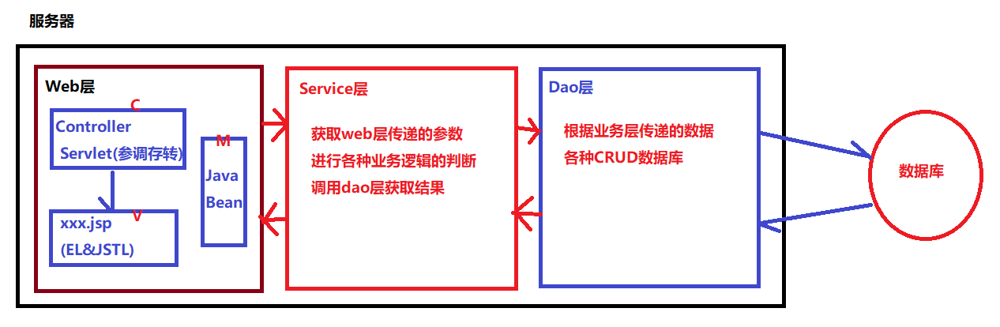
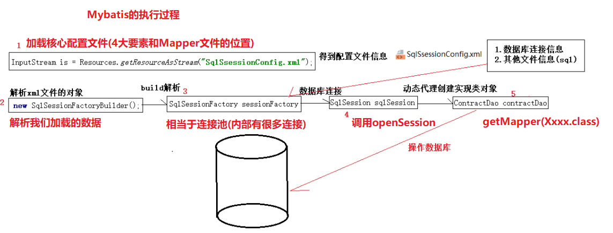

# day34_MyBatis基础

### 总结

```java
1. 能够理解三层架构及框架
    Web(SpringMVC)--> Service(全栈框架Spring) --> Dao(Mybatis)
2. 能够配置mybatis的环境(入门程序,掌握基于Dao和自动生成实现类的方法)
    a.SqlMapConfig.xml 核心配置文件(数据库环境,mapper文件的位置)
    b.XxxDao接口
    c.XxxMapper.xml文件
    d.编写测试类
    
3. 能够使用mybatis的单表增删改查
    a.抽取工具类MybatisUtils
    b.抽取测试父类BaseTest
    c.使用他们就行增删改查
    
4. 能够使用mybatis的条件查询
    如果参数是多个
    a.使用#{arg0},#{arg1}或者#{param1},#{param2}获取参数
    b.把参数封装到对象中,使用#{对象的属性名}
    c.在参数上使用@Param("aaa")给参数起码,然后在XML中使用#{aaa}获取参数
5. 能够使用mybatis模糊查询
    a.使用直接使用 like #{name} ,调用方法时参数:%猪%
    b.使用SQL函数在XML拼接%, concat(concat('%',#{name}),'%')
    c.使用${value}直接拼接进入, "%${value}%",注意这种方式不安全
    d.使用Mybatis优化后的方式: "%"#{name}"%",注意:sql无法执行,Mybatis做了优化    
6. 能够完成主键返回
    在<select useGeneratedKeys="true" keyProperty="返回主键给那个成员赋值">
    在<select>的子标签
    <selectKey keyProperty="返回主键给那个成员赋值" order="after" resultType="java.lang.Integer">
      select last_insert_id();
	</selectKey>
```


### 第一章 框架概述

##### 1.0 三层架构



##### 1.1 什么是框架

```java
框架其实就是一种半成品(把功能相同或者相似的操作进行了封装)
```

##### 1.2 框架的作用

```java
a.简化开发代码
b.为所有的相关技术做一个整合    
```

##### 1.3 常见的框架

```java
web层框架: struts1,struts2,SpringMVC
dao层框架: mybatis,hibernate,JPA
全栈框架: Spring   
    
我们今后使用:   SpringMVC + Spring + mybatis(SSM
```

##### ==1.4 ORM映射思想==

```java
ORM:对象关系映射思想
    通俗讲: 
		将数据库中表和Java中的类对应关系
        将表中一个字段和Java类中一个成员变量对应关系    
        将表中一条记录和Java中类的对象对应关系    
```

##### 1.5 mybatis的优点

```java
a.简化开发
    我们需要提供接口,在接口中写抽象方法
    提供该接口对应XML文件,在文件中写SQL语句
```

### ==第二章 mybatis快速入门==

##### 2.1 环境搭建

```sql
a.创建项目
b.导入jar包(mybatis2个jar包+数据库1个jar包+junit2个jar包<如果IDEA没有>)
c.创建数据库和表
    CREATE TABLE USER( 
    	uid INT PRIMARY KEY AUTO_INCREMENT, 
    	name VARCHAR(100) NOT NULL, 
    	password VARCHAR(50) NOT NULL, 
    	email VARCHAR(50), 
    	birthday DATE 
	);
```

##### 2.2.1 基于Mapper文件的入门程序[了解]

```java
a.创建实体类
    /**
     * 根据ORM思想,创建一个User类和数据库的user表对应
     */
    public class User {
        private int uid;
        private String name;
        private String password;
        private String email;
        private Date birthday;
    }
c.创建Mapper文件 
    <?xml version="1.0" encoding="UTF-8" ?>
    <!DOCTYPE mapper
      PUBLIC "-//mybatis.org//DTD Mapper 3.0//EN"
      "http://mybatis.org/dtd/mybatis-3-mapper.dtd">
    <!--namespace 可以认为是该XML文件的唯一标识-->
    <mapper namespace="UserMapper">
      <!--
        select 查询
        insert 插入
        update 修改
        delete 删除

        其中id代表这个标签的唯一标识
      -->
      <insert id="save" parameterType="com.itheima.pojo.User">
          insert into user (name,password,email,birthday) 
    		values (#{name},#{password},#{email},#{birthday})
      </insert>
    </mapper>
d.创建核心配置文件
    <!DOCTYPE configuration
        PUBLIC "-//mybatis.org//DTD Config 3.0//EN"
        "http://mybatis.org/dtd/mybatis-3-config.dtd">
    <configuration>
        <!--配置数据库环境标签-->
        <environments default="development">
            <environment id="development">
                <!--采用哪种事务管理机制-->
                <transactionManager type="JDBC"/>
                <!--配置连接池 POOLED UNPOOLED-->
                <dataSource type="POOLED">
                    <!--数据库的四大要素-->
                    <property name="driver" value="com.mysql.jdbc.Driver"/>
                    <property name="url" value="jdbc:mysql://localhost:3306/mybatis_day01"/>
                    <property name="username" value="root"/>
                    <property name="password" value="1234"/>
                </dataSource>
            </environment>
        </environments>
        <!--引入Mapper文件-->
        <mappers>
            <!--引入某个Mapper文件,默认从src下开始寻找-->
            <mapper resource="UserMapper.xml"/>
        </mappers>
    </configuration>
f.加入日志配置文件(可选) 
    如果不使用log4j.properties文件,那么就没有日志输出
    如果要使用log4j.properties,请你放在src的根目录下
```

##### 2.2.2 编写测试类

```java
a.加载核心配置文件
b.创建SQLSessionFactoryBuilder对象
c.获取SqlSessionFactory对象
d.获取数据库连接对象
e.调用方法返回结果
f.提交事务    
g.释放资源
    
package com.itheima.test;

import com.itheima.pojo.User;
import org.apache.ibatis.io.Resources;
import org.apache.ibatis.session.SqlSession;
import org.apache.ibatis.session.SqlSessionFactory;
import org.apache.ibatis.session.SqlSessionFactoryBuilder;

import java.io.IOException;
import java.io.InputStream;
import java.util.Date;

/**
 * 编写Mybatis使用入门的测试类
 *  //1.加载核心配置文件
 *  //2.使用SQlSessionFactoryBuilder对象解析核心配置文件
 *  //3.使用工厂获取SqlSession对象
 *  //4.使用sqlSession就可以执行我们配置好的insert操作
 *  //5.提交
 *  //6.关闭
 */
public class TestDemo {
    public static void main(String[] args) throws IOException {
        //1.加载核心配置文件
        InputStream in = Resources.getResourceAsStream("SqlMapConfig.xml");
        //2.使用SQlSessionFactoryBuilder对象解析核心配置文件
        SqlSessionFactoryBuilder builder = new SqlSessionFactoryBuilder();
        SqlSessionFactory sqlSessionFactory = builder.build(in);
        //3.使用工厂获取SqlSession对象
        SqlSession sqlSession = sqlSessionFactory.openSession();
        //4.使用sqlSession就可以执行我们配置好的insert操作
        sqlSession.insert("UserMapper.save",
                new User(100,"jack","123","123@qq.com",new Date()));
        //5.提交
        sqlSession.commit();
        //6.关闭
        sqlSession.close();
    }
}
    
```

##### 2.3.1 基于Dao接口和实现类的入门程序[了解]

```java
a.创建实体类
    /**
     * 根据ORM思想,创建一个User类和数据库的user表对应
     */
    public class User {
        private int uid;
        private String name;
        private String password;
        private String email;
        private Date birthday;
    }
b.编写Dao接口
    /**
     * 操作User表的Dao接口
     */
    public interface UserDao {
        void save(User user);
    }

c.创建Mapper文件
    <?xml version="1.0" encoding="UTF-8" ?>
    <!DOCTYPE mapper
      PUBLIC "-//mybatis.org//DTD Mapper 3.0//EN"
      "http://mybatis.org/dtd/mybatis-3-mapper.dtd">
    <!--namespace 可以认为是该XML文件的唯一标识-->
    <mapper namespace="com.itheima.dao.UserDao">
      <!--
        select 查询
        insert 插入
        update 修改
        delete 删除

        其中id代表这个标签的唯一标识
      -->
      <insert id="save" parameterType="com.itheima.pojo.User">
          insert into user (name,password,email,birthday) values (#{name},#{password},#{email},#{birthday})
      </insert>
    </mapper>
d.创建核心配置文件  
    <?xml version="1.0" encoding="UTF-8" ?>
    <!DOCTYPE configuration
            PUBLIC "-//mybatis.org//DTD Config 3.0//EN"
            "http://mybatis.org/dtd/mybatis-3-config.dtd">
    <configuration>
        <!--配置数据库环境标签-->
        <environments default="development">
            <environment id="development">
                <!--采用哪种事务管理机制-->
                <transactionManager type="JDBC"/>
                <!--配置连接池 POOLED UNPOOLED-->
                <dataSource type="POOLED">
                    <!--数据库的四大要素-->
                    <property name="driver" value="com.mysql.jdbc.Driver"/>
                    <property name="url" value="jdbc:mysql://localhost:3306/mybatis_day01"/>
                    <property name="username" value="root"/>
                    <property name="password" value="1234"/>
                </dataSource>
            </environment>
        </environments>
        <!--引入Mapper文件-->
        <mappers>
            <!--引入某个Mapper文件,默认从src下开始寻找,这里不能用.必须使用/-->
            <mapper resource="com/itheima/dao/UserMapper.xml"/>
        </mappers>
    </configuration>
d.编写Dao实现类  
    /**
     * Dao接口的实现类
     */
    public class UserDaoImpl implements UserDao{
        @Override
        public void save(User user) {
            //1.加载核心配置文件
            InputStream in = null;
            try {
                in = Resources.getResourceAsStream("SqlMapConfig.xml");
            } catch (IOException e) {
                e.printStackTrace();
            }
            //2.通过SqlSessionFactoryBuilder解析核心配置文件
            SqlSessionFactoryBuilder builder = new SqlSessionFactoryBuilder();
            SqlSessionFactory sqlSessionFactory = builder.build(in);
            //3.SqlSessionFactory获取SqlSession对象
            SqlSession sqlSession = sqlSessionFactory.openSession();
            //4.通过SqlSession对象执行方法
            sqlSession.insert("com.itheima.dao.UserDao.save",user);
            //5.提交
            sqlSession.commit();
            //6.关闭
            sqlSession.close();
        }
    }
f.加入日志配置文件(可选)  
```

##### 2.3.1 编写测试类

```java
a.准备User对象
b.创建实现类对象
b.调用实现类方法  
    
public class TestDemo {
    public static void main(String[] args) {
        //测试一下实现类
        UserDaoImpl dao = new UserDaoImpl();
        dao.save(new User(111,"rose","321","321@qq.com",new Date()));
    }
}    
```

##### ==2.4.1 基于Dao接口自动生成实现类的入门程序[重点]==

```java
a.创建实体类
    /**
     * 根据ORM思想,创建一个User类和数据库的user表对应
     */
    public class User {
        private int uid;
        private String name;
        private String password;
        private String email;
        private Date birthday;
    }
b.创建dao(接口)
    /**
     * UserDao接口
     */
    public interface UserDao {
        void save(User user);
    }

c.创建Mapper文件(注意创建的位置)  
    <?xml version="1.0" encoding="UTF-8" ?>
    <!DOCTYPE mapper
      PUBLIC "-//mybatis.org//DTD Mapper 3.0//EN"
      "http://mybatis.org/dtd/mybatis-3-mapper.dtd">
    <!--namespace 可以认为是该XML文件的唯一标识-->
    <mapper namespace="com.itheima.dao.UserDao">
      <!--
        select 查询
        insert 插入
        update 修改
        delete 删除

        其中id代表这个标签的唯一标识
      -->
      <insert id="save" parameterType="com.itheima.pojo.User">
          insert into user (name,password,email,birthday) values (#{name},#{password},#{email},#{birthday})
      </insert>
    </mapper>
d.创建核心配置文件
    <?xml version="1.0" encoding="UTF-8" ?>
    <!DOCTYPE configuration
            PUBLIC "-//mybatis.org//DTD Config 3.0//EN"
            "http://mybatis.org/dtd/mybatis-3-config.dtd">
    <configuration>
        <!--配置数据库环境标签-->
        <environments default="development">
            <environment id="development">
                <!--采用哪种事务管理机制-->
                <transactionManager type="JDBC"/>
                <!--配置连接池 POOLED UNPOOLED-->
                <dataSource type="POOLED">
                    <!--数据库的四大要素-->
                    <property name="driver" value="com.mysql.jdbc.Driver"/>
                    <property name="url" value="jdbc:mysql://localhost:3306/mybatis_day01"/>
                    <property name="username" value="root"/>
                    <property name="password" value="1234"/>
                </dataSource>
            </environment>
        </environments>
        <!--引入Mapper文件-->
        <mappers>
            <!--引入某个Mapper文件,默认从src下开始寻找-->
            <mapper resource="com/itheima/dao/UserMapper.xml"/>
        </mappers>
    </configuration>
f.加入日志配置文件(可选)    
```

##### 2.4.2 编写测试类

```java
a.加载核心配置文件
b.创建SQLSessionFactoryBuilder对象
c.获取SqlSessionFactory对象
d.获取数据库连接对象
e.获取dao的实现类对象
f.调用方法返回结果
g.释放资源
    
public class TestDemo {
    public static void main(String[] args) throws IOException {
        //1.加载核心配置文件
        InputStream in = Resources.getResourceAsStream("SqlMapConfig.xml");
        //2.使用SqlSessionFactoryBuilder
        SqlSessionFactory sqlSessionFactory = new SqlSessionFactoryBuilder().build(in);
        //3.获取sqlSession
        SqlSession sqlSession = sqlSessionFactory.openSession();
        //4.获取UserDao接口的实现类(Mybatis自动生成.通过动态代理)
        UserDao userDao = sqlSession.getMapper(UserDao.class);
        //5.调用
        userDao.save(new User(123,"tom","123321","123321@qq.com",new Date()));
        //6.提交
        sqlSession.commit();
        //7.关闭
        sqlSession.close();
    }
}    
```

### 第三章 Mybatis的核心对象和原理分析

##### 3.1 API的介绍

```java
a.Resources.getResourceAsStream
    这是Mybatis提供专门用于加载核心配置文件的类(默认从src下开始寻找)
b.SqlSessionFactoryBuilder(SqlSessionFactory的构建者)
    这是Mybatis提供专门用于解析核心配置文件中的数据,生成SqlSessionFactory对象
c.SqlSessionFactory的openSession
    这个方法openSession专门用于从SqlSessionFactory获取SqlSession对象(相当于JDBC的Connection)
d.SqlSession的getMapper方法
    这个方法专门用于获取某个Dao接口的实现类(前提是该接口必须有对应的Mapper文件)
e.提交和关闭
    SqlSession使用完毕之后必须提交并且关闭
```

##### 3.2 mybatis的执行过程



### ==第四章 抽取工具类==

##### 1.抽取MyBatis工具类

```java
/**
 * Mybatis加载核心配置文件获取SqlSession对象的工具类
 */
public class MybatisUtils {
    /**
     * 获取SqlSession方法
     */
    public static SqlSession openSqlSession(){
        //1.加载核心配置文件
        InputStream in = null;
        try {
            in = Resources.getResourceAsStream("SqlMapConfig.xml");
        } catch (IOException e) {
            e.printStackTrace();
            throw new RuntimeException("加载核心配置文件失败..");
        }
        //2.使用SqlSessionFactoryBuilder
        SqlSessionFactory sqlSessionFactory = new SqlSessionFactoryBuilder().build(in);
        //3.获取sqlSession
        SqlSession sqlSession = sqlSessionFactory.openSession();
        //4.返回
        return sqlSession;
    }
}
```

##### 2.测试MyBatis工具类

```java
public class TestDemo {
    public static void main(String[] args) throws IOException {
        //1-3 通过工具类获取SqlSession对象
        SqlSession sqlSession = MybatisUtils.openSqlSession();
        //4.获取UserDao接口的实现类(Mybatis自动生成.通过动态代理)
        UserDao userDao = sqlSession.getMapper(UserDao.class);
        //5.调用
        userDao.save(new User(123,"jerry","321123","321123@qq.com",new Date()));
        //6.提交
        sqlSession.commit();
        //7.关闭
        sqlSession.close();
    }
}
```

### ==第五章 mybatis的单表CURD==

##### 1添加员工

```java
a.创建实体类
    /**
     * 根据ORM思想,创建一个User类和数据库的user表对应
     */
    public class User {
        private int uid;
        private String name;
        private String password;
        private String email;
        private Date birthday;
    }
b.创建dao(接口)
    public interface UserDao {
        void insert(User user);
    }

c.创建Mapper文件  
    <?xml version="1.0" encoding="UTF-8" ?>
    <!DOCTYPE mapper
      PUBLIC "-//mybatis.org//DTD Mapper 3.0//EN"
      "http://mybatis.org/dtd/mybatis-3-mapper.dtd">
    <!--namespace 可以认为是该XML文件的唯一标识-->
    <mapper namespace="com.itheima.dao.UserDao">
      <!--
        select 查询
        insert 插入
        update 修改
        delete 删除

        其中id代表这个标签的唯一标识
      -->
      <insert id="insert" parameterType="com.itheima.pojo.User">
          insert into user (name,password,email,birthday) values (#{name},#{password},#{email},#{birthday})
      </insert>
    </mapper>
d.测试代码
@Test
public void testInsert(){
    //1.获取SqlSession对象
    SqlSession sqlSession = MybatisUtils.openSqlSession();
    //2.获取UserDao的实现类
    UserDao userDao = sqlSession.getMapper(UserDao.class);
    //3.调用实现类的方法
    userDao.insert(new User(123,"marry","111","111@qq.com",new Date()));
    //4.提交
    sqlSession.commit();
    //5.关闭
    sqlSession.close();
}
```

##### 2.修改员工

```java
a.创建实体类(已有User.java)
b.创建dao(接口)
    public interface UserDao {
        void insert(User user);
        void update(User user);
    }
c.创建Mapper文件 
   <update id="update" parameterType="com.itheima.pojo.User">
      update user set name = #{name} , email = #{email} where uid = #{uid}
  </update>
d.测试代码
    @Test
    public void testUpdate(){
        //1.获取SqlSession对象
        SqlSession sqlSession = MybatisUtils.openSqlSession();
        //2.获取UserDao的实现类
        UserDao userDao = sqlSession.getMapper(UserDao.class);
        //3.调用方法
        User user = new User();
        user.setUid(2);
        user.setName("lucy");
        user.setEmail("lucy@qq.com");
        userDao.update(user);
        //4.提交
        sqlSession.commit();
        //5.关闭
        sqlSession.close();
    }    
      
```

##### 3.删除员工

```java
a.创建实体类(已有User.java)
b.创建dao(接口)
    public interface UserDao {
        void insert(User user);
        void update(User user);
        void delete(Integer uid);
    }
c.创建Mapper文件
  <delete id="delete" parameterType="java.lang.Integer">
      delete from user where uid = #{uid}
  </delete>
d.测试代码
  @Test
  public void testDelete(){
      //1.获取SqlSession对象
      SqlSession sqlSession = MybatisUtils.openSqlSession();
      //2.获取UserDao的实现类
      UserDao userDao = sqlSession.getMapper(UserDao.class);
      //3.执行方法
      userDao.delete(1);
      //4.提交
      sqlSession.commit();
      //5.关闭
      sqlSession.close();
  }    
```

##### 4.查询某个id的员工

```java
a.创建实体类(已有User.java)
b.创建dao(接口)
    public interface UserDao {
        void insert(User user);
        void update(User user);
        void delete(Integer uid);
        User findByUid(Integer uid);
    }

c.创建Mapper文件  
    <select id="findByUid" parameterType="java.lang.Integer" 
    						resultType="com.itheima.pojo.User">
      select * from user where uid = #{uid}
  </select>
d.测试代码
  @Test
  public void testFindByUid(){
      //1.获取SqlSession对象
      SqlSession sqlSession = MybatisUtils.openSqlSession();
      //2.获取UserDao的实现类
      UserDao userDao = sqlSession.getMapper(UserDao.class);
      //3.执行方法
      User user = userDao.findByUid(3);
      System.out.println(user);
      //4.提交
      sqlSession.commit();
      //5.关闭
      sqlSession.close();
  }    
      
```

##### 5.查询所有员工

```java
a.创建实体类(已有User.java)
b.创建dao(接口)
    public interface UserDao {
        void insert(User user);
        void update(User user);
        void delete(Integer uid);
        User findByUid(Integer uid);
        List<User> findAll();
    }
c.创建Mapper文件 
  <select id="findAll" resultType="com.itheima.pojo.User">
      select * from user
  </select>
d.测试代码
    @Test
    public void testFindAll(){
        //1.获取SqlSession对象
        SqlSession sqlSession = MybatisUtils.openSqlSession();
        //2.获取UserDao的实现类
        UserDao userDao = sqlSession.getMapper(UserDao.class);
        //3.执行方法
        List<User> users = userDao.findAll();
        for (User user : users) {
            System.out.println(user);
        }
        //4.提交
        sqlSession.commit();
        //5.关闭
        sqlSession.close();
    }  
```

##### 5 Mybatis映射文件总结

```java
1.namespace="接口的全限定接口名"
2.CURD相关标签: <insert> <delete> <update> <select>
3.id属性="接口中的方法名"
4.parameterType属性:该方法的参数类型,如果没有省略该属性,如果有写类型的全限定类名
5.resultType属性:该方法的返回值类型,如果没有省略该属性,如果有写类型的全限定类型
6.标签体内容: 需要执行的SQL,其中参数通过#{}来获取
    如果参数一个JavaBean对象,通过#{对象中的属性名}
	如果参数就是一个普通的值,通过#{任意名字}


扩展:抽取测试类的父类
/**
 * 抽取测试类的父类
 * a.在测试方法执行之前,获取SqlSession
 * b.在测试方法执行之后,提交和关闭SqlSession
 */
public class BaseTest {
    SqlSession sqlSession = null;
    @Before
    public void before(){
        //1.获取SqlSession对象
        sqlSession = MybatisUtils.openSqlSession();
    }

    @After
    public void after(){
        //4.提交
        sqlSession.commit();
        //5.关闭
        sqlSession.close();
    }
}
然后在我们的测试类继续BaseTest即可
    我们在自己的测试类中只需要获取Dao调用dao中的方法即可
package com.itheima.test;

import com.itheima.dao.UserDao;
import com.itheima.pojo.User;
import com.itheima.utils.MybatisUtils;
import org.apache.ibatis.session.SqlSession;
import org.junit.After;
import org.junit.Before;
import org.junit.Test;

import java.util.Date;
import java.util.List;

public class TestCRUD extends BaseTest{
    @Test
    public void testInsert(){
        //2.获取UserDao的实现类
        UserDao userDao = sqlSession.getMapper(UserDao.class);
        //3.调用实现类的方法
        userDao.insert(new User(123,"marry","111","111@qq.com",new Date()));
    }
    @Test
    public void testUpdate(){
        //2.获取UserDao的实现类
        UserDao userDao = sqlSession.getMapper(UserDao.class);
        //3.调用方法
        User user = new User();
        user.setUid(2);
        user.setName("lucy");
        user.setEmail("lucy@qq.com");
        userDao.update(user);
    }
    @Test
    public void testDelete(){
        //2.获取UserDao的实现类
        UserDao userDao = sqlSession.getMapper(UserDao.class);
        //3.执行方法
        userDao.delete(1);
    }
    @Test
    public void testFindByUid(){
        //2.获取UserDao的实现类
        UserDao userDao = sqlSession.getMapper(UserDao.class);
        //3.执行方法
        User user = userDao.findByUid(3);
        System.out.println(user);
    }
    @Test
    public void testFindAll(){
        //2.获取UserDao的实现类
        UserDao userDao = sqlSession.getMapper(UserDao.class);
        //3.执行方法
        List<User> users = userDao.findAll();
        for (User user : users) {
            System.out.println(user);
        }
    }
}
    
```

### 第五章 mybatis各种查询

##### ==5.1 查询所有-使用resultMap手动映射==

- 目标:当某些表的字段和实体类的属性名不一致时,mybatis就无法自动映射

  ```sql
  -- 创建员工表
  CREATE TABLE emp1 (
  id INT PRIMARY KEY AUTO_INCREMENT,
  NAME VARCHAR(10),
  gender CHAR(1), -- 性别
  salary DOUBLE, -- 工资
  join_date DATE, -- 入职日期
  dept_id INT
  );
  INSERT INTO emp1(NAME,gender,salary,join_date,dept_id) VALUES('孙悟空','男',7200,'2013-02-24',1);
  INSERT INTO emp1(NAME,gender,salary,join_date,dept_id) VALUES('猪八戒','男',3600,'2010-12-02',2);
  INSERT INTO emp1(NAME,gender,salary,join_date,dept_id) VALUES('唐僧','男',9000,'2008-08-08',2);
  INSERT INTO emp1(NAME,gender,salary,join_date,dept_id) VALUES('白骨精','女',5000,'2015-10-07',3);
  INSERT INTO emp1(NAME,gender,salary,join_date,dept_id) VALUES('蜘蛛精','女',4500,'2011-03-14',1);

  -- 实体类
  public class Emp1 {
      private Integer id;
      private String name;
      private String gender;
      private Double salary;
      private Date joinDate;
      private Integer deptId;
      //getter/setter略
  }
  ```

- 测试步骤

  ```java
  a.编写实体类
      package com.itheima.pojo;
      import java.util.Date;
      public class Emp1 {
          private Integer id;
          private String name;
          private String gender;
          private Double salary;
          private Date joinDate;
          private Integer deptId;
      }
  b.编写dao接口
      package com.itheima.dao;
      import com.itheima.pojo.Emp1;
      import java.util.List;
      public interface Emp1Dao {
          List<Emp1> findAll();
      }
  c.编写Mapper文件
      <mapper namespace="com.itheima.dao.Emp1Dao">
          <resultMap id="Emp1Map" type="com.itheima.pojo.Emp1">
              <!--主键使用<id>-->
              <id property="id" column="id"/>
              <!--普通字段使用<result>-->
              <result property="name" column="name"/>
              <result property="gender" column="gender"/>
              <result property="salary" column="salary"/>
              <result property="joinDate" column="join_date"/>
              <result property="deptId" column="dept_id"/>
          </resultMap>
  
          <select id="findAll" resultMap="Emp1Map">
              select * from emp1
          </select>
      </mapper>
  d.测试代码
      package com.itheima.test;
      import com.itheima.dao.Emp1Dao;
      import com.itheima.pojo.Emp1;
      import org.junit.Test;
      import java.util.List;
  
      public class TestEmp1CRUD extends BaseTest{
  
          @Test
          public void testFindAll(){
              Emp1Dao emp1Dao = sqlSession.getMapper(Emp1Dao.class);
              List<Emp1> emp1s = emp1Dao.findAll();
              for (Emp1 emp1 : emp1s) {
                  System.out.println(emp1);
              }
          }
      }
  ```

- 不使用resultType自动映射,使用resultMap手动映射

  ```java
  a.resultMap的编写格式:
  	<resultMap id="引用这个map时使用唯一标识" type="映射成的具体类型">
        用于主键映射的<id property="成员变量名" column="列表">
        用于普通字段映射<result property="成员变量名" column="列表">  
      </resultMap>   
  b.修改Mapper映射文件:
  	<select id="方法名" resultMap="Map的唯一标识">
          具体的执行SQL
      </select>    
  c.测试代码:
  	测试代码不需要任何的修改
  ```

##### ==5.2 条件查询时有多个参数==

- ##### 目标:查询x号部门中所有x性别的员工


- 5.2.1 方式1-包装成实体类

  ```java
  a.编写实体类(Emp1.java)
  b.编写dao接口(Mapper接口)
      package com.itheima.dao;
      import com.itheima.pojo.Emp1;
      import java.util.List;
      public interface Emp1Dao {
          /**
           * 根据部门号和性别查询员工(把员工号和性别封装到对象emp1中)
           * @return
           */
          List<Emp1> findEmp1ByDeptIdAndGender02(Emp1 emp1);
      }
  c.编写映射文件
      <!--
      如果参数有多个,那么我们可以把这些参数封装到一个对象中,parameterType="对象具体类型"
      获取参数使用: #{对象中属性的名字}
      -->
      <select id="findEmp1ByDeptIdAndGender02" parameterType="com.itheima.pojo.Emp1" 
          														resultMap="Emp1Map">
          select * from emp1 where dept_id = #{deptId} and gender = #{gender}
      </select>
  d.测试代码
      @Test
      public void testFindEmp1ByDeptIdAndGender02(){
          Emp1Dao emp1Dao = sqlSession.getMapper(Emp1Dao.class);
          Emp1 emp1 = new Emp1();
          emp1.setDeptId(1);
          emp1.setGender("女");
          List<Emp1> emps = emp1Dao.findEmp1ByDeptIdAndGender02(emp1);
          for (Emp1 emp : emps) {
              System.out.println(emp);
          }
      }     
  ```

- 5.2.2 方式2--arg或param查询

  ```java
  a.编写实体类(Emp1.java)
  b.编写dao接口(Mapper接口)
      package com.itheima.dao;
      import com.itheima.pojo.Emp1;
      import java.util.List;
      public interface Emp1Dao {
          List<Emp1> findAll();
          /**
           * 根据部门号和性别查询员工
           * @return
           */
          List<Emp1> findEmp1ByDeptIdAndGender(Integer deptId,String gender);
      }
  
  c.编写映射文件
      <!--
      如果参数有多个,那么parameterType不需要写
      获取参数使用:
  		arg0 arg1 ....
      或者
      	param1 param2 ...
      -->
      <select id="findEmp1ByDeptIdAndGender" resultMap="Emp1Map">
          select * from emp1 where dept_id = #{param1} and gender = #{param2}
      </select>
  d.测试代码
      @Test
      public void testFindEmp1ByDeptIdAndGender(){
          Emp1Dao emp1Dao = sqlSession.getMapper(Emp1Dao.class);
          List<Emp1> emp1s = emp1Dao.findEmp1ByDeptIdAndGender(2, "男");
          for (Emp1 emp1 : emp1s) {
              System.out.println(emp1);
          }
      }    
  ```

- 5.2.3 方式3-@Param查询

  ```java
  a.编写实体类(Emp1.java)
  b.修改dao接口(Mapper接口),使用@Param注解
      package com.itheima.dao;
      import com.itheima.pojo.Emp1;
      import org.apache.ibatis.annotations.Param;
      import java.util.List;
      public interface Emp1Dao {
          /**
           * 根据部门号和性别查询员工
           * @return
           */
          List<Emp1> findEmp1ByDeptIdAndGender03(
              @Param("did") Integer deptId,@Param("gender") String gender);
      }
  
  c.编写映射文件
      <!--
      	如果参数有多个,我们在Dao接口中使用@Param("参数名")给参数起名字
      	获取参数使用:#{刚刚起的参数名}来获取指定的参数
      -->
      <select id="findEmp1ByDeptIdAndGender03" resultMap="Emp1Map">
          select * from emp1 where dept_id = #{did} and gender = #{gender}
      </select>
  d.测试代码
      @Test
      public void testFindEmp1ByDeptIdAndGender03(){
          Emp1Dao emp1Dao = sqlSession.getMapper(Emp1Dao.class);
          List<Emp1> emp1s = emp1Dao.findEmp1ByDeptIdAndGender03(1, "男");
          for (Emp1 emp1 : emp1s) {
              System.out.println(emp1);
          }
      }     
  ```

##### ==5.3 模糊查询==

**目标**:查询姓名包含“猪”的数据

- ==5.3.1 使用#{}获取[重点]==

  ```java
  a.编写实体类(Emp1.java)
  b.编写dao接口
      package com.itheima.dao;
      import com.itheima.pojo.Emp1;
      import org.apache.ibatis.annotations.Param;
      import java.util.List;
      public interface Emp1Dao {
          /**
           * 查询名字包含xx的员工信息
           * @param name
           * @return
           */
          List<Emp1> findEmp1Like(String name);
      }
  
  c.编写Mapper文件
      <select id="findEmp1Like" parameterType="java.lang.String" resultMap="Emp1Map">
          select * from emp1 where name like #{name}
      </select>
  d.测试
      @Test
      public void testFindEmp1Like(){
          Emp1Dao emp1Dao = sqlSession.getMapper(Emp1Dao.class);
          List<Emp1> emp1s = emp1Dao.findEmp1Like("%猪%");
          for (Emp1 emp1 : emp1s) {
              System.out.println(emp1);
          }
      }    
  ```

- ==5.3.2 使用concat函数拼接#{}获取[重点]==

  ````java
  a.编写实体类(Emp1.java)
  b.编写dao接口
      package com.itheima.dao;
      import com.itheima.pojo.Emp1;
      import org.apache.ibatis.annotations.Param;
      import java.util.List;
      public interface Emp1Dao {
          /**
           * 查询名字包含xx的员工信息
           * @param name
           * @return
           */
          List<Emp1> findEmp1Like02(String name);
      }
  
  c.编写Mapper文件
      <select id="findEmp1Like02" parameterType="java.lang.String" 
      	resultMap="Emp1Map">
          select * from emp1 where name like concat(concat('%',#{name}),'%')
      </select>
  d.测试
  ````

- ==5.3.3 使用${}获取[重点]==

  ```java
  a.编写实体类(Emp1.java)
  b.编写dao接口
      package com.itheima.dao;
      import com.itheima.pojo.Emp1;
      import org.apache.ibatis.annotations.Param;
      import java.util.List;
      public interface Emp1Dao {
          /**
           * 查询名字包含xx的员工信息
           * @param name
           * @return
           */
          List<Emp1> findEmp1Like03(String name);
      }
  
  c.编写Mapper文件
      <!--使用
      	${value}来获取参数的值,这种方式底层直接使用Statement,不能避免SQL注入
      -->
      <select id="findEmp1Like03" parameterType="java.lang.String" resultMap="Emp1Map">
          select * from emp1 where name like '%${value}%'
      </select>
  d.测试
      @Test
      public void testFindEmp1Like03(){
          Emp1Dao emp1Dao = sqlSession.getMapper(Emp1Dao.class);
          List<Emp1> emp1s = emp1Dao.findEmp1Like03("猪");
          for (Emp1 emp1 : emp1s) {
              System.out.println(emp1);
          }
      }
  ```

- 5.3.4 使用"%"#{}"%"获取[了解]

  ```java
  package com.itheima.dao;
  import com.itheima.pojo.Emp1;
  import org.apache.ibatis.annotations.Param;
  import java.util.List;
  public interface Emp1Dao {
      /**
       * 查询名字包含xx的员工信息
       * @param name
       * @return
       */
      List<Emp1> findEmp1Like04(String name);
  }
  
  <select id="findEmp1Like04" parameterType="java.lang.String" resultMap="Emp1Map">
      select * from emp1 where name like "%"#{name}"%"
  </select>
      
  @Test
  public void testFindEmp1Like04(){
      Emp1Dao emp1Dao = sqlSession.getMapper(Emp1Dao.class);
      List<Emp1> emp1s = emp1Dao.findEmp1Like04("猪");
      for (Emp1 emp1 : emp1s) {
          System.out.println(emp1);
      }
  }    
  ```

- 5.3.5 #{}和${}的获取

  ```java
#{}: 底层使用PreparedStatement,在SQL语句中先使用?占位符,然后使用setXxx方法占位符赋值
  ${}: 底层使用Statement,直接把参数拼接到SQL中语句,一起编译一起执行,性能低而且不能防止SQL注入
  注意:
  	如果参数只有一个时,#{任意值}获取参数,${必须是value}获取参数
  ```

### 第六章  返回主键

```java
需求: 我们很多时候有这种需求，向数据库插入一条记录后，希望能立即拿到这条记录在数据库中自动生成的主键值。
```

##### 1.开发步骤

```java
a.编写实体类(Emp1.java)
b.编写dao接口
    package com.itheima.dao;
    import com.itheima.pojo.Emp1;
    import org.apache.ibatis.annotations.Param;
    import java.util.List;
    public interface Emp1Dao {
        /**
         * 插入一条记录,返回主键
         * @param emp
         */
        void saveEmp(Emp1 emp);
    }

c.编写Mapper文件
    <insert id="saveEmp" parameterType="com.itheima.pojo.Emp1">
        insert into emp1 values (null,#{name},#{gender},#{salary},#{joinDate},#{deptId})
    </insert>
d.测试
    @Test
    public void testSaveEmp(){
        Emp1Dao emp1Dao = sqlSession.getMapper(Emp1Dao.class);
        Emp1 emp1 = new Emp1();
        emp1.setName("jack");
        emp1.setGender("男");
        emp1.setSalary(9999.99);
        emp1.setJoinDate(new Date());
        emp1.setDeptId(3);
        emp1Dao.saveEmp(emp1);
        //=======我想知道emp1插入之后的主键id是多少=========
        System.out.println(emp1.getId());//是null,因为主键没有返回
    }
```

##### ==2.如何获取插入记录的主键==

- 方式1-使用属性useGeneratedKeys

  ```java
  <!--
  如果想要返回主键:
  	useGeneratedKeys="true" 表示开启返回主键的功能
      keyProperty 表示返回的注解给那个成员赋值
      这种方式只有主键能够自增长的数据库可以使用!    
  -->
  <insert id="saveEmp" parameterType="com.itheima.pojo.Emp1" 
          useGeneratedKeys="true" keyProperty="id" >
  insert into emp1 values (null,#{name},#{gender},#{salary},#{joinDate},#{deptId})
  </insert>
  ```

- 方式2-使用标签<selectKey>

  ```java
  <!--
      返回主键:
	使用<selectKey keyProperty="表示返回主键哪个成员赋值" order="after">子标签
      查询最后一条记录的主键的SQL:
  		select last_insert_id();
  	这种方式,所有数据库通用!!
  -->
  <insert id="saveEmp02" parameterType="com.itheima.pojo.Emp1">
      <selectKey keyProperty="id" order="AFTER" resultType="java.lang.Integer">
      select last_insert_id();
  	</selectKey>
      insert into emp1 values (null,#{name},#{gender},#{salary},#{joinDate},#{deptId})
  </insert>
  ```
  
  ##### 总结
  
  ```java
  
  ```
  
  

