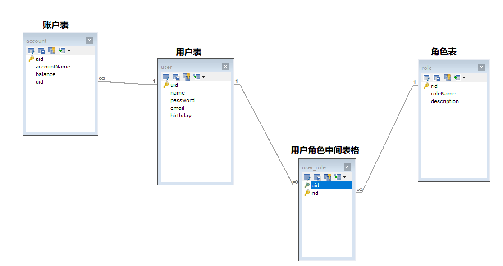

#       day35_Mybatis高级[使用讲义中的表]

### 总结

```java
1. 能够使用动态sql完成sql拼接[必须掌握]
    <where和if> 用于拼接查询条件的
    <set和if> 用于拼接修改字段的
    <foreach> 用于拼接数组|集合的情况
    <sql&include> 用于抽取和引用重复sql片段
2. 能够使用resultMap完成多表查询 [必须掌握]
5. 能够完成多表连接查询[必须掌握]
    <resultMap id="" type="">
    	//外层模型映射字段
    	<id property="" column=""/>
    	<result property="" column=""/>
    	//内存模型
    	//一对一的映射
    	<association property="一对一中内层模型的变量名" javaType="内层模型的类型">
    		//内层模型的映射字段
    		<id property="" column=""/>
    		<result property="" column=""/>
    	</association>
    	//一对多的映射
    	<collection property="一对多中内层模型的集合名" ofType="集合的泛型">
        	//内层模型的映射字段
    		<id property="" column=""/>
    		<result property="" column=""/>
    	</collection>
    </resultMap>
    
3. 能够使用一对一嵌套查询[理解]
    <association property="一对一中内层模型的变量名" javaType="内层模型的类型"
    	column="用于执行嵌套查询的所需参数的列名" select="执行嵌套查询的包名.接口名.方法名">
4. 能够使用一对多嵌套查询[理解]
    <collection property="一对多中内层模型的集合名" ofType="集合的泛型"
    	column="用于执行嵌套查询的所需参数的列名" select="执行嵌套查询的包名.接口名.方法名">

6. 了解加载策略的作用和配置[了解]
    加载策略定义: 嵌套查询时,内层模型何时去加载
    加载策略分类: eager|lazy    
7. 了解缓存的作用和配置[了解]
    缓存:是内存中一块区域
    Mybatis有一级缓存(SqlSession缓存)和二级缓存(Mapper缓存)    
```


### 第一章 回顾Mybatis基本使用

- ##### 目标:增删改查实现一种

##### 1.1 环境搭建

```java
a.创建项目(包)
b.导入jar包(log4j配置文件)
c.创建数据库和表等数据
d.添加Mybatis工具类    
```

##### 1.2 实现步骤

```java
a.创建实体类
    public class User {
        private Integer uid;
        private String name;
        private String password;
        private String email;
        private Date birthday;
    }
b.创建Mapper接口
    public interface UserDao {
        //查询所有用户
        List<User> findAllUsers();
    }

c.创建Mapper文件
    <mapper namespace="com.itheima.dao.UserDao">
        <select id="findAllUsers" resultType="com.itheima.pojo.User">
            select * from user
        </select>
    </mapper>
d.创建核心配置文件
    <!--引入Mapper文件-->
    <mappers>
        <mapper resource="com/itheima/dao/UserMapper.xml"/>
    </mappers>
e.测试代码
    public class TestUserDemo extends BaseTest{
        @Test
        public void testFindAllUsers(){
            UserDao userDao = sqlSession.getMapper(UserDao.class);
            List<User> users = userDao.findAllUsers();
            for (User user : users) {
                System.out.println(user);
            }
        }
    }
```

### ==第二章 动态SQL==

##### 1 动态SQL的介绍

```java
什么是动态SQL:
	SQL语句不是固定写死的,而且根据参数条件动态拼接而成
动态SQL的分类:
	<where&if> 主要用于查询
    <set&if>  主要用于修改
    <foreach>  主要用于遍历集合或者数组
    <sql&include>  租用用于抽取相同的sql语句,重复利用        
```

##### 2 动态SQL之<where&if>

- ##### 目标:据多个条件查询用户信息findbyCondtion(User user)

  ```java
  a.实体类
      public class User {
          private Integer uid;
          private String name;
          private String password;
          private String email;
          private Date birthday;
          }
  b.Mapper接口
      public interface UserDao {
          //查询所有用户
          List<User> findAllUsers();
          //根据条件查询用户
          List<User> findByCondition(User user);
      }
  
  c.Mapper文件
     <!--
      动态SQL之<where>
          a.<where>就是一个where关键字
          b.如果where后第一个语句有and|or开头,会自动去掉and|or
          c.如果所有的条件都不成立,不会添加where关键字
      -->
      <select id="findByCondition" parameterType="com.itheima.pojo.User" 
      								resultType="com.itheima.pojo.User">
          select * from user
          <where>
              <if test=" name != null">
                  and name = #{name}
              </if>
              <if test=" password != null">
                  and password = #{password}
              </if>
              <if test="email != null">
                  and email = #{email}
              </if>
              <if test="birthday != null">
                  and birthday = #{birthday}
              </if>
          </where>
      </select>
  d.测试
      @Test
      public void testFindByCondition(){
          UserDao userDao = sqlSession.getMapper(UserDao.class);
          User user = new User();
  //        user.setName("传智播客 1");
  //        user.setPassword("admin1");
          List<User> users = userDao.findByCondition(user);
          for (User user1 : users) {
              System.out.println(user1);
          }
      }             
  ```

##### 3 动态SQL之<set&if>

- ##### 目标:根据用户uid值,修改用户的信息(只修改不是null的信息)

  ```java
  a.实体类(User.java)
  b.Mapper接口
      public interface UserDao {
          //查询所有用户
          List<User> findAllUsers();
          //根据条件查询用户
          List<User> findByCondition(User user);
          //根据用户的uid修改用户的信息
          void updateUser(User user);
      }
  
  c.Mapper文件
          <!--
          动态SQL之<set>
              a.<set>就是一个set关键字
              b.如果set后最后一个语句有,结尾,会自动去掉,
              c.必须至少有一个修改字段条件是成立,否则会报错
          -->
          <update id="updateUser" parameterType="com.itheima.pojo.User">
              update user
              <set>
                  <if test="name != null">
                      name = #{name} ,
                  </if>
                  <if test="password != null">
                      password = #{password} ,
                  </if>
                  <if test="email != null">
                      email= #{email} ,
                  </if>
                  <if test="birthday != null">
                      birthday = #{birthday} ,
                  </if>
              </set>
              where uid = #{uid}
          </update>
      
  d.测试
      @Test
      public void testUpdateUser(){
          UserDao userDao = sqlSession.getMapper(UserDao.class);
          User user = new User();
          user.setUid(3);
          user.setPassword("123");
          user.setName("disco");
          userDao.updateUser(user);
      }        
  ```


##### 4 动态SQL之foreach

- ##### 目标:查询参数为uid数组,比如:需要查询uid为1,2,4,6,7的数据

  ```java
  a.实体类(User.java)
  b.Mapper接口
      public interface UserDao {
          //查询所有用户
          List<User> findAllUsers();
          //根据条件查询用户
          List<User> findByCondition(User user);
  
          //根据用户的uid修改用户的信息
          void updateUser(User user);
          //根据用户的多个uid查询用户的信息
          List<User> findUsersByUids01(Integer[] uids);
      }
  
  c.Mapper文件
     <!--
          动态sql之foreach
          用途: 用于遍历数组
          collection="array" array表示遍历数组
          item="变量名" 遍历出现的某个元素的名字
          open="(" 以左括号开头
          close=")" 以右括号结尾
          separator="," 每个元素之前的分割符
          在标签体中必须使用#{变量名}
      -->
      <select id="findUsersByUids01" resultType="com.itheima.pojo.User">
          select * from user where uid in
          <foreach collection="array" item="uid" open="(" close=")" separator=",">
              #{uid}
          </foreach>
      </select>
  d.测试
      @Test
      public void testFindUsersByUids01(){
          UserDao userDao = sqlSession.getMapper(UserDao.class);
          Integer[] uids = {1,3,5};
          List<User> users = userDao.findUsersByUids01(uids);
          for (User user : users) {
              System.out.println(user);
          }
      }        
  ```

- ##### 目标:查询参数为集合,需要查询uid为1,2,4,6,7的数据

  ```java
  a.实体类(User.java)
  b.Mapper接口
      public interface UserDao {
          //查询所有用户
          List<User> findAllUsers();
          //根据条件查询用户
          List<User> findByCondition(User user);
          //根据用户的uid修改用户的信息
          void updateUser(User user);
          //根据用户的多个uid查询用户的信息
          List<User> findUsersByUids01(Integer[] uids);
          //根据用户的多个uid查询用户的信息
          List<User> findUsersByUids02(List<Integer> uids);
      }
  c.Mapper文件
      <!--
          动态sql之foreach
          用途: 用于遍历集合
          collection="collection" collection 表示单列集合
          item="变量名" 遍历出现的某个元素的名字
          open="(" 以左括号开头
          close=")" 以右括号结尾
          separator="," 每个元素之前的分割符
          在标签体中必须使用#{变量名}
      -->
      <select id="findUsersByUids02" resultType="com.itheima.pojo.User">
          select * from user where uid in
          <foreach collection="collection" item="id" open="(" close=")" separator=",">
              #{id}
          </foreach>
      </select>
  d.测试
      @Test
      public void testFindUsersByUids02() {
          UserDao userDao = sqlSession.getMapper(UserDao.class);
          ArrayList<Integer> uids = new ArrayList<>();
          uids.add(1);
          uids.add(2);
          uids.add(6);
          List<User> users = userDao.findUsersByUids02(uids);
          for (User user : users) {
              System.out.println(user);
          }
      }        
  ```

- ##### 小结:foreach的作用和属性含义

  ```java
  <foreach collection="array|collection" item="变量名" open="开始符号" close="结束符号" separator="元素之间的分割符号">
      #{变量名}
  </foreach    
  ```

- ##### 目标:查询参数数组封装到对象中,需要查询uid为3,14,16,24的数据

  ```java
  a.实体类(User.java)
  b.Mapper接口
      public interface UserDao {
          //根据用户的多个uid查询用户的信息
          List<User> findUsersByUids03(VO vo);
      }
      /**
       * 主要用于封装一个数组或者集合
       */
      public class VO {
          private ArrayList<Integer> uids;
      }
  c.Mapper文件
      <select id="findUsersByUids03" parameterType="com.itheima.pojo.VO" 
      		resultType="com.itheima.pojo.User">
          select * from user where uid in
          <foreach collection="uids" item="id" open="(" close=")" separator=",">
              #{id}
          </foreach>
      </select>
  
  d.测试
      @Test
      public void testFindUsersByUids03() {
          UserDao userDao = sqlSession.getMapper(UserDao.class);
          ArrayList<Integer> uids = new ArrayList<>();
          uids.add(1);
          uids.add(2);
          uids.add(6);
          //把集合或者数组,封装到对象中
          VO vo = new VO(uids);
          List<User> users = userDao.findUsersByUids03(vo);
          for (User user : users) {
              System.out.println(user);
          }
      }          
  ```

##### 5 动态SQL之<sql&include>

- ##### 目标:抽取SQL语句中通用的部分,需要查询uid为1,2,4,6,7的数据

- ##### 标签介绍

  ```java
  抽取SQL的标签<sql>
  引入SQL的标签<include>    
  ```
  
- ##### 实现步骤

  ```java
  a.实体类(User.java)
  b.Mapper接口
      public interface UserDao {
          //查询所有用户
          List<User> findAllUsers();
          //根据条件查询用户
          List<User> findByCondition(User user);
  
          //根据用户的uid修改用户的信息
          void updateUser(User user);
          //根据用户的多个uid查询用户的信息
          List<User> findUsersByUids01(Integer[] uids);
          //根据用户的多个uid查询用户的信息
          List<User> findUsersByUids02(List<Integer> uids);
          //根据用户的多个uid查询用户的信息
          List<User> findUsersByUids03(VO vo);
  
      }
  c.Mapper文件
      <?xml version="1.0" encoding="UTF-8" ?>
      <!DOCTYPE mapper
        PUBLIC "-//mybatis.org//DTD Mapper 3.0//EN"
        "http://mybatis.org/dtd/mybatis-3-mapper.dtd">
      <!--namespace 可以认为是该XML文件的唯一标识-->
      <mapper namespace="com.itheima.dao.UserDao">
          <!--<sql> 标签,用于抽取相同的sql-->
          <sql id="sql01">
              select * from user
          </sql>
  
          <!--使用<include>标签,引用sql标签-->
          <select id="findAllUsers" resultType="com.itheima.pojo.User">
              <include refid="sql01"/>
          </select>
  
          <!--
          动态SQL之<where>
              a.<where>就是一个where关键字
              b.如果where后第一个语句有and|or开头,会自动去掉and|or
              c.如果所有的条件都不成立,不会添加where关键字
          -->
          <select id="findByCondition" parameterType="com.itheima.pojo.User" resultType="com.itheima.pojo.User">
              <include refid="sql01"/>
              <where>
                  <if test=" name != null">
                      and name = #{name}
                  </if>
                  <if test=" password != null">
                      and password = #{password}
                  </if>
                  <if test="email != null">
                      and email = #{email}
                  </if>
                  <if test="birthday != null">
                      and birthday = #{birthday}
                  </if>
              </where>
          </select>
  
  
          <!--
          动态SQL之<set>
              a.<set>就是一个set关键字
              b.如果set后最后一个语句有,结尾,会自动去掉,
              c.必须至少有一个修改字段条件是成立,否则会报错
          -->
          <update id="updateUser" parameterType="com.itheima.pojo.User">
              update user
              <set>
                  <if test="name != null">
                      name = #{name} ,
                  </if>
                  <if test="password != null">
                      password = #{password} ,
                  </if>
                  <if test="email != null">
                      email= #{email} ,
                  </if>
                  <if test="birthday != null">
                      birthday = #{birthday} ,
                  </if>
              </set>
  
              where uid = #{uid}
          </update>
  
  
          <!--
              动态sql之foreach
              用途: 用于遍历数组
              collection="array" array表示遍历数组
              item="变量名" 遍历出现的某个元素的名字
              open="(" 以左括号开头
              close=")" 以右括号结尾
              separator="," 每个元素之前的分割符
              在标签体中必须使用#{变量名}
          -->
          <select id="findUsersByUids01" resultType="com.itheima.pojo.User">
              <include refid="sql01"/> where uid in
              <foreach collection="array" item="uid" open="(" close=")" separator=",">
                  #{uid}
              </foreach>
          </select>
  
          <!--
          动态sql之foreach
          用途: 用于遍历集合
          collection="collection" collection 表示单列集合
          item="变量名" 遍历出现的某个元素的名字
          open="(" 以左括号开头
          close=")" 以右括号结尾
          separator="," 每个元素之前的分割符
          在标签体中必须使用#{变量名}
      -->
          <select id="findUsersByUids02" resultType="com.itheima.pojo.User">
              <include refid="sql01"/> where uid in
              <foreach collection="collection" item="id" open="(" close=")" separator=",">
                  #{id}
              </foreach>
          </select>
  
  
          <select id="findUsersByUids03" parameterType="com.itheima.pojo.VO" resultType="com.itheima.pojo.User">
              <include refid="sql01"/> where uid in
              <foreach collection="uids" item="id" open="(" close=")" separator=",">
                  #{id}
              </foreach>
          </select>
      </mapper>
       
  d.测试
     没有变化,正常执行即可             
  ```

### ==第三章 多表查询==

##### 1.多表查询数据准备

- 创建数据库和表(见讲义多表查询数据库)
- 导入jar包和log4j文件
- 创建实体类(见讲义多表查询实体类)

##### 2.表关系分析和Java类的设计

- 表关系分析

  

- Java类的设计

  ```java
  比如:
  	用户表和账户表(一个用户多个账户,一个账户只属于一个用户)
  类的设计:
  	public class User{
          用户的属性;
          List<Account> accountList;
      }
  	public class Account{
          账户的属性;
      	User user;
      }
  
  比如:
  	用户表和角色表(一个用户可以扮演多个角色,一个角色被多个用户扮演)
          
  类的设计:
  	public class User{
          用户的属性;
          List<Role> roleList;
      }
  	public class Role{
          角色的属性;
          List<User> userList;
      }
  ```

##### 3.账户到用户的一对一关系

- ##### 目标: 查询出所有账户信息的时候，同时查询该账户所属的用户信息查询

  ```java
  思考:SQL语句怎么写?
      SELECT * FROM account a,USER u WHERE u.uid = a.uid 
  ```


- ##### 实体类

  ```java
  public class Account {
      private Integer aid;
      private String accountName;
      private Float balance;
      
      //添加一个这个账户所属的用户
      private User user;
  }
  ```

- ##### Mapper接口

  ```java
  public interface AccountDao {
      /**
       * 查询所有的账户,通过把该账户所属的用户也查询出来
       */
      List<Account> findAllAccountsWithUser();
  }
  
  ```

- ##### Mapper文件

  ```java
  <resultMap id="AccountMap" type="com.itheima.pojo.Account">
      <id property="aid" column="aid"/>
      <result property="accountName" column="accountName"/>
      <result property="balance" column="balance"/>
  
      <!--一对一的映射标签-->
      <association property="user" javaType="com.itheima.pojo.User">
          <id property="uid" column="uid"/>
          <result property="name" column="name"/>
          <result property="password" column="password"/>
          <result property="email" column="email"/>
          <result property="birthday" column="birthday"/>
      </association>
  </resultMap>
  
  <select id="findAllAccountsWithUser" resultMap="AccountMap">
      SELECT * FROM account a,USER u WHERE u.uid = a.uid
  </select>
  ```

- ##### 测试类

  ```java
  @Test
  public void testFindAllAccountsWithUser(){
      AccountDao accountDao = sqlSession.getMapper(AccountDao.class);
      List<Account> accounts = accountDao.findAllAccountsWithUser();
      for (Account account : accounts) {
          System.out.println(account);
      }
  }
  ```

- ##### 小结

  ```java
  1.如何在代码中体现账户到用户关系??
      在账户的实现类中定义一个用户类型成员变量	
  2.一对一实体关系的标签<association>属性有哪些?
      <association property="哪个属性的一对一" javaType="这个属性的类型">
      	<id property="主键属性名" column="主键字段名"/>
      	<result property="普通属性名" column="普通字段名"/>
      </association>	
  ```

##### 4.用户到账户的一对多关系

- ##### 目标:查询所有用户信息，同时查询该用户下的账户信息

  ```sql
  思考:SQL语句怎么写?
  	SELECT * FROM USER u ,account a WHERE u.uid = a.uid 
  ```

- ##### 实体类

  ```java
  public class User {
      private Integer uid;
      private String name;
      private String password;
      private String email;
      private Date birthday;
      /*在用户中有多个账户,使用集合成员表示*/
      private List<Account> accountList;
  }
  ```

- ##### Mapper接口

  ```java
  public interface UserDao {
  
      /**
       * 查询所有用户,并且把该用户所有的账户查询出来
       */
      List<User> findAllUsersWithAccounts();
  }
  
  ```

- ##### Mapper文件

  ```xml
  <resultMap id="UserMap" type="com.itheima.pojo.User">
      <id property="uid" column="uid"/>
      <result property="name" column="name"/>
      <result property="password" column="password"/>
      <result property="email" column="email"/>
      <result property="birthday" column="birthday"/>
      <!--一对多的映射标签collection-->
      <collection property="accountList" ofType="com.itheima.pojo.Account">
          <id property="aid" column="aid"/>
          <result property="accountName" column="accountName"/>
          <result property="balance" column="balance"/>
      </collection>
  </resultMap>
  
  <select id="findAllUsersWithAccounts" resultMap="UserMap">
  	SELECT * FROM USER u ,account a WHERE u.uid = a.uid
  </select>
  ```

- ##### 测试类

  ```java
  @Test
  public void testFindAllUsersWithAccounts(){
      UserDao userDao = sqlSession.getMapper(UserDao.class);
      List<User> users = userDao.findAllUsersWithAccounts();
      for (User user : users) {
          System.out.println(user);
      }
  }
  ```

- ##### 小结

  ```java
  a.我们要查询所有用户,并查询该用户下的账户,那么没有账户的用户保证也能查询出来??
      	我们使用内连接,只能查询该用户下有账户的那些用户
      	我们使用外连接,才能查询到所有用户的信息
      	SELECT * FROM USER u LEFT  OUTER  JOIN account a on u.uid = a.uid
  b.在一对多的关系中, 如何在一的一方实体类中保存多的一方??
      	在一的一方添加一个集合保存多个多的一方
  c.一对多关系的标签<collection>属性有哪些?
      <collection property="多的一方的集合名字" ofType="集合的泛型">
      	<id property="主键的属性" column="主键的字段"/>
      	<result property="普通的属性" column="普通的字段"/>
      </collection
  ```

##### 5. 用户到角色的一对多关系

- ##### 目标:查询所有用户, 并且查出用户的角色信息

  ```java
  思考:SQL语句怎么写?
      SELECT * FROM USER u,role r,user_role ur WHERE ur.uid=u.uid AND ur.rid = r.rid
  	或者
      SELECT * FROM 
  		USER u LEFT OUTER JOIN user_role ur ON u.uid = ur.uid
  			LEFT OUTER JOIN role r ON ur.rid = r.rid
  ```

- ##### 实体类

  ```java
  public class User {
      private Integer uid;
      private String name;
      private String password;
      private String email;
      private Date birthday;
      /*在用户中有多个角色,使用集合成员表示*/
      private List<Role> roleList;
  }
  ```

- ##### Mapper接口

  ```java
  public interface UserDao {
  	/**
       * 查询所有用户,并且把该用户所有的橘色信息查询出来
       */
      List<User> findAllUsersWithRoles();
  }
  ```

- ##### Mapper文件

  ```xml
  <resultMap id="UserMap1" type="com.itheima.pojo.User">
      <id property="uid" column="uid"/>
      <result property="name" column="name"/>
      <result property="password" column="password"/>
      <result property="email" column="email"/>
      <result property="birthday" column="birthday"/>
      <!--一对多的映射标签<collection>-->
      <collection property="roleList" ofType="com.itheima.pojo.Role">
          <id property="rid" column="rid"/>
          <result property="roleName" column="roleName"/>
          <result property="description" column="description"/>
      </collection>
  </resultMap>
  
  <select id="findAllUsersWithRoles" resultMap="UserMap1">
  	SELECT * FROM USER u,role r,user_role ur WHERE ur.uid=u.uid AND ur.rid = r.rid
  </select>
  ```

- ##### 测试类

  ```java
  @Test
  public void testFindAllUsersWithRoles(){
      UserDao userDao = sqlSession.getMapper(UserDao.class);
      List<User> users = userDao.findAllUsersWithRoles();
      for (User user : users) {
          System.out.println(user);
      }
  }
  ```

### 第五章 嵌套查询【理解】

##### 5.1 什么是嵌套查询

```java
嵌套查询也叫分步查询,把一个复杂的查询,分成几部分执行,然后整合到一起
```

##### 5.2 一对一配置嵌套查询

- ##### 目标1:根据aid查询某个账户信息

- ##### 目标2:根据账户的uid查询该账户所属的用户信息

- ##### SQL语句

  ```sql
  a.根据aid查询某个账户信息
  	select * from account where aid = 某个值
  b.根据账户中的uid查询用户信息的SQL
  	select * from user where uid = 刚刚查询出来的uid
  ```

- ##### 实现步骤(目标1和目标2)

  ```xml
  a.实体类(Account.java,User.java)
  b.Mapper接口
      public interface AccountDao {
          /**
           * 根据账户的aid查询这个账户的信息
           */
          Account findAccountByAid(Integer aid);
      }
      public interface UserDao {
          /**
           * 根据uid查询用户信息
           */
          User findUserByUid(Integer uid);
      }
  c.Mapper文件
     <resultMap id="AccountMap1" type="com.itheima.pojo.Account">
          <id property="aid" column="aid"/>
          <result property="accountName" column="accountName"/>
          <result property="balance" column="balance"/>
          <!--一对一映射查询-->
          <association property="user" javaType="com.itheima.pojo.User" column="uid"
                       select="com.itheima.dao.UserDao.findUserByUid"/>
      </resultMap>
  
      <select id="findAccountByAid" parameterType="java.lang.Integer" 
              					resultMap="AccountMap1">
          select * from account where aid = #{aid}
      </select>
  	<select id="findUserByUid" parameterType="java.lang.Integer" 
              			resultType="com.itheima.pojo.User">
          select * from user where uid = #{uid}
      </select>
     
  d.测试 
  	@Test
      public void testFindAccountByAid(){
          AccountDao accountDao = sqlSession.getMapper(AccountDao.class);
          Account account = accountDao.findAccountByAid(1);
          System.out.println(account);
      }
  ```

- ##### 小结:一对一配置标签<associattion>

  ```java
  <association property="一对一中的成员变量名" javaType="成员变量的类型" 
      column="用来嵌套查询的那个字段" select="dao接口的全限定类名.方法名"></association>    
  ```

##### 5.3 一对多查询

- ##### 目标1:根据uid查询某个用户信息

- ##### 目标2:根据用户的uid查询该用户的所有账户信息

- ##### SQL语句

  ```java
  a.根据uid查询某个用户信息
      select * from user where uid = 某个值
  b.根据用户的id查询该用户的所有账户信息的SQL    
      select * from account where uid = 某个值
  ```

- ##### 实现步骤(目标1和目标2)

  ```java
  a.实体类(User.java,Account.java)
  b.Mapper接口
      package com.itheima.dao;
      import com.itheima.pojo.User;
      import java.util.List;
  
      public interface UserDao {
          /**
           * 根据uid查询用户信息
           */
          User findUserByUid(Integer uid);
      }
  	package com.itheima.dao;
      import com.itheima.pojo.Account;
      import java.util.List;
      public interface AccountDao {
          List<Account> findAccountsByUid(Integer uid);
      }
  
  c.Mapper文件
    <resultMap id="UserMap2" type="com.itheima.pojo.User">
          <id property="uid" column="uid"/>
          <result property="name" column="name"/>
          <result property="password" column="password"/>
          <result property="email" column="email"/>
          <result property="birthday" column="birthday"/>
          <!--用户对账户一对多-->
          <collection property="accountList" ofType="com.itheima.pojo.Account"
                      column="uid" 
      				select="com.itheima.dao.AccountDao.findAccountsByUid"/>
      </resultMap>
  
      <select id="findUserByUid" parameterType="java.lang.Integer" resultMap="UserMap2">
          select * from user where uid = #{uid}
      </select>
          
     <select id="findAccountsByUid" parameterType="java.lang.Integer" 
          					resultType="com.itheima.pojo.Account">
          select * from account where uid = #{uid}
      </select>    
  d.测试
      @Test
      public void testFindUserByUid(){
          UserDao userDao = sqlSession.getMapper(UserDao.class);
          User user = userDao.findUserByUid(1);
          System.out.println(user);
      }    
  ```

- ##### 修改Mapper文件,配置一对多的嵌套查询

  ```java
  <collection property="一对多的集合成员名" ofType="集合的泛型" column="用于嵌套查询的列名"
      select="用于执行嵌套查询的接口全限定接口名.方法名">
  ```

##### 5.4 一对多配置嵌套查询

- ##### 目标1:根据uid查询某个用户信息

- ##### 目标2:根据用户的uid查询该用户的所有角色信息

- ##### SQL语句

  ```java
  a.根据uid查询某个用户信息
      select * from user where uid = 某个值
  b.根据用户的uid查询该用户的所有角色信息的SQL 
      SELECT * FROM user_role ur,role r WHERE ur.rid = r.rid AND ur.uid = 某个值
  ```

- ##### 实现步骤(目标1和目标2)

  ```java
  a.实体类(User.java.Role.java)
  b.Mapper接口
      package com.itheima.dao;
      import com.itheima.pojo.User;
      import java.util.List;
      public interface UserDao {
          /**
           * 根据uid查询用户信息
           */
          User findUserByUid01(Integer uid);
      }
      package com.itheima.dao;
      import com.itheima.pojo.Role;
      import java.util.List;
      public interface RoleDao {
  
          /**
           * 根据用户uid查询该用户的所有角色
           */
          List<Role> findRolesByUid(Integer uid);
      }
  
  c.Mapper文件
     <resultMap id="UserMap3" type="com.itheima.pojo.User">
          <id property="uid" column="uid"/>
          <result property="name" column="name"/>
          <result property="password" column="password"/>
          <result property="email" column="email"/>
          <result property="birthday" column="birthday"/>
          <!--用户到角色的一对多嵌套-->
          <collection property="roleList" ofType="com.itheima.pojo.Role"
                      column="uid" select="com.itheima.dao.RoleDao.findRolesByUid"/>
      </resultMap>
  
      <select id="findUserByUid01" parameterType="java.lang.Integer" 
      							resultMap="UserMap3">
          select * from user where uid = #{uid}
      </select>
          
      <mapper namespace="com.itheima.dao.RoleDao">
      <select id="findRolesByUid" parameterType="java.lang.Integer" 
          						resultType="com.itheima.pojo.Role">
              SELECT * FROM user_role ur,role r WHERE ur.rid = r.rid AND ur.uid = #{uid}
      </select>
  </mapper>    
  d.测试
      @Test
      public void testFindUserByUid01(){
          UserDao userDao = sqlSession.getMapper(UserDao.class);
          User user = userDao.findUserByUid01(3);
          System.out.println(user);
      }     
  ```

- ##### 小结:一对多配置标签<collection>

  ```java
  <collection property="一对多的集合变量名" ofType="集合的泛型" column="用于查询的列名"
      select="用于嵌套查询的接口全限定接口名.方法名"> </collection>    
  ```
### 第六章 加载策略【了解】

##### 1.什么是加载策略

```java
加载策略是给嵌套查询时使用的,
	在一对一或者在一对多的嵌套查询中
    当我们查询出外层模型后,是否立刻去查询内层模型可以分为两种加载策略:
	立即加载(默认的): 当查询出外层模型后,立刻嵌套查询内层模型
    延迟加载(懒加载): 当查询出外层模型后.不立刻嵌套查询内层模型,当我们使用到内存模型时再去嵌套查询    
```

##### 2.如何实现懒加载

- 添加关联标签的fetchType【单个配置】

  ```java
  <association fetchType="eager|lazy"/>
  <collection fetchType="eager|lazy"/>    
  ```

- 修改全局的加载策略【全局配置】

  ```java
  在SqlMapConfig.xml(Mybatis的核心配置文件中)
  <!--开启全局的嵌套查询懒加载模式-->
  <settings>
      <setting name="lazyLoadingEnabled" value="true"/>
  </settings>
  注意:fetchType【单个配置】会覆盖【全局配置】
  ```

- 懒加载的触发

  ```java
  除了我们手动获取内存模型时会触发懒加载之外,当我们调用外层模型这些方法时,也会触发懒加载:
  	toString,equals,hashCode,clone
  ```

- 注意

  ```java
  我们可以手动修改外层模型触发懒加载的方法
  <!--手动修改触发懒加载的方法-->
  <settings>
  	<setting name="lazyLoadTriggerMethods" 
      			value="equals,clone,hashCode,toString,getUid"/>
  </settings>
  ```

### 第七章 缓存机制【了解】

##### 1.Mybatis缓存的介绍

- ##### 什么是缓存？

  ```java
  缓冲其实就是内存中一块区域!
  ```

- ##### 什么时候需要缓存?

  ```java
  长度固定不变的,且访问量很大的数据,我们适合保存到缓存中!
  ```

- ##### 缓存有什么作用？

  ```java
  当数据保存到缓存后,查询速度比保存到数据库中要快的多!
  ```

- ##### Mybatis的缓存

  

##### 2.Mybatis缓存分类

- ##### 一级缓存[默认开启]
  - 什么是一级缓存
  
    ```java
  一级缓存:就是SqlSession的缓存,只要我们使用同一个SqlSession执行同样查询,第二次以后直接从缓存中获取
    ```
  
  - 一级缓存演示
  
    ```java
    /**
     * 测试一级缓存
     */
    @Test
    public void testFirstCache() throws InterruptedException {
        SqlSession sqlSession = MybatisUtils.openSqlSession();
        AccountDao accountDao1 = sqlSession.getMapper(AccountDao.class);
        List<Account> accounts1 = accountDao1.findAccountsByUid(1);
        System.out.println(accounts1.size());
        Thread.sleep(5000);
        AccountDao accountDao2 = sqlSession.getMapper(AccountDao.class);
        List<Account> accounts2 = accountDao2.findAccountsByUid(1);
        System.out.println(accounts2.size());
    
        sqlSession.commit();
        sqlSession.close();
    }
    ```
  
  - 清空一级缓存
  
    ```java
    a.手动清空
        sqlSession.clearCache();
    b.自动清空
        当我们对缓存中数据所在的表做添加,修改,删除操作时,自动清空缓存
    ```
  
- ##### 二级缓存[默认不开启]

  - 如何开启二级缓存
  
    ```java
    第一步:在Mybatis的核心配置文件中
    <settings>    
    	<!--全局开启二级缓存,默认是开启的-->
    	<setting name="cacheEnabled" value="true"/> 
    </settings> 
        
    第二步:在需要开启二级缓存的Mapper.xml文件中
    <mapper namespace="com.itheima.dao.AccountDao">
        <!--开启当前Mapper的二级缓存-->
        <cache/>
    </mapper>    
        
    第三步:在需要使用二级缓存的select标签中添加属性useCache="true",默认也是true
        <select id="findAccountsByUid" parameterType="java.lang.Integer" resultType="com.itheima.pojo.Account" useCache="true">
            select * from account where uid = #{uid}
        </select> 
            
    第四步:
    	需要使用二级缓存的那些类必须实现java.io.Serializable
    ```
  
  - 二级缓存的演示
  
    ```java
    /**
      * 测试二级缓存
      */
    @Test
    public void testSecondCache() throws InterruptedException, IOException {
        InputStream in = Resources.getResourceAsStream("SqlMapConfig.xml");
        SqlSessionFactory sqlSessionFactory = new SqlSessionFactoryBuilder().build(in);
    
    
        SqlSession sqlSession1 = sqlSessionFactory.openSession();
        AccountDao accountDao1 = sqlSession1.getMapper(AccountDao.class);
        List<Account> accounts1 = accountDao1.findAccountsByUid(1);
        System.out.println(System.currentTimeMillis()+"..."+accounts1.size());
        sqlSession1.commit();
        sqlSession1.close();
    
        Thread.sleep(5000);
        SqlSession sqlSession2 = sqlSessionFactory.openSession();
        AccountDao accountDao2 = sqlSession2.getMapper(AccountDao.class);
        List<Account> accounts2 = accountDao2.findAccountsByUid(1);
        System.out.println(System.currentTimeMillis()+"..."+accounts2.size());
        sqlSession2.commit();
        sqlSession2.close();
    
        System.out.println(accounts1 == accounts2);
    
    }
    ```
  
    


