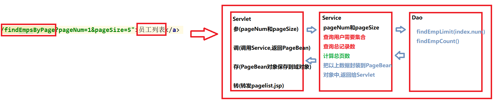

# day36_Mybatis&综合练习

### 总结

```java
1. 了解Mybatis配置文件中的各个配置项
    <properties> 引入其他properties配置文件,引入之后使用Mybatis的EL表达式${键名}
	<typeAliases> 给实体类(pojo)起别名
    <environments> 配置数据库参数(事务,数据源<DataSource>)
    <mappers> 配置mapper文件或者Dao接口的文字或者扫描dao包    
2. 能够使用注解完成单表操作
     @Insert @Delete @Update @Select   
3. 了解使用注解完成多表操作
     一对一: one=@One(select="包名.接口名.方法名",fetchType=FetchType.EAGER|LAZY|DEFAULT) 
	 一对多: many=@Many(select="包名.接口名.方法名",fetchType=FetchType.EAGER|LAZY|DEFAULT)
4. 完成案例列表查询[重点]
5. 完成案例分页查询[重点]
```


### 回顾

```java
1.动态SQL[重点]
    <where&if>
        <where>有三个作用:
		a.<where>标签就是一个where关键字
        b.<where>标签会把第一个判断条件前面的and|or删除
        c.如果所有条件都不成立,那么<where>就不会变成where关键字
    <set&if>
        <set>有三个作用:
		a.<set>标签就是一个set关键字
        b.<set>标签把最后一个赋值语句的,删除
        c.如果没有一个赋值语句成立,会报错!
    <foreach>
        a.作用:变量数组或者集合
        <foreach collection="array|collection" item="从集合中取出的元素的名字"
            open="(" close=")" separator=",">
            #{从集合中取出的元素的名字}
        </foreach>    
    <sql&include>
        a.sql:抽取相同的sql片段
            <sql id="sql01">
            	通用的sql片段
            </sql>
        b.include:引用sql片段
            <include refid="sql01"/>
            
2.多表查询[重点]
     一对一:
		<association property="一对一中成员变量名" javaType="成员变量类型">
            <!--映射一对一的那些字段-->
            <id property="" column="">
            <result property="" column="">
        </association>  
     一对多:
		<collection property="一对多中集合成员变量名" ofType="集合中泛型">
            <!--映射一对多的那些字段-->
            <id property="" column="">
            <result property="" column="">
        </collection>    
3.嵌套查询[理解]
      一对一嵌套:
		<association property="一对一中成员变量名" javaType="成员变量类型" column="用于进行嵌套查询的字段" select="用于执行嵌套查询的包名.接口名.方法名">
      一对多嵌套:
		<collection property="一对多中集合成员变量名" ofType="集合中泛型" column="用于进行嵌套查询的字段" select="用于执行嵌套查询的包名.接口名.方法名">	
4.嵌套查询的加载策略[了解]
      FetchType:加载策略
          eager(默认,立即加载)|lazy延迟加载(懒加载)
5.Mybatis的缓存机制[了解] 
      一级缓存: SqlSession级别的缓存[默认开启]
	  二级缓存:	Mapper级别的缓存[手动开启]
```

### 第一章 配置文件

##### 1.SqlMapConfig.xml 配置(按照顺义)

- ==properties（属性）==

  ```xml
  用于引入外部一些配置文件:
  
  db.properties
  jdbc.driver=com.mysql.jdbc.Driver
  jdbc.url=jdbc:mysql://127.0.0.1:3306/hm144
  jdbc.username=root
  jdbc.password=1234    
  
  <!--properties标签,引入外部的配置文件-->
  <properties resource="db.properties"></properties>
   
  <!--使用properties引入外部配置文件后,使用${键}获取配置文件中值-->    
  <dataSource type="POOLED">
      <!--数据库的四大要素-->
      <property name="driver" value="${jdbc.driver}"/>
      <property name="url" value="${jdbc.url}"/>
      <property name="username" value="${jdbc.username}"/>
      <property name="password" value="${jdbc.password}"/>
  </dataSource>    
  ```

- settings（全局配置参数）

  ```java
  <settings>
      <!--开启全局的嵌套查询懒加载模式-->
      <setting name="lazyLoadingEnabled" value="true"/>
      <!--手动修改触发懒加载的方法-->
      <setting name="lazyLoadTriggerMethods" 
      value="equals,clone,hashCode,toString,getUid"/>
      <!--全局开启二级缓存,默认是开启的-->
      <setting name="cacheEnabled" value="true"/>
  </settings>
  ```

- ==typeAliases（类型别名）==

  ```java
  a.Mybatis默认的一些别名:
  	基本类型 --别名-->_基本类型, byte--别名-->_byte
      包装类型 --别名-->纯小写, Integer --别名-->integer
      字符集以及集合--别名-->纯小写, String--别名-->string
  b.使用typeAliases标签手动给自定义类型起名别
      <!--给自定义类型起别名-->
      <typeAliases>
          <!--给单个类型起别名-->
          <typeAlias type="com.itheima.pojo.Account" alias="account"/>
          <!--【常用】,扫描包批量起名别,默认别名是类型首字母小写-->
          <package name="com.itheima.pojo"/>
      </typeAliases>     
  ```

- typeHandlers（类型处理器）[了解,有兴趣可以参考官网介绍]

- objectFactory（对象工厂）[了解,有兴趣可以参考官网介绍]

- plugins（插件）[了解,有兴趣可以参考官网介绍]

- ==environments（环境集合属性对象）==
  
  - environment（环境子属性对象）
    - transactionManager（事务管理）
  
      ```java
      <!--采用哪种事务管理机制-->
      <transactionManager type="JDBC"/>
      Mybatis默认是手动提交
          sqlSessionFactory.openSession();//默认就是手动提交,底层调用setAotuCommit(false)
      	sqlSessionFactory.openSession(true);//就是自动提交,底层调用setAotuCommit(true)
      ```
    
    - dataSource（数据源）
    
      ```java
      <!--配置连接池 POOLED UNPOOLED-->
      <dataSource type="POOLED|UNPOOLED">
          <!--type有两个值,POOLED表示使用连接池,UNPOOLED表示不使用连接池-->
          <!--数据库的四大要素-->
          <property name="driver" value="${jdbc.driver}"/>
          <property name="url" value="${jdbc.url}"/>
          <property name="username" value="${jdbc.username}"/>
          <property name="password" value="${jdbc.password}"/>
      </dataSource>
      ```
  
- ==mappers（映射器）==

  ```xml
  引入XxxMapper.xml文件
  <!--引入Mapper文件-->
  <mappers>
      <!--引入单个映射文件-->
      <mapper resource="com/itheima/dao/AccountMapper.xml"/>
      <mapper resource="com/itheima/dao/UserMapper.xml"/>
      <mapper resource="com/itheima/dao/RoleMapper.xml"/>
      <!--引入单个映射文件,使用class,要求接口名和配置文件名同包同名-->
      <mapper class="com.itheima.dao.UserDao"/>
      <!--【常用】,扫描包批量引入配置文件,使用package,要求接口名和配置文件名同包同名-->
      <package name="com.itheima.dao"/>
  </mappers>    
  ```

### 第二章 注解开发[理解]

##### 1.1 注解开发的作用

```java
可以帮助我们简化代码，省略XxxMapper.xml文件
```

##### 1.2 注解实现角色表的CRUD

- ##### 环境搭建

  ```java
  创建项目
  导入jar包
  数据库&表&数据    
  ```

- ##### 编写实体类

  ```java
  public class Role {
      private Integer rid;
      private String roleName;
      private String description;
  }
  ```

- ##### 编写Mapper接口(增删改查)

  ```java
  /**
   * 角色表增删改查,使用注解
   */
  public interface RoleDao {
  
      /**
       * 添加角色
       */
      void save(Role role);
      /**
       * 删除角色
       */
      void delete(Integer rid);
      /**
       * 修改角色
       */
      void update(Role role);
      /**
       * 条件查询
       */
      Role findRoleByRid(Integer rid);
      /**
       * 查询所有
       */
      List<Role> findAllRoles();
  
  }
  
  ```

- ##### 使用注解直接配置接口中的方法,省略Mapper配置文件

  ```java
  package com.itheima.dao;
  import com.itheima.pojo.Role;
  import org.apache.ibatis.annotations.Delete;
  import org.apache.ibatis.annotations.Insert;
  import org.apache.ibatis.annotations.Select;
  import org.apache.ibatis.annotations.Update;
  import java.util.List;
  
  /**
   * 角色表增删改查,使用注解
   */
  public interface RoleDao {
      /**
       * 添加角色
       */
      @Insert("insert into role(roleName,description) values(#{roleName},#{description})")
      void save(Role role);
      /**
       * 删除角色
       */
      @Delete("delete from role where rid = #{rid}")
      void delete(Integer rid);
      /**
       * 修改角色
       */
      @Update("update role set roleName = #{roleName},description = #{description} where rid = #{rid}")
      void update(Role role);
      /**
       * 条件查询
       */
      @Select("select * from role where rid = #{rid}")
      Role findRoleByRid(Integer rid);
      /**
       * 查询所有
       */
      @Select("select * from role")
      List<Role> findAllRoles();
  }
  ```

- ##### 测试代码

  ```java
  package com.itheima.test;
  import com.itheima.dao.RoleDao;
  import com.itheima.pojo.Role;
  import org.junit.Test;
  import java.util.List;
  
  public class TestRoleCRUD extends BaseTest {
  
      @Test
      public void testSave(){
          RoleDao roleDao = sqlSession.getMapper(RoleDao.class);
          Role role = new Role(null,"整理仓库","杂活儿");
          roleDao.save(role);
      }
  
      @Test
      public void testDelete(){
          RoleDao roleDao = sqlSession.getMapper(RoleDao.class);
          roleDao.delete(3);
      }
  
      @Test
      public void testUpdate(){
          RoleDao roleDao = sqlSession.getMapper(RoleDao.class);
          Role role = new Role(2,"存入管理","只能对商品进行存入操作");
          roleDao.update(role);
      }
  
      @Test
      public void testFindOne(){
          RoleDao roleDao = sqlSession.getMapper(RoleDao.class);
          Role role = roleDao.findRoleByRid(1);
          System.out.println(role);
      }
  
      @Test
      public void testFindAll(){
          RoleDao roleDao = sqlSession.getMapper(RoleDao.class);
          List<Role> roles = roleDao.findAllRoles();
          for (Role role : roles) {
              System.out.println(role);
          }
      }
  }
  ```

- ##### 如何使用ResultMap结果集映射

  ```java
  /**
    * 条件查询
    */
  
  @Results( //@Results相当于<ResultMap>标签
      id="RoleMap",
      value = {
          @Result(property = "rid",column = "rid",id = true),//相当于<id>标签
          @Result(property = "roleName",column = "roleName"),//相当于<result>标签
          @Result(property = "description",column = "description"),
      }
  )
  @Select("select * from role where rid = #{rid}")
  Role findRoleByRid(Integer rid);
  /**
       * 查询所有
       */
  @ResultMap("RoleMap") //@ResultMap相当于<select标签中的resultMap属性>
  @Select("select * from role")
  List<Role> findAllRoles();
  ```

##### 1.3 注解实现多表查询

- ##### 目标1:从账户到用户的一对一

- ##### 目标2:从用户到账户的一对多

- ##### 环境搭建

  ```java
  创建项目
  导入jar包
  数据库&表&数据 
  ```

- ##### 编写实体类

  ```java
  public class Account implements Serializable{
      private Integer aid;
      private String accountName;
      private Float balance;
  
      //添加一个这个账户所属的用户
      private User user;
  }
  ```

- ##### 编写Mapper接口(一对一)

  ```java
  /**
   * 账户Dao
   */
  package com.itheima.dao;
  import com.itheima.pojo.Account;
  import com.itheima.pojo.User;
  import org.apache.ibatis.annotations.One;
  import org.apache.ibatis.annotations.Result;
  import org.apache.ibatis.annotations.Results;
  import org.apache.ibatis.annotations.Select;
  import org.apache.ibatis.mapping.FetchType;
  import java.util.List;
  public interface AccountDao {
  
      /**
       * 查询所有账户
       */
      @Results(
              id="AccountMap",
              value = {
                      @Result(property = "aid",column = "aid",id = true),
                      @Result(property = "accountName",column = "accountName"),
                      @Result(property = "balance",column = "balance"),
                  	/*
                          一对一查询账户所属的用户信息
                          使用属性one=@One表示一对一嵌套查询
                      */
                      @Result(property = "user",column = "uid",one = @One(select = "com.itheima.dao.UserDao.findUserByUid",fetchType = FetchType.EAGER))
              }
      )
      @Select("select * from account")
      List<Account> findAllAccountsWithUser();
  }
  
  
  /**
   * 用户的Dao
   */
  package com.itheima.dao;
  import com.itheima.pojo.User;
  import org.apache.ibatis.annotations.Select;
  public interface UserDao {
      /**
       * 根据uid查询用户
       */
      @Select("select * from user where uid = #{uid}")
      User findUserByUid(Integer uid);
  }
  ```

- ##### 使用注解完成一对一

  ```java
  @Results(
      id="AccountMap",
      value = {
          @Result(property = "aid",column = "aid",id = true),
          @Result(property = "accountName",column = "accountName"),
          @Result(property = "balance",column = "balance"),
          //一对一嵌套查询,使用one = @One(select="执行嵌套查询包名.接口名.方法名",fetchType)
          @Result(property = "user",column = "uid",one = @One(select = "com.itheima.dao.UserDao.findUserByUid",fetchType = FetchType.EAGER))
      }
  )
  ```

- ##### 测试代码

  ```java
  package com.itheima.test;
  import com.itheima.dao.AccountDao;
  import com.itheima.pojo.Account;
  import org.junit.Test;
  import java.util.List;
  public class TestAccountCRUD extends BaseTest {
      @Test
      public void testFindAllAccountsWithUser(){
          AccountDao accountDao = sqlSession.getMapper(AccountDao.class);
          List<Account> accounts = accountDao.findAllAccountsWithUser();
          for (Account account : accounts) {
              System.out.println(account);
          }
      }
  }
  ```

- ##### User类的定义

  ```java
  public class User {
      private Integer uid;
      private String name;
      private String password;
      private String email;
      private Date birthday;
      
      private List<Account> accountList;
  }
  ```

  

- ##### 编写Mapper接口(一对多)

  ```java
  /**
   * 用户的Dao
   */
  package com.itheima.dao;
  import com.itheima.pojo.User;
  import org.apache.ibatis.annotations.Many;
  import org.apache.ibatis.annotations.Result;
  import org.apache.ibatis.annotations.Results;
  import org.apache.ibatis.annotations.Select;
  import org.apache.ibatis.mapping.FetchType;
  import java.util.List;
  public interface UserDao {
      /**
       * 查询所有的用户
       */
      @Results(
              id = "UserMap",
              value = {
                    @Result(property = "uid",column = "uid",id = true),
                    @Result(property = "name",column = "name"),
                    @Result(property = "password",column = "password"),
                    @Result(property = "email",column = "email"),
                    @Result(property = "birthday",column = "birthday"),
                  /**
                   *  配置一对多的账户集合嵌套查询
                   *  其中一对多使用属性
                   *  many=@Many(select="嵌套查询的包名.接口名.方法名",fetchType=FetchType.LAZY|EAGER)
                    */
                  @Result(property = "accountList",column = "uid",
                          many = @Many(
                                  select = "com.itheima.dao.AccountDao.findAllAccountsByUid",
                                  fetchType = FetchType.LAZY
                          ))
              }
      )
      @Select("select * from user")
      List<User> findAllUsersWithAccounts();
  }
  
  
  /**
   * 账户Dao
   */
  package com.itheima.dao;
  import com.itheima.pojo.Account;
  import com.itheima.pojo.User;
  import org.apache.ibatis.annotations.One;
  import org.apache.ibatis.annotations.Result;
  import org.apache.ibatis.annotations.Results;
  import org.apache.ibatis.annotations.Select;
  import org.apache.ibatis.mapping.FetchType;
  import java.util.List;
  public interface AccountDao {
  	/**
       * 根据用户的uid查询他的所有账户信息
       */
      @Select("select * from account where uid = #{uid}")
      List<Account> findAllAccountsByUid(Integer uid);
  }
  ```

- ##### 使用注解完成一对多

  ```java
    @Results(
              id = "UserMap",
              value = {
                    @Result(property = "uid",column = "uid",id = true),
                    @Result(property = "name",column = "name"),
                    @Result(property = "password",column = "password"),
                    @Result(property = "email",column = "email"),
                    @Result(property = "birthday",column = "birthday"),
                  /**
                   *  配置一对多的账户集合嵌套查询
                   *  其中一对多使用属性
                   *  many=@Many(select="嵌套查询的包名.接口名.方法名",fetchType=FetchType.LAZY|EAGER)
                    */
                  @Result(property = "accountList",column = "uid",
                          many = @Many(
                                  select = "com.itheima.dao.AccountDao.findAllAccountsByUid", //执行嵌套查询的全限定接口名.方法名
                                  fetchType = FetchType.LAZY //嵌套查询的加载策略
                          ))
              }
      )
  ```

- ##### 测试代码

  ```java
  package com.itheima.test;
  import com.itheima.dao.UserDao;
  import com.itheima.pojo.User;
  import org.junit.Test;
  import java.util.List;
  
  public class TestUserCRUD extends BaseTest {
  
      @Test
      public void testFindAllUsersWithAccounts(){
          UserDao userDao = sqlSession.getMapper(UserDao.class);
          List<User> users = userDao.findAllUsersWithAccounts();
          for (User user : users) {
              System.out.println(user);
          }
      }
  }
  ```

- ##### 小结

  ```java
  在实际开发中,一般来说最多在单表CURD中使用注解,多表查询我们不建议使用注解!Mybatis注解CRUD我们理解即可!
  ```

##### 1.4 注解延迟加载

- ##### 在@one和@many注解中配置延迟加载属性fetchType 

```java
one=@One(select="执行嵌套查询的包名.接口名.方法名",fetchType=FetchType.LAZY|EAGER|DEFAULT)
many=@many(select="执行嵌套查询的包名.接口名.方法名",fetchType=FetchType.LAZY|EAGER|DEFAULT)   fetchType=
    FetchType.LAZY 使用延迟加载
    FetchType.EAGER  使用立即加载
    FetchType.DEFAULT 使用全部配置加载方式   
```

### 第三章 实战项目描述

1.1 项目介绍

```java
员工管理系统的查询所有员工并展示到页面功能!(增强难度,分页)
```

1.2 数据库&表&数据

```sql
CREATE TABLE `emp` ( `id` INT(11) NOT NULL AUTO_INCREMENT, `name` VARCHAR(50) DEFAULT NULL, `sex` VARCHAR(4) DEFAULT NULL, `joindate` CHAR(10) DEFAULT NULL, `salary` DOUBLE DEFAULT NULL, `address` VARCHAR(20) DEFAULT NULL, PRIMARY KEY (`id`) ) ENGINE=INNODB AUTO_INCREMENT=17 DEFAULT CHARSET=utf8; INSERT INTO `emp`(`id`,`name`,`sex`,`joindate`,`salary`,`address`) VALUES (1,'李二 虎','男','2019-10-10',8000,'上海'),(2,'王婷婷','女','2018-03-18',16000,'北京'),(3,'刘皇 叔','男','2017-07-01',12500,'广州'),(4,'李白','男','2011-07-19',29750,'深圳'),(5,'李 名','男','2010-04-18',12500,'上海'); INSERT INTO `emp`(`id`,`name`,`sex`,`joindate`,`salary`,`address`) VALUES(6,'王昭 君','女','2010-12-17',28500,'北京'),(7,'刘备','男','2014-07-18',24500,'广州'),(8,'小二 郎','男','2004-11-23',30000,'广州'),(9,'小龙女','女','2009-05-18',50000,'深圳'),(10,'貂 蝉','女','2014-07-30',15000,'深圳'),(11,'刘三','男','2019-06-23',11000,'上海'),(12,'李 逵','男','2012-07-05',9500,'广州'),(13,'李楠','女','2012-07-05',11500,'北京'),(14,'小白 龙','男','2011-09-18',30000,'深圳'),(15,'西施','女','2015-07-06',13000,'北京'),(16,'刘 茹','女','2019-08-07',6000,'北京');
```

### 第四章 环境搭建

##### 4.1 环境准备[见今天的资料]

```java
创建项目(JavaEE项目)
添加jar包    
创建包    
添加工具类(MybatisUtils.java)     
添加页面等素材
添加各种配置文件(jdbcconfig.properties,SqlMapperConfig.xml)
```


### 第五章 员工的CRUD操作

##### 5.1 查看所有员工

```java
a.实体类
    public class Emp implements Serializable{
        private Integer id;
        private String name;
        private String sex;
        private String joindate;
        private Double salary;
        private String address;
    }
b.页面
   <a href="${pageContext.request.contextPath}/findAllEmps">员工列表</a>
c.servlet
   	package com.itheima.web.servlet;
    import com.itheima.pojo.Emp;
    import com.itheima.service.EmpService;
    import javax.servlet.ServletException;
    import javax.servlet.annotation.WebServlet;
    import javax.servlet.http.HttpServlet;
    import javax.servlet.http.HttpServletRequest;
    import javax.servlet.http.HttpServletResponse;
    import java.io.IOException;
    import java.util.List;

    @WebServlet(name = "FindAllEmpsServlet",urlPatterns = "/findAllEmps")
    public class FindAllEmpsServlet extends HttpServlet {
        protected void doPost(HttpServletRequest request, HttpServletResponse response) throws ServletException, IOException {
            doGet(request,response);
        }

        protected void doGet(HttpServletRequest request, HttpServletResponse response) throws ServletException, IOException {
            //0.设置响应体和请求体的编码
            response.setContentType("text/html;charset=UTF-8");
            request.setCharacterEncoding("UTF-8");
            // 参 (无)
            // 调
            EmpService service = new EmpService();
            List<Emp> emps = service.findAllEmps();
            // 存
            request.setAttribute("emps",emps);
            System.out.println(emps);
            // 转
            request.getRequestDispatcher("/list.jsp").forward(request,response);
        }
    }
   
d.service
    package com.itheima.service;
    import com.itheima.dao.EmpDao;
    import com.itheima.pojo.Emp;
    import com.itheima.utils.MybatisUtils;
    import org.apache.ibatis.session.SqlSession;
    import java.util.List;

    /**
     * Service层
     */
    public class EmpService {
        /**
         * 查询所有员工
         * @return
         */
        public List<Emp> findAllEmps() {
            SqlSession sqlSession = MybatisUtils.openSqlSession();
            EmpDao empDao = sqlSession.getMapper(EmpDao.class);
            List<Emp> emps = empDao.findAllEmps();
            return emps;
        }
    }

    
e.dao
    package com.itheima.dao;
    import com.itheima.pojo.Emp;
    import java.util.List;
    /**
     * Emp的Dao层
     */
    public interface EmpDao {
        /**
         * 查询所有员工
         * @return
         */
        List<Emp> findAllEmps();
    }

f.Mapper文件  
    <?xml version="1.0" encoding="UTF-8" ?>
    <!DOCTYPE mapper
      PUBLIC "-//mybatis.org//DTD Mapper 3.0//EN"
      "http://mybatis.org/dtd/mybatis-3-mapper.dtd">
    <!--namespace 可以认为是该XML文件的唯一标识-->
    <mapper namespace="com.itheima.dao.EmpDao">

        <select id="findAllEmps" resultType="emp">
            select * from emp
        </select>

    </mapper> 
 
g.list.jsp
   <table border="1" cellpadding="0" cellspacing="0" width="600px">
        <tr>
            <th>编号</th>
            <th>姓名</th>
            <th>性别</th>
            <th>入职日期</th>
            <th>薪资</th>
            <th>住址</th>
        </tr>
        <c:forEach items="${emps}" var="emp">
            <tr>
                <td>${emp.id}</td>
                <td>${emp.name}</td>
                <td>${emp.sex}</td>
                <td>${emp.joindate}</td>
                <td>${emp.salary}</td>
                <td>${emp.address}</td>
            </tr>
        </c:forEach>
    </table> 
```


##### 5.2 添加员工

##### 5.3 删除员工  

##### 5.4 修改员工   

### 第六章 分页查询

##### 6.1 需求:进入列表页面，默认展示第一页列表数据。

- ##### 分页查询的SQL

  ```java
  select * from 表名 limit 起始索引,记录数
  比如:
  	select * from 表名 limit 0,5
      select * from 表名 limit 5,5 
      select * from 表名 limit 10,5 
  公式: 假设每页n条记录,查询第m页
      select * from 表名 limit (m-1)*n,n
  ```

- ##### 分页查询的思路

  ```java
  客户端需要发送什么数据?
      第几页(pageNum),每页几条(pageSize)
  服务器需要返回什么数据? 
      第几页(pageNum),
  	每页几条(pageSize),
  	集合(List<Emp>),
  	一共几条(totalSize)
  	一共几页(totalNum)	
  ```

- PageBean封装数据

  ```java
  /**
   * 分页查询封装数据
   */
  public class PageBean<T> {
      /**
       * 第几页
       */
      private int pageNum;
      /**
       * 每页多少条
       */
      private int pageSize;
      /**
       * 当前的数据
       */
      private List<T> data;
      /**
       * 一共多少条
       */
      private int totalSize;
      /**
       *  一共多少页
       */
      private int totalNum;
  }
  
  ```

  

- ##### 代码实现

  ```jsp
  修改index.jsp页面
  <a href="${pageContext.request.contextPath}/findEmpsByPage?pageNum=1&pageSize=5">
    员工列表
  </a>
  ```
  
```java
  创建Servlet
  package com.itheima.web.servlet;
  
import com.itheima.pojo.Emp;
  import com.itheima.pojo.PageBean;
  import com.itheima.service.EmpService;
  
import javax.servlet.ServletException;
  import javax.servlet.annotation.WebServlet;
  import javax.servlet.http.HttpServlet;
  import javax.servlet.http.HttpServletRequest;
import javax.servlet.http.HttpServletResponse;
  import java.io.IOException;
  
  @WebServlet(name = "FindEmpsByPageServlet",urlPatterns = "/findEmpsByPage")
  public class FindEmpsByPageServlet extends HttpServlet {
      protected void doPost(HttpServletRequest request, HttpServletResponse response) throws ServletException, IOException {
          doGet(request,response);
      }
  
      protected void doGet(HttpServletRequest request, HttpServletResponse response) throws ServletException, IOException {
          //0.设置响应体和请求体的编码
          response.setContentType("text/html;charset=UTF-8");
          request.setCharacterEncoding("UTF-8");
          // 参
          String pageNumStr = request.getParameter("pageNum"); //第几页
          String pageSizeStr = request.getParameter("pageSize");//每页几条
  
          if (pageNumStr == null || pageNumStr.equals("")) { //合法性判断
              pageNumStr = "1";
          }
          if (pageSizeStr == null || pageSizeStr.equals("")) {//合法性判断
              pageSizeStr = "5";
          }
  
          int pageNum = Integer.parseInt(pageNumStr);
          int pageSize = Integer.parseInt(pageSizeStr);
  
          // 调
          EmpService service = new EmpService();
          PageBean<Emp> pb = service.findEmpsByPage(pageNum,pageSize);
          // 存
          request.setAttribute("pb",pb);
          System.out.println(pb);
          // 转
          request.getRequestDispatcher("/pageList.jsp").forward(request,response);
      }
  }    
  ```
  
  ```java
  编写Service
  package com.itheima.service;
  import com.itheima.dao.EmpDao;
  import com.itheima.pojo.Emp;
  import com.itheima.pojo.PageBean;
  import com.itheima.utils.MybatisUtils;
  import org.apache.ibatis.session.SqlSession;
  import java.util.List;
  
  /**
   * Service层
   */
  public class EmpService {
      **
       * 分页查询员工
       *
       * @param pageNum  第几页
       * @param pageSize 每页几条
       * @return
       */
      public PageBean<Emp> findEmpsByPage(int pageNum, int pageSize) {
          //1.创建PageBean对象
          PageBean<Emp> pb = new PageBean<Emp>();
          //2.封装pageNum和pageSize
          pb.setPageNum(pageNum);
          pb.setPageSize(pageSize);
          //3.封装集合数据
          SqlSession sqlSession = MybatisUtils.openSqlSession();
          EmpDao empDao = sqlSession.getMapper(EmpDao.class);
          List<Emp> data = empDao.findEmpByPage((pageNum - 1) * pageSize, pageSize);
          pb.setData(data);
          //4.封装总记录数
          int totalSize = empDao.findEmpCount();
          pb.setTotalSize(totalSize);
          //5.封装总页数
          int totalNum = totalSize % pageSize == 0 ? totalSize / pageSize : totalSize / pageSize + 1;
          pb.setTotalNum(totalNum);
          //6.返回给Servlet
          return pb;
      }
  }
      
  ```
  
  ```java
  编写EmpDao(使用mybatis框架)
  package com.itheima.dao;
  
  import com.itheima.pojo.Emp;
  import org.apache.ibatis.annotations.Param;
  
  import java.util.List;
  
  /**
   * Emp的Dao层
   */
  public interface EmpDao {
      /**
       * 分页查询员工的方法
       */
      List<Emp> findEmpByPage(@Param("index") int index,@Param("size") int size);
  
      /**
       * 查询员工的总记录数
       * @return
       */
      Integer findEmpCount();
  }
      
  ```
  
  ```xml
  EmpDao.xml
  <?xml version="1.0" encoding="UTF-8" ?>
  <!DOCTYPE mapper
    PUBLIC "-//mybatis.org//DTD Mapper 3.0//EN"
    "http://mybatis.org/dtd/mybatis-3-mapper.dtd">
  <!--namespace 可以认为是该XML文件的唯一标识-->
  <mapper namespace="com.itheima.dao.EmpDao">
  
      <select id="findAllEmps" resultType="emp">
          select * from emp
      </select>
  
      <select id="findEmpByPage" resultType="emp">
          select * from emp limit #{index},#{size}
      </select>
  
      <select id="findEmpCount" resultType="integer">
          select count(id) from emp
      </select>
  </mapper>    
  ```
  
  ```jsp
  转发到list.jsp页面
  <body>
  <table border="1" cellpadding="0" cellspacing="0" width="600px">
      <tr>
          <td>编号</td>
          <td>姓名</td>
          <td>性别</td>
          <td>入职日期</td>
          <td>薪资</td>
          <td>住址</td>
      </tr>
     <c:forEach items="${pb.data}" var="emp">
          <tr>
              <td>${emp.id}</td>
              <td>${emp.name}</td>
              <td>${emp.sex}</td>
              <td>${emp.joindate}</td>
              <td>${emp.salary}</td>
              <td>${emp.address}</td>
          </tr>
     </c:forEach>
  </table>
  <table>
      <tr>
          <td style="text-align: left">总共检索到${pb.totalSize}条记录,共分${pb.totalNum}页</td>
      </tr>
  </table>
  <table id="page">
      <tr>
          <td style="width:50px">
              <c:if test="${pb.pageNum != 1}">
                  <a href="${pageContext.request.contextPath}/findEmpsByPage?pageNum=${pb.pageNum - 1}&pageSize=${pb.pageSize}">上一页</a>
              </c:if>
              <c:if test="${pb.pageNum == 1}">
                  上一页
              </c:if>
          </td>
          <c:forEach begin="1" end="${pb.totalNum}" var="i">
              <td>
                  <c:if test="${pb.pageNum != i}">
                      <a href="${pageContext.request.contextPath}/findEmpsByPage?pageNum=${i}&pageSize=${pb.pageSize}">${i}</a>
                  </c:if>
                  <c:if test="${pb.pageNum == i}">
                      ${i}
                  </c:if>
              </td>
          </c:forEach>
          <td style="width:50px">
              <c:if test="${pb.pageNum != pb.totalNum}">
                  <a href="${pageContext.request.contextPath}/findEmpsByPage?pageNum=${pb.pageNum + 1}&pageSize=${pb.pageSize}">下一页</a>
              </c:if>
              <c:if test="${pb.pageNum == pb.totalNum}">
                  下一页
              </c:if>
          </td>
      </tr>
  </table>
  </body>    
  ```
  
  


