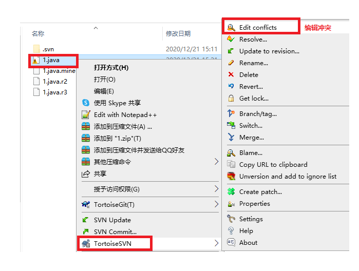
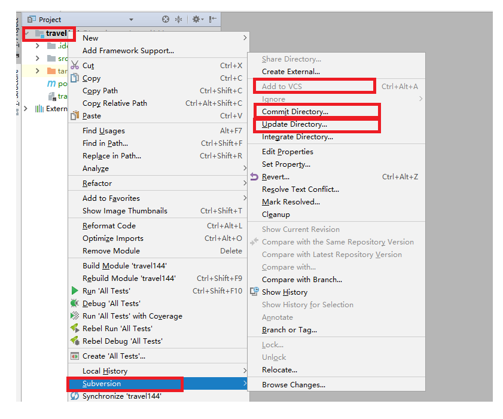

## 用户注册&svn

#### 总结

```java
1. 能够完成用户注册的基本功能[重点,必须完成]
2. 能够完成手机验证码校验功能[重点,必须完成,假装发送验证码,控制台输出即可]
3. 能够理解BaseServlet优化[使用反射抽取一个BaseServlet,以后所有的Servlet继承它]
4. 能够安装SVN服务器[必须会,创建仓库,创建用户,创建组,授权]
5. 能够使用SVN客户端和IDEA上传项目[把idea中travel项目上传到svn上]
```


#### 复习

```markdown
1.Maven入门
	a.下载&安装和配置Maven(MAVEN_HOME,path,本地仓库和远程仓库)
	b.使用Idea配置Maven
		配置:Maven的HOme目录
		配置:Maven的config的settings.xml文件
	c.创建Maven项目(最后建立一个标准结构的Maven项目)
    	Maven项目
    	   src
    	   		main
    	   			java
    	   			resources
    	   			webapp
    	   		test
    	   			java
    	   			resources
		
2.黑马旅游网环境搭建
	运行:
		使用本地的Tomcat(2018.1或者2020某些版本)
		使用插件的Tomcat(POM文件中引入插件)
```

**今日目标**

```markdown
1. 用户注册功能
	1.1 实现基本注册
	1.2 校验用户名是否存在（ajax--jackson）
	1.3 短信验证码（阿里云-短信服务）
	1.4 BaseServlet （抽取公共servlet工具类）
	
2. 代码版本控制工具 svn、git
	解决多人协作开发，源代码共享的问题
```

### ==一 用户注册基本功能==

#### 1.1 需求介绍


#### 1.2 需求分析


#### 1.3 代码实现

- ResultInfo实体类[结果封装]

```java
@Data 
public class ResultInfo implements Serializable { 
	private Boolean success; 
	private String message; 
	private Object data;
}
```

- register.jsp

```jsp
<!--注册表单-->
<form id="registerForm" action="${pageContext.request.contextPath}/register" method="post">
    <!--提交处理请求的标识符-->
    <input type="hidden" name="action" value="register">
    <table style="margin-top: 25px;width: 558px">
        <tr>
            <td class="td_left">
                <label for="username">用户名</label>
            </td>
            <td class="td_right">
                <input type="text" id="username" name="username" placeholder="请输入账号">
                <span id="userInfo" style="font-size:10px"></span>
            </td>
        </tr>
        <tr>
            <td class="td_left">
                <label for="telephone">手机号</label>
            </td>
            <td class="td_right">
                <input type="text" id="telephone" name="telephone" placeholder="请输入您的手机号">
            </td>
        </tr>
        <tr>
            <td class="td_left">
                <label for="password">密码</label>
            </td>
            <td class="td_right">
                <input type="password" id="password" name="password" placeholder="请输入密码">
            </td>
        </tr>
        <tr>
            <td class="td_left">
                <label for="smsCode">验证码</label>
            </td>
            <td class="td_right check">
                <input type="text" id="smsCode" name="smsCode" class="check" placeholder="请输入验证码">
                <a href="javaScript:void(0)" id="sendSmsCode">发送手机验证码</a>
            </td>
        </tr>
        <tr>
            <td class="td_left">
            </td>
            <td class="td_right check">
                <input type="submit" class="submit" value="注册">
                <span id="msg" style="color: red;">${rs.message}</span>
            </td>
        </tr>
    </table>
</form>
```

- UserServlet

```java
思考:在一个大项目中你觉得Servlet需要多少个?很多很多很多个
提问:能否多个请求使用同一个Servlet?  可以,请求时我们自定义一个参数action="register|login"  
    
package com.itheima.web.servlet;

import com.itheima.pojo.ResultInfo;
import com.itheima.pojo.User;
import com.itheima.service.UserService;
import org.apache.commons.beanutils.BeanUtils;

import javax.servlet.ServletException;
import javax.servlet.annotation.WebServlet;
import javax.servlet.http.HttpServlet;
import javax.servlet.http.HttpServletRequest;
import javax.servlet.http.HttpServletResponse;
import java.io.IOException;
import java.lang.reflect.InvocationTargetException;
import java.util.Map;

@WebServlet(name = "RegisterServlet",urlPatterns = "/user")
public class UserServlet extends HttpServlet {
    protected void doPost(HttpServletRequest request, HttpServletResponse response) throws ServletException, IOException {
        doGet(request,response);
    }
    protected void doGet(HttpServletRequest request, HttpServletResponse response) throws ServletException, IOException {
        //判断action的值
        String action = request.getParameter("action");
        //使用if判断
        if ("register".equals(action)){
            register(request,response);
        }else if ("login".equals(action)){
            login(request,response);
        }
    }
    /**
     * 登陆操作
     */
    public void login(HttpServletRequest request, HttpServletResponse response) {
    }
    /**
     * 注册功能
     */
    public void register(HttpServletRequest request, HttpServletResponse response){
        // 参
        Map<String, String[]> map = request.getParameterMap();
        User user = new User();
        try {
            BeanUtils.populate(user,map);
        } catch (Exception e) {
            e.printStackTrace();
        }
        // 调
        UserService service = new UserService();
        ResultInfo result = service.register(user);
        // 存
        request.setAttribute("rs",result);
        // 转
        if (result.getSuccess()){
            request.getRequestDispatcher("/register_ok.jsp").forward(request,response);
        }else{
            request.getRequestDispatcher("/register.jsp").forward(request,response);
        }
    }
}    
```

- UserService

```java
package com.itheima.service;
import com.itheima.dao.UserDao;
import com.itheima.pojo.ResultInfo;
import com.itheima.pojo.User;
import com.itheima.utils.Md5Utils;
import com.itheima.utils.MyBatisUtils;
import org.apache.ibatis.session.SqlSession;
public class UserService {
    /**
     * 用户注册功能
     * @param user
     * @return
     */
    public ResultInfo register(User user) {
        //1.检查用户
        SqlSession sqlSession = MyBatisUtils.openSession();
        UserDao userDao = sqlSession.getMapper(UserDao.class);
        User existUser1 = userDao.findUserByUsername(user.getUsername());
        if (existUser1 != null){
            return new ResultInfo(false, "用户名已被注册!");
        }
        //2.检查手机号
        User existUser2 = userDao.findUserByTelephone(user.getTelephone());
        if (existUser2 != null) {
            return new ResultInfo(false, "手机号已被使用!");
        }
        //3.注册
        String md5Password = Md5Utils.encodeByMd5(user.getPassword() + "itheima");//加盐加密
        user.setPassword(md5Password);

        userDao.saveUser(user);
        sqlSession.commit();
        sqlSession.close();
        //4.返回
        return new ResultInfo(true, "注册成功!");
    }
}

```

- UserDao

```java
package com.itheima.dao;
import com.itheima.pojo.User;
public interface UserDao {
    /**
     * 根据用户名查询用户
     * @param username
     * @return
     */
    User findUserByUsername(String username);

    /**
     * 根据手机号查询用户
     * @param telephone
     * @return
     */
    User findUserByTelephone(String telephone);

    /**
     * 保存用户
     * @param user
     */
    void saveUser(User user);
}


<?xml version="1.0" encoding="UTF-8" ?>
<!DOCTYPE mapper PUBLIC "-//mybatis.org//DTD Mapper 3.0//EN" "http://mybatis.org/dtd/mybatis-3-mapper.dtd">
<mapper namespace="com.itheima.dao.UserDao">

    <select id="findUserByUsername" parameterType="string" resultType="user">
        select * from tab_user where username = #{username}
    </select>

    <select id="findUserByTelephone" parameterType="string" resultType="user">
        select * from tab_user where telephone = #{telephone}
    </select>

    <insert id="saveUser" parameterType="user">
        insert into tab_user(username,password,telephone) values (#{username},#{password},#{telephone})
    </insert>

</mapper>
```

- register_ok.jsp

```jsp
<div style="text-align:center;height: 290px;margin-top: 50px">
    <span style="font-size: 30px">恭喜您，注册成功！</span>
    <div><span style="color: red" id="time">5</span>秒后，跳转到 <a href="./index.jsp">首页</a> </div>
    <script type="text/javascript">
        let count = 5;
        let intervalId = setInterval(function () {
            if (count == 0) {
                location.href = "${pageContext.request.contextPath}/index.jsp";
                //取消定时器
                clearInterval(intervalId);
                return;
            }
            count--;
            $("#time").html(count);
        },1000)

    </script>
</div>
```

#### 1.4 课后作业

```java
用户确认密码在页面使用js校验!
```

### ==二 校验用户名是否存在==

#### 2.1 需求介绍


#### 2.2 需求分析


#### 2.3 知识点[Jackson工具]

- 介绍Jackson

> 将json串转换为java对象
>
> 将java对象转为json串

- Jackson使用

```java
package com.itheima;

import com.fasterxml.jackson.core.JsonProcessingException;
import com.fasterxml.jackson.databind.ObjectMapper;
import com.itheima.pojo.ResultInfo;
import org.junit.Test;

import java.io.IOException;

public class testJackson {
    /**
     * 测试json转换的工具包jackson
     */
    @Test
    public void test() throws IOException {
        ObjectMapper mapper = new ObjectMapper();
        ResultInfo info = new ResultInfo(true, "OK", null);
        //把对象转成json串
        String json = mapper.writeValueAsString(info);
        System.out.println(json);
        //把json串转换成对象
        ResultInfo info1 = mapper.readValue(json, ResultInfo.class);
        System.out.println(info1);
    }
}

```

#### 2.4 代码实现

- register.jsp

```jsp
<td class="td_right">
    <input type="text" id="username" name="username" placeholder="请输入账号">
    <span id="userInfo" style="font-size:14px;color: red"></span>
    <script type="text/javascript">
        $("#username").blur(function () {
            //发送ajax
            let url = "${pageContext.request.contextPath}/user";
            let param = "action=findUserName&username="+ $("#username").val();
            $.post(url,param,function (resp) {
                $("#userInfo").html(resp.message);
            },"json");
        })
    </script>
</td>
```

- UserServlet

```java
/**
  * 校验用户名是否存在
  */
public void findUserName(HttpServletRequest request, HttpServletResponse response) throws IOException {
    // 参
    String username = request.getParameter("username");
    // 调
    UserService service = new UserService();
    ResultInfo resultInfo = service.findUsername(username);
    // 转
    ObjectMapper mapper = new ObjectMapper();
    String json = mapper.writeValueAsString(resultInfo);
    // 回
    response.setContentType("application/json;charset=UTF-8");
    response.getWriter().write(json);
}
```

- UserService

```java
/**
  * 校验用户名是否存在
  */
public ResultInfo findUsername(String username) {
    SqlSession sqlSession = MyBatisUtils.openSession();
    UserDao userDao = sqlSession.getMapper(UserDao.class);
    User user = userDao.findUserByUsername(username);
    sqlSession.commit();
    sqlSession.close();
    if (user == null){
        return new ResultInfo(true,"√");
    }else{
        return new ResultInfo(false, "该用户名已被注册!");
    }
}
```

- UserDao

```java
package com.itheima.dao;
import com.itheima.pojo.User;
public interface UserDao {
    /**
     * 根据用户名查询用户
     * @param username
     * @return
     */
    User findUserByUsername(String username);
}

<select id="findUserByUsername" parameterType="string" resultType="user">
    select * from tab_user where username = #{username}
</select>
```

#### 2.5 课后作业

```java
使用ajax校验手机号是否存在!
```

### 三 阿里云-短信服务

#### 3.1 如何给用户发送验证码


#### 3.2 阿里云使用

```markdown
0. 什么是阿里云短信服务
	专门提供靠谱的牛逼的国内外手机短信服务的
1. 注册阿里云平台账户（支付宝扫描注册）
	https://account.aliyun.com/
2. 登录（支付码扫描登录）

3. 选择短信服务平台[搜索短信服务也可]

4. 选择国内消息[需要阿里后台审核5-15分左右]
	申请签名: 发送短信时,用户看到[发送方是谁]
	申请模板[注意格式]:[我们建议选择人家提供的常用模板]

5. 获取AccessKeyID和AccessKeySecret
	在用户下选择AccessKey管理进入即可
6. 充钱（1-10块钱意思意思）
```

#### 3.3 SDK

- SDK是什么?

  ```java
  Soft Develop Kit(软件开发工具包)
  ```

- SDK下载

  ```java
  https://help.aliyun.com/document_detail/55359.html
  ```

- 短信的参数介绍

  ```java
  手机号,验证码(必须json格式),短信签名,短信模板号
  ```

- 短信工具类测试

  ```java
  package com.itheima.utils;
  
  import com.aliyuncs.DefaultAcsClient;
  import com.aliyuncs.IAcsClient;
  import com.aliyuncs.dysmsapi.model.v20170525.QuerySendDetailsRequest;
  import com.aliyuncs.dysmsapi.model.v20170525.QuerySendDetailsResponse;
  import com.aliyuncs.dysmsapi.model.v20170525.SendSmsRequest;
  import com.aliyuncs.dysmsapi.model.v20170525.SendSmsResponse;
  import com.aliyuncs.exceptions.ClientException;
  import com.aliyuncs.profile.DefaultProfile;
  import com.aliyuncs.profile.IClientProfile;
  
  import java.text.SimpleDateFormat;
  import java.util.Date;
  
  public class SmsUtils {
  
      //产品名称:云通信短信API产品,开发者无需替换
      static final String product = "Dysmsapi";
      //产品域名,开发者无需替换
      static final String domain = "dysmsapi.aliyuncs.com";
  
      // 需开发者指定
      private static String accessKeyId = "";
  
      // 需开发者指定
      private static String accessKeySecret = "";
  
      /**
       * 调用阿里云平台发送短信
       *
       * @param phoneNumbers 手机号
       * @param signName     签名
       * @param templateCode 模板
       * @param param        参数
       * @return
       * @throws ClientException
       */
  
      public static SendSmsResponse sendSms(String phoneNumbers, String signName, String templateCode, String param) throws ClientException {
  
          //可自助调整超时时间
          System.setProperty("sun.net.client.defaultConnectTimeout", "10000");
          System.setProperty("sun.net.client.defaultReadTimeout", "10000");
  
          //初始化acsClient,暂不支持region化
          IClientProfile profile = DefaultProfile.getProfile("cn-hangzhou", accessKeyId, accessKeySecret);
          DefaultProfile.addEndpoint("cn-hangzhou", "cn-hangzhou", product, domain);
          IAcsClient acsClient = new DefaultAcsClient(profile);
  
          //组装请求对象-具体描述见控制台-文档部分内容
          SendSmsRequest request = new SendSmsRequest();
          //必填:待发送手机号
          request.setPhoneNumbers(phoneNumbers);
          //必填:短信签名-可在短信控制台中找到
          request.setSignName(signName);
          //必填:短信模板-可在短信控制台中找到
          request.setTemplateCode(templateCode);
          //可选:模板中的变量替换JSON串,如模板内容为"亲爱的${name},您的验证码为${code}"时,此处的值为
          request.setTemplateParam(param);
  
          //选填-上行短信扩展码(无特殊需求用户请忽略此字段)
          //request.setSmsUpExtendCode("90997");
  
          //可选:outId为提供给业务方扩展字段,最终在短信回执消息中将此值带回给调用者
          request.setOutId("yourOutId");
  
          //hint 此处可能会抛出异常，注意catch
          SendSmsResponse sendSmsResponse = acsClient.getAcsResponse(request);
  
          return sendSmsResponse;
      }
  
      public static QuerySendDetailsResponse querySendDetails(String bizId, String phoneNumber) throws ClientException {
  
          //可自助调整超时时间
          System.setProperty("sun.net.client.defaultConnectTimeout", "10000");
          System.setProperty("sun.net.client.defaultReadTimeout", "10000");
  
          //初始化acsClient,暂不支持region化
          IClientProfile profile = DefaultProfile.getProfile("cn-hangzhou", accessKeyId, accessKeySecret);
          DefaultProfile.addEndpoint("cn-hangzhou", "cn-hangzhou", product, domain);
          IAcsClient acsClient = new DefaultAcsClient(profile);
  
          //组装请求对象
          QuerySendDetailsRequest request = new QuerySendDetailsRequest();
          //必填-号码
          request.setPhoneNumber(phoneNumber);
          //可选-流水号
          request.setBizId(bizId);
          //必填-发送日期 支持30天内记录查询，格式yyyyMMdd
          SimpleDateFormat ft = new SimpleDateFormat("yyyyMMdd");
          request.setSendDate(ft.format(new Date()));
          //必填-页大小
          request.setPageSize(10L);
          //必填-当前页码从1开始计数
          request.setCurrentPage(1L);
  
          //hint 此处可能会抛出异常，注意catch
          QuerySendDetailsResponse querySendDetailsResponse = acsClient.getAcsResponse(request);
  
          return querySendDetailsResponse;
      }
  
      public static void main(String[] args) throws Exception {
          SendSmsResponse sendSmsResponse = sendSms("15511011213", "黑马旅游网", "SMS_205878443", "{\"code\":\"123456\"}");
          System.out.println(sendSmsResponse.getCode());
          System.out.println(sendSmsResponse.getMessage());
      }
  }
  ```

### ==四 手机验证码校验功能==

#### 4.1 需求介绍


#### 4.2 需求分析


#### 4.3 代码实现

- register.jsp

```jsp
<td class="td_right check">
    <input type="text" id="smsCode" name="smsCode" class="check" placeholder="请输入验证码">
    <a href="javaScript:void(0)" id="sendSmsCode">发送手机验证码</a>
    <script type="text/javascript">
        $("#sendSmsCode").click(function () {
            let url = "${pageContext.request.contextPath}/user";
            let param = "action=sendSms&telephone="+$("#telephone").val();
            $.post(url,param,function (resp) {
                alert(resp.message);
            },"json");
        })
    </script>
</td>
```

- UserServlet

```java
/**
  * 给用户的手机号发送验证码短信
  * @param request
  * @param response
  */
public void sendSms(HttpServletRequest request, HttpServletResponse response) throws IOException, ClientException {
    // 参
    String telephone = request.getParameter("telephone");

    //使用工具类生成验证码
    String smsCode = RandomStringUtils.randomNumeric(6);
    System.out.println("验证码:"+smsCode);
    //把验证码添加到session中
    request.getSession().setAttribute("smsCode_"+telephone,smsCode);

    // 调
    UserService service = new UserService();
    ResultInfo resultInfo = service.sendSms(telephone,smsCode);
    // 转
    ObjectMapper mapper = new ObjectMapper();
    String json = mapper.writeValueAsString(resultInfo);
    // 回
    response.setContentType("application/json;charset=UTF-8");
    response.getWriter().write(json);
}
```

- UserService

```java
/**
  * 给手机号发送验证码
  */
public ResultInfo sendSms(String telephone, String smsCode) throws ClientException {
    //调用阿里云工具类
    SendSmsResponse response = SmsUtils.sendSms(telephone, "黑马旅游网", "SMS_205878443", "{\"code\":\"" + smsCode + "\"}");
    //判断
    if (response.getCode().equals("OK")){
        return new ResultInfo(true,"短信发送成功!");
    }else{
        return new ResultInfo(false,"短信发送失败,联系商家!");
    }
}
```

#### 4.4 修改注册代码，添加验证码校验功能

##### 4.2.1 需求介绍


##### 4.2.2 需求分析


##### 4.2.3 Servlet修改 

- UserServlet

```java
/**
  * 注册功能
  */
public void register(HttpServletRequest request, HttpServletResponse response) throws ServletException, IOException {
    // 获取验证码进行校验
    String smsCodeUser = request.getParameter("smsCode");
    String telephone = request.getParameter("telephone");
    Object smsCodeSystem = request.getSession().getAttribute("smsCode_" + telephone);
    if (!smsCodeUser.equals(smsCodeSystem)){
        request.setAttribute("rs",new ResultInfo(false,"验证码不对"));
        request.getRequestDispatcher("/register.jsp").forward(request,response);
        return;
    }

    // 参
    Map<String, String[]> map = request.getParameterMap();
    User user = new User();
    try {
        BeanUtils.populate(user,map);
    } catch (Exception e) {
        e.printStackTrace();
    }
    // 调
    UserService service = new UserService();
    ResultInfo result = service.register(user);
    // 存
    request.setAttribute("rs",result);
    // 转
    if (result.getSuccess()){
        //清空验证码
        request.getSession().removeAttribute("smsCode_"+telephone);
        request.getRequestDispatcher("/register_ok.jsp").forward(request,response);
    }else{
        request.getRequestDispatcher("/register.jsp").forward(request,response);
    }
}
```

### ==五 抽取BaseServlet==

#### 5.1 观察Servlet中action和调用的方法

```java
//判断action的值
String action = request.getParameter("action");
//使用if判断
if ("register".equals(action)){
    register(request,response);
}else if ("findUserName".equals(action)){
    findUserName(request,response);
}else if ("sendSms".equals(action)){
    sendSms(request,response);
}
//action的值就是要调用的方法名
//我们使用反射,获取action的方法名
```

#### 5.2 使用反射自动根据action调用对应的方法

```java
 //0.获取Class
Class aClass = this.getClass();
//1.获取方法
Method actionMethod = aClass.getDeclaredMethod(action, HttpServletRequest.class, HttpServletResponse.class);
//2.设置暴力权限
actionMethod.setAccessible(true);
//4.反射调用
actionMethod.invoke(this,request,response);
```

#### 5.3 以后Servlet应该怎么写

```java
package com.itheima.web.servlet;

import lombok.SneakyThrows;

import javax.servlet.ServletException;
import javax.servlet.annotation.WebServlet;
import javax.servlet.http.HttpServlet;
import javax.servlet.http.HttpServletRequest;
import javax.servlet.http.HttpServletResponse;
import java.io.IOException;
import java.lang.reflect.Method;

@WebServlet(name = "BaseServlet")
public class BaseServlet extends HttpServlet {
    protected void doPost(HttpServletRequest request, HttpServletResponse response) throws ServletException, IOException {
        doGet(request,response);
    }

    @SneakyThrows
    protected void doGet(HttpServletRequest request, HttpServletResponse response) throws ServletException, IOException {
        //判断action的值
        String action = request.getParameter("action");
        //action的值就是要调用的方法名
        //我们使用反射,获取action的方法名
        //0.获取Class
        Class aClass = this.getClass();
        //1.获取方法
        Method actionMethod = aClass.getDeclaredMethod(action, HttpServletRequest.class, HttpServletResponse.class);
        //2.设置暴力权限
        actionMethod.setAccessible(true);
        //4.反射调用
        actionMethod.invoke(this,request,response);
    }
}

以后我们的所有Servlet都继承BaseServlet,然后保证action的值和Servlet中方法名一致即可!
```

#### 5.4 课后作业

- 需求

```java
注册页面点击发短信后,我们如何实现用户等待60秒,才能继续发送短信!    
```

### 六 SVN[理解]

#### 1.开发中所遇到的问题

1. 架构师搭建好的项目如何分享？
2. 我们程序员如何拿到项目?
3. 开发好的代码如何上传？
4. 多人操作同一个java类，如何解决冲突？【详细介绍】
5. 项目删除了，该如何解决？

#### 2.项目版本控制工具SVN

##### 2.1 什么是SVN

```java
SubVersion,是一个控制软件版本的工具
```

##### 2.2 公司中SVN的使用流程[图]


#### 3.SVN服务器安装和使用

##### 3.1 下载和安装[2个注意]

```java
安装时需要两个注意:
	a.选择标准版本(Standard Edition)
    b.端口号必须改成8443(默认是443)
其他是一顿下一步操作!        
```

##### 3.2 SVN服务器操作

- 创建用户

  

- 创建组

  

- 创建仓库

  

- 给用户授权

  

#### 4.SVN客户端安装和使用（小乌龟）

##### 4.1 下载和安装[一个注意]

```java
注意: 安装时,一定要把command line client tools打上勾!其他一顿下一步!
```


##### 4.2 客户端svn操作

- 浏览仓库

  

- checkout（检出项目）

  

- add(添加文件)

  

- commit（提交代码）

  

- update（更新代码）

  

- 冲突解决

  ```java
  如果文件有冲突,我们是无法提交的,我们需要执行update操作
  update之后有冲突的文件,会变成4个
  ```

  

  

  

- 版本回溯【了解】

  

- delete（删除代码）【了解】

  

- 创建标准仓库【了解】

  

### 七 IDEA操作SVN客户端

##### 7.1 配置idea的svn插件


##### 7.2 使用idea操作svn

- 开启SVN管理项目

  

- share project和commit

  

  

- checkout

  

- 提交&更新

  

  

- 冲突解决

  

  

- ignore忽略文件上传

  

### 八 SVN高级分支使用【了解】

#### 1.SVN标准仓库的创建和介绍

##### 1.1 标准仓库的创建

##### 1.2 标准仓库的目录结构


#### 2.创建trunk,branch,tag

##### 2.1 创建项目分享到trunk


##### 2.2 创建branch


##### 2.4 切换到branch编写代码


##### 2.5 合并branch到trunk

```java
注意事项:
	把分支和到主干,进入主干中
```


### ==九.上传黑马旅游网项目到svn服务器==

- 创建仓库(标准仓库)

  

- 

- 开启SVN管理项目

  

- 指定需要忽略的文件

  

- share project(分享项目)

  

- commit提交代码


