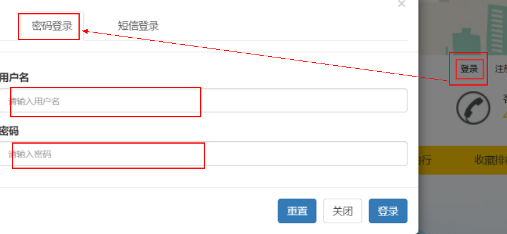
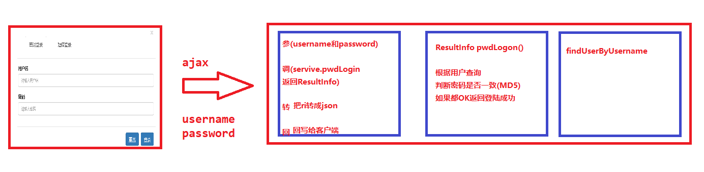
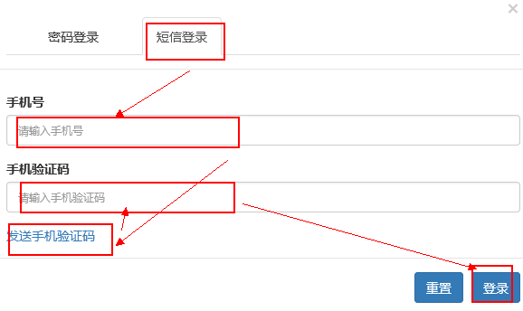
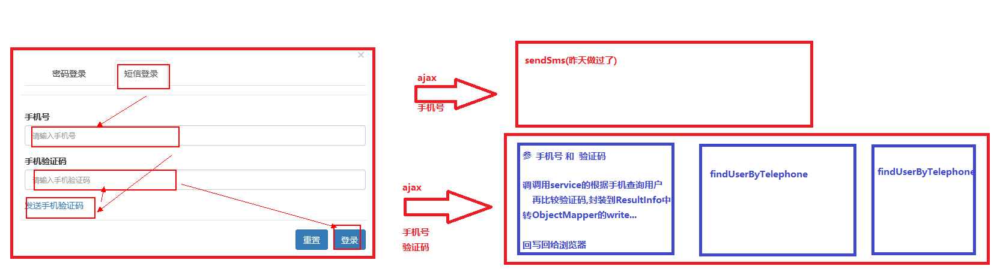
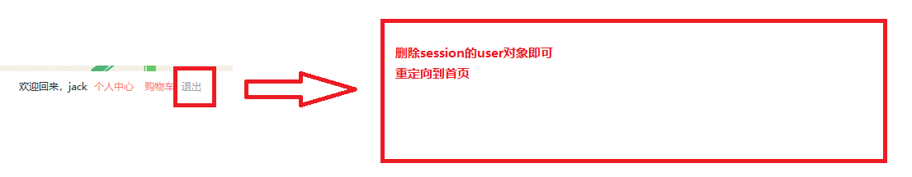
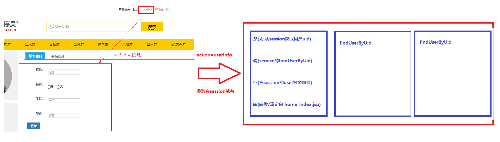
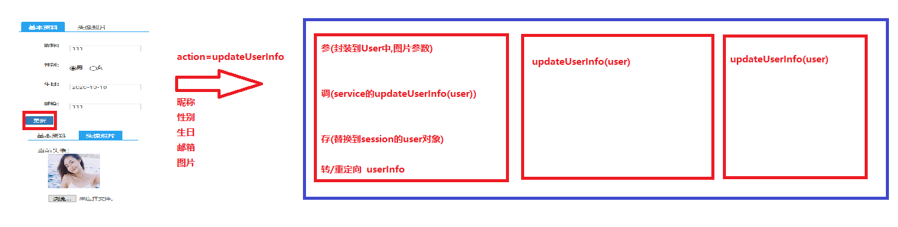
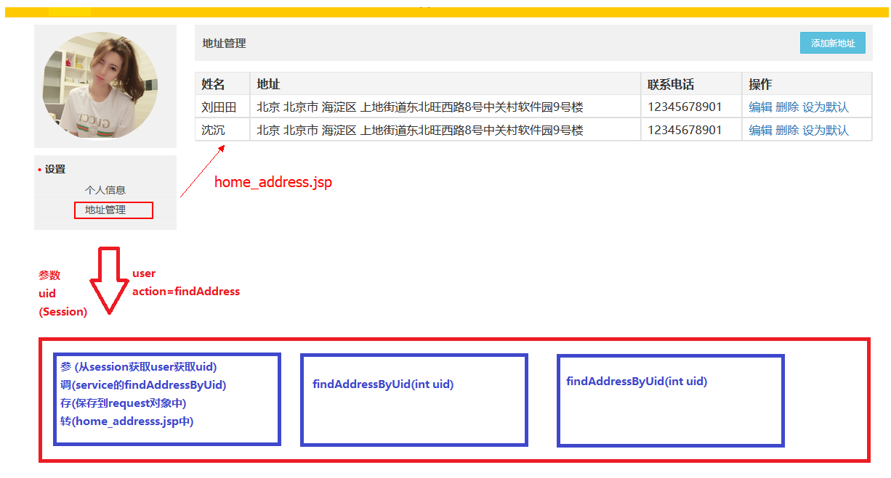
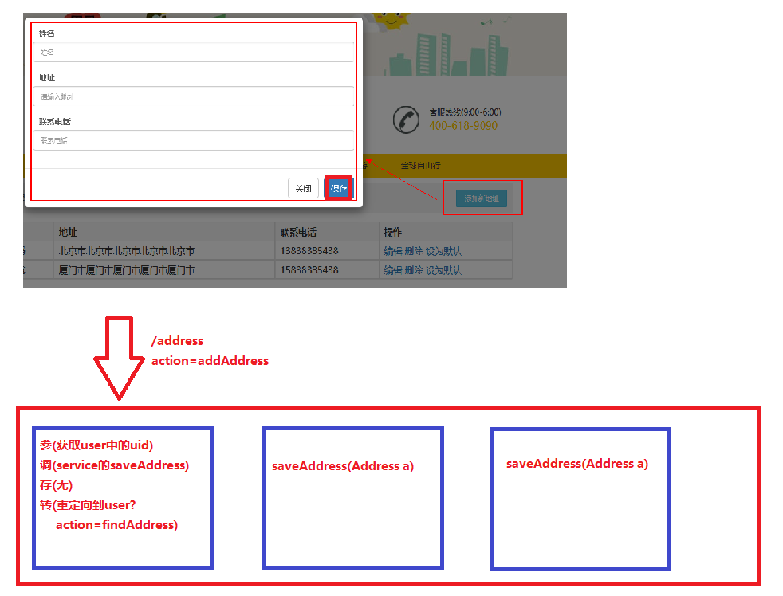

### 总结

```java
1. 能够完成用户登录和退出功能[必须完成]
    用户名密码登陆
    手机号验证码登陆
    退出功能
2. 能够完成用户个人信息补全[必须完成]
    回显个人信息
    补全个人信息[文件上传的那段代码我们可以了解]
3. 能够理解面向接口编程思想
    修改Service层,XxxService接口,XxxServiceImpl实现类
    XxxService service = new XxxService();
4. 能够使用BeanFactory创建对象
    XxxService service = BeanFactory.getBean("xxxService");
	其中getBean的方法使用XML解析,这里解析我们理解即可
5. 能够完成地址新增功能[必须完成]
    查看联系人地址
    添加联系人地址
    修改联系人地址[回显和修改]  
    删除联系人地址[确认和删除,最后要重定向到查看联系人地址]    
```


# 复习

```markdown
1.用户注册[用户名和手机号和密码]
2.ajax验证用户名是否存在[ObjectMapper]
3.手机验证码校验[假装短信已经发送,控制台可以看见]
4.把项目推荐到SVN
```

# 用户模块&面向接口编程

**今日内容**

```markdown
1. 用户模块
	用户名密码登录
	手机短信登录
	用户退出
	个人中心
		信息回显（查询）
		信息更新（修改）
			文件上传（servlet3.0）
2. 面向接口编程
3. 对象管理（体现spring框架的解耦功能，后期不在会new对象）
4. 地址管理
	收货地址列表查询
	收货地址列表添加
```

## ==一 用户名密码登录[ajax]==

### 1.1 需求介绍和分析





### 1.2 代码实现

- ##### header.jsp

```jsp
<div class="modal-footer">
    <input type="reset" class="btn btn-primary" value="重置">
    <input type="button" id="pwdLogin" class="btn btn-primary" value="登录"/>
    <script type="text/javascript">
        $("#pwdLogin").click(function () {
            let url = "${pageContext.request.contextPath}/user";
            let param = $("#pwdLoginForm").serialize();//调用表单的序列化方法
            //发送ajax
            $.post(url,param,function (resp) {
                if (resp.success){
                    //成功,刷新当前页面
                    location.reload();
                }else{
                    //失败
                    alert(resp.message);
                }
            },"json")
        });
    </script>
</div>
```

- ##### UserServlet

```java
/**
  * 用户名密码登录
  */
public void pwdLogin(HttpServletRequest request, HttpServletResponse response) throws IOException, ClientException {
    // 参
    Map<String, String[]> map = request.getParameterMap();
    User user = new User();
    try {
        BeanUtils.populate(user,map);
    } catch (Exception e) {
        e.printStackTrace();
    }
    // 调
    UserService service = new UserService();
    ResultInfo resultInfo = service.pwdLogin(user);
    // 判断,因为这是登录功能,如果登录成功,我们要把user对象保存到session
    if (resultInfo.getSuccess()){
        request.getSession().setAttribute("user",resultInfo.getData());
    }
    // 转
    ObjectMapper mapper = new ObjectMapper();
    String json = mapper.writeValueAsString(resultInfo);
    // 回
    response.setContentType("application/json;charset=UTF-8");
    response.getWriter().write(json);
}

```

- ##### UserService

```java
/**
  * 根据用户名密码登陆
  */
public ResultInfo pwdLogin(User user) {
    //1.查询用户名
    SqlSession sqlSession = MyBatisUtils.openSession();
    UserDao userDao = sqlSession.getMapper(UserDao.class);
    User existUser = userDao.findUserByUsername(user.getUsername());
    sqlSession.commit();
    sqlSession.close();
    if (existUser == null){
        return new ResultInfo(false,"用户名不存在!");
    }
    //2.比较密码
    //比较 user中密码  和  existUser中密码
    String pwdMD5 = Md5Utils.encodeByMd5(user.getPassword() + "itheima");
    if (!pwdMD5.equals(existUser.getPassword())){
        return new ResultInfo(false,"用户名或者密码不正确!");
    }
    //3.成功
    return new ResultInfo(true,"登陆成功",existUser);
}
}
```

- ##### header.jsp

```jsp
<%--右侧按钮--%>
<div class="shortcut">
    <c:if test="${empty user}">
        <!-- 未登录状态 -->
        <div class="login_out">
            <a id="loginBtn" data-toggle="modal" data-target="#loginModel" style="cursor: pointer;">登录</a>
            <a href="register.jsp" style="cursor: pointer;">注册</a>
        </div>
    </c:if>
    <!-- 登录状态 -->
    <c:if test="${not empty user}">
        <div class="login">
            <span>欢迎回来，${user.username}</span>
            <a href="home_index.jsp" class="collection">个人中心</a>
            <a href="cart.jsp" class="collection">购物车</a>
            <a href="index.jsp">退出</a>
        </div>
    </c:if>
</div>
```

## ==二 手机短信登录[ajax]==

### 2.1 需求介绍和分析





### 2.2 代码实现

- ##### **header.jsp**

```jsp
<%--短信登录--%>
<div class="tab-pane fade" id="telReg">
    <form id="telLoginForm" method="post" action="#">
        <input type="hidden" name="action" value="smsLogin">
        <div class="modal-body">
            <div class="form-group">
                <label>手机号</label>
                <input type="text" class="form-control" name="telephone" id="login_telephone"
                       placeholder="请输入手机号">
            </div>
            <div class="form-group">
                <label>手机验证码</label>
                <input type="text" class="form-control" id="login_check" name="smsCode"
                       placeholder="请输入手机验证码">
            </div>
            <a href="javaScript:void(0)" id="login_sendSmsCode">发送手机验证码</a>
            <script type="text/javascript">
                $("#login_sendSmsCode").click(function () {
                    let telephone = $("#login_telephone").val();
                    if (telephone == null || telephone == ""){
                        alert("手机号不能为空");
                        return;
                    }
                    //发送ajax
                    let url = "${pageContext.request.contextPath}/user";
                    let param = "action=sendSms&telephone="+telephone;
                    $.post(url,param,function (resp) {
                        alert(resp.message);
                    },"json")
                })
            </script>
        </div>
        <div class="modal-footer">
            <input type="reset" class="btn btn-primary" value="重置">
            <input type="button" class="btn btn-primary" id="telLogin" value="登录"/>
            <script type="text/javascript">
                $("#telLogin").click(function () {
                    //发送ajax登陆
                    let url = "${pageContext.request.contextPath}/user";
                    let param = $("#telLoginForm").serialize();
                    $.post(url,param,function (resp) {
                        if(resp.success){
                            location.reload();
                        }else{
                            alert(resp.message)
                        }
                    },"json")
                })
            </script>
        </div>
    </form>
```

- ##### UserServlet

```java
/**
  * 手机号验证码登陆
  */
public void smsLogin(HttpServletRequest request, HttpServletResponse response) throws IOException, ClientException {
    ResultInfo resultInfo = null;
    // 参
    String telephone = request.getParameter("telephone");
    String smsCode = request.getParameter("smsCode");

    // 调
    //查询用户
    UserService service = new UserService();
    User user = service.findUserByTelephone(telephone);
    if (user == null){
        resultInfo = new ResultInfo(false,"手机号未注册!");
        // 转
        ObjectMapper mapper = new ObjectMapper();
        String json = mapper.writeValueAsString(resultInfo);
        // 回
        response.setContentType("application/json;charset=UTF-8");
        response.getWriter().write(json);
        return;
    }
    //比较验证码
    String smsCodeSystem = (String) request.getSession().getAttribute("smsCode_" + telephone);
    if (!smsCode.equals(smsCodeSystem)){
        resultInfo = new ResultInfo(false,"验证码错误!");
        // 转
        ObjectMapper mapper = new ObjectMapper();
        String json = mapper.writeValueAsString(resultInfo);
        // 回
        response.setContentType("application/json;charset=UTF-8");
        response.getWriter().write(json);
        return;
    }
    //如果以上都OK
    resultInfo = new ResultInfo(true,"登陆成功");
    request.getSession().setAttribute("user",user);
    // 转
    ObjectMapper mapper = new ObjectMapper();
    String json = mapper.writeValueAsString(resultInfo);
    // 回
    response.setContentType("application/json;charset=UTF-8");
    response.getWriter().write(json);
}
```

- ##### UserService

```java
/**
  * 根据手机号查询用户
  */
public User findUserByTelephone(String telephone) {
    SqlSession sqlSession = MyBatisUtils.openSession();
    UserDao userDao = sqlSession.getMapper(UserDao.class);
    User user = userDao.findUserByTelephone(telephone);
    sqlSession.commit();
    sqlSession.close();
    return user;
}
```

- ##### 思考:这个手机验证码登陆问题

```java
我们服务器的手机号验证码没有5分钟自动销毁,永久有效!(以后使用redis缓存解决这个问题!)
```

## ==三 用户退出功能==

### 3.1 需求介绍和分析



### 3.2 代码实现

- ##### header.jsp

```jsp
 <a href="${pageContext.request.contextPath}/user?action=logout">退出</a>
```

- ##### UserServlet

```java
/**
  * 用户退出功能
  */
public void logout(HttpServletRequest request, HttpServletResponse response) throws IOException, ClientException {
    // 参
    // 调
    request.getSession().removeAttribute("user");
    // 存
    // 转
    response.sendRedirect("index.jsp");
}
```

## ==四 个人信息回显==

### 4.1 需求介绍和分析



### 4.1 代码实现

- ##### header.jsp

```jsp
<a href="${pageContext.request.contextPath}/user?action=userInfo" class="collection">个人中心</a>
```

- ##### UserServlet

```java
/**
  * 回显个人信息
  */
public void userInfo(HttpServletRequest request, HttpServletResponse response) throws IOException, ClientException, ServletException {
    // 参
    User user = (User)request.getSession().getAttribute("user");
    int uid = user.getUid();
    // 调
    UserService service = new UserService();
    User newUser = service.findUserByUid(uid);
    // 存(request中,session中)
    request.getSession().setAttribute("user",newUser);
    // 转发
    request.getRequestDispatcher("/home_index.jsp").forward(request,response);
    //或者重定向
    //        response.sendRedirect(request.getContextPath()+"/home_index.jsp");
}
```

- ##### UserService

```java
/**
  * 根据uid查询用户
  */
public User findUserByUid(int uid) {
    SqlSession sqlSession = MyBatisUtils.openSession();
    UserDao userDao = sqlSession.getMapper(UserDao.class);
    User user = userDao.findUserByUid(uid);
    sqlSession.commit();
    sqlSession.close();
    return user;
}
```

- ##### UserDao

```java
package com.itheima.dao;

import com.itheima.pojo.User;

public interface UserDao {
    /**
     * 根据uid查询用户
     * @param uid
     * @return
     */
    User findUserByUid(int uid);
}

<select id="findUserByUid" parameterType="int" resultType="user">
    select * from tab_user where uid = #{uid};
</select>
```

- ##### home_index.jsp

```jsp
<form action="" method="post" enctype="multipart/form-data">
    <div class="tab-content ">
        <div id="one" class="tab-pane active">
            <div class="sui-form form-horizontal">
                <div class="control-group">
                    <label for="inputName" class="control-label">昵称：</label>
                    <div class="controls">
                        <input type="text" id="inputName" name="nickname" placeholder="昵称"
                               value="${user.nickname}">
                    </div>
                </div>
                <div class="control-group">
                    <label class="control-label">性别：</label>
                    <div class="controls">

                        <input type="radio" name="sex" value="1" <c:if test="${user.sex == 1}">checked</c:if>><b>男</b>
                    &nbsp;&nbsp;
                    <input type="radio" name="sex" value="0" <c:if test="${user.sex == 0}">checked</c:if>><b>女</b>
            </div>
        </div>
        <div class="control-group">
            <label class="control-label">生日：</label>
            <div class="controls">
                <input type="text" name="birthday" placeholder="生日" value="${user.birthday}">
            </div>
        </div>
        <div class="control-group">
            <label class="control-label">邮箱：</label>
            <div class="controls">
                <input type="text" name="email" placeholder="邮箱" value="${user.email}">
            </div>
        </div>
        <div class="control-group">

            <div class="controls">
                <button type="submit" class="sui-btn btn-primary">更新</button>
            </div>
        </div>
    </div>
    </div>
<div id="two" class="tab-pane">

    <div class="new-photo">
        <p>当前头像：</p>
        <div class="upload">
            
            <input type="file" id="up_img_WU_FILE_0" name="pic"/>
        </div>

    </div>
</div>
</div>
</form>
```

- ##### home_left.jsp

```jsp
<div class="person-info">
    <div class="person-photo" style="text-align: center">
        
    </div>
    <div class="clearfix"></div>
</div>
```

## ==五 个人信息修改==

### 5.0 回顾

```java
* 文件上传三要素
	method:post
    enctype:multipart/form-data
    图片input必须有name属性    
* 文件上传的三种技术
    使用框架file-upload.jar[最最最恶心的]
    使用Servlet3.0的新注解@MultipartConfig[比较恶心] 
    使用SpringMVC框架[一个注解一句代码]    
```

### 5.1 需求介绍和分析



### 5.2 代码实现

- ##### 随机字符串工具类UuidUtils[新知识]

  ```java
  UuidUtils可能生成一个32位全球唯一字符串
  ```

  

- ##### home_index.jsp

```jsp
<form action="${pageContext.request.contextPath}/user" method="post" 	
      enctype="multipart/form-data">
    <input type="hidden" name="action" value="updateUserInfo">
    <input type="hidden" name="uid" value="${user.uid}">
```

- ##### UserServlet

```java
/**
  * 更新个人信息
  */
public void updateUserInfo(HttpServletRequest request, HttpServletResponse response) throws IOException, ClientException, ServletException {
    // 参
    //封装基本数据
    Map<String, String[]> map = request.getParameterMap();
    User user = new User();
    try {
        BeanUtils.populate(user, map);
    } catch (Exception e) {
        e.printStackTrace();
    }
    //图片
    Part part = request.getPart("pic");//根据name属性获取提交的图片
    String header = part.getHeader("content-disposition");

    int index = header.lastIndexOf("=");
    String fileName = header.substring(index + 2, header.length()-1);

    if (fileName.length() > 0) {
        //获取输入流
        InputStream in = part.getInputStream();
        //获取输出流
        String path = "/pic/"+ UuidUtils.getUuid()+fileName;
        //ServletContext,获取资源的绝对路径
        String realPath = request.getServletContext().getRealPath(path);
        System.out.println(realPath);
        FileOutputStream fos = new FileOutputStream(realPath);
        //复制
        IOUtils.copy(in,fos);
        //释放资源
        fos.close();
        //把user中pic设置进去
        user.setPic(path);
    }
    // 调
    UserService service = new UserService();
    service.updateUserInfo(user);
    // 存
    request.getSession().setAttribute("user",user);
    // 转
    response.sendRedirect(request.getContextPath()+"/user?action=userInfo");
}
```

- ##### UserService

```java
/**
  * 更新用户信息
  */
public void updateUserInfo(User user) {
    SqlSession sqlSession = MyBatisUtils.openSession();
    UserDao userDao = sqlSession.getMapper(UserDao.class);
    userDao.updateUserInfo(user);
    sqlSession.commit();
    sqlSession.close();
}
```

- ##### UserDao.xml

```xml
<update id="updateUserInfo" parameterType="user">
    update tab_user
    <set>
        <if test="nickname != null and nickname != ''">
            nickname = #{nickname},
        </if>

        <if test="sex != null and sex != ''">
            sex = #{sex},
        </if>

        <if test="birthday != null and birthday != ''">
            birthday = #{birthday},
        </if>

        <if test="email != null and email != ''">
            email = #{email},
        </if>

        <if test="pic != null and pic != ''">
            pic = #{pic},
        </if>
    </set>
    where uid = #{uid}
</update>
```

## ==六 面向接口编程[理解,后期由Spring框架完成]==

### 6.1 介绍

- 什么是面向接口编程

  ```java
  三层架构中所有的方法,定义接口中,然后由具体的实现类去实现接口
  ```

- 面向接口编程的好处

  ```java
  a.隐藏具体的实现
  b.易于扩展    
  ```

  

### 6.2 改造用户模块为面向接口编程

- ##### 步骤分析

```markdown
Web层,本来就是面向接口编程
Service层,我们需要抽取接口,然后使用实现类实现接口重写接口中抽象方法
Dao层,使用Mybatis,也是面向接口编程
```

- ##### UserService接口

```java
package com.itheima.service;

import com.aliyuncs.exceptions.ClientException;
import com.itheima.pojo.ResultInfo;
import com.itheima.pojo.User;

public interface UserService {
    /**
     * 用户注册功能
     * @param user
     * @return
     */
    ResultInfo register(User user);

    /**
     * 校验用户名是否存在
     *
     * @param username
     * @return
     */
    public ResultInfo findUsername(String username);

    /**
     * 给手机号发送验证码
     * @param telephone
     * @param smsCode
     * @return
     */
    public ResultInfo sendSms(String telephone, String smsCode) throws ClientException;

    /**
     * 根据用户名密码登陆
     * @param user
     * @return
     */
    public ResultInfo pwdLogin(User user) ;

    /**
     * 根据手机号查询用户
     * @param telephone
     * @return
     */
    public User findUserByTelephone(String telephone);

    /**
     * 根据uid查询用户
     *
     * @param uid
     * @return
     */
    public User findUserByUid(int uid);

    /**
     * 更新用户信息
     * @param user
     */
    public void updateUserInfo(User user);
}

```

- ##### UserServiceImpl实现类

```java
package com.itheima.service.impl;

import com.aliyuncs.exceptions.ClientException;
import com.itheima.dao.UserDao;
import com.itheima.pojo.ResultInfo;
import com.itheima.pojo.User;
import com.itheima.service.UserService;
import com.itheima.utils.Md5Utils;
import com.itheima.utils.MyBatisUtils;
import org.apache.ibatis.session.SqlSession;

public class UserServiceImpl implements UserService{
    /**
     * 用户注册功能
     * @param user
     * @return
     */
    public ResultInfo register(User user) {
        //1.检查用户
        SqlSession sqlSession = MyBatisUtils.openSession();
        UserDao userDao = sqlSession.getMapper(UserDao.class);
        User existUser1 = userDao.findUserByUsername(user.getUsername());
        if (existUser1 != null){
            sqlSession.commit();
            sqlSession.close();
            return new ResultInfo(false, "用户名已被注册!");
        }
        //2.检查手机号
        User existUser2 = userDao.findUserByTelephone(user.getTelephone());
        if (existUser2 != null) {
            sqlSession.commit();
            sqlSession.close();
            return new ResultInfo(false, "手机号已被使用!");
        }
        //3.注册
        String md5Password = Md5Utils.encodeByMd5(user.getPassword() + "itheima");//加盐加密
        user.setPassword(md5Password);

        userDao.saveUser(user);
        sqlSession.commit();
        sqlSession.close();
        //4.返回
        return new ResultInfo(true, "注册成功!");
    }

    /**
     * 校验用户名是否存在
     *
     * @param username
     * @return
     */
    public ResultInfo findUsername(String username) {
        SqlSession sqlSession = MyBatisUtils.openSession();
        UserDao userDao = sqlSession.getMapper(UserDao.class);
        User user = userDao.findUserByUsername(username);
        sqlSession.commit();
        sqlSession.close();
        if (user == null){
            return new ResultInfo(true,"√");
        }else{
            return new ResultInfo(false, "该用户名已被注册!");
        }
    }

    /**
     * 给手机号发送验证码
     * @param telephone
     * @param smsCode
     * @return
     */
    public ResultInfo sendSms(String telephone, String smsCode) throws ClientException {
        //调用阿里云工具类
//        SendSmsResponse response = SmsUtils.sendSms(telephone, "黑马旅游网", "SMS_205878443", "{\"code\":\"" + smsCode + "\"}");
        //判断
//        if (response.getCode().equals("OK")){
            return new ResultInfo(true,"短信发送成功!");
//        }else{
//            return new ResultInfo(false,"短信发送失败,联系商家!");
//        }
    }

    /**
     * 根据用户名密码登陆
     * @param user
     * @return
     */
    public ResultInfo pwdLogin(User user) {
        //1.查询用户名
        SqlSession sqlSession = MyBatisUtils.openSession();
        UserDao userDao = sqlSession.getMapper(UserDao.class);
        User existUser = userDao.findUserByUsername(user.getUsername());
        sqlSession.commit();
        sqlSession.close();
        if (existUser == null){
            return new ResultInfo(false,"用户名不存在!");
        }
        //2.比较密码
        //比较 user中密码  和  existUser中密码
        String pwdMD5 = Md5Utils.encodeByMd5(user.getPassword() + "itheima");
        if (!pwdMD5.equals(existUser.getPassword())){
            return new ResultInfo(false,"用户名或者密码不正确!");
        }
        //3.成功
        return new ResultInfo(true,"登陆成功",existUser);
    }

    /**
     * 根据手机号查询用户
     * @param telephone
     * @return
     */
    public User findUserByTelephone(String telephone) {
        SqlSession sqlSession = MyBatisUtils.openSession();
        UserDao userDao = sqlSession.getMapper(UserDao.class);
        User user = userDao.findUserByTelephone(telephone);
        sqlSession.commit();
        sqlSession.close();
        return user;
    }

    /**
     * 根据uid查询用户
     *
     * @param uid
     * @return
     */
    public User findUserByUid(int uid) {
        SqlSession sqlSession = MyBatisUtils.openSession();
        UserDao userDao = sqlSession.getMapper(UserDao.class);
        User user = userDao.findUserByUid(uid);
        sqlSession.commit();
        sqlSession.close();
        return user;
    }

    /**
     * 更新用户信息
     * @param user
     */
    public void updateUserInfo(User user) {
        SqlSession sqlSession = MyBatisUtils.openSession();
        UserDao userDao = sqlSession.getMapper(UserDao.class);
        userDao.updateUserInfo(user);
        sqlSession.commit();
        sqlSession.close();
    }
}

```

- ##### UserServlet

```java
使用面向接口编程的方式
    UserService service = new UserServiceImpl();
这种写法的好处在于,解耦,具体的实现类可以new对象时选择不同的实现类
```

## 七 对象管理[理解]

### 7.1 思考

```java
我们上面修改UserService实现完全解耦了吗?
    如果没有,请说明哪里没有解耦? 没有,使用接口来接收这个类型解耦了,但是具体的实现类还是手动修改!
    如何实现解耦? 使用工厂设计模式来解耦
```

### 7.2 工厂模式实现解耦【理解,后期由Spring框架完成】

**步骤分析**

```markdown
1. 编写 beans.properties或者beans.xml 配置文件

2. 编写 BeanFactory 用于获取对象

3. 修改 UserServlet 通过工厂来获取service实现类
```

- ##### beans.xml

```xml
<?xml version="1.0" encoding="UTF-8" ?>
<beans>
    <bean id="userService" class="com.itheima.service.impl.UserServiceImpl"/>
    <bean id="xxxService" class="com.itheima.service.impl.XxxServiceImpl"/>
</beans>
```

- ##### BeanFactory

```java
package com.itheima.utils;

import org.dom4j.Document;
import org.dom4j.Element;
import org.dom4j.io.SAXReader;

import java.io.InputStream;

/**
 * 工厂模式,根据接口名获取根接口要使用的具体实现类对象
 */
public class BeanFactory {
    /**
     * 根据接口的名字获取根接口的具体实现类对象
     * @param interfaceName
     * @return
     */
    public static Object getBean(String interfaceName){
        try {
            //1.加载配置文件
            InputStream in = BeanFactory.class.getClassLoader().getResourceAsStream("beans.xml");
            //2.使用Dom4j解析
            Document document = new SAXReader().read(in);
            //3.使用xpath找到id为interfaceName的bean标签
            Element beanElement = (Element) document.selectSingleNode("//bean[@id='" + interfaceName + "']");
            //4.获取实现类的名字
            String className = beanElement.attributeValue("class");
            //5.通过反射创建该类对象
            return Class.forName(className).newInstance();
        }catch (Exception e){
            e.printStackTrace();
            throw new RuntimeException("工厂加载配置文件失败..");
        }
    }
}
```

- ##### UserServlet

```java
把Servlet所有的
    UserService service = new UserServiceImpl();
换成
    UserService service = (UserService)BeanFactory.getBean("userService");
这就是Spring的IOC思想!!
```

### 7.3 扩展[了解,SSM整合]

- 回顾知识点

  ```java
  ServletContext 三个功能
      a.域对象
      b.获取web下任意资源绝对路径
      c.获取初始化参数(在web.xml中)
  ```

- 思考

  ```java
  把BeanFacoty加载bean.xml配置文件的功能,写到ServletContextListener中,当项目部署的时候去加载bean.xml这个配置文件,且我们可以在web.xml配置"配置文件"的名字
  ```

- 解决方案[代码可以不写]

  ```java
  <context-param> 
      <param-name>contextConfigLocation</param-name> 
      <param-value>beans.xml</param-value> 
  </context-param> 
      
  <listener> 
      <listener-class>com.itheima.travel.web.listener.BeanListener</listener-class> </listener>
          
          
  public class BeanListener implements ServletContextListener { 
      @Override 
      public void contextInitialized(ServletContextEvent sce) { 
          // 1.获取ServletContext 
          ServletContext servletContext = sce.getServletContext(); 
          // 2.获取初始化参数 contextConfigLocation的值 
          String contextConfigLocation = servletContext.getInitParameter("contextConfigLocation"); 
          // 3.通过类加载器 加载获取IO流 
          InputStream is = BeanListener.class.getClassLoader().getResourceAsStream(contextConfigLocation); 
          // 4.将IO流设置到
          BeanFacotry BeanFactory.initBeanFactory(is); 
      }
                                                               
  	@Override 
      public void contextDestroyed(ServletContextEvent sce) { 
      } 
  }        
  ```

## ==八 查询收货人地址列表==

### 8.1 需求介绍和分析 



### 8.2 代码实现

- ##### home_left.jsp

```jsp
<dd><a href="${pageContext.request.contextPath}/user?action=findAddress">地址管理</a></dd>
```

- ##### findAddress

```java
/**
  * 查询用户的所有地址信息
  */
public void findAddress(HttpServletRequest request, HttpServletResponse response) throws IOException, ClientException, ServletException {
    // 参
    User user = (User) request.getSession().getAttribute("user");
    //判断,session中用户是否存在,如果不存在,直接重定向到首页
    if (user == null){
        response.sendRedirect("index.jsp");
        return;
    }
    int uid = user.getUid();
    // 调
    UserService service = (UserService) BeanFactory.getBean("userService");
    List<Address> addressList = service.findAddressByUid(uid);
    // 存
    request.setAttribute("addressList",addressList);
    // 转
    request.getRequestDispatcher("/home_address.jsp").forward(request, response);
}
```

- ##### AddressService

```java
/**
  * 根据uid查询用户的所有地址信息
  */
public List<Address> findAddressByUid(int uid) {
    SqlSession sqlSession = MyBatisUtils.openSession();
    UserDao userDao = sqlSession.getMapper(UserDao.class);
    List<Address> addressList = userDao.findAddressByUid(uid);
    sqlSession.commit();
    sqlSession.close();
    return addressList;
}
```

- ##### AddresDao

```xml
<select id="findAddressByUid" parameterType="int" resultType="address">
    select * from tab_address where uid = #{uid}
</select>
```

- ##### home_address.jsp

```jsp
<c:forEach items="${addressList}" var="address">
    <tr>
        <td>${address.contact}</td>
        <td>${address.address}</td>
        <td>${address.telephone}</td>
        <td>
            <a href="#">编辑</a>
            <a href="#">删除</a>
            <a href="#">设为默认</a>
        </td>
    </tr>
</c:forEach>
```

## ==九 添加收货人地址==

### 9.1 需求介绍和分析



### 9.2 代码实现

- ##### home_address.jsp

```jsp
<form action="${pageContext.request.contextPath}/address" method="post">
    <input type="hidden" name="action" value="addAddress">
    <div class="modal-body">
        <div class="form-group">
            <label>姓名</label>
            <input type="text" class="form-control" name="contact"
                   placeholder="姓名">
        </div>
        <div class="form-group">
            <label>地址</label>
            <input type="text" class="form-control" name="address"
                   placeholder="请输入地址">
        </div>
        <div class="form-group">
            <label>联系电话</label>
            <input type="text" class="form-control" name="telephone"
                   placeholder="联系电话">
        </div>
    </div>
    <div class="modal-footer">
        <input type="button" class="btn btn-default" data-dismiss="modal"  value="关闭">
        <input type="submit" class="btn btn-primary" value="保存"/>
    </div>
</form>
```

- ##### AddressServlet

```java
/**
  * 添加收货人地址
  */
public void addAddress(HttpServletRequest request, HttpServletResponse response) throws IOException, ClientException, ServletException {
    // 参
    User user = (User) request.getSession().getAttribute("user");
    //判断,session中用户是否存在,如果不存在,直接重定向到首页
    if (user == null){
        response.sendRedirect("index.jsp");
        return;
    }
    int uid = user.getUid();

    //封装其他数据
    Map<String, String[]> map = request.getParameterMap();
    Address address = new Address();
    try {
        BeanUtils.populate(address,map);
        address.setUid(uid);
    } catch (Exception e) {
        e.printStackTrace();
    }

    // 调
    AddressService service = (AddressService)BeanFactory.getBean("addressService");
    service.saveAddress(address);
    // 存(无)
    // 转
    response.sendRedirect("user?action=findAddress");
}
```

- ##### AddressService

```java
/**
  * 保存地址信息
  */
public void saveAddress(Address address) {
    SqlSession sqlSession = MyBatisUtils.openSession();
    AddressDao addressDao = sqlSession.getMapper(AddressDao.class);
    addressDao.saveAddress(address);
    sqlSession.commit();
    sqlSession.close();
}
```

- ##### AdderessDao

```xml
<mapper namespace="com.itheima.dao.AddressDao">
    <insert id="saveAddress" parameterType="address">
        insert into tab_address values(null,#{uid},#{contact},#{address},#{telephone},null)
    </insert>
</mapper>
```

- ##### bean.xml

```xml
<?xml version="1.0" encoding="UTF-8" ?>
<beans>
    <bean id="userService" class="com.itheima.service.impl.UserServiceImpl"/>
    <bean id="addressService" class="com.itheima.service.impl.AddressServiceImpl"/>
</beans>
```

- ##### 课后作业

```java
1.编写删除收货人功能	
2.编写修改收货人功能
```


​	