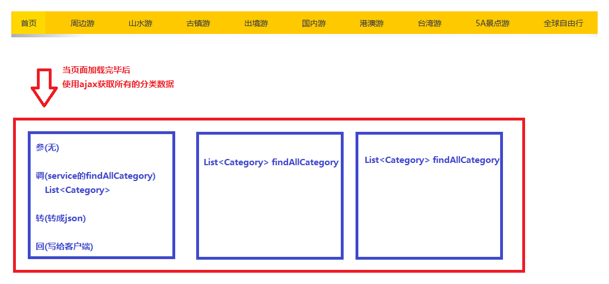
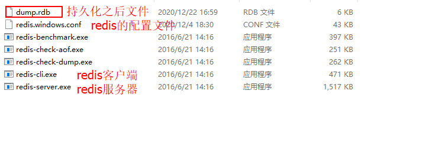
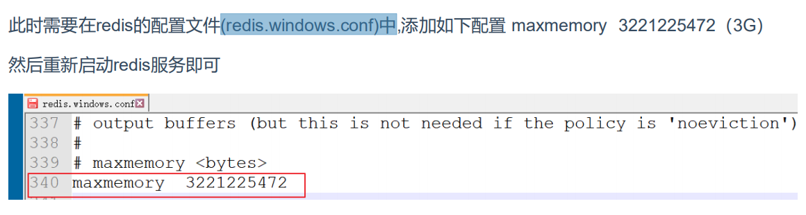
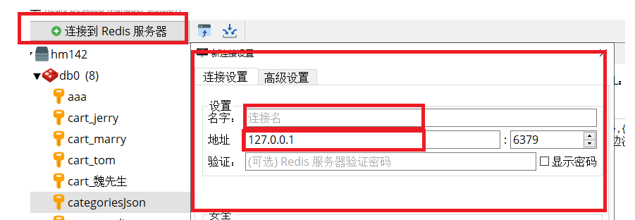
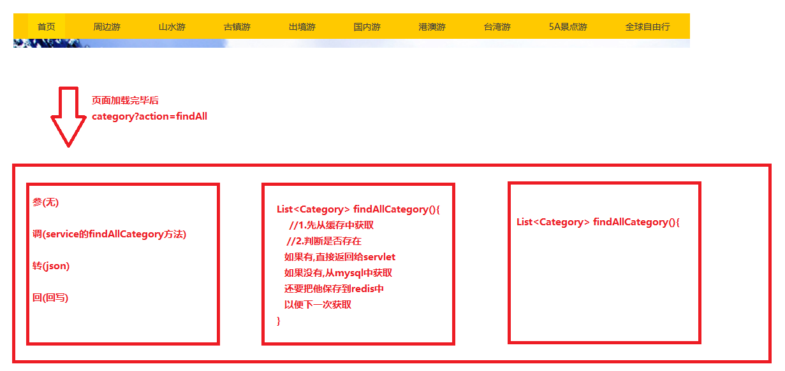

## 总结

```java
1. 能够完成导航条分类功能[重点,标准ajax 参调转回]
2. 能够理解NoSQL的概念
3. 能够说出reids的常用数据类型
    键都是字符串
    值有五种类型[string,hash,list,set,Zset|sortedset]
    掌握string相关的命令[重点]
    	set 键 值
 		get 键
    	del 键
    	setex 键 存活时间(秒) 值
    	ttl 键 
    	incr 键
4. 能够使用jedis操作reids[重点]
    1.创建JedisPoolConfig
    2.创建JedisPool
    3.获取Jedis
    4.调用Jedis的方法(方法名即是命令名)
    5.释放Jedis的close方法
    必须自己手动编写工具类(使用配置文件)
5. 能够完成导航条分类的reids优化[重点]
6. 能够完成短信验证码的redis优化[重点]
```


# 复习

```markdown
1.用户登录[用户名和密码登陆,手机号和验证码登陆]
2.用户退出
3.个人信息的回显和修改
4.收货人地址的回显和添加[课后修改和删除]
5.面向接口编程: 
	XxxService(接口) XxxServiceImpl(实现类)
	创建对象:
		XxxService service = new XxxServiceImpl();
	使用工厂设计模式:
    	XxxService service = (XxxService)BeanFactory.getBean("xxxService");
    思想: IOC[Spring思想,解耦]	
	
```

# 导航分类&redis

**今日目标**

```markdown
1. 导航分类功能
	tab_category
	
2. redis：缓存（内存）数据库
	nosql介绍
	redis介绍
	redis安装和使用
	redis客户端
	redis数据结构【重点】
	redis命令操作【重点】
	redis持久化【面试题】
		rdb
		aof
	redis应用场景

3. jedis：通过java语言操作redis数据库
	基本使用
	jedis连接池
	
	
4. 优化黑马旅游网
	导航分类功能【缓存】
	手机短信存储【redis精准控制数据销毁时间】
```


## ==一 导航分类==

### 1.1 需求介绍和分析



### 1.2 代码实现

- ##### header.jsp

```jsp
<div class="navitem">
    <ul class="nav" id="categoryUI">
        <li class="nav-active"><a href="index.jsp">首页</a></li>
    </ul>
    <script type="text/javascript">
        //页面加载事件
        $(function () {
            //发送ajax
            let url = "${pageContext.request.contextPath}/category";
            let param = "action=findAll";
            $.post(url,param,function (resp) {
                //resp是集合 fori forin forof
               for(c of resp){
                   //console.log(c.cname)
                   //$("#categoryUI").html($("#categoryUI").html()+"<li><a href='route_list.jsp'>"+c.cname+"</a></li>");
                   //前端第4天 jQuery的知识点
                   $("#categoryUI").append("<li><a href='route_list.jsp'>"+c.cname+"</a></li>")
               }
            },"json");
        });
    </script>
</div>
```

- ##### CategoryServlet

```java
package com.itheima.web.servlet;

import com.fasterxml.jackson.databind.ObjectMapper;
import com.itheima.pojo.Category;
import com.itheima.service.CategoryService;
import com.itheima.utils.BeanFactory;

import javax.servlet.ServletException;
import javax.servlet.annotation.WebServlet;
import javax.servlet.http.HttpServlet;
import javax.servlet.http.HttpServletRequest;
import javax.servlet.http.HttpServletResponse;
import java.io.IOException;
import java.util.List;

@WebServlet(name = "CategoryServlet",urlPatterns = "/category")
public class CategoryServlet extends BaseServlet {
   public void findAll(HttpServletRequest request, HttpServletResponse response) throws ServletException, IOException {
       // 参(无)
       // 调
       CategoryService service = (CategoryService)BeanFactory.getBean("categoryService");
       List<Category> categoryList = service.findAllCategory();
       // 转
       String json = new ObjectMapper().writeValueAsString(categoryList);
       // 回
       response.setContentType("application/json;charset=utf-8");
       response.getWriter().write(json);
    }
}

```

- ##### CategoryService

```java
package com.itheima.service.impl;

import com.itheima.dao.CategoryDao;
import com.itheima.pojo.Category;
import com.itheima.service.CategoryService;
import com.itheima.utils.MyBatisUtils;
import org.apache.ibatis.session.SqlSession;
import java.util.List;
public class CategoryServiceImpl implements CategoryService {
    /**
     * 查询所有分类
     * @return
     */
    public List<Category> findAllCategory() {
        SqlSession sqlSession = MyBatisUtils.openSession();
        CategoryDao categoryDao = sqlSession.getMapper(CategoryDao.class);
        List<Category> categoryList = categoryDao.findAllCategory();
        sqlSession.commit();
        sqlSession.close();
        return categoryList;
    }
}

```

- ##### CategoryDao

```xml
<mapper namespace="com.itheima.dao.CategoryDao">
    <select id="findAllCategory" resultType="category">
        select * from tab_category order by cid
    </select>
</mapper>
```

- ##### beans.xml

```xml
<bean id="categoryService" class="com.itheima.service.impl.CategoryServiceImpl"/>
```

### 1.3 json优化

- 思考

  ```java
  有没有发现每次ajax请求服务器有相同重复代码?怎么解决?在BaseServlet中抽取方法!
  ```

- ##### 抽取重复代码(注意,抽取到BaseServlet中)

  ```java
  @WebServlet(name = "BaseServlet")
  public class BaseServlet extends HttpServlet {
  
      /**
       * 将数据转成json并写给客户端的方法
       * @param data
       * @param response
       * @throws IOException
       */
      public void writeDataToClient(Object data, HttpServletResponse response) throws IOException {
          // 转
          String json = new ObjectMapper().writeValueAsString(data);
          // 回
          response.setContentType("application/json;charset=utf-8");
          response.getWriter().write(json);
      }
  }
  ```

## 二 NoSQL【了解】

### 1.1 NoSQL介绍

- ##### NoSQL是什么

  ```java
  非关系型的数据库(两个数据之间没有联系)
  ```

- ##### NoSQL的优点

  ```java
  1. 易扩展
  2. 高性能
  3. 高可用
  4. 灵活的数据模型
  ```

- ##### NoSQL的主流产品

  ```java
  a.键值对数据库(redis)
  b.列存储数据库(分布式)
  c.文档型数据库(大型文档)
  d.图形数据库(网络社交)    
  ```

## 三 Redis

### 3.1 Redis介绍

- ##### Redis是什么?

  ```java
  高性能键值对内存数据库!
  ```

- ##### Redis中五种值类型

  ```java
  首先记住,键是字符串(不需要双引号)
  值的类型有以下几种:
  	a.字符串类型string[重点]
      b.散列类型 hash
      c.列表类型 list
      d.集合类型 set 
      e.有序集合类型 sortedset    
  ```

- ##### Redis的应用场景

  ```java
  a.作为缓存(长期常用固定不怎么改变的数据)
  b.数据过期处理(精确到毫秒)   
  c.其他应用场景    
  ```

### 3.2 Redis安装和使用[window版]

- ##### 下载

  ```java
  Reids官网地址：http://redis.io
  中文网地址：https://www.redis.net.cn/
  GitHub地址：https://github.com/MSOpenTech/redis/tags
  ```

- ##### 安装

  ```java
  在我们资料中,软件文件夹里面: Redis-x64-3.0.503.rar
  解压即是安装,注意不要有中文不要有空格,常见位置!   
  ```

- ##### Redis的目录结构

  
  
- ##### Redis服务端的启动与关闭

  ```java
  启动redis服务器
  	a.双击redis-server.exe启动[端口6379]
      b.命令行启动: redis-server ./redis.windows.conf[其中./代表当前目录下]
  关闭redis服务器
      a.关闭DOS窗口即可
      b.去任务管理器中结束进程    
  ```

- ##### 经验值[内存不足可能导致无法启动服务端]

  ##### 如果内存不住，我们可以执行以下配置
  
  

### 3.3 Redis客户端工具安装和使用【了解】

- ##### Redis客户端的启动与关闭

  ```java
  启动:
  	双击redis-cli.exe即可
  关闭:
  	关闭DOS窗口即可
  ```

- ##### 图形化工具redis-desktop-manager安装和使用

  - 安装
  
    ```java
    双击redis-desktop-manager-0.9.3.817.exe,下一步按照即可(注意,不要有中文和空格)
    ```
  
  - 连接
  
    

### 3.4 Redis数据结构【重点】

- `Redis采用的是键值对存储，键的类型只能为字符串，值支持五种数据类型：`

- Redis的键

  ```java
  都是字符串,但是不需要双引号
  ```

- Redis的值[五种]

  ```java
  字符串string
  哈希类型 hash
  列表类型 list
  集合类型 set
  有序集合类型 sortedset(Zset)      
  ```

### 3.5 Redis命令操作【理解】

- ##### ==String 字符串【非常重点】==

  ```java
  介绍:
  	String是redis最简单的值类型,值允许最大长度512M
  常用命令:
  	set 键 值 [即是添加也是修改]
      del 键 [删除]
      get 键 [查询] 
      incr 键 [自增,把键对应值增加1,要求值必须是数字]   
      setex  键 过期时间(秒) 值 [添加键值对,并设置过期时间]
      ttl 键  [查看某个键的剩余时间]   
  ```

- ##### Hash 哈希表【理解】

  ```java
  介绍:
  	hash类型保持多个键值对(相当于Java中hashmap),最多键值对43亿个
  常用命令:
  	hset 键 字段名 字段值 
      hget 键 字段名
      hdel 键 字段名1 字段名2 ...    
  ```

- ##### List 有序列表【理解】

  ```java
  介绍:
  	list类型,相当于java中LinkedList,添加元素时可以选择从头部添加,也可以选择从尾部添加,一共可以添加43亿个元素
  常用命令:
  	lpush 键 值1 值2 ... [向头部加入元素]
      rpush 键 值1 值2 ... [向尾部加入元素]    
      lpop 键 [从头部删除一个元素] 
      rpop 键 [从尾部删除一个元素]    
  ```

- ##### Set 无序集合【理解】

  ```java
  介绍:
  	是一种无序的集合,相当于Java中的HashSet中,可以包含43个元素
  常用命令:
  	sadd 键 值1 值2 值3...[添加1个或者多个元素]
      smembers 键 [查看所有元素]
      srem 键 值1 值2 值3...[删除一个或者多个元素]    
  ```

- ##### sortedSet 有序集合【理解】

  ```java
  介绍:
  	sortedSet(Zset)是有序集合,sortedSet中每个元素都有一个分数值(权重值),redis自动使用分数的升序将元素进行排序!
  常用命令:
  	zadd 键 分数1 元素1 分数2 元素2 分数3 元素3 [添加szet的分数和元素]
      zscore 键 元素 [获取该元素对应的分数]
      zrem 键 元素 [删除该元素和他的分数]
      zrange 键 开始索引 结束索引 withscores [显示从开始索引到结束索引的所有元素,同时带上分数]
      zrevrange 键 开始索引 结束索引 withscores[将元素根据分数从大到小排序,然后和zrange一样]    
  ```

- ##### 通用命令 【理解】

  ```java
  介绍:
  	无论哪种值类型都可以使用的命令
  常用命令:
  	keys * [查看所有的键]
      del 键1 键2 [删除这个键值对,什么类型的值无所谓] 
      exists 键 [判断该键是否存在]
      type 键 [获取该键的值的类型]  
      ttl 键 [查看该键剩余的存活时间,-2 表示已经过期 -1 表示永久存在]  
      setex 键 过期时间[秒] 值 [设置键值对并规定过期时间]
      select 索引 [切换数据库0-15]
      dbsize [获取当前数据库中有多少个键]
      flushdb|flushall [清空当前数据库|清空所有数据库0-15全没了]    
  ```

### 3.6 Redis持久化【读一遍,理解,面试宝典上有,面试可能会问到】

​	Redis的数据都是存放在内存之中的，那么这样一旦出现宕机，势必会导致数据的丢失，这就需要持久化操作，也就是要将redis在内存中的数据写到硬盘上保存。

​	注意，redis虽然有持久化操作，但是其全部数据依旧都在内存中存在,也就是说硬盘上的只是为了安全和备份。

Redis提供了两种数据持久化的方式，分别是RDB和AOF。

```markdown
* RDB：默认开启的
	在程序运行期间的指定个时间节点将内存的数据拍摄快照，持久化到硬盘。
	
	设置持久化时间：修改 redis.windows.conf
		#   after 900 sec (15 min) if at least 1 key changed
		save 900 1
		#   after 300 sec (5 min) if at least 10 keys changed
		save 300 10
		#   after 60 sec if at least 10000 keys changed
		save 60 10000

* AOF：手动开启
	在程序运行期间根据日志记录访问监听redis的写（set）操作，持久化到硬盘。
	
	设置开启日志：修改 redis.windows.conf
		appendonly no -->  appendonly yes
		
		# appendfsync always	每次执行set操作，都会执行持久化
		# appendfsync everysec	每秒执行持久化
		# appendfsync no		根据操作系统控制持久化
		
* RDB和AOF可以同时开启

* 比对：
	RDB：通常使用缓存时使用，在服务器宕机时，丢失最后一次快照内容，还可以查询数据库重新缓存
	性能：高
	
	AOF：通常单独作为数据库使用，在服务器宕机时，我们已经将set的操作持久化到日志文件，重新启动时，可以通过日志还原。
	性能：低
```

## ==四 Jedis的基本使用[非常重点]==

### 4.1 Jedis的介绍

```java
jedis是使用java操作redis数据的技术!(好比jdbc,使用java操作sql数据库)
```

### 4.2 Jedis使用

- ##### 常用API

| 方法                  | 解释                                                         |
| --------------------- | ------------------------------------------------------------ |
| new Jedis(host, port) | 创建jedis对象，参数host是redis服务器地址，参数port是redis服务端口 |
| set(key,value)        | 设置字符串类型的数据                                         |
| get(key)              | 获得字符串类型的数据                                         |
| hset(key,field,value) | 设置哈希类型的数据                                           |
| hget(key,field)       | 获得哈希类型的数据                                           |
| lpush(key,values)     | 设置列表类型的数据                                           |
| lpop(key)             | 列表左面弹栈                                                 |
| rpop(key)             | 列表右面弹栈                                                 |
| del(key)              | 删除指定的key                                                |

- ##### 快速入门

```xml
导入jar坐标【已经完成】
<!--jedis-->
<dependency>
    <groupId>redis.clients</groupId>
    <artifactId>jedis</artifactId>
    <version>2.9.0</version>
</dependency>	
```

- JedisTest测试代码

```java
package com.itheima.jedis;

import org.junit.Test;
import redis.clients.jedis.Jedis;

public class TestJedisDemo {

    @Test
    public void demo(){
        //1.创建redis连接对象
        Jedis jedis = new Jedis("127.0.0.1", 6379);
        System.out.println(jedis);
        //2.调用jedis的方法
        jedis.set("abc","cba");
        //3.获取
        String value = jedis.get("abc");
        System.out.println(value);
    }
}
```

### ==4.2 JedisPool连接池[非常重点]==

​	jedis连接资源的创建与销毁是非常消耗性能的，所以我们不希望频繁的创建和销毁它.基于这样的需求,就有了==JedisPool技术==。

- ##### JedisPool的APl介绍

  ```java
  /**
   * 创建JedisPool使用默认配置
   */
  public JedisPool(String ip, int port);
  /**
   * 创建JedisPool使用默认配置
   */
  public JedisPool(JedisPoolConfig config,String ip, int port);
  ```

- ##### 快速入门

  ```java
  package com.itheima.jedis;
  
  import org.junit.Test;
  import redis.clients.jedis.Jedis;
  import redis.clients.jedis.JedisPool;
  import redis.clients.jedis.JedisPoolConfig;
  public class TestJedisDemo {
      @Test
      public void demo02(){
          //1.创建一个jedis连接池
          JedisPool jedisPool = new JedisPool("127.0.0.1",6379);
          //2.获取jedis对象
          Jedis jedis = jedisPool.getResource();
          //3.操作
          jedis.setex("aaa",10,"bbb");
          //4.释放资源
          jedis.close();
      }
      @Test
      public void demo03(){
          //1.创建jedisPool的配置对象
          JedisPoolConfig config = new JedisPoolConfig();
          config.setMaxTotal(30); //最大连接数
          config.setMaxIdle(10); //最大空闲数
          //2.根据配置对象创建jedisPool对象
          JedisPool jedisPool = new JedisPool(config,"127.0.0.1",6379);
          //3.获取连接
          Jedis jedis = jedisPool.getResource();
          //4.操作
          jedis.set("bbb","ccc");
          //5.释放资源
          jedis.close();
      }
  }
  ```

- ##### 抽取为JedisUitls工具类

- ##### JedisUitls

  ```java
  package com.itheima.utils;
  
  import redis.clients.jedis.Jedis;
  import redis.clients.jedis.JedisPool;
  import redis.clients.jedis.JedisPoolConfig;
  
  import java.io.IOException;
  import java.util.Properties;
  
  /**
   * Jedis的工具类
   */
  public class JedisUtils {
      private static JedisPoolConfig config = null;
      private static JedisPool jedisPool = null;
  
      private static String host = null;
      private static int port = 0;
      private static int maxTotal = 0;
      private static int maxIdel = 0;
  
      static {
          //0.读取jedis.properties
          Properties ps = new Properties();
          try {
              ps.load(JedisUtils.class.getClassLoader().getResourceAsStream("jedis.properties"));
          } catch (IOException e) {
              e.printStackTrace();
              throw new RuntimeException("加载jedis.properties失败..");
          }
  
          host = ps.getProperty("jedis.host");
          port = Integer.parseInt(ps.getProperty("jedis.port"));
          maxTotal = Integer.parseInt(ps.getProperty("jedis.maxTotal"));
          maxIdel = Integer.parseInt(ps.getProperty("jedis.maxIdle"));
  
          //1.创建配置文件对象
          config = new JedisPoolConfig();
          config.setMaxTotal(maxTotal); //最大连接数
          config.setMaxIdle(maxIdel); //最大空闲数
          //2.创建jedispool对象
          jedisPool = new JedisPool(config,host,port);
      }
  
      public static Jedis getJedis(){
  
          //3.获取连接
          Jedis jedis = jedisPool.getResource();
          //4.返回
          return jedis;
      }
  }
  ```

- ##### jedis.properties

  ```properties
  jedis.host=127.0.0.1
  jedis.port=6379
  jedis.maxTotal=30
  jedis.maxIdle=10
  ```

## ==五 优化：黑马旅游网==

### 5.1 导航条分类缓存

#### 5.1.1 需求介绍和分析



#### 5.1.2 代码实现

- 准备工作

```markdown
1. 在本地搭建redis服务器
2. 在项目中导入jar坐标
3. 导入JedisUtils工具类
```

- ##### 改造CategoryService

```java
package com.itheima.service.impl;

import com.fasterxml.jackson.core.JsonProcessingException;
import com.fasterxml.jackson.databind.ObjectMapper;
import com.itheima.dao.CategoryDao;
import com.itheima.pojo.Category;
import com.itheima.service.CategoryService;
import com.itheima.utils.JedisUtils;
import com.itheima.utils.MyBatisUtils;
import org.apache.ibatis.session.SqlSession;
import redis.clients.jedis.Jedis;

import java.io.IOException;
import java.util.List;

public class CategoryServiceImpl implements CategoryService {
    /**
     * 查询所有分类
     * @return
     */
    public List<Category> findAllCategory() throws IOException {
        ObjectMapper mapper = new ObjectMapper();
        //1.直接从redis中获取
        Jedis jedis = JedisUtils.getJedis();
        String list = jedis.get("category_list");
        if (list != null){ //如果list有,说明缓存中已经存在
            System.out.println("从redis获取...");
            List<Category> categoryList = mapper.readValue(list, List.class);
            jedis.close();
            return categoryList;
        }else { //说明,缓存还没有
            System.out.println("从mysql获取...");
            SqlSession sqlSession = MyBatisUtils.openSession();
            CategoryDao categoryDao = sqlSession.getMapper(CategoryDao.class);
            List<Category> categoryList = categoryDao.findAllCategory();
            //保存到缓存中
            String json = mapper.writeValueAsString(categoryList);
            jedis.set("category_list",json);
            jedis.close();
            sqlSession.commit();
            sqlSession.close();
            return categoryList;
        }
    }
}
```

### 5.2 短信验证码存活时间5分钟

#### 5.2.1 需求介绍分析

 

#### 5.2.2 代码实现

- ##### 发送短信

  ```java
  /**
    * 给用户的手机号发送验证码短信
    */
  public void sendSms(HttpServletRequest request, HttpServletResponse response) throws IOException, ClientException {
      // 参
      String telephone = request.getParameter("telephone");
  
      //使用工具类生成验证码
      String smsCode = RandomStringUtils.randomNumeric(6);
      System.out.println("验证码:"+smsCode);
      //把验证码添加到session中
      //        request.getSession().setAttribute("smsCode_"+telephone,smsCode);
      //把验证码保存到redis数据库中
      Jedis jedis = JedisUtils.getJedis();
      jedis.setex("smsCode_"+telephone,5*60,smsCode);
      jedis.close();
      // 调
      UserService service = (UserService)BeanFactory.getBean("userService");
      ResultInfo resultInfo = service.sendSms(telephone,smsCode);
      // 转
      ObjectMapper mapper = new ObjectMapper();
      String json = mapper.writeValueAsString(resultInfo);
      // 回
      response.setContentType("application/json;charset=UTF-8");
      response.getWriter().write(json);
  }
  ```

- ##### 用户注册

  ```java
  /**
    * 注册功能
    */
  public void register(HttpServletRequest request, HttpServletResponse response) throws ServletException, IOException {
      // 获取验证码进行校验
      String smsCodeUser = request.getParameter("smsCode");
      String telephone = request.getParameter("telephone");
      //从session中获取
      //        Object smsCodeSystem = request.getSession().getAttribute("smsCode_" + telephone);
      //从redis中获取
      Jedis jedis = JedisUtils.getJedis();
      String smsCodeSystem = jedis.get("smsCode_" + telephone);
      jedis.close();
      if (!smsCodeUser.equals(smsCodeSystem)){
          request.setAttribute("rs",new ResultInfo(false,"验证码不对"));
          request.getRequestDispatcher("/register.jsp").forward(request,response);
          return;
      }
  
      // 参
      Map<String, String[]> map = request.getParameterMap();
      User user = new User();
      try {
          BeanUtils.populate(user,map);
      } catch (Exception e) {
          e.printStackTrace();
      }
      // 调
      UserService service = (UserService)BeanFactory.getBean("userService");
      ResultInfo result = service.register(user);
      // 存
      request.setAttribute("rs",result);
      // 转
      if (result.getSuccess()){
          //清空验证码
          //            request.getSession().removeAttribute("smsCode_"+telephone);
          //清空验证码
          Jedis jedis1 = JedisUtils.getJedis();
          jedis1.del("smsCode_"+telephone);
          jedis1.close();
          request.getRequestDispatcher("/register_ok.jsp").forward(request,response);
      }else{
          request.getRequestDispatcher("/register.jsp").forward(request,response);
      }
  }
  ```

- ##### 短信登录

  ```java
  /**
    * 手机号验证码登陆
  */
  public void smsLogin(HttpServletRequest request, HttpServletResponse response) throws IOException, ClientException {
      ResultInfo resultInfo = null;
      // 参
      String telephone = request.getParameter("telephone");
      String smsCode = request.getParameter("smsCode");
  
      // 调
      //查询用户
      UserService service = (UserService)BeanFactory.getBean("userService");
      User user = service.findUserByTelephone(telephone);
      if (user == null){
          resultInfo = new ResultInfo(false,"手机号未注册!");
          // 转
          ObjectMapper mapper = new ObjectMapper();
          String json = mapper.writeValueAsString(resultInfo);
          // 回
          response.setContentType("application/json;charset=UTF-8");
          response.getWriter().write(json);
          return;
      }
      //比较验证码
      //从session中获取
      //        String smsCodeSystem = (String) request.getSession().getAttribute("smsCode_" + telephone);
      //从redis中获取
      Jedis jedis = JedisUtils.getJedis();
      String smsCodeSystem = jedis.get("smsCode_" + telephone);
      jedis.close();
      if (!smsCode.equals(smsCodeSystem)){
          resultInfo = new ResultInfo(false,"验证码错误!");
          // 转
          ObjectMapper mapper = new ObjectMapper();
          String json = mapper.writeValueAsString(resultInfo);
          // 回
          response.setContentType("application/json;charset=UTF-8");
          response.getWriter().write(json);
          return;
      }
      //如果以上都OK
      resultInfo = new ResultInfo(true,"登陆成功");
      request.getSession().setAttribute("user",user);
      //清空验证码
      //        request.getSession().removeAttribute("smsCode_"+telephone);
      //清空验证码
      Jedis jedis1 = JedisUtils.getJedis();
      jedis1.del("smsCode_"+telephone);
      jedis1.close();
      // 转
      // 回
      writeDataToClient(resultInfo,response);
  
  }
  ```
  
  