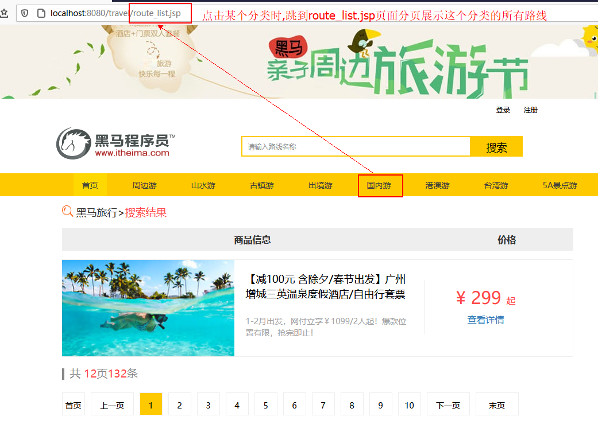
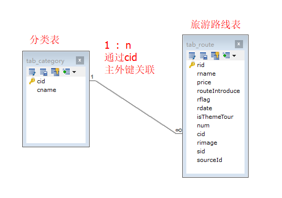
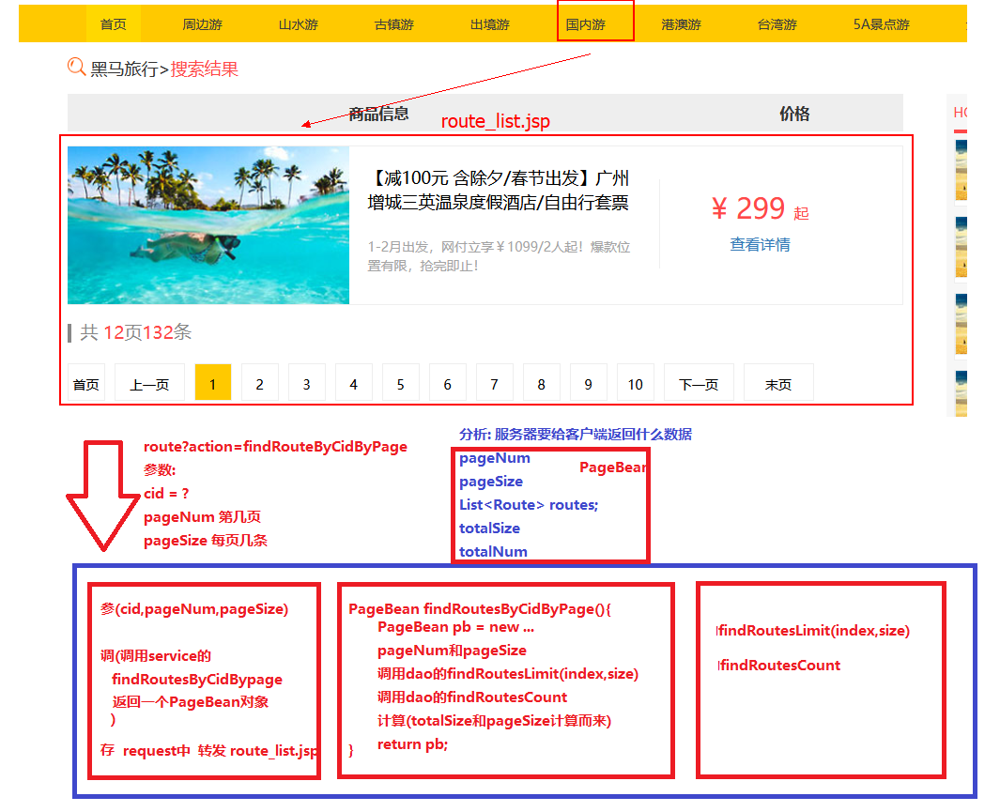
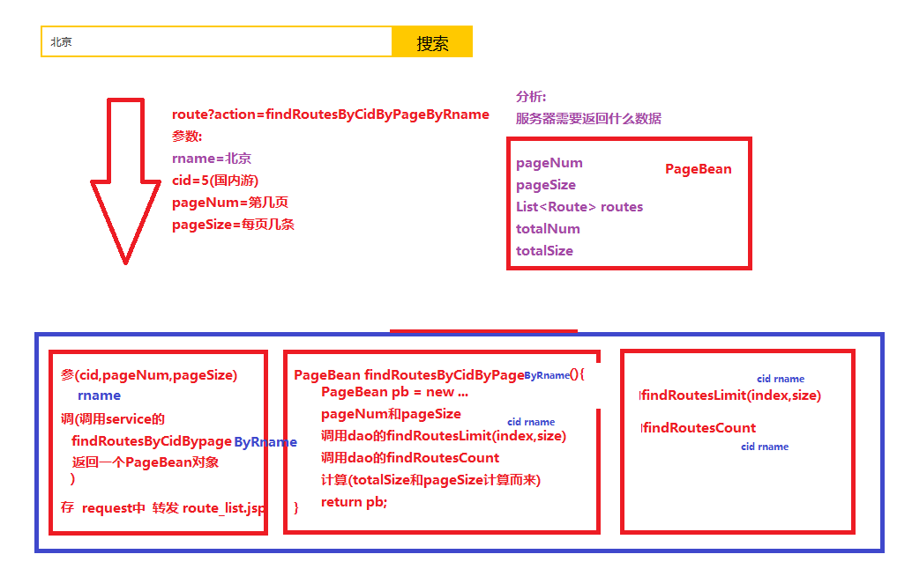
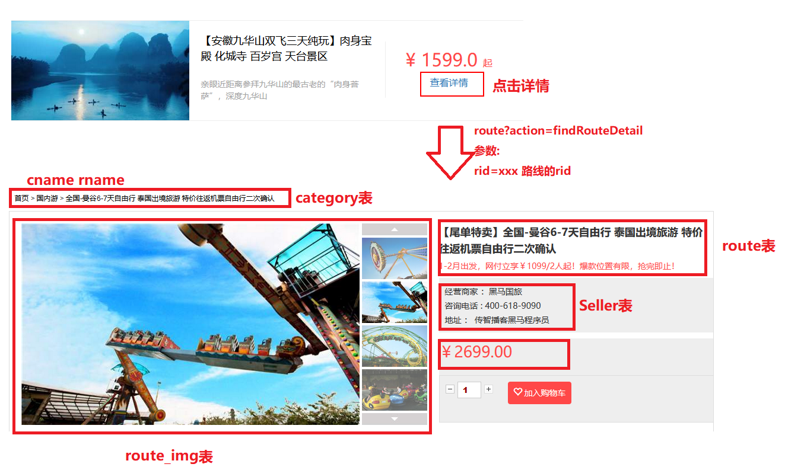
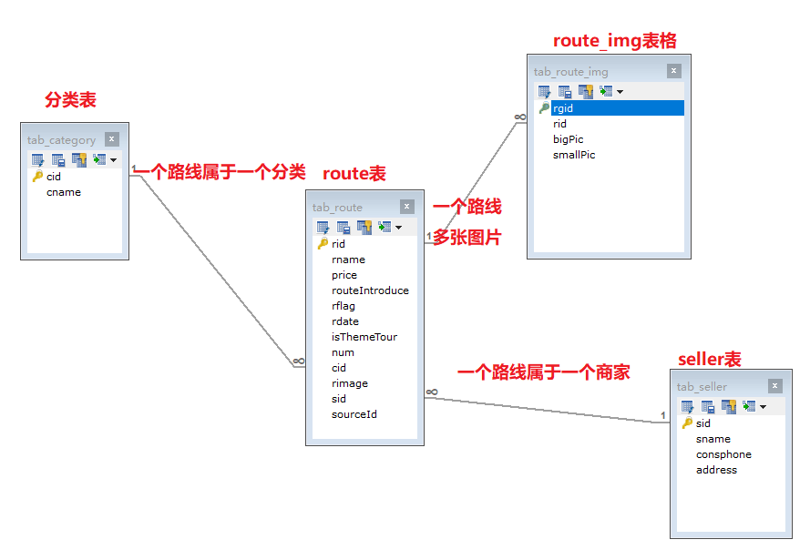
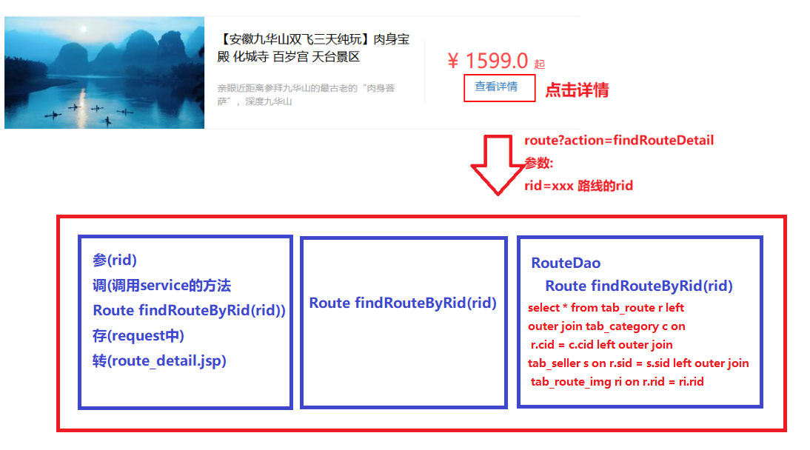
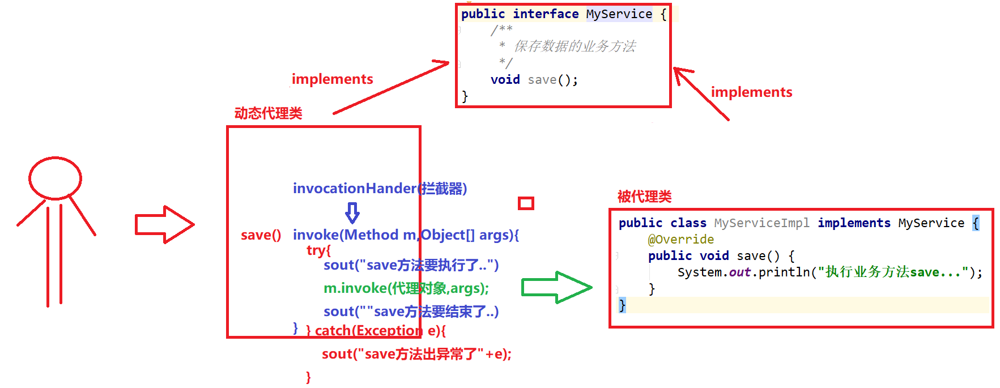

## 总结

```java
1. 能够完成旅游线路分页功能[重点]
2. 能够完成搜索旅游线路分页功能[重点]
3. 能够完成旅游线路详情展示功能[重点] 
4. 能够完成日志记录功能[理解,框架Spring中AOP底层使用就是动态代理]
```


# 复习

```markdown
1.导航旅游分类列表
	页面: head.jsp --> 页面加载事件 ---> ajax----> category?action=findAll
	服务器: 
		web: 参调(findAllCategory)转(json)回(回给客户端)
		service: findAllCategory
		dao: findAllCategory(CategoryDao.xml)
2.redis
	a.Jedis: Jedis jedis = new Jedis("ip",端口号);
	b.JedisPool: 
		JedisPool jedis = new JedisPool("ip",端口号);
		JedisPoolConfig config = new JedisPoolConfig();
		config.setMaxTotal(30);
		config.setmaxIdle(10);
		JedisPool jedispool = new JedisPool(config,"ip",端口号);
	c.从JedisPool中获取jedis
		Jedis jedis = jedispool.getResource();
    d.调用方法
    	jedis.get("键")/set("键","值");
    e.手动编写
    	JedisUtils.getJedis();
3.优化
	导航栏分类(第一次查询分类从mysql中,第二次查询分类中redis中)
	发送短信验证码(验证码保存到缓存中,设置过期时间)
	手机验证码登陆或者注册(从缓存中获取验证码,验证通过从缓存中清除验证码)
	
```

# 线路模块&日志记录

**今日目标**

```markdown
1. 旅游线路分页查询
	tab_category   -(一对多)- tab_route
		
2. 旅游线路条件搜索分页查询
	根据线路名称模糊查询--- 动态sql语句
	
3. 旅游线路详情展示（四张表）
	tab_route（线路表）
		tab_route_img（景点图册）
		tab_category（分类）
		tab_seller（商家）
	3.1 分别单表查询组装
	3.2 联合查询
	3.3 嵌套查询
	
-------------------------------------
4. 日志记录功能
	动态代理
```

## ==一 旅游线路分类分页功能==

### 1.1 需求介绍



### 1.2 需求分析

- ##### 表关系



- ##### 分页整体流程图



### 1.3 代码实现

- ##### PageBean

  ```java
  package com.itheima.pojo;
  
  import lombok.AllArgsConstructor;
  import lombok.Data;
  import lombok.NoArgsConstructor;
  
  import java.util.List;
  @Data
  @AllArgsConstructor
  @NoArgsConstructor
  public class PageBean<T> {
      private Integer pageNum;
      private Integer pageSize;
      private List<T> data;
      private Integer totalNum;
      private Integer totalSize;
  }
  ```

- ##### header.jsp

  ```jsp
  <ul class="nav" id="categoryUI">
      <li class="nav-active"><a href="index.jsp">首页</a></li>
  </ul>
  <script type="text/javascript">
      //页面加载事件
      $(function () {
          //发送ajax
          let url = "${pageContext.request.contextPath}/category";
          let param = "action=findAll";
          $.post(url,param,function (resp) {
              //resp是集合 fori forin forof
              for(c of resp){
                  //console.log(c.cname)
                  //$("#categoryUI").html($("#categoryUI").html()+"<li><a href='route_list.jsp'>"+c.cname+"</a></li>");
                  //前端第4天 jQuery的知识点
                  $("#categoryUI").append("<li><a href='${pageContext.request.contextPath}/route?action=findRoutesByCidByPage&cid="+c.cid+"&pageNum=1&pageSize=5'>"+c.cname+"</a></li>")
              }
          },"json");
      });
  </script>
  ```

- ##### RouteServlet

  ```java
  package com.itheima.web.servlet;
  
  import com.itheima.pojo.PageBean;
  import com.itheima.pojo.Route;
  import com.itheima.service.RouteService;
  import com.itheima.utils.BeanFactory;
  
  import javax.servlet.ServletException;
  import javax.servlet.annotation.WebServlet;
  import javax.servlet.http.HttpServletRequest;
  import javax.servlet.http.HttpServletResponse;
  import java.io.IOException;
  
  @WebServlet(name = "RouteServlet",urlPatterns = "/route")
  public class RouteServlet extends BaseServlet{
      /**
       * 旅游路线分类的分页查询
       * @param request
       * @param response
       */
      public void findRoutesByCidByPage(HttpServletRequest request, HttpServletResponse response) throws ServletException, IOException {
          // 参
          String cid = request.getParameter("cid");
          String pageNumStr = request.getParameter("pageNum");
          String pageSizeStr = request.getParameter("pageSize");
          //合法性判断
          if (pageNumStr == null || pageNumStr.equals("")) {
              pageNumStr = "1";
          }
          if (pageSizeStr == null || pageSizeStr.equals("")) {
              pageSizeStr = "5";
          }
          //转成int
          int pageNum = Integer.parseInt(pageNumStr);
          int pageSize = Integer.parseInt(pageSizeStr);
  
          // 调
          RouteService service = (RouteService)BeanFactory.getBean("routeService");
          PageBean<Route> pb = service.findRoutesByCidByPage(cid,pageNum,pageSize);
          // 存
          request.setAttribute("pb",pb);
          request.setAttribute("cid",cid);
          System.out.println(pb);
          // 转
          request.getRequestDispatcher("/route_list.jsp").forward(request,response);
      }
  }
  
  ```

- ##### RouteService

  ```java
  package com.itheima.service.impl;
  
  import com.itheima.dao.RouteDao;
  import com.itheima.pojo.PageBean;
  import com.itheima.pojo.Route;
  import com.itheima.service.RouteService;
  import com.itheima.utils.MyBatisUtils;
  import org.apache.ibatis.session.SqlSession;
  
  import java.util.List;
  
  public class RouteServiceImpl implements RouteService {
      /**
       * 旅游路线分类的分页查询
       * @param cid
       * @param pageNum
       * @param pageSize
       * @return
       */
      public PageBean<Route> findRoutesByCidByPage(String cid, int pageNum, int pageSize) {
          //1.创建一个
          PageBean<Route> pb = new PageBean<Route>();
          //2.pageNum 和 pageSize
          pb.setPageNum(pageNum);
          pb.setPageSize(pageSize);
          //3.查询Dao
          SqlSession sqlSession = MyBatisUtils.openSession();
          RouteDao routeDao = sqlSession.getMapper(RouteDao.class);
          List<Route> routes = routeDao.findRoutesByCidLimit(cid,(pageNum - 1) * pageSize,pageSize);
          pb.setData(routes);
          //4.查询Dao总记录数
          int totalSize = routeDao.findRoutesCountByCid(cid);
          pb.setTotalSize(totalSize);
          //5.总页数
          int totalNum = (totalSize % pageSize == 0) ? (totalSize / pageSize) : (totalSize / pageSize +1);
          pb.setTotalNum(totalNum);
          //6.释放资源
          sqlSession.commit();
          sqlSession.close();
          //7.返回
          return pb;
      }
  }
  ```

- ##### RouteDao

  ```java
  package com.itheima.dao;
  
  import com.itheima.pojo.Route;
  import org.apache.ibatis.annotations.Param;
  
  import java.util.List;
  
  public interface RouteDao {
      /**
       * 旅游路线分类分页查询
       * @param cid
       * @param i
       * @param pageSize
       * @return
       */
      List<Route> findRoutesByCidLimit(@Param("cid") String cid,@Param("index") int i,@Param("size") int pageSize);
  
      /**
       * 查询旅游路线某分类的总记录数
       * @param cid
       * @return
       */
      int findRoutesCountByCid(String cid);
  }
  
  ```

- ##### RouteDao.xml

  ```xml
  <?xml version="1.0" encoding="UTF-8" ?>
  <!DOCTYPE mapper PUBLIC "-//mybatis.org//DTD Mapper 3.0//EN" "http://mybatis.org/dtd/mybatis-3-mapper.dtd">
  <mapper namespace="com.itheima.dao.RouteDao">
  
     <select id="findRoutesByCidLimit" resultType="route">
         select * from tab_route where cid = #{cid} limit #{index},#{size}
     </select>
  
      <select id="findRoutesCountByCid" parameterType="string" resultType="int">
          select count(rid) from tab_route where cid = #{cid}
      </select>
  </mapper>
  ```

- ##### beans.xml

  ```xml
  <?xml version="1.0" encoding="UTF-8" ?>
  <beans>
      <bean id="userService" class="com.itheima.service.impl.UserServiceImpl"/>
      <bean id="addressService" class="com.itheima.service.impl.AddressServiceImpl"/>
      <bean id="categoryService" class="com.itheima.service.impl.CategoryServiceImpl"/>
      <bean id="routeService" class="com.itheima.service.impl.RouteServiceImpl"/>
  </beans>
  ```

- ##### route_list.jsp

  ```jsp
  <div class="xinxi clearfix">
      <%--线路列表 start--%>
      <div class="left">
          <div class="header">
              <span>商品信息</span>
              <span class="jg">价格</span>
          </div>
          <ul>
              <c:forEach items="${pb.data}" var="r">
                  <li>
                      <div class="img"></div>
                      <div class="text1">
                          <p>${r.rname}</p>
                          <br/>
                          <p>${r.routeIntroduce}</p>
                      </div>
                      <div class="price">
                          <p class="price_num">
                              <span>&yen;</span>
                              <span>${r.price}</span>
                              <span>起</span>
                          </p>
                          <p><a href="route_detail.jsp">查看详情</a></p>
                      </div>
                  </li>
              </c:forEach>
          </ul>
          <div class="page_num_inf">
              <i></i> 共
              <span>${pb.totalNum}</span>页<span>${pb.totalSize}</span>条
          </div>
          <div class="pageNum">
              <ul>
                  <li><a href="${pageContext.request.contextPath}/route?action=findRoutesByCidByPage&cid=${cid}&pageNum=1&pageSize=${pb.pageSize}">首页</a></li>
  
                  <c:if test="${pb.pageNum > 1}">
                      <li class="threeword"><a href="${pageContext.request.contextPath}/route?action=findRoutesByCidByPage&cid=${cid}&pageNum=${pb.pageNum - 1}&pageSize=${pb.pageSize}">上一页</a></li>
                  </c:if>
                  <c:forEach begin="1" end="${pb.totalNum}" var="i">
                      <li><a href="${pageContext.request.contextPath}/route?action=findRoutesByCidByPage&cid=${cid}&pageNum=${i}&pageSize=${pb.pageSize}">${i}</a></li>
                  </c:forEach>
                  <c:if test="${pb.pageNum < pb.totalNum}">
                      <li class="threeword"><a href="${pageContext.request.contextPath}/route?action=findRoutesByCidByPage&cid=${cid}&pageNum=${pb.pageNum + 1}&pageSize=${pb.pageSize}">下一页</a></li>
                  </c:if>
                  <li class="threeword"><a href="${pageContext.request.contextPath}/route?action=findRoutesByCidByPage&cid=${cid}&pageNum=${pb.totalNum}&pageSize=${pb.pageSize}">末页</a></li>
              </ul>
          </div>
      </div>
  ```

### 1.4 百度分页栏[前五后四]

#### 1.4.1 需求分析


#### 1.4.2 代码实现

- ##### PageBean

```java
package com.itheima.pojo;

import lombok.AllArgsConstructor;
import lombok.Data;
import lombok.NoArgsConstructor;

import java.util.List;
@Data
@AllArgsConstructor
@NoArgsConstructor
public class PageBean<T> {
    private Integer pageNum;
    private Integer pageSize;
    private List<T> data;
    private Integer totalNum;
    private Integer totalSize;
    //前五后四需要的数据
    private Integer start; //需要从哪一页开始
    private Integer end; //需要到哪一页结束

    //start和end是计算出来的
    //和以上的哪个数据有关
    //pageNum totalNum

    //重写get方法,再获取start或者end时,我们先计算一下
    public Integer getStart() {
        calculate();
        return start;
    }
    //重写get方法,再获取start或者end时,我们先计算一下
    public Integer getEnd() {
        calculate();
        return end;
    }

    //计算start和end
    public void calculate(){
        //1.总页数 <= 10
        if (totalNum <= 10) {
            start = 1;
            end = totalNum;
        }else{
            //2.总页数大于10
            start = pageNum - 5;
            end = pageNum + 4;
            //3.判断 start和end是否超出范围
            if (start <= 0) {
                start = 1;
                end = start + 9;
            }
            if (end > totalNum){
                end = totalNum;
                start = end - 9;
            }
        }
    }
}
```

- ##### route_list.jsp

```jsp
<c:forEach begin="${pb.start}" end="${pb.end}" var="i">
    <li><a href="${pageContext.request.contextPath}/route?action=findRoutesByCidByPage&cid=${cid}&pageNum=${i}&pageSize=${pb.pageSize}">${i}</a></li>
</c:forEach>
```

## ==二 搜索旅游线路分页功能==

### 2.1 需求介绍和分析



### 2.3 代码实现

- ##### header.jsp

```jsp
<div class="search">
    <input id="rname" name="rname" type="text" placeholder="请输入路线名称" class="search_input" value="${rname}"
           autocomplete="off">
    <a href="javascript:void(0);" onclick="searchClick()" class="search-button">搜索</a>
    <script type="text/javascript">
        function searchClick() {
            //1.获取搜索关键字
            let rname = $("#rname").val();
            //2.发送
            location.href = "${pageContext.request.contextPath}/route?action=findRoutesByCidByRnameByPage&cid=${cid}&rname="+rname+"&pageNum=1&pageSize=5";
        }
    </script>
</div>
```

- ##### RouteServlet

```java
/**
  * 旅游路线分类的分页条件查询
  */
public void findRoutesByCidByRnameByPage(HttpServletRequest request, HttpServletResponse response) throws ServletException, IOException {
    // 参
    String cid = request.getParameter("cid");
    String rname = request.getParameter("rname");
    String pageNumStr = request.getParameter("pageNum");
    String pageSizeStr = request.getParameter("pageSize");
    //合法性判断
    if (pageNumStr == null || pageNumStr.equals("")) {
        pageNumStr = "1";
    }
    if (pageSizeStr == null || pageSizeStr.equals("")) {
        pageSizeStr = "5";
    }
    //转成int
    int pageNum = Integer.parseInt(pageNumStr);
    int pageSize = Integer.parseInt(pageSizeStr);
    // 调
    RouteService service = (RouteService) BeanFactory.getBean("routeService");
    PageBean<Route> pb = service.findRoutesByCidByRnameByPage(cid, rname, pageNum, pageSize);
    // 存
    request.setAttribute("pb", pb);
    request.setAttribute("cid", cid);
    request.setAttribute("rname", rname);
    System.out.println(pb);
    // 转
    request.getRequestDispatcher("/route_list_rname.jsp").forward(request, response);
}
```

- ##### RouteService

```java
/**
  * 旅游路线分类的分页条件查询
  */
public PageBean<Route> findRoutesByCidByRnameByPage(String cid, String rname, int pageNum, int pageSize) {
    //1.创建一个
    PageBean<Route> pb = new PageBean<Route>();
    //2.pageNum 和 pageSize
    pb.setPageNum(pageNum);
    pb.setPageSize(pageSize);
    //3.查询Dao
    SqlSession sqlSession = MyBatisUtils.openSession();
    RouteDao routeDao = sqlSession.getMapper(RouteDao.class);
    List<Route> routes = routeDao.findRoutesByCidByRnameLimit(cid,rname,(pageNum - 1) * pageSize,pageSize);
    pb.setData(routes);
    //4.查询Dao总记录数
    int totalSize = routeDao.findRoutesCountByCidByRname(cid,rname);
    pb.setTotalSize(totalSize);
    //5.总页数
    int totalNum = (totalSize % pageSize == 0) ? (totalSize / pageSize) : (totalSize / pageSize +1);
    pb.setTotalNum(totalNum);
    //6.释放资源
    sqlSession.commit();
    sqlSession.close();
    //7.返回
    return pb;
}
```

- ##### RouteDao

```java
package com.itheima.dao;

import com.itheima.pojo.Route;
import org.apache.ibatis.annotations.Param;

import java.util.List;

public interface RouteDao {
    /**
     * 旅游路线分类分页条件查询
     * @param cid
     * @param i
     * @param pageSize
     * @return
     */
    List<Route> findRoutesByCidByRnameLimit(@Param("cid") String cid,@Param("rname") String rname,@Param("index") int i,@Param("size") int pageSize);

    /**
     * 查询旅游路线某分类条件查询的总记录数
     * @param cid
     * @return
     */
    int findRoutesCountByCidByRname(@Param("cid") String cid,@Param("rname") String rname);
}

```

- ##### RouteDao.xml

```xml
<?xml version="1.0" encoding="UTF-8" ?>
<!DOCTYPE mapper PUBLIC "-//mybatis.org//DTD Mapper 3.0//EN" "http://mybatis.org/dtd/mybatis-3-mapper.dtd">
<mapper namespace="com.itheima.dao.RouteDao">
	<select id="findRoutesByCidByRnameLimit" resultType="route">
        select * from tab_route
        <where>
            <if test="cid != null and cid != ''">
              and cid = #{cid}
            </if>
            <if test="rname != null and rname != ''">
                and rname like concat(concat("%",#{rname}),"%")
            </if>
        </where>
        limit #{index},#{size}
    </select>

    <select id="findRoutesCountByCidByRname" resultType="int">
        select count(rid) from tab_route
        <where>
            <if test="cid != null and cid != ''">
                and cid = #{cid}
            </if>
            <if test="rname != null and rname != ''">
                and rname like concat(concat("%",#{rname}),"%")
            </if>
        </where>
    </select>
</mapper>
```

- ##### route_list_rname.jsp

```jsp
<div class="pageNum">
    <ul>
        <li><a href="${pageContext.request.contextPath}/route?action=findRoutesByCidByRnameByPage&cid=${cid}&rname=${rname}&pageNum=1&pageSize=${pb.pageSize}">首页</a></li>

        <c:if test="${pb.pageNum > 1}">
            <li class="threeword"><a href="${pageContext.request.contextPath}/route?action=findRoutesByCidByRnameByPage&cid=${cid}&rname=${rname}&pageNum=${pb.pageNum - 1}&pageSize=${pb.pageSize}">上一页</a></li>
        </c:if>
        <c:forEach begin="${pb.start}" end="${pb.end}" var="i">
            <li><a href="${pageContext.request.contextPath}/route?action=findRoutesByCidByRnameByPage&cid=${cid}&rname=${rname}&pageNum=${i}&pageSize=${pb.pageSize}">${i}</a></li>
        </c:forEach>
        <c:if test="${pb.pageNum < pb.totalNum}">
            <li class="threeword"><a href="${pageContext.request.contextPath}/route?action=findRoutesByCidByRnameByPage&cid=${cid}&rname=${rname}&pageNum=${pb.pageNum + 1}&pageSize=${pb.pageSize}">下一页</a></li>
        </c:if>
        <li class="threeword"><a href="${pageContext.request.contextPath}/route?action=findRoutesByCidByRnameByPage&cid=${cid}&rname=${rname}&pageNum=${pb.totalNum}&pageSize=${pb.pageSize}">末页</a></li>
    </ul>
</div>
```

## ==三 旅游线路详情展示功能==

### 3.1 需求介绍



### 3.2 需求分析

- ##### 表关系

  

- ##### 实体类

  ```java
  /**
   * 旅游线路商品实体类
   */
  @Data
  public class Route implements Serializable {
      private int rid;//线路id，必输
      private String rname;//线路名称，必输
      private double price;//价格，必输
      private String routeIntroduce;//线路介绍
      private String rflag;   //是否上架，必输，0代表没有上架，1代表是上架
      private String rdate;   //上架时间
      private String isThemeTour;//是否主题旅游，必输，0代表不是，1代表是
      private int num;//收藏数量
      private int cid;//所属分类，必输
      private String rimage;//缩略图
      private int sid;//所属商家
      private String sourceId;//抓取数据的来源id
  	//路线表和分类表
      private Category category;//所属分类
      //路线表和商家表
      private Seller seller;//所属商家
      //路线表和图册表
      private List<RouteImg> routeImgList;//商品详情图片列表
  }
  ```

- ##### 流程图

  

### 3.3 代码实现

- 思考:多表关联查询我们有几种方式?

  ```java
  a.联表查询
  b.嵌套查询    
  ```

- ##### route_list.jsp

  ```jsp
  <c:forEach items="${pb.data}" var="r">
      <li>
          <div class="img"></div>
          <div class="text1">
              <p>${r.rname}</p>
              <br/>
              <p>${r.routeIntroduce}</p>
          </div>
          <div class="price">
              <p class="price_num">
                  <span>&yen;</span>
                  <span>${r.price}</span>
                  <span>起</span>
              </p>
              <p><a href="${pageContext.request.contextPath}/route?action=findRouteDetail&rid=${r.rid}">查看详情</a></p>
          </div>
      </li>
  </c:forEach>
  ```

- ##### RouteServlet

  ```java
  /**
    * 查看路线详情
    */
  public void findRouteDetail(HttpServletRequest request, HttpServletResponse response) throws ServletException, IOException {
      // 参(rid)
      String rid = request.getParameter("rid");
      // 调
      RouteService service = (RouteService)BeanFactory.getBean("routeService");
      Route route = service.findRouteDetailByRid(rid);
      // 存
      request.setAttribute("route",route);
      System.out.println(route);
      // 转
      request.getRequestDispatcher("/route_detail.jsp").forward(request,response);
  }
  
  ```

- ##### RouteService

  ```java
  /**
    * 根据rid查询某个路线详情
    */
  public Route findRouteDetailByRid(String rid) {
      SqlSession sqlSession = MyBatisUtils.openSession();
      RouteDao routeDao = sqlSession.getMapper(RouteDao.class);
      Route route = routeDao.findRouteDetailByRid(rid);
      sqlSession.commit();
      sqlSession.close();
      return route;
  }
  ```

- ##### RouteDao

  ```java
  package com.itheima.dao;
  
  import com.itheima.pojo.Route;
  import org.apache.ibatis.annotations.Param;
  
  import java.util.List;
  
  public interface RouteDao {
      /**
       * 根据rid查询某个路线详情
       * @param rid
       * @return
       */
      Route findRouteDetailByRid(String rid);
  }
  
  ```

- ##### RouteDao.xml

  ```xml
  <!--1.对Route表映射-->
  <!--2.对Category表映射-->
  <!--3.对Seller表映射-->
  <!--4.对List<RouteImg>表映射-->
  <resultMap id="RouteMap" type="route">
      <id property="rid" column="rid"/>
      <result property="rname" column="rname"/>
      <result property="price" column="price"/>
      <result property="routeIntroduce" column="routeIntroduce"/>
      <result property="rflag" column="rflag"/>
      <result property="rdate" column="rdate"/>
      <result property="isThemeTour" column="isThemeTour"/>
      <result property="num" column="num"/>
      <result property="cid" column="cid"/>
      <result property="rimage" column="rimage"/>
      <result property="sid" column="sid"/>
      <result property="sourceId" column="sourceId"/>
      <association property="category" javaType="category">
          <id property="cid" column="cid"/>
          <result property="cname" column="cname"/>
      </association>
      <association property="seller" javaType="seller">
          <id property="sid" column="sid"/>
          <result property="sname" column="sname"/>
          <result property="consphone" column="consphone"/>
          <result property="address" column="address"/>
      </association>
      <collection property="routeImgList" ofType="routeImg">
          <id property="rgid" column="rgid"/>
          <result property="rid" column="rid"/>
          <result property="bigPic" column="bigPic"/>
          <result property="smallPic" column="smallPic"/>
      </collection>
  </resultMap>
  
  <select id="findRouteDetailByRid" parameterType="string" resultMap="RouteMap">
      select * from
      tab_route r left outer join tab_category c on r.cid = c.cid
      left outer join tab_seller s on r.sid = s.sid
      left outer join tab_route_img ri on r.rid = ri.rid
      where r.rid = #{rid}
  </select>
  ```
  
- ##### route_detail.jsp

  ```jsp
  <%@ taglib prefix="c" uri="http://java.sun.com/jsp/jstl/core" %>
  <%@ page contentType="text/html;charset=UTF-8" language="java" %>
  <html>
  <head>
      <meta charset="utf-8">
      <title>路线详情</title>
      <link rel="stylesheet" type="text/css" href="css/route-detail.css">
  </head>
  
  <body>
  <!--引入头部-->
  <jsp:include page="header.jsp"></jsp:include>
  <!-- 详情 start -->
  <div class="wrap">
      <div class="bread_box">
          <a href="index.jsp">首页</a>
          <span> &gt;</span>
          <a href="#">${route.category.cname}</a><span> &gt;</span>
          <a href="#">${route.rname}</a>
      </div>
      <div class="prosum_box">
          <dl class="prosum_left">
              <dt>
                  
              </dt>
              <dd>
                  <a class="up_img up_img_disable"></a>
                  <c:forEach items="${route.routeImgList}" var="routeImg">
                      <a title="" class="little_img" data-bigpic="${pageContext.request.contextPath}/${routeImg.bigPic}">
                          
                      </a>
                  </c:forEach>
                  <a class="down_img down_img_disable" style="margin-bottom: 0;"></a>
              </dd>
          </dl>
          <div class="prosum_right">
              <p class="pros_title">${route.rname}</p>
              <p class="hot">${route.routeIntroduce}</p>
              <div class="pros_other">
                  <p>经营商家  ：${route.seller.sname}</p>
                  <p>咨询电话 : ${route.seller.consphone}</p>
                  <p>地址 ： ${route.seller.address}</p>
              </div>
              <div class="pros_price">
                  <p class="price">
                      <strong>￥${route.price}</strong>
                  </p>
                  <div class="p_number">
                      <div class="f_l add_chose">
                          <a class="reduce" onClick="setAmount.reduce('#qty_item_1')" href="javascript:void(0)">-</a>
                          <input type="text" name="qty_item_1" value="1" id="qty_item_1" onKeyUp="setAmount.modify('#qty_item_1')" class="text" />
                          <a class="add" onClick="setAmount.add('#qty_item_1')" href="javascript:void(0)">+</a>
                      </div>
                      <span class="collect">
                           <a class="btn" href="cart_success.jsp" id="addCart"><i class="glyphicon glyphicon-heart-empty"></i>加入购物车</a>
                      </span>
                  </div>
  
              </div>
          </div>
      </div>
      <div class="you_need_konw">
          <span>旅游须知</span>
          <div class="notice">
              <p>1、旅行社已投保旅行社责任险。建议游客购买旅游意外保险 <br>
  
              <p>2、旅游者参加打猎、潜水、海边游泳、漂流、滑水、滑雪、滑草、蹦极、跳伞、滑翔、乘热气球、骑马、赛车、攀岩、水疗、水上飞机等属于高风险性游乐项目的，敬请旅游者务必在参加前充分了解项目的安全须知并确保身体状况能适应此类活动；如旅游者不具备较好的身体条件及技能，可能会造成身体伤害。</p>
  
              <p>3、参加出海活动时，请务必穿着救生设备。参加水上活动应注意自己的身体状况，有心脏病、冠心病、高血压、感冒、发烧和饮酒及餐后不可以参加水上活动及潜水。在海里活动时，严禁触摸海洋中各种鱼类，水母，海胆，珊瑚等海洋生物，避免被其蛰伤。老人和小孩必须有成年人陪同才能参加合适的水上活动。在海边游玩时，注意保管好随身携带的贵重物品。</p>
  
              <p>4、根据中国海关总署的规定，旅客在境外购买的物品，在进入中国海关时可能需要征收关税。详细内容见《中华人民共和国海关总署公告2010年第54号文件》。</p>
  
              <p>5、建议出发时行李托运，贵重物品、常用物品、常用药品、御寒衣物等请随身携带，尽量不要托运。行李延误属于不可抗力因素，我司将全力协助客人跟进后续工作，但我司对此不承担任何责任。</p>
              <p>1、旅行社已投保旅行社责任险。建议游客购买旅游意外保险 <br>
  
              <p>2、旅游者参加打猎、潜水、海边游泳、漂流、滑水、滑雪、滑草、蹦极、跳伞、滑翔、乘热气球、骑马、赛车、攀岩、水疗、水上飞机等属于高风险性游乐项目的，敬请旅游者务必在参加前充分了解项目的安全须知并确保身体状况能适应此类活动；如旅游者不具备较好的身体条件及技能，可能会造成身体伤害。</p>
  
              <p>3、参加出海活动时，请务必穿着救生设备。参加水上活动应注意自己的身体状况，有心脏病、冠心病、高血压、感冒、发烧和饮酒及餐后不可以参加水上活动及潜水。在海里活动时，严禁触摸海洋中各种鱼类，水母，海胆，珊瑚等海洋生物，避免被其蛰伤。老人和小孩必须有成年人陪同才能参加合适的水上活动。在海边游玩时，注意保管好随身携带的贵重物品。</p>
  
              <p>4、根据中国海关总署的规定，旅客在境外购买的物品，在进入中国海关时可能需要征收关税。详细内容见《中华人民共和国海关总署公告2010年第54号文件》。</p>
  
              <p>5、建议出发时行李托运，贵重物品、常用物品、常用药品、御寒衣物等请随身携带，尽量不要托运。行李延误属于不可抗力因素，我司将全力协助客人跟进后续工作，但我司对此不承担任何责任。</p>
          </div>
      </div>
  </div>
  <!-- 详情 end -->
  
  <!--引入头部-->
  <jsp:include page="footer.jsp"></jsp:include>
  <script>
      $(document).ready(function() {
          //焦点图效果
          //点击图片切换图片
          $('.little_img').on('mousemove', function() {
              $('.little_img').removeClass('cur_img');
              var big_pic = $(this).data('bigpic');
              $('.big_img').attr('src', big_pic);
              $(this).addClass('cur_img');
          });
          //上下切换
          var picindex = 0;
          var nextindex = 4;
          $('.down_img').on('click',function(){
              var num = $('.little_img').length;
              if((nextindex + 1) <= num){
                  $('.little_img:eq('+picindex+')').hide();
                  $('.little_img:eq('+nextindex+')').show();
                  picindex = picindex + 1;
                  nextindex = nextindex + 1;
              }
          });
          $('.up_img').on('click',function(){
              var num = $('.little_img').length;
              if(picindex > 0){
                  $('.little_img:eq('+(nextindex-1)+')').hide();
                  $('.little_img:eq('+(picindex-1)+')').show();
                  picindex = picindex - 1;
                  nextindex = nextindex - 1;
              }
          });
          //自动播放
          // var timer = setInterval("auto_play()", 5000);
      });
  
      //自动轮播方法
      function auto_play() {
          var cur_index = $('.prosum_left dd').find('a.cur_img').index();
          cur_index = cur_index - 1;
          var num = $('.little_img').length;
          var max_index = 3;
          if ((num - 1) < 3) {
              max_index = num - 1;
          }
          if (cur_index < max_index) {
              var next_index = cur_index + 1;
              var big_pic = $('.little_img:eq(' + next_index + ')').data('bigpic');
              $('.little_img').removeClass('cur_img');
              $('.little_img:eq(' + next_index + ')').addClass('cur_img');
              $('.big_img').attr('src', big_pic);
          } else {
              var big_pic = $('.little_img:eq(0)').data('bigpic');
              $('.little_img').removeClass('cur_img');
              $('.little_img:eq(0)').addClass('cur_img');
              $('.big_img').attr('src', big_pic);
          }
      }
  </script>
  <!--演示内容开始-->
  <script type="text/javascript" src="js/payfor.js"></script>
  <style type="text/css">
      *{margin:0;padding:0;}
      a,img{border:0;text-decoration:none;}
      body{font:12px/180% Arial, Helvetica, sans-serif, "新宋体";}
      /* p_number */
      .p_number{border:solid 1px #ddd;padding:10px 0 0 10px;width:480px;height:80px;margin:30px auto;}
      .p_number .f_l{float:left;}
      .p_number .add_chose{width:105px;}
      .p_number .add_chose a{float:left;margin:5px 0 0 0;display:block;width:15px;height:15px;line-height:99em;overflow:hidden;background:url(images/reduce-add.gif) no-repeat;}
      .p_number .add_chose a.reduce{background-position:0 0;}
      .p_number .add_chose a.reduce:hover{background-position:0 -16px;}
      .p_number .add_chose a.add{background-position:-16px 0;}
      .p_number .add_chose a.add:hover{background-position: -16px;}
      .p_number .add_chose .text{float:left;margin:0 5px;display:inline;border:solid 1px #ccc;padding:4px 3px 4px 8px;width:40px;line-height:18px;font-size:14px;color:#990000;font-weight:800;}
      .p_number .buy{line-height:2em;}
      .p_number .buy .total-font{font-family:Arial;font-size:26px;}
      .p_number .buy .jifen{margin-left:20px;color:#ACACAC;}
      .p_number .buy .jifen b{margin:0 3px;}
  </style>
  </body>
  </html>
  
  ```

## 四 日志记录功能[理解]

#### 4.1 什么是日志？

```java
记录程序的运行过程!
日志分为两种:
	异常日志: 记录某时某分某秒在哪个类的哪个方法出现哪种异常
    业务日志: 记录某时某分某秒执行了哪个业务类的哪个方法以及是否有异常等    
```

#### 4.2 需求：使用日志采集黑马旅游网所有业务方法被调用的信息

- ##### 如何实现呢?

  ```java
  找到业务类的所有业务方法,在方法之前最开始记录哪个类哪个方法执行了
  找到业务类的所有业务方法,在方法之前最后面记录哪个类哪个方法结束了
  如果有异常,把异常也记录下来!    
  ```

- ##### 有何缺点

  ```java
  业务方法太多,我们重复代码也太多,扩展性太差!
  ```

#### 4.3 动态代理实现技术

> jdk动态代理：目标对象和代理对象实现同一个接口（基于接口创建的代理对象）
>
> CGLIB动态代理：可以针对任意一个普通对象进行增强（基于子类继承的方式创建代理对象）

#### 4.4 回顾JDK动态代理



- ##### API介绍

```markdown
Proxy.newProxyInstance(
	ClassLoader cl, //类加载器,一般使用当前类
	Class[] interfaces, //被代理类所有实现的接口字节码文件数组
    InvocationHandler hander //拦截器接口的实现类对象
);
```

- ##### 代码实现

```java
package com.itheima.jdk;

import java.lang.reflect.InvocationHandler;
import java.lang.reflect.Method;
import java.lang.reflect.Proxy;
import java.util.Date;

/**
 * JDK的动态代理回顾
 * 1.被代理类必须实现一个接口(这是JDK动态代理的前提)
 */
public class JDKDemo {
    public static void main(String[] args) {

        //被代理对象
        MyService myService = new MyServiceImpl();

        //动态代理的API
        MyService serviceProxy = (MyService)Proxy.newProxyInstance(
                JDKDemo.class.getClassLoader(), // 参数1: 类加载器,我们一般选择当前类的类加载器即可
                MyServiceImpl.class.getInterfaces(), // 参数2: 被代理类实现的所有接口的字节码文件数组
                new InvocationHandler(){ // 参数3: InvocationHandler拦截器接口实现类对象
                    //这个方法就是拦截方法,当我们调用动态对象对象任意方法时,都会被拦截住
                    public Object invoke(Object proxy, Method method, Object[] args) {
                        Object result = null;
                        try {
                            System.out.println(myService.getClass().getName()+"业务类的" + method.getName() + "方法开始执行了," + new Date());
                            //执行被代理对象的方法
                            result = method.invoke(myService, args);

                            System.out.println(myService.getClass().getName()+"业务类的" + method.getName() + "方法执行结束了," + new Date());
                        }catch (Exception e){
                            System.out.println(myService.getClass().getName()+"业务类的" + method.getName() + "方法出异常了," +e.getMessage());
                        }
                        return result;
                    }
                });
        //调用serviceProxy动态对象的方法,
        //当前你调用serviceProxy动态对象的任何方式,都会被拦截器拦截住,执行invoke方法
        serviceProxy.save();
        serviceProxy.delete();
        serviceProxy.update();
        serviceProxy.select();
    }
}

```

#### 4.5 抽取动态代理工具类

```java
package com.itheima.jdk;

import java.lang.reflect.InvocationHandler;
import java.lang.reflect.Method;
import java.lang.reflect.Proxy;
import java.util.Date;

/**
 * JDK动态代理工具类
 */
public class JDKProxyUtils {

    /**
     * 通过JDK的动态代理技术,
     * 获取被代理对象的代理对象
     * @param serviceObj 被代理对象
     * @return 返回代理对象
     */
    public static Object getProxyInstance(Object serviceObj) {
        //1.使用JDK的API,格serviceObj生成动态代理对象
        Object proxyObj = Proxy.newProxyInstance(
            JDKProxyUtils.class.getClassLoader(),
            serviceObj.getClass().getInterfaces(),
            new InvocationHandler() {
                //拦截方法
                public Object invoke(Object proxy, Method method, Object[] args) throws Throwable {
                    Object result = null;
                    StringBuilder sb = new StringBuilder();
                    try {
                        //记录开始执行
                        sb.append(serviceObj.getClass().getSimpleName()+"类的"+method.getName()+"业务方法执行了.." + new Date());
                        //执行被代理对象的方法
                        result = method.invoke(serviceObj, args);
                        //记录结束执行
                        sb.append(serviceObj.getClass().getSimpleName()+"类的"+method.getName()+"业务方法结束了.." + new Date());
                    } catch (Exception e) {
                        sb.append(serviceObj.getClass().getSimpleName()+"类的"+method.getName()+"业务方法出异常了.."+e.getMessage());
                        e.printStackTrace();
                    }finally {
                        //保存StringBuilder中信息
                        FileWriter fos = new FileWriter("E:\\黑马144期\\log.txt",true);
                        BufferedWriter bw = new BufferedWriter(fos);
                        bw.write(sb.toString());
                        bw.newLine();
                        bw.close();
                        fos.close();
                    }
                    return result;
                }
            }
        );
        return proxyObj;
    }
} 
```

#### 4.6 修改BeanFactory返回代理对象

```java
package com.itheima.utils;

import org.dom4j.Document;
import org.dom4j.DocumentException;
import org.dom4j.Element;
import org.dom4j.io.SAXReader;

import java.io.InputStream;

/**
 * 工厂模式,根据接口名获取根接口要使用的具体实现类对象
 */
public class BeanFactory {

    public static Document document = null;

    static {
        //1.加载配置文件
        InputStream in = BeanFactory.class.getClassLoader().getResourceAsStream("beans.xml");
        //2.使用Dom4j解析
        try {
            document = new SAXReader().read(in);
        } catch (DocumentException e) {
            e.printStackTrace();
        }
    }
    /**
     * 根据接口的名字获取根接口的具体实现类对象
     * @param interfaceName
     * @return
     */
    public static Object getBean(String interfaceName){
        try {

            //3.使用xpath找到id为interfaceName的bean标签
            Element beanElement = (Element) document.selectSingleNode("//bean[@id='" + interfaceName + "']");
            //4.获取实现类的名字
            String className = beanElement.attributeValue("class");
            //5.通过反射创建该类对象
            Object obj = Class.forName(className).newInstance();
            //6.返回
            //将被代理业务类对象 交给工具类,工具类返回代理对象
            Object proxyObj = JDKProxyUtils.getProxyInstance(obj);
            return proxyObj;
        }catch (Exception e){
            e.printStackTrace();
            throw new RuntimeException("工厂加载配置文件失败..");
        }
    }
}

```

