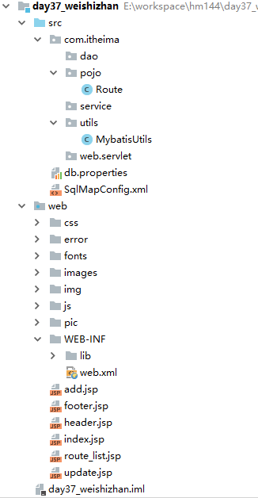
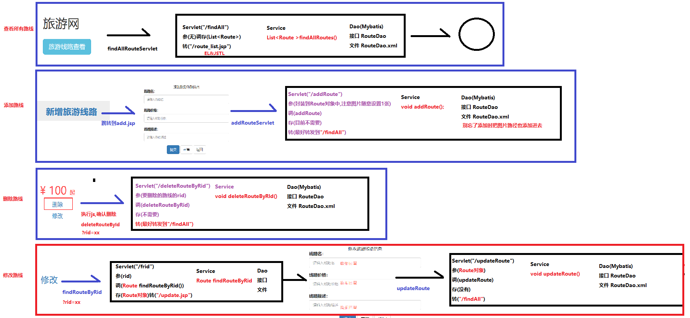

## day37_微实战

#### 回顾

```java
1.Mybatis核心配置文件[重点]
    <properties> 用于加载外部的配置文件
    <typeAliases> 用于给pojo包下的类起别名
    <environments> 用于配置数据库相关(事务,数据源)
    <mappers> 用于配置mapper文件或者Dao类或者包扫描
2.注解的单表操作[重点]
    @Insert @Update @Delete @Select
3.注解的嵌套查询[了解]
    一对一 one=@One(select="包名.接口名.方法名",fetchType=FetchType.EAGER|LAZY|DEFAULT)
    一对一 many=@Many(select="包名.接口名.方法名",fetchType=FetchType.EAGER|LAZY|DEFAULT)
4.展示员工信息(分页)[重点]
    a.展示所有员工
    b.分页展示某页的员工
```

#### 第一章 案例介绍

##### 1.项目案例需求

```java
旅游线路的查看 
旅游线路的添加 
旅游线路的修改(需要数据回显)
旅游线路的删除
```

##### 2.项目的环境搭建

```java
a.导入数据库,资料下的route_demo.sql
b.创建项目,创建各种分层的包
c.导入实体类,工具类,配置文件,jar包等  
d.复制各种页面资料    
```



#### 第2章 案例实现-微实战分析

##### 1.查看所有路线

##### 2.添加新路线

##### 3.删除路线

##### 4.修改路线

- ##### 回显数据

- ##### 修改数据

