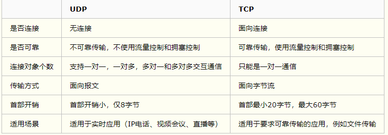
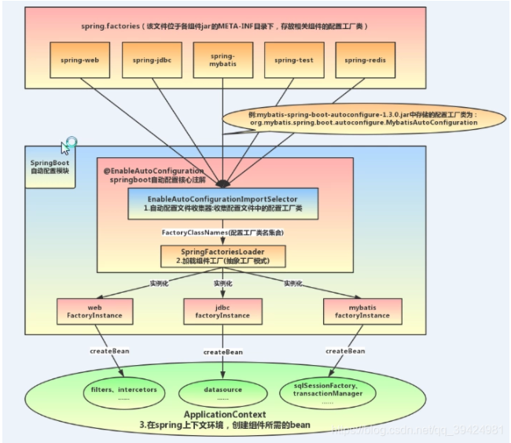

# ==子父类构造函数加载的顺序==

1. 父类静态代码块
2. 子类静态代码块
3. 父类构造代码块
4. 父类构造方法
5. 子类构造代码块
6. 子类构造方法

# 什么类不能被继承

## final修饰符

1. 修饰类，该类不能别继承.
2. 修饰成员函数，该函数不能被重写.
3. 修饰变量，该变量只能被赋值一次

## 类中只有private的构造方法

1. 子类的构造函数一定要调用父类的构造函数，当父类只有private构造方法时候，那么子类就无法调用父类的构造方法.

接口和抽象类的区别

# ==jvm内存==

# 线程创建的几种方式

继承thread

实现runnable

实现callable

使用线程池

# tcp与udp的区别

# ==mysql与redis的区别==

**（1）类型上**

​    **从类型上来说，mysql是关系型数据库，redis是缓存数据库**

**（2）作用上**

​    **mysql用于持久化的存储数据到硬盘，功能强大，但是速度较慢**

​    **redis用于存储使用较为频繁的数据到缓存中，读取速度快**

**（3）需求上**

​    **mysql和redis因为需求的不同，一般都是配合使用。**

# ==mysql与mongodb的区别==

|            | mongodb                                            | mysql                            |
| ---------- | -------------------------------------------------- | -------------------------------- |
| 数据库模型 | 非关系型                                           | 关系型                           |
| 存储方式   | 独特的mongodb查询方式                              | 传统的sql                        |
| 架构特点   | 可以通过副本集，以及分片来实现高可用               | 单点，主从读写分离               |
| 处理方式   | 基于内存，将热数据存在物理内存中，从而达到高速读写 | 不同的引擎有自己的特点           |
| 成熟度     | 新兴数据库，成熟度低                               | 拥有成熟的体系结构，较高的成熟度 |

# redis支持的数据结构

# ==springboot启动的时候都做了什么==

## @SpringBootApplication = (默认属性)@Configuration + @EnableAutoConfiguration + @ComponentScan。

@Configuration的注解类标识这个类可以使用SpringIoC容器作为bean定义的来源。@Bean注解告诉Spring，一个带有@Bean的注解方法将返回一个对象，该对象应该被注册为在Spring应用程序上下文中的bean
@EnableAutoConfiguration：能够自动配置spring的上下文，试图猜测和配置你想要的bean类，通常会自动根据你的类路径和你的bean定义自动配置。
@ComponentScan：会自动扫描指定包下的全部标有@Component的类，并注册成bean，当然包括@Component下的子注解@Service,@Repository,@Controller。

## @EnableAutoConfiguration = @Import + @AutoConfigurationPackage

@AutoConfigurationPackage： 主要作用是自动配置包
@Import： Spring底层注解@Import，给容器中导入一个组件；
导入的组件由AutoConfigurationPackages.Registrar.class 将主配置类（@SpringBootApplication标注的类）的所在包以及下面所有子包里面的所有组件扫描到Spring容器。

具体工作流程图：

 

## @EnableAutoConfiguration加载过程 

自动配置主要由AutoConfigurationImportSelector实现的，我们主要从这个类开始讲起。AutoConfigurationImportSelector是
@EnableAutoConfiguration“@Import”的DeferredImportSelector实现类，由于DeferredImportSelector作为ImportSelector的子接口，所以组件自动配置逻辑均在selectImports(AnnotationMetadata)方法中实现

## springboot自动配置启动流程

SpringBoot启动的时候会通过@EnableAutoConfiguration注解找到META-INF/spring.factories配置文件中的所有自动配置类，
并对其进行加载，而这些自动配置类都是以AutoConfiguration结尾来命名的，它实际上就是一个JavaConfig形式的Spring容
器配置类，它能通过以Properties结尾命名的类中取得在全局配置文件中配置的属性如：server.port。
而XxxxProperties类是通过@ConfigurationProperties注解与全局配置文件中对应的属性进行绑定的，其实就是将配置属性转换为实体类中的属性。

## 总结：

springboot底层实现自动配置的步骤：
①.springboot应用启动
②.@SpringBootApplication起作用
③.@EnableAutoConfiguration
④.@AutoConfigurationPackage：这个组合注解主要是@Import(AutoConfigurationPackages.Registrar.class)，它通过Registrar类导入到容器中，而Registrar类作用是扫描主配置类同级目录以及子包，并将相应的组件导入到springboot创建管理的容器中
⑤.@Import(AutoConfigurationImportSelector.class)：它通过将AutoConfigurationImportSelector类导入到容器中，AutoConfigurationImportSelector类作用是通过selectImports方法实现将配置类信息交给SpringFactory加载器进行一系列的容器创建过程.