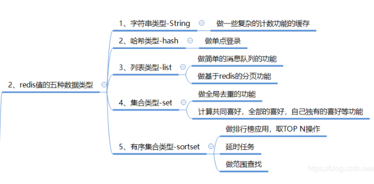

# 常用线程池

# 可缓存和固定线程池，要考虑什么

# 线程池的核心参数

# 有哪些线程安全的类

1. vector
2. statck
3. hashtable
4. enumeration

# lamda表达式，怎么使用？

# AOP将日志保存到数据库

# jvm调优

# redis除了缓存还可以怎么用

# mysql的索引

# mongodb存放了什么数据

# 如何进入一个docker容器

> docker exec -it [name] 