# JVM初探

## 1、JVM的位置

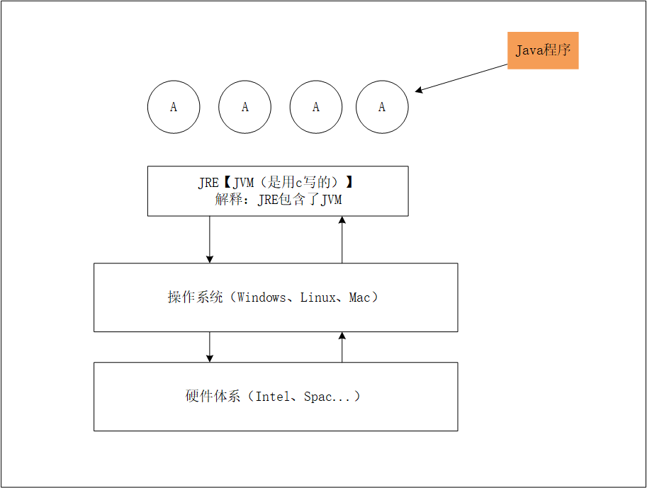


## 2、JVM体系结构

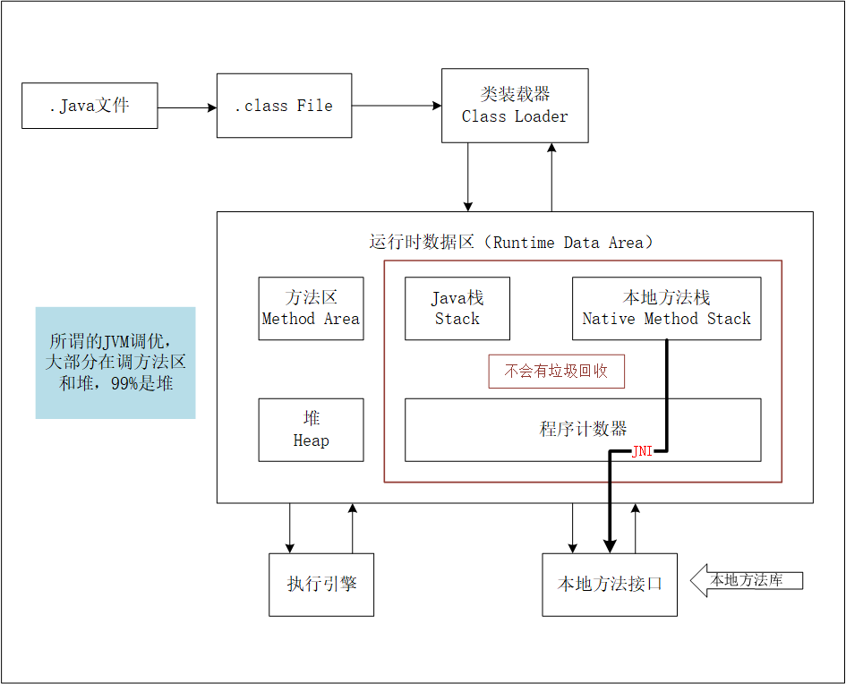

> 本地方法接口：JNI（Java Native Interface）

## 3、类加载器

> 作用：加载Class文件。

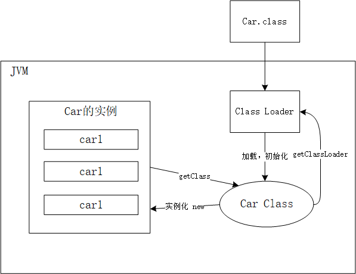

- 1、虚拟机自带的加载器
- 2、启动类（根）加载器【BOOT】
- 3、扩展类加载器【EXT】
- 4、应用程序加载器【APP】

**注：从4到1进行加载**

### 1、双亲委派

**解释：双亲委派机制（安全）：APP—>EXT—>BOOT【最终执行】 **

1. 类加载器收到类加载的请求
2. 将这个请求向上委托为父类加载器去完成，一直向上委托，直到启动类加载器
3. 启动类加载器检查是否能够加载当前的这个类，能加载就结束，使用当前的加载器，否则抛出异常，通知子加载器进行加载
4. 重复步骤 3

> 但是BOOT根加载器输出是null，这是java调用不到~   C，C++
>
> Java = C++-- ：去掉繁琐的东西（指针、内存管理等）

```java
package com.draco.parents;

/**
 * 双亲委派机制
 */
public class Car {
    public static void main(String[] args) {
        Car car1 = new Car();
        Car car2 = new Car();
        Car car3 = new Car();

        //不同的实例
        System.out.println("car1 hashCode="+car1.hashCode());
        System.out.println("car2 hashCode="+car2.hashCode());
        System.out.println("car3 hashCode="+car3.hashCode());

        //同一个类模版
        Class<? extends Car> aClass1 = car1.getClass();
        Class<? extends Car> aClass2 = car2.getClass();
        Class<? extends Car> aClass3 = car3.getClass();

        System.out.println("aClass1 hashCode="+aClass1.hashCode());
        System.out.println("aClass2 hashCode="+aClass2.hashCode());
        System.out.println("aClass3 hashCode="+aClass3.hashCode());

        //由于类模版都是一个，以下就选择一个进行测试
        ClassLoader classLoader = aClass1.getClassLoader();

        System.out.println(classLoader);  //AppClassLoader

        System.out.println(classLoader.getParent());  //ExtClassLoader  所在位置：\jre\lib\ext

        System.out.println(classLoader.getParent().getParent());  //null 1.不存在  2.java程序获取不到  所在位置：rt.jar

    }
}

```

- 运行测试结果：

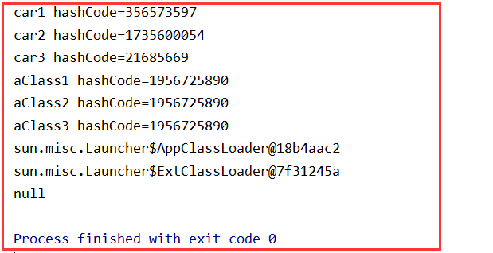

### 2、面试问题

- 为什么需要双亲委派机制?（也就是双亲委派的优点）

  ①双亲委派机制使得类加载出现层级，父类加载器加载过的类，子类加载器不会重复加载，可以==**防止类重复加载**==；

  ②使得类的加载出现优先级，==**防止了核心API被篡改**==，提升了安全，所以越基础的类就会越上层进行加载，反而一般自己的写的类，就会在应用程序加载器（Application）直接加载。

- 如何打破双亲委派？

  ①自定义类加载器，重写loadClass方法

  ②使用线程上下文类加载器

## 4、沙箱安全机制

### 1、什么是沙箱

​		沙箱是一个限制程序运行的环境。沙箱机制就是将 Java 代码限定在虚拟机(JVM)特定的运行范围中，并且严格限制代码对本地系统资源访问，通过这样的措施来保证对代码的有效隔离，防止对本地系统造成破坏。沙箱**主要限制系统资源访问**，那系统资源包括什么？——==CPU、内存、文件系统、网络==。不同级别的沙箱对这些资源访问的限制也可以不一样。

​		所有的Java程序运行都可以指定沙箱，可以定制安全策略。

### 2、组成沙箱的基本组件

- `字节码校验器`（bytecode verifier）：确保Java类文件遵循Java语言规范。这样可以帮助Java程序实现内存保护。但并不是所有的类文件都会经过字节码校验，比如核心类。
- `类装载器`（class loader）：其中类装载器在3个方面对Java沙箱起作用   
  - 它防止恶意代码去干涉善意的代码；
  - 它守护了被信任的类库边界；
  - 它将代码归入保护域，确定了代码可以进行哪些操作。

  虚拟机为不同的类加载器载入的类提供不同的命名空间，命名空间由一系列唯一的名称组成，每一个被装载的类将有一个名字，这个命名空间是由Java虚拟机为每一个类装载器维护的，它们互相之间甚至不可见。

  **类装载器采用的机制是==双亲委派模式==。**

1. 从最内层JVM自带类加载器开始加载，外层恶意同名类得不到加载从而无法使用；
2. 由于严格通过包来区分了访问域，外层恶意的类通过内置代码也无法获得权限访问到内层类，破坏代码就自然无法生效。

- `存取控制器`（access controller）：存取控制器可以控制核心API对操作系统的存取权限，而这个控制的策略设定，可以由用户指定。
- `安全管理器`（security manager）：是核心API和操作系统之间的主要接口。实现权限控制，比存取控制器优先级高。
- `安全软件包`（security package）：java.security下的类和扩展包下的类，允许用户为自己的应用增加新的安全特性，包括：   
  - 安全提供者
  - 消息摘要
  - 数字签名
  - 加密
  - 鉴别

## 5、Native

编写一个多线程启动类

```java
public static void main(String[] args) {
    new Thread(() -> {},"Thread1").start();
}
```

点进去start方法

```java
public synchronized void start() {

    if (threadStatus != 0)
        throw new IllegalThreadStateException();

    group.add(this);

    boolean started = false;
    try {
        start0(); // 调用了start0()方法
        started = true;
    } finally {
        try {
            if (!started) {
                group.threadStartFailed(this);
            }
        } catch (Throwable ignore) {

        }
    }
}
// 凡是带了native关键字的，就说明Java的作用范围达不到了，会去调用底层C语言的库
private native void start0(); //start0()方法的定义，这个方法会调用底层C
```

> Java在内存区域中专门开辟了一块标记区域——本地方法栈，用来登记native方法，凡是带了native关键字的，会进入到本地方法栈中，调用本地方法接口（JNI），在最终执行的时候，加载本地方法库中的方法通过JNI

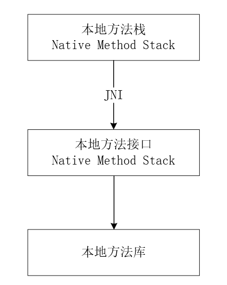

- JNI的作用：扩展Java的使用，融合不同的编程语言为Java所用，不过最初是想融合C，C++的，因为Java诞生的时候，C，C++横行，想要立足的话就要有能调用C的程序
- 本地方法栈：具体做法是，在Native Method Stack中登记native方法，在执行引擎执行的时候加载Native Libraies【本地库】

## 6、PC寄存器

程序计数器：Program Counter Register

​		每个线程都有一个程序计数器， 是线程私有的，就是一个指针， 指向方法区中的方法字节码(用来存储指向像一条指令的地址， 也即将要执行的指令代码)，在执行引擎读取下一条指令, 是一个非常小的内存空间，几乎可以忽略不计

## 7、方法区

方法区：Method Area

​		方法区是被所有线程共享，所有字段和方法字节码，以及一些特殊方法，如构造函数，接口代码也在此定义，简单说，所有定义的方法的信息都保存在该区域，**此区域属于共享区间**；

​		静态变量、常量、类信息(构造方法、接口定义)、运行时的常量池存在方法区中，但是实例变量存在堆内存中，和方法区无关。简单的来说就是：==static、final、Class、常量池==

## 8、栈

- 程序 = 数据结构 + 算法 【持续学习】

- 大多数人程序 = 框架 + 业务逻辑【饭碗】

> 栈：先进后出，后进先出
>
> 队列：先进先出（FIFO：first input first output）

栈：栈内存，主管程序的运行，生命周期和线程同步；

线程结束，栈内存也就释放了，对于栈来说==不存在垃圾回收问题==，一旦线程结束，栈就Over了

### 1、栈里面存放什么

栈：8大基本类型 + 对象的引用 + 实例的方法

### 2、栈运行原理

栈帧

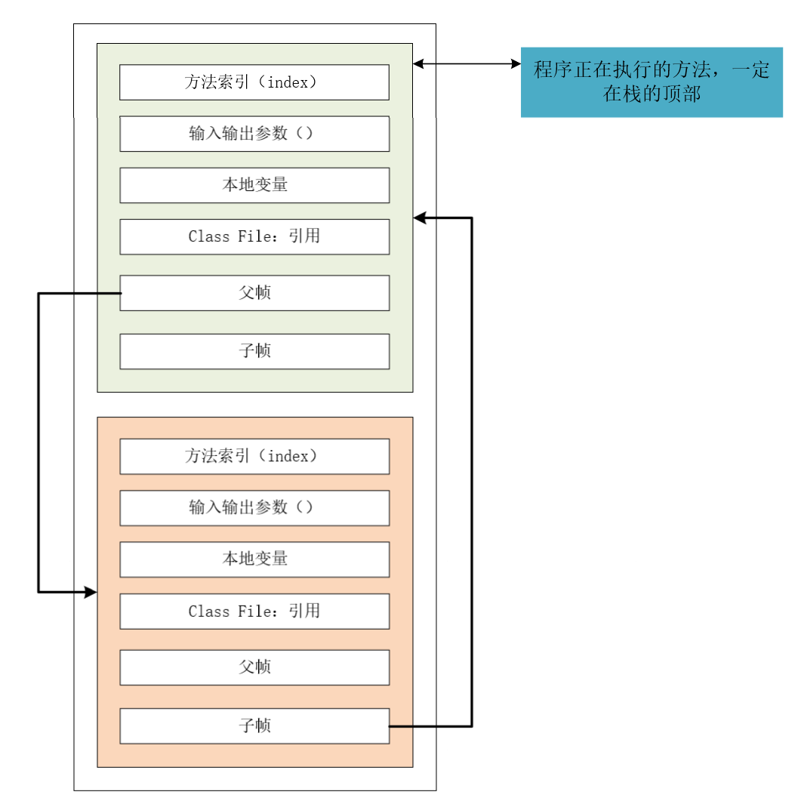

栈满了：StackOverflowError

### 3、栈堆方法区的交互关系

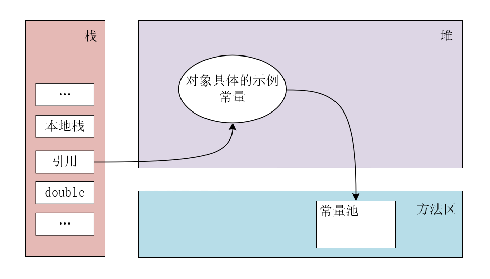

## 9、三种JVM

- Sun公司 HotSpot `Java HotSpot(TM) 64-Bit Server VM (build 25.121-b13, mixed mode)`
- BEA `JRockit`
- IBM `J9VM`

## 10、堆

> Heap，一个JVM只有一个堆内存，堆内存的大小是可以调节的。

### 1、堆里面存放什么

类加载器读取了类文件后，一般会把什么东西放在堆中？ *类，方法，常量，变量，保存我们所有引用类型的真实对象*

堆内存中还要细分为三个区域：

- 新生区（伊甸园区）young/new
- 养老区 old
- 永久区 perm

==GC垃圾回收，主要在**伊甸园区**和**养老区**==

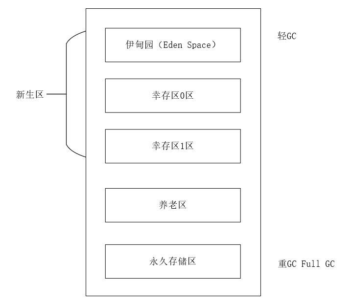

假设内存满了，OOM，堆内存不够！`java.lang.OutOfMemoryError: Java heap space`

```java
package com.draco.heapOverflow;
import java.util.Random;

/**
 * 堆溢出
 */
public class HeapOver {
    public static void main(String[] args) {
        String name = "adfjkllkjfdsa";
        while(true){
            name += name + new Random().nextInt(888888888)+new Random().nextInt(999999999);
        }
    }
}
```

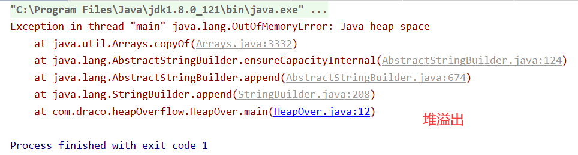在JDK8以后，永久存储区改了个名字叫：==元空间==

### 2、新生区

- 新生区：类诞生和成长的地方，甚至死亡；
  - 伊甸园区，所有对象都是在伊甸园区new出来的
  - 幸存者区（0、1）

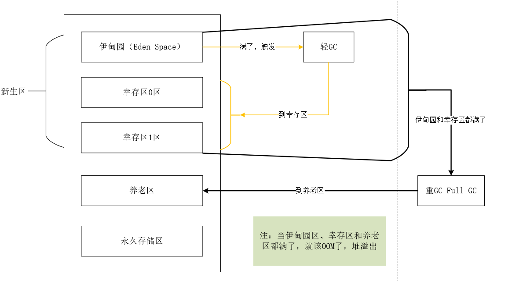

真理：进过研究，99%的对象都是临时对象！

### 3、养老区

新生区没干掉，没杀死的来到了养老区~

### 4、永久区

这个区域是常驻内存的。用来存放JDK自身携带的Class对象，Interface元数据，存储的是Java运行时的一些环境或类信息，这个区域不存在垃圾回收！当关闭VM虚拟机就会释放这个区域的内存。

一个启动类加载了大量的第三方jar包；Tomcat部署了太多的应用；大量动态生成的反射类等 不断的被加载，直到内存满，就会出现OOM。

- jdk1.6 之前：永久代，常量池是在方法区中；
- jdk1.7         ：永久代，但是慢慢退化了，`去永久代`，常量池在堆中
- jdk1.8 之后：无永久代，常量池在元空间

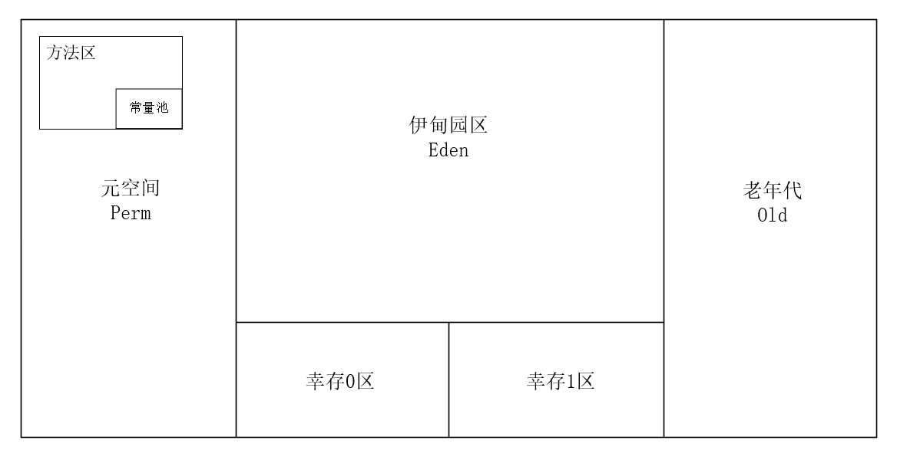

> 但是，元空间：逻辑上存在，物理上不存在

```java
package com.draco.heapOverflow;

/**
 * 元空间逻辑上存在，物理上不存在
 */
public class SanQu {
    public static void main(String[] args) {
        // 返回jvm试图使用的最大内存
        long max = Runtime.getRuntime().maxMemory();
        // 返回jvm的初始化内存
        long total = Runtime.getRuntime().totalMemory();

        System.out.println("max="+max+"字节\t"+(max/(1024*1024))+"MB");
        System.out.println("total="+total+"字节\t"+(total/(1024*1024))+"MB");

        //默认情况下，试图分配的最大内存是电脑内存的1/4，而初始化的内存是1/64
        // -Xms1024m -Xmx1024m -XX:+PrintGCDetails
    }
}
```

运行结果：

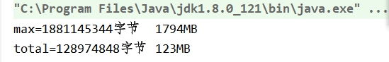

当修改了VM选项后：`-Xms1024m -Xmx1024m -XX:+PrintGCDetails`，输出结果：

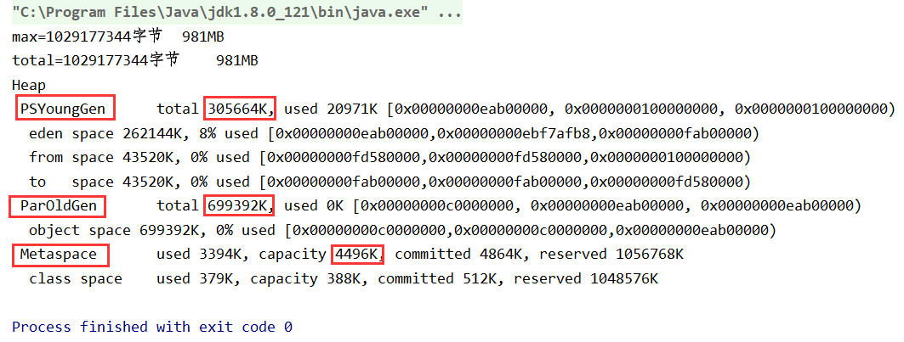

让我们来算一笔账，

新生区：305664k；养老区：699392k

加在一起：1,005,056k，除以1024后 = 981.5MB，等于jvm试图分配的最大内存，所以说元空间逻辑上存在，物理上不存在。

### 5、出现OOM

1. 尝试扩大堆内存去查看内存结果

   `-Xms1024m -Xmx1024m -XX:+PrintGCDetails`

2. 若不行，分析内存，看一下是哪个地方出现了问题（专业工具）

   - 能够看到代码第几行出错：内存快照分析工具，MAT（eclipse），Jprofiler
   - Dubug，一行行分析代码！（不现实）


MAT，Jprofiler作用：

- 分析Dump内存文件，快速定位内存泄漏
- 获得堆中的数据
- 获得大的对象
- ......


运行出现堆溢出：

```java
package com.draco.heapOverflow;

import java.util.ArrayList;

public class JprofilerTest {
    byte[] array = new byte[1*1024*1024];

    public static void main(String[] args) {
        ArrayList<JprofilerTest> list = new ArrayList<>();
        int count = 0;
        try {
            while(true){
                list.add(new JprofilerTest());
                count++;
            }
        }catch (Exception e){
            System.out.println("count="+count);
            e.printStackTrace();
        }
    }
}
```

设置VM options `-Xms1m -Xmx8m -XX:+HeapDumpOnOutOfMemoryError`后，再次运行，控制台输出：

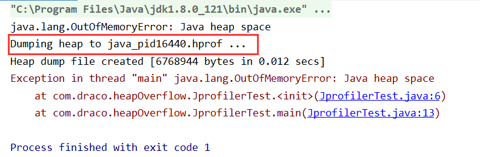

找到HPROF快照

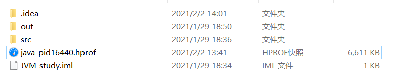

双击打开

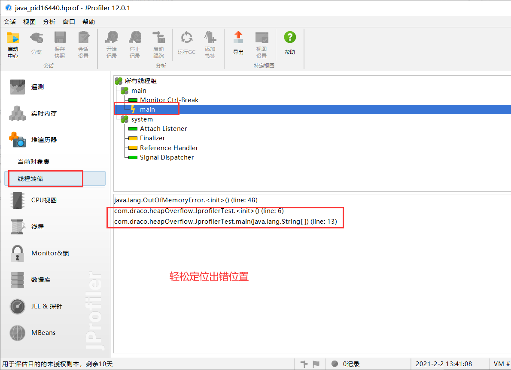

修改代码，把try catch中的Exception改成Error后运行：

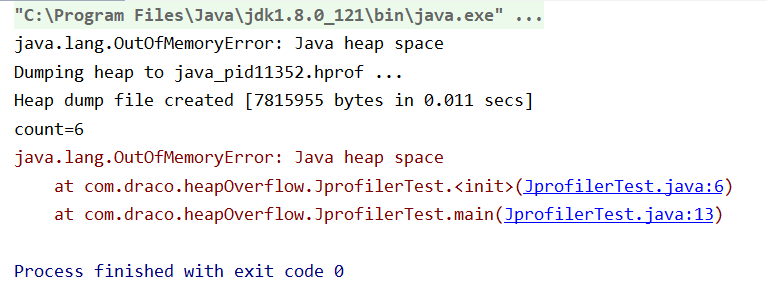

### 6、VM options参数

-Xms	设置初始化内存分配大小，默认1/64

-Xmx	设置最大分配内存，默认1/4

-XX:+PrintGCDetails	打印GC垃圾回收信息

-XX:+HeapDumpOnOutOfMemoryError	生成oomDump文件

``-Xms1m -Xmx8m -XX:+HeapDumpOnOutOfMemoryError``

`-Xms1024m -Xmx1024m -XX:+PrintGCDetails`

## 11、GC垃圾回收

### 1、GC的作用区域

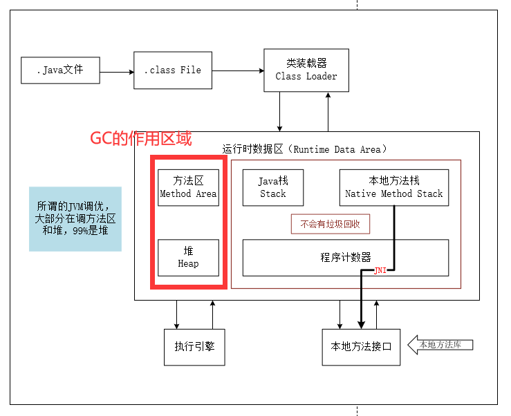

JVM在进行GC时，并不是对这三个区域统一回收，大部分时候，回收都是新生代

- 新生代
- 幸存区（form to）【会交换的，不是一成不变的】
- 老年区

GC两种类型：轻GC（普通的GC），重GC（全局GC）

### 2、GC相关题目

- JVM的内存模型和分区~详细到每个区放什么？
- 堆里面的分区有哪些？Eden，from，to，old，说说他们的特点~
- GC的算法有哪些？标记清除法，标记整理/压缩法，复制算法，引用计数法，怎么用的？
- 轻GC和重GC分别在什么时候发生？

### 3、GC算法

#### 引用计数法

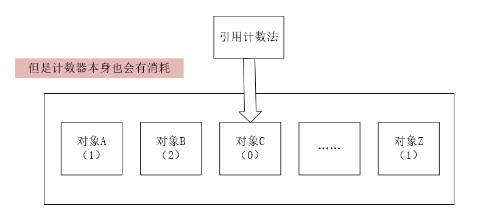

> 哪个对象的引用数为0，就会回收哪个对象

#### 复制算法

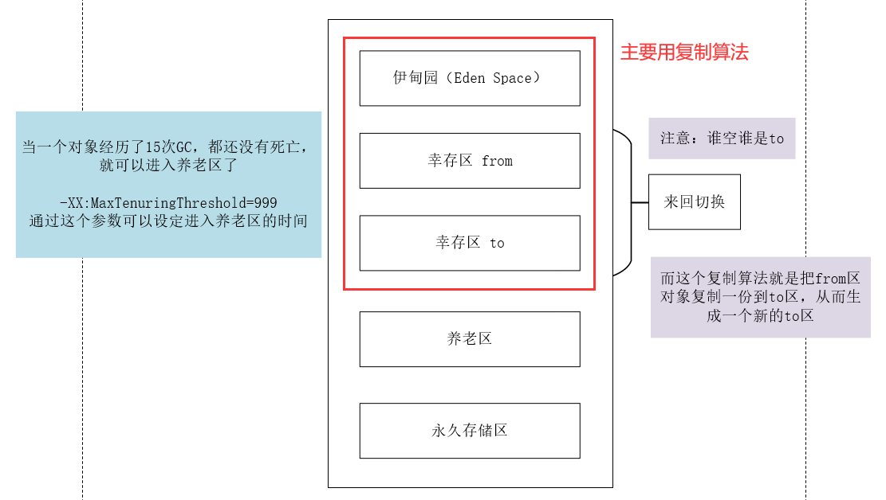

> 一般新生代（伊甸园区、幸存区）会使用复制算法，生成新的to区

- 好处：没有内存的碎片
- 坏处：浪费了内存空间，多了一半空间永远是空to

==复制算法最佳使用场景：对象存活度较低的时候，也就是新生区==

#### 标记清除

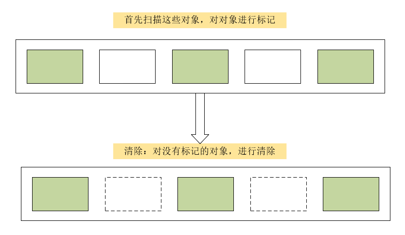

- 缺点：两次扫描，严重浪费时间，会产生内存碎片
- 优点：不需要额外的空间

#### 标记压缩

对于标记清除的再压缩

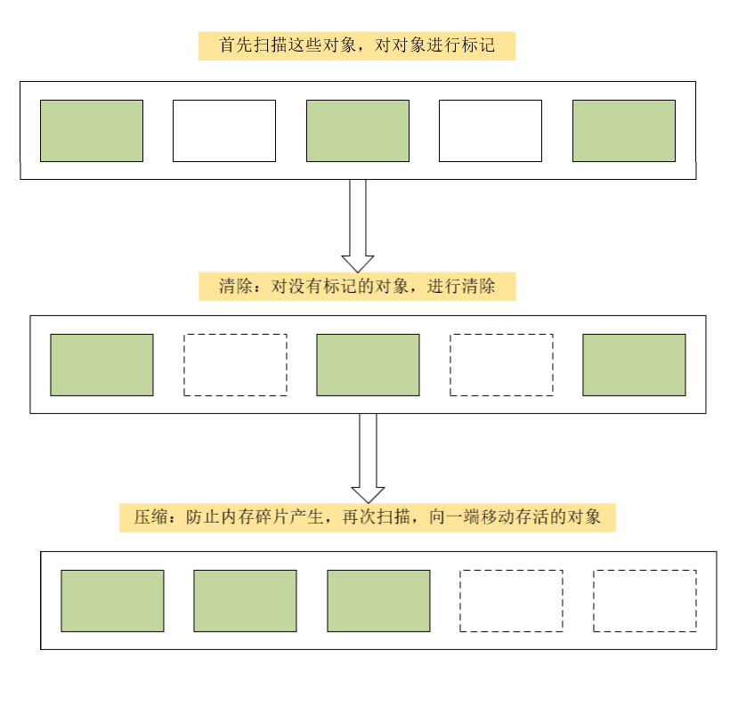

但是又多了一个移动成本

#### 标记清除压缩

先标记清除一次，然后再压缩


## 总结

内存效率：复制算法 > 标记清除算法 > 标记压缩算法（时间复杂度）

内存整齐度：复制算法 = 标记压缩算法 > 标记清除算法

内存利用率：标记压缩算法 = 标记清除算法 > 复制算法

思考：难道没有最优算法吗？

答案：没有，没有最好的算法，只有最合适的——>GC：分代收集算法


**年轻代：**

- 存活率低
- 复制算法


**老年代：**

- 区域大，存活率高
- 标记清除（内存碎片不是太多） + 标记压缩混合实现


还是要多看书《深入理解JVM》，花时间去深究，多看面试题。


# JMM

1. 什么是JMM？

   JMM：Java Memory Model的缩写

2. 它干嘛的？

   作用：缓存一致性协议，用于定义数据读写的规则。

   JMM定义了线程工作内存和主内存之间的抽象关系，线程之间的共享内存存储在主内存（Main Memory）中，每个线程都有一个私有的本地内存（Local Memory）

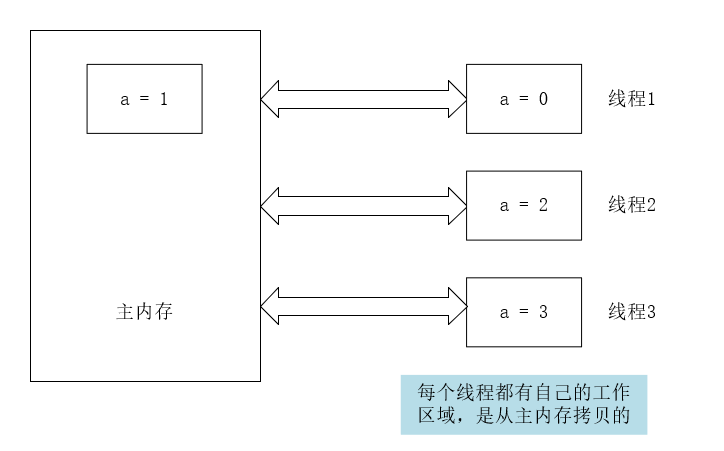

解决共享对象可见性这个问题：voliate

3. 它该如何学习？

   JMM：抽象的概念，理论

   voliate等等


最后：==拥抱开源时代，享受技术给我们带来的新体验==