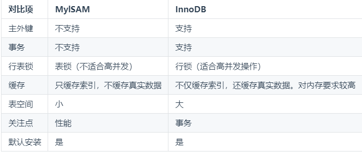
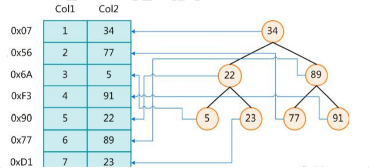

# mysql关键字执行顺序

## from

## on

## join

## where

## group by

## having

## select

## distinct

## order by

## limit

# 引擎



==主外键，事务，行表锁，缓存，表空间，关注点==

# 什么是索引

> **索引（Index）是帮助 MySQL 高效获取数据的数据结构**。可以得到索引的本质： **索引是数据结构**。
>
> 可以简单理解为：**排好序的快速查找数据结构**
>
> 索引存储在磁盘中，默认是分页加载到内存中的



==局部性原理==：数据和程序都有聚集成群的倾向，之前被查询的过的数据很有再次被查询

==磁盘预读==：在磁盘和内存进行交互的时候，有一个最小的逻辑单元，称之为页（datapage）页跟操作系统相关，一般情况下是4k或者8k，每次进行交互的时候，一定读取页的整数倍

mysql的innodb在进行数据读取的时候是跟页相关的，datapagesize默认情况下是==16kb==

## 索引的优缺点

### 优点

1. **==提高数据检索的效率==**，降低数据库的IO成本
2. 通过索引列对数据进行排序，**==降低数据排序的成本==**，降低了CPU的消耗

### 缺点

1. 虽然索引大大提高了查询速度，同时却==**会降低更新表的速度**==，如对表进行INSERT、UPDATE和DELETE。因为更新表时，MySQL不仅要保存数据，还要保存一下索引文件每次更新添加了索引列的字段，都会调整因为更新所带来的键值变化后的索引信息
2. 实际上索引也是一张表，该表保存了主键与索引字段，并指向实体表的记录，所以==**索引列也是要占用空间的**==

## 索引的分类 单值索引，唯一索引，复合索引，主键索引，全文索引

### 单值索引

- 定义：即一个索引只包含单个列，一个表可以有多个单列索引

- 语法：

  ```
  --和表一起创建
  CREATE TABLE customer (
  id INT(10) UNSIGNED AUTO_INCREMENT,
  customer_no VARCHAR(200),
  customer_name VARCHAR(200), 
  PRIMARY KEY(id), 
  KEY (customer_name) --单值索引
  );
  
  --单独创建单值索引
  CREATE INDEX idx_customer_name ON customer(customer_name);
  ```

### 唯一索引

- 定义：索引列的值必须唯一，但允许有空值

- 语法：

  ```
  --和表一起创建
  CREATE TABLE customer (
  id INT(10) UNSIGNED AUTO_INCREMENT,
  customer_no VARCHAR(200),
  customer_name VARCHAR(200), 
  PRIMARY KEY(id), 
  KEY (customer_name), --单值索引
  UNIQUE (customer_no) --唯一索引
  );
  
  --单独创建唯一索引
  CREATE UNIQUE INDEX idx_customer_no ON customer(customer_no);Copy
  ```

### 主键索引

- 定义：设定为主键后数据库会**自动建立索引**，innodb为聚簇索引

- 语法：

  ```
  --和表一起创建
  CREATE TABLE customer (
  id INT(10) UNSIGNED AUTO_INCREMENT,
  customer_no VARCHAR(200),
  customer_name VARCHAR(200), 
  PRIMARY KEY(id) --主键索引
  );
  
  --单独创建主键索引
  ALTER TABLE customer ADD PRIMARY KEY customer(customer_no);
  
  --删除主键索引
  ALTER TABLE customer DROP PRIMARY KEY;
  
  --修改建主键索引
  必须先删除掉(drop)原索引，再新建(add)索引Copy
  ```

### 复合索引

- 定义：即一个索引包含多个列

- 语法：

  ```
  --和表一起创建
  CREATE TABLE customer (
  id INT(10) UNSIGNED AUTO_INCREMENT,
  customer_no VARCHAR(200),
  customer_name VARCHAR(200), 
  PRIMARY KEY(id), 
  KEY (customer_name), --单值索引
  UNIQUE (customer_no), --唯一索引
  KEY (customer_no,customer_name) --复合索引
  );
  
  --单独创建复合索引
  CREATE INDEX idx_no_name ON customer(customer_no,customer_name);Copy
  ```

#  优化索引(高薪)

## 适合索引的场景

1. 主键自动建立唯一索引
2. 频繁作为==**查询条件**==的字段应该创建索引
3. 查询中与其它表关联的字段，==**外键关系**==建立索引
4. 单键/组合索引的选择问题，==**组合索引性价比更高**==
5. 查询中==**排序的字段**==，排序字段若通过索引去访问将大大提高排序速度
6. 查询中==**统计**==或者==**分组**==字段

## 不适合索引的场景

1. 表==**记录太少**==（有无索引差别不大）
2. 经常==**增删改**==的表或者字段
3. ==Where 条件里用不到==的字段不创建索引
4. ==**过滤性不好**==的不适合建索引（重复性较高，比如国籍、性别之类的字段）

## 避免索引失效

1. ==范围查询==, 右边的列不能使用索引, 否则右边的索引也会失效.
2. 不要在索引上==使用运算==, 否则索引也会失效.
3. ==字符串不加引号==, 造成索引失效.
4. 查询 like，如果是 ==‘%aaa’== 也会造成索引失效.
5. 尽量使用覆盖索引,==避免select *==,这样能提高查询效率
6. ==or关键字连接==
7. 应尽量避免在 where 子句中使用==!= 、 <> 、null==操作符，否则将引擎放弃使用索引而进行全表扫描。

# Sql语句调优(高薪)

1. 优化insert语句: ==批量列插入==数据要比单个列插入数据效率高.
2. 优化order by语句: 在使用order by语句时, 不要使用select *, ==select 后面要查有索引的列==, 如果一条sql语句中对多个列进行排序, 在业务允许情况下, 尽量同时用升序或同时用降序.
3. 优化group by语句: ==order by null==
4. 尽量==避免子查询==, 可以将子查询优化为join多表连接查询

# b+树跟b树的区别是什么？

B+树内节点不存储数据，所有数据存储在叶节点导致查询时间复杂度固定为 ==log n==
B-树查询时间复杂度不固定，与 key 在树中的位置有关，最好为==O(1)==
B+树叶节点两两相连可大大增加区间访问性，可使用在==范围查询==等
B+树更适合==外部存储==(存储磁盘数据)。由于内节点无 data 域，每个节点能索引的==范围更大更精确==。