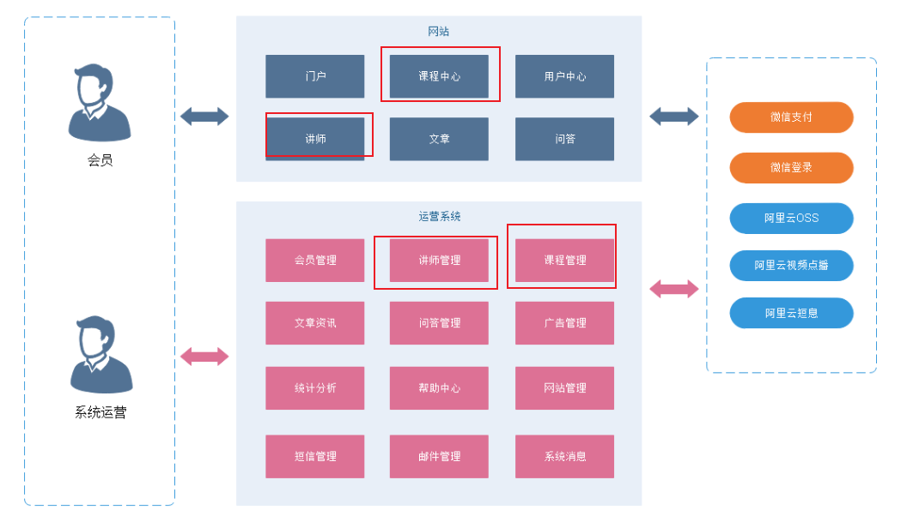
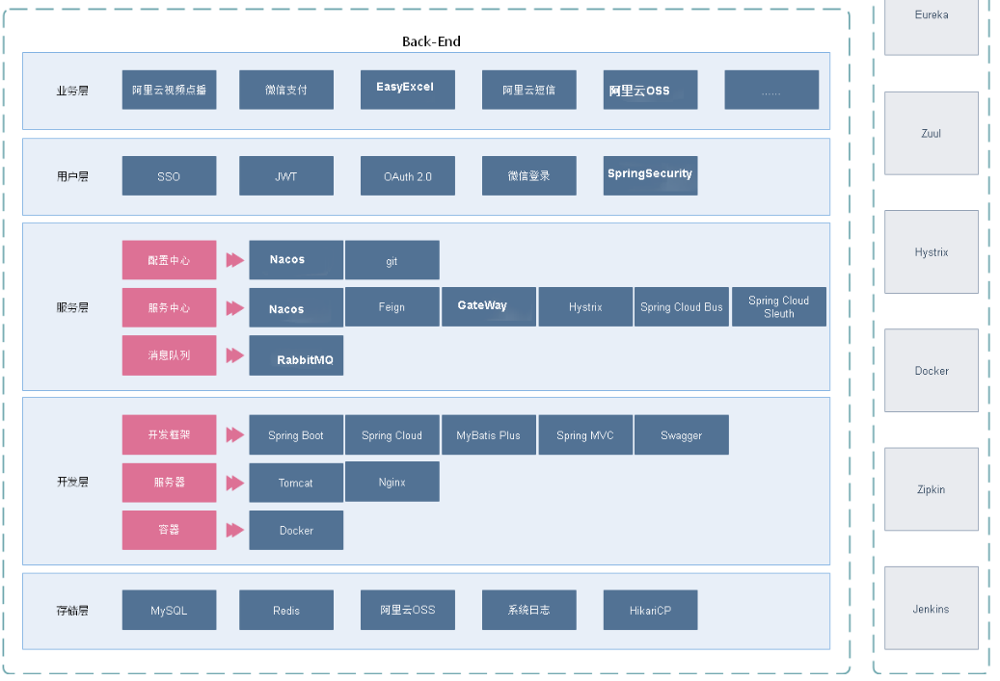
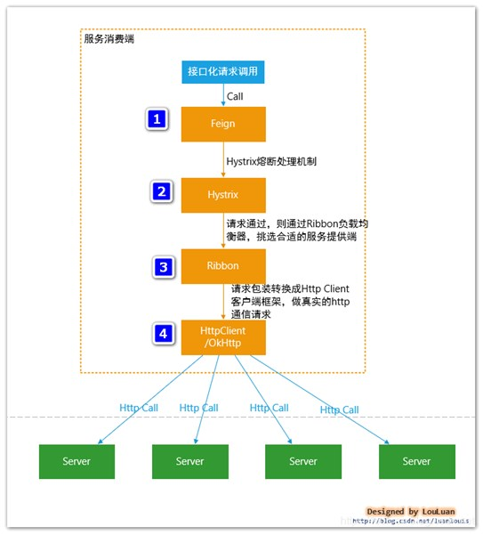
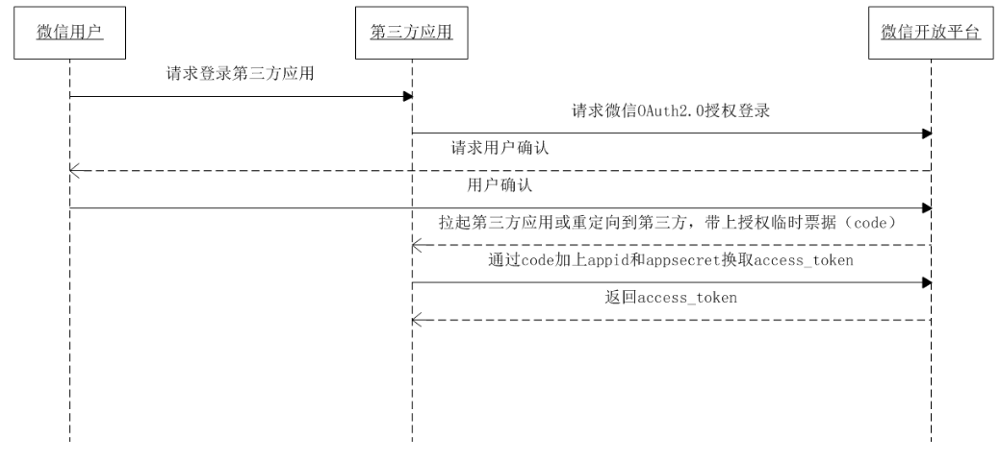
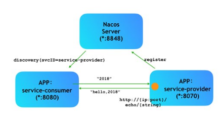

# 项目介绍

## 项目背景和定位

一个B2C模式的职业技能在线教育系统，分为前台用户系统和后台运营平台。

## 技术方案和架构

> -SpringCloud+SpringBoot + SpringMVC + MybatisPlus +nginx+vue+element-ui+Nacos+swagger
> -采用SpringBoot+MybatisPlus实现系统主架构
>
> -采用swagger进行接口测试
>
> -采用easyExcel进行表格读写
>
> -采用Redis集群实现缓存的高可用
> -采用SpringCloud作为微服务架构技术 
> -采用Nacos作为注册中心
> -第三方服务: 阿里云短信、阿里云视频点播、阿里云OSS存储、 微信支付

# Spring Cloud相关基础服务组件

服务发现——Netflix Eureka （Nacos）

服务调用——Netflix Feign 

熔断器——Netflix Hystrix 

服务网关——Spring Cloud GateWay 

分布式配置——Spring Cloud Config  （Nacos）

消息总线 —— Spring Cloud Bus （Nacos）

Dubbo基于RPC的远程调度机构, Dubbo底层是使用Netty这样的NIO框架，是基于TCP协议传输的，配合以Hession序列化完成RPC

SpringCloud是基于Rest风格(基于http协议实现的)的Spring全家桶微服务服务治理框架. 说到这里也可以继续说下Dubbo和SpringCloud的区别.

# Spring Cloud调用接口过程 ==Feign+Hystrix+Ribbon+Http Client==

Spring Cloud 在接口调用上，大致会经过如下几个组件配合：

**`Feign` ----->`Hystrix` —>`Ribbon` —>`Http Client``（apache http components 或者 Okhttp）`** 具体交互流程上，如下图所示：

**（1）接口化请求调用**当调用被`@FeignClient`注解修饰的接口时，在框架内部，将请求转换成Feign的请求实例`feign.Request`，交由Feign框架处理。

**（2）Feign** ：转化请求Feign是一个http请求调用的轻量级框架，可以以Java接口注解的方式调用Http请求，封装了Http调用流程。

（3）Hystrix：熔断处理机制 Feign的调用关系，会被Hystrix代理拦截，对每一个Feign调用请求，Hystrix都会将其包装成`HystrixCommand`,参与Hystrix的流控和熔断规则。如果请求判断需要熔断，则Hystrix直接熔断，抛出异常或者使用`FallbackFactory`返回熔断`Fallback`结果；如果通过，则将调用请求传递给`Ribbon`组件。

（4）Ribbon：服务地址选择 当请求传递到`Ribbon`之后,`Ribbon`会根据自身维护的服务列表，根据服务的服务质量，如平均响应时间，Load等，结合特定的规则，从列表中挑选合适的服务实例，选择好机器之后，然后将机器实例的信息请求传递给`Http Client`客户端，`HttpClient`客户端来执行真正的Http接口调用；

**（5）HttpClient** ：Http客户端，真正执行Http调用根据上层`Ribbon`传递过来的请求，已经指定了服务地址，则HttpClient开始执行真正的Http请求

## **Hystrix概念**

Hystrix 是一个供分布式系统使用，提供延迟和容错功能，保证复杂的分布系统在面临不可避免的失败时，仍能有其弹性。

比如系统中有很多服务，当某些服务不稳定的时候，使用这些服务的用户线程将会阻塞，如果没有隔离机制，系统随时就有可能会挂掉，从而带来很大的风险。SpringCloud使用Hystrix组件提供断路器、资源隔离与自我修复功能。下图表示服务B触发了断路器，阻止了级联失败

## EasyExcel特点

- Java领域解析、生成Excel比较有名的框架有Apache poi、jxl等。但他们都存在一个严重的问题就是非常的耗内存。如果你的系统并发量不大的话可能还行，但是一旦并发上来后一定会OOM或者JVM频繁的full gc。
- EasyExcel是阿里巴巴开源的一个excel处理框架，**以使用简单、节省内存著称**。EasyExcel能大大减少占用内存的主要原因是在解析Excel时没有将文件数据一次性全部加载到内存中，而是从磁盘上一行行读取数据，逐个解析。
- EasyExcel采用一行一行的解析模式，并将一行的解析结果以观察者的模式通知处理（AnalysisEventListener）。

## 微信登录

## Nacos

Nacos主要提供以下四大功能：

1. 服务发现和服务健康监测

2. 动态配置服务

3. 动态DNS服务

4. 服务及其元数据管理

   

# Nginx

## Nginx是什么?

Nginx是一个高性能的 HTTP和反向代理服务器，及电子邮件代理服务器，同时也是一个 

非常高效的反向代理、负载平衡。 

## Nginx的作用?

==反向代理==，将多台服务器代理成一台服务器。 

==负载均衡==，将多个请求均匀的分配到多台服务器上，减轻每台服务器的压力，提高服务的吞吐量。 

==动静分离==，nginx可以用作静态文件的缓存服务器，提高访问速度 

## 什么是反向代理?

反向代理是指以代理服务器来接受 internet上的连接请求，然后将请求，发给内部网络上 

的服务器，并将从服务器上得到的结果返回给 internet上请求连接的客户端，此时代理服 

务器对外就表现为一个反向代理服务器。 

**反向代理总结就一句话：代理端代理的是服务端**

## 什么是正向代理?

一个位于客户端和原始服务器之间的服务器，为了从原始服务器取得 

内容，客户端向代理发送一个请求并指定目标(原始服务器)，然后代理向原始 

服务器转交请求并将获得的内容返回给客户端。客户端才能使用正向代理。 

**正向代理总结就一句话：代理端代理的是客户端。** 

## 什么是负载均衡?

负载均衡即是代理服务器将接收的请求均衡的分发到各服务器中，负 

载均衡主要解决网络拥塞问题，提高服务器响应速度，服务就近提供，达到更 

好的访问质量，减少后台服务器大并发压力。