# 项目介绍

## 项目背景和定位

探花交友项目定位于陌生人交友市场，市场竞品：陌陌、探探、Soul

用户注册、登录，自己动态发布，小视频，附近搜索

## 项目功能简介

| 功能 | 说明                                             |
| ---- | ------------------------------------------------ |
| 用户 | ==用户注册、登录==、个人信息完善、通用设置       |
| 动态 | ==自己动态发布==和查看；好友动态查看、评论、点赞 |
| 交友 | 推荐好友列表、查看；朋友添加、查看；聊天         |
| 消息 | 通知类消息 + 即时通讯消息                        |
| 视频 | ==小视频==的发布、查看、评论、点赞               |
| 其他 | 探花、==附近搜索==                               |

## 技术方案和架构

~~~markdown
-SpringBoot + SpringMVC + Mybatis + dubbo + zookeeper
-采用SpringBoot+Mybatis实现系统主架构 
-采用Redis集群实现缓存的高可用
-采用MongoDB实现海量数据的存储和地理位置查询
-采用分布式文件系统FastDFS存储小视频数据 
-采用ApacheDobbo作为微服务架构技术 
-采用zookeeper作为注册中心
-采用Spark+Mllib实现智能推荐 
-第三方服务: 百度人脸识别、环信通讯聊天、阿里云OSS存储、 阿里云短信服务、华为内容审核
~~~

# 用户登录==Redis+jwt==

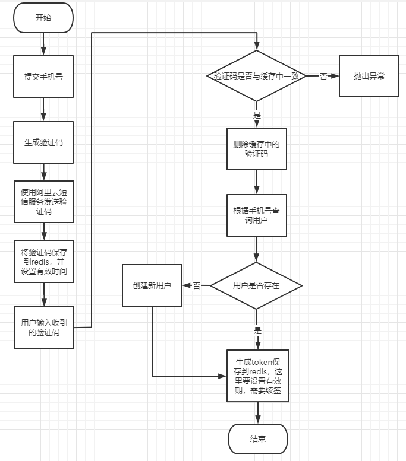

### **注销和修改密码？** 

## Redis

Redis是 **C**语言开发的一个开源的（遵从 BSD协议）高性能键值对**（key-value）**的**内存**数据库，可以用作数据库、**缓存**、消息中间件等。

### Redis的存储结构有哪些？

string,hash,list,set,sortSet

### 3.Redis的优点？

高性能，高并发

### redis的持久化

Redis提供了两种持久化的方式，分别是 RDB（RedisDataBase）和 AOF（AppendOnly 

File）。

RDB，将 redis存储的数据生成快照并存储到磁盘等

AOF，那就是将 redis执行过的所有写指令记录下来， 在下次 redis重新启动时，只要把这些写指令从前到后再重复执行一遍，就可以实现数据恢复了。 

**AOF，完整性更高**

### Redis的缺点

#### **缓存和数据库双写一致性问题**

1. 缓存中的数据，数据库中发生更改
2. 增加删除方法，消息通知

#### **缓存的并发竞争问题**

1. 并发竞争，指的是同时有多个子系统去 set同一个 key值。
2. 加锁，大家去抢锁

#### **缓存雪崩问题**

1. 缓存雪崩，即缓存同一时间大面积的失效，这个时候又来了一波 请求，结果请求都怼到数据库上，从而导致数据库连接异常。 
2. 集群，缓存随机时间

#### **缓存击穿问题**

缓存穿透，即黑客故意去请求缓存中不存在的数据

1、利用互斥锁，缓存失效的时候，先去获得锁，得到锁了， 

再去请求数据库。没得到锁，则休眠一段时间重试 

2、采用异步更新策略，无论 key是否取到值，都直接返回， 

value值中维护一个缓存失效时间，缓存如果过期，异步起一个线程 

去读数据库，更新缓存。 

## jwt

**JSON Web token简称 JWT， 是用于对应用程序上的用户进行身份验证的标记。**

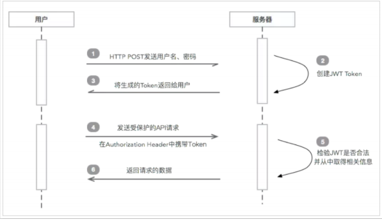

### token续签

​	redis设置有效期

### 2.token的安全性

我 们 这 里 采 用 加 密 加 盐 (SignatureAlgorithm.HS256,secret)的方式来解决

### 3.如何统一处理token

为了实现 token统一校验，我们这里采 

用的是 springmvc拦截机制+Threadlocal局部线程的方式来解决。

> JWT本质上就是一个经过加密处理与校验处理的字符串，它由三部分组成：头信息.有效载荷.签名
> 	头信息: 一般由两部分组成，令牌类型（即：JWT）和散列算法（HMAC、RSASSA、RSASSA-PSS等）
> 	有效载荷: 一般里面可以存储自定义的实体的信息
> 	签名: 用于保证消息在传输过程中不会被篡改

==preHandle==：在业务处理器处理请求之前被调用。预处理，可以进行编码、安全控制、权限校验等处理；
==postHandle==：在业务处理器处理请求执行完成后，生成视图之前执行。后处理（调用了Service并返回ModelAndView，但未进行页面渲染），有机会修改ModelAndView （这个博主就基本不怎么用了）；
==afterCompletion==：在DispatcherServlet完全处理完请求后被调用，可用于清理资源等。返回处理（已经渲染了页面）；

## ThreadLocal

ThreadLocal对象就好比是一个用于给 Thread对象绑定值的工具类，当调用 ThreadLocal对象的 se（tv）方法时，它会先获取当前线程对象 thread然后找到 thread对象自己内部的 ThreadLocalMap对象 map，然后把 ThreadLocal对象作为 key，v作为值存进 map中，map中是用 Entry。 

# 动态发布==mongodb==

**MongoDB+Redis+MongoDBgeo+华为云内容审核 **+Spark+Mllib

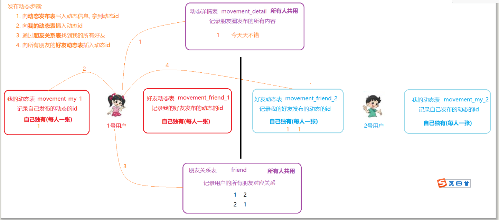

## mongodb

> MongoDB由C++语言编写，是一个跨平台的面向文档的数据库
> 	它介于关系数据库和非关系数据库之间，是非关系数据库当中功能最丰富，最像关系（MySQL）数据库的产品
> 	它支持的数据结构非常松散，是类似JSON的BSON格式，因此可以存储比较复杂的数据类型

## **MongoDBgeo** 

MongoDB支持地理位置索引，可以直接用于位置距离计算和查询。

**两种索引方式** 

**2dindex:** 

使用 2dindex能够将数据作为 2维平面上的点存储起来， 在 MongoDB2.2以前 推荐使用 2dindex索引。 

**2dsphereindex:** 

2dsphereindex支持球体的查询和计算，同时它支持数据存储为 GeoJSON 和传统坐标。 

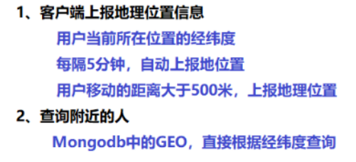

# 视频存储方案==FastDFS==

视频功能类似于抖音、快手小视频的应用，用户可以上传小视频进行分享，也可以浏览查看别人分享的视频，并且可以对视频评论和点赞操作。

对于小视频的功能的开发需要考虑的是：`存储`和`加载速度` 。

##  FastDFS

* FastDFS是用C语言编写的一款开源的轻量级分布式文件系统。

* 它对文件进行管理，功能包括：文件存储、文件同步、文件访问（文件上传、文件下载）等，解决了大容量存储和负载均衡的问题。

* 特别适合以文件为载体的在线服务，如相册网站、视频网站等等。

* FastDFS为互联网量身定制，充分考虑了冗余备份、负载均衡、线性扩容等机制，并注重高可用、高性能等指标。

* 使用FastDFS很容易搭建一套高性能的文件服务器集群提供文件上传、下载等服务。  

  

* FastDFS由客户端(Client)、 跟踪服务器(Tracker Server)、 存储服务器(Storage Server)构成
* 客户端: 业务请求的发起方，与跟踪器服务器或存储节点进行数据交互。
* 跟踪器: 作用是负载均衡和调度，通过Tracker server在文件上传时可以根据一些策略找到Storage server提供文件上传服务。
* 存储器: 作用是文件存储，客户端上传的文件最终存储在Storage服务器上，存储节点中的服务器均可以随时增加或下线而不会影响线上服务。  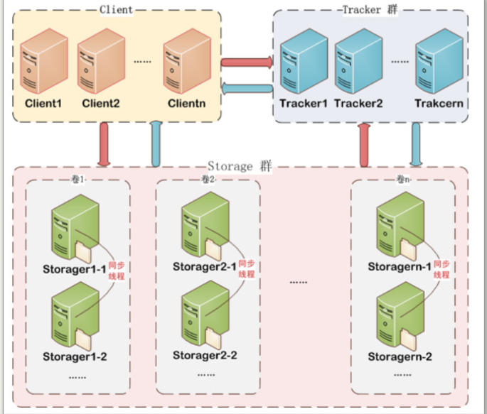

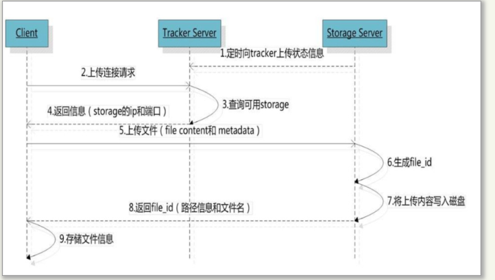

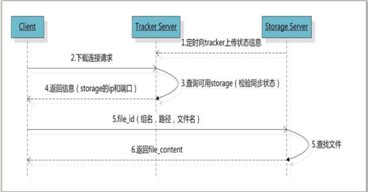

# ==dubbo==

>Apache Dubbo是一款高性能的Java RPC框架，可以和Spring框架无缝集成。官网地址：[http://dubbo.apache.org]

系统架构演变（了解）单体应用架构--->垂直应用架构--->分布式架构--->SOA架构`--->微服务架构`

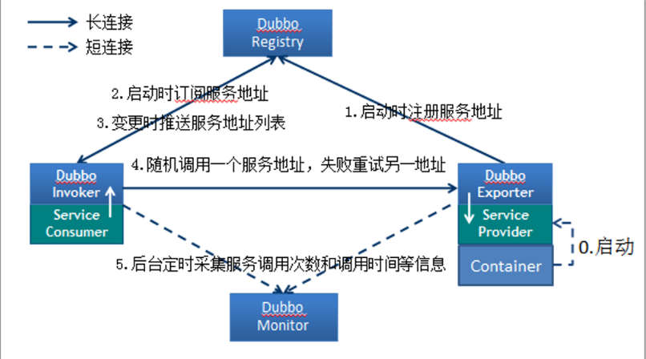

### RPC介绍

- RPC全称为remote procedure call，**即远程过程调用**
- 简单的讲，RPC可以==让我们像调用本地方法一样来调用远程方法==

# ==zookper==

> ZooKeeper是一个分布式服务协调框架，主要用来解决分布式应用中的一些数据管理问题，如：统一命名服务、状态同步服务、应用配置项的管理等等。

==Znode兼具文件和目录两种特点。既可以像目录一样可以保存子节点，又可以像文件一样可以保存信息。==

一个znode大体上分为3部分：
1. data：节点的数据
2. children：节点的子节点
3. stat：节点的状态，用来描述当前节点的创建、修改记录等

## 节点类型

对于Zookeeper中的节点，有两种分类方式，一种是按照节点是否持久化，一种是按照节点是否有顺序进行分类。

> 按照节点是否持久化分类，可以分别为临时节点和永久节点

- **临时节点**：该节点的生命周期依赖于创建它们的会话。一旦会话(Session)结束，临时节点将被自动删除

  虽然每个临时的Znode都会绑定到一个客户端会话，但他们对所有的客户端还是可见的。另外，ZooKeeper的临时节点不允许拥有子节点

- **持久化节点**(默认)：该节点的生命周期不依赖于会话，并且只有在客户端显示执行删除操作的时候，他们才能被删除

> 按照节点是否有顺序进行分类，可以分别为有序节点和无序节点

- **有序节点**：每个节点都会为它的一级子节点维护一个顺序
- **无序节点**(默认)：节点不会为子节点维护顺序

~~~markdown
* 节点类型
	持久化无序节点 ：节点创建后会一直存在zookeeper服务器上，直到主动删除
	持久化有序节点 ：在持久化无序节点的基础上,为每个节点都会为它的一级子节点维护一个顺序
	临时无序节点 ：  临时节点的生命周期和客户端的会话保持一致，当客户端会话失效，该节点自动清理
	临时有序节点 ：  在临时节点上多了一个顺序性特性
~~~

## Zookeeper使用场景(面试)

### ID生成器==顺序节点==

### 配置中心==watch机制==

在这里Zookeeper采用了推拉模式相结合的做法：
    	push可以保证能够第一时间拿到更新配置，基本可以做到准实时的更新，但push存在问题，即如果有网络抖动，某一次push没有推送成功，将丢失这次配置的更新
    	pull可以保证一定可以拉取得到数据，pull一般采用定时拉取的方式，即使某一次出现网络问题，没有拉取得到数据，那在下一次定时器也将可以拉取得到数据

### 分布式协调==watch机制==

### 集群选主==临时节点==

使用Zookeeper的==临时节点==可以轻松实现这一需求
我们把上面描述的这个过程称为集群选主的过程，首先所有的节点都认为是从节点，都有机会称为主节点，然后开始选主，步骤比较简单:

1. 所有参与选主的主机都去Zookeeper上创建同一个临时节点，那么最终一定只有一个客户端请求能够创建成功。
2. 成功创建节点的客户端所在的机器就成为了主节点，其他没有成功创建该节点的客户端，成为从节点
3. 所有的从节点都会在主节点上注册一个子节点变更的Watcher，用于监控当前主节点是否存活，一旦发现当前的主节点挂了，那么其他客户端将会重新进行选主。

### 分布式锁==临时有序节点==
使用Zookeeper的   临时有序   节点可以轻松实现这一需求
1. 所有需要执行操作的主机都去Zookeeper上创建一个临时有序节点
2. 然后获取到Zookeeper上创建出来的这些节点进行一个从小到大的排序
3. ==判断自己创建的节点是不是最小的，如果是，自己就获取到了锁;如果不是，则对最小的节点注册一个监听==
4. 如果自己获取到了锁，就去执行相应的操作，当执行完毕之后，连接断开，节点消失，锁就被释放了
5. 如果自己没有获取到锁，就等待，一直监听节点消失，锁释放后，再重新执行抢夺锁的操作

## 集群(高级)

## 集群角色

~~~markdown
* ZooKeeper集群中的三个角色：
	Leader（领导者）：负责投票的发起和决议，更新系统状态，是事务请求的唯一处理者，一个ZooKeeper同一时刻只会有一个Leader
	Follower（跟随者）：处理客户端请求，参与选主投票
	Observer（观察者）：处理客户端请求，不参与选主投票
* Leader可以提供读写服务，Follower或Observer只提供读服务，但是Observer机器不参与Leader选举，也不参与写操作的『过半写成功』策略
~~~

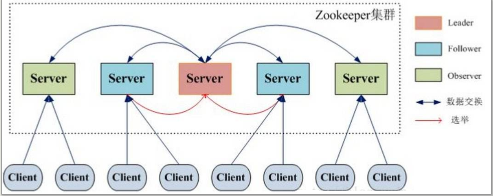

## 事务处理流程

~~~markdown
1. 所有的事务请求都交由集群的Leader服务器来处理,Leader服务器会将一个事务请求转换成一个Proposal(提议),并为其生成一个全局递增的唯一ID,
    这个ID就是事务ID,即ZXID,Leader服务器对Proposal是按其ZXID的先后顺序来进行排序和处理的。
2. Leader服务器会将Proposal放入每个Follower对应的队列中(Leader会为每个Follower分配一个单独的队列),并以FIFO的方式发送给Follower服务器。
3. Follower服务器接收到事务Proposal后,首先以事务日志的方式写入本地磁盘,并且在成功后返回Leader服务器一个ACK响应。
4. Leader服务器只要收到过半Follower的ACK响应,就会广播一个Commit消息给Follower以通知其进行Proposal的提交,同时Leader自身也会完成Proposal的提交。
5. Follower收到commit请求时，从历史队列中将事务请求commit
~~~

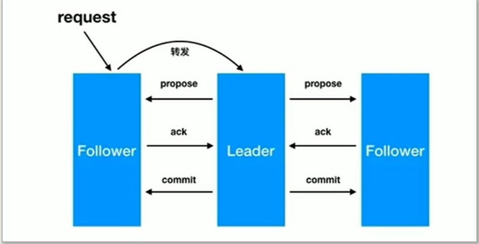

## 集群选举

### 服务器状态

~~~markdown
* Zookeeper服务器有四个状态
	looking：  寻找leader状态。当服务器处于该状态时，它会认为当前集群中没有leader，因此需要进入leader选举状态。
	
	
	leading：  领导者状态。表明当前服务器角色是leader。
	following：跟随者状态。表明当前服务器角色是follower。
	observing：观察者状态。表明当前服务器角色是observer。
~~~

### leader选举

~~~markdown
* 在集群初始化阶段，当有一台服务器server1启动时，其单独无法进行和完成leader选举，
* 当第二台服务器server2启动时，此时两台机器可以相互通信，每台机器都试图找到leader，于是进入leader选举过程。 
* 选举过程如下:
	1. 每个server发出一个投票。
	   由于是初始情况，server1和server2都会将自己作为leader服务器来进行投票，每次投票会包含所推举的服务器的myid和zxid，
	   使用(myid, zxid)来表示，此时server1的投票为(1, 0)，server2的投票为(2, 0)，然后各自将这个投票发给集群中其他机器。
	2. 集群中的每台服务器接收来自集群中各个服务器的投票。
	3. 处理投票。针对每一个投票，服务器都需要将别人的投票和自己的投票进行pk，pk规则如下:
		优先检查zxid。zxid比较大的服务器优先作为leader。
		如果zxid相同，那么就比较myid。myid较大的服务器作为leader服务器。
 		对于Server1而言，它的投票是(1, 0)，接收Server2的投票为(2, 0)，首先会比较两者的zxid，均为0，再比较myid，此时server2的myid最大，
 		于是更新自己的投票为(2, 0)，然后重新投票，对于server2而言，其无须更新自己的投票，只是再次向集群中所有机器发出上一次投票信息即可。
	4. 统计投票。每次投票后，服务器都会统计投票信息，判断是否已经有过半机器接受到相同的投票信息，
		对于server1、server2而言，都统计出集群中已经有两台机器接受了(2, 0)的投票信息，此时便认为已经选出了leader
	5. 改变服务器状态。一旦确定了leader，每个服务器就会更新自己的状态，如果是follower，那么就变更为following，如果是leader，就变更为leading。
~~~

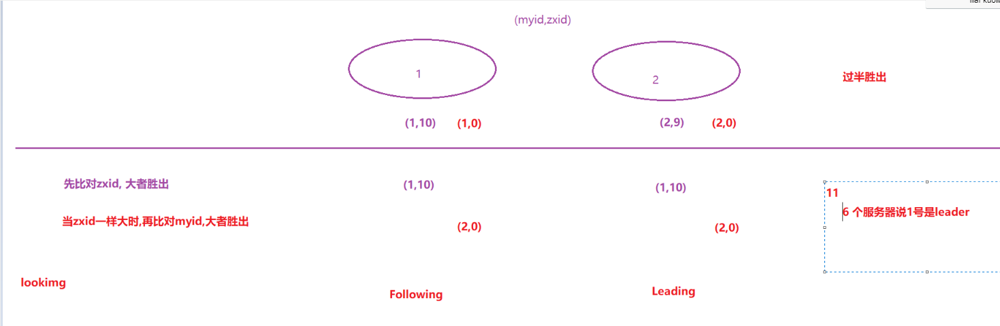