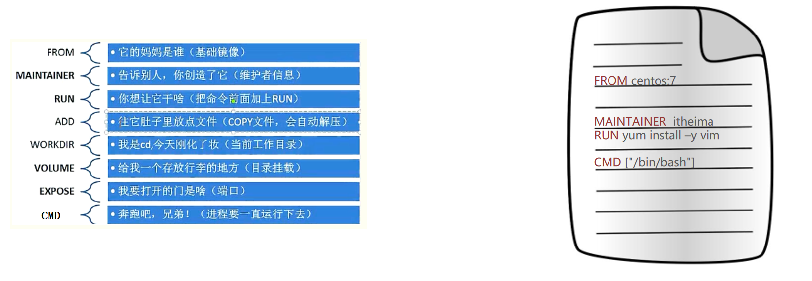
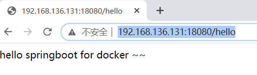

# Linux 安装Docker

## 更新yum

> sudo yum update

## 安装需要的软件包

 yum-util 提供yum-config-manager功能，另外两个是devicemapper驱动依赖的

> sudo yum install -y yum-utils device-mapper-persistent-data lvm2

## 设置yum源

> sudo yum-config-manager --add-repo https://download.docker.com/linux/centos/docker-ce.repo

## 安装最新版

> yum -y install docker-ce

## 启动docker

> systemctl daemon-reload 
>
> systemctl start docker
>
> systemctl stop docker
>
> systemctl restart docker
>
> systemctl status docker
>
> systemctl enable docker

## 修改源

> vim /etc/docker/daemon.json

> {"registry-mirrors": ["https://docker.mirrors.ustc.edu.cn"]}

> sudo systemctl restart docker

# 常用命令

## 镜像相关命令

### 查看本地镜像

- **-a :**列出本地所有的镜像（含中间映像层，默认情况下，过滤掉中间映像层）；
- **--digests :**显示镜像的摘要信息；
- **-f :**显示满足条件的镜像；
- **--format :**指定返回值的模板文件；
- **--no-trunc :**显示完整的镜像信息；
- **-q :**只显示镜像ID。

> docker images

### 搜索镜像

> docker search 镜像

### 拉取镜像

> docker pull 镜像:版本

### 删除镜像

> docker rmi 镜像:版本

## 容器相关命令

### 查看本地容器

#### 命令参数

- **-a :**显示所有的容器，包括未运行的。
- **-f :**根据条件过滤显示的内容。
- **--format :**指定返回值的模板文件。
- **-l :**显示最近创建的容器。
- **-n :**列出最近创建的n个容器。
- **--no-trunc :**不截断输出。
- **-q :**静默模式，只显示容器编号。
- **-s :**显示总的文件大小。

#### 参数说明

**CONTAINER ID:** 容器 ID。

**IMAGE:** 使用的镜像。

**COMMAND:** 启动容器时运行的命令。

**CREATED:** 容器的创建时间。

**STATUS:** 容器状态。

- created（已创建）
- restarting（重启中）
- running（运行中）
- removing（迁移中）
- paused（暂停）
- exited（停止）
- dead（死亡）

> docker ps
>
> docker ps -a

### 运行容器

- **-a stdin:** 指定标准输入输出内容类型，可选 STDIN/STDOUT/STDERR 三项；
- **-d:** 后台运行容器，并返回容器ID；
- **-i:** 以交互模式运行容器，通常与 -t 同时使用；
- **-P:** 随机端口映射，容器内部端口**随机**映射到主机的端口
- **-p:** 指定端口映射，格式为：**主机(宿主)端口:容器端口**
- **-t:** 为容器重新分配一个伪输入终端，通常与 -i 同时使用；
- **--name="nginx-lb":** 为容器指定一个名称；
- **--dns 8.8.8.8:** 指定容器使用的DNS服务器，默认和宿主一致；
- **--dns-search example.com:** 指定容器DNS搜索域名，默认和宿主一致；
- **-h "mars":** 指定容器的hostname；
- **-e username="ritchie":** 设置环境变量；
- **--env-file=[]:** 从指定文件读入环境变量；
- **--cpuset="0-2" or --cpuset="0,1,2":** 绑定容器到指定CPU运行；
- **-m :**设置容器使用内存最大值；
- **--net="bridge":** 指定容器的网络连接类型，支持 bridge/host/none/container: 四种类型；
- **--link=[]:** 添加链接到另一个容器；
- **--expose=[]:** 开放一个端口或一组端口；
- **--volume , -v:** 绑定一个卷

>docker run -d -p 8090:80 --name=mynginx nginx:latest

### 进入容器内部

- **-d :**分离模式: 在后台运行
- **-i :**即使没有附加也保持STDIN 打开
- **-t :**分配一个伪终端

>docker exec -it 容器名称 /bin/bash

### 查看容器信息

> docker inspect 容器名称

### 删除容器

> docker rm 容器名称

### **查看容器中运行的进程信息**

>docker top asp 
>
>docker top a76fc395f6ee

### **获取容器的日志**

> docker logs asp 
>
> docker logs a76fc395f6ee

### **端口映射**

>docker port asp 
>
>docker port a76fc395f6ee 
>
>docker ps

### 暂停容器服务

> docker pause db01 

### 恢复容器服务

> docker unpause db01

### 启动/停止/重启

> docker start asp 
>
> docker stop asp 
>
> docker restart asp

### **检查容器里文件结构的更改**

> docker diff mymysql

# 部署程序

## MongoDB

拉取最新镜像

> docker pull mongo

启动mongodb

> docker run --name mongo -p 27017:27017 -v /data/mongo:/data/mongodb -e MONGO_INITDB_ROOT_USERNAME=admin -e MONGO_INITDB_ROOT_PASSWORD=admin -d mongo

进入容器

> docker exec -it mongo bash 

进入mongodb

> mongo -u admin -p admin

切换数据库

> use admin

创建管理员账户

> db.createUser({user:"root",pwd:"root",roles:[{role:"root",db:"admin"}]}) 

## Mysql

拉取镜像

> docker pull mysql:5.7

启动mysql

> docker run --name mysql5.7 -e MYSQL_ROOT_PASSWORD=root -p 3307:3306 -d mysql:5.7

连接mysql

> docker exec -it mysql5.7 bash

navicat 连接docker容器里面mysql服务失败解决

> ALTER USER 'root'@'%' IDENTIFIED WITH mysql_native_password BY 'root' ;

## redis

搜索redis镜像

> docker search redis

拉取redis镜像

> docker pull redis:5.0

创建并启动容器

> docker run -d --name=redis5.0 -p 6379:6379 redis:5.0

## tomcat

搜索tomcat镜像

> docker search tomcat

拉取tomcat镜像

> docker pull tomcat:8.5

创建并启动容器

> docker run -d -p 8080:8080  --name=tomcat8.5  tomcat:8.5

在本地模拟一个项目(创建一个hello目录,然后向目录中输出一个文件index.html,内容为hello world)

> mkdir ./hello echo "hello world" > ./hello/index.html

从宿主机复制文件到容器(docker cp 宿主机路径 容器名称:容器路径)

> docker cp ./hello tomcat8.5:/usr/local/tomcat/webapps/

## Nginx

搜索nginx镜像

> docker search nginx

拉取tomcat镜像

> docker pull nginx

创建并启动容器

> docker run -d --name=nginx -p 80:80 nginx

# 数据卷

## 作用

数据持久化

容器之间的数据交换

## 配置

> docker run --name mongo -p 27017:27017 ==-v /data/mongo:/data/mongodb== -e MONGO_INITDB_ROOT_USERNAME=admin -e MONGO_INITDB_ROOT_PASSWORD=admin -d mongo
>
> docker run -d --name=tomcat1 -p 8081:8080 ==-v /root/tomcat/webapps:/usr/local/tomcat/webapps== tomcat:8.5
> docker run -d --name=tomcat2 -p 8082:8080 ==-v /root/tomcat/webapps:/usr/local/tomcat/webapps== tomcat:8.5

# Docker镜像制作

## 使用容器制作镜像(重点)

> docker commit 容器id 镜像名称:版本号

## 使用Dockerfile制作镜像(重点)

Dockerfile是一个用于描述生产docker镜像的文件，它里面是一条条的指令，每条指令都会对镜像产生一定影响。



> **案例：基于jdk1.8环境运行springboot项目，打包为镜像**

1)  将springboot-hello-0.0.1-SNAPSHOT.jar上传到linux

 

2）创建一个springboot-dockerfile文件，内容如下

~~~dockerfile
# 定义基础镜像（从哪个镜像的基础上开始做）
FROM java:8 
# 将jar包添加到容器，并改名为app.jar
ADD springboot-hello-0.0.1-SNAPSHOT.jar app.jar
# 镜像启动容器的时候，执行的命令
CMD java -jar app.jar
~~~

3) 通过dockerfile构建镜像 

```shell
# -f :指定要使用的Dockerfile路径   -t :指定生成的镜像名称   .  镜像构建过程中的上下文环境的目录 	
docker build -f ./springboot-dockerfile -t lofxve .
```

4) 查看生成的镜像，并运行为容器

~~~powershell
docker run -d -p 18080:8080 lofxve:latest
~~~

5）访问测试

 

## 镜像导入导出（扩展）

将镜像保存成tar包: docker save -o 导出文件名 镜像:版本

> docker save -o ./lofxve.tar lofxve:latest

接下来删除我们本地的mynginx:hehe镜像

> docker rmi lofxve:latest

然后再从tar包中将镜像导入到本机

> docker load < ./lofxve.tar
>
> docker load -i ./lofxve.tar

# DockerCompose

Compose是Docker的服务编排工具，主要用来构建基于Docker的复杂应用

Compose通过一个配置文件来管理多个Docker容器，非常适合组合使用多个容器进行开发的场景。

## Compose安装

安装docekr compose 工具

> curl -L https://github.com/docker/compose/releases/download/1.22.0/docker-compose-`uname -s`-`uname -m` -o /usr/local/bin/docker-compose

设置权限

> chmod +x /usr/local/bin/docker-compose

查看版本 

> docker-compose -version

## Compose命令


## Compose案例

> 通过docker compose进行容器批量管理：一次性启动三个容器（nginx，tomcat，redis）

1） 创建docker-compose目录

```shell
mkdir ~/docker-compose
cd ~/docker-compose
```

2） 创建docker-compose.yml文件，内容如下

```yaml
version: '3'
services: 
  nginx:
   container_name: my_nginx
   image: nginx
   ports:
    - 80:80
  tomcat:
   container_name: my_tomcat
   image: tomcat:8.5
   ports:
    - 8080:8080    
  redis:
   container_name: my_redis
   image: redis:5.0
   ports:
    - 6379:6379        
```

3） 启动容器

~~~powershell
# 为了演示效果更佳明显，我们使用下面命令先停止并删除所有容器
docker stop $(docker ps -q)
docker rm $(docker ps -aq)

# 执行命令,启动容器
# 执行此命令的时候，需要和配置文件在同一个目录下
docker-compose up -d
~~~

4) 停止并删除容器

~~~powershell
# 执行此命令的时候，需要和配置文件在同一个目录下
docker-compose down
~~~

# Docker和VM对比

**相同：**

- 容器和虚拟机具有相似的资源隔离和分配优势

**不同：**

- 容器虚拟化的是操作系统，虚拟机虚拟化的是硬件。
- 传统虚拟机可以运行不同的操作系统，容器只能运行同一类型操作系统