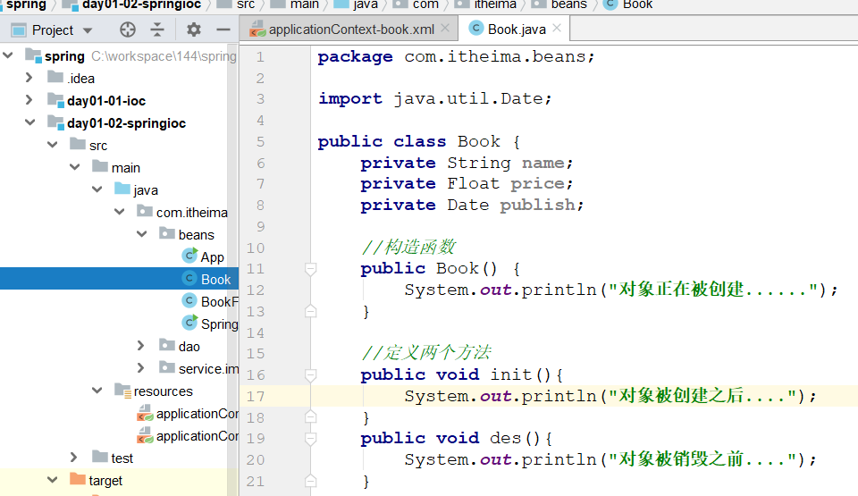
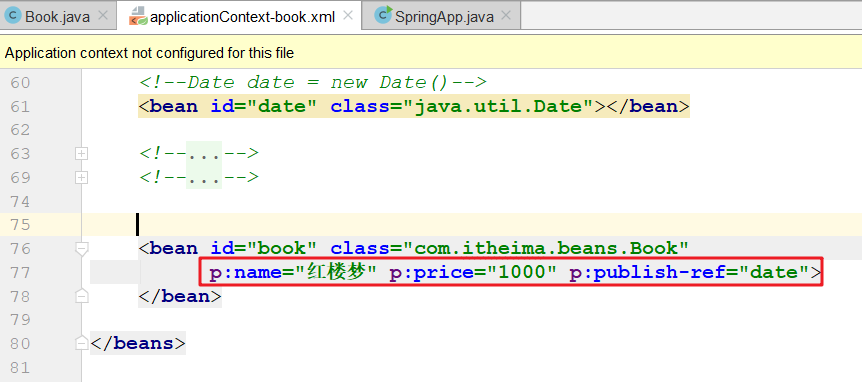

>提醒
>
>~~~markdown
>1. 先检查自己的idea环境maven的配置
>2. 笔记皮肤设置
>		将typora皮肤中的两个css复制到typora的主题文件夹下，重启typora，然后点击上面的主题，选择Newboy		
>~~~
>

# Spring概述(了解)

~~~markdown
* Spring是分层(三层)的Java应用轻量级开源框架

* Spring的核心是 IOC（Inverse Of Control：反转控制）和 AOP（Aspect Oriented Programming：面向切面编程）

* Spring一个全栈应用框架, 提供了表现层SpringMVC 和持久层SpringJDBC 以及业务层事务管理等众多应用技术

* Spring还能整合开源世界众多著名的第三方框架和类库，逐渐成为使用最多的Java EE企业应用开源框架 
~~~

**三层**

​	持久层   数据库         SpringJDBC

​	业务层   业务逻辑      声明式事务  Spring

​	表示层   用户            SpringMVC

**轻量级**

1. api用起来比较简单

 	2. 运行时占用资源比较少

**核心**

​	IOC  反转控制           工厂模式解耦

​	AOP 面向切面编程    动态代理

**核心思想**

​	我不重复造轮子

**体系架构图**

​	

# 认识IOC(理解)

>使用service调用dao层代码来推导IOC

## 环境准备

### 创建新工程，删掉src目录 

 

 

 

 

### 新建module，引入坐标 

 

## 版本一：原始版本

### 创建dao接口 

 

### 创建dao实现类 

 

### 在service类中创建dao对象

 

### 问题

> service层和dao层代码耦合了
>

## 版本二：工厂解耦

### 准备一个配置文件

 

### 创建一个生产对象的工厂

 

### 使用工厂创建对象 

 

### 问题

> 每次都会创建一个dao对象，对象是多例的，浪费了资源；
>
> 每次使用的时候才创建，浪费了时间;
>
> 希望对象可以提前创建好一个，存储起来，等我们调用的时候，直接返回来
>

## 版本三：优化工厂 

~~~java
package com.itheima.factory;

import java.util.Enumeration;
import java.util.HashMap;
import java.util.Map;
import java.util.ResourceBundle;

public class BeanFactory {

    //希望对象可以提前创建好一个，存储起来，等我们调用的时候，直接返回来

    //存储的时候,如果没有查询需求,用list;  如果后边还需要查询,用map
    static Map<String, Object> map = new HashMap<String, Object>();

    //在静态代码块(类加载)中创建出所有的对象,存储到map中
    static {
        try {
            //1. 读取配置文件(ResourceBundle 是专门读取properties配置文件的)
            ResourceBundle rb = ResourceBundle.getBundle("beans");

            //2. 遍历创建配置文件中的所有对象
            Enumeration<String> keys = rb.getKeys();

            while (keys.hasMoreElements()) {
                //3. 遍历到一个key
                String key = keys.nextElement();

                //4. 根据key获取类的全限定名
                String className = rb.getString(key);

                //5. 反射创建对象
                Class<?> clazz = Class.forName(className);
                Object instance = clazz.newInstance();

                //6. 将创建的对象存储到map中
                map.put(key, instance);
            }
        } catch (Exception e) {
            e.printStackTrace();
        }
    }

    //创建对象的方法 接收一个bean的标识  返回一个bean的对象
    public static Object getBean(String beanId) {
        return map.get(beanId);
    }
}
~~~

## 总结(IOC概念引出)

> 对象的创建由原来的==使用new关键字在类中主动创建==变成了==从工厂中获取==，而对象的创建过程由工厂内部来实现，
>
> 而这个工厂就是Spring的IOC容器，也就是以后我们的==对象不再自己创建，而是直接向Spring要==，这种思想就是==IOC==
>

IOC就是切换了我们获取对象的方式:new------>要

# IOC思想介绍(面试)

> IOC( 控制 反转 )是一种设计思想。它的目的是指导我们设计出更加松耦合的程序。(解耦)
>
> 控制：指的是控制权，现在可以简单理解为对象的创建权限
>
> 反转：指的对象的控制权由==程序员在类中主动控制(new)==反转到==由Spring容器==来控制。
>

找对象

​	原始方式: 要对象, 自己去大街上找, 找到合适弄家去

​	婚姻介绍所:  男男女女们先将自己的个人信息注册到婚介所, 然后等你需要对象了, 直接问婚介所要, 由婚介所给你弄一个过来

# Spring的入门案例(重点)

## 案例步骤

### 创建新的模块,引入依赖

 

### 复制dao接口和实现类

 

### 加入spring的配置文件

 

### 从service类中测试

 

## 案例中的要点分析

1  SpringIOC容器启动过程中要做哪些操作

 

2  SpringIOC存储对象的Map到底在哪里

 

# API介绍(了解) 

 

## 两个接口( 面试题 )

~~~markdown
* BeanFactory
	这是SpringIOC容器的顶级接口，它定义了SpringIOC的最基础的功能，但是其功能比较简单，一般面向Spring自身使用
	BeanFactroy在第一次使用到某个Bean时(调用getBean())，才对该Bean进行加载实例化

* ApplicationContext
	这是在BeanFactory的子接口，它扩展了BeanFactory的功能，一般面向程序员使用 
	ApplicationContext是在容器启动时，一次性创建并加载了所有的Bean

* 注意: 上面两种方式创建的对象都是单例，只是创建对象的时机不同
~~~

>两个接口区别:
>
>​	

## 三个实现类

~~~markdown
* 这三个类的作用都是：读取配置文件, 初始化Spring的IOC容器,  不一样的是加载配置文件的位置
	- ClassPathXmlApplicationContext         读取类路径下的xml作为配置文件
	- FileSystemXmlApplicationContext        读取本地目录下的xml作为配置文件	
	- AnnotationConfigApplicationContext     读取一个注解配置作为配置文件
~~~

 

## 一个方法

~~~markdown
* getBean() 用于从Spring容器中获取Bean对象，参数可以使用三种情况：
	getBean("id")                     使用bean的id从容器中查找对象
	getBean(Bean.class)           使用bean的class类型从容器中查找对象
	getBean("id", Bean.class)   使用bean的id 和 class类型从容器中查找对象

~~~

 

# Bean的配置(重点)

## bean的创建方式

### 使用java创建对象的三种方式

> 我们常用的创建对象的方式有三种：
>
> 1. 直接使用new关键字创建
> 2. 使用静态工厂创建
> 3. 使用实例化工厂创建
>

1. 创建Book类

    

2. 创建BookFactory类

    

3. 测试

    

### 使用Spring创建对象三种方式

1. 配置

    

2. 测试

    

## bean的作用范围

> ~~~markdown
> * 在Spring中，对于bean支持五种作用范围：
> - singleton(默认)    单例模式，即对象只创建一次, 然后一直存在
> - prototype          多例模式，即每次获取bean(调用getBean方法的时候)的时候，IOC都给我们创建一个新对象
> - request            web项目中，Spring创建一个Bean的对象，将对象存入到request域中
> - session            web 项目中，Spring创建一个Bean 的对象，将对象存入到session域中
> - globalSession      用于分布式web开发中，创建的实例绑定全局session对象
> ~~~

### singleton

1. 添加Book类的构造函数

    

2. 配置单例

    

3. 测试

    

### prototype

1. 配置多例

    

2. 测试

    

## bean的生命周期

> 研究bean的生命周期，无非就是弄明白bean是什么时候创建的，什么时候销毁的
>
> 在Spring中，bean的作用范围会影响到其生命周期，所以我们要分单例和多例对象来研究bean的生命周期
>

### 单例对象

>单例对象在容器创建的时候创建，在容器销毁的时候销毁

1. 在Book类中添加两个方法
    

2. 配置对象的创建和销毁方法

    

3. 测试

    

### 多例对象

>多例对象会在每次调用getBean的时候创建，对象的销毁是不受Spring控制，由对象所在现成的垃圾回收器负责回收

1. 配置对象为多例

    

2. 测试

    

## 依赖注入(重点)

> 依赖注入(Dependency Injection，DI) 其实就是给对象中的属性赋值的过程
>
> 依赖注入有两种方式，分别是使用构造函数和set方法

### 构造函数

1. 在Book类中添加一个全参构造

     

2. 在spring的配置文件中, 通过全参构造进行赋值

    

3. 测试

    

### set方法

1. 在Book类中添加set方法

    

2. 在spring的配置文件中, 通过set方法进行赋值

    

3. 测试(略)

### p名称空间写法(set变形)

>使用这种写法,需要额外打入一个p空间的约束

 

## 注入集合属性

### 重新写Book类

~~~java
package com.itheima.beans;

import java.util.*;

public class Book {
    private String name;
    private Float price;
    private Date publish;

    //模拟一些复杂类型数据
    private List<String> myList;
    private Set<String> mySet;
    private String[] myArr;

    private Map<String, String> myMap;

    public void setMyList(List<String> myList) {
        this.myList = myList;
    }

    public void setMySet(Set<String> mySet) {
        this.mySet = mySet;
    }

    public void setMyArr(String[] myArr) {
        this.myArr = myArr;
    }

    public void setMyMap(Map<String, String> myMap) {
        this.myMap = myMap;
    }

    //set方法
    public void setName(String name) {
        this.name = name;
    }

    public void setPrice(Float price) {
        this.price = price;
    }

    public void setPublish(Date publish) {
        this.publish = publish;
    }

    //全参构造
    public Book(String name, Float price, Date publish) {
        this.name = name;
        this.price = price;
        this.publish = publish;
    }

    @Override
    public String toString() {
        return "Book{" +
                "name='" + name + '\'' +
                ", price=" + price +
                ", publish=" + publish +
                ", myList=" + myList +
                ", mySet=" + mySet +
                ", myArr=" + Arrays.toString(myArr) +
                ", myMap=" + myMap +
                '}';
    }

    //构造函数
    public Book() {
        System.out.println("对象正在被创建......");
    }

    //定义两个方法
    public void init() {
        System.out.println("对象被创建之后....");
    }

    public void des() {
        System.out.println("对象被销毁之前....");
    }
}
~~~

### 在配置文件中依赖注入

 

# 配置文件分模块(掌握)

~~~markdown
* 我们现在的配置都集中配在了一个applicationContext.xml文件中，当开发人员过多时， 如果所有bean都配置到同一个配置文件中，会使这个文件巨大。
* 针对这个问题,Spring给我们提供了两种解决方案:
	1. 同时引入多个配置文件
	2. 从一个配置文件中引入其他的文件
* 注意:
	1. 同一个xml文件中不允许出现相同名称的bean，如果出现会报错
	2. 多个xml文件如果出现相同名称的bean，不会报错，但是后加载的会覆盖前加载，所以尽量保证bean的名称是唯一的。
~~~

## 同时引入多个配置文件

 

## 从一个配置文件中引入其他的文件

# DbUtils(会用)

## DbUtils介绍

~~~markdown
* DbUtils是Apache的一款用于简化Dao代码的工具类，它底层封装了JDBC技术。

* 核心类：
	- QueryRunner       用于执行增删改查的SQL语句
	- ResultSetHandler  这是一个接口，主要作用是将数据库返回的记录封装进实体对象
* 核心方法：
	- update() 用来执行增、删、改语句
	- query()  用来执行查询语句
~~~

~~~java
//创建一个QueryRunner对象，用来执行增删改查
//这里需要给一个数据源，如果此处不给，那么使用它调用具体API的时候必须要给
QueryRunner queryRunner = new QueryRunner(dataSource);

//update方法，用于执行增删改语句
//第一个参数:sql语句   后面的参数:sql语句中的所需要的的值
queryRunner.update("insert into account value(null,?,?)",1,2);

//query方法，用于执行查询语句
//第一个参数:sql语句   第一个参数:封装返回值   后面的参数:sql语句中的所需要的的值
//BeanHandler用于将一条返回数据封装成一个JavaBean,  类似的子类还有BeanListHandler等
queryRunner.query("select * from account where aid = ?",  new BeanHandler<Account>(Account.class),  1); 
~~~

## DbUtils简单使用

### 准备数据环境

 

### 创建模块,引入依赖

  

### 创建实体类

 

### 测试

~~~java
package com.itheima.test;

import com.alibaba.druid.pool.DruidDataSource;
import com.itheima.domain.Account;
import org.apache.commons.dbutils.QueryRunner;
import org.apache.commons.dbutils.handlers.BeanHandler;
import org.apache.commons.dbutils.handlers.BeanListHandler;
import org.junit.Test;

import java.sql.SQLException;
import java.util.List;

public class DbUtilsTest {
    //新增
    @Test
    public void testSave() throws SQLException {
        //1. 创建dataSource,设置数据库连接四要素
        DruidDataSource dataSource = new DruidDataSource();
        dataSource.setDriverClassName("com.mysql.jdbc.Driver");
        dataSource.setUrl("jdbc:mysql:///spring");
        dataSource.setUsername("root");
        dataSource.setPassword("root");

        //2. 创建queryRunner
        QueryRunner queryRunner = new QueryRunner(dataSource);

        //3. 测试新增方法
        queryRunner.update("insert into account values(null,?,?)", "B02", 100);
    }

    //根据name查询账户
    @Test
    public void testFindByName() throws SQLException {
        //1. 创建dataSource,设置数据库连接四要素
        DruidDataSource dataSource = new DruidDataSource();
        dataSource.setDriverClassName("com.mysql.jdbc.Driver");
        dataSource.setUrl("jdbc:mysql:///spring");
        dataSource.setUsername("root");
        dataSource.setPassword("root");

        //2. 创建queryRunner
        QueryRunner queryRunner = new QueryRunner(dataSource);

        //3. 根据name查询账户
        Account account =
                queryRunner.query("select * from account where name = ?", new BeanHandler<Account>(Account.class), "B01");
        System.out.println(account);
    }

    //查询账户列表
    @Test
    public void testFindAll() throws SQLException {
        //1. 创建dataSource,设置数据库连接四要素
        DruidDataSource dataSource = new DruidDataSource();
        dataSource.setDriverClassName("com.mysql.jdbc.Driver");
        dataSource.setUrl("jdbc:mysql:///spring");
        dataSource.setUsername("root");
        dataSource.setPassword("root");

        //2. 创建queryRunner
        QueryRunner queryRunner = new QueryRunner(dataSource);

        //3. 查询账户列表
        List<Account> accounts =
                queryRunner.query("select * from account", new BeanListHandler<Account>(Account.class));
        for (Account account : accounts) {
            System.out.println(account);
        }
    }
}
~~~

# 综合练习(重点)

>使用Spring和Dbutils完成对数据库的crud操作
>
>持久层  dbutils
>
>业务层  Spring
>
>表示层  单元测试

## 创建模块,引入依赖

 

~~~xml
    <dependencies>
        <!--mysql-->
        <dependency>
            <groupId>mysql</groupId>
            <artifactId>mysql-connector-java</artifactId>
            <version>5.1.6</version>
        </dependency>
        <!--druid-->
        <dependency>
            <groupId>com.alibaba</groupId>
            <artifactId>druid</artifactId>
            <version>1.1.15</version>
        </dependency>
        <!--dbutils-->
        <dependency>
            <groupId>commons-dbutils</groupId>
            <artifactId>commons-dbutils</artifactId>
            <version>1.7</version>
        </dependency>
        <!--junit-->
        <dependency>
            <groupId>junit</groupId>
            <artifactId>junit</artifactId>
            <version>4.12</version>
        </dependency>
        <!--lombok-->
        <dependency>
            <groupId>org.projectlombok</groupId>
            <artifactId>lombok</artifactId>
            <version>1.18.8</version>
        </dependency>
        <!--spring-->
        <dependency>
            <groupId>org.springframework</groupId>
            <artifactId>spring-context</artifactId>
            <version>5.1.6.RELEASE</version>
        </dependency>
    </dependencies>
~~~

## 创建实体类

 

## 创建dao层接口

 

## 创建dao层实现类

 

 

## 创建service层接口

 

## 创建service层实现类

 

## 加入spring的配置文件

 

## 测试

 

重点:

	1. IOC的概念
	2. Spring的入门案例
	3. Bean的配置: 依赖注入
	4. 配置文件模块化
	5. 综合练习
	6. 面试题: 生存范围   声明周期   BeanFactory VS ApplicationContext