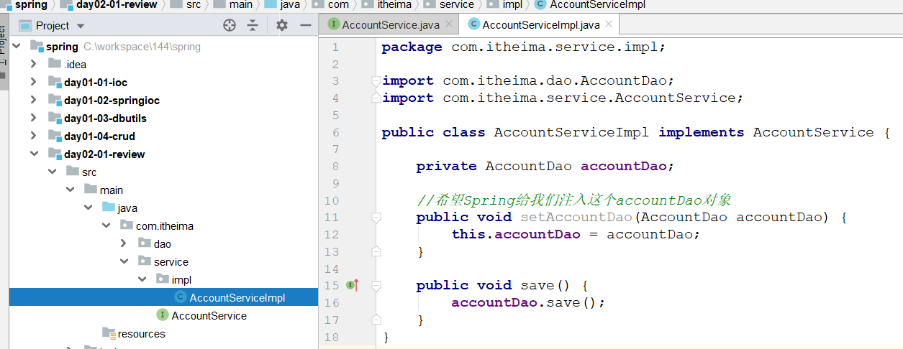
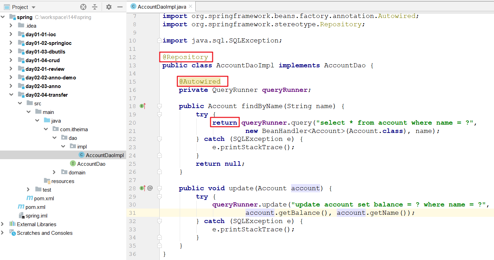

# 回顾

~~~markdown
1. 什么是IOC
	IOC  控制反转   对象的控制权由程序在类中主动控制反转到了Spring容器控制   就是切换了对象的创建方式

2. Spring的API
	两个接口:  BeanFactory  ApplicationContext   
	三个实现类: 读取配置  初始化Spring容器
	一个方法: getBean(xxx.class)

3. bean的生存范围和生命周期
	singleton  prototype  request  session  globalSession
	单例:对象 容器创建 它创建  容器销毁  它销毁
	多例:对象 每次getBean是创建   销毁不是Spring控制,垃圾回收器负责销毁

4. 依赖注入(对对象中的属性赋值)
	构造      
	set方法  <property name="" value="">    <property name="" ref="">
	
5. dbutils
	发送SQL语句到数据库
		queryRunner.update(增删改)
		queryRunner.query(查询)
	封装返回记录到对象
		BeanHandler----对象
		BeanListHandler----集合
~~~

# 伪代码回顾昨天的案例

> ==test---service---dao---直接打印一句话==

## 创建模块,引入依赖

 

## 创建dao接口

 

## 创建dao实现

 

## 创建service接口

 

## 创建service实现

 

## 加入spring的配置文件

 

## 测试

 

# Spring常见注解(重点)

## 复制工程(对着视频做)

 

## 对象创建

### 注解使用

1. 注释掉xml文件中的所有内容

   

2. 添加注解扫描

    

3. 使用Spring的注解将dao放入容器

    

4. 测试

    

### 总结

~~~markdown
* @Component
	用于创建对象，相当于配置文件中的<bean id="" class=""/>
	它支持一个属性value,  相当于xml中bean的id。如果不写，默认值为类名的首字母小写
	
* @Controller  @Service  @Repository
	这三个注解的功能跟@Component类似，他们分别标注在不同的层上。
	@Controller  标注在表示层的类上
	@Service     标注在业务层的类上
	@Repository  标注在持久层的类上
	推荐使用这三个，当一个类实在不好归属在这三个层上时，再使用@Component
~~~

## 对象生存范围

### 配置

1. 验证单例

    

2. 验证多例

    

### 总结

~~~markdown
* @Scope用于指定bean的作用范围(单例和多例)，相当于配置文件中的<bean scope=""> 
~~~

## 对象生命周期

### 配置

 

### 总结

~~~markdown
* @PostConstruct @PreDestroy 这两个注解标注方法分别在对象的创建之后和销毁之前执行。
* 相当于<bean init-method="init" destroy-method="destory" /> 
~~~

## 对象依赖注入

### 注解使用

> 将service对象也要放入容器, 并注入dao

 

> 建议大家看视频

~~~java
@Service
public class AccountServiceImpl implements AccountService {

    // @Autowired 表示自动依赖注入,它可以标注在属性上,也可以标注在属性对应set方上
    // 当它标注在属性上的时候, set方法可以省略不写

    //当@Autowired标注在一个属性上的时候,它会先根据当前属性的类型(AccountDao)从Spring的IOC容器中进行查找
    //找不到, 就报错  No qualifying bean of type 'xxxx' available: expected at least 1 bean which qualifies as autowire
    //正好找到一个, 就进行注入
    //找到了多个, Spring会根据当前属性的名称在找到的多个bean对象中进行匹配
    //  如果匹配上了, 就进行依赖注入
    //  如果匹配不上, 就报错  No qualifying bean of type 'xxx' available: expected single matching bean but found 2;//accountDaoImpl1 accountDaoImpl2
    @Autowired
    private AccountDao accountDao;
}
~~~

>@Qualifier 的使用

 

### 总结

~~~markdown
1. @Autowired
	这个注解表示依赖注入，他可以标注在属性上，也可以标注在方法上，当@Autowired标注在属性上的时候，属性对应的set方法可以省略不写
	Spring会在他的IOC容器中按照被标注属性的类型进行寻找
        如果找不到，就会报错
        如果找到了，而且正好找到了一个，那么就进行依赖注入
        如果找到了，但是找到了多个，它会再按照属性名称进行匹配
            如果匹配上了就注入
            如果匹配不上就报错
        
2. @Qualifier
	要跟@Autowired联合使用，代表在按照类型匹配的基础上，再按照名称匹配
	
3. @Resource(了解)
	此注解由java提供，而且9版本以后废弃了
	Spring会在他的IOC容器中先按照属性名称进行寻找
        如果找到了，就进行依赖注入
        如果找不到，再按照类型进行匹配
            如果正好匹配到一个，就注入
            如果匹配到多个，就报错
	注意: @Resource(name = "userDaoImpl1") 如果直接使用name指定名称，他就只会按照名称匹配
~~~

## 注解总结

| xml配置                                               | 注解配置                                    | 说明                       |
| ----------------------------------------------------- | ------------------------------------------- | -------------------------- |
| < bean id="" class="" >                               | @Component @Controller @Service @Repository | bean的创建                 |
| < property name="" value="">                          | @Value                                      | bean的简单属性注入         |
| < property name="" ref="">                            | @Autowired  @Qualifier  @Resource           | bean的对象属性注入         |
| < bean scope="">                                      | @Scope                                      | 控制bean的作用范围         |
| < bean init-method="init" destroy-method="destory" /> | @PostConstruct @PreDestroy                  | bean创建之后和销毁之前调用 |

> ==常用==
>
> 如何将一个类创建成对象放入容器 @Component @Controller @Service @Repository  
>
> 如何从容器中获取一个对象 @Autowired

# Spring半注解开发(重点)

> 半注解: 我们自己写的类使用注解配置,  第三方的类使用xml配置

## 复制工程

 

## xml中自己的类注释掉

 

## 添加注解扫描

 

## 修改dao

 

## 修改service

 

## 测试

 

# Spring纯注解开发(重点)

>半注解---纯注解(将xml中的所有东西转移一个java的配置类中)

## 开发步骤

### 配置转移

> 创建一个java类, 将xml中剩余的配置转移到配置类中

 

### 测试

 

### 优化一:提取配置信息

1. 创建properties配置文件

    

2. 在配置类中加载文件,然后使用@Value完成赋值

    

### 优化二:配置类拆分

1. 再创建一个配置类

    

2. 从SpringConfig中导入DbConfig

    

优化三: 使用配置类加载对象

## 新注解总结

~~~markdown
@ComponentScan
	组件扫描注解。 相当于xml配置文件中的< context:component-scan base-package=""/> 

@Bean
	该注解只能写在方法上，表明使用此方法创建一个对象，并且放入spring容器。它支持一个name属性，用于给生成的bean取一个id。 

@PropertySource
	用于引入其它的properties配置文件

@Import
	在一个配置类中导入其它配置类的内容

@Configuration
	被此注解标注的类,会被Spring认为是配置类。Spring在启动的时候会自动扫描并加载所有配置类,然后将配置类中bean放入容器

~~~

# Spring整合单元测试(会用)

~~~markdown
* 在单元测试中，当点击run的时候，底层工作的其实是一个运行器，这个运行器是junit提供的，它不认识Spring的环境，
* 这也就意味着它无法从spring的容器中获取bean，如果想要从Spring的容器中获取对象，那就必须先认识Spring环境，
* Spring提供了一个运行器,这个运行器就认识Spring环境, 也就可以获取对象了
~~~

1. 加入Spring整合单元测试坐标

    

2. 在配置类中使用注解传递配置文件, 启动Spring容器

    

# 完成转账的功能

## 思路分析

 

## 代码开发

### 准备数据环境

 

### 创建模块,导入依赖

 

~~~xml
<dependencies>
        <dependency>
            <groupId>mysql</groupId>
            <artifactId>mysql-connector-java</artifactId>
            <version>5.1.6</version>
        </dependency>
        <dependency>
            <groupId>com.alibaba</groupId>
            <artifactId>druid</artifactId>
            <version>1.1.15</version>
        </dependency>
        <dependency>
            <groupId>commons-dbutils</groupId>
            <artifactId>commons-dbutils</artifactId>
            <version>1.7</version>
        </dependency>
        <dependency>
            <groupId>org.springframework</groupId>
            <artifactId>spring-context</artifactId>
            <version>5.1.6.RELEASE</version>
        </dependency>
        <dependency>
            <groupId>junit</groupId>
            <artifactId>junit</artifactId>
            <version>4.12</version>
        </dependency>
        <dependency>
            <groupId>org.springframework</groupId>
            <artifactId>spring-test</artifactId>
            <version>5.1.6.RELEASE</version>
        </dependency>
        <dependency>
            <groupId>org.projectlombok</groupId>
            <artifactId>lombok</artifactId>
            <version>1.18.8</version>
        </dependency>
    </dependencies>
~~~

### 创建实体类

 

~~~java
package com.itheima.domain;

import lombok.Data;

@Data
public class Account {
    private Integer aid;
    private String name;
    private Float balance;
}
~~~

### 创建dao接口

 

### 创建dao实现

 

### 创建service接口

 

### 创建service实现

 

### 加入spring配置

 

~~~xml
<?xml version="1.0" encoding="UTF-8"?>
<beans xmlns="http://www.springframework.org/schema/beans"
       xmlns:p="http://www.springframework.org/schema/p"
       xmlns:xsi="http://www.w3.org/2001/XMLSchema-instance"
       xmlns:context="http://www.springframework.org/schema/context"
       xsi:schemaLocation="http://www.springframework.org/schema/beans
			    http://www.springframework.org/schema/beans/spring-beans.xsd
			    http://www.springframework.org/schema/context
			    http://www.springframework.org/schema/context/spring-context.xsd">

    <!--注解扫描-->
    <context:component-scan base-package="com.itheima"/>

    <!--dataSource-->
    <bean id="dataSource" class="com.alibaba.druid.pool.DruidDataSource">
        <property name="driverClassName" value="com.mysql.jdbc.Driver"></property>
        <property name="url" value="jdbc:mysql:///spring"></property>
        <property name="username" value="root"></property>
        <property name="password" value="root"></property>
    </bean>

    <!--queryRunner-->
    <bean id="queryRunner" class="org.apache.commons.dbutils.QueryRunner">
        <constructor-arg name="ds" ref="dataSource"></constructor-arg>
    </bean>
</beans>
~~~

### 测试

 

## 事务问题

> ~~~markdown
> * 当前代码存在事务问题，事务问题原因是:  每执行完一条sql语句后，jdbc会自动提交事务
> * 如果想要解决它，可以使用手动提交事务的方式，代码大体结构如下：
>         try{
>             connection.setAutoCommit(false);//开启事务
>             
>             
>             业务代码(多条sql)
>             
>             
>             
>             connection.commit();//提交事务
>         }catch(Exception e){
>             connection.rollback();//回滚事务
>         }finally{
>             connection.close();//关闭事务
>         }
> * 要做到上面这个，有个前提：要保证业务代码部分使用的是同一个connection
> ~~~

> ~~~markdown
> * 准备一个本地集合，用于临时存储connection， 也就是在第一条SQL执行之前，获取到connection放到集合中
> * 接下来的所有sql都使用本地集合中的connection去执行，等到所有的SQL都执行完毕之后，再将connection归还连接池
> ~~~

> ThreadLocal   本地局部变量，它的底层就是一个特殊的map结构，此map的键是固定的，是当前线程对象
>
> ~~~markdown
> * 常见方法:
> 	set(value)      向ThreadLocal中存入值
> 	get()           从ThreadLocal取出值
> 	remove()        移除ThreadLocal中跟当前线程相关的数据
> ~~~

~~~java
package com.itheima.tx;

import java.util.Hashtable;
import java.util.Map;

//目的: 为了大家更好的理解th的工作原理
public class ThreadLocal {
    //本地集合
    private Map<Thread, String> map = new Hashtable<Thread, String>();

    //存储
    public void set(String value) {
        map.put(Thread.currentThread(), value);
    }

    //获取
    public String get() {
        return map.get(Thread.currentThread());
    }

    //清理
    public String remove() {
        return map.remove(Thread.currentThread());
    }
}
~~~

# 开发事务管理器

## 代码开发

### 复制工程

 

### 开发一个事务管理工具类

~~~java
package com.itheima.tx;

import org.springframework.beans.factory.annotation.Autowired;
import org.springframework.stereotype.Component;

import javax.sql.DataSource;
import java.sql.Connection;
import java.sql.SQLException;

//事务管理工具类
@Component
public class TxManager {

    @Autowired
    private DataSource dataSource;

    //本地集合(一个临时存储连接对象的集合)
    ThreadLocal<Connection> th = new ThreadLocal<Connection>();

    //获取connection
    public Connection getConnection() throws SQLException {
        Connection connection = th.get();
        if (connection == null) {//直接从本地集合没有获取到
            connection = dataSource.getConnection();//从连接池中拿
            th.set(connection);//将连接池中拿到的放入本地集合
        }
        return connection;
    }

    //开启事务
    public void begin() {
        try {
            getConnection().setAutoCommit(false);
        } catch (SQLException e) {
            e.printStackTrace();
        }
    }

    //提交事务
    public void commit() {
        try {
            getConnection().commit();
        } catch (SQLException e) {
            e.printStackTrace();
        }
    }

    //回滚事务
    public void rollback() {
        try {
            getConnection().rollback();
        } catch (SQLException e) {
            e.printStackTrace();
        }
    }

    //关闭事务
    public void close() {
        try {
            getConnection().close();
            th.remove();
        } catch (SQLException e) {
            e.printStackTrace();
        }
    }
}
~~~

### 修改dao

 

### 修改service

 

### 测试(略)

## 问题分析

> 现在的事务代码和业务代码严重耦合在一起了，我们希望的是这样：在不改动原来业务代码的前提下，给代码添加事务管理功能
>
> 即：在不修改源代码的情况下，给代码增强功能

## 解决思路

动态代理

重点:

 	1. Spring的半注解版
 	2. Spring的纯注解版
 	3. 10个新注解(整理)
 	4. 转账功能
 	5. 事务处理(  原理部分,  至少视频再听一遍 )  
 	6. 复习动态代理 