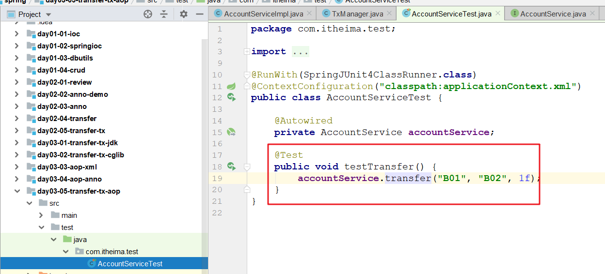
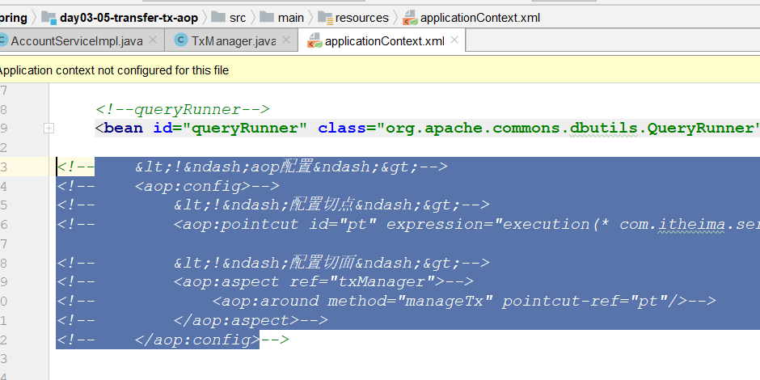

# 回顾

~~~markdown
1. Spring的核心IOC
	IOC 控制翻转---------转换了对象的获取方式(new---->要 [对象的创建信息事先要通过配置文件或者注解形式告诉Spring])

2. 如何将一个对象放入容器 如何从容器中获取一个对象   UserDaoImpl
	xml版本
        <bean id="userDao" class="com.itheima.dao.impl.UserDaoImpl">
            <property name=""  value=""  ref="">
        </bean>
	注解版本(重点)
        @Component( @Controller  @Service  @Repository )
        class UserDaoImpl{
		   @Autowired	//==act.getBean(QueryRunner.class)
            private QueryRunner queryRunner;
        }	

3. 理论
	单例
		出生: 容器创建
		死亡: 容器销毁
	多例
		出生: 每次getBean()获取
		死亡: 不受Spring控制, 垃圾回收器负责

4. 注解
	@Bean       表在一个方法上, 将方法的返回值对象放入容器
	@Import     从一个类中导入另一个 (两个类的对象都会出现在Spring容器中)
	@Configuration 表在配置类, 它会自动将配置类放入容器
~~~

# 动态代理优化转账案例

>当前代码的问题:1. 耦合性  2 缺少代码复用性
>
>动态代理: 不改变源代码的基础上  增强其功能
>
>​	目标对象: 被增强的对象 
>
>​	增强逻辑: 一段具体的功能
>
>​	代理对象: 目标对象+增强逻辑 
>
>要实现的功能是: 在不改变转账的代码的前提上,添加事务管理功能
>
>​	目标对象: 被增强的对象             AccountServiceImpl
>
>​	增强逻辑: 一段具体的功能          TxManager
>
>​	代理对象: 目标对象+增强逻辑    最后要创建出来

## jdk动态代理

### 复制工程

 

### 准备目标对象

 

### 准备增强对象

 

### 创建代理对象(重点)

>直接在测试类中修改

~~~java
package com.itheima.test;

import com.itheima.service.AccountService;
import com.itheima.tx.TxManager;
import org.junit.Test;
import org.junit.runner.RunWith;
import org.springframework.beans.factory.annotation.Autowired;
import org.springframework.test.context.ContextConfiguration;
import org.springframework.test.context.junit4.SpringJUnit4ClassRunner;

import java.lang.reflect.InvocationHandler;
import java.lang.reflect.Method;
import java.lang.reflect.Proxy;

@RunWith(SpringJUnit4ClassRunner.class)
@ContextConfiguration("classpath:applicationContext.xml")
public class AccountServiceTest {

    @Autowired
    private AccountService accountService;

    @Autowired
    private TxManager txManager;

    @Test
    public void testTransfer() {

        //增强逻辑
        InvocationHandler invocationHandler = new InvocationHandler() {
            public Object invoke(Object proxy, Method method, Object[] args) throws Throwable {
                Object obj = null;
                try {
                    txManager.begin();//开启事务

                    //这句话的意思就是执行原有的方法
                    obj = method.invoke(accountService, args);

                    txManager.commit();//提交事务
                } catch (Exception e) {
                    e.printStackTrace();
                    txManager.rollback();//回滚事务
                } finally {
                    txManager.close();//关闭事务
                }
                return obj;
            }
        };

        //创建出代理对象
        AccountService instance = (AccountService) Proxy.newProxyInstance(
                accountService.getClass().getClassLoader(),//类加载器
                accountService.getClass().getInterfaces(),//目标对象的接口
                invocationHandler//增强逻辑
        );

        //调用代理对象 转账
        instance.transfer("B01", "B02", 1f);
    }
}
~~~

## cglib动态代理(了解)

>基于JDK实现动态代理强制要求被代理对象要有接口, 如果被代理对象没有接口,可以选择cglib的动态代理(这种方式在效率上要比jdk的低)
>
>基于cglib的动态代理底层是基于父类实现的

### 复制工程

 

### 将service接口删掉

### 基于cglib实现动态代理

 

~~~java
package com.itheima.test;

import com.itheima.service.impl.AccountServiceImpl;
import com.itheima.tx.TxManager;
import org.junit.Test;
import org.junit.runner.RunWith;
import org.springframework.beans.factory.annotation.Autowired;
import org.springframework.cglib.proxy.Enhancer;
import org.springframework.cglib.proxy.InvocationHandler;
import org.springframework.test.context.ContextConfiguration;
import org.springframework.test.context.junit4.SpringJUnit4ClassRunner;

import java.lang.reflect.Method;
import java.lang.reflect.Proxy;

@RunWith(SpringJUnit4ClassRunner.class)
@ContextConfiguration("classpath:applicationContext.xml")
public class AccountServiceTest {

    @Autowired
    private AccountServiceImpl accountService;

    @Autowired
    private TxManager txManager;

    @Test
    public void testTransfer() {

        //增强逻辑
        InvocationHandler invocationHandler = new InvocationHandler() {
            public Object invoke(Object proxy, Method method, Object[] args) throws Throwable {
                Object obj = null;
                try {
                    txManager.begin();//开启事务

                    //这句话的意思就是执行原有的方法
                    obj = method.invoke(accountService, args);

                    txManager.commit();//提交事务
                } catch (Exception e) {
                    e.printStackTrace();
                    txManager.rollback();//回滚事务
                } finally {
                    txManager.close();//关闭事务
                }
                return obj;
            }
        };

        //基于cglib创建出代理对象
        //1. 创建增强器
        Enhancer enhancer = new Enhancer();

        //2 设置父类
        enhancer.setSuperclass(AccountServiceImpl.class);

        //3 设置增强逻辑[注意invocationHandler使用的是cglib的]
        enhancer.setCallback(invocationHandler);

        //4 创建代理对象
        AccountServiceImpl instance = (AccountServiceImpl) enhancer.create();

        //调用代理对象 转账
        instance.transfer("B01", "B02", 1f);
    }
}
~~~

## 两种代理方式的对比

首先明确在创建代理实现类时，jdk的效率要高于cglib，所以选择的时候:

- 当被代理类有接口的时候,使用jdk动态代理，因为它的效率高
- 当被代理类没有接口的时候,使用cglib动态代理，因为没办法

## 总结

 

当核心业务（转账）和增强业务（事务）同时出现时，我们可以在开发时对他们分别开发，运行时再组装在一起（使用动态代理的方式）。

这样做的好处是：

1. 逻辑清晰，开发核心业务的时候，不必关注增强业务的代码
2. 代码复用性高：增强代码不用重复书写

这就是一种 AOP 的思想。 

我的总结: ==开发阶段分离开发,  运行阶段组装运行==

> 生活中  方便面
>
> 	1. 面
>  	2. 酸菜
>
> 酸菜 +  面  ===  老坛酸菜面

# AOP介绍

## 概念

AOP( 面向切面编程 )是一种思想，它的目的就是在不修改源代码的基础上，对原有功能进行增强。

SpringAOP是对AOP思想的一种实现，Spring底层同时支持jdk和cglib动态代理。

Spring会根据被代理的类是否有接口自动选择代理方式：

- 如果有接口，就采用jdk动态代理(当然，也可以强制使用cglib)
- 没有接口就采用cglib的方式

 

## 术语(难点)

~~~markdown
* 目标对象
	被代理对象
	
* 连接点
	被代理对象中的所有方法

* 切入点
	被代理对象中的一部分(要进行功能增强的部分)方法  transfer

* 增强(通知)
	一个具体的增强功能(事务控制  开启事务  关闭事务  提交事务  回滚事务) 一个增强对象中会有多个增强功能  事务四个方法

* 织入(强调的是动作或者过程)
	将切入点和增强进行组装的过程

* 代理对象
	进行增强之后的对象
	
* 切面(切点+增强   强调的是描述)
	切面是一种描述,描述的是切点和增强方法的执行顺序
	一个什么样的增强方法   运行在   哪些切点    的    什么位置
~~~

 

# SpringAOP的入门案例

> 需求: 在AccountServiceImpl类中的方法上打印日志(增强)
>
> AccountServiceImpl
>
> ​	save()
>
> ​	find()
>
> ​	update()
>
> Logger
>
> ​	log1()
>
> ​	log2()
>
> aop动态代理(组装)
>
> ​	使用Spring的aop之后,动态代理部分的代码就不用我们实现了,Spring来实现
>
> ​	告诉Spring(增强  切点   顺序)      配置切面

## 思路分析

~~~markdown
* aop实现的三个步骤(找二配一)
    1. 寻找目标对象(切点在里面)
    2. 寻找增强对象(增强方法在里面)
    3. 配置切面(指定增强方法和切点方法的执行顺序)
~~~

## 代码开发

### 创建一个模块,引入依赖

 

### 创建目标接口

 

### 创建目标类

 

### 创建增强类

 

### 配置切面(重点)

 

### 测试

>经过了aop的动态代理之后,容器中是只有代理对象,没有目标对象

 

# SpringAOP配置详解

## 切点表达式

> 切点表达式的作用:  定义一组规则, 用于在连接点中挑选切点

 

## 四大通知(了解)

>四大通知描述的就是增强方法在切点方法的什么位置上执行
>
>~~~markdown
>- 前置通知(before) ：在切点运行之前执行
>- 后置通知(after-returning)：在切点正常运行结束之后执行
>- 异常通知(after-throwing)：在切点发生异常的时候执行
>- 最终通知(after)：在切点的最终执行
>~~~
>
>~~~java
>try {
>    //1. 前置通知(before) ：在切点运行之前执行
>    
>    //切点执行位置
>
>    //2. 后置通知(after-returning)：在切点正常运行结束之后执行
>}catch (Exception e){
>	//3. 异常通知(after-throwing)：在切点发生异常的时候执行
>}finally {
>	//4. 最终通知(after)：在切点的最终执行
>}
>~~~

### 在Logger中添加几个增强方法

 

### 在配置文件中添加几个通知配置

  

### 测试

 

>==重点==
>
>​	当四大通知同时出现的时候, 它们的运行顺序会受到配置文件中配置的顺序的影响
>
>​	因为,我们不推荐使用四大通知

## 环绕通知(掌握)

> 环绕通知是一种特殊的通知，他允许以编码的形式实现四大通知的效果

### 编写环绕通知方法

 

### 配置环绕通知

 

### 测试(略)

# SpringAOP注解版

## 环境准备

 

## 四大通知(了解)

### 将AccountServiceImpl换成注解

 

### 将Logger换成注解

 

### 添加注解扫描

 

### 开启切面自动代理

 

### aop转移

1. 在增强类上使用@Aspect注解标识这是一个切面

    

2. 在增强类中,使用一个@PointCut注解标识切点

    

3. 在增强方法上指定通知类型

    

### 测试(略)

>==问题==
>
>​	使用注解版完成Spring的四大通知的时候, 顺序是有问题

## 环绕通知(掌握)

 

## 纯注解版(了解)

1. 声明配置类,在里面添加配置

    

2. 切换测试的时候的配置文件为配置类

    

# SpringAOP实现事务管理

## 环境准备

### 复制工程

 

### 添加一个依赖 

 

### 找到目标对象

 

### 找到增强对象

 

## XML版

### 在增强类中添加一个环绕通知的方法

~~~java
package com.itheima.tx;

import org.aspectj.lang.ProceedingJoinPoint;
import org.springframework.beans.factory.annotation.Autowired;
import org.springframework.stereotype.Component;

import javax.sql.DataSource;
import java.sql.Connection;
import java.sql.SQLException;

//事务管理工具类
@Component
public class TxManager {

    @Autowired
    private DataSource dataSource;

    public void manageTx(ProceedingJoinPoint proceedingJoinPoint) {
        try {
            getConnection().setAutoCommit(false);//开启事务

            //切点执行
            proceedingJoinPoint.proceed();

            getConnection().commit();//提交事务
        } catch (Throwable e) {
            try {
                getConnection().rollback();//回滚事务
            } catch (SQLException ex) {
                ex.printStackTrace();
            }
        } finally {
            try {
                getConnection().close();//关闭事务
                th.remove();
            } catch (SQLException e) {
                e.printStackTrace();
            }
        }
    }

    //本地集合(一个临时存储连接对象的集合)
    ThreadLocal<Connection> th = new ThreadLocal<Connection>();

    //获取connection
    public Connection getConnection() throws SQLException {
        Connection connection = th.get();
        if (connection == null) {//直接从本地集合没有获取到
            connection = dataSource.getConnection();//从连接池中拿
            th.set(connection);//将连接池中拿到的放入本地集合
        }
        return connection;
    }
}
~~~

### 配置环绕通知

~~~xml
<?xml version="1.0" encoding="UTF-8"?>
<beans xmlns="http://www.springframework.org/schema/beans"
       xmlns:p="http://www.springframework.org/schema/p"
       xmlns:xsi="http://www.w3.org/2001/XMLSchema-instance"
       xmlns:context="http://www.springframework.org/schema/context"
       xmlns:aop="http://www.springframework.org/schema/aop"
       xsi:schemaLocation="http://www.springframework.org/schema/beans
			    http://www.springframework.org/schema/beans/spring-beans.xsd
			    http://www.springframework.org/schema/context
			    http://www.springframework.org/schema/context/spring-context.xsd 
			    http://www.springframework.org/schema/aop
			     http://www.springframework.org/schema/aop/spring-aop.xsd">
~~~

 

### 测试

 

## 注解版

### 激活切面自动代理

 

### 将xml中的aop:config删除

 

### 在增强类中实现aop切点和切面

 

# JdbcTemplate介绍

## JdbcTemplate介绍

~~~markdown
* JdbcTemplate是Spring提供的持久层技术，用于操作数据库，它底层封装了JDBC技术。
* 核心类：
	JdbcTemplate  用于执行增删改查的SQL语句 (QueryRunner)
	RowMapper     这是一个接口，主要作用是将数据库返回的记录封装进实体对象 (ResultSetHandler)
* 核心方法：
	update()  用来执行增、删、改语句
	query()   用来执行查询语句
~~~

~~~java
//创建一个JdbcTemplate对象，用来执行增删改查, 需要给一个数据源
JdbcTemplate  jdbcTemplate = new JdbcTemplate(dataSource);

//update方法，用于执行增删改语句
//第一个参数:sql语句   后面的参数:sql语句中的所需要的的值
jdbcTemplate.update("insert into account value(null,?,?)",1,2);

//query或者queryForObject方法，用于执行查询语句
//query 用于查询多条记录,返回一个集合   queryForObject用于查询一条记录,返回一个实体
//第一个参数:sql语句   第二个参数:封装返回值   后面的参数:sql语句中的所需要的的值
jdbcTemplate.query("select * from account", new BeanPropertyRowMapper<Account>(Account.class)); 
jdbcTemplate.queryForObject("select * from account where aid = ?",  new BeanPropertyRowMapper<Account>(Account.class),  1);
~~~

## JdbcTemplate案例

> 使用JdbcTemplate完成一个crud+转账的案例(半注解版)

### 准备数据环境

 

### 创建模块,导入依赖

 

~~~xml
    <dependencies>
        <dependency>
            <groupId>mysql</groupId>
            <artifactId>mysql-connector-java</artifactId>
            <version>5.1.6</version>
        </dependency>
        <dependency>
            <groupId>com.alibaba</groupId>
            <artifactId>druid</artifactId>
            <version>1.1.15</version>
        </dependency>
        <dependency>
            <groupId>org.springframework</groupId>
            <artifactId>spring-jdbc</artifactId>
            <version>5.1.6.RELEASE</version>
        </dependency>
        <dependency>
            <groupId>org.springframework</groupId>
            <artifactId>spring-context</artifactId>
            <version>5.1.6.RELEASE</version>
        </dependency>
        <dependency>
            <groupId>org.aspectj</groupId>
            <artifactId>aspectjweaver</artifactId>
            <version>1.8.7</version>
        </dependency>
        <dependency>
            <groupId>junit</groupId>
            <artifactId>junit</artifactId>
            <version>4.12</version>
        </dependency>
        <dependency>
            <groupId>org.springframework</groupId>
            <artifactId>spring-test</artifactId>
            <version>5.1.6.RELEASE</version>
        </dependency>
        <dependency>
            <groupId>org.projectlombok</groupId>
            <artifactId>lombok</artifactId>
            <version>1.18.8</version>
        </dependency>
    </dependencies>
~~~

### 创建domain

~~~java
package com.itheima.domain;

import lombok.Data;

@Data
public class Account {
    private Integer aid;
    private String name;
    private Float balance;
}

~~~

### 创建dao接口

~~~java
package com.itheima.dao;

import com.itheima.domain.Account;

import java.util.List;

public interface AccountDao {

    void save(Account account);

    List<Account> findAll();

    Account findByName(String name);

    void update(Account account);

    void delete(String name);
}
~~~

### 创建dao实现

 

### 创建service接口

~~~java
package com.itheima.service;

import com.itheima.domain.Account;

import java.util.List;

public interface AccountService {
    //转账
    void transfer(String sourceAccountName, String targetAccountName, Float amount);

    void save(Account account);

    List<Account> findAll();

    Account findByName(String name);

    void update(Account account);

    void delete(String name);
}
~~~

### 创建service实现

 

### 加入配置文件

 

### 测试

 

重点内容:

1. 回顾(提问 代码完成)
2. aop的思想和概念
3. Springaop的入门案例(切点表达式+环绕通知)
4. 案例: 使用Springaop来完成转账的事务控制
5. jdbcTemplate(练习)

